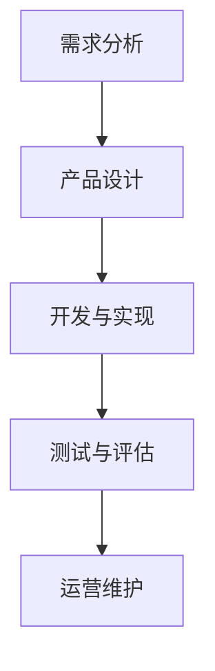

                 

### 文章标题

在快速变化的技术浪潮中，人工智能（AI）已经成为推动产品开发创新的关键力量。本文将围绕“AI辅助产品开发：加速创新周期”这一主题，深入探讨AI在现代产品开发中的应用，并分析其如何加速创新周期。我们将从背景介绍、核心概念阐述、实践应用分析、最佳实践总结及未来趋势展望等多个方面，为读者提供一幅AI辅助产品开发的全面画卷。

### 关键词

- **人工智能**
- **产品开发**
- **创新周期**
- **需求分析**
- **市场调研**
- **设计迭代**
- **测试与评估**
- **运营维护**

### 摘要

本文旨在探讨人工智能在产品开发中的应用，分析其在不同阶段如何辅助加速创新周期。通过深入研究AI的核心概念和实际应用场景，我们将揭示AI在需求分析、产品设计、测试评估以及运营维护中的潜力。同时，文章还将总结AI辅助产品开发的最佳实践，并展望其未来发展趋势，以期为产品开发者和相关领域从业者提供有价值的参考。

## 第一部分：背景与概述

### 第1章：AI辅助产品开发的起源与意义

#### 1.1.1 AI在产品开发中的角色演变

人工智能的发展历程可以追溯到20世纪50年代，但直到近年来，随着计算能力的提升和海量数据的积累，AI才在产品开发中展现出其巨大潜力。早期的AI技术主要应用于自动化和优化问题，如游戏、逻辑推理和数据分析。随着深度学习和大数据技术的发展，AI的应用场景逐渐扩展到图像识别、自然语言处理、智能推荐等领域。

在产品开发中，AI的角色也从最初的辅助工具逐步转变为核心驱动力。最初，AI被用于自动化简单的任务，如代码审查、测试用例生成等。如今，AI已经能够深入参与到需求分析、市场调研、产品设计、测试评估和运营维护的全过程中，显著提升产品开发的效率和质量。

#### 1.1.2 AI辅助产品开发的背景

AI辅助产品开发的背景主要有以下几个方面：

1. **市场需求的变化**：随着互联网的普及和用户需求的多样化和个性化，产品开发者面临着越来越大的压力，需要快速响应市场变化，提供高质量、差异化的产品。
   
2. **技术的进步**：AI技术的发展，尤其是深度学习和大数据分析，使得AI能够在更复杂的场景中发挥作用，如自然语言处理、图像识别等。

3. **竞争的加剧**：在科技快速发展的时代，市场竞争日益激烈，企业需要通过创新来保持竞争优势，而AI则为产品开发者提供了强大的工具。

4. **数据的重要性**：数据是现代产品开发的基石，AI能够通过对海量数据的分析，发现潜在的需求和趋势，为产品创新提供支持。

#### 1.1.3 AI辅助产品开发的意义与挑战

AI辅助产品开发的意义主要体现在以下几个方面：

1. **提高开发效率**：AI能够自动化和优化开发流程中的许多任务，如代码审查、测试用例生成等，从而提高开发效率。

2. **提升产品质量**：AI能够通过分析用户反馈和数据，提供针对性的改进建议，从而提升产品的用户体验和满意度。

3. **加速创新周期**：AI能够快速分析和处理大量数据，帮助开发者发现新的需求和趋势，加速产品迭代和创新。

4. **降低成本**：通过自动化和优化，AI能够降低开发和维护成本。

然而，AI辅助产品开发也面临一些挑战：

1. **数据质量**：AI的性能高度依赖于数据的质量，数据不准确或不完整可能导致错误的决策。

2. **技术成熟度**：虽然AI技术发展迅速，但某些领域的技术仍不成熟，可能影响其实际应用效果。

3. **人才短缺**：AI领域的专业人才相对短缺，可能成为限制AI应用的瓶颈。

4. **伦理和隐私**：AI的应用涉及到大量的用户数据，如何保护用户隐私和遵守伦理规范是亟待解决的问题。

#### 1.1.4 AI辅助产品开发的核心概念与框架

AI辅助产品开发的核心概念包括：

1. **机器学习**：通过训练模型，使计算机能够从数据中学习并做出预测。
   
2. **深度学习**：一种特殊类型的机器学习，通过多层神经网络模拟人脑的学习过程。
   
3. **大数据分析**：通过处理和分析大量数据，发现潜在的模式和趋势。

4. **自然语言处理**：使计算机能够理解和处理人类语言。

AI辅助产品开发的基本框架通常包括以下几个阶段：

1. **需求分析**：利用AI进行市场调研和用户需求分析。
   
2. **产品设计**：利用AI辅助工具进行原型设计和迭代优化。
   
3. **测试与评估**：利用AI进行自动化测试和性能评估。
   
4. **运营维护**：利用AI进行数据分析和用户反馈处理。

#### 1.1.5 AI辅助产品开发的流程与方法

AI辅助产品开发的流程通常包括以下几个步骤：

1. **需求分析**：使用AI技术分析市场数据和用户反馈，确定产品需求。

2. **市场调研**：通过大数据分析和自然语言处理，了解市场趋势和用户需求。

3. **产品设计**：利用AI生成设计原型，并进行迭代优化。

4. **开发与实现**：利用AI进行代码审查和测试用例生成，提高开发效率。

5. **测试与评估**：使用AI进行自动化测试和性能评估，确保产品质量。

6. **运营维护**：通过AI进行用户反馈分析和运营数据监控，持续优化产品。

### 总结

本章节概述了AI辅助产品开发的起源、背景、意义与挑战，并介绍了AI的核心概念和基本框架。接下来，我们将进一步探讨AI在产品开发中的具体应用，分析其在不同阶段的辅助作用，以及如何通过最佳实践实现产品创新的加速。

---

### 第2章：AI辅助产品开发的核心概念与框架

在深入探讨AI辅助产品开发的实际应用之前，有必要先了解AI的核心概念和基本框架。这不仅有助于我们更好地理解AI在产品开发中的作用，也能为后续章节的具体应用提供理论支持。

#### 2.1.1 AI辅助产品开发的核心概念

AI辅助产品开发的核心概念包括以下几个方面：

1. **机器学习（Machine Learning）**：机器学习是AI的基础，它通过训练模型，使计算机能够从数据中学习并做出预测。在产品开发中，机器学习可以用于需求分析、用户体验优化、自动化测试等。

2. **深度学习（Deep Learning）**：深度学习是机器学习的一种特殊类型，它通过多层神经网络模拟人脑的学习过程。深度学习在图像识别、自然语言处理等领域具有显著优势，为产品开发提供了强大的工具。

3. **大数据分析（Big Data Analysis）**：大数据分析是指通过处理和分析大量数据，发现潜在的模式和趋势。在产品开发中，大数据分析可以帮助企业更好地了解市场需求，优化产品设计。

4. **自然语言处理（Natural Language Processing，NLP）**：自然语言处理是使计算机能够理解和处理人类语言的技术。在产品开发中，NLP可以用于用户反馈分析、智能客服等。

#### 2.1.2 AI辅助产品开发的基本框架

AI辅助产品开发的基本框架通常包括以下几个阶段：

1. **需求分析**：利用AI技术进行市场调研和用户需求分析，确定产品需求。

2. **产品设计**：利用AI生成设计原型，并进行迭代优化。

3. **开发与实现**：利用AI进行代码审查和测试用例生成，提高开发效率。

4. **测试与评估**：使用AI进行自动化测试和性能评估，确保产品质量。

5. **运营维护**：通过AI进行用户反馈分析和运营数据监控，持续优化产品。

下面，我们将使用Mermaid流程图来展示AI辅助产品开发的基本框架。

#### 2.1.3 AI辅助产品开发的流程与方法

AI辅助产品开发的流程通常包括以下几个步骤：

1. **需求分析**：使用AI技术进行市场调研和用户反馈分析，确定产品需求。这一阶段可以使用自然语言处理技术分析用户评论和社交媒体数据，识别用户需求和市场趋势。

2. **市场调研**：通过大数据分析了解市场动态和竞争状况。这一阶段可以使用机器学习模型预测市场趋势，评估潜在市场的规模和机会。

3. **产品设计**：利用AI生成设计原型，并进行迭代优化。设计阶段可以使用生成对抗网络（GAN）生成产品原型，并通过用户测试和反馈进行优化。

4. **开发与实现**：利用AI进行代码审查和测试用例生成，提高开发效率。这一阶段可以使用代码审查工具检测潜在的错误和漏洞，并使用测试用例生成工具自动化测试。

5. **测试与评估**：使用AI进行自动化测试和性能评估，确保产品质量。测试阶段可以使用机器学习模型检测异常行为和性能问题，并提供优化建议。

6. **运营维护**：通过AI进行用户反馈分析和运营数据监控，持续优化产品。运营阶段可以使用NLP技术分析用户反馈，使用机器学习模型预测用户行为，并提供个性化的用户体验。

### 小结

在本章节中，我们介绍了AI辅助产品开发的核心概念和基本框架，并使用Mermaid流程图展示了AI在产品开发中的各个阶段。接下来，我们将进一步探讨AI在不同阶段的具体应用，分析其在需求分析、市场调研、产品设计、测试评估和运营维护中的实际作用。

---

## 第二部分：AI辅助产品开发的实践应用

### 第3章：AI在需求分析与市场调研中的应用

#### 3.1.1 AI在需求分析中的应用

在产品开发的过程中，需求分析是至关重要的环节。它不仅决定了产品的方向和目标，还影响了后续的整个开发流程。传统的需求分析方法通常依赖于问卷调查、用户访谈和市场研究，但这种方法存在耗时、数据不准确等问题。而AI技术的引入，极大地提高了需求分析的效率和质量。

**AI在需求分析中的应用主要包括以下几个方面：**

1. **自然语言处理（NLP）**：NLP技术可以自动分析和理解大量的文本数据，如用户评论、社交媒体帖子等。通过分析这些数据，AI可以识别出用户的需求、偏好和痛点。例如，使用NLP技术分析用户评论，可以帮助产品经理了解用户对产品的真实感受，从而更准确地确定产品需求。

2. **情感分析**：情感分析是NLP的一个子领域，它可以识别文本中的情感倾向，如正面、负面或中立。在需求分析中，情感分析可以帮助产品经理了解用户对产品的情绪反应，从而调整产品策略。例如，如果大多数用户评论中的情感倾向是负面的，那么可能需要改进产品的某些功能。

3. **文本分类与聚类**：文本分类和聚类技术可以将大量的用户评论和反馈进行分类和分组，帮助产品经理快速识别出主要的用户需求和问题。通过这种方式，产品经理可以更有效地分配资源，解决最紧迫的问题。

4. **机器学习模型**：机器学习模型可以用于预测用户需求和市场趋势。例如，通过分析历史数据，可以预测未来某一时间段内用户对某一功能的偏好，从而提前进行产品规划和优化。

**实例分析：AI辅助产品需求分析**

例如，某智能家居公司希望通过AI技术来分析用户对智能家居设备的需求。他们使用自然语言处理技术分析用户在社交媒体上的评论和反馈，识别出用户对设备功能、易用性、价格等方面的需求。通过情感分析，他们发现用户对设备的操作便捷性和智能性有较高的期望。基于这些分析结果，公司决定优化设备的人机交互界面，增加智能语音控制功能，并调整产品定价策略，以更好地满足用户需求。

#### 3.1.2 AI在市场调研中的应用

市场调研是产品开发过程中另一个关键环节。它不仅帮助产品经理了解市场需求，还为产品定位和市场推广提供依据。AI技术在市场调研中的应用，可以大幅提升数据收集和分析的效率。

**AI在市场调研中的应用主要包括以下几个方面：**

1. **大数据分析**：通过收集和分析海量的市场数据，AI可以帮助产品经理了解市场的规模、增长趋势和竞争状况。例如，使用大数据分析技术，可以预测某一时间段内某一市场的需求量和潜在客户数量。

2. **市场预测模型**：基于历史数据和现有趋势，机器学习模型可以预测未来市场的变化。这对于产品经理制定长期规划和战略决策至关重要。例如，通过市场预测模型，可以预测某一新产品在市场上的销售量和市场占有率。

3. **竞争对手分析**：AI可以自动收集和分析竞争对手的市场策略、产品功能和用户反馈，帮助产品经理了解竞争对手的优势和劣势，从而制定更有针对性的产品策略。

4. **消费者行为分析**：通过分析消费者的购买历史、搜索行为和社交媒体互动，AI可以帮助产品经理了解消费者的行为模式和偏好，从而优化产品设计和市场推广策略。

**实例分析：AI辅助市场调研**

例如，一家电子商务公司希望通过AI技术来分析市场需求和消费者行为。他们使用大数据分析技术收集和分析用户在网站上的行为数据，如浏览、搜索和购买记录。通过机器学习模型，他们预测了未来几个月内用户对某些商品的需求量，并调整了库存策略。此外，他们通过分析消费者的社交媒体互动，了解用户的兴趣和偏好，从而优化了商品推荐算法，提高了用户的购买转化率。

#### 3.1.3 AI辅助产品需求分析与市场调研的整合

在产品开发过程中，需求分析和市场调研并不是孤立进行的，而是相互关联、相互补充的。AI技术的引入，可以将两者整合在一起，形成一套完整的产品开发流程。

**整合方法包括：**

1. **数据融合**：将用户反馈和市场数据融合在一起，形成更全面的数据集，从而提高分析结果的准确性。

2. **跨领域分析**：通过跨领域的数据分析，可以从多个角度了解市场需求和消费者行为。例如，将用户反馈与市场趋势相结合，可以更准确地预测用户需求。

3. **动态调整**：基于实时数据分析和市场预测，产品经理可以动态调整产品需求和策略，以快速响应市场变化。

4. **迭代优化**：通过持续的需求分析和市场调研，产品经理可以不断优化产品设计和市场推广策略，实现产品与市场的最佳匹配。

### 小结

在本章节中，我们探讨了AI在需求分析和市场调研中的应用，介绍了NLP、情感分析、文本分类与聚类、大数据分析、市场预测模型等具体技术，并通过实例分析了AI如何辅助产品需求分析和市场调研。接下来，我们将深入探讨AI在产品设计阶段的应用，分析如何利用AI工具进行产品设计和迭代优化。

---

### 第4章：AI在产品设计阶段的应用

在产品开发的过程中，设计阶段是决定产品成败的关键环节。传统的产品设计方法主要依赖于设计师的创造力和经验，但这种方法存在一定的局限性。AI技术的引入，为产品设计提供了全新的工具和方法，使设计师能够更高效地创造和创新。

#### 4.1.1 AI在产品设计中的辅助工具

AI在产品设计中的应用，主要依赖于以下几种辅助工具：

1. **生成对抗网络（GAN）**：GAN是一种深度学习模型，它可以生成逼真的图像和设计原型。通过GAN，设计师可以快速生成大量的设计选项，从中挑选出最符合用户需求和品牌形象的作品。

2. **设计优化算法**：设计优化算法利用数学模型和优化技术，对设计参数进行调整，以实现设计目标。例如，通过遗传算法，设计师可以优化产品的形状、结构、材质等，使其达到最优性能。

3. **自然语言处理（NLP）**：NLP技术可以用于设计文档和用户反馈的分析，帮助设计师更好地理解用户需求和市场趋势，从而进行更精准的设计。

4. **人机协作工具**：人机协作工具结合了AI和设计师的创造力，使两者能够共同工作，提高设计效率。例如，AI可以自动生成设计建议，而设计师则根据这些建议进行修改和优化。

#### 4.1.2 AI在产品设计优化中的应用

AI在产品设计优化中的应用，主要体现在以下几个方面：

1. **形状优化**：通过AI算法，可以对产品的形状进行优化，使其更符合人体工程学和美学要求。例如，在设计手机壳时，AI可以自动调整形状，使其更适合手掌握持。

2. **结构优化**：AI可以分析产品的结构强度、材料性能等因素，优化产品的结构设计，提高其耐用性和安全性。例如，在设计汽车时，AI可以优化车架结构，降低重量，提高燃油效率。

3. **用户体验优化**：AI可以分析用户反馈和行为数据，优化产品的交互设计和用户体验。例如，在软件应用中，AI可以自动调整界面布局和功能模块，使其更符合用户的使用习惯。

4. **成本优化**：通过AI算法，可以对产品的成本进行优化，减少不必要的材料消耗和制造成本。例如，在设计电子产品时，AI可以优化电路板布局，减少材料使用，降低生产成本。

#### 4.1.3 实例分析：AI辅助产品原型设计与迭代

为了更好地理解AI在产品设计中的应用，下面我们通过一个实际案例进行分析。

**案例：智能手环设计**

某科技公司希望开发一款智能手环，它需要具备健康监测、运动追踪、智能通知等功能。为了设计这款产品，公司决定使用AI技术进行辅助设计。

**1. 初步设计**：

首先，设计师使用GAN生成了一系列手环的设计原型。通过调整GAN模型的参数，设计师得到了不同风格和功能的手环设计。这些设计原型包括不同的外观、颜色和功能模块。

**2. 用户反馈收集**：

接下来，设计师将这些建议原型展示给潜在用户，收集他们的反馈。通过NLP技术，设计师分析了用户的评论和反馈，识别出用户对功能、外观和用户体验的需求。

**3. 设计优化**：

根据用户反馈，设计师对原型进行了多次迭代优化。通过设计优化算法，设计师调整了手环的形状、材质和功能布局，使其更符合用户需求。例如，他们增加了智能通知功能，优化了界面布局，提高了用户体验。

**4. 成本分析**：

在优化设计的同时，设计师还使用了AI算法对成本进行了分析。通过分析材料成本、制造成本和供应链数据，设计师找到了成本优化的机会，如减少材料使用、优化生产流程等。

**5. 最终设计**：

经过多轮优化和用户反馈测试，最终设计得到了确定。这款智能手环不仅满足了用户需求，还具有成本效益，为公司带来了显著的市场竞争力。

通过这个案例，我们可以看到，AI技术在产品设计中的应用，不仅提高了设计效率，还优化了用户体验和成本。这不仅有助于产品开发者更快地推向市场，还能在激烈的市场竞争中脱颖而出。

### 小结

在本章节中，我们探讨了AI在产品设计阶段的应用，介绍了GAN、设计优化算法、NLP和人机协作工具等辅助工具，并通过实例分析了AI如何辅助产品原型设计和迭代。接下来，我们将深入探讨AI在产品测试与评估中的应用，分析如何利用AI技术提高产品质量和性能。

---

### 第5章：AI在产品测试与评估中的应用

在产品开发的最后阶段，测试与评估是确保产品质量和性能的关键环节。传统的测试方法通常依赖于人工编写测试用例和手动执行测试，这种方法不仅耗时耗力，而且容易漏掉潜在的缺陷。随着AI技术的发展，AI在产品测试与评估中的应用日益广泛，显著提高了测试效率和准确性。

#### 5.1.1 AI在产品测试中的辅助手段

AI在产品测试中的应用，主要包括以下几种辅助手段：

1. **自动化测试**：传统的自动化测试工具可以执行重复性的测试任务，但AI可以进一步优化自动化测试。通过机器学习，AI可以分析历史测试数据，自动生成测试用例，并根据测试结果调整测试策略。

2. **异常检测**：AI算法可以分析测试数据，识别出异常行为和潜在的缺陷。例如，通过监督学习模型，AI可以检测到程序运行中的异常行为，如内存泄漏或性能问题。

3. **性能评估**：AI可以帮助评估产品的性能，如响应时间、吞吐量等。通过机器学习模型，AI可以预测产品在不同负载条件下的性能表现，并提供优化建议。

4. **代码审查**：AI可以通过自然语言处理和代码分析技术，自动审查代码质量和安全性。例如，AI可以检测代码中的潜在漏洞和不良实践，并提供修复建议。

#### 5.1.2 AI在产品评估中的应用

AI在产品评估中的应用，主要体现在以下几个方面：

1. **用户体验评估**：通过分析用户的行为数据，AI可以评估产品的用户体验。例如，AI可以跟踪用户在应用中的操作路径和停留时间，识别出用户体验中的问题。

2. **功能测试**：AI可以自动执行功能测试，验证产品的功能是否按照预期工作。通过深度学习模型，AI可以模拟用户操作，并识别出功能缺陷。

3. **性能测试**：AI可以帮助进行性能测试，评估产品在不同负载条件下的性能表现。通过强化学习模型，AI可以模拟不同的负载场景，并调整测试参数以获取更准确的性能评估结果。

4. **安全性评估**：AI可以通过分析代码和测试数据，评估产品的安全性。例如，AI可以检测代码中的潜在安全漏洞，并提供修复建议。

#### 5.1.3 实例分析：AI辅助产品测试与性能评估

为了更好地理解AI在产品测试与评估中的应用，下面我们通过一个实际案例进行分析。

**案例：Web应用性能测试**

某科技公司开发了一款Web应用，希望确保其高性能和高可用性。为了进行性能测试，他们决定使用AI技术进行辅助测试。

**1. 初步测试设计**：

首先，测试团队收集了Web应用的历史性能数据，如响应时间、吞吐量等。他们使用这些数据训练了一个机器学习模型，用于预测不同负载条件下的性能表现。

**2. 自动化测试脚本生成**：

基于历史性能数据，机器学习模型自动生成了多个测试脚本，用于模拟不同的负载场景。这些测试脚本涵盖了不同的用户行为和操作路径，确保全面测试Web应用的功能和性能。

**3. 异常检测**：

在测试过程中，AI算法对测试数据进行实时分析，识别出异常行为和潜在的缺陷。例如，如果某个页面的响应时间明显低于预期，AI会标记该页面并进行进一步分析。

**4. 性能评估**：

通过实时分析测试数据，AI模型评估了Web应用在不同负载条件下的性能表现。它提供了性能评估报告，包括关键性能指标、瓶颈分析和优化建议。

**5. 用户体验评估**：

AI算法还分析了用户在Web应用中的行为数据，如页面停留时间、操作路径等，评估了用户体验。基于这些分析结果，测试团队调整了部分界面布局和功能模块，以优化用户体验。

**6. 安全性评估**：

AI通过对代码和测试数据的分析，评估了Web应用的安全性。它检测到了一些潜在的安全漏洞，如SQL注入和XSS攻击，并提供了解决方案。

通过这个案例，我们可以看到，AI技术在产品测试与评估中的应用，不仅提高了测试效率和准确性，还提供了全面的性能和安全评估。这不仅有助于确保产品的质量，还能在产品发布前发现并修复潜在的问题，提高用户满意度和市场竞争力。

### 小结

在本章节中，我们探讨了AI在产品测试与评估中的应用，介绍了自动化测试、异常检测、性能评估、用户体验评估和安全性评估等具体技术，并通过实例分析了AI如何辅助产品测试与性能评估。接下来，我们将深入探讨AI在产品发布与运营维护中的应用，分析如何利用AI技术优化产品发布和运营。

---

### 第6章：AI在产品发布与运营维护中的应用

产品发布与运营维护是产品生命周期中至关重要的环节，直接关系到产品的市场表现和用户满意度。随着AI技术的不断发展，AI在产品发布与运营维护中的应用越来越广泛，为产品开发者提供了强大的工具和支持。

#### 6.1.1 AI在产品发布中的应用

AI在产品发布中的应用主要体现在以下几个方面：

1. **发布策略优化**：AI可以通过分析市场数据和用户行为，优化产品的发布策略。例如，AI可以预测产品在特定时间段内的市场表现，帮助产品开发者选择最佳的发布时间。

2. **市场需求预测**：基于历史数据和当前趋势，AI可以预测产品的市场需求。这有助于产品开发者制定合理的生产和库存计划，避免资源浪费。

3. **市场推广优化**：AI可以分析用户数据和行为，优化市场推广策略。例如，通过自然语言处理技术，AI可以识别出潜在的目标用户群体，并为他们提供个性化的推广内容。

4. **用户反馈分析**：AI可以实时分析用户反馈，识别出产品发布后的潜在问题。这有助于产品开发者迅速调整产品策略，提高用户满意度。

#### 6.1.2 AI在产品运营维护中的应用

AI在产品运营维护中的应用同样具有广泛的前景：

1. **性能监控**：AI可以通过实时监控产品的性能数据，识别出潜在的性能问题。例如，AI可以检测到系统的异常负载、响应时间延长等，并提供优化建议。

2. **安全防护**：AI可以通过分析网络流量和数据访问模式，识别出潜在的安全威胁。例如，AI可以检测到SQL注入、DDoS攻击等，并及时采取措施。

3. **故障诊断与修复**：AI可以自动分析故障日志和系统数据，快速定位故障原因，并提供修复方案。这大大缩短了故障修复时间，提高了系统的稳定性。

4. **用户体验优化**：AI可以分析用户行为和反馈数据，优化产品的用户体验。例如，AI可以自动调整界面布局、功能模块等，以更好地满足用户需求。

#### 6.1.3 实例分析：AI辅助产品发布与用户反馈分析

为了更好地理解AI在产品发布与运营维护中的应用，下面我们通过一个实际案例进行分析。

**案例：电商平台的AI运营**

某大型电商平台希望通过AI技术优化其产品发布和运营维护。具体应用如下：

**1. 发布策略优化**：

平台通过AI分析用户历史购买数据和市场趋势，预测产品的市场需求。例如，AI预测到某个商品在即将到来的促销节日期间销量会大幅增加，平台提前调整了库存和生产计划，避免了库存不足或过剩的问题。

**2. 市场推广优化**：

AI通过自然语言处理技术分析用户在社交媒体上的评论和反馈，识别出潜在的目标用户群体。平台根据这些分析结果，制定了个性化的市场推广策略，提高了推广效果。

**3. 用户反馈分析**：

平台通过AI实时分析用户的购买行为、页面停留时间、反馈评论等数据，识别出用户在产品使用过程中的问题。例如，AI发现某些用户在购买后对商品的描述感到不满，平台立即调整了商品描述，提高了用户满意度。

**4. 性能监控**：

AI实时监控平台的性能数据，如服务器负载、响应时间等。当检测到性能下降时，AI会自动触发预警，并提供优化建议。例如，AI发现某个功能模块在并发访问量增加时性能较差，平台立即对代码进行了优化，提高了系统的稳定性。

**5. 安全防护**：

AI通过分析网络流量和数据访问模式，识别出潜在的安全威胁。例如，AI检测到某个IP地址频繁访问平台后台，并试图获取敏感信息，平台立即采取了安全措施，防止了数据泄露。

**6. 故障诊断与修复**：

AI自动分析故障日志和系统数据，快速定位故障原因，并提供修复方案。例如，AI发现某个服务器的硬盘容量不足，导致系统崩溃，平台立即增加了硬盘容量，恢复了系统正常运行。

**7. 用户体验优化**：

AI分析用户行为数据，优化了平台的界面布局、功能模块等。例如，AI发现某些用户在购物流程中经常遇到支付问题，平台立即调整了支付页面，提高了支付成功率。

通过这个案例，我们可以看到，AI在产品发布与运营维护中的应用，不仅提高了平台的运营效率，还优化了用户体验，提高了市场竞争力。

### 小结

在本章节中，我们探讨了AI在产品发布与运营维护中的应用，介绍了发布策略优化、市场需求预测、市场推广优化、用户反馈分析、性能监控、安全防护、故障诊断与修复和用户体验优化等具体技术，并通过实例分析了AI如何辅助产品发布与运营维护。接下来，我们将总结AI辅助产品开发的最佳实践，并探讨其未来发展趋势。

---

### 第7章：AI辅助产品开发的最佳实践

在AI辅助产品开发的实践中，许多企业已经取得了显著的成果，形成了一些值得借鉴的最佳实践。这些实践不仅提高了产品开发的效率和质量，还为其他企业提供了一套有效的指导框架。

#### 7.1.1 成功案例分析

以下是一些AI辅助产品开发的成功案例：

1. **案例一：电商平台的个性化推荐**：
   某大型电商平台通过AI技术实现了个性化推荐系统。通过分析用户的浏览历史、购买记录和行为数据，AI算法为用户推荐符合他们兴趣和需求的产品。这一系统的引入，大大提高了用户的购买转化率和满意度。

2. **案例二：金融行业的风险管理**：
   某金融公司利用AI技术对贷款申请进行风险评估。AI系统通过分析借款人的信用记录、财务状况和行为数据，快速识别出高风险借款人，提高了贷款审批的准确性和效率。

3. **案例三：制造企业的质量监控**：
   某制造企业通过AI技术实现了生产线的实时质量监控。AI系统通过分析生产数据，实时检测出产品质量问题，并自动调整生产参数，提高了生产效率和产品质量。

#### 7.1.2 最佳实践总结

基于以上成功案例，以下是AI辅助产品开发的最佳实践总结：

1. **数据驱动决策**：企业应充分利用数据资源，通过大数据分析和机器学习模型，进行市场预测、用户需求分析和产品优化。

2. **敏捷开发**：采用敏捷开发方法，快速迭代和优化产品。AI技术可以帮助企业实现更高效的敏捷开发流程。

3. **人机协作**：充分利用AI技术和人力优势，实现人机协作。设计师、开发人员和数据科学家可以共同工作，发挥各自的专业能力。

4. **持续监控与优化**：建立持续监控和优化的机制，实时分析产品性能、用户体验和安全问题，及时调整产品策略。

5. **遵守伦理规范**：在AI应用中，应严格遵守伦理规范，保护用户隐私和数据安全。

#### 7.1.3 注意事项与风险防范

虽然AI技术在产品开发中具有巨大的潜力，但企业在应用过程中也需注意以下几点：

1. **数据质量**：确保数据准确和完整，避免数据错误影响AI模型的性能。

2. **模型解释性**：AI模型应具备一定的解释性，便于企业理解和信任。

3. **技术成熟度**：评估AI技术的成熟度，避免应用不成熟的技术导致失败。

4. **人才短缺**：加强AI领域的人才培养，缓解专业人才短缺的问题。

5. **风险管理**：建立风险管理机制，预防潜在的技术风险和业务风险。

通过遵循这些最佳实践和注意事项，企业可以更好地利用AI技术，加速产品开发创新，提高市场竞争力。

### 小结

在本章节中，我们通过成功案例和最佳实践总结，探讨了AI辅助产品开发的有效方法。接下来，我们将探讨AI辅助产品开发的未来趋势，分析其潜在的发展方向和挑战。

---

### 第8章：AI辅助产品开发的未来趋势与展望

随着AI技术的不断进步，AI辅助产品开发的领域也在迅速扩展，其应用场景和影响力不断加深。展望未来，AI在产品开发中的应用前景广阔，将带来深远的变革。

#### 8.1.1 AI技术的发展趋势

AI技术的发展趋势主要表现在以下几个方面：

1. **深度学习和强化学习**：深度学习和强化学习是AI技术的核心，随着计算能力的提升和算法的优化，这些技术在AI辅助产品开发中的应用将更加广泛和深入。

2. **多模态数据处理**：未来的AI系统将能够处理多种类型的数据，如文本、图像、音频和视频，实现更全面的智能分析和应用。

3. **边缘计算**：边缘计算将AI技术扩展到设备端，实现实时数据处理和智能决策，提高AI在产品开发中的响应速度和效率。

4. **联邦学习**：联邦学习允许不同设备上的数据在本地进行训练，然后聚合模型参数，解决数据隐私和传输成本问题。

#### 8.1.2 产品开发领域的创新与应用

在产品开发领域，AI的创新和应用将主要体现在以下几个方面：

1. **智能产品设计**：通过AI生成设计原型和优化设计参数，设计师可以更快速地创建符合用户需求的产品。

2. **个性化制造**：AI技术将推动个性化制造的发展，根据用户需求定制生产，提高生产效率和市场响应速度。

3. **智能供应链管理**：AI可以优化供应链管理，预测市场需求、控制库存、提高物流效率，降低运营成本。

4. **智能质量监控**：AI技术将实现生产过程中的实时质量监控，通过异常检测和预测维护，提高产品质量和生产效率。

#### 8.1.3 AI辅助产品开发的未来前景

AI辅助产品开发的未来前景充满希望，但也面临一些挑战：

1. **技术融合**：AI与其他技术的融合，如物联网、大数据和区块链，将推动产品开发进入全新的阶段。

2. **人机协作**：AI与人类的协作将成为产品开发的主流模式，AI提供智能化支持，人类发挥创造力和决策能力。

3. **伦理与隐私**：随着AI在产品开发中的应用，如何保护用户隐私和遵守伦理规范将成为重要议题。

4. **技能升级**：产品开发者需要不断学习和适应AI技术，提升自身技能，以适应快速变化的技术环境。

总之，AI辅助产品开发具有巨大的发展潜力，将在未来推动产品开发进入智能化、个性化的新时代。企业应抓住这一机遇，积极应用AI技术，提升产品竞争力。

### 小结

在本章节中，我们探讨了AI技术的发展趋势、产品开发领域的创新应用以及AI辅助产品开发的未来前景。通过分析AI技术的进步和其在产品开发中的应用，我们可以看到，AI将不仅加速创新周期，还将为产品开发者带来更多的机遇和挑战。未来，随着技术的不断进步和应用的深化，AI辅助产品开发将继续推动行业的发展，实现更高效、更智能的产品开发模式。

