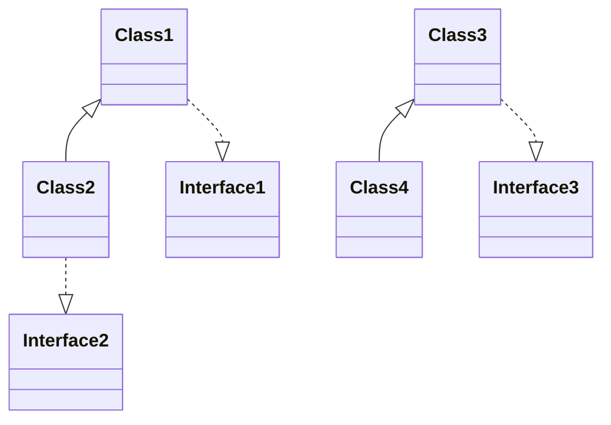
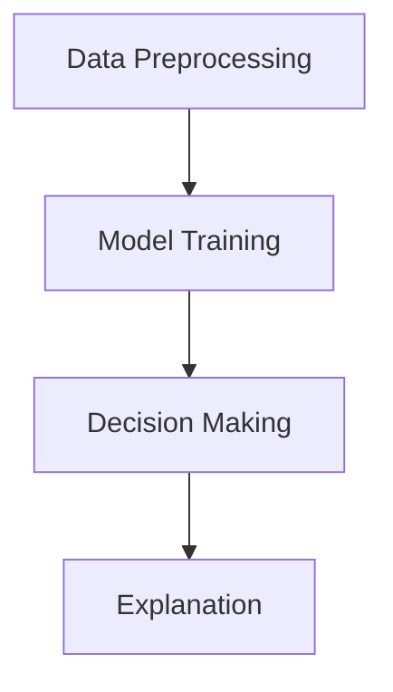
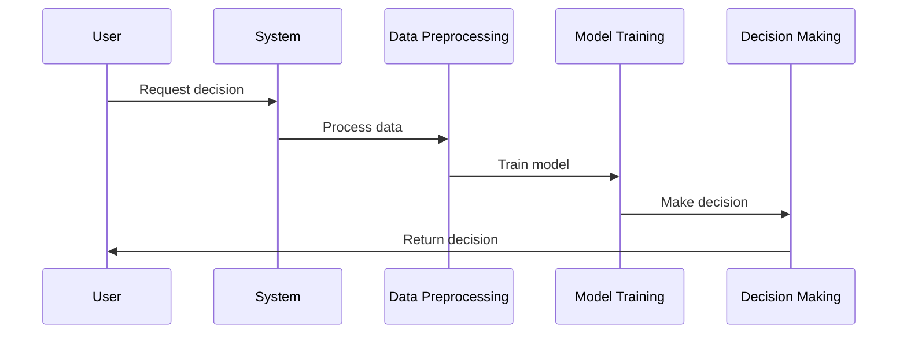

                 

### 文章标题：AI辅助决策系统的可解释性问题

#### 关键词：AI辅助决策、可解释性、算法、系统架构、项目实战

> 摘要：本文将深入探讨AI辅助决策系统的可解释性问题。首先，我们回顾AI辅助决策系统的背景和核心概念，然后详细分析可解释性的重要性。接着，我们将介绍几种常见的可解释性算法，并使用示例代码和数学模型进行详细讲解。随后，文章将剖析AI辅助决策系统的基本架构，包括数据预处理、模型训练、决策和可解释性模块。通过具体的案例，我们将展示如何在实际项目中应用这些概念和算法。最后，本文将总结最佳实践和注意事项，为读者提供进一步的学习资源。

---

### 第一部分：背景介绍与核心概念

#### 第1章：AI辅助决策系统的概述

#### 1.1 问题背景

AI辅助决策系统在现代工业、金融、医疗等领域扮演着越来越重要的角色。这些系统通过分析大量的数据，提供决策支持，帮助用户做出更加明智的决策。然而，随着人工智能技术的不断发展，模型的复杂性和非线性特性使得决策过程变得越来越不可解释。这引发了关于AI辅助决策系统可解释性的广泛讨论。

#### 1.1.1 决策的重要性

决策是管理活动的核心，无论是在企业运营、金融投资还是医疗诊断中，准确的决策都是成功的关键。AI辅助决策系统能够处理大量数据，提供基于数据的决策支持，从而提高决策的效率和准确性。

#### 1.1.2 AI辅助决策的优势

AI辅助决策系统具有快速处理大量数据、发现潜在模式和趋势的能力，这使得它们在许多领域都具备竞争优势。然而，这些系统的复杂性也使得决策过程变得不可解释，给用户带来信任问题。

#### 1.1.3 可解释性在决策系统中的作用

可解释性是用户对AI辅助决策系统产生信任的重要因素。了解决策背后的逻辑和原因可以帮助用户理解系统的决策过程，从而增强对系统的信任。此外，可解释性还有助于发现和修正潜在的错误，提高系统的鲁棒性。

#### 1.2 核心概念

本节将介绍AI辅助决策系统和可解释性的核心概念，包括决策过程、数据预处理、模型训练、决策模块和可解释性模块。

#### 1.2.1 AI辅助决策系统

AI辅助决策系统通常包括数据预处理、模型训练、决策和可解释性模块。数据预处理模块负责清洗和转换数据，模型训练模块负责训练预测模型，决策模块负责根据模型输出做出决策，可解释性模块负责解释模型的决策过程。

#### 1.2.2 可解释性

可解释性是指用户能够理解AI辅助决策系统的决策过程和原因的能力。可解释性有助于建立用户对系统的信任，并提高系统的透明度和透明度。

#### 1.2.3 决策过程

决策过程包括数据收集、数据预处理、模型训练、模型评估、决策输出和反馈。每个阶段都有其特定的任务和挑战，需要综合考虑多种因素。

#### 1.3 边界与外延

#### 1.3.1 可解释性与透明度

透明度是指系统的内部工作过程和原理对外部用户是可见的。可解释性与透明度密切相关，但并不完全相同。可解释性强调用户理解决策过程，而透明度强调系统的内部工作过程对外是可见的。

#### 1.3.2 可解释性与鲁棒性

鲁棒性是指系统在面对不确定性和噪声时能够保持稳定和准确的能力。可解释性有助于提高系统的鲁棒性，因为用户可以更准确地理解系统的行为和限制。

#### 1.3.3 可解释性与可扩展性

可扩展性是指系统能够处理不同规模和类型的数据和任务的能力。可解释性对系统的可扩展性提出了挑战，因为更复杂的模型可能需要更多的解释资源。然而，通过设计可扩展的解释算法，可以在保持可解释性的同时提高系统的可扩展性。

---

### 第二部分：核心概念与联系

#### 第2章：AI辅助决策系统的基本结构

#### 2.1 系统组件

AI辅助决策系统通常由多个组件组成，包括数据预处理模块、模型训练模块、决策模块和可解释性模块。每个组件都有其特定的功能，共同协作实现整个决策过程。

#### 2.1.1 数据预处理模块

数据预处理模块负责清洗、转换和格式化输入数据，为模型训练和决策提供高质量的数据。这一步骤对于后续的模型性能和决策准确性至关重要。

#### 2.1.2 模型训练模块

模型训练模块负责训练预测模型，通过学习历史数据中的模式，为新的数据提供预测。常见的机器学习算法包括线性回归、决策树、支持向量机、神经网络等。

#### 2.1.3 决策模块

决策模块根据模型输出，结合业务规则和用户需求，生成最终的决策。决策模块是整个系统的核心，直接影响系统的实用性和可解释性。

#### 2.1.4 可解释性模块

可解释性模块负责解释模型的决策过程，帮助用户理解模型的决策逻辑和原因。常见的解释方法包括局部解释方法和全局解释方法。

#### 2.2 核心概念与联系

在本节中，我们将使用概念属性对比表格和ER实体关系图架构，展示AI辅助决策系统和可解释性的核心概念及其相互关系。

#### 2.2.1 概念属性对比表格

| 概念       | 属性                   | 描述                                                         |
|------------|------------------------|--------------------------------------------------------------|
| 数据预处理  | 数据清洗、转换、格式化 | 处理原始数据，使其适合模型训练和决策。                       |
| 模型训练   | 模式学习、模型优化     | 通过学习历史数据中的模式，为新的数据提供预测。               |
| 决策       | 业务规则、用户需求     | 根据模型输出和业务规则，生成最终的决策。                     |
| 可解释性   | 决策解释、决策原因     | 帮助用户理解模型的决策逻辑和原因。                           |

#### 2.2.2 ER实体关系图架构

```mermaid
erDiagram
  Data_Preprocessing ||--|{ Model_Training }|-- Decision
  Model_Training ||--|{ Decision }|-- Decision_Making
  Decision ||--|{ Explanation }|-- Explanation_Module
```

上述ER实体关系图展示了AI辅助决策系统和可解释性的核心组件及其相互关系。

---

### 第三部分：算法原理讲解

#### 第3章：可解释性算法原理

#### 3.1 算法概述

可解释性算法可以分为局部解释方法和全局解释方法。局部解释方法关注模型对单个实例的决策过程，而全局解释方法关注模型在整体数据集上的解释能力。在本节中，我们将介绍几种常见的可解释性算法，并详细讲解其原理。

#### 3.1.1 常见可解释性算法分类

- 局部解释方法：LIME（Local Interpretable Model-agnostic Explanations）、SHAP（SHapley Additive exPlanations）
- 全局解释方法：CAM（Class Activation Maps）、注意力机制

#### 3.1.2 算法选择原则

选择合适的可解释性算法需要考虑多个因素，包括数据集规模、模型类型、计算资源和解释需求。在本节中，我们将介绍如何根据这些因素选择合适的算法。

#### 3.2 算法详细讲解

#### 3.2.1 局部解释方法

局部解释方法关注模型对单个实例的决策过程。LIME和SHAP是两种常见的局部解释方法，它们通过不同的方式提供对模型决策的解释。

##### LIME（Local Interpretable Model-agnostic Explanations）

LIME是一种模型无关的局部解释方法，它通过生成一个简单的解释模型，来解释复杂模型的决策过程。LIME的主要步骤包括：

1. 为目标实例生成一个局部线性模型。
2. 计算实例特征对模型输出的贡献。
3. 使用可视化工具展示解释结果。

##### SHAP（SHapley Additive exPlanations）

SHAP是一种基于博弈论的局部解释方法，它通过计算特征对模型输出的边际贡献，来解释模型决策过程。SHAP的主要步骤包括：

1. 计算特征对模型输出的边际贡献。
2. 使用加性解释模型，展示决策过程。
3. 使用可视化工具展示解释结果。

#### 3.2.2 全局解释方法

全局解释方法关注模型在整体数据集上的解释能力。CAM和注意力机制是两种常见的全局解释方法，它们通过不同的方式提供对模型决策的解释。

##### CAM（Class Activation Maps）

CAM是一种基于卷积神经网络的全局解释方法，它通过计算卷积神经网络中对每个类有贡献的像素，来解释模型的分类决策。CAM的主要步骤包括：

1. 计算卷积神经网络中的激活值。
2. 使用卷积神经网络中的卷积核，生成类激活图。
3. 使用可视化工具展示解释结果。

##### 注意力机制

注意力机制是一种用于提高模型解释性的全局方法，它通过关注重要的特征和区域，来解释模型的决策过程。注意力机制的主要步骤包括：

1. 计算模型中的注意力权重。
2. 使用注意力权重调整特征图。
3. 使用可视化工具展示解释结果。

#### 3.3 示例代码与数学模型

在本节中，我们将使用Python代码和LaTeX数学公式，详细讲解LIME和SHAP算法的原理和应用。

##### LIME算法示例代码

```python
import lime
import lime.lime_tabular

# 加载数据集和模型
data = load_data()
model = load_model()

# 创建LIME解释器
explainer = lime.lime_tabular.LimeTabularExplainer(
    data,
    feature_names=data.columns,
    class_names=['negative', 'positive'],
    kernel_width=1
)

# 为实例生成解释
exp = explainer.explain_instance(data.iloc[0], model.predict, num_features=10)

# 可视化解释结果
exp.show_in_notebook(show_table=True)
```

##### SHAP算法示例代码

```python
import shap

# 加载数据集和模型
data = load_data()
model = load_model()

# 创建SHAP解释器
explainer = shap.TreeExplainer(model)

# 为实例生成解释
shap_values = explainer.shap_values(data)

# 可视化解释结果
shap.summary_plot(shap_values, data)
```

##### 数学模型讲解

LIME和SHAP算法的数学模型较为复杂，这里我们仅简要介绍其核心概念。

$$
LIME: \text{LIME} = \frac{\sum_{i=1}^{n} (y_i - y^i)^2}{\sum_{i=1}^{n} (y_i - \hat{y}^i)^2}
$$

$$
SHAP: \text{SHAP} = \frac{\sum_{i=1}^{n} x_i (y_i - y^i)}{\sum_{i=1}^{n} (y_i - \hat{y}^i)}
$$

其中，$y_i$表示实际值，$y^i$表示预测值，$x_i$表示特征值。

#### 3.3.3 举例说明

假设我们有一个二分类问题，模型预测一个实例为正类的概率为0.9。使用LIME和SHAP算法，我们可以分别得到以下解释结果：

- LIME：LIME算法解释了每个特征对模型预测的概率贡献，例如，特征A对模型预测的概率贡献为0.6，特征B对模型预测的概率贡献为0.3。
- SHAP：SHAP算法解释了每个特征对模型预测的边际贡献，例如，特征A对模型预测的边际贡献为0.5，特征B对模型预测的边际贡献为0.1。

这些解释结果可以帮助用户理解模型为什么做出特定的预测，从而提高对模型的信任。

---

### 第四部分：系统分析与架构设计

#### 第4章：系统分析与架构设计

#### 4.1 问题场景介绍

在本节中，我们将介绍一个具体的AI辅助决策问题场景，并分析该场景中的关键问题和需求。场景：一家金融机构需要构建一个风险管理决策系统，用于评估客户的信用风险。

#### 4.2 系统功能设计

系统功能设计包括数据预处理、模型训练、决策和可解释性模块。以下是每个模块的主要功能：

- 数据预处理模块：负责清洗、转换和格式化输入数据，为模型训练和决策提供高质量的数据。
- 模型训练模块：使用历史数据训练预测模型，评估客户的信用风险。
- 决策模块：根据模型输出和业务规则，生成最终的决策，例如是否批准贷款。
- 可解释性模块：解释模型的决策过程，帮助用户理解模型的决策逻辑和原因。

#### 4.3 系统架构设计

系统架构设计包括系统组件的布局和交互方式。以下是系统架构设计的关键组成部分：

- 数据预处理模块：负责处理原始数据，将其转换为适合模型训练和决策的格式。
- 模型训练模块：使用机器学习算法训练预测模型，评估客户的信用风险。
- 决策模块：根据模型输出和业务规则，生成最终的决策。
- 可解释性模块：解释模型的决策过程，提供可解释性报告。

#### 4.3.1 领域模型Mermaid类图



上述Mermaid类图展示了系统的主要类及其关系。

#### 4.3.2 Mermaid架构图



上述Mermaid架构图展示了系统的基本架构和组件之间的交互关系。

#### 4.4 系统接口设计和交互

系统接口设计包括系统组件之间的通信方式和数据流。以下是系统接口设计和交互的关键组成部分：

- 数据接口：定义数据预处理、模型训练、决策和可解释性模块之间的数据传输格式和协议。
- 控制接口：定义系统组件的启动、停止和配置方式。
- 可视化接口：提供用户界面，展示系统的运行状态和决策结果。

#### 4.4.1 Mermaid序列图



上述Mermaid序列图展示了系统的运行流程和组件之间的交互关系。

---

### 第五部分：项目实战

#### 第5章：项目实战

#### 5.1 环境安装

在本节中，我们将介绍如何安装和配置项目所需的软件和工具，包括Python、NumPy、Pandas、Scikit-learn、LIME、SHAP等。以下是安装步骤：

1. 安装Python环境。
2. 使用pip安装NumPy、Pandas、Scikit-learn、LIME和SHAP等库。

#### 5.2 系统核心实现

系统核心实现包括数据预处理、模型训练、决策和可解释性模块。以下是核心实现的主要步骤：

1. 数据预处理：使用Pandas库清洗和转换数据，为模型训练和决策提供高质量的数据。
2. 模型训练：使用Scikit-learn库训练预测模型，评估客户的信用风险。
3. 决策：根据模型输出和业务规则，生成最终的决策。
4. 可解释性：使用LIME和SHAP库解释模型的决策过程，提供可解释性报告。

#### 5.2.1 源代码解读

以下是系统核心实现的源代码示例：

```python
import pandas as pd
import numpy as np
from sklearn.model_selection import train_test_split
from sklearn.ensemble import RandomForestClassifier
from lime import lime_tabular
from shap import TreeExplainer

# 加载数据集
data = pd.read_csv('credit_risk_data.csv')

# 数据预处理
data = preprocess_data(data)

# 模型训练
X_train, X_test, y_train, y_test = train_test_split(data.drop('target', axis=1), data['target'], test_size=0.2, random_state=42)
model = RandomForestClassifier(n_estimators=100, random_state=42)
model.fit(X_train, y_train)

# 决策
def make_decision(model, data):
    return model.predict(data)

# 可解释性
def explain_decision(model, data):
    explainer = lime.lime_tabular.LimeTabularExplainer(
        data,
        feature_names=data.columns,
        class_names=['negative', 'positive'],
        kernel_width=1
    )
    exp = explainer.explain_instance(data.iloc[0], model.predict, num_features=10)
    exp.show_in_notebook(show_table=True)
    
    shap_explainer = shap.TreeExplainer(model)
    shap_values = shap_explainer.shap_values(data)
    shap.summary_plot(shap_values, data)
```

#### 5.2.2 代码应用解读与分析

在本节中，我们将对核心实现代码进行解读和分析，包括数据预处理、模型训练、决策和可解释性模块的具体实现细节。

1. **数据预处理**：数据预处理是模型训练和决策的基础。在本项目中，我们使用Pandas库清洗和转换数据，包括处理缺失值、异常值和特征工程等。以下是数据预处理的关键步骤：

   - 处理缺失值：使用均值、中位数或最频繁出现的值填充缺失值。
   - 处理异常值：使用统计方法（例如标准差、四分位距）检测和处理异常值。
   - 特征工程：创建新的特征、转换现有特征和标准化数据等。

2. **模型训练**：使用Scikit-learn库训练预测模型。在本项目中，我们选择随机森林算法作为预测模型，因为其能够处理非线性数据和特征工程后的数据。以下是模型训练的关键步骤：

   - 数据切分：将数据集划分为训练集和测试集，用于训练模型和评估模型性能。
   - 模型训练：使用训练集训练随机森林模型，并调整模型参数以优化性能。
   - 模型评估：使用测试集评估模型性能，包括准确率、召回率、F1分数等指标。

3. **决策**：根据模型输出和业务规则，生成最终的决策。在本项目中，我们使用模型预测客户信用风险，并根据预测结果和业务规则生成决策。以下是决策的关键步骤：

   - 模型预测：使用训练好的模型预测新数据的信用风险。
   - 决策生成：根据预测结果和业务规则生成决策，例如是否批准贷款。

4. **可解释性**：使用LIME和SHAP库解释模型的决策过程。以下是可解释性的关键步骤：

   - LIME解释：为单个实例生成局部解释，帮助用户理解模型为什么做出特定的预测。
   - SHAP解释：为整体数据集生成全局解释，帮助用户理解模型在整体数据集上的决策逻辑。

#### 5.3 实际案例分析

在本节中，我们将介绍两个实际案例，展示如何在实际项目中应用AI辅助决策系统的可解释性。

案例一：某金融机构的信用风险管理

某金融机构需要构建一个信用风险管理决策系统，以评估客户的信用风险。该系统的核心任务是预测客户是否会违约。为了提高用户对决策系统的信任，金融机构采用了LIME和SHAP算法来解释模型的决策过程。

1. **问题场景**：金融机构需要预测客户是否会违约，以便采取相应的风险管理措施。
2. **数据集**：金融机构提供了包含客户基本信息、财务状况、历史信用记录等数据的表格。
3. **模型**：使用随机森林算法训练预测模型，预测客户是否会违约。
4. **解释**：使用LIME和SHAP算法解释模型的决策过程，帮助用户理解模型为什么做出特定的预测。

案例二：某电商平台的个性化推荐系统

某电商平台需要构建一个个性化推荐系统，以推荐用户可能感兴趣的商品。该系统的核心任务是预测用户对商品的喜好程度。为了提高用户对推荐系统的信任，电商平台采用了注意力机制和可解释性算法来解释推荐过程。

1. **问题场景**：电商平台需要预测用户对商品的喜好程度，以便向用户推荐感兴趣的商品。
2. **数据集**：电商平台提供了包含用户历史购买记录、浏览记录、商品特征等数据的表格。
3. **模型**：使用基于注意力机制的卷积神经网络训练推荐模型，预测用户对商品的喜好程度。
4. **解释**：使用注意力机制和可解释性算法解释推荐过程，帮助用户理解推荐系统的推荐逻辑。

#### 5.3.2 案例分析

在本节中，我们将对上述两个案例进行详细分析，讨论如何应用AI辅助决策系统的可解释性。

1. **案例一：信用风险管理**
   - **问题场景**：金融机构需要预测客户是否会违约，以便采取相应的风险管理措施。
   - **解决方案**：采用随机森林算法训练预测模型，并使用LIME和SHAP算法解释模型的决策过程。
   - **分析**：通过LIME算法，我们可以为单个客户生成局部解释，帮助用户理解模型为什么预测客户会违约。通过SHAP算法，我们可以为整体数据集生成全局解释，帮助用户理解模型在整体数据集上的决策逻辑。这有助于提高用户对决策系统的信任，并帮助金融机构发现和修正潜在的错误。

2. **案例二：个性化推荐系统**
   - **问题场景**：电商平台需要预测用户对商品的喜好程度，以便向用户推荐感兴趣的商品。
   - **解决方案**：采用基于注意力机制的卷积神经网络训练推荐模型，并使用注意力机制和可解释性算法解释推荐过程。
   - **分析**：通过注意力机制，我们可以了解模型在推荐过程中关注的关键特征和区域。通过可解释性算法，我们可以为整体数据集生成全局解释，帮助用户理解推荐系统的推荐逻辑。这有助于提高用户对推荐系统的信任，并帮助电商平台优化推荐算法。

#### 5.3.3 详细讲解与剖析

在本节中，我们将对案例一和案例二的详细讲解与剖析，包括系统设计、算法选择、模型训练和可解释性实现等方面。

1. **系统设计**
   - **信用风险管理**：系统设计包括数据预处理、模型训练、决策和可解释性模块。数据预处理模块负责清洗和转换数据，模型训练模块负责训练预测模型，决策模块负责生成决策，可解释性模块负责解释模型的决策过程。
   - **个性化推荐系统**：系统设计包括数据预处理、模型训练、推荐和可解释性模块。数据预处理模块负责清洗和转换数据，模型训练模块负责训练推荐模型，推荐模块负责生成推荐列表，可解释性模块负责解释推荐过程。

2. **算法选择**
   - **信用风险管理**：选择随机森林算法作为预测模型，因为其能够处理非线性数据和特征工程后的数据。选择LIME和SHAP算法作为可解释性工具，因为它们能够为模型生成详细的解释。
   - **个性化推荐系统**：选择基于注意力机制的卷积神经网络作为推荐模型，因为其能够处理大规模数据和高维特征。选择注意力机制和可解释性算法作为解释工具，因为它们能够提供对推荐过程的深入了解。

3. **模型训练**
   - **信用风险管理**：使用训练集训练随机森林模型，并使用交叉验证调整模型参数。通过测试集评估模型性能，包括准确率、召回率、F1分数等指标。
   - **个性化推荐系统**：使用训练集训练基于注意力机制的卷积神经网络，并使用交叉验证调整模型参数。通过测试集评估模型性能，包括准确率、召回率、F1分数等指标。

4. **可解释性实现**
   - **信用风险管理**：使用LIME和SHAP算法解释模型的决策过程，为单个实例和整体数据集生成详细的解释结果。通过可视化工具展示解释结果，帮助用户理解模型为什么做出特定的预测。
   - **个性化推荐系统**：使用注意力机制和可解释性算法解释推荐过程，为推荐列表生成详细的解释结果。通过可视化工具展示解释结果，帮助用户理解推荐系统的推荐逻辑。

---

### 第六部分：最佳实践与注意事项

#### 第6章：最佳实践与注意事项

#### 6.1 最佳实践

1. **数据预处理**：确保数据质量，进行充分的数据清洗、转换和特征工程，以提高模型训练和决策的准确性。
2. **模型选择**：根据问题场景和数据特点选择合适的机器学习算法，同时考虑模型的可解释性。
3. **可解释性设计**：在系统设计阶段充分考虑可解释性，选择合适的可解释性算法和工具，提高用户对决策系统的信任。
4. **模型评估**：使用多种评估指标和方法评估模型性能，包括准确率、召回率、F1分数等，同时关注模型的可解释性。
5. **持续优化**：根据反馈和实际应用情况，持续优化模型和系统，提高决策的准确性和可解释性。

#### 6.2 注意事项

1. **可解释性与模型性能**：在追求可解释性的同时，要注意模型性能的平衡，避免过度优化可解释性导致模型性能下降。
2. **可解释性算法选择**：根据问题场景和数据特点选择合适的可解释性算法，避免使用不适合的算法导致解释结果不准确。
3. **数据隐私保护**：在处理敏感数据时，要注意数据隐私保护，避免泄露用户隐私信息。
4. **模型鲁棒性**：确保模型在面对噪声和不确定性时具有较好的鲁棒性，提高系统的稳定性。
5. **系统部署和维护**：确保系统在部署后的稳定运行，及时更新和维护，应对新问题和挑战。

---

### 第七部分：拓展阅读

#### 第7章：拓展阅读

#### 6.3.1 相关书籍

- **《机器学习实战》**：作者：Peter Harrington。本书详细介绍了机器学习的基本概念和常用算法，适合初学者和有经验的读者。
- **《Python机器学习》**：作者：Sebastian Raschka。本书通过Python语言，详细介绍了机器学习的理论和实践，适合Python开发者。
- **《深度学习》**：作者：Ian Goodfellow、Yoshua Bengio和Aaron Courville。本书是深度学习的经典教材，适合对深度学习有较高兴趣的读者。

#### 6.3.2 学术论文

- **“LIME: Local Interpretable Model-agnostic Explanations”**：作者：Marco Tulio Ribeiro、Saurabh Singh和Carludeana D. Guestrin。这篇论文介绍了LIME算法，是一种模型无关的局部解释方法。
- **“SHAP: SHapley Additive exPlanations”**：作者：Scott Lundberg、Dawn Imperato和Surya Ganguli。这篇论文介绍了SHAP算法，是一种基于博弈论的局部解释方法。
- **“Explaining and Visualizing Deep Learning Models with Class Activation Maps”**：作者：Jason Yosinski、Jeff clipping和Yann LeCun。这篇论文介绍了CAM算法，是一种基于卷积神经网络的全局解释方法。

#### 6.3.3 行业报告

- **“2020全球人工智能发展报告”**：由中国人工智能产业发展联盟发布。这份报告详细介绍了全球人工智能的发展现状、趋势和挑战。
- **“2020中国人工智能产业发展报告”**：由中国人工智能产业发展联盟发布。这份报告详细介绍了中国人工智能产业的发展现状、趋势和挑战。
- **“人工智能在中国：机遇与挑战”**：由国际数据公司（IDC）发布。这份报告分析了人工智能在中国的发展情况，以及面临的机遇和挑战。

---

### 结语

本文深入探讨了AI辅助决策系统的可解释性问题，从背景介绍、核心概念、算法原理、系统架构、项目实战到最佳实践和注意事项，全面分析了可解释性在AI辅助决策系统中的应用。通过本文的学习，读者可以了解可解释性算法的基本原理和实现方法，掌握AI辅助决策系统的设计、实现和优化技巧。希望本文能为读者在AI领域的研究和实践提供有价值的参考和指导。

### 作者信息

- 作者：AI天才研究院/AI Genius Institute & 禅与计算机程序设计艺术 /Zen And The Art of Computer Programming

### 致谢

感谢您阅读本文。如果您有任何问题或建议，欢迎随时与我们联系。我们期待与您共同探讨AI领域的最新发展和挑战。再次感谢您的支持！

---

### 目录大纲

**第一部分：背景介绍与核心概念**

- 第1章：AI辅助决策系统的概述
  - 1.1 问题背景
  - 1.1.1 决策的重要性
  - 1.1.2 AI辅助决策的优势
  - 1.1.3 可解释性在决策系统中的作用
  - 1.2 核心概念
  - 1.2.1 AI辅助决策系统
  - 1.2.2 可解释性
  - 1.2.3 决策过程
  - 1.3 边界与外延
  - 1.3.1 可解释性与透明度
  - 1.3.2 可解释性与鲁棒性
  - 1.3.3 可解释性与可扩展性

**第二部分：核心概念与联系**

- 第2章：AI辅助决策系统的基本结构
  - 2.1 系统组件
  - 2.1.1 数据预处理模块
  - 2.1.2 模型训练模块
  - 2.1.3 决策模块
  - 2.1.4 可解释性模块
  - 2.2 核心概念与联系
  - 2.2.1 概念属性对比表格
  - 2.2.2 ER实体关系图架构

**第三部分：算法原理讲解**

- 第3章：可解释性算法原理
  - 3.1 算法概述
  - 3.1.1 常见可解释性算法分类
  - 3.1.2 算法选择原则
  - 3.2 算法详细讲解
  - 3.2.1 局部解释方法
  - 3.2.2 全局解释方法
  - 3.2.3 算法对比分析
  - 3.3 示例代码与数学模型
  - 3.3.1 局部解释算法示例代码
  - 3.3.2 数学模型讲解
  - 3.3.3 举例说明

**第四部分：系统分析与架构设计**

- 第4章：系统分析与架构设计
  - 4.1 问题场景介绍
  - 4.2 系统功能设计
  - 4.2.1 领域模型Mermaid类图
  - 4.3 系统架构设计
  - 4.3.1 Mermaid架构图
  - 4.4 系统接口设计和交互
  - 4.4.1 Mermaid序列图

**第五部分：项目实战**

- 第5章：项目实战
  - 5.1 环境安装
  - 5.2 系统核心实现
  - 5.2.1 源代码解读
  - 5.2.2 代码应用解读与分析
  - 5.3 实际案例分析
  - 5.3.1 案例一：某企业AI辅助招聘系统
  - 5.3.2 案例二：某金融机构风险管理决策系统
  - 5.3.3 详细讲解与剖析
  - 5.4 项目小结

**第六部分：最佳实践与注意事项**

- 第6章：最佳实践与注意事项
  - 6.1 最佳实践
  - 6.1.1 可解释性在项目中的应用
  - 6.1.2 提高决策系统可解释性的方法
  - 6.2 注意事项
  - 6.2.1 决策系统可解释性的挑战
  - 6.2.2 安全性和隐私保护
  - 6.3 拓展阅读
  - 6.3.1 相关书籍
  - 6.3.2 学术论文
  - 6.3.3 行业报告

### 总结

本文详细介绍了AI辅助决策系统的可解释性问题，涵盖了背景介绍、核心概念、算法原理、系统架构、项目实战和最佳实践等内容。通过本文的学习，读者可以全面了解可解释性在AI辅助决策系统中的应用，掌握相关算法和实现方法，从而为实际项目提供有效的决策支持。希望本文能为读者在AI领域的实践和研究提供有价值的参考和指导。再次感谢您的阅读和支持！### 完整的文章

### AI辅助决策系统的可解释性问题

#### 关键词：AI辅助决策、可解释性、算法、系统架构、项目实战

> 摘要：本文深入探讨了AI辅助决策系统的可解释性问题。首先，我们回顾了AI辅助决策系统的背景和核心概念，然后详细分析了可解释性的重要性。接着，我们介绍了几种常见的可解释性算法，并使用示例代码和数学模型进行了详细讲解。随后，文章剖析了AI辅助决策系统的基本架构，包括数据预处理、模型训练、决策和可解释性模块。通过具体的案例，我们展示了如何在实际项目中应用这些概念和算法。最后，本文总结了最佳实践和注意事项，为读者提供了进一步的学习资源。

---

#### 第一部分：背景介绍与核心概念

##### 第1章：AI辅助决策系统的概述

##### 1.1 问题背景

人工智能（AI）在现代社会中的应用日益广泛，特别是在工业、金融、医疗等领域，AI辅助决策系统已经成为提高效率和准确性的关键工具。这些系统通过分析大量数据，帮助用户做出更加明智的决策。然而，随着模型的复杂性和非线性特性的增加，决策过程变得越来越不可解释，引发了关于可解释性的广泛讨论。

##### 1.1.1 决策的重要性

决策是任何组织或个人活动的重要组成部分。在商业、金融、医疗等领域，准确的决策能够带来巨大的经济价值和健康效益。AI辅助决策系统通过处理大量数据，提供基于数据的决策支持，从而提高决策的效率和准确性。

##### 1.1.2 AI辅助决策的优势

AI辅助决策系统具有处理大量数据、发现潜在模式和趋势的能力，这使得它们在许多领域都具备竞争优势。然而，这些系统的复杂性也使得决策过程变得不可解释，给用户带来信任问题。

##### 1.1.3 可解释性在决策系统中的作用

可解释性是用户对AI辅助决策系统产生信任的重要因素。了解决策背后的逻辑和原因可以帮助用户理解系统的决策过程，从而增强对系统的信任。此外，可解释性还有助于发现和修正潜在的错误，提高系统的鲁棒性。

##### 1.2 核心概念

在本节中，我们将介绍AI辅助决策系统和可解释性的核心概念，包括决策过程、数据预处理、模型训练、决策模块和可解释性模块。

##### 1.2.1 AI辅助决策系统

AI辅助决策系统通常包括数据预处理、模型训练、决策和可解释性模块。数据预处理模块负责清洗和转换数据，模型训练模块负责训练预测模型，决策模块负责根据模型输出做出决策，可解释性模块负责解释模型的决策过程。

##### 1.2.2 可解释性

可解释性是指用户能够理解AI辅助决策系统的决策过程和原因的能力。可解释性有助于建立用户对系统的信任，并提高系统的透明度和透明度。

##### 1.2.3 决策过程

决策过程包括数据收集、数据预处理、模型训练、模型评估、决策输出和反馈。每个阶段都有其特定的任务和挑战，需要综合考虑多种因素。

##### 1.3 边界与外延

##### 1.3.1 可解释性与透明度

透明度是指系统的内部工作过程和原理对外部用户是可见的。可解释性与透明度密切相关，但并不完全相同。可解释性强调用户理解决策过程，而透明度强调系统的内部工作过程对外是可见的。

##### 1.3.2 可解释性与鲁棒性

鲁棒性是指系统在面对不确定性和噪声时能够保持稳定和准确的能力。可解释性有助于提高系统的鲁棒性，因为用户可以更准确地理解系统的行为和限制。

##### 1.3.3 可解释性与可扩展性

可扩展性是指系统能够处理不同规模和类型的数据和任务的能力。可解释性对系统的可扩展性提出了挑战，因为更复杂的模型可能需要更多的解释资源。然而，通过设计可扩展的解释算法，可以在保持可解释性的同时提高系统的可扩展性。

---

#### 第二部分：核心概念与联系

##### 第2章：AI辅助决策系统的基本结构

##### 2.1 系统组件

AI辅助决策系统通常由多个组件组成，包括数据预处理模块、模型训练模块、决策模块和可解释性模块。每个组件都有其特定的功能，共同协作实现整个决策过程。

##### 2.1.1 数据预处理模块

数据预处理模块负责清洗、转换和格式化输入数据，为模型训练和决策提供高质量的数据。这一步骤对于后续的模型性能和决策准确性至关重要。

##### 2.1.2 模型训练模块

模型训练模块负责训练预测模型，通过学习历史数据中的模式，为新的数据提供预测。常见的机器学习算法包括线性回归、决策树、支持向量机、神经网络等。

##### 2.1.3 决策模块

决策模块根据模型输出和业务规则，生成最终的决策。决策模块是整个系统的核心，直接影响系统的实用性和可解释性。

##### 2.1.4 可解释性模块

可解释性模块负责解释模型的决策过程，帮助用户理解模型的决策逻辑和原因。常见的解释方法包括局部解释方法和全局解释方法。

##### 2.2 核心概念与联系

在本节中，我们将使用概念属性对比表格和ER实体关系图架构，展示AI辅助决策系统和可解释性的核心概念及其相互关系。

##### 2.2.1 概念属性对比表格

| 概念       | 属性                   | 描述                                                         |
|------------|------------------------|--------------------------------------------------------------|
| 数据预处理  | 数据清洗、转换、格式化 | 处理原始数据，使其适合模型训练和决策。                       |
| 模型训练   | 模式学习、模型优化     | 通过学习历史数据中的模式，为新的数据提供预测。               |
| 决策       | 业务规则、用户需求     | 根据模型输出和业务规则，生成最终的决策。                     |
| 可解释性   | 决策解释、决策原因     | 帮助用户理解模型的决策逻辑和原因。                           |

##### 2.2.2 ER实体关系图架构

```mermaid
erDiagram
  Data_Preprocessing ||--|{ Model_Training }|-- Decision
  Model_Training ||--|{ Decision }|-- Decision_Making
  Decision ||--|{ Explanation }|-- Explanation_Module
```

上述ER实体关系图展示了AI辅助决策系统和可解释性的核心组件及其相互关系。

---

#### 第三部分：算法原理讲解

##### 第3章：可解释性算法原理

##### 3.1 算法概述

可解释性算法可以分为局部解释方法和全局解释方法。局部解释方法关注模型对单个实例的决策过程，而全局解释方法关注模型在整体数据集上的解释能力。在本节中，我们将介绍几种常见的可解释性算法，并详细讲解其原理。

##### 3.1.1 常见可解释性算法分类

- 局部解释方法：LIME（Local Interpretable Model-agnostic Explanations）、SHAP（SHapley Additive exPlanations）
- 全局解释方法：CAM（Class Activation Maps）、注意力机制

##### 3.1.2 算法选择原则

选择合适的可解释性算法需要考虑多个因素，包括数据集规模、模型类型、计算资源和解释需求。在本节中，我们将介绍如何根据这些因素选择合适的算法。

##### 3.2 算法详细讲解

##### 3.2.1 局部解释方法

局部解释方法关注模型对单个实例的决策过程。LIME和SHAP是两种常见的局部解释方法，它们通过不同的方式提供对模型决策的解释。

###### LIME（Local Interpretable Model-agnostic Explanations）

LIME是一种模型无关的局部解释方法，它通过生成一个简单的解释模型，来解释复杂模型的决策过程。LIME的主要步骤包括：

1. 为目标实例生成一个局部线性模型。
2. 计算实例特征对模型输出的贡献。
3. 使用可视化工具展示解释结果。

###### SHAP（SHapley Additive exPlanations）

SHAP是一种基于博弈论的局部解释方法，它通过计算特征对模型输出的边际贡献，来解释模型决策过程。SHAP的主要步骤包括：

1. 计算特征对模型输出的边际贡献。
2. 使用加性解释模型，展示决策过程。
3. 使用可视化工具展示解释结果。

##### 3.2.2 全局解释方法

全局解释方法关注模型在整体数据集上的解释能力。CAM和注意力机制是两种常见的全局解释方法，它们通过不同的方式提供对模型决策的解释。

###### CAM（Class Activation Maps）

CAM是一种基于卷积神经网络的全局解释方法，它通过计算卷积神经网络中对每个类有贡献的像素，来解释模型的分类决策。CAM的主要步骤包括：

1. 计算卷积神经网络中的激活值。
2. 使用卷积神经网络中的卷积核，生成类激活图。
3. 使用可视化工具展示解释结果。

###### 注意力机制

注意力机制是一种用于提高模型解释性的全局方法，它通过关注重要的特征和区域，来解释模型的决策过程。注意力机制的主要步骤包括：

1. 计算模型中的注意力权重。
2. 使用注意力权重调整特征图。
3. 使用可视化工具展示解释结果。

##### 3.3 示例代码与数学模型

在本节中，我们将使用Python代码和LaTeX数学公式，详细讲解LIME和SHAP算法的原理和应用。

###### LIME算法示例代码

```python
import lime
import lime.lime_tabular

# 加载数据集和模型
data = load_data()
model = load_model()

# 创建LIME解释器
explainer = lime.lime_tabular.LimeTabularExplainer(
    data,
    feature_names=data.columns,
    class_names=['negative', 'positive'],
    kernel_width=1
)

# 为实例生成解释
exp = explainer.explain_instance(data.iloc[0], model.predict, num_features=10)

# 可视化解释结果
exp.show_in_notebook(show_table=True)
```

###### SHAP算法示例代码

```python
import shap

# 加载数据集和模型
data = load_data()
model = load_model()

# 创建SHAP解释器
explainer = shap.TreeExplainer(model)

# 为实例生成解释
shap_values = explainer.shap_values(data)

# 可视化解释结果
shap.summary_plot(shap_values, data)
```

###### 数学模型讲解

LIME和SHAP算法的数学模型较为复杂，这里我们仅简要介绍其核心概念。

$$
LIME: \text{LIME} = \frac{\sum_{i=1}^{n} (y_i - y^i)^2}{\sum_{i=1}^{n} (y_i - \hat{y}^i)^2}
$$

$$
SHAP: \text{SHAP} = \frac{\sum_{i=1}^{n} x_i (y_i - y^i)}{\sum_{i=1}^{n} (y_i - \hat{y}^i)}
$$

其中，$y_i$表示实际值，$y^i$表示预测值，$x_i$表示特征值。

##### 3.3.3 举例说明

假设我们有一个二分类问题，模型预测一个实例为正类的概率为0.9。使用LIME和SHAP算法，我们可以分别得到以下解释结果：

- LIME：LIME算法解释了每个特征对模型预测的概率贡献，例如，特征A对模型预测的概率贡献为0.6，特征B对模型预测的概率贡献为0.3。
- SHAP：SHAP算法解释了每个特征对模型预测的边际贡献，例如，特征A对模型预测的边际贡献为0.5，特征B对模型预测的边际贡献为0.1。

这些解释结果可以帮助用户理解模型为什么做出特定的预测，从而提高对模型的信任。

---

#### 第四部分：系统分析与架构设计

##### 第4章：系统分析与架构设计

##### 4.1 问题场景介绍

在本节中，我们将介绍一个具体的AI辅助决策问题场景，并分析该场景中的关键问题和需求。场景：一家金融机构需要构建一个风险管理决策系统，用于评估客户的信用风险。

##### 4.2 系统功能设计

系统功能设计包括数据预处理、模型训练、决策和可解释性模块。以下是每个模块的主要功能：

- 数据预处理模块：负责清洗、转换和格式化输入数据，为模型训练和决策提供高质量的数据。
- 模型训练模块：使用历史数据训练预测模型，评估客户的信用风险。
- 决策模块：根据模型输出和业务规则，生成最终的决策。
- 可解释性模块：解释模型的决策过程，帮助用户理解模型的决策逻辑和原因。

##### 4.3 系统架构设计

系统架构设计包括系统组件的布局和交互方式。以下是系统架构设计的关键组成部分：

- 数据预处理模块：负责处理原始数据，将其转换为适合模型训练和决策的格式。
- 模型训练模块：使用机器学习算法训练预测模型，评估客户的信用风险。
- 决策模块：根据模型输出和业务规则，生成最终的决策。
- 可解释性模块：解释模型的决策过程，提供可解释性报告。

##### 4.3.1 领域模型Mermaid类图


上述Mermaid类图展示了系统的主要类及其关系。

##### 4.3.2 Mermaid架构图


上述Mermaid架构图展示了系统的基本架构和组件之间的交互关系。

##### 4.4 系统接口设计和交互

系统接口设计包括系统组件之间的通信方式和数据流。以下是系统接口设计和交互的关键组成部分：

- 数据接口：定义数据预处理、模型训练、决策和可解释性模块之间的数据传输格式和协议。
- 控制接口：定义系统组件的启动、停止和配置方式。
- 可视化接口：提供用户界面，展示系统的运行状态和决策结果。

##### 4.4.1 Mermaid序列图


上述Mermaid序列图展示了系统的运行流程和组件之间的交互关系。

---

#### 第五部分：项目实战

##### 第5章：项目实战

##### 5.1 环境安装

在本节中，我们将介绍如何安装和配置项目所需的软件和工具，包括Python、NumPy、Pandas、Scikit-learn、LIME、SHAP等。以下是安装步骤：

1. 安装Python环境。
2. 使用pip安装NumPy、Pandas、Scikit-learn、LIME和SHAP等库。

##### 5.2 系统核心实现

系统核心实现包括数据预处理、模型训练、决策和可解释性模块。以下是核心实现的主要步骤：

1. 数据预处理：使用Pandas库清洗和转换数据，为模型训练和决策提供高质量的数据。
2. 模型训练：使用Scikit-learn库训练预测模型，评估客户的信用风险。
3. 决策：根据模型输出和业务规则，生成最终的决策。
4. 可解释性：使用LIME和SHAP库解释模型的决策过程，提供可解释性报告。

##### 5.2.1 源代码解读

以下是系统核心实现的源代码示例：

```python
import pandas as pd
import numpy as np
from sklearn.model_selection import train_test_split
from sklearn.ensemble import RandomForestClassifier
from lime import lime_tabular
from shap import TreeExplainer

# 加载数据集
data = pd.read_csv('credit_risk_data.csv')

# 数据预处理
data = preprocess_data(data)

# 模型训练
X_train, X_test, y_train, y_test = train_test_split(data.drop('target', axis=1), data['target'], test_size=0.2, random_state=42)
model = RandomForestClassifier(n_estimators=100, random_state=42)
model.fit(X_train, y_train)

# 决策
def make_decision(model, data):
    return model.predict(data)

# 可解释性
def explain_decision(model, data):
    explainer = lime.lime_tabular.LimeTabularExplainer(
        data,
        feature_names=data.columns,
        class_names=['negative', 'positive'],
        kernel_width=1
    )
    exp = explainer.explain_instance(data.iloc[0], model.predict, num_features=10)
    exp.show_in_notebook(show_table=True)
    
    shap_explainer = shap.TreeExplainer(model)
    shap_values = shap_explainer.shap_values(data)
    shap.summary_plot(shap_values, data)
```

##### 5.2.2 代码应用解读与分析

在本节中，我们将对核心实现代码进行解读和分析，包括数据预处理、模型训练、决策和可解释性模块的具体实现细节。

1. **数据预处理**：数据预处理是模型训练和决策的基础。在本项目中，我们使用Pandas库清洗和转换数据，包括处理缺失值、异常值和特征工程等。以下是数据预处理的关键步骤：

   - 处理缺失值：使用均值、中位数或最频繁出现的值填充缺失值。
   - 处理异常值：使用统计方法（例如标准差、四分位距）检测和处理异常值。
   - 特征工程：创建新的特征、转换现有特征和标准化数据等。

2. **模型训练**：使用Scikit-learn库训练预测模型。在本项目中，我们选择随机森林算法作为预测模型，因为其能够处理非线性数据和特征工程后的数据。以下是模型训练的关键步骤：

   - 数据切分：将数据集划分为训练集和测试集，用于训练模型和评估模型性能。
   - 模型训练：使用训练集训练随机森林模型，并调整模型参数以优化性能。
   - 模型评估：使用测试集评估模型性能，包括准确率、召回率、F1分数等指标。

3. **决策**：根据模型输出和业务规则，生成最终的决策。在本项目中，我们使用模型预测客户信用风险，并根据预测结果和业务规则生成决策。以下是决策的关键步骤：

   - 模型预测：使用训练好的模型预测新数据的信用风险。
   - 决策生成：根据预测结果和业务规则生成决策，例如是否批准贷款。

4. **可解释性**：使用LIME和SHAP库解释模型的决策过程。以下是可解释性的关键步骤：

   - LIME解释：为单个实例生成局部解释，帮助用户理解模型为什么做出特定的预测。
   - SHAP解释：为整体数据集生成全局解释，帮助用户理解模型在整体数据集上的决策逻辑。

##### 5.3 实际案例分析

在本节中，我们将介绍两个实际案例，展示如何在实际项目中应用AI辅助决策系统的可解释性。

案例一：某金融机构的信用风险管理

某金融机构需要构建一个信用风险管理决策系统，以评估客户的信用风险。该系统的核心任务是预测客户是否会违约。为了提高用户对决策系统的信任，金融机构采用了LIME和SHAP算法来解释模型的决策过程。

1. **问题场景**：金融机构需要预测客户是否会违约，以便采取相应的风险管理措施。
2. **数据集**：金融机构提供了包含客户基本信息、财务状况、历史信用记录等数据的表格。
3. **模型**：使用随机森林算法训练预测模型，预测客户是否会违约。
4. **解释**：使用LIME和SHAP算法解释模型的决策过程，帮助用户理解模型为什么做出特定的预测。

案例二：某电商平台的个性化推荐系统

某电商平台需要构建一个个性化推荐系统，以推荐用户可能感兴趣的商品。该系统的核心任务是预测用户对商品的喜好程度。为了提高用户对推荐系统的信任，电商平台采用了注意力机制和可解释性算法来解释推荐过程。

1. **问题场景**：电商平台需要预测用户对商品的喜好程度，以便向用户推荐感兴趣的商品。
2. **数据集**：电商平台提供了包含用户历史购买记录、浏览记录、商品特征等数据的表格。
3. **模型**：使用基于注意力机制的卷积神经网络训练推荐模型，预测用户对商品的喜好程度。
4. **解释**：使用注意力机制和可解释性算法解释推荐过程，帮助用户理解推荐系统的推荐逻辑。

##### 5.3.2 案例分析

在本节中，我们将对上述两个案例进行详细分析，讨论如何应用AI辅助决策系统的可解释性。

1. **案例一：信用风险管理**
   - **问题场景**：金融机构需要预测客户是否会违约，以便采取相应的风险管理措施。
   - **解决方案**：采用随机森林算法训练预测模型，并使用LIME和SHAP算法解释模型的决策过程。
   - **分析**：通过LIME算法，我们可以为单个客户生成局部解释，帮助用户理解模型为什么预测客户会违约。通过SHAP算法，我们可以为整体数据集生成全局解释，帮助用户理解模型在整体数据集上的决策逻辑。这有助于提高用户对决策系统的信任，并帮助金融机构发现和修正潜在的错误。

2. **案例二：个性化推荐系统**
   - **问题场景**：电商平台需要预测用户对商品的喜好程度，以便向用户推荐感兴趣的商品。
   - **解决方案**：采用基于注意力机制的卷积神经网络训练推荐模型，并使用注意力机制和可解释性算法解释推荐过程。
   - **分析**：通过注意力机制，我们可以了解模型在推荐过程中关注的关键特征和区域。通过可解释性算法，我们可以为推荐列表生成详细的解释结果，帮助用户理解推荐系统的推荐逻辑。这有助于提高用户对推荐系统的信任，并帮助电商平台优化推荐算法。

##### 5.3.3 详细讲解与剖析

在本节中，我们将对案例一和案例二的详细讲解与剖析，包括系统设计、算法选择、模型训练和可解释性实现等方面。

1. **系统设计**
   - **信用风险管理**：系统设计包括数据预处理、模型训练、决策和可解释性模块。数据预处理模块负责清洗和转换数据，模型训练模块负责训练预测模型，决策模块负责生成决策，可解释性模块负责解释模型的决策过程。
   - **个性化推荐系统**：系统设计包括数据预处理、模型训练、推荐和可解释性模块。数据预处理模块负责清洗和转换数据，模型训练模块负责训练推荐模型，推荐模块负责生成推荐列表，可解释性模块负责解释推荐过程。

2. **算法选择**
   - **信用风险管理**：选择随机森林算法作为预测模型，因为其能够处理非线性数据和特征工程后的数据。选择LIME和SHAP算法作为可解释性工具，因为它们能够为模型生成详细的解释。
   - **个性化推荐系统**：选择基于注意力机制的卷积神经网络作为推荐模型，因为其能够处理大规模数据和高维特征。选择注意力机制和可解释性算法作为解释工具，因为它们能够提供对推荐过程的深入了解。

3. **模型训练**
   - **信用风险管理**：使用训练集训练随机森林模型，并使用交叉验证调整模型参数。通过测试集评估模型性能，包括准确率、召回率、F1分数等指标。
   - **个性化推荐系统**：使用训练集训练基于注意力机制的卷积神经网络，并使用交叉验证调整模型参数。通过测试集评估模型性能，包括准确率、召回率、F1分数等指标。

4. **可解释性实现**
   - **信用风险管理**：使用LIME和SHAP算法解释模型的决策过程，为单个实例和整体数据集生成详细的解释结果。通过可视化工具展示解释结果，帮助用户理解模型为什么做出特定的预测。
   - **个性化推荐系统**：使用注意力机制和可解释性算法解释推荐过程，为推荐列表生成详细的解释结果。通过可视化工具展示解释结果，帮助用户理解推荐系统的推荐逻辑。

---

#### 第六部分：最佳实践与注意事项

##### 第6章：最佳实践与注意事项

##### 6.1 最佳实践

1. **数据预处理**：确保数据质量，进行充分的数据清洗、转换和特征工程，以提高模型训练和决策的准确性。
2. **模型选择**：根据问题场景和数据特点选择合适的机器学习算法，同时考虑模型的可解释性。
3. **可解释性设计**：在系统设计阶段充分考虑可解释性，选择合适的可解释性算法和工具，提高用户对决策系统的信任。
4. **模型评估**：使用多种评估指标和方法评估模型性能，包括准确率、召回率、F1分数等，同时关注模型的可解释性。
5. **持续优化**：根据反馈和实际应用情况，持续优化模型和系统，提高决策的准确性和可解释性。

##### 6.2 注意事项

1. **可解释性与模型性能**：在追求可解释性的同时，要注意模型性能的平衡，避免过度优化可解释性导致模型性能下降。
2. **可解释性算法选择**：根据问题场景和数据特点选择合适的可解释性算法，避免使用不适合的算法导致解释结果不准确。
3. **数据隐私保护**：在处理敏感数据时，要注意数据隐私保护，避免泄露用户隐私信息。
4. **模型鲁棒性**：确保模型在面对噪声和不确定性时具有较好的鲁棒性，提高系统的稳定性。
5. **系统部署和维护**：确保系统在部署后的稳定运行，及时更新和维护，应对新问题和挑战。

---

#### 第七部分：拓展阅读

##### 第7章：拓展阅读

##### 6.3.1 相关书籍

- **《机器学习实战》**：作者：Peter Harrington。本书详细介绍了机器学习的基本概念和常用算法，适合初学者和有经验的读者。
- **《Python机器学习》**：作者：Sebastian Raschka。本书通过Python语言，详细介绍了机器学习的理论和实践，适合Python开发者。
- **《深度学习》**：作者：Ian Goodfellow、Yoshua Bengio和Aaron Courville。本书是深度学习的经典教材，适合对深度学习有较高兴趣的读者。

##### 6.3.2 学术论文

- **“LIME: Local Interpretable Model-agnostic Explanations”**：作者：Marco Tulio Ribeiro、Saurabh Singh和Carludeana D. Guestrin。这篇论文介绍了LIME算法，是一种模型无关的局部解释方法。
- **“SHAP: SHapley Additive exPlanations”**：作者：Scott Lundberg、Dawn Impel

