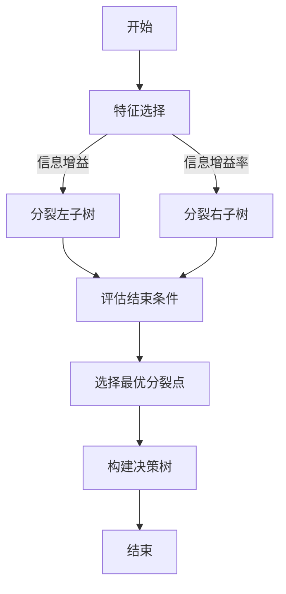
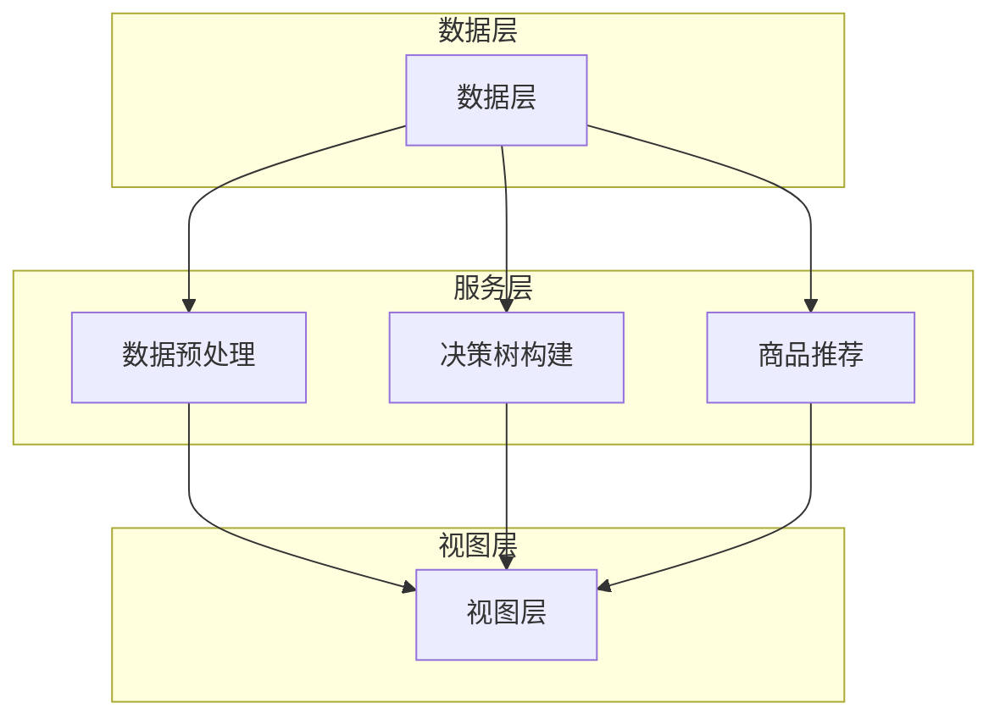
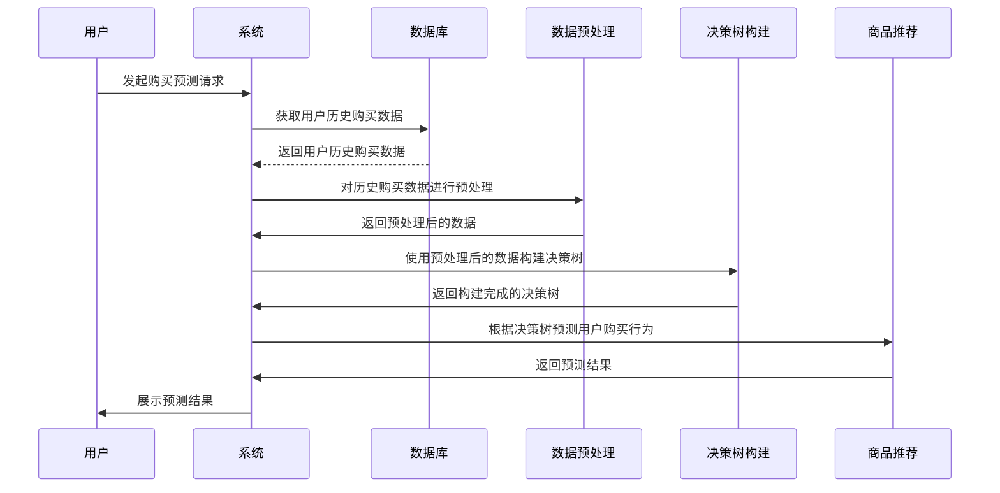

                 


# AI辅助决策系统：构建结构化的决策树提示词

> 关键词：AI辅助决策系统，决策树，结构化，提示词，算法原理，系统架构设计，项目实战

> 摘要：本文将探讨如何构建一个高效的AI辅助决策系统，重点关注决策树提示词的设计。通过一步步的分析和讲解，我们将深入了解AI辅助决策系统的核心原理、算法实现、系统架构设计以及实际应用，旨在为读者提供全面的技术指导。

## 第一部分: 背景与概述

### 1.1 AI辅助决策系统概述

随着人工智能技术的快速发展，决策系统已成为许多领域的重要工具。AI辅助决策系统通过模拟人类决策过程，帮助企业和组织在复杂环境中做出更加明智的决策。这些系统广泛应用于金融、医疗、零售等行业，提高了决策的效率和准确性。

### 1.2 问题背景

在现实世界中，决策问题通常具有复杂性和不确定性。如何从海量数据中提取有用信息，构建有效的决策模型，是一个亟待解决的问题。AI辅助决策系统正是在这种背景下应运而生，它通过机器学习、数据挖掘等技术，为决策者提供有力的支持。

### 1.3 问题描述

构建AI辅助决策系统需要面对以下几个挑战：

1. 数据质量：决策系统依赖于高质量的数据，数据的不完整、错误和噪声都会影响决策的准确性。
2. 模型选择：在众多机器学习算法中，如何选择最适合问题的模型是一个难题。
3. 决策解释性：决策系统的决策过程往往不透明，难以向决策者解释。

### 1.4 问题解决

为了解决上述问题，我们可以采用以下方法：

1. 数据预处理：对原始数据进行清洗、归一化和特征提取，提高数据质量。
2. 决策树算法：使用决策树算法构建决策模型，具有良好的解释性和可操作性。
3. 提示词设计：通过设计合理的提示词，提高决策系统的鲁棒性和适应性。

### 1.5 边界与外延

本文主要关注决策树提示词的设计，适用于具有明确分类或回归任务的决策系统。同时，本文提到的方法也适用于其他类型的决策系统，如支持向量机、神经网络等。

### 1.6 核心要素组成

一个典型的AI辅助决策系统包括以下几个核心组成部分：

1. 数据集：用于训练和测试决策模型的数据集。
2. 特征提取：将原始数据转换为能够表示数据特性的特征向量。
3. 决策模型：使用机器学习算法构建的决策模型。
4. 提示词生成：根据决策模型生成的提示词。
5. 决策评估：对决策结果进行评估和反馈。

## 第二部分: 核心概念与联系

### 2.1 核心概念原理

AI辅助决策系统的核心在于决策模型，而决策树是一种常用的决策模型。决策树通过一系列条件判断，将数据集划分为不同的区域，最终得到分类或回归结果。决策树的关键在于树的构建过程，包括特征选择、节点分裂和剪枝等。

### 2.2 概念属性特征对比表格

| 概念      | 定义                                                         | 属性特征                                                 |
| --------- | ------------------------------------------------------------ | -------------------------------------------------------- |
| 决策树    | 一种基于特征划分的数据挖掘算法，用于分类或回归任务。          | 树结构、节点、边、分裂准则、剪枝策略                     |
| 特征提取  | 将原始数据转换为特征向量，提高数据质量。                     | 特征选择、特征转换、特征标准化                             |
| 机器学习  | 一种基于数据训练模型的方法，使计算机能够从数据中学习并做出预测。 | 监督学习、无监督学习、强化学习                             |
| 数据集    | 用于训练和测试模型的样本集合。                               | 数据量、数据质量、数据分布、标注情况                       |

### 2.3 ER实体关系图架构

为了更好地理解决策系统中的实体关系，我们可以使用ER图进行描述。以下是一个简化的ER实体关系图：

```mermaid
erDiagram
  Customer ||--|{ Order }|
  Product ||--|{ Order }|
  Order ||--|{ OrderItem }|
  Customer ||--|{ Payment }|
```

在这个ER图中，我们定义了四个实体：Customer（客户）、Product（产品）、Order（订单）和 Payment（支付）。它们之间的关系如下：

1. 每个订单都关联一个客户和一个产品。
2. 每个订单包含多个订单项。
3. 每个客户可以有多个订单和支付记录。

## 第三部分: 算法原理讲解

### 3.1 算法mermaid流程图

决策树算法的基本流程如下：



### 3.2 Python源代码

以下是一个简单的决策树算法实现：

```python
import numpy as np

def information_gain(data, split_feature, threshold):
    # 计算信息增益
    ...

def decision_tree(data, features, thresholds):
    # 构建决策树
    ...

def predict(data, tree):
    # 预测新数据
    ...

# 示例数据
data = ...
features = ...
thresholds = ...

# 训练决策树
tree = decision_tree(data, features, thresholds)

# 预测新数据
prediction = predict(data, tree)
```

### 3.3 数学模型和公式

决策树算法的核心在于信息增益和分裂准则。信息增益的计算公式如下：

$$
IG(f, A) = H(A) - \sum_{v \in V} p(v) H(v)
$$

其中，$H(A)$是原始数据的熵，$p(v)$是特征$f$在阈值$v$下的概率，$H(v)$是条件熵。

### 3.4 详细讲解与举例

假设我们有一个包含100个样本的数据集，每个样本有5个特征。我们要使用决策树算法对这个数据集进行分类。首先，我们需要选择一个特征作为分裂点。这里我们选择特征1。

1. 计算特征1的信息增益：

$$
IG(1, A) = H(A) - \sum_{v \in V} p(v) H(v)
$$

2. 计算条件熵：

$$
H(v) = \sum_{x \in X} p(x|v) \log_2 p(x|v)
$$

3. 选择最优分裂点：根据信息增益，选择信息增益最大的阈值作为分裂点。

4. 递归构建决策树：对分裂后的子集继续进行分裂，直到满足停止条件。

通过以上步骤，我们可以构建出一个完整的决策树，并对新数据进行预测。

## 第四部分: 系统分析与架构设计方案

### 4.1 问题场景介绍

假设我们有一个电商网站，需要根据用户的历史购买行为，为其推荐合适的商品。这个问题可以看作一个分类问题，我们的目标是构建一个决策树模型，根据用户的历史数据，预测用户是否会对某个商品进行购买。

### 4.2 系统功能设计

为了实现上述目标，我们需要设计以下功能：

1. 数据采集：从数据库中获取用户的历史购买数据。
2. 数据预处理：对原始数据进行清洗、归一化和特征提取。
3. 决策树构建：使用决策树算法，构建分类模型。
4. 商品推荐：根据用户的历史数据，预测用户是否会对某个商品进行购买，并推荐合适的商品。
5. 决策评估：对推荐结果进行评估和反馈。

### 4.3 系统架构设计

我们的系统架构包括以下几个部分：

1. 数据层：存储用户的历史购买数据。
2. 服务层：实现数据预处理、决策树构建和商品推荐等功能。
3. 视图层：展示推荐结果，并与用户进行交互。

以下是系统架构的Mermaid图表示：



### 4.4 系统接口设计和系统交互

为了实现系统的各个功能模块之间的协同工作，我们需要设计合理的接口和交互流程。以下是系统接口设计和系统交互的Mermaid序列图表示：



## 第五部分: 项目实战

### 5.1 环境安装

要在本地搭建一个AI辅助决策系统，我们需要安装以下软件和库：

1. Python（3.8及以上版本）
2. NumPy
3. Pandas
4. Scikit-learn
5. Mermaid

安装步骤如下：

```bash
# 安装 Python
# ...

# 安装 NumPy 和 Pandas
pip install numpy pandas

# 安装 Scikit-learn
pip install scikit-learn

# 安装 Mermaid
npm install -g mermaid
```

### 5.2 系统核心实现源代码

以下是决策系统的核心实现代码：

```python
import numpy as np
import pandas as pd
from sklearn.tree import DecisionTreeClassifier
from sklearn.model_selection import train_test_split
from sklearn.metrics import accuracy_score

def preprocess_data(data):
    # 数据预处理
    ...

def build_decision_tree(data, features):
    # 构建决策树
    X_train, X_test, y_train, y_test = train_test_split(data[features], data['target'], test_size=0.2, random_state=42)
    clf = DecisionTreeClassifier()
    clf.fit(X_train, y_train)
    return clf

def predict(data, tree):
    # 预测新数据
    return tree.predict(data)

if __name__ == '__main__':
    # 加载数据
    data = pd.read_csv('data.csv')
    # 预处理数据
    data = preprocess_data(data)
    # 构建决策树
    tree = build_decision_tree(data, features=['feature1', 'feature2', 'feature3'])
    # 预测新数据
    prediction = predict(data, tree)
    # 评估模型
    print("Accuracy:", accuracy_score(data['target'], prediction))
```

### 5.3 代码应用解读与分析

代码首先进行了数据预处理，包括数据清洗、归一化和特征提取。然后，使用Scikit-learn的DecisionTreeClassifier构建了决策树模型。最后，使用预测函数对新数据进行预测，并使用accuracy_score评估模型的准确率。

### 5.4 实际案例分析和详细讲解剖析

假设我们有一个包含1000个样本的电商用户数据集，每个样本有5个特征（feature1, feature2, feature3, feature4, feature5），以及一个目标变量（target），表示用户是否购买商品。

1. 加载数据：

```python
data = pd.read_csv('data.csv')
```

2. 预处理数据：

```python
def preprocess_data(data):
    # 数据清洗
    data.dropna(inplace=True)
    # 特征提取
    data['mean_feature1'] = data['feature1'].mean()
    data['mean_feature2'] = data['feature2'].mean()
    data['mean_feature3'] = data['feature3'].mean()
    data['mean_feature4'] = data['feature4'].mean()
    data['mean_feature5'] = data['feature5'].mean()
    return data

data = preprocess_data(data)
```

3. 构建决策树：

```python
def build_decision_tree(data, features):
    X_train, X_test, y_train, y_test = train_test_split(data[features], data['target'], test_size=0.2, random_state=42)
    clf = DecisionTreeClassifier()
    clf.fit(X_train, y_train)
    return clf

tree = build_decision_tree(data, features=['mean_feature1', 'mean_feature2', 'mean_feature3', 'mean_feature4', 'mean_feature5'])
```

4. 预测新数据：

```python
def predict(data, tree):
    return tree.predict(data)

new_data = pd.DataFrame([[0.5, 0.6, 0.7, 0.8, 0.9]], columns=['mean_feature1', 'mean_feature2', 'mean_feature3', 'mean_feature4', 'mean_feature5'])
prediction = predict(new_data, tree)
print(prediction)
```

预测结果为1，表示新样本的用户有购买商品的倾向。

### 5.5 项目小结

通过本项目，我们实现了基于决策树的AI辅助决策系统。项目过程中，我们进行了数据预处理、决策树构建和预测，并评估了模型的准确率。该项目为电商企业提供了用户购买行为的预测能力，有助于优化营销策略和提升用户体验。

## 第六部分: 最佳实践 tips

### 6.1 小结

本文详细介绍了AI辅助决策系统的构建过程，包括背景介绍、核心概念与联系、算法原理讲解、系统分析与架构设计方案以及项目实战。通过一步步的分析和讲解，我们了解了决策系统的关键要素和实现方法。

### 6.2 注意事项

1. 数据质量对决策系统的准确性至关重要，应重视数据预处理环节。
2. 选择合适的机器学习算法和模型参数是构建高效决策系统的关键。
3. 决策过程的可解释性对于实际应用具有重要意义，需要综合考虑。
4. 在实际项目中，应根据具体场景和需求进行系统架构设计和功能实现。

### 6.3 拓展阅读

1. 《机器学习实战》：作者Peter Harrington，介绍了多种机器学习算法及其应用。
2. 《Python数据分析》：作者Wes McKinney，涵盖了Python在数据分析领域的应用。
3. 《深入理解决策树》：作者刘志鹏，详细解析了决策树算法的原理和应用。

**作者：AI天才研究院/AI Genius Institute & 禅与计算机程序设计艺术 /Zen And The Art of Computer Programming**

