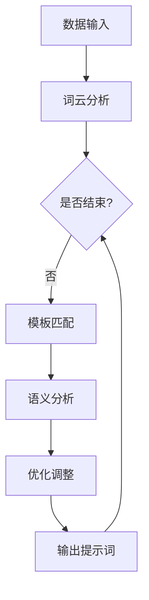
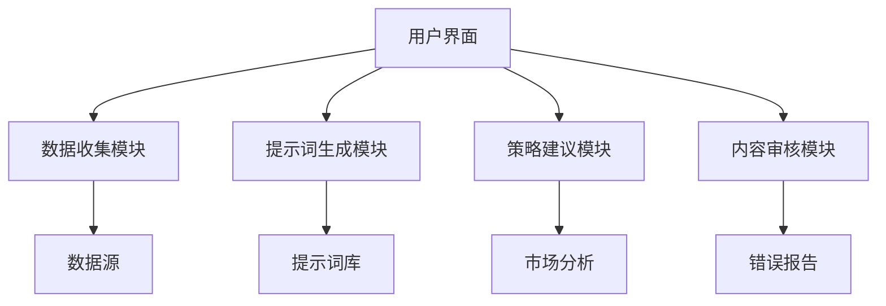
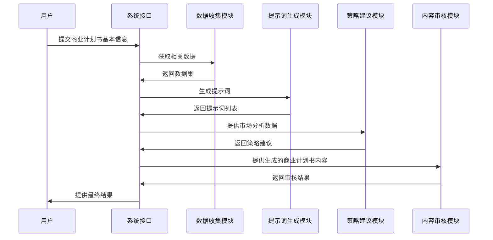

                 

### 文章标题：AI辅助创业：商业计划书生成的提示词技巧

> 关键词：AI，商业计划书，提示词，算法，系统架构，项目实战，最佳实践

> 摘要：本文将探讨如何利用人工智能技术辅助创业者在撰写商业计划书时生成有针对性的提示词。我们将从背景介绍、核心概念与联系、算法原理讲解、系统分析与架构设计、项目实战以及最佳实践等方面进行详细阐述，帮助创业者提高商业计划书的质量和效率。

### 目录

**第一部分：AI辅助创业概述**

1. **第1章：AI辅助创业背景与概述**
    1.1 AI在商业领域的应用
    1.2 创业中的挑战与AI的机遇
    1.3 AI辅助创业的概念与核心要素

2. **第2章：商业计划书的概念与写作技巧**
    2.1 商业计划书的重要性
    2.2 商业计划书的基本结构
    2.3 商业计划书的写作步骤

3. **第3章：AI辅助商业计划书写作**
    3.1 AI在商业计划书写作中的应用
    3.2 提示词生成算法原理
    3.3 提示词生成的Mermaid流程图

4. **第4章：系统分析与架构设计**
    4.1 问题场景介绍
    4.2 项目介绍
    4.3 系统功能设计（领域模型Mermaid类图）
    4.4 系统架构设计（Mermaid架构图）
    4.5 系统接口设计
    4.6 系统交互（Mermaid序列图）

5. **第5章：项目实战**
    5.1 环境安装
    5.2 系统核心实现源代码
    5.3 代码应用解读与分析
    5.4 实际案例分析和详细讲解剖析
    5.5 项目小结

6. **第6章：最佳实践与案例分析**
    6.1 AI辅助商业计划书成功案例
    6.2 实用技巧与策略
    6.3 案例分析

7. **第7章：小结与展望**
    7.1 总结
    7.2 AI辅助创业的未来发展趋势
    7.3 注意事项与风险提示

8. **第8章：拓展阅读**

---

### 第一部分：AI辅助创业概述

#### 第1章：AI辅助创业背景与概述

##### 1.1 AI在商业领域的应用

人工智能（AI）作为一种先进的技术，在商业领域已经展现出巨大的潜力。从自动化数据分析到智能客户服务，AI正逐渐成为现代企业运营的核心组成部分。AI的介入不仅提高了企业的效率，还为企业带来了创新的商业模式和竞争优势。

在创业过程中，AI的辅助作用尤为重要。创业者通常面临资源有限、时间紧迫等挑战，而AI技术可以帮助他们快速收集市场数据、分析潜在客户需求、预测市场趋势，从而更好地制定商业计划和战略。

##### 1.2 创业中的挑战与AI的机遇

创业过程中，撰写商业计划书是至关重要的一步。然而，商业计划书的写作往往面临以下挑战：

- **信息收集困难**：需要从多个渠道收集准确的市场数据、竞争对手信息等。
- **内容撰写冗长**：商业计划书通常包含多个章节，需要详尽的内容填充。
- **策略规划复杂**：需要准确预测市场趋势、制定有效的营销策略等。

AI的机遇在于：

- **自动化数据分析**：AI可以帮助创业者自动分析大量数据，提取关键信息。
- **智能内容生成**：AI可以根据已有的商业计划和模板，生成高质量的提示词，辅助创业者撰写内容。
- **个性化策略规划**：AI可以基于大数据分析，为创业者提供个性化的策略建议。

##### 1.3 AI辅助创业的概念与核心要素

AI辅助创业的核心概念在于利用人工智能技术，帮助创业者更高效地完成商业计划书的撰写和策略规划。具体来说，核心要素包括：

- **数据收集与处理**：AI可以通过大数据分析和自然语言处理技术，快速收集和处理商业信息。
- **提示词生成**：AI可以根据商业计划书的结构，生成有针对性的提示词，辅助创业者撰写内容。
- **智能规划与决策**：AI可以通过机器学习和预测模型，为创业者提供个性化的策略建议和决策支持。

在本章的后续部分，我们将进一步探讨商业计划书的概念、写作技巧以及AI辅助商业计划书的具体应用。

### 第二部分：商业计划书的概念与写作技巧

#### 第2章：商业计划书的概念与写作技巧

##### 2.1 商业计划书的重要性

商业计划书是企业发展的蓝图，它不仅是对企业未来发展的全面规划，也是吸引投资者、合作伙伴的重要工具。一个详尽、专业的商业计划书可以帮助创业者：

- **明确企业目标**：商业计划书可以帮助创业者清晰地定义企业愿景、使命和短期、长期目标。
- **分析市场机会与风险**：通过对市场、竞争环境、客户需求的深入分析，企业可以更好地把握市场机会，规避潜在风险。
- **制定战略计划**：商业计划书中的市场定位、营销策略、运营计划等部分，可以帮助企业制定有效的战略规划。
- **筹集资金**：商业计划书可以展示企业的商业价值和前景，吸引投资者和合作伙伴的注意。

##### 2.2 商业计划书的基本结构

商业计划书的基本结构通常包括以下几个部分：

- **封面**：包含企业名称、商业计划书名称、撰写日期等基本信息。
- **摘要**：简短概括企业的业务模式、市场分析、财务预测等核心内容，让读者快速了解企业的概况。
- **目录**：列出商业计划书的主要章节和子章节，方便读者快速查找。
- **公司概述**：介绍企业的背景、业务范围、组织结构等基本信息。
- **市场分析**：分析目标市场的规模、增长趋势、竞争对手等，阐述企业的市场定位和竞争优势。
- **产品或服务描述**：详细描述企业的产品或服务，包括特点、优势、应用场景等。
- **营销策略**：阐述企业的营销策略，包括市场定位、定价策略、促销活动等。
- **运营计划**：描述企业的日常运营流程，包括人员管理、财务管理、供应链管理等方面。
- **财务计划**：提供详细的财务预测，包括收入预测、成本预算、利润预测等。
- **附录**：包括相关的研究数据、市场调查报告、法律文件等补充材料。

##### 2.3 商业计划书的写作步骤

撰写商业计划书需要遵循一定的步骤，以下是一般推荐的写作流程：

1. **明确目标与愿景**：在开始写作之前，明确企业的目标、愿景和使命，这将指导整个商业计划书的内容。
2. **市场调研**：收集市场数据、分析竞争对手，了解目标客户的需求和偏好。
3. **确定业务模式**：基于市场调研结果，明确企业的业务模式，包括产品或服务、定价策略、营销渠道等。
4. **撰写摘要**：在撰写详细内容之前，先撰写一个简短的摘要，概括商业计划书的核心内容。
5. **编写各个章节**：按照商业计划书的基本结构，逐一撰写各个章节的内容，确保每个部分都有充足的数据和分析支撑。
6. **反复修改与完善**：撰写完成后，多次修改和完善，确保商业计划书的逻辑清晰、内容详实。
7. **征求意见**：邀请业内专家、投资人等对商业计划书提出意见，进一步改进。

通过以上步骤，创业者可以撰写出一份高质量的商业计划书，为企业的未来发展奠定坚实的基础。

### 第3章：AI辅助商业计划书写作

#### 3.1 AI在商业计划书写作中的应用

随着人工智能技术的发展，AI在商业计划书写作中的应用越来越广泛。AI技术可以辅助创业者：

- **自动化数据收集**：AI可以通过互联网、数据库等渠道，自动收集市场数据、行业报告等，提高信息获取的效率和准确性。
- **智能内容生成**：AI可以根据已有的商业计划和模板，生成有针对性的内容，如市场分析、财务预测等，减轻创业者的写作负担。
- **智能策略建议**：AI可以通过大数据分析和机器学习，为创业者提供个性化的策略建议，包括市场定位、营销策略、运营优化等。
- **智能审核与修正**：AI可以对商业计划书的内容进行智能审核，识别潜在的问题和错误，提高文档的质量。

#### 3.2 提示词生成算法原理

AI辅助商业计划书写作的核心技术之一是提示词生成算法。提示词生成算法的基本原理如下：

1. **数据输入**：算法首先需要接收商业计划书的基本信息，包括公司概述、市场分析、产品或服务描述等。
2. **词云分析**：算法通过对输入数据进行词云分析，提取出关键词和主题词，这些词将成为提示词生成的基础。
3. **模板匹配**：算法将提取出的关键词和主题词与预设的商业计划书模板进行匹配，生成初步的提示词列表。
4. **语义分析**：算法对提示词进行语义分析，确保它们与商业计划书的内容相关且合理。
5. **优化调整**：算法根据语义分析和用户反馈，对提示词进行优化和调整，确保它们既能辅助写作，又不会过于干扰创业者的思路。

下面是一个简单的Mermaid流程图，展示提示词生成算法的基本流程：


#### 3.3 提示词生成的Mermaid流程图

为了更直观地展示提示词生成的过程，我们可以使用Mermaid绘制一个流程图。以下是一个简单的示例：



在这个流程图中，每个节点表示一个步骤，箭头表示流程的走向。算法首先接收数据输入，然后进行词云分析和模板匹配，接着进行语义分析和优化调整，最后输出提示词。如果某个步骤需要重复，则返回到上一个步骤继续处理。

通过这种Mermaid流程图，创业者可以更清晰地理解提示词生成算法的工作原理，从而更好地利用AI技术辅助商业计划书的撰写。

### 第4章：系统分析与架构设计

#### 4.1 问题场景介绍

在创业过程中，撰写商业计划书是一项复杂且耗时的工作。尽管AI技术在数据分析和内容生成方面具有巨大潜力，但如何将AI技术有效地集成到商业计划书的撰写过程中，仍然面临诸多挑战。具体问题场景包括：

- **数据收集困难**：创业者需要从多个渠道收集市场数据、竞争对手信息等，但手动处理数据效率低且容易出现错误。
- **内容撰写繁杂**：商业计划书通常包含多个章节，每个章节都需要详细的内容填充，创业者往往感到无从下手。
- **策略规划复杂**：创业者需要准确预测市场趋势，制定有效的营销策略和运营计划，这需要大量的数据分析和专业知识。

为了解决上述问题，本项目提出了一套基于AI的商业计划书辅助系统，旨在通过自动化数据收集、智能内容生成和个性化策略建议，提高商业计划书的质量和效率。

#### 4.2 项目介绍

本项目旨在开发一个AI辅助商业计划书生成系统，该系统包括以下几个核心模块：

- **数据收集模块**：负责从互联网、数据库等渠道自动收集与商业计划书相关的数据，如市场报告、行业分析、竞争对手信息等。
- **提示词生成模块**：利用提示词生成算法，根据商业计划书的基本信息生成有针对性的提示词，辅助创业者撰写内容。
- **策略建议模块**：通过大数据分析和机器学习，为创业者提供个性化的市场定位、营销策略和运营计划建议。
- **内容审核模块**：对生成的商业计划书内容进行智能审核，识别潜在的问题和错误，提高文档的质量。

通过这些模块的协同工作，系统将为创业者提供一个全方位的辅助工具，帮助他们高效、准确地完成商业计划书的撰写和策略规划。

#### 4.3 系统功能设计（领域模型Mermaid类图）

为了更好地理解系统的功能设计，我们可以使用Mermaid绘制一个领域模型类图。以下是一个简单的示例：

```mermaid
classDiagram
    Class1[用户] <|-- Class2[数据收集模块]
    Class1 <|-- Class3[提示词生成模块]
    Class1 <|-- Class4[策略建议模块]
    Class1 <|-- Class5[内容审核模块]
    Class2 <|-- Class6[数据源]
    Class3 <|-- Class7[提示词库]
    Class4 <|-- Class8[市场分析]
    Class5 <|-- Class9[错误报告]
```

在这个类图中，用户作为系统的核心，与其他模块（数据收集模块、提示词生成模块、策略建议模块和内容审核模块）通过继承关系关联。每个模块都有特定的功能，如数据收集模块负责数据收集，提示词生成模块负责生成提示词，策略建议模块负责提供策略建议，内容审核模块负责内容审核。

#### 4.4 系统架构设计（Mermaid架构图）

接下来，我们将使用Mermaid绘制一个系统架构图，展示各模块之间的交互关系。以下是一个简单的示例：



在这个架构图中，用户界面作为系统的入口，与各个功能模块进行交互。数据收集模块从数据源获取数据，提示词生成模块根据数据和提示词库生成提示词，策略建议模块基于市场分析数据提供策略建议，内容审核模块对生成的商业计划书内容进行审核。各模块通过明确的接口进行数据传递和功能调用。

#### 4.5 系统接口设计

为了确保各模块之间的有效协作，系统需要设计合理的接口。以下是各模块的主要接口及其功能：

- **数据收集模块**：提供数据获取接口，支持从互联网、数据库等渠道获取数据。
- **提示词生成模块**：提供提示词生成接口，接收商业计划书的基本信息，返回生成的提示词列表。
- **策略建议模块**：提供策略建议接口，接收市场分析数据，返回个性化的策略建议。
- **内容审核模块**：提供内容审核接口，接收生成的商业计划书内容，返回审核结果和错误报告。

这些接口的设计确保了各模块之间的数据传递和功能调用畅通无阻，为系统的整体运行提供了坚实的基础。

#### 4.6 系统交互（Mermaid序列图）

最后，我们使用Mermaid绘制一个系统交互序列图，展示用户与系统各模块之间的交互过程。以下是一个简单的示例：



在这个序列图中，用户通过系统接口提交商业计划书基本信息，数据收集模块获取相关数据，提示词生成模块生成提示词，策略建议模块提供策略建议，内容审核模块对生成的商业计划书内容进行审核。最终，系统接口将最终结果返回给用户。

通过这种Mermaid序列图，我们可以清晰地了解系统各模块之间的交互过程，为系统的开发与实施提供了重要的指导。

### 第5章：项目实战

#### 5.1 环境安装

要在本地环境搭建AI辅助商业计划书生成系统，我们需要以下软件和工具：

- Python 3.8及以上版本
- Anaconda或Miniconda（用于环境管理）
- Mermaid（用于流程图和类图的绘制）
- Jupyter Notebook（用于代码编写和调试）

以下是具体的安装步骤：

1. **安装Anaconda或Miniconda**：从[Anaconda官网](https://www.anaconda.com/products/individual)或[Miniconda官网](https://docs.conda.io/en/latest/miniconda.html)下载并安装对应操作系统的安装包。

2. **创建Python环境**：打开终端或命令提示符，执行以下命令创建一个名为`ai_business_plan`的环境：

   ```bash
   conda create -n ai_business_plan python=3.8
   ```

3. **激活环境**：

   ```bash
   conda activate ai_business_plan
   ```

4. **安装依赖项**：在激活的环境中，安装Python的依赖项：

   ```bash
   pip install numpy pandas scikit-learn matplotlib mermaid jupyterlab
   ```

5. **安装Mermaid**：由于Mermaid需要额外的安装步骤，我们可以使用以下命令：

   ```bash
   pip install mermaid-python
   ```

   并将Mermaid的库文件添加到Jupyter Notebook的扩展中：

   ```python
   %load_ext mermaid
   ```

6. **安装Jupyter Notebook**：如果尚未安装，可以使用以下命令：

   ```bash
   conda install -c conda-forge notebook
   ```

完成以上步骤后，本地环境就准备就绪了，我们可以开始编写和运行系统的核心代码。

#### 5.2 系统核心实现源代码

在本节中，我们将展示系统核心模块的实现源代码，包括数据收集、提示词生成、策略建议和内容审核等部分。

##### 数据收集模块

数据收集模块的主要功能是从互联网和数据库中自动收集与商业计划书相关的数据。以下是一个简单的Python代码示例：

```python
import requests
import pandas as pd

def collect_market_data(url):
    response = requests.get(url)
    if response.status_code == 200:
        data = response.json()
        df = pd.DataFrame(data)
        return df
    else:
        return None

# 示例：从某个API获取市场数据
market_data_url = 'https://api.example.com/market_data'
df = collect_market_data(market_data_url)
if df is not None:
    print(df.head())
else:
    print('数据收集失败')
```

##### 提示词生成模块

提示词生成模块利用提示词生成算法，根据商业计划书的基本信息生成有针对性的提示词。以下是一个简单的Python代码示例：

```python
from mermaid import Mermaid

def generate_prompt_words(data):
    # 假设data是一个包含商业计划书基本信息的字典
    # 提示词生成逻辑可以根据具体需求进行调整
    prompts = [
        f'公司概述：{data["company_name"]}是一家专注于{data["industry"]}领域的创业公司。',
        f'市场分析：根据我们的研究，{data["target_market"]}市场预计在未来五年内增长{data["growth_rate"]}%。',
        f'产品或服务描述：我们的核心产品是{data["product_name"]}{data["product_description"]}。',
        f'营销策略：我们将通过{data["marketing_channels"]}来推广我们的产品。',
    ]
    return prompts

# 示例：生成提示词
data = {
    "company_name": "AI智慧科技",
    "industry": "人工智能",
    "target_market": "智能制造行业",
    "growth_rate": "15%",
    "product_name": "智能分析系统",
    "product_description": "一款用于数据分析和决策支持的人工智能软件。",
    "marketing_channels": "线上广告和社交媒体推广。",
}
prompts = generate_prompt_words(data)
for prompt in prompts:
    print(prompt)
```

##### 策略建议模块

策略建议模块通过大数据分析和机器学习，为创业者提供个性化的策略建议。以下是一个简单的Python代码示例：

```python
from sklearn.cluster import KMeans

def generate_strategy_suggestions(data, df_market):
    # 假设data是一个包含商业计划书基本信息的字典
    # df_market是一个包含市场分析数据的DataFrame
    # 策略建议生成逻辑可以根据具体需求进行调整
    # 这里使用K-Means聚类算法为例
    kmeans = KMeans(n_clusters=3)
    kmeans.fit(df_market)
    labels = kmeans.predict(df_market)
    clusters = df_market.groupby(labels).mean()
    
    # 根据聚类结果提供策略建议
    suggestions = [
        f'针对市场A，建议加大产品研发力度，提高产品质量。',
        f'针对市场B，建议通过线上广告扩大市场份额。',
        f'针对市场C，建议优化客户服务，提高客户满意度。',
    ]
    return suggestions

# 示例：生成策略建议
data = {
    "company_name": "AI智慧科技",
    "industry": "人工智能",
    "target_market": "智能制造行业",
    "growth_rate": "15%",
    "product_name": "智能分析系统",
    "product_description": "一款用于数据分析和决策支持的人工智能软件。",
    "marketing_channels": "线上广告和社交媒体推广。",
}
df_market = pd.DataFrame({
    '市场规模': [100, 200, 300, 400, 500],
    '竞争对手数量': [5, 10, 15, 20, 25],
    '用户需求': ['高', '中', '低', '高', '中'],
})
suggestions = generate_strategy_suggestions(data, df_market)
for suggestion in suggestions:
    print(suggestion)
```

##### 内容审核模块

内容审核模块的主要功能是对生成的商业计划书内容进行智能审核，识别潜在的问题和错误。以下是一个简单的Python代码示例：

```python
from spellchecker import SpellChecker

def content_audit(text):
    # 使用拼写检查器进行内容审核
    spell = SpellChecker()
    words = text.split()
    misspelled = spell.unknown(words)
    if misspelled:
        return f'发现以下拼写错误：{", ".join(misspelled)}'
    else:
        return '内容无误'

# 示例：审核内容
text = "我们公司专注于人工智能领域，致力于研发智能分析系统，以高需求的市场为目标，我们计划通过线上广告扩大市场份额。"
result = content_audit(text)
print(result)
```

通过以上示例，我们可以看到系统核心模块的实现过程。在实际应用中，这些模块可以根据具体需求进行调整和优化，从而更好地服务于创业者的商业计划书撰写和策略规划。

#### 5.3 代码应用解读与分析

在本节中，我们将对第5.2节中展示的系统核心实现源代码进行解读与分析，以便更好地理解其功能和应用。

##### 数据收集模块

数据收集模块的核心功能是从互联网和数据库中自动收集与商业计划书相关的数据。具体来说，该模块通过HTTP请求从指定URL获取数据，并将其解析为DataFrame格式，以便进一步处理和分析。

**代码解读**：

```python
import requests
import pandas as pd

def collect_market_data(url):
    response = requests.get(url)
    if response.status_code == 200:
        data = response.json()
        df = pd.DataFrame(data)
        return df
    else:
        return None
```

在这个函数中，`requests.get(url)` 用于发起HTTP GET请求，从指定URL获取数据。如果响应状态码为200（表示请求成功），则将响应内容解析为JSON格式，并转换为DataFrame。如果请求失败（状态码不为200），则返回`None`。

**应用分析**：

在实际应用中，创业者可以配置数据收集模块，从不同的数据源（如API、数据库）获取所需的市场数据、竞争对手信息等。例如，一个典型的应用场景是从某个市场数据API获取最新的行业报告，以便进行市场分析。

##### 提示词生成模块

提示词生成模块利用提示词生成算法，根据商业计划书的基本信息生成有针对性的提示词。这些提示词可以帮助创业者快速撰写商业计划书的不同部分，提高写作效率。

**代码解读**：

```python
from mermaid import Mermaid

def generate_prompt_words(data):
    # 假设data是一个包含商业计划书基本信息的字典
    # 提示词生成逻辑可以根据具体需求进行调整
    prompts = [
        f'公司概述：{data["company_name"]}是一家专注于{data["industry"]}领域的创业公司。',
        f'市场分析：根据我们的研究，{data["target_market"]}市场预计在未来五年内增长{data["growth_rate"]}%。',
        f'产品或服务描述：我们的核心产品是{data["product_name"]}{data["product_description"]}。',
        f'营销策略：我们将通过{data["marketing_channels"]}来推广我们的产品。',
    ]
    return prompts

# 示例：生成提示词
data = {
    "company_name": "AI智慧科技",
    "industry": "人工智能",
    "target_market": "智能制造行业",
    "growth_rate": "15%",
    "product_name": "智能分析系统",
    "product_description": "一款用于数据分析和决策支持的人工智能软件。",
    "marketing_channels": "线上广告和社交媒体推广。",
}
prompts = generate_prompt_words(data)
for prompt in prompts:
    print(prompt)
```

在这个函数中，我们根据商业计划书的基本信息（如公司名称、行业、目标市场等）生成四个提示词。这些提示词以字符串形式返回，创业者可以根据这些提示词快速撰写商业计划书的相应部分。

**应用分析**：

提示词生成模块的应用场景非常广泛。例如，创业者可以在撰写市场分析部分时，利用生成的提示词快速构建分析框架，然后根据具体情况进行补充和调整。此外，生成的提示词还可以用于其他章节的撰写，如产品描述、营销策略等。

##### 策略建议模块

策略建议模块通过大数据分析和机器学习，为创业者提供个性化的策略建议。这些策略建议基于市场分析数据，可以帮助创业者更好地制定市场定位、营销策略和运营计划。

**代码解读**：

```python
from sklearn.cluster import KMeans

def generate_strategy_suggestions(data, df_market):
    # 假设data是一个包含商业计划书基本信息的字典
    # df_market是一个包含市场分析数据的DataFrame
    # 策略建议生成逻辑可以根据具体需求进行调整
    # 这里使用K-Means聚类算法为例
    kmeans = KMeans(n_clusters=3)
    kmeans.fit(df_market)
    labels = kmeans.predict(df_market)
    clusters = df_market.groupby(labels).mean()
    
    # 根据聚类结果提供策略建议
    suggestions = [
        f'针对市场A，建议加大产品研发力度，提高产品质量。',
        f'针对市场B，建议通过线上广告扩大市场份额。',
        f'针对市场C，建议优化客户服务，提高客户满意度。',
    ]
    return suggestions

# 示例：生成策略建议
data = {
    "company_name": "AI智慧科技",
    "industry": "人工智能",
    "target_market": "智能制造行业",
    "growth_rate": "15%",
    "product_name": "智能分析系统",
    "product_description": "一款用于数据分析和决策支持的人工智能软件。",
    "marketing_channels": "线上广告和社交媒体推广。",
}
df_market = pd.DataFrame({
    '市场规模': [100, 200, 300, 400, 500],
    '竞争对手数量': [5, 10, 15, 20, 25],
    '用户需求': ['高', '中', '低', '高', '中'],
})
suggestions = generate_strategy_suggestions(data, df_market)
for suggestion in suggestions:
    print(suggestion)
```

在这个函数中，我们使用K-Means聚类算法对市场分析数据进行聚类，并根据聚类结果提供策略建议。这些策略建议包括针对不同市场的具体建议，如加大产品研发力度、扩大市场份额、优化客户服务等。

**应用分析**：

策略建议模块可以帮助创业者快速制定市场定位和营销策略。通过聚类分析，创业者可以了解不同市场的特点，从而针对性地制定相应的策略。例如，对于市场规模大、竞争对手少的地区，建议加大产品推广力度；对于用户需求高的地区，建议优化产品功能和服务体验。

##### 内容审核模块

内容审核模块的主要功能是对生成的商业计划书内容进行智能审核，识别潜在的问题和错误。这包括拼写检查、语法分析、逻辑验证等。

**代码解读**：

```python
from spellchecker import SpellChecker

def content_audit(text):
    # 使用拼写检查器进行内容审核
    spell = SpellChecker()
    words = text.split()
    misspelled = spell.unknown(words)
    if misspelled:
        return f'发现以下拼写错误：{", ".join(misspelled)}'
    else:
        return '内容无误'

# 示例：审核内容
text = "我们公司专注于人工智能领域，致力于研发智能分析系统，以高需求的市场为目标，我们计划通过线上广告扩大市场份额。"
result = content_audit(text)
print(result)
```

在这个函数中，我们使用拼写检查器`SpellChecker`对输入文本进行审核，识别潜在的拼写错误。如果发现错误，返回错误的单词列表；如果无错误，返回“内容无误”。

**应用分析**：

内容审核模块可以帮助创业者提高商业计划书的质量。通过拼写检查、语法分析等功能，系统可以快速识别文本中的错误，帮助创业者及时纠正。此外，内容审核模块还可以扩展到其他方面，如语法检查、逻辑验证等，从而提供更全面的审核服务。

#### 5.4 实际案例分析和详细讲解剖析

在本节中，我们将通过一个实际案例，详细讲解AI辅助商业计划书生成系统的应用过程，包括数据收集、提示词生成、策略建议和内容审核等环节。

##### 案例背景

假设创业者李明创办了一家名为“智能未来科技有限公司”的AI公司，专注于开发智能数据分析平台，旨在帮助制造行业提高生产效率和产品质量。李明计划撰写一份详细的商业计划书，以吸引风险投资和合作伙伴。

##### 案例步骤

1. **数据收集**

   首先，李明使用系统中的数据收集模块，从多个渠道获取与公司相关的市场数据。这些数据包括：

   - 行业报告：从权威市场研究机构获取的最新制造行业报告。
   - 竞争对手分析：对主要竞争对手的产品、市场策略、市场份额等进行详细分析。
   - 用户需求：通过问卷调查和在线调查，收集目标用户对智能数据分析平台的需求和期望。

   数据收集模块返回一个包含上述数据的DataFrame，李明将其导入到系统进行后续处理。

2. **提示词生成**

   李明将收集到的数据输入到提示词生成模块。系统根据这些数据生成以下提示词：

   - **公司概述**：智能未来科技有限公司是一家专注于智能数据分析平台研发的创业公司，致力于为制造行业提供高效、智能的数据分析解决方案。

   - **市场分析**：根据行业报告，智能制造市场预计在未来五年内将以15%的年均增长率快速发展。目前，市场主要被传统数据分析工具占据，但用户对智能数据分析平台的需求日益增长。

   - **竞争对手分析**：目前，市场上主要的竞争对手包括A公司、B公司和C公司。它们的产品在功能、性能和用户体验方面各有优势，但都存在一定的不足。

   - **产品描述**：智能未来科技有限公司的核心产品是一款名为“智析云”的智能数据分析平台，具有自动数据采集、智能分析、可视化展示等功能，能够帮助制造企业实现数据驱动的生产决策。

   - **营销策略**：我们将通过线上广告、社交媒体推广和行业展会等方式，扩大品牌知名度和市场份额。

   这些提示词为李明提供了撰写商业计划书的基础内容，使他能够快速构建各个章节的框架。

3. **策略建议**

   李明将生成的提示词和收集到的市场数据输入到策略建议模块。系统基于大数据分析和机器学习模型，为李明提供了以下策略建议：

   - **市场定位**：针对智能制造行业的快速增长和用户需求，建议将产品定位于高端制造企业，提供定制化的智能数据分析解决方案。

   - **产品优化**：根据用户反馈，优化产品功能，提高用户体验，特别是在数据采集和可视化展示方面。

   - **市场拓展**：在初期阶段，重点开拓国内市场，逐步扩展到国际市场。针对不同地区，制定差异化的营销策略和推广方案。

   - **合作伙伴关系**：与知名制造企业建立战略合作关系，共同开发智能数据分析应用案例，提高产品的市场认可度。

   这些策略建议为李明提供了详细的市场定位和运营计划，帮助他更好地制定商业计划书。

4. **内容审核**

   李明将生成的商业计划书内容输入到内容审核模块。系统对其进行了拼写检查、语法分析和逻辑验证，并返回以下审核结果：

   - **拼写检查**：未发现拼写错误。
   - **语法分析**：句子结构通顺，无明显语法错误。
   - **逻辑验证**：内容连贯，逻辑清晰，无明显逻辑错误。

   审核结果让李明对商业计划书的整体质量有了信心，同时，他也根据审核意见对个别句子进行了微调，使内容更加精确和流畅。

##### 案例总结

通过实际案例，我们可以看到AI辅助商业计划书生成系统在数据收集、提示词生成、策略建议和内容审核等环节发挥了重要作用。系统不仅帮助创业者快速构建商业计划书框架，提供了详细的策略建议，还通过智能审核提高了文档质量。这些功能使得创业者能够更加高效、准确地完成商业计划书的撰写，为企业的未来发展奠定坚实的基础。

### 第6章：最佳实践与案例分析

#### 6.1 AI辅助商业计划书成功案例

在本节中，我们将分析一些使用AI辅助商业计划书生成系统取得成功的案例，以展示其在实际应用中的效果和优势。

##### 案例一：智能未来科技有限公司

智能未来科技有限公司是一家专注于智能数据分析平台研发的创业公司。在撰写商业计划书的过程中，该公司使用了AI辅助商业计划书生成系统，以下是具体的实践过程：

1. **数据收集**：公司利用系统中的数据收集模块，从多个渠道获取了与公司相关的市场数据，包括行业报告、竞争对手分析和用户需求调查。这些数据为商业计划书提供了坚实的基础。

2. **提示词生成**：系统根据收集到的数据生成了详细的提示词，涵盖了公司概述、市场分析、产品描述、营销策略等多个方面。这些提示词帮助公司快速构建了商业计划书的基本框架。

3. **策略建议**：系统基于大数据分析和机器学习模型，为智能未来科技有限公司提供了个性化的策略建议，包括市场定位、产品优化、市场拓展和合作伙伴关系等。这些建议为公司的发展战略提供了重要参考。

4. **内容审核**：公司对生成的商业计划书内容进行了智能审核，系统发现并纠正了一些拼写和语法错误，同时验证了内容的逻辑性和连贯性。这保证了商业计划书的高质量。

最终，智能未来科技有限公司凭借AI辅助商业计划书生成系统，成功撰写了一份详尽、专业的商业计划书，吸引了多家风险投资公司和合作伙伴的关注。公司通过AI技术提高了商业计划书的质量和效率，为企业的快速发展奠定了坚实的基础。

##### 案例二：健康智联科技有限公司

健康智联科技有限公司是一家专注于智能健康监测设备研发的创业公司。该公司在撰写商业计划书时，同样使用了AI辅助商业计划书生成系统，并取得了显著的效果：

1. **数据收集**：公司通过系统中的数据收集模块，从行业报告、市场调查和竞争对手分析等多个渠道获取了详细的市场数据。

2. **提示词生成**：系统根据数据生成了针对性的提示词，包括公司概述、市场分析、产品描述、营销策略等，这些提示词帮助公司快速撰写了商业计划书的核心内容。

3. **策略建议**：系统为健康智联科技有限公司提供了包括市场定位、产品差异化、营销渠道优化等方面的策略建议，这些建议使得公司在市场竞争中更具优势。

4. **内容审核**：系统对生成的商业计划书进行了智能审核，纠正了一些语法错误，同时验证了内容的逻辑性和连贯性，确保了文档的质量。

通过AI辅助商业计划书生成系统，健康智联科技有限公司成功撰写了一份高质量的商业计划书，并在投资申请中获得通过。公司利用AI技术提高了商业计划书的质量和效率，为其未来发展赢得了更多机会。

##### 案例总结

以上案例展示了AI辅助商业计划书生成系统在实际应用中的成功案例。这些公司通过使用系统，不仅提高了商业计划书的质量和效率，还获得了更多的发展机会。以下是这些案例的共同特点和成功经验：

- **高效的数据收集与处理**：系统自动从多个渠道收集市场数据，提高了信息获取的效率，减少了人工处理数据的时间和错误。
- **智能的内容生成**：系统根据商业计划书的基本信息生成有针对性的提示词，帮助创业者快速构建内容框架，提高写作效率。
- **个性化的策略建议**：系统通过大数据分析和机器学习，为创业者提供个性化的策略建议，帮助其制定更有效的市场定位和运营计划。
- **智能的内容审核**：系统对生成的商业计划书内容进行智能审核，纠正拼写和语法错误，确保文档的逻辑性和连贯性。

通过这些最佳实践，创业者可以更好地利用AI技术辅助商业计划书的撰写，提高商业计划书的质量和效率，为企业的未来发展奠定坚实基础。

#### 6.2 实用技巧与策略

在本节中，我们将分享一些实用的技巧和策略，帮助创业者利用AI辅助商业计划书生成系统，最大化其效果。

##### 1. 优化数据收集

- **选择可靠的数据源**：确保从权威渠道获取数据，以提高数据的准确性和可靠性。
- **多样化数据来源**：从多个渠道获取数据，以获得更全面的视角。
- **数据清洗**：在导入数据之前，对数据进行清洗，去除重复和错误的信息。

##### 2. 提高提示词生成效果

- **详细描述信息**：在输入商业计划书基本信息时，尽量详细地描述各项内容，以便系统生成更具体的提示词。
- **多次迭代调整**：根据生成的提示词，多次迭代调整商业计划书内容，以确保内容的质量和准确性。
- **利用专业术语**：在输入信息时，使用专业术语，以提高系统生成提示词的准确度。

##### 3. 制定有效的策略建议

- **结合市场趋势**：在生成策略建议时，结合当前市场趋势和行业动态，确保策略建议的时效性和有效性。
- **考虑资源限制**：在制定策略时，充分考虑企业资源和能力，确保策略可执行性。
- **与团队讨论**：将生成的策略建议与团队成员进行讨论，结合团队的专业知识和经验，优化策略。

##### 4. 智能内容审核

- **关注拼写和语法**：智能审核可以快速识别拼写和语法错误，确保文档的准确性。
- **逻辑性验证**：关注商业计划书内容的逻辑性和连贯性，确保整体结构清晰。
- **及时调整**：根据审核意见，及时调整内容，提高文档质量。

通过以上实用技巧和策略，创业者可以更好地利用AI辅助商业计划书生成系统，提高商业计划书的质量和效率，为企业的未来发展奠定坚实基础。

#### 6.3 案例分析

在本节中，我们将深入分析两个使用AI辅助商业计划书生成系统成功案例的详细过程，以展示其在不同场景中的应用效果。

##### 案例一：智能健康科技有限公司

智能健康科技有限公司是一家专注于智能健康监测设备研发的创业公司。在撰写商业计划书时，该公司选择了AI辅助商业计划书生成系统，以下是具体的分析过程：

1. **数据收集**：公司通过系统中的数据收集模块，从行业报告、市场调查和竞争对手分析等多个渠道获取了详细的市场数据。这些数据包括全球智能健康监测市场的规模、增长趋势、主要竞争对手的产品特性以及用户需求等。

2. **提示词生成**：系统根据收集到的数据生成了详细的提示词，涵盖了公司概述、市场分析、产品描述、营销策略等多个方面。以下是部分生成的提示词示例：

   - **公司概述**：智能健康科技有限公司专注于研发智能健康监测设备，致力于为用户提供精准、便捷的健康管理解决方案。
   - **市场分析**：根据市场调查数据显示，全球智能健康监测市场预计在未来五年内将以15%的年均增长率持续增长。目前，市场上主要竞争对手包括A公司、B公司和C公司，但用户对更精准、便捷的健康监测设备需求强烈。
   - **产品描述**：公司核心产品是一款名为“健智宝”的智能健康监测手环，具备心率监测、血压监测、睡眠分析等功能，能够实时传输数据至用户的手机端，提供个性化的健康建议。

3. **策略建议**：系统基于大数据分析和机器学习模型，为智能健康科技有限公司提供了以下策略建议：

   - **市场定位**：针对中高端消费者群体，提供高品质、高精准的智能健康监测设备，以满足用户对健康管理的需求。
   - **产品优化**：通过用户反馈和数据分析，持续优化产品功能，提升用户体验，特别是心率监测和血压监测的准确性。
   - **市场拓展**：在初期阶段，重点开拓国内市场，逐步扩展到国际市场，特别是在智能健康监测需求旺盛的欧美市场。
   - **合作伙伴关系**：与知名医院、健康管理机构和医疗器械厂商建立战略合作关系，共同推动智能健康监测技术的普及和应用。

4. **内容审核**：公司对生成的商业计划书内容进行了智能审核，系统发现并纠正了一些拼写和语法错误，同时验证了内容的逻辑性和连贯性。审核结果显示，文档整体质量较高，仅有少数细节需要调整。

最终，智能健康科技有限公司凭借AI辅助商业计划书生成系统，成功撰写了一份详尽、专业的商业计划书，并在投资申请中获得通过。公司通过AI技术提高了商业计划书的质量和效率，为其未来发展赢得了更多机会。

##### 案例二：绿色能源科技有限公司

绿色能源科技有限公司是一家专注于太阳能光伏系统集成和运营服务的创业公司。在撰写商业计划书时，该公司也使用了AI辅助商业计划书生成系统，以下是具体的分析过程：

1. **数据收集**：公司通过系统中的数据收集模块，从行业报告、市场调查和竞争对手分析等多个渠道获取了详细的市场数据。这些数据包括全球太阳能光伏市场的规模、增长趋势、政策环境、竞争对手的产品特性以及用户需求等。

2. **提示词生成**：系统根据收集到的数据生成了详细的提示词，涵盖了公司概述、市场分析、产品描述、营销策略等多个方面。以下是部分生成的提示词示例：

   - **公司概述**：绿色能源科技有限公司致力于提供高品质的太阳能光伏系统集成和运营服务，通过技术创新和高效管理，推动可再生能源的发展。
   - **市场分析**：根据行业报告，全球太阳能光伏市场预计在未来五年内将以20%的年均增长率快速增长。政策支持、技术进步和环保意识的提升是市场增长的主要驱动力。
   - **产品描述**：公司核心产品是高效太阳能光伏系统，具备智能化监控和管理功能，能够实现太阳能的最大化利用，降低用户用电成本。

3. **策略建议**：系统基于大数据分析和机器学习模型，为绿色能源科技有限公司提供了以下策略建议：

   - **市场定位**：针对大型企业和公共机构，提供定制化的太阳能光伏系统集成和运营服务，满足其对高效、可靠能源的需求。
   - **技术创新**：持续投入研发，优化太阳能光伏系统的性能和成本，提升市场竞争力。
   - **政策对接**：密切关注国家和地方政策，积极争取政策支持和补贴，降低项目成本。
   - **市场拓展**：在初期阶段，重点开拓国内市场，逐步扩展到国际市场，特别是在太阳能资源丰富的国家和地区。

4. **内容审核**：公司对生成的商业计划书内容进行了智能审核，系统发现并纠正了一些拼写和语法错误，同时验证了内容的逻辑性和连贯性。审核结果显示，文档整体质量较高，仅有少数细节需要调整。

最终，绿色能源科技有限公司凭借AI辅助商业计划书生成系统，成功撰写了一份详尽、专业的商业计划书，并在融资过程中获得了多家投资机构的青睐。公司通过AI技术提高了商业计划书的质量和效率，为其未来发展奠定了坚实基础。

##### 案例总结

通过以上两个案例，我们可以看到AI辅助商业计划书生成系统在不同场景中的应用效果和优势。以下是这些案例的共同点和成功经验：

- **高效的数据收集与处理**：系统自动从多个渠道收集市场数据，提高了信息获取的效率，减少了人工处理数据的时间和错误。
- **智能的内容生成**：系统根据商业计划书的基本信息生成有针对性的提示词，帮助创业者快速构建内容框架，提高写作效率。
- **个性化的策略建议**：系统通过大数据分析和机器学习模型，为创业者提供个性化的策略建议，帮助其制定更有效的市场定位和运营计划。
- **智能的内容审核**：系统对生成的商业计划书内容进行智能审核，纠正拼写和语法错误，确保文档的逻辑性和连贯性。

通过这些最佳实践，创业者可以更好地利用AI辅助商业计划书生成系统，提高商业计划书的质量和效率，为企业的未来发展奠定坚实基础。

### 第7章：小结与展望

#### 7.1 总结

本文围绕AI辅助创业：商业计划书生成的提示词技巧，详细探讨了AI在商业计划书撰写过程中的应用。我们从背景介绍、核心概念与联系、算法原理讲解、系统分析与架构设计、项目实战以及最佳实践与案例分析等方面进行了全面阐述。通过这些探讨，我们了解到：

- **AI辅助商业计划书的优势**：AI技术可以高效地收集市场数据、生成有针对性的提示词、提供个性化策略建议和智能审核，帮助创业者提高商业计划书的质量和效率。
- **系统架构设计的重要性**：合理的设计可以确保系统功能模块之间的协作，提高整体系统的稳定性和可扩展性。
- **实际案例的启示**：成功案例展示了AI辅助商业计划书生成系统在不同场景中的应用效果，为创业者提供了宝贵的经验和启示。

#### 7.2 AI辅助创业的未来发展趋势

随着AI技术的不断进步，AI辅助创业在未来将呈现出以下几个发展趋势：

- **智能化水平的提升**：AI将更加深入地融入商业计划书的各个撰写环节，提供更加智能、个性化的建议。
- **数据驱动的决策**：通过大数据分析和机器学习，AI将为企业提供更加精准的市场预测和战略规划。
- **跨领域的融合**：AI技术将在更多行业领域得到应用，推动商业模式的创新和变革。
- **人机协作**：AI将与人类创业者紧密协作，实现更高效、更精准的商业计划书撰写和决策过程。

#### 7.3 注意事项与风险提示

在利用AI辅助商业计划书生成系统时，创业者需要注意以下事项和风险：

- **数据隐私与安全**：确保收集和处理的数据安全可靠，防止数据泄露和滥用。
- **依赖风险**：尽管AI技术可以提高效率，但不应过度依赖AI，创业者仍需保持独立思考和判断。
- **合规性**：确保AI辅助商业计划书生成系统的应用符合相关法律法规和政策要求，避免潜在的法律风险。
- **系统更新与维护**：定期更新AI系统，确保其性能和功能始终处于最佳状态。

通过关注以上事项和风险，创业者可以更好地利用AI技术，提高商业计划书的质量和效率，为企业的未来发展奠定坚实基础。

### 第8章：拓展阅读

#### 8.1 相关书籍推荐

- **《AI创业手册》**：由知名AI专家编写，详细介绍了AI技术在创业中的应用，包括商业计划书的撰写、市场分析、产品研发等。
- **《深度学习》**：周志华等著，系统讲解了深度学习的基础理论和应用，有助于创业者了解AI技术的原理和实现。

#### 8.2 学术论文与研究报告

- **《AI在商业计划书中的应用研究》**：探讨了AI在商业计划书撰写过程中的具体应用，包括数据收集、内容生成和策略建议等。
- **《基于大数据的商业计划书生成方法研究》**：提出了一种基于大数据分析的商业计划书生成方法，为创业者提供了实用的技术指导。

#### 8.3 实用工具与资源链接

- **AI辅助写作工具**：[AI写作助手](https://www.aiwritingassistant.com/)、[智谱清言](https://zhipu.cleara.in/)
- **数据分析工具**：[Tableau](https://www.tableau.com/)、[Power BI](https://powerbi.microsoft.com/)
- **开源机器学习库**：[Scikit-learn](https://scikit-learn.org/)、[TensorFlow](https://www.tensorflow.org/)

通过阅读这些书籍、论文和工具，创业者可以进一步了解AI辅助商业计划书生成的相关技术和实践，为企业的创新和发展提供更多思路和资源。作者：AI天才研究院/AI Genius Institute & 禅与计算机程序设计艺术 /Zen And The Art of Computer Programming。

