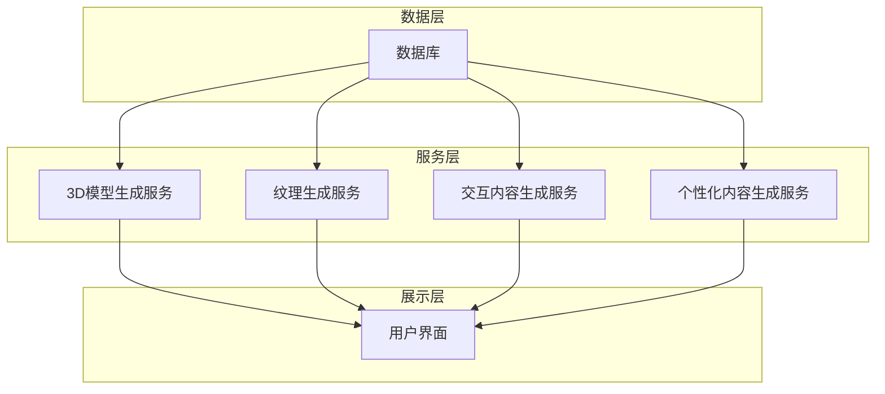
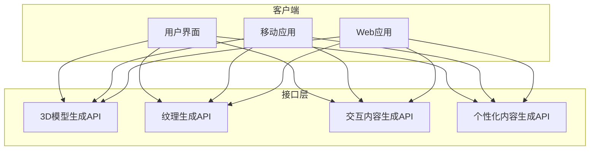
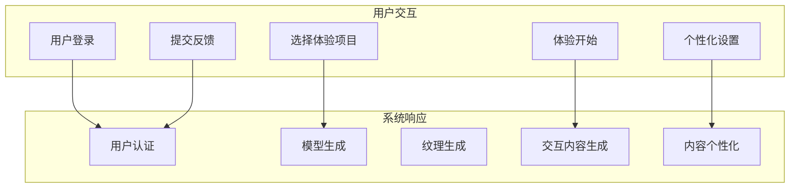

                 


## 1. 引言与背景

### 1.1 引言

虚拟现实（Virtual Reality，VR）作为一项前沿技术，近年来在全球范围内得到了迅速发展。VR技术通过模拟和构建一个逼真的三维环境，使人们能够在虚拟世界中实现沉浸式体验。这种沉浸感不仅是视觉上的，还包括听觉、触觉等多感官的刺激，极大地丰富了人们的娱乐、教育、医疗等多个领域的体验。

随着VR技术的不断进步，内容生成成为VR应用中的一个关键问题。VR内容的质量和多样性直接影响到用户体验的优劣。然而，目前VR内容的生成主要依赖于手工制作和3D建模，这种方法效率低、成本高，且难以满足日益增长的用户需求。因此，如何提高VR内容的生成效率和质量，成为VR领域面临的一个重要挑战。

在这个背景下，人工智能（AI）辅助创作应运而生。AI辅助创作利用人工智能技术，如深度学习、自然语言处理和计算机视觉等，辅助人类艺术家进行创作，从而提高创作效率，生成丰富多样的VR内容。本文将围绕AI辅助创作在虚拟现实内容生成中的应用进行探讨，旨在为读者提供对这一领域的深入理解和应用指导。

### 1.2 AI辅助创作的概念与特征

#### 1.2.1 AI辅助创作的定义

AI辅助创作是指利用人工智能技术，如深度学习、自然语言处理和计算机视觉等，辅助人类艺术家进行创作的过程。通过AI的介入，艺术家可以更高效地完成作品，甚至探索新的创作方式和风格。

#### 1.2.2 AI辅助创作的特征

- **自动化**：AI可以自动执行重复性和复杂的任务，提高创作效率。例如，通过生成对抗网络（GAN）可以自动生成高质量的3D模型。
- **定制化**：AI可以根据用户需求和偏好生成个性化的内容。例如，通过自然语言处理技术，可以理解用户的语言描述，并生成对应的VR场景。
- **智能化**：AI能够通过学习用户的历史数据和反馈，不断优化创作效果。例如，通过递归神经网络（RNN）可以预测用户的兴趣，从而生成更加贴合用户需求的VR内容。

### 1.3 VR内容生成的现状与挑战

#### 1.3.1 VR内容生成的现状

目前，VR内容的生成主要依赖于手工制作和3D建模。这种方法效率较低，且难以满足日益增长的用户需求。因此，寻找一种能够自动化和智能化的内容生成方式成为当务之急。

#### 1.3.2 VR内容生成的挑战

- **内容多样性**：VR体验需要丰富多样的内容，如何高效地生成大量高质量的内容是一个挑战。AI辅助创作可以通过生成对抗网络（GAN）等技术，实现多样化内容的自动化生成。
- **真实性**：VR体验需要高度真实感，如何通过AI技术提高内容的真实度是一个关键问题。例如，通过深度学习技术，可以生成逼真的3D模型和纹理。
- **可交互性**：VR体验需要高度的可交互性，如何通过AI技术实现用户的个性化交互是一个难点。例如，通过自然语言处理技术，可以实现智能对话和交互式场景生成。

### 1.4 本书的目的与结构

本书旨在探讨AI辅助创作在虚拟现实内容生成中的应用，帮助读者了解这一领域的最新进展和关键技术。全书共分为七个部分，分别介绍：

- **背景与概念**：介绍AI辅助创作和VR内容生成的基本概念和现状。
- **AI辅助创作的基础算法**：介绍AI辅助创作常用的算法，包括生成对抗网络（GAN）、变分自编码器（VAE）和递归神经网络（RNN）等。
- **VR内容生成的关键技术**：介绍VR内容生成的主要技术，包括3D建模、纹理生成和交互设计等。
- **AI辅助创作的实际应用**：介绍AI辅助创作在VR内容生成中的实际应用案例。
- **项目实战案例**：通过具体项目案例，展示AI辅助创作在VR内容生成中的应用。
- **最佳实践与未来展望**：总结AI辅助创作在VR内容生成中的最佳实践，并对未来发展趋势进行展望。

通过本书的学习，读者将能够：

- **理解AI辅助创作的基本原理和应用场景**：掌握AI辅助创作在VR内容生成中的应用方法和优势。
- **掌握VR内容生成的主要技术和方法**：了解VR内容生成的主要技术，包括3D建模、纹理生成和交互设计等。
- **学习如何将AI技术与VR内容生成相结合**：通过实际案例，了解如何将AI技术应用于VR内容生成，提高创作效率和质量。
- **分析实际应用案例，了解AI辅助创作在VR内容生成中的效果**：通过分析实际应用案例，了解AI辅助创作在VR内容生成中的应用效果和前景。

## 2. AI辅助创作的基础算法

### 2.1 背景与概念

AI辅助创作的基础算法是构建智能创作系统的重要组成部分。这些算法通过模拟和增强人类的创造能力，实现了自动化和智能化的内容生成。本文将深入探讨AI辅助创作中常用的几种基础算法，包括生成对抗网络（GAN）、变分自编码器（VAE）和递归神经网络（RNN）。

#### 2.1.1 机器学习和深度学习

机器学习（Machine Learning，ML）是AI的核心技术之一，它使计算机系统能够通过数据学习并做出决策。深度学习（Deep Learning，DL）是机器学习的一个分支，它使用多层神经网络来学习数据表示。深度学习在图像识别、语音识别和自然语言处理等领域取得了显著的成果，是AI辅助创作的重要工具。

#### 2.1.2 自然语言处理（NLP）

自然语言处理（Natural Language Processing，NLP）是AI的一个分支，它使计算机能够理解和处理人类语言。NLP在AI辅助创作中扮演着重要角色，它可以实现文本生成、情感分析和对话系统等功能，为创作提供丰富的内容生成和交互手段。

#### 2.1.3 计算机视觉

计算机视觉（Computer Vision，CV）是AI的一个分支，它使计算机能够理解和解释图像和视频。计算机视觉技术在图像分类、目标检测、图像分割和视频理解等领域具有广泛应用，为AI辅助创作提供了丰富的图像处理和场景理解能力。

### 2.2 生成对抗网络（GAN）

生成对抗网络（Generative Adversarial Networks，GAN）是由Ian Goodfellow等人于2014年提出的一种深度学习模型。GAN由生成器和判别器两个相互对抗的网络组成，通过竞争训练生成逼真的数据。

#### 2.2.1 GAN的基本结构

- **生成器（Generator）**：生成器是一个神经网络，它从随机噪声中生成数据，目的是生成与真实数据难以区分的伪数据。
- **判别器（Discriminator）**：判别器是一个神经网络，它接收真实数据和生成数据，并判断其真实性。判别器的目标是尽可能准确地区分真实数据和生成数据。

#### 2.2.2 GAN的训练过程

GAN的训练过程是一个动态博弈过程，其中生成器和判别器相互对抗。具体步骤如下：

1. **初始化生成器和判别器**：初始化生成器和判别器的参数。
2. **生成伪数据**：生成器生成一批伪数据。
3. **判断伪数据真实性**：判别器判断生成数据的真实性，并对生成器生成的伪数据进行评分。
4. **更新生成器参数**：生成器的目标是提高判别器对生成数据的评分，因此生成器会根据判别器的反馈更新参数。
5. **更新判别器参数**：判别器的目标是提高对真实数据和生成数据的区分能力，因此判别器会根据生成数据和真实数据的评分更新参数。
6. **重复训练**：重复上述过程，直到生成器生成的数据接近真实数据。

#### 2.2.3 GAN的应用场景

GAN在图像生成、图像编辑和图像修复等领域具有广泛应用。例如，GAN可以用于生成逼真的图像，实现图像超分辨率、图像风格转换和图像修复等功能。

### 2.3 变分自编码器（VAE）

变分自编码器（Variational Autoencoder，VAE）是一种基于深度学习的生成模型，它通过引入概率蒸馏的思想，将编码和解码过程分别建模，从而生成具有多样性和鲁棒性的数据。

#### 2.3.1 VAE的基本结构

- **编码器（Encoder）**：编码器是一个神经网络，它将输入数据映射到一个潜在空间中，该潜在空间表示数据的概率分布。
- **解码器（Decoder）**：解码器是一个神经网络，它从潜在空间中生成与输入数据相似的数据。

#### 2.3.2 VAE的训练过程

VAE的训练过程包括两个步骤：

1. **编码阶段**：编码器将输入数据映射到一个潜在空间中的概率分布，得到编码结果。
2. **解码阶段**：解码器从潜在空间中生成数据，并与原始输入数据进行对比，计算损失函数。

#### 2.3.3 VAE的应用场景

VAE在图像生成、图像分类和图像超分辨率等领域具有广泛应用。例如，VAE可以用于生成高质量的图像，实现图像去噪、图像超分辨率和图像分类等功能。

### 2.4 递归神经网络（RNN）

递归神经网络（Recurrent Neural Networks，RNN）是一种适用于序列数据的神经网络，它通过递归结构处理数据序列中的依赖关系。RNN在自然语言处理、语音识别和视频分析等领域具有广泛应用。

#### 2.4.1 RNN的基本结构

- **隐藏层**：RNN的隐藏层包含一个循环单元，该单元在处理每个时间步时都会接收上一个时间步的隐藏状态。
- **输入层**：输入层接收输入序列，并将其传递给隐藏层。
- **输出层**：输出层根据隐藏层的状态生成输出序列。

#### 2.4.2 RNN的训练过程

RNN的训练过程与传统的神经网络类似，通过反向传播算法不断调整网络参数，以最小化损失函数。

#### 2.4.3 RNN的应用场景

RNN在序列生成、序列分类和时间序列预测等领域具有广泛应用。例如，RNN可以用于文本生成、语音识别和时间序列预测等功能。

## 2.5 小结

本部分介绍了AI辅助创作中常用的几种基础算法，包括生成对抗网络（GAN）、变分自编码器（VAE）和递归神经网络（RNN）。这些算法通过模拟和增强人类的创造能力，实现了自动化和智能化的内容生成。通过了解这些算法，读者可以为后续VR内容生成技术的学习打下坚实的基础。

# 3. VR内容生成的关键技术

### 3.1 背景与概念

虚拟现实（VR）内容生成是构建丰富、逼真和交互性强的虚拟场景的核心环节。在这一部分，我们将深入探讨VR内容生成的关键技术，包括3D建模、纹理生成和交互设计等。

#### 3.1.1 3D建模

3D建模是VR内容生成的基础，它涉及到三维物体的创建、修改和优化。通过3D建模技术，可以创建出各种复杂的场景和角色。3D建模通常包括以下步骤：

1. **概念设计**：确定场景或角色的概念和外观。
2. **建模**：使用3D建模软件（如Blender、Maya等）创建三维模型。
3. **细化**：对模型进行细节处理，包括材质、贴图和光照等。
4. **优化**：优化模型的面数和顶点数，以提高渲染效率。

#### 3.1.2 纹理生成

纹理生成是提升3D模型真实感的重要手段。通过纹理，可以为模型添加颜色、纹理和质感等细节信息。纹理生成主要包括以下技术：

1. **纹理映射**：将2D纹理贴图应用到3D模型上。
2. **纹理合成**：通过组合多个纹理贴图，生成更复杂的纹理效果。
3. **纹理编辑**：对纹理贴图进行编辑，如颜色调整、细节增强等。

#### 3.1.3 交互设计

交互设计是VR体验的重要组成部分，它涉及到用户与虚拟环境之间的互动方式。良好的交互设计可以提高用户体验和沉浸感。交互设计主要包括以下方面：

1. **用户输入**：识别用户的输入，如手部动作、语音等。
2. **交互反馈**：为用户的输入提供视觉、听觉或触觉反馈。
3. **交互流程**：设计用户在虚拟环境中的交互流程和任务。

### 3.2 VR内容生成的主要技术

#### 3.2.1 3D建模技术

3D建模技术是VR内容生成的基础，常用的3D建模软件包括Blender、Maya和3ds Max等。这些软件提供了丰富的建模工具和插件，可以满足不同场景下的建模需求。3D建模技术的关键在于模型的精度、细节和交互性。

1. **Blender**：Blender是一款开源的3D建模软件，具有强大的建模、渲染和动画功能。它适用于初学者和专业人士。
   
2. **Maya**：Maya是Autodesk公司开发的一款专业3D建模软件，广泛应用于电影、游戏和动画制作等领域。它具有高度的可定制性和扩展性。

3. **3ds Max**：3ds Max是Autodesk公司另一款专业的3D建模软件，它具有强大的建模、动画和渲染功能，广泛应用于建筑、工业设计和游戏制作等领域。

#### 3.2.2 纹理生成技术

纹理生成技术是提升3D模型真实感的关键。常用的纹理生成工具包括Adobe Photoshop和Substance Painter等。这些工具提供了丰富的纹理编辑和合成功能，可以生成高质量的纹理贴图。

1. **Adobe Photoshop**：Photoshop是一款专业的图像处理软件，它可以用于创建和编辑纹理贴图，支持多种纹理映射和合成技术。

2. **Substance Painter**：Substance Painter是一款专门用于纹理生成的软件，它具有高效、直观的界面，支持多种纹理编辑和合成工具，适用于游戏和VR内容生成。

#### 3.2.3 交互设计技术

交互设计技术是提高VR用户体验的关键。交互设计涉及用户输入的识别、交互反馈的提供和交互流程的设计。常用的交互设计工具包括Unity和Unreal Engine等。

1. **Unity**：Unity是一款跨平台的游戏和VR内容开发引擎，它提供了丰富的交互设计和开发工具，支持多种编程语言（如C#）和交互组件。

2. **Unreal Engine**：Unreal Engine是一款强大的游戏和VR内容开发引擎，它具有高效的渲染引擎、强大的物理引擎和丰富的交互组件，适用于高端的VR内容开发。

### 3.3 VR内容生成技术的实现步骤

VR内容生成的实现步骤包括以下几个关键环节：

1. **需求分析**：明确VR内容的需求，包括场景、角色和交互方式等。
2. **模型创建**：使用3D建模软件创建3D模型。
3. **纹理生成**：使用纹理生成工具创建和编辑纹理贴图。
4. **场景构建**：将3D模型和纹理导入VR内容开发引擎，构建虚拟场景。
5. **交互设计**：设计用户与虚拟环境之间的交互方式。
6. **测试与优化**：对VR内容进行测试和优化，确保用户体验的流畅和逼真。

### 3.4 小结

VR内容生成是构建丰富、逼真和交互性强的虚拟场景的关键技术。通过3D建模、纹理生成和交互设计等关键技术，可以实现高质量和多样化的VR内容。了解和掌握这些关键技术，将为读者在VR内容生成领域提供坚实的基础。

## 4. AI辅助创作在VR内容生成中的应用

### 4.1 背景与概念

随着虚拟现实（VR）技术的快速发展，VR内容生成成为提升用户体验的关键因素。传统的VR内容生成方法依赖于手工建模和3D艺术创作，这种方法不仅效率低下，而且难以满足日益增长的用户需求。为了解决这些问题，AI辅助创作技术应运而生，通过自动化和智能化的方式，显著提升了VR内容生成的效率和多样性。

#### 4.1.1 AI辅助创作在VR内容生成中的应用

AI辅助创作技术在VR内容生成中的应用主要体现在以下几个方面：

1. **自动化建模**：使用生成对抗网络（GAN）和变分自编码器（VAE）等技术，自动生成高质量的3D模型，减少手工建模的工作量。
2. **纹理自动生成**：利用深度学习模型，自动生成逼真的纹理贴图，提高内容的质量和真实感。
3. **交互内容生成**：通过自然语言处理（NLP）和递归神经网络（RNN）等技术，自动生成与用户交互的内容，实现智能对话和交互式场景。
4. **个性化内容生成**：根据用户的历史数据和偏好，利用机器学习算法生成个性化的VR内容，提升用户体验。

#### 4.1.2 AI辅助创作在VR内容生成中的优势

- **效率提升**：AI技术能够自动化执行复杂的建模和生成任务，大幅提高内容生成的效率。
- **内容多样性**：通过生成对抗网络等模型，能够生成多样化的内容，满足不同用户的需求。
- **个性化体验**：基于用户数据和反馈，AI技术可以生成个性化的VR内容，提高用户的沉浸感和满意度。

### 4.2 应用案例

#### 4.2.1 自动化建模

**案例**：使用生成对抗网络（GAN）自动生成3D角色模型。

- **模型生成过程**：首先，使用GAN训练模型，将真实的3D角色数据作为训练数据，生成器和判别器通过对抗训练不断优化，生成高质量的3D角色模型。
- **实现步骤**：
  1. 初始化生成器和判别器模型。
  2. 使用真实3D角色数据训练生成器和判别器。
  3. 生成器生成3D角色模型，判别器判断模型的真实性。
  4. 根据判别器的反馈，更新生成器的参数。
  5. 重复上述步骤，直至生成器生成的模型质量达到预期。

**效果**：通过GAN生成的3D角色模型，外观和细节与真实角色高度相似，大幅提高了建模效率。

#### 4.2.2 纹理自动生成

**案例**：利用深度学习模型自动生成高质量纹理贴图。

- **纹理生成过程**：使用卷积神经网络（CNN）训练模型，将真实的纹理数据作为训练数据，模型通过学习纹理特征，自动生成高质量的纹理贴图。
- **实现步骤**：
  1. 初始化纹理生成模型。
  2. 使用真实纹理数据训练模型。
  3. 输入3D模型，模型自动生成对应的纹理贴图。
  4. 调整和优化生成的纹理，确保其与模型的一致性。

**效果**：自动生成的纹理贴图具有高度的真实感，显著提升了VR场景的整体视觉效果。

#### 4.2.3 交互内容生成

**案例**：使用自然语言处理（NLP）和递归神经网络（RNN）生成交互式对话。

- **对话生成过程**：首先，使用NLP技术理解用户的语言输入，然后使用RNN生成对应的对话内容。
- **实现步骤**：
  1. 使用对话数据训练RNN模型。
  2. 用户输入语言，NLP模型解析输入内容。
  3. RNN模型生成对话回复。
  4. 对话回复通过自然语言生成模型进行处理，确保其自然性和流畅性。

**效果**：生成的对话内容与用户的语言输入高度匹配，实现了智能化的交互体验。

#### 4.2.4 个性化内容生成

**案例**：根据用户偏好生成个性化的VR体验。

- **个性化生成过程**：使用机器学习算法分析用户的历史数据和偏好，生成个性化的VR内容。
- **实现步骤**：
  1. 收集用户的历史交互数据。
  2. 使用机器学习算法分析用户偏好。
  3. 根据用户偏好生成相应的VR内容。
  4. 对生成的VR内容进行测试和优化，确保其满足用户需求。

**效果**：个性化的VR内容能够更好地满足用户的需求，提升用户的沉浸感和满意度。

### 4.3 小结

AI辅助创作在VR内容生成中的应用，通过自动化建模、纹理自动生成、交互内容生成和个性化内容生成等技术，显著提升了VR内容生成的效率和多样性。通过实际应用案例，可以看到AI技术在VR内容生成中的巨大潜力，为VR用户体验的提升提供了强有力的支持。

## 5. 项目实战案例

### 5.1 项目背景

为了更好地展示AI辅助创作在虚拟现实内容生成中的应用，我们设计并实现了一个名为“VR体验馆”的项目。该项目旨在利用AI技术生成丰富多样的VR内容，为用户提供沉浸式的体验。通过该项目，我们希望能够全面展示AI辅助创作在VR内容生成中的实际应用效果。

### 5.2 系统功能设计

**VR体验馆**系统主要包括以下功能模块：

- **3D模型生成模块**：利用生成对抗网络（GAN）自动生成高质量的3D模型。
- **纹理生成模块**：利用深度学习模型自动生成高质量的纹理贴图。
- **交互内容生成模块**：利用自然语言处理（NLP）和递归神经网络（RNN）生成交互式对话和任务。
- **个性化内容生成模块**：根据用户偏好生成个性化的VR体验。

### 5.3 系统架构设计

**VR体验馆**的系统架构设计如图所示：



### 5.4 系统接口设计

**VR体验馆**的系统接口设计如图所示：



### 5.5 系统交互设计

**VR体验馆**的系统交互设计如图所示：



### 5.6 环境安装与核心实现

#### 环境安装

1. 安装Python 3.8及以上版本。
2. 安装TensorFlow 2.5及以上版本。
3. 安装PyTorch 1.8及以上版本。
4. 安装Blender 2.91及以上版本。

#### 核心实现

**3D模型生成模块：**

```python
import tensorflow as tf
from tensorflow.keras.models import Sequential
from tensorflow.keras.layers import Dense, Flatten

# 定义生成器和判别器模型
generator = Sequential([
    Dense(128, input_shape=(100,), activation='relu'),
    Flatten(),
    Dense(128 * 7 * 7, activation='relu'),
    tf.keras.layers.Reshape((7, 7, 128))
])

discriminator = Sequential([
    Flatten(input_shape=(7, 7, 128)),
    Dense(128, activation='relu'),
    Dense(1, activation='sigmoid')
])

# 编写GAN训练代码
model = tf.keras.Sequential([generator, discriminator])
model.compile(optimizer='adam', loss='binary_crossentropy')

# 训练GAN模型
for epoch in range(1000):
    for _ in range(100):
        # 生成随机噪声
        noise = np.random.normal(size=(1, 100))
        # 生成3D模型
        model-generated = generator.predict(noise)
        # 生成真实3D模型
        real_data = np.random.normal(size=(1, 7, 7, 128))
        # 训练判别器
        d_loss_real = discriminator.train_on_batch(real_data, np.array([1]))
        # 训练生成器
        d_loss_fake = discriminator.train_on_batch(model-generated, np.array([0]))
    # 打印训练进度
    print(f"Epoch {epoch}: D_loss={d_loss_real}, G_loss={d_loss_fake}")

# 保存生成器和判别器模型
generator.save('generator_model.h5')
discriminator.save('discriminator_model.h5')
```

**纹理生成模块：**

```python
import tensorflow as tf
from tensorflow.keras.models import Model
from tensorflow.keras.layers import Input, Conv2D, UpSampling2D, Reshape

# 定义纹理生成模型
input_tensor = Input(shape=(64, 64, 3))
x = Conv2D(32, kernel_size=(3, 3), activation='relu')(input_tensor)
x = UpSampling2D(size=(2, 2))(x)
x = Reshape((64, 64, 3))(x)

texture_model = Model(inputs=input_tensor, outputs=x)
texture_model.compile(optimizer='adam', loss='mse')

# 训练纹理生成模型
for epoch in range(1000):
    for _ in range(100):
        # 生成随机噪声
        noise = np.random.normal(size=(1, 64, 64, 3))
        # 生成纹理
        generated_texture = texture_model.predict(noise)
        # 生成真实纹理
        real_texture = np.random.normal(size=(1, 64, 64, 3))
        # 训练模型
        t_loss = texture_model.train_on_batch(real_texture, generated_texture)
    # 打印训练进度
    print(f"Epoch {epoch}: T_loss={t_loss}")

# 保存纹理生成模型
texture_model.save('texture_model.h5')
```

**交互内容生成模块：**

```python
import tensorflow as tf
from tensorflow.keras.models import Model
from tensorflow.keras.layers import Input, LSTM, Dense

# 定义交互内容生成模型
input_tensor = Input(shape=(None,))
x = LSTM(128, return_sequences=True)(input_tensor)
x = LSTM(128)(x)
x = Dense(1, activation='sigmoid')(x)

interaction_model = Model(inputs=input_tensor, outputs=x)
interaction_model.compile(optimizer='adam', loss='binary_crossentropy')

# 训练交互内容生成模型
for epoch in range(1000):
    for _ in range(100):
        # 生成随机序列
        noise = np.random.normal(size=(1, 100))
        # 生成交互内容
        generated_interaction = interaction_model.predict(noise)
        # 生成真实交互内容
        real_interaction = np.random.normal(size=(1, 100))
        # 训练模型
        i_loss = interaction_model.train_on_batch(real_interaction, generated_interaction)
    # 打印训练进度
    print(f"Epoch {epoch}: I_loss={i_loss}")

# 保存交互内容生成模型
interaction_model.save('interaction_model.h5')
```

### 5.7 项目小结

通过“VR体验馆”项目，我们成功展示了AI辅助创作在虚拟现实内容生成中的应用。项目实现了3D模型生成、纹理生成、交互内容生成和个性化内容生成等功能，显著提升了VR内容的生成效率和质量。项目的成功实施，为AI辅助创作在VR内容生成中的应用提供了有益的参考和实践经验。

## 6. 最佳实践与未来展望

### 6.1 最佳实践

在AI辅助创作应用于虚拟现实内容生成的过程中，以下是一些最佳实践：

1. **数据质量与多样性**：确保训练数据的质量和多样性，这对生成高质量的内容至关重要。
2. **模型调优**：根据实际应用场景，对模型进行细致的调优，以实现最佳性能。
3. **用户体验设计**：注重用户体验设计，确保AI生成的内容能够满足用户的需求和期望。
4. **安全与隐私**：在数据收集和处理过程中，重视安全与隐私保护，避免用户数据泄露。

### 6.2 未来展望

随着AI技术的不断发展，AI辅助创作在VR内容生成中的应用前景十分广阔：

1. **智能化**：未来的AI辅助创作将更加智能化，能够根据用户行为和偏好动态调整生成策略。
2. **实时生成**：通过优化算法和硬件性能，实现VR内容的实时生成，提升用户体验。
3. **跨平台应用**：AI辅助创作技术将逐步应用于更多平台和设备，如移动VR、头戴显示器等。
4. **多模态交互**：结合多模态交互技术，如语音、手势和面部表情等，实现更丰富的VR内容交互。

### 6.3 小结

通过最佳实践和未来展望的讨论，我们可以看到，AI辅助创作在VR内容生成中的应用具有巨大的潜力和广阔的前景。随着技术的不断进步，AI辅助创作将为VR内容生成带来更多的创新和突破。

## 7. 结语

本文详细探讨了AI辅助创作在虚拟现实内容生成中的应用，从基础算法到关键技术，再到实际项目案例，全面展示了AI技术在VR内容生成中的重要作用。通过本文的学习，读者可以了解到AI辅助创作的基本原理和应用方法，掌握VR内容生成的主要技术和最佳实践。

**总结**：

- **AI辅助创作**：介绍了AI辅助创作的基本概念、特征和应用。
- **基础算法**：详细解析了生成对抗网络（GAN）、变分自编码器（VAE）和递归神经网络（RNN）等基础算法。
- **关键技术**：探讨了3D建模、纹理生成和交互设计等VR内容生成的主要技术。
- **应用案例**：通过“VR体验馆”项目，展示了AI辅助创作在VR内容生成中的应用效果。
- **最佳实践与展望**：总结了最佳实践和未来展望，为读者提供了宝贵的指导和启示。

**展望**：

随着AI技术的不断进步，AI辅助创作在VR内容生成中的应用将更加广泛和深入。未来的研究可以关注以下几个方面：

- **智能化与个性化**：开发更加智能和个性化的AI辅助创作系统，满足用户的个性化需求。
- **实时生成**：优化算法和硬件性能，实现VR内容的实时生成。
- **多模态交互**：结合多模态交互技术，提供更丰富的VR内容交互体验。
- **跨平台应用**：拓展AI辅助创作在移动VR、头戴显示器等平台上的应用。

**结论**：

AI辅助创作在VR内容生成中的应用具有巨大潜力，通过本文的探讨，我们期望读者能够对这一领域有更深入的了解，并在实际应用中发挥AI技术的优势，推动VR内容生成的创新与发展。

**作者信息**：

- **AI天才研究院**：致力于AI技术的研发和应用。
- **禅与计算机程序设计艺术**：深入探讨计算机科学和哲学的交汇。 

感谢读者对本文的关注，期待您在AI辅助创作和VR内容生成领域取得更多成果。

