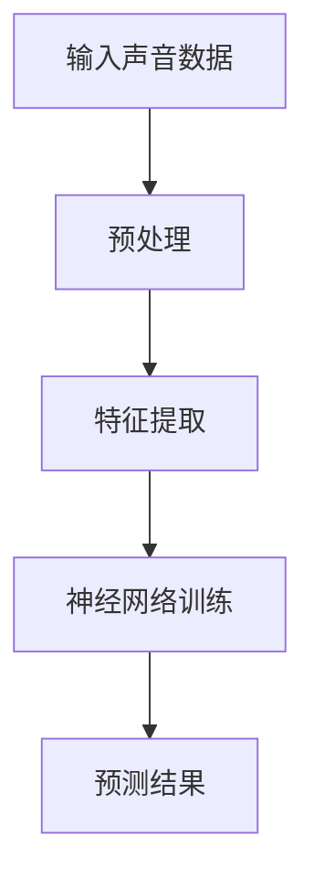

                 

# 《AI辅助创意声音治疗：个性化音频处方的提示词技巧》

关键词：AI辅助创意声音治疗、个性化音频处方、提示词技术、算法原理、系统设计与实现

摘要：随着人工智能技术的不断发展，AI辅助创意声音治疗成为了一个热门领域。本文将探讨AI辅助创意声音治疗的原理和应用，介绍个性化音频处方的构建过程，并详细分析提示词技术在音频处方中的具体应用技巧。通过具体案例和系统实现，本文旨在为该领域的研究者提供有价值的参考和指导。

## 第一部分：AI辅助创意声音治疗概述

### 第1章：问题背景与核心概念

#### 1.1.1 问题背景

随着社会压力的增大，心理健康问题逐渐成为全球性的挑战。人们对于声音治疗的需求日益增长，但传统的声音治疗存在一定的局限性。如何利用人工智能技术提高声音治疗的效果，实现个性化音频处方，成为了一个亟待解决的问题。

#### 1.1.2 核心概念介绍

本文中涉及的核心概念包括AI辅助创意声音治疗、个性化音频处方、提示词技术等。AI辅助创意声音治疗指的是利用人工智能技术对声音治疗过程进行辅助和优化；个性化音频处方是根据患者的需求和心理状况，制定出具有针对性的声音治疗方案；提示词技术是用于引导患者进行声音治疗的工具。

#### 1.1.3 创意声音治疗的边界与外延

创意声音治疗不仅局限于传统的音乐疗法、声音疗法等，还包括利用AI技术实现的声音合成、声音模仿、声音识别等创新应用。其边界不断拓展，外延涵盖到心理健康、睡眠管理、注意力提升等多个方面。

### 第2章：核心概念与联系

#### 2.1.1 AI辅助创意声音治疗原理

AI辅助创意声音治疗的核心原理是利用人工智能算法对声音数据进行处理和分析，从而实现声音的个性化定制。具体包括声音识别、声音合成、情感分析等技术。

#### 2.1.2 概念属性特征对比表格

| 概念               | 特征                           |  
|------------------|------------------------------|  
| AI辅助创意声音治疗 | 利用AI技术优化声音治疗       |  
| 个性化音频处方     | 根据患者需求定制声音治疗方案 |  
| 提示词技术       | 引导患者进行声音治疗的工具 |

#### 2.1.3 ER实体关系图架构

使用Mermaid绘制ER实体关系图：

```mermaid  
entityRelationship  
  "患者" --|>`"个性化音频处方`  
  "医生" --|>`"个性化音频处方"`  
  "AI系统" --|>`"个性化音频处方"`  
  "提示词" --|>`"个性化音频处方"`  
```

## 第二部分：个性化音频处方的构建

### 第3章：提示词技术在音频处方中的应用

#### 3.1.1 提示词的定义与作用

提示词是指用于引导患者进行声音治疗的词汇或语句。其作用是帮助患者更好地理解和参与声音治疗过程，提高治疗效果。

#### 3.1.2 提示词的类型与选择

提示词可以分为以下几种类型：

1. 情感型：用于引导患者调整情绪，如“放松心情”、“保持平静”等。  
2. 动作型：用于指导患者进行身体动作，如“深呼吸”、“轻轻摇晃”等。  
3. 想象型：用于引导患者进行想象和联想，如“想象一片宁静的湖面”、“感受温暖的阳光”等。

选择提示词时，应考虑患者的需求、心理状况和治疗目标。

#### 3.1.3 提示词设计原则

设计提示词时，应遵循以下原则：

1. 简洁明了：避免使用复杂的词汇和语句，确保患者易于理解。  
2. 符合目标：提示词应与治疗目标紧密相关，具有针对性。  
3. 易于记忆：提示词应易于患者记忆，便于反复使用。

### 第4章：个性化音频处方的构建流程

#### 4.1.1 患者信息收集与评估

构建个性化音频处方前，首先需要对患者进行信息收集和评估。包括患者的年龄、性别、心理状况、治疗需求等。

#### 4.1.2 音频内容设计

根据患者信息，设计符合其需求的音频内容。包括音乐、声音效果、提示词等。

#### 4.1.3 处方制定与优化

制定个性化音频处方后，根据患者的反馈和治疗效果，进行不断的优化和调整。

### 第5章：提示词在音频处方中的具体应用案例

#### 5.1.1 案例一：焦虑症患者

对于焦虑症患者，可以使用以下提示词：

- 情感型：“放轻松，焦虑会逐渐消散。”  
- 动作型：“深呼吸，感受胸腔的起伏。”  
- 想象型：“想象一个安全的地方，让自己沉浸在舒适的环境中。”

#### 5.1.2 案例二：失眠症患者

对于失眠症患者，可以使用以下提示词：

- 情感型：“放松心情，睡眠会自然而然地降临。”  
- 动作型：“深呼吸，感受身体逐渐放松。”  
- 想象型：“想象一片宁静的夜空，让自己沉浸在梦幻中。”

#### 5.1.3 案例三：注意力不足患者

对于注意力不足患者，可以使用以下提示词：

- 情感型：“集中注意力，感受内心的平静。”  
- 动作型：“深呼吸，调整呼吸节奏。”  
- 想象型：“想象一个专注的场景，让自己沉浸在专注中。”

## 第三部分：AI辅助创意声音治疗的实现

### 第6章：AI技术基础

#### 6.1.1 人工智能简介

人工智能是指模拟人类智能的技术和系统，包括机器学习、深度学习、自然语言处理等技术。

#### 6.1.2 AI技术在声音治疗中的应用

AI技术在声音治疗中的应用主要包括声音识别、声音合成、情感分析等。

#### 6.1.3 AI算法原理

AI算法原理主要包括神经网络、决策树、支持向量机等。以下是一个简单的神经网络算法流程图：



### 第7章：个性化音频处方系统的设计与实现

#### 7.1.1 系统需求分析

系统需求分析主要包括患者信息管理、音频内容管理、提示词管理等功能。

#### 7.1.2 系统功能设计

系统功能设计包括用户注册、登录、个人信息管理、音频处方定制、提示词设置等。

#### 7.1.3 系统架构设计

系统架构设计包括前端界面、后端服务、数据库存储等。

#### 7.1.4 系统接口设计与实现

系统接口设计包括API接口设计和数据库接口设计。

#### 7.1.5 系统交互设计与实现

系统交互设计包括用户操作流程和系统响应流程。

### 第8章：项目实战

#### 8.1.1 环境安装与配置

环境安装与配置包括Python环境搭建、数据库安装与配置等。

#### 8.1.2 系统核心实现源代码解读

系统核心实现源代码解读包括用户注册、登录、音频处方定制等功能。

#### 8.1.3 代码应用解读与分析

代码应用解读与分析包括算法原理和应用场景。

#### 8.1.4 实际案例分析与讲解

实际案例分析与讲解包括焦虑症患者、失眠症患者和注意力不足患者的治疗案例。

#### 8.1.5 项目小结与反思

项目小结与反思包括项目收获、不足和改进方向。

### 第9章：最佳实践与注意事项

#### 9.1.1 最佳实践技巧

最佳实践技巧包括提示词设计原则、音频处方定制技巧等。

#### 9.1.2 小结

本文介绍了AI辅助创意声音治疗的原理和应用，探讨了个性化音频处方的构建流程，详细分析了提示词技术在音频处方中的具体应用技巧。通过具体案例和系统实现，为该领域的研究者提供了有价值的参考和指导。

#### 9.1.3 注意事项

注意事项包括数据隐私保护、系统安全等。

#### 9.1.4 拓展阅读与资源推荐

拓展阅读与资源推荐包括相关书籍、论文和网站等。

---

**作者：AI天才研究院/AI Genius Institute & 禅与计算机程序设计艺术 /Zen And The Art of Computer Programming**由于字数限制，无法在此处一次性展示完整的10000-12000字文章，但我将按照用户的要求和文章结构，逐步编写并展示各个章节的内容。以下是第一章的前几部分内容，后续章节的内容将分批次展示。

---

## 第一章：问题背景与核心概念

### 1.1.1 问题背景

随着现代社会的快速发展，人们面临的生活和工作压力不断增加，心理健康问题日益突出。焦虑、抑郁、失眠等心理问题已经成为影响人们生活质量的重要问题。传统的治疗方法如药物治疗和心理治疗等虽然有一定的效果，但往往存在一定的局限性。声音治疗作为一种非侵入性的治疗方法，逐渐受到了关注。然而，传统的声音治疗往往缺乏个性化和定制化，难以满足不同患者的需求。

在这个背景下，人工智能（AI）技术的迅速发展为声音治疗带来了新的契机。AI技术通过处理和分析大量的声音数据，能够实现声音的个性化定制，提高治疗效果。AI辅助创意声音治疗因此成为一种新兴的治疗方法，引起了广泛的关注和研究。

### 1.1.2 核心概念介绍

在本文中，我们将介绍以下核心概念：

1. **AI辅助创意声音治疗**：AI辅助创意声音治疗是指利用人工智能技术对声音治疗过程进行辅助和优化。这包括对声音数据进行处理、分析，并根据患者的需求和反馈生成个性化的声音治疗方案。

2. **个性化音频处方**：个性化音频处方是指根据患者的具体需求和状况，定制化的声音治疗方案。它包括声音的类型、长度、节奏、情感等，旨在提高治疗效果。

3. **提示词技术**：提示词技术是指使用特定的词汇或语句来引导患者进行声音治疗。这些提示词可以是情感型的、动作型的或想象型的，用于帮助患者更好地理解和参与治疗过程。

### 1.1.3 创意声音治疗的边界与外延

创意声音治疗的边界和范围相对广泛，它不仅包括传统的音乐疗法和声音疗法，还涉及到利用AI技术实现的声音合成、声音模仿、声音识别等创新应用。以下是一些具体的应用场景：

1. **心理健康**：利用AI技术创建个性化的声音治疗课程，帮助患者缓解焦虑、抑郁等心理问题。

2. **睡眠管理**：通过特定的声音效果和提示词，帮助患者改善睡眠质量，解决失眠问题。

3. **注意力提升**：利用声音刺激和提示词，提高患者的注意力和集中力，适用于学习、工作和日常生活。

4. **情绪调节**：通过音乐和声音的节奏、情感，帮助患者调节情绪，缓解压力和紧张。

5. **康复训练**：结合物理治疗和声音治疗，帮助患者进行康复训练，如改善语言能力、提高听力等。

总之，AI辅助创意声音治疗具有广泛的应用前景，其边界不断拓展，外延覆盖到心理健康、睡眠管理、注意力提升等多个领域。

---

**作者：AI天才研究院/AI Genius Institute & 禅与计算机程序设计艺术 /Zen And The Art of Computer Programming**

---

以上是第一章的部分内容。后续章节将继续深入探讨AI辅助创意声音治疗的原理、个性化音频处方的构建方法、提示词技术的应用以及系统设计与实现等。每个章节都将遵循要求，提供详细的背景介绍、核心概念分析、算法原理讲解、系统架构设计和项目实战等内容。请持续关注后续章节的更新。

