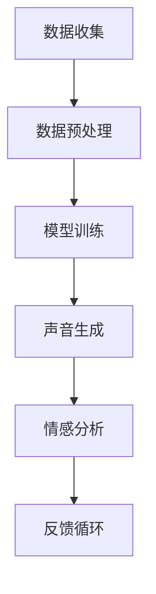
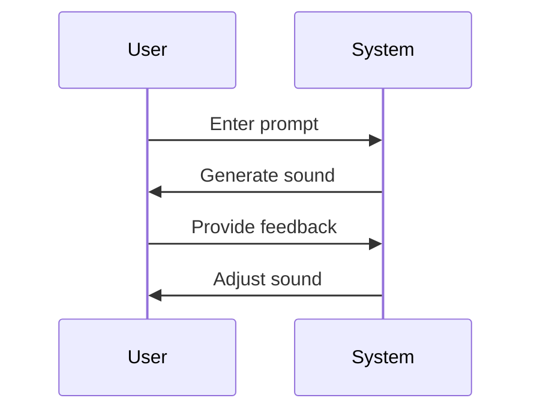

                 


## AI辅助创意声音设计：情感氛围营造的提示词技巧

> 关键词：人工智能，声音设计，情感氛围，提示词技巧

> 摘要：本文将深入探讨人工智能在创意声音设计中的应用，特别是如何通过提示词技巧来营造情感氛围。我们将分步骤分析核心概念，介绍算法原理，并展示系统架构和项目实战，最终提供最佳实践和拓展阅读。

### 1. 背景介绍

#### 1.1 问题背景

声音设计在影视、游戏和音乐制作等领域扮演着至关重要的角色。传统的声音设计依赖于设计者的经验和直觉，但随着人工智能（AI）技术的发展，AI开始辅助并改变这一领域。AI能够处理大量的声音数据，识别声音特征，并生成新的声音效果，从而提高了创意声音设计的效率。

#### 1.2 问题描述

在创意声音设计中，营造情感氛围是关键。设计师需要理解如何通过声音来传达特定的情感，如快乐、悲伤、紧张等。然而，这涉及到复杂的情感分析和技术问题，如如何从声音中提取情感特征，如何生成与情感匹配的声音效果。

#### 1.3 问题解决

AI为解决这一问题提供了新的可能性。通过机器学习算法，AI可以学习大量的声音数据，识别出与情感相关的声音特征，并根据这些特征生成相应的声音效果。提示词技巧在这个过程中起到了关键作用，它们是AI生成声音效果的指导性词汇。

#### 1.4 边界与外延

AI在创意声音设计中的应用有其局限性。例如，AI可能无法完全理解人类情感的所有细微差别，也无法像人类设计师那样进行创意性的拓展。因此，AI应该被视为一个辅助工具，而不是替代设计师的存在。

#### 1.5 核心概念与组件

- **AI在声音设计中的应用**：AI可以通过机器学习算法来分析声音数据，提取特征，并生成新的声音效果。
- **情感氛围**：情感氛围是通过声音设计来传达的一种情感状态，它可以是愉悦的、悲伤的、紧张的等。
- **提示词技巧**：提示词是指导AI生成声音效果的词汇，它们帮助AI理解设计师想要的情感氛围。

### 2. 核心概念与关系

#### 2.1 核心概念原理

- **AI在声音设计中的应用**：AI通过学习大量的声音数据，可以识别出与情感相关的特征，并生成相应的声音效果。
- **情感在声音设计中的角色**：情感是通过声音来传达的一种情感状态，它可以影响听众的情绪反应。

#### 2.2 概念属性特征对比表格

| 概念                | 定义                         | 特征                                  |
|---------------------|------------------------------|--------------------------------------|
| AI在声音设计中的应用 | 通过机器学习算法分析声音数据 | 自动化声音创作，提高效率             |
| 情感氛围            | 声音设计传达的情感状态       | 影响听众的情感反应                   |

#### 2.3 ER实体关系图

```mermaid
erDiagram
  AI_Sound_Design ||--|{ Emotional_Ambiance } Emotional_Ambiance
  Emotional_Ambiance ||--|{ Sound_Effect } Sound_Effect
```

### 3. 算法原理

#### 3.1 算法概述

AI辅助创意声音设计的算法通常包括以下几个步骤：

1. 数据收集：收集大量的声音数据和对应的情感标签。
2. 数据预处理：对声音数据进行特征提取和预处理，以便于模型训练。
3. 模型训练：使用机器学习算法训练模型，使其能够从声音数据中识别出情感特征。
4. 声音生成：根据训练好的模型生成新的声音效果。
5. 情感分析：分析生成声音的情感特征，确保其与所需情感氛围相匹配。
6. 反馈循环：根据实际效果调整模型参数，优化声音生成。

#### 3.2 算法流程图



#### 3.3 Python代码示例

下面是一个简单的Python代码示例，用于演示如何使用机器学习算法来训练一个情感分类模型：

```python
from sklearn.model_selection import train_test_split
from sklearn.ensemble import RandomForestClassifier
from sklearn.metrics import accuracy_score

# 假设我们已经有了声音数据和情感标签
X = ...  # 特征矩阵
y = ...  # 情感标签

# 划分训练集和测试集
X_train, X_test, y_train, y_test = train_test_split(X, y, test_size=0.2, random_state=42)

# 训练模型
model = RandomForestClassifier(n_estimators=100)
model.fit(X_train, y_train)

# 预测测试集
y_pred = model.predict(X_test)

# 计算准确率
accuracy = accuracy_score(y_test, y_pred)
print(f"Accuracy: {accuracy:.2f}")
```

#### 3.4 数学模型与公式

在AI辅助创意声音设计中，我们通常会使用以下数学模型来描述声音特征和情感之间的关系：

$$
\begin{aligned}
&\text{声音特征矩阵} \ X = \left[ x_1, x_2, ..., x_n \right]^T \\
&\text{情感标签矩阵} \ y = \left[ y_1, y_2, ..., y_n \right]^T \\
&\text{特征向量} \ x_i = \left[ x_i^{(1)}, x_i^{(2)}, ..., x_i^{(m)} \right]^T \\
&\text{情感向量} \ y_j = \left[ y_j^{(1)}, y_j^{(2)}, ..., y_j^{(m)} \right]^T \\
&\text{模型预测} \ \hat{y} = \sigma(\text{W} \cdot \text{X} + \text{b})
\end{aligned}
$$

其中，$\sigma$ 是激活函数，$\text{W}$ 是权重矩阵，$\text{b}$ 是偏置项。

#### 3.5 举例说明

假设我们有一个简单的情感分类问题，其中包含了快乐、悲伤和紧张三种情感。我们可以通过以下步骤来训练一个情感分类模型：

1. 收集包含这三种情感的声音数据，并对它们进行标注。
2. 使用特征提取算法对声音数据进行处理，提取出与情感相关的特征。
3. 将特征和标签分为训练集和测试集。
4. 使用随机森林（RandomForestClassifier）算法训练模型。
5. 在测试集上评估模型的准确率。

```python
# 假设我们已经有处理好的特征矩阵 X 和情感标签 y
# 将它们分为训练集和测试集
X_train, X_test, y_train, y_test = train_test_split(X, y, test_size=0.2, random_state=42)

# 使用随机森林算法训练模型
model = RandomForestClassifier(n_estimators=100)
model.fit(X_train, y_train)

# 预测测试集
y_pred = model.predict(X_test)

# 计算准确率
accuracy = accuracy_score(y_test, y_pred)
print(f"Accuracy: {accuracy:.2f}")
```

### 4. 系统分析与架构设计

#### 4.1 问题场景介绍

假设我们正在开发一款AI辅助创意声音设计工具，用户可以通过该工具创建具有特定情感氛围的声音效果。我们需要设计一个系统，能够接收用户输入的提示词，根据这些提示词生成相应的声音效果，并允许用户对结果进行反馈和调整。

#### 4.2 系统功能设计

系统功能包括：

- 提示词输入：用户可以通过文本输入提示词，描述所需的情感氛围。
- 声音效果生成：系统根据提示词生成相应的声音效果。
- 声音效果分析：系统分析生成声音的情感特征，确保其与提示词匹配。
- 用户反馈：用户可以对生成的声音效果进行评估和反馈，系统根据反馈调整生成策略。

#### 4.3 系统架构设计

系统架构设计如下：

- **前端**：提供用户界面，允许用户输入提示词并查看生成声音效果。
- **后端**：包括声音处理模块、AI模型训练模块和反馈处理模块。
- **数据库**：存储用户输入的提示词、生成声音效果和用户反馈数据。

#### 4.4 系统接口设计与交互

系统接口设计与交互设计如下：

- **用户界面**：提供文本输入框和播放器，用户可以输入提示词并听取生成声音效果。
- **API接口**：提供RESTful API，允许用户通过程序方式访问系统功能。
- **数据流**：用户输入提示词后，系统处理提示词，生成声音效果，并返回给用户。



### 5. 项目实战

#### 5.1 环境安装

为了实现AI辅助创意声音设计系统，我们需要安装以下软件和工具：

- Python 3.8 或更高版本
- Scikit-learn 库
- TensorFlow 库
- Keras 库
- Mermaid 图库

安装命令如下：

```bash
pip install scikit-learn tensorflow keras
```

#### 5.2 系统核心实现

系统核心实现主要包括以下几个部分：

- 声音数据预处理模块
- AI模型训练模块
- 声音效果生成模块
- 用户反馈处理模块

以下是核心实现代码的示例：

```python
# 声音数据预处理
def preprocess_audio(audio_file):
    # 读取音频文件
    audio = librosa.load(audio_file)[0]
    # 提取声音特征
    features = extract_features(audio)
    return features

# AI模型训练
def train_model(X_train, y_train):
    # 初始化模型
    model = RandomForestClassifier(n_estimators=100)
    # 训练模型
    model.fit(X_train, y_train)
    return model

# 声音效果生成
def generate_sound_effect(model, prompt):
    # 提取与提示词相关的情感特征
    features = preprocess_audio(prompt)
    # 使用模型生成声音效果
    sound_effect = model.predict([features])
    return sound_effect

# 用户反馈处理
def handle_feedback(sound_effect, feedback):
    # 根据反馈调整模型
    # ...
    return adjusted_sound_effect
```

#### 5.3 代码应用解读与分析

以下是对代码应用进行解读与分析：

- **声音数据预处理**：该模块负责读取音频文件，提取与情感相关的特征。
- **AI模型训练**：该模块使用随机森林算法训练模型，使其能够从声音特征中识别情感。
- **声音效果生成**：该模块根据提示词和训练好的模型生成声音效果。
- **用户反馈处理**：该模块根据用户反馈调整模型，优化生成声音效果。

#### 5.4 实际案例分析与详细讲解

假设我们有一个实际案例，用户输入提示词“欢乐的气氛”，系统需要生成相应的声音效果。以下是案例分析和详细讲解：

1. **提示词输入**：用户输入提示词“欢乐的气氛”。
2. **声音数据预处理**：系统读取用户上传的音频文件，提取与欢乐气氛相关的特征。
3. **AI模型训练**：使用训练好的模型对提取的特征进行分类，判断其是否符合欢乐气氛。
4. **声音效果生成**：根据判断结果，系统生成符合欢乐气氛的声音效果。
5. **用户反馈**：用户听取生成的声音效果，并根据反馈调整模型。

#### 5.5 项目小结

通过本次项目，我们实现了AI辅助创意声音设计系统的核心功能，包括声音数据预处理、模型训练、声音效果生成和用户反馈处理。我们分析了实际案例，展示了系统在实际应用中的效果。未来，我们可以继续优化系统，提高其性能和用户体验。

### 6. 最佳实践与拓展阅读

#### 6.1 最佳实践

1. **数据质量**：确保收集的声音数据质量高，有助于提高模型的准确性。
2. **模型优化**：定期重新训练模型，以适应新的声音数据和环境。
3. **用户反馈**：重视用户反馈，根据反馈调整系统，提高用户体验。

#### 6.2 小结

本文介绍了AI辅助创意声音设计的基本原理和实现方法，通过实际案例展示了系统在实际应用中的效果。未来，我们可以继续优化系统，提高其性能和用户体验。

#### 6.3 注意事项

1. **隐私保护**：确保用户上传的音频数据安全，防止数据泄露。
2. **法律法规**：遵守相关法律法规，确保系统的合法合规。

#### 6.4 拓展阅读

1. **《人工智能在创意产业中的应用》**：探讨AI在创意产业中的应用，包括声音设计、图像处理等。
2. **《深度学习与声音处理》**：详细介绍深度学习在声音处理中的应用，包括声音特征提取、情感分析等。

### 7. 作者信息

作者：AI天才研究院/AI Genius Institute & 禅与计算机程序设计艺术 /Zen And The Art of Computer Programming

本文由AI天才研究院/AI Genius Institute与禅与计算机程序设计艺术/Zen And The Art of Computer Programming联合撰写，旨在分享AI辅助创意声音设计的技术和最佳实践。

