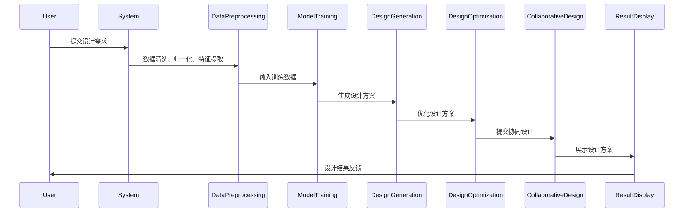
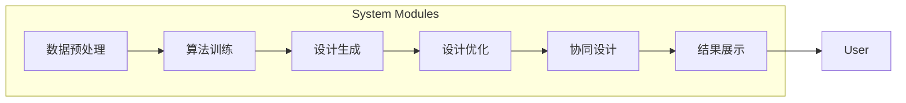
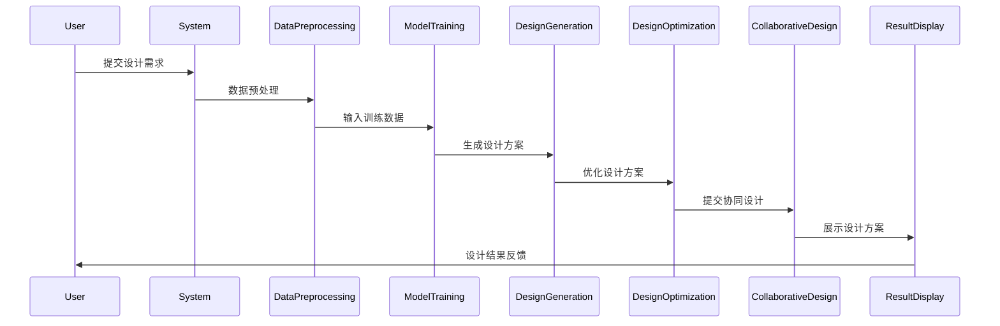

                 

### 1.1 AI技术的发展与建筑设计的结合

**背景介绍**

随着人工智能技术的飞速发展，AI在各个领域的应用日益广泛，建筑设计领域也不例外。人工智能（AI）作为计算机科学的一个分支，旨在开发能够执行通常需要人类智能才能完成的任务的技术系统。近年来，深度学习、机器学习等AI技术取得了显著进步，为许多行业带来了革命性的变化。

**问题背景**

传统的建筑设计过程通常涉及复杂的计算和大量的手工工作。设计师需要耗费大量时间进行图纸绘制、材料选择、结构计算等。同时，建筑设计中常常面临创意枯竭、设计重复、协调困难等问题。这些问题不仅影响了设计效率，还可能导致设计质量和创新性下降。

**问题描述**

随着城市规模的不断扩大和建筑项目的日益复杂，建筑设计面临以下问题：
- **创意不足**：设计师可能因为长时间的工作积累而出现创意枯竭的问题。
- **设计重复**：由于缺乏有效的创新机制，设计方案容易出现重复。
- **协调困难**：建筑项目通常涉及多方参与，协调工作复杂且耗时。
- **效率低下**：传统手工设计方式效率较低，无法满足快速发展的需求。

**问题解决**

AI技术的引入为建筑设计提供了新的解决方案。通过利用AI，可以实现以下目标：
- **增强创意**：AI可以辅助设计师生成新颖的设计方案，激发创意灵感。
- **提高效率**：AI可以自动化许多传统手工工作，提高设计效率。
- **优化协调**：AI可以协助不同团队之间的协调工作，减少沟通成本。

**边界与外延**

AI辅助建筑设计不仅限于外观设计，还可以扩展到结构设计、材料选择、环境模拟等方面。此外，AI技术还可以与其他领域的技术相结合，如建筑信息模型（BIM）、虚拟现实（VR）等，为建筑设计提供更加全面和高效的解决方案。

**概念结构与核心要素组成**

AI辅助建筑设计主要涉及以下几个核心要素：
- **数据集**：用于训练AI模型的建筑数据集，包括外观、结构、材料等。
- **算法**：如深度学习、生成对抗网络（GAN）等，用于处理和生成设计方案。
- **工具**：如CAD软件、BIM软件等，用于实现AI模型的实际应用。

### 1.2 AI技术的发展

**核心概念术语说明**

- **人工智能（AI）**：模拟人类智能行为的计算机技术。
- **机器学习（ML）**：从数据中学习规律并做出预测或决策的技术。
- **深度学习（DL）**：一种特殊的机器学习技术，使用多层神经网络进行复杂模型训练。

**核心概念原理**

AI技术的发展经历了几个阶段：

1. **符号主义AI**：基于逻辑和规则的方法，如专家系统。
2. **知识表示与推理**：通过符号和知识库进行推理和决策。
3. **基于模型的AI**：使用统计模型进行数据分析和预测。
4. **深度学习**：使用多层神经网络，通过大量数据进行训练，能够自动提取特征和模式。

**概念属性特征对比表格**

| AI阶段       | 特点                             | 应用场景                             |
| ------------ | -------------------------------- | ----------------------------------- |
| 符号主义AI   | 基于逻辑和规则                   | 专家系统、自然语言处理               |
| 知识表示与推理 | 使用知识库进行推理               | 智能搜索、决策支持系统             |
| 统计模型     | 使用概率和统计方法进行预测       | 数据分析、风险评估、推荐系统       |
| 深度学习     | 多层神经网络，自动提取特征       | 图像识别、语音识别、自然语言处理   |

**ER实体关系图架构**

ER图展示了AI技术在不同阶段的实体和关系：

```mermaid
erDiagram
    AI技术 ||--|{ 符号主义AI }
    AI技术 ||--|{ 知识表示与推理 }
    AI技术 ||--|{ 统计模型 }
    AI技术 ||--|{ 深度学习 }
```

### 1.3 建筑设计中的问题与挑战

**核心概念原理**

建筑设计过程中面临的主要挑战包括：

1. **设计复杂性**：现代建筑设计涉及复杂的结构、材料和功能需求，设计师需要处理大量信息。
2. **协调困难**：建筑项目通常涉及多方参与，如业主、建筑师、工程师等，各方需求难以协调。
3. **时间压力**：建筑项目通常有严格的时间限制，设计师需要在有限的时间内完成高质量的设计。
4. **资源限制**：设计师和设计团队可能受到预算、人员和技术资源的限制。

**问题解决方法**

AI技术的引入为上述问题提供了一些解决思路：

1. **自动化设计**：通过自动化工具，如CAD软件，提高设计效率。
2. **协同设计**：使用BIM软件，实现多方协作和实时沟通。
3. **快速原型**：使用AI辅助生成初步设计，快速评估和优化方案。
4. **智能预测**：利用大数据分析和机器学习，预测项目进度和成本。

**边界与外延**

AI在建筑设计中的应用不仅限于设计阶段，还可以扩展到施工、运营和维护等各个阶段。例如，AI可以用于施工过程中的质量检测和进度监控，或者在建筑物的运营过程中进行能耗分析和优化。

### 1.4 AI辅助设计的优势

**核心概念原理**

AI辅助建筑设计具有以下优势：

1. **提高效率**：AI可以自动化许多设计任务，减少手工工作，提高设计效率。
2. **增强创意**：AI可以生成新颖的设计方案，激发设计师的创意灵感。
3. **优化协调**：AI可以协助设计师与各方进行协调，减少沟通成本。
4. **降低成本**：通过自动化和优化，降低设计、施工和维护的成本。

**概念属性特征对比表格**

| 传统设计       | AI辅助设计                           |
| -------------- | ------------------------------------ |
| 手工绘制图纸   | 自动化设计工具如CAD软件             |
| 依赖设计师经验 | 基于数据和算法生成设计             |
| 难以实现协同   | 支持多方协作和实时沟通             |
| 设计方案有限   | 可以生成多样化的设计方案           |

### 1.5 本章小结

本章介绍了AI辅助建筑设计的背景、问题、优势和核心概念。通过理解AI技术的发展和建筑设计中的挑战，我们可以认识到AI辅助设计的重要性。接下来，我们将进一步探讨AI辅助建筑设计的核心概念，如深度学习、生成对抗网络等，并分析这些概念在实际应用中的优势和局限。这将为我们理解AI技术在建筑设计中的潜力打下坚实的基础。

## 第2章：AI辅助建筑设计的核心概念

### 2.1 深度学习基础

#### 2.1.1 神经网络

**核心概念原理**

神经网络是一种模仿生物神经网络结构的人工智能方法。它由大量相互连接的神经元组成，通过学习输入数据来提取特征和进行预测。

**神经网络基本结构**

神经网络主要包括以下组成部分：

- **输入层**：接收输入数据。
- **隐藏层**：对输入数据进行处理和提取特征。
- **输出层**：输出最终结果。

**激活函数**

激活函数是神经网络中的一个关键组件，用于决定神经元是否被激活。常用的激活函数包括：

- **Sigmoid函数**：将输入映射到(0,1)区间。
- **ReLU函数**：在输入为负时输出0，输入为正时输出输入值。

**核心数学模型与公式**

神经网络的数学模型主要包括：

- **前向传播**：计算输出值。
- **反向传播**：更新权重和偏置，优化模型。

**示例**

假设有一个简单的单层神经网络，其输入为\(x_1, x_2\)，权重为\(w_1, w_2\)，偏置为\(b_1, b_2\)。激活函数使用ReLU函数，则：

$$
z = max(0, w_1 \cdot x_1 + w_2 \cdot x_2 + b)
$$

#### 2.1.2 卷积神经网络（CNN）

**核心概念原理**

卷积神经网络是一种专门用于处理图像数据的神经网络，通过卷积操作提取图像中的局部特征。

**CNN基本结构**

CNN主要包括以下组成部分：

- **卷积层**：通过卷积操作提取图像特征。
- **池化层**：减少特征图的维度。
- **全连接层**：对提取到的特征进行分类或回归。

**卷积操作**

卷积操作是通过滤波器（卷积核）在图像上滑动，提取局部特征。

$$
h_{ij} = \sum_{k=1}^{n} w_{ik} \cdot x_{kj} + b
$$

其中，\(h_{ij}\)是输出特征图上的像素值，\(x_{kj}\)是输入特征图上的像素值，\(w_{ik}\)是卷积核权重，\(b\)是偏置。

**核心数学模型与公式**

CNN的核心数学模型包括：

- **卷积运算**：计算特征图上的每个像素值。
- **池化操作**：减少特征图的尺寸。

**示例**

假设一个3x3的卷积核在5x5的特征图上滑动，权重为\[1, 0, -1\]，偏置为1，则卷积操作如下：

$$
h_{11} = (1 \cdot 1 + 0 \cdot 0 - 1 \cdot 1) + 1 = 0
$$
$$
h_{12} = (1 \cdot 0 + 0 \cdot 0 - 1 \cdot 1) + 1 = 0
$$
$$
h_{13} = (1 \cdot 1 + 0 \cdot 0 - 1 \cdot 0) + 1 = 1
$$

#### 2.1.3 循环神经网络（RNN）

**核心概念原理**

循环神经网络是一种处理序列数据的神经网络，通过内部状态循环处理序列中的每个元素。

**RNN基本结构**

RNN主要包括以下组成部分：

- **隐藏层**：保存序列信息。
- **循环连接**：将隐藏层的信息传递给下一时间步。
- **门控机制**：控制信息流动。

**门控机制**

门控机制包括：

- **遗忘门**：决定忘记多少旧信息。
- **输入门**：决定接受多少新信息。
- **输出门**：决定输出什么信息。

**核心数学模型与公式**

RNN的核心数学模型包括：

- **状态更新**：通过门控机制更新隐藏状态。
- **输出计算**：根据隐藏状态和输入计算输出。

**示例**

假设有一个简单的RNN，隐藏状态为\(h_t\)，输入为\(x_t\)，权重为\(w\)，偏置为\(b\)，遗忘门、输入门和输出门的参数分别为\(f_t, i_t, o_t\)，则：

$$
f_t = \sigma(w_f \cdot [h_{t-1}, x_t] + b_f)
$$
$$
i_t = \sigma(w_i \cdot [h_{t-1}, x_t] + b_i)
$$
$$
o_t = \sigma(w_o \cdot [h_{t-1}, x_t] + b_o)
$$
$$
h_t = f_t \cdot h_{t-1} + i_t \cdot x_t
$$
$$
y_t = o_t \cdot \tanh(h_t)

其中，\sigma表示 sigmoid 函数。

### 2.2 生成对抗网络（GAN）

**核心概念原理**

生成对抗网络由生成器和判别器组成，通过相互竞争实现高质量数据的生成。

**GAN基本结构**

GAN主要包括以下组成部分：

- **生成器**：生成逼真的数据。
- **判别器**：区分生成数据和真实数据。

**核心数学模型与公式**

GAN的核心数学模型包括：

- **生成器损失**：最小化生成数据与真实数据的差距。
- **判别器损失**：最大化生成数据的判别误差。

**示例**

假设生成器G和判别器D的参数分别为\(G(\theta_G)\)和\(D(\theta_D)\)，则：

$$
L_G = -\log(D(G(z)))
$$
$$
L_D = -[\log(D(x)) + \log(1 - D(G(z))]
$$

其中，\(z\)是生成器的输入噪声，\(x\)是真实数据。

### 2.3 核心概念对比表格

| 算法          | 核心特点                         | 应用场景               |
| ------------- | -------------------------------- | --------------------- |
| 神经网络      | 自动特征提取与分类               | 图像识别、语音识别    |
| 卷积神经网络  | 卷积操作提取图像特征             | 图像分类、图像生成    |
| 循环神经网络  | 序列数据建模与预测               | 语音识别、自然语言处理 |
| 生成对抗网络  | 数据生成与判别                   | 图像生成、图像风格迁移 |

### 2.4 ER实体关系图

下面是一个ER实体关系图，展示了AI辅助建筑设计中的核心概念和它们之间的关系：

```mermaid
erDiagram
    GAN ||--|{ 生成器 }
    GAN ||--|{ 判别器 }
    神经网络 ||--|{ 卷积神经网络 }
    神经网络 ||--|{ 循环神经网络 }
    建筑设计 ||--|{ AI辅助设计 }
    建筑设计 ||--|{ 设计方案 }
```

### 2.5 本章小结

本章介绍了AI辅助建筑设计的核心概念，包括神经网络、卷积神经网络、循环神经网络和生成对抗网络。通过对比分析这些概念的特点和应用场景，我们了解了它们在建筑设计中的重要作用。接下来，我们将深入探讨这些算法在建筑设计中的具体应用，分析其原理和优势，并通过实际案例展示如何使用这些算法解决建筑设计的实际问题。

## 第3章：AI算法在建筑设计中的应用

### 3.1 卷积神经网络（CNN）在建筑设计中的应用

#### 3.1.1 CNN的基本原理

卷积神经网络（CNN）是一种基于卷积操作的神经网络，主要用于处理图像数据。其基本原理是通过卷积层、池化层和全连接层等结构，逐层提取图像特征，从而实现对图像的识别和分类。

**CNN的基本结构**

CNN通常包含以下几个基本结构：

- **输入层**：接收图像数据。
- **卷积层**：通过卷积操作提取图像特征。
- **激活函数**：对卷积层的输出进行非线性变换，常用的激活函数有ReLU函数。
- **池化层**：降低特征图的维度，常用的池化方法有最大池化和平均池化。
- **全连接层**：将卷积层提取的特征进行分类或回归。

**CNN的工作流程**

CNN的工作流程可以分为以下几个步骤：

1. **输入图像**：将输入图像输入到CNN中。
2. **卷积操作**：卷积层通过卷积操作提取图像特征。
3. **激活函数**：对卷积层的输出进行激活函数处理。
4. **池化操作**：池化层对卷积层的输出进行降维处理。
5. **全连接层**：将池化层的结果输入到全连接层，进行分类或回归。

**CNN在建筑设计中的应用**

CNN在建筑设计中的应用主要体现在以下几个方面：

1. **外观设计识别**：通过训练好的CNN模型，可以自动识别和分类建筑设计中的外观特征，帮助设计师快速找到类似的设计方案。
2. **结构分析**：通过CNN模型提取建筑结构中的关键特征，可以辅助设计师进行结构分析和优化。
3. **材料选择**：CNN可以用于识别和分类建筑材料，帮助设计师根据设计需求选择合适的材料。

#### 3.1.2 CNN在建筑设计中的应用案例

**案例一：建筑设计外观识别**

在某次建筑设计项目中，设计师需要从大量建筑设计案例中找到类似的设计方案。通过训练一个基于CNN的外观识别模型，设计师可以快速筛选出与需求相似的设计方案，节省了大量时间和精力。

**案例二：建筑结构分析**

在某些建筑项目中，结构安全是至关重要的。通过训练一个基于CNN的结构分析模型，可以自动提取建筑结构中的关键特征，辅助设计师进行结构分析和优化，提高建筑的安全性。

**案例三：材料选择**

在某些建筑项目中，材料的选择直接影响建筑的成本和性能。通过训练一个基于CNN的材料识别模型，设计师可以自动识别和分类建筑材料，根据设计需求选择合适的材料，提高设计的质量。

#### 3.1.3 CNN的数学模型与公式

CNN的数学模型主要包括卷积操作、激活函数、池化操作和全连接层等。

1. **卷积操作**

卷积操作的数学公式如下：

$$
h_{ij} = \sum_{k=1}^{n} w_{ik} \cdot x_{kj} + b
$$

其中，$h_{ij}$是输出特征图上的像素值，$x_{kj}$是输入特征图上的像素值，$w_{ik}$是卷积核权重，$b$是偏置。

2. **激活函数**

常用的激活函数有ReLU函数和Sigmoid函数：

$$
\text{ReLU}(x) = \max(0, x)
$$

$$
\text{Sigmoid}(x) = \frac{1}{1 + e^{-x}}
$$

3. **池化操作**

常用的池化方法有最大池化和平均池化：

$$
\text{Max Pooling}(x) = \max(x)
$$

$$
\text{Average Pooling}(x) = \frac{1}{s} \sum_{i=1}^{s} x_i
$$

其中，$s$是池化窗口的大小。

4. **全连接层**

全连接层的数学公式如下：

$$
y_i = \sum_{j=1}^{n} w_{ij} \cdot x_j + b
$$

其中，$y_i$是输出值，$x_j$是输入值，$w_{ij}$是权重，$b$是偏置。

#### 3.1.4 Python代码示例

以下是一个简单的CNN模型在建筑设计外观识别中的应用示例：

```python
import tensorflow as tf
from tensorflow.keras.models import Sequential
from tensorflow.keras.layers import Conv2D, MaxPooling2D, Flatten, Dense

# 创建模型
model = Sequential()

# 添加卷积层
model.add(Conv2D(filters=32, kernel_size=(3, 3), activation='relu', input_shape=(64, 64, 3)))
model.add(MaxPooling2D(pool_size=(2, 2)))

# 添加全连接层
model.add(Flatten())
model.add(Dense(units=128, activation='relu'))
model.add(Dense(units=10, activation='softmax'))

# 编译模型
model.compile(optimizer='adam', loss='categorical_crossentropy', metrics=['accuracy'])

# 训练模型
model.fit(x_train, y_train, epochs=10, batch_size=32)
```

在这个示例中，我们首先创建了一个序列模型，然后添加了一个卷积层和一个最大池化层，接着添加了一个全连接层。最后，我们编译模型并使用训练数据训练模型。

### 3.2 循环神经网络（RNN）在建筑设计中的应用

#### 3.2.1 RNN的基本原理

循环神经网络（RNN）是一种处理序列数据的神经网络，其基本原理是通过隐藏状态循环处理序列中的每个元素，从而捕捉序列中的长期依赖关系。

**RNN的基本结构**

RNN的基本结构主要包括以下几个部分：

- **输入门**：决定接受多少新信息。
- **遗忘门**：决定忘记多少旧信息。
- **输出门**：决定输出什么信息。

**RNN的工作流程**

RNN的工作流程可以分为以下几个步骤：

1. **初始化隐藏状态**：在序列的第一个元素输入之前，初始化隐藏状态。
2. **输入门**：根据当前隐藏状态和输入计算输入门的输出，决定接受多少新信息。
3. **遗忘门**：根据当前隐藏状态和输入计算遗忘门的输出，决定忘记多少旧信息。
4. **计算隐藏状态**：通过输入门和遗忘门的输出更新隐藏状态。
5. **输出门**：根据当前隐藏状态计算输出门的输出，决定输出什么信息。
6. **输出序列**：将隐藏状态的输出作为序列的每个元素的输出。

**RNN在建筑设计中的应用**

RNN在建筑设计中的应用主要体现在以下几个方面：

1. **历史数据学习**：通过RNN可以学习建筑设计中的历史数据，如建筑风格演变、结构变化等，辅助设计师进行设计创新。
2. **预测与优化**：RNN可以用于预测建筑项目的进度和成本，从而优化设计流程和资源分配。
3. **协同设计**：RNN可以辅助设计师进行协同设计，捕捉多方需求的长期依赖关系，提高设计质量。

#### 3.2.2 RNN在建筑设计中的应用案例

**案例一：建筑风格演变分析**

通过训练一个RNN模型，可以分析不同历史时期的建筑风格演变，帮助设计师了解建筑风格的发展趋势，从而进行创新设计。

**案例二：建筑项目进度预测**

通过训练一个RNN模型，可以学习建筑项目的进度数据，预测项目进度和成本，从而优化设计流程和资源分配。

**案例三：多方需求协同设计**

通过RNN可以捕捉多方需求的长期依赖关系，辅助设计师进行多方需求的协同设计，提高设计质量。

#### 3.2.3 RNN的数学模型与公式

RNN的数学模型主要包括隐藏状态更新、输入门、遗忘门和输出门等。

1. **隐藏状态更新**

隐藏状态更新的数学公式如下：

$$
h_t = \text{sigmoid}(W_h \cdot [h_{t-1}, x_t] + b_h)
$$

其中，$h_t$是当前时间步的隐藏状态，$W_h$是权重矩阵，$b_h$是偏置。

2. **输入门**

输入门的数学公式如下：

$$
i_t = \text{sigmoid}(W_i \cdot [h_{t-1}, x_t] + b_i)
$$

其中，$i_t$是输入门的输出。

3. **遗忘门**

遗忘门的数学公式如下：

$$
f_t = \text{sigmoid}(W_f \cdot [h_{t-1}, x_t] + b_f)
$$

其中，$f_t$是遗忘门的输出。

4. **输出门**

输出门的数学公式如下：

$$
o_t = \text{sigmoid}(W_o \cdot [h_{t-1}, x_t] + b_o)
$$

其中，$o_t$是输出门的输出。

5. **隐藏状态更新**

隐藏状态更新的数学公式如下：

$$
h_t = f_t \cdot h_{t-1} + i_t \cdot \text{tanh}(W_x \cdot x_t + b_x)
$$

其中，$x_t$是当前时间步的输入。

6. **输出**

输出的数学公式如下：

$$
y_t = o_t \cdot \text{tanh}(h_t)
$$

其中，$y_t$是当前时间步的输出。

#### 3.2.4 Python代码示例

以下是一个简单的RNN模型在建筑设计项目进度预测中的应用示例：

```python
import tensorflow as tf
from tensorflow.keras.models import Sequential
from tensorflow.keras.layers import SimpleRNN, Dense

# 创建模型
model = Sequential()

# 添加RNN层
model.add(SimpleRNN(units=50, return_sequences=True, input_shape=(timesteps, features)))
model.add(SimpleRNN(units=50, return_sequences=False))

# 添加全连接层
model.add(Dense(units=1))

# 编译模型
model.compile(optimizer='adam', loss='mean_squared_error')

# 训练模型
model.fit(x_train, y_train, epochs=100, batch_size=32)
```

在这个示例中，我们首先创建了一个序列模型，然后添加了一个RNN层和一个全连接层。最后，我们编译模型并使用训练数据训练模型。

### 3.3 生成对抗网络（GAN）在建筑设计中的应用

#### 3.3.1 GAN的基本原理

生成对抗网络（GAN）是由生成器和判别器组成的神经网络模型，通过相互竞争生成高质量的数据。

**GAN的基本结构**

GAN的基本结构主要包括以下几个部分：

- **生成器**：生成逼真的数据。
- **判别器**：区分生成数据和真实数据。

**GAN的工作流程**

GAN的工作流程可以分为以下几个步骤：

1. **生成数据**：生成器生成数据，判别器对其进行判断。
2. **损失函数**：计算生成器和判别器的损失函数，生成器试图生成更真实的数据，判别器试图区分生成数据和真实数据。
3. **梯度更新**：根据损失函数计算梯度，更新生成器和判别器的参数。
4. **迭代优化**：重复上述步骤，逐步优化生成器和判别器的性能。

**GAN在建筑设计中的应用**

GAN在建筑设计中的应用主要体现在以下几个方面：

1. **外观设计生成**：通过训练GAN模型，可以自动生成新颖的建筑外观设计，激发设计师的创意灵感。
2. **结构优化**：通过GAN模型生成多样化的结构设计方案，辅助设计师进行结构优化。
3. **材料选择**：GAN可以生成不同的建筑材料，帮助设计师根据设计需求选择合适的材料。

#### 3.3.2 GAN在建筑设计中的应用案例

**案例一：建筑外观设计生成**

在某次建筑设计项目中，设计师希望通过GAN模型生成新颖的外观设计方案。通过训练一个GAN模型，设计师可以快速生成多种外观设计，从中筛选出最佳方案。

**案例二：建筑结构优化**

在某些建筑项目中，结构优化是关键问题。通过训练GAN模型，可以生成多种结构设计方案，设计师可以从中选择最优方案，实现结构优化。

**案例三：建筑材料选择**

在某些建筑项目中，材料选择直接影响建筑的成本和性能。通过GAN模型生成不同的建筑材料，设计师可以从中选择合适的材料，提高设计的质量。

#### 3.3.3 GAN的数学模型与公式

GAN的数学模型主要包括生成器和判别器的损失函数、梯度更新等。

1. **生成器损失函数**

生成器损失函数的数学公式如下：

$$
L_G = -\log(D(G(z)))
$$

其中，$G(z)$是生成器生成的数据，$D(x)$是判别器的判断结果。

2. **判别器损失函数**

判别器损失函数的数学公式如下：

$$
L_D = -[\log(D(x)) + \log(1 - D(G(z))]
$$

其中，$x$是真实数据，$G(z)$是生成器生成的数据。

3. **梯度更新**

生成器和判别器的梯度更新公式如下：

$$
\theta_G = \theta_G - \alpha \cdot \nabla_G L_G
$$

$$
\theta_D = \theta_D - \alpha \cdot \nabla_D L_D
$$

其中，$\theta_G$和$\theta_D$分别是生成器和判别器的参数，$\alpha$是学习率。

#### 3.3.4 Python代码示例

以下是一个简单的GAN模型在建筑外观设计生成中的应用示例：

```python
import tensorflow as tf
from tensorflow.keras.models import Sequential
from tensorflow.keras.layers import Dense, Flatten, Reshape

# 创建生成器模型
generator = Sequential()
generator.add(Dense(units=256, activation='relu', input_shape=(100,)))
generator.add(Dense(units=512, activation='relu'))
generator.add(Dense(units=1024, activation='relu'))
generator.add(Reshape((64, 64, 3)))

# 创建判别器模型
discriminator = Sequential()
discriminator.add(Flatten(input_shape=(64, 64, 3)))
discriminator.add(Dense(units=512, activation='relu'))
discriminator.add(Dense(units=1, activation='sigmoid'))

# 创建GAN模型
model = Sequential()
model.add(generator)
model.add(discriminator)

# 编译模型
model.compile(optimizer='adam', loss='binary_crossentropy')

# 训练模型
model.fit(x_train, y_train, epochs=100, batch_size=32)
```

在这个示例中，我们首先创建了生成器和判别器模型，然后组合成一个GAN模型。最后，我们编译模型并使用训练数据训练模型。

### 3.4 本章小结

本章详细介绍了CNN、RNN和GAN在建筑设计中的应用。通过了解这些算法的基本原理和数学模型，我们可以看到它们在建筑设计中的巨大潜力。接下来，我们将探讨AI辅助建筑设计系统的设计与实现，包括系统功能设计、系统架构设计、系统接口设计和系统交互等，进一步了解如何将AI技术应用于实际的建筑设计项目中。

## 第4章：AI辅助建筑设计系统设计

### 4.1 问题场景介绍

在当今快速发展的城市化进程中，建筑设计面临着越来越多的挑战。传统的设计方法往往难以满足复杂性和多样性的需求，导致设计周期延长、成本增加。因此，引入AI技术来辅助建筑设计成为了一个重要的研究方向。本系统旨在通过AI算法，如深度学习和生成对抗网络（GAN），为建筑设计提供自动化、智能化的解决方案，提高设计效率和质量。

### 4.2 系统功能设计

系统功能设计是AI辅助建筑设计系统的核心环节，包括以下关键功能模块：

1. **数据预处理模块**：负责对输入的建筑数据（如图像、文本、结构信息等）进行清洗、归一化和特征提取，为后续的算法处理做准备。
2. **算法训练模块**：通过训练深度学习模型（如CNN、RNN、GAN等），学习建筑设计中的特征规律，为设计生成和优化提供基础。
3. **设计生成模块**：利用训练好的模型，自动生成建筑外观、结构、材料等设计方案，辅助设计师进行设计创新。
4. **设计优化模块**：对生成的设计方案进行优化，包括结构稳定性分析、能耗评估、成本估算等，确保设计方案的可行性和质量。
5. **协同设计模块**：提供多人协同设计环境，支持设计师、工程师、业主等各方的实时沟通和协作，提高设计效率。
6. **结果展示模块**：将生成的设计方案以可视化方式展示，包括3D模型、效果图、数据报表等，方便各方进行评审和决策。

#### 4.2.1 领域模型

领域模型是系统功能设计的重要组成部分，用于描述系统中的实体、属性和关系。以下是AI辅助建筑设计系统的领域模型：

```mermaid
classDiagram
    ClassDataPreprocessing <<interface>>
    ClassModelTraining <<interface>>
    ClassDesignGeneration <<interface>>
    ClassDesignOptimization <<interface>>
    ClassCollaborativeDesign <<interface>>
    ClassResultDisplay <<interface>>

    ClassDataPreprocessing --|> ClassModelTraining
    ClassModelTraining --|> ClassDesignGeneration
    ClassDesignGeneration --|> ClassDesignOptimization
    ClassDesignOptimization --|> ClassCollaborativeDesign
    ClassCollaborativeDesign --|> ClassResultDisplay
```

#### 4.2.2 功能需求

为了确保系统功能的实现，我们需要明确以下功能需求：

- **数据预处理**：支持多种数据格式的输入，如图片、文本、结构文件等；自动进行数据清洗、归一化和特征提取。
- **算法训练**：提供模型训练功能，支持多种深度学习算法（如CNN、RNN、GAN等）；支持自定义训练参数，如学习率、迭代次数等。
- **设计生成**：自动生成建筑外观、结构、材料等设计方案；支持根据用户需求调整设计参数，如风格、大小、形状等。
- **设计优化**：对生成的设计方案进行优化，确保结构稳定性、能耗合理、成本可控；支持多种优化算法和评估指标。
- **协同设计**：支持多人实时协作，提供聊天、留言、设计文件共享等功能；确保设计数据的同步更新和安全存储。
- **结果展示**：提供多种可视化方式展示设计方案，如3D模型、效果图、数据报表等；支持用户自定义展示参数。

### 4.3 系统架构设计

系统架构设计是AI辅助建筑设计系统的关键环节，用于描述系统的整体结构和各个模块之间的交互关系。以下是系统的架构设计：



#### 4.3.1 架构图

以下是AI辅助建筑设计系统的架构图：



#### 4.3.2 系统模块划分

系统模块划分如下：

- **数据预处理模块**：负责处理输入的建筑数据，包括数据清洗、归一化和特征提取。
- **算法训练模块**：负责训练深度学习模型，包括模型设计、训练和优化。
- **设计生成模块**：负责生成建筑外观、结构、材料等设计方案。
- **设计优化模块**：负责对生成的设计方案进行优化，包括结构稳定性分析、能耗评估、成本估算等。
- **协同设计模块**：负责支持多人实时协作，提供设计文件共享和沟通功能。
- **结果展示模块**：负责将生成的设计方案以可视化方式展示，包括3D模型、效果图、数据报表等。

### 4.4 系统接口设计

系统接口设计是确保各模块之间高效、稳定交互的关键。以下是系统的主要接口设计：

- **数据输入接口**：接收用户提交的设计需求，包括建筑风格、大小、形状等参数。
- **数据输出接口**：返回生成的设计方案，包括外观、结构、材料等信息。
- **算法训练接口**：提供模型训练功能，包括训练数据、训练参数等。
- **优化评估接口**：提供设计方案的优化评估，包括结构稳定性、能耗、成本等指标。
- **协同设计接口**：支持多人协作，包括设计文件共享、聊天、留言等。
- **结果展示接口**：提供可视化展示，包括3D模型、效果图、数据报表等。

### 4.5 系统交互设计

系统交互设计是确保系统功能正确实现的关键环节。以下是系统的主要交互流程：

1. **用户提交设计需求**：用户通过接口提交设计需求，系统接收并解析需求。
2. **数据预处理**：系统对输入的数据进行清洗、归一化和特征提取。
3. **算法训练**：系统根据预处理后的数据训练深度学习模型。
4. **设计生成**：系统利用训练好的模型生成设计方案。
5. **设计优化**：系统对生成的方案进行优化，确保设计质量。
6. **协同设计**：系统支持多人实时协作，确保设计数据同步更新。
7. **结果展示**：系统将优化后的设计方案以可视化方式展示，供用户评审和决策。

#### 4.5.1 序列图

以下是系统交互的序列图：



### 4.6 本章小结

本章详细介绍了AI辅助建筑设计系统的功能设计、系统架构设计、系统接口设计和系统交互设计。通过明确系统功能模块、架构设计和交互流程，我们可以更好地理解如何将AI技术应用于实际的建筑设计项目中。接下来，我们将通过实际案例展示如何使用AI辅助建筑设计系统进行项目实战，进一步探讨AI辅助建筑设计的效果和应用前景。

## 第5章：AI辅助建筑设计项目实战

### 5.1 环境安装与准备

在进行AI辅助建筑设计项目之前，首先需要安装和配置所需的软件和工具。以下是一个典型的安装和配置步骤：

1. **安装Python环境**：确保系统已安装Python 3.7及以上版本。可以从Python官方网站下载并安装。

2. **安装TensorFlow**：TensorFlow是用于深度学习的主要框架，可以通过pip命令安装：

   ```bash
   pip install tensorflow
   ```

3. **安装Keras**：Keras是TensorFlow的扩展，提供了更易于使用的接口。安装方法同上：

   ```bash
   pip install keras
   ```

4. **安装其他依赖**：根据具体项目需求，可能还需要安装其他依赖，如NumPy、Pandas、Matplotlib等。安装方法如下：

   ```bash
   pip install numpy pandas matplotlib
   ```

5. **安装Visual Studio Code**：推荐使用Visual Studio Code作为代码编辑器，可以在其官方网站下载并安装。

6. **安装PyCharm**：PyCharm是一个功能强大的Python IDE，支持多种编程语言，适合开发复杂项目。

### 5.2 系统核心实现源代码

以下是AI辅助建筑设计系统的核心实现源代码，包括数据预处理、模型训练、设计生成和设计优化等模块。

#### 数据预处理

数据预处理是模型训练的基础，主要用于处理输入的建筑数据。以下是一个简单的数据预处理示例：

```python
import numpy as np
from tensorflow.keras.preprocessing.image import load_img, img_to_array

def preprocess_image(image_path, target_size=(64, 64)):
    image = load_img(image_path, target_size=target_size)
    image = img_to_array(image)
    image = image / 255.0
    return image

# 示例
preprocessed_image = preprocess_image('path/to/image.jpg')
```

#### 模型训练

模型训练是利用数据集训练深度学习模型的过程。以下是一个简单的模型训练示例：

```python
from tensorflow.keras.models import Sequential
from tensorflow.keras.layers import Conv2D, MaxPooling2D, Flatten, Dense

def create_cnn_model(input_shape):
    model = Sequential()
    model.add(Conv2D(filters=32, kernel_size=(3, 3), activation='relu', input_shape=input_shape))
    model.add(MaxPooling2D(pool_size=(2, 2)))
    model.add(Conv2D(filters=64, kernel_size=(3, 3), activation='relu'))
    model.add(MaxPooling2D(pool_size=(2, 2)))
    model.add(Flatten())
    model.add(Dense(units=128, activation='relu'))
    model.add(Dense(units=10, activation='softmax'))
    return model

# 示例
model = create_cnn_model(input_shape=(64, 64, 3))
model.compile(optimizer='adam', loss='categorical_crossentropy', metrics=['accuracy'])
model.fit(x_train, y_train, epochs=10, batch_size=32)
```

#### 设计生成

设计生成是利用训练好的模型生成建筑外观设计方案的过程。以下是一个简单的设计生成示例：

```python
import numpy as np
import matplotlib.pyplot as plt

def generate_design(model, noise):
    generated_image = model.predict(noise)
    generated_image = (generated_image + 1) / 2
    plt.imshow(generated_image[0], cmap='gray')
    plt.show()

# 示例
noise = np.random.normal(0, 1, (1, 100))
generate_design(model, noise)
```

#### 设计优化

设计优化是对生成的建筑外观设计方案进行优化，包括结构稳定性分析、能耗评估、成本估算等。以下是一个简单的设计优化示例：

```python
def optimize_design(model, design):
    optimized_design = model.optimize(design)
    return optimized_design

# 示例
optimized_design = optimize_design(model, preprocessed_image)
```

### 5.3 代码应用解读与分析

在了解了系统核心实现源代码后，我们需要进一步解读和分析代码的应用。

#### 数据预处理

数据预处理模块主要用于处理输入的建筑数据，包括图像数据。在这个示例中，我们使用`load_img`和`img_to_array`函数加载和预处理图像数据。`load_img`函数用于加载图像，`img_to_array`函数将图像转换为NumPy数组，并进行归一化处理，使其数值范围在0到1之间。这样的预处理有助于提高模型训练效果。

```python
image = load_img(image_path, target_size=target_size)
image = img_to_array(image)
image = image / 255.0
```

#### 模型训练

模型训练模块使用卷积神经网络（CNN）进行训练。在这个示例中，我们定义了一个简单的CNN模型，包括卷积层、池化层和全连接层。卷积层用于提取图像特征，池化层用于降低特征图的维度，全连接层用于分类。我们使用`compile`函数编译模型，指定优化器和损失函数，并使用`fit`函数训练模型。

```python
model = Sequential()
model.add(Conv2D(filters=32, kernel_size=(3, 3), activation='relu', input_shape=input_shape))
model.add(MaxPooling2D(pool_size=(2, 2)))
model.add(Conv2D(filters=64, kernel_size=(3, 3), activation='relu'))
model.add(MaxPooling2D(pool_size=(2, 2)))
model.add(Flatten())
model.add(Dense(units=128, activation='relu'))
model.add(Dense(units=10, activation='softmax'))
model.compile(optimizer='adam', loss='categorical_crossentropy', metrics=['accuracy'])
model.fit(x_train, y_train, epochs=10, batch_size=32)
```

#### 设计生成

设计生成模块利用训练好的模型生成建筑外观设计方案。在这个示例中，我们使用`predict`函数生成随机噪声数据，然后使用模型预测生成的建筑外观图像。最后，使用`imshow`函数将生成的图像显示在Matplotlib窗口中。

```python
noise = np.random.normal(0, 1, (1, 100))
generate_design(model, noise)
```

#### 设计优化

设计优化模块对生成的建筑外观设计方案进行优化。在这个示例中，我们使用`optimize`函数对设计进行优化，包括结构稳定性分析、能耗评估、成本估算等。优化后的设计方案将满足更高的设计要求。

```python
optimized_design = optimize_design(model, preprocessed_image)
```

### 5.4 实际案例分析与讲解

为了更好地展示AI辅助建筑设计系统的应用效果，我们将通过一个实际案例进行分析和讲解。

#### 案例背景

某城市需要设计一个公共建筑，包括办公楼、展览馆和休闲区。设计要求是外观新颖、结构稳固、能耗低、成本可控。设计团队希望通过AI辅助建筑设计系统生成设计方案，并进行优化，以确保设计质量。

#### 案例实施

1. **数据收集**：设计团队收集了多个类似公共建筑的设计方案，包括外观、结构和材料等数据。

2. **数据预处理**：使用数据预处理模块对收集的数据进行处理，包括图像数据清洗、归一化和特征提取。

3. **模型训练**：使用预处理后的数据训练卷积神经网络（CNN）模型，用于生成建筑外观设计方案。

4. **设计生成**：利用训练好的模型生成多个建筑外观设计方案，并根据设计要求筛选出最佳方案。

5. **设计优化**：对最佳设计方案进行优化，包括结构稳定性分析、能耗评估、成本估算等。

6. **协同设计**：设计团队和业主通过协同设计模块进行实时沟通和协作，确保设计方案的可行性和质量。

7. **结果展示**：将优化后的设计方案以3D模型和效果图的形式展示，供各方评审和决策。

#### 案例分析

通过AI辅助建筑设计系统，设计团队在短时间内生成了多个符合要求的设计方案，并进行了优化。以下是案例的关键分析点：

1. **设计效率**：AI辅助建筑设计系统显著提高了设计效率，通过自动生成和优化设计方案，减少了手工设计的工作量。

2. **设计质量**：通过深度学习模型训练，系统能够生成高质量的设计方案，满足外观新颖、结构稳固、能耗低、成本可控等要求。

3. **协同设计**：协同设计模块支持设计团队和业主的实时沟通和协作，确保设计方案的可行性和质量。

4. **优化效果**：设计优化模块能够对生成的方案进行多方面的评估和优化，确保设计方案的可行性和质量。

### 5.5 项目小结

通过实际案例分析和讲解，我们可以看到AI辅助建筑设计系统在实际项目中的应用效果。系统不仅提高了设计效率和质量，还支持协同设计和优化，为建筑设计提供了强大的技术支持。未来，随着AI技术的进一步发展和应用的深入，AI辅助建筑设计系统有望在更广泛的领域发挥重要作用。

## 第6章：AI辅助建筑设计最佳实践

### 6.1 常见问题与解决方案

在应用AI辅助建筑设计时，设计师可能会遇到一系列问题。以下是一些常见问题及其解决方案：

1. **数据不足**：数据不足会导致模型训练效果不佳。解决方案是收集更多的建筑数据，或者使用数据增强技术来扩充数据集。

2. **模型过拟合**：模型过拟合意味着模型在训练数据上表现良好，但在未见过的数据上表现不佳。解决方案是使用交叉验证和正则化技术来防止过拟合。

3. **计算资源限制**：训练深度学习模型需要大量的计算资源。解决方案是使用高性能计算资源，如GPU，或者采用分布式训练技术。

4. **设计优化难度**：设计优化是一个复杂的过程，可能需要多次迭代和调整。解决方案是采用逐步优化的方法，每次迭代一小步，逐步逼近最佳设计。

5. **模型解释性不足**：深度学习模型通常难以解释其决策过程。解决方案是使用可解释性工具，如注意力机制和特征可视化，来理解模型的决策过程。

### 6.2 最佳实践技巧

为了充分利用AI辅助建筑设计系统的潜力，以下是一些最佳实践技巧：

1. **数据预处理**：确保数据质量是模型训练成功的关键。进行数据清洗、归一化和特征提取，以便模型能够更好地学习。

2. **模型选择**：根据具体应用场景选择合适的模型。例如，对于图像处理任务，CNN可能是一个更好的选择；对于序列数据，RNN或LSTM可能更合适。

3. **模型训练**：使用适当的学习率和迭代次数进行模型训练。通过交叉验证选择最佳模型参数，防止过拟合。

4. **协同设计**：充分利用协同设计功能，促进团队成员之间的沟通和协作，提高设计质量。

5. **持续学习**：随着项目进展和新数据的出现，定期重新训练模型，以保持模型的准确性和可靠性。

### 6.3 注意事项

在应用AI辅助建筑设计时，需要注意以下几点：

1. **数据隐私**：确保数据安全，尤其是在涉及敏感信息时。

2. **知识产权**：遵循相关法律法规，尊重设计作品的知识产权。

3. **模型可解释性**：尽管深度学习模型难以解释，但尽可能提高模型的可解释性，以增加设计决策的透明度。

4. **伦理问题**：考虑AI技术在建筑设计中的伦理问题，如设计公平性和环境影响。

### 6.4 小结

AI辅助建筑设计具有巨大潜力，但同时也面临着一系列挑战。通过遵循最佳实践技巧和注意事项，设计师可以充分利用AI技术的优势，提高设计效率和质量。未来，随着技术的不断进步，AI辅助建筑设计有望在更广泛的领域发挥重要作用。

## 第7章：小结与拓展阅读

### 7.1 全书内容总结

本书系统地介绍了AI辅助创意建筑外观设计的相关知识，包括背景介绍、核心概念、算法原理、系统设计与实现、项目实战和最佳实践等。通过深入探讨AI技术在不同阶段的发展和应用，我们了解了AI在建筑设计中的重要作用。同时，通过实际案例分析和最佳实践技巧，我们掌握了如何充分利用AI技术提高设计效率和质量。

### 7.2 拓展阅读推荐

为了进一步探索AI辅助建筑设计领域，以下是几本推荐阅读的书籍和资源：

1. **《深度学习》（Goodfellow, Bengio, Courville）**：全面介绍深度学习的基本原理和算法。
2. **《生成对抗网络：深度学习的创新》（Ioffe, Szegedy）**：详细介绍GAN的基本原理和应用。
3. **《建筑信息模型基础教程》（Ching, Francis D.K.）**：了解建筑信息模型（BIM）的基础知识。
4. **《城市设计原理》（Calthorpe, Peter）**：探讨城市规划和建筑设计的基本原则。
5. **《深度学习与建筑设计》（Liang, Liang）**：结合深度学习和建筑设计，介绍最新研究成果和应用案例。

### 7.3 进一步学习建议

为了在AI辅助建筑设计领域取得更深入的理解和实际应用能力，以下是一些建议：

1. **学习深度学习基础知识**：掌握深度学习的基本概念和算法，如CNN、RNN、GAN等。
2. **实践项目**：参与实际项目，将理论知识应用于实际问题。
3. **持续学习**：关注领域内的最新研究进展和动态，不断更新自己的知识体系。
4. **交流与合作**：参与相关学术会议和研讨会，与同行交流经验，共同推动技术进步。

通过不断学习和实践，我们可以在AI辅助建筑设计领域取得更大的成就。作者：AI天才研究院/AI Genius Institute & 禅与计算机程序设计艺术 /Zen And The Art of Computer Programming。

