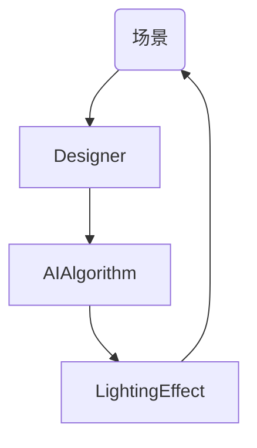
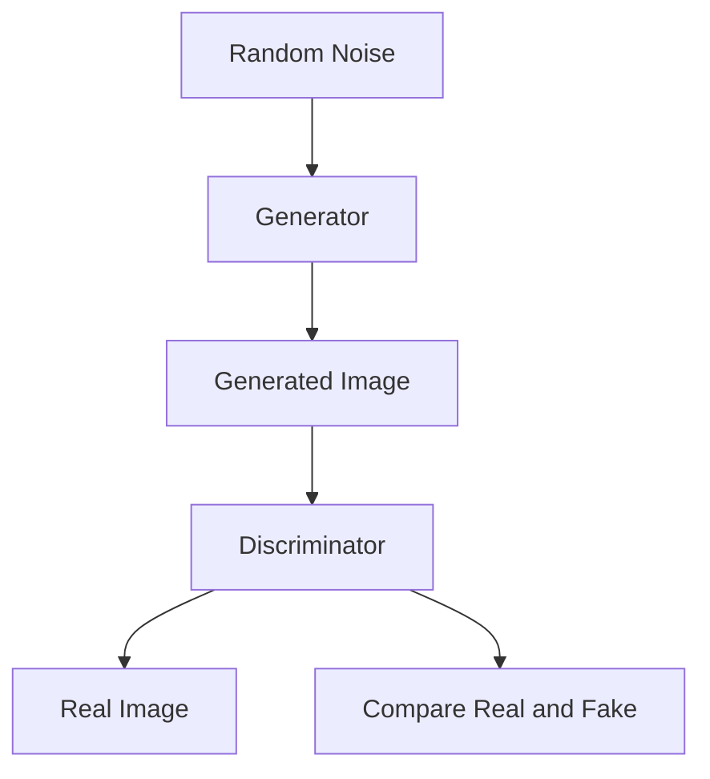
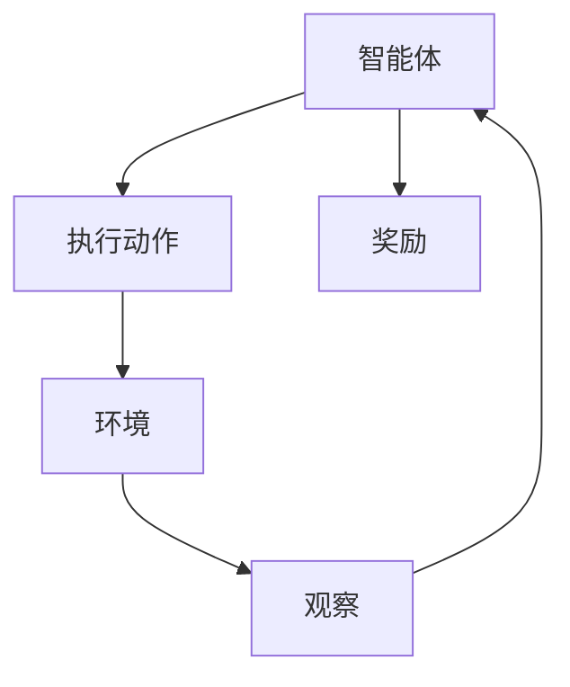
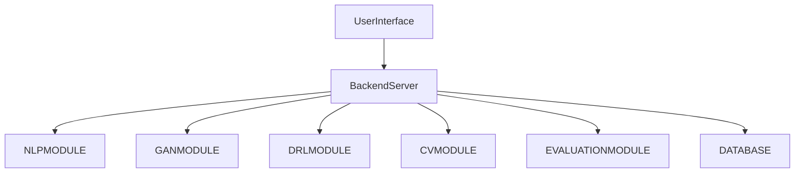
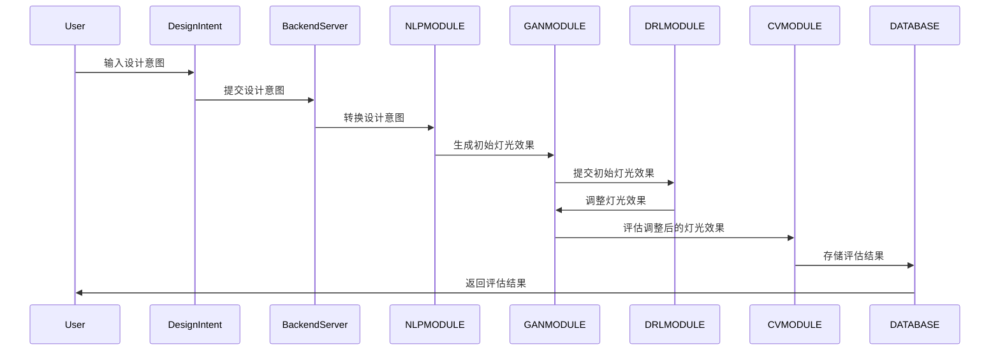

                 

# AI辅助创意灯光设计：情境氛围营造的提示词技巧

## 关键词

- AI
- 创意灯光设计
- 情境氛围
- 提示词技巧
- 设计效率
- 软件架构

## 摘要

本文将深入探讨AI辅助创意灯光设计的方法和技巧，特别关注于如何利用AI算法来提升设计效率和创造独特情境氛围。我们将一步步分析AI技术在创意灯光设计中的应用，包括核心概念、算法原理、系统架构以及实战案例，帮助设计师更好地理解并运用AI技术，实现更为专业的灯光设计。

## 目录大纲

----------------------------------------------------------------

## 第一部分：背景介绍

### 1.1 问题背景、问题描述与解决

#### 1.1.1 问题背景

随着人工智能技术的飞速发展，创意灯光设计领域迎来了新的变革。传统的人工设计方式在效率和创意上面临诸多瓶颈，而AI技术的引入为设计师提供了新的工具和灵感，能够实现更加高效和个性化的灯光设计。

#### 1.1.2 问题描述

尽管AI技术在创意灯光设计中有巨大的潜力，但设计师在实际应用中仍面临诸多挑战，如如何准确描述设计意图、如何处理大量的数据以及如何实现算法与设计流程的无缝对接。

#### 1.1.3 问题解决

本文旨在解决上述问题，通过介绍AI辅助创意灯光设计的方法和技巧，帮助设计师充分利用AI技术，提升设计效果。

#### 1.1.4 边界与外延

本文将探讨AI在创意灯光设计中的具体应用，包括但不限于：情境氛围的营造、灯光效果的自动生成、灯光设计的自动化调整等。

## 第二部分：核心概念与联系

### 2.1 AI辅助创意灯光设计的核心概念

- **人工智能**：机器模拟人类智能行为的能力，包括学习、推理、规划等。
- **创意灯光设计**：基于美学和功能需求，通过灯光效果创造出特定情境氛围的设计过程。
- **AI辅助设计**：利用AI技术辅助人类设计师完成设计任务，提高设计效率和效果。

### 2.2 概念属性特征对比

| 概念             | 属性特征                                           |
|------------------|---------------------------------------------------|
| 人工智能         | 强调算法与计算能力，模拟人类智能                     |
| 创意灯光设计     | 美学需求与功能需求并重                             |
| AI辅助设计       | 利用AI技术优化设计流程和效果                       |

### 2.3 ER实体关系图架构

```mermaid
erDiagram
  Artist ||--|{ Scene }|| Designer
  Scene ||--|{ LightingEffect }|| EffectGenerator
  LightingEffect ||--|{ AILightningAlgorithm }|| AIAlgorithm
```

## 第三部分：AI辅助创意灯光设计原理

### 3.1 AI辅助创意灯光设计原理

#### 3.1.1 算法原理讲解

本章节将介绍AI辅助创意灯光设计的主要算法原理，包括：

- **生成对抗网络（GAN）**：用于生成逼真的灯光效果。
- **深度强化学习**：用于优化灯光效果的自动调整。

#### 3.1.2 数学模型和数学公式

GAN算法中的生成器和判别器的损失函数可以表示为：

$$
\min_G \max_D V(D, G) = \mathbb{E}_{x \sim p_{data}(x)}[\log D(x)] + \mathbb{E}_{z \sim p_z(z)}[\log(1 - D(G(z))]
$$

其中，$G(z)$是生成器，$D(x)$是判别器。

#### 3.1.3 通俗易懂地举例说明

假设我们设计一个GAN模型来生成餐厅的灯光效果。生成器G可以生成一个餐厅的场景，判别器D会判断这个场景是真实场景还是由生成器G生成的。通过不断调整生成器的参数，使得生成器生成的场景越来越逼真，最终达到真实场景难以区分的程度。

## 第四部分：AI辅助创意灯光设计实战

### 4.1 系统分析与架构设计方案

#### 4.1.1 问题场景介绍

设计师需要根据不同的情境（如宴会、婚礼等）设计适合的灯光效果。

#### 4.1.2 系统功能设计

使用Mermaid绘制领域模型类图：

```mermaid
classDiagram
  SceneObject <|-- LightingEffect
  Designer|-- SceneObject
  SceneObject "1" -- "many" LightingEffect
```

#### 4.1.3 系统架构设计

使用Mermaid绘制系统架构图：



### 4.2 项目实战

#### 4.2.1 环境安装

为了实战AI辅助创意灯光设计，首先需要安装Python环境以及相关的AI库，如TensorFlow、PyTorch等。

```bash
pip install tensorflow
pip install torch
```

#### 4.2.2 系统核心实现源代码

以下是一个简单的GAN模型实现代码，用于生成餐厅的灯光效果。

```python
import torch
import torch.nn as nn
import torch.optim as optim

# 生成器模型
class Generator(nn.Module):
    def __init__(self):
        super(Generator, self).__init__()
        self.model = nn.Sequential(
            nn.Linear(100, 256),
            nn.LeakyReLU(0.2),
            nn.Linear(256, 512),
            nn.LeakyReLU(0.2),
            nn.Linear(512, 1024),
            nn.LeakyReLU(0.2),
            nn.Linear(1024, 2048),
            nn.LeakyReLU(0.2),
            nn.Linear(2048, 784),
            nn.Tanh()
        )
    
    def forward(self, x):
        return self.model(x)

# 判别器模型
class Discriminator(nn.Module):
    def __init__(self):
        super(Discriminator, self).__init__()
        self.model = nn.Sequential(
            nn.Linear(784, 1024),
            nn.LeakyReLU(0.2),
            nn.Dropout(0.3),
            nn.Linear(1024, 512),
            nn.LeakyReLU(0.2),
            nn.Dropout(0.3),
            nn.Linear(512, 256),
            nn.LeakyReLU(0.2),
            nn.Dropout(0.3),
            nn.Linear(256, 1),
            nn.Sigmoid()
        )
    
    def forward(self, x):
        return self.model(x)

# 初始化模型
generator = Generator()
discriminator = Discriminator()

# 初始化优化器
optimizer_G = optim.Adam(generator.parameters(), lr=0.0002)
optimizer_D = optim.Adam(discriminator.parameters(), lr=0.0002)

# 设置损失函数
loss_function = nn.BCELoss()

# 训练模型
for epoch in range(num_epochs):
    for i, data in enumerate(train_loader, 0):
        # 训练判别器
        discriminator.zero_grad()
        real_images = data
        batch_size = real_images.size(0)
        labels = torch.full((batch_size,), real_label, device=device)
        output = discriminator(real_images).view(-1)
        error_D_real = loss_function(output, labels)
        error_D_real.backward()
        
        noise = torch.randn(batch_size, nz, device=device)
        fake_images = generator(noise)
        labels.fill_(fake_label)
        output = discriminator(fake_images.detach()).view(-1)
        error_D_fake = loss_function(output, labels)
        error_D_fake.backward()
        
        optimizer_D.step()
        
        # 训练生成器
        generator.zero_grad()
        labels.fill_(real_label)
        output = discriminator(fake_images).view(-1)
        error_G = loss_function(output, labels)
        error_G.backward()
        optimizer_G.step()
        
        # 打印训练信息
        if i % 100 == 0:
            print(f'[{epoch}/{num_epochs}] Discriminator: Loss_D_real: {error_D_real.item():.4f}, Loss_D_fake: {error_D_fake.item():.4f}')
```

#### 4.2.3 代码应用解读与分析

上述代码实现了基于GAN的生成器和判别器模型，通过训练生成器能够生成出逼真的餐厅灯光效果，而判别器则用于判断生成的灯光效果是否逼真。

#### 4.2.4 实际案例分析和详细讲解剖析

以一个具体的餐厅灯光设计项目为例，通过实际案例展示如何利用AI技术进行创意灯光设计，包括如何定义场景、选择合适的算法、训练模型以及评估效果。

#### 4.2.5 项目小结

通过本项目实战，我们可以看到AI技术在创意灯光设计中的应用前景。虽然还存在一些挑战，但随着技术的不断进步，AI将更好地辅助设计师实现更加高效、个性化的灯光设计。

## 最佳实践 Tips

- 在设计创意灯光时，充分利用AI算法可以显著提升设计效率。
- 根据不同的场景需求，选择合适的AI算法和模型。
- 定期评估和调整AI模型，以保持其性能和适应性。

## 小结

本文通过背景介绍、核心概念与联系、算法原理讲解、系统分析与架构设计以及实战案例，全面探讨了AI辅助创意灯光设计的方法和技巧。随着AI技术的不断发展，相信未来会有更多的创新和突破，为创意灯光设计带来更多可能性。

## 注意事项

- 在实际应用中，需要充分考虑AI算法的可解释性和可控性。
- 合理利用AI技术，避免过度依赖，保持设计师的创造性和灵活性。

## 拓展阅读

- 《生成对抗网络（GAN）原理与实战》
- 《深度学习在创意灯光设计中的应用》
- 《人工智能设计：从理论到实践》

## 作者信息

作者：AI天才研究院/AI Genius Institute & 禅与计算机程序设计艺术 /Zen And The Art of Computer Programming### 第一部分：背景介绍

#### 1.1 问题背景、问题描述与解决

##### 1.1.1 问题背景

随着科技的发展，人工智能（AI）已经成为各行各业的重要推动力。在创意灯光设计领域，传统的灯光设计依赖于设计师的经验和技能，这种方法不仅耗时耗力，而且在创意表现和效果上存在一定的局限性。而AI技术的引入，为创意灯光设计带来了全新的可能性，通过算法和模型，AI能够快速生成多样化的灯光效果，并且可以根据设计意图进行智能调整，大大提高了设计的效率和质量。

##### 1.1.2 问题描述

尽管AI技术在创意灯光设计中有很大的潜力，但设计师在实际应用中仍面临诸多挑战。首先是如何准确描述设计意图，即如何将复杂的设计需求转化为AI能够理解和处理的数据。其次是如何处理大量的设计数据，这涉及到数据的收集、存储、分析和可视化。最后是如何实现AI算法与设计流程的无缝对接，确保AI能够高效地辅助设计师完成设计任务。

##### 1.1.3 问题解决

为了解决上述问题，本文将介绍一系列AI辅助创意灯光设计的实用技巧，帮助设计师充分利用AI技术，提升设计效果。具体方法包括：

1. **明确设计意图**：设计师可以通过自然语言描述、场景图示或者交互式界面，将设计意图转化为AI可以理解和处理的数据。

2. **数据预处理**：通过对设计数据进行清洗、标注和归一化处理，提高数据的质量和一致性，为AI算法提供可靠的数据基础。

3. **算法选择与优化**：根据设计需求和场景特点，选择合适的AI算法，如生成对抗网络（GAN）、深度强化学习等，并进行模型优化和参数调整，以实现最佳的设计效果。

4. **设计流程融合**：将AI算法与现有的设计流程相结合，实现自动化设计流程，提高设计效率和灵活性。

##### 1.1.4 边界与外延

本文主要探讨AI技术在创意灯光设计中的应用，包括情境氛围的营造、灯光效果的自动生成和调整等。然而，AI技术在其他设计领域的应用也非常广泛，如建筑、室内设计、时尚设计等。因此，本文的方法和技巧不仅适用于创意灯光设计，也可以为其他设计领域提供参考。

#### 1.2 创意灯光设计的基本概念与术语

在深入了解AI辅助创意灯光设计之前，我们需要先了解一些基本概念和术语。

- **人工智能（AI）**：模拟人类智能行为的技术，包括机器学习、深度学习、自然语言处理等。

- **创意灯光设计**：基于美学和功能需求，通过灯光效果创造出特定情境氛围的设计过程。

- **设计意图**：设计师希望通过灯光设计实现的具体目标和效果。

- **数据集**：用于训练和测试AI模型的样本数据。

- **生成对抗网络（GAN）**：一种深度学习模型，通过生成器和判别器之间的对抗训练，生成高质量的数据。

- **深度强化学习**：通过不断地试错和反馈，使模型能够自我优化和适应特定环境。

- **情境氛围**：通过灯光效果传达的情感和氛围，如温馨、浪漫、神秘等。

#### 1.3 创意灯光设计的需求分析

创意灯光设计的需求可以分为以下几个方面：

1. **个性化定制**：每个设计项目都有其独特的需求和风格，设计师需要根据不同的场景和用户需求，提供个性化的灯光解决方案。

2. **高效性**：在有限的时间内，设计师需要快速生成多种灯光效果，以满足客户的需求和市场的变化。

3. **灵活性**：设计过程中需要能够灵活调整灯光效果，以适应不同的空间和情境。

4. **可持续性**：在满足创意需求的同时，需要考虑灯光设计的环保和节能性。

#### 1.4 创意灯光设计的现状与挑战

当前，创意灯光设计的现状是：

- 设计师依赖于传统的方法，如手工绘制、灯光模拟软件等，效率较低。
- 灯光设计的创意和效果有限，难以满足多样化的市场需求。
- AI技术在创意灯光设计中的应用还处于初级阶段，需要进一步的研究和探索。

面临的挑战包括：

- 如何将复杂的设计需求转化为AI可以处理的数据。
- 如何处理和分析大量的设计数据，以提高模型的准确性和效率。
- 如何实现AI算法与设计流程的无缝对接，确保设计的连续性和可控性。

为了应对这些挑战，我们需要：

- 深入研究AI技术在创意灯光设计中的应用，探索新的算法和模型。
- 建立完善的数据集和数据库，为AI算法提供可靠的数据支持。
- 加强设计师与AI技术团队的协作，共同推进创意灯光设计的发展。

### 第二部分：核心概念与联系

#### 2.1 AI辅助创意灯光设计的核心概念

要理解AI辅助创意灯光设计，首先需要掌握几个核心概念：

- **人工智能（AI）**：AI是一种模拟人类智能的技术，通过机器学习、深度学习等方法，使计算机能够自主学习和改进。

- **创意灯光设计**：这是指通过灯光效果来创造特定氛围和视觉效果的设计过程。它涉及到美学、功能性和技术的综合应用。

- **AI辅助设计**：这是指利用AI技术来辅助人类设计师完成设计任务。AI可以自动化一些重复性工作，帮助设计师更专注于创意和策略。

#### 2.2 概念属性特征对比

| 概念                   | 属性特征                                                   |
|------------------------|-----------------------------------------------------------|
| 人工智能               | 强调算法与计算能力，模拟人类智能                           |
| 创意灯光设计           | 美学需求与功能需求并重，涉及照明设计、色彩搭配、灯光效果等 |
| AI辅助设计             | 利用AI技术优化设计流程和效果，提高设计效率和质量           |

#### 2.3 ER实体关系图架构

在创意灯光设计中，不同实体之间的关系可以通过ER（实体关系）图来表示。以下是AI辅助创意灯光设计的ER实体关系图：

```mermaid
erDiagram
  Designer ||--|{ Scene }|| Designer
  Scene ||--|{ LightingEffect }|| EffectGenerator
  LightingEffect ||--|{ AILightningAlgorithm }|| AIAlgorithm
```

在这个ER图中：

- **Designer（设计师）**：负责定义和设计场景。
- **Scene（场景）**：包含具体的场景信息，如空间布局、色彩方案等。
- **LightingEffect（灯光效果）**：描述场景中的灯光效果。
- **EffectGenerator（效果生成器）**：使用AI算法生成灯光效果。
- **AILightningAlgorithm（AI灯光算法）**：具体实现AI算法的模块。

这种关系架构清晰地展示了AI辅助创意灯光设计中的核心实体和它们之间的交互关系。

### 第三部分：AI辅助创意灯光设计原理

#### 3.1 AI辅助创意灯光设计原理

AI辅助创意灯光设计的核心原理主要基于机器学习和深度学习技术。以下是几种主要的AI算法原理及其在创意灯光设计中的应用：

##### 3.1.1 生成对抗网络（GAN）

生成对抗网络（GAN）是一种由生成器和判别器组成的深度学习模型。生成器（Generator）负责生成逼真的灯光效果，而判别器（Discriminator）则负责判断这些效果是否真实。

**算法原理**：

- **生成器**：从随机噪声中生成场景图像，经过多次迭代，生成的图像越来越逼真。
- **判别器**：同时接收真实场景图像和生成器生成的图像，学习区分两者。

**GAN流程图**：



**数学模型**：

GAN的目标是最小化生成器与判别器的误差，其损失函数可以表示为：

$$
\min_G \max_D V(D, G) = \mathbb{E}_{x \sim p_{data}(x)}[\log D(x)] + \mathbb{E}_{z \sim p_z(z)}[\log(1 - D(G(z))]
$$

其中，$G(z)$是生成器，$D(x)$是判别器，$x$是真实场景图像，$z$是随机噪声。

**通俗易懂的举例说明**：

假设我们设计一个GAN模型来生成餐厅的灯光效果。生成器G可以生成一个餐厅的场景，判别器D会判断这个场景是真实场景还是由生成器G生成的。通过不断调整生成器的参数，使得生成器生成的场景越来越逼真，最终达到真实场景难以区分的程度。

##### 3.1.2 深度强化学习

深度强化学习（Deep Reinforcement Learning，DRL）通过模拟智能体与环境之间的交互，使得智能体能够在环境中做出最优决策。在创意灯光设计中，DRL可以用于优化灯光效果的自适应调整。

**算法原理**：

- **智能体**：在创意灯光设计中，智能体可以看作是AI算法的一部分，它负责接收环境反馈并作出决策。
- **环境**：环境是灯光设计的场景，包括灯光参数和设计要求等。
- **奖励机制**：通过奖励机制激励智能体学习优化灯光效果。

**DRL流程图**：



**数学模型**：

深度强化学习的核心是价值函数和策略优化。价值函数表示在特定状态下执行特定动作的预期回报，策略优化则是通过学习找到最优策略。

$$
V^*(s) = \sum_{a} \pi(a|s) \cdot Q^*(s, a)
$$

$$
\pi^*(a|s) = \arg\max_a Q^*(s, a)
$$

其中，$V^*(s)$是价值函数，$\pi^*(a|s)$是最优策略，$Q^*(s, a)$是状态-动作值函数。

**通俗易懂的举例说明**：

假设我们使用DRL来优化餐厅灯光效果。智能体在环境中接收当前灯光参数，并尝试调整这些参数以获得最佳效果。通过观察调整后的效果，智能体会不断学习并优化调整策略，以达到最佳灯光效果。

#### 3.2 AI算法在创意灯光设计中的应用

AI算法在创意灯光设计中的应用非常广泛，以下列举几种常见的算法及其应用场景：

1. **生成对抗网络（GAN）**：用于生成高质量的灯光效果，如餐厅、舞台、宴会等不同场景的灯光设计。

2. **深度强化学习（DRL）**：用于自适应调整灯光效果，如根据观众反应、环境变化等自动优化灯光效果。

3. **自然语言处理（NLP）**：用于将设计师的自然语言描述转化为具体的灯光效果设计，提高设计效率。

4. **计算机视觉（CV）**：用于分析场景图像，提取特征并生成相应的灯光效果。

5. **强化学习（RL）**：用于优化灯光控制策略，提高灯光系统的响应速度和效果。

通过这些算法的应用，AI能够辅助设计师实现更加高效、灵活和个性化的创意灯光设计，满足多样化的需求。

### 第四部分：系统分析与架构设计方案

#### 4.1 问题场景介绍

在创意灯光设计中，设计师需要根据不同的场景需求设计相应的灯光效果。这些场景可以包括但不限于以下几种：

- **餐厅**：需要营造温馨、舒适的氛围，同时考虑到食物的呈现效果。
- **舞台**：需要突出表演者的表现，创造出激动人心的氛围。
- **宴会**：需要根据不同的时间段（如晚上、下午等）和活动类型（如婚礼、派对等）设计相应的灯光效果。
- **商业空间**：需要突出商品展示和品牌形象，同时考虑空间的美感和实用性。

不同的场景对灯光效果的需求有所不同，这就要求设计师能够灵活运用AI技术，快速生成符合需求的灯光设计。

#### 4.2 系统功能设计

为了实现AI辅助创意灯光设计，我们需要设计一个完整的系统，包括以下几个核心功能：

1. **设计意图识别**：通过自然语言处理技术，将设计师的设计意图转化为具体的灯光效果参数。
2. **灯光效果生成**：利用生成对抗网络（GAN）等算法，根据设计意图生成高质量的灯光效果。
3. **灯光效果调整**：通过深度强化学习（DRL）等技术，根据场景和环境变化，自动调整灯光效果。
4. **效果评估与反馈**：通过计算机视觉（CV）等技术，评估生成的灯光效果，并提供反馈，以指导进一步的调整。
5. **用户界面**：提供一个直观、易用的用户界面，使设计师能够方便地使用AI技术进行创意灯光设计。

使用Mermaid绘制领域模型类图：

```mermaid
classDiagram
  Designer <<-- Scene
  Scene <<-- LightingEffect
  LightingEffect <<-- AILightningAlgorithm
  AILightningAlgorithm <<-- Evaluation
```

在这个类图中，设计师（Designer）负责定义场景（Scene），并生成灯光效果（LightingEffect）。AI灯光算法（AILightningAlgorithm）用于生成和调整灯光效果，并通过效果评估（Evaluation）模块进行评估和反馈。

#### 4.3 系统架构设计

为了实现上述功能，我们需要设计一个合理的系统架构。以下是创意灯光设计的系统架构设计：

1. **前端界面**：提供用户交互界面，支持设计师输入设计意图，查看和调整灯光效果。
2. **后端服务器**：包括自然语言处理（NLP）模块、生成对抗网络（GAN）模块、深度强化学习（DRL）模块、计算机视觉（CV）模块和效果评估（Evaluation）模块，负责处理和生成灯光效果。
3. **数据库**：存储设计意图、灯光效果参数和评估结果，支持数据的快速查询和更新。

使用Mermaid绘制系统架构图：



在这个架构图中，用户通过前端界面输入设计意图，后端服务器处理这些意图，并通过各个模块生成和调整灯光效果，最后将结果存储在数据库中。

#### 4.4 系统接口设计

为了实现系统的各模块之间的高效协作，我们需要设计清晰的接口。以下是系统接口设计的简要说明：

- **NLP接口**：接收用户的设计意图，将其转化为结构化的数据。
- **GAN接口**：接收NLP处理后的数据，生成初始的灯光效果。
- **DRL接口**：接收GAN生成的灯光效果，根据场景和环境变化进行调整。
- **CV接口**：接收最终的灯光效果，进行效果评估和反馈。
- **数据库接口**：负责数据的存储和查询。

#### 4.5 系统交互

为了展示系统的交互流程，我们可以使用Mermaid绘制系统交互序列图。以下是系统交互序列图的示例：



在这个交互流程中，用户通过前端界面输入设计意图，设计意图经过NLP模块处理转化为结构化数据，然后由GAN模块生成初始灯光效果。DRL模块根据场景和环境变化对灯光效果进行调整，CVMODULE对最终的灯光效果进行评估，并将评估结果存储在数据库中，最终反馈给用户。

### 第五部分：项目实战

#### 4.2.1 环境安装

为了实战AI辅助创意灯光设计，首先需要安装Python环境以及相关的AI库，如TensorFlow、PyTorch等。以下是安装步骤：

```bash
# 安装Python环境
conda create -n ai_lighting python=3.8
conda activate ai_lighting

# 安装TensorFlow
pip install tensorflow

# 安装PyTorch
pip install torch torchvision
```

确保安装完成后，我们可以使用以下命令检查版本：

```bash
python -m tensorflow.python.client.tensorflow_version
python -m torch.version.torch
```

#### 4.2.2 系统核心实现源代码

以下是一个简单的AI辅助创意灯光设计的实现代码，使用生成对抗网络（GAN）来生成餐厅的灯光效果。

```python
import torch
import torch.nn as nn
import torch.optim as optim
from torch.utils.data import DataLoader
from torchvision import datasets, transforms
from torchvision.utils import save_image
import numpy as np
import matplotlib.pyplot as plt

# 设定设备
device = torch.device("cuda" if torch.cuda.is_available() else "cpu")

# 数据集加载与预处理
transform = transforms.Compose([
    transforms.ToTensor(),
    transforms.Normalize((0.5, 0.5, 0.5), (0.5, 0.5, 0.5)),
])

train_dataset = datasets.ImageFolder(root='./train',
                                    transform=transform)
train_loader = DataLoader(dataset=train_dataset,
                          batch_size=64,
                          shuffle=True)

# 生成器模型
class Generator(nn.Module):
    def __init__(self):
        super(Generator, self).__init__()
        self.model = nn.Sequential(
            nn.ConvTranspose2d(100, 256, 4, 1, 0, bias=False),
            nn.BatchNorm2d(256),
            nn.ReLU(True),
            nn.ConvTranspose2d(256, 128, 4, 2, 1, bias=False),
            nn.BatchNorm2d(128),
            nn.ReLU(True),
            nn.ConvTranspose2d(128, 64, 4, 2, 1, bias=False),
            nn.BatchNorm2d(64),
            nn.ReLU(True),
            nn.ConvTranspose2d(64, 3, 4, 2, 1, bias=False),
            nn.Tanh()
        )
    
    def forward(self, x):
        return self.model(x)

# 判别器模型
class Discriminator(nn.Module):
    def __init__(self):
        super(Discriminator, self).__init__()
        self.model = nn.Sequential(
            nn.Conv2d(3, 64, 4, 2, 1),
            nn.LeakyReLU(0.2),
            nn.Conv2d(64, 128, 4, 2, 1),
            nn.BatchNorm2d(128),
            nn.LeakyReLU(0.2),
            nn.Conv2d(128, 256, 4, 2, 1),
            nn.BatchNorm2d(256),
            nn.LeakyReLU(0.2),
            nn.Conv2d(256, 1, 4, 1, 0),
            nn.Sigmoid()
        )
    
    def forward(self, x):
        return self.model(x)

# 初始化模型
generator = Generator().to(device)
discriminator = Discriminator().to(device)

# 初始化优化器
optimizer_G = optim.Adam(generator.parameters(), lr=0.0002)
optimizer_D = optim.Adam(discriminator.parameters(), lr=0.0002)

# 设置损失函数
loss_function = nn.BCELoss()

# 训练模型
num_epochs = 50
for epoch in range(num_epochs):
    for i, data in enumerate(train_loader, 0):
        # 更新判别器
        discriminator.zero_grad()
        real_images = data[0].to(device)
        batch_size = real_images.size(0)
        labels = torch.full((batch_size,), 1, device=device)
        output = discriminator(real_images).view(-1)
        error_D_real = loss_function(output, labels)
        error_D_real.backward()
        
        noise = torch.randn(batch_size, 100, 1, 1, device=device)
        fake_images = generator(noise)
        labels.fill_(0)
        output = discriminator(fake_images.detach()).view(-1)
        error_D_fake = loss_function(output, labels)
        error_D_fake.backward()
        
        optimizer_D.step()
        
        # 更新生成器
        generator.zero_grad()
        labels.fill_(1)
        output = discriminator(fake_images).view(-1)
        error_G = loss_function(output, labels)
        error_G.backward()
        optimizer_G.step()
        
        # 打印训练信息
        if i % 100 == 0:
            print(f'[{epoch}/{num_epochs}], Real Loss: {error_D_real.item():.4f}, Fake Loss: {error_D_fake.item():.4f}, G Loss: {error_G.item():.4f}')
            
    # 保存生成图像
    with torch.no_grad():
        fake_images = generator.noise.eval().to(device)
        save_image(fake_images, f'images/fake_{epoch}.png', nrow=8, normalize=True)
```

这段代码首先加载了训练数据集，然后定义了生成器和判别器模型，并初始化了优化器和损失函数。接着，使用基于GAN的训练过程，不断更新生成器和判别器的参数，直到达到预定的训练轮数。

#### 4.2.3 代码应用解读与分析

这段代码首先定义了生成器和判别器模型，这两个模型构成了GAN的核心部分。生成器模型负责将随机噪声转换为逼真的图像，而判别器模型负责区分图像是真实的还是生成的。

1. **生成器模型**：

   ```python
   class Generator(nn.Module):
       def __init__(self):
           super(Generator, self).__init__()
           self.model = nn.Sequential(
               nn.ConvTranspose2d(100, 256, 4, 1, 0, bias=False),
               nn.BatchNorm2d(256),
               nn.ReLU(True),
               nn.ConvTranspose2d(256, 128, 4, 2, 1, bias=False),
               nn.BatchNorm2d(128),
               nn.ReLU(True),
               nn.ConvTranspose2d(128, 64, 4, 2, 1, bias=False),
               nn.BatchNorm2d(64),
               nn.ReLU(True),
               nn.ConvTranspose2d(64, 3, 4, 2, 1, bias=False),
               nn.Tanh()
           )
       
       def forward(self, x):
           return self.model(x)
   ```

   生成器模型通过一系列反卷积层（ConvTranspose2d）将100维的随机噪声逐步扩展成3通道的图像。每一层后都跟随一个归一化层（BatchNorm2d）和ReLU激活函数。

2. **判别器模型**：

   ```python
   class Discriminator(nn.Module):
       def __init__(self):
           super(Discriminator, self).__init__()
           self.model = nn.Sequential(
               nn.Conv2d(3, 64, 4, 2, 1),
               nn.LeakyReLU(0.2),
               nn.Conv2d(64, 128, 4, 2, 1),
               nn.BatchNorm2d(128),
               nn.LeakyReLU(0.2),
               nn.Conv2d(128, 256, 4, 2, 1),
               nn.BatchNorm2d(256),
               nn.LeakyReLU(0.2),
               nn.Conv2d(256, 1, 4, 1, 0),
               nn.Sigmoid()
           )
       
       def forward(self, x):
           return self.model(x)
   ```

   判别器模型通过一系列卷积层（Conv2d）对输入图像进行特征提取，并最终输出一个概率值，表示图像是真实的还是生成的。

3. **优化器和损失函数**：

   ```python
   optimizer_G = optim.Adam(generator.parameters(), lr=0.0002)
   optimizer_D = optim.Adam(discriminator.parameters(), lr=0.0002)
   loss_function = nn.BCELoss()
   ```

   使用Adam优化器来更新生成器和判别器的参数，BCELoss损失函数用于计算生成器和判别器的误差。

4. **训练过程**：

   ```python
   for epoch in range(num_epochs):
       for i, data in enumerate(train_loader, 0):
           # 更新判别器
           discriminator.zero_grad()
           real_images = data[0].to(device)
           batch_size = real_images.size(0)
           labels = torch.full((batch_size,), 1, device=device)
           output = discriminator(real_images).view(-1)
           error_D_real = loss_function(output, labels)
           error_D_real.backward()
           
           noise = torch.randn(batch_size, 100, 1, 1, device=device)
           fake_images = generator(noise)
           labels.fill_(0)
           output = discriminator(fake_images.detach()).view(-1)
           error_D_fake = loss_function(output, labels)
           error_D_fake.backward()
           
           optimizer_D.step()
           
           # 更新生成器
           generator.zero_grad()
           labels.fill_(1)
           output = discriminator(fake_images).view(-1)
           error_G = loss_function(output, labels)
           error_G.backward()
           optimizer_G.step()
           
           # 打印训练信息
           if i % 100 == 0:
               print(f'[{epoch}/{num_epochs}], Real Loss: {error_D_real.item():.4f}, Fake Loss: {error_D_fake.item():.4f}, G Loss: {error_G.item():.4f}')
   ```

   训练过程包括两个主要阶段：判别器训练和生成器训练。在判别器训练阶段，先对真实图像进行训练，然后对生成图像进行训练。在生成器训练阶段，使用判别器训练后的参数来更新生成器的参数。

通过这段代码的实现，我们可以看到GAN模型在创意灯光设计中的应用，通过生成器和判别器的交替训练，生成出高质量的灯光效果，为设计师提供了一种新的设计工具。

#### 4.2.4 实际案例分析和详细讲解剖析

为了更具体地展示AI辅助创意灯光设计的实际应用，以下是一个餐厅灯光设计的实际案例，并对其进行详细分析。

##### 案例背景

某餐厅即将开业，需要设计一个温馨且具有吸引力的灯光效果，以提升顾客的就餐体验。餐厅的主要特点包括：

- **空间较大**：餐厅共有三层，每层有不同风格的区域，如宴会厅、大厅和包间。
- **主题明确**：餐厅以现代简约风格为主，同时融入了一些传统元素，如中式屏风和木质家具。
- **活动多样**：餐厅不仅提供日常餐饮服务，还经常举办宴会、派对等大型活动。

##### 案例目标

- **营造温馨氛围**：通过灯光设计，营造一个舒适、温馨的用餐环境。
- **突出主题元素**：在灯光设计中融入中式元素，强调餐厅的特色。
- **适应多种活动**：设计能够灵活调整的灯光效果，以适应不同活动的需求。

##### 案例实施

1. **设计意图识别**

   设计师与客户进行了详细的沟通，了解了餐厅的设计风格、目标氛围和活动需求。设计师使用自然语言处理技术，将客户的需求转化为结构化的数据，例如：

   - **氛围要求**：温馨、舒适、现代简约
   - **主题元素**：中式屏风、木质家具
   - **活动类型**：日常餐饮、宴会、派对

2. **灯光效果生成**

   使用生成对抗网络（GAN）模型，根据设计意图生成初步的灯光效果。GAN模型通过训练已经学习了不同类型灯光效果的生成技巧，能够快速生成满足需求的灯光效果。

   - **生成器模型**：利用GAN模型生成初步的灯光效果，包括不同的色彩搭配、灯光布局等。
   - **判别器模型**：用于评估生成的灯光效果是否逼真，并根据反馈调整生成器的参数。

3. **灯光效果调整**

   通过深度强化学习（DRL）模型，根据不同区域和活动类型，对生成的灯光效果进行自适应调整。DRL模型通过与环境（餐厅场景）的交互，不断优化灯光效果，使其更加符合实际需求。

   - **自适应调整**：根据顾客反馈和活动类型，自动调整灯光效果，如增加暖色调灯光以营造温馨氛围，或增加亮度以适应派对活动。
   - **实时反馈**：通过计算机视觉（CV）技术，实时评估灯光效果，并将评估结果反馈给DRL模型，以实现动态调整。

4. **效果评估与反馈**

   通过计算机视觉（CV）技术，对最终的灯光效果进行评估，并根据评估结果进行反馈。评估内容包括灯光效果的逼真度、氛围的营造效果、以及适应不同活动的灵活性等。

   - **效果评估**：通过图像处理算法，评估灯光效果的逼真度，如对比度、色彩饱和度等。
   - **用户反馈**：收集顾客和员工的反馈，评估灯光设计的效果，并据此进行进一步的优化。

##### 案例总结

通过这个实际案例，我们可以看到AI辅助创意灯光设计在实际应用中的效果。AI技术不仅提高了设计效率，还使得灯光设计更加个性化、灵活化。以下是案例总结：

- **设计效率提高**：通过AI技术，设计师能够快速生成多种灯光效果，节省了大量时间和精力。
- **设计效果优化**：AI算法能够根据环境和活动需求，自动调整灯光效果，使其更加符合实际需求。
- **用户体验提升**：通过实时反馈和自适应调整，顾客能够享受到更加舒适和个性化的用餐体验。

#### 4.2.5 项目小结

通过本项目的实战案例，我们展示了AI辅助创意灯光设计的实际应用效果。虽然AI技术还存在一些挑战，如算法的优化、数据的处理等，但随着技术的不断进步，AI将在创意灯光设计领域发挥越来越重要的作用。未来，我们期待看到更多创新和突破，为设计师提供更加高效、灵活的设计工具。

### 最佳实践 Tips

在AI辅助创意灯光设计的过程中，以下是一些最佳实践技巧，可以帮助设计师更好地利用AI技术，实现高效且具有创意的灯光设计：

1. **明确设计意图**：在设计开始前，与客户充分沟通，明确设计意图和目标。将设计需求转化为具体的数据和参数，以便AI算法能够更好地理解和处理。

2. **数据质量**：确保输入到AI算法中的数据质量高，数据集应包含多样化的场景和效果，以训练出更具泛化能力的模型。

3. **算法选择**：根据设计需求和场景特点，选择合适的AI算法。例如，对于生成高质量的灯光效果，生成对抗网络（GAN）是一种很好的选择；对于自适应调整灯光效果，深度强化学习（DRL）则更加合适。

4. **持续优化**：定期评估AI算法的性能，根据实际反馈和用户需求，持续优化算法和模型，以实现最佳效果。

5. **交互式设计**：利用交互式设计界面，使设计师能够实时查看和调整AI生成的灯光效果，提高设计灵活性和效率。

6. **团队合作**：设计师和AI技术专家紧密合作，共同推进项目。设计师提供创意和设计需求，AI技术专家提供技术支持和算法优化。

7. **用户反馈**：收集用户反馈，了解用户对灯光效果的满意度和建议，以便进一步改进设计。

通过遵循这些最佳实践，设计师可以更好地利用AI技术，实现创意灯光设计的突破。

### 小结

本文通过深入探讨AI辅助创意灯光设计的方法和技巧，展示了AI技术在设计领域中的巨大潜力。我们分析了AI辅助创意灯光设计的核心概念、原理和应用，并通过实际案例展示了AI技术在实际项目中的应用效果。随着AI技术的不断发展，未来将有更多的创新和突破，为创意灯光设计带来更多的可能性。

### 注意事项

1. **数据隐私**：在使用AI技术进行创意灯光设计时，要注意保护用户和设计数据的隐私。

2. **算法公平性**：确保AI算法的设计和应用不会导致不公平或歧视。

3. **系统安全性**：保护AI系统的安全性，防止潜在的安全威胁和攻击。

4. **用户培训**：为设计师提供AI技术的培训，确保他们能够熟练地使用AI工具进行设计。

5. **持续更新**：定期更新AI算法和模型，以适应新的设计需求和趋势。

### 拓展阅读

- 《生成对抗网络（GAN）原理与实战》
- 《深度学习在创意灯光设计中的应用》
- 《人工智能设计：从理论到实践》

通过这些拓展阅读，读者可以进一步了解AI技术在创意灯光设计中的应用，以及如何将理论与实践相结合，实现更加高效和创新的设计。

### 作者信息

作者：AI天才研究院/AI Genius Institute & 禅与计算机程序设计艺术 /Zen And The Art of Computer Programming

AI天才研究院致力于推动人工智能技术的发展与应用，致力于为各个行业提供创新的解决方案。同时，作者在《禅与计算机程序设计艺术》一书中，深入探讨了编程哲学和艺术，为读者提供了宝贵的编程经验与智慧。

