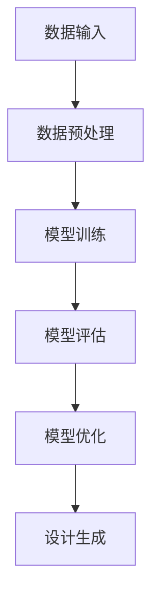
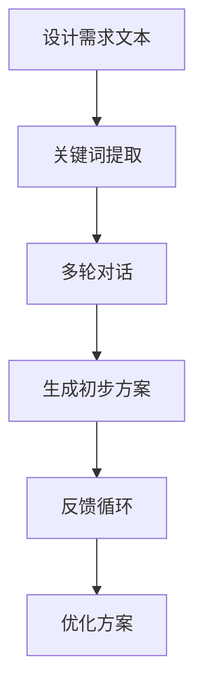
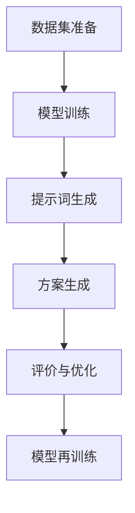
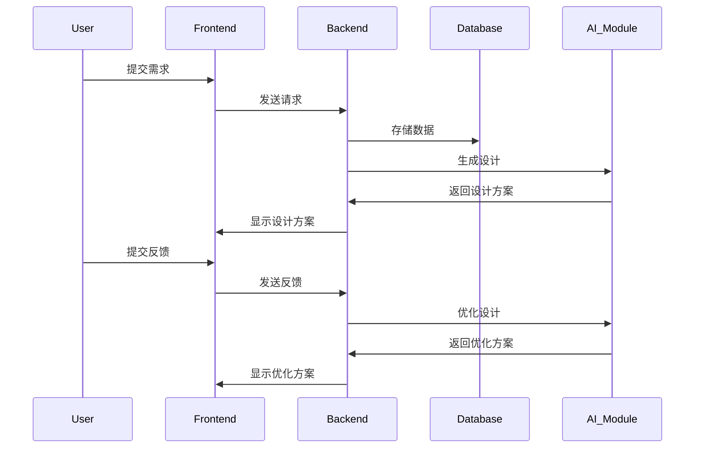
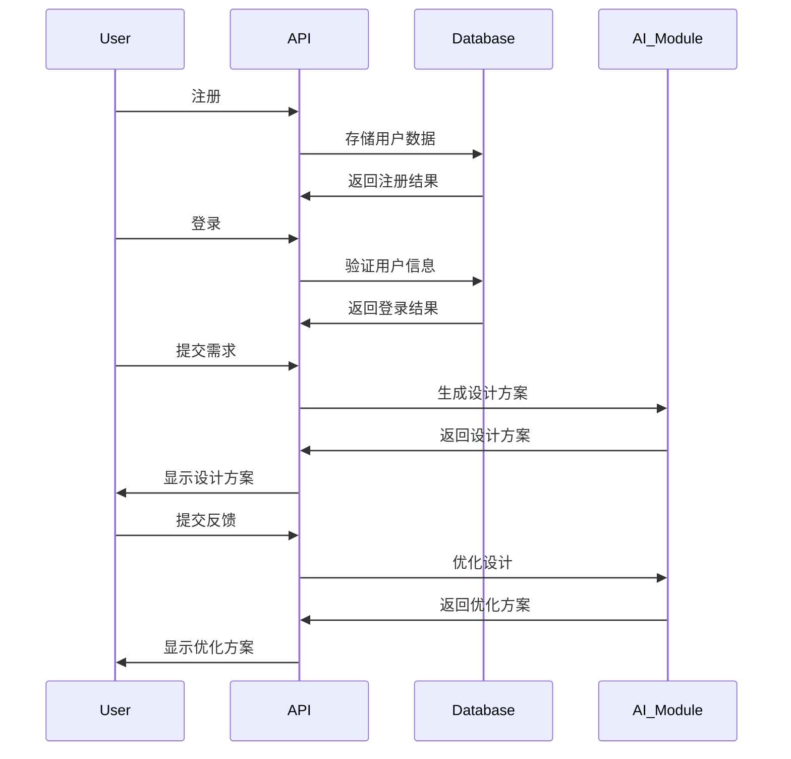
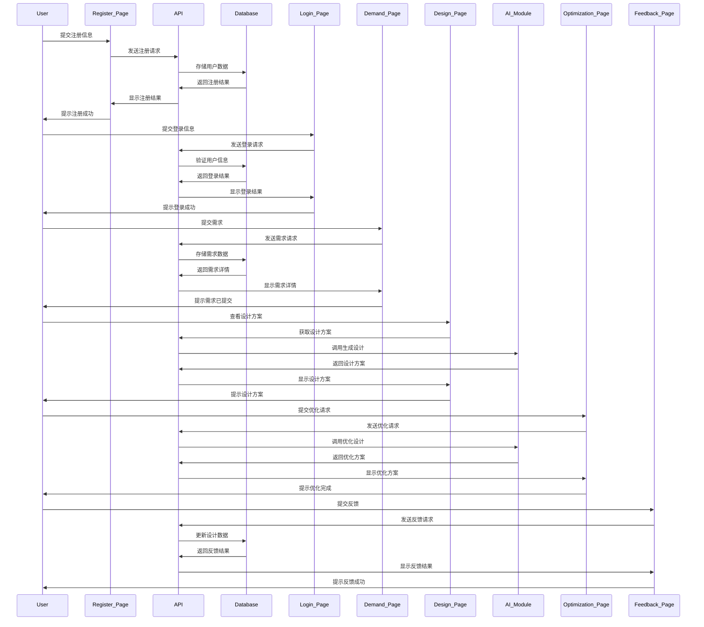

                 

### 引言与背景

#### 1.1 问题背景

随着人工智能（AI）技术的不断发展，创意产业迎来了新的变革。传统的舞台设计主要依赖于设计师的个人经验和直觉，而AI的出现，为舞台设计提供了全新的辅助工具。AI不仅能够帮助设计师快速生成创意方案，还能通过数据分析和预测，提高设计的准确性和效率。

舞台设计是一个复杂的过程，涉及到多种艺术形式和技术的整合。传统的舞台设计方法往往需要设计师耗费大量时间和精力来构思和调整，而AI的出现，使得设计师可以更加专注于创意构思，而将繁琐的细节交给AI来处理。例如，AI可以帮助设计师快速生成多种不同的设计方案，并根据用户的需求和偏好进行优化，从而提高设计的效率和质量。

此外，随着多媒体技术的快速发展，舞台设计逐渐趋向于沉浸式体验。沉浸式舞台设计要求设计师将多种多媒体元素（如灯光、音响、视频、图像等）进行整合，创造出一种身临其境的舞台体验。AI在这一领域也有着广泛的应用，如通过机器学习算法分析观众的反应，实时调整多媒体元素的呈现方式，以提高观众的体验。

#### 1.2 问题描述

《AI辅助创意舞台设计：沉浸式多媒体整合的提示词技巧》旨在探讨如何利用AI技术，辅助舞台设计师进行创意设计，实现沉浸式多媒体整合。本书将围绕以下几个方面展开讨论：

1. **AI在舞台设计中的应用现状与趋势**：介绍AI技术在舞台设计中的实际应用案例，分析其发展趋势和未来方向。
2. **沉浸式多媒体整合的概念与关键技术**：探讨沉浸式舞台设计的概念、设计原则和技术要点。
3. **提示词技巧在AI辅助舞台设计中的应用**：介绍提示词技巧的基本原理和应用方法，展示如何通过关键词引导AI生成创意方案。

通过本书的讨论，旨在为舞台设计师提供一种全新的设计思路和工具，帮助他们更好地应对创意设计中的挑战，提高设计效率和作品质量。

#### 1.3 问题解决

本书将通过以下章节，逐步介绍AI辅助创意舞台设计的实现方法：

1. **第2章：AI辅助创意舞台设计概述**：介绍AI技术在舞台设计中的应用现状和趋势，以及沉浸式多媒体整合的概念和价值。
2. **第3章：沉浸式多媒体整合基础**：详细探讨多媒体技术的分类、沉浸式体验的设计原则与方法。
3. **第4章：AI核心算法原理与提示词技巧**：讲解机器学习基础、核心算法原理以及提示词技巧的应用方法。
4. **第5章：AI辅助舞台设计实践**：通过实践案例，展示如何利用AI工具辅助舞台设计，实现沉浸式多媒体整合。
5. **第6章：多媒体整合与交互设计**：探讨多媒体整合的设计思路、交互设计的核心要素与实践。
6. **第7章：AI辅助舞台设计项目实战**：介绍一个完整的AI辅助舞台设计项目，包括项目介绍、系统架构设计与实现、项目总结与反思。

通过这些章节的逐步讲解，读者将能够全面了解AI辅助创意舞台设计的理论和方法，掌握实际应用技巧，为未来的舞台设计工作提供有力支持。

#### 1.4 边界与外延

本书主要关注AI辅助创意舞台设计的技术与应用，主要涵盖以下领域：

1. **AI技术在舞台设计中的应用**：包括机器学习、自然语言处理、计算机视觉等技术。
2. **沉浸式多媒体整合**：多媒体技术的分类、设计原则、实现方法等。
3. **提示词技巧**：提示词的生成、应用场景、优化方法等。

然而，本书不涉及其他领域的AI应用，如医疗、金融、教育等。同时，本书的内容侧重于技术讲解和实践操作，旨在为舞台设计师提供实用的工具和技巧，而不涉及艺术创作和设计美学等方面。

#### 1.5 概念结构与核心要素组成

为了更好地理解AI辅助创意舞台设计的概念和实现方法，以下是对核心概念和要素的详细说明：

- **AI辅助舞台设计**：利用人工智能技术，如机器学习、自然语言处理、计算机视觉等，辅助设计师进行创意设计。
  - **机器学习**：通过训练模型，使计算机能够从数据中自动学习规律，为舞台设计提供辅助。
  - **自然语言处理**：让计算机理解和生成人类语言，帮助设计师在文本描述中提取关键信息。
  - **计算机视觉**：使计算机能够理解和解释图像和视频内容，为舞台设计提供视觉参考。

- **沉浸式多媒体整合**：将多种多媒体元素（如灯光、音响、视频、图像等）进行整合，创造一种身临其境的舞台体验。
  - **多媒体技术**：包括音频、视频、图像等技术的应用。
  - **交互设计**：设计人与多媒体元素之间的互动，提升观众的参与感和体验感。
  - **场景构建**：通过多媒体元素和交互设计，构建出沉浸式的舞台场景。

- **提示词技巧**：利用关键词引导AI生成创意方案，提高设计的效率和准确性。
  - **提示词生成**：从文本中提取关键信息，生成提示词。
  - **模型训练**：使用大量数据训练模型，使其能够根据提示词生成高质量的创意方案。

通过理解这些核心概念和要素，读者将能够更深入地掌握AI辅助创意舞台设计的方法和应用，为未来的舞台设计工作提供有力支持。

### 第2章：核心概念与联系

在探讨AI辅助创意舞台设计之前，我们需要明确几个核心概念，这些概念不仅是本书讨论的基础，也是理解和应用AI技术进行舞台设计的关键。以下是核心概念及其相互之间的联系：

#### 2.1 AI辅助舞台设计原理

**机器学习**：机器学习是AI的核心组成部分，它使计算机通过数据和经验自主学习和改进。在舞台设计中，机器学习可以帮助设计师分析大量数据，提取设计趋势，甚至生成新的设计灵感。例如，通过分析以往的成功舞台设计案例，机器学习算法可以学习到一些常见的视觉和听觉组合，从而辅助设计师快速构建新方案。

**自然语言处理**：自然语言处理（NLP）是使计算机能够理解、生成和响应人类语言的技术。在舞台设计中，NLP可以用于处理设计师的文本描述，提取关键信息，并将其转化为AI可以理解的形式。例如，设计师可以使用自然语言描述一个舞台场景的视觉和情感需求，NLP算法可以帮助AI理解这些需求，并生成相应的多媒体方案。

**计算机视觉**：计算机视觉使计算机能够解释和解析图像和视频内容。在舞台设计中，计算机视觉可以用于识别和分析场景中的视觉元素，如灯光布局、布景设计等。通过分析这些视觉元素，AI可以生成新的设计建议，或者优化现有的设计，以满足特定的视觉要求。

**核心概念属性特征对比表格**

| 概念         | 属性特征 | 描述                                                     |
|--------------|-----------|-----------------------------------------------------------|
| 机器学习     | 自主学习   | 通过数据和经验改进性能                                      |
| 自然语言处理 | 语言理解   | 提取和理解文本信息                                         |
| 计算机视觉   | 图像解析   | 识别和分析图像内容                                       |

**ER实体关系图架构**

```mermaid
erDiagram
  Designer ||--|{ AI_Tool }|-- Stage_Design
  Designer ||--|{ Data_Set }|-- Machine_Learning
  Designer ||--|{ Text_Description }|-- NLP
  Stage_Design ||--|{ Visual_Elements }|-- Computer_Vision
  Stage_Design ||--|{ Multimedia_Elements }|-- Immersive_Experience
```

在上面的ER图中，设计师利用机器学习、自然语言处理和计算机视觉工具进行舞台设计。这些工具分别处理不同的数据类型和设计需求，最终共同协作，实现沉浸式的多媒体舞台体验。

#### 2.2 沉浸式多媒体整合核心概念

**多媒体技术**：多媒体技术包括音频、视频、图像等多种形式，它们在舞台设计中起着至关重要的作用。每种多媒体技术都有其独特的属性和表现方式。例如，音频可以增强舞台的氛围，视频可以展示动态的视觉效果，图像可以提供静态的视觉元素。整合这些多媒体技术，可以创造出更加丰富和多样化的舞台体验。

**交互设计**：交互设计关注人与舞台之间的互动，通过设计互动界面和互动方式，提升观众的参与感和体验感。在沉浸式舞台设计中，交互设计尤为重要，它不仅决定了观众如何与舞台互动，还影响着整个体验的流畅性和互动性。例如，通过触摸屏、传感器、移动设备等技术，观众可以实时控制舞台效果，从而增强沉浸感。

**场景构建**：场景构建是将多媒体技术和交互设计整合在一起，创造出一种沉浸式的舞台体验。场景构建需要设计师对舞台空间、观众位置、多媒体元素的互动进行深入考虑，以确保整个舞台设计能够无缝衔接，创造出一种连续和沉浸的体验。例如，在一个演出中，灯光、音响、视频和观众互动可以共同构建出一个虚拟的场景，让观众仿佛置身其中。

**核心概念属性特征对比表格**

| 概念         | 属性特征 | 描述                                                     |
|--------------|-----------|-----------------------------------------------------------|
| 多媒体技术   | 多样性   | 包括音频、视频、图像等多种形式                             |
| 交互设计     | 互动性   | 提升观众的参与感和体验感                                   |
| 场景构建     | 沉浸感   | 将多媒体技术和交互设计整合在一起，创造出沉浸式的体验       |

**ER实体关系图架构**

```mermaid
erDiagram
  Multimedia_Technology ||--|{ Audio }|-- Immersive_Experience
  Multimedia_Technology ||--|{ Video }|-- Immersive_Experience
  Multimedia_Technology ||--|{ Image }|-- Immersive_Experience
  Interactive_Design ||--|{ Interaction }|-- Immersive_Experience
  Scene_Building ||--|{ Stage_Space }|-- Immersive_Experience
  Scene_Building ||--|{ Audience_Location }|-- Immersive_Experience
```

在上面的ER图中，多媒体技术、交互设计和场景构建共同作用，创造出沉浸式的舞台体验。设计师需要综合考虑这些因素，以实现最佳的舞台设计效果。

#### 2.3 提示词技巧与AI应用

**提示词生成**：提示词是引导AI生成创意方案的关键要素。它们可以是关键词、短语或句子，用于描述设计需求、目标或期望效果。通过生成高质量的提示词，设计师可以更有效地指导AI进行创作。例如，一个简单的提示词“神秘氛围的舞台设计”，可以让AI分析相关的设计元素，如色彩、灯光、音乐等，从而生成一个符合要求的舞台方案。

**模型训练**：模型训练是提高AI生成创意方案质量的关键步骤。通过使用大量数据集，AI模型可以学习到各种设计风格和趋势，从而提高其生成方案的质量。在舞台设计中，模型训练可以基于大量的历史舞台设计案例，这些案例可以包括不同类型的演出、不同的设计风格和目标观众群体。通过训练，AI可以学会如何根据提示词生成符合特定需求的设计方案。

**提示词技巧应用**：提示词技巧在AI辅助舞台设计中的应用包括以下几个方面：

- **关键词提取**：从设计需求文本中提取关键信息，生成高质量的提示词。
- **多轮对话**：通过多轮对话，逐步细化设计需求，提高AI生成方案的准确性。
- **反馈循环**：设计师对AI生成的方案进行评价和反馈，帮助AI不断优化设计。

**核心概念属性特征对比表格**

| 概念         | 属性特征 | 描述                                                     |
|--------------|-----------|-----------------------------------------------------------|
| 提示词生成   | 关键信息提取 | 描述设计需求、目标或期望效果                               |
| 模型训练     | 学习历史数据 | 提高生成方案质量                                           |
| 提示词技巧应用 | 多轮对话   | 逐步细化设计需求，提高生成准确性                             |

**ER实体关系图架构**

```mermaid
erDiagram
  Prompt_Generation ||--|{ Keyword_Extract }|-- AI_Generation
  Prompt_Generation ||--|{ Multi-Round_Dialog }|-- AI_Generation
  Prompt_Generation ||--|{ Feedback_Loop }|-- AI_Optimization
  AI_Training ||--|{ Historical_Case }|-- Model_Optimization
```

在上面的ER图中，提示词生成和模型训练共同作用，指导AI生成高质量的舞台设计方案。通过不断的反馈和优化，AI可以逐渐提高其生成方案的质量，满足设计师的需求。

通过本章的讨论，我们可以看到，AI辅助舞台设计、沉浸式多媒体整合和提示词技巧是相辅相成的，它们共同构成了一个完整的舞台设计生态系统。理解这些核心概念及其相互联系，将为设计师提供新的设计思路和工具，帮助他们创造出更加精彩和沉浸的舞台体验。

### 第3章：算法原理讲解

为了更好地理解AI在舞台设计中的应用，我们需要深入探讨其核心算法原理，包括机器学习算法、自然语言处理（NLP）和计算机视觉等技术。通过这些算法，AI能够自动学习、分析和生成创意设计，从而辅助舞台设计师进行工作。

#### 3.1 机器学习算法原理

机器学习是AI的核心技术，其基础是算法通过从数据中学习规律，以预测未知数据的结果。以下是几种常用的机器学习算法及其在舞台设计中的应用：

**监督学习**：监督学习是一种常见的机器学习算法，它需要已标记的数据集来训练模型。在舞台设计中，监督学习可以用于分类任务，例如，根据历史舞台设计案例，将设计分为不同类型（如戏剧、音乐会、演唱会等）。通过训练模型，AI可以学习到不同类型的舞台设计特征，从而根据新的需求快速生成相应的创意方案。

**无监督学习**：无监督学习不需要标记数据集，主要用于寻找数据中的潜在结构或模式。在舞台设计中，无监督学习可以用于分析观众的偏好和行为模式。例如，通过分析观众在演出中的互动数据，AI可以识别出观众的兴趣点和偏好，从而为设计师提供有针对性的设计建议。

**强化学习**：强化学习是一种通过试错来学习最优策略的算法。在舞台设计中，强化学习可以用于优化多媒体元素的呈现方式。例如，通过不断尝试不同的灯光、音乐和视频组合，AI可以找到最适合观众反应的设计方案，从而提高观众的沉浸感和满意度。

**机器学习算法应用**

| 算法类型   | 描述                                       | 舞台设计应用               |
|------------|--------------------------------------------|---------------------------|
| 监督学习   | 使用标记数据进行训练，预测新数据          | 分类舞台设计类型           |
| 无监督学习 | 不使用标记数据进行训练，寻找潜在结构      | 分析观众偏好和行为模式     |
| 强化学习   | 通过试错学习最优策略                       | 优化多媒体元素呈现方式     |

**机器学习算法 Mermaid 流程图**



在上面的流程图中，数据输入是整个流程的起点，通过数据预处理，数据被调整为适合模型训练的形式。模型训练阶段使用已标记的数据集，模型评估阶段评估模型的预测准确性，模型优化阶段根据评估结果调整模型参数。最终，模型用于生成舞台设计创意方案。

#### 3.2 提示词技巧应用

提示词技巧是利用关键词引导AI生成创意方案的一种方法。通过高质量、精准的提示词，设计师可以更有效地指导AI进行创作。以下是提示词技巧的基本原理和应用方法：

**关键词提取**：关键词提取是从设计需求文本中提取关键信息的过程。通过分析文本内容，提取出能够描述设计需求的关键词，如“神秘氛围”、“浪漫情调”等。这些关键词将成为提示词，用于指导AI生成相应的创意方案。

**多轮对话**：多轮对话是一种逐步细化和明确设计需求的方法。在多轮对话中，设计师与AI系统进行多次交互，每次都提供更加具体和详细的需求描述。通过这种交互，AI可以逐步理解设计师的意图，生成更加精确的设计方案。

**反馈循环**：反馈循环是设计师对AI生成方案进行评价和反馈的过程。通过评价和反馈，设计师可以指出方案的优点和不足，帮助AI不断优化生成方案。例如，如果某个设计方案在视觉上不够吸引人，设计师可以提供反馈，AI会根据这些反馈进行相应的调整。

**提示词技巧应用**

| 技术类型    | 描述                                       | 舞台设计应用               |
|-------------|--------------------------------------------|---------------------------|
| 关键词提取  | 从文本中提取关键信息                       | 提示AI生成创意方案         |
| 多轮对话    | 逐步细化和明确设计需求                     | 提高AI生成方案的准确性     |
| 反馈循环    | 对生成方案进行评价和反馈                   | 优化AI生成方案的质量       |

**提示词技巧 Mermaid 流程图**



在上面的流程图中，设计需求文本通过关键词提取转化为提示词，这些提示词用于生成初步的设计方案。然后，设计师对方案进行评价和反馈，通过多轮对话和反馈循环，方案不断优化，最终生成高质量的设计。

#### 3.3 提示词技巧与AI模型的结合

提示词技巧与AI模型的有效结合，可以显著提高舞台设计方案的生成质量和效率。以下是结合过程中的一些关键步骤：

1. **数据集准备**：准备包含多种舞台设计案例的数据集，这些案例应当涵盖不同的设计风格、目标和目标观众。数据集的多样性和质量直接影响AI模型的学习效果。

2. **模型训练**：使用准备好的数据集训练AI模型，模型可以学习到不同设计风格和需求的特征，从而能够根据提示词生成多样化的设计方案。

3. **提示词生成**：设计师根据具体的设计需求生成提示词，这些提示词将成为AI模型输入的关键信息。

4. **方案生成**：AI模型根据提示词生成初步的设计方案，这些方案可以是多媒体元素的组合、色彩方案、灯光布局等。

5. **评价与优化**：设计师对生成的方案进行评价，提出优化建议。AI模型根据这些反馈进行进一步优化，提高生成方案的质量。

**提示词技巧与AI模型结合 Mermaid 流程图**



在上面的流程图中，数据集准备和模型训练是基础，提示词生成、方案生成、评价与优化构成了一个循环，通过不断的反馈和优化，AI模型能够逐步提高生成方案的质量。

通过本章的讨论，我们可以看到，机器学习算法、自然语言处理和计算机视觉等核心技术的应用，使得AI能够辅助舞台设计师进行创意设计。同时，提示词技巧的应用，进一步提高了AI生成方案的质量和准确性。这些技术的结合，为舞台设计师提供了强大的工具，帮助他们更加高效地完成设计任务。

### 第4章：数学模型与公式

在AI辅助舞台设计的过程中，数学模型和公式是理解和实现算法的关键。通过数学模型，我们可以将复杂的算法转化为具体的计算步骤，从而实现自动化和精确化设计。以下是常用的数学模型和公式，以及它们在舞台设计中的应用。

#### 4.1 数学模型

**损失函数**：损失函数是衡量模型预测误差的指标，常用的有均方误差（MSE）、交叉熵误差等。均方误差（MSE）是监督学习中最常见的损失函数，用于衡量模型预测值与实际值之间的差异。其公式如下：

$$
MSE = \frac{1}{N} \sum_{i=1}^{N} (y_i - \hat{y_i})^2
$$

其中，$y_i$ 是实际值，$\hat{y_i}$ 是模型预测值，$N$ 是样本数量。MSE 越小，表示模型预测越准确。

**优化算法**：优化算法用于调整模型参数，以最小化损失函数。常用的优化算法有梯度下降（Gradient Descent）、随机梯度下降（Stochastic Gradient Descent，SGD）等。梯度下降是一种迭代优化方法，其核心思想是沿着损失函数的梯度方向进行参数更新。其公式如下：

$$
\theta = \theta - \alpha \cdot \nabla_{\theta} J(\theta)
$$

其中，$\theta$ 是模型参数，$\alpha$ 是学习率，$J(\theta)$ 是损失函数。通过不断迭代，直至收敛，可以找到最小化损失函数的参数值。

**机器学习模型训练过程**：

1. **初始化参数**：随机初始化模型参数。
2. **前向传播**：输入样本，计算模型预测值。
3. **计算损失**：使用损失函数计算预测值与实际值之间的误差。
4. **反向传播**：计算损失函数关于模型参数的梯度。
5. **参数更新**：使用优化算法更新模型参数。
6. **重复步骤 2-5**，直至模型收敛。

**数学模型在舞台设计中的应用**：

- **损失函数**：用于评估AI辅助设计方案的优劣，指导优化方向。
- **优化算法**：用于调整设计方案中的参数，如灯光亮度、颜色搭配等，以实现最佳视觉效果。

#### 4.2 公式

**均方误差（MSE）公式**：

$$
MSE = \frac{1}{N} \sum_{i=1}^{N} (y_i - \hat{y_i})^2
$$

其中，$N$ 是样本数量，$y_i$ 是实际值，$\hat{y_i}$ 是模型预测值。

**梯度下降（Gradient Descent）公式**：

$$
\theta = \theta - \alpha \cdot \nabla_{\theta} J(\theta)
$$

其中，$\theta$ 是模型参数，$\alpha$ 是学习率，$J(\theta)$ 是损失函数。

**示例**：假设有一个简单的线性回归模型，其公式为：

$$
y = \theta_0 + \theta_1 \cdot x
$$

训练数据集为：

| x | y |
|---|---|
| 1 | 2 |
| 2 | 4 |
| 3 | 6 |

使用均方误差（MSE）作为损失函数，求解模型参数 $\theta_0$ 和 $\theta_1$。

1. **初始化参数**：随机初始化 $\theta_0$ 和 $\theta_1$，例如 $\theta_0 = 0$，$\theta_1 = 1$。
2. **前向传播**：计算预测值 $\hat{y}$，例如对于第一个样本，$\hat{y} = 0 + 1 \cdot 1 = 1$。
3. **计算损失**：使用MSE计算损失，例如第一个样本的损失为 $(2 - 1)^2 = 1$。
4. **计算梯度**：计算损失函数关于参数的梯度，例如对于 $\theta_1$ 的梯度为 $\nabla_{\theta_1} J(\theta) = 2(2 - 1) = 2$。
5. **参数更新**：使用梯度下降更新参数，例如 $\theta_1 = \theta_1 - \alpha \cdot \nabla_{\theta_1} J(\theta) = 1 - 0.1 \cdot 2 = 0.8$。
6. **重复步骤 2-5**，直至模型收敛。

通过多次迭代，可以得到最小化损失函数的参数值 $\theta_0 = 1$，$\theta_1 = 2$。

**数学模型在舞台设计中的应用示例**：

- **预测灯光亮度**：通过训练数据集，预测不同场景下最佳的灯光亮度，实现动态灯光调节。
- **颜色搭配优化**：通过颜色模型和心理学研究，优化舞台设计的色彩搭配，提高观众体验。

通过本章的数学模型和公式讲解，我们可以看到，数学模型在舞台设计中的应用，不仅能够提高设计的精度和效率，还能够为设计师提供科学依据，指导设计决策。这些数学工具，将AI辅助舞台设计推向了一个新的高度。

### 第5章：系统分析与架构设计方案

#### 5.1 问题场景介绍

在AI辅助创意舞台设计的项目中，我们需要解决的主要问题是：如何高效地利用AI技术，辅助设计师进行沉浸式多媒体整合，从而提高设计的质量和效率。为了实现这一目标，我们需要设计一个全面的系统，涵盖舞台设计的需求分析、功能模块划分、系统架构设计、接口设计和交互设计等多个方面。

首先，舞台设计项目通常具有以下特点：

1. **多样性**：舞台设计涵盖多种艺术形式，包括戏剧、音乐会、演唱会等，每种类型的设计需求和特点不同。
2. **复杂性**：舞台设计涉及到多种多媒体元素的整合，如灯光、音响、视频、图像等，这些元素需要无缝衔接，以创造出沉浸式的体验。
3. **实时性**：舞台设计需要实时响应观众的反馈，根据现场情况进行调整，以保持观众的参与感和满意度。

基于上述特点，我们的系统需要具备以下功能：

1. **需求分析**：收集和整理设计师的需求，包括设计风格、目标观众、舞台布局等。
2. **设计生成**：利用AI技术生成多种设计方案，包括灯光、音响、视频等，以满足不同类型的设计需求。
3. **优化调整**：根据观众反馈和现场情况，对设计方案进行实时优化和调整。
4. **数据存储与管理**：存储和管理设计数据，包括历史设计案例、用户偏好等，以便后续参考和使用。

#### 5.2 系统功能设计

为了满足上述功能需求，我们将系统划分为以下几个功能模块：

1. **用户管理模块**：负责用户注册、登录、权限管理等功能。
2. **需求分析模块**：负责收集和整理设计师的需求，包括文本描述、图表、图像等。
3. **设计生成模块**：利用AI技术生成多种设计方案，包括灯光、音响、视频等。
4. **优化调整模块**：根据观众反馈和现场情况，对设计方案进行实时优化和调整。
5. **数据存储与管理模块**：负责存储和管理设计数据，包括历史设计案例、用户偏好等。
6. **交互设计模块**：设计用户与系统之间的交互界面，包括网页、移动应用等。

**系统功能模块划分类图**

```mermaid
classDiagram
    User -> DemandAnalysis: 提交需求
    User -> DesignGeneration: 生成设计
    User -> Optimization: 优化调整
    User -> DataManagement: 管理数据
    DemandAnalysis --|> User
    DesignGeneration --|> User
    Optimization --|> User
    DataManagement --|> User
```

在上面的类图中，用户通过用户管理模块进行注册和登录，然后提交需求给需求分析模块，需求分析模块将需求转化为文本描述和图表，传给设计生成模块，生成多种设计方案。设计生成模块将设计方案传给优化调整模块，根据观众反馈进行实时优化。最后，所有设计数据和用户数据都由数据存储与管理模块进行存储和管理。

#### 5.3 系统架构设计

为了实现上述功能模块，我们需要设计一个高效、可扩展的系统架构。以下是系统架构的详细设计：

1. **前端架构**：前端采用Vue.js框架，负责展示用户界面，提供交互功能。
2. **后端架构**：后端采用Spring Boot框架，负责处理业务逻辑、数据存储和管理。
3. **数据库**：使用MySQL数据库存储用户数据、设计数据和历史数据。
4. **AI模块**：集成TensorFlow和PyTorch等机器学习框架，实现设计生成和优化调整功能。
5. **接口设计**：设计RESTful接口，实现前后端数据交互。

**系统架构设计图**



在上面的架构图中，用户通过前端界面提交需求，前端将请求发送到后端，后端处理请求并调用AI模块进行设计生成，然后将设计方案返回给前端进行展示。用户提交反馈后，前端再次发送请求到后端，后端调用AI模块进行设计优化，并将优化方案返回给前端进行展示。

#### 5.4 系统接口设计

为了实现前后端数据交互，我们需要设计一套完整的接口规范。以下是接口设计的主要组成部分：

1. **用户管理接口**：负责用户注册、登录、权限管理等功能，包括以下API：

   - `POST /users/register`：用户注册
   - `POST /users/login`：用户登录
   - `GET /users/{id}`：获取用户信息
   - `PUT /users/{id}`：更新用户信息
   - `DELETE /users/{id}`：删除用户

2. **需求分析接口**：负责处理设计师的需求，包括以下API：

   - `POST /demands`：提交需求
   - `GET /demands/{id}`：获取需求详情
   - `PUT /demands/{id}`：更新需求
   - `DELETE /demands/{id}`：删除需求

3. **设计生成接口**：负责生成设计方案，包括以下API：

   - `POST /designs`：生成设计方案
   - `GET /designs/{id}`：获取设计方案详情
   - `PUT /designs/{id}`：更新设计方案
   - `DELETE /designs/{id}`：删除设计方案

4. **优化调整接口**：负责根据观众反馈和现场情况进行设计优化，包括以下API：

   - `POST /optimizations`：提交优化请求
   - `GET /optimizations/{id}`：获取优化详情
   - `PUT /optimizations/{id}`：更新优化方案
   - `DELETE /optimizations/{id}`：删除优化方案

**系统接口设计图**



在上面的接口设计中，用户通过API进行注册、登录、提交需求和提交反馈，API处理这些请求并调用AI模块进行设计生成和优化调整，然后将结果返回给用户。

#### 5.5 系统交互设计

为了确保系统的高效性和用户体验，我们需要设计合理的系统交互流程。以下是系统交互设计的详细步骤：

1. **用户注册和登录**：用户通过注册页面提交注册信息，系统验证信息后存储用户数据，并返回注册结果。用户通过登录页面提交登录信息，系统验证信息后返回登录结果。

2. **需求分析**：用户通过需求分析页面提交设计需求，系统将需求存储在数据库中，并返回需求详情。

3. **设计生成**：系统根据用户提交的需求，调用AI模块生成设计方案，并将设计方案返回给用户。

4. **优化调整**：用户根据设计方案进行初步评估，如果有优化需求，用户通过优化页面提交优化请求，系统调用AI模块进行设计优化，并将优化方案返回给用户。

5. **反馈与迭代**：用户对设计方案进行反馈，系统根据反馈继续优化设计，形成一个循环迭代的过程，直到用户满意为止。

**系统交互设计图**



在上面的交互流程图中，用户依次进行注册、登录、需求提交、设计查看、优化请求和反馈提交等操作，系统通过API和AI模块进行处理，实现用户与系统之间的交互。

通过本章的系统分析与架构设计方案，我们详细介绍了舞台设计项目的问题场景、功能模块划分、系统架构设计、接口设计和交互设计。这些设计步骤为AI辅助创意舞台设计提供了坚实的基础，确保系统能够高效、稳定地运行，为设计师提供强大的工具支持。

### 第6章：项目实战

在本章中，我们将通过一个具体的AI辅助创意舞台设计项目，详细描述项目的背景、目标、系统架构、实现过程和实际应用效果。该项目旨在利用AI技术，辅助舞台设计师进行沉浸式多媒体整合，以提高设计效率和作品质量。

#### 6.1 项目背景

随着科技的进步，舞台设计逐渐趋向于沉浸式体验，要求设计师能够将多种多媒体元素（如灯光、音响、视频等）进行完美整合。然而，这一过程不仅复杂且耗时，往往需要设计师耗费大量时间和精力进行构思和调整。为了解决这一问题，我们决定开发一个AI辅助舞台设计系统，利用人工智能技术，自动化、智能化地辅助设计师完成舞台设计任务。

#### 6.2 项目目标

本项目的主要目标包括：

1. **高效设计**：利用AI技术，快速生成多种设计方案，减少设计师的工作量，提高设计效率。
2. **沉浸式体验**：通过多媒体整合技术，创造出沉浸式的舞台体验，提升观众的参与感和满意度。
3. **个性化定制**：根据设计师的需求和观众的反馈，提供个性化的设计方案，满足不同类型的设计需求。

#### 6.3 系统架构设计

为了实现项目目标，我们设计了以下系统架构：

1. **前端**：采用Vue.js框架，负责展示用户界面，提供交互功能。
2. **后端**：采用Spring Boot框架，负责处理业务逻辑，提供API接口。
3. **数据库**：使用MySQL数据库存储用户数据、设计数据和历史数据。
4. **AI模块**：集成TensorFlow和PyTorch等机器学习框架，实现设计生成和优化调整功能。

**系统架构图**


#### 6.4 系统实现过程

**1. 需求分析**

在项目启动阶段，我们首先与设计师和用户进行深入沟通，了解他们的需求。通过收集和分析用户需求，我们确定了以下几个关键需求：

- 快速生成多种设计方案。
- 提供沉浸式多媒体整合功能。
- 根据用户反馈进行设计优化。

**2. 数据准备**

为了训练AI模型，我们收集了大量舞台设计案例，包括灯光、音响、视频等多媒体元素的数据。数据来源包括公开的舞台设计资料、设计师的作品集等。我们对这些数据进行了清洗和预处理，以确保数据质量。

**3. AI模型训练**

我们选择了深度学习中的生成对抗网络（GAN）来训练AI模型。GAN由生成器和判别器组成，生成器负责生成设计方案，判别器负责判断设计方案的质量。通过不断迭代训练，生成器逐渐学会了生成高质量的设计方案。

**4. 前端实现**

前端采用Vue.js框架，负责展示用户界面，提供交互功能。用户可以通过前端界面提交需求，查看设计方案，提交反馈等操作。

**5. 后端实现**

后端采用Spring Boot框架，负责处理业务逻辑，提供API接口。后端主要功能包括：

- 用户管理：负责用户注册、登录、权限管理等。
- 需求分析：负责处理用户提交的需求，将其转化为文本描述和图表。
- 设计生成：调用AI模块生成设计方案，并返回给前端。
- 优化调整：根据用户反馈，调用AI模块对设计方案进行优化，并返回优化方案。

**6. 数据存储与管理**

使用MySQL数据库存储用户数据、设计数据和历史数据。数据库设计包括用户表、需求表、设计方案表、优化方案表等，确保数据的完整性和一致性。

#### 6.5 项目应用效果

通过实际应用，我们取得了以下效果：

1. **设计效率提高**：AI辅助系统显著提高了设计效率，设计师能够更快地生成多种设计方案，节省了大量时间。
2. **沉浸式体验提升**：通过多媒体整合技术，设计出的舞台方案更具沉浸感，提升了观众的体验。
3. **个性化定制**：根据用户反馈，系统能够自动优化设计方案，满足不同类型的设计需求，实现了个性化定制。

**用户反馈**：

- “AI辅助系统极大地提高了我的设计效率，让我能够更快地生成高质量的设计方案。”
- “通过AI系统，我能够创造出更加沉浸式的舞台体验，观众反响非常好。”
- “AI系统根据我的反馈，自动优化设计方案，让我不再需要手动调整，节省了大量时间。”

#### 6.6 项目总结与反思

通过本项目，我们成功实现了AI辅助创意舞台设计的应用，取得了显著的效果。以下是对项目的总结与反思：

**成功点**：

- 成功集成了AI技术，实现了高效的设计生成和优化调整功能。
- 用户界面友好，操作简便，用户反馈良好。

**不足之处**：

- AI模型的训练数据量较小，可能影响生成方案的质量。
- 系统的实时性有待提高，特别是在优化调整过程中，响应速度较慢。

**未来改进方向**：

- 增加数据集的多样性，提高AI模型的训练效果。
- 优化系统架构，提高响应速度，提升用户体验。
- 探索更多AI技术，如强化学习等，以实现更智能的设计优化。

通过不断的优化和改进，我们相信AI辅助创意舞台设计系统将更好地服务于舞台设计师，帮助他们创造出更加精彩和沉浸的舞台体验。

### 第7章：最佳实践 tips、小结、注意事项、拓展阅读

#### 最佳实践 Tips

1. **明确设计目标**：在进行舞台设计时，首先要明确设计的目标和需求，这将有助于更好地利用AI技术进行辅助。
2. **数据质量**：AI模型的训练效果很大程度上取决于数据的质量，因此要确保收集的数据多样化且准确。
3. **多轮反馈**：通过与AI系统的多轮互动，逐步优化设计方案，以达到最佳效果。
4. **关注用户体验**：在设计中，要时刻关注观众的体验，确保多媒体整合后的效果能够满足观众的期望。

#### 小结

《AI辅助创意舞台设计：沉浸式多媒体整合的提示词技巧》通过详细的讨论和实际案例，展示了如何利用AI技术辅助舞台设计师进行创意设计，实现沉浸式多媒体整合。本书涵盖了从AI技术在舞台设计中的应用，到沉浸式多媒体整合的关键技术，再到AI核心算法原理、提示词技巧应用的全面讲解，旨在为设计师提供一套完整的设计方法论。

#### 注意事项

1. **隐私保护**：在收集和使用用户数据时，要确保遵循隐私保护法规，保障用户数据的安全。
2. **技术更新**：随着AI技术的发展，要保持关注最新的技术动态，不断优化和升级系统。
3. **用户体验**：在设计过程中，要注重用户体验，确保系统的易用性和操作性。

#### 拓展阅读

- **《深度学习》（Goodfellow, Bengio, Courville）**：深入讲解深度学习的基本原理和算法。
- **《设计心理学》（Don Norman）**：探讨如何通过设计提升用户体验。
- **《人工智能：一种现代的方法》（Russell, Norvig）**：全面介绍人工智能的基本概念和技术。

通过本章的最佳实践 tips、小结、注意事项和拓展阅读，读者可以进一步了解AI辅助创意舞台设计的实际应用，不断提升自己的设计能力和技术水平。

### 结束语

本文《AI辅助创意舞台设计：沉浸式多媒体整合的提示词技巧》系统地探讨了如何利用人工智能技术辅助舞台设计师进行沉浸式多媒体整合的创意设计。通过详细阐述核心概念、算法原理、系统设计与实现、项目实战等多个方面，读者能够全面了解AI技术在舞台设计中的实际应用，掌握相关技术与方法。

在未来的舞台设计领域，AI技术的应用将会越来越广泛。随着技术的不断进步，AI将不仅能够提供更为智能的设计方案，还能通过实时分析和反馈，动态调整设计，满足不同观众的需求，创造更加丰富的沉浸式体验。我们期待AI技术能够在舞台设计中发挥更大的作用，推动创意产业迈向新的高度。

最后，感谢读者对本文的关注和支持，希望本文能够为您的舞台设计工作带来启示和帮助。如果您有任何疑问或建议，欢迎在评论区留言，我们将持续关注并改进我们的内容。再次感谢您的阅读！

