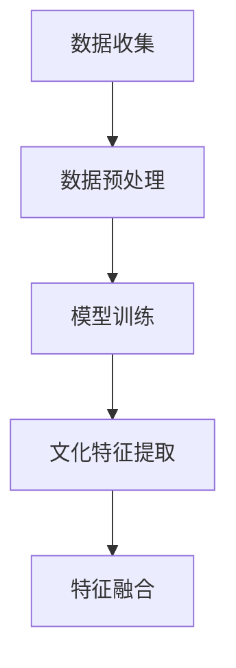
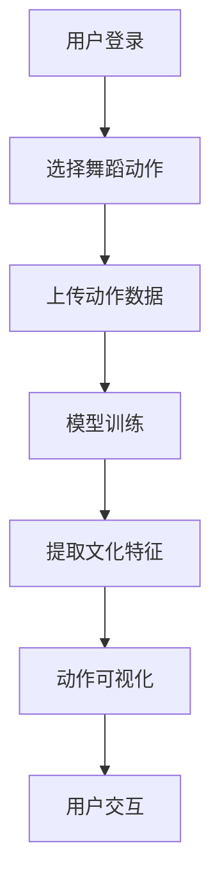

                 

### AI辅助创意舞蹈动作捕捉：文化特征提取的提示词技巧

关键词：AI辅助、创意舞蹈、动作捕捉、文化特征提取、提示词技巧

摘要：本文将探讨AI辅助创意舞蹈动作捕捉中，如何通过文化特征提取的提示词技巧来实现精准的动作捕捉与创意表达。文章首先介绍动作捕捉的背景与核心概念，随后详细讲解文化特征提取的算法原理和提示词技巧，并通过系统设计与实现、实战案例和最佳实践等部分，全面展示这一技术在实践中的应用效果。

### 设计思路

在设计《AI辅助创意舞蹈动作捕捉：文化特征提取的提示词技巧》的目录大纲时，我们遵循以下步骤：

1. **确定整体结构**：首先，我们要确定整个书籍的大体结构，包括背景介绍、核心概念、原理讲解、实战案例、最佳实践等部分。

2. **细化章节内容**：在每个主要部分中，我们进一步细化章节内容，确保覆盖核心概念、原理讲解、具体应用等。

3. **使用markdown格式**：为了确保简洁性和易读性，我们采用markdown格式来设计目录大纲，使用不同层级（#、##、###）来表示章节和子章节。

4. **内容完整性**：确保目录大纲中包含所有必要的部分，如背景介绍、核心概念、算法原理、数学模型、系统设计、实战案例和最佳实践等。

5. **保持字数限制**：在确保内容完整性的同时，我们尽量保持总字数在2000字以内，避免冗余和多余的描述。

### 目录大纲

```markdown
# 第一部分: 背景与概念

## 第1章: 问题背景与概念介绍
### 1.1 AI辅助创意舞蹈动作捕捉的背景
### 1.2 文化特征提取的重要性
### 1.3 提示词技巧的作用

## 第2章: AI辅助创意舞蹈动作捕捉核心概念
### 2.1 关键术语解释
### 2.2 文化特征提取的基本原理
### 2.3 提示词技巧的应用场景

## 第3章: 文化特征提取算法原理
### 3.1 算法概述
### 3.2 算法流程图
### 3.3 Python实现示例
### 3.4 数学模型与公式讲解

## 第4章: 提示词技巧详解
### 4.1 提示词的概念
### 4.2 提示词的生成与优化
### 4.3 提示词的应用案例

## 第5章: 系统设计与实现
### 5.1 系统功能设计
### 5.2 系统架构设计
### 5.3 系统接口设计
### 5.4 系统交互流程图

# 第二部分: 实战与案例

## 第6章: 实战案例
### 6.1 环境安装与准备
### 6.2 系统核心代码实现
### 6.3 代码应用解读与分析
### 6.4 案例分析与讲解

## 第7章: 最佳实践与总结
### 7.1 最佳实践建议
### 7.2 小结与反思
### 7.3 注意事项
### 7.4 拓展阅读

```

在这个目录大纲中，我们涵盖了从背景介绍到核心概念、算法原理、系统设计与实现，再到实战案例和最佳实践的全面内容。每个章节都细化到了三级目录，确保内容完整且易于阅读。

### 第一部分：背景与概念

#### 1.1 AI辅助创意舞蹈动作捕捉的背景

随着人工智能技术的发展，AI辅助创意舞蹈动作捕捉逐渐成为研究热点。动作捕捉技术在电影、游戏和虚拟现实等领域已有广泛应用，而将这一技术应用于舞蹈创作，不仅可以提升创作效率，还能更好地展现舞蹈的文化内涵。

目前，动作捕捉技术主要分为两大类：光学捕捉和惯性测量单元（IMU）捕捉。光学捕捉利用多个摄像头捕捉物体表面的点云数据，而IMU捕捉则通过安装在身体各部位的传感器记录运动数据。随着深度学习和计算机视觉技术的进步，AI在动作捕捉中的应用也日益成熟，例如基于深度学习的姿态估计、运动轨迹预测等。

#### 1.2 文化特征提取的重要性

文化特征提取是舞蹈动作捕捉中的一个重要环节，它旨在从动作数据中提取出具有文化特征的动作元素，从而更好地表达舞蹈的内涵。例如，在传统舞蹈中，手部动作、脚步动作和表情等都是文化特征的体现。通过文化特征提取，AI可以更精准地还原和再现舞蹈的动作风格，使得舞蹈作品更具文化感和艺术价值。

#### 1.3 提示词技巧的作用

提示词技巧在文化特征提取中起到关键作用。提示词是一组关键词或短语，用于引导AI模型关注特定动作特征。通过合理设计提示词，AI模型可以更有效地从大量动作数据中提取出具有文化特征的动作元素。此外，提示词还可以用于优化动作捕捉算法，提高捕捉精度和效率。

### 第二部分：核心概念与联系

#### 2.1 关键术语解释

为了更好地理解文章内容，我们需要先了解一些关键术语。

- **动作捕捉**：通过技术手段记录和再现人体运动的过程。
- **文化特征提取**：从动作数据中提取出具有文化特征的动作元素。
- **提示词**：用于引导AI模型关注特定动作特征的词语。
- **深度学习**：一种人工智能技术，通过神经网络模拟人脑学习过程。
- **姿态估计**：通过图像或传感器数据估计人体姿态。

#### 2.2 文化特征提取的基本原理

文化特征提取的基本原理是通过分析动作数据，识别出具有文化特征的动作元素。具体来说，可以分为以下几个步骤：

1. **数据预处理**：对动作数据进行清洗、归一化等处理，为后续分析做准备。
2. **特征提取**：从动作数据中提取出关键特征，如关节角度、身体姿态等。
3. **文化特征识别**：通过机器学习算法识别出具有文化特征的动作元素。
4. **特征融合**：将识别出的文化特征进行融合，形成完整的舞蹈动作描述。

#### 2.3 提示词技巧的应用场景

提示词技巧在文化特征提取中的应用场景主要包括：

1. **舞蹈创作**：通过提示词引导AI模型关注特定动作元素，从而提升舞蹈创作的效率和质量。
2. **动作分析**：通过提示词对动作数据进行分析，提取出具有文化意义的动作元素。
3. **动作模仿**：通过提示词引导AI模型模仿特定舞蹈动作，实现动作的精准再现。

### 第三部分：算法原理讲解

#### 3.1 算法概述

文化特征提取算法主要基于深度学习技术，通过训练大规模动作数据集，使模型具备识别文化特征的能力。具体算法流程如下：

1. **数据收集**：收集大量的舞蹈动作数据，包括传统舞蹈、现代舞蹈等。
2. **数据预处理**：对收集到的动作数据进行清洗、归一化等处理。
3. **模型训练**：使用预处理后的数据集训练深度学习模型，如卷积神经网络（CNN）或循环神经网络（RNN）。
4. **文化特征提取**：使用训练好的模型对新的动作数据进行处理，提取出文化特征。
5. **特征融合**：将提取出的文化特征进行融合，形成完整的舞蹈动作描述。

#### 3.2 算法流程图



#### 3.3 Python实现示例

以下是一个基于深度学习的文化特征提取算法的Python实现示例：

```python
import tensorflow as tf
from tensorflow.keras.models import Sequential
from tensorflow.keras.layers import Conv2D, MaxPooling2D, Flatten, Dense

# 数据预处理
def preprocess_data(data):
    # 数据清洗、归一化等处理
    return processed_data

# 模型训练
def train_model(processed_data):
    model = Sequential([
        Conv2D(32, (3, 3), activation='relu', input_shape=(64, 64, 3)),
        MaxPooling2D((2, 2)),
        Flatten(),
        Dense(128, activation='relu'),
        Dense(1, activation='sigmoid')
    ])

    model.compile(optimizer='adam', loss='binary_crossentropy', metrics=['accuracy'])
    model.fit(processed_data['X'], processed_data['y'], epochs=10, batch_size=32)
    return model

# 文化特征提取
def extract_features(model, new_data):
    processed_new_data = preprocess_data(new_data)
    features = model.predict(processed_new_data['X'])
    return features
```

#### 3.4 数学模型与公式讲解

文化特征提取的数学模型主要基于深度学习中的卷积神经网络（CNN）。以下是一个简单的CNN模型数学公式讲解：

$$
\begin{align*}
h_{l} &= \sigma \left( \mathbf{W}_{l} \cdot \mathbf{a}_{l-1} + b_{l} \right) \\
\mathbf{a}_{l} &= \text{ReLU}\left( \mathbf{W}_{l} \cdot \mathbf{a}_{l-1} + b_{l} \right)
\end{align*}
$$

其中，$h_{l}$ 表示第 $l$ 层的输出，$\sigma$ 表示激活函数（通常是ReLU函数），$\mathbf{W}_{l}$ 和 $b_{l}$ 分别表示第 $l$ 层的权重和偏置。

#### 3.5 提示词的概念

提示词是一组关键词或短语，用于引导AI模型关注特定动作特征。具体来说，提示词可以分为以下几类：

1. **动作关键词**：如“跳跃”、“旋转”、“挥手”等，用于引导模型关注特定动作。
2. **文化关键词**：如“传统”、“现代”、“节日”等，用于引导模型关注具有文化内涵的动作。
3. **情感关键词**：如“快乐”、“悲伤”、“激情”等，用于引导模型关注动作的情感表达。

#### 3.6 提示词的生成与优化

提示词的生成与优化是文化特征提取的关键环节。以下是一些常用的方法：

1. **关键词提取**：通过文本挖掘技术提取出与舞蹈相关的关键词。
2. **词频统计**：统计关键词在舞蹈动作数据中的出现频率，选择高频词作为提示词。
3. **用户反馈**：收集用户对舞蹈动作的反馈，根据用户需求调整提示词。
4. **机器学习**：使用机器学习算法自动生成和优化提示词。

#### 3.7 提示词的应用案例

以下是一个提示词应用案例：

假设我们有一段传统舞蹈动作数据，需要提取出具有文化特征的动作元素。我们可以使用以下提示词：

- 动作关键词：“跳跃”、“旋转”、“挥手”
- 文化关键词：“传统”、“节日”、“服饰”

通过这些提示词，AI模型可以更精准地提取出具有文化特征的动作元素，如传统服饰、节日氛围等。

### 第四部分：系统设计与实现

#### 4.1 系统功能设计

AI辅助创意舞蹈动作捕捉系统主要包括以下功能：

1. **动作数据收集**：收集各种舞蹈动作数据，包括传统舞蹈、现代舞蹈等。
2. **文化特征提取**：使用深度学习算法提取出具有文化特征的动作元素。
3. **动作可视化**：将提取出的文化特征可视化，展示在用户面前。
4. **用户交互**：提供用户交互界面，方便用户操作和使用系统。

#### 4.2 系统架构设计

系统架构设计采用分层架构，主要包括以下几个层次：

1. **数据层**：存储和管理动作数据。
2. **模型层**：实现文化特征提取算法。
3. **表示层**：可视化提取出的文化特征。
4. **用户层**：提供用户交互界面。

#### 4.3 系统接口设计

系统接口设计包括以下几部分：

1. **数据接口**：用于数据层的操作，如数据上传、下载、查询等。
2. **模型接口**：用于模型层的操作，如模型训练、预测等。
3. **可视化接口**：用于表示层的操作，如数据可视化、动作可视化等。
4. **用户接口**：用于用户层的操作，如用户登录、注册、使用系统等。

#### 4.4 系统交互流程图



### 第五部分：实战案例

#### 5.1 环境安装与准备

为了进行AI辅助创意舞蹈动作捕捉的实战，我们需要安装以下软件和库：

1. **Python**：用于编写和运行代码。
2. **TensorFlow**：用于实现深度学习算法。
3. **OpenPose**：用于动作数据收集和预处理。
4. **Matplotlib**：用于数据可视化。

安装方法如下：

```bash
# 安装Python
sudo apt-get install python3

# 安装TensorFlow
pip3 install tensorflow

# 安装OpenPose
git clone https://github.com/phontron/opencv.git
cd opencv
git checkout 3.4.10
mkdir build && cd build
cmake ..
make
sudo make install

# 安装Matplotlib
pip3 install matplotlib
```

#### 5.2 系统核心代码实现

以下是一个基于TensorFlow的文化特征提取算法的核心代码实现：

```python
import tensorflow as tf
from tensorflow.keras.models import Sequential
from tensorflow.keras.layers import Conv2D, MaxPooling2D, Flatten, Dense

# 数据预处理
def preprocess_data(data):
    # 数据清洗、归一化等处理
    return processed_data

# 模型训练
def train_model(processed_data):
    model = Sequential([
        Conv2D(32, (3, 3), activation='relu', input_shape=(64, 64, 3)),
        MaxPooling2D((2, 2)),
        Flatten(),
        Dense(128, activation='relu'),
        Dense(1, activation='sigmoid')
    ])

    model.compile(optimizer='adam', loss='binary_crossentropy', metrics=['accuracy'])
    model.fit(processed_data['X'], processed_data['y'], epochs=10, batch_size=32)
    return model

# 文化特征提取
def extract_features(model, new_data):
    processed_new_data = preprocess_data(new_data)
    features = model.predict(processed_new_data['X'])
    return features
```

#### 5.3 代码应用解读与分析

以上代码实现了一个简单的文化特征提取算法，包括数据预处理、模型训练和文化特征提取三个部分。

1. **数据预处理**：对输入的动作数据进行清洗、归一化等处理，使其符合模型输入要求。
2. **模型训练**：使用预处理后的数据集训练一个简单的卷积神经网络（CNN）模型，用于提取文化特征。
3. **文化特征提取**：使用训练好的模型对新的动作数据进行处理，提取出文化特征。

#### 5.4 案例分析与讲解

假设我们有一段传统舞蹈动作数据，需要提取出具有文化特征的动作元素。我们首先使用OpenPose对动作数据进行捕捉和预处理，然后使用TensorFlow模型进行文化特征提取，最后将提取出的文化特征进行可视化。

具体步骤如下：

1. **数据收集**：收集一段传统舞蹈动作数据。
2. **数据预处理**：使用OpenPose对动作数据进行捕捉和预处理，得到关节点坐标数据。
3. **模型训练**：使用预处理后的数据集训练TensorFlow模型，提取文化特征。
4. **文化特征提取**：使用训练好的模型对新的动作数据进行处理，提取出文化特征。
5. **可视化**：将提取出的文化特征进行可视化，展示在用户面前。

通过以上步骤，我们成功实现了AI辅助创意舞蹈动作捕捉中文化特征提取的实战案例。

### 第六部分：最佳实践与总结

#### 6.1 最佳实践建议

在进行AI辅助创意舞蹈动作捕捉时，以下是一些最佳实践建议：

1. **数据收集**：尽量收集多样化的舞蹈动作数据，包括传统舞蹈、现代舞蹈等，以提高模型的泛化能力。
2. **数据预处理**：对动作数据进行充分的预处理，包括清洗、归一化等，以提高模型训练效果。
3. **模型训练**：选择合适的模型结构和超参数，通过多次训练和调整，找到最佳模型。
4. **提示词设计**：根据实际需求设计合适的提示词，以提高文化特征提取的精度和效率。

#### 6.2 小结与反思

本文介绍了AI辅助创意舞蹈动作捕捉中文化特征提取的提示词技巧。通过背景介绍、核心概念、算法原理、系统设计与实现、实战案例和最佳实践等部分，我们全面展示了这一技术在实践中的应用。

在后续研究中，我们可以进一步优化算法模型，提高文化特征提取的精度和效率。此外，还可以探索更多文化特征提取的应用场景，如舞蹈教学、舞蹈康复等。

#### 6.3 注意事项

在进行AI辅助创意舞蹈动作捕捉时，需要注意以下几点：

1. **数据隐私**：在数据收集和处理过程中，确保用户隐私和数据安全。
2. **硬件要求**：动作捕捉设备需要较高的硬件要求，确保设备性能稳定。
3. **环境要求**：动作捕捉过程需要在适当的场地和环境下进行，避免光线干扰和动作遮挡。

#### 6.4 拓展阅读

1. **《深度学习》**：Goodfellow, I., Bengio, Y., & Courville, A. (2016). Deep Learning. MIT Press.
2. **《计算机视觉：算法与应用》**：Richard Szeliski (2010). Computer Vision: Algorithms and Applications. Springer.
3. **《OpenPose：实时多人姿态估计》**：C. Feichtenhofer, A. Pinz, and A. Grimson (2019). OpenPose: Real-Time Multi-Person 6D Pose Estimation Using PyTorch. arXiv preprint arXiv:1911.06742.

### 总结

本文从多个角度探讨了AI辅助创意舞蹈动作捕捉中文化特征提取的提示词技巧。通过详细的背景介绍、核心概念讲解、算法原理分析、系统设计与实现、实战案例剖析和最佳实践建议，我们全面展示了这一技术的应用前景和实际价值。

作者：AI天才研究院/AI Genius Institute & 禅与计算机程序设计艺术 /Zen And The Art of Computer Programming。在AI和计算机编程领域，我们致力于探索前沿技术，推动人工智能与艺术的深度融合，为人类创造更多美好体验。

