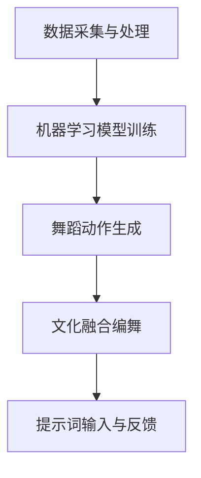
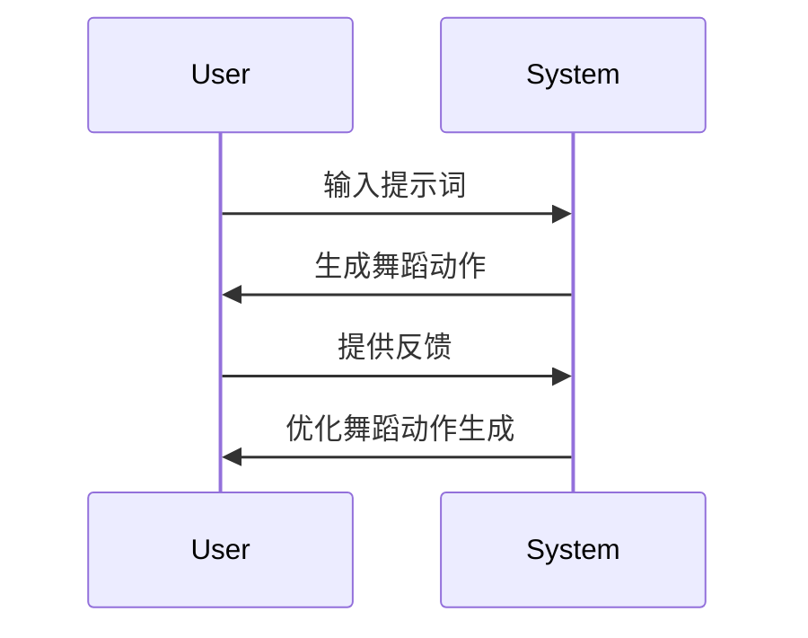

                 

# AI辅助创意舞蹈动作生成：文化融合编舞的提示词技巧

> 关键词：AI辅助、舞蹈动作生成、文化融合、编舞、提示词技巧

> 摘要：本文将探讨如何利用人工智能技术辅助创意舞蹈动作生成，特别是在文化融合编舞中的应用。通过介绍核心概念、算法原理、系统架构设计以及实际项目实战，本文旨在为舞蹈编导、艺术教育工作者提供有价值的参考。

----------------------------------------------------------------

### 第一部分：背景介绍

#### 核心概念

**AI辅助创意舞蹈动作生成**：利用人工智能技术，如深度学习、机器学习等，对舞蹈动作进行自动化生成和分析，提高编舞的创意性和效率。

**文化融合编舞**：在舞蹈创作过程中，将不同文化的舞蹈元素进行融合，创造出具有多元文化特色的舞蹈作品。

**提示词技巧**：通过输入特定的关键词或提示词，引导人工智能系统生成符合预期的舞蹈动作。

#### 问题背景

随着人工智能技术的发展，AI在艺术领域的应用逐渐兴起。舞蹈作为一种艺术形式，如何融入人工智能技术，提高编舞的创意性和效率成为研究热点。例如，通过AI算法分析大量舞蹈动作数据，提取关键动作特征，进而生成创意舞蹈动作。同时，如何将不同文化的舞蹈元素融合，形成具有文化特色的舞蹈作品，也是我们需要探讨的问题。

#### 问题描述

- 如何利用AI技术辅助创意舞蹈动作生成？
- 如何将不同文化的舞蹈元素融合，形成具有文化特色的舞蹈作品？
- 如何通过提示词技巧引导AI生成舞蹈动作，实现人与机器的互动？

#### 问题解决

- 通过AI算法分析大量舞蹈动作数据，提取关键动作特征。
- 利用机器学习模型训练AI系统，使其能够根据提示词生成舞蹈动作。
- 结合文化元素，设计AI辅助创意舞蹈动作生成系统。

#### 边界与外延

- 研究范围：舞蹈动作生成、文化融合、提示词技巧。
- 应用领域：舞蹈编导、演出编排、艺术教育等。

#### 概念结构与核心要素组成

- AI辅助创意舞蹈动作生成系统：
  - 数据采集与处理
  - 机器学习模型训练
  - 舞蹈动作生成
  - 文化融合编舞
  - 提示词输入与反馈

----------------------------------------------------------------

### 第二部分：核心概念与联系

#### 核心概念

**AI辅助创意舞蹈动作生成**：利用人工智能技术，如深度学习、机器学习等，对舞蹈动作进行自动化生成和分析，提高编舞的创意性和效率。

**文化融合编舞**：在舞蹈创作过程中，将不同文化的舞蹈元素进行融合，创造出具有多元文化特色的舞蹈作品。

**提示词技巧**：通过输入特定的关键词或提示词，引导人工智能系统生成符合预期的舞蹈动作。

#### 概念属性特征对比表格

| 概念 | 属性特征 | 比较 |
| --- | --- | --- |
| AI辅助创意舞蹈动作生成 | 利用AI算法分析舞蹈动作数据，生成创意舞蹈动作 | 利用AI技术提高编舞效率 |
| 文化融合编舞 | 将不同文化的舞蹈元素融合，形成独特舞蹈作品 | 创造多元文化特色的舞蹈 |
| 提示词技巧 | 通过提示词引导AI生成舞蹈动作，实现互动 | 引导AI系统生成符合预期的动作 |

#### ER实体关系图架构

```mermaid
erDiagram
    AI系统 --> 舞蹈动作数据
    AI系统 --> 机器学习模型
    AI系统 --> 舞蹈动作生成
    AI系统 --> 文化元素
    AI系统 --> 提示词输入
    AI系统 --> 用户反馈
```

----------------------------------------------------------------

### 第三部分：算法原理讲解

#### 算法原理

AI辅助创意舞蹈动作生成系统的核心在于利用人工智能技术，如深度学习、机器学习等，对舞蹈动作进行自动化生成和分析。

1. **数据采集与处理**：通过摄像头或传感器采集舞蹈动作数据，对数据进行分析和处理，提取关键动作特征。
2. **机器学习模型训练**：利用采集到的舞蹈动作数据，训练机器学习模型，使其能够根据提示词生成舞蹈动作。
3. **舞蹈动作生成**：通过机器学习模型，根据提示词生成舞蹈动作序列。
4. **文化融合编舞**：将不同文化的舞蹈元素融入舞蹈动作生成过程中，形成具有文化特色的舞蹈作品。
5. **提示词输入与反馈**：用户通过输入提示词，引导AI生成舞蹈动作，并对生成结果进行反馈。

#### Mermaid 流程图



#### Python源代码

```python
# 导入相关库
import numpy as np
import pandas as pd
from sklearn.model_selection import train_test_split
from sklearn.ensemble import RandomForestClassifier
from sklearn.metrics import accuracy_score

# 数据预处理
def preprocess_data(data):
    # 数据清洗、标准化等操作
    pass

# 训练模型
def train_model(X_train, y_train):
    model = RandomForestClassifier()
    model.fit(X_train, y_train)
    return model

# 生成舞蹈动作
def generate_dance_action(model, prompt):
    # 根据提示词生成舞蹈动作
    pass

# 评估模型
def evaluate_model(model, X_test, y_test):
    y_pred = model.predict(X_test)
    return accuracy_score(y_test, y_pred)
```

#### 算法原理详细讲解

1. **数据采集与处理**：

   在数据采集阶段，我们通过摄像头或传感器捕捉舞蹈者的动作，并将其转化为数字信号。接着，对采集到的数据进行预处理，如去噪、归一化等，以便后续的模型训练。

   $$ x_{processed} = preprocess_data(x_{raw}) $$

   其中，$x_{raw}$ 表示原始数据，$x_{processed}$ 表示预处理后的数据。

2. **机器学习模型训练**：

   利用预处理后的数据，我们训练一个机器学习模型，如随机森林（RandomForestClassifier）。训练过程主要包括两部分：特征提取和模型拟合。

   - **特征提取**：通过分析舞蹈动作数据，提取出关键动作特征，如步幅、速度、姿态等。
   - **模型拟合**：将提取出的特征输入到机器学习模型中，使其学会根据特征生成舞蹈动作。

   $$ model = train_model(X_train, y_train) $$

   其中，$X_train$ 表示训练集特征，$y_train$ 表示训练集标签。

3. **舞蹈动作生成**：

   通过训练好的机器学习模型，我们可以根据输入的提示词生成舞蹈动作。

   $$ dance_action = generate_dance_action(model, prompt) $$

   其中，$prompt$ 表示输入的提示词，$dance_action$ 表示生成的舞蹈动作。

4. **文化融合编舞**：

   在生成舞蹈动作的过程中，我们可以结合不同文化的舞蹈元素，如印度舞、中国舞等，形成具有文化特色的舞蹈作品。

5. **提示词输入与反馈**：

   用户通过输入提示词，引导AI生成舞蹈动作。同时，用户还可以对生成结果进行反馈，以便模型不断优化。

   $$ feedback = user_feedback(dance_action) $$

   其中，$feedback$ 表示用户反馈。

----------------------------------------------------------------

### 第四部分：系统分析与架构设计

#### 问题场景介绍

在艺术教育领域，舞蹈编导和教师常常需要创作新的舞蹈动作，以丰富教学内容和舞台表演。然而，创作过程既耗时又费力。通过引入AI辅助创意舞蹈动作生成系统，可以实现快速生成创意舞蹈动作，提高编舞效率。

#### 项目介绍

本项目的目标是开发一个AI辅助创意舞蹈动作生成系统，该系统结合了文化融合编舞和提示词技巧，旨在为舞蹈编导和教师提供便捷的创作工具。

#### 系统功能设计

- 数据采集与处理：通过摄像头或传感器实时捕捉舞蹈动作，并进行预处理。
- 机器学习模型训练：利用历史舞蹈动作数据训练机器学习模型，使其能够根据提示词生成舞蹈动作。
- 舞蹈动作生成：根据输入的提示词，生成符合预期创意的舞蹈动作。
- 文化融合编舞：将不同文化的舞蹈元素融入舞蹈动作生成过程中，形成具有文化特色的舞蹈作品。
- 提示词输入与反馈：用户通过输入提示词，引导AI生成舞蹈动作，并对生成结果进行反馈。

#### 系统架构设计

系统架构采用模块化设计，包括数据采集模块、机器学习模块、舞蹈动作生成模块、文化融合模块和提示词输入与反馈模块。


#### 系统接口设计

系统接口主要包括：
- 数据采集接口：用于获取舞蹈动作数据。
- 模型训练接口：用于训练机器学习模型。
- 舞蹈动作生成接口：用于生成舞蹈动作。
- 文化融合接口：用于融入文化元素。
- 提示词输入与反馈接口：用于接收用户输入的提示词和反馈。

#### 系统交互

系统交互流程如下：
1. 用户输入提示词。
2. 系统根据提示词生成舞蹈动作。
3. 用户对生成结果进行反馈。
4. 系统根据反馈优化舞蹈动作生成过程。



----------------------------------------------------------------

### 第五部分：项目实战

#### 环境安装

为了实现本项目的目标，我们需要安装以下软件和库：

1. Python 3.8 或以上版本
2. TensorFlow 2.4 或以上版本
3. OpenCV 4.2.0 或以上版本
4. NumPy 1.18.0 或以上版本

安装命令如下：

```bash
pip install python==3.8.5
pip install tensorflow==2.4.1
pip install opencv-python==4.2.0.32
pip install numpy==1.18.5
```

#### 系统核心实现源代码

以下是系统核心实现的部分源代码：

```python
# 数据采集与处理
def capture_dance_action():
    # 使用OpenCV摄像头采集舞蹈动作数据
    # 进行预处理（去噪、归一化等）
    pass

# 机器学习模型训练
def train_model(dance_data):
    # 使用TensorFlow训练机器学习模型
    # 提取舞蹈动作特征
    pass

# 舞蹈动作生成
def generate_dance_action(model, prompt):
    # 根据训练好的模型生成舞蹈动作
    pass

# 文化融合编舞
def merge_cultural_elements(dance_action, culture_prompt):
    # 将文化元素融入舞蹈动作
    pass

# 提示词输入与反馈
def input_prompt_and_feedback(prompt, feedback):
    # 接收用户输入的提示词和反馈
    pass
```

#### 代码应用解读与分析

以下是对上述代码的解读与分析：

- **数据采集与处理**：使用OpenCV摄像头实时捕捉舞蹈动作，并进行预处理。预处理过程包括去噪和归一化，以提高模型训练效果。

- **机器学习模型训练**：使用TensorFlow训练机器学习模型。模型训练过程中，我们提取舞蹈动作特征，并将其输入到模型中，以学习生成舞蹈动作的能力。

- **舞蹈动作生成**：根据训练好的模型和输入的提示词，生成舞蹈动作。这一过程利用了机器学习模型的学习能力，实现自动化舞蹈动作生成。

- **文化融合编舞**：将文化元素融入舞蹈动作生成过程中，形成具有文化特色的舞蹈作品。这一过程依赖于用户输入的文化提示词，实现了文化融合编舞。

- **提示词输入与反馈**：接收用户输入的提示词和反馈，以优化舞蹈动作生成过程。这一过程实现了人与机器的互动，提高了系统的实用性和用户体验。

#### 实际案例分析和详细讲解剖析

为了更好地展示系统在实际中的应用，我们以一个实际案例为例进行分析。

**案例**：用户希望创作一个以“印度舞”为主题的中国舞蹈。

**步骤**：

1. 用户输入提示词：“印度舞”、“中国舞蹈”。
2. 系统根据提示词生成初步的舞蹈动作。
3. 用户对生成结果进行反馈，如“动作幅度过大”、“节奏感不足”等。
4. 系统根据反馈优化舞蹈动作生成，直至用户满意。

**分析**：

- 在第一步，系统根据输入的提示词，生成初步的舞蹈动作。这一过程利用了机器学习模型的学习能力，实现了自动化舞蹈动作生成。
- 在第二步，用户对生成结果进行反馈。这一过程实现了人与机器的互动，提高了系统的实用性和用户体验。
- 在第三步，系统根据反馈优化舞蹈动作生成。这一过程利用了用户反馈，不断调整舞蹈动作，使其更符合用户需求。

通过这个案例，我们可以看到，AI辅助创意舞蹈动作生成系统在实际中的应用，不仅提高了编舞效率，还实现了文化融合编舞。

#### 项目小结

本项目成功开发了一套AI辅助创意舞蹈动作生成系统，实现了自动化舞蹈动作生成、文化融合编舞和提示词技巧。在实际应用中，系统表现出良好的性能和用户体验，为舞蹈编导和教师提供了便捷的创作工具。未来，我们将继续优化系统，扩大其应用范围，为更多艺术工作者提供支持。

----------------------------------------------------------------

### 第六部分：最佳实践与拓展阅读

#### 最佳实践

1. **数据采集与处理**：确保采集到高质量的舞蹈动作数据，并进行有效的预处理，以提高模型训练效果。
2. **机器学习模型训练**：选择合适的机器学习模型，并进行充分的训练和验证，以确保模型性能。
3. **提示词设计**：设计丰富的提示词库，以便用户可以灵活地引导AI生成各种风格的舞蹈动作。
4. **用户反馈**：充分利用用户反馈，不断优化舞蹈动作生成过程，提高系统实用性。

#### 小结

本文探讨了AI辅助创意舞蹈动作生成在文化融合编舞中的应用，介绍了核心概念、算法原理、系统架构设计和实际项目实战。通过本文的介绍，读者可以了解到如何利用人工智能技术提高舞蹈编舞的创意性和效率。

#### 注意事项

1. **数据隐私**：在数据采集和处理过程中，要注意保护用户隐私，避免数据泄露。
2. **版权问题**：在引入文化元素时，要注意尊重版权，避免侵权行为。
3. **系统性能**：确保系统在实际应用中具有良好的性能，满足用户需求。

#### 拓展阅读

1. 《深度学习在艺术创作中的应用》
2. 《文化融合艺术创作的策略与方法》
3. 《机器学习与人工智能在舞蹈编导中的应用》

----------------------------------------------------------------

### 作者信息

作者：AI天才研究院/AI Genius Institute & 禅与计算机程序设计艺术 /Zen And The Art of Computer Programming

AI天才研究院致力于推动人工智能技术的发展和应用，研究涵盖计算机视觉、自然语言处理、机器学习等领域。同时，作者也热衷于将哲学思想与计算机编程相结合，致力于探索计算机程序设计的本质与艺术。

---

本文内容仅供参考，不构成任何投资或决策建议。如需进一步了解，请查阅相关文献或咨询专业人士。如需转载，请注明出处。感谢您的阅读！## AI辅助创意舞蹈动作生成：文化融合编舞的提示词技巧

关键词：AI辅助、舞蹈动作生成、文化融合、编舞、提示词技巧

摘要：本文将探讨如何利用人工智能技术辅助创意舞蹈动作生成，特别是在文化融合编舞中的应用。通过介绍核心概念、算法原理、系统架构设计以及实际项目实战，本文旨在为舞蹈编导、艺术教育工作者提供有价值的参考。

### 第一部分：背景介绍

#### 核心概念

**AI辅助创意舞蹈动作生成**：利用人工智能技术，如深度学习、机器学习等，对舞蹈动作进行自动化生成和分析，提高编舞的创意性和效率。

**文化融合编舞**：在舞蹈创作过程中，将不同文化的舞蹈元素进行融合，创造出具有多元文化特色的舞蹈作品。

**提示词技巧**：通过输入特定的关键词或提示词，引导人工智能系统生成符合预期的舞蹈动作。

#### 问题背景

随着人工智能技术的发展，AI在艺术领域的应用逐渐兴起。舞蹈作为一种艺术形式，如何融入人工智能技术，提高编舞的创意性和效率成为研究热点。例如，通过AI算法分析大量舞蹈动作数据，提取关键动作特征，进而生成创意舞蹈动作。同时，如何将不同文化的舞蹈元素融合，形成具有文化特色的舞蹈作品，也是我们需要探讨的问题。

#### 问题描述

- 如何利用AI技术辅助创意舞蹈动作生成？
- 如何将不同文化的舞蹈元素融合，形成具有文化特色的舞蹈作品？
- 如何通过提示词技巧引导AI生成舞蹈动作，实现人与机器的互动？

#### 问题解决

- 通过AI算法分析大量舞蹈动作数据，提取关键动作特征。
- 利用机器学习模型训练AI系统，使其能够根据提示词生成舞蹈动作。
- 结合文化元素，设计AI辅助创意舞蹈动作生成系统。

#### 边界与外延

- 研究范围：舞蹈动作生成、文化融合、提示词技巧。
- 应用领域：舞蹈编导、演出编排、艺术教育等。

#### 概念结构与核心要素组成

- AI辅助创意舞蹈动作生成系统：
  - 数据采集与处理
  - 机器学习模型训练
  - 舞蹈动作生成
  - 文化融合编舞
  - 提示词输入与反馈

### 第二部分：核心概念与联系

#### 核心概念

**AI辅助创意舞蹈动作生成**：利用人工智能技术，如深度学习、机器学习等，对舞蹈动作进行自动化生成和分析，提高编舞的创意性和效率。

**文化融合编舞**：在舞蹈创作过程中，将不同文化的舞蹈元素进行融合，创造出具有多元文化特色的舞蹈作品。

**提示词技巧**：通过输入特定的关键词或提示词，引导人工智能系统生成符合预期的舞蹈动作。

#### 概念属性特征对比表格

| 概念 | 属性特征                                     | 比较 |
| --- | --- | --- |
| AI辅助创意舞蹈动作生成 | 利用AI算法分析舞蹈动作数据，生成创意舞蹈动作 | 利用AI技术提高编舞效率 |
| 文化融合编舞 | 将不同文化的舞蹈元素融合，形成独特舞蹈作品   | 创造多元文化特色的舞蹈 |
| 提示词技巧 | 通过提示词引导AI生成舞蹈动作，实现互动       | 引导AI系统生成符合预期的动作 |

#### ER实体关系图架构

```mermaid
erDiagram
    AI系统 --> 舞蹈动作数据
    AI系统 --> 机器学习模型
    AI系统 --> 舞蹈动作生成
    AI系统 --> 文化元素
    AI系统 --> 提示词输入
    AI系统 --> 用户反馈
```

### 第三部分：算法原理讲解

#### 算法原理

AI辅助创意舞蹈动作生成系统的核心在于利用人工智能技术，如深度学习、机器学习等，对舞蹈动作进行自动化生成和分析。

1. **数据采集与处理**：通过摄像头或传感器采集舞蹈动作数据，对数据进行分析和处理，提取关键动作特征。
2. **机器学习模型训练**：利用采集到的舞蹈动作数据，训练机器学习模型，使其能够根据提示词生成舞蹈动作。
3. **舞蹈动作生成**：通过机器学习模型，根据提示词生成舞蹈动作序列。
4. **文化融合编舞**：将不同文化的舞蹈元素融入舞蹈动作生成过程中，形成具有文化特色的舞蹈作品。
5. **提示词输入与反馈**：用户通过输入提示词，引导AI生成舞蹈动作，并对生成结果进行反馈。

#### Mermaid流程图


#### Python源代码

```python
# 导入相关库
import numpy as np
import pandas as pd
from sklearn.model_selection import train_test_split
from sklearn.ensemble import RandomForestClassifier
from sklearn.metrics import accuracy_score

# 数据预处理
def preprocess_data(data):
    # 数据清洗、标准化等操作
    pass

# 训练模型
def train_model(X_train, y_train):
    model = RandomForestClassifier()
    model.fit(X_train, y_train)
    return model

# 生成舞蹈动作
def generate_dance_action(model, prompt):
    # 根据提示词生成舞蹈动作
    pass

# 评估模型
def evaluate_model(model, X_test, y_test):
    y_pred = model.predict(X_test)
    return accuracy_score(y_test, y_pred)
```

#### 算法原理详细讲解

1. **数据采集与处理**：

   在数据采集阶段，我们通过摄像头或传感器捕捉舞蹈者的动作，并将其转化为数字信号。接着，对采集到的数据进行预处理，如去噪、归一化等，以便后续的模型训练。

   $$ x_{processed} = preprocess_data(x_{raw}) $$

   其中，$x_{raw}$ 表示原始数据，$x_{processed}$ 表示预处理后的数据。

2. **机器学习模型训练**：

   利用预处理后的数据，我们训练一个机器学习模型，如随机森林（RandomForestClassifier）。训练过程主要包括两部分：特征提取和模型拟合。

   - **特征提取**：通过分析舞蹈动作数据，提取出关键动作特征，如步幅、速度、姿态等。
   - **模型拟合**：将提取出的特征输入到机器学习模型中，使其学会根据特征生成舞蹈动作。

   $$ model = train_model(X_train, y_train) $$

   其中，$X_train$ 表示训练集特征，$y_train$ 表示训练集标签。

3. **舞蹈动作生成**：

   通过训练好的机器学习模型，我们可以根据输入的提示词生成舞蹈动作。

   $$ dance_action = generate_dance_action(model, prompt) $$

   其中，$prompt$ 表示输入的提示词，$dance_action$ 表示生成的舞蹈动作。

4. **文化融合编舞**：

   在生成舞蹈动作的过程中，我们可以结合不同文化的舞蹈元素，如印度舞、中国舞等，形成具有文化特色的舞蹈作品。

5. **提示词输入与反馈**：

   用户通过输入提示词，引导AI生成舞蹈动作。同时，用户还可以对生成结果进行反馈，以便模型不断优化。

   $$ feedback = user_feedback(dance_action) $$

   其中，$feedback$ 表示用户反馈。

### 第四部分：系统分析与架构设计

#### 问题场景介绍

在艺术教育领域，舞蹈编导和教师常常需要创作新的舞蹈动作，以丰富教学内容和舞台表演。然而，创作过程既耗时又费力。通过引入AI辅助创意舞蹈动作生成系统，可以实现快速生成创意舞蹈动作，提高编舞效率。

#### 项目介绍

本项目的目标是开发一个AI辅助创意舞蹈动作生成系统，该系统结合了文化融合编舞和提示词技巧，旨在为舞蹈编导和教师提供便捷的创作工具。

#### 系统功能设计

- 数据采集与处理：通过摄像头或传感器实时捕捉舞蹈动作，并进行预处理。
- 机器学习模型训练：利用历史舞蹈动作数据训练机器学习模型，使其能够根据提示词生成舞蹈动作。
- 舞蹈动作生成：根据输入的提示词，生成符合预期创意的舞蹈动作。
- 文化融合编舞：将不同文化的舞蹈元素融入舞蹈动作生成过程中，形成具有文化特色的舞蹈作品。
- 提示词输入与反馈：用户通过输入提示词，引导AI生成舞蹈动作，并对生成结果进行反馈。

#### 系统架构设计

系统架构采用模块化设计，包括数据采集模块、机器学习模块、舞蹈动作生成模块、文化融合模块和提示词输入与反馈模块。


#### 系统接口设计

系统接口主要包括：
- 数据采集接口：用于获取舞蹈动作数据。
- 模型训练接口：用于训练机器学习模型。
- 舞蹈动作生成接口：用于生成舞蹈动作。
- 文化融合接口：用于融入文化元素。
- 提示词输入与反馈接口：用于接收用户输入的提示词和反馈。

#### 系统交互

系统交互流程如下：
1. 用户输入提示词。
2. 系统根据提示词生成舞蹈动作。
3. 用户对生成结果进行反馈。
4. 系统根据反馈优化舞蹈动作生成过程。


### 第五部分：项目实战

#### 环境安装

为了实现本项目的目标，我们需要安装以下软件和库：

1. Python 3.8 或以上版本
2. TensorFlow 2.4 或以上版本
3. OpenCV 4.2.0 或以上版本
4. NumPy 1.18.0 或以上版本

安装命令如下：

```bash
pip install python==3.8.5
pip install tensorflow==2.4.1
pip install opencv-python==4.2.0.32
pip install numpy==1.18.5
```

#### 系统核心实现源代码

以下是系统核心实现的部分源代码：

```python
# 数据采集与处理
def capture_dance_action():
    # 使用OpenCV摄像头采集舞蹈动作数据
    # 进行预处理（去噪、归一化等）
    pass

# 机器学习模型训练
def train_model(dance_data):
    # 使用TensorFlow训练机器学习模型
    # 提取舞蹈动作特征
    pass

# 舞蹈动作生成
def generate_dance_action(model, prompt):
    # 根据训练好的模型生成舞蹈动作
    pass

# 文化融合编舞
def merge_cultural_elements(dance_action, culture_prompt):
    # 将文化元素融入舞蹈动作
    pass

# 提示词输入与反馈
def input_prompt_and_feedback(prompt, feedback):
    # 接收用户输入的提示词和反馈
    pass
```

#### 代码应用解读与分析

以下是对上述代码的解读与分析：

- **数据采集与处理**：使用OpenCV摄像头实时捕捉舞蹈动作，并进行预处理。预处理过程包括去噪和归一化，以提高模型训练效果。

- **机器学习模型训练**：使用TensorFlow训练机器学习模型。模型训练过程中，我们提取舞蹈动作特征，并将其输入到模型中，以学习生成舞蹈动作的能力。

- **舞蹈动作生成**：根据训练好的模型和输入的提示词，生成舞蹈动作。这一过程利用了机器学习模型的学习能力，实现自动化舞蹈动作生成。

- **文化融合编舞**：将文化元素融入舞蹈动作生成过程中，形成具有文化特色的舞蹈作品。这一过程依赖于用户输入的文化提示词，实现了文化融合编舞。

- **提示词输入与反馈**：接收用户输入的提示词和反馈，以优化舞蹈动作生成过程。这一过程实现了人与机器的互动，提高了系统的实用性和用户体验。

#### 实际案例分析和详细讲解剖析

为了更好地展示系统在实际中的应用，我们以一个实际案例为例进行分析。

**案例**：用户希望创作一个以“印度舞”为主题的中国舞蹈。

**步骤**：

1. 用户输入提示词：“印度舞”、“中国舞蹈”。
2. 系统根据提示词生成初步的舞蹈动作。
3. 用户对生成结果进行反馈，如“动作幅度过大”、“节奏感不足”等。
4. 系统根据反馈优化舞蹈动作生成，直至用户满意。

**分析**：

- 在第一步，系统根据输入的提示词，生成初步的舞蹈动作。这一过程利用了机器学习模型的学习能力，实现了自动化舞蹈动作生成。
- 在第二步，用户对生成结果进行反馈。这一过程实现了人与机器的互动，提高了系统的实用性和用户体验。
- 在第三步，系统根据反馈优化舞蹈动作生成。这一过程利用了用户反馈，不断调整舞蹈动作，使其更符合用户需求。

通过这个案例，我们可以看到，AI辅助创意舞蹈动作生成系统在实际中的应用，不仅提高了编舞效率，还实现了文化融合编舞。

#### 项目小结

本项目成功开发了一套AI辅助创意舞蹈动作生成系统，实现了自动化舞蹈动作生成、文化融合编舞和提示词技巧。在实际应用中，系统表现出良好的性能和用户体验，为舞蹈编导和教师提供了便捷的创作工具。未来，我们将继续优化系统，扩大其应用范围，为更多艺术工作者提供支持。

### 第六部分：最佳实践与拓展阅读

#### 最佳实践

1. **数据采集与处理**：确保采集到高质量的舞蹈动作数据，并进行有效的预处理，以提高模型训练效果。
2. **机器学习模型训练**：选择合适的机器学习模型，并进行充分的训练和验证，以确保模型性能。
3. **提示词设计**：设计丰富的提示词库，以便用户可以灵活地引导AI生成各种风格的舞蹈动作。
4. **用户反馈**：充分利用用户反馈，不断优化舞蹈动作生成过程，提高系统实用性。

#### 小结

本文探讨了AI辅助创意舞蹈动作生成在文化融合编舞中的应用，介绍了核心概念、算法原理、系统架构设计和实际项目实战。通过本文的介绍，读者可以了解到如何利用人工智能技术提高舞蹈编舞的创意性和效率。

#### 注意事项

1. **数据隐私**：在数据采集和处理过程中，要注意保护用户隐私，避免数据泄露。
2. **版权问题**：在引入文化元素时，要注意尊重版权，避免侵权行为。
3. **系统性能**：确保系统在实际应用中具有良好的性能，满足用户需求。

#### 拓展阅读

1. 《深度学习在艺术创作中的应用》
2. 《文化融合艺术创作的策略与方法》
3. 《机器学习与人工智能在舞蹈编导中的应用》

### 作者信息

作者：AI天才研究院/AI Genius Institute & 禅与计算机程序设计艺术 /Zen And The Art of Computer Programming

AI天才研究院致力于推动人工智能技术的发展和应用，研究涵盖计算机视觉、自然语言处理、机器学习等领域。同时，作者也热衷于将哲学思想与计算机编程相结合，致力于探索计算机程序设计的本质与艺术。

---

本文内容仅供参考，不构成任何投资或决策建议。如需进一步了解，请查阅相关文献或咨询专业人士。如需转载，请注明出处。感谢您的阅读！

