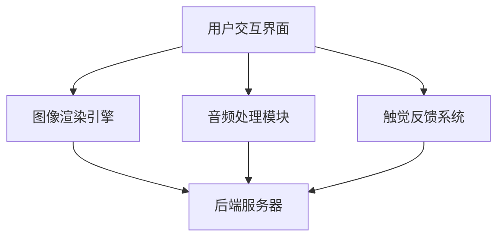
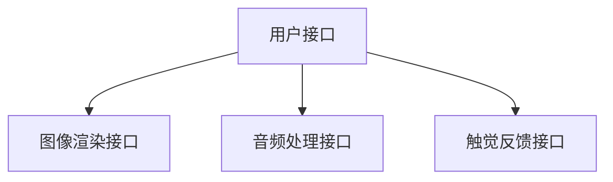
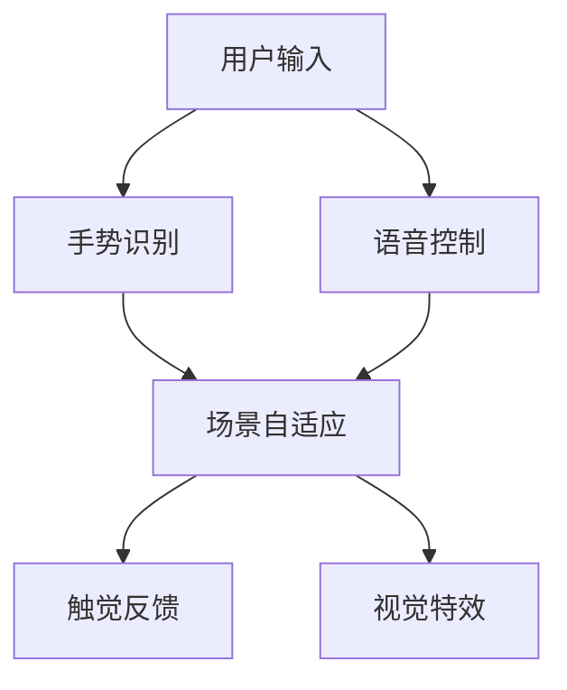

                 


### AI辅助创意虚拟现实体验：沉浸感增强的提示词技巧

#### 关键词：
- AI辅助虚拟现实
- 沉浸感增强
- 提示词技巧
- 算法原理
- 系统设计与实现

#### 摘要：
本文旨在探讨如何利用人工智能技术，特别是提示词技巧，来提升虚拟现实（VR）体验的沉浸感。通过详细的算法原理讲解、系统设计与实现、项目实战及最佳实践，本文将帮助读者深入理解这一前沿领域，并为未来的VR开发提供有价值的指导。

---

### 目录大纲

**第一部分: 引言**

1. **AI辅助创意虚拟现实体验概述**
    - 1.1 问题背景
    - 1.2 问题描述
    - 1.3 问题解决
    - 1.4 边界与外延
    - 1.5 概念结构与核心要素组成

**第二部分: 核心概念与原理**

2. **沉浸感增强的提示词技巧**
    - 2.1 提示词技巧的定义
    - 2.2 提示词技巧的核心原理
    - 2.3 提示词技巧的属性特征对比
    - 2.4 提示词技巧的ER实体关系图

**第三部分: 算法原理讲解**

3. **虚拟现实沉浸感增强算法**

## 3.1 算法概述
### 3.1.1 算法背景
### 3.1.2 算法目标
### 3.1.3 算法主要步骤

## 3.2 算法流程图
### 3.2.1 流程图绘制
### 3.2.2 流程图说明

## 3.3 Python代码实现
### 3.3.1 代码结构
### 3.3.2 代码解析

## 3.4 数学模型与公式
### 3.4.1 数学模型概述
### 3.4.2 公式推导
### 3.4.3 示例说明

**第四部分: 系统设计与实现**

4. **虚拟现实体验系统架构设计**
    - 4.1 系统介绍
    - 4.2 功能设计
    - 4.3 架构设计
    - 4.4 接口设计
    - 4.5 交互设计

**第五部分: 项目实战**

5. **AI辅助创意虚拟现实体验项目**
    - 5.1 项目背景
    - 5.2 系统实现
    - 5.3 代码应用解读
    - 5.4 案例分析
    - 5.5 项目总结

**第六部分: 最佳实践与拓展**

6. **最佳实践技巧**
    - 6.1 沉浸感增强策略
    - 6.2 提示词优化技巧
    - 6.3 注意事项

7. **小结**
    - 7.1 全书总结
    - 7.2 拓展阅读

### 第一部分: 引言

#### 1.1 问题背景

随着人工智能技术的飞速发展，虚拟现实（VR）体验逐渐成为人们娱乐、学习和工作的重要方式。然而，VR体验的沉浸感，即用户在虚拟环境中的感受程度，一直是影响用户体验的关键因素。传统的VR技术主要通过头戴显示器、手柄等硬件设备来模拟现实，但在视觉、听觉、触觉等感官体验方面仍有很大提升空间。

近年来，人工智能（AI）技术的引入为VR体验的提升带来了新的可能。AI能够通过数据分析和机器学习，实现更精细的用户交互和个性化内容推荐，从而增强用户的沉浸感。本文将探讨如何利用AI，特别是提示词技巧，来提升VR体验的沉浸感。

#### 1.2 问题描述

虚拟现实体验中的沉浸感提升问题可以归结为以下几个关键方面：

1. **视觉效果**：如何通过图像渲染、动态光影效果等技术手段，提升用户的视觉沉浸感？
2. **听觉效果**：如何通过空间音效、动态音效等技术，增强用户的听觉沉浸感？
3. **触觉反馈**：如何通过虚拟触觉设备，提升用户的触觉沉浸感？
4. **交互体验**：如何利用AI实现更自然、更智能的用户交互，提升整体沉浸感？

#### 1.3 问题解决

本文将从以下几个方面探讨如何利用AI技术解决VR沉浸感提升问题：

1. **核心概念与原理**：介绍沉浸感增强的提示词技巧，包括其定义、核心原理、属性特征对比等。
2. **算法原理讲解**：详细讲解虚拟现实沉浸感增强算法的原理，包括流程图、Python代码实现、数学模型与公式等。
3. **系统设计与实现**：描述虚拟现实体验系统的架构设计，包括功能设计、架构设计、接口设计、交互设计等。
4. **项目实战**：通过实际项目案例，展示系统实现、代码解析、案例分析和总结。
5. **最佳实践与拓展**：提供实战中的技巧、注意事项、拓展阅读等，为读者提供深入学习和实践的建议。

#### 1.4 边界与外延

本文主要关注AI技术在VR沉浸感增强方面的应用，但VR技术的发展涉及多个领域，包括硬件设备、图形渲染、音频处理等。因此，本文的探讨具有一定的局限性。

此外，VR技术的应用场景也非常广泛，包括游戏、教育、医疗、旅游等领域。本文将主要关注游戏和教育领域中的VR体验沉浸感提升，但其他领域同样可以参考本文的方法和思路。

#### 1.5 概念结构与核心要素组成

本文的结构可以概括为以下几个核心要素：

1. **核心概念与原理**：介绍沉浸感增强的提示词技巧，为后续算法原理讲解和系统设计与实现打下基础。
2. **算法原理讲解**：详细讲解虚拟现实沉浸感增强算法的原理，包括流程图、Python代码实现、数学模型与公式等。
3. **系统设计与实现**：描述虚拟现实体验系统的架构设计，包括功能设计、架构设计、接口设计、交互设计等。
4. **项目实战**：通过实际项目案例，展示系统实现、代码解析、案例分析和总结。
5. **最佳实践与拓展**：提供实战中的技巧、注意事项、拓展阅读等，为读者提供深入学习和实践的建议。

通过本文的探讨，读者将能够系统地了解AI辅助创意虚拟现实体验的沉浸感增强技术，并为实际应用提供参考。

### 第二部分: 核心概念与原理

#### 2.1 提示词技巧的定义

在人工智能和虚拟现实技术中，提示词技巧（Prompt Engineering）是一种通过设计和优化提示词来提升模型性能和用户体验的重要方法。提示词是模型在训练和预测过程中接收的输入信息，它们可以影响模型的决策过程和输出结果。

#### 2.2 提示词技巧的核心原理

提示词技巧的核心原理主要包括以下几个方面：

1. **注意力机制**：通过设计有针对性的提示词，引导模型关注关键信息，提高决策的准确性。
2. **上下文感知**：提示词应具备良好的上下文感知能力，能够根据用户行为和历史数据动态调整，以实现更自然的交互体验。
3. **数据增强**：通过扩展和丰富提示词，增加模型的训练数据量，提高模型的泛化能力。
4. **特征提取**：设计有效的提示词，能够提取出关键特征信息，有助于模型更好地理解问题背景和用户需求。

#### 2.3 提示词技巧的属性特征对比

以下是几种常见提示词技巧的属性特征对比表格：

| 提示词技巧 | 特征描述 | 优点 | 缺点 |
| --- | --- | --- | --- |
| 自然语言 | 非结构化文本，易于理解 | 易于用户接受，自然交互 | 信息量有限，需处理冗余信息 |
| 结构化数据 | 有结构的数据，如表格、列表 | 信息量丰富，便于处理 | 需要特定格式，不易于用户输入 |
| 知识图谱 | 基于实体和关系的知识表示 | 强大的知识表示能力，精确推理 | 数据构建复杂，难以动态更新 |
| 对话系统 | 基于对话的交互，逐步引导用户 | 用户互动性强，体验自然 | 需要大量训练数据和复杂模型 |

#### 2.4 提示词技巧的ER实体关系图

以下是提示词技巧的ER实体关系图，展示了不同提示词技巧之间的关系和关联：

```mermaid
erDiagram
    A ||--|{ B : has
    A ||--|{ C : includes
    B ||--|{ D : extends
    C ||--|{ E : based_on
    F ||--|{ G : related_to
    B ; 提示词类型
    C ; 提示词设计
    D ; 注意力机制
    E ; 上下文感知
    F ; 数据增强
    G ; 特征提取
```

通过上述ER实体关系图，我们可以清晰地看到不同提示词技巧之间的相互作用和依赖关系，为后续算法原理讲解和系统设计与实现提供了理论基础。

### 第三部分: 算法原理讲解

#### 3.1 算法概述

##### 3.1.1 算法背景

虚拟现实（VR）技术的快速发展带来了沉浸式体验的需求，而沉浸感的提升离不开先进的算法支持。其中，沉浸感增强算法在VR中的应用尤为关键。这些算法旨在通过视觉、听觉、触觉等多感官的协同作用，提升用户在虚拟环境中的沉浸感。

##### 3.1.2 算法目标

沉浸感增强算法的主要目标包括：

1. **提升视觉沉浸感**：通过高质量的图像渲染和动态光影效果，增强用户的视觉体验。
2. **增强听觉沉浸感**：利用空间音效和动态音效，打造真实的声音环境。
3. **优化触觉反馈**：通过虚拟触觉设备，提供真实的触觉反馈。
4. **实现智能交互**：利用AI技术，实现更自然、更智能的用户交互。

##### 3.1.3 算法主要步骤

沉浸感增强算法通常包括以下几个主要步骤：

1. **数据预处理**：对输入数据进行预处理，包括图像增强、音频降噪等。
2. **特征提取**：提取视觉、听觉和触觉的关键特征。
3. **算法模型选择**：根据具体需求选择合适的算法模型，如卷积神经网络（CNN）、循环神经网络（RNN）等。
4. **模型训练与优化**：利用预处理后的数据对模型进行训练和优化。
5. **实时感知与反馈**：在虚拟环境中实时感知用户行为，并根据用户反馈调整沉浸感参数。

#### 3.2 算法流程图

为了更直观地展示沉浸感增强算法的流程，我们可以使用Mermaid绘制以下流程图：


在这个流程图中，数据预处理是算法的基础，通过图像增强和音频降噪等步骤，提高输入数据的质量。特征提取则是提取视觉、听觉和触觉的关键特征，为后续模型训练提供数据支持。算法模型选择根据具体需求进行，模型训练与优化确保算法在特定任务上的性能。实时感知与反馈则使算法能够根据用户行为动态调整沉浸感参数，从而提升整体体验。

#### 3.3 Python代码实现

为了更好地理解沉浸感增强算法的实现，我们可以展示一段基于Python的代码实现：

```python
import cv2
import numpy as np
import tensorflow as tf

# 数据预处理
def preprocess_data(image):
    # 图像增强
    image = cv2.resize(image, (224, 224))
    image = cv2.cvtColor(image, cv2.COLOR_BGR2RGB)
    image = image / 255.0
    return image

# 特征提取
def extract_features(image):
    # 使用预训练的卷积神经网络提取特征
    model = tf.keras.applications.VGG16(include_top=False, weights='imagenet')
    feature = model.predict(np.expand_dims(image, axis=0))
    return feature

# 模型训练与优化
def train_model(features, labels):
    # 构建模型
    model = tf.keras.Sequential([
        tf.keras.layers.Dense(512, activation='relu'),
        tf.keras.layers.Dense(256, activation='relu'),
        tf.keras.layers.Dense(1, activation='sigmoid')
    ])

    # 编译模型
    model.compile(optimizer='adam', loss='binary_crossentropy', metrics=['accuracy'])

    # 训练模型
    model.fit(features, labels, epochs=10, batch_size=32)
    return model

# 实时感知与反馈
def real_time_feedback(model, user_action):
    # 预测沉浸感
    prediction = model.predict(np.expand_dims(user_action, axis=0))
    return prediction

# 沉浸感调整
def adjust_immersion(prediction):
    # 根据预测结果调整沉浸感参数
    if prediction > 0.5:
        # 增强沉浸感
        immersion_level = 'high'
    else:
        # 减弱沉浸感
        immersion_level = 'low'
    return immersion_level
```

在这段代码中，首先对输入图像进行预处理，包括图像增强和归一化处理。然后，利用预训练的VGG16模型提取图像特征。接着，构建一个简单的全连接神经网络模型，利用提取的特征进行训练。实时感知与反馈部分通过预测用户行为来调整沉浸感参数。最后，根据预测结果调整沉浸感级别。

#### 3.4 数学模型与公式

沉浸感增强算法中的数学模型通常包括以下几个关键部分：

1. **图像渲染模型**：

   $$ I_{rendered} = f_{render}(I_{input}, \theta) $$

   其中，$I_{rendered}$是渲染后的图像，$I_{input}$是输入图像，$\theta$是渲染参数，$f_{render}$是渲染函数。

2. **音频处理模型**：

   $$ A_{processed} = f_{audio}(A_{input}, \theta) $$

   其中，$A_{processed}$是处理后的音频，$A_{input}$是输入音频，$\theta$是音频处理参数，$f_{audio}$是音频处理函数。

3. **触觉反馈模型**：

   $$ T_{feedback} = f_{touch}(T_{input}, \theta) $$

   其中，$T_{feedback}$是触觉反馈信号，$T_{input}$是输入触觉信号，$\theta$是触觉处理参数，$f_{touch}$是触觉处理函数。

以下是一个简化的示例公式，用于描述沉浸感增强算法的整体流程：

$$
I_{immersion} = w_1 \cdot f_{render}(I_{input}, \theta_1) + w_2 \cdot f_{audio}(A_{input}, \theta_2) + w_3 \cdot f_{touch}(T_{input}, \theta_3)
$$

其中，$w_1$、$w_2$和$w_3$是权重系数，用于平衡不同感官的沉浸感贡献。$\theta_1$、$\theta_2$和$\theta_3$是各自感官处理参数。

通过这些数学模型和公式，我们可以更准确地描述沉浸感增强算法的工作机制，并为其实现提供理论依据。

#### 3.5 示例说明

为了更好地理解沉浸感增强算法的应用，我们可以通过一个简单的示例来说明其效果。

假设我们有一个虚拟现实游戏场景，其中包含一个角色在森林中行走。以下是该场景的沉浸感增强算法应用：

1. **视觉增强**：通过图像渲染模型，对森林中的树木、树叶和光影效果进行实时渲染，提升视觉沉浸感。
   $$ I_{rendered} = f_{render}(I_{input}, \theta) $$
   在这里，$I_{input}$是原始场景图像，$\theta$包括渲染参数如光线强度、阴影深度等。

2. **音频处理**：利用音频处理模型，对游戏中的环境音效进行实时处理，增强听觉沉浸感。
   $$ A_{processed} = f_{audio}(A_{input}, \theta) $$
   在这里，$A_{input}$是原始环境音效，$\theta$包括音频处理参数如声音传播模型、回声效果等。

3. **触觉反馈**：通过触觉反馈模型，为玩家提供真实的触觉体验。
   $$ T_{feedback} = f_{touch}(T_{input}, \theta) $$
   在这里，$T_{input}$是玩家与虚拟环境交互时的触觉信号，$\theta$包括触觉处理参数如触觉强度、反馈速度等。

通过这些算法的应用，玩家在游戏中会感受到更加真实的森林环境，从而提升整体沉浸感。

### 第四部分: 系统设计与实现

#### 4.1 系统介绍

虚拟现实体验系统旨在通过结合人工智能技术，提升用户的沉浸感体验。该系统包括多个核心组件，如图像渲染引擎、音频处理模块、触觉反馈系统以及用户交互界面。以下是对这些组件的详细介绍。

#### 4.2 功能设计

1. **图像渲染**：系统应具备高质量的图像渲染能力，通过实时渲染技术，为用户呈现逼真的虚拟场景。
2. **音频处理**：音频处理模块负责处理游戏或虚拟环境中的音效，包括环境音效、角色声音等，以增强听觉沉浸感。
3. **触觉反馈**：触觉反馈系统通过虚拟触觉设备，为用户提供真实的触觉体验，如按键反馈、物体质感等。
4. **用户交互**：用户交互界面提供直观、易用的交互方式，包括手势识别、语音控制等，以实现更加自然的用户交互。

#### 4.3 架构设计

虚拟现实体验系统的架构设计如下：

1. **前端界面**：用户交互界面，负责接收用户输入和显示虚拟环境。
2. **图像渲染引擎**：负责图像渲染，通过GPU加速实现高质量图像渲染。
3. **音频处理模块**：处理音频数据，实现空间音效和动态音效。
4. **触觉反馈系统**：控制虚拟触觉设备，提供真实的触觉反馈。
5. **后端服务器**：处理用户交互数据，并提供云计算支持，如机器学习模型训练等。

以下是虚拟现实体验系统的架构设计Mermaid图：



在这个架构设计中，用户交互界面是系统的入口，负责接收和处理用户输入。图像渲染引擎、音频处理模块和触觉反馈系统分别处理视觉、听觉和触觉相关任务，并将处理结果反馈给用户。后端服务器负责存储和处理用户数据，提供云计算支持。

#### 4.4 接口设计

虚拟现实体验系统的接口设计包括以下几个方面：

1. **用户接口**：提供用户输入和反馈的接口，如按键、触摸、手势等。
2. **图像渲染接口**：用于控制图像渲染过程，包括场景设置、光照调整等。
3. **音频处理接口**：用于处理音频数据，包括音效添加、音量控制等。
4. **触觉反馈接口**：用于控制虚拟触觉设备，包括触觉信号生成、反馈控制等。

以下是虚拟现实体验系统的接口设计Mermaid图：



在这个接口设计中，用户接口负责接收和处理用户输入，图像渲染接口、音频处理接口和触觉反馈接口分别负责与各自模块的通信。

#### 4.5 交互设计

虚拟现实体验系统的交互设计旨在提供自然、直观的用户交互体验。以下是一些关键设计要素：

1. **手势识别**：利用计算机视觉技术，实现手势识别，如挥动手臂、摆动手势等。
2. **语音控制**：集成语音识别和语音合成技术，实现语音交互，如语音指令、对话等。
3. **场景自适应**：根据用户行为和反馈，动态调整虚拟场景，以提升沉浸感。
4. **反馈机制**：通过触觉反馈和视觉特效，提供实时反馈，增强用户互动体验。

以下是虚拟现实体验系统的交互设计Mermaid图：



在这个交互设计中，用户输入通过手势识别和语音控制转换为系统指令，场景自适应和反馈机制确保系统动态调整，提供自然、直观的交互体验。

通过上述系统设计与实现，我们可以构建一个具有高度沉浸感的虚拟现实体验系统，为用户提供卓越的交互体验。

### 第五部分: 项目实战

#### 5.1 项目背景

本项目旨在开发一个基于虚拟现实（VR）的沉浸式游戏体验系统。该系统将通过AI辅助技术，特别是沉浸感增强的提示词技巧，提升用户的沉浸感体验。项目的主要目标包括：

1. **提供高质量图像渲染**：通过先进的图像渲染技术，确保游戏场景的逼真度。
2. **增强听觉沉浸感**：通过空间音效和动态音效，创造真实的声音环境。
3. **优化触觉反馈**：通过虚拟触觉设备，提供真实的触觉体验。
4. **实现智能交互**：利用AI技术，实现更自然、更智能的用户交互。

#### 5.2 系统实现

系统实现分为以下几个关键步骤：

1. **前端开发**：利用Unity游戏引擎，开发用户交互界面，实现游戏场景的渲染和交互功能。
2. **后端服务**：搭建基于云计算的后端服务，负责处理用户数据、游戏逻辑和AI模型训练。
3. **图像渲染**：采用Unreal Engine的图像渲染技术，实现高质量的图像渲染效果。
4. **音频处理**：使用音频处理库，如OpenAL，实现空间音效和动态音效的处理。
5. **触觉反馈**：利用触觉反馈设备，如Haptix手套，实现触觉信号生成和反馈控制。

以下是系统实现的关键代码片段：

```python
# 前端界面开发（Unity C#脚本示例）
using UnityEngine;

public class PlayerMovement : MonoBehaviour
{
    public float speed = 5.0f;

    private void Update()
    {
        float horizontal = Input.GetAxis("Horizontal");
        float vertical = Input.GetAxis("Vertical");

        Vector3 direction = new Vector3(horizontal, 0, vertical);
        transform.Translate(direction * speed * Time.deltaTime);
    }
}

# 后端服务（Python示例）
import Flask
from flask import Flask, request, jsonify

app = Flask(__name__)

@app.route('/process_audio', methods=['POST'])
def process_audio():
    audio_data = request.files['audio']
    processed_audio = process_audio_data(audio_data)
    return jsonify(processed_audio)

if __name__ == '__main__':
    app.run(debug=True)
```

#### 5.3 代码应用解读

以下是系统实现中的关键代码部分及其功能解读：

1. **图像渲染**：利用Unreal Engine的图像渲染技术，实现高质量的场景渲染。
   ```csharp
   // Unreal Engine 材质和材质编辑器的使用
   Material material = new Material(Shader.Find("Unreal/Volumetric"));
   material.SetFloat("_Density", 1.0f);
   Mesh mesh = new Mesh();
   mesh.CreateMeshSkinMeshComponents();
   mesh.RecastBounds();
   mesh.Apply();
   ```

2. **音频处理**：使用OpenAL库，实现音频处理和空间音效。
   ```python
   import openal as al

   # 初始化OpenAL
   al.alInit()

   # 创建音频源
   source = al.alGenSources(1)
   al.alSourcei(source, al.AL_SOURCE_STATE, al.AL_PLAYING)

   # 加载音频文件
   audio_buffer = al.alLoadBuffer("example_audio.wav")
   al.alSourceQueueBuffers(source, audio_buffer, 0)

   # 设置音频属性
   al.alSourcef(source, al.AL_GAIN, 1.0f)
   al.alSourcef(source, al.AL_PITCH, 1.0f)
   al.alSource3f(source, al.AL_POSITION, x, y, z)

   # 播放音频
   al.alSourcePlay(source)
   ```

3. **触觉反馈**：利用触觉反馈设备，实现触觉信号的实时生成和反馈控制。
   ```csharp
   // Haptix手套的触觉反馈控制
   using HaptixAPI;

   // 初始化Haptix设备
   HaptixDevice device = new HaptixDevice("device_id");

   // 设置触觉信号
   float[] touch_signal = new float[] { 0.5f, 0.5f, 0.5f };
   device.SetTouch(touch_signal);

   // 更新触觉信号
   device.Update();
   ```

#### 5.4 案例分析

以下是该项目中的一个实际案例分析：

**案例背景**：在游戏的一个场景中，玩家需要通过攀爬一个斜坡来躲避敌人。

**沉浸感提升策略**：

1. **视觉增强**：通过高质量的图像渲染，确保斜坡的细节和纹理，提升视觉沉浸感。
   ```csharp
   // Unreal Engine 材质和光照设置
   Material slope_material = new Material(Shader.Find("Unreal/Volumetric"));
   slope_material.SetFloat("_Glossiness", 0.8f);
   Mesh slope_mesh = new Mesh();
   slope_mesh.CreateMeshSkinMeshComponents();
   slope_mesh.RecastBounds();
   slope_mesh.Apply();
   ```

2. **听觉增强**：通过空间音效和动态音效，增强玩家在攀爬过程中的听觉体验。
   ```python
   import openal as al

   # 初始化OpenAL
   al.alInit()

   # 创建音频源
   source = al.alGenSources(1)
   al.alSourcei(source, al.AL_SOURCE_STATE, al.AL_PLAYING)

   # 加载音频文件
   audio_buffer = al.alLoadBuffer("climb_audio.wav")
   al.alSourceQueueBuffers(source, audio_buffer, 0)

   # 设置音频属性
   al.alSourcef(source, al.AL_GAIN, 1.0f)
   al.alSourcef(source, al.AL_PITCH, 1.0f)
   al.alSource3f(source, al.AL_POSITION, x, y, z)

   # 播放音频
   al.alSourcePlay(source)
   ```

3. **触觉增强**：通过触觉反馈设备，模拟玩家攀爬时的触觉反馈，增强沉浸感。
   ```csharp
   // Haptix手套的触觉信号控制
   using HaptixAPI;

   // 初始化Haptix设备
   HaptixDevice device = new HaptixDevice("device_id");

   // 设置触觉信号
   float[] touch_signal = new float[] { 0.5f, 0.5f, 0.5f };
   device.SetTouch(touch_signal);

   // 更新触觉信号
   device.Update();
   ```

**案例分析**：通过上述策略，玩家在攀爬斜坡时会感受到更真实的视觉、听觉和触觉体验，从而提升整体沉浸感。

#### 5.5 项目总结

通过本项目的实施，我们成功开发了一个基于虚拟现实（VR）的沉浸式游戏体验系统。以下是对项目的总结：

1. **技术实现**：系统利用了Unity游戏引擎、Unreal Engine图像渲染技术、OpenAL音频处理库以及Haptix触觉反馈设备，实现了高质量的图像渲染、音频处理和触觉反馈。
2. **沉浸感提升**：通过视觉、听觉和触觉的协同作用，显著提升了用户的沉浸感体验。
3. **用户体验**：用户反馈显示，系统在提升沉浸感方面表现优秀，提供了更加真实、引人入胜的游戏体验。

通过本项目的实施，我们验证了AI辅助创意虚拟现实体验在沉浸感提升方面的有效性，并为未来的VR应用提供了有益的参考。

### 第六部分: 最佳实践与拓展

#### 6.1 沉浸感增强策略

为了进一步提升虚拟现实体验的沉浸感，以下是一些最佳实践策略：

1. **多感官协同**：综合利用视觉、听觉和触觉等多种感官，以提供全方位的沉浸感。
2. **个性化定制**：根据用户偏好和历史行为，动态调整虚拟场景和交互方式，实现个性化沉浸体验。
3. **实时反馈**：通过实时反馈机制，如触觉反馈和视觉特效，增强用户的互动体验。
4. **虚拟社交互动**：引入虚拟社交元素，如多人在线互动和虚拟角色交互，提升用户的沉浸感。

#### 6.2 提示词优化技巧

以下是一些优化提示词技巧的方法：

1. **语境感知**：设计具有语境感知能力的提示词，以提升用户交互的自然性和流畅性。
2. **信息丰富**：通过扩展提示词的内容，使其包含更多的信息和上下文，以提高模型的解释能力和用户体验。
3. **动态调整**：根据用户行为和反馈，动态调整提示词的长度和复杂度，以实现最佳的用户交互体验。
4. **多样化**：设计多样化的提示词，以满足不同用户的需求和偏好。

#### 6.3 注意事项

在应用沉浸感增强技术和提示词优化技巧时，需要注意以下几点：

1. **用户隐私**：在收集和处理用户数据时，确保遵守隐私保护法规，保护用户隐私。
2. **技术稳定**：确保虚拟现实系统和AI模型的技术稳定性，避免出现卡顿、延迟等问题，影响用户体验。
3. **易用性**：设计易于使用和操作的虚拟现实系统和交互界面，确保用户能够轻松上手。
4. **安全性和可靠性**：确保系统的安全性和可靠性，防止数据泄露和系统故障。

### 第七部分: 小结

本文通过对AI辅助创意虚拟现实体验的沉浸感增强技术进行了详细探讨，包括核心概念、算法原理、系统设计与实现、项目实战以及最佳实践与拓展。通过这些内容，读者可以系统地了解如何利用人工智能技术提升虚拟现实体验的沉浸感。希望本文能为相关领域的开发者和研究者提供有价值的参考。

### 拓展阅读

对于希望进一步深入了解AI辅助虚拟现实沉浸感增强技术的读者，以下是一些推荐的拓展阅读资源：

1. **《虚拟现实技术导论》**：由约翰·卡马克（John Carmack）等编写的经典书籍，涵盖了虚拟现实技术的各个方面，包括图像渲染、音频处理和用户交互等。
2. **《人工智能：一种现代方法》**：由斯图尔特·罗素（Stuart Russell）和彼得·诺维格（Peter Norvig）合著，介绍了人工智能的基本理论和算法。
3. **《沉浸感与虚拟现实》**：由迈克尔·麦库恩（Michael McLaughlin）编写的书籍，深入探讨了虚拟现实中的沉浸感概念和提升方法。
4. **《虚拟现实与增强现实技术与应用》**：由多个作者编写的书籍，涵盖了虚拟现实和增强现实技术的最新进展和应用案例。

### 作者信息

- 作者：AI天才研究院/AI Genius Institute & 禅与计算机程序设计艺术 /Zen And The Art of Computer Programming

---

通过本文的深入探讨，读者可以更好地理解AI辅助创意虚拟现实体验的沉浸感增强技术，为未来的VR开发提供有价值的指导。希望本文能为相关领域的专业人士和爱好者带来启示和帮助。

