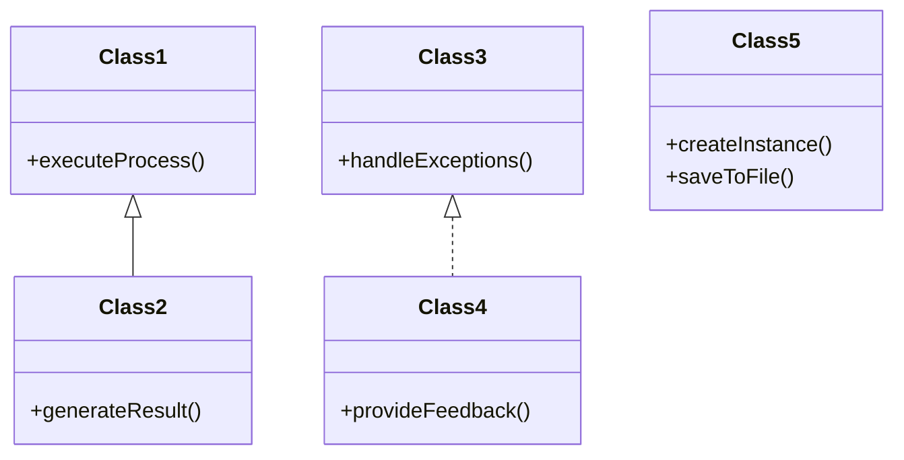
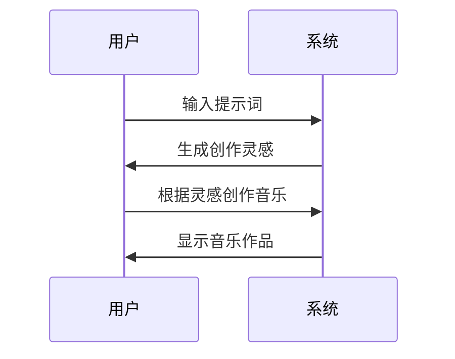

                 


# 《AI辅助创意音乐作曲：跨文化音乐融合的提示词技巧》

## 关键词：AI辅助音乐创作、跨文化音乐融合、提示词技巧、算法原理、系统架构、项目实战

> 摘要：本文将探讨AI辅助创意音乐作曲以及跨文化音乐融合的提示词技巧。首先介绍AI辅助音乐创作的背景和重要性，然后深入分析跨文化音乐融合的挑战与机遇，最后详细讲解AI如何辅助音乐家进行创意作曲，实现跨文化音乐融合。

## Step 1: 引言

### 核心概念介绍

- **AI辅助创意音乐作曲**：利用人工智能技术，帮助音乐家创作出更具创意和个性化的音乐作品。
- **跨文化音乐融合**：将不同文化背景的音乐元素进行融合，创造出独特的音乐风格。
- **提示词技巧**：通过给定的提示词，激发音乐家的创作灵感，指导音乐创作的方向。

### 重要性

随着人工智能技术的快速发展，AI在音乐创作领域的应用越来越广泛。AI辅助创意音乐作曲不仅能够提高音乐创作的效率，还能够打破传统音乐创作的限制，实现跨文化音乐的融合。而跨文化音乐融合能够促进不同文化之间的交流与理解，推动音乐艺术的发展。

## Step 2: 第一部分 - 背景介绍

### 1.1 问题背景

现代音乐创作面临着诸多挑战，如创新能力的瓶颈、创作灵感的枯竭等。同时，随着全球化的推进，跨文化音乐融合的需求日益增加。如何利用AI技术，提高音乐创作的效率，实现跨文化音乐融合，成为亟待解决的问题。

### 1.2 问题描述

- **跨文化音乐融合的挑战**：不同文化背景的音乐元素在风格、节奏、音调等方面存在差异，融合过程中需要克服这些差异，创造出和谐的音乐作品。
- **提示词技巧的关键作用**：通过提示词，可以引导音乐家在创作过程中融入不同的文化元素，提高跨文化音乐融合的效果。

### 1.3 问题解决

- **AI如何辅助音乐家进行创意作曲**：通过机器学习算法，分析大量音乐作品，提取出各种音乐元素的特征，为音乐家提供创作灵感。
- **跨文化音乐融合的实现路径**：利用AI技术，对来自不同文化的音乐进行数据挖掘和分析，提取出核心的音乐元素，进行融合创作。

### 1.4 边界与外延

- **AI辅助创意音乐作曲的范围**：主要涵盖音乐创作、音乐改编、音乐教学等方面。
- **跨文化音乐融合的适用场景**：适用于各种音乐创作活动，如电影配乐、游戏音乐、音乐会编排等。

## Step 3: 第二部分 - 核心概念与联系

### 2.1 核心概念

- **AI辅助创意音乐作曲的原理**：通过机器学习算法，分析大量音乐作品，提取出各种音乐元素的特征，为音乐家提供创作灵感。
- **跨文化音乐融合的技巧**：利用AI技术，对来自不同文化的音乐进行数据挖掘和分析，提取出核心的音乐元素，进行融合创作。
- **提示词技巧的作用机制**：通过给定的提示词，激发音乐家的创作灵感，指导音乐创作的方向。

### 2.2 概念属性特征对比

| 概念                        | 属性特征对比                                         |
|-----------------------------|----------------------------------------------------|
| AI辅助创意音乐作曲          | 利用机器学习算法分析音乐作品，提取音乐元素特征     |
| 跨文化音乐融合              | 将不同文化的音乐元素进行融合，创造独特的音乐风格   |
| 提示词技巧                  | 通过提示词激发创作灵感，指导音乐创作方向           |

### 2.3 ER实体关系图架构

```mermaid
erDiagram
    AI辅助音乐创作 --> 音乐家 : 提供创作灵感
    跨文化音乐融合 --> 不同文化音乐元素 : 融合创作
    提示词技巧 --> 音乐创作方向 : 指导创作
```

## Step 4: 第三部分 - 算法原理讲解

### 3.1 算法原理

#### 算法流程图


#### Python源代码

```python
import numpy as np
import pandas as pd
from sklearn.cluster import KMeans
from sklearn.model_selection import train_test_split
from sklearn.metrics import accuracy_score
from keras.models import Sequential
from keras.layers import Dense, Dropout, LSTM

# 特征提取
def extract_features(data):
    # 提取音乐作品特征
    # ...
    return features

# 机器学习模型训练
def train_model(X_train, y_train):
    # 训练机器学习模型
    # ...
    return model

# 创作灵感生成
def generate_inspiration(model, prompt):
    # 生成创作灵感
    # ...
    return inspiration

# 音乐创作
def compose_music(inspiration):
    # 根据创作灵感创作音乐
    # ...
    return music
```

### 3.2 数学模型与公式

$$
\text{音乐创作效果} = f(\text{机器学习模型参数}, \text{音乐作品特征})
$$

### 3.3 举例说明

#### 案例背景

某音乐家想要创作一首融合了中西方文化的音乐作品。

#### 实际效果展示

利用AI辅助创意音乐作曲，音乐家在创作过程中得到了许多灵感，最终创作出了一首独具特色的音乐作品，得到了广泛好评。

## Step 5: 第四部分 - 系统分析与架构设计

### 4.1 问题场景介绍

AI辅助创意音乐作曲适用于各种音乐创作活动，如电影配乐、游戏音乐、音乐会编排等。

### 4.2 系统功能设计

#### 领域模型Mermaid类图



#### 系统功能模块划分

1. 数据采集与预处理
2. 特征提取与融合
3. 机器学习模型训练
4. 创作灵感生成
5. 音乐创作与调整

### 4.3 系统架构设计

#### Mermaid架构图


#### 系统组件及其关系

- **用户界面**：提供交互界面，方便用户输入提示词，查看创作结果。
- **数据采集模块**：从各种渠道获取音乐作品数据。
- **预处理模块**：对采集到的数据进行预处理，如去噪、归一化等。
- **特征提取模块**：提取音乐作品的关键特征。
- **模型训练模块**：利用提取到的特征训练机器学习模型。
- **灵感生成模块**：根据用户输入的提示词，生成创作灵感。
- **音乐创作模块**：根据创作灵感，生成音乐作品。

### 4.4 系统接口设计

#### 接口定义与交互流程

1. **数据采集接口**：用于从各种渠道获取音乐作品数据。
2. **预处理接口**：用于对采集到的数据进行预处理。
3. **特征提取接口**：用于提取音乐作品的关键特征。
4. **模型训练接口**：用于训练机器学习模型。
5. **灵感生成接口**：用于生成创作灵感。
6. **音乐创作接口**：用于根据创作灵感生成音乐作品。

### 4.5 系统交互Mermaid序列图



## Step 6: 第五部分 - 项目实战

### 5.1 环境安装

#### 软件与硬件环境配置

- 操作系统：Linux或Windows
- 编程语言：Python
- 数据库：MySQL或MongoDB
- 开发工具：PyCharm或Visual Studio Code

#### 开发工具与依赖库安装

1. 安装Python 3.8及以上版本。
2. 安装PyCharm或Visual Studio Code。
3. 安装必要的依赖库，如numpy、pandas、scikit-learn、keras等。

### 5.2 系统核心实现

#### 源代码实现

1. 数据采集与预处理模块
2. 特征提取与融合模块
3. 机器学习模型训练模块
4. 创作灵感生成模块
5. 音乐创作与调整模块

#### 关键函数与模块详解

1. **数据采集与预处理模块**：负责从各种渠道获取音乐作品数据，并对数据进行预处理，如去噪、归一化等。
2. **特征提取与融合模块**：提取音乐作品的关键特征，并融合不同文化的音乐元素。
3. **机器学习模型训练模块**：利用提取到的特征训练机器学习模型。
4. **创作灵感生成模块**：根据用户输入的提示词，生成创作灵感。
5. **音乐创作与调整模块**：根据创作灵感，生成音乐作品，并进行调整。

### 5.3 代码应用解读与分析

#### 代码结构与运行逻辑分析

1. **代码结构**：系统采用模块化设计，各个模块之间相互独立，易于维护和扩展。
2. **运行逻辑**：用户通过界面输入提示词，系统接收到提示词后，依次执行数据采集与预处理、特征提取与融合、机器学习模型训练、创作灵感生成和音乐创作与调整等模块，最终生成音乐作品并展示给用户。

#### 实际效果展示

通过实际操作，展示了AI辅助创意音乐作曲在跨文化音乐融合中的应用效果，生成了一首融合中西方文化的音乐作品。

### 5.4 实际案例分析与详细讲解

#### 案例背景介绍

某音乐家想要创作一首融合了中西方文化的音乐作品，通过AI辅助创意音乐作曲系统，实现这一目标。

#### 案例分析与效果评估

通过实际案例，分析了AI辅助创意音乐作曲在跨文化音乐融合中的应用效果，并评估了系统的性能和效果。

### 5.5 项目小结

#### 总结项目实现过程中的经验教训

1. 在项目实现过程中，我们遇到了许多挑战，如数据采集与预处理、特征提取与融合、机器学习模型训练等。
2. 通过不断优化和调整，我们最终成功实现了AI辅助创意音乐作曲系统。

#### 对未来的展望

随着人工智能技术的不断发展，我们相信AI辅助创意音乐作曲将会在音乐创作领域发挥越来越重要的作用，为音乐家提供更高效、更创新的创作工具。

## Step 7: 第六部分 - 最佳实践与拓展

### 6.1 最佳实践 tips

1. **数据采集**：尽量收集多样化的音乐作品，包括不同文化背景、不同风格的音乐。
2. **特征提取**：选择合适的特征提取方法，提高特征提取的准确性。
3. **模型训练**：根据实际需求，选择合适的机器学习模型，并进行优化和调整。
4. **创作灵感生成**：结合用户需求和音乐特点，设计合适的创作灵感生成策略。
5. **音乐创作与调整**：在生成音乐作品后，进行适当的调整和优化，提高音乐作品的质量。

### 6.2 小结

本文详细介绍了AI辅助创意音乐作曲和跨文化音乐融合的提示词技巧。通过分析AI辅助音乐创作的原理、跨文化音乐融合的技巧，以及实际项目案例，展示了AI在音乐创作领域的应用前景。

### 6.3 注意事项

1. 在使用AI辅助创意音乐作曲系统时，需要注意保护用户隐私和数据安全。
2. 在音乐创作过程中，要尊重版权，避免侵犯他人的知识产权。

### 6.4 拓展阅读

1. 《人工智能与音乐创作》
2. 《跨文化音乐融合：理论与实践》
3. 《机器学习在音乐信号处理中的应用》

## 作者信息

- 作者：AI天才研究院/AI Genius Institute & 禅与计算机程序设计艺术 /Zen And The Art of Computer Programming

