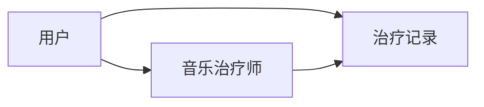

                 

### 引言

#### 1.1 问题背景

随着人工智能技术的快速发展，AI辅助创意音乐治疗已经成为一个备受关注的研究方向。个性化神经反馈的提示词技巧在这一领域中发挥着重要作用。音乐治疗作为一种古老而又现代的心理治疗方法，通过音乐对个体的心理和生理状态进行调节，帮助人们缓解压力、改善情绪、提升生活质量。然而，传统音乐治疗依赖于医生的经验和直觉，个体差异较大，治疗效果参差不齐。随着AI技术的发展，个性化、智能化的音乐治疗逐渐成为可能。

个性化神经反馈是一种通过实时监测和分析个体神经系统活动，提供针对性反馈，帮助个体调整情绪和行为的方法。在音乐治疗中，个性化神经反馈可以通过监测个体的生理信号（如心率、脑电波等），分析个体的心理状态，并实时调整音乐治疗的方案，以达到更好的治疗效果。

#### 1.2 核心概念与联系

##### 1.2.1 AI辅助创意音乐治疗

**概念原理**：AI辅助创意音乐治疗是指利用人工智能技术，为音乐治疗提供个性化、智能化的辅助工具，提高治疗效率和效果。它通过数据分析和机器学习算法，对个体的生理和心理状态进行实时监测和分析，提供个性化的音乐治疗方案。

**概念属性特征对比表格**：

| 特征         | 传统音乐治疗 | AI辅助创意音乐治疗 |
| ------------ | ------------ | ------------------ |
| 治疗方式     | 依赖医生经验 | 基于算法和数据分析 |
| 治疗效果     | 个体差异较大 | 个性化、针对性更强 |
| 治疗效率     | 较低         | 较高               |

**联系**：AI辅助创意音乐治疗的核心在于将人工智能技术应用于音乐治疗中，通过个性化神经反馈的提示词技巧，实现对个体心理状态的精准监测和调节。

##### 1.2.2 个性化神经反馈

**概念原理**：个性化神经反馈是指通过监测和分析个体神经系统的活动，实时提供反馈，帮助个体调整自己的情绪和行为。在音乐治疗中，个性化神经反馈可以通过监测个体的生理信号，分析个体的心理状态，并实时调整音乐的治疗方案。

**概念属性特征对比表格**：

| 特征         | 通用神经反馈 | 个性化神经反馈     |
| ------------ | ------------ | ------------------ |
| 反馈内容     | 固定模式     | 个性化、动态调整   |
| 反馈效果     | 一般性       | 针对性强、效果显著 |

**联系**：个性化神经反馈是AI辅助创意音乐治疗的重要组成部分，通过实时监测和分析个体的生理和心理状态，为音乐治疗提供个性化的反馈和指导。

##### 1.2.3 ER实体关系图架构

**ER实体关系图架构**：在AI辅助创意音乐治疗系统中，用户、音乐治疗师和治疗记录是核心实体。用户是接受音乐治疗的对象，音乐治疗师是提供音乐治疗的服务提供者，治疗记录则记录了用户在接受治疗过程中的所有数据和信息。

### 1.3 文章核心内容与结构

本文将从以下几个方面展开讨论：

1. **AI辅助创意音乐治疗的基础**：介绍人工智能、音乐治疗、神经反馈的基本概念和原理。
2. **个性化神经反馈的提示词技巧**：探讨个性化神经反馈在音乐治疗中的应用，包括提示词的定义、作用和应用方法。
3. **技术实现**：介绍AI辅助创意音乐治疗系统的实现方法，包括数据采集、预处理、算法实现和系统架构设计。
4. **项目实战**：通过实际项目案例，展示如何使用AI技术辅助音乐治疗，并分析项目的成功经验和不足之处。
5. **最佳实践与未来展望**：总结最佳实践，展望AI辅助创意音乐治疗的未来发展。

通过本文的讨论，旨在帮助读者深入了解AI辅助创意音乐治疗的技术和方法，为相关领域的研究和应用提供参考。

### 1.4 文章关键词

- AI辅助创意音乐治疗
- 个性化神经反馈
- 提示词技巧
- 数据分析
- 机器学习
- 音乐治疗原理

### 1.5 文章摘要

本文探讨了AI辅助创意音乐治疗的研究背景和核心概念，详细介绍了个性化神经反馈的提示词技巧及其在音乐治疗中的应用。通过理论分析和实际案例，展示了如何利用AI技术提高音乐治疗的个性化和智能化水平。文章还介绍了AI辅助创意音乐治疗系统的实现方法和架构设计，并对未来的发展趋势进行了展望。本文的目标是为相关领域的研究者和实践者提供有价值的参考和指导。

