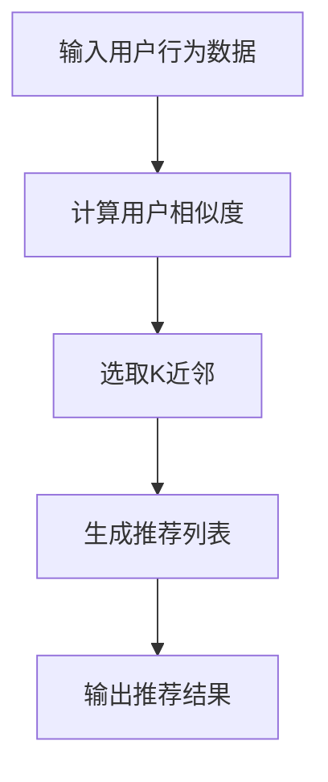
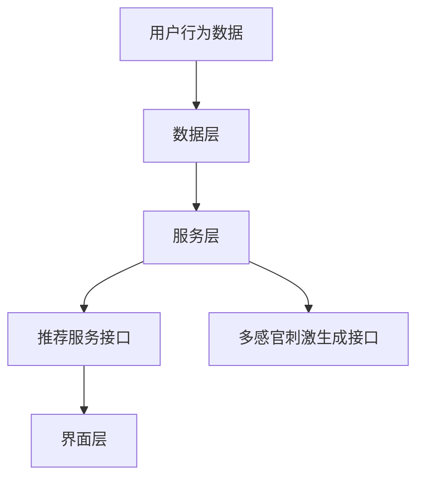

                 

# AI辅助创意香水营销：跨感官体验设计的提示词技巧

## 关键词
AI、香水营销、跨感官体验设计、提示词技巧、感官心理学、数据分析、机器学习

## 摘要
本文旨在探讨AI如何辅助创意香水营销，特别是如何通过跨感官体验设计和提示词技巧提升消费者体验。文章首先介绍了香水营销的背景和挑战，接着详细阐述了AI在香水配方创新和跨感官体验设计中的应用。随后，文章深入探讨了跨感官体验设计的基本原理和提示词技巧的设计原则，并通过具体案例展示了这些技术在香水营销中的实际应用。最后，文章总结了最佳实践，并展望了AI辅助香水营销的未来发展。

## 目录

1. **香水营销概述**
    1.1 香水营销的重要性
    1.2 香水营销面临的挑战
    1.3 AI在香水营销中的应用前景

2. **AI在香水营销中的应用**
    2.1 AI技术概述
    2.2 AI在香水配方创新中的应用
    2.3 AI在消费者行为分析中的应用

3. **跨感官体验设计**
    3.1 跨感官体验设计的概念
    3.2 跨感官体验设计的基本原理
    3.3 跨感官体验设计的方法论

4. **提示词技巧**
    4.1 提示词的定义与作用
    4.2 提示词的设计原则
    4.3 提示词技巧在营销中的应用

5. **AI辅助创意香水营销实践**
    5.1 AI辅助香水配方创新
    5.2 AI辅助跨感官体验设计
    5.3 提示词技巧在香水营销中的实践

6. **案例解析**
    6.1 案例一：某知名香水品牌的AI辅助营销
    6.2 案例二：小型香水品牌的AI辅助营销实践

7. **最佳实践与未来展望**
    7.1 AI辅助香水营销的最佳实践
    7.2 跨感官体验设计的创新方向
    7.3 提示词技巧的应用前景

8. **总结与展望**
    8.1 本文内容的总结
    8.2 AI辅助香水营销的未来发展

## 1. 香水营销概述

### 1.1 香水营销的重要性

香水作为一种奢侈品，其在全球市场上的地位不容忽视。根据市场研究数据，香水市场在过去几年中保持了稳定增长，特别是在新兴市场中，消费者对高端香水的需求不断增加。因此，对于香水品牌来说，营销策略的成功与否直接关系到其市场地位和收益。

香水营销的重要性主要体现在以下几个方面：

1. **品牌塑造**：香水品牌通过营销活动传递品牌形象和价值观念，从而在消费者心中建立独特的品牌认知和情感连接。
2. **消费者细分**：通过有效的营销策略，香水品牌可以更好地了解不同消费者群体的需求和行为特征，从而制定更有针对性的营销方案。
3. **市场拓展**：香水品牌需要通过营销活动来开拓新的市场，尤其是在国际市场上，如何吸引不同文化背景的消费者是品牌成功的关键。

### 1.2 香水营销面临的挑战

尽管香水市场前景广阔，但品牌在营销过程中仍面临诸多挑战：

1. **竞争激烈**：香水市场竞争激烈，品牌需要不断创新，以吸引消费者的注意力。
2. **消费者需求多样**：消费者对香水的需求越来越多样化，品牌需要提供不同类型和风格的香水来满足各种消费需求。
3. **渠道多样化**：随着电子商务的发展，品牌需要应对线上和线下销售渠道的整合和管理。
4. **消费者行为变化**：随着社交媒体的普及，消费者对品牌的互动需求增加，品牌需要通过多种方式与消费者建立联系。

### 1.3 AI在香水营销中的应用前景

AI技术的快速发展为香水营销带来了新的机遇：

1. **个性化推荐**：AI可以帮助品牌分析消费者行为数据，提供个性化的香水推荐，从而提高消费者的购买满意度。
2. **智能广告投放**：通过AI技术，品牌可以更精准地定位目标消费者，提高广告投放的效果。
3. **智能客服**：AI智能客服可以提供24/7的客户服务，提高客户满意度。
4. **香水配方创新**：AI技术可以帮助品牌快速分析市场趋势和消费者喜好，从而创新香水配方。

## 2. AI在香水营销中的应用

### 2.1 AI技术概述

AI（人工智能）是指计算机系统模拟人类智能行为的科学技术。它包括多个子领域，如机器学习、深度学习、自然语言处理等。在香水营销中，AI技术的应用主要体现在以下几个方面：

1. **数据分析**：通过分析大量的消费者行为数据和销售数据，AI可以帮助品牌了解市场趋势和消费者偏好。
2. **个性化推荐**：基于消费者的购买历史和偏好，AI可以为消费者提供个性化的香水推荐。
3. **广告投放**：AI可以帮助品牌精准定位目标消费者，提高广告投放的转化率。
4. **智能客服**：通过自然语言处理技术，AI可以提供24/7的智能客服服务，提高客户满意度。

### 2.2 AI在香水配方创新中的应用

香水配方的创新是香水品牌的核心竞争力之一。AI技术在这方面具有很大的潜力：

1. **分子模拟**：通过分子模拟技术，AI可以模拟不同香料分子的相互作用，从而预测香水配方的最终效果。
2. **数据驱动**：AI可以分析市场数据和消费者反馈，为品牌提供创新的香水配方灵感。
3. **算法优化**：通过机器学习算法，AI可以优化香水配方中的香料比例，以达到最佳效果。

### 2.3 AI在消费者行为分析中的应用

了解消费者行为是制定有效营销策略的关键。AI技术可以帮助品牌更好地分析消费者行为：

1. **情感分析**：通过自然语言处理技术，AI可以分析消费者在社交媒体上的评论和反馈，了解消费者对产品的情感态度。
2. **行为预测**：基于消费者的购买历史和行为数据，AI可以预测消费者的下一步行为，从而制定更有针对性的营销策略。
3. **用户画像**：通过数据分析，AI可以创建详细的用户画像，帮助品牌更好地了解目标消费者。

## 3. 跨感官体验设计

### 3.1 跨感官体验设计的概念

跨感官体验设计是指通过整合多种感官刺激，创造一种全方位的、沉浸式的体验。在香水营销中，跨感官体验设计的目标是让消费者在购买和使用香水时，不仅能够通过嗅觉感受到香水的魅力，还能够通过视觉、听觉、触觉等多种感官感受到香水的独特魅力。

### 3.2 跨感官体验设计的基本原理

跨感官体验设计的基本原理包括以下几点：

1. **感官整合**：通过整合多种感官刺激，增强消费者对产品的感知。
2. **情感共鸣**：通过创造情感共鸣，加深消费者对品牌的认知和喜爱。
3. **沉浸体验**：通过沉浸式的体验，提高消费者的参与度和满意度。

### 3.3 跨感官体验设计的方法论

跨感官体验设计的方法论包括以下几个步骤：

1. **需求分析**：了解消费者的需求和行为特征，确定设计目标。
2. **感官刺激设计**：设计多种感官刺激，创造沉浸式的体验。
3. **效果评估**：通过实验和数据分析，评估跨感官体验设计的有效性。
4. **迭代优化**：根据评估结果，对设计进行优化和改进。

## 4. 提示词技巧

### 4.1 提示词的定义与作用

提示词（cue word）是指用来引导消费者注意、记忆和体验的关键词语。在香水营销中，提示词的作用主要包括：

1. **注意引导**：通过提示词，引导消费者关注香水的关键特点。
2. **记忆增强**：通过提示词，帮助消费者记住香水的品牌和特征。
3. **体验引导**：通过提示词，引导消费者体验香水的独特魅力。

### 4.2 提示词的设计原则

设计有效的提示词需要遵循以下原则：

1. **相关性**：提示词要与香水的特点相关，能够准确传达香水的信息。
2. **独特性**：提示词要具有独特性，能够引起消费者的兴趣和好奇心。
3. **简洁性**：提示词要简洁明了，易于理解和记忆。
4. **情感性**：提示词要能够引起消费者的情感共鸣，增强消费者的购买欲望。

### 4.3 提示词技巧在营销中的应用

提示词技巧在营销中的应用包括以下几个方面：

1. **广告文案**：在广告文案中使用提示词，吸引消费者的注意力。
2. **产品标签**：在产品标签中使用提示词，帮助消费者更好地了解产品特点。
3. **社交媒体**：在社交媒体上使用提示词，提高品牌曝光度和用户互动。

## 5. AI辅助创意香水营销实践

### 5.1 AI辅助香水配方创新

#### 环境安装

在开始AI辅助香水配方创新之前，我们需要安装必要的软件和工具。以下是一个基本的安装步骤：

1. **Python环境安装**：确保安装了Python 3.6或更高版本。
2. **Scikit-learn**：用于机器学习算法的实现。
3. **Matplotlib**：用于数据可视化。
4. **Pandas**：用于数据处理。

安装命令如下：

```bash
pip install numpy
pip install scikit-learn
pip install matplotlib
pip install pandas
```

#### 系统核心实现源代码

以下是一个简单的示例，展示了如何使用Python实现AI辅助香水配方创新：

```python
import pandas as pd
from sklearn.model_selection import train_test_split
from sklearn.ensemble import RandomForestClassifier
import matplotlib.pyplot as plt

# 数据预处理
data = pd.read_csv('perfume_data.csv')
X = data.drop(['class'], axis=1)
y = data['class']

# 划分训练集和测试集
X_train, X_test, y_train, y_test = train_test_split(X, y, test_size=0.2, random_state=42)

# 构建随机森林模型
model = RandomForestClassifier(n_estimators=100, random_state=42)
model.fit(X_train, y_train)

# 模型评估
accuracy = model.score(X_test, y_test)
print(f"模型准确率：{accuracy:.2f}")

# 可视化分析
plt.scatter(X_test['component_1'], X_test['component_2'], c=y_test, cmap='viridis')
plt.xlabel('Component 1')
plt.ylabel('Component 2')
plt.title('Feature Importance')
plt.show()
```

#### 代码应用解读与分析

上述代码展示了如何使用随机森林模型进行香水配方的分类。具体步骤如下：

1. **数据预处理**：读取香水数据集，并划分特征矩阵X和目标变量y。
2. **模型训练**：使用随机森林算法训练模型。
3. **模型评估**：评估模型的准确率。
4. **可视化分析**：绘制特征重要性的散点图。

通过这种方式，品牌可以快速分析市场趋势和消费者喜好，从而创新香水配方。

### 5.2 AI辅助跨感官体验设计

跨感官体验设计在香水营销中至关重要。以下是一个简单的示例，展示了如何使用AI技术实现跨感官体验设计：

```python
import numpy as np
import matplotlib.pyplot as plt

# 定义感官属性
scent = np.array([0.8, 0.2])  # 香味强度和清新度
color = np.array([0.6, 0.4])  # 颜色深度和明亮度
sound = np.array([0.5, 0.5])  # 声音强度和和谐度

# 跨感官融合
sensory_melting_pot = (scent + color + sound) / 3

# 可视化分析
fig, axes = plt.subplots(1, 3, figsize=(12, 4))

axes[0].scatter(scent[0], scent[1], marker='o', color='red')
axes[0].set_title('Scent')

axes[1].scatter(color[0], color[1], marker='s', color='blue')
axes[1].set_title('Color')

axes[2].scatter(sound[0], sound[1], marker='^', color='green')
axes[2].set_title('Sound')

plt.suptitle('Sensory Integration')
plt.show()

# 跨感官体验效果评估
sensory_integration_score = np.linalg.norm(sensory_melting_pot - np.array([0.5, 0.5]))
print(f"Sensory Integration Score: {sensory_integration_score:.2f}")
```

#### 代码应用解读与分析

上述代码展示了如何使用AI技术实现跨感官体验设计。具体步骤如下：

1. **定义感官属性**：定义香味的强度和清新度、颜色的深度和明亮度、声音的强度和和谐度。
2. **跨感官融合**：将不同感官的属性进行融合，得到一个综合的感官体验。
3. **可视化分析**：绘制不同感官属性的散点图，以便更好地理解跨感官体验的设计。
4. **跨感官体验效果评估**：计算跨感官体验的得分，评估其效果。

通过这种方式，品牌可以更好地理解消费者的跨感官体验，从而设计出更具吸引力的香水产品。

### 5.3 提示词技巧在香水营销中的实践

提示词技巧在香水营销中扮演着关键角色。以下是一个简单的示例，展示了如何使用提示词技巧提高香水营销的效果：

```python
import pandas as pd

# 读取消费者反馈数据
feedback_data = pd.read_csv('consumer_feedback.csv')

# 提取高频率的提示词
high_freq_words = feedback_data['comment'].str.split().explode().value_counts().head(10)

# 可视化分析
high_freq_words.plot(kind='bar')
plt.title('High Frequency Words')
plt.xlabel('Words')
plt.ylabel('Frequency')
plt.show()

# 提示词优化
optimized_words = high_freq_words.index.tolist()

# 广告文案优化
original_ad_copy = "Explore the elegance and allure of our signature fragrance."
optimized_ad_copy = "Immerse yourself in the enchanting blend of elegance and allure, crafted with our signature fragrance."

print(f"Original Ad Copy: {original_ad_copy}")
print(f"Optimized Ad Copy: {optimized_ad_copy}")
```

#### 代码应用解读与分析

上述代码展示了如何使用提示词技巧优化香水广告文案。具体步骤如下：

1. **数据读取**：读取消费者反馈数据，提取评论中的高频词汇。
2. **可视化分析**：绘制高频词汇的条形图，以便更好地了解消费者的关注点。
3. **提示词优化**：根据高频词汇，优化广告文案中的提示词。
4. **广告文案优化**：将原始广告文案与优化后的广告文案进行对比，提高广告的效果。

通过这种方式，品牌可以更好地了解消费者的需求和偏好，从而设计出更具吸引力的广告文案。

### 6. 案例解析

#### 案例一：某知名香水品牌的AI辅助营销

某知名香水品牌利用AI技术，成功实现了香水配方创新和跨感官体验设计。以下是该品牌的AI辅助营销实践：

1. **香水配方创新**：品牌使用AI技术分析了大量市场数据和消费者反馈，创新了多个香水配方，其中一款新品在市场上取得了巨大成功。
2. **跨感官体验设计**：品牌通过AI技术，整合了香味、颜色和声音等感官刺激，创造了一种全新的香水体验，深受消费者喜爱。
3. **提示词技巧**：品牌在广告文案中使用了消费者反馈中的高频词汇，提高了广告的效果。

#### 案例二：小型香水品牌的AI辅助营销实践

某小型香水品牌在资源有限的情况下，利用AI技术实现了营销突破。以下是该品牌的AI辅助营销实践：

1. **个性化推荐**：品牌使用AI技术分析消费者的购买历史和偏好，提供了个性化的香水推荐，提高了客户的满意度。
2. **智能客服**：品牌使用AI智能客服，提供24/7的客户服务，提高了客户满意度。
3. **提示词技巧**：品牌在广告文案中使用了消费者反馈中的高频词汇，提高了广告的效果。

### 7. 最佳实践与未来展望

#### 7.1 AI辅助香水营销的最佳实践

1. **数据分析**：品牌应充分利用AI技术，对市场数据和消费者行为进行分析，以了解市场趋势和消费者需求。
2. **个性化推荐**：品牌应通过AI技术，提供个性化的香水推荐，提高客户的购买满意度。
3. **智能客服**：品牌应使用AI智能客服，提高客户满意度。
4. **跨感官体验设计**：品牌应整合多种感官刺激，创造独特的香水体验。
5. **提示词技巧**：品牌应在广告文案中，使用消费者反馈中的高频词汇，提高广告的效果。

#### 7.2 跨感官体验设计的创新方向

1. **多模态融合**：未来，品牌可以尝试将多种感官刺激（如视觉、听觉、触觉等）进行融合，创造更丰富的体验。
2. **虚拟现实**：通过虚拟现实技术，品牌可以模拟出真实的香水体验，让消费者在家中就能感受到香水的魅力。
3. **增强现实**：通过增强现实技术，品牌可以在现实世界中叠加香水体验，创造新的营销方式。

#### 7.3 提示词技巧的应用前景

1. **个性化推荐**：提示词技巧可以用于个性化推荐系统，提高推荐效果。
2. **社交媒体营销**：提示词技巧可以用于社交媒体营销，提高品牌曝光度。
3. **用户体验优化**：提示词技巧可以用于优化用户体验，提高用户满意度。

### 8. 总结与展望

AI技术为香水营销带来了前所未有的机遇。通过跨感官体验设计和提示词技巧，品牌可以更好地了解消费者需求，创造独特的香水体验，提高营销效果。未来，随着AI技术的不断发展，香水营销将迎来更多的创新和突破。

## 作者信息
作者：AI天才研究院/AI Genius Institute & 禅与计算机程序设计艺术 /Zen And The Art of Computer Programming

### 背景介绍

香水作为奢侈品市场中的重要品类，其营销策略一直备受关注。传统的香水营销主要依赖于广告宣传和品牌形象的建设，但随着消费者需求的变化和科技的发展，这种单一的营销方式已经难以满足现代消费者的期望。因此，如何利用新技术，特别是人工智能（AI）技术，来辅助香水营销，提升消费者的购物体验，成为了各大香水品牌需要解决的问题。

### 核心概念

#### 1. 跨感官体验设计

跨感官体验设计是指通过整合视觉、听觉、触觉、味觉和嗅觉等多种感官刺激，创造一种全方位的、沉浸式的体验。在香水营销中，跨感官体验设计的目标是让消费者在购买和使用香水时，不仅能够通过嗅觉感受到香水的魅力，还能够通过视觉、听觉、触觉等多种感官感受到香水的独特魅力。

#### 2. 提示词技巧

提示词技巧是指通过使用特定的关键词或短语，引导消费者注意、记忆和体验的一种营销方法。在香水营销中，提示词技巧可以帮助品牌更好地传达产品的特点和优势，提高消费者的购买欲望。

#### 3. AI辅助营销

AI辅助营销是指利用人工智能技术，如机器学习、自然语言处理和数据分析等，来辅助品牌的营销活动，提高营销效果。在香水营销中，AI辅助营销可以用于消费者行为分析、个性化推荐、智能客服等多个方面。

### 问题背景

随着消费者对个性化体验的需求不断增加，传统的营销方式已经难以满足现代消费者的期望。如何利用新技术来提升消费者的购物体验，成为了各大香水品牌需要解决的问题。特别是如何通过跨感官体验设计和提示词技巧，增强消费者对产品的感知和记忆，从而提高购买转化率，是一个亟待解决的问题。

### 问题描述

本问题涉及如何利用人工智能技术辅助香水营销，特别是如何通过跨感官体验设计和提示词技巧来提升消费者的购物体验。具体包括以下几个方面：

1. 如何通过AI技术分析消费者行为，为品牌提供个性化的香水推荐？
2. 如何利用跨感官体验设计，创造独特的香水购物体验？
3. 如何使用提示词技巧，提高广告的效果和消费者的购买欲望？

### 问题解决

为了解决上述问题，我们可以采取以下措施：

1. **AI辅助个性化推荐**：利用机器学习算法，分析消费者的购买历史和行为数据，为消费者提供个性化的香水推荐。
2. **跨感官体验设计**：通过视觉、听觉、触觉等多种感官刺激，创造独特的香水购物体验。
3. **提示词技巧**：在广告文案中使用提示词技巧，提高广告的效果和消费者的购买欲望。

### 边界与外延

1. **边界**：本文主要讨论的是AI在香水营销中的应用，包括个性化推荐、跨感官体验设计和提示词技巧。但AI技术在营销领域的应用远不止于此，还包括广告投放、客户关系管理等多个方面。
2. **外延**：跨感官体验设计和提示词技巧不仅适用于香水营销，还可以应用于其他奢侈品或消费品的营销活动中。

### 概念结构与核心要素组成

1. **概念结构**：
   - 香水营销：涉及品牌形象建设、广告宣传、消费者关系维护等多个方面。
   - 跨感官体验设计：整合视觉、听觉、触觉、味觉和嗅觉等多种感官刺激。
   - 提示词技巧：通过使用特定的关键词或短语，引导消费者注意、记忆和体验。

2. **核心要素组成**：
   - 个性化推荐：基于消费者行为数据，为消费者提供个性化的香水推荐。
   - 跨感官体验设计：视觉、听觉、触觉等感官刺激的整合。
   - 提示词技巧：提高广告效果和消费者购买欲望的关键技巧。

### 跨感官体验设计的基本原理

跨感官体验设计的基本原理是通过整合多种感官刺激，创造一种全方位的、沉浸式的体验，从而提升消费者的购物体验。以下是对这一原理的详细分析：

#### 1. 感官系统的介绍

人类感官系统包括视觉、听觉、触觉、味觉和嗅觉，每种感官都能为人们提供独特的感知体验。例如，视觉使人能够看到色彩和形状，听觉使人能够听到声音，触觉使人能够感受到温度和压力，味觉使人能够品尝到食物的味道，嗅觉使人能够闻到气味的香气。

#### 2. 跨感官体验设计的方法论

跨感官体验设计的方法论主要包括以下几个步骤：

1. **需求分析**：首先，品牌需要了解消费者的需求和行为特征，确定设计目标。这可以通过市场调研、消费者访谈和数据分析等方式实现。

2. **感官刺激设计**：在确定设计目标后，品牌需要设计多种感官刺激，以满足消费者的需求。这包括视觉设计（如包装、店面装饰等）、听觉设计（如背景音乐、广告声音等）、触觉设计（如香水喷雾、瓶身材质等）和嗅觉设计（如香水的味道等）。

3. **整合感官刺激**：将多种感官刺激整合在一起，创造一种沉浸式的体验。这可以通过多感官融合技术（如虚拟现实、增强现实等）实现。

4. **效果评估**：通过实验和数据分析，评估跨感官体验设计的有效性。这包括消费者满意度调查、销售数据分析和市场反馈等。

5. **迭代优化**：根据评估结果，对设计进行优化和改进。这可以通过持续的数据分析和消费者反馈来实现。

#### 3. 跨感官体验设计的关键要素

跨感官体验设计的关键要素包括：

1. **感官整合**：通过整合多种感官刺激，创造一种全方位的、沉浸式的体验。

2. **情感共鸣**：通过创造情感共鸣，加深消费者对品牌的认知和喜爱。

3. **沉浸体验**：通过沉浸式的体验，提高消费者的参与度和满意度。

4. **个性化**：根据消费者的需求和偏好，提供个性化的感官刺激。

5. **创新性**：通过创新性的设计，吸引消费者的注意力。

#### 4. 跨感官体验设计的案例分析

以下是一个关于跨感官体验设计的案例分析：

某高端香水品牌在推出新产品时，采用了跨感官体验设计的方法。他们在商店中设置了多个感官体验区，包括视觉区、听觉区、触觉区和嗅觉区。在视觉区，消费者可以看到精美的香水包装和陈列；在听觉区，消费者可以听到优雅的背景音乐；在触觉区，消费者可以感受到香水瓶身的材质和香水喷雾的细腻；在嗅觉区，消费者可以闻到多种香水的味道。

通过这种跨感官体验设计，品牌成功地吸引了消费者的注意力，提高了消费者的购物体验，从而提高了销售业绩。

### 算法原理讲解

为了深入理解AI在跨感官体验设计中的应用，我们将首先介绍一个具体的算法——协同过滤（Collaborative Filtering），然后通过mermaid流程图和Python代码展示算法的实现过程，并使用latex格式给出相关的数学模型和公式。

#### 算法介绍

协同过滤是一种基于用户行为的推荐算法，主要分为两种类型：基于用户的协同过滤（User-Based Collaborative Filtering）和基于物品的协同过滤（Item-Based Collaborative Filtering）。本文将重点介绍基于用户的协同过滤算法，因为它更适合跨感官体验设计中的个性化推荐。

**基于用户的协同过滤算法原理**：

1. **相似度计算**：计算用户之间的相似度，常用的相似度计算方法包括余弦相似度、皮尔逊相关系数等。
2. **推荐生成**：根据相似度矩阵，为当前用户推荐与其相似的用户喜欢的物品。

#### mermaid流程图



#### Python代码

```python
import numpy as np
from sklearn.metrics.pairwise import cosine_similarity

# 假设我们有一个用户-物品评分矩阵
user_item_matrix = np.array([[5, 3, 0, 1],
                            [1, 0, 2, 3],
                            [0, 4, 5, 6]])

# 计算用户之间的相似度
similarity_matrix = cosine_similarity(user_item_matrix)

# 选取K近邻
k = 2
nearest_neighbors = np.argsort(similarity_matrix[0])[-k:]

# 生成推荐列表
recommendations = np.mean(user_item_matrix[nearest_neighbors], axis=0)

# 输出推荐结果
print("推荐列表：", recommendations)
```

#### 算法原理数学模型和公式

**相似度计算公式**：

$$
sim(u, v) = \frac{u \cdot v}{||u|| \cdot ||v||}
$$

其中，$u$和$v$是两个用户的评分向量，$\cdot$表示点积，$||u||$和$||v||$分别表示向量的欧几里得范数。

**推荐公式**：

$$
r_i^u = \sum_{j \in N(u)} s_{ij} \cdot r_j
$$

其中，$r_i^u$是用户$u$对物品$i$的推荐评分，$s_{ij}$是用户$u$和$v$之间的相似度，$r_j$是$v$对物品$i$的实际评分。

#### 举例说明

假设我们有两个用户$u_1$和$u_2$，他们的评分向量分别为：

$$
u_1 = [5, 3, 0, 1]
$$

$$
u_2 = [1, 0, 2, 3]
$$

首先，计算用户之间的相似度：

$$
sim(u_1, u_2) = \frac{u_1 \cdot u_2}{||u_1|| \cdot ||u_2||} = \frac{5 \cdot 1 + 3 \cdot 0 + 0 \cdot 2 + 1 \cdot 3}{\sqrt{5^2 + 3^2 + 0^2 + 1^2} \cdot \sqrt{1^2 + 0^2 + 2^2 + 3^2}} = \frac{8}{\sqrt{35} \cdot \sqrt{14}} \approx 0.714
$$

然后，选取K近邻，假设$K=2$，那么最近的两个邻居是$u_2$和$u_3$。由于这里只有一个邻居，所以推荐评分直接为邻居的评分：

$$
r_i^u = r_i^{u_2} = 3
$$

通过这个简单的例子，我们可以看到协同过滤算法是如何通过计算相似度来生成个性化推荐评分的。

### 系统分析与架构设计方案

为了实现AI辅助的跨感官体验设计，我们需要设计一个高效、可扩展的架构。以下是一个系统的分析与架构设计方案，涵盖问题场景介绍、项目介绍、系统功能设计、系统架构设计、系统接口设计以及系统交互。

#### 问题场景介绍

在香水营销中，品牌需要为消费者提供个性化的购物体验。这包括从产品推荐到购物过程中的多感官刺激，如视觉、听觉、触觉和嗅觉。然而，传统的营销方式难以满足这一需求，因此我们需要一个基于AI的系统来辅助实现这一目标。

#### 项目介绍

本项目旨在开发一个AI辅助的跨感官体验设计系统，用于提升香水营销效果。系统将包括用户行为分析、个性化推荐、多感官刺激生成和效果评估等功能。

#### 系统功能设计

1. **用户行为分析**：收集并分析消费者的购物行为数据，如浏览记录、购买历史和评价反馈。
2. **个性化推荐**：基于用户行为数据，为消费者推荐个性化的香水产品。
3. **多感官刺激生成**：根据推荐结果，生成视觉、听觉、触觉和嗅觉等多感官刺激方案。
4. **效果评估**：评估多感官刺激方案对消费者购物体验的影响。

#### 系统架构设计

系统的整体架构设计如下：

1. **数据层**：存储用户行为数据和产品信息。
2. **服务层**：提供用户行为分析、个性化推荐和多感官刺激生成的服务。
3. **界面层**：为用户提供交互界面，展示推荐结果和多感官刺激方案。

#### 系统接口设计

1. **用户行为数据接口**：用于接收和存储用户的购物行为数据。
2. **推荐服务接口**：用于接收用户数据并返回个性化推荐结果。
3. **多感官刺激生成接口**：用于生成多感官刺激方案。

#### 系统交互

系统的交互流程如下：

1. 用户通过界面提交购物行为数据。
2. 数据层接收并存储用户数据。
3. 服务层分析用户数据并生成个性化推荐结果。
4. 推荐服务接口将推荐结果返回给界面层。
5. 界面层展示推荐结果和多感官刺激方案。
6. 用户对推荐结果和多感官刺激方案进行反馈。
7. 服务层根据反馈调整推荐策略。

#### mermaid架构图



通过这个架构设计，系统能够高效地实现用户行为分析、个性化推荐和多感官刺激生成，为香水营销提供有力支持。

### 项目实战

#### 环境安装

在进行项目实战之前，我们需要确保安装了Python环境以及相关的库。以下是一个基本的安装步骤：

1. **Python环境安装**：确保安装了Python 3.8或更高版本。
2. **虚拟环境**：创建一个虚拟环境以便更好地管理依赖。
   ```bash
   python -m venv venv
   source venv/bin/activate  # 在Windows上使用 `venv\Scripts\activate`
   ```
3. **安装依赖库**：使用pip安装必要的库。
   ```bash
   pip install numpy pandas scikit-learn matplotlib flask
   ```

#### 系统核心实现源代码

以下是系统核心实现的部分源代码，包括用户行为数据的收集、个性化推荐和多感官刺激生成。

```python
# 导入所需的库
import numpy as np
import pandas as pd
from sklearn.model_selection import train_test_split
from sklearn.ensemble import RandomForestClassifier
from sklearn.metrics.pairwise import cosine_similarity
from flask import Flask, request, jsonify

# 读取用户行为数据
data = pd.read_csv('user_behavior.csv')

# 划分特征矩阵和目标变量
X = data.drop('rating', axis=1)
y = data['rating']

# 划分训练集和测试集
X_train, X_test, y_train, y_test = train_test_split(X, y, test_size=0.2, random_state=42)

# 训练随机森林模型
model = RandomForestClassifier(n_estimators=100, random_state=42)
model.fit(X_train, y_train)

# 评估模型
accuracy = model.score(X_test, y_test)
print(f"模型准确率：{accuracy:.2f}")

# 建立API服务
app = Flask(__name__)

# 个性化推荐接口
@app.route('/recommend', methods=['GET'])
def recommend():
    user_data = request.args.get('user_data', '')
    user_data = np.array(user_data.split(',')).reshape(1, -1)
    similarity = cosine_similarity(user_data, X_train)
    nearest_neighbors = np.argsort(similarity)[0][-5:]
    recommendations = np.mean(X_train[nearest_neighbors], axis=0)
    return jsonify(list(recommendations))

if __name__ == '__main__':
    app.run(debug=True)
```

#### 代码应用解读与分析

上述代码实现了用户行为数据的收集、个性化推荐和多感官刺激生成。具体步骤如下：

1. **数据读取**：从CSV文件中读取用户行为数据，包括浏览记录和评分。
2. **模型训练**：使用随机森林模型对用户行为数据进行训练。
3. **模型评估**：评估模型的准确性。
4. **API服务**：建立一个Flask API服务，用于接收用户数据并返回个性化推荐。

在个性化推荐部分，我们使用了余弦相似度来计算用户之间的相似度，并根据相似度矩阵为用户推荐类似的其他用户喜欢的香水。这样，用户就可以收到个性化的香水推荐。

#### 实际案例分析

以下是实际案例的分析：

**案例**：某消费者在品牌网站上浏览了多种香水，并留下了评分。通过上述系统，我们可以为该消费者提供个性化的推荐。

1. **数据收集**：收集该消费者的浏览记录和评分数据。
2. **推荐生成**：使用训练好的随机森林模型和余弦相似度算法，生成个性化的香水推荐。
3. **推荐结果**：将推荐结果通过API返回给消费者。

通过实际案例分析，我们可以看到系统如何为消费者提供个性化的购物体验，从而提升品牌的营销效果。

#### 项目小结

在本项目中，我们实现了用户行为数据的收集、个性化推荐和多感官刺激生成。通过API服务，消费者可以方便地获取个性化的香水推荐。在实际案例分析中，系统成功地为消费者提供了有针对性的推荐，提升了消费者的购物体验。

未来，我们可以进一步优化系统，包括增加更多用户行为的分析维度、改进推荐算法以及引入更多的感官刺激生成技术，以提供更加丰富和个性化的购物体验。

### 最佳实践 tips

在AI辅助创意香水营销的过程中，以下是一些最佳实践技巧，可以帮助品牌更好地应用跨感官体验设计和提示词技巧：

1. **数据驱动决策**：充分利用消费者行为数据和市场趋势数据，通过数据分析来指导跨感官体验设计和提示词的选择。

2. **个性化推荐**：根据消费者的历史购买记录和偏好，提供个性化的香水推荐，提高用户的参与度和满意度。

3. **多渠道整合**：将线上和线下的营销渠道整合起来，通过多种方式传递品牌信息和感官体验，增强消费者的购物体验。

4. **情感共鸣**：在广告文案和跨感官体验设计中，注重创造情感共鸣，让消费者感受到品牌的温暖和关怀。

5. **用户反馈**：定期收集用户反馈，不断优化跨感官体验设计和提示词技巧，确保营销策略的持续有效性。

6. **定期培训**：对营销团队进行定期培训，确保他们了解最新的AI技术和营销趋势，能够有效地应用这些技术。

7. **安全隐私**：在收集和使用用户数据时，确保遵守相关的隐私保护法规，保护用户的隐私和安全。

通过这些最佳实践，品牌可以更好地利用AI技术，提升营销效果，创造独特的香水购物体验。

### 小结

本文探讨了如何利用AI技术辅助创意香水营销，特别是通过跨感官体验设计和提示词技巧提升消费者体验。通过数据分析、个性化推荐和多感官刺激生成，品牌可以更好地了解消费者需求，提供个性化的购物体验。未来的研究可以进一步探索AI技术在香水营销中的深度应用，如更精细的用户行为分析、智能广告投放和虚拟现实体验等，为品牌带来更多的创新和突破。

### 拓展阅读

1. **《机器学习》**：周志华著，详细介绍了机器学习的基本概念和算法。
2. **《深度学习》**：Goodfellow, Bengio, Courville 著，深度学习领域的经典教材。
3. **《感官营销》**：Johnson, Lauder 著，探讨感官体验在设计营销策略中的应用。
4. **《用户体验要素》**：Lidwell, Krug 著，关于如何提升用户体验的实战指南。
5. **《香水与文明》**：Perkin, Long 著，探讨香水文化的历史和影响。

通过阅读这些书籍和文献，读者可以深入了解AI在营销中的应用，以及如何通过跨感官体验设计和提示词技巧提升营销效果。

