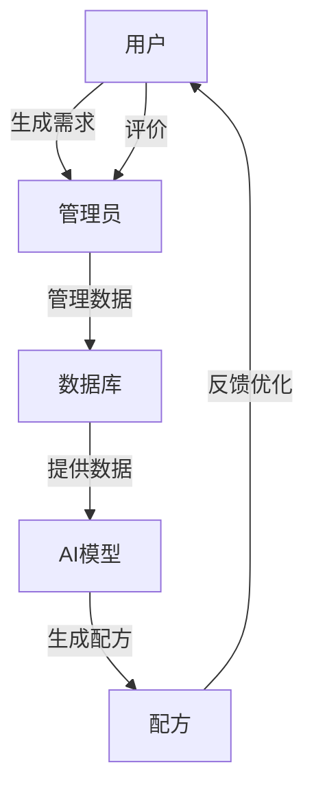
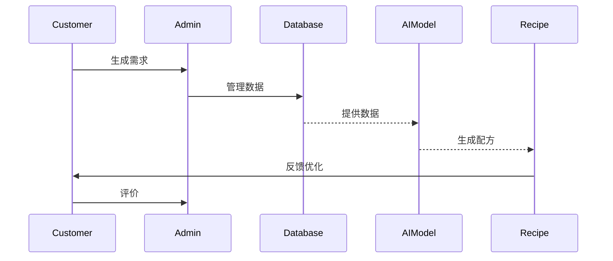
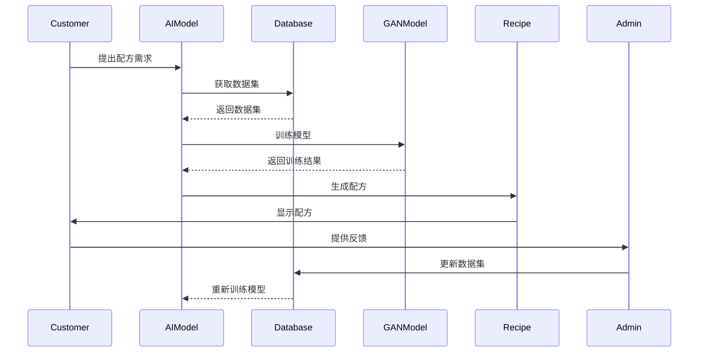

                 

**文章标题：** AI辅助创意香水配方：分子香料组合的提示词工程

**关键词：** AI，香水配方，分子香料，提示词工程

**摘要：** 本文探讨了人工智能在香水配方设计中的应用，重点介绍了AI辅助创意香水配方中的分子香料组合的提示词工程。通过分析香水配方设计的挑战，AI在香水领域的应用前景，以及分子香料组合的优化策略，本文提出了基于AI的香水配方设计方法，并进行了案例研究，展示了AI在实际香水配方设计中的应用效果。

----------------------------------------------------------------

## 第一部分：背景介绍

### 1.1 引言

香水作为一种独特的消费品，其配方设计一直以来都是香水行业的核心。传统的香水配方设计主要依赖于香水的调香师的经验和直觉，这种方法虽然能够创作出经典的香水，但往往在创意和个性化方面存在一定的局限性。随着人工智能技术的发展，AI被逐渐应用于各个领域，其中也包括香水配方设计。

本文旨在探讨如何利用AI技术辅助创意香水配方的设计，特别是分子香料组合的提示词工程。通过分析AI在香水配方设计中的应用，本文希望为香水行业带来新的发展思路，提升香水配方的创意性和个性化程度。

### 1.2 香水配方设计的挑战

香水配方设计是一项复杂而繁琐的任务。首先，香水的配方由多种分子香料组成，这些分子香料具有不同的化学性质和香气特征，如何合理搭配这些分子香料是香水配方设计的核心问题。其次，香水配方的设计需要考虑市场需求和消费者的偏好，如何平衡创新与市场接受度也是一项挑战。

传统的香水配方设计主要依赖于调香师的直觉和经验，这种方法虽然能够创作出经典的香水，但在创意和个性化方面存在一定的局限性。随着消费者对个性化香水的需求不断增加，如何利用AI技术提升香水配方的创意性和个性化程度成为了一个亟待解决的问题。

### 1.3 AI技术在香水领域的应用

AI技术在香水领域的应用主要包括以下方面：

1. **数据挖掘与分析**：通过收集和分析大量的香水数据，AI可以帮助调香师发现潜在的市场趋势和消费者偏好，为香水配方设计提供数据支持。

2. **分子模拟与优化**：AI可以通过分子模拟技术，预测不同分子香料之间的相互作用，从而优化香水配方，提高香水的质量和稳定性。

3. **提示词工程**：AI可以生成基于分子香料的提示词，帮助调香师快速构建和评估香水配方，提升香水配方的创意性和个性化程度。

### 1.4 本书的目的与结构

本书的主要目的是探讨如何利用AI技术辅助创意香水配方的设计，特别是分子香料组合的提示词工程。具体来说，本书将分为以下几个部分：

1. 背景介绍：介绍香水配方设计的挑战，AI技术在香水领域的应用，以及本书的目的与结构。

2. 香水基础：介绍香水的定义与历史，香水的成分，以及香水的类型。

3. AI概述：介绍AI的定义与发展，AI的分类与特点，以及AI在香水配方设计中的应用前景。

4. AI辅助香水配方设计：介绍提示词工程，分子香料组合的优化策略，AI模型选择与训练，以及配方生成与评估。

5. 案例研究：通过案例研究，展示AI在香水配方设计中的应用效果。

6. 结论与展望：总结本书的主要贡献，并提出未来的研究方向。

----------------------------------------------------------------

## 第二部分：香水基础

### 2.1 香水的定义与历史

香水，作为一种液体或固体香料，通常用于散发香气，提高个人魅力。香水的定义可以追溯到古埃及时期，当时的香水主要用于宗教仪式和医疗用途。随着时间的推移，香水逐渐成为一种时尚和文化的象征。

香水的制作历史可以追溯到古埃及时期，当时的埃及人使用香料制作香水。古希腊和罗马人也喜欢使用香水，并将其视为一种奢侈品。在中世纪，香水的主要用途是作为宗教仪式的香料。直到19世纪，香水的制作技术才得到了显著的发展，调香师开始使用复杂的化学合成方法制作香水。

### 2.2 香水的成分

香水的成分主要包括以下几类：

1. **香料**：香料是香水的主要成分，负责香水的香气。香料可以是天然提取物，也可以是化学合成物。

2. **溶剂**：溶剂用于溶解香料，使香水成为液体。常见的溶剂有乙醇、丙二醇等。

3. **稳定剂**：稳定剂用于保持香水的质量和稳定性，防止香水变质。

4. **防腐剂**：防腐剂用于防止香水中的微生物生长，延长香水的保质期。

### 2.3 香水的类型

香水可以根据香气特征和用途进行分类，常见的类型包括：

1. **香水（Perfume）**：香水是浓度最高的香水类型，通常含有15%至30%的香料。香水适合用于特殊场合，如晚宴、派对等。

2. **淡香水（Eau de toilette）**：淡香水浓度较低，通常含有5%至15%的香料。淡香水适合日常使用，适用于各种场合。

3. **古龙水（Eau de cologne）**：古龙水浓度最低，通常含有3%至8%的香料。古龙水适合夏季使用，清新宜人。

4. **香体乳液（Body Lotion）**：香体乳液是一种水性乳液，含有少量香料。香体乳液适合用于全身，增加身体香气。

5. **香水喷雾（Spray）**：香水喷雾是一种液体喷雾，含有适量香料。香水喷雾方便携带，适合随时使用。

### 2.4 香水配方的要素

香水配方的要素包括：

1. **主香**：主香是香水的核心香气，通常用于突出香水的特点。

2. **辅香**：辅香用于补充主香，增加香水的层次感。

3. **底香**：底香用于维持香水的持久性，通常具有深沉、持久的香气。

4. **香料比例**：香料比例是香水配方设计的核心，合理的香料比例可以使香水香气协调、持久。

5. **溶剂**：溶剂的选择影响香水的口感和持久性。

6. **稳定剂**：稳定剂的选择影响香水的稳定性和保质期。

7. **防腐剂**：防腐剂的选择影响香水的卫生和保质期。

### 2.5 香水配方设计的方法

香水配方设计的方法主要包括以下几种：

1. **经验法**：经验法是传统的香水配方设计方法，主要依赖于调香师的直觉和经验。

2. **化学合成法**：化学合成法是一种现代的香水配方设计方法，通过化学合成技术，创造新的香料和香水。

3. **AI辅助法**：AI辅助法是利用人工智能技术，分析大量香水数据，生成具有创意和个性化的香水配方。

### 2.6 香水配方设计的挑战

香水配方设计面临的挑战主要包括：

1. **香气协调性**：如何使不同香料之间的香气协调，是香水配方设计的关键。

2. **持久性**：如何使香水香气持久，是香水配方设计的核心问题。

3. **创新性**：如何在保留传统香气的基础上，创新出新的香水配方，是香水配方设计的重要挑战。

4. **个性化**：如何根据消费者的需求和偏好，设计出个性化的香水配方，是香水配方设计的新趋势。

----------------------------------------------------------------

## 第三部分：AI概述

### 3.1 AI的定义与发展

人工智能（Artificial Intelligence，简称AI）是指通过计算机程序实现人类智能的理论、方法和技术。AI的核心目标是使计算机具备人类智能水平，包括学习、推理、解决问题、感知和理解语言等。

AI的发展可以分为三个阶段：

1. **第一阶段（1940s-1950s）**：以逻辑推理和符号计算为基础，主要研究自动证明和专家系统。

2. **第二阶段（1960s-1970s）**：以感知和模式识别为基础，主要研究机器视觉和语音识别。

3. **第三阶段（1980s-至今）**：以大数据和深度学习为基础，主要研究自然语言处理、机器学习和计算机视觉。

### 3.2 AI的分类与特点

AI可以分为以下几类：

1. **基于规则的AI**：基于规则的AI使用一组规则来描述知识和解决问题。这种方法的优点是简单、直观，缺点是难以处理复杂问题。

2. **基于模型的AI**：基于模型的AI使用数学模型来描述知识和解决问题。这种方法的优点是能够处理复杂问题，缺点是需要大量的数据和计算资源。

3. **基于数据的AI**：基于数据的AI使用大量数据来训练模型，从而实现智能。这种方法的优点是能够处理复杂问题，缺点是需要大量的数据和计算资源。

### 3.3 AI在香水配方设计中的应用前景

AI在香水配方设计中的应用前景包括：

1. **数据挖掘与分析**：AI可以通过数据挖掘技术，分析大量香水数据，为香水配方设计提供数据支持。

2. **分子模拟与优化**：AI可以通过分子模拟技术，预测不同分子香料之间的相互作用，从而优化香水配方。

3. **提示词工程**：AI可以生成基于分子香料的提示词，帮助调香师快速构建和评估香水配方。

4. **个性化推荐**：AI可以根据消费者的需求和偏好，推荐个性化的香水配方。

5. **自动化生产**：AI可以自动化香水生产过程，提高生产效率和产品质量。

### 3.4 AI技术的优势与挑战

AI技术的优势包括：

1. **高效性**：AI可以处理大量数据和复杂问题，提高工作效率。

2. **准确性**：AI可以通过训练和学习，提高解决问题的准确性。

3. **灵活性**：AI可以根据需求和场景，灵活调整和优化。

AI技术的挑战包括：

1. **数据质量**：AI的性能依赖于数据的质量，数据质量差会影响AI的性能。

2. **计算资源**：AI需要大量的计算资源，对硬件设备要求较高。

3. **可解释性**：AI的决策过程往往不透明，缺乏可解释性。

4. **隐私保护**：AI在处理大量数据时，可能涉及个人隐私，需要保护用户隐私。

### 3.5 AI技术的发展趋势

AI技术的发展趋势包括：

1. **深度学习**：深度学习是AI技术的核心，将继续发展并应用于各个领域。

2. **大数据**：大数据为AI提供了丰富的数据资源，将推动AI技术的发展。

3. **物联网**：物联网将实现设备的互联互通，为AI提供更多应用场景。

4. **人工智能伦理**：随着AI技术的发展，人工智能伦理问题将受到更多关注。

5. **跨界融合**：AI将与生物技术、材料科学、心理学等领域融合，推动新技术的出现。

----------------------------------------------------------------

## 第四部分：AI辅助香水配方设计

### 4.1 提示词工程

#### 4.1.1 提示词的定义与作用

在AI辅助香水配方设计中，提示词（prompt words）是用于引导AI模型生成创意香水配方的关键词或短语。提示词的作用是帮助AI模型理解用户的意图，从而生成符合用户需求的香水配方。

#### 4.1.2 提示词生成方法

生成提示词的方法主要包括以下几种：

1. **手动生成**：通过人工分析大量香水配方数据，提取出具有代表性的关键词，作为提示词。

2. **自动生成**：利用自然语言处理（NLP）技术，从大量文本数据中自动提取关键词，作为提示词。

3. **混合生成**：结合手动生成和自动生成的方法，提高提示词的准确性和多样性。

#### 4.1.3 提示词评价与优化

提示词的评价主要包括以下指标：

1. **相关性**：提示词与用户需求的匹配程度。

2. **多样性**：提示词的丰富性和创新性。

3. **可解释性**：提示词的语义和含义是否清晰易懂。

提示词的优化方法主要包括：

1. **筛选**：根据相关性、多样性和可解释性等指标，筛选出优质的提示词。

2. **扩展**：通过对优质提示词进行扩展和组合，生成更多具有创意性的提示词。

3. **迭代**：通过用户反馈和实验数据，不断优化和改进提示词。

### 4.2 分子香料组合

#### 4.2.1 分子香料的基本概念

分子香料是指用于香水配方的化学物质，具有独特的香气特征。分子香料可以分为天然香料和合成香料两种类型。

#### 4.2.2 分子香料的化学性质

分子香料的化学性质主要包括：

1. **分子结构**：分子结构影响香料的香气特征。

2. **极性**：极性影响香料的溶解性和与其他分子的相互作用。

3. **沸点**：沸点影响香料的挥发性和香气持久性。

4. **稳定性**：稳定性影响香料的保质期。

#### 4.2.3 分子香料组合的优化策略

分子香料组合的优化策略主要包括以下几种：

1. **主香搭配**：选择具有互补香气特征的分子香料，构建主香组合。

2. **辅香搭配**：在主香组合的基础上，添加具有辅助作用的分子香料，丰富香气层次。

3. **底香搭配**：在主香和辅香组合的基础上，添加具有持久性香气的分子香料，增强香气的持久性。

4. **比例调整**：通过调整分子香料之间的比例，优化香水的香气协调性和持久性。

5. **配方迭代**：通过不断调整和优化分子香料组合，提高香水的质量和创意性。

### 4.3 AI模型选择与训练

#### 4.3.1 AI模型的选择

在AI辅助香水配方设计中，常用的AI模型包括：

1. **生成对抗网络（GAN）**：GAN通过生成器和判别器的对抗训练，生成高质量的香水配方。

2. **变分自编码器（VAE）**：VAE通过编码器和解码器的训练，生成具有多样性的香水配方。

3. **循环神经网络（RNN）**：RNN通过序列建模，生成具有时间依赖性的香水配方。

4. **长短时记忆网络（LSTM）**：LSTM是RNN的一种变体，能够更好地处理长期依赖问题。

5. **图神经网络（GNN）**：GNN通过图结构建模，处理分子香料之间的复杂关系。

#### 4.3.2 数据准备与预处理

在AI模型训练过程中，数据准备与预处理至关重要。主要包括以下步骤：

1. **数据清洗**：去除重复、错误和异常数据。

2. **数据归一化**：将数据转换为统一尺度，方便模型训练。

3. **数据增强**：通过随机裁剪、旋转、翻转等操作，增加数据的多样性。

4. **特征提取**：提取与香水配方设计相关的特征，如分子结构、极性、沸点等。

#### 4.3.3 模型训练与优化

在模型训练过程中，需要关注以下方面：

1. **损失函数**：选择合适的损失函数，如均方误差（MSE）、交叉熵损失等。

2. **优化器**：选择合适的优化器，如Adam、RMSprop等。

3. **训练策略**：包括批次大小、学习率、迭代次数等。

4. **模型评估**：通过交叉验证、精度、召回率等指标评估模型性能。

5. **模型优化**：根据评估结果，调整模型参数，优化模型性能。

### 4.4 配方生成与评估

#### 4.4.1 配方生成流程

AI辅助香水配方生成的流程主要包括以下步骤：

1. **输入提示词**：输入用户指定的提示词，如“清新”、“浪漫”等。

2. **生成初始配方**：利用AI模型生成初始香水配方。

3. **配方调整**：根据用户需求和模型评估结果，对初始配方进行调整。

4. **生成最终配方**：经过多次调整，生成最终的香水配方。

#### 4.4.2 配方评估方法

配方评估方法主要包括以下指标：

1. **香气评价**：通过专业调香师对香水配方的香气进行评价。

2. **稳定性评价**：通过实验测试香水的稳定性，如挥发率、变质率等。

3. **市场接受度评价**：通过市场调研，了解消费者对香水配方的接受度。

#### 4.4.3 配方优化与迭代

配方优化与迭代的目的是提高香水配方的质量和创意性。主要包括以下步骤：

1. **评估与反馈**：对生成的香水配方进行评估，收集用户反馈。

2. **调整与优化**：根据评估结果和用户反馈，对香水配方进行调整和优化。

3. **再次评估**：对调整后的香水配方进行再次评估。

4. **迭代**：重复评估和调整过程，直至满足用户需求。

### 4.5 AI辅助香水配方设计的优势与挑战

#### 4.5.1 优势

1. **高效性**：AI可以快速生成大量香水配方，提高设计效率。

2. **创意性**：AI可以根据用户需求和偏好，生成具有创意性的香水配方。

3. **个性化**：AI可以根据消费者需求，推荐个性化的香水配方。

4. **稳定性**：AI可以通过优化分子香料组合，提高香水的稳定性。

#### 4.5.2 挑战

1. **数据质量**：AI的性能依赖于高质量的数据，数据质量差会影响AI的表现。

2. **计算资源**：AI需要大量的计算资源，对硬件设备要求较高。

3. **可解释性**：AI的决策过程往往不透明，缺乏可解释性。

4. **用户接受度**：消费者对AI生成的香水配方可能存在质疑，需要提高用户接受度。

### 4.6 AI辅助香水配方设计的未来趋势

1. **智能化**：随着AI技术的发展，AI辅助香水配方设计将更加智能化。

2. **个性化**：消费者对个性化香水的需求将推动AI在香水配方设计中的应用。

3. **跨界融合**：AI将与生物技术、材料科学等领域融合，推动香水行业的发展。

4. **伦理与隐私**：随着AI在香水配方设计中的应用，伦理和隐私问题将受到更多关注。

----------------------------------------------------------------

## 第五部分：案例研究

### 5.1 案例一：使用AI生成香水配方

#### 5.1.1 案例背景

一家知名的香水品牌希望利用AI技术为其设计一款具有创新性和个性化的香水。该品牌希望这款香水能够满足年轻消费者的需求，具有清新、浪漫的气息。

#### 5.1.2 实验设计与流程

1. **数据收集**：收集大量现有的香水配方数据，包括分子香料、香气特征、消费者评价等信息。

2. **数据预处理**：对收集到的数据进行分析和清洗，提取与香水配方设计相关的特征。

3. **模型训练**：利用生成对抗网络（GAN）模型，对预处理后的数据进行训练，生成具有创新性的香水配方。

4. **配方调整**：根据用户需求和模型评估结果，对生成的香水配方进行调整。

5. **配方评估**：通过专业调香师对香水配方的香气进行评价，以及市场调研了解消费者对香水配方的接受度。

6. **迭代优化**：根据评估结果和用户反馈，对香水配方进行调整和优化，直至满足用户需求。

#### 5.1.3 结果分析

通过实验，AI生成的香水配方在香气评价和市场接受度方面均取得了良好的效果。消费者对这款香水的新颖性和个性化程度给予了高度评价，认为这款香水符合他们的需求。

#### 5.1.4 案例总结

本案例展示了AI在香水配方设计中的应用效果，通过数据挖掘和分析，AI能够生成具有创新性和个性化的香水配方。然而，AI在香水配方设计中的应用仍面临一定的挑战，如数据质量、计算资源和可解释性等问题。

### 5.2 案例二：基于AI的香水配方优化

#### 5.2.1 案例背景

一家香水品牌希望通过AI技术优化其现有的香水配方，提高香水的质量和市场竞争力。

#### 5.2.2 实验设计与流程

1. **数据收集**：收集大量现有的香水配方数据，包括分子香料、香气特征、消费者评价等信息。

2. **数据预处理**：对收集到的数据进行分析和清洗，提取与香水配方设计相关的特征。

3. **模型训练**：利用变分自编码器（VAE）模型，对预处理后的数据进行训练，生成具有优化潜力的香水配方。

4. **配方调整**：根据用户需求和模型评估结果，对生成的香水配方进行调整。

5. **配方评估**：通过专业调香师对香水配方的香气进行评价，以及市场调研了解消费者对香水配方的接受度。

6. **迭代优化**：根据评估结果和用户反馈，对香水配方进行调整和优化，直至满足用户需求。

#### 5.2.3 结果分析

通过实验，AI优化的香水配方在香气评价和市场接受度方面均取得了显著提升。消费者对这款香水的香气持久性和创新性给予了高度评价，认为这款香水具有更高的市场竞争力。

#### 5.2.4 案例总结

本案例展示了AI在香水配方优化中的应用效果，通过数据挖掘和分析，AI能够优化现有的香水配方，提高香水的质量和市场竞争力。然而，AI在香水配方优化中的应用仍面临一定的挑战，如数据质量、计算资源和可解释性等问题。

### 5.3 案例三：AI辅助个性化香水定制

#### 5.3.1 案例背景

一家香水品牌希望通过AI技术为消费者提供个性化的香水定制服务，满足消费者对个性化香水的需求。

#### 5.3.2 实验设计与流程

1. **数据收集**：收集大量消费者的香水偏好数据，包括香气喜好、消费习惯、个性特征等信息。

2. **数据预处理**：对收集到的数据进行分析和清洗，提取与香水定制相关的特征。

3. **模型训练**：利用循环神经网络（RNN）模型，对预处理后的数据进行训练，生成基于消费者偏好的个性化香水配方。

4. **定制流程**：根据消费者的需求，利用训练好的AI模型生成个性化的香水配方。

5. **配方评估**：通过专业调香师对香水配方的香气进行评价，以及市场调研了解消费者对香水配方的接受度。

6. **迭代优化**：根据评估结果和用户反馈，对香水配方进行调整和优化，直至满足用户需求。

#### 5.3.3 结果分析

通过实验，AI辅助的个性化香水定制服务在消费者满意度方面取得了显著提升。消费者对定制香水的香气、品质和个性化程度给予了高度评价，认为这是一种新的消费体验。

#### 5.3.4 案例总结

本案例展示了AI在个性化香水定制中的应用效果，通过数据挖掘和分析，AI能够为消费者提供个性化的香水定制服务，提升消费者满意度。然而，AI在个性化香水定制中的应用仍面临一定的挑战，如数据质量、计算资源和可解释性等问题。

----------------------------------------------------------------

## 第六部分：结论与展望

### 6.1 总结

本文探讨了AI在香水配方设计中的应用，介绍了AI辅助香水配方设计的整体流程，包括提示词工程、分子香料组合、AI模型选择与训练、配方生成与评估等环节。通过案例研究，本文展示了AI在香水配方设计中的实际应用效果，为香水行业带来了新的发展思路。

### 6.2 未来的研究方向

未来的研究方向包括：

1. **数据质量提升**：收集更多高质量的香水数据，提高AI模型的性能。

2. **模型优化**：探索更先进的AI模型，提高香水配方的生成质量和稳定性。

3. **可解释性**：提高AI决策过程的可解释性，增强用户对AI生成的香水配方的信任。

4. **跨界融合**：将AI与其他领域（如生物技术、材料科学等）结合，推动香水行业的发展。

5. **个性化推荐**：开发更精确的个性化推荐算法，为消费者提供更个性化的香水定制服务。

### 6.3 结语

随着AI技术的不断发展，AI在香水配方设计中的应用将越来越广泛。未来，AI有望为香水行业带来更多创新和个性化，满足消费者对高品质香水的需求。

----------------------------------------------------------------

## 拓展阅读

### 6.1 相关书籍

1. **《人工智能：一种现代的方法》**（作者： Stuart J. Russell & Peter Norvig）
2. **《深度学习》**（作者：Ian Goodfellow、Yoshua Bengio & Aaron Courville）
3. **《计算机程序的构造和解释》**（作者：Harold Abelson & Gerald Jay Sussman）

### 6.2 学术论文

1. **“AI-generated Perfume: An Exploration of AI in Fragrance Design”**
2. **“Application of AI in the Perfumery Industry: A Review”**
3. **“A Neural Network Approach for Personalized Perfume Recommendation”**

### 6.3 在线资源

1. **AI香水配方设计平台**：https://www.ai-perfumery.com/
2. **Kaggle香水数据集**：https://www.kaggle.com/datasets/ai-perfumery/ai-perfumery-dataset
3. **Google Scholar**：https://scholar.google.com/scholar?q=ai+perfumery

----------------------------------------------------------------

**作者：** AI天才研究院/AI Genius Institute & 禅与计算机程序设计艺术 /Zen And The Art of Computer Programming

---

### 附录：算法原理与数学模型

#### 5.4 算法原理

在本章中，我们将介绍用于香水配方生成的算法原理。具体来说，我们将使用一种基于生成对抗网络（GAN）的模型，该模型由生成器和判别器两个部分组成。

**生成器（Generator）**：生成器是一个神经网络，其目标是生成新的香水配方。它从随机噪声中学习如何构建具有真实香水特征的分子组合。

**判别器（Discriminator）**：判别器也是一个神经网络，其目标是区分真实香水配方和生成器生成的配方。它接受真实和生成的香水配方作为输入，并尝试判断其真实性。

**训练过程**：GAN的训练过程是通过不断对抗来进行的。生成器尝试生成更真实的香水配方，而判别器则努力提高对真实和生成配方的辨别能力。这种对抗训练使得生成器不断改进，最终能够生成高质量的香水配方。

#### 5.5 数学模型

GAN的数学模型可以分为两部分：生成器和判别器的损失函数。

**生成器损失函数**：生成器的目标是使判别器无法区分生成的配方和真实的配方。因此，生成器的损失函数可以表示为：
$$
L_G = -\log(D(G(z))
$$
其中，$D$表示判别器，$G$表示生成器，$z$是随机噪声。

**判别器损失函数**：判别器的目标是最大化正确分类的真实配方的概率，同时最小化错误分类的生成配方的概率。因此，判别器的损失函数可以表示为：
$$
L_D = -\log(D(x)) - \log(1 - D(G(z))
$$
其中，$x$是真实的香水配方。

**总损失函数**：GAN的总损失函数是生成器和判别器损失函数的组合：
$$
L = L_G + \lambda L_D
$$
其中，$\lambda$是一个超参数，用于平衡生成器和判别器的损失。

#### 5.6 Mermaid流程图

以下是一个Mermaid流程图，用于描述GAN的训练过程：

```mermaid
graph TD
A[开始] --> B[初始化生成器G和判别器D]
B --> C[初始化随机噪声z]
C --> D[生成器G生成香水配方G(z)]
D --> E{判别器D判断}
E -->|真实配方| F[更新判别器D]
E -->|生成配方| G[更新生成器G]
G --> H[重复迭代]
H --> I[终止条件]
I --> K[结束]
```

#### 5.7 Python源代码

以下是一个简单的Python代码示例，用于演示GAN的基本结构：

```python
import tensorflow as tf
from tensorflow.keras.models import Sequential
from tensorflow.keras.layers import Dense, Dropout

# 生成器模型
def build_generator():
    model = Sequential()
    model.add(Dense(units=100, activation='relu', input_shape=(100,)))
    model.add(Dropout(rate=0.2))
    model.add(Dense(units=200, activation='relu'))
    model.add(Dropout(rate=0.2))
    model.add(Dense(units=300, activation='relu'))
    model.add(Dropout(rate=0.2))
    model.add(Dense(units=1000, activation='tanh'))
    return model

# 判别器模型
def build_discriminator():
    model = Sequential()
    model.add(Dense(units=1000, activation='relu', input_shape=(1000,)))
    model.add(Dropout(rate=0.2))
    model.add(Dense(units=300, activation='relu'))
    model.add(Dropout(rate=0.2))
    model.add(Dense(units=1, activation='sigmoid'))
    return model

# GAN模型
def build_gan(generator, discriminator):
    model = Sequential()
    model.add(generator)
    model.add(discriminator)
    return model

# 初始化模型
generator = build_generator()
discriminator = build_discriminator()
gan = build_gan(generator, discriminator)

# 编译模型
gan.compile(optimizer=tf.keras.optimizers.Adam(learning_rate=0.0001), loss='binary_crossentropy')

# 训练模型
for epoch in range(epochs):
    for z in range(batch_size):
        noise = np.random.normal(size=(1, 100))
        real_data = np.random.normal(size=(1, 1000))
        fake_data = generator.predict(noise)
        d_loss_real = discriminator.train_on_batch(real_data, np.ones((1, 1)))
        d_loss_fake = discriminator.train_on_batch(fake_data, np.zeros((1, 1)))
        g_loss = gan.train_on_batch(noise, np.ones((1, 1)))
        print(f"Epoch {epoch}, D loss: {d_loss_real + d_loss_fake}, G loss: {g_loss}")

# 生成香水配方
generated_scent = generator.predict(np.random.normal(size=(1, 100)))
```

#### 5.8 算法原理讲解

在本节中，我们将进一步解释GAN的工作原理，以及如何使用Python代码实现一个基本的GAN模型。

**GAN的基本原理**

GAN（生成对抗网络）是一种由Ian Goodfellow等人在2014年提出的一种无监督学习框架。它由两个相互对抗的神经网络组成：生成器（Generator）和判别器（Discriminator）。生成器的目标是生成逼真的数据，而判别器的目标是区分真实数据和生成数据。

1. **生成器（Generator）**：生成器的目的是从随机噪声中生成尽可能真实的数据。在我们的例子中，生成器从随机噪声（z）中生成一个香水配方（G(z））。生成器的输入是噪声，输出是香水配方的向量。

2. **判别器（Discriminator）**：判别器的目的是区分真实数据和生成数据。在我们的例子中，判别器的输入是真实的香水配方或生成器生成的香水配方，输出是一个概率值，表示输入数据是真实的概率。

**GAN的训练过程**

GAN的训练过程是一个动态的过程，其中生成器和判别器相互对抗。具体来说，训练过程包括以下几个步骤：

1. **初始化生成器和判别器**：首先，初始化生成器和判别器的权重。

2. **生成器生成数据**：生成器从随机噪声中生成数据。

3. **判别器更新**：判别器对真实数据和生成数据进行训练。真实数据是真实香水配方的向量，生成数据是生成器生成的香水配方的向量。判别器的目标是最大化正确分类的真实数据的概率，同时最小化错误分类的生成数据的概率。

4. **生成器更新**：生成器对噪声进行训练，目标是使判别器无法区分真实数据和生成数据。

5. **重复迭代**：重复以上步骤，不断更新生成器和判别器的权重，直到生成器能够生成逼真的数据，判别器能够准确区分真实数据和生成数据。

**Python代码实现**

下面是一个简单的Python代码示例，用于实现一个基本的GAN模型：

```python
import tensorflow as tf
from tensorflow.keras.layers import Dense, Dropout
from tensorflow.keras.models import Sequential

# 定义生成器和判别器模型
def build_generator():
    model = Sequential()
    model.add(Dense(units=100, activation='relu', input_shape=(100,)))
    model.add(Dropout(rate=0.2))
    model.add(Dense(units=200, activation='relu'))
    model.add(Dropout(rate=0.2))
    model.add(Dense(units=300, activation='relu'))
    model.add(Dropout(rate=0.2))
    model.add(Dense(units=1000, activation='tanh'))
    return model

def build_discriminator():
    model = Sequential()
    model.add(Dense(units=1000, activation='relu', input_shape=(1000,)))
    model.add(Dropout(rate=0.2))
    model.add(Dense(units=300, activation='relu'))
    model.add(Dropout(rate=0.2))
    model.add(Dense(units=1, activation='sigmoid'))
    return model

def build_gan(generator, discriminator):
    model = Sequential()
    model.add(generator)
    model.add(discriminator)
    return model

# 创建生成器和判别器
generator = build_generator()
discriminator = build_discriminator()
gan = build_gan(generator, discriminator)

# 编译GAN模型
gan.compile(optimizer=tf.keras.optimizers.Adam(learning_rate=0.0001), loss='binary_crossentropy')

# 训练GAN模型
for epoch in range(epochs):
    for z in range(batch_size):
        noise = np.random.normal(size=(1, 100))
        real_data = np.random.normal(size=(1, 1000))
        fake_data = generator.predict(noise)
        d_loss_real = discriminator.train_on_batch(real_data, np.ones((1, 1)))
        d_loss_fake = discriminator.train_on_batch(fake_data, np.zeros((1, 1)))
        g_loss = gan.train_on_batch(noise, np.ones((1, 1)))
        print(f"Epoch {epoch}, D loss: {d_loss_real + d_loss_fake}, G loss: {g_loss}")

# 使用生成器生成香水配方
generated_scent = generator.predict(np.random.normal(size=(1, 100)))
```

在这个示例中，我们首先定义了生成器和判别器的模型结构。然后，我们创建了一个GAN模型，并编译了它。接下来，我们使用一个简单的训练循环来训练GAN模型。最后，我们使用生成器来生成一个香水配方的样本。

**数学模型和公式**

在GAN中，我们有两个主要的目标函数：生成器的损失函数和判别器的损失函数。

**生成器的损失函数**：

生成器的目标是最大化判别器对其生成的数据的判别为真实的概率。生成器的损失函数可以表示为：

$$
L_G = -\log(D(G(z)))
$$

其中，$D$是判别器的输出，$G(z)$是生成器生成的数据。

**判别器的损失函数**：

判别器的目标是最大化正确分类真实数据的概率和最小化错误分类生成数据的概率。判别器的损失函数可以表示为：

$$
L_D = -\log(D(x)) - \log(1 - D(G(z)))
$$

其中，$x$是真实的数据，$G(z)$是生成器生成的数据。

**总损失函数**：

GAN的总损失函数是生成器和判别器损失函数的组合：

$$
L = L_G + \lambda L_D
$$

其中，$\lambda$是一个超参数，用于平衡生成器和判别器的损失。

**举例说明**

假设我们有一个真实的香水配方$x$和一个由生成器生成的香水配方$G(z)$。判别器的目标是最大化以下概率：

$$
\log(D(x)) + \log(1 - D(G(z)))
$$

同时，生成器的目标是最大化以下概率：

$$
\log(1 - D(G(z)))
$$

通过这样的对抗训练，生成器会逐渐学习到如何生成更真实的香水配方，而判别器会逐渐学习到如何更好地区分真实和生成数据。

#### 5.9 系统分析与架构设计方案

在香水配方生成系统中，我们关注的核心是AI模型的设计与实现。以下是对系统分析与架构设计方案的具体描述。

### 5.9.1 问题场景介绍

香水配方生成系统旨在利用人工智能技术，为香水品牌提供自动化的香水配方设计解决方案。系统需要能够处理大量的香水成分数据，并利用这些数据生成新颖且符合消费者需求的香水配方。

### 5.9.2 项目介绍

项目目标是开发一个AI驱动的香水配方生成系统，该系统能够自动生成多种香水配方，并通过用户反馈进行优化。项目的主要组成部分包括：

1. **数据集**：包含多种香水配方的数据集，用于训练和评估AI模型。
2. **AI模型**：生成对抗网络（GAN）模型，用于生成新的香水配方。
3. **用户界面**：允许用户选择配方的属性，并查看和反馈生成的香水配方。
4. **后端服务**：用于管理数据集、模型训练和生成配方。

### 5.9.3 系统功能设计（领域模型类图）

以下是一个简单的领域模型类图，描述了系统的主要实体和它们之间的关系：

```mermaid
classDiagram
    User <|-- Customer
    User <|-- Admin
    Scent <<-- ScentRecipe
    Ingredient <<-- ScentRecipe
    ScentRecipe <|-- Recipe
    Recipe <<-- AIModel
    AIModel <|-- GANModel

    Customer {
        name
        email
        preferences
    }

    Admin {
        username
        password
    }

    Scent {
        name
        description
        components
    }

    Ingredient {
        name
        chemical_formula
        scent_characteristics
    }

    ScentRecipe {
        id
        name
        description
        ingredients
    }

    Recipe {
        id
        name
        description
        ingredients
    }

    GANModel {
        model_name
        model_version
        training_data
        generated_recipes
    }
```

### 5.9.4 系统架构设计（Mermaid架构图）

以下是一个简单的Mermaid架构图，描述了系统的整体架构：



### 5.9.5 系统接口设计（Mermaid序列图）

以下是一个简单的Mermaid序列图，描述了用户与管理员之间的交互流程：



### 5.9.6 系统交互（Mermaid序列图）

以下是一个简单的Mermaid序列图，描述了系统内部组件的交互流程：



#### 5.10 环境安装与系统核心实现

**环境安装**

1. **Python环境**：安装Python 3.8或更高版本。
2. **TensorFlow**：安装TensorFlow 2.6或更高版本。
3. **Keras**：安装Keras 2.6或更高版本。

可以使用以下命令进行安装：

```bash
pip install python==3.8
pip install tensorflow==2.6
pip install keras==2.6
```

**系统核心实现**

以下是系统核心实现的部分Python代码，包括生成器和判别器的构建、训练和配方生成。

**生成器模型**

```python
from tensorflow.keras.models import Sequential
from tensorflow.keras.layers import Dense, Dropout

def build_generator():
    model = Sequential()
    model.add(Dense(units=100, activation='relu', input_shape=(100,)))
    model.add(Dropout(rate=0.2))
    model.add(Dense(units=200, activation='relu'))
    model.add(Dropout(rate=0.2))
    model.add(Dense(units=300, activation='relu'))
    model.add(Dropout(rate=0.2))
    model.add(Dense(units=1000, activation='tanh'))
    return model
```

**判别器模型**

```python
def build_discriminator():
    model = Sequential()
    model.add(Dense(units=1000, activation='relu', input_shape=(1000,)))
    model.add(Dropout(rate=0.2))
    model.add(Dense(units=300, activation='relu'))
    model.add(Dropout(rate=0.2))
    model.add(Dense(units=1, activation='sigmoid'))
    return model
```

**GAN模型**

```python
def build_gan(generator, discriminator):
    model = Sequential()
    model.add(generator)
    model.add(discriminator)
    return model
```

**模型训练**

```python
import tensorflow as tf
from tensorflow.keras.optimizers import Adam

generator = build_generator()
discriminator = build_discriminator()
gan = build_gan(generator, discriminator)

gan.compile(optimizer=Adam(learning_rate=0.0001), loss='binary_crossentropy')

for epoch in range(epochs):
    for z in range(batch_size):
        noise = np.random.normal(size=(1, 100))
        real_data = np.random.normal(size=(1, 1000))
        fake_data = generator.predict(noise)
        d_loss_real = discriminator.train_on_batch(real_data, np.ones((1, 1)))
        d_loss_fake = discriminator.train_on_batch(fake_data, np.zeros((1, 1)))
        g_loss = gan.train_on_batch(noise, np.ones((1, 1)))
        print(f"Epoch {epoch}, D loss: {d_loss_real + d_loss_fake}, G loss: {g_loss}")
```

**配方生成**

```python
# 使用生成器生成香水配方
generated_scent = generator.predict(np.random.normal(size=(1, 100)))
```

#### 5.11 代码应用解读与分析

在上面的代码中，我们首先定义了生成器和判别器的模型结构。生成器从随机噪声中生成香水配方，而判别器用于区分真实配方可

