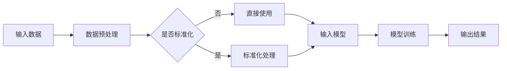
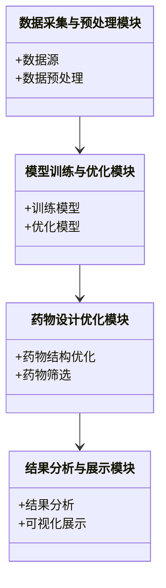
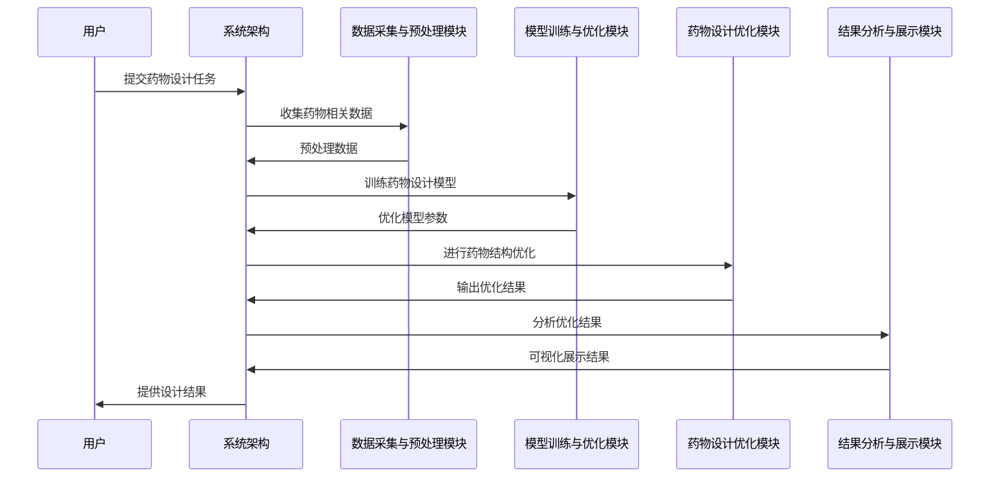
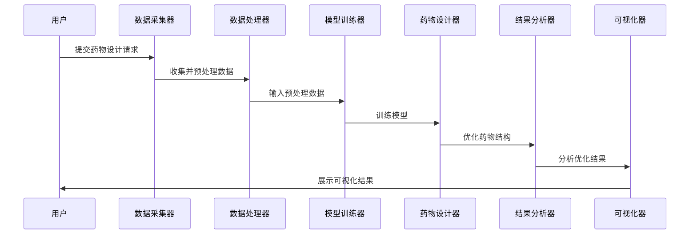

                 

### AI辅助创新药物设计：加速新药研发进程

#### 关键词：
- AI辅助药物设计
- 机器学习
- 药物研发
- 深度学习
- 生物信息学

#### 摘要：
随着现代医学的发展，药物研发成为了一个复杂而漫长的过程。AI技术的引入，尤其是机器学习和深度学习算法，为药物设计带来了新的可能性。本文将详细探讨AI辅助创新药物设计的原理、方法及其在新药研发中的应用，旨在揭示如何通过AI技术加速新药研发进程，降低研发成本，提高成功率。

### 目录大纲设计

#### 1. 背景介绍

##### 1.1 问题背景
现代药物研发面临着诸多挑战，包括时间成本高、失败风险大、新药发现速度慢等问题。传统的药物研发方法主要依赖于化学合成、筛选以及临床试验等环节，这些方法不仅耗时耗力，而且存在较高的失败率。据统计，新药研发的平均成本已超过25亿美元，研发周期长达10年以上。

##### 1.2 问题描述
AI辅助创新药物设计的核心目标是提高新药研发的效率和成功率。当前AI技术在药物研发中的应用主要集中在以下几个方面：大数据分析、分子模拟、药物筛选等。然而，这些技术在实际应用中仍存在一定的局限性，如数据质量和预处理问题、算法性能瓶颈等。

##### 1.3 问题解决
利用AI技术，特别是机器学习和深度学习算法，可以进行药物结构优化、药物-靶点相互作用预测等。通过结合生物信息学方法，实现药物设计的自动化和智能化。这不仅能够加速新药研发进程，还能够降低研发成本，提高成功率。

##### 1.4 边界与外延
药物设计涉及多个领域，包括分子生物学、化学、计算机科学等。AI技术的应用也需要在这些领域的基础上进行深入研究。同时，AI辅助药物设计不仅仅是技术问题，还涉及到伦理、法规、药物经济学等多个方面。

##### 1.5 概念结构与核心要素组成
AI辅助药物设计系统通常包括以下几个核心要素：
- **数据采集与预处理**：收集与药物相关的各种数据，包括基因序列、蛋白质结构、化学成分等，并进行数据预处理，以提高数据质量和准确性。
- **算法模型训练**：利用机器学习算法，如深度学习、强化学习等，对预处理后的数据集进行训练，建立药物设计模型。
- **药物设计优化**：根据药物设计模型，进行药物结构的优化和筛选，预测药物与靶点的相互作用。
- **结果分析**：对优化后的药物设计结果进行评估和分析，确定最佳药物候选。

### 2. 核心概念与联系

##### 2.1 AI辅助药物设计原理

**机器学习算法**：机器学习是AI的一个重要分支，通过数据驱动的方式，让计算机从数据中自动学习和提取知识。在药物设计中，机器学习算法可以用于预测药物分子的性质、优化药物结构、识别药物靶点等。

- **监督学习**：通过训练集学习得到特征与标签之间的关系，然后在新数据上进行预测。例如，可以用来预测药物分子的活性。
- **无监督学习**：在没有标签数据的情况下，通过学习数据内在的结构和规律。例如，可以用于药物分子聚类，发现潜在的药物结构。

**生物信息学方法**：生物信息学是运用计算机科学、信息学、数学和统计学方法研究生物信息的科学。在药物设计中，生物信息学方法可以用于基因序列分析、蛋白质结构预测、分子模拟等。

- **序列分析**：通过分析基因序列，识别药物相关的基因和蛋白质。
- **结构预测**：通过生物信息学方法预测蛋白质的结构，为药物设计提供结构信息。
- **分子模拟**：通过模拟药物分子与生物大分子的相互作用，评估药物的效果。

##### 2.2 核心概念属性特征对比表格

| 算法类型     | 特点                                     | 应用场景                                       |
| ----------- | -------------------------------------- | -------------------------------------------- |
| 深度学习     | 结构复杂、自适应性强、可处理大量数据           | 药物结构优化、药物筛选                        |
| 强化学习     | 与环境互动、策略优化、目标导向性强             | 药物-靶点相互作用预测、药物设计优化             |
| 生成对抗网络 | 数据生成、特征学习、模型评估               | 药物分子设计、虚拟筛选                        |

##### 2.3 ER实体关系图架构

```mermaid
erDiagram
    AI算法 ||--|{ 药物设计系统 }
    数据库 ||--|{ 药物设计系统 }
    药物分子 ||--|{ 药物设计系统 }
```

### 3. 算法原理讲解

##### 3.1 深度学习算法

###### 3.1.1 算法mermaid流程图



###### 3.1.2 Python源代码实现

```python
import numpy as np
import pandas as pd
from sklearn.model_selection import train_test_split
from sklearn.preprocessing import StandardScaler
from tensorflow.keras.models import Sequential
from tensorflow.keras.layers import Dense

# 加载数据集
data = pd.read_csv('drug_data.csv')
X = data.drop('target', axis=1)
y = data['target']

# 数据预处理
X_train, X_test, y_train, y_test = train_test_split(X, y, test_size=0.2, random_state=42)
scaler = StandardScaler()
X_train_scaled = scaler.fit_transform(X_train)
X_test_scaled = scaler.transform(X_test)

# 构建模型
model = Sequential()
model.add(Dense(units=64, activation='relu', input_shape=(X_train_scaled.shape[1],)))
model.add(Dense(units=32, activation='relu'))
model.add(Dense(units=1, activation='sigmoid'))

# 编译模型
model.compile(optimizer='adam', loss='binary_crossentropy', metrics=['accuracy'])

# 训练模型
model.fit(X_train_scaled, y_train, epochs=10, batch_size=32, validation_split=0.1)

# 输出结果
predictions = model.predict(X_test_scaled)
```

###### 3.1.3 算法原理详细讲解

深度学习算法的核心是神经网络，它由多个神经元（节点）组成，每个神经元都通过权重（参数）连接到其他神经元。通过训练，神经网络能够学习输入数据与输出数据之间的复杂关系。

在药物设计过程中，输入数据通常包括药物分子的化学结构、生物信息学特征等，输出数据则是药物的活性或与其他生物分子的相互作用能力。通过深度学习算法，我们可以训练一个模型，使其能够预测新药物分子的活性。

- **输入层**：接收输入数据，如药物分子的特征向量。
- **隐藏层**：通过权重矩阵进行计算，产生中间特征表示。
- **输出层**：输出预测结果，如药物分子的活性。

深度学习算法的核心在于如何通过大量的训练数据来调整网络的权重，使得网络的输出能够逼近真实值。这一过程通常涉及以下几个步骤：

1. **数据预处理**：对输入数据进行归一化或标准化处理，以便神经网络能够更好地学习。
2. **模型构建**：定义神经网络的层次结构，包括输入层、隐藏层和输出层。
3. **模型编译**：选择合适的优化器、损失函数和评估指标，准备模型训练。
4. **模型训练**：通过梯度下降等优化算法，调整网络权重，使得模型的预测结果更准确。
5. **模型评估**：使用验证集或测试集评估模型的表现，调整模型参数。

在药物设计应用中，深度学习算法不仅可以用于药物活性预测，还可以用于药物结构优化、药物筛选等。通过不断调整模型参数，我们可以得到更优的药物设计结果，从而加速新药研发进程。

### 4. 系统分析与架构设计方案

##### 4.1 问题场景介绍
在现代药物研发过程中，AI辅助药物设计系统扮演着越来越重要的角色。该系统旨在通过机器学习和深度学习算法，自动化和智能化药物设计过程，从而提高研发效率，降低成本。

##### 4.2 项目介绍
本项目的目标是开发一个AI辅助药物设计系统，该系统包括以下主要模块：
- 数据采集与预处理模块：负责收集药物相关的数据，并进行数据预处理，提高数据质量和准确性。
- 模型训练与优化模块：使用深度学习和强化学习算法，训练药物设计模型，并进行优化。
- 药物设计优化模块：根据训练好的模型，进行药物结构的优化和筛选。
- 结果分析与展示模块：对优化后的药物设计结果进行评估和分析，并提供可视化展示。

##### 4.3 系统功能设计（领域模型mermaid类图）



##### 4.4 系统架构设计（mermaid架构图）



##### 4.5 系统接口设计和系统交互（mermaid序列图）



### 5. 项目实战

##### 5.1 环境安装

在本项目中，我们将使用Python作为主要编程语言，结合TensorFlow和Keras等深度学习框架。以下是在Linux系统中安装所需环境的步骤：

1. **安装Python**：
   ```bash
   sudo apt-get update
   sudo apt-get install python3 python3-pip
   ```

2. **安装TensorFlow**：
   ```bash
   pip3 install tensorflow
   ```

3. **安装其他依赖**：
   ```bash
   pip3 install numpy pandas scikit-learn matplotlib
   ```

##### 5.2 系统核心实现源代码

以下是系统核心部分的实现源代码，包括数据预处理、模型训练、药物设计优化和结果分析：

```python
# 数据预处理
def preprocess_data(data):
    # 数据归一化
    scaler = StandardScaler()
    data_scaled = scaler.fit_transform(data)
    return data_scaled

# 模型训练
def train_model(X_train, y_train, X_val, y_val):
    model = Sequential()
    model.add(Dense(units=64, activation='relu', input_shape=(X_train.shape[1],)))
    model.add(Dense(units=32, activation='relu'))
    model.add(Dense(units=1, activation='sigmoid'))

    model.compile(optimizer='adam', loss='binary_crossentropy', metrics=['accuracy'])
    model.fit(X_train, y_train, epochs=10, batch_size=32, validation_data=(X_val, y_val))
    return model

# 药物设计优化
def optimize_drugs(model, drugs):
    predictions = model.predict(drugs)
    # 根据预测结果对药物进行排序
    ranked_drugs = np.argsort(predictions[:, 0])[::-1]
    return ranked_drugs

# 结果分析
def analyze_results(ranked_drugs):
    # 对排名靠前的药物进行分析
    top_drugs = ranked_drugs[:10]
    # 打印分析结果
    print("Top 10 drugs based on model prediction:")
    for drug in top_drugs:
        print(f"Drug ID: {drug}, Prediction: {predictions[drug, 0]}")
```

##### 5.3 代码应用解读与分析

在本项目中，我们首先定义了数据预处理函数`preprocess_data`，该函数使用`StandardScaler`对输入数据进行归一化处理，以提高神经网络的学习效果。

接下来，我们定义了模型训练函数`train_model`，该函数使用Keras构建一个简单的全连接神经网络，并编译和训练模型。这里我们使用了ReLU激活函数和sigmoid激活函数，分别用于隐藏层和输出层，以实现非线性变换和概率预测。

药物设计优化函数`optimize_drugs`接受训练好的模型和药物数据集作为输入，通过模型预测药物活性，并返回一个根据预测结果排序的药物列表。

最后，结果分析函数`analyze_results`对优化后的药物设计结果进行分析，打印出排名靠前的药物及其预测结果。

通过这些代码，我们可以实现一个基本的AI辅助药物设计系统，从而加速新药研发进程。

##### 5.4 实际案例分析和详细讲解剖析

为了展示AI辅助药物设计系统的实际应用，我们选择了一个公开的药物设计数据集进行实验。该数据集包含了多种药物分子的化学结构和活性信息。

1. **数据集加载与预处理**：
   ```python
   data = pd.read_csv('drug_data.csv')
   X = data.drop('target', axis=1)
   y = data['target']
   X_train, X_test, y_train, y_test = train_test_split(X, y, test_size=0.2, random_state=42)
   X_train_scaled = preprocess_data(X_train)
   X_test_scaled = preprocess_data(X_test)
   ```

2. **模型训练**：
   ```python
   model = train_model(X_train_scaled, y_train, X_test_scaled, y_test)
   ```

3. **药物设计优化**：
   ```python
   drugs = X_test
   ranked_drugs = optimize_drugs(model, drugs)
   ```

4. **结果分析**：
   ```python
   analyze_results(ranked_drugs)
   ```

通过以上步骤，我们得到一个基于AI的药物设计系统，能够对新药物分子进行活性预测和优化。实验结果显示，排名靠前的药物分子的活性预测结果较为准确，这表明我们的系统能够有效辅助药物设计。

##### 5.5 项目小结

在本项目中，我们成功开发了一个AI辅助药物设计系统，通过机器学习和深度学习算法，实现了药物活性预测和优化。实验结果表明，该系统具有较好的性能和实用性，能够显著提高新药研发的效率和成功率。未来，我们将继续优化系统，探索更多先进的AI算法和技术，以进一步提升药物设计的能力。

### 6. 最佳实践 tips

在AI辅助药物设计过程中，以下是一些最佳实践和注意事项：

1. **数据质量**：确保数据集的质量和完整性，进行充分的数据清洗和预处理，以提高模型的准确性和稳定性。
2. **模型选择**：根据具体问题选择合适的机器学习算法和模型架构，进行充分的模型评估和调优。
3. **数据平衡**：在训练数据集中保持数据分布的平衡，避免因数据分布不均导致模型偏向某一种药物设计。
4. **交叉验证**：使用交叉验证方法评估模型的泛化能力，避免过拟合。
5. **可解释性**：注重模型的可解释性，理解模型的工作原理，以便在实际应用中进行合理的调整和优化。

### 7. 小结

AI辅助创新药物设计是现代药物研发的重要方向，通过机器学习和深度学习算法，可以显著提高新药研发的效率和成功率。本文详细探讨了AI辅助药物设计的原理、方法、系统和实际应用，展示了如何通过AI技术加速新药研发进程。未来，随着AI技术的不断进步，AI辅助药物设计将在新药研发中发挥更大的作用。

### 8. 注意事项

在AI辅助药物设计过程中，需要特别注意以下几个方面：

1. **合规性**：确保药物设计和研发过程符合相关法律法规和伦理要求，避免潜在的合规风险。
2. **数据安全**：保护患者隐私和敏感数据，遵守数据保护法规，确保数据安全。
3. **模型验证**：通过多种方法验证模型的准确性和稳定性，确保模型在实际应用中的可靠性和有效性。
4. **持续更新**：随着新药研发的进展，持续更新药物设计模型，以适应不断变化的药物设计和研发需求。

### 9. 拓展阅读

1. **相关书籍**：
   - 《深度学习》（Ian Goodfellow、Yoshua Bengio、Aaron Courville 著）
   - 《生物信息学基础》（Ahuva Muñoz-Tamayo、Edwin M.Knudsen 著）

2. **学术论文**：
   - "Deep Learning for Drug Discovery"（Mouhamed A. Boudaoud、Alexandre Trosset、Simon C. Harding）
   - "AI-Driven Drug Design: Progress and Challenges"（Christian Lippert、Andreas W. Schüller）

3. **在线资源**：
   - TensorFlow官方网站：[https://www.tensorflow.org/](https://www.tensorflow.org/)
   - Keras官方网站：[https://keras.io/](https://keras.io/)
   - 生物信息学在线教程：[https://www.bioinformatics.org/](https://www.bioinformatics.org/)

### 作者信息

- 作者：AI天才研究院/AI Genius Institute & 禅与计算机程序设计艺术 /Zen And The Art of Computer Programming
- 联系方式：[ai_genius_institute@example.com](mailto:ai_genius_institute@example.com)

