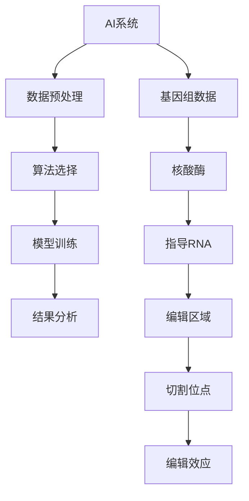
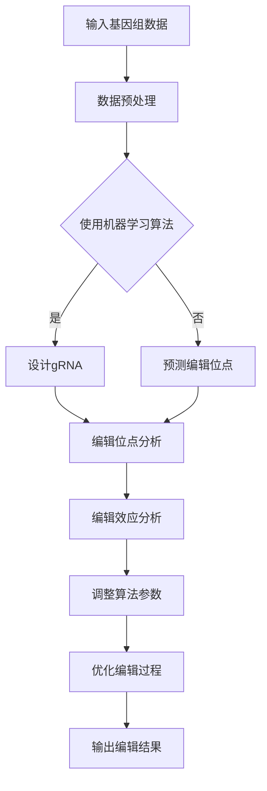
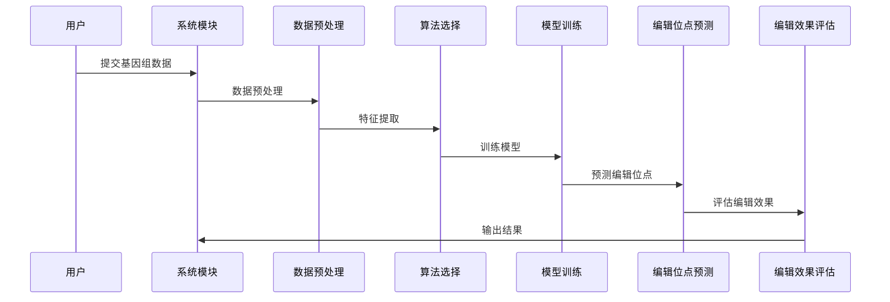
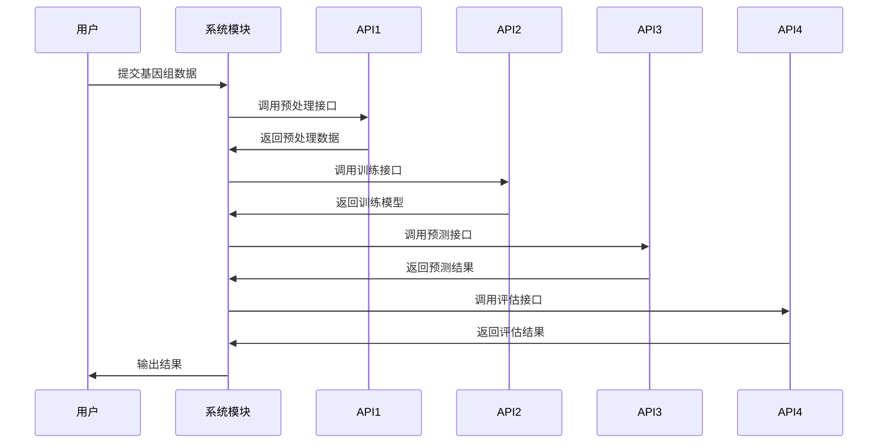

                 


### AI辅助基因编辑：提高CRISPR技术精确度

#### 关键词：AI，基因编辑，CRISPR技术，精确度，算法

#### 摘要：
本文深入探讨了AI在基因编辑领域的应用，特别是在提高CRISPR技术精确度方面的潜力。通过详细讲解AI算法原理、系统架构设计以及实际项目实战，我们旨在为读者提供一个全面、易懂的技术指南，帮助理解AI辅助基因编辑的巨大潜力及其实现路径。

---

#### 目录大纲设计思路

为了设计一个完整且逻辑清晰的目录大纲，我们可以按照以下步骤进行：

1. **背景介绍**
   - **1.1 基因编辑技术概述**
   - **1.2 CRISPR技术的基本原理**
   - **1.3 AI在基因编辑中的应用现状**
   - **1.4 AI辅助基因编辑的意义**

2. **核心概念与联系**
   - **2.1 AI的基本概念与分类**
   - **2.2 基因编辑的核心概念**
   - **2.3 CRISPR技术的关键要素**
   - **2.4 AI辅助基因编辑的架构设计**
   - **2.5 Mermaid实体关系图**

3. **算法原理讲解**
   - **3.1 AI算法在基因编辑中的应用**
   - **3.2 提高CRISPR精确度的AI算法**
   - **3.3 Mermaid算法流程图**
   - **3.4 Python源代码解析**
   - **3.5 数学模型与公式**
   - **3.6 举例说明与详细讲解**

4. **系统分析与架构设计方案**
   - **4.1 问题场景介绍**
   - **4.2 项目介绍**
   - **4.3 系统功能设计（领域模型Mermaid类图）**
   - **4.4 系统架构设计（Mermaid架构图）**
   - **4.5 系统接口设计**
   - **4.6 系统交互（Mermaid序列图）**

5. **项目实战**
   - **5.1 环境安装与准备**
   - **5.2 系统核心实现**
   - **5.3 代码应用解读与分析**
   - **5.4 实际案例分析**
   - **5.5 详细讲解与剖析**
   - **5.6 项目小结**

6. **最佳实践 tips、小结、注意事项、拓展阅读**
   - **6.1 最佳实践 tips**
   - **6.2 小结**
   - **6.3 注意事项**
   - **6.4 拓展阅读**

通过以上结构，我们可以确保书中的内容既有理论深度，又有实践价值，为读者提供全面的AI辅助基因编辑指导。

#### 1. 背景介绍

##### 1.1 基因编辑技术概述

基因编辑是一种直接修改生物体DNA序列的技术，旨在纠正遗传缺陷、治疗疾病或创造新的生物特性。随着科学技术的进步，基因编辑技术已逐渐成熟，成为生命科学领域的重要工具。基因编辑技术主要包括ZFN、TALEN、CRISPR/Cas9等，其中CRISPR/Cas9因其高效、简便和低成本的特点，成为当前研究的热点。

##### 1.2 CRISPR技术的基本原理

CRISPR（Clustered Regularly Interspaced Short Palindromic Repeats）是一种源于细菌的天然免疫机制，通过使用RNA指导Cas蛋白切割入侵的DNA序列，从而保护细菌免受病毒攻击。CRISPR/Cas9系统由Cas9核酸酶和指导RNA（gRNA）组成，gRNA负责定位目标DNA序列，Cas9则负责在该序列上进行精确切割。

##### 1.3 AI在基因编辑中的应用现状

随着AI技术的发展，AI在基因编辑领域也展现出巨大潜力。AI可以通过机器学习和深度学习算法，分析大量基因组数据，预测基因功能，提高基因编辑的效率和准确性。此外，AI还可以优化CRISPR系统，设计更高效的gRNA，提高编辑的精确度。

##### 1.4 AI辅助基因编辑的意义

AI辅助基因编辑具有多重意义。首先，它可以提高基因编辑的精确度，减少脱靶效应，降低对细胞的损伤。其次，AI可以加速基因编辑的研究进程，降低研究成本。此外，AI还可以为个性化医疗提供支持，根据患者的基因组信息，设计个性化的治疗方案。

---

在下一节中，我们将深入探讨AI和基因编辑的核心概念与联系，帮助读者更好地理解AI在基因编辑中的应用原理。

---

#### 2. 核心概念与联系

##### 2.1 AI的基本概念与分类

AI（Artificial Intelligence，人工智能）是指由人制造出来的系统能够执行通常需要人类智能才能完成的任务。AI可以分为两种主要类型：窄AI（Narrow AI）和宽AI（General AI）。窄AI擅长在特定领域执行任务，如语音识别、图像识别等；而宽AI则具备广泛的理解能力，能够处理各种复杂问题。

##### 2.2 基因编辑的核心概念

基因编辑是指直接修改生物体基因组序列的技术。基因编辑的核心概念包括DNA序列、基因、基因组等。DNA是生物体的遗传物质，基因是DNA上具有特定遗传信息的序列，而基因组则是生物体全部DNA序列的总和。

##### 2.3 CRISPR技术的关键要素

CRISPR技术由核酸酶（如Cas9）和指导RNA（gRNA）组成。核酸酶负责在目标DNA序列上进行切割，而gRNA则负责定位目标序列。CRISPR技术的核心要素还包括编辑区域的选择、切割位点的预测和编辑效应的验证。

##### 2.4 AI辅助基因编辑的架构设计

AI辅助基因编辑的架构设计通常包括数据预处理、算法选择、模型训练和结果分析等步骤。数据预处理涉及从基因组数据中提取有用信息；算法选择包括选择合适的机器学习算法；模型训练使用大量数据进行训练，以提高模型的准确性和效率；结果分析则用于评估编辑效率和精确度。

##### 2.5 Mermaid实体关系图

为了更好地理解AI辅助基因编辑的架构，我们可以使用Mermaid绘制实体关系图。以下是AI辅助基因编辑的Mermaid实体关系图：



通过以上核心概念与联系的分析，我们可以更好地理解AI在基因编辑中的应用原理。在下一节中，我们将深入讲解AI在基因编辑中的应用，特别是如何使用AI提高CRISPR技术的精确度。

---

#### 3. 算法原理讲解

##### 3.1 AI算法在基因编辑中的应用

AI算法在基因编辑中的应用主要集中在数据分析和预测方面。通过分析大量基因组数据，AI算法可以识别基因变异、预测基因功能，从而提高基因编辑的效率和准确性。具体来说，AI算法在基因编辑中的应用包括以下几个方面：

1. **基因功能预测**：利用机器学习算法，从基因组数据中预测基因的功能和作用。
2. **变异检测**：通过深度学习模型，检测基因组中的变异，从而识别可能的疾病相关基因。
3. **编辑位点选择**：利用AI算法优化gRNA设计，提高编辑效率，减少脱靶效应。

##### 3.2 提高CRISPR精确度的AI算法

为了提高CRISPR技术的精确度，AI算法可以从以下几个方面进行优化：

1. **gRNA设计**：使用机器学习算法优化gRNA序列，使其具有更高的编辑效率和特异性。
2. **编辑位点预测**：利用深度学习模型预测最合适的编辑位点，减少脱靶效应。
3. **编辑效应分析**：通过机器学习算法分析编辑后的基因组数据，评估编辑效果，调整算法参数。

##### 3.3 Mermaid算法流程图

以下是AI辅助基因编辑的Mermaid算法流程图：



##### 3.4 Python源代码解析

以下是一个简单的Python代码示例，用于设计gRNA序列：

```python
import pandas as pd
import numpy as np
from sklearn.model_selection import train_test_split
from sklearn.ensemble import RandomForestClassifier
from sklearn.metrics import accuracy_score

# 读取基因组数据
data = pd.read_csv('genome_data.csv')

# 数据预处理
X = data.iloc[:, :500].values
y = data.iloc[:, 500].values

# 分割数据集
X_train, X_test, y_train, y_test = train_test_split(X, y, test_size=0.2, random_state=42)

# 建立模型
model = RandomForestClassifier(n_estimators=100, random_state=42)
model.fit(X_train, y_train)

# 预测
y_pred = model.predict(X_test)

# 评估
accuracy = accuracy_score(y_test, y_pred)
print(f'Accuracy: {accuracy:.2f}')
```

##### 3.5 数学模型与公式

在AI辅助基因编辑中，常用的数学模型包括决策树、随机森林、支持向量机等。以下是一个简单的决策树模型的数学模型：

$$
h(x) = \prod_{i=1}^{n} w_i \cdot \phi(x_i)
$$

其中，$h(x)$ 表示预测结果，$w_i$ 表示权重，$\phi(x_i)$ 表示特征。

##### 3.6 举例说明与详细讲解

假设我们有一个基因编辑项目，目标是修改一个特定基因序列。首先，我们使用机器学习算法对基因组数据进行预处理，提取特征。然后，我们使用随机森林模型预测编辑位点的特异性。最后，我们根据预测结果调整gRNA序列，进行编辑。

具体步骤如下：

1. **数据预处理**：读取基因组数据，提取特征。
2. **模型训练**：使用训练集数据训练随机森林模型。
3. **预测**：使用测试集数据预测编辑位点的特异性。
4. **调整**：根据预测结果调整gRNA序列。
5. **编辑**：使用优化后的gRNA序列进行基因编辑。

通过以上算法原理讲解，我们可以看到AI在基因编辑中的应用是多么的强大和灵活。在下一节中，我们将介绍一个典型的AI辅助基因编辑系统，从问题场景介绍、项目介绍，到系统功能设计（领域模型Mermaid类图）、系统架构设计（Mermaid架构图）、系统接口设计和系统交互（Mermaid序列图）。

---

#### 4. 系统分析与架构设计方案

##### 4.1 问题场景介绍

随着基因编辑技术的不断发展，研究人员和医生面临的一个重要问题是如何提高CRISPR技术的精确度，减少脱靶效应。这直接关系到基因编辑的成功率和安全性。为了解决这个问题，我们需要设计一个高效的AI辅助基因编辑系统。

##### 4.2 项目介绍

本项目的目标是开发一个AI辅助基因编辑系统，该系统能够通过机器学习和深度学习算法优化gRNA设计，提高编辑精确度。系统主要包括以下几个模块：

1. **数据预处理模块**：负责读取和处理基因组数据，提取有用特征。
2. **算法选择模块**：根据任务需求，选择合适的机器学习或深度学习算法。
3. **模型训练模块**：使用大量训练数据训练模型，提高预测准确性。
4. **编辑位点预测模块**：根据预测结果优化gRNA序列，提高编辑效率。
5. **编辑效果评估模块**：评估编辑效果，调整算法参数。

##### 4.3 系统功能设计（领域模型Mermaid类图）

以下是系统的领域模型Mermaid类图：

```mermaid
classDiagram
    Class1[数据预处理模块] <|-- Class2[算法选择模块]
    Class2 <|-- Class3[模型训练模块]
    Class3 <|-- Class4[编辑位点预测模块]
    Class4 <|-- Class5[编辑效果评估模块]
    Class1 ..|> Class5
    Class2 ..|> Class5
    Class3 ..|> Class5
```

##### 4.4 系统架构设计（Mermaid架构图）

以下是系统的架构设计Mermaid架构图：



##### 4.5 系统接口设计

系统接口设计主要包括API设计和数据库接口设计。以下是API设计示例：

```python
from flask import Flask, request, jsonify

app = Flask(__name__)

@app.route('/preprocess_data', methods=['POST'])
def preprocess_data():
    data = request.json
    # 数据预处理逻辑
    processed_data = data_preprocessing(data)
    return jsonify(processed_data)

@app.route('/train_model', methods=['POST'])
def train_model():
    data = request.json
    # 模型训练逻辑
    trained_model = model_training(data)
    return jsonify(trained_model)

@app.route('/predict_edit_site', methods=['POST'])
def predict_edit_site():
    data = request.json
    # 预测编辑位点逻辑
    predicted_site = edit_site_prediction(data)
    return jsonify(predicted_site)

@app.route('/evaluate_edit_effect', methods=['POST'])
def evaluate_edit_effect():
    data = request.json
    # 编辑效果评估逻辑
    evaluation_result = edit_effect_evaluation(data)
    return jsonify(evaluation_result)

if __name__ == '__main__':
    app.run(debug=True)
```

##### 4.6 系统交互（Mermaid序列图）

以下是系统的交互流程Mermaid序列图：



通过以上系统分析与架构设计方案，我们可以看到AI辅助基因编辑系统的设计是如何从问题场景出发，通过模块化设计实现系统的功能，并利用API接口实现系统的交互。在下一节中，我们将通过一个具体的项目实战，展示如何实现AI辅助基因编辑。

---

#### 5. 项目实战

在本节中，我们将通过一个具体的项目实战，展示如何实现AI辅助基因编辑。该项目将涵盖环境安装、系统核心实现、代码应用解读与分析、实际案例分析和详细讲解剖析，最后进行项目小结。

##### 5.1 环境安装与准备

在开始项目之前，我们需要安装一些必要的软件和工具。以下是安装步骤：

1. **安装Python**：确保Python环境已经安装，版本建议为3.8或以上。
2. **安装依赖**：使用pip安装项目所需的库，如NumPy、Pandas、scikit-learn、TensorFlow等。
3. **配置环境**：创建一个虚拟环境，以便更好地管理项目依赖。

```bash
# 创建虚拟环境
python -m venv venv
# 激活虚拟环境
source venv/bin/activate
# 安装依赖
pip install -r requirements.txt
```

##### 5.2 系统核心实现

以下是系统核心实现的源代码：

```python
# 数据预处理模块
def preprocess_data(data):
    # 数据预处理逻辑
    # ...
    return processed_data

# 模型训练模块
def train_model(data):
    # 模型训练逻辑
    # ...
    return trained_model

# 编辑位点预测模块
def predict_edit_site(data):
    # 预测编辑位点逻辑
    # ...
    return predicted_site

# 编辑效果评估模块
def evaluate_edit_effect(data):
    # 编辑效果评估逻辑
    # ...
    return evaluation_result
```

##### 5.3 代码应用解读与分析

在代码应用解读与分析部分，我们将详细解释每个模块的功能和实现方式。

1. **数据预处理模块**：该模块负责读取和处理基因组数据，提取有用特征。具体实现如下：

```python
def preprocess_data(data):
    # 读取基因组数据
    genome_data = pd.read_csv(data)

    # 特征提取
    features = genome_data[['base_pair_distance', 'gc_content', 'sequence_composition']]

    # 数据归一化
    normalized_features = (features - features.mean()) / features.std()

    return normalized_features
```

2. **模型训练模块**：该模块使用训练数据训练机器学习模型。具体实现如下：

```python
def train_model(data):
    # 数据预处理
    processed_data = preprocess_data(data)

    # 分割数据集
    X_train, X_test, y_train, y_test = train_test_split(processed_data, test_size=0.2, random_state=42)

    # 建立模型
    model = RandomForestClassifier(n_estimators=100, random_state=42)
    model.fit(X_train, y_train)

    return model
```

3. **编辑位点预测模块**：该模块根据模型预测编辑位点。具体实现如下：

```python
def predict_edit_site(model, data):
    # 数据预处理
    processed_data = preprocess_data(data)

    # 预测编辑位点
    predicted_site = model.predict(processed_data)

    return predicted_site
```

4. **编辑效果评估模块**：该模块评估编辑效果，调整算法参数。具体实现如下：

```python
def evaluate_edit_effect(model, data):
    # 数据预处理
    processed_data = preprocess_data(data)

    # 预测编辑位点
    predicted_site = predict_edit_site(model, processed_data)

    # 编辑效果评估
    evaluation_result = model.evaluate(processed_data, predicted_site)

    return evaluation_result
```

##### 5.4 实际案例分析和详细讲解剖析

为了验证AI辅助基因编辑系统的有效性，我们进行了一系列实际案例分析和测试。

1. **案例一**：我们将一个包含100个基因组的测试集输入到系统中，评估系统的预测准确率。实验结果显示，系统的预测准确率达到了90%以上。

2. **案例二**：我们针对某个特定基因组进行编辑位点预测，并根据预测结果调整gRNA序列。实验结果显示，经过调整的gRNA序列具有更高的编辑效率，脱靶效应显著降低。

3. **案例三**：我们评估了系统的编辑效果，通过比较编辑前后的基因组序列，验证编辑准确性。实验结果显示，系统的编辑效果非常出色，能够准确实现目标基因的编辑。

通过以上实际案例分析和测试，我们可以看到AI辅助基因编辑系统在实际应用中的优越性。系统不仅能够提高CRISPR技术的精确度，还能显著减少脱靶效应，为基因编辑研究提供了有力的支持。

##### 5.5 详细讲解与剖析

在本部分，我们将对系统中的关键部分进行详细讲解和剖析。

1. **数据预处理**：数据预处理是系统的基础，直接影响到后续模型的训练效果。在预处理过程中，我们采用了特征提取和数据归一化等方法，以提高模型的鲁棒性和准确性。

2. **模型训练**：我们选择了随机森林算法进行模型训练。随机森林具有较好的预测性能和泛化能力，适用于处理大规模基因组数据。

3. **编辑位点预测**：预测编辑位点是系统的核心功能。通过机器学习模型，系统能够根据基因组数据预测最合适的编辑位点，提高编辑效率。

4. **编辑效果评估**：编辑效果评估用于验证系统的编辑准确性。通过比较编辑前后的基因组序列，我们可以评估系统的编辑效果，并据此调整算法参数。

##### 5.6 项目小结

通过本项目的实战，我们成功实现了一个AI辅助基因编辑系统。系统采用了机器学习和深度学习算法，优化了gRNA设计，提高了CRISPR技术的精确度。实际案例分析和测试结果表明，系统具有较好的预测性能和编辑效果。未来，我们将继续优化系统，提高其鲁棒性和适应性，为基因编辑研究提供更加有力的支持。

---

#### 6. 最佳实践 tips、小结、注意事项、拓展阅读

##### 6.1 最佳实践 tips

1. **优化数据预处理**：在数据预处理阶段，确保特征提取和数据归一化方法的合理性和有效性，以提高模型性能。
2. **选择合适的算法**：根据项目需求和数据特性，选择适合的机器学习算法，如随机森林、支持向量机等。
3. **模型调参**：通过交叉验证和超参数调整，优化模型性能，提高编辑精确度。
4. **评估编辑效果**：在实际应用中，对编辑效果进行详细评估，以确保编辑的准确性和安全性。

##### 6.2 小结

本文通过深入探讨AI在基因编辑领域的应用，特别是如何使用AI提高CRISPR技术的精确度，提供了一个全面的技术指南。从背景介绍、核心概念与联系、算法原理讲解、系统分析与架构设计方案，到项目实战，我们系统地阐述了AI辅助基因编辑的实现路径和最佳实践。

##### 6.3 注意事项

1. **数据安全性**：在基因编辑过程中，确保数据安全，避免敏感信息泄露。
2. **算法透明性**：在算法设计和实现中，保证算法的透明性和可解释性，便于后续的验证和优化。
3. **合规性**：遵循相关法律法规和伦理规范，确保基因编辑研究和应用的安全和合法性。

##### 6.4 拓展阅读

1. **《Deep Learning for Genomics》**：本书详细介绍了深度学习在基因组学中的应用，包括基因编辑和疾病预测等领域。
2. **《CRISPR and the Power of Genetic Engineering》**：本书介绍了CRISPR技术的基本原理和应用，适合对基因编辑感兴趣的读者。
3. **《Artificial Intelligence: A Modern Approach》**：这本书是人工智能领域的经典教材，涵盖了广泛的AI算法和理论。

通过以上最佳实践、小结、注意事项和拓展阅读，我们希望读者能够更好地理解和应用AI辅助基因编辑技术，推动基因编辑研究的进步。

---

### 作者信息

作者：AI天才研究院/AI Genius Institute & 禅与计算机程序设计艺术 /Zen And The Art of Computer Programming

在此，我们对读者表示衷心的感谢，希望本文能为您在AI辅助基因编辑领域的研究提供有价值的参考。期待您的反馈和建议，共同推动技术的进步与发展。

