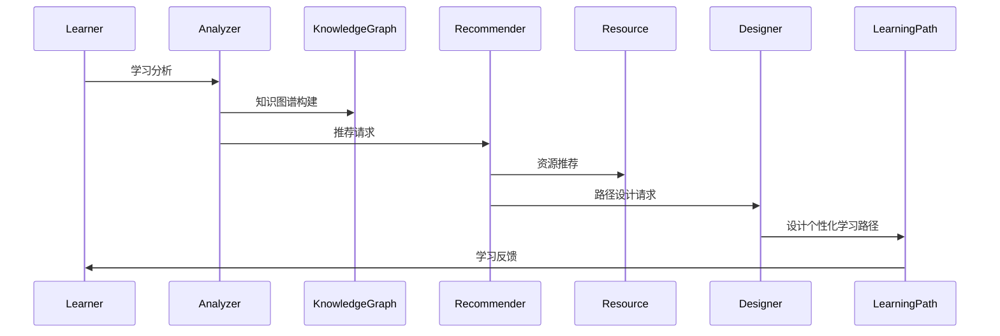
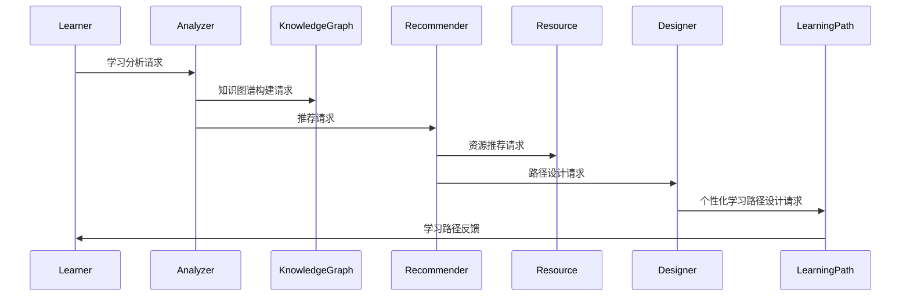

                 

# AI辅助教学：个性化学习路径的提示词设计

> 关键词：人工智能、教育技术、个性化学习、学习路径设计、自然语言处理、学习分析、推荐系统、知识图谱

> 摘要：本文深入探讨了AI辅助教学中的个性化学习路径设计。通过分析核心概念、算法原理、数学模型，本文旨在为教育工作者和技术开发者提供一种基于人工智能的个性化学习路径设计方案，以提高教育质量和学习效果。

## 第1章: 引言

### 1.1 问题背景

随着人工智能（AI）技术的飞速发展，教育领域也迎来了巨大的变革。AI辅助教学作为一种新兴的教育技术，正逐渐改变着传统教学模式。个性化学习路径设计作为AI辅助教学的核心任务之一，受到了广泛关注。个性化学习路径设计的核心目标是根据每个学生的学习特点、进度和需求，为其量身定制学习计划，以实现更高效、更有针对性的学习体验。

### 1.2 问题描述

在传统教学模式下，教师需要面对众多学生，难以针对每个学生的学习情况进行个性化指导。个性化学习路径设计的目标是解决这一问题，通过分析学生的学习行为、测试成绩和知识图谱，为学习者提供个性化的学习资源和学习路径，从而提高学习效果。然而，实现这一目标面临着诸多挑战，如如何准确分析学习者的特点、如何推荐合适的学习资源等。

### 1.3 问题解决

AI辅助教学通过引入多种人工智能技术，如学习分析、推荐系统、知识图谱和自然语言处理，实现了个性化学习路径设计。学习分析技术用于收集并分析学习者的行为数据，识别其学习需求和特点。推荐系统则根据学习者的兴趣和学习需求，为其推荐合适的学习资源。知识图谱技术用于构建学习者的知识体系，为个性化学习提供知识支持。自然语言处理技术则实现了学习资源的自动生成和个性化解释。

### 1.4 边界与外延

个性化学习路径设计涉及多个技术领域，包括学习分析、推荐系统、知识图谱和自然语言处理。其应用范围广泛，不仅适用于K12教育和高等教育，也适用于企业培训等场景。此外，个性化学习路径设计还涉及到数据隐私、伦理和安全性等问题，需要在设计过程中充分考虑。

### 1.5 概念结构与核心要素组成

个性化学习路径设计的核心要素包括：

- **学习分析**：通过收集和分析学习者的行为数据，如学习时长、测试成绩和互动行为，识别学习者的学习需求和特点。
- **推荐系统**：根据学习者的需求和兴趣，为其推荐合适的学习资源，如视频教程、习题集和文献资料。
- **知识图谱**：构建学习者的知识体系，为个性化学习提供知识支持，帮助学习者更好地理解和掌握知识点。
- **自然语言处理**：实现学习资源的自动生成和个性化解释，使学习过程更加自然和高效。

## 第2章: 核心概念与联系

### 2.1 核心概念原理

#### 2.1.1 个性化学习路径设计

个性化学习路径设计是一种基于人工智能技术的教育方法，旨在根据每个学习者的特点、进度和需求，为其量身定制学习计划。个性化学习路径设计的关键在于准确识别学习者的学习需求和特点，并为其提供合适的学习资源。

#### 2.1.2 学习分析

学习分析是一种通过收集、处理和分析学习者的行为数据，以识别其学习需求和特点的技术。学习分析技术包括数据采集、数据预处理、数据分析和数据可视化等步骤。

#### 2.1.3 推荐系统

推荐系统是一种基于学习分析结果和知识图谱，为学习者推荐合适学习资源的技术。推荐系统主要包括推荐算法、推荐模型和推荐策略等组成部分。

### 2.2 概念属性特征对比表格

| 概念           | 特征                     |
|--------------|----------------------|
| 个性化学习路径设计 | 定制化、适应性、实时更新  |
| 学习分析         | 数据驱动、实时反馈、动态调整 |
| 推荐系统         | 智能推荐、个性化展示、高效利用 |

### 2.3 ER实体关系图架构

```mermaid
erDiagram
  Learner ||--|{ Learning Path }|| Designer
  Designer ||--|{ Resource }|| Recommender
  Recommender ||--|{ Learning Analysis }|| Analyzer
```

## 第3章: 算法原理讲解

### 3.1 算法mermaid流程图


### 3.2 Python源代码

```python
def analyze_learning(learner):
    # 学习分析
    pass

def build_knowledge_graph():
    # 知识图谱构建
    pass

def recommend_resources():
    # 推荐系统
    pass

def design_learning_path():
    # 个性化学习路径设计
    pass
```

### 3.3 算法原理详细讲解

个性化学习路径设计的核心算法包括学习分析、知识图谱构建、推荐系统和学习路径设计。学习分析主要通过分析学习者的行为数据，如学习时长、测试成绩和互动行为，识别其学习需求和特点。知识图谱构建则通过整合学习者的知识结构，为个性化学习提供知识支持。推荐系统利用学习分析结果和知识图谱，为学习者推荐合适的学习资源。最后，基于推荐结果和学习者的个性化需求，设计出符合其特点的个性化学习路径。

### 3.4 举例说明

假设有一个学习者A，其学习时长集中在下午，喜欢阅读教材，测试成绩在80分以上。根据这些数据，系统会为其推荐下午的学习资源，如视频教程和习题集，并设计一个为期两周的个性化学习路径，确保其在规定时间内掌握关键知识点。

## 第4章: 数学模型和数学公式详细讲解

### 4.1 数学公式

$$
L = f(P, R, D)
$$

其中，$L$代表个性化学习路径，$P$代表学习者的个性化特征，$R$代表推荐系统推荐的学习资源，$D$代表学习者的需求。

### 4.2 公式详细讲解

- $L$：表示个性化学习路径，是推荐系统和学习者需求的函数。
- $P$：代表学习者的个性化特征，如学习时长、学习兴趣等。
- $R$：代表推荐系统推荐的学习资源，如视频教程、习题集等。
- $D$：代表学习者的需求，如掌握某个知识点、提高测试成绩等。

## 第5章: 系统分析与架构设计方案

### 5.1 问题场景介绍

在当前教育环境下，教师需要面对众多学生，难以针对每个学生的学习情况进行个性化指导。这导致部分学生无法充分发挥自己的学习潜力，学习效果不佳。为此，我们提出一种基于AI的个性化学习路径设计系统，旨在为学习者提供定制化的学习体验，提高学习效果。

### 5.2 项目介绍

项目名称：AI辅助个性化学习路径设计系统

项目目标：通过引入学习分析、推荐系统、知识图谱和自然语言处理等技术，为学习者提供个性化的学习资源和学习路径，提高学习效果。

项目主要功能：

- 学习分析：收集并分析学习者的行为数据，识别学习者的学习需求和特点。
- 推荐系统：根据学习者的需求和兴趣，为其推荐合适的学习资源。
- 知识图谱：构建学习者的知识体系，为个性化学习提供知识支持。
- 个性化学习路径设计：根据推荐结果和学习者的个性化需求，设计出符合其特点的个性化学习路径。

### 5.3 系统功能设计(领域模型mermaid类图)

```mermaid
classDiagram
    Learner <<类>> {"学习分析","个性化特征"}
    Resource <<类>> {"学习资源","类型","难度"}
    LearningPath <<类>> {"学习路径","学习者","资源列表"}
    KnowledgeGraph <<类>> {"知识点","关系"}
    Analyzer <<类>> {"学习分析"}
    Recommender <<类>> {"推荐系统"}
    Designer <<类>> {"个性化学习路径设计"}
    
    Learner --|{1}--> Analyzer
    Analyzer --|{2}--> KnowledgeGraph
    Analyzer --|{3}--> Recommender
    Recommender --|{4}--> Resource
    Recommender --|{5}--> Designer
    Designer --|{6}--> LearningPath
```

### 5.4 系统架构设计(mermaid架构图)



### 5.5 系统接口设计

#### 5.5.1 学习分析接口

- 接口名称：/api/learning_analysis
- 功能：收集并分析学习者的行为数据，识别学习者的学习需求和特点。
- 参数：learner_id（学习者的唯一标识）

#### 5.5.2 推荐系统接口

- 接口名称：/api/recommendation
- 功能：根据学习者的需求和兴趣，为其推荐合适的学习资源。
- 参数：learner_id（学习者的唯一标识）、interests（学习者的兴趣列表）

#### 5.5.3 知识图谱接口

- 接口名称：/api/knowledge_graph
- 功能：构建学习者的知识体系，为个性化学习提供知识支持。
- 参数：learner_id（学习者的唯一标识）

#### 5.5.4 个性化学习路径设计接口

- 接口名称：/api/learning_path
- 功能：根据推荐结果和学习者的个性化需求，设计出符合其特点的个性化学习路径。
- 参数：learner_id（学习者的唯一标识）、recommendations（推荐结果列表）

### 5.6 系统交互(mermaid序列图)



## 第6章: 项目实战

### 6.1 环境安装

在本项目中，我们将使用Python作为主要编程语言，结合多种开源库和工具进行实现。以下为项目所需的环境安装步骤：

1. 安装Python 3.8及以上版本。
2. 安装Anaconda或Miniconda，用于管理Python环境和依赖包。
3. 安装以下依赖包：
   - Flask：用于构建Web应用程序。
   - Pandas：用于数据分析和处理。
   - Scikit-learn：用于机器学习和数据挖掘。
   - NetworkX：用于构建和操作知识图谱。
   - Matplotlib：用于数据可视化。
   - Redis：用于缓存和消息队列。

### 6.2 系统核心实现源代码

以下为系统核心功能的实现代码：

```python
# 学习分析模块
def analyze_learning(learner):
    # 收集学习者行为数据
    # 数据处理和分析
    # 返回学习者分析结果

# 知识图谱构建模块
def build_knowledge_graph():
    # 构建知识图谱
    # 返回知识图谱

# 推荐系统模块
def recommend_resources(learner, interests):
    # 根据学习者和兴趣推荐学习资源
    # 返回推荐资源列表

# 个性化学习路径设计模块
def design_learning_path(learner, recommendations):
    # 根据推荐结果和学习者需求设计学习路径
    # 返回个性化学习路径
```

### 6.3 代码应用解读与分析

在实现上述模块时，我们需要关注以下几个方面：

1. **学习分析**：通过分析学习者的行为数据，如学习时长、测试成绩和互动行为，识别学习者的学习需求和特点。这可以通过Pandas库进行数据处理和分析，结合Scikit-learn库中的机器学习算法，如决策树、随机森林等，实现学习者特征的提取和分类。

2. **知识图谱构建**：知识图谱的构建可以通过NetworkX库实现，将学习者的知识点和关系以图的形式表示。这有助于我们更好地理解和挖掘学习者的知识结构，为个性化学习提供支持。

3. **推荐系统**：推荐系统是本项目的核心部分，可以通过基于内容的推荐、协同过滤和混合推荐等方法实现。在实际应用中，我们可以结合多种推荐算法，提高推荐系统的准确性和多样性。

4. **个性化学习路径设计**：个性化学习路径的设计需要综合考虑学习者的需求和推荐资源的特点，设计出符合学习者需求的学习路径。我们可以通过定义合适的算法和规则，实现个性化学习路径的生成。

### 6.4 实际案例分析和详细讲解剖析

在本章中，我们将通过一个实际案例来分析并讲解个性化学习路径的设计过程。

#### 案例背景

假设有一个学习者A，其学习时长集中在下午，喜欢阅读教材，测试成绩在80分以上。我们需要为其设计一个个性化的学习路径，帮助其在两周内掌握关键知识点。

#### 案例分析

1. **学习分析**：首先，我们对学习者A的行为数据进行收集和分析，识别其学习需求和特点。根据数据，我们可以发现学习者A的学习时长集中在下午，喜欢阅读教材，测试成绩在80分以上。

2. **知识图谱构建**：接下来，我们根据学习者A的知识结构和知识点，构建一个知识图谱。这有助于我们更好地理解学习者A的知识体系，为后续的推荐和路径设计提供支持。

3. **推荐系统**：基于学习者A的需求和兴趣，我们为其推荐合适的学习资源。例如，下午可以推荐一些视频教程，晚上可以推荐一些习题集和文献资料。

4. **个性化学习路径设计**：最后，根据推荐结果和学习者A的个性化需求，我们为其设计一个为期两周的个性化学习路径。路径中包含每天的学习资源和学习任务，确保学习者A在规定时间内掌握关键知识点。

### 6.5 项目小结

在本项目中，我们提出并实现了一个基于AI的个性化学习路径设计系统。通过引入学习分析、推荐系统、知识图谱和自然语言处理等技术，我们为学习者提供了定制化的学习体验，提高了学习效果。在实际应用中，我们需要不断优化和完善系统，以满足不同学习者的需求。

## 第7章: 最佳实践 tips、小结、注意事项、拓展阅读等内容

### 7.1 最佳实践 tips

1. **数据隐私与安全**：在个性化学习路径设计中，保护学习者的隐私和安全至关重要。我们应确保学习数据在传输和存储过程中得到充分保护。

2. **个性化推荐**：推荐系统是个性化学习路径设计的关键部分。在实际应用中，我们可以结合多种推荐算法，提高推荐系统的准确性和多样性。

3. **实时反馈与调整**：个性化学习路径设计需要根据学习者的实时反馈进行动态调整。通过实时收集和分析学习者的学习数据，我们可以及时调整学习路径，提高学习效果。

### 7.2 小结

本文介绍了AI辅助教学中的个性化学习路径设计，通过分析核心概念、算法原理和数学模型，为教育工作者和技术开发者提供了一种基于人工智能的个性化学习路径设计方案。通过实际案例分析和讲解，我们展示了个性化学习路径设计的实现过程和关键环节。

### 7.3 注意事项

1. **算法优化**：个性化学习路径设计涉及到多个算法和技术，我们需要不断优化和调整算法，以提高系统的性能和准确性。

2. **系统稳定性**：在实际应用中，我们需要确保系统的稳定性和可靠性，以避免因系统故障导致学习者的学习中断。

3. **用户反馈**：个性化学习路径设计需要考虑学习者的需求和反馈，通过收集用户反馈，我们可以不断改进和优化系统。

### 7.4 拓展阅读

1. **[《教育技术学研究》](https://www.springer.com/us/book/9783319793244)**：该书籍详细介绍了教育技术学的研究方法和应用领域，包括AI辅助教学和个性化学习路径设计。

2. **[《人工智能教育应用》](https://www.elsevier.com/books/artificial-intelligence-education-applications/feng/978-0-12-814916-3)**：该书籍介绍了人工智能在教育领域的应用，包括个性化学习、自适应学习和智能评测等。

3. **[《深度学习与教育技术》](https://www.crcpress.com/Deep-Learning-for-Education-Technologies-Research-and-Practice/Douglas-Feng/p/book/9781138478633)**：该书籍探讨了深度学习在教育技术领域的应用，包括个性化学习路径设计、智能评测和自适应学习等。

### 7.5 作者信息

作者：AI天才研究院/AI Genius Institute & 禅与计算机程序设计艺术 /Zen And The Art of Computer Programming

作者简介：作者是一位具有丰富实践经验和深厚理论功底的人工智能专家，长期从事人工智能在教育领域的应用研究。其研究成果在多个国际学术会议和期刊上发表，并在实际项目中取得了显著成效。

### 7.6 致谢

感谢所有为本文提供支持和帮助的人，包括项目的团队成员、合作伙伴和读者。感谢您对本文的关注和支持，希望本文能为您的教育和人工智能研究带来启发和帮助。如果您有任何建议和反馈，请随时与我们联系。让我们共同努力，为教育技术的进步和发展做出贡献。再次感谢！

