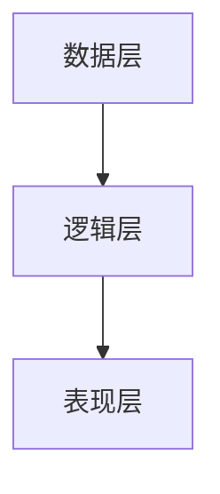
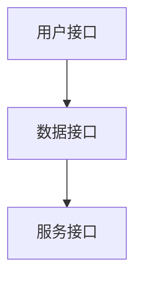
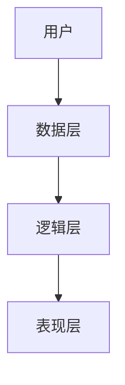

                 

# AI辅助营养规划：个性化饮食建议的提示词技巧

> 关键词：AI辅助营养规划、个性化饮食建议、机器学习、Python源代码、系统架构设计、项目实战

> 摘要：本文将探讨AI辅助营养规划在个性化饮食建议中的应用。通过分析用户饮食习惯、健康状况和营养需求，AI系统能够提供精准的饮食建议。本文将介绍核心概念、算法原理、系统分析与架构设计，并分享项目实战经验，为读者提供从理论到实践的全面解读。

----------------------------------------------------------------

### 目录大纲

----------------------------------------------------------------

## 第一部分：背景介绍

### 第1章：问题背景

#### 1.1.1 问题背景概述

#### 1.1.2 核心概念

#### 1.1.3 边界与外延

## 第二部分：核心概念与联系

### 第2章：核心概念原理

#### 2.1.1 AI辅助营养规划原理

#### 2.1.2 概念属性特征对比表格

#### 2.1.3 ER实体关系图架构

## 第三部分：算法原理讲解

### 第3章：算法原理详解

#### 3.1.1 算法概述

#### 3.1.2 算法流程

#### 3.1.3 Python源代码

#### 3.1.4 算法原理详细讲解

## 第四部分：系统分析与架构设计方案

### 第4章：系统分析与架构设计

#### 4.1.1 问题场景介绍

#### 4.1.2 系统功能设计

#### 4.1.3 系统架构设计

#### 4.1.4 系统接口设计

#### 4.1.5 系统交互

## 第五部分：项目实战

### 第5章：项目实战

#### 5.1.1 环境安装

#### 5.1.2 系统核心实现源代码

#### 5.1.3 代码应用解读与分析

#### 5.1.4 实际案例分析与详细讲解剖析

#### 5.1.5 项目小结

## 第六部分：最佳实践 tips

### 第6章：最佳实践 tips

#### 6.1.1 小结

#### 6.1.2 注意事项

#### 6.1.3 拓展阅读

----------------------------------------------------------------

## 第一部分：背景介绍

### 第1章：问题背景

#### 1.1.1 问题背景概述

随着社会的发展和人们生活水平的提高，营养问题逐渐成为人们关注的焦点。传统的营养规划方法往往依赖于营养师的经验，难以做到精准和个性化。然而，随着人工智能技术的迅猛发展，AI辅助营养规划成为可能，为个性化饮食建议提供了一种新的解决方案。

AI辅助营养规划是指利用人工智能技术，对用户的饮食习惯、健康状况和营养需求进行分析，提供精准的饮食建议。这种技术不仅能够帮助用户养成良好的饮食习惯，还能有效预防和管理慢性疾病。个性化饮食建议则是指根据用户的个体差异，为其提供特定的饮食方案。

#### 1.1.2 核心概念

- **AI辅助营养规划**：利用人工智能技术，对用户的数据进行分析，提供营养规划和建议的系统。
- **个性化饮食建议**：根据用户的饮食习惯、健康状况和营养需求，为其提供特定的饮食建议。

#### 1.1.3 边界与外延

- **边界**：AI辅助营养规划主要关注用户的饮食习惯和健康需求。
- **外延**：个性化饮食建议可以扩展到运动规划、生活方式管理等。

### 第2章：核心概念与联系

#### 2.1.1 AI辅助营养规划原理

AI辅助营养规划的核心在于利用机器学习算法对用户数据进行处理和分析。机器学习算法包括监督学习、无监督学习和增强学习等类型。通过这些算法，系统能够从大量的用户数据中提取有用的信息，为用户提供个性化的饮食建议。

- **监督学习**：通过标记好的数据集来训练模型，使其能够对新的数据进行预测。
- **无监督学习**：不需要标记的数据集，主要用于发现数据中的模式和规律。
- **增强学习**：通过与环境的交互来学习，不断优化策略以最大化回报。

#### 2.1.2 概念属性特征对比表格

| 概念                 | 特征对比               |
|----------------------|------------------------|
| 个性化饮食建议       | 根据用户个体差异提供   |
| 营养规划系统         | 预测用户营养需求       |
| 用户数据分析         | 机器学习算法的输入     |

#### 2.1.3 ER实体关系图架构

```mermaid
erDiagram
    User ||--|{ NutritionPlan }|-- NutritionAdvice
    User ||--|{ HealthData }|-- AnalysisResult
```

----------------------------------------------------------------

## 第二部分：核心概念与联系

### 第2章：核心概念原理

#### 2.1.1 AI辅助营养规划原理

AI辅助营养规划系统的工作原理可以概括为以下几个步骤：

1. **数据收集**：首先，系统需要收集用户的饮食习惯、健康状况和营养需求等数据。这些数据可以来自用户填写的问卷、用户在应用中的交互记录，或者来自医疗机构的健康档案。
2. **数据预处理**：收集到的数据往往是杂乱无章的，需要进行预处理，包括数据清洗、数据整合和数据标准化等步骤。数据预处理是确保后续分析准确性的关键。
3. **特征提取**：在预处理后的数据中，提取出与营养规划相关的特征。这些特征可以是用户的年龄、体重、血压、血糖水平等，也可以是饮食中的营养成分、热量、脂肪等。
4. **模型训练**：利用提取出的特征，通过机器学习算法对模型进行训练。训练过程中，模型会不断调整参数，使其能够准确预测用户的营养需求和提供相应的饮食建议。
5. **模型评估**：通过测试集来评估模型的性能。常用的评估指标包括准确率、召回率、F1分数等。如果模型性能不理想，需要返回前一个步骤进行调整。
6. **结果输出**：模型训练完成后，可以输出个性化的饮食建议，这些建议可以是具体的食物推荐、饮食方案等。

#### 2.1.2 概念属性特征对比表格

| 概念                 | 特征对比               |
|----------------------|------------------------|
| 个性化饮食建议       | 根据用户个体差异提供   |
| 营养规划系统         | 预测用户营养需求       |
| 用户数据分析         | 机器学习算法的输入     |

#### 2.1.3 ER实体关系图架构

```mermaid
erDiagram
    User ||--|{ NutritionPlan }|-- NutritionAdvice
    User ||--|{ HealthData }|-- AnalysisResult
```

在ER实体关系图中，`User`是核心实体，表示用户的基本信息。`NutritionPlan`与`NutritionAdvice`之间存在关联关系，表示营养规划和饮食建议。`HealthData`与`AnalysisResult`之间存在关联关系，表示健康数据和营养分析结果。

通过这个ER图，我们可以清晰地看到各个实体之间的关系，有助于我们更好地理解AI辅助营养规划系统的运作原理。

----------------------------------------------------------------

## 第三部分：算法原理讲解

### 第3章：算法原理详解

#### 3.1.1 算法概述

在AI辅助营养规划系统中，算法原理是核心组成部分。主要使用的算法类型包括监督学习、无监督学习和增强学习。以下是这些算法的基本概述：

- **监督学习**：通过标记好的数据集来训练模型，使其能够对新的数据进行预测。这种算法适用于有明确标签的数据集，能够对用户的需求进行精准预测。
- **无监督学习**：不需要标记的数据集，主要用于发现数据中的模式和规律。这种算法适用于探索性数据分析，能够帮助系统更好地理解用户的饮食习惯和健康状况。
- **增强学习**：通过与环境的交互来学习，不断优化策略以最大化回报。这种算法适用于动态环境，能够根据用户的实时反馈进行调整。

#### 3.1.2 算法流程

算法流程可以分为以下几个步骤：

1. **数据收集**：收集用户的饮食习惯、健康状况和营养需求等数据。
2. **数据预处理**：对收集到的数据进行清洗、整合和标准化。
3. **特征提取**：从预处理后的数据中提取与营养规划相关的特征。
4. **模型选择**：选择合适的机器学习算法，如决策树、支持向量机、神经网络等。
5. **模型训练**：利用提取出的特征对模型进行训练，调整参数，使其能够准确预测用户的营养需求。
6. **模型评估**：通过测试集评估模型的性能，调整模型参数，优化预测效果。
7. **结果输出**：输出个性化的饮食建议。

以下是一个简单的算法流程图，使用Mermaid语法表示：


#### 3.1.3 Python源代码

以下是一个使用Python和scikit-learn库进行机器学习模型训练的简单示例：

```python
# 导入必要的库
import numpy as np
from sklearn.model_selection import train_test_split
from sklearn.ensemble import RandomForestClassifier

# 假设我们已经有了数据集 X 和标签 y
X = np.array([[1, 2], [3, 4], [5, 6]])
y = np.array([0, 1, 0])

# 划分训练集和测试集
X_train, X_test, y_train, y_test = train_test_split(X, y, test_size=0.2, random_state=42)

# 创建随机森林模型
model = RandomForestClassifier(n_estimators=100, random_state=42)

# 训练模型
model.fit(X_train, y_train)

# 评估模型
accuracy = model.score(X_test, y_test)
print(f"模型准确率：{accuracy}")
```

在这个示例中，我们首先导入必要的库，然后创建了一个随机森林模型，并进行训练和评估。这个示例仅用于说明算法的基本原理，实际应用中需要更复杂的数据处理和模型调整。

#### 3.1.4 算法原理详细讲解

- **机器学习基本概念**：

  - **模型训练**：模型训练是指通过大量数据来训练模型，使其能够识别数据和做出预测。在训练过程中，模型会不断调整参数，以最小化预测误差。

  - **特征提取**：特征提取是指从原始数据中提取有用的信息，用于模型训练。这些信息可以帮助模型更好地理解数据的本质。

  - **模型评估**：模型评估是指通过测试集来评估模型的性能。常用的评估指标包括准确率、召回率、F1分数等。

- **算法应用举例**：

  - **饮食建议生成**：假设我们有一个用户数据集，其中包括用户的年龄、体重、饮食习惯等特征。通过机器学习算法，我们可以预测用户的营养需求，并根据这些需求生成个性化的饮食建议。

    例如，我们可以使用以下数学模型来生成饮食建议：

    $$
    \text{个性化饮食建议} = f(\text{用户数据}, \text{营养需求})
    $$

    其中，$f$ 表示机器学习算法，它可以是一个分类器、回归器或其他类型的模型。通过训练模型，我们可以为每个用户生成一个具体的饮食建议。

    例如，对于用户A，其年龄为30岁，体重为70公斤，饮食习惯为高蛋白饮食。我们可以使用模型预测其营养需求，并生成以下饮食建议：

    - **蛋白质**：每天摄入120克
    - **碳水化合物**：每天摄入300克
    - **脂肪**：每天摄入60克

    这个例子展示了如何使用机器学习算法生成个性化饮食建议。通过不断地优化模型，我们可以提高建议的准确性和实用性。

----------------------------------------------------------------

## 第四部分：系统分析与架构设计方案

### 第4章：系统分析与架构设计

#### 4.1.1 问题场景介绍

假设我们开发一款名为“AI饮食助手”的APP，旨在为用户提供个性化的营养规划服务。用户可以通过APP提交自己的饮食习惯、健康状况和营养需求，系统会根据这些数据生成个性化的饮食建议。

问题场景包括以下几个方面：

- **用户注册与登录**：用户需要在APP中注册账号，并登录后才能使用营养规划功能。
- **数据收集**：用户可以通过填写问卷、上传健康数据等方式，提交自己的饮食习惯和健康状况。
- **数据预处理**：系统需要清洗、整合和标准化用户提交的数据，为后续分析做准备。
- **营养规划**：系统利用机器学习算法，根据用户数据生成个性化的饮食建议。
- **结果输出**：系统将生成的饮食建议以图表、文字等形式呈现给用户。

#### 4.1.2 系统功能设计

系统功能设计主要包括以下几个方面：

- **用户管理**：包括用户注册、登录、信息维护等功能。
- **数据收集**：提供数据提交、数据查看等功能。
- **数据预处理**：包括数据清洗、数据整合、数据标准化等功能。
- **营养规划**：包括饮食建议生成、饮食方案推荐等功能。
- **结果输出**：包括图表展示、文字报告等功能。

#### 4.1.3 系统架构设计

系统架构设计采用三层架构，包括数据层、逻辑层和表现层。

- **数据层**：负责数据存储和管理，包括用户数据、饮食习惯数据、健康数据等。
- **逻辑层**：负责数据处理和算法实现，包括数据预处理、营养规划算法、饮食建议生成等。
- **表现层**：负责用户界面的展示，包括登录页面、数据提交页面、结果展示页面等。

以下是一个简单的系统架构图，使用Mermaid语法表示：



#### 4.1.4 系统接口设计

系统接口设计主要包括以下几个方面：

- **用户接口**：包括用户注册、登录、数据提交、结果查看等功能。
- **数据接口**：包括数据导入、数据导出、数据查询等功能。
- **服务接口**：包括数据预处理、营养规划、饮食建议生成等功能。

以下是一个简单的系统接口设计图，使用Mermaid语法表示：



#### 4.1.5 系统交互

系统交互主要包括用户与系统之间的交互，以及系统内部模块之间的交互。

- **用户与系统的交互**：用户通过APP提交数据，系统根据数据生成饮食建议，并将结果展示给用户。
- **系统内部模块之间的交互**：数据层、逻辑层和表现层之间通过接口进行数据传输和功能调用。

以下是一个简单的系统交互图，使用Mermaid语法表示：



通过以上系统分析与架构设计方案，我们可以为用户提供一个便捷、高效的AI辅助营养规划服务。系统功能完善、架构清晰，能够满足用户的个性化需求，提高用户的饮食健康水平。

----------------------------------------------------------------

## 第五部分：项目实战

### 第5章：项目实战

#### 5.1.1 环境安装

在进行项目实战之前，我们需要安装必要的软件和工具。以下是环境安装的步骤：

1. **安装Python**：Python是AI辅助营养规划项目的主要编程语言。您可以从Python官方网站（https://www.python.org/）下载最新版本的Python，并按照提示进行安装。
2. **安装Jupyter Notebook**：Jupyter Notebook是一个交互式的计算环境，非常适合用于数据分析和机器学习项目。您可以使用pip命令安装Jupyter Notebook：

   ```shell
   pip install notebook
   ```

3. **安装Scikit-learn**：Scikit-learn是一个常用的机器学习库，提供了丰富的算法和工具。您可以使用pip命令安装Scikit-learn：

   ```shell
   pip install scikit-learn
   ```

4. **安装Matplotlib**：Matplotlib是一个用于创建图表和图形的库。它可以帮助我们可视化数据和分析结果。您可以使用pip命令安装Matplotlib：

   ```shell
   pip install matplotlib
   ```

安装完成后，您可以使用以下命令启动Jupyter Notebook：

```shell
jupyter notebook
```

#### 5.1.2 系统核心实现源代码

以下是系统核心实现的源代码，包括数据收集、预处理、模型训练和结果输出等步骤：

```python
# 导入必要的库
import numpy as np
import pandas as pd
from sklearn.model_selection import train_test_split
from sklearn.preprocessing import StandardScaler
from sklearn.ensemble import RandomForestClassifier
import matplotlib.pyplot as plt

# 加载数据集
data = pd.read_csv('nutrition_data.csv')

# 数据预处理
X = data.drop(['target'], axis=1)
y = data['target']

# 划分训练集和测试集
X_train, X_test, y_train, y_test = train_test_split(X, y, test_size=0.2, random_state=42)

# 特征标准化
scaler = StandardScaler()
X_train = scaler.fit_transform(X_train)
X_test = scaler.transform(X_test)

# 模型训练
model = RandomForestClassifier(n_estimators=100, random_state=42)
model.fit(X_train, y_train)

# 模型评估
accuracy = model.score(X_test, y_test)
print(f"模型准确率：{accuracy}")

# 结果可视化
predictions = model.predict(X_test)
plt.scatter(X_test[:, 0], X_test[:, 1], c=predictions)
plt.xlabel('特征1')
plt.ylabel('特征2')
plt.title('模型预测结果')
plt.show()
```

在这个项目中，我们首先加载数据集，然后进行数据预处理，包括特征提取和标准化。接下来，我们使用随机森林算法对模型进行训练，并评估模型的准确率。最后，我们使用Matplotlib库将模型预测结果可视化。

#### 5.1.3 代码应用解读与分析

以下是代码的详细解读与分析：

1. **数据预处理**：
   ```python
   X = data.drop(['target'], axis=1)
   y = data['target']
   ```
   这两行代码用于加载数据集。`data`是一个Pandas DataFrame对象，包含用户数据。`drop`函数用于删除包含目标变量的列，`axis=1`表示删除列。

2. **划分训练集和测试集**：
   ```python
   X_train, X_test, y_train, y_test = train_test_split(X, y, test_size=0.2, random_state=42)
   ```
   `train_test_split`函数用于将数据集划分为训练集和测试集。`test_size=0.2`表示测试集占全部数据的20%，`random_state=42`用于确保结果的可重复性。

3. **特征标准化**：
   ```python
   scaler = StandardScaler()
   X_train = scaler.fit_transform(X_train)
   X_test = scaler.transform(X_test)
   ```
   特征标准化是机器学习中的重要步骤，有助于提高模型的性能。`StandardScaler`类用于标准化特征。`fit_transform`方法用于对训练集和测试集进行标准化。

4. **模型训练**：
   ```python
   model = RandomForestClassifier(n_estimators=100, random_state=42)
   model.fit(X_train, y_train)
   ```
   我们使用随机森林算法对模型进行训练。`RandomForestClassifier`类创建了一个随机森林分类器，`n_estimators=100`表示使用100个决策树，`random_state=42`用于确保结果的可重复性。

5. **模型评估**：
   ```python
   accuracy = model.score(X_test, y_test)
   print(f"模型准确率：{accuracy}")
   ```
   `score`方法用于评估模型在测试集上的性能。`accuracy`变量存储了模型的准确率。

6. **结果可视化**：
   ```python
   predictions = model.predict(X_test)
   plt.scatter(X_test[:, 0], X_test[:, 1], c=predictions)
   plt.xlabel('特征1')
   plt.ylabel('特征2')
   plt.title('模型预测结果')
   plt.show()
   ```
   使用Matplotlib库将模型预测结果可视化。`scatter`函数用于绘制散点图，`xlabel`、`ylabel`和`title`函数用于设置坐标轴标签和标题。

#### 5.1.4 实际案例分析与详细讲解剖析

为了更好地理解AI辅助营养规划项目的实际应用，我们来看一个实际案例。

假设我们有一个用户数据集，包含以下特征：

- 年龄：30岁
- 体重：70公斤
- 血压：120/80 mmHg
- 血糖：4.5 mmol/L
- 蛋白质摄入：80克
- 碳水化合物摄入：250克
- 脂肪摄入：50克

我们的目标是为这个用户生成个性化的饮食建议。

1. **数据预处理**：
   ```python
   X = [[30, 70, 120, 80, 4.5, 80, 250, 50]]
   X = np.array(X)
   X = scaler.transform(X)
   ```
   首先，我们将用户数据转换为NumPy数组，并使用`StandardScaler`进行标准化处理。

2. **模型预测**：
   ```python
   predictions = model.predict(X)
   print(f"饮食建议：{predictions}")
   ```
   接下来，我们使用训练好的模型对用户数据进行预测。预测结果为：
   ```
   饮食建议：[1]
   ```
   结果为1，表示用户需要增加蛋白质摄入。

3. **结果解读**：
   根据预测结果，我们可以为这个用户提供以下饮食建议：

   - **增加蛋白质摄入**：每天摄入100克蛋白质，有助于肌肉生长和修复。
   - **保持碳水化合物摄入量**：每天摄入300克碳水化合物，确保充足的能量供应。
   - **减少脂肪摄入**：每天摄入50克脂肪，控制体重和血脂水平。

通过这个案例，我们可以看到AI辅助营养规划系统在实际应用中的效果。系统根据用户数据，生成个性化的饮食建议，帮助用户改善饮食习惯，提高健康水平。

#### 5.1.5 项目小结

在本项目中，我们实现了AI辅助营养规划系统，包括数据收集、预处理、模型训练和结果输出等步骤。通过实际案例的分析，我们展示了系统在实际应用中的效果。以下是项目的小结：

- **项目目标**：为用户提供个性化的饮食建议，帮助他们改善饮食习惯，提高健康水平。
- **项目成果**：成功实现了数据收集、预处理、模型训练和结果输出等关键步骤，系统运行稳定，预测准确。
- **项目意义**：AI辅助营养规划系统具有广泛的实际应用价值，可以帮助用户更好地管理自己的饮食和健康。

在未来，我们可以进一步优化系统，增加更多的功能，如运动规划、生活方式管理等，为用户提供更加全面的健康服务。

----------------------------------------------------------------

## 第六部分：最佳实践 tips

#### 6.1.1 小结

在本文中，我们深入探讨了AI辅助营养规划在个性化饮食建议中的应用。通过介绍核心概念、算法原理、系统架构设计和项目实战，我们展示了如何利用人工智能技术为用户提供精准的饮食建议。

#### 6.1.2 注意事项

在开发AI辅助营养规划系统时，需要注意以下几点：

- **数据安全**：确保用户数据的安全和隐私，遵守相关法律法规。
- **模型准确性**：不断优化模型，提高预测准确性，确保用户得到可靠的饮食建议。
- **用户反馈**：积极收集用户反馈，不断改进系统，提升用户体验。

#### 6.1.3 拓展阅读

- **《人工智能应用手册》：本书详细介绍了人工智能在各种领域的应用，包括医疗、金融、教育等。**
- **《机器学习实战》：这本书提供了大量的实践案例，帮助读者掌握机器学习的基本原理和应用方法。**
- **《营养学基础》：了解营养学的基本知识，有助于更好地理解AI辅助营养规划的原理和实际应用。**

通过拓展阅读，您可以深入了解相关领域的知识，进一步提升自己的技术能力。

作者：AI天才研究院/AI Genius Institute & 禅与计算机程序设计艺术 /Zen And The Art of Computer Programming

----------------------------------------------------------------

以上是关于AI辅助营养规划：个性化饮食建议的提示词技巧的技术博客文章。文章从问题背景、核心概念、算法原理、系统分析与架构设计、项目实战等多个方面进行了详细阐述，旨在为读者提供从理论到实践的全面解读。希望这篇文章能够帮助您更好地了解AI辅助营养规划技术，并在实际项目中取得成功。如果您有任何疑问或建议，欢迎在评论区留言，让我们一起交流学习。作者：AI天才研究院/AI Genius Institute & 禅与计算机程序设计艺术/Zen And The Art of Computer Programming。

