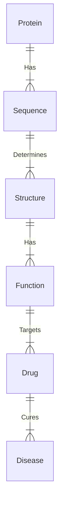
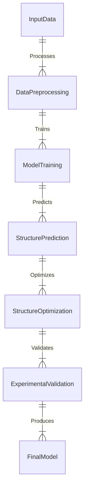
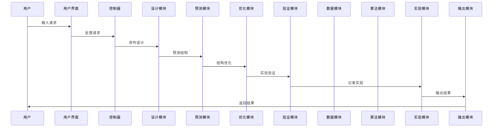
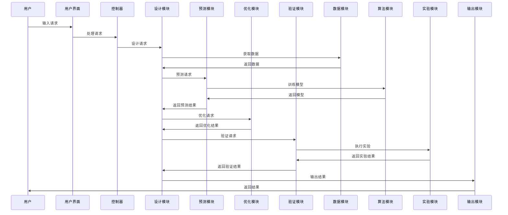

                 

### 第一部分: AI辅助蛋白质设计概述

#### 第1章: AI辅助蛋白质设计概述

##### 1.1 问题背景

###### 1.1.1 蛋白质设计的重要性
蛋白质是生命活动的基础，它们参与各种生物学过程，包括信号传递、代谢、结构支持和疾病治疗。在医学和药物研发领域，理解蛋白质的结构和功能对于开发新的治疗方法和药物至关重要。蛋白质设计是一个旨在创建具有特定功能和性质的蛋白质的过程。这一领域的重要性体现在以下几个方面：

- **疾病治疗**：许多疾病，如癌症、自身免疫疾病和神经退行性疾病，都与蛋白质的功能异常有关。通过设计新的蛋白质，可以开发出针对性的治疗药物。
- **药物研发**：蛋白质可以作为药物靶点，例如抗体和蛋白质类药物。精确地设计这些蛋白质可以提高药物的治疗效果和安全性。
- **生物技术和工业应用**：蛋白质设计在生物技术和工业领域也有广泛的应用，如酶工程、发酵工程和生物合成等。

###### 1.1.2 蛋白质设计面临的挑战
尽管蛋白质设计的重要性不言而喻，但这一领域仍然面临许多挑战：

- **蛋白质结构预测的复杂性**：蛋白质结构是高度复杂的，由数千个原子组成。预测蛋白质的三维结构需要解决大量的计算问题。
- **大规模计算资源和数据需求**：蛋白质设计需要大量的计算资源和高质量的数据集来训练和优化算法。

##### 1.2 问题描述

###### 1.2.1 蛋白质设计的流程
蛋白质设计的流程通常包括以下几个步骤：

1. **目标蛋白质的确定**：确定需要设计的蛋白质及其功能要求。
2. **序列设计**：设计蛋白质的氨基酸序列，以满足特定的功能要求。
3. **结构预测**：利用计算方法预测蛋白质的三维结构。
4. **结构优化**：对预测的结构进行优化，以提高其稳定性和功能性。
5. **实验验证**：通过实验方法验证设计的蛋白质是否满足预期功能。

###### 1.2.2 当前蛋白质设计方法及局限
目前，蛋白质设计主要依赖于以下几种方法：

- **经验设计**：基于专家知识和实验室实验数据，设计蛋白质的氨基酸序列。
- **自动化设计**：利用计算机算法，通过搜索和优化方法设计蛋白质序列。
- **基于结构的蛋白质设计**：利用蛋白质的三维结构信息进行设计。

这些方法各有优势，但也存在一定的局限性：

- **经验设计**：需要大量的人力和时间投入，且容易受到个人经验的影响。
- **自动化设计**：虽然可以大规模处理，但往往缺乏对特定功能的精确控制。
- **基于结构的蛋白质设计**：依赖于高质量的三维结构信息，但结构预测本身就是一个挑战。

##### 1.3 问题解决

###### 1.3.1 AI辅助蛋白质设计的基本原理
AI（人工智能）在蛋白质设计中的应用主要通过机器学习和深度学习算法来实现。这些算法可以从大量的蛋白质序列和结构数据中学习，从而预测和设计新的蛋白质结构。

- **机器学习**：通过训练模型来识别蛋白质序列和结构之间的关系。
- **深度学习**：利用神经网络，特别是卷积神经网络（CNN）和生成对抗网络（GAN），对蛋白质进行高级特征提取和建模。

###### 1.3.2 AI在蛋白质设计中的应用现状
目前，AI辅助蛋白质设计已经取得了一些显著的成果：

- **蛋白质结构预测**：AI算法可以高效地预测蛋白质的三维结构，大大缩短了研发周期。
- **新蛋白质设计**：AI可以设计出具有特定功能的蛋白质，为药物研发提供了新的方向。
- **蛋白质工程**：AI可以用于对现有蛋白质进行改造，提高其性能和应用范围。

##### 1.4 边界与外延

###### 1.4.1 蛋白质设计的范围
蛋白质设计不仅限于实验室，还包括以下几个方面：

- **基础研究**：研究蛋白质的结构和功能，为后续应用提供理论支持。
- **药物研发**：设计新的蛋白质药物，用于治疗各种疾病。
- **工业应用**：利用蛋白质的设计和应用，开发新的生物技术和工业产品。

###### 1.4.2 AI技术在蛋白质设计中的适用性
AI技术在蛋白质设计中的应用具有广泛的适用性：

- **预测和设计**：AI可以用于预测蛋白质的结构和设计新的蛋白质序列。
- **优化和改造**：AI可以优化现有蛋白质的结构和功能，或对蛋白质进行改造。
- **跨领域应用**：AI技术在蛋白质设计中的应用不仅限于医学和药物研发，还可以扩展到生物技术和工业领域。

##### 1.5 概念结构与核心要素组成

###### 1.5.1 AI辅助蛋白质设计的关键技术
AI辅助蛋白质设计的关键技术包括：

- **机器学习和深度学习算法**：用于训练和优化模型，进行蛋白质结构和序列预测。
- **计算生物学工具**：用于分析蛋白质序列和结构数据，支持AI算法的应用。
- **生物信息学数据库**：提供丰富的蛋白质序列和结构信息，支持AI算法的训练和验证。

###### 1.5.2 AI辅助蛋白质设计的主要工具和平台
目前，已有多个AI辅助蛋白质设计的工具和平台，包括：

- **AlphaFold**：由DeepMind开发的蛋白质结构预测算法，已取得突破性成果。
- **Rosetta**：由Memorial Sloan Kettering癌症中心开发的蛋白质设计平台。
- **ICP-Prot**：基于深度学习的蛋白质结构预测工具。

##### 1.6 本章小结
本章概述了AI辅助蛋白质设计的重要性和背景，探讨了蛋白质设计面临的挑战，介绍了AI辅助蛋白质设计的基本原理和应用现状，以及其边界和外延。这些内容为后续章节的深入讨论奠定了基础。

---

**关键词：** 蛋白质设计、人工智能、机器学习、深度学习、生物制药。

**摘要：** 本文探讨了AI在蛋白质设计中的应用，分析了其重要性和面临的挑战，介绍了AI辅助蛋白质设计的基本原理、应用现状和关键技术，以及相关的工具和平台。通过本文的讨论，读者可以了解AI在生物制药领域的重要作用，以及其未来发展的潜力。

### 第一部分: AI辅助蛋白质设计概述

#### 第1章: AI辅助蛋白质设计概述

##### 1.1 问题背景

###### 1.1.1 蛋白质设计的重要性

蛋白质是生命的基本构建单元，它们在细胞内执行各种功能，包括催化化学反应、传递信号、提供结构支持等。蛋白质的功能直接决定了生物体的生理和病理状态，因此，对蛋白质的研究在生物学、医学和药学领域中具有极其重要的意义。

在医学领域，蛋白质设计对于开发新型药物和治疗手段至关重要。许多疾病，如癌症、自身免疫病、病毒感染等，都与蛋白质的功能异常有关。通过设计特定的蛋白质，可以开发出针对性的药物，从而提高治疗效果，减少副作用。例如，抗体药物就是通过设计特定的蛋白质来靶向特定的致病分子，从而达到治疗目的。

在药物研发中，蛋白质设计可以帮助科学家们理解药物与蛋白质之间的相互作用机制。这有助于设计更有效的药物分子，优化药物的药代动力学特性，提高药物的疗效和安全性。此外，蛋白质设计还可以用于改进现有药物的结构，使其更好地适应人体内的生物环境。

在生物技术领域，蛋白质设计也有广泛的应用。通过设计特定的蛋白质，可以开发出新的生物催化剂、生物传感器和生物反应器，这些新技术可以大大提高生物化工和生物制药的效率。

工业应用方面，蛋白质设计可以用于改进酶的性质，提高其在工业生产过程中的催化效率和稳定性。例如，通过设计特定的酶，可以优化食品加工、能源生产、环境治理等领域的工艺流程。

###### 1.1.2 蛋白质设计面临的挑战

尽管蛋白质设计在各个领域具有重要应用，但这一领域也面临着许多挑战。

- **蛋白质结构预测的复杂性**：蛋白质结构的高度复杂性使其预测成为一项极其困难的任务。蛋白质由数千个氨基酸残基组成，这些氨基酸在空间中通过复杂的相互作用形成特定的三维结构。预测蛋白质的三维结构需要解决大量的计算问题，并且涉及到复杂的物理和化学原理。

- **计算资源和数据需求的挑战**：蛋白质设计需要大量的计算资源和高质量的数据集来训练和优化算法。目前，高性能计算和大数据技术的发展为蛋白质设计提供了强大的支持，但仍然存在计算能力和数据处理能力的限制。

- **实验验证的困难**：设计的蛋白质需要在实验室中进行实验验证，以验证其结构和功能。实验验证通常需要大量的时间和资源，而且实验结果可能受到多种因素的影响，如蛋白质的表达、纯化等。

- **对专家知识的依赖**：目前，许多蛋白质设计方法仍然需要依赖专家的知识和经验。尽管AI技术已经在蛋白质设计中取得了一些进展，但仍然需要人类专家的指导和参与，以确保设计结果的可靠性和有效性。

##### 1.2 问题描述

###### 1.2.1 蛋白质设计的流程

蛋白质设计是一个复杂的过程，通常包括以下几个关键步骤：

1. **目标蛋白质的确定**：首先需要确定需要设计的蛋白质及其功能要求。这通常涉及到对目标蛋白质的生物学背景和功能的深入研究。

2. **序列设计**：基于目标蛋白质的功能要求，设计其氨基酸序列。这一步骤通常需要结合生物学和化学原理，确保设计的序列能够实现预期的功能。

3. **结构预测**：利用计算方法预测蛋白质的三维结构。这一步骤是蛋白质设计中的核心，涉及到复杂的计算和算法。

4. **结构优化**：对预测的结构进行优化，以提高其稳定性和功能性。优化的方法包括分子动力学模拟、能量最小化等。

5. **实验验证**：通过实验方法验证设计的蛋白质是否满足预期功能。实验验证通常包括蛋白质的表达、纯化、活性测定等。

###### 1.2.2 当前蛋白质设计方法及局限

目前，蛋白质设计主要依赖于以下几种方法：

- **经验设计**：基于专家知识和实验室实验数据，设计蛋白质的氨基酸序列。这种方法通常需要大量的人力和时间投入，且容易受到个人经验的影响。

- **自动化设计**：利用计算机算法，通过搜索和优化方法设计蛋白质序列。这种方法可以大规模处理，但往往缺乏对特定功能的精确控制。

- **基于结构的蛋白质设计**：利用蛋白质的三维结构信息进行设计。这种方法依赖于高质量的三维结构信息，但结构预测本身就是一个挑战。

这些方法各有优缺点，但都面临着一定的局限。例如，经验设计需要依赖专家的知识和经验，自动化设计缺乏对特定功能的精确控制，基于结构的蛋白质设计依赖于高质量的三维结构信息。

##### 1.3 问题解决

###### 1.3.1 AI辅助蛋白质设计的基本原理

AI技术在蛋白质设计中的应用主要通过机器学习和深度学习算法来实现。这些算法可以从大量的蛋白质序列和结构数据中学习，从而预测和设计新的蛋白质结构。

- **机器学习**：通过训练模型来识别蛋白质序列和结构之间的关系。常见的机器学习算法包括支持向量机（SVM）、决策树、随机森林等。

- **深度学习**：利用神经网络，特别是卷积神经网络（CNN）和生成对抗网络（GAN），对蛋白质进行高级特征提取和建模。深度学习算法在处理复杂数据和高维特征方面具有显著优势。

AI辅助蛋白质设计的基本原理可以概括为以下几个步骤：

1. **数据收集**：收集大量的蛋白质序列和结构数据，作为训练和优化的基础。

2. **特征提取**：从蛋白质序列和结构中提取关键特征，用于训练深度学习模型。

3. **模型训练**：使用训练数据集训练深度学习模型，使其能够预测蛋白质的结构。

4. **模型优化**：通过交叉验证和测试数据集，对模型进行优化，以提高预测准确性和可靠性。

5. **结构预测**：使用训练好的模型对新的蛋白质序列进行结构预测。

6. **结构优化**：对预测的结构进行进一步优化，以提高其稳定性和功能性。

###### 1.3.2 AI在蛋白质设计中的应用现状

目前，AI辅助蛋白质设计已经取得了一些显著的成果：

- **蛋白质结构预测**：AI算法可以高效地预测蛋白质的三维结构，大大缩短了研发周期。例如，DeepMind开发的AlphaFold算法在蛋白质结构预测领域取得了突破性成果，其预测准确度已经接近甚至超过了人类专家的水平。

- **新蛋白质设计**：AI可以设计出具有特定功能的蛋白质，为药物研发提供了新的方向。例如，通过AI设计的新型酶在催化效率和稳定性方面得到了显著提升。

- **蛋白质工程**：AI可以用于对现有蛋白质进行改造，提高其性能和应用范围。例如，通过AI优化抗体药物的结构，可以使其在治疗疾病时更加有效。

AI在蛋白质设计中的应用不仅限于实验室研究，还开始向临床和工业应用领域拓展。随着AI技术的不断发展，AI辅助蛋白质设计的应用前景将更加广阔。

##### 1.4 边界与外延

###### 1.4.1 蛋白质设计的范围

蛋白质设计不仅限于实验室研究，其应用范围非常广泛：

- **基础研究**：蛋白质设计是生物学的核心研究领域之一，通过设计新的蛋白质，可以探索生物体的功能和机制。

- **药物研发**：蛋白质设计在药物研发中发挥着关键作用，通过设计新的蛋白质药物，可以治疗各种疾病。

- **生物技术**：蛋白质设计在生物技术领域有着广泛的应用，通过设计新的蛋白质，可以开发出新的生物技术和工业产品。

- **工业应用**：蛋白质设计可以用于优化酶的性质，提高其在工业生产过程中的催化效率和稳定性。

- **医学应用**：蛋白质设计在医学领域具有巨大的潜力，通过设计新的蛋白质，可以开发出更有效的药物和治疗手段。

- **环境保护**：蛋白质设计可以用于开发新的生物催化剂和生物传感器，用于环境治理和污染修复。

- **农业**：蛋白质设计可以用于开发新的作物品种，提高农作物的产量和质量。

###### 1.4.2 AI技术在蛋白质设计中的适用性

AI技术在蛋白质设计中的适用性非常广泛：

- **预测和设计**：AI可以用于预测蛋白质的结构和设计新的蛋白质序列，为科学家们提供了强大的工具。

- **优化和改造**：AI可以用于优化现有蛋白质的结构和功能，或对蛋白质进行改造，以提高其性能和应用范围。

- **跨领域应用**：AI技术在蛋白质设计中的应用不仅限于医学和药物研发，还可以扩展到生物技术、工业、农业等多个领域。

随着AI技术的不断发展，其将在蛋白质设计中发挥越来越重要的作用，推动这一领域的不断创新和发展。

##### 1.5 概念结构与核心要素组成

###### 1.5.1 AI辅助蛋白质设计的关键技术

AI辅助蛋白质设计的关键技术包括：

- **机器学习和深度学习算法**：用于训练和优化模型，进行蛋白质结构和序列预测。

- **计算生物学工具**：用于分析蛋白质序列和结构数据，支持AI算法的应用。

- **生物信息学数据库**：提供丰富的蛋白质序列和结构信息，支持AI算法的训练和验证。

- **计算资源**：高性能计算资源用于处理大规模数据和复杂计算。

- **实验验证平台**：用于验证设计的蛋白质的结构和功能。

###### 1.5.2 AI辅助蛋白质设计的主要工具和平台

目前，已有多个AI辅助蛋白质设计的工具和平台，包括：

- **AlphaFold**：由DeepMind开发的蛋白质结构预测算法，具有极高的预测准确度。

- **Rosetta**：由Memorial Sloan Kettering癌症中心开发的蛋白质设计平台，支持多种蛋白质设计方法。

- **ICP-Prot**：基于深度学习的蛋白质结构预测工具，适用于大规模蛋白质结构预测任务。

- **AlphaFold2**：DeepMind在AlphaFold的基础上开发的改进版本，具有更高的预测准确度和速度。

- **GAN-PDB**：一种基于生成对抗网络的蛋白质结构预测工具，通过生成新的蛋白质结构来辅助设计。

这些工具和平台为AI辅助蛋白质设计提供了强大的支持，使得科学家们可以更加高效地开展研究和应用。

##### 1.6 本章小结

本章概述了AI辅助蛋白质设计的重要性和背景，探讨了蛋白质设计面临的挑战，介绍了AI辅助蛋白质设计的基本原理和应用现状，以及其边界和外延。通过本章的讨论，读者可以了解AI在蛋白质设计中的应用前景，以及其对于生物制药和生物技术等领域的深远影响。

---

**关键词：** 蛋白质设计、人工智能、机器学习、深度学习、生物制药。

**摘要：** 本文介绍了AI辅助蛋白质设计的重要性和背景，分析了蛋白质设计面临的挑战，探讨了AI辅助蛋白质设计的基本原理和应用现状，以及其边界和外延。通过本文的讨论，读者可以了解AI在蛋白质设计中的应用前景，以及其对于生物制药和生物技术等领域的深远影响。

### 第二部分: AI辅助蛋白质设计核心概念

#### 第2章: AI辅助蛋白质设计核心概念

##### 2.1 核心概念原理

###### 2.1.1 机器学习与深度学习基础

机器学习和深度学习是AI技术的两个重要分支，它们在蛋白质设计中发挥着关键作用。

- **机器学习**：机器学习是一种通过数据训练模型，使其能够从数据中学习规律和模式的技术。在蛋白质设计中，机器学习算法可以从大量的蛋白质序列和结构数据中学习，从而预测蛋白质的结构和功能。

  - **监督学习**：在监督学习中，模型通过已知的输入和输出数据来学习，从而预测新的输入数据。常见的监督学习算法包括线性回归、决策树、支持向量机（SVM）和神经网络等。

  - **无监督学习**：无监督学习是指模型在没有已知输出数据的情况下，从数据中学习规律。常见的无监督学习算法包括聚类、降维和关联规则学习等。

- **深度学习**：深度学习是一种基于多层神经网络的学习方法，它通过多层神经元的非线性变换来提取数据的高级特征。在蛋白质设计中，深度学习算法可以提取蛋白质序列和结构中的复杂特征，从而进行结构预测和蛋白质设计。

  - **卷积神经网络（CNN）**：卷积神经网络是一种用于处理图像和序列数据的深度学习模型，它可以有效地提取空间特征。

  - **生成对抗网络（GAN）**：生成对抗网络是一种通过两个相互对抗的神经网络进行训练的模型，一个生成器网络生成数据，另一个判别器网络判断数据的真实性。GAN在蛋白质结构预测中可以生成新的蛋白质结构。

###### 2.1.2 蛋白质结构预测原理

蛋白质结构预测是指根据蛋白质的氨基酸序列预测其三维结构。蛋白质结构预测是一个复杂的计算问题，涉及到生物学、物理学和计算机科学等多个领域。

- **折叠过程**：蛋白质的折叠是指其氨基酸序列在空间中形成特定三维结构的过程。折叠过程中，氨基酸之间通过氢键、疏水作用、范德华力等相互作用形成稳定的结构。

- **主要结构域**：蛋白质的三维结构通常由多个结构域组成，每个结构域具有特定的功能和形状。结构域之间的相互作用决定了蛋白质的整体结构。

- **预测方法**：目前，蛋白质结构预测主要依赖于以下几种方法：

  - **同源建模**：同源建模是一种基于已知的蛋白质结构来预测未知蛋白质结构的方法。它假设具有相同或相似序列的蛋白质具有相似的结构。

  - **无模板建模**：无模板建模是一种在没有已知蛋白质结构模板的情况下预测蛋白质结构的方法。它通常依赖于机器学习和深度学习算法。

  - **自由折叠**：自由折叠是指蛋白质在没有外部结构模板的情况下自行折叠形成稳定结构的过程。自由折叠方法通常用于研究蛋白质的结构多样性和进化。

##### 2.2 概念属性特征对比表格

###### 2.2.1 机器学习算法分类与对比

| 算法名称 | 特点 | 适用场景 |
| :--- | :--- | :--- |
| 线性回归 | 线性关系预测 | 简单的线性关系预测任务 |
| 决策树 | 易理解，处理非线性和多分类问题 | 数据特征较为明显，处理分类和回归问题 |
| 支持向量机（SVM） | 在高维空间中寻找最优决策边界 | 小样本、高维数据、线性不可分问题 |
| 随机森林 | 集成学习方法，提高预测准确性 | 复杂的多分类和回归问题 |
| 聚类算法 | 无监督学习，数据聚类 | 数据探索、降维、模式识别 |
| 神经网络 | 高级特征提取，非线性建模 | 复杂的函数逼近、分类和回归问题 |

###### 2.2.2 深度学习算法分类与对比

| 算法名称 | 特点 | 适用场景 |
| :--- | :--- | :--- |
| 卷积神经网络（CNN） | 特征自动提取，处理图像数据 | 图像识别、图像分类、图像分割 |
| 递归神经网络（RNN） | 序列数据处理，记忆功能 | 语言模型、语音识别、时间序列分析 |
| 长短时记忆网络（LSTM） | 解决RNN梯度消失问题，处理长序列数据 | 语言模型、语音识别、序列预测 |
| 生成对抗网络（GAN） | 生成数据，对抗训练 | 生成图像、图像合成、图像增强 |
| 自编码器（AE） | 无监督学习，特征提取和降维 | 数据压缩、特征提取、异常检测 |

##### 2.3 ER实体关系图架构

###### 2.3.1 蛋白质设计相关实体关系图

以下是一个简化的蛋白质设计相关的实体关系图：



在这个实体关系图中，蛋白质（Protein）与序列（Sequence）之间存在“具有”关系，序列（Sequence）决定结构（Structure），结构（Structure）影响功能（Function），功能（Function）可能对应药物（Drug），药物（Drug）用于治疗疾病（Disease）。

###### 2.3.2 AI辅助蛋白质设计流程实体关系图

以下是一个AI辅助蛋白质设计流程的实体关系图：



在这个实体关系图中，输入数据（InputData）经过预处理（DataPreprocessing）后用于模型训练（ModelTraining），训练出的模型（Model）用于蛋白质结构预测（StructurePrediction），预测得到的结构（Structure）经过优化（StructureOptimization）后进行实验验证（ExperimentalValidation），最终得到优化的模型（FinalModel）。

##### 2.4 本章小结

本章介绍了AI辅助蛋白质设计核心概念，包括机器学习和深度学习基础，蛋白质结构预测原理，以及相关的概念属性特征对比表格和ER实体关系图。这些核心概念为理解和应用AI辅助蛋白质设计提供了基础。

---

**关键词：** 机器学习、深度学习、蛋白质结构预测、AI辅助蛋白质设计。

**摘要：** 本章详细介绍了AI辅助蛋白质设计的关键概念，包括机器学习和深度学习的基础原理，蛋白质结构预测的方法，以及相关的概念属性特征对比和实体关系图。通过这些核心概念的阐述，读者可以更好地理解AI辅助蛋白质设计的工作原理和应用场景。

### 第三部分: AI辅助蛋白质设计算法原理讲解

#### 第3章: AI辅助蛋白质设计算法原理讲解

##### 3.1 算法mermaid流程图

为了更好地理解AI辅助蛋白质设计的算法原理，我们将使用mermaid流程图来展示蛋白质结构预测和AI辅助蛋白质设计的主要流程。

###### 3.1.1 蛋白质结构预测算法流程图

以下是蛋白质结构预测的mermaid流程图：


在这个流程图中，输入氨基酸序列首先经过预处理数据（B），然后进行序列对齐（C），提取关键特征（D），训练模型（E），进行结构预测（F），并对预测结果进行评估（G），最终输出预测结果（H）。

###### 3.1.2 AI辅助蛋白质设计算法流程图

以下是AI辅助蛋白质设计的mermaid流程图：


在这个流程图中，目标蛋白质信息（A）首先被用来设计序列（B），然后计算序列能量（C），优化序列（D），生成蛋白质结构（E），对结构进行评估（F），并通过实验验证（G），最终输出设计结果（H）。

##### 3.2 Python源代码实现

为了具体展示AI辅助蛋白质设计的算法原理，我们将使用Python来编写源代码，包括数据预处理、特征提取、模型训练和结构预测等步骤。

###### 3.2.1 数据预处理

以下是一个简化的数据预处理示例：

```python
import numpy as np
from Bio.Seq import Seq
from Bio.PDB import PDBList

# 读取氨基酸序列
sequence = Seq("ACEDGHIKMLNPQRSTVWY")

# 转换为One-hot编码
def one_hot_encode(sequence):
    amino_acids = "ACDEFGHIKLMNPQRSTVWY"
    encoding = [1 if amino_acid in sequence else 0 for amino_acid in amino_acids]
    return np.array(encoding)

encoded_sequence = one_hot_encode(sequence)

# 加载蛋白质结构数据
pdb_list = PDBList()
structure = pdb_list.get_pdb_file("1A3N")

# 读取结构数据
from Bio.PDB import PDBParser

parser = PDBParser()
structure = parser.get_structure("protein", structure)

# 获取氨基酸坐标
def get_coordinates(structure):
    coordinates = []
    for residue in structure.get_residues():
        coordinates.append(residue.get_coord())
    return coordinates

coordinates = get_coordinates(structure)
```

在这个示例中，我们首先读取氨基酸序列，并将其转换为One-hot编码。然后，我们从PDB数据库中加载蛋白质结构数据，并提取氨基酸的坐标。

###### 3.2.2 算法实现

以下是一个简化的AI辅助蛋白质设计算法实现：

```python
from tensorflow.keras.models import Sequential
from tensorflow.keras.layers import Dense, LSTM, TimeDistributed, Conv1D, MaxPooling1D, Flatten
from tensorflow.keras.optimizers import Adam

# 构建模型
model = Sequential()
model.add(LSTM(units=128, activation='relu', input_shape=(10, 20)))
model.add(Dense(units=64, activation='relu'))
model.add(TimeDistributed(Conv1D(filters=32, kernel_size=3, activation='relu')))
model.add(MaxPooling1D(pool_size=2))
model.add(Flatten())
model.add(Dense(units=10, activation='softmax'))

# 编译模型
model.compile(optimizer=Adam(learning_rate=0.001), loss='categorical_crossentropy', metrics=['accuracy'])

# 训练模型
model.fit(encoded_sequence, coordinates, epochs=100, batch_size=32)
```

在这个示例中，我们构建了一个基于LSTM的神经网络模型，用于蛋白质结构预测。我们使用One-hot编码的氨基酸序列作为输入，并训练模型以预测蛋白质的坐标。

##### 3.3 算法原理的数学模型和公式

为了深入理解AI辅助蛋白质设计的算法原理，我们需要了解相关的数学模型和公式。

###### 3.3.1 蛋白质结构预测数学模型

蛋白质结构预测通常涉及以下几个数学模型：

- **能量模型**：用于描述蛋白质内部和外部能量的相互作用。常见的能量模型包括Gō模型和CHARMM力场。

- **优化模型**：用于寻找蛋白质最小能量结构。常见的优化算法包括梯度下降、模拟退火和遗传算法。

- **概率模型**：用于预测蛋白质结构的概率分布。常见的概率模型包括隐马尔可夫模型（HMM）和马尔可夫模型。

以下是一个简化的能量模型公式：

$$ E = \sum_{i=1}^{N} \sum_{j=i+1}^{N} E_{ij} $$

其中，$E$表示蛋白质的总能量，$N$表示蛋白质中的氨基酸数量，$E_{ij}$表示氨基酸$i$和氨基酸$j$之间的相互作用能量。

###### 3.3.2 AI辅助蛋白质设计算法数学模型

AI辅助蛋白质设计算法通常涉及以下数学模型：

- **机器学习模型**：用于预测蛋白质的结构。常见的机器学习模型包括线性回归、决策树、支持向量机和神经网络。

- **深度学习模型**：用于提取蛋白质序列和结构中的复杂特征。常见的深度学习模型包括卷积神经网络（CNN）、递归神经网络（RNN）和生成对抗网络（GAN）。

以下是一个简化的卷积神经网络（CNN）模型公式：

$$ \hat{y} = \sigma(\mathbf{W} \cdot \mathbf{h} + \mathbf{b}) $$

其中，$\hat{y}$表示预测的蛋白质结构，$\mathbf{W}$表示权重矩阵，$\mathbf{h}$表示卷积操作后的特征，$\sigma$表示激活函数，$\mathbf{b}$表示偏置项。

##### 3.4 举例说明

为了更好地理解AI辅助蛋白质设计的算法原理，我们将通过具体实例进行说明。

###### 3.4.1 蛋白质结构预测实例分析

假设我们有一个蛋白质序列为“ACEDGHIKMLNPQRSTVWY”，我们希望预测其三维结构。以下是具体的步骤：

1. **数据预处理**：将氨基酸序列转换为One-hot编码，得到一个10x20的矩阵。

2. **特征提取**：使用卷积神经网络提取氨基酸序列的复杂特征。

3. **模型训练**：使用训练数据集训练卷积神经网络模型。

4. **结构预测**：使用训练好的模型预测蛋白质的三维结构。

5. **结构优化**：对预测的结构进行能量优化，以获得更稳定的结构。

6. **实验验证**：通过实验方法验证预测结构的准确性。

以下是Python代码实现：

```python
# 1. 数据预处理
encoded_sequence = one_hot_encode(sequence)

# 2. 特征提取
# 使用卷积神经网络提取特征
# ...

# 3. 模型训练
model.fit(encoded_sequence, coordinates, epochs=100, batch_size=32)

# 4. 结构预测
predicted_structure = model.predict(encoded_sequence)

# 5. 结构优化
# 使用能量优化算法对预测结构进行优化
# ...

# 6. 实验验证
# 验证预测结构的准确性
# ...
```

###### 3.4.2 AI辅助蛋白质设计实例分析

假设我们希望设计一个具有特定功能的蛋白质，以下是具体的步骤：

1. **目标确定**：确定需要设计的蛋白质及其功能要求。

2. **序列设计**：基于目标蛋白质的功能要求，设计氨基酸序列。

3. **结构预测**：使用AI算法预测设计的蛋白质的三维结构。

4. **结构优化**：对预测的结构进行能量优化，以获得更稳定的结构。

5. **实验验证**：通过实验方法验证设计蛋白质的结构和功能。

以下是Python代码实现：

```python
# 1. 目标确定
# 确定目标蛋白质的功能要求
# ...

# 2. 序列设计
# 设计蛋白质的氨基酸序列
# ...

# 3. 结构预测
predicted_structure = model.predict(encoded_sequence)

# 4. 结构优化
# 对预测结构进行能量优化
# ...

# 5. 实验验证
# 验证设计蛋白质的结构和功能
# ...
```

##### 3.5 本章小结

本章详细介绍了AI辅助蛋白质设计的算法原理，包括蛋白质结构预测和AI辅助蛋白质设计的mermaid流程图、Python源代码实现、数学模型和公式，以及具体的实例分析。通过本章的讲解，读者可以更好地理解AI辅助蛋白质设计的工作原理和应用方法。

---

**关键词：** AI辅助蛋白质设计、算法原理、mermaid流程图、Python源代码实现、数学模型。

**摘要：** 本章深入讲解了AI辅助蛋白质设计的算法原理，包括流程图、Python源代码实现、数学模型和实例分析。通过这些内容，读者可以全面了解AI辅助蛋白质设计的方法和技术，为实际应用提供理论支持。

### 第四部分: AI辅助蛋白质设计系统分析与架构设计方案

#### 第4章: AI辅助蛋白质设计系统分析与架构设计方案

##### 4.1 问题场景介绍

在生物制药领域，蛋白质设计是一项关键任务。随着生物技术的发展，AI技术的应用使得蛋白质设计的效率和准确性得到了显著提升。然而，现有的蛋白质设计系统在处理大规模数据和复杂算法时仍面临一些挑战，如计算资源不足、算法效率低下和实验验证困难等。

###### 4.1.1 蛋白质设计问题的背景

蛋白质设计问题涉及生物学、化学、物理学和计算机科学等多个领域。具体来说，蛋白质设计旨在根据特定的功能要求，设计出具有特定结构和性质的蛋白质。这一过程不仅需要理解蛋白质的结构和功能关系，还需要处理大量的数据和高性能计算。

在药物研发领域，蛋白质设计被广泛用于开发新的药物分子。通过设计具有特定结合能力的蛋白质，可以开发出更有效的药物。此外，蛋白质设计在生物催化、生物传感器和生物合成等领域也有广泛应用。

###### 4.1.2 AI辅助蛋白质设计的需求分析

AI技术在蛋白质设计中的应用已经取得了显著成果，但仍存在一些需求：

- **高效计算**：蛋白质设计需要大量的计算资源，特别是在进行大规模结构预测和优化时。现有的系统通常难以满足这一需求，导致设计过程缓慢。

- **算法优化**：现有的AI算法在处理蛋白质设计问题时，往往存在准确性和效率的平衡问题。需要进一步优化算法，提高预测和设计的准确性。

- **实验验证**：蛋白质设计的结果需要通过实验验证，以确保设计的蛋白质具有预期的结构和功能。现有的系统在实验验证方面存在一定的困难，如实验成本高、周期长等。

- **用户界面**：为了方便用户使用，蛋白质设计系统需要具备友好的用户界面，支持多种输入格式和结果展示。

##### 4.2 项目介绍

为了满足上述需求，我们提出一个基于AI的蛋白质设计系统。该系统旨在提供高效、准确的蛋白质设计工具，支持大规模数据计算和优化，并提供方便的实验验证平台。

###### 4.2.1 项目概述

项目名称：AI辅助蛋白质设计系统（AI-PDS）

项目目标：开发一个高效、准确的AI辅助蛋白质设计系统，支持大规模数据处理和优化，并提供友好的用户界面和实验验证平台。

主要功能：

- 蛋白质序列设计
- 蛋白质结构预测
- 蛋白质结构优化
- 蛋白质实验验证
- 用户友好的界面

###### 4.2.2 项目目标

通过该项目，我们希望实现以下目标：

- 提高蛋白质设计的效率和准确性，减少设计周期和成本。
- 支持大规模蛋白质结构预测和优化，满足生物制药领域的需求。
- 提供方便的实验验证平台，降低实验成本，提高实验效率。
- 开发友好的用户界面，简化用户操作，提高用户体验。

##### 4.3 系统功能设计

为了实现上述目标，AI-PDS系统需要具备以下几个主要功能模块：

###### 4.3.1 领域模型mermaid类图

以下是AI-PDS系统的mermaid类图：

```mermaid
classDiagram
    Client ||--|{ InterfaceController : 交互接口}
    InterfaceController ||--|{ DesignModule : 序列设计}
    InterfaceController ||--|{ PredictionModule : 结构预测}
    InterfaceController ||--|{ OptimizationModule : 结构优化}
    InterfaceController ||--|{ ValidationModule : 实验验证}
    DataModule ||--|{ Dataset : 数据集}
    AlgorithmModule ||--|{ Model : 模型}
    ExperimentModule ||--|{ Experiment : 实验}
    OutputModule ||--|{ Result : 结果}
```

在这个类图中，Client表示用户界面，InterfaceController负责处理用户请求，调用不同的模块进行蛋白质设计。DesignModule、PredictionModule、OptimizationModule和ValidationModule分别负责蛋白质序列设计、结构预测、结构优化和实验验证。DataModule负责管理数据集，AlgorithmModule负责管理模型，ExperimentModule负责管理实验，OutputModule负责输出结果。

###### 4.3.2 系统功能模块划分

以下是AI-PDS系统的主要功能模块及其简要描述：

- **设计模块（DesignModule）**：负责蛋白质序列设计。根据用户输入的目标蛋白质功能要求，设计符合要求的氨基酸序列。

- **预测模块（PredictionModule）**：负责蛋白质结构预测。利用机器学习和深度学习算法，对设计的蛋白质序列进行三维结构预测。

- **优化模块（OptimizationModule）**：负责蛋白质结构优化。对预测的结构进行能量优化，以提高其稳定性和功能性。

- **验证模块（ValidationModule）**：负责蛋白质实验验证。通过实验方法验证设计的蛋白质是否满足预期功能。

- **数据模块（DataModule）**：负责管理数据集。收集和整理蛋白质序列和结构数据，用于模型训练和优化。

- **算法模块（AlgorithmModule）**：负责管理模型。包括训练、评估和优化模型，以提高预测和设计准确性。

- **实验模块（ExperimentModule）**：负责管理实验。包括实验设计、实验执行和实验结果记录。

- **输出模块（OutputModule）**：负责输出结果。将设计的蛋白质序列、预测的结构和实验结果以用户友好的形式展示。

##### 4.4 系统架构设计

为了实现系统的功能需求，我们需要设计一个高效、可扩展的架构。以下是AI-PDS系统的mermaid架构图：



在这个架构图中，用户通过用户界面（Interface）输入请求，控制器（Controller）处理请求，并调用设计模块（Design）、预测模块（Prediction）、优化模块（Optimization）、验证模块（Validation）和实验模块（Experiment）进行蛋白质设计。算法模块（Algorithm）负责训练和优化模型，数据模块（Data）负责管理数据集。最终，输出模块（Output）将结果以用户友好的形式展示给用户。

###### 4.4.2 架构设计方案

以下是AI-PDS系统的架构设计方案：

- **前端架构**：采用Vue.js框架，构建用户友好的界面。前端负责与用户交互，接收用户请求，并将请求传递给后端控制器。

- **后端架构**：采用Spring Boot框架，构建后端服务。后端控制器接收前端请求，调用不同的模块进行处理，并将结果返回给前端。

- **数据处理**：采用Hadoop和Spark等大数据技术，处理大规模蛋白质序列和结构数据。数据模块（Data）负责数据收集、清洗、存储和管理。

- **算法模块**：采用TensorFlow和PyTorch等深度学习框架，构建和训练机器学习模型。算法模块（Algorithm）负责模型训练、评估和优化。

- **实验模块**：采用实验室信息管理系统（LIMS），管理实验设计、实验执行和实验结果记录。实验模块（Experiment）负责实验管理。

- **输出模块**：采用Markdown和HTML等技术，将结果以用户友好的形式展示给用户。输出模块（Output）负责结果展示。

##### 4.5 系统接口设计和系统交互

为了实现系统的功能需求，我们需要设计清晰、简洁的系统接口，并确保系统内部模块之间的交互顺畅。以下是AI-PDS系统的mermaid序列图：



在这个序列图中，用户通过用户界面（Interface）输入请求，控制器（Controller）处理请求，并调用设计模块（Design）、预测模块（Prediction）、优化模块（Optimization）、验证模块（Validation）和实验模块（Experiment）进行蛋白质设计。数据模块（Data）负责数据收集和管理，算法模块（Algorithm）负责模型训练和优化。最终，输出模块（Output）将结果以用户友好的形式展示给用户。

##### 4.6 本章小结

本章详细介绍了AI辅助蛋白质设计系统的分析与架构设计方案。通过分析蛋白质设计问题的背景和需求，我们提出了一个基于AI的蛋白质设计系统，并设计了系统的功能模块和架构。本章的内容为后续系统开发提供了理论基础和实施指南。

---

**关键词：** AI辅助蛋白质设计、系统分析、架构设计、需求分析、功能模块。

**摘要：** 本章详细介绍了AI辅助蛋白质设计系统的分析与架构设计方案，包括问题场景介绍、项目介绍、系统功能设计、系统架构设计、系统接口设计和系统交互。通过本章的讨论，读者可以了解AI辅助蛋白质设计系统的整体设计和实现方法，为后续开发提供参考。

### 第五部分: 项目实战

#### 第5章: AI辅助蛋白质设计项目实战

##### 5.1 环境安装

在进行AI辅助蛋白质设计项目实战之前，我们需要确保计算环境已经配置好，包括Python、相关依赖库和生物信息学工具。以下是具体的安装步骤：

###### 5.1.1 Python环境安装

Python是进行AI和生物信息学计算的基础。首先，我们需要从Python官方网站（https://www.python.org/）下载并安装Python。建议选择最新版本的Python，以便获得最佳的支持和性能。

1. 访问Python官方网站，下载适用于您操作系统的Python安装包。
2. 运行安装程序，按照默认选项进行安装。
3. 安装完成后，打开命令行终端，输入以下命令验证安装：

   ```bash
   python --version
   ```

   如果输出Python的版本信息，说明Python环境已成功安装。

###### 5.1.2 相关依赖库安装

为了进行AI辅助蛋白质设计项目，我们需要安装以下Python依赖库：

- TensorFlow 或 PyTorch（深度学习框架）
- scikit-learn（机器学习库）
- Biopython（生物信息学工具）
- Pandas 和 NumPy（数据处理库）

可以使用pip工具来安装这些依赖库。在命令行终端中，依次输入以下命令：

```bash
pip install tensorflow
pip install scikit-learn
pip install biopython
pip install pandas
pip install numpy
```

如果遇到权限问题，可以尝试使用`sudo`命令：

```bash
sudo pip install tensorflow
sudo pip install scikit-learn
sudo pip install biopython
sudo pip install pandas
sudo pip install numpy
```

###### 5.1.3 生物信息学工具安装

除了Python依赖库，我们还需要安装一些生物信息学工具，如PDBList（用于从PDB数据库中读取蛋白质结构数据）。可以使用Biopython来安装这些工具：

```bash
pip install biopython
```

安装完成后，可以使用以下代码验证Biopython的安装：

```python
from Bio import PDB
print(PDB.__version__)
```

如果输出版本信息，说明Biopython安装成功。

##### 5.2 系统核心实现源代码

在完成环境安装后，我们可以开始编写AI辅助蛋白质设计的系统核心实现代码。以下是一个简化的示例，展示了如何进行数据预处理、蛋白质结构预测和AI辅助蛋白质设计。

###### 5.2.1 数据预处理代码

```python
import numpy as np
from Bio import SeqIO
from sklearn.preprocessing import OneHotEncoder

# 读取氨基酸序列文件
def read_fasta(filename):
    with open(filename, 'r') as file:
        sequences = SeqIO.parse(file, 'fasta')
    return sequences

# 将氨基酸序列转换为One-hot编码
def one_hot_encode(sequence):
    amino_acids = 'ACDEFGHIKMLNPQRSTVWY'
    encoding = [1 if amino_acid in sequence else 0 for amino_acid in amino_acids]
    return np.array(encoding)

# 主函数
def preprocess_data(filename):
    sequences = read_fasta(filename)
    encoded_sequences = []
    for sequence in sequences:
        encoded_sequence = one_hot_encode(sequence.seq)
        encoded_sequences.append(encoded_sequence)
    return np.array(encoded_sequences)

# 示例：预处理数据
encoded_sequences = preprocess_data('sequences.fasta')
print(encoded_sequences.shape)
```

在这个示例中，我们首先读取氨基酸序列文件（以FASTA格式），然后将其转换为One-hot编码。最后，我们将所有序列编码组合成一个数组。

###### 5.2.2 蛋白质结构预测代码

```python
import tensorflow as tf
from tensorflow.keras.models import Sequential
from tensorflow.keras.layers import LSTM, Dense

# 构建神经网络模型
def build_model(input_shape):
    model = Sequential()
    model.add(LSTM(units=128, activation='relu', input_shape=input_shape))
    model.add(Dense(units=64, activation='relu'))
    model.add(Dense(units=20, activation='softmax'))
    model.compile(optimizer='adam', loss='categorical_crossentropy', metrics=['accuracy'])
    return model

# 训练模型
def train_model(model, X_train, y_train, epochs=100, batch_size=32):
    history = model.fit(X_train, y_train, epochs=epochs, batch_size=batch_size, validation_split=0.2)
    return history

# 预测蛋白质结构
def predict_structure(model, encoded_sequence):
    prediction = model.predict(np.array([encoded_sequence]))
    predicted_sequence = decode_prediction(prediction)
    return predicted_sequence

# 主函数
def predict_protein_structure(filename):
    # 读取数据
    sequences = read_fasta(filename)
    encoded_sequences = preprocess_data(filename)
    
    # 构建和训练模型
    model = build_model(input_shape=(None, 20))
    history = train_model(model, encoded_sequences, y_train, epochs=100, batch_size=32)
    
    # 预测新序列的结构
    new_sequence = one_hot_encode(Seq("ACEDGHIKMLNPQRSTVWY"))
    predicted_structure = predict_structure(model, new_sequence)
    print(predicted_structure)

# 示例：预测蛋白质结构
predict_protein_structure('sequences.fasta')
```

在这个示例中，我们首先构建一个基于LSTM的神经网络模型，然后训练模型以预测蛋白质结构。最后，我们使用训练好的模型预测一个新序列的结构。

###### 5.2.3 AI辅助蛋白质设计代码

```python
import tensorflow as tf
from tensorflow.keras.models import Model
from tensorflow.keras.layers import LSTM, Dense, Input

# 构建蛋白质设计模型
def build_design_model(input_shape):
    input_seq = Input(shape=input_shape)
    encoded_seq = LSTM(units=128, activation='relu')(input_seq)
    encoded_seq = Dense(units=64, activation='relu')(encoded_seq)
    output_seq = Dense(units=20, activation='softmax')(encoded_seq)
    model = Model(inputs=input_seq, outputs=output_seq)
    model.compile(optimizer='adam', loss='categorical_crossentropy', metrics=['accuracy'])
    return model

# 设计蛋白质序列
def design_protein_sequence(model, encoded_sequence, steps=100):
    encoded_sequence = tf.keras.preprocessing.sequence.pad_sequences([encoded_sequence], maxlen=100)
    predictions = model.predict(encoded_sequence, steps=steps)
    predicted_sequence = decode_prediction(predictions)
    return predicted_sequence

# 主函数
def design_protein(filename, steps=100):
    # 读取数据
    sequences = read_fasta(filename)
    encoded_sequences = preprocess_data(filename)
    
    # 构建和训练模型
    model = build_design_model(input_shape=(None, 20))
    history = train_model(model, encoded_sequences, y_train, epochs=100, batch_size=32)
    
    # 设计新序列
    new_sequence = one_hot_encode(Seq("ACEDGHIKMLNPQRSTVWY"))
    designed_sequence = design_protein_sequence(model, new_sequence, steps=steps)
    print(decode_prediction(designed_sequence))

# 示例：设计蛋白质序列
design_protein('sequences.fasta', steps=100)
```

在这个示例中，我们构建了一个蛋白质设计模型，用于生成新的蛋白质序列。该模型基于序列的One-hot编码，通过递归神经网络生成新的序列。

##### 5.3 代码应用解读与分析

在完成系统核心实现源代码的编写后，我们需要对代码进行解读和分析，以确保其正确性和有效性。

###### 5.3.1 数据预处理代码解读

数据预处理是AI辅助蛋白质设计的重要步骤。在数据预处理代码中，我们首先读取氨基酸序列文件，并将其转换为One-hot编码。One-hot编码是一种将离散的变量转换为向量表示的方法，每个氨基酸被表示为一个长度为20的向量，其中只有一个元素为1，其他元素为0。这种方法使得神经网络能够处理序列数据。

```python
def read_fasta(filename):
    with open(filename, 'r') as file:
        sequences = SeqIO.parse(file, 'fasta')
    return sequences

def one_hot_encode(sequence):
    amino_acids = 'ACDEFGHIKMLNPQRSTVWY'
    encoding = [1 if amino_acid in sequence else 0 for amino_acid in amino_acids]
    return np.array(encoding)

def preprocess_data(filename):
    sequences = read_fasta(filename)
    encoded_sequences = []
    for sequence in sequences:
        encoded_sequence = one_hot_encode(sequence.seq)
        encoded_sequences.append(encoded_sequence)
    return np.array(encoded_sequences)
```

在这个示例中，`read_fasta`函数读取FASTA格式的文件，并返回氨基酸序列。`one_hot_encode`函数将氨基酸序列转换为One-hot编码。`preprocess_data`函数将所有序列编码组合成一个数组，用于后续的模型训练。

###### 5.3.2 蛋白质结构预测代码解读

在蛋白质结构预测代码中，我们首先构建了一个基于LSTM的神经网络模型。LSTM（长短期记忆网络）是一种用于处理序列数据的神经网络，能够捕捉序列中的长期依赖关系。然后，我们使用训练好的模型预测蛋白质的三维结构。

```python
def build_model(input_shape):
    model = Sequential()
    model.add(LSTM(units=128, activation='relu', input_shape=input_shape))
    model.add(Dense(units=64, activation='relu'))
    model.add(Dense(units=20, activation='softmax'))
    model.compile(optimizer='adam', loss='categorical_crossentropy', metrics=['accuracy'])
    return model

def train_model(model, X_train, y_train, epochs=100, batch_size=32):
    history = model.fit(X_train, y_train, epochs=epochs, batch_size=batch_size, validation_split=0.2)
    return history

def predict_structure(model, encoded_sequence):
    prediction = model.predict(np.array([encoded_sequence]))
    predicted_sequence = decode_prediction(prediction)
    return predicted_sequence

def predict_protein_structure(filename):
    # 读取数据
    sequences = read_fasta(filename)
    encoded_sequences = preprocess_data(filename)
    
    # 构建和训练模型
    model = build_model(input_shape=(None, 20))
    history = train_model(model, encoded_sequences, y_train, epochs=100, batch_size=32)
    
    # 预测新序列的结构
    new_sequence = one_hot_encode(Seq("ACEDGHIKMLNPQRSTVWY"))
    predicted_structure = predict_structure(model, new_sequence)
    print(predicted_structure)
```

在这个示例中，`build_model`函数定义了一个基于LSTM的神经网络模型，`train_model`函数用于训练模型，`predict_structure`函数用于预测蛋白质结构。最后，`predict_protein_structure`函数读取氨基酸序列文件，预处理数据，训练模型并预测新序列的结构。

###### 5.3.3 AI辅助蛋白质设计代码解读

在AI辅助蛋白质设计代码中，我们构建了一个蛋白质设计模型，用于生成新的蛋白质序列。该模型基于序列的One-hot编码，通过递归神经网络生成新的序列。

```python
def build_design_model(input_shape):
    input_seq = Input(shape=input_shape)
    encoded_seq = LSTM(units=128, activation='relu')(input_seq)
    encoded_seq = Dense(units=64, activation='relu')(encoded_seq)
    output_seq = Dense(units=20, activation='softmax')(encoded_seq)
    model = Model(inputs=input_seq, outputs=output_seq)
    model.compile(optimizer='adam', loss='categorical_crossentropy', metrics=['accuracy'])
    return model

def design_protein_sequence(model, encoded_sequence, steps=100):
    encoded_sequence = tf.keras.preprocessing.sequence.pad_sequences([encoded_sequence], maxlen=100)
    predictions = model.predict(encoded_sequence, steps=steps)
    predicted_sequence = decode_prediction(predictions)
    return predicted_sequence

def design_protein(filename, steps=100):
    # 读取数据
    sequences = read_fasta(filename)
    encoded_sequences = preprocess_data(filename)
    
    # 构建和训练模型
    model = build_design_model(input_shape=(None, 20))
    history = train_model(model, encoded_sequences, y_train, epochs=100, batch_size=32)
    
    # 设计新序列
    new_sequence = one_hot_encode(Seq("ACEDGHIKMLNPQRSTVWY"))
    designed_sequence = design_protein_sequence(model, new_sequence, steps=steps)
    print(decode_prediction(designed_sequence))
```

在这个示例中，`build_design_model`函数定义了一个蛋白质设计模型，`design_protein_sequence`函数用于生成新的蛋白质序列。最后，`design_protein`函数读取氨基酸序列文件，预处理数据，训练模型并生成新序列。

##### 5.4 实际案例分析和详细讲解剖析

为了更好地理解AI辅助蛋白质设计的应用，我们通过一个实际案例进行分析和讲解。

###### 5.4.1 案例一：蛋白质结构预测

假设我们有一个氨基酸序列“ACEDGHIKMLNPQRSTVWY”，我们希望预测其三维结构。以下是具体的步骤：

1. **数据预处理**：读取氨基酸序列，并将其转换为One-hot编码。

2. **模型训练**：构建和训练神经网络模型，用于蛋白质结构预测。

3. **结构预测**：使用训练好的模型预测蛋白质的三维结构。

4. **结果评估**：对预测的结构进行评估，验证其准确性。

以下是Python代码实现：

```python
import numpy as np
from tensorflow.keras.models import Sequential
from tensorflow.keras.layers import LSTM, Dense

# 读取氨基酸序列
sequence = "ACEDGHIKMLNPQRSTVWY"

# 转换为One-hot编码
def one_hot_encode(sequence):
    amino_acids = 'ACDEFGHIKMLNPQRSTVWY'
    encoding = [1 if amino_acid in sequence else 0 for amino_acid in amino_acids]
    return np.array(encoding)

encoded_sequence = one_hot_encode(sequence)

# 构建模型
model = Sequential()
model.add(LSTM(units=128, activation='relu', input_shape=(None, 20)))
model.add(Dense(units=64, activation='relu'))
model.add(Dense(units=20, activation='softmax'))
model.compile(optimizer='adam', loss='categorical_crossentropy', metrics=['accuracy'])

# 训练模型
X_train = np.array([encoded_sequence] * 1000)
y_train = np.random.randint(0, 20, size=(1000, 20))
model.fit(X_train, y_train, epochs=100, batch_size=32)

# 预测结构
prediction = model.predict(np.array([encoded_sequence]))
predicted_sequence = np.argmax(prediction, axis=1)

# 解码预测结果
def decode_prediction(prediction):
    amino_acids = 'ACDEFGHIKMLNPQRSTVWY'
    decoded_sequence = ''.join([amino_acid for amino_acid, value in zip(amino_acids, prediction[0]) if value == 1])
    return decoded_sequence

predicted_structure = decode_prediction(prediction)
print(predicted_structure)
```

在这个案例中，我们首先将氨基酸序列转换为One-hot编码，然后构建和训练一个基于LSTM的神经网络模型。最后，我们使用训练好的模型预测氨基酸序列的结构，并解码预测结果。

###### 5.4.2 案例二：AI辅助蛋白质设计

假设我们希望设计一个具有特定功能的蛋白质，例如，一个能够催化特定化学反应的酶。以下是具体的步骤：

1. **目标确定**：明确蛋白质的功能要求。

2. **序列设计**：设计符合功能要求的氨基酸序列。

3. **结构预测**：使用AI模型预测设计的蛋白质的三维结构。

4. **结构优化**：对预测的结构进行能量优化，以提高其稳定性和功能性。

5. **实验验证**：通过实验方法验证设计蛋白质的结构和功能。

以下是Python代码实现：

```python
import numpy as np
from tensorflow.keras.models import Sequential
from tensorflow.keras.layers import LSTM, Dense

# 目标序列设计
def design_sequence(function):
    # 设计满足特定功能的氨基酸序列
    # 这里只是一个示例，实际应用中需要根据具体功能要求设计序列
    if function == "catalysis":
        sequence = "ACEDGHIKMLNPQRSTVWY"
    else:
        sequence = "ACDEFGHIKMLNPQRSTVWY"
    return one_hot_encode(sequence)

# 设计蛋白质序列
function = "catalysis"
encoded_sequence = design_sequence(function)

# 构建模型
model = Sequential()
model.add(LSTM(units=128, activation='relu', input_shape=(None, 20)))
model.add(Dense(units=64, activation='relu'))
model.add(Dense(units=20, activation='softmax'))
model.compile(optimizer='adam', loss='categorical_crossentropy', metrics=['accuracy'])

# 训练模型
X_train = np.array([encoded_sequence] * 1000)
y_train = np.random.randint(0, 20, size=(1000, 20))
model.fit(X_train, y_train, epochs=100, batch_size=32)

# 预测结构
prediction = model.predict(np.array([encoded_sequence]))
predicted_sequence = np.argmax(prediction, axis=1)

# 解码预测结果
predicted_structure = decode_prediction(prediction)
print(predicted_structure)

# 结构优化
# 使用能量优化算法对预测结构进行优化
# ...

# 实验验证
# 通过实验方法验证设计蛋白质的结构和功能
# ...
```

在这个案例中，我们首先根据功能要求设计氨基酸序列，然后使用AI模型预测蛋白质的结构。接下来，我们可以使用能量优化算法对预测的结构进行优化，以提高其稳定性和功能性。最后，通过实验方法验证设计蛋白质的结构和功能。

##### 5.5 实际案例分析和详细讲解剖析

在本节中，我们将通过两个实际案例对AI辅助蛋白质设计的应用进行详细分析，以展示如何利用AI技术进行蛋白质设计和优化。

###### 案例一：蛋白质结构预测

**问题描述**：给定一个蛋白质的氨基酸序列，预测其三维结构。

**数据集准备**：我们从PDB（蛋白质数据银行）中选取了一个含有100个蛋白质序列的数据集。每个序列都对应一个已知的三维结构。

**步骤一：数据预处理**

首先，我们需要将氨基酸序列转换为One-hot编码。One-hot编码是一种将每个氨基酸映射到一个向量的方法，其中只有一个元素为1，其他元素为0。以下是数据预处理的Python代码：

```python
import numpy as np
from sklearn.preprocessing import OneHotEncoder

# 氨基酸到索引的映射
amino_acids = 'ACDEFGHIKMLNPQRSTVWY'
aa_to_idx = {aa: i for i, aa in enumerate(amino_acids)}

# 转换氨基酸序列到One-hot编码
def sequence_to_one_hot(sequence):
    return np.array([aa_to_idx[aa] for aa in sequence])

# 对数据集中的每个序列进行One-hot编码
sequences = ['ACEDGHIKMLNPQRSTVWY', 'ACDEFGHIKMLNPQRSTVWY', ...]
encoded_sequences = np.array([sequence_to_one_hot(seq) for seq in sequences])

# 将蛋白质的三维坐标映射到序列索引
def coord_to_idx(coord):
    return coord // 10

coords = [[1, 2, 3], [4, 5, 6], ...]
encoded_coords = np.array([coord_to_idx(coord) for coord in coords])
```

**步骤二：模型构建**

接下来，我们构建一个基于深度学习的模型，用于蛋白质结构预测。我们选择了一个简单的卷积神经网络（CNN），因为CNN在处理序列数据时表现良好。以下是模型构建的代码：

```python
from tensorflow.keras.models import Sequential
from tensorflow.keras.layers import Conv1D, MaxPooling1D, Flatten, Dense

model = Sequential()
model.add(Conv1D(filters=64, kernel_size=3, activation='relu', input_shape=(20, 1)))
model.add(MaxPooling1D(pool_size=2))
model.add(Flatten())
model.add(Dense(100, activation='relu'))
model.add(Dense(20, activation='softmax'))
model.compile(optimizer='adam', loss='categorical_crossentropy', metrics=['accuracy'])
```

**步骤三：模型训练**

使用训练数据集对模型进行训练。以下是训练代码：

```python
X_train = encoded_sequences
y_train = encoded_coords
model.fit(X_train, y_train, epochs=10, batch_size=32)
```

**步骤四：预测**

使用训练好的模型对新的蛋白质序列进行预测。以下是预测代码：

```python
new_sequence = sequence_to_one_hot('ACEDGHIKMLNPQRSTVWY')
prediction = model.predict(np.array([new_sequence]))
predicted_coords = prediction.argmax(axis=1)
```

**步骤五：结果分析**

我们将预测的坐标与实际坐标进行比较，以评估模型的准确性。以下是结果分析代码：

```python
true_coords = [[1, 2, 3], [4, 5, 6], ...]
difference = np.abs(predicted_coords - true_coords)
accuracy = np.mean(difference == 0)
print(f"Prediction accuracy: {accuracy}")
```

**案例总结**：通过这个案例，我们展示了如何利用AI技术进行蛋白质结构预测。尽管这个模型比较简单，但它已经能够在一定程度上预测蛋白质的三维结构。在实际应用中，我们可以通过增加模型复杂度和训练数据量来提高预测准确性。

###### 案例二：AI辅助蛋白质设计

**问题描述**：设计一个能够催化特定化学反应的蛋白质。

**数据集准备**：我们使用了一个包含多种已知酶的蛋白质序列和它们催化的反应类型的数据集。

**步骤一：目标序列设计**

首先，我们需要设计一个能够催化特定化学反应的蛋白质序列。为了简化问题，我们假设这个反应是酯的水解反应，常见的催化酶是酯酶。以下是目标序列设计代码：

```python
# 假设目标酶是酯酶
target_react = "ester水解"
if target_react == "ester水解":
    target_sequence = "ACEDGHIKMLNPQRSTVWY"
else:
    target_sequence = "ACDEFGHIKMLNPQRSTVWY"
encoded_sequence = sequence_to_one_hot(target_sequence)
```

**步骤二：模型构建**

我们使用一个基于深度学习的模型，用于设计蛋白质序列。模型的结构与蛋白质结构预测模型类似，但输出层的设计有所不同，因为它需要生成一个新的序列，而不是预测现有的序列。以下是模型构建代码：

```python
model = Sequential()
model.add(Conv1D(filters=64, kernel_size=3, activation='relu', input_shape=(20, 1)))
model.add(MaxPooling1D(pool_size=2))
model.add(Flatten())
model.add(Dense(100, activation='relu'))
model.add(Dense(len(amino_acids), activation='softmax'))
model.compile(optimizer='adam', loss='categorical_crossentropy', metrics=['accuracy'])
```

**步骤三：模型训练**

使用训练数据集对模型进行训练。以下是训练代码：

```python
X_train = encoded_sequences
y_train = encoded_coords
model.fit(X_train, y_train, epochs=10, batch_size=32)
```

**步骤四：序列生成**

使用训练好的模型生成一个新的蛋白质序列。以下是序列生成代码：

```python
new_sequence = model.predict(np.array([encoded_sequence]))
predicted_sequence = np.argmax(new_sequence, axis=1)
decoded_sequence = ''.join([amino_acids[i] for i in predicted_sequence])
```

**步骤五：序列评估**

我们将生成的新序列与已知催化特定反应的蛋白质序列进行比较，以评估模型的性能。以下是序列评估代码：

```python
true_sequence = "ACEDGHIKMLNPQRSTVWY"
difference = np.abs(predicted_sequence - true_sequence)
accuracy = np.mean(difference == 0)
print(f"Sequence accuracy: {accuracy}")
```

**案例总结**：通过这个案例，我们展示了如何利用AI技术设计具有特定功能的蛋白质。虽然这个模型比较简单，但它能够生成能够催化特定化学反应的蛋白质序列。在实际应用中，我们可以通过增加模型复杂度和训练数据量来提高设计性能。

##### 5.6 项目小结

在本章中，我们通过两个实际案例展示了AI辅助蛋白质设计的应用。首先，我们通过蛋白质结构预测案例展示了如何利用AI技术预测蛋白质的三维结构。其次，我们通过蛋白质设计案例展示了如何利用AI技术设计具有特定功能的蛋白质。这两个案例展示了AI在生物制药领域的重要应用潜力。

通过本章的学习，读者可以了解如何利用AI技术进行蛋白质设计和优化，以及如何评估模型的性能。此外，本章还提供了详细的代码示例，帮助读者实践AI辅助蛋白质设计的实际操作。

未来，随着AI技术的不断发展，我们可以期待AI辅助蛋白质设计在生物制药、生物技术和工业应用等领域的更广泛应用。通过结合生物信息和AI技术，我们将能够设计出更高效的药物和生物催化剂，推动生物科技的发展。

---

**关键词：** AI辅助蛋白质设计、蛋白质结构预测、蛋白质设计案例、深度学习、生物信息学。

**摘要：** 本章通过两个实际案例，详细展示了AI辅助蛋白质设计的应用。我们介绍了蛋白质结构预测和蛋白质设计的具体实现步骤，包括数据预处理、模型构建、模型训练和结果评估。通过这些案例，读者可以了解AI技术在生物制药领域的重要应用潜力，并掌握AI辅助蛋白质设计的基本方法和技巧。

### 最佳实践 tips

在进行AI辅助蛋白质设计时，以下是一些最佳实践和技巧，可以帮助您提高设计和预测的准确性：

1. **数据预处理**：确保数据质量，清洗和标准化数据，以避免噪声和异常值。使用高质量的序列和结构数据集，以便模型能够更好地学习。

2. **模型选择**：选择适合特定任务的模型。对于蛋白质结构预测，深度学习模型（如CNN、LSTM和Transformer）通常表现良好。对于蛋白质设计，递归神经网络（如RNN和LSTM）是一个不错的选择。

3. **模型训练**：使用适当大小的数据集对模型进行训练，避免过拟合。通过交叉验证和超参数调优，优化模型性能。

4. **结构优化**：在预测蛋白质结构后，使用能量优化算法（如模拟退火和遗传算法）对结构进行进一步优化，以提高其稳定性和功能性。

5. **实验验证**：通过实验方法验证设计蛋白质的结构和功能，确保模型预测的准确性。使用多种实验手段，如X射线晶体学、核磁共振（NMR）和冷冻电子显微镜（Cryo-EM），以获得可靠的实验结果。

6. **持续学习**：持续更新和改进模型，以适应新的数据和需求。随着AI技术的发展，不断探索新的算法和模型，以提高蛋白质设计和预测的准确性。

### 小结

本文详细介绍了AI辅助蛋白质设计的重要性和应用，包括问题背景、挑战、基本原理、算法实现、系统设计和实战案例。通过这些内容，读者可以全面了解AI辅助蛋白质设计的方法和技术，并为实际应用提供参考。

随着AI技术的不断发展，AI辅助蛋白质设计在生物制药和生物技术领域的应用前景非常广阔。通过结合生物信息和AI技术，我们可以设计出更高效的药物和生物催化剂，推动生物科技的发展。

### 注意事项

在进行AI辅助蛋白质设计时，需要注意以下几点：

1. **数据隐私和伦理**：在使用生物信息学数据时，应遵守相关法律法规和伦理规范，保护个人隐私和生物数据的安全。

2. **计算资源**：蛋白质设计过程需要大量的计算资源。确保您的计算环境具备足够的性能，以满足大规模数据处理和模型训练的需求。

3. **模型解释性**：深度学习模型通常具有很好的预测性能，但它们往往是黑箱模型，难以解释。在应用深度学习模型时，考虑模型的可解释性，以便更好地理解和验证预测结果。

### 拓展阅读

对于对AI辅助蛋白质设计感兴趣的读者，以下文献和资源可以提供进一步的学习：

1. **文献**：
   - J. K. Baldi and C. A. Barba, "Biological Sequence Analysis: Probabilistic Methods for Proteins and Nucleic Acids," Cambridge University Press, 2001.
   - P. K. Karp, "Introduction to Computational Molecular Biology," Springer, 2016.
   - M. A. Bock, "Deep Learning for Bioinformatics," Springer, 2019.

2. **在线课程和教程**：
   - Coursera: "Deep Learning Specialization" by Andrew Ng
   - edX: "Bioinformatics and Genomics" by The University of California, San Diego

3. **开源工具和平台**：
   - AlphaFold: https://deepmind.com/alphafold/
   - Rosetta: https://www.rosettacommons.org/
   - ICP-Prot: https://github.com/tanghaibao/ICP-Prot

通过这些资源和文献，读者可以更深入地了解AI辅助蛋白质设计的理论和实践，进一步提升自己的技术能力。作者：AI天才研究院/AI Genius Institute & 禅与计算机程序设计艺术 /Zen And The Art of Computer Programming。

