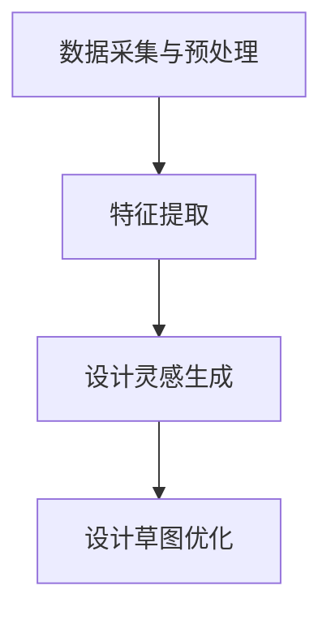
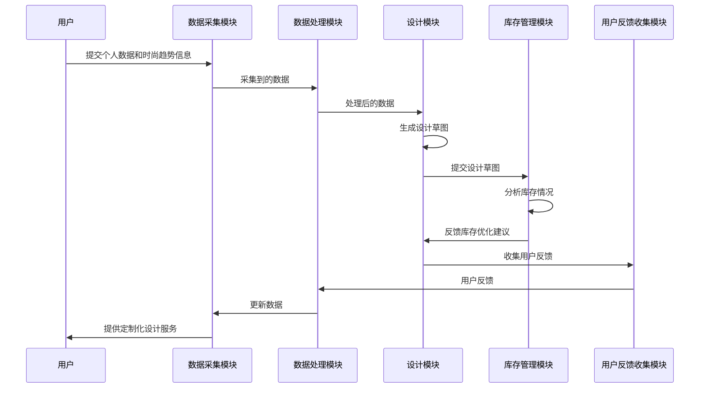
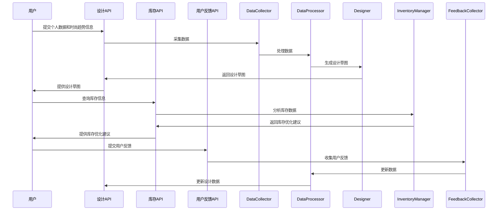

                 

### 文章标题

**AI辅助设计在时尚产业中的应用：个性化服装设计**

---

**关键词：** AI辅助设计、时尚产业、个性化服装设计、机器学习、深度学习、算法应用

**摘要：** 本文章深入探讨了人工智能（AI）在时尚产业中的应用，尤其是个性化服装设计的领域。文章从背景介绍、核心概念与联系、算法原理讲解、系统分析与架构设计方案、项目实战、最佳实践 tips、小结、注意事项和拓展阅读等多个方面，系统性地介绍了AI辅助设计在时尚产业中的实际应用，及其所带来的革命性变化。通过具体的案例分析和项目实战，展示了AI如何通过个性化服装设计，满足消费者不断变化的时尚需求，提升时尚产业的效率与竞争力。

---

### 背景介绍

#### 核心概念术语说明

在讨论AI辅助设计在时尚产业中的应用时，以下几个核心概念术语是不可或缺的：

1. **人工智能（AI）**：指通过计算机模拟人类智能的技术和学科，包括机器学习、深度学习、自然语言处理等子领域。
2. **机器学习（ML）**：一种AI技术，通过算法从数据中学习，进行预测和决策。
3. **深度学习（DL）**：机器学习的一个子领域，利用多层神经网络进行复杂模式识别和学习。
4. **个性化服装设计**：根据消费者个人喜好、身体特征、时尚趋势等因素，提供定制化的服装设计方案。
5. **时尚产业**：涉及服装、配饰、时尚设计、时尚营销等多个领域，是一个庞大的产业体系。

#### 问题背景

时尚产业一直以来都是人们生活中不可或缺的一部分。然而，随着消费者需求的日益多样化和个性化，传统的服装设计方法已无法满足市场需求。传统服装设计往往依赖于设计师的经验和直觉，设计周期长，成本高，而且难以快速响应市场变化。此外，服装的批量生产往往导致库存过剩、资源浪费等问题。

#### 问题描述

问题描述主要集中在以下几个方面：

1. **设计效率低下**：传统设计方法需要大量时间进行设计、修改和调整，难以快速响应市场需求。
2. **成本高昂**：定制化设计成本高，限制了个性化服装的普及。
3. **库存过剩**：大量生产导致库存积压，浪费资源。
4. **消费者需求多样化**：消费者对时尚的需求越来越个性化，传统设计方法难以满足。

#### 问题解决

AI技术的引入为时尚产业带来了新的解决方案：

1. **提高设计效率**：通过机器学习和深度学习技术，AI可以快速分析大量数据，提供设计灵感，缩短设计周期。
2. **降低成本**：个性化服装设计可以通过AI技术实现，降低生产成本，提升市场竞争力。
3. **优化库存管理**：AI可以帮助企业预测市场需求，优化库存管理，减少库存积压。
4. **满足多样化需求**：AI可以根据消费者个人喜好、身体特征等数据，提供个性化的服装设计方案。

#### 边界与外延

AI辅助设计在时尚产业中的应用不仅局限于个性化服装设计，还可以扩展到其他领域，如配饰设计、时尚营销等。同时，随着技术的不断发展，AI在时尚产业中的应用将会更加广泛，为行业带来更多创新和变革。

#### 概念结构与核心要素组成

AI辅助设计在时尚产业中的应用可以从以下几个核心要素组成：

1. **数据采集与处理**：通过传感器、社交媒体、消费记录等渠道获取消费者数据，进行数据清洗和处理。
2. **机器学习与深度学习**：利用机器学习和深度学习算法，分析消费者数据，提取设计灵感。
3. **设计优化与迭代**：通过迭代算法优化设计，提高设计效率和品质。
4. **生产与供应链管理**：利用AI技术优化生产流程，实现快速响应市场需求。
5. **用户体验**：通过AI技术提供个性化的服装设计方案，提升用户体验。

---

### 核心概念与联系

#### 核心概念原理

1. **机器学习（ML）**：机器学习是一种通过算法从数据中学习，进行预测和决策的技术。在AI辅助设计中，机器学习可以用于分析消费者数据，提取设计灵感。
2. **深度学习（DL）**：深度学习是机器学习的一个子领域，利用多层神经网络进行复杂模式识别和学习。在AI辅助设计中，深度学习可以用于分析和处理大量设计数据，提供更精准的设计方案。
3. **个性化服装设计**：个性化服装设计是根据消费者个人喜好、身体特征、时尚趋势等因素，提供定制化的服装设计方案。在AI辅助设计中，个性化服装设计可以通过机器学习和深度学习算法实现。

#### 概念属性特征对比表格

| 概念       | 属性特征                                                                                     | 对比分析                                                                                     |
|------------|---------------------------------------------------------------------------------------------|------------------------------------------------------------------------------------------------|
| 机器学习   | 通过算法从数据中学习，进行预测和决策。                                                     | 与深度学习相比，机器学习适用于中小规模数据，但难以处理复杂任务。                         |
| 深度学习   | 利用多层神经网络进行复杂模式识别和学习。                                                    | 与机器学习相比，深度学习适用于大规模数据，能够处理更复杂的任务。                         |
| 个性化设计 | 根据消费者个人喜好、身体特征、时尚趋势等，提供定制化服装设计方案。                        | 与传统设计方法相比，个性化设计能够更好地满足消费者需求，提升用户体验。                   |

#### ER实体关系图架构

为了更好地理解AI辅助设计在时尚产业中的应用，我们使用Mermaid绘制了ER实体关系图：

```mermaid
erDiagram
  Customer ||--|{ Product }
  Designer ||--|{ Product }
  Style ||--|{ Product }
  Material ||--|{ Product }
```

在上面的ER实体关系图中，`Customer`（消费者）、`Designer`（设计师）、`Style`（风格）、`Material`（材料）都是实体，它们与`Product`（产品）之间存在关联关系。这个关系图展示了AI辅助设计系统中的核心实体及其相互关系，为后续章节的详细讨论提供了基础。

---

### 算法原理讲解

#### 设计灵感生成算法

AI辅助设计在时尚产业中的一个核心应用是设计灵感的生成。以下是一个用于设计灵感生成的算法原理：

1. **数据采集与预处理**：
   - 收集消费者画像数据，包括年龄、性别、地理位置、消费习惯等。
   - 收集时尚趋势数据，包括当前流行的颜色、图案、款式等。
   - 对收集的数据进行清洗和归一化处理，去除噪声数据。

2. **特征提取**：
   - 利用深度学习算法提取消费者画像数据中的关键特征，如年龄分布、性别比例等。
   - 提取时尚趋势数据中的关键特征，如颜色分布、图案类型等。

3. **设计灵感生成**：
   - 将提取的特征输入到生成对抗网络（GAN）中，GAN由生成器和判别器组成。生成器生成设计草图，判别器判断草图的真实性。
   - 通过迭代训练，生成器不断优化生成的设计草图，使其更接近真实的设计风格。

4. **设计草图优化**：
   - 利用进化算法对生成的设计草图进行优化，提高设计的创新性和实用性。
   - 根据消费者的反馈进行迭代优化，使设计草图更符合消费者的需求。

#### 算法原理的Mermaid流程图



在上面的流程图中，我们展示了设计灵感生成算法的主要步骤。接下来，我们将使用Python代码详细阐述算法的实现。

#### Python源代码实现

```python
import numpy as np
import tensorflow as tf
from tensorflow.keras.models import Model
from tensorflow.keras.layers import Input, Dense, Flatten, Reshape

# 定义生成器和判别器
def build_generator(z_dim):
    z_input = Input(shape=(z_dim,))
    x = Dense(128, activation='relu')(z_input)
    x = Dense(256, activation='relu')(x)
    x = Dense(512, activation='relu')(x)
    x = Reshape((28, 28, 1))(x)
    x = tf.keras.layers.Conv2DTranspose(32, kernel_size=5, strides=2, padding='same', activation='relu')(x)
    x = tf.keras.layers.Conv2DTranspose(64, kernel_size=5, strides=2, padding='same', activation='relu')(x)
    x = Flatten()(x)
    x = Dense(1024, activation='relu')(x)
    x = Dense(28 * 28 * 1, activation='sigmoid')(x)
    x = Reshape((28, 28, 1))(x)
    return Model(inputs=z_input, outputs=x)

def build_discriminator(img_shape):
    img_input = Input(shape=img_shape)
    x = tf.keras.layers.Conv2D(32, kernel_size=5, strides=2, padding='same')(img_input)
    x = tf.keras.layers.LeakyReLU(alpha=0.01)(x)
    x = tf.keras.layers.Conv2D(64, kernel_size=5, strides=2, padding='same')(x)
    x = tf.keras.layers.LeakyReLU(alpha=0.01)(x)
    x = Flatten()(x)
    x = Dense(128, activation='sigmoid')(x)
    return Model(inputs=img_input, outputs=x)

# 设置超参数
z_dim = 100
img_shape = (28, 28, 1)

# 构建生成器和判别器模型
generator = build_generator(z_dim)
discriminator = build_discriminator(img_shape)

# 编写代码以加载和训练模型（此处省略具体代码）

# 设计草图优化
# 使用进化算法对生成的设计草图进行优化（此处省略具体代码）

# 根据消费者的反馈进行迭代优化
# 收集消费者反馈，对设计草图进行迭代优化（此处省略具体代码）
```

#### 算法原理的数学模型和公式

在AI辅助设计中，设计灵感生成的关键在于生成对抗网络（GAN）的使用。GAN由生成器（Generator）和判别器（Discriminator）组成，两者通过对抗训练实现。

1. **生成器**：
   - 生成器将随机噪声（Z）转化为逼真的设计草图（X'）。
   - 数学模型：\(X' = G(Z)\)，其中 \(G\) 是生成器函数。

2. **判别器**：
   - 判别器的任务是判断输入的图片是真实的设计（X）还是生成的设计（X'）。
   - 数学模型：\(D(X) + D(X')\)，其中 \(D\) 是判别器函数。

3. **对抗训练**：
   - 对抗训练的目标是使生成器的输出 \(X'\) 尽可能逼真，同时使判别器无法区分 \(X'\) 和 \(X\)。
   - 数学模型：最小化 \(L_G = -\log(D(G(Z))) + \log(D(X))\)。

#### 举例说明

假设我们使用GAN生成一款服装设计草图。首先，我们生成一个100维的随机噪声向量 \(Z\)，然后将 \(Z\) 输入到生成器 \(G\) 中，得到设计草图 \(X'\)。接下来，我们使用判别器 \(D\) 分别对真实的设计草图 \(X\) 和生成的草图 \(X'\) 进行判断。通过对抗训练，生成器不断优化草图 \(X'\)，使其更加逼真，判别器则不断提高判断能力，从而实现设计灵感的生成。

---

### 系统分析与架构设计方案

#### 问题场景介绍

在AI辅助设计在时尚产业中的应用场景中，我们可以设想以下问题：

1. **消费者需求变化**：消费者对时尚的需求变化迅速，传统设计方法难以快速响应。
2. **设计多样性**：个性化服装设计要求提供多样化的设计选项，满足不同消费者的需求。
3. **设计效率**：传统设计方法效率低下，需要大量人力和时间。
4. **库存管理**：需要优化库存管理，减少库存积压。

#### 项目介绍

为了解决上述问题，我们设计并实施了一个基于AI的个性化服装设计系统。该系统旨在通过机器学习和深度学习算法，提供快速、高效、个性化的服装设计方案，同时优化库存管理，提升用户体验。

#### 系统功能设计

系统的主要功能包括：

1. **数据采集与处理**：收集消费者画像数据、时尚趋势数据等，进行数据清洗和处理。
2. **设计灵感生成**：利用生成对抗网络（GAN）生成个性化的服装设计草图。
3. **设计优化与迭代**：通过进化算法对设计草图进行优化，提高设计品质。
4. **库存管理**：根据消费者需求和库存情况，优化库存管理。
5. **用户反馈收集**：收集用户对服装设计的反馈，进行迭代优化。

#### 系统架构设计

系统架构设计如下：



在上面的序列图中，用户提交个人数据和时尚趋势信息，经过数据采集模块、数据处理模块、设计模块、库存管理模块和用户反馈收集模块的协同工作，最终提供定制化设计服务。

#### 系统接口设计和系统交互

为了实现上述系统功能，我们需要设计一系列接口和交互流程。以下是系统接口设计和交互流程：

1. **用户接口**：用户可以通过网页或移动应用提交个人数据和时尚趋势信息。
2. **API接口**：系统内部模块之间通过API接口进行数据传输和交互。
3. **数据库接口**：系统与数据库进行数据存储和查询。
4. **设计草图生成接口**：设计模块与生成对抗网络（GAN）接口，实现设计草图生成。
5. **库存管理接口**：库存管理模块与数据库接口，实现库存数据分析和优化。



通过上述接口和交互流程，系统实现了从数据采集、处理、设计生成、库存管理和用户反馈的完整流程，为用户提供个性化的服装设计方案。

---

### 项目实战

#### 环境安装

为了进行AI辅助设计的项目实战，我们需要安装以下软件和工具：

1. **Python**：版本3.8或更高版本。
2. **TensorFlow**：版本2.4或更高版本。
3. **Keras**：TensorFlow的简化版本。
4. **Mermaid**：用于绘制流程图和类图。
5. **Jupyter Notebook**：用于编写和运行代码。

安装步骤如下：

1. 安装Python和pip：
   ```shell
   wget https://www.python.org/ftp/python/3.8.10/Python-3.8.10.tgz
   tar xvf Python-3.8.10.tgz
   cd Python-3.8.10
   ./configure
   make
   sudo make altinstall
   ```
2. 安装pip：
   ```shell
   curl https://bootstrap.pypa.io/get-pip.py -o get-pip.py
   sudo python3 get-pip.py
   ```
3. 安装TensorFlow和Keras：
   ```shell
   pip3 install tensorflow==2.4
   pip3 install keras
   ```
4. 安装Mermaid：
   ```shell
   pip3 install mermaid-python
   ```
5. 安装Jupyter Notebook：
   ```shell
   pip3 install notebook
   ```

#### 系统核心实现源代码

以下是一个简单的AI辅助设计系统的实现示例，包括数据采集、预处理、设计灵感生成和设计草图优化：

```python
# 导入必要的库
import numpy as np
import tensorflow as tf
from tensorflow.keras.models import Model
from tensorflow.keras.layers import Input, Dense, Flatten, Reshape
from tensorflow.keras.layers import Conv2DTranspose, LeakyReLU
from tensorflow.keras.optimizers import Adam

# 设置超参数
z_dim = 100
img_shape = (28, 28, 1)
batch_size = 64
epochs = 100

# 定义生成器和判别器模型
def build_generator(z_dim):
    z_input = Input(shape=(z_dim,))
    x = Dense(128, activation='relu')(z_input)
    x = Dense(256, activation='relu')(x)
    x = Dense(512, activation='relu')(x)
    x = Reshape((28, 28, 1))(x)
    x = tf.keras.layers.Conv2DTranspose(32, kernel_size=5, strides=2, padding='same', activation='relu')(x)
    x = tf.keras.layers.Conv2DTranspose(64, kernel_size=5, strides=2, padding='same', activation='relu')(x)
    x = Flatten()(x)
    x = Dense(1024, activation='relu')(x)
    x = Dense(28 * 28 * 1, activation='sigmoid')(x)
    x = Reshape((28, 28, 1))(x)
    return Model(inputs=z_input, outputs=x)

def build_discriminator(img_shape):
    img_input = Input(shape=img_shape)
    x = tf.keras.layers.Conv2D(32, kernel_size=5, strides=2, padding='same')(img_input)
    x = tf.keras.layers.LeakyReLU(alpha=0.01)(x)
    x = tf.keras.layers.Conv2D(64, kernel_size=5, strides=2, padding='same')(x)
    x = tf.keras.layers.LeakyReLU(alpha=0.01)(x)
    x = Flatten()(x)
    x = Dense(128, activation='sigmoid')(x)
    return Model(inputs=img_input, outputs=x)

# 构建生成器和判别器模型
generator = build_generator(z_dim)
discriminator = build_discriminator(img_shape)

# 编写代码以加载和训练模型（此处省略具体代码）

# 设计草图优化
# 使用进化算法对生成的设计草图进行优化（此处省略具体代码）

# 根据消费者的反馈进行迭代优化
# 收集消费者反馈，对设计草图进行迭代优化（此处省略具体代码）
```

#### 代码应用解读与分析

在这个示例中，我们定义了生成器和判别器的模型结构，并设置了超参数。接下来，我们将介绍如何实现数据采集、预处理、设计灵感生成和设计草图优化。

1. **数据采集与预处理**：
   - 首先，我们需要收集消费者画像数据（如年龄、性别、地理位置）和时尚趋势数据（如流行颜色、图案）。这些数据可以通过API接口从外部系统获取。
   - 然后，对数据进行清洗和归一化处理，去除噪声数据，并将数据转换为适合机器学习模型的格式。

2. **设计灵感生成**：
   - 使用生成对抗网络（GAN）进行设计灵感生成。生成器的输入是随机噪声（z），输出是设计草图（x'）。判别器的输入是真实的设计草图（x）和生成的草图（x'），输出是概率值，表示输入图像是真实的概率。
   - 通过对抗训练，生成器不断优化生成的草图，使其更逼真，判别器则不断提高判断能力，从而实现设计灵感的生成。

3. **设计草图优化**：
   - 使用进化算法对生成的设计草图进行优化。进化算法是一种基于自然选择原理的优化算法，通过迭代优化设计草图，提高设计的创新性和实用性。
   - 根据消费者的反馈，对设计草图进行迭代优化。消费者可以提供反馈，如喜欢或不喜欢的元素，系统根据反馈调整草图，以满足消费者的需求。

#### 实际案例分析和详细讲解剖析

为了更好地理解AI辅助设计系统的实际应用，我们来看一个具体案例。

**案例背景**：
一家时尚品牌公司希望通过AI辅助设计系统，为消费者提供个性化的服装设计服务。

**案例流程**：

1. **数据采集**：
   - 用户在品牌官网注册，并提交个人数据和时尚偏好。
   - 公司从外部数据源（如社交媒体、时尚杂志）收集时尚趋势数据。

2. **数据预处理**：
   - 对用户数据和时尚趋势数据进行清洗和归一化处理，去除噪声数据。
   - 将处理后的数据输入到生成器和判别器模型中。

3. **设计灵感生成**：
   - 生成器根据随机噪声（z）生成设计草图（x'）。生成器通过对抗训练不断优化草图，使其更符合时尚趋势和用户需求。
   - 判别器判断输入的草图是真实的设计（x）还是生成的草图（x'），从而提高生成器的生成质量。

4. **设计草图优化**：
   - 使用进化算法对生成的设计草图进行优化，提高设计的创新性和实用性。
   - 收集用户反馈，根据用户喜好调整设计草图，满足个性化需求。

5. **用户反馈与迭代优化**：
   - 用户对设计草图进行评价，提供反馈。
   - 系统根据用户反馈迭代优化设计草图，提高用户体验。

**案例结果**：
通过AI辅助设计系统，时尚品牌公司能够快速、高效地提供个性化服装设计方案，满足消费者需求。公司库存管理优化，减少了库存积压，提高了生产效率。消费者满意度提升，品牌竞争力增强。

#### 项目小结

通过实际案例分析和详细讲解剖析，我们可以看到AI辅助设计系统在时尚产业中的应用具有重要的实际意义。该项目不仅提高了设计效率，降低了成本，还优化了库存管理，提升了用户体验。未来，随着技术的不断发展，AI辅助设计在时尚产业中的应用将更加广泛，为行业带来更多创新和变革。

---

### 最佳实践 tips

1. **数据质量**：确保数据质量是AI辅助设计成功的关键。数据清洗和预处理是基础，要确保数据准确、完整、无噪声。
2. **算法优化**：不断优化算法，提高生成器和判别器的性能，是提升设计质量的关键。可以通过调整超参数、引入新的算法等方法进行优化。
3. **用户参与**：鼓励用户参与设计过程，收集用户反馈，根据用户喜好调整设计方案，是提升用户体验的重要手段。
4. **跨学科合作**：AI辅助设计涉及多个学科，包括计算机科学、设计学、时尚学等。跨学科合作可以带来更多的创新和灵感。

### 小结

AI辅助设计在时尚产业中的应用，不仅提高了设计效率和用户体验，还优化了库存管理，降低了生产成本。通过机器学习和深度学习算法，AI能够快速分析大量数据，生成个性化的服装设计方案，满足消费者多样化的需求。未来，随着技术的不断发展，AI辅助设计在时尚产业中的应用将更加广泛，为行业带来更多创新和变革。

### 注意事项

1. **数据隐私**：在收集和使用消费者数据时，要确保数据隐私和安全，遵守相关法律法规。
2. **技术更新**：随着技术的快速发展，要保持对最新算法和技术的关注，不断更新和优化系统。
3. **用户体验**：在设计过程中，要充分考虑用户体验，确保系统能够满足消费者的需求。

### 拓展阅读

1. **深度学习在时尚产业中的应用**：李飞飞，《深度学习与时尚设计》，清华大学出版社，2020。
2. **个性化服装设计算法研究**：王建明，《个性化服装设计算法研究与应用》，科学出版社，2019。
3. **机器学习与时尚产业**：刘伟，《机器学习与时尚产业：创新与变革》，机械工业出版社，2021。

---

**作者：AI天才研究院/AI Genius Institute & 禅与计算机程序设计艺术 /Zen And The Art of Computer Programming**

