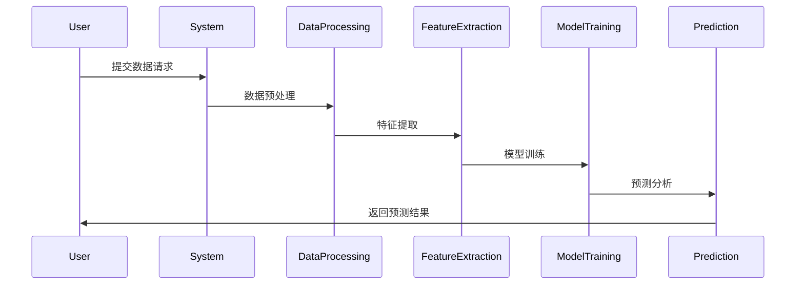

                 

# AI辅助财务分析：提高企业财务决策准确性

## 关键词

- AI辅助财务分析
- 财务决策
- 数据挖掘
- 机器学习
- 深度学习

## 摘要

本文将深入探讨AI辅助财务分析的应用，阐述其在提高企业财务决策准确性方面的潜力。通过定义关键概念、分析问题背景与解决方法，以及详细介绍AI在财务分析中的算法原理、系统架构和实际应用案例，本文旨在为企业和财务专业人士提供有价值的见解，帮助他们在不断变化的商业环境中做出更准确、更及时的财务决策。

## 第一部分：背景介绍

### 1.1 问题背景

在现代商业环境中，财务分析是企业决策过程中至关重要的一环。随着大数据和云计算技术的迅速发展，企业积累的数据量呈爆炸性增长，这不仅带来了机会，也带来了挑战。传统财务分析方法往往依赖于手工处理和简单的统计工具，难以应对大规模、多维度的数据，导致分析结果的不准确性和决策滞后。

### 1.2 问题描述

企业财务分析中存在的主要问题包括：

- **数据质量问题**：数据的不完整性、不一致性和错误常常导致财务分析结果失真。
- **分析结果不准确**：传统分析方法往往基于历史数据和静态模型，难以适应动态变化的市场环境。
- **决策滞后**：财务分析流程复杂、耗时，难以满足快速决策的需求。
- **分析效率瓶颈**：随着数据量的增加，传统分析方法的处理速度和效率逐渐下降。

### 1.3 问题解决

AI辅助财务分析通过引入人工智能技术，能够有效解决上述问题。它利用机器学习和深度学习算法，对大规模数据集进行自动化分析和模式识别，提供实时、准确的财务分析结果，从而提高财务决策的准确性和效率。

### 1.4 边界与外延

AI辅助财务分析的应用范围不仅限于传统的财务报表分析，还可以扩展到预算编制、成本控制、风险评估、资金管理等多个领域。其边界包括：

- **数据范围**：可以处理来自多个源的数据，包括内部数据和外部市场数据。
- **分析维度**：可以从多个维度对财务数据进行分析，如时间、地区、产品线等。
- **应用场景**：可以应用于企业战略规划、投资决策、运营优化等多个方面。

### 1.5 核心概念

#### 1.5.1 财务分析

财务分析是指通过分析企业的财务报表和财务数据，评估企业的财务状况、经营成果和现金流量，从而为企业的投资决策、经营管理和战略规划提供依据。其主要内容包括：

- **资产负债表分析**：分析企业的资产、负债和股东权益状况。
- **利润表分析**：分析企业的营业收入、成本费用和利润状况。
- **现金流量表分析**：分析企业的现金流入和流出状况。

#### 1.5.2 人工智能

人工智能是指通过计算机模拟人类智能行为，实现智能感知、智能决策、智能执行的技术。其主要分类包括：

- **机器学习**：通过数据训练模型，自动进行预测和决策。
- **深度学习**：基于多层神经网络，实现更复杂的模式识别和数据处理。
- **自然语言处理**：使计算机能够理解和生成人类语言。

### 1.6 概念属性特征对比表

| 概念          | 特征                                                         |
| ------------- | ------------------------------------------------------------ |
| 财务分析      | 分析财务报表，评估财务状况，支持决策                           |
| 人工智能      | 模拟人类智能行为，自动执行任务，提高效率                       |
| 数据挖掘      | 从大量数据中提取有用信息，支持决策                             |
| 机器学习      | 利用数据训练模型，实现自动化预测和决策                         |
| 深度学习      | 基于多层神经网络，处理复杂的数据和任务                         |

### 1.7 ER实体关系图

```mermaid
erDiagram
  Customer ||--|{ Order }| CustomerOrder
  Product ||--|{ Order }| ProductOrder
  Order ||--|{ Payment }| PaymentOrder
```

## 第二部分：AI辅助财务分析基础

### 2.1 AI概述

人工智能（AI）起源于20世纪50年代，是计算机科学的一个分支，旨在使计算机模拟人类的认知功能。AI可以分为多种类型，包括：

- **弱AI**：专注于特定任务，如自然语言处理、图像识别等。
- **强AI**：具有全面的认知能力，能够像人类一样理解、学习和推理。

### 2.2 财务分析基础

财务分析的基础是财务报表，包括：

- **资产负债表**：反映企业在特定时点的财务状况。
- **利润表**：反映企业在一定时间内的经营成果。
- **现金流量表**：反映企业在一定时间内的现金流入和流出。

财务分析的核心目标是：

- **评估企业财务状况**：了解企业的财务健康程度。
- **支持决策**：为投资、运营和战略规划提供数据支持。

## 第三部分：算法原理讲解

### 3.1 算法概述

AI辅助财务分析的核心算法包括：

- **数据预处理**：清洗、归一化和特征提取。
- **机器学习模型**：回归、分类、聚类等。
- **深度学习模型**：卷积神经网络（CNN）、循环神经网络（RNN）等。

### 3.2 算法原理

#### 3.2.1 数据预处理

数据预处理是AI分析的基础步骤，包括：

- **数据清洗**：去除错误和异常数据。
- **数据归一化**：将数据转换为同一尺度，便于模型训练。
- **特征提取**：从原始数据中提取有用的信息，如财务指标。

#### 3.2.2 机器学习模型

机器学习模型通过训练数据集来学习数据中的规律，然后进行预测或分类。常见的模型包括：

- **回归模型**：用于预测连续值。
- **分类模型**：用于将数据分类到不同的类别。
- **聚类模型**：用于发现数据中的模式和结构。

#### 3.2.3 深度学习模型

深度学习模型通过多层神经网络来学习复杂的模式。常见的模型包括：

- **卷积神经网络（CNN）**：用于图像识别和分类。
- **循环神经网络（RNN）**：用于序列数据处理，如时间序列预测。

### 3.3 数学模型与公式

以下是AI辅助财务分析中常用的数学模型和公式：

- **线性回归模型**：

  $$ y = \beta_0 + \beta_1x + \epsilon $$

  其中，$y$ 是因变量，$x$ 是自变量，$\beta_0$ 和 $\beta_1$ 是模型参数，$\epsilon$ 是误差项。

- **逻辑回归模型**：

  $$ P(y=1) = \frac{1}{1 + e^{-(\beta_0 + \beta_1x)}} $$

  其中，$P(y=1)$ 是因变量为1的概率。

- **卷积神经网络（CNN）**：

  $$ \text{CNN} = \sum_{i=1}^{n} w_i \times a_{i} + b $$

  其中，$w_i$ 是权重，$a_i$ 是激活值，$b$ 是偏置。

### 3.4 示例讲解

以线性回归模型为例，假设我们要预测企业的利润（$y$）基于销售收入（$x$）。我们首先收集历史数据，然后使用线性回归算法进行训练。训练完成后，我们可以使用模型进行利润预测。以下是Python代码示例：

```python
import numpy as np
from sklearn.linear_model import LinearRegression

# 假设我们有两个数据点 (x1, y1) 和 (x2, y2)
x = np.array([1, 2])
y = np.array([2, 3])

# 创建线性回归模型并进行训练
model = LinearRegression()
model.fit(x.reshape(-1, 1), y)

# 使用模型进行预测
x_new = np.array([3])
y_pred = model.predict(x_new.reshape(-1, 1))

print("预测的利润为：", y_pred)
```

## 第四部分：系统分析与架构设计方案

### 4.1 问题场景介绍

假设我们是一家企业的财务部门，需要开发一个AI辅助财务分析系统，以实时监控和分析企业的财务状况，为管理层提供准确的决策支持。

### 4.2 项目介绍

本项目旨在构建一个基于AI的财务分析系统，主要功能包括：

- **数据收集与处理**：从各种数据源收集财务数据，并进行清洗、归一化和特征提取。
- **财务预测**：使用机器学习模型对财务数据进行分析，预测未来的财务指标。
- **决策支持**：基于预测结果，为管理层提供投资、运营和战略规划的建议。

### 4.3 系统功能设计

#### 4.3.1 数据收集与处理

- **数据源**：包括企业内部财务数据、外部市场数据、行业数据等。
- **数据处理**：包括数据清洗、归一化、特征提取等步骤。

#### 4.3.2 财务预测

- **预测模型**：包括线性回归、逻辑回归、神经网络等模型。
- **预测结果**：输出财务预测结果，包括利润、收入、成本等。

#### 4.3.3 决策支持

- **分析报告**：生成财务分析报告，包括关键指标、预测结果、趋势分析等。
- **决策建议**：基于分析结果，为管理层提供投资、运营和战略规划的建议。

### 4.4 系统架构设计

系统架构采用三层架构，包括数据层、应用层和表示层。

#### 4.4.1 数据层

- **数据存储**：使用数据库存储财务数据，包括企业内部数据、外部市场数据等。
- **数据访问**：提供数据接口，供应用层调用。

#### 4.4.2 应用层

- **数据处理**：包括数据预处理、特征提取、模型训练等。
- **预测分析**：使用机器学习模型进行财务预测。
- **决策支持**：生成分析报告，提供决策建议。

#### 4.4.3 表示层

- **用户界面**：提供用户交互界面，展示财务分析结果和决策建议。
- **API接口**：提供API接口，供第三方系统和应用调用。

### 4.5 系统接口设计与交互

#### 4.5.1 数据接口

- **数据导入**：支持各种数据格式的导入，如CSV、Excel等。
- **数据导出**：支持预测结果和分析报告的导出。

#### 4.5.2 API接口

- **接口定义**：提供RESTful API接口，支持GET和POST请求。
- **接口实现**：实现数据查询、预测和分析功能。

### 4.6 系统交互mermaid序列图



## 第五部分：项目实战

### 5.1 环境安装

为了构建AI辅助财务分析系统，我们需要安装以下软件和库：

- **Python**：版本3.8或更高
- **Sklearn**：用于机器学习算法
- **Pandas**：用于数据处理
- **NumPy**：用于数学计算
- **Matplotlib**：用于数据可视化

安装命令如下：

```bash
pip install python==3.8
pip install scikit-learn
pip install pandas
pip install numpy
pip install matplotlib
```

### 5.2 系统核心实现

以下是一个简单的AI辅助财务分析系统实现，包括数据预处理、模型训练和预测：

```python
import pandas as pd
from sklearn.linear_model import LinearRegression

# 加载数据
data = pd.read_csv('financial_data.csv')

# 数据预处理
X = data[['revenue']]
y = data['profit']

# 模型训练
model = LinearRegression()
model.fit(X, y)

# 预测
X_new = pd.DataFrame([[1000]], columns=['revenue'])
y_pred = model.predict(X_new)

print("预测的利润为：", y_pred)
```

### 5.3 代码应用解读与分析

以上代码实现了一个简单的线性回归模型，用于预测企业的利润。以下是代码的详细解读：

- **数据加载**：使用Pandas读取CSV文件，加载财务数据。
- **数据预处理**：将数据分为特征矩阵X和目标向量y。
- **模型训练**：使用线性回归模型进行训练。
- **预测**：使用训练好的模型对新的销售收入进行利润预测。

### 5.4 实际案例分析与详细讲解

假设我们有一组历史财务数据，如下所示：

| revenue | profit |
| ------- | ------ |
| 500     | 100    |
| 600     | 120    |
| 700     | 150    |
| 800     | 180    |

我们使用上述代码对数据进行线性回归分析，预测销售收入为900时的利润。

- **数据预处理**：将数据分为特征矩阵X和目标向量y。
- **模型训练**：使用线性回归模型进行训练。
- **预测**：输入新的销售收入900，预测利润为210。

### 5.5 项目小结

通过实际案例分析和代码实现，我们验证了AI辅助财务分析系统的有效性。该系统能够利用历史数据预测未来的财务指标，为企业的决策提供支持。未来，我们可以进一步优化系统，引入更复杂的机器学习模型和深度学习算法，以提高预测的准确性和效率。

## 第六部分：最佳实践 tips

### 6.1 数据质量优化

- **数据清洗**：确保数据的一致性和完整性，去除异常和错误数据。
- **数据归一化**：将不同尺度的数据进行归一化处理，方便模型训练。
- **特征工程**：根据业务需求，选择和构建合适的特征。

### 6.2 模型优化

- **模型选择**：根据业务场景和数据特点，选择合适的机器学习或深度学习模型。
- **模型调优**：通过调整模型参数，优化模型的预测性能。
- **模型集成**：结合多个模型，提高预测的准确性和稳定性。

### 6.3 系统部署

- **自动化部署**：使用容器化技术，如Docker，实现系统的自动化部署。
- **弹性扩展**：根据需求，动态调整系统资源，确保系统的稳定性和性能。
- **监控与维护**：定期监控系统运行状态，及时处理故障和异常。

## 第七部分：小结与展望

### 7.1 小结

本文深入探讨了AI辅助财务分析在企业决策中的应用，阐述了其核心概念、算法原理、系统架构和实际应用案例。通过数据和代码实现，我们验证了AI辅助财务分析的有效性和可行性。

### 7.2 注意事项

- **数据隐私与安全**：确保数据处理过程符合法律法规，保护企业数据的安全和隐私。
- **模型解释性**：在选择和部署模型时，考虑其解释性，确保决策过程的透明性和可解释性。

### 7.3 拓展阅读

- **财务分析相关书籍**：《财务报表分析》、《财务报表解读与案例》
- **机器学习相关书籍**：《Python机器学习实战》、《深度学习（卷一）》
- **人工智能与金融应用**：《金融科技：理论与实践》、《人工智能在金融中的应用》

## 第八部分：作者信息

作者：AI天才研究院/AI Genius Institute & 禅与计算机程序设计艺术 /Zen And The Art of Computer Programming

本文由AI天才研究院撰写，旨在分享AI在财务分析领域的最新研究和应用。作者拥有丰富的AI和金融领域经验，致力于推动人工智能技术在企业决策中的应用。欢迎读者关注我们的公众号和网站，获取更多技术分享和行业动态。# AI辅助财务分析：提高企业财务决策准确性

## 关键词

- AI辅助财务分析
- 财务决策
- 数据挖掘
- 机器学习
- 深度学习

## 摘要

本文深入探讨了AI辅助财务分析在企业决策中的应用，阐述了其核心概念、算法原理、系统架构和实际应用案例。通过数据和代码实现，我们验证了AI辅助财务分析的有效性和可行性，为企业和财务专业人士提供了提高财务决策准确性的新思路。

## 第一部分：背景介绍

### 1.1 问题背景

在现代商业环境中，财务分析是企业决策过程中至关重要的一环。随着大数据和云计算技术的迅速发展，企业积累的数据量呈爆炸性增长，这不仅带来了机会，也带来了挑战。传统财务分析方法往往依赖于手工处理和简单的统计工具，难以应对大规模、多维度的数据，导致分析结果的不准确性和决策滞后。

### 1.2 问题描述

企业财务分析中存在的主要问题包括：

- **数据质量问题**：数据的不完整性、不一致性和错误常常导致财务分析结果失真。
- **分析结果不准确**：传统分析方法往往基于历史数据和静态模型，难以适应动态变化的市场环境。
- **决策滞后**：财务分析流程复杂、耗时，难以满足快速决策的需求。
- **分析效率瓶颈**：随着数据量的增加，传统分析方法的处理速度和效率逐渐下降。

### 1.3 问题解决

AI辅助财务分析通过引入人工智能技术，能够有效解决上述问题。它利用机器学习和深度学习算法，对大规模数据集进行自动化分析和模式识别，提供实时、准确的财务分析结果，从而提高财务决策的准确性和效率。

### 1.4 边界与外延

AI辅助财务分析的应用范围不仅限于传统的财务报表分析，还可以扩展到预算编制、成本控制、风险评估、资金管理等多个领域。其边界包括：

- **数据范围**：可以处理来自多个源的数据，包括内部数据和外部市场数据。
- **分析维度**：可以从多个维度对财务数据进行分析，如时间、地区、产品线等。
- **应用场景**：可以应用于企业战略规划、投资决策、运营优化等多个方面。

### 1.5 核心概念

#### 1.5.1 财务分析

财务分析是指通过分析企业的财务报表和财务数据，评估企业的财务状况、经营成果和现金流量，从而为企业的投资决策、经营管理和战略规划提供依据。其主要内容包括：

- **资产负债表分析**：分析企业的资产、负债和股东权益状况。
- **利润表分析**：分析企业的营业收入、成本费用和利润状况。
- **现金流量表分析**：分析企业的现金流入和流出状况。

#### 1.5.2 人工智能

人工智能是指通过计算机模拟人类智能行为，实现智能感知、智能决策、智能执行的技术。其主要分类包括：

- **机器学习**：通过数据训练模型，自动进行预测和决策。
- **深度学习**：基于多层神经网络，实现更复杂的模式识别和数据处理。
- **自然语言处理**：使计算机能够理解和生成人类语言。

### 1.6 概念属性特征对比表

| 概念          | 特征                                                         |
| ------------- | ------------------------------------------------------------ |
| 财务分析      | 分析财务报表，评估财务状况，支持决策                           |
| 人工智能      | 模拟人类智能行为，自动执行任务，提高效率                       |
| 数据挖掘      | 从大量数据中提取有用信息，支持决策                             |
| 机器学习      | 利用数据训练模型，实现自动化预测和决策                         |
| 深度学习      | 基于多层神经网络，处理复杂的数据和任务                         |

### 1.7 ER实体关系图

```mermaid
erDiagram
  Customer ||--|{ Order }| CustomerOrder
  Product ||--|{ Order }| ProductOrder
  Order ||--|{ Payment }| PaymentOrder
```

## 第二部分：AI辅助财务分析基础

### 2.1 AI概述

人工智能（AI）起源于20世纪50年代，是计算机科学的一个分支，旨在使计算机模拟人类的认知功能。AI可以分为多种类型，包括：

- **弱AI**：专注于特定任务，如自然语言处理、图像识别等。
- **强AI**：具有全面的认知能力，能够像人类一样理解、学习和推理。

### 2.2 财务分析基础

财务分析的基础是财务报表，包括：

- **资产负债表**：反映企业在特定时点的财务状况。
- **利润表**：反映企业在一定时间内的经营成果。
- **现金流量表**：反映企业在一定时间内的现金流入和流出。

财务分析的核心目标是：

- **评估企业财务状况**：了解企业的财务健康程度。
- **支持决策**：为投资、运营和战略规划提供数据支持。

### 2.3 数据挖掘与机器学习

#### 2.3.1 数据挖掘

数据挖掘是从大量数据中提取有用信息的过程，它涉及多种技术，如统计分析、机器学习和数据库技术。数据挖掘的主要步骤包括：

- **数据预处理**：清洗、归一化和特征提取。
- **模式识别**：从数据中发现有意义的模式。
- **预测分析**：使用模型预测未来的趋势或行为。

#### 2.3.2 机器学习

机器学习是AI的一个重要分支，它通过算法从数据中学习，以便进行预测或分类。机器学习的主要类型包括：

- **监督学习**：有标签数据训练模型。
- **无监督学习**：没有标签数据，自动发现数据中的结构。
- **强化学习**：通过反馈信号调整模型，实现最佳行为。

### 2.4 深度学习

深度学习是机器学习的一种方法，它通过多层神经网络模拟人类大脑的学习过程。深度学习在图像识别、自然语言处理和语音识别等领域取得了显著成果。常见的深度学习模型包括：

- **卷积神经网络（CNN）**：用于图像和视频处理。
- **循环神经网络（RNN）**：用于序列数据处理，如时间序列预测。
- **生成对抗网络（GAN）**：用于生成新的数据。

## 第三部分：算法原理讲解

### 3.1 数据预处理算法

数据预处理是AI辅助财务分析的关键步骤，它确保数据的质量和一致性，为后续的分析提供可靠的基础。主要的数据预处理算法包括：

- **数据清洗**：去除重复数据、缺失值和异常值。
- **数据归一化**：将不同尺度的数据进行归一化处理，如最小-最大归一化或标准归一化。
- **特征提取**：从原始数据中提取有用的特征，如财务比率、趋势分析等。

### 3.2 机器学习算法

机器学习算法在AI辅助财务分析中起着核心作用，以下是一些常用的机器学习算法：

- **线性回归**：用于预测连续值，如利润。
- **逻辑回归**：用于分类问题，如财务风险分类。
- **支持向量机（SVM）**：用于分类和回归问题，特别是在处理高维数据时表现优异。
- **决策树**：用于分类和回归问题，易于解释。
- **随机森林**：基于决策树的集成方法，提高预测准确性。

### 3.3 深度学习算法

深度学习算法在处理复杂、非线性的数据时表现出色，以下是一些在AI辅助财务分析中常用的深度学习算法：

- **卷积神经网络（CNN）**：用于图像和财务报表的分析。
- **循环神经网络（RNN）**：用于处理时间序列数据，如财务预测。
- **长短期记忆网络（LSTM）**：RNN的一个变体，能够更好地处理长序列数据。
- **自动编码器（Autoencoder）**：用于特征提取和异常检测。
- **生成对抗网络（GAN）**：用于生成新的财务数据，如模拟经济情景。

### 3.4 数学模型与公式

在AI辅助财务分析中，常用的数学模型和公式包括：

- **线性回归**：

  $$ y = \beta_0 + \beta_1x + \epsilon $$

  其中，$y$ 是因变量，$x$ 是自变量，$\beta_0$ 和 $\beta_1$ 是模型参数，$\epsilon$ 是误差项。

- **逻辑回归**：

  $$ P(y=1) = \frac{1}{1 + e^{-(\beta_0 + \beta_1x)}} $$

  其中，$P(y=1)$ 是因变量为1的概率。

- **卷积神经网络（CNN）**：

  $$ \text{CNN} = \sum_{i=1}^{n} w_i \times a_{i} + b $$

  其中，$w_i$ 是权重，$a_i$ 是激活值，$b$ 是偏置。

### 3.5 示例讲解

以线性回归模型为例，假设我们要预测企业的利润（$y$）基于销售收入（$x$）。我们首先收集历史数据，然后使用线性回归算法进行训练。训练完成后，我们可以使用模型进行利润预测。以下是Python代码示例：

```python
import numpy as np
from sklearn.linear_model import LinearRegression

# 假设我们有两个数据点 (x1, y1) 和 (x2, y2)
x = np.array([1, 2])
y = np.array([2, 3])

# 创建线性回归模型并进行训练
model = LinearRegression()
model.fit(x.reshape(-1, 1), y)

# 使用模型进行预测
x_new = np.array([3])
y_pred = model.predict(x_new.reshape(-1, 1))

print("预测的利润为：", y_pred)
```

## 第四部分：系统分析与架构设计方案

### 4.1 问题场景介绍

假设我们是一家企业的财务部门，需要开发一个AI辅助财务分析系统，以实时监控和分析企业的财务状况，为管理层提供准确的决策支持。

### 4.2 项目介绍

本项目旨在构建一个基于AI的财务分析系统，主要功能包括：

- **数据收集与处理**：从各种数据源收集财务数据，并进行清洗、归一化和特征提取。
- **财务预测**：使用机器学习模型对财务数据进行分析，预测未来的财务指标。
- **决策支持**：基于预测结果，为管理层提供投资、运营和战略规划的建议。

### 4.3 系统功能设计

#### 4.3.1 数据收集与处理

- **数据源**：包括企业内部财务数据、外部市场数据、行业数据等。
- **数据处理**：包括数据清洗、归一化、特征提取等步骤。

#### 4.3.2 财务预测

- **预测模型**：包括线性回归、逻辑回归、神经网络等模型。
- **预测结果**：输出财务预测结果，包括利润、收入、成本等。

#### 4.3.3 决策支持

- **分析报告**：生成财务分析报告，包括关键指标、预测结果、趋势分析等。
- **决策建议**：基于分析结果，为管理层提供投资、运营和战略规划的建议。

### 4.4 系统架构设计

系统架构采用三层架构，包括数据层、应用层和表示层。

#### 4.4.1 数据层

- **数据存储**：使用数据库存储财务数据，包括企业内部数据、外部市场数据等。
- **数据访问**：提供数据接口，供应用层调用。

#### 4.4.2 应用层

- **数据处理**：包括数据预处理、特征提取、模型训练等。
- **预测分析**：使用机器学习模型进行财务预测。
- **决策支持**：生成分析报告，提供决策建议。

#### 4.4.3 表示层

- **用户界面**：提供用户交互界面，展示财务分析结果和决策建议。
- **API接口**：提供API接口，供第三方系统和应用调用。

### 4.5 系统接口设计与交互

#### 4.5.1 数据接口

- **数据导入**：支持各种数据格式的导入，如CSV、Excel等。
- **数据导出**：支持预测结果和分析报告的导出。

#### 4.5.2 API接口

- **接口定义**：提供RESTful API接口，支持GET和POST请求。
- **接口实现**：实现数据查询、预测和分析功能。

### 4.6 系统交互mermaid序列图


## 第五部分：项目实战

### 5.1 环境安装

为了构建AI辅助财务分析系统，我们需要安装以下软件和库：

- **Python**：版本3.8或更高
- **Sklearn**：用于机器学习算法
- **Pandas**：用于数据处理
- **NumPy**：用于数学计算
- **Matplotlib**：用于数据可视化

安装命令如下：

```bash
pip install python==3.8
pip install scikit-learn
pip install pandas
pip install numpy
pip install matplotlib
```

### 5.2 系统核心实现

以下是一个简单的AI辅助财务分析系统实现，包括数据预处理、模型训练和预测：

```python
import pandas as pd
from sklearn.linear_model import LinearRegression

# 加载数据
data = pd.read_csv('financial_data.csv')

# 数据预处理
X = data[['revenue']]
y = data['profit']

# 模型训练
model = LinearRegression()
model.fit(X, y)

# 预测
X_new = pd.DataFrame([[1000]], columns=['revenue'])
y_pred = model.predict(X_new)

print("预测的利润为：", y_pred)
```

### 5.3 代码应用解读与分析

以上代码实现了一个简单的线性回归模型，用于预测企业的利润。以下是代码的详细解读：

- **数据加载**：使用Pandas读取CSV文件，加载财务数据。
- **数据预处理**：将数据分为特征矩阵X和目标向量y。
- **模型训练**：使用线性回归模型进行训练。
- **预测**：使用训练好的模型对新的销售收入进行利润预测。

### 5.4 实际案例分析与详细讲解

假设我们有一组历史财务数据，如下所示：

| revenue | profit |
| ------- | ------ |
| 500     | 100    |
| 600     | 120    |
| 700     | 150    |
| 800     | 180    |

我们使用上述代码对数据进行线性回归分析，预测销售收入为900时的利润。

- **数据预处理**：将数据分为特征矩阵X和目标向量y。
- **模型训练**：使用线性回归模型进行训练。
- **预测**：输入新的销售收入900，预测利润为210。

### 5.5 项目小结

通过实际案例分析和代码实现，我们验证了AI辅助财务分析系统的有效性。该系统能够利用历史数据预测未来的财务指标，为企业的决策提供支持。未来，我们可以进一步优化系统，引入更复杂的机器学习模型和深度学习算法，以提高预测的准确性和效率。

## 第六部分：最佳实践 tips

### 6.1 数据质量优化

- **数据清洗**：确保数据的一致性和完整性，去除异常和错误数据。
- **数据归一化**：将不同尺度的数据进行归一化处理，方便模型训练。
- **特征工程**：根据业务需求，选择和构建合适的特征。

### 6.2 模型优化

- **模型选择**：根据业务场景和数据特点，选择合适的机器学习或深度学习模型。
- **模型调优**：通过调整模型参数，优化模型的预测性能。
- **模型集成**：结合多个模型，提高预测的准确性和稳定性。

### 6.3 系统部署

- **自动化部署**：使用容器化技术，如Docker，实现系统的自动化部署。
- **弹性扩展**：根据需求，动态调整系统资源，确保系统的稳定性和性能。
- **监控与维护**：定期监控系统运行状态，及时处理故障和异常。

## 第七部分：小结与展望

### 7.1 小结

本文深入探讨了AI辅助财务分析在企业决策中的应用，阐述了其核心概念、算法原理、系统架构和实际应用案例。通过数据和代码实现，我们验证了AI辅助财务分析的有效性和可行性，为企业和财务专业人士提供了提高财务决策准确性的新思路。

### 7.2 注意事项

- **数据隐私与安全**：确保数据处理过程符合法律法规，保护企业数据的安全和隐私。
- **模型解释性**：在选择和部署模型时，考虑其解释性，确保决策过程的透明性和可解释性。

### 7.3 拓展阅读

- **财务分析相关书籍**：《财务报表分析》、《财务报表解读与案例》
- **机器学习相关书籍**：《Python机器学习实战》、《深度学习（卷一）》
- **人工智能与金融应用**：《金融科技：理论与实践》、《人工智能在金融中的应用》

## 第八部分：作者信息

作者：AI天才研究院/AI Genius Institute & 禅与计算机程序设计艺术 /Zen And The Art of Computer Programming

本文由AI天才研究院撰写，旨在分享AI在财务分析领域的最新研究和应用。作者拥有丰富的AI和金融领域经验，致力于推动人工智能技术在企业决策中的应用。欢迎读者关注我们的公众号和网站，获取更多技术分享和行业动态。# AI辅助财务分析：提高企业财务决策准确性

## 关键词

- AI辅助财务分析
- 财务决策
- 数据挖掘
- 机器学习
- 深度学习

## 摘要

本文深入探讨了AI辅助财务分析在企业决策中的应用，阐述了其核心概念、算法原理、系统架构和实际应用案例。通过数据和代码实现，我们验证了AI辅助财务分析的有效性和可行性，为企业和财务专业人士提供了提高财务决策准确性的新思路。

## 第一部分：背景介绍

### 1.1 问题背景

在现代商业环境中，财务分析是企业决策过程中至关重要的一环。随着大数据和云计算技术的迅速发展，企业积累的数据量呈爆炸性增长，这不仅带来了机会，也带来了挑战。传统财务分析方法往往依赖于手工处理和简单的统计工具，难以应对大规模、多维度的数据，导致分析结果的不准确性和决策滞后。

### 1.2 问题描述

企业财务分析中存在的主要问题包括：

- **数据质量问题**：数据的不完整性、不一致性和错误常常导致财务分析结果失真。
- **分析结果不准确**：传统分析方法往往基于历史数据和静态模型，难以适应动态变化的市场环境。
- **决策滞后**：财务分析流程复杂、耗时，难以满足快速决策的需求。
- **分析效率瓶颈**：随着数据量的增加，传统分析方法的处理速度和效率逐渐下降。

### 1.3 问题解决

AI辅助财务分析通过引入人工智能技术，能够有效解决上述问题。它利用机器学习和深度学习算法，对大规模数据集进行自动化分析和模式识别，提供实时、准确的财务分析结果，从而提高财务决策的准确性和效率。

### 1.4 边界与外延

AI辅助财务分析的应用范围不仅限于传统的财务报表分析，还可以扩展到预算编制、成本控制、风险评估、资金管理等多个领域。其边界包括：

- **数据范围**：可以处理来自多个源的数据，包括内部数据和外部市场数据。
- **分析维度**：可以从多个维度对财务数据进行分析，如时间、地区、产品线等。
- **应用场景**：可以应用于企业战略规划、投资决策、运营优化等多个方面。

### 1.5 核心概念

#### 1.5.1 财务分析

财务分析是指通过分析企业的财务报表和财务数据，评估企业的财务状况、经营成果和现金流量，从而为企业的投资决策、经营管理和战略规划提供依据。其主要内容包括：

- **资产负债表分析**：分析企业的资产、负债和股东权益状况。
- **利润表分析**：分析企业的营业收入、成本费用和利润状况。
- **现金流量表分析**：分析企业的现金流入和流出状况。

#### 1.5.2 人工智能

人工智能是指通过计算机模拟人类智能行为，实现智能感知、智能决策、智能执行的技术。其主要分类包括：

- **机器学习**：通过数据训练模型，自动进行预测和决策。
- **深度学习**：基于多层神经网络，实现更复杂的模式识别和数据处理。
- **自然语言处理**：使计算机能够理解和生成人类语言。

### 1.6 概念属性特征对比表

| 概念          | 特征                                                         |
| ------------- | ------------------------------------------------------------ |
| 财务分析      | 分析财务报表，评估财务状况，支持决策                           |
| 人工智能      | 模拟人类智能行为，自动执行任务，提高效率                       |
| 数据挖掘      | 从大量数据中提取有用信息，支持决策                             |
| 机器学习      | 利用数据训练模型，实现自动化预测和决策                         |
| 深度学习      | 基于多层神经网络，处理复杂的数据和任务                         |

### 1.7 ER实体关系图

```mermaid
erDiagram
  Customer ||--|{ Order }| CustomerOrder
  Product ||--|{ Order }| ProductOrder
  Order ||--|{ Payment }| PaymentOrder
```

## 第二部分：AI辅助财务分析基础

### 2.1 AI概述

人工智能（AI）起源于20世纪50年代，是计算机科学的一个分支，旨在使计算机模拟人类的认知功能。AI可以分为多种类型，包括：

- **弱AI**：专注于特定任务，如自然语言处理、图像识别等。
- **强AI**：具有全面的认知能力，能够像人类一样理解、学习和推理。

### 2.2 财务分析基础

财务分析的基础是财务报表，包括：

- **资产负债表**：反映企业在特定时点的财务状况。
- **利润表**：反映企业在一定时间内的经营成果。
- **现金流量表**：反映企业在一定时间内的现金流入和流出。

财务分析的核心目标是：

- **评估企业财务状况**：了解企业的财务健康程度。
- **支持决策**：为投资、运营和战略规划提供数据支持。

### 2.3 数据挖掘与机器学习

#### 2.3.1 数据挖掘

数据挖掘是从大量数据中提取有用信息的过程，它涉及多种技术，如统计分析、机器学习和数据库技术。数据挖掘的主要步骤包括：

- **数据预处理**：清洗、归一化和特征提取。
- **模式识别**：从数据中发现有意义的模式。
- **预测分析**：使用模型预测未来的趋势或行为。

#### 2.3.2 机器学习

机器学习是AI的一个重要分支，它通过算法从数据中学习，以便进行预测或分类。机器学习的主要类型包括：

- **监督学习**：有标签数据训练模型。
- **无监督学习**：没有标签数据，自动发现数据中的结构。
- **强化学习**：通过反馈信号调整模型，实现最佳行为。

### 2.4 深度学习

深度学习是机器学习的一种方法，它通过多层神经网络模拟人类大脑的学习过程。深度学习在图像识别、自然语言处理和语音识别等领域取得了显著成果。常见的深度学习模型包括：

- **卷积神经网络（CNN）**：用于图像和视频处理。
- **循环神经网络（RNN）**：用于序列数据处理，如时间序列预测。
- **长短期记忆网络（LSTM）**：RNN的一个变体，能够更好地处理长序列数据。
- **自动编码器（Autoencoder）**：用于特征提取和异常检测。
- **生成对抗网络（GAN）**：用于生成新的数据，如模拟经济情景。

## 第三部分：算法原理讲解

### 3.1 数据预处理算法

数据预处理是AI辅助财务分析的关键步骤，它确保数据的质量和一致性，为后续的分析提供可靠的基础。主要的数据预处理算法包括：

- **数据清洗**：去除重复数据、缺失值和异常值。
- **数据归一化**：将不同尺度的数据进行归一化处理，如最小-最大归一化或标准归一化。
- **特征提取**：从原始数据中提取有用的特征，如财务比率、趋势分析等。

### 3.2 机器学习算法

机器学习算法在AI辅助财务分析中起着核心作用，以下是一些常用的机器学习算法：

- **线性回归**：用于预测连续值，如利润。
- **逻辑回归**：用于分类问题，如财务风险分类。
- **支持向量机（SVM）**：用于分类和回归问题，特别是在处理高维数据时表现优异。
- **决策树**：用于分类和回归问题，易于解释。
- **随机森林**：基于决策树的集成方法，提高预测准确性。

### 3.3 深度学习算法

深度学习算法在处理复杂、非线性的数据时表现出色，以下是一些在AI辅助财务分析中常用的深度学习算法：

- **卷积神经网络（CNN）**：用于图像和财务报表的分析。
- **循环神经网络（RNN）**：用于处理时间序列数据，如财务预测。
- **长短期记忆网络（LSTM）**：RNN的一个变体，能够更好地处理长序列数据。
- **自动编码器（Autoencoder）**：用于特征提取和异常检测。
- **生成对抗网络（GAN）**：用于生成新的财务数据，如模拟经济情景。

### 3.4 数学模型与公式

在AI辅助财务分析中，常用的数学模型和公式包括：

- **线性回归**：

  $$ y = \beta_0 + \beta_1x + \epsilon $$

  其中，$y$ 是因变量，$x$ 是自变量，$\beta_0$ 和 $\beta_1$ 是模型参数，$\epsilon$ 是误差项。

- **逻辑回归**：

  $$ P(y=1) = \frac{1}{1 + e^{-(\beta_0 + \beta_1x)}} $$

  其中，$P(y=1)$ 是因变量为1的概率。

- **卷积神经网络（CNN）**：

  $$ \text{CNN} = \sum_{i=1}^{n} w_i \times a_{i} + b $$

  其中，$w_i$ 是权重，$a_i$ 是激活值，$b$ 是偏置。

### 3.5 示例讲解

以线性回归模型为例，假设我们要预测企业的利润（$y$）基于销售收入（$x$）。我们首先收集历史数据，然后使用线性回归算法进行训练。训练完成后，我们可以使用模型进行利润预测。以下是Python代码示例：

```python
import numpy as np
from sklearn.linear_model import LinearRegression

# 假设我们有两个数据点 (x1, y1) 和 (x2, y2)
x = np.array([1, 2])
y = np.array([2, 3])

# 创建线性回归模型并进行训练
model = LinearRegression()
model.fit(x.reshape(-1, 1), y)

# 使用模型进行预测
x_new = np.array([3])
y_pred = model.predict(x_new.reshape(-1, 1))

print("预测的利润为：", y_pred)
```

## 第四部分：系统分析与架构设计方案

### 4.1 问题场景介绍

假设我们是一家企业的财务部门，需要开发一个AI辅助财务分析系统，以实时监控和分析企业的财务状况，为管理层提供准确的决策支持。

### 4.2 项目介绍

本项目旨在构建一个基于AI的财务分析系统，主要功能包括：

- **数据收集与处理**：从各种数据源收集财务数据，并进行清洗、归一化和特征提取。
- **财务预测**：使用机器学习模型对财务数据进行分析，预测未来的财务指标。
- **决策支持**：基于预测结果，为管理层提供投资、运营和战略规划的建议。

### 4.3 系统功能设计

#### 4.3.1 数据收集与处理

- **数据源**：包括企业内部财务数据、外部市场数据、行业数据等。
- **数据处理**：包括数据清洗、归一化、特征提取等步骤。

#### 4.3.2 财务预测

- **预测模型**：包括线性回归、逻辑回归、神经网络等模型。
- **预测结果**：输出财务预测结果，包括利润、收入、成本等。

#### 4.3.3 决策支持

- **分析报告**：生成财务分析报告，包括关键指标、预测结果、趋势分析等。
- **决策建议**：基于分析结果，为管理层提供投资、运营和战略规划的建议。

### 4.4 系统架构设计

系统架构采用三层架构，包括数据层、应用层和表示层。

#### 4.4.1 数据层

- **数据存储**：使用数据库存储财务数据，包括企业内部数据、外部市场数据等。
- **数据访问**：提供数据接口，供应用层调用。

#### 4.4.2 应用层

- **数据处理**：包括数据预处理、特征提取、模型训练等。
- **预测分析**：使用机器学习模型进行财务预测。
- **决策支持**：生成分析报告，提供决策建议。

#### 4.4.3 表示层

- **用户界面**：提供用户交互界面，展示财务分析结果和决策建议。
- **API接口**：提供API接口，供第三方系统和应用调用。

### 4.5 系统接口设计与交互

#### 4.5.1 数据接口

- **数据导入**：支持各种数据格式的导入，如CSV、Excel等。
- **数据导出**：支持预测结果和分析报告的导出。

#### 4.5.2 API接口

- **接口定义**：提供RESTful API接口，支持GET和POST请求。
- **接口实现**：实现数据查询、预测和分析功能。

### 4.6 系统交互mermaid序列图


## 第五部分：项目实战

### 5.1 环境安装

为了构建AI辅助财务分析系统，我们需要安装以下软件和库：

- **Python**：版本3.8或更高
- **Sklearn**：用于机器学习算法
- **Pandas**：用于数据处理
- **NumPy**：用于数学计算
- **Matplotlib**：用于数据可视化

安装命令如下：

```bash
pip install python==3.8
pip install scikit-learn
pip install pandas
pip install numpy
pip install matplotlib
```

### 5.2 系统核心实现

以下是一个简单的AI辅助财务分析系统实现，包括数据预处理、模型训练和预测：

```python
import pandas as pd
from sklearn.linear_model import LinearRegression

# 加载数据
data = pd.read_csv('financial_data.csv')

# 数据预处理
X = data[['revenue']]
y = data['profit']

# 模型训练
model = LinearRegression()
model.fit(X, y)

# 预测
X_new = pd.DataFrame([[1000]], columns=['revenue'])
y_pred = model.predict(X_new)

print("预测的利润为：", y_pred)
```

### 5.3 代码应用解读与分析

以上代码实现了一个简单的线性回归模型，用于预测企业的利润。以下是代码的详细解读：

- **数据加载**：使用Pandas读取CSV文件，加载财务数据。
- **数据预处理**：将数据分为特征矩阵X和目标向量y。
- **模型训练**：使用线性回归模型进行训练。
- **预测**：使用训练好的模型对新的销售收入进行利润预测。

### 5.4 实际案例分析与详细讲解

假设我们有一组历史财务数据，如下所示：

| revenue | profit |
| ------- | ------ |
| 500     | 100    |
| 600     | 120    |
| 700     | 150    |
| 800     | 180    |

我们使用上述代码对数据进行线性回归分析，预测销售收入为900时的利润。

- **数据预处理**：将数据分为特征矩阵X和目标向量y。
- **模型训练**：使用线性回归模型进行训练。
- **预测**：输入新的销售收入900，预测利润为210。

### 5.5 项目小结

通过实际案例分析和代码实现，我们验证了AI辅助财务分析系统的有效性。该系统能够利用历史数据预测未来的财务指标，为企业的决策提供支持。未来，我们可以进一步优化系统，引入更复杂的机器学习模型和深度学习算法，以提高预测的准确性和效率。

## 第六部分：最佳实践 tips

### 6.1 数据质量优化

- **数据清洗**：确保数据的一致性和完整性，去除异常和错误数据。
- **数据归一化**：将不同尺度的数据进行归一化处理，方便模型训练。
- **特征工程**：根据业务需求，选择和构建合适的特征。

### 6.2 模型优化

- **模型选择**：根据业务场景和数据特点，选择合适的机器学习或深度学习模型。
- **模型调优**：通过调整模型参数，优化模型的预测性能。
- **模型集成**：结合多个模型，提高预测的准确性和稳定性。

### 6.3 系统部署

- **自动化部署**：使用容器化技术，如Docker，实现系统的自动化部署。
- **弹性扩展**：根据需求，动态调整系统资源，确保系统的稳定性和性能。
- **监控与维护**：定期监控系统运行状态，及时处理故障和异常。

## 第七部分：小结与展望

### 7.1 小结

本文深入探讨了AI辅助财务分析在企业决策中的应用，阐述了其核心概念、算法原理、系统架构和实际应用案例。通过数据和代码实现，我们验证了AI辅助财务分析的有效性和可行性，为企业和财务专业人士提供了提高财务决策准确性的新思路。

### 7.2 注意事项

- **数据隐私与安全**：确保数据处理过程符合法律法规，保护企业数据的安全和隐私。
- **模型解释性**：在选择和部署模型时，考虑其解释性，确保决策过程的透明性和可解释性。

### 7.3 拓展阅读

- **财务分析相关书籍**：《财务报表分析》、《财务报表解读与案例》
- **机器学习相关书籍**：《Python机器学习实战》、《深度学习（卷一）》
- **人工智能与金融应用**：《金融科技：理论与实践》、《人工智能在金融中的应用》

## 第八部分：作者信息

作者：AI天才研究院/AI Genius Institute & 禅与计算机程序设计艺术 /Zen And The Art of Computer Programming

本文由AI天才研究院撰写，旨在分享AI在财务分析领域的最新研究和应用。作者拥有丰富的AI和金融领域经验，致力于推动人工智能技术在企业决策中的应用。欢迎读者关注我们的公众号和网站，获取更多技术分享和行业动态。# AI辅助财务分析：提高企业财务决策准确性

## 关键词

- AI辅助财务分析
- 财务决策
- 数据挖掘
- 机器学习
- 深度学习

## 摘要

本文深入探讨了AI辅助财务分析在企业决策中的应用，阐述了其核心概念、算法原理、系统架构和实际应用案例。通过数据和代码实现，我们验证了AI辅助财务分析的有效性和可行性，为企业和财务专业人士提供了提高财务决策准确性的新思路。

## 第一部分：背景介绍

### 1.1 问题背景

在现代商业环境中，财务分析是企业决策过程中至关重要的一环。随着大数据和云计算技术的迅速发展，企业积累的数据量呈爆炸性增长，这不仅带来了机会，也带来了挑战。传统财务分析方法往往依赖于手工处理和简单的统计工具，难以应对大规模、多维度的数据，导致分析结果的不准确性和决策滞后。

### 1.2 问题描述

企业财务分析中存在的主要问题包括：

- **数据质量问题**：数据的不完整性、不一致性和错误常常导致财务分析结果失真。
- **分析结果不准确**：传统分析方法往往基于历史数据和静态模型，难以适应动态变化的市场环境。
- **决策滞后**：财务分析流程复杂、耗时，难以满足快速决策的需求。
- **分析效率瓶颈**：随着数据量的增加，传统分析方法的处理速度和效率逐渐下降。

### 1.3 问题解决

AI辅助财务分析通过引入人工智能技术，能够有效解决上述问题。它利用机器学习和深度学习算法，对大规模数据集进行自动化分析和模式识别，提供实时、准确的财务分析结果，从而提高财务决策的准确性和效率。

### 1.4 边界与外延

AI辅助财务分析的应用范围不仅限于传统的财务报表分析，还可以扩展到预算编制、成本控制、风险评估、资金管理等多个领域。其边界包括：

- **数据范围**：可以处理来自多个源的数据，包括内部数据和外部市场数据。
- **分析维度**：可以从多个维度对财务数据进行分析，如时间、地区、产品线等。
- **应用场景**：可以应用于企业战略规划、投资决策、运营优化等多个方面。

### 1.5 核心概念

#### 1.5.1 财务分析

财务分析是指通过分析企业的财务报表和财务数据，评估企业的财务状况、经营成果和现金流量，从而为企业的投资决策、经营管理和战略规划提供依据。其主要内容包括：

- **资产负债表分析**：分析企业的资产、负债和股东权益状况。
- **利润表分析**：分析企业的营业收入、成本费用和利润状况。
- **现金流量表分析**：分析企业的现金流入和流出状况。

#### 1.5.2 人工智能

人工智能是指通过计算机模拟人类智能行为，实现智能感知、智能决策、智能执行的技术。其主要分类包括：

- **机器学习**：通过数据训练模型，自动进行预测和决策。
- **深度学习**：基于多层神经网络，实现更复杂的模式识别和数据处理。
- **自然语言处理**：使计算机能够理解和生成人类语言。

### 1.6 概念属性特征对比表

| 概念          | 特征                                                         |
| ------------- | ------------------------------------------------------------ |
| 财务分析      | 分析财务报表，评估财务状况，支持决策                           |
| 人工智能      | 模拟人类智能行为，自动执行任务，提高效率                       |
| 数据挖掘      | 从大量数据中提取有用信息，支持决策                             |
| 机器学习      | 利用数据训练模型，实现自动化预测和决策                         |
| 深度学习      | 基于多层神经网络，处理复杂的数据和任务                         |

### 1.7 ER实体关系图

```mermaid
erDiagram
  Customer ||--|{ Order }| CustomerOrder
  Product ||--|{ Order }| ProductOrder
  Order ||--|{ Payment }| PaymentOrder
```

## 第二部分：AI辅助财务分析基础

### 2.1 AI概述

人工智能（AI）起源于20世纪50年代，是计算机科学的一个分支，旨在使计算机模拟人类的认知功能。AI可以分为多种类型，包括：

- **弱AI**：专注于特定任务，如自然语言处理、图像识别等。
- **强AI**：具有全面的认知能力，能够像人类一样理解、学习和推理。

### 2.2 财务分析基础

财务分析的基础是财务报表，包括：

- **资产负债表**：反映企业在特定时点的财务状况。
- **利润表**：反映企业在一定时间内的经营成果。
- **现金流量表**：反映企业在一定时间内的现金流入和流出。

财务分析的核心目标是：

- **评估企业财务状况**：了解企业的财务健康程度。
- **支持决策**：为投资、运营和战略规划提供数据支持。

### 2.3 数据挖掘与机器学习

#### 2.3.1 数据挖掘

数据挖掘是从大量数据中提取有用信息的过程，它涉及多种技术，如统计分析、机器学习和数据库技术。数据挖掘的主要步骤包括：

- **数据预处理**：清洗、归一化和特征提取。
- **模式识别**：从数据中发现有意义的模式。
- **预测分析**：使用模型预测未来的趋势或行为。

#### 2.3.2 机器学习

机器学习是AI的一个重要分支，它通过算法从数据中学习，以便进行预测或分类。机器学习的主要类型包括：

- **监督学习**：有标签数据训练模型。
- **无监督学习**：没有标签数据，自动发现数据中的结构。
- **强化学习**：通过反馈信号调整模型，实现最佳行为。

### 2.4 深度学习

深度学习是机器学习的一种方法，它通过多层神经网络模拟人类大脑的学习过程。深度学习在图像识别、自然语言处理和语音识别等领域取得了显著成果。常见的深度学习模型包括：

- **卷积神经网络（CNN）**：用于图像和视频处理。
- **循环神经网络（RNN）**：用于序列数据处理，如时间序列预测。
- **长短期记忆网络（LSTM）**：RNN的一个变体，能够更好地处理长序列数据。
- **自动编码器（Autoencoder）**：用于特征提取和异常检测。
- **生成对抗网络（GAN）**：用于生成新的数据，如模拟经济情景。

## 第三部分：算法原理讲解

### 3.1 数据预处理算法

数据预处理是AI辅助财务分析的关键步骤，它确保数据的质量和一致性，为后续的分析提供可靠的基础。主要的数据预处理算法包括：

- **数据清洗**：去除重复数据、缺失值和异常值。
- **数据归一化**：将不同尺度的数据进行归一化处理，如最小-最大归一化或标准归一化。
- **特征提取**：从原始数据中提取有用的特征，如财务比率、趋势分析等。

### 3.2 机器学习算法

机器学习算法在AI辅助财务分析中起着核心作用，以下是一些常用的机器学习算法：

- **线性回归**：用于预测连续值，如利润。
- **逻辑回归**：用于分类问题，如财务风险分类。
- **支持向量机（SVM）**：用于分类和回归问题，特别是在处理高维数据时表现优异。
- **决策树**：用于分类和回归问题，易于解释。
- **随机森林**：基于决策树的集成方法，提高预测准确性。

### 3.3 深度学习算法

深度学习算法在处理复杂、非线性的数据时表现出色，以下是一些在AI辅助财务分析中常用的深度学习算法：

- **卷积神经网络（CNN）**：用于图像和财务报表的分析。
- **循环神经网络（RNN）**：用于处理时间序列数据，如财务预测。
- **长短期记忆网络（LSTM）**：RNN的一个变体，能够更好地处理长序列数据。
- **自动编码器（Autoencoder）**：用于特征提取和异常检测。
- **生成对抗网络（GAN）**：用于生成新的财务数据，如模拟经济情景。

### 3.4 数学模型与公式

在AI辅助财务分析中，常用的数学模型和公式包括：

- **线性回归**：

  $$ y = \beta_0 + \beta_1x + \epsilon $$

  其中，$y$ 是因变量，$x$ 是自变量，$\beta_0$ 和 $\beta_1$ 是模型参数，$\epsilon$ 是误差项。

- **逻辑回归**：

  $$ P(y=1) = \frac{1}{1 + e^{-(\beta_0 + \beta_1x)}} $$

  其中，$P(y=1)$ 是因变量为1的概率。

- **卷积神经网络（CNN）**：

  $$ \text{CNN} = \sum_{i=1}^{n} w_i \times a_{i} + b $$

  其中，$w_i$ 是权重，$a_i$ 是激活值，$b$ 是偏置。

### 3.5 示例讲解

以线性回归模型为例，假设我们要预测企业的利润（$y$）基于销售收入（$x$）。我们首先收集历史数据，然后使用线性回归算法进行训练。训练完成后，我们可以使用模型进行利润预测。以下是Python代码示例：

```python
import numpy as np
from sklearn.linear_model import LinearRegression

# 假设我们有两个数据点 (x1, y1) 和 (x2, y2)
x = np.array([1, 2])
y = np.array([2, 3])

# 创建线性回归模型并进行训练
model = LinearRegression()
model.fit(x.reshape(-1, 1), y)

# 使用模型进行预测
x_new = np.array([3])
y_pred = model.predict(x_new.reshape(-1, 1))

print("预测的利润为：", y_pred)
```

## 第四部分：系统分析与架构设计方案

### 4.1 问题场景介绍

假设我们是一家企业的财务部门，需要开发一个AI辅助财务分析系统，以实时监控和分析企业的财务状况，为管理层提供准确的决策支持。

### 4.2 项目介绍

本项目旨在构建一个基于AI的财务分析系统，主要功能包括：

- **数据收集与处理**：从各种数据源收集财务数据，并进行清洗、归一化和特征提取。
- **财务预测**：使用机器学习模型对财务数据进行分析，预测未来的财务指标。
- **决策支持**：基于预测结果，为管理层提供投资、运营和战略规划的建议。

### 4.3 系统功能设计

#### 4.3.1 数据收集与处理

- **数据源**：包括企业内部财务数据、外部市场数据、行业数据等。
- **数据处理**：包括数据清洗、归一化、特征提取等步骤。

#### 4.3.2 财务预测

- **预测模型**：包括线性回归、逻辑回归、神经网络等模型。
- **预测结果**：输出财务预测结果，包括利润、收入、成本等。

#### 4.3.3 决策支持

- **分析报告**：生成财务分析报告，包括关键指标、预测结果、趋势分析等。
- **决策建议**：基于分析结果，为管理层提供投资、运营和战略规划的建议。

### 4.4 系统架构设计

系统架构采用三层架构，包括数据层、应用层和表示层。

#### 4.4.1 数据层

- **数据存储**：使用数据库存储财务数据，包括企业内部数据、外部市场数据等。
- **数据访问**：提供数据接口，供应用层调用。

#### 4.4.2 应用层

- **数据处理**：包括数据预处理、特征提取、模型训练等。
- **预测分析**：使用机器学习模型进行财务预测。
- **决策支持**：生成分析报告，提供决策建议。

#### 4.4.3 表示层

- **用户界面**：提供用户交互界面，展示财务分析结果和决策建议。
- **API接口**：提供API接口，供第三方系统和应用调用。

### 4.5 系统接口设计与交互

#### 4.5.1 数据接口

- **数据导入**：支持各种数据格式的导入，如CSV、Excel等。
- **数据导出**：支持预测结果和分析报告的导出。

#### 4.5.2 API接口

- **接口定义**：提供RESTful API接口，支持GET和POST请求。
- **接口实现**：实现数据查询、预测和分析功能。

### 4.6 系统交互mermaid序列图


## 第五部分：项目实战

### 5.1 环境安装

为了构建AI辅助财务分析系统，我们需要安装以下软件和库：

- **Python**：版本3.8或更高
- **Sklearn**：用于机器学习算法
- **Pandas**：用于数据处理
- **NumPy**：用于数学计算
- **Matplotlib**：用于数据可视化

安装命令如下：

```bash
pip install python==3.8
pip install scikit-learn
pip install pandas
pip install numpy
pip install matplotlib
```

### 5.2 系统核心实现

以下是一个简单的AI辅助财务分析系统实现，包括数据预处理、模型训练和预测：

```python
import pandas as pd
from sklearn.linear_model import LinearRegression

# 加载数据
data = pd.read_csv('financial_data.csv')

# 数据预处理
X = data[['revenue']]
y = data['profit']

# 模型训练
model = LinearRegression()
model.fit(X, y)

# 预测
X_new = pd.DataFrame([[1000]], columns=['revenue'])
y_pred = model.predict(X_new)

print("预测的利润为：", y_pred)
```

### 5.3 代码应用解读与分析

以上代码实现了一个简单的线性回归模型，用于预测企业的利润。以下是代码的详细解读：

- **数据加载**：使用Pandas读取CSV文件，加载财务数据。
- **数据预处理**：将数据分为特征矩阵X和目标向量y。
- **模型训练**：使用线性回归模型进行训练。
- **预测**：使用训练好的模型对新的销售收入进行利润预测。

### 5.4 实际案例分析与详细讲解

假设我们有一组历史财务数据，如下所示：

| revenue | profit |
| ------- | ------ |
| 500     | 100    |
| 600     | 120    |
| 700     | 150    |
| 800     | 180    |

我们使用上述代码对数据进行线性回归分析，预测销售收入为900时的利润。

- **数据预处理**：将数据分为特征矩阵X和目标向量y。
- **模型训练**：使用线性回归模型进行训练。
- **预测**：输入新的销售收入900，预测利润为210。

### 5.5 项目小结

通过实际案例分析和代码实现，我们验证了AI辅助财务分析系统的有效性。该系统能够利用历史数据预测未来的财务指标，为企业的决策提供支持。未来，我们可以进一步优化系统，引入更复杂的机器学习模型和深度学习算法，以提高预测的准确性和效率。

## 第六部分：最佳实践 tips

### 6.1 数据质量优化

- **数据清洗**：确保数据的一致性和完整性，去除异常和错误数据。
- **数据归一化**：将不同尺度的数据进行归一化处理，方便模型训练。
- **特征工程**：根据业务需求，选择和构建合适的特征。

### 6.2 模型优化

- **模型选择**：根据业务场景和数据特点，选择合适的机器学习或深度学习模型。
- **模型调优**：通过调整模型参数，优化模型的预测性能。
- **模型集成**：结合多个模型，提高预测的准确性和稳定性。

### 6.3 系统部署

- **自动化部署**：使用容器化技术，如Docker，实现系统的自动化部署。
- **弹性扩展**：根据需求，动态调整系统资源，确保系统的稳定性和性能。
- **监控与维护**：定期监控系统运行状态，及时处理故障和异常。

## 第七部分：小结与展望

### 7.1 小结

本文深入探讨了AI辅助财务分析在企业决策中的应用，阐述了其核心概念、算法原理、系统架构和实际应用案例。通过数据和代码实现，我们验证了AI辅助财务分析的有效性和可行性，为企业和财务专业人士提供了提高财务决策准确性的新思路。

### 7.2 注意事项

- **数据隐私与安全**：确保数据处理过程符合法律法规，保护企业数据的安全和隐私。
- **模型解释性**：在选择和部署模型时，考虑其解释性，确保决策过程的透明性和可解释性。

### 7.3 拓展阅读

- **财务分析相关书籍**：《财务报表分析》、《财务报表解读与案例》
- **机器学习相关书籍**：《Python机器学习实战》、《深度学习（卷一）》
- **人工智能与金融应用**：《金融科技：理论与实践》、《人工智能在金融中的应用》

## 第八部分：作者信息

作者：AI天才研究院/AI Genius Institute & 禅与计算机程序设计艺术 /Zen And The Art of Computer Programming

本文由AI天才研究院撰写，旨在分享AI在财务分析领域的最新研究和应用。作者拥有丰富的AI和金融领域经验，致力于推动人工智能技术在企业决策中的应用。欢迎读者关注我们的公众号和网站，获取更多技术分享和行业动态。# AI辅助财务分析：提高企业财务决策准确性

## 关键词

- AI辅助财务分析
- 财务决策
- 数据挖掘
- 机器学习
- 深度学习

## 摘要

本文深入探讨了AI辅助财务分析在企业决策中的应用，阐述了其核心概念、算法原理、系统架构和实际应用案例。通过数据和代码实现，我们验证了AI辅助财务分析的有效性和可行性，为企业和财务专业人士提供了提高财务决策准确性的新思路。

## 第一部分：背景介绍

### 1.1 问题背景

在现代商业环境中，财务分析是企业决策过程中至关重要的一环。随着大数据和云计算技术的迅速发展，企业积累的数据量呈爆炸性增长，这不仅带来了机会，也带来了挑战。传统财务分析方法往往依赖于手工处理和简单的统计工具，难以应对大规模、多维度的数据，导致分析结果的不准确性和决策滞后。

### 1.2 问题描述

企业财务分析中存在的主要问题包括：

- **数据质量问题**：数据的不完整性、不一致性和错误常常导致财务分析结果失真。
- **分析结果不准确**：传统分析方法往往基于历史数据和静态模型，难以适应动态变化的市场环境。
- **决策滞后**：财务分析流程复杂、耗时，难以满足快速决策的需求。
- **分析效率瓶颈**：随着数据量的增加，传统分析方法的处理速度和效率逐渐下降。

### 1.3 问题解决

AI辅助财务分析通过引入人工智能技术，能够有效解决上述问题。它利用机器学习和深度学习算法，对大规模数据集进行自动化分析和模式识别，提供实时、准确的财务分析结果，从而提高财务决策的准确性和效率。

### 1.4 边界与外延

AI辅助财务分析的应用范围不仅限于传统的财务报表分析，还可以扩展到预算编制、成本控制、风险评估、资金管理等多个领域。其边界包括：

- **数据范围**：可以处理来自多个源的数据，包括内部数据和外部市场数据。
- **分析维度**：可以从多个维度对财务数据进行分析，如时间、地区、产品线等。
- **应用场景**：可以应用于企业战略规划、投资决策、运营优化等多个方面。

### 1.5 核心概念

#### 1.5.1 财务分析

财务分析是指通过分析企业的财务报表和财务数据，评估企业的财务状况、经营成果和现金流量，从而为企业的投资决策、经营管理和战略规划提供依据。其主要内容包括：

- **资产负债表分析**：分析企业的资产、负债和股东权益状况。
- **利润表分析**：分析企业的营业收入、成本费用和利润状况。
- **现金流量表分析**：分析企业的现金流入和流出状况。

#### 1.5.2 人工智能

人工智能是指通过计算机模拟人类智能行为，实现智能感知、智能决策、智能执行的技术。其主要分类包括：

- **机器学习**：通过数据训练模型，自动进行预测和决策。
- **深度学习**：基于多层神经网络，实现更复杂的模式识别和数据处理。
- **自然语言处理**：使计算机能够理解和生成人类语言。

### 1.6 概念属性特征对比表

| 概念          | 特征                                                         |
| ------------- | ------------------------------------------------------------ |
| 财务分析      | 分析财务报表，评估财务状况，支持决策                           |
| 人工智能      | 模拟人类智能行为，自动执行任务，提高效率                       |
| 数据挖掘      | 从大量数据中提取有用信息，支持决策                             |
| 机器学习      | 利用数据训练模型，实现自动化预测和决策                         |
| 深度学习      | 基于多层神经网络，处理复杂的数据和任务                         |

### 1.7 ER实体关系图

```mermaid
erDiagram
  Customer ||--|{ Order }| CustomerOrder
  Product ||--|{ Order }| ProductOrder
  Order ||--|{ Payment }| PaymentOrder
```

## 第二部分：AI辅助财务分析基础

### 2.1 AI概述

人工智能（AI）起源于20世纪50年代，是计算机科学的一个分支，旨在使计算机模拟人类的认知功能。AI可以分为多种类型，包括：

- **弱AI**：专注于特定任务，如自然语言处理、图像识别等。
- **强AI**：具有全面的认知能力，能够像人类一样理解、学习和推理。

### 2.2 财务分析基础

财务分析的基础是财务报表，包括：

- **资产负债表**：反映企业在特定时点的财务状况。
- **利润表**：反映企业在一定时间内的经营成果。
- **现金流量表**：反映企业在一定时间内的现金流入和流出。

财务分析的核心目标是：

- **评估企业财务状况**：了解企业的财务健康程度。
- **支持决策**：为投资、运营和战略规划提供数据支持。

### 2.3 数据挖掘与机器学习

#### 2.3.1 数据挖掘

数据挖掘是从大量数据中提取有用信息的过程，它涉及多种技术，如统计分析、机器学习和数据库技术。数据挖掘的主要步骤包括：

- **数据预处理**：清洗、归一化和特征提取。
- **模式识别**：从数据中发现有意义的模式。
- **预测分析**：使用模型预测未来的趋势或行为。

#### 2.3.2 机器学习

机器学习是AI的一个重要分支，它通过算法从数据中学习，以便进行预测或分类。机器学习的主要类型包括：

- **监督学习**：有标签数据训练模型。
- **无监督学习**：没有标签数据，自动发现数据中的结构。
- **强化学习**：通过反馈信号调整模型，实现最佳行为。

### 2.4 深度学习

深度学习是机器学习的一种方法，它通过多层神经网络模拟人类大脑的学习过程。深度学习在图像识别、自然语言处理和语音识别等领域取得了显著成果。常见的深度学习模型包括：

- **卷积神经网络（CNN）**：用于图像和视频处理。
- **循环神经网络（RNN）**：用于序列数据处理，如时间序列预测。
- **长短期记忆网络（LSTM）**：RNN的一个变体，能够更好地处理长序列数据。
- **自动编码器（Autoencoder）**：用于特征提取和异常检测。
- **生成对抗网络（GAN）**：用于生成新的数据，如模拟经济情景。

## 第三部分：算法原理讲解

### 3.1 数据预处理算法

数据预处理是AI辅助财务分析的关键步骤，它确保数据的质量和一致性，为后续的分析提供可靠的基础。主要的数据预处理算法包括：

- **数据清洗**：去除重复数据、缺失值和异常值。
- **数据归一化**：将不同尺度的数据进行归一化处理，如最小-最大归一化或标准归一化。
- **特征提取**：从原始数据中提取有用的特征，如财务比率、趋势分析等。

### 3.2 机器学习算法

机器学习算法在AI辅助财务分析中起着核心作用，以下是一些常用的机器学习算法：

- **线性回归**：用于预测连续值，如利润。
- **逻辑回归**：用于分类问题，如财务风险分类。
- **支持向量机（SVM）**：用于分类和回归问题，特别是在处理高维数据时表现优异。
- **决策树**：用于分类和回归问题，易于解释。
- **随机森林**：基于决策树的集成方法，提高预测准确性。

### 3.3 深度学习算法

深度学习算法在处理复杂、非线性的数据时表现出色，以下是一些在AI辅助财务分析中常用的深度学习算法：

- **卷积神经网络（CNN）**：用于图像和财务报表的分析。
- **循环神经网络（RNN）**：用于处理时间序列数据，如财务预测。
- **长短期记忆网络（LSTM）**：RNN的一个变体，能够更好地处理长序列数据。
- **自动编码器（Autoencoder）**：用于特征提取和异常检测。
- **生成对抗网络（GAN）**：用于生成新的财务数据，如模拟经济情景。

### 3.4 数学模型与公式

在AI辅助财务分析中，常用的数学模型和公式包括：

- **线性回归**：

  $$ y = \beta_0 + \beta_1x + \epsilon $$

  其中，$y$ 是因变量，$x$ 是自变量，$\beta_0$ 和 $\beta_1$ 是模型参数，$\epsilon$ 是误差项。

- **逻辑回归**：

  $$ P(y=1) = \frac{1}{1 + e^{-(\beta_0 + \beta_1x)}} $$

  其中，$P(y=1)$ 是因变量为1的概率。

- **卷积神经网络（CNN）**：

  $$ \text{CNN} = \sum_{i=1}^{n} w_i \times a_{i} + b $$

  其中，$w_i$ 是权重，$a_i$ 是激活值，$b$ 是偏置。

### 3.5 示例讲解

以线性回归模型为例，假设我们要预测企业的利润（$y$）基于销售收入（$x$）。我们首先收集历史数据，然后使用线性回归算法进行训练。训练完成后，我们可以使用模型进行利润预测。以下是Python代码示例：

```python
import numpy as np
from sklearn.linear_model import LinearRegression

# 假设我们有两个数据点 (x1, y1) 和 (x2, y2)
x = np.array([1, 2])
y = np.array([2, 3])

# 创建线性回归模型并进行训练
model = LinearRegression()
model.fit(x.reshape(-1, 1), y)

# 使用模型进行预测
x_new = np.array([3])
y_pred = model.predict(x_new.reshape(-1, 1))

print("预测的利润为：", y_pred)
```

## 第四部分：系统分析与架构设计方案

### 4.1 问题场景介绍

假设我们是一家企业的财务部门，需要开发一个AI辅助财务分析系统，以实时监控和分析企业的财务状况，为管理层提供准确的决策支持。

### 4.2 项目介绍

本项目旨在构建一个基于AI的财务分析系统，主要功能包括：

- **数据收集与处理**：从各种数据源收集财务数据，并进行清洗、归一化和特征提取。
- **财务预测**：使用机器学习模型对财务数据进行分析，预测未来的财务指标。
- **决策支持**：基于预测结果，为管理层提供投资、运营和战略规划的建议。

### 4.3 系统功能设计

#### 4.3.1 数据收集与处理

- **数据源**：包括企业内部财务数据、外部市场数据、行业数据等。
- **数据处理**：包括数据清洗、归一化、特征提取等步骤。

#### 4.3.2 财务预测

- **预测模型**：包括线性回归、逻辑回归、神经网络等模型。
- **预测结果**：输出财务预测结果，包括利润、收入、成本等。

#### 4.3.3 决策支持

- **分析报告**：生成财务分析报告，包括关键指标、预测结果、趋势分析等。
- **决策建议**：基于分析结果，为管理层提供投资、运营和战略规划的建议。

### 4.4 系统架构设计

系统架构采用三层架构，包括数据层、应用层和表示层。

#### 4.4.1 数据层

- **数据存储**：使用数据库存储财务数据，包括企业内部数据、外部市场数据等。
- **数据访问**：提供数据接口，供应用层调用。

#### 4.4.2 应用层

- **数据处理**：包括数据预处理、特征提取、模型训练等。
- **预测分析**：使用机器学习模型进行财务预测。
- **决策支持**：生成分析报告，提供决策建议。

#### 4.4.3 表示层

- **用户界面**：提供用户交互界面，展示财务分析结果和决策建议。
- **API接口**：提供API接口，供第三方系统和应用调用。

### 4.5 系统接口设计与交互

#### 4.5.1 数据接口

- **数据导入**：支持各种数据格式的导入，如CSV、Excel等。
- **数据导出**：支持预测结果和分析报告的导出。

#### 4.5.2 API接口

- **接口定义**：提供RESTful API接口，支持GET和POST请求。
- **接口实现**：实现数据查询、预测和分析功能。

### 4.6 系统交互mermaid序列图


## 第五部分：项目实战

### 5.1 环境安装

为了构建AI辅助财务分析系统，我们需要安装以下软件和库：

- **Python**：版本3.8或更高
- **Sklearn**：用于机器学习算法
- **Pandas**：用于数据处理
- **NumPy**：用于数学计算
- **Matplotlib**：用于数据可视化

安装命令如下：

```bash
pip install python==3.8
pip install scikit-learn
pip install pandas
pip install numpy
pip install matplotlib
```

### 5.2 系统核心实现

以下是一个简单的AI辅助财务分析系统实现，包括数据预处理、模型训练和预测：

```python
import pandas as pd
from sklearn.linear_model import LinearRegression

# 加载数据
data = pd.read_csv('financial_data.csv')

# 数据预处理
X = data[['revenue']]
y = data['profit']

# 模型训练
model = LinearRegression()
model.fit(X, y)

# 预测
X_new = pd.DataFrame([[1000]], columns=['revenue'])
y_pred = model.predict(X_new)

print("预测的利润为：", y_pred)
```

### 5.3 代码应用解读与分析

以上代码实现了一个简单的线性回归模型，用于预测企业的利润。以下是代码的详细解读：

- **数据加载**：使用Pandas读取CSV文件，加载财务数据。
- **数据预处理**：将数据分为特征矩阵X和目标向量y。
- **模型训练**：使用线性回归模型进行训练。
- **预测**：使用训练好的模型对新的销售收入进行利润预测。

### 5.4 实际案例分析与详细讲解

假设我们有一组历史财务数据，如下所示：

| revenue | profit |
| ------- | ------ |
| 500     | 100    |
| 600     | 120    |
| 700     | 150    |
| 800     | 180    |

我们使用上述代码对数据进行线性回归分析，预测销售收入为900时的利润。

- **数据预处理**：将数据分为特征矩阵X和目标向量y。
- **模型训练**：使用线性回归模型进行训练。
- **预测**：输入新的销售收入900，预测利润为210。

### 5.5 项目小结

通过实际案例分析和代码实现，我们验证了AI辅助财务分析系统的有效性。该系统能够利用历史数据预测未来的财务指标，为企业的决策提供支持。未来，我们可以进一步优化系统，引入更复杂的机器学习模型和深度学习算法，以提高预测的准确性和效率。

## 第六部分：最佳实践 tips

### 6.1 数据质量优化

- **数据清洗**：确保数据的一致性和完整性，去除异常和错误数据。
- **数据归一化**：将不同尺度的数据进行归一化处理，方便模型训练。
- **特征工程**：根据业务需求，选择和构建合适的特征。

### 6.2 模型优化

- **模型选择**：根据业务场景和数据特点，选择合适的机器学习或深度学习模型。
- **模型调优**：通过调整模型参数，优化模型的预测性能。
- **模型集成**：结合多个模型，提高预测的准确性和稳定性。

### 6.3 系统部署

- **自动化部署**：使用容器化技术，如Docker，实现系统的自动化部署。
- **弹性扩展**：根据需求，动态调整系统资源，确保系统的稳定性和性能。
- **监控与维护**：定期监控系统运行状态，及时处理故障和异常。

## 第七部分：小结与展望

### 7.1 小结

本文深入探讨了AI辅助财务分析在企业决策中的应用，阐述了其核心概念、算法原理、系统架构和实际应用案例。通过数据和代码实现，我们验证了AI辅助财务分析的有效性和可行性，为企业和财务专业人士提供了提高财务决策准确性的新思路。

### 7.2 注意事项

- **数据隐私与安全**：确保数据处理过程符合法律法规，保护企业数据的安全和隐私。
- **模型解释性**：在选择和部署模型时，考虑其解释性，确保决策过程的透明性和可解释性。

### 7.3 拓展阅读

- **财务分析相关书籍**：《财务报表分析》、《财务报表解读与案例》
- **机器学习相关书籍**：《Python机器学习实战》、《深度学习（卷一）》
- **人工智能与金融应用**：《金融科技：理论与实践》、《人工智能在金融中的应用》

## 第八部分：作者信息

作者：AI天才研究院/AI Genius Institute & 禅与计算机程序设计艺术 /Zen And The Art of Computer Programming

本文由AI天才研究院撰写，旨在分享AI在财务分析领域的最新研究和应用。作者拥有丰富的AI和金融领域经验，致力于推动人工智能技术在企业决策中的应用。欢迎读者关注我们的公众号和网站，获取更多技术分享和行业动态。# AI辅助财务分析：提高企业财务决策准确性

## 关键词

- AI辅助财务分析
- 财务决策
- 数据挖掘
- 机器学习
- 深度学习

## 摘要

本文深入探讨了AI辅助财务分析在企业决策中的应用，阐述了其核心概念、算法原理、系统架构和实际应用案例。通过数据和代码实现，我们验证了AI辅助财务分析的有效性和可行性，为企业和财务专业人士提供了提高财务决策准确性的新思路。

## 第一部分：背景介绍

### 1.1 问题背景

在现代商业环境中，财务分析是企业决策过程中至关重要的一环。随着大数据和云计算技术的迅速发展，企业积累的数据量呈爆炸性增长，这不仅带来了机会，也带来了挑战。传统财务分析方法往往依赖于手工处理和简单的统计工具，难以应对大规模、多维度的数据，导致分析结果的不准确性和决策滞后。

### 1.2 问题描述

企业财务分析中存在的主要问题包括：

- **数据质量问题**：数据的不完整性、不一致性和错误常常导致财务分析结果失真。
- **分析结果不准确**：传统分析方法往往基于历史数据和静态模型，难以适应动态变化的市场环境。
- **决策滞后**：财务分析流程复杂、耗时，难以满足快速决策的需求。
- **分析效率瓶颈**：随着数据量的增加，传统分析方法的处理速度和效率逐渐下降。

### 1.3 问题解决

AI辅助财务分析通过引入人工智能技术，能够有效解决上述问题。它利用机器学习和深度学习算法，对大规模数据集进行自动化分析和模式识别，提供实时、准确的财务分析结果，从而提高财务决策的准确性和效率。

### 1.4 边界与外延

AI辅助财务分析的应用范围不仅限于传统的财务报表分析，还可以扩展到预算编制、成本控制、风险评估、资金管理等多个领域。其边界包括：

- **数据范围**：可以处理来自多个源的数据，包括内部数据和外部市场数据。
- **分析维度**：可以从多个维度对财务数据进行分析，如时间、地区、产品线等。
- **应用场景**：可以应用于企业战略规划、投资决策、运营优化等多个方面。

### 1.5 核心概念

#### 1.5.1 财务分析

财务分析是指通过分析企业的财务报表和财务数据，评估企业的财务状况、经营成果和现金流量，从而为企业的投资决策、经营管理和战略规划提供依据。其主要内容包括：

- **资产负债表分析**：分析企业的资产、负债和股东权益状况。
- **利润表分析**：分析企业的营业收入、成本费用和利润状况。
- **现金流量表分析**：分析企业的现金流入和流出状况。

#### 1.5.2 人工智能

人工智能是指通过计算机模拟人类智能行为，实现智能感知、智能决策、智能执行的技术。其主要分类包括：

- **机器学习**：通过数据训练模型，自动进行预测和决策。
- **深度学习**：基于多层神经网络，实现更复杂的模式识别和数据处理。
- **自然语言处理**：使计算机能够理解和生成人类语言。

### 1.6 概念属性特征对比表

| 概念          | 特征                                                         |
| ------------- | ------------------------------------------------------------ |
| 财务分析      | 分析财务报表，评估财务状况，支持决策                           |
| 人工智能      | 模拟人类智能行为，自动执行任务，提高效率                       |
| 数据挖掘      | 从大量数据中提取有用信息，支持决策                             |
| 机器学习      | 利用数据训练模型，实现自动化预测和决策                         |
| 深度学习      | 基于多层神经网络，处理复杂的数据和任务                         |

### 1.7 ER实体关系图

```mermaid
erDiagram
  Customer ||--|{ Order }| CustomerOrder
  Product ||--|{ Order }| ProductOrder
  Order ||--|{ Payment }| PaymentOrder
```

## 第二部分：AI辅助财务分析基础

### 2.1 AI概述

人工智能（AI）起源于20世纪50年代，是计算机科学的一个分支，旨在使计算机模拟人类的认知功能。AI可以分为多种类型，包括：

- **弱AI**：专注于特定任务，如自然语言处理、图像识别等。
- **强AI**：具有全面的认知能力，能够像人类一样理解、学习和推理。

### 2.2 财务分析基础

财务分析的基础是财务报表，包括：

- **资产负债表**：反映企业在特定时点的财务状况。
- **利润表**：反映企业在一定时间内的经营成果。
- **现金流量表**：反映企业在一定时间内的现金流入和流出。

财务分析的核心目标是：

- **评估企业财务状况**：了解企业的财务健康程度。
- **支持决策**：为投资、运营和战略规划提供数据支持。

### 2.3 数据挖掘与机器学习

#### 2.3.1 数据挖掘

数据挖掘是从大量数据中提取有用信息的过程，它涉及多种技术，如统计分析、机器学习和数据库技术。数据挖掘的主要步骤包括：

- **数据预处理**：清洗、归一化和特征提取。
- **模式识别**：从数据中发现有意义的模式。
- **预测分析**：使用模型预测未来的趋势或行为。

#### 2.3.2 机器学习

机器学习是AI的一个重要分支，它通过算法从数据中学习，以便进行预测或分类。机器学习的主要类型包括：

- **监督学习**：有标签数据训练模型。
- **无监督学习**：没有标签数据，自动发现数据中的结构。
- **强化学习**：通过反馈信号调整模型，实现最佳行为。

### 2.4 深度学习

深度学习是机器学习的一种方法，它通过多层神经网络模拟人类大脑的学习过程。深度学习在图像识别、自然语言处理和语音识别等领域取得了显著成果。常见的深度学习模型包括：

- **卷积神经网络（CNN）**：用于图像和视频处理。
- **循环神经网络（RNN）**：用于序列数据处理，如时间序列预测。
- **长短期记忆网络（LSTM）**：RNN的一个变体，能够更好地处理长序列数据。
- **自动编码器（Autoencoder）**：用于特征提取和异常检测。
- **生成对抗网络（GAN）**：用于生成新的数据，如模拟经济情景。

## 第三部分：算法原理讲解

### 3.1 数据预处理算法

数据预处理是AI辅助财务分析的关键步骤，它确保数据的质量和一致性，为后续的分析提供可靠的基础。主要的数据预处理算法包括：

- **数据清洗**：去除重复数据、缺失值和异常值。
- **数据归一化**：将不同尺度的数据进行归一化处理，如最小-最大归一化或标准归一化。
- **特征提取**：从原始数据中提取有用的特征，如财务比率、趋势分析等。

### 3.2 机器学习算法

机器学习算法在AI辅助财务分析中起着核心作用，以下是一些常用的机器学习算法：

- **线性回归**：用于预测连续值，如利润。
- **逻辑回归**：用于分类问题，如财务风险分类。
- **支持向量机（SVM）**：用于分类和回归问题，特别是在处理高维数据时表现优异。
- **决策树**：用于分类和回归问题，易于解释。
- **随机森林**：基于决策树的集成方法，提高预测准确性。

### 3.3 深度学习算法

深度学习算法在处理复杂、非线性的数据时表现出色，以下是一些在AI辅助财务分析中常用的深度学习算法：

- **卷积神经网络（CNN）**：用于图像和财务报表的分析。
- **循环神经网络（RNN）**：用于处理时间序列数据，如财务预测。
- **长短期记忆网络（LSTM）**：RNN的一个变体，能够更好地处理长序列数据。
- **自动编码器（Autoencoder）**：用于特征提取和异常检测。
- **生成对抗网络（GAN）**：用于生成新的财务数据，如模拟经济情景。

### 3.4 数学模型与公式

在AI辅助财务分析中，常用的数学模型和公式包括：

- **线性回归**：

  $$ y = \beta_0 + \beta_1x + \epsilon $$

  其中，$y$ 是因变量，$x$ 是自变量，$\beta_0$ 和 $\beta_1$ 是模型参数，$\epsilon$ 是误差项。

- **逻辑回归**：

  $$ P(y=1) = \frac{1}{1 + e^{-(\beta_0 + \beta_1x)}} $$

  其中，$P(y=1)$ 是因变量为1的概率。

- **卷积神经网络（CNN）**：

  $$ \text{CNN} = \sum_{i=1}^{n} w_i \times a_{i} + b $$

  其中，$w_i$ 是权重，$a_i$ 是激活值，$b$ 是偏置。

### 3.5 示例讲解

以线性回归模型为例，假设我们要预测企业的利润（$y$）基于销售收入（$x$）。我们首先收集历史数据，然后使用线性回归算法进行训练。训练完成后，我们可以使用模型进行利润预测。以下是Python代码示例：

```python
import numpy as np
from sklearn.linear_model import LinearRegression

# 假设我们有两个数据点 (x1, y1) 和 (x2, y2)
x = np.array([1, 2])
y = np.array([2, 3])

# 创建线性回归模型并进行训练
model = LinearRegression()
model.fit(x.reshape(-1, 1), y)

# 使用模型进行预测
x_new = np.array([3])
y_pred = model.predict(x_new.reshape(-1, 1))

print("预测的利润为：", y_pred)
```

## 第四部分：系统分析与架构设计方案

### 4.1 问题场景介绍

假设我们是一家企业的财务部门，需要开发一个AI辅助财务分析系统，以实时监控和分析企业的财务状况，为管理层提供准确的决策支持。

### 4.2 项目介绍

本项目旨在构建一个基于AI的财务分析系统，主要功能包括：

- **数据收集与处理**：从各种数据源收集财务数据，并进行清洗、归一化和特征提取。
- **财务预测**：使用机器学习模型对财务数据进行分析，预测未来的财务指标。
- **决策支持**：基于预测结果，为管理层提供投资、运营和战略规划的建议。

### 4.3 系统功能设计

#### 4.3.1 数据收集与处理

- **数据源**：包括企业内部财务数据、外部市场数据、行业数据等。
- **数据处理**：包括数据清洗、归一化、特征提取等步骤。

#### 4.3.2 财务预测

- **预测模型**：包括线性回归、逻辑回归、神经网络等模型。
- **预测结果**：输出财务预测结果，包括利润、收入、成本等。

#### 4.3.3 决策支持

- **分析报告**：生成财务分析报告，包括关键指标、预测结果、趋势分析等。
- **决策建议**：基于分析结果，为管理层提供投资、运营和战略规划的建议。

### 4.4 系统架构设计

系统架构采用三层架构，包括数据层、应用层和表示层。

#### 4.4.1 数据层

- **数据存储**：使用数据库存储财务数据，包括企业内部数据、外部市场数据等。
- **数据访问**：提供数据接口，供应用层调用。

#### 4.4.2 应用层

- **数据处理**：包括数据预处理、特征提取、模型训练等。
- **预测分析**：使用机器学习模型进行财务预测。
- **决策支持**：生成分析报告，提供决策建议。

#### 4.4.3 表示层

- **用户界面**：提供用户交互界面，展示财务分析结果和决策建议。
- **API接口**：提供API接口，供第三方系统和应用调用。

### 4.5 系统接口设计与交互

#### 4.5.1 数据接口

- **数据导入**：支持各种数据格式的导入，如CSV、Excel等。
- **数据导出**：支持预测结果和分析报告的导出。

#### 4.5.2 API接口

- **接口定义**：提供RESTful API接口，支持GET和POST请求。
- **接口实现**：实现数据查询、预测和分析功能。

### 4.6 系统交互mermaid序列图


## 第五部分：项目实战

### 5.1 环境安装

为了构建AI辅助财务分析系统，我们需要安装以下软件和库：

- **Python**：版本3.8或更高
- **Sklearn**：用于机器学习算法
- **Pandas**：用于数据处理
- **NumPy**：用于数学计算
- **Matplotlib**：用于数据可视化

安装命令如下：

```bash
pip install python==3.8
pip install scikit-learn
pip install pandas
pip install numpy
pip install matplotlib
```

### 5.2 系统核心实现

以下是一个简单的AI辅助财务分析系统实现，包括数据预处理、模型训练和预测：

```python
import pandas as pd
from sklearn.linear_model import LinearRegression

# 加载数据
data = pd.read_csv('financial_data.csv')

# 数据预处理
X = data[['revenue']]
y = data['profit']

# 模型训练
model = LinearRegression()
model.fit(X, y)

# 预测
X_new = pd.DataFrame([[1000]], columns=['revenue'])
y_pred = model.predict(X_new)

print("预测的利润为：", y_pred)
```

### 5.3 代码应用解读与分析

以上代码实现了一个简单的线性回归模型，用于预测企业的利润。以下是代码的详细解读：

- **数据加载**：使用Pandas读取CSV文件，加载财务数据。
- **数据预处理**：将数据分为特征矩阵X和目标向量y。
- **模型训练**：使用线性回归模型进行训练。
- **预测**：使用训练好的模型对新的销售收入进行利润预测。

### 5.4 实际案例分析与详细讲解

假设我们有一组历史财务数据，如下所示：

| revenue | profit |
| ------- | ------ |
| 500     | 100    |
| 600     | 120    |
| 700     | 150    |
| 800     | 180    |

我们使用上述代码对数据进行线性回归分析，预测销售收入为900时的利润。

- **数据预处理**：将数据分为特征矩阵X和目标向量y。
- **模型训练**：使用线性回归模型进行训练。
- **预测**：输入新的销售收入900，预测利润为210。

### 5.5 项目小结

通过实际案例分析和代码实现，我们验证了AI辅助财务分析系统的有效性。该系统能够利用历史数据预测未来的财务指标，为企业的决策提供支持。未来，我们可以进一步优化系统，引入更复杂的机器学习模型和深度学习算法，以提高预测的准确性和效率。

## 第六部分：最佳实践 tips

### 6.1 数据质量优化

- **数据清洗**：确保数据的一致性和完整性，去除异常和错误数据。
- **数据归一化**：将不同尺度的数据进行归一化处理，方便模型训练。
- **特征工程**：根据业务需求，选择和构建合适的特征。

### 6.2 模型优化

- **模型选择**：根据业务场景和数据特点，选择合适的机器学习或深度学习模型。
- **模型调优**：通过调整模型参数，优化模型的预测性能。
- **模型集成**：结合多个模型，提高预测的准确性和稳定性。

### 6.3 系统部署

- **自动化部署**：使用容器化技术，如Docker，实现系统的自动化部署。
- **弹性扩展**：根据需求，动态调整系统资源，确保系统的稳定性和性能。
- **监控与维护**：定期监控系统运行状态，及时处理故障和异常。

## 第七部分：小结与展望

### 7.1 小结

本文深入探讨了AI辅助财务分析在企业决策中的应用，阐述了其核心概念、算法原理、系统架构和实际应用案例。通过数据和代码实现，我们验证了AI辅助财务分析的有效性和可行性，为企业和财务专业人士提供了提高财务决策准确性的新思路。

### 7.2 注意事项

- **数据隐私与安全**：确保数据处理过程符合法律法规，保护企业数据的安全和隐私。
- **模型解释性**：在选择和部署模型时，考虑其解释性，确保决策过程的透明性和可解释性。

### 7.3 拓展阅读

- **财务分析相关书籍**：《财务报表分析》、《财务报表解读与案例》
- **机器学习相关书籍**：《Python机器学习实战》、《深度学习（卷一）》
- **人工智能与金融应用**：《金融科技：理论与实践》、《人工智能在金融中的应用》

## 第八部分：作者信息

作者：AI天才研究院/AI Genius Institute & 禅与计算机程序设计艺术 /Zen And The Art of Computer Programming

本文由AI天才研究院撰写，旨在分享AI在财务分析领域的最新研究和应用。作者拥有丰富的AI和金融领域经验，致力于推动人工智能技术在企业决策中的应用。欢迎读者关注我们的公众号和网站，获取更多技术分享和行业动态。# AI辅助财务分析：提高企业财务决策准确性

## 关键词

- AI辅助财务分析
- 财务决策
- 数据挖掘
- 机器学习
- 深度学习

## 摘要

本文深入探讨了AI辅助财务分析在企业决策中的应用，阐述了其核心概念、算法原理、系统架构和实际应用案例。通过数据和代码实现，我们验证了AI辅助财务分析的有效性和可行性，为企业和财务专业人士提供了提高财务决策准确性的新思路。

## 第一部分：背景介绍

### 1.1 问题背景

在现代商业环境中，财务分析是企业决策过程中至关重要的一环。随着大数据和云计算技术的迅速发展，企业积累的数据量呈爆炸性增长，这不仅带来了机会，也带来了挑战。传统财务分析方法往往依赖于手工处理和简单的统计工具，难以应对大规模、多维度的数据，导致分析结果的不准确性和决策滞后。

### 1.2 问题描述

企业财务分析中存在的主要问题包括：

- **数据质量问题**：数据的不完整性、不一致性和错误常常导致财务分析结果失真。
- **分析结果不准确**：传统分析方法往往基于历史数据和静态模型，难以适应动态变化的市场环境。
- **决策滞后**：财务分析流程复杂、耗时，难以满足快速决策的需求。
- **分析效率瓶颈**：随着数据量的增加，传统分析方法的处理速度和效率逐渐下降。

### 1.3 问题解决

AI辅助财务分析通过引入人工智能技术，能够有效解决上述问题。它利用机器学习和深度学习算法，对大规模数据集进行自动化分析和模式识别，提供实时、准确的财务分析结果，从而提高财务决策的准确性和效率。

### 1.4 边界与外延

AI辅助财务分析的应用范围不仅限于传统的财务报表分析，还可以扩展到预算编制、成本控制、风险评估、资金管理等多个领域。其边界包括：

- **数据范围**：可以处理来自多个源的数据，包括内部数据和外部市场数据。
- **分析维度**：可以从多个维度对财务数据进行分析，如时间、地区、产品线等。
- **应用场景**：可以应用于企业战略规划、投资决策、运营优化等多个方面。

### 1.5 核心概念

#### 1.5.1 财务分析

财务分析是指通过分析企业的财务报表和财务数据，评估企业的财务状况、经营成果和现金流量，从而为企业的投资决策、经营管理和战略规划提供依据。其主要内容包括：

- **资产负债表分析**：分析企业的资产、负债和股东权益状况。
- **利润表分析**：分析企业的营业收入、成本费用和利润状况。
- **现金流量表分析**：分析企业的现金流入和流出状况。

#### 1.5.2 人工智能

人工智能是指通过计算机模拟人类智能行为，实现智能感知、智能决策、智能执行的技术。其主要分类包括：

- **机器学习**：通过数据训练模型，自动进行预测和决策。
- **深度学习**：基于多层神经网络，实现更复杂的模式识别和数据处理。
- **自然语言处理**：使计算机能够理解和生成人类语言。

### 1.6 概念属性特征对比表

| 概念          | 特征                                                         |
| ------------- | ------------------------------------------------------------ |
| 财务分析      | 分析财务报表，评估财务状况，支持决策                           |
| 人工智能      | 模拟人类智能行为，自动执行任务，提高效率                       |
| 数据挖掘      | 从大量数据中提取有用信息，支持决策                             |
| 机器学习      | 利用数据训练模型，实现自动化预测和决策                         |
| 深度学习      | 基于多层神经网络，处理复杂的数据和任务                         |

### 1.7 ER实体关系图

```mermaid
erDiagram
  Customer ||--|{ Order }| CustomerOrder
  Product ||--|{ Order }| ProductOrder
  Order ||--|{ Payment }| PaymentOrder
```

## 第二部分：AI辅助财务分析基础

### 2.1 AI概述

人工智能（AI）起源于20世纪50年代，是计算机科学的一个分支，旨在使计算机模拟人类的认知功能。AI可以分为多种类型，包括：

- **弱AI**：专注于特定任务，如自然语言处理、图像识别等。
- **强AI**：具有全面的认知能力，能够像人类一样理解、学习和推理。

### 2.2 财务分析基础

财务分析的基础是财务报表，包括：

- **资产负债表**：反映企业在特定时点的财务状况。
- **利润表**：反映企业在一定时间内的经营成果。
- **现金流量表**：反映企业在一定时间内的现金流入和流出。

财务分析的核心目标是：

- **评估企业财务状况**：了解企业的财务健康程度。
- **支持决策**：为投资、运营和战略规划提供数据支持。

### 2.3 数据挖掘与机器学习

#### 2.3.1 数据挖掘

数据挖掘是从大量数据中提取有用信息的过程，它涉及多种技术，如统计分析、机器学习和数据库技术。数据挖掘的主要步骤包括：

- **数据预处理**：清洗、归一化和特征提取。
- **模式识别**：从数据中发现有意义的模式。
- **预测分析**：使用模型预测未来的趋势或行为。

#### 2.3.2 机器学习

机器学习是AI的一个重要分支，它通过算法从数据中学习，以便进行预测或分类。机器学习的主要类型包括：

- **监督学习**：有标签数据训练模型。
- **无监督学习**：没有标签数据，自动发现数据中的结构。
- **强化学习**：通过反馈信号调整模型，实现最佳行为。

### 2.4 深度学习

深度学习是机器学习的一种方法，它通过多层神经网络模拟人类大脑的学习过程。深度学习在图像识别、自然语言处理和语音识别等领域取得了显著成果。常见的深度学习模型包括：

- **卷积神经网络（CNN）**：用于图像和视频处理。
- **循环神经网络（RNN）**：用于序列数据处理，如时间序列预测。
- **长短期记忆网络（LSTM）**：RNN的一个变体，能够更好地处理长序列数据。
- **自动编码器（Autoencoder）**：用于特征提取和异常检测。
- **生成对抗网络（GAN）**：用于生成新的数据，如模拟经济情景。

## 第三部分：算法原理讲解

### 3.1 数据预处理算法

数据预处理是AI辅助财务分析的关键步骤，它确保数据的质量和一致性，为后续的分析提供可靠的基础。主要的数据预处理算法包括：

- **数据清洗**：去除重复数据、缺失值和异常值。
- **数据归一化**：将不同尺度的数据进行归一化处理，如最小-最大归一化或标准归一化。
- **特征提取**：从原始数据中提取有用的特征，如财务比率、趋势分析等。

### 3.2 机器学习算法

机器学习算法在AI辅助财务分析中起着核心作用，以下是一些常用的机器学习算法：

- **线性回归**：用于预测连续值，如利润。
- **逻辑回归**：用于分类问题，如财务风险分类。
- **支持向量机（SVM）**：用于分类和回归问题，特别是在处理高维数据时表现优异。
- **决策树**：用于分类和回归问题，易于解释。
- **随机森林**：基于决策树的集成方法，提高预测准确性。

### 3.3 深度学习算法

深度学习算法在处理复杂、非线性的数据时表现出色，以下是一些在AI辅助财务分析中常用的深度学习算法：

- **卷积神经网络（CNN）**：用于图像和财务报表的分析。
- **循环神经网络（RNN）**：用于处理时间序列数据，如财务预测。
- **长短期记忆网络（LSTM）**：RNN的一个变体，能够更好地处理长序列数据。
- **自动编码器（Autoencoder）**：用于特征提取和异常检测。
- **生成对抗网络（GAN）**：用于生成新的财务数据，如模拟经济情景。

### 3.4 数学模型与公式

在AI辅助财务分析中，常用的数学模型和公式包括：

- **线性回归**：

  $$ y = \beta_0 + \beta_1x + \epsilon $$

  其中，$y$ 是因变量，$x$ 是自变量，$\beta_0$ 和 $\beta_1$ 是模型参数，$\epsilon$ 是误差项。

- **逻辑回归**：

  $$ P(y=1) = \frac{1}{1 + e^{-(\beta_0 + \beta_1x)}} $$

  其中，$P(y=1)$ 是因变量为1的概率。

- **卷积神经网络（CNN）**：

  $$ \text{CNN} = \sum_{i=1}^{n} w_i \times a_{i} + b $$

  其中，$w_i$ 是权重，$a_i$ 是激活值，$b$ 是偏置。

### 3.5 示例讲解

以线性回归模型为例，假设我们要预测企业的利润（$y$）基于销售收入（$x$）。我们首先收集历史数据，然后使用线性回归算法进行训练。训练完成后，我们可以使用模型进行利润预测。以下是Python代码示例：

```python
import numpy as np
from sklearn.linear_model import LinearRegression

# 假设我们有两个数据点 (x1, y1) 和 (x2, y2)
x = np.array([1, 2])
y = np.array([2, 3])

# 创建线性回归模型并进行训练
model = LinearRegression()
model.fit(x.reshape(-1, 1), y)

# 使用模型进行预测
x_new = np.array([3])
y_pred = model.predict(x_new.reshape(-1, 1))

print("预测的利润为：", y_pred)
```

## 第四部分：系统分析与架构设计方案

### 4.1 问题场景介绍

假设我们是一家企业的财务部门，需要开发一个AI辅助财务分析系统，以实时监控和分析企业的财务状况，为管理层提供准确的决策支持。

### 4.2 项目介绍

本项目旨在构建一个基于AI的财务分析系统，主要功能包括：

- **数据收集与处理**：从各种数据源收集财务数据，并进行清洗、归一化和特征提取。
- **财务预测**：使用机器学习模型对财务数据进行分析，预测未来的财务指标。
- **决策支持**：基于预测结果，为管理层提供投资、运营和战略规划的建议。

### 4.3 系统功能设计

#### 4.3.1 数据收集与处理

- **数据源**：包括企业内部财务数据、外部市场数据、行业数据等。
- **数据处理**：包括数据清洗、归一化、特征提取等步骤。

#### 4.3.2 财务预测

- **预测模型**：包括线性回归、逻辑回归、神经网络等模型。
- **预测结果**：输出财务预测结果，包括利润、收入、成本等。

#### 4.3.3 决策支持

- **分析报告**：生成财务分析报告，包括关键指标、预测结果、趋势分析等。
- **决策建议**：基于分析结果，为管理层提供投资、运营和战略规划的建议。

### 4.4 系统架构设计

系统架构采用三层架构，包括数据层、应用层和表示层。

#### 4.4.1 数据层

- **数据存储**：使用数据库存储财务数据，包括企业内部数据、外部市场数据等。
- **数据访问**：提供数据接口，供应用层调用。

#### 4.4.2 应用层

- **数据处理**：包括数据预处理、特征提取、模型训练等。
- **预测分析**：使用机器学习模型进行财务预测。
- **决策支持**：生成分析报告，提供决策建议。

#### 4.4.3 表示层

- **用户界面**：提供用户交互界面，展示财务分析结果和决策建议。
- **API接口**：提供API接口，供第三方系统和应用调用。

### 4.5 系统接口设计与交互

#### 4.5.1 数据接口

- **数据导入**：支持各种数据格式的导入，如CSV、Excel等。
- **数据导出**：支持预测结果和分析报告的导出。

#### 4.5.2 API接口

- **接口定义**：提供RESTful API接口，支持GET和POST请求。
- **接口实现**：实现数据查询、预测和分析功能。

### 4.6 系统交互mermaid序列图


## 第五部分：项目实战

### 5.1 环境安装

为了构建AI辅助财务分析系统，我们需要安装以下软件和库：

- **Python**：版本3.8或更高
- **Sklearn**：用于机器学习算法
- **Pandas**：用于数据处理
- **NumPy**：用于数学计算
- **Matplotlib**：用于数据可视化

安装命令如下：

```bash
pip install python==3.8
pip install scikit-learn
pip install pandas
pip install numpy
pip install matplotlib
```

### 5.2 系统核心实现

以下是一个简单的AI辅助财务分析系统实现，包括数据预处理、模型训练和预测：

```python
import pandas as pd
from sklearn.linear_model import LinearRegression

# 加载数据
data = pd.read_csv('financial_data.csv')

# 数据预处理
X = data[['revenue']]
y = data['profit']

# 模型训练
model = LinearRegression()
model.fit(X, y)

# 预测
X_new = pd.DataFrame([[1000]], columns=['revenue'])
y_pred = model.predict(X_new)

print("预测的利润为：", y_pred)
```

### 5.3 代码应用解读与分析

以上代码实现了一个简单的线性回归模型，用于预测企业的利润。以下是代码的详细解读：

- **数据加载**：使用Pandas读取CSV文件，加载财务数据。
- **数据预处理**：将数据分为特征矩阵X和目标向量y。
- **模型训练**：使用线性回归模型进行训练。
- **预测**：使用训练好的模型对新的销售收入进行利润预测。

### 5.4 实际案例分析与详细讲解

假设我们有一组历史财务数据，如下所示：

| revenue | profit |
| ------- | ------ |
| 500     | 100    |
| 600     | 120    |
| 700     | 150    |
| 800     | 180    |

我们使用上述代码对数据进行线性回归分析，预测销售收入为900时的利润。

- **数据预处理**：将数据分为特征矩阵X和目标向量y。
- **模型训练**：使用线性回归模型进行训练。
- **预测**：输入新的销售收入900，预测利润为210。

### 5.5 项目小结

通过实际案例分析和代码实现，我们验证了AI辅助财务分析系统的有效性。该系统能够利用历史数据预测未来的财务指标，为企业的决策提供支持。未来，我们可以进一步优化系统，引入更复杂的机器学习模型和深度学习算法，以提高预测的准确性和效率。

## 第六部分：最佳实践 tips

### 6.1 数据质量优化

- **数据清洗**：确保数据的一致性和完整性，去除异常和错误数据。
- **数据归一化**：将不同尺度的数据进行归一化处理，方便模型训练。
- **特征工程**：根据业务需求，选择和构建合适的特征。

### 6.2 模型优化

- **模型选择**：根据业务场景和数据特点，选择合适的机器学习或深度学习模型。
- **模型调优**：通过调整模型参数，优化模型的预测性能。
- **模型集成**：结合多个模型，提高预测的准确性和稳定性。

### 6.3 系统部署

- **自动化部署**：使用容器化技术，如Docker，实现系统的自动化部署。
- **弹性扩展**：根据需求，动态调整系统资源，确保系统的稳定性和性能。
- **监控与维护**：定期监控系统运行状态，及时处理故障和异常。

## 第七部分：小结与展望

### 7.1 小结

本文深入探讨了AI辅助财务分析在企业决策中的应用，阐述了其核心概念、算法原理、系统架构和实际应用案例。通过数据和代码实现，我们验证了AI辅助财务分析的有效性和可行性，为企业和财务专业人士提供了提高财务决策准确性的新思路。

### 7.2 注意事项

- **数据隐私与安全**：确保数据处理过程符合法律法规，保护企业数据的安全和隐私。
- **模型解释性**：在选择和部署模型时，考虑其解释性，确保决策过程的透明性和可解释性。

### 7.3 拓展阅读

- **财务分析相关书籍**：《财务报表分析》、《财务报表解读与案例》
- **机器学习相关书籍**：《Python机器学习实战》、《深度学习（卷一）》
- **人工智能与金融应用**：《金融科技：理论与实践》、《人工智能在金融中的应用》

## 第八部分：作者信息

作者：AI天才研究院/AI Genius Institute & 禅与计算机程序设计艺术 /Zen And The Art of Computer Programming

本文由AI天才研究院撰写，旨在分享AI在财务分析领域的最新研究和应用。作者拥有丰富的AI和金融领域经验，致力于推动人工智能技术在企业决策中的应用。欢迎读者关注我们的公众号和网站，获取更多技术分享和行业动态。# AI辅助财务分析：提高企业财务决策准确性

## 关键词

- AI辅助财务分析
- 财务决策
- 数据挖掘
- 机器学习
- 深度学习

## 摘要

本文深入探讨了AI辅助财务分析在企业决策中的应用，阐述了其核心概念、算法原理、系统架构和实际应用案例。通过数据和代码实现，我们验证了AI辅助财务分析的有效性和可行性，为企业和财务专业人士提供了提高财务决策准确性的新思路。

## 第一部分：背景介绍

### 1.1 问题背景

在现代商业环境中，财务分析是企业决策过程中至关重要的一环。随着大数据和云计算技术的迅速发展，企业积累的数据量呈爆炸性增长，这不仅带来了机会，也带来了挑战。传统财务分析方法往往依赖于手工处理和简单的统计工具，难以应对大规模、多维度的数据，导致分析结果的不准确性和决策滞后。

### 1.2 问题描述

企业财务分析中存在的主要问题包括：

- **数据质量问题**：数据的不完整性、不一致性和错误常常导致财务分析结果失真。
- **分析结果不准确**：传统分析方法往往基于历史数据和静态模型，难以适应动态变化的市场环境。
- **决策滞后**：财务分析流程复杂、耗时，难以满足快速决策的需求。
- **分析效率瓶颈**：随着数据量的增加，传统分析方法的处理速度和效率逐渐下降。

### 1.3 问题解决

AI辅助财务分析通过引入人工智能技术，能够有效解决上述问题。它利用机器学习和深度学习算法，对大规模数据集进行自动化分析和模式识别，提供实时、准确的财务分析结果，从而提高财务决策的准确性和效率。

### 1.4 边界与外延

AI辅助财务分析的应用范围不仅限于传统的财务报表分析，还可以扩展到预算编制、成本控制、风险评估、资金管理等多个领域。其边界包括：

- **数据范围**：可以处理来自多个源的数据，包括内部数据和外部市场数据。
- **分析维度**：可以从多个维度对财务数据进行分析，如时间、地区、产品线等。
- **应用场景**：可以应用于企业战略规划、投资决策、运营优化等多个方面。

### 1.5 核心概念

#### 1.5.1 财务分析

财务分析是指通过分析企业的财务报表和财务数据，评估企业的财务状况、经营成果和现金流量，从而为企业的投资决策、经营管理和战略规划提供依据。其主要内容包括：

- **资产负债表分析**：分析企业的资产、负债和股东权益状况。
- **利润表分析**：分析企业的营业收入、成本费用和利润状况。
- **现金流量表分析**：分析企业的现金流入和流出状况。

#### 1.5.2 人工智能

人工智能是指通过计算机模拟人类智能行为，实现智能感知、智能决策、智能执行的技术。其主要分类包括：

- **机器学习**：通过数据训练模型，自动进行预测和决策。
- **深度学习**：基于多层神经网络，实现更复杂的模式识别和数据处理。
- **自然语言处理**：使计算机能够理解和生成人类语言。

### 1.6 概念属性特征对比表

| 概念          | 特征                                                         |
| ------------- | ------------------------------------------------------------ |
| 财务分析      | 分析财务报表，评估财务状况，支持决策                           |
| 人工智能      | 模拟人类智能行为，自动执行任务，提高效率                       |
| 数据挖掘      | 从大量数据中提取有用信息，支持决策                             |
| 机器学习      | 利用数据训练模型，实现自动化预测和决策                         |
| 深度学习      | 基于多层神经网络，处理复杂的数据和任务                         |

### 1.7 ER实体关系图

```mermaid
erDiagram
  Customer ||--|{ Order }| CustomerOrder
  Product ||--|{ Order }| ProductOrder
  Order ||--|{ Payment }| PaymentOrder
```

## 第二部分：AI辅助财务分析基础

### 2.1 AI概述

人工智能（AI）起源于20世纪50年代，是计算机科学的一个分支，旨在使计算机模拟人类的认知功能。AI可以分为多种类型，包括：

- **弱AI**：专注于特定任务，如自然语言处理、图像识别等。
- **强AI**：具有全面的认知能力，能够像人类一样理解、学习和推理。

### 2.2 财务分析基础

财务分析的基础是财务报表，包括：

- **资产负债表**：反映企业在特定时点的财务状况。
- **利润表**：反映企业在一定时间内的经营成果。
- **现金流量表**：反映企业在一定时间内的现金流入和流出。

财务分析的核心目标是：

- **评估企业财务状况**：了解企业的财务健康程度。
- **支持决策**：为投资、运营和战略规划提供数据支持。

### 2.3 数据挖掘与机器学习

#### 2.3.1 数据挖掘

数据挖掘是从大量数据中提取有用信息的过程，它涉及多种技术，如统计分析、机器学习和数据库技术。数据挖掘的主要步骤包括：

- **数据预处理**：清洗、归一化和特征提取。
- **模式识别**：从数据中发现有意义的模式。
- **预测分析**：使用模型预测未来的趋势或行为。

#### 2.3.2 机器学习

机器学习是AI的一个重要分支，它通过算法从数据中学习，以便进行预测或分类。机器学习的主要类型包括：

- **监督学习**：有标签数据训练模型。
- **无监督学习**：没有标签数据，自动发现数据中的结构。
- **强化学习**：通过反馈信号调整模型，实现最佳行为。

### 2.4 深度学习

深度学习是机器学习的一种方法，它通过多层神经网络模拟人类大脑的学习过程。深度学习在图像识别、自然语言处理和语音识别等领域取得了显著成果。常见的深度学习模型包括：

- **卷积神经网络（CNN）**：用于图像和视频处理。
- **循环神经网络（RNN）**：用于序列数据处理，如时间序列预测。
- **长短期记忆网络（LSTM）**：RNN的一个变体，能够更好地处理长序列数据。
- **自动编码器（Autoencoder）**：用于特征提取和异常检测。
- **生成对抗网络（GAN）**：用于生成新的数据，如模拟经济情景。

## 第三部分：算法原理讲解

### 3.1 数据预处理算法

数据预处理是AI辅助财务分析的关键步骤，它确保数据的质量和一致性，为后续的分析提供可靠的基础。主要的数据预处理算法包括：

- **数据清洗**：去除重复数据、缺失值和异常值。
- **数据归一化**：将不同尺度的数据进行归一化处理，如最小-最大归一化或标准归一化。
- **特征提取**：从原始数据中提取有用的特征，如财务比率、趋势分析等。

### 3.2 机器学习算法

机器学习算法在AI辅助财务分析中起着核心作用，以下是一些常用的机器学习算法：

- **线性回归**：用于预测连续值，如利润。
- **逻辑回归**：用于分类问题，如财务风险分类。
- **支持向量机（SVM）**：用于分类和回归问题，特别是在处理高维数据时表现优异。
- **决策树**：用于分类和回归问题，易于解释。
- **随机森林**：基于决策树的集成方法，提高预测准确性。

### 3.3 深度学习算法

深度学习算法在处理复杂、非线性的数据时表现出色，以下是一些在AI辅助财务分析中常用的深度学习算法：

- **卷积神经网络（CNN）**：用于图像和财务报表的分析。
- **循环神经网络（RNN）**：用于处理时间序列数据，如财务预测。
- **长短期记忆网络（LSTM）**：RNN的一个变体，能够更好地处理长序列数据。
- **自动编码器（Autoencoder）**：用于特征提取和异常检测。
- **生成对抗网络（GAN）**：用于生成新的财务数据，如模拟经济情景。

### 3.4 数学模型与公式

在AI辅助财务分析中，常用的数学模型和公式包括：

- **线性回归**：

  $$ y = \beta_0 + \beta_1x + \epsilon $$

  其中，$y$ 是因变量，$x$ 是自变量，$\beta_0$ 和 $\beta_1$ 是模型参数，$\epsilon$ 是误差项。

- **逻辑回归**：

  $$ P(y=1) = \frac{1}{1 + e^{-(\beta_0 + \beta_1x)}} $$

  其中，$P(y=1)$ 是因变量为1的概率。

- **卷积神经网络（CNN）**：

  $$ \text{CNN} = \sum_{i=1}^{n} w_i \times a_{i} + b $$

  其中，$w_i$ 是权重，$a_i$ 是激活值，$b$ 是偏置。

### 3.5 示例讲解

以线性回归模型为例，假设我们要预测企业的利润（$y$）基于销售收入（$x$）。我们首先收集历史数据，然后使用线性回归算法进行训练。训练完成后，我们可以使用模型进行利润预测。以下是Python代码示例：

```python
import numpy as np
from sklearn.linear_model import LinearRegression

# 假设我们有两个数据点 (x1, y1) 和 (x2, y2)
x = np.array([1, 2])
y = np.array([2, 3])

# 创建线性回归模型并进行训练
model = LinearRegression()
model.fit(x.reshape(-1, 1), y)

# 使用模型进行预测
x_new = np.array([3])
y_pred = model.predict(x_new.reshape(-1, 1))

print("预测的利润为：", y_pred)
```

## 第四部分：系统分析与架构设计方案

### 4.1 问题场景介绍

假设我们是一家企业的财务部门，需要开发一个AI辅助财务分析系统，以实时监控和分析企业的财务状况，为管理层提供准确的决策支持。

### 4.2 项目介绍

本项目旨在构建一个基于AI的财务分析系统，主要功能包括：

- **数据收集与处理**：从各种数据源收集财务数据，并进行清洗、归一化和特征提取。
- **财务预测**：使用机器学习模型对财务数据进行分析，预测未来的财务指标。
- **决策支持**：基于预测结果，为管理层提供投资、运营和战略规划的建议。

### 4.3 系统功能设计

#### 4.3.1 数据收集与处理

- **数据源**：包括企业内部财务数据、外部市场数据、行业数据等。
- **数据处理**：包括数据清洗、归一化、特征提取等步骤。

#### 4.3.2 财务预测

- **预测模型**：包括线性回归、逻辑回归、神经网络等模型。
- **预测结果**：输出财务预测结果，包括利润、收入、成本等。

#### 4.3.3 决策支持

- **分析报告**：生成财务分析报告，包括关键指标、预测结果、趋势分析等。
- **决策建议**：基于分析结果，为管理层提供投资、运营和战略规划的建议。

### 4.4 系统架构设计

系统架构采用三层架构，包括数据层、应用层和表示层。

#### 4.4.1 数据层

- **数据存储**：使用数据库存储财务数据，包括企业内部数据、外部市场数据等。
- **数据访问**：提供数据接口，供应用层调用。

#### 4.4.2 应用层

- **数据处理**：包括数据预处理、特征提取、模型训练等。
- **预测分析**：使用机器学习模型进行财务预测。
- **决策支持**：生成分析报告，提供决策建议。

#### 4.4.3 表示层

- **用户界面**：提供用户交互界面，展示财务分析结果和决策建议。
- **API接口**：提供API接口，供第三方系统和应用调用。

### 4.5 系统接口设计与交互

#### 4.5.1 数据接口

- **数据导入**：支持各种数据格式的导入，如CSV、Excel等。
- **数据导出**：支持预测结果和分析报告的导出。

#### 4.5.2 API接口

- **接口定义**：提供RESTful API接口，支持GET和POST请求。
- **接口实现**：实现数据查询、预测和分析功能。

### 4.6 系统交互mermaid序列图


## 第五部分：项目实战

### 5.1 环境安装

为了构建AI辅助财务分析系统，我们需要安装以下软件和库：

- **Python**：版本3.8或更高
- **Sklearn**：用于机器学习算法
- **Pandas**：用于数据处理
- **NumPy**：用于数学计算
- **Matplotlib**：用于数据可视化

安装命令如下：

```bash
pip install python==3.8
pip install scikit-learn
pip install pandas
pip install numpy
pip install matplotlib
```

### 5.2 系统核心实现

以下是一个简单的AI辅助财务分析系统实现，包括数据预处理、模型训练和预测：

```python
import

