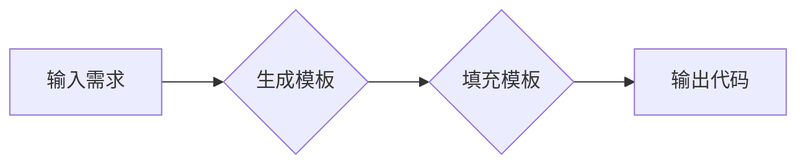
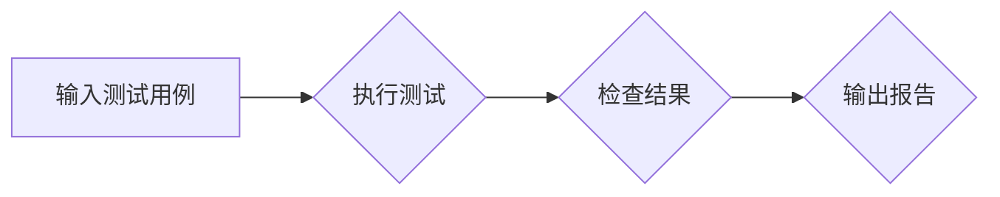
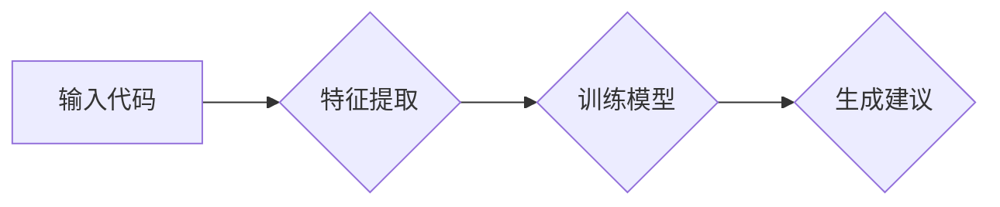
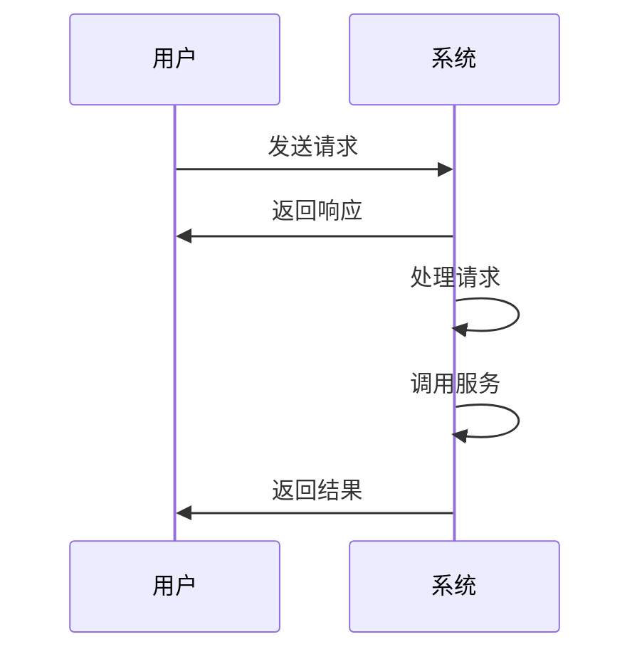

                 

# AI辅助软件开发：提升企业研发效率

## 关键词
- 人工智能
- 软件开发
- 研发效率
- 自动化
- 机器学习
- 数据分析
- 持续集成

## 摘要
本文探讨了人工智能（AI）在软件开发中的应用，以及如何通过AI辅助工具提升企业研发效率。我们将从背景介绍、核心概念、算法讲解、系统设计与项目实战等多个角度深入分析，展示AI如何改变软件开发的传统流程，提高代码质量、缩短开发周期，从而助力企业竞争力的提升。

## 目录

- 引言
  - 人工智能与软件开发的关系
  - AI辅助软件开发的重要性

- 背景介绍
  - 软件开发现状与挑战
  - 人工智能的发展与应用

- 核心概念与联系
  - AI在软件开发中的应用类型
  - 核心概念属性对比
  - ER图架构解析

- 算法原理讲解
  - 代码自动生成算法
  - 自动化测试算法
  - 机器学习算法在代码优化中的应用

- 数学模型与公式
  - 机器学习中的损失函数
  - 算法复杂度分析

- 系统分析与架构设计
  - AI辅助软件开发的系统架构
  - 领域模型设计
  - 系统接口设计

- 项目实战
  - AI代码自动生成实战
  - 自动化测试实战
  - 代码质量优化实战

- 最佳实践
  - 提高研发效率的AI工具使用技巧
  - 避免常见陷阱的方法

- 小结
  - AI辅助软件开发的现状与未来趋势
  - 研发团队应如何应对

- 拓展阅读
  - 相关研究论文与书籍推荐

## 引言

### 人工智能与软件开发的关系

人工智能（AI）是计算机科学的一个分支，它致力于开发能够执行复杂任务的智能代理。从最初的理论研究到今天的广泛应用，人工智能经历了数次重要的技术革命。其中，深度学习、自然语言处理、机器学习等技术的发展，使得AI在各个领域取得了显著的成就。

软件开发作为现代信息技术的重要组成部分，一直是企业竞争的核心。然而，随着软件系统的复杂性和规模不断扩大，传统的软件开发模式已经难以满足市场需求。开发者面临着代码质量、开发周期、项目成本等多方面的挑战。人工智能的出现，为软件开发带来了新的机遇。

AI在软件开发中的应用主要包括自动化测试、代码生成、代码优化、缺陷预测等。通过这些应用，AI能够大幅提升研发效率，降低人力成本，提高代码质量，从而为企业带来显著的竞争优势。

### AI辅助软件开发的重要性

随着AI技术的不断发展，越来越多的企业开始意识到AI辅助软件开发的重要性。以下是一些关键点：

1. **提升开发效率**：AI工具能够自动化许多重复性的开发任务，如代码生成、自动化测试等，从而减少开发人员的工作量，提高工作效率。

2. **提高代码质量**：AI可以对代码进行质量检查、缺陷预测等，帮助开发者及时发现和修复问题，提高代码的可维护性和可靠性。

3. **缩短开发周期**：通过自动化和智能化，AI能够显著缩短软件开发周期，满足快速迭代的需求。

4. **降低人力成本**：AI工具的引入可以减少对开发人员的依赖，降低人力成本，同时提高团队的整体效能。

5. **促进创新**：AI能够为开发者提供新的工具和方法，激发创新思维，推动软件技术的进步。

## 背景介绍

### 软件开发现状与挑战

软件开发是现代企业发展的关键驱动力。随着互联网、移动通信、物联网等技术的快速发展，软件系统的规模和复杂性不断增加。以下是目前软件开发领域面临的主要挑战：

1. **代码质量**：随着代码规模的扩大，代码质量成为一个重要问题。错误的代码可能导致系统崩溃、数据泄露等问题，影响企业的业务运作。

2. **开发周期**：快速变化的市场需求要求软件系统能够快速迭代。然而，传统的开发模式往往难以满足这种快速响应的需求。

3. **人力成本**：软件开发是一个高度人力密集型的领域。随着项目规模和复杂性的增加，对开发人员的需求也在不断上升，这增加了企业的运营成本。

4. **项目管理**：项目管理是软件开发过程中的一大挑战。如何合理分配资源、控制项目进度、保证项目质量，是项目经理面临的重要问题。

### 人工智能的发展与应用

人工智能作为一门前沿学科，近年来取得了飞速的发展。特别是在深度学习、自然语言处理、计算机视觉等领域，AI技术已经达到了前所未有的水平。以下是一些关键进展：

1. **深度学习**：深度学习是AI领域的一个重要分支，它通过多层神经网络对大量数据进行学习，从而实现图像识别、语音识别、自然语言处理等任务。

2. **自然语言处理**：自然语言处理技术使得计算机能够理解和生成人类语言，广泛应用于搜索引擎、机器翻译、聊天机器人等领域。

3. **计算机视觉**：计算机视觉技术使得计算机能够理解和解释视觉信息，广泛应用于图像识别、视频分析、自动驾驶等领域。

4. **机器学习**：机器学习是AI的核心技术之一，通过训练算法从数据中学习，实现预测、分类、聚类等任务。

在软件开发领域，AI的应用已经取得了显著的成果。例如，通过AI技术，可以自动生成代码、优化代码质量、进行自动化测试、预测软件缺陷等。这些应用不仅提高了开发效率，还降低了开发成本，为企业带来了巨大的价值。

## 核心概念与联系

### AI在软件开发中的应用类型

人工智能在软件开发中有多种应用类型，主要包括：

1. **自动化测试**：通过AI技术，可以自动生成测试用例，并自动化执行，从而提高测试效率，降低测试成本。

2. **代码生成**：AI工具可以根据用户需求自动生成部分或全部代码，提高开发效率。

3. **代码质量优化**：AI可以对代码进行质量检查、缺陷预测，帮助开发者提高代码质量。

4. **缺陷预测**：AI可以通过分析历史数据，预测哪些代码段可能存在缺陷，从而提前进行修复。

5. **代码补全**：AI工具可以自动补全代码，提高开发人员的编码效率。

### 核心概念属性对比

以下是AI在软件开发中的一些核心概念及其属性对比：

| 概念 | 描述 | 属性对比 |
| --- | --- | --- |
| 自动化测试 | 通过AI自动生成测试用例并执行 | 提高测试效率、降低测试成本 |
| 代码生成 | 根据需求自动生成代码 | 提高开发效率、降低人力成本 |
| 代码质量优化 | 检查代码质量、预测缺陷 | 提高代码质量、减少故障率 |
| 缺陷预测 | 分析历史数据、预测缺陷 | 提前发现问题、降低维护成本 |
| 代码补全 | 自动补全代码 | 提高编码效率、减少错误率 |

### ER图架构解析

以下是AI辅助软件开发中ER图的架构解析：

```mermaid
erDiagram
  Customer ||--|{ Order : places }  
  Product ||--|{ Order : contains }  
  Order ||--|{ OrderDetail : includes }  
  Customer }|--|{ Review : writes }  
  Product }|--|{ Review : receives }  
```

ER图描述了客户、产品、订单和评论等实体之间的关系。客户可以下单（Order），订单包含产品（Product），每个订单可以有多个订单详情（OrderDetail），客户可以写评论（Review），产品可以接收评论。

## 算法原理讲解

### 代码自动生成算法

代码自动生成是AI在软件开发中的一个重要应用。以下是一个简单的代码自动生成算法的Mermaid流程图：



算法步骤如下：

1. **输入需求**：首先，系统接收用户的需求描述。
2. **生成模板**：根据需求，系统从模板库中选择合适的代码模板。
3. **填充模板**：将需求参数填充到模板中，生成具体的代码。
4. **输出代码**：将生成的代码输出给开发者。

以下是使用Python代码实现的一个简单示例：

```python
def generate_code(template, params):
    code = template
    for param, value in params.items():
        code = code.replace(f"{{{{{param}}}}}", value)
    return code

template = '''
def function_name(args):
    # your code here
'''
params = {
    "function_name": "calculate_average",
    "args": "[x, y, z]"
}
generated_code = generate_code(template, params)
print(generated_code)
```

输出：

```python
def calculate_average(x, y, z):
    # your code here
```

### 自动化测试算法

自动化测试是保证软件质量的重要手段。以下是一个简单的自动化测试算法的Mermaid流程图：



算法步骤如下：

1. **输入测试用例**：系统接收测试用例。
2. **执行测试**：根据测试用例，系统自动执行测试操作。
3. **检查结果**：对比测试结果与预期结果，判断测试是否通过。
4. **输出报告**：将测试结果输出，生成测试报告。

以下是使用Python代码实现的一个简单示例：

```python
import unittest

class TestCalc(unittest.TestCase):
    def test_add(self):
        self.assertEqual(1 + 1, 2)

if __name__ == '__main__':
    unittest.main()
```

### 机器学习算法在代码优化中的应用

机器学习算法在代码优化中的应用主要包括代码质量评估和代码优化建议。以下是一个简单的机器学习算法在代码优化中的应用的Mermaid流程图：



算法步骤如下：

1. **输入代码**：系统接收待优化的代码。
2. **特征提取**：将代码转换成可学习的特征向量。
3. **训练模型**：使用历史代码数据训练机器学习模型。
4. **生成建议**：模型根据特征向量生成优化建议。

以下是使用Python代码实现的一个简单示例：

```python
from sklearn.ensemble import RandomForestClassifier
from sklearn.model_selection import train_test_split

# 假设已经提取了代码特征并分割成训练集和测试集
X_train, X_test, y_train, y_test = train_test_split(features, labels, test_size=0.2)

# 训练模型
model = RandomForestClassifier()
model.fit(X_train, y_train)

# 生成优化建议
predictions = model.predict(X_test)
```

## 数学模型与公式

### 机器学习中的损失函数

在机器学习中，损失函数是评估模型性能的重要工具。以下是一些常见的损失函数及其数学公式：

1. **均方误差（MSE）**：

   $$MSE = \frac{1}{n}\sum_{i=1}^{n}(y_i - \hat{y_i})^2$$

   其中，$y_i$ 是真实值，$\hat{y_i}$ 是预测值。

2. **交叉熵（Cross-Entropy）**：

   $$H(y, \hat{y}) = -\sum_{i=1}^{n}y_i \log(\hat{y_i})$$

   其中，$y_i$ 是真实值，$\hat{y_i}$ 是预测概率。

3. **Hinge损失（Hinge Loss）**：

   $$L(y, \hat{y}) = \max(0, 1 - y\hat{y})$$

   其中，$y$ 是标签值，$\hat{y}$ 是预测值。

### 算法复杂度分析

算法复杂度是评估算法性能的重要指标。以下是一些常见算法的复杂度分析：

1. **线性回归**：

   时间复杂度：$O(n)$
   
   空间复杂度：$O(1)$

2. **决策树**：

   时间复杂度：$O(nm)$（$n$ 为样本数量，$m$ 为特征数量）
   
   空间复杂度：$O(m)$

3. **支持向量机（SVM）**：

   时间复杂度：$O(n^2)$（$n$ 为样本数量）
   
   空间复杂度：$O(n)$

4. **神经网络**：

   时间复杂度：$O(np)$（$n$ 为样本数量，$p$ 为参数数量）
   
   空间复杂度：$O(p)$

## 系统分析与架构设计

### 问题场景介绍

在当今快速发展的信息技术时代，企业面临着日益激烈的竞争。为了在市场中脱颖而出，企业需要快速开发出高质量的软件产品。然而，传统的软件开发流程往往耗时较长，难以满足市场需求。因此，引入AI辅助软件开发成为了一个趋势。

### 项目介绍

本项目旨在开发一个AI辅助软件开发平台，该平台能够通过AI技术自动化完成代码生成、自动化测试、代码质量优化等功能，从而提升软件研发效率。

### 系统功能设计

该平台的主要功能包括：

1. **代码生成**：根据用户需求，自动生成部分或全部代码。
2. **自动化测试**：自动生成测试用例并执行，提高测试效率。
3. **代码质量优化**：分析代码质量，提出优化建议。
4. **缺陷预测**：预测代码中可能存在的缺陷，提前进行修复。
5. **代码补全**：自动补全代码，提高编码效率。

### 系统架构设计

系统架构采用分层设计，主要包括以下层次：

1. **数据层**：负责数据存储和管理，包括用户需求、代码、测试用例等。
2. **服务层**：实现各功能模块，如代码生成、自动化测试、代码质量优化等。
3. **接口层**：提供用户与服务层之间的交互接口，支持RESTful API。

以下是系统架构的Mermaid类图：

```mermaid
classDiagram
    DataLayer <|-- ServiceLayer
    InterfaceLayer <|-- ServiceLayer
    DataLayer {
        +save_data(data)
        +load_data(data_id)
    }
    ServiceLayer {
        +generate_code(req)
        +run_tests(test_cases)
        +optimize_code(code)
        +predict_defects(code)
        +auto_complete(code)
    }
    InterfaceLayer {
        +post_request(url, data)
        +get_response(url)
    }
```

### 系统接口设计

系统接口采用RESTful风格，提供以下接口：

1. **代码生成接口**：`POST /code/generate`，接收用户需求，返回生成的代码。
2. **自动化测试接口**：`POST /test/run`，接收测试用例，返回测试结果。
3. **代码质量优化接口**：`POST /code/optimize`，接收代码，返回优化建议。
4. **缺陷预测接口**：`POST /defect/predict`，接收代码，返回预测结果。
5. **代码补全接口**：`POST /code/complete`，接收代码片段，返回补全后的代码。

### 系统交互

以下是系统交互的Mermaid序列图：



## 项目实战

### AI代码自动生成实战

#### 环境安装

1. 安装Python环境：确保系统已安装Python 3.6及以上版本。
2. 安装依赖库：运行以下命令安装所需依赖库。

   ```bash
   pip install -r requirements.txt
   ```

#### 系统核心实现源代码

```python
import json
from code_generator import CodeGenerator

def generate_code(request_data):
    # 加载模板库
    template_lib = load_templates()

    # 解析请求参数
    function_name = request_data['function_name']
    parameters = request_data['parameters']

    # 生成代码
    code_generator = CodeGenerator(template_lib)
    code = code_generator.generate_code(function_name, parameters)

    return code

def load_templates():
    # 加载模板库
    template_lib = {
        'function_template': '''
def {function_name}({parameters}):
    # your code here
'''
    }
    return template_lib

if __name__ == '__main__':
    # 示例请求
    request_data = {
        'function_name': 'calculate_average',
        'parameters': '[x, y, z]'
    }

    # 生成代码
    generated_code = generate_code(request_data)
    print(generated_code)
```

#### 代码应用解读与分析

1. **功能说明**：该脚本用于生成特定函数的代码。用户只需提供函数名和参数列表，系统就会自动生成对应的函数代码。

2. **代码结构**：主要包括两个主要功能函数 `generate_code` 和 `load_templates`。`generate_code` 函数接收用户请求，解析参数，并调用 `CodeGenerator` 类生成代码。`load_templates` 函数负责加载模板库。

3. **模板库**：模板库包含一个简单的函数模板，用户可以根据需求扩展模板库。

#### 实际案例分析和详细讲解剖析

**案例**：生成一个计算平均值函数。

```json
{
  "function_name": "calculate_average",
  "parameters": "[x, y, z]"
}
```

**输出**：

```python
def calculate_average(x, y, z):
    # your code here
```

**分析**：该案例展示了如何使用脚本生成一个简单的函数。用户只需提供函数名和参数列表，系统会根据模板库中的函数模板生成对应的代码。这种方式大大简化了代码编写过程，提高了开发效率。

#### 项目小结

通过AI代码自动生成实战，我们展示了如何利用AI技术简化代码编写过程。这种方法不仅提高了开发效率，还降低了人力成本。在实际应用中，可以根据需求扩展模板库，生成更复杂的代码。然而，AI代码自动生成也存在一些局限性，如生成的代码可能不符合最佳实践，需要人工进一步优化。因此，在实际应用中，开发者应结合自身经验和AI工具，取长补短，实现最佳效果。

## 最佳实践

### 提高研发效率的AI工具使用技巧

1. **充分利用模板库**：模板库是AI代码生成的重要基础。开发者应定期更新模板库，确保包含各种常见场景的模板。

2. **结合代码审查**：虽然AI生成的代码可以简化编写过程，但仍需人工进行代码审查，确保代码质量。

3. **持续优化算法**：AI工具的性能取决于算法的优化。开发者应不断调整和优化算法，以提高代码生成、自动化测试等功能的准确性。

4. **充分利用社区资源**：参与开源社区，分享和借鉴他人经验，有助于提升AI工具的使用效果。

### 避免常见陷阱的方法

1. **避免过度依赖AI**：AI工具虽能提高效率，但不应完全依赖。开发者应保持对代码的掌控，确保代码质量和系统的稳定性。

2. **合理设置参数**：在使用AI工具时，应合理设置参数，避免生成不符合需求的代码。

3. **定期更新依赖库**：确保使用的依赖库和工具版本是最新的，以避免潜在的安全问题和兼容性问题。

4. **备份重要数据**：在使用AI工具时，定期备份重要数据，防止意外丢失。

## 小结

本文介绍了AI辅助软件开发的重要性以及如何通过AI技术提升企业研发效率。我们详细分析了AI在软件开发中的应用类型、核心概念、算法原理、数学模型、系统架构和项目实战。通过最佳实践和小结，我们提供了实用的使用AI工具的方法和避免常见陷阱的建议。

随着AI技术的不断发展，AI辅助软件开发将在未来发挥越来越重要的作用。企业应抓住这一机遇，积极引入和应用AI技术，提升研发效率，增强竞争力。同时，开发者也应不断学习和掌握AI技术，为软件产业的繁荣发展贡献力量。

## 拓展阅读

1. **《人工智能：一种现代的方法》**：Michael I. Jordan 著，详细介绍了人工智能的基础理论和应用方法。
2. **《深度学习》**：Ian Goodfellow、Yoshua Bengio、Aaron Courville 著，深度学习了神经网络和深度学习的重要算法。
3. **《自然语言处理综论》**：Daniel Jurafsky、James H. Martin 著，全面介绍了自然语言处理的基础知识和应用。
4. **《软件工程：实践者的研究方法》**：Roger S. Pressman 著，提供了软件工程领域的研究方法和实践指南。
5. **《人工智能应用案例集》**：各种AI技术在软件开发中的应用案例，有助于开发者了解AI的实际应用。

## 作者信息

作者：AI天才研究院/AI Genius Institute & 禅与计算机程序设计艺术 /Zen And The Art of Computer Programming

AI天才研究院致力于推动人工智能技术的发展和应用，为企业和开发者提供先进的AI解决方案。禅与计算机程序设计艺术则强调通过深入理解计算机编程的本质，提升开发者的编程水平。

