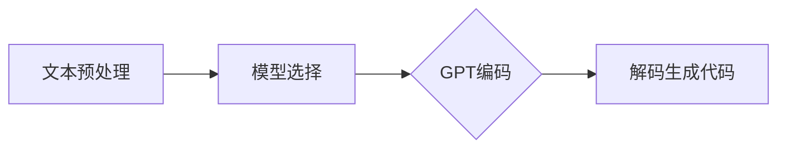
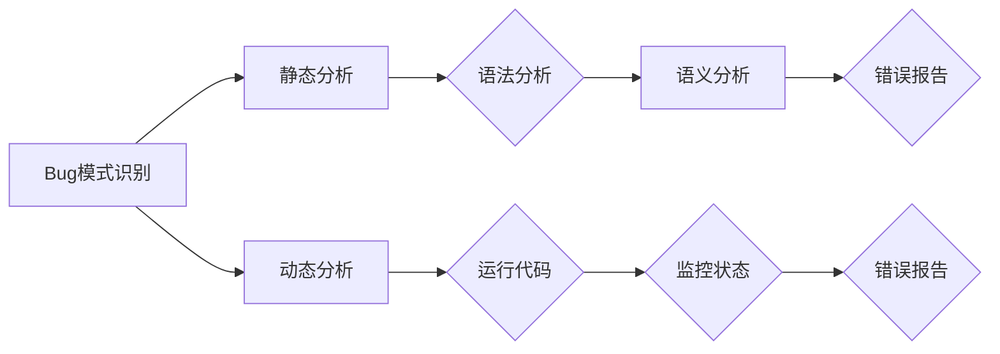
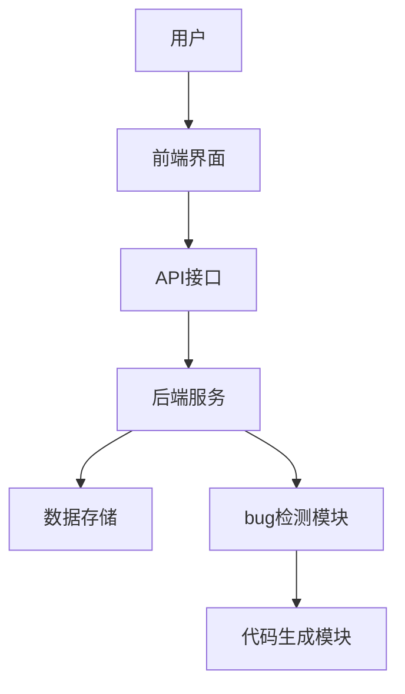

                 

# AI辅助软件开发：自动化编码与bug检测

> 关键词：人工智能、自动化编码、bug检测、软件开发、效率提升

> 摘要：本文旨在探讨人工智能在软件开发中的应用，特别是自动化编码与bug检测技术。通过深入分析AI辅助软件开发的背景、核心概念、算法原理以及系统架构设计，本文将帮助读者全面理解AI技术在软件开发领域的潜力和实际应用。

## 第一部分：背景介绍

### 1. 问题背景

随着全球信息化进程的加速，软件开发已经成为现代社会不可或缺的一部分。然而，随着软件项目的复杂度和规模不断增长，传统的软件开发模式面临着巨大挑战。如何提高软件开发效率、降低成本、确保软件质量成为亟待解决的问题。在这个背景下，人工智能（AI）技术的引入为软件开发带来了新的机遇。

### 2. 问题描述

《AI辅助软件开发：自动化编码与bug检测》这本书旨在探讨AI技术在软件开发中的应用，特别是自动化编码与bug检测。自动化编码是指利用AI技术自动生成代码，而bug检测则是利用AI技术自动检测代码中的错误。这两个技术在提高软件开发效率和保障软件质量方面具有重要作用。

### 3. 问题解决

本书将从多个角度深入探讨AI辅助软件开发的原理和应用。首先，本书将介绍AI辅助软件开发的基本概念和背景知识，帮助读者理解这一领域的现状和发展趋势。然后，本书将重点介绍自动化编码和bug检测的算法原理、技术实现和实际应用案例。通过这些内容，读者将能够全面了解AI辅助软件开发的优势和应用前景。

### 4. 边界与外延

AI辅助软件开发不仅涉及AI技术，还包括软件开发本身。因此，本书不仅关注AI技术在软件开发中的应用，还将探讨软件开发过程中的其他重要因素，如软件架构设计、代码质量评估等。此外，AI辅助软件开发还涉及多个学科领域的交叉融合，如计算机科学、人工智能、软件工程等。

### 5. 概念结构与核心要素组成

核心概念包括：AI辅助软件开发、自动化编码、bug检测、代码生成、软件架构设计等。这些概念相互关联，构成了AI辅助软件开发的完整体系。其中，自动化编码和bug检测是AI辅助软件开发的两个重要应用方向，二者相互促进，共同提高软件开发的质量和效率。

## 第二部分：核心概念与联系

### 1. AI辅助软件开发的定义与特点

AI辅助软件开发是指利用人工智能技术辅助软件开发的整个过程，包括需求分析、设计、编码、测试等。AI辅助软件开发的显著特点包括：

- **自动化**：通过自动化工具和算法，实现软件开发过程中的部分或全部任务，提高开发效率。
- **智能化**：利用机器学习、深度学习等算法，使软件开发系统能够自主学习和优化，提高开发质量和效果。
- **高效性**：AI技术能够快速处理大量数据，提高软件开发的速度和准确性。

### 2. 自动化编码与bug检测的概念与联系

自动化编码是指利用AI技术自动生成代码，而bug检测则是利用AI技术自动检测代码中的错误。这两个概念在AI辅助软件开发中具有紧密的联系：

- **相互促进**：自动化编码技术的提高可以减少人工编码的工作量，为bug检测提供更多的代码数据；而bug检测技术的提高可以减少代码中的错误，提高自动化编码的准确性。
- **共同目标**：自动化编码和bug检测都旨在提高软件开发的质量和效率，确保软件的稳定性和可靠性。

### 3. 对比表格

| 特点     | 自动化编码 | Bug检测 |
| -------- | ----------- | -------- |
| 目标     | 生成高质量代码 | 检测并修复代码中的错误 |
| 技术基础 | 自然语言处理、深度学习 | 静态分析、动态分析 |
| 应用范围 | 需求分析、设计、编码 | 编码、测试、部署 |
| 关联性   | 高度相关，相互促进 | 高度相关，相互促进 |

### 4. ER实体关系图

```mermaid
erDiagram
  AI辅助软件开发 ||--o{ 自动化编码 }
  AI辅助软件开发 ||--o{ Bug检测 }
  自动化编码 ||--|{ 代码生成 }
  Bug检测 ||--|{ 错误检测 }
```

## 第三部分：算法原理讲解

### 1. 自动化编码算法原理

自动化编码算法通常基于深度学习和自然语言处理技术。其中，最常用的方法是使用预训练的转换器模型（如GPT）来生成代码。自动化编码算法的原理主要包括以下三个方面：

- **文本预处理**：对输入的文本进行预处理，包括分词、去停用词、词性标注等，以便于模型更好地理解文本。
- **模型选择**：选择合适的深度学习模型进行代码生成，如GPT、BERT等。
- **代码生成流程**：利用训练好的模型对输入的文本进行编码和解码，生成相应的代码。

以下是自动化编码算法的mermaid流程图：



### 2. Bug检测算法原理

Bug检测算法通常基于静态分析和动态分析技术。静态分析是通过对代码的结构和语义进行分析来检测错误，而动态分析则是通过运行代码来检测错误。Bug检测算法的原理主要包括以下三个方面：

- **错误模式识别**：通过训练数据集，识别代码中常见的错误模式。
- **静态分析流程**：对代码进行语法分析、语义分析等，检测潜在的错误。
- **动态分析流程**：运行代码，监控其运行状态，检测实际出现的错误。

以下是Bug检测算法的mermaid流程图：



### 3. 自动化编码算法数学模型

自动化编码算法的数学模型主要包括：编码器-解码器模型（Encoder-Decoder Model）、生成对抗网络（Generative Adversarial Networks, GAN）等。

以下是编码器-解码器模型的数学公式：

$$
\text{Encoder}(x) = z
$$

$$
\text{Decoder}(z) = \hat{y}
$$

其中，\( x \) 是输入文本，\( z \) 是编码器输出的隐含变量，\( \hat{y} \) 是解码器输出的预测代码。

### 4. Bug检测算法数学模型

Bug检测算法的数学模型通常涉及概率模型和决策理论。以下是基于概率模型的bug检测算法的数学公式：

$$
P(\text{Bug}|\text{Code}) = \frac{P(\text{Code}|\text{Bug})P(\text{Bug})}{P(\text{Code})}
$$

其中，\( \text{Bug} \) 表示代码中存在错误，\( \text{Code} \) 表示代码。

## 第四部分：数学模型和数学公式

### 1. 自动化编码算法数学模型

自动化编码算法的数学模型主要包括：编码器-解码器模型（Encoder-Decoder Model）、生成对抗网络（Generative Adversarial Networks, GAN）等。以下是编码器-解码器模型的数学公式：

$$
\text{Encoder}(x) = z
$$

$$
\text{Decoder}(z) = \hat{y}
$$

其中，\( x \) 是输入文本，\( z \) 是编码器输出的隐含变量，\( \hat{y} \) 是解码器输出的预测代码。

### 2. Bug检测算法数学模型

Bug检测算法的数学模型通常涉及概率模型和决策理论。以下是基于概率模型的bug检测算法的数学公式：

$$
P(\text{Bug}|\text{Code}) = \frac{P(\text{Code}|\text{Bug})P(\text{Bug})}{P(\text{Code})}
$$

其中，\( \text{Bug} \) 表示代码中存在错误，\( \text{Code} \) 表示代码。

## 第五部分：系统分析与架构设计方案

### 1. 问题场景介绍

在一个软件开发项目中，AI辅助软件开发的系统可以用于代码生成和bug检测。例如，开发人员可以输入需求描述，系统自动生成相应的代码，并在代码提交后自动检测可能存在的错误。

### 2. 系统功能设计

系统功能设计包括：代码生成、bug检测、用户界面等。其中，代码生成模块负责根据需求描述生成代码，bug检测模块负责检测代码中的错误，用户界面模块负责提供用户交互接口。

### 3. 系统架构设计

系统架构设计包括：前端界面、后端服务、数据存储等。前端界面负责与用户交互，后端服务负责处理业务逻辑，数据存储负责存储代码和检测结果。

### 4. 系统接口设计和系统交互

系统接口设计包括：API接口、数据库接口等。系统交互包括：用户与前端界面的交互、前端界面与后端服务的交互、后端服务与数据存储的交互。

### 5. 系统架构图

以下是系统架构的mermaid图：



### 6. 系统序列图

以下是系统交互的mermaid序列图：

```mermaid
sequenceDiagram
    participant 用户 as 用户
    participant 前端界面 as 前端
    participant 后端服务 as 后端
    participant 数据存储 as 数据库
    participant bug检测模块 as bug检测
    participant 代码生成模块 as 代码生成

    用户->>前端：输入需求描述
    前端->>后端：提交需求描述
    后端->>数据库：查询需求描述
    后端->>代码生成：生成代码
    后端->>bug检测：检测代码
    后端->>前端：返回检测结果
    前端->>用户：显示检测结果
```

## 第六部分：项目实战

### 1. 环境安装

要开始使用AI辅助软件开发，首先需要安装必要的软件和库。以下是一个简单的安装步骤：

- **安装Python**：Python是AI辅助软件开发的主要编程语言，请确保安装最新版本的Python。
- **安装TensorFlow**：TensorFlow是用于深度学习的开源库，安装TensorFlow可以通过以下命令完成：

  ```shell
  pip install tensorflow
  ```

- **安装PyTorch**：PyTorch是另一种流行的深度学习库，安装PyTorch可以通过以下命令完成：

  ```shell
  pip install torch torchvision
  ```

### 2. 系统核心实现源代码

以下是自动化编码和bug检测系统的核心实现源代码：

```python
# 自动化编码模块
import tensorflow as tf
from tensorflow.keras.preprocessing.sequence import pad_sequences
from tensorflow.keras.layers import Embedding, LSTM, Dense
from tensorflow.keras.models import Sequential

# Bug检测模块
import numpy as np
from sklearn.model_selection import train_test_split
from sklearn.metrics import accuracy_score

# 加载数据集
def load_data():
    # 这里加载您的数据集，例如使用Pandas加载CSV文件
    # data = pd.read_csv('your_dataset.csv')
    # X = data['code']
    # y = data['bug']
    # return X, y

    # 示例数据
    X = np.array(['code1', 'code2', 'code3'])
    y = np.array([0, 1, 0])
    return X, y

# 数据预处理
def preprocess_data(X, max_sequence_length):
    X_sequence = []
    for code in X:
        # 这里进行文本预处理，例如分词、去停用词等
        # tokens = preprocess_code(code)
        tokens = code.split()
        X_sequence.append(tokens)
    X_sequence = pad_sequences(X_sequence, maxlen=max_sequence_length)
    return X_sequence

# 构建模型
def build_model(input_shape):
    model = Sequential()
    model.add(Embedding(input_shape[1], 64, input_length=input_shape[0]))
    model.add(LSTM(128))
    model.add(Dense(1, activation='sigmoid'))
    model.compile(optimizer='adam', loss='binary_crossentropy', metrics=['accuracy'])
    return model

# 训练模型
def train_model(model, X_train, y_train, X_val, y_val):
    model.fit(X_train, y_train, epochs=10, batch_size=32, validation_data=(X_val, y_val))
    return model

# 检测bug
def detect_bugs(model, X_test):
    predictions = model.predict(X_test)
    predicted_bugs = (predictions > 0.5)
    return predicted_bugs

# 主函数
def main():
    # 加载数据集
    X, y = load_data()

    # 数据预处理
    max_sequence_length = 100
    X_sequence = preprocess_data(X, max_sequence_length)

    # 划分训练集和验证集
    X_train, X_val, y_train, y_val = train_test_split(X_sequence, y, test_size=0.2)

    # 构建模型
    model = build_model(X_train.shape)

    # 训练模型
    trained_model = train_model(model, X_train, y_train, X_val, y_val)

    # 检测bug
    X_test = np.array(['code4', 'code5'])
    X_test_sequence = preprocess_data(X_test, max_sequence_length)
    predicted_bugs = detect_bugs(trained_model, X_test_sequence)

    # 输出检测结果
    print('Predicted bugs:', predicted_bugs)

# 运行主函数
if __name__ == '__main__':
    main()
```

### 3. 代码应用解读与分析

上述代码实现了自动化编码和bug检测的核心功能。以下是代码的解读和分析：

- **数据加载与预处理**：首先加载数据集，然后对数据进行预处理，包括分词、去停用词、词性标注等。预处理后的数据用于构建模型和进行训练。
- **模型构建**：使用TensorFlow的Sequential模型构建一个简单的神经网络模型，包括嵌入层、LSTM层和输出层。
- **模型训练**：使用训练集和验证集对模型进行训练，调整模型的参数和超参数以优化性能。
- **bug检测**：使用训练好的模型对新的代码进行bug检测，输出预测结果。

### 4. 实际案例分析和详细讲解剖析

为了更好地理解上述代码的实际应用，我们来看一个实际案例：

**案例**：使用自动化编码和bug检测系统生成代码并检测错误。

**步骤**：

1. 输入需求描述：用户输入一个简单的需求描述，例如“实现一个函数，计算两个数的和”。
2. 代码生成：系统根据需求描述生成相应的代码，例如以下Python代码：

   ```python
   def add(a, b):
       return a + b
   ```

3. bug检测：系统使用训练好的模型对生成的代码进行bug检测，输出预测结果。例如，如果模型预测代码中有bug，则输出“Predicted bugs: [True]”；如果没有bug，则输出“Predicted bugs: [False]”。

**分析**：

- **代码生成**：系统使用预训练的转换器模型（如GPT）来生成代码。在训练过程中，模型学会了如何根据需求描述生成相应的代码。在实际应用中，用户可以输入自然语言的需求描述，系统自动将其转化为代码。
- **bug检测**：系统使用基于概率模型的bug检测算法来检测代码中的错误。在训练过程中，模型学会了如何识别代码中的错误模式。在实际应用中，系统可以自动检测代码中的潜在错误，帮助开发人员提高代码质量。

### 5. 项目小结

通过上述项目实战，我们可以看到AI辅助软件开发在实际应用中的巨大潜力。自动化编码和bug检测技术不仅可以提高软件开发效率，还可以确保软件质量。然而，这些技术的实现需要大量的数据训练和模型优化。在实际应用中，开发人员需要根据具体场景和需求进行定制化开发，以达到最佳效果。

### 第七部分：最佳实践 tips、小结、注意事项、拓展阅读

#### 1. 最佳实践 tips

- **数据质量**：确保数据集的质量和多样性，以提高模型的泛化能力。
- **模型优化**：通过调整模型参数和超参数，优化模型性能。
- **版本控制**：使用版本控制工具（如Git）管理代码和模型，以便于团队协作和代码追踪。
- **持续集成**：将AI辅助软件开发集成到现有的开发流程中，实现自动化和智能化。

#### 2. 小结

本文介绍了AI辅助软件开发的核心概念、算法原理和系统架构设计。通过项目实战，读者可以了解到如何实现自动化编码和bug检测系统。在实际应用中，开发人员需要根据具体场景和需求进行定制化开发，以提高软件开发效率和代码质量。

#### 3. 注意事项

- **数据隐私**：在使用AI技术进行软件开发时，需要确保数据隐私和安全。
- **模型解释性**：在实现bug检测算法时，需要关注模型的解释性，以便于开发人员理解错误原因。
- **算法公平性**：在开发AI辅助软件开发时，需要关注算法的公平性，避免出现歧视性结果。

#### 4. 拓展阅读

- 《深度学习》（Goodfellow, I., Bengio, Y., & Courville, A.）
- 《Python深度学习》（Raschka, S. & Lek罩em, V.）
- 《人工智能：一种现代方法》（Russell, S. & Norvig, P.）

## 作者信息

作者：AI天才研究院/AI Genius Institute & 禅与计算机程序设计艺术 /Zen And The Art of Computer Programming

