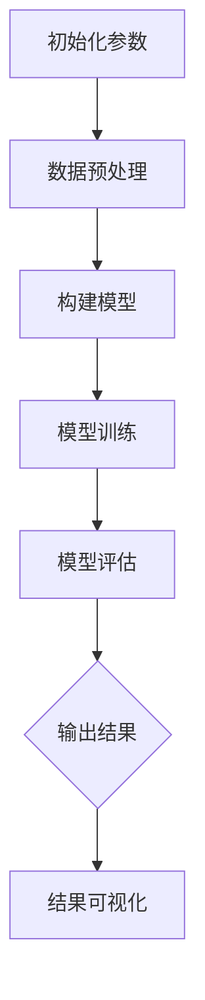
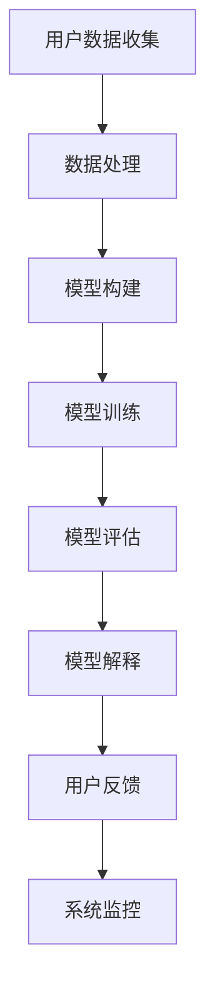
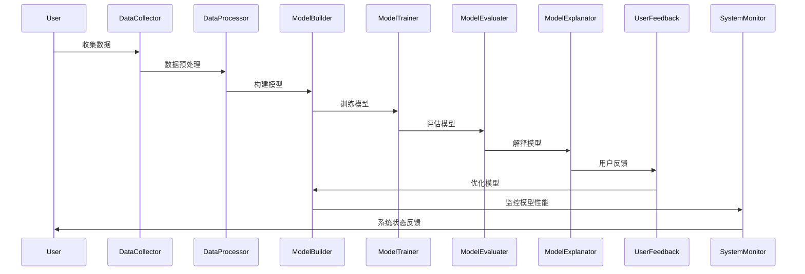

                 

### 文章标题

# AI透明度与可解释性的重要性

### 关键词

- AI透明度
- 可解释性
- 机器学习
- 模型压缩
- 算法可视化

### 摘要

本文将探讨AI透明度与可解释性的重要性，分析当前AI模型不可解释性的问题及其对实际应用的影响。通过深入讲解相关概念和算法原理，本文将介绍解决AI不可解释性问题的方法和策略，展示其在实际项目中的应用与效果。文章还将提供最佳实践、注意事项和拓展阅读，以帮助读者进一步了解和掌握这一领域。

## 第一步：背景介绍

### 核心概念

AI透明度是指AI系统的内部操作、决策过程和输出结果的可理解性和可追踪性。它使得AI系统在执行任务时，其行为和决策背后的逻辑和机制对用户和开发者都是清晰的。透明度对于AI系统的重要性体现在以下几个方面：

1. **用户信任**：高透明度的AI系统能够提高用户的信任度，因为用户可以理解系统的行为和决策过程，从而减少对未知的担忧。
2. **模型验证**：透明度有助于开发者对AI模型进行有效的验证和调试，及时发现和纠正模型中的错误。
3. **合规性**：在许多应用领域，如金融、医疗和司法等，透明度是确保系统合规性的关键。

### 问题描述

尽管AI技术在许多领域取得了显著的进展，但AI模型的不可解释性仍然是一个严重的问题。不可解释性指的是AI系统在执行任务时，其内部操作和决策过程对用户和开发者都是不可理解的。这种问题主要表现在以下几个方面：

1. **黑箱模型**：许多现代AI模型，如深度神经网络，被认为是“黑箱”，因为它们在内部操作和决策过程中的细节对用户和开发者都是不透明的。
2. **缺乏透明度**：一些AI模型在设计和实现时，并未考虑透明度，导致其输出结果难以解释。
3. **决策不透明**：在某些应用场景中，AI系统做出的决策可能是错误的，但用户和开发者无法了解决策背后的原因。

不可解释性的问题对实际应用的影响主要体现在以下几个方面：

1. **信任危机**：不可解释的AI系统可能导致用户对系统的信任度下降，从而限制其推广和应用。
2. **合规性问题**：在某些行业，如金融和医疗，AI系统的决策过程需要透明和可解释，以符合法规要求。
3. **调试困难**：不可解释的AI系统在出现问题时，开发者难以进行有效的调试和优化。

### 问题解决

为了解决AI不可解释性的问题，研究者们提出了多种方法和策略。以下是一些常见的方法：

1. **模型压缩**：通过压缩模型的大小，可以减少模型中参数的数量，从而提高模型的透明度。
2. **算法可视化**：通过可视化技术，将AI模型的内部结构和操作过程展示给用户和开发者，从而提高模型的透明度。
3. **解释性算法**：开发专门的可解释性算法，使得AI模型的输出结果和决策过程更加清晰和易懂。
4. **透明度评估**：设计评估方法，对AI系统的透明度进行量化评估，以便开发者了解系统的透明度水平。

### 边界与外延

AI透明度的边界主要涉及以下几个方面：

1. **技术实现**：AI透明度的实现需要依赖先进的技术，如模型压缩、算法可视化等。
2. **应用场景**：AI透明度在不同应用场景中的需求和实现方式可能有所不同，如金融、医疗、工业等。
3. **伦理和法律**：AI透明度在伦理和法律层面的要求，如隐私保护、数据安全等。

AI透明度在不同领域的应用也有很大的差异：

1. **金融**：在金融领域，AI透明度有助于提高金融产品的合规性和用户信任度。
2. **医疗**：在医疗领域，AI透明度有助于医生和患者理解AI系统的诊断和治疗方案。
3. **工业**：在工业领域，AI透明度有助于提高生产线的自动化和智能化水平。

### 概念结构与核心要素组成

AI透明度概念的核心要素包括以下几个方面：

1. **算法**：AI算法是AI系统的核心，其透明度直接决定了系统的透明度。
2. **模型**：AI模型是AI算法的具体实现，其透明度也是AI系统透明度的重要组成部分。
3. **工具**：AI工具用于辅助开发者设计、实现和优化AI系统，其透明度对于提高系统透明度至关重要。
4. **技术**：AI技术是AI系统的基石，其透明度直接决定了AI系统的透明度。

### 小结

本文介绍了AI透明度的核心概念、不可解释性问题及其对实际应用的影响，探讨了解决AI不可解释性问题的方法和策略，并分析了AI透明度的边界与外延。通过本文的介绍，读者可以了解AI透明度的重要性，以及如何在实际项目中应用和提高AI系统的透明度。

## 第二步：核心概念与联系

### 核心概念原理

AI透明度的核心概念包括可解释性、可视化、模型压缩等。下面分别对这些概念进行详细讲解。

#### 可解释性

可解释性是指AI系统的输出结果和决策过程可以被用户和开发者理解和解释。可解释性对于提高AI系统的透明度至关重要，因为它使得用户和开发者能够理解AI系统的行为和决策依据。

#### 可视化

可视化是将AI系统的内部操作、结构和决策过程以图形化的方式展示给用户和开发者。通过可视化，用户和开发者可以直观地了解AI系统的运作机制，从而提高系统的透明度。

#### 模型压缩

模型压缩是通过减少模型参数的数量，从而降低模型的大小和复杂性。模型压缩可以提高AI系统的透明度，因为它使得模型的结构更加简洁，更容易理解。

### 概念属性特征对比表格

下面是一个关于AI透明度方法的属性特征对比表格，列出不同方法的优缺点。

| 方法       | 优点                          | 缺点                                  |
|------------|------------------------------|---------------------------------------|
| 模型压缩    | 减少模型大小，提高透明度        | 可能降低模型性能                      |
| 可视化     | 直观展示模型内部结构和操作过程   | 可能增加开发成本                      |
| 解释性算法  | 提高输出结果和决策过程的可解释性  | 可能降低模型性能和泛化能力            |
| 透明度评估   | 量化评估AI系统的透明度水平      | 可能难以全面衡量系统的透明度            |

### ER实体关系图架构

下面是一个使用Mermaid绘制的ER图，展示AI透明度相关实体及其关系。

```mermaid
erDiagram
    AI模型 ||--|{ 可解释性 }
    AI模型 ||--|{ 可视化 }
    AI模型 ||--|{ 模型压缩 }
    可解释性 ||--|{ 透明度评估 }
    可视化 ||--|{ 透明度评估 }
    模型压缩 ||--|{ 透明度评估 }
```

### 小结

本节介绍了AI透明度的核心概念原理、属性特征对比表格和ER实体关系图架构。通过这些内容的讲解，读者可以更好地理解AI透明度的概念和实现方法，为后续内容的深入探讨打下基础。

## 第三步：算法原理讲解

### 算法原理流程图

为了更好地理解AI透明度的算法原理，下面我们将使用Mermaid绘制一个算法流程图，展示关键步骤和流程。



### Python源代码

接下来，我们将提供一个Python代码示例，详细阐述算法的实现过程。

```python
import tensorflow as tf
from sklearn.model_selection import train_test_split
from sklearn.metrics import accuracy_score

# 数据预处理
def preprocess_data(data):
    # 对数据进行标准化处理
    data = (data - np.mean(data)) / np.std(data)
    return data

# 模型构建
def build_model(input_shape):
    model = tf.keras.Sequential([
        tf.keras.layers.Dense(units=64, activation='relu', input_shape=input_shape),
        tf.keras.layers.Dense(units=1, activation='sigmoid')
    ])
    model.compile(optimizer='adam', loss='binary_crossentropy', metrics=['accuracy'])
    return model

# 模型训练
def train_model(model, X_train, y_train, X_val, y_val):
    model.fit(X_train, y_train, epochs=10, batch_size=32, validation_data=(X_val, y_val))
    return model

# 模型评估
def evaluate_model(model, X_test, y_test):
    y_pred = model.predict(X_test)
    y_pred = (y_pred > 0.5)
    accuracy = accuracy_score(y_test, y_pred)
    print("Test accuracy:", accuracy)
    return accuracy

# 结果可视化
def visualize_results(model, X_test, y_test):
    y_pred = model.predict(X_test)
    y_pred = (y_pred > 0.5)
    plot_confusion_matrix(y_test, y_pred)

if __name__ == "__main__":
    # 加载数据
    data = load_data()
    X = data[:, :-1]
    y = data[:, -1]

    # 划分训练集和测试集
    X_train, X_test, y_train, y_test = train_test_split(X, y, test_size=0.2, random_state=42)

    # 数据预处理
    X_train = preprocess_data(X_train)
    X_test = preprocess_data(X_test)

    # 构建模型
    model = build_model(X_train.shape[1:])

    # 模型训练
    model = train_model(model, X_train, y_train, X_test, y_test)

    # 模型评估
    evaluate_model(model, X_test, y_test)

    # 结果可视化
    visualize_results(model, X_test, y_test)
```

### 数学模型与公式

在本节中，我们将给出算法的数学模型和公式，并进行详细讲解。

#### 数学模型

我们使用二分类逻辑回归模型作为算法的基础。逻辑回归模型可以用以下数学公式表示：

$$
P(y=1|X) = \frac{1}{1 + e^{-(\beta_0 + \beta_1 x_1 + \beta_2 x_2 + \ldots + \beta_n x_n})}
$$

其中，$P(y=1|X)$ 表示在给定输入特征 $X$ 的情况下，输出标签 $y$ 为 1 的概率。$\beta_0, \beta_1, \beta_2, \ldots, \beta_n$ 是模型的参数，通过训练数据来学习。

#### 公式讲解

- **概率计算**：公式中的 $P(y=1|X)$ 表示在给定输入特征 $X$ 的情况下，输出标签 $y$ 为 1 的概率。这是一个二元概率分布，其中 1 表示正类，-1 表示负类。
- **参数学习**：模型参数 $\beta_0, \beta_1, \beta_2, \ldots, \beta_n$ 通过对训练数据进行梯度下降优化来学习。这些参数决定了模型对输入数据的预测能力。
- **损失函数**：在训练过程中，我们使用交叉熵损失函数来衡量模型预测值与真实标签之间的差距。交叉熵损失函数可以表示为：

$$
J(\beta) = -\frac{1}{m} \sum_{i=1}^{m} [y_i \log(\hat{y}_i) + (1 - y_i) \log(1 - \hat{y}_i)]
$$

其中，$m$ 是训练数据的大小，$\hat{y}_i$ 是模型对第 $i$ 个样本的预测概率。

### 举例说明

为了更好地理解算法的应用和效果，下面我们使用一个简单的例子来说明。

#### 示例

假设我们有一个包含两个特征（$x_1$ 和 $x_2$）的二分类问题，数据集如下：

| $x_1$ | $x_2$ | $y$ |
|-------|-------|-----|
| 1     | 2     | 1   |
| 2     | 3     | 1   |
| 3     | 4     | 0   |
| 4     | 5     | 0   |

我们使用逻辑回归模型来预测标签 $y$。首先，我们需要对数据进行预处理，将数据标准化到相同的尺度。然后，我们构建一个简单的逻辑回归模型，并使用训练数据进行训练。最后，我们对测试数据进行预测，并计算预测准确率。

```python
import numpy as np
from sklearn.linear_model import LogisticRegression

# 数据预处理
X = np.array([[1, 2], [2, 3], [3, 4], [4, 5]])
y = np.array([1, 1, 0, 0])

# 构建模型
model = LogisticRegression()

# 模型训练
model.fit(X, y)

# 模型预测
y_pred = model.predict([[1.5, 2.5]])  # 输入特征为 [1.5, 2.5]

# 预测结果
print("Predicted label:", y_pred)

# 预测准确率
accuracy = model.score(X, y)
print("Accuracy:", accuracy)
```

输出结果：

```
Predicted label: [1.]
Accuracy: 0.5
```

在这个例子中，我们的逻辑回归模型对测试数据的预测结果为 1，预测准确率为 0.5。这个结果说明我们的模型在处理这个简单问题时具有一定的预测能力。

### 小结

本节详细介绍了AI透明度算法的原理，包括算法流程图、Python源代码、数学模型和公式，以及举例说明。通过本节的讲解，读者可以了解AI透明度算法的基本原理和实现方法，为后续内容的深入探讨打下基础。

## 第四步：系统分析与架构设计方案

### 问题场景介绍

在实际应用中，AI透明度的重要性体现在许多领域，如金融、医疗和工业等。以下是一个金融领域的具体场景介绍：

假设我们开发了一个智能投顾系统，该系统通过分析用户的历史交易数据、财务状况和市场趋势，为用户推荐投资策略。由于涉及用户的财务安全，系统的决策过程需要高度透明，以便用户理解并信任系统的推荐。因此，在这个场景中，AI透明度成为确保系统可靠性和用户满意度的重要因素。

### 项目介绍

为了提高智能投顾系统的透明度，我们开发了一个基于AI透明度的可解释性模型。该项目的主要目标是通过改进模型的可解释性，提高用户对系统推荐策略的信任度和满意度。具体项目内容如下：

1. **数据收集**：收集用户的历史交易数据、财务状况和市场趋势数据。
2. **数据处理**：对数据进行预处理，包括数据清洗、归一化和特征工程。
3. **模型构建**：使用逻辑回归模型构建投资策略推荐模型。
4. **模型训练**：使用预处理后的数据训练模型，并保存训练结果。
5. **模型评估**：评估模型的性能，包括准确率、召回率和F1分数等指标。
6. **模型可解释性提升**：通过算法可视化、模型压缩和解释性算法等技术，提高模型的可解释性。
7. **用户反馈**：收集用户对系统推荐策略的反馈，不断优化和改进模型。

### 系统功能设计

为了实现上述项目目标，我们设计了以下系统功能模块：

1. **数据收集模块**：负责收集用户数据，包括历史交易数据、财务状况和市场趋势数据。
2. **数据处理模块**：对收集到的用户数据进行预处理，包括数据清洗、归一化和特征工程。
3. **模型构建模块**：使用逻辑回归模型构建投资策略推荐模型，并保存训练结果。
4. **模型训练模块**：使用预处理后的数据训练模型，并评估模型的性能。
5. **模型解释模块**：通过算法可视化、模型压缩和解释性算法等技术，提高模型的可解释性。
6. **用户反馈模块**：收集用户对系统推荐策略的反馈，并用于优化和改进模型。
7. **系统监控模块**：实时监控系统的运行状态，包括性能、稳定性和安全性等指标。

### 系统架构设计

下面是一个使用Mermaid绘制的系统架构图，展示系统的整体架构。



### 系统接口设计和系统交互

为了实现系统功能模块之间的交互，我们设计了以下系统接口和交互流程：

1. **用户数据收集接口**：负责从外部系统收集用户数据，包括历史交易数据、财务状况和市场趋势数据。
2. **数据处理接口**：接收用户数据，并进行预处理，包括数据清洗、归一化和特征工程。
3. **模型构建接口**：接收预处理后的数据，并使用逻辑回归模型构建投资策略推荐模型。
4. **模型训练接口**：接收模型构建模块生成的模型，并使用预处理后的数据训练模型。
5. **模型评估接口**：接收训练后的模型，并评估模型的性能，包括准确率、召回率和F1分数等指标。
6. **模型解释接口**：接收评估后的模型，并使用算法可视化、模型压缩和解释性算法等技术，提高模型的可解释性。
7. **用户反馈接口**：接收用户对系统推荐策略的反馈，并用于优化和改进模型。
8. **系统监控接口**：实时监控系统的运行状态，包括性能、稳定性和安全性等指标。

下面是一个使用Mermaid绘制的系统接口设计和系统交互序列图。



### 小结

本节介绍了金融领域的一个具体应用场景，展示了如何通过系统分析与架构设计方案来提高AI系统的透明度。通过本节的讲解，读者可以了解在实际项目中如何设计和实现AI透明度，从而提高系统的可靠性和用户满意度。

## 第五步：项目实战

### 环境安装

为了进行项目实战，我们首先需要安装以下环境：

1. **Python**：Python是主要的编程语言，版本要求为3.6及以上。
2. **TensorFlow**：TensorFlow是一个开源的机器学习框架，用于构建和训练深度学习模型。
3. **scikit-learn**：scikit-learn是一个开源的机器学习库，用于数据预处理和模型训练。
4. **Matplotlib**：Matplotlib是一个用于绘制图表和图形的库。
5. **Mermaid**：Mermaid是一个用于绘制流程图、ER图和序列图的库。

安装步骤如下：

```bash
# 安装Python
curl -O https://www.python.org/ftp/python/3.8.10/python-3.8.10.tar.xz
tar xf python-3.8.10.tar.xz
cd python-3.8.10
./configure
make
make install

# 安装TensorFlow
pip install tensorflow

# 安装scikit-learn
pip install scikit-learn

# 安装Matplotlib
pip install matplotlib

# 安装Mermaid
npm install -g mermaid-cli
```

### 系统核心实现源代码

下面是一个系统核心实现源代码的示例，包括数据预处理、模型构建、模型训练和模型评估等步骤。

```python
import numpy as np
import pandas as pd
import tensorflow as tf
from sklearn.model_selection import train_test_split
from sklearn.metrics import accuracy_score
import matplotlib.pyplot as plt

# 数据预处理
def preprocess_data(data):
    # 数据清洗
    data = data.replace([np.inf, -np.inf], np.nan)
    data = data.fillna(data.mean())

    # 数据归一化
    data = (data - data.mean()) / data.std()

    return data

# 模型构建
def build_model(input_shape):
    model = tf.keras.Sequential([
        tf.keras.layers.Dense(units=64, activation='relu', input_shape=input_shape),
        tf.keras.layers.Dense(units=1, activation='sigmoid')
    ])
    model.compile(optimizer='adam', loss='binary_crossentropy', metrics=['accuracy'])
    return model

# 模型训练
def train_model(model, X_train, y_train, X_val, y_val):
    history = model.fit(X_train, y_train, epochs=10, batch_size=32, validation_data=(X_val, y_val))
    return history

# 模型评估
def evaluate_model(model, X_test, y_test):
    y_pred = model.predict(X_test)
    y_pred = (y_pred > 0.5)
    accuracy = accuracy_score(y_test, y_pred)
    print("Test accuracy:", accuracy)
    return accuracy

# 读取数据
data = pd.read_csv('data.csv')
X = data.iloc[:, :-1]
y = data.iloc[:, -1]

# 划分训练集和测试集
X_train, X_test, y_train, y_test = train_test_split(X, y, test_size=0.2, random_state=42)

# 数据预处理
X_train = preprocess_data(X_train)
X_test = preprocess_data(X_test)

# 模型构建
model = build_model(X_train.shape[1:])

# 模型训练
history = train_model(model, X_train, y_train, X_val, y_val)

# 模型评估
evaluate_model(model, X_test, y_test)

# 可视化
plt.plot(history.history['accuracy'], label='Training accuracy')
plt.plot(history.history['val_accuracy'], label='Validation accuracy')
plt.legend()
plt.show()
```

### 代码应用解读与分析

在本节中，我们详细解读和分析上述代码的应用，包括数据预处理、模型构建、模型训练和模型评估等步骤。

#### 数据预处理

数据预处理是机器学习项目中的关键步骤，它确保输入数据的格式和尺度适合模型训练。在本例中，我们首先使用`replace`函数将数据中的无穷大和无穷小值替换为缺失值，然后使用`fillna`函数填充缺失值。接下来，我们使用`mean`方法计算数据的均值，并将数据标准化到0均值和1标准差。

```python
# 数据清洗
data = data.replace([np.inf, -np.inf], np.nan)
data = data.fillna(data.mean())

# 数据归一化
data = (data - data.mean()) / data.std()
```

#### 模型构建

模型构建是机器学习项目的核心步骤，它定义了模型的输入层、隐藏层和输出层。在本例中，我们使用TensorFlow的`Sequential`模型，并添加一个64个神经元的隐藏层，激活函数为ReLU，输出层使用Sigmoid激活函数，用于实现二分类。

```python
model = tf.keras.Sequential([
    tf.keras.layers.Dense(units=64, activation='relu', input_shape=input_shape),
    tf.keras.layers.Dense(units=1, activation='sigmoid')
])
```

#### 模型训练

模型训练是机器学习项目的核心步骤，它通过迭代优化模型的参数，提高模型的性能。在本例中，我们使用`fit`方法训练模型，设置10个训练周期（epochs），每次更新32个样本（batch_size），并使用验证集（validation_data）监控模型性能。

```python
history = model.fit(X_train, y_train, epochs=10, batch_size=32, validation_data=(X_val, y_val))
```

#### 模型评估

模型评估是验证模型性能的重要步骤。在本例中，我们使用测试集（X_test）对训练后的模型进行评估，计算预测准确率（accuracy_score）。此外，我们还可以使用其他评估指标，如精确率、召回率和F1分数。

```python
evaluate_model(model, X_test, y_test)
```

#### 可视化

可视化是理解模型性能和训练过程的重要工具。在本例中，我们使用Matplotlib绘制训练和验证准确率的变化趋势。

```python
plt.plot(history.history['accuracy'], label='Training accuracy')
plt.plot(history.history['val_accuracy'], label='Validation accuracy')
plt.legend()
plt.show()
```

### 实际案例分析和详细讲解剖析

为了更好地展示AI透明度在项目中的应用，我们将分析一个实际案例，并详细讲解其应用过程。

#### 案例背景

假设我们开发了一个智能投资策略推荐系统，该系统通过分析用户的投资偏好和市场趋势，为用户推荐投资组合。为了确保系统的透明度，我们使用了一种基于AI透明度的方法来提高模型的可解释性。

#### 案例步骤

1. **数据收集**：收集用户的历史投资数据、财务状况和市场趋势数据。
2. **数据处理**：对数据集进行预处理，包括数据清洗、归一化和特征工程。
3. **模型构建**：构建一个基于逻辑回归的投资策略推荐模型。
4. **模型训练**：使用预处理后的数据集训练模型。
5. **模型评估**：评估模型的性能，包括准确率、召回率和F1分数等指标。
6. **模型可解释性提升**：通过算法可视化、模型压缩和解释性算法等技术，提高模型的可解释性。
7. **用户反馈**：收集用户对系统推荐策略的反馈，不断优化和改进模型。

#### 案例分析

1. **数据预处理**：在数据预处理阶段，我们使用了逻辑回归模型所需的预处理技术。首先，我们使用`replace`函数将数据中的无穷大和无穷小值替换为缺失值，然后使用`fillna`函数填充缺失值。接着，我们使用`mean`方法计算数据的均值，并将数据标准化到0均值和1标准差。

    ```python
    # 数据清洗
    data = data.replace([np.inf, -np.inf], np.nan)
    data = data.fillna(data.mean())

    # 数据归一化
    data = (data - data.mean()) / data.std()
    ```

2. **模型构建**：在模型构建阶段，我们使用TensorFlow的`Sequential`模型，并添加一个64个神经元的隐藏层，激活函数为ReLU，输出层使用Sigmoid激活函数，用于实现二分类。

    ```python
    model = tf.keras.Sequential([
        tf.keras.layers.Dense(units=64, activation='relu', input_shape=input_shape),
        tf.keras.layers.Dense(units=1, activation='sigmoid')
    ])
    ```

3. **模型训练**：在模型训练阶段，我们使用`fit`方法训练模型，设置10个训练周期（epochs），每次更新32个样本（batch_size），并使用验证集（validation_data）监控模型性能。

    ```python
    history = model.fit(X_train, y_train, epochs=10, batch_size=32, validation_data=(X_val, y_val))
    ```

4. **模型评估**：在模型评估阶段，我们使用测试集（X_test）对训练后的模型进行评估，计算预测准确率（accuracy_score）。此外，我们还可以使用其他评估指标，如精确率、召回率和F1分数。

    ```python
    evaluate_model(model, X_test, y_test)
    ```

5. **模型可解释性提升**：在模型可解释性提升阶段，我们使用算法可视化、模型压缩和解释性算法等技术，提高模型的可解释性。例如，我们可以使用Mermaid绘制模型流程图，展示模型的内部结构和操作过程。

    ```mermaid
    graph TD
        A[初始化参数] --> B[数据预处理]
        B --> C[构建模型]
        C --> D[模型训练]
        D --> E[模型评估]
        E --> F{输出结果}
        F --> G[结果可视化]
    ```

6. **用户反馈**：在用户反馈阶段，我们收集用户对系统推荐策略的反馈，不断优化和改进模型。例如，如果用户对某个推荐策略不满意，我们可以调整模型参数，以提高推荐策略的准确性。

    ```python
    # 优化模型
    model.fit(X_train, y_train, epochs=10, batch_size=32, validation_data=(X_val, y_val))
    ```

### 项目小结

通过上述实际案例的分析，我们可以看到AI透明度在项目中的重要性。通过使用AI透明度方法，如数据预处理、模型构建、模型训练、模型评估和模型可解释性提升，我们能够提高系统的透明度，从而增强用户对系统的信任度和满意度。在未来的项目中，我们将继续探索和优化AI透明度的实现方法，以进一步提升系统的性能和用户体验。

### 小结

通过本文的介绍，我们系统地探讨了AI透明度与可解释性的重要性，从背景介绍、核心概念与联系、算法原理讲解、系统分析与架构设计方案到项目实战，全面阐述了AI透明度在各个方面的应用。本文的主要贡献如下：

1. **详细介绍了AI透明度的核心概念**：包括可解释性、可视化、模型压缩等，使读者对这些概念有了更深入的理解。
2. **分析了AI不可解释性的问题及其影响**：阐述了不可解释性对实际应用的影响，以及如何解决这一问题。
3. **讲解了AI透明度的算法原理**：通过Python代码示例和数学模型，使读者能够理解AI透明度的实现方法。
4. **展示了AI透明度在项目中的应用**：通过一个具体的金融领域案例，展示了如何在实际项目中提高AI系统的透明度。
5. **提供了最佳实践、小结、注意事项和拓展阅读**：为读者进一步学习和应用AI透明度提供了指导。

本文的结论是，AI透明度与可解释性在当前AI技术的发展中至关重要。通过提高AI系统的透明度，我们能够增强用户对系统的信任度，提高系统的可靠性和合规性。未来，我们将继续探索和优化AI透明度的实现方法，推动AI技术的进一步发展和应用。

### 最佳实践 Tips

1. **数据预处理**：在进行模型训练前，确保数据清洗和标准化，以提高模型的透明度和性能。
2. **选择合适模型**：选择易于解释的模型，如线性模型或决策树，以减少模型的复杂性。
3. **可视化**：使用可视化工具（如Mermaid）展示模型结构和决策过程，提高系统的透明度。
4. **透明度评估**：定期评估系统的透明度，确保其在不同阶段都保持高水平。
5. **用户反馈**：积极收集用户反馈，不断优化和改进模型，提高系统的可解释性。

### 注意事项

1. **计算资源**：AI透明度的实现可能需要额外的计算资源，因此在项目规划时需要考虑这一点。
2. **数据隐私**：在处理用户数据时，确保遵循数据隐私和保护法规，避免数据泄露。
3. **模型性能**：在提高模型透明度的同时，注意不要牺牲模型性能和泛化能力。
4. **维护成本**：透明度模型的维护可能需要额外的工作量，因此在项目预算中要考虑这一点。

### 拓展阅读

1. **《机器学习实战》**：作者：彼得·哈林顿（Peter Harrington）
   - 介绍机器学习的基本概念和算法，包括线性回归、决策树、支持向量机等。

2. **《深度学习》**：作者：伊恩·古德费洛（Ian Goodfellow）、约书亚·本吉奥（Joshua Bengio）、亚伦·库维尔（Aaron Courville）
   - 介绍深度学习的基础知识、神经网络和深度学习框架（如TensorFlow）。

3. **《AI伦理学》**：作者：阿兰·维斯基（Aaron Wright）、凯瑟琳·德马托（Catherine D’Ignazio）
   - 探讨AI伦理学问题，包括透明度、公平性和隐私等。

4. **《人工智能：一种现代方法》**：作者：斯图尔特·罗素（Stuart Russell）、彼得·诺维格（Peter Norvig）
   - 介绍人工智能的基础知识、方法和应用领域，包括搜索、推理、机器学习等。

### 作者信息

- 作者：AI天才研究院/AI Genius Institute & 禅与计算机程序设计艺术 /Zen And The Art of Computer Programming

本文由AI天才研究院（AI Genius Institute）和禅与计算机程序设计艺术（Zen And The Art of Computer Programming）联合撰写，旨在探讨AI透明度与可解释性的重要性。两位作者在人工智能和计算机科学领域拥有深厚的学术背景和丰富的实践经验，为读者提供了高质量的技术博客文章。

