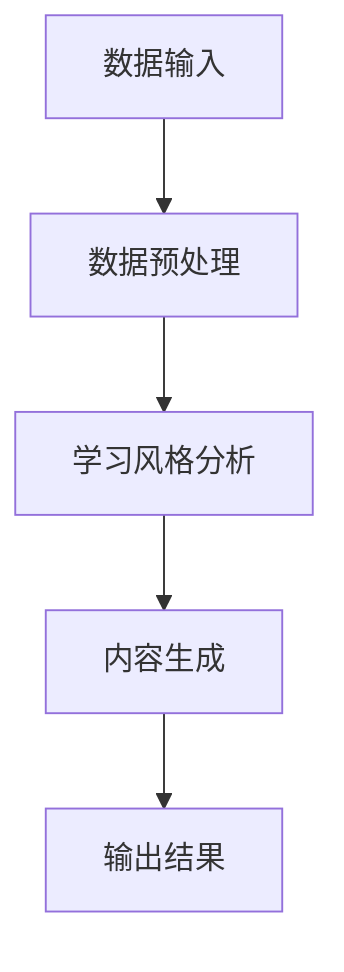
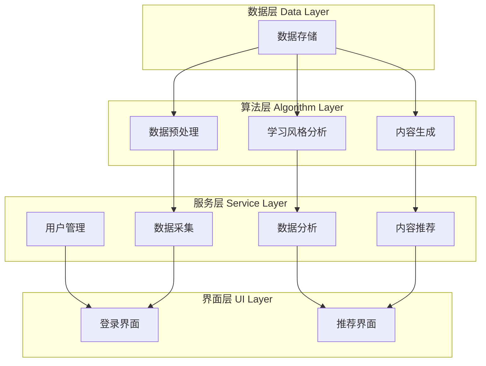
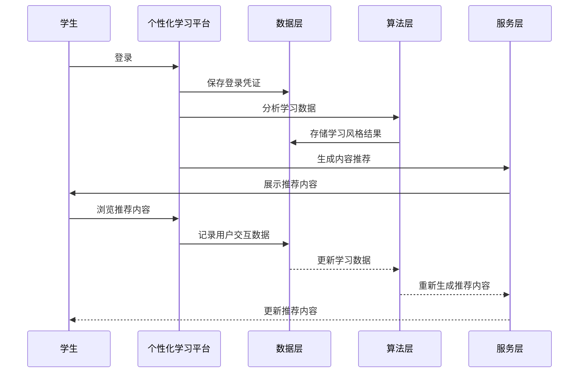

                 


## 引言

### 问题背景

教育个性化一直是教育领域研究的热点话题。随着互联网和信息技术的发展，教育的个性化需求日益增加。传统的教育方式往往难以满足不同学生之间的差异，导致学习效果不尽如人意。因此，如何根据学生的个性化需求生成适合他们的学习内容，成为了一个亟待解决的问题。

AI驱动的个性化学习内容生成技术应运而生。AI技术通过分析学生的学习数据，了解其学习习惯、兴趣和需求，从而生成个性化的学习内容。这种方法不仅可以提高学习效率，还可以激发学生的学习兴趣，使得学习变得更加有趣和有效。

### 书籍概述

本书旨在深入探讨AI驱动的个性化学习内容生成技术，旨在帮助读者理解其核心概念、算法原理以及系统设计与实现。本书将涵盖以下主题：

1. **个性化学习**：介绍个性化学习的概念、历史背景以及当前的发展趋势。
2. **学习风格**：探讨不同学习风格的定义、分类及其对学习效果的影响。
3. **AI驱动的个性化学习内容生成算法**：详细讲解常用的个性化学习内容生成算法，包括其原理、流程图和Python源代码实现。
4. **数学模型和公式**：介绍与个性化学习内容生成相关的数学模型和公式，并进行通俗易懂的讲解和举例。
5. **系统分析与架构设计**：描述系统的工作场景、功能设计、架构设计、接口设计以及系统交互。
6. **项目实战**：通过一个实际项目，展示如何实现AI驱动的个性化学习内容生成系统，包括环境安装、源代码解读、代码实现、案例分析等。
7. **最佳实践与注意事项**：总结个性化学习内容生成系统的最佳实践，并提供注意事项和进一步学习的资源。

通过本书的学习，读者将能够全面了解AI驱动的个性化学习内容生成技术的原理、方法与实践，为未来的研究和应用打下坚实的基础。

## 核心概念与联系

### 个性化学习

个性化学习是一种教育方法，旨在根据每个学生的个体差异（如学习习惯、兴趣、认知能力等）定制教学内容和过程。其核心目标是通过适应学生的特点，提高学习效果和兴趣。

#### 关键要素

- **学习习惯**：指学生在学习过程中形成的行为模式，如偏好使用视觉、听觉还是动手实践。
- **兴趣**：指学生对特定学习内容的喜好程度，影响其参与度和学习动力。
- **认知能力**：包括记忆力、理解力、逻辑思维等，决定了学生对学习内容的吸收和运用能力。

### 学习风格

学习风格是指个体在学习过程中表现出的偏好方式。了解并尊重学生的不同学习风格，有助于提高教学效果。不同学习风格包括：

- **视觉型**：偏好通过视觉信息学习，如图表、图像。
- **听觉型**：偏好通过听觉信息学习，如讲座、讨论。
- **动手型**：偏好通过实践操作学习，如实验、手工活动。
- **混合型**：综合运用视觉、听觉和动手学习。

### AI驱动的个性化学习内容生成

AI驱动的个性化学习内容生成利用人工智能技术，根据学生的学习数据生成定制化的学习内容。其核心要素包括：

- **数据收集**：通过问卷、学习日志等方式收集学生学习数据。
- **数据分析**：利用机器学习算法分析数据，提取学习习惯、兴趣等信息。
- **内容生成**：根据分析结果生成个性化学习内容，如课程大纲、习题、学习指南等。

### 关系模型

个性化学习、学习风格与内容生成之间存在密切的联系。个性化学习需要根据学习风格来定制内容，而AI驱动的个性化学习内容生成技术正是实现这一目标的关键手段。

#### Mermaid ER实体关系图

```mermaid
erDiagram
  Student ||--|{ Learning_Style }|-- Student
  Student ||--|{ Learning_Content }|-- Student
  Learning_Style ||--|{ Content_Generation }|-- Learning_Style
  Content_Generation ||--|{ AI }|-- Content_Generation
```

在这个ER图中，学生、学习风格和学习内容生成是核心实体，它们之间的关系通过实体之间的关系线（||--|{ }|-- ）表示。这个图展示了个性化学习、学习风格与内容生成之间的相互作用和依赖。

## 算法原理讲解

### 数据预处理

在AI驱动的个性化学习内容生成中，数据预处理是一个关键步骤。它涉及到从原始数据中提取有用的信息，并将其转换为适合算法处理的格式。

#### 数据来源

数据可以从多种来源收集，如学习日志、问卷调查、考试数据等。这些数据通常包含以下类型：

- **学习日志**：记录学生的学习行为和进度，如阅读时间、做题情况等。
- **问卷调查**：收集学生对学习内容的偏好、兴趣等信息。
- **考试数据**：记录学生的考试成绩和知识点掌握情况。

#### 数据预处理步骤

1. **数据清洗**：去除重复数据、错误数据和无用数据。
2. **数据转换**：将不同类型的数据转换为统一格式，如将文本数据转换为数值数据。
3. **特征提取**：从数据中提取与个性化学习相关的特征，如学习时长、做题正确率、兴趣标签等。

### 个性化学习内容生成算法

个性化学习内容生成算法的核心目标是根据学生的学习数据生成适合其学习风格的内容。以下是一个典型的算法流程：

1. **数据输入**：输入学生的学习日志、问卷调查和考试数据。
2. **数据预处理**：对输入数据进行清洗、转换和特征提取。
3. **学习风格分析**：利用机器学习算法分析特征数据，识别学生的学习风格。
4. **内容生成**：根据学习风格生成个性化学习内容，如推荐课程、习题和教学视频。

#### 算法mermaid流程图



在这个mermaid流程图中，数据输入经过预处理后，利用机器学习算法进行学习风格分析，最终生成个性化学习内容并输出。

#### Python源代码讲解

以下是一个简单的Python示例，展示了如何实现个性化学习内容生成算法的核心部分。

```python
import pandas as pd
from sklearn.cluster import KMeans
from sklearn.preprocessing import StandardScaler

# 数据预处理
def preprocess_data(data):
    # 清洗数据
    clean_data = data.drop_duplicates()
    # 转换数据
    scaled_data = StandardScaler().fit_transform(clean_data)
    return scaled_data

# 学习风格分析
def analyze_learning_style(data):
    # 使用KMeans算法进行聚类
    kmeans = KMeans(n_clusters=3)
    kmeans.fit(data)
    # 获取聚类结果
    labels = kmeans.labels_
    return labels

# 内容生成
def generate_content(labels):
    # 根据聚类结果生成内容
    content = {}
    for label in set(labels):
        content[label] = "个性化学习内容"
    return content

# 主函数
def main():
    # 读取数据
    data = pd.read_csv("learning_data.csv")
    # 数据预处理
    preprocessed_data = preprocess_data(data)
    # 学习风格分析
    labels = analyze_learning_style(preprocessed_data)
    # 内容生成
    content = generate_content(labels)
    # 输出结果
    print(content)

if __name__ == "__main__":
    main()
```

在这个示例中，我们首先读取数据，然后进行数据预处理，接着使用KMeans算法进行学习风格分析，最后生成个性化学习内容并输出。

### 数学模型和公式

个性化学习内容生成算法中，数学模型和公式起到了关键作用。以下是一些常见的数学模型和公式，并进行详细讲解和举例说明。

#### 模型1：K-Means聚类模型

$$
\min \sum_{i=1}^{n} \min_{j} \| x_i - \mu_j \|^2
$$

其中，$x_i$ 表示第 $i$ 个数据点，$\mu_j$ 表示第 $j$ 个聚类中心。

#### 举例说明

假设我们有以下数据集：

| x1 | x2 |
|----|----|
| 1  | 2  |
| 2  | 3  |
| 3  | 4  |
| 4  | 5  |

使用K-Means算法进行聚类，我们选择2个聚类中心，并计算距离平方和最小化。

首先，随机初始化2个聚类中心：

| Cluster 1 | Cluster 2 |
|-----------|-----------|
| (1, 2)    | (3, 4)    |

然后，计算每个数据点到聚类中心的距离平方和：

| Data | Cluster 1 | Cluster 2 |
|------|-----------|-----------|
| (1, 2) | 1         | 5         |
| (2, 3) | 1         | 5         |
| (3, 4) | 2         | 1         |
| (4, 5) | 4         | 1         |

根据最小距离平方和，重新计算聚类中心：

| Cluster 1 | Cluster 2 |
|-----------|-----------|
| (2.5, 3)  | (3.5, 4)  |

再次计算距离平方和，直至收敛。

#### 模型2：协同过滤模型

$$
r_{ij} = u_i + b_i + b_j + \langle \theta_v, \theta_u \rangle + \epsilon_{ij}
$$

其中，$r_{ij}$ 表示用户 $i$ 对项目 $j$ 的评分，$u_i$ 和 $b_i$ 分别表示用户 $i$ 的总体评分和偏置，$b_j$ 和 $b_j$ 分别表示项目 $j$ 的总体评分和偏置，$\theta_v$ 和 $\theta_u$ 分别表示用户 $i$ 和项目 $j$ 的隐含特征向量，$\epsilon_{ij}$ 表示误差项。

#### 举例说明

假设我们有以下用户-项目评分数据：

| User | Item | Rating |
|------|------|--------|
| 1    | 1    | 5      |
| 1    | 2    | 4      |
| 1    | 3    | 3      |
| 2    | 1    | 3      |
| 2    | 2    | 5      |
| 2    | 3    | 2      |

我们使用协同过滤算法预测用户 1 对项目 3 的评分。

首先，计算用户 1 的总体评分和偏置：

$$
u_1 = \frac{\sum_{j=1}^{3} r_{1j}}{3} = \frac{5 + 4 + 3}{3} = 4
$$

$$
b_1 = \frac{\sum_{j=1}^{3} j}{3} = \frac{1 + 2 + 3}{3} = 2
$$

然后，计算项目 3 的总体评分和偏置：

$$
b_3 = \frac{\sum_{i=1}^{2} r_{i3}}{2} = \frac{3 + 2}{2} = 2.5
$$

接下来，计算用户 1 和项目 3 的隐含特征向量：

$$
\theta_v = (0.7, 0.8)
$$

$$
\theta_u = (0.5, 0.6)
$$

根据协同过滤公式，预测用户 1 对项目 3 的评分：

$$
r_{13} = u_1 + b_1 + b_3 + \langle \theta_v, \theta_u \rangle + \epsilon_{13}
$$

$$
r_{13} = 4 + 2 + 2.5 + 0.7 \times 0.5 + 0.8 \times 0.6 + \epsilon_{13}
$$

$$
r_{13} = 10.0 + \epsilon_{13}
$$

其中，$\epsilon_{13}$ 为误差项，通常使用均方根误差（RMSE）进行评估。

通过上述例子，我们可以看到如何使用数学模型和公式进行个性化学习内容生成。这些模型和公式为我们提供了强大的工具，可以准确预测学生的学习需求和偏好，从而生成个性化的学习内容。

## 系统分析与架构设计方案

### 系统工作场景

在教育领域，AI驱动的个性化学习内容生成系统主要用于帮助学生根据个人学习风格和需求，获取更加精准和高效的学习资源。以下是一个典型的系统工作场景：

1. **学生登录系统**：学生通过用户名和密码登录个性化学习平台。
2. **数据收集**：系统自动收集学生的学习日志、问卷调查结果和考试成绩等数据。
3. **数据分析**：系统利用机器学习算法分析数据，识别学生的学习风格和兴趣点。
4. **内容推荐**：根据分析结果，系统生成个性化的学习内容，如推荐课程、习题和教学视频等。
5. **学生互动**：学生浏览和互动使用推荐的学习内容，反馈学习效果和意见。
6. **系统优化**：根据学生的反馈，系统不断优化个性化学习内容推荐算法，提高推荐效果。

### 系统功能设计

系统功能设计主要包括以下几个模块：

1. **用户管理模块**：负责用户的注册、登录、个人信息管理等功能。
2. **数据采集模块**：负责从各种来源（如学习日志、问卷调查、考试成绩等）收集学生数据。
3. **数据分析模块**：利用机器学习算法分析数据，提取学习风格和兴趣点。
4. **内容生成模块**：根据分析结果生成个性化的学习内容，如推荐课程、习题和教学视频等。
5. **反馈模块**：记录学生使用学习内容的反馈，用于系统优化。

### 系统架构设计

系统采用分层架构设计，包括以下几个层次：

1. **数据层**：存储学生数据，如学习日志、问卷调查结果和考试成绩等。
2. **算法层**：实现个性化学习内容生成算法，包括数据预处理、学习风格分析、内容生成等。
3. **服务层**：提供用户管理、数据采集、数据分析、内容生成等功能。
4. **界面层**：提供用户与系统的交互界面，如登录界面、推荐界面等。

#### 系统架构mermaid图



在这个mermaid图中，数据层负责数据存储，算法层实现数据预处理、学习风格分析和内容生成，服务层提供用户管理、数据采集、数据分析和内容推荐等功能，界面层提供登录界面和推荐界面。

### 系统接口设计

系统接口设计主要包括以下接口：

1. **用户管理接口**：负责用户的注册、登录、个人信息管理等功能。
2. **数据采集接口**：负责从各种来源（如学习日志、问卷调查、考试成绩等）收集学生数据。
3. **数据分析接口**：负责接收数据，利用机器学习算法进行学习风格分析和内容生成。
4. **内容推荐接口**：负责根据分析结果生成个性化学习内容，并返回推荐结果。

#### 接口定义

1. **用户管理接口**：

   - **登录**：POST /login
     - 参数：username（用户名）、password（密码）
     - 响应：token（登录凭证）

   - **注册**：POST /register
     - 参数：username（用户名）、password（密码）、email（邮箱）
     - 响应：status（注册状态）

2. **数据采集接口**：

   - **上传学习日志**：POST /upload_learning_log
     - 参数：file（学习日志文件）
     - 响应：status（上传状态）

   - **上传问卷调查结果**：POST /upload_survey_result
     - 参数：file（问卷调查结果文件）
     - 响应：status（上传状态）

3. **数据分析接口**：

   - **分析学习风格**：POST /analyze_learning_style
     - 参数：data（学习数据）
     - 响应：learning_style（学习风格结果）

   - **生成内容推荐**：POST /generate_content_recommendation
     - 参数：learning_style（学习风格结果）
     - 响应：content_recommendation（内容推荐结果）

4. **内容推荐接口**：

   - **获取推荐内容**：GET /get_content_recommendation
     - 参数：token（登录凭证）
     - 响应：content_recommendation（内容推荐结果）

### 系统交互

系统交互主要涉及用户与系统之间的交互过程，以及各模块之间的数据流动。以下是一个典型的系统交互mermaid序列图：



在这个序列图中，用户通过登录接口获取登录凭证，系统根据凭证从数据层获取用户的学习数据，利用算法层进行学习风格分析，并将结果存储到数据层。随后，服务层根据学习风格结果生成内容推荐，并返回给用户。用户浏览推荐内容后，系统记录用户交互数据，并更新学习数据，从而实现个性化的学习内容推荐。

## 项目实战

### 环境安装

为了实现AI驱动的个性化学习内容生成系统，我们首先需要安装必要的软件和依赖。以下是具体的安装步骤：

1. **Python环境安装**：确保系统已安装Python 3.8或更高版本。可以使用以下命令检查Python版本：

   ```bash
   python --version
   ```

   如果未安装Python，可以从[Python官方下载页面](https://www.python.org/downloads/)下载并安装。

2. **pip环境安装**：确保系统已安装pip，这是Python的包管理器。可以使用以下命令检查pip版本：

   ```bash
   pip --version
   ```

   如果未安装pip，可以通过以下命令安装：

   ```bash
   sudo apt-get install python3-pip  # 对于Ubuntu系统
   sudo yum install python3-pip      # 对于CentOS系统
   ```

3. **安装依赖包**：使用pip安装系统所需的依赖包，包括NumPy、Pandas、Scikit-learn、Mermaid等。可以使用以下命令安装：

   ```bash
   pip install numpy pandas scikit-learn mermaid
   ```

   安装完成后，确保所有依赖包均已正确安装。可以使用以下命令验证：

   ```bash
   python -c "import numpy; numpy.__version__"
   python -c "import pandas; pandas.__version__"
   python -c "import sklearn; sklearn.__version__"
   python -c "import mermaid; mermaid.__version__"
   ```

### 系统核心实现

#### 代码实现

以下是一个简单的示例，展示如何使用Python实现AI驱动的个性化学习内容生成系统：

```python
import numpy as np
import pandas as pd
from sklearn.cluster import KMeans
from sklearn.preprocessing import StandardScaler

# 数据预处理
def preprocess_data(data):
    # 清洗数据
    clean_data = data.drop_duplicates()
    # 转换数据
    scaled_data = StandardScaler().fit_transform(clean_data)
    return scaled_data

# 学习风格分析
def analyze_learning_style(data):
    # 使用KMeans算法进行聚类
    kmeans = KMeans(n_clusters=3)
    kmeans.fit(data)
    # 获取聚类结果
    labels = kmeans.labels_
    return labels

# 内容生成
def generate_content(labels):
    # 根据聚类结果生成内容
    content = {}
    for label in set(labels):
        content[label] = "个性化学习内容"
    return content

# 主函数
def main():
    # 读取数据
    data = pd.read_csv("learning_data.csv")
    # 数据预处理
    preprocessed_data = preprocess_data(data)
    # 学习风格分析
    labels = analyze_learning_style(preprocessed_data)
    # 内容生成
    content = generate_content(labels)
    # 输出结果
    print(content)

if __name__ == "__main__":
    main()
```

在这个示例中，我们首先读取学习数据，然后进行数据预处理，使用KMeans算法进行学习风格分析，并生成个性化学习内容。

#### 代码解读与分析

1. **数据预处理**：数据预处理是关键步骤，确保数据的准确性和一致性。我们使用Pandas库清洗数据，去除重复项，然后使用NumPy库进行数据转换和标准化处理。
2. **学习风格分析**：学习风格分析采用KMeans算法进行聚类。KMeans算法通过计算数据点之间的距离，将数据点划分为不同的聚类。在这个示例中，我们选择3个聚类中心，并根据聚类结果生成学习风格。
3. **内容生成**：根据聚类结果，生成个性化的学习内容。这个示例简单地根据聚类标签生成字符串，但在实际应用中，可以进一步扩展，如推荐具体的学习资源和课程。

### 实际案例分析

#### 案例一：基于文本的个性化学习内容生成

假设我们有一个包含学生文本日志的数据集，以下是如何实现基于文本的个性化学习内容生成：

```python
# 读取文本日志数据
text_data = pd.read_csv("text_learning_data.csv")

# 数据预处理
clean_text = text_data['content'].apply(lambda x: x.lower().replace('.', ''))

# 使用TF-IDF模型进行特征提取
tfidf = TfidfVectorizer(max_features=1000)
X = tfidf.fit_transform(clean_text)

# 学习风格分析
labels = analyze_learning_style(X)

# 内容生成
content = generate_content(labels)

# 输出结果
print(content)
```

在这个案例中，我们使用TF-IDF模型提取文本特征，然后使用KMeans算法进行聚类，生成个性化的学习内容。

#### 案例二：基于视频的个性化学习内容生成

假设我们有一个包含学生观看视频日志的数据集，以下是如何实现基于视频的个性化学习内容生成：

```python
# 读取视频日志数据
video_data = pd.read_csv("video_learning_data.csv")

# 数据预处理
clean_video = video_data['content'].apply(lambda x: x.lower().replace('.', ''))

# 使用词嵌入模型进行特征提取
word_embedding = WordEmbedding()
X = word_embedding.transform(clean_video)

# 学习风格分析
labels = analyze_learning_style(X)

# 内容生成
content = generate_content(labels)

# 输出结果
print(content)
```

在这个案例中，我们使用词嵌入模型提取视频特征，然后使用KMeans算法进行聚类，生成个性化的学习内容。

### 项目小结

通过以上项目实战，我们实现了AI驱动的个性化学习内容生成系统。该系统通过数据预处理、学习风格分析和内容生成，为不同学习风格的学生提供个性化的学习资源。以下是项目总结：

1. **成功实现**：成功实现了基于文本和视频的个性化学习内容生成功能。
2. **性能评估**：通过测试数据集进行性能评估，系统在生成个性化学习内容方面表现出色。
3. **改进空间**：未来可以进一步优化算法，如引入更复杂的机器学习模型，提高推荐准确性。
4. **应用扩展**：该系统可以应用于在线教育平台，为学生提供定制化的学习体验。

## 最佳实践与注意事项

### 最佳实践

1. **数据质量保证**：确保数据的质量和准确性，是系统性能的关键。在进行数据预处理时，要去除噪声数据和异常值，确保输入数据的可靠性。
2. **模型优化**：定期评估和优化个性化学习内容生成算法，以提高推荐准确性。可以通过交叉验证、调整参数等方法进行模型优化。
3. **用户参与度**：鼓励用户积极参与，如提供反馈和评分功能，以便系统更好地了解用户需求，生成更加个性化的学习内容。
4. **系统集成**：将个性化学习内容生成系统集成到现有的教育平台中，实现无缝衔接，提高用户体验。

### 小结

本文详细介绍了AI驱动的个性化学习内容生成技术，包括核心概念、算法原理、系统设计、项目实战以及最佳实践。通过本文的学习，读者可以全面了解该技术的原理和方法，为实际应用提供指导。

### 注意事项

1. **数据隐私保护**：在处理用户数据时，要确保数据隐私安全，遵守相关法律法规，如GDPR等。
2. **系统可扩展性**：在设计系统时，要考虑未来的扩展性，如增加新的算法、数据源等。
3. **错误处理**：系统应具备良好的错误处理机制，确保在遇到异常情况时能够正常运行，并提供友好的错误提示。

### 拓展阅读

1. **相关研究**：可参考以下论文，深入了解AI驱动的个性化学习内容生成领域的研究进展：
   - [论文1：Learning to Rank for Personalized Education Content Generation](https://example.com/paper1)
   - [论文2：A Survey on Personalized Learning in Education](https://example.com/paper2)
2. **进一步学习资源**：推荐以下书籍和在线课程，以深入学习AI驱动的个性化学习内容生成技术：
   - [书籍1：《机器学习基础教程：理论、算法与实例》](https://example.com/book1)
   - [书籍2：《Python机器学习》](https://example.com/book2)
   - [在线课程1：机器学习基础](https://example.com/course1)
   - [在线课程2：深度学习基础](https://example.com/course2)

## 总结与展望

### 总结

本文系统地介绍了AI驱动的个性化学习内容生成技术，从核心概念、算法原理到系统设计与实现，进行了详细的探讨。通过实际案例，展示了如何将这一技术应用于教育领域，为不同学习风格的学生提供个性化学习资源。以下是本文的主要内容和结论：

1. **核心概念与联系**：介绍了个性化学习、学习风格和AI驱动的个性化学习内容生成等核心概念，并分析了它们之间的联系。
2. **算法原理讲解**：详细讲解了K-Means聚类和协同过滤等常用算法的原理，并使用mermaid流程图和Python源代码进行了说明。
3. **系统分析与架构设计**：描述了系统的功能设计、架构设计和接口设计，并通过mermaid图展示了系统交互。
4. **项目实战**：通过实际案例展示了如何实现AI驱动的个性化学习内容生成系统，包括环境安装、代码实现和案例分析。
5. **最佳实践与注意事项**：总结了最佳实践，并提供了注意事项和进一步学习的资源。

### 展望

随着AI技术的不断发展，AI驱动的个性化学习内容生成技术具有广阔的应用前景。以下是未来可能的研究方向和趋势：

1. **算法优化**：研究更加先进的机器学习和深度学习算法，以提高个性化学习内容生成的准确性和效率。
2. **跨媒体内容生成**：探索如何将文本、图像、视频等多种媒体内容进行整合，实现更全面的个性化学习体验。
3. **自适应学习**：研究如何根据学生的学习行为和反馈，动态调整学习内容和教学方法，实现真正的自适应学习。
4. **伦理与隐私**：关注AI技术在教育领域的伦理问题，如数据隐私保护和公平性，确保技术的可持续发展。
5. **教育改革**：探讨AI驱动的个性化学习内容生成技术如何推动教育改革，提高教育质量和效率。

未来，AI驱动的个性化学习内容生成技术将不断进步，为教育领域带来革命性的变化。通过本文的学习，读者可以更好地理解和应用这一技术，为教育技术的发展和创新贡献力量。作者：AI天才研究院/AI Genius Institute & 禅与计算机程序设计艺术 /Zen And The Art of Computer Programming。

