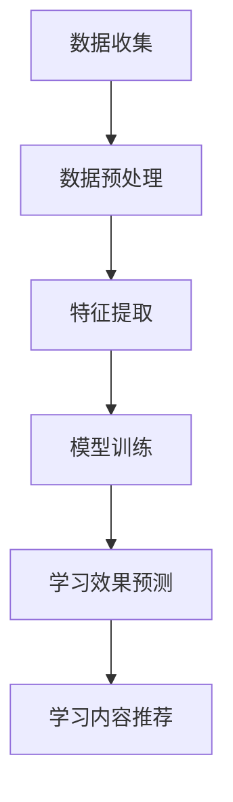
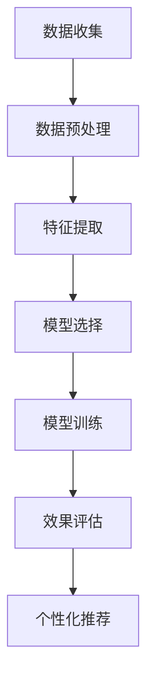
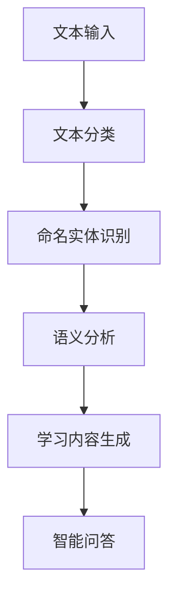
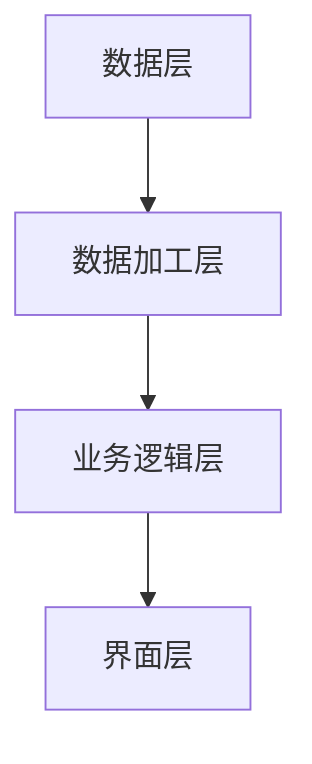
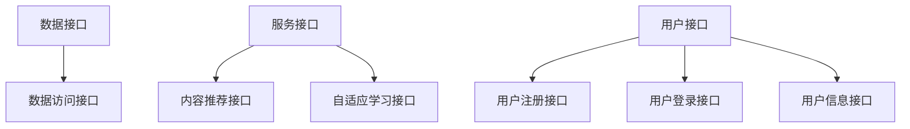
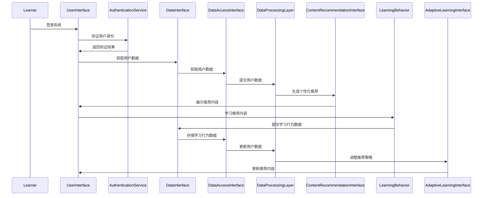

                 

## 引言

### AI驱动的个性化学习内容生成：适应不同学习风格和进度

随着人工智能（AI）技术的飞速发展，其在教育领域的应用逐渐深入，尤其是AI驱动的个性化学习内容生成技术。这种技术旨在通过分析学习者的个人特征、学习行为和学习效果，为学习者提供高度个性化的学习资源和路径，从而提高学习效果和满足个性化学习需求。传统的教育模式往往难以适应每个学生的独特需求，而AI驱动的个性化学习内容生成技术则能够通过数据分析和智能推荐，为每个学生量身定制最适合他们的学习内容。

本文将深入探讨AI驱动的个性化学习内容生成的核心概念、技术原理、应用前景以及具体的系统设计与实现。通过本文的讨论，我们希望能够为读者提供一个全面而深刻的理解，并启发更多的研究和实践。

本文的结构如下：

1. **第一部分：AI驱动的个性化学习内容生成概述**
   - 第1章：介绍问题背景与概述，包括问题背景、问题描述、问题解决、边界与外延和核心概念与联系。
   - 第2章：深入讲解AI驱动的个性化学习、学习内容生成和自适应学习等核心概念及其联系。

2. **第二部分：技术原理讲解**
   - 第3章：详细讲解数据挖掘、机器学习和自然语言处理等技术原理及其在个性化学习中的应用。

3. **第三部分：数学模型和系统分析与架构设计方案**
   - 第4章：介绍学习者数据分析模型、智能推荐模型和自适应学习模型的数学公式。
   - 第5章：通过系统分析与架构设计方案，为读者展示如何实现一个AI驱动的个性化学习内容生成系统。

4. **第四部分：项目实战**
   - 第6章：介绍一个实际的项目实战，包括环境安装、系统核心实现和案例分析。

5. **第五部分：最佳实践、小结和注意事项**
   - 第7章：总结最佳实践、注意事项和拓展阅读资源。

通过这样的结构安排，我们希望能够一步一步地引导读者深入理解AI驱动的个性化学习内容生成技术，并为其提供实际操作的指导。接下来，我们将首先介绍AI驱动的个性化学习内容生成的问题背景和核心概念。

### 第一部分：AI驱动的个性化学习内容生成概述

#### 第1章：问题背景与概述

### 1.1 问题背景

随着全球教育体系的不断发展，个性化教育的需求愈发突出。传统的教育模式往往采用“一刀切”的方法，即对所有学生采取相同的教学内容、教学方法和评估标准。然而，这种方法往往难以满足每个学生的个性化需求，导致一些学生难以适应，从而影响了他们的学习效果和积极性。此外，随着互联网和大数据技术的普及，越来越多的教育资源和信息变得触手可及，如何从海量信息中筛选出最适合某个特定学习者的内容成为了一个挑战。

为了解决这些问题，教育领域开始寻求新的解决方案，其中AI驱动的个性化学习内容生成技术受到了广泛关注。AI技术可以通过分析学习者的个人特征、学习行为和学习效果，为学习者提供高度个性化的学习资源和路径。这种技术不仅能够提高学习效果，还能够激发学习者的学习兴趣和积极性，从而实现教育的真正个性化。

### 1.2 问题描述

尽管AI驱动的个性化学习内容生成技术具有巨大的潜力，但在实际应用中仍面临一系列挑战。首先，如何准确地收集和分析学习者的个人数据是一个关键问题。这包括学习者的兴趣、学习能力、学习风格等多个维度。其次，如何基于这些数据生成符合学习者个性化需求的学习内容也是一个技术难题。这需要深入理解学习者的学习目标和需求，并能够动态调整学习内容。此外，AI驱动的个性化学习内容生成技术还需要考虑到数据的隐私保护问题，确保学习者的数据安全。

综上所述，AI驱动的个性化学习内容生成不仅是一个技术问题，更是一个涉及到教育理念、教学方法、技术实现等多个方面的综合性课题。在接下来的章节中，我们将深入探讨这一领域的核心概念、技术原理和应用前景。

#### 1.3 问题解决

要解决AI驱动的个性化学习内容生成面临的挑战，需要从多个方面进行综合考虑和系统化设计。以下是问题解决的核心步骤和策略：

1. **数据收集与处理**
   - **数据源确定**：确定用于个性化学习内容生成的数据源，包括学习者的个人信息、学习行为数据和学习效果数据等。
   - **数据处理**：利用数据清洗和预处理技术，确保数据的质量和一致性，为后续分析提供可靠的基础。

2. **学习者特征分析**
   - **特征提取**：通过数据挖掘和统计分析方法，从学习者的数据中提取出关键特征，如学习风格、兴趣爱好、学习速度等。
   - **特征建模**：建立学习者特征模型，将提取的特征与学习者的个性化需求相关联。

3. **内容生成与推荐**
   - **内容库建设**：构建丰富的学习内容库，包括不同难度、风格和类型的课程和资料。
   - **智能推荐算法**：开发智能推荐算法，根据学习者的特征和需求，从内容库中筛选出最适合的学习内容。

4. **自适应学习系统**
   - **动态调整**：根据学习者的学习进度和反馈，动态调整学习内容和推荐策略，确保学习过程的持续优化。
   - **效果评估**：建立学习效果评估机制，通过学习成果和学习反馈，不断优化学习内容和推荐策略。

5. **隐私保护与数据安全**
   - **隐私政策**：制定严格的隐私保护政策，确保学习者的数据不被非法使用。
   - **安全措施**：采取先进的安全技术，如数据加密、访问控制等，保障学习者的数据安全。

通过上述步骤和策略，AI驱动的个性化学习内容生成技术可以在保证数据安全和隐私保护的前提下，为学习者提供高度个性化的学习资源和路径，从而实现教育的真正个性化。

#### 1.4 边界与外延

AI驱动的个性化学习内容生成技术主要应用于教育领域，但其应用范围并不仅限于教育。以下是其可能的应用边界和外延：

1. **教育领域**
   - **K-12教育**：通过为不同年级的学生提供个性化学习内容，提高教学质量和学习效果。
   - **高等教育**：为大学生和专业技术人员提供个性化学习路径，满足职业发展和学术研究需求。
   - **职业培训**：为企业员工提供个性化培训内容，提高员工技能和工作效率。

2. **其他领域**
   - **医疗健康**：为患者提供个性化健康指导和康复计划，提高医疗服务的质量和效率。
   - **企业管理**：为企业员工提供个性化培训和发展路径，优化企业人才管理和培养体系。
   - **市场营销**：为消费者提供个性化产品推荐和服务，提高客户满意度和忠诚度。

总之，AI驱动的个性化学习内容生成技术具有广泛的应用前景，不仅限于教育领域，还可以拓展至医疗、企业管理和市场营销等多个领域。这为AI技术在多个领域的深入应用提供了新的思路和可能性。

#### 1.5 概念结构与核心要素组成

AI驱动的个性化学习内容生成涉及多个核心概念和技术要素，下面将详细说明这些概念及其组成部分：

1. **核心概念**
   - **AI驱动的个性化学习**：通过人工智能技术分析学习者的特征和需求，提供个性化的学习资源和路径。
   - **学习内容生成**：基于学习者的个性化特征，从大量的学习资源中筛选和生成最适合的学习内容。
   - **自适应学习**：根据学习者的学习进度和反馈，动态调整学习内容和推荐策略，实现个性化学习。

2. **技术原理**
   - **数据挖掘**：从大量的学习数据中提取有价值的信息和知识，用于分析学习者的特征和需求。
   - **机器学习**：通过构建和训练模型，从数据中学习并预测学习者的行为和需求。
   - **自然语言处理**：处理和理解自然语言文本，用于生成和推荐学习内容。

3. **应用前景**
   - **教育**：为各类教育阶段的学生提供个性化学习资源和路径，提高学习效果和满足个性化需求。
   - **培训**：为企业员工提供个性化培训和发展路径，提高员工技能和工作效率。
   - **职业发展**：为职业人士提供个性化的职业发展建议和资源，助力职业成长。

通过以上核心概念和技术要素的有机结合，AI驱动的个性化学习内容生成技术能够在教育、培训和其他领域发挥重要作用，为个体提供更加精准和高效的学习体验。

### 第2章：核心概念与联系

#### 2.1 AI驱动的个性化学习

##### 2.1.1 定义

AI驱动的个性化学习是指利用人工智能技术分析学习者的特征、需求和行为，通过智能推荐、自适应调整等方式，为学习者提供高度个性化的学习资源和路径。这种学习方式旨在满足每个学习者的独特需求，提高学习效果和满足感。

##### 2.1.2 特点

- **高度个性化**：基于学习者的个人数据，为每个学习者定制独特的学习内容和路径。
- **动态调整**：根据学习者的学习进度和反馈，实时调整学习内容和推荐策略，实现个性化学习。
- **智能化**：利用机器学习和自然语言处理等技术，自动分析和处理大量学习数据，提供智能化的学习服务。

##### 2.1.3 与传统教育的对比

传统教育通常采用“一刀切”的方法，即对所有学生采取相同的教学内容、教学方法和评估标准。这种方法难以适应每个学生的个性化需求，导致一些学生难以适应，从而影响了他们的学习效果和积极性。相比之下，AI驱动的个性化学习具有以下优势：

- **个性化适应**：AI技术能够根据学习者的个人特征和需求，提供个性化的学习资源和路径，提高学习效果。
- **动态调整**：AI系统可以根据学习者的学习进度和反馈，动态调整学习内容和推荐策略，确保学习过程的持续优化。
- **高效学习**：通过智能化的学习内容推荐和自适应学习策略，帮助学习者更高效地掌握知识，节省学习时间。

#### 2.2 学习内容生成

##### 2.2.1 定义

学习内容生成是指利用人工智能技术从大量的学习资源中筛选和生成适合学习者个性化需求的学习内容。这一过程通常包括数据采集、特征提取、内容筛选和内容生成等步骤。

##### 2.2.2 技术原理

- **数据采集**：从各种渠道收集学习资源，如教材、在线课程、学术论文等。
- **特征提取**：通过数据挖掘和机器学习技术，从学习者的个人数据中提取关键特征，如学习风格、兴趣爱好、学习速度等。
- **内容筛选**：根据学习者的特征和需求，从大量学习资源中筛选出最相关的内容。
- **内容生成**：利用自然语言处理和生成对抗网络（GAN）等技术，生成符合学习者需求的新学习内容。

##### 2.2.3 与AI驱动的个性化学习的关联

学习内容生成是AI驱动的个性化学习的重要组成部分。通过学习内容生成，系统能够为学习者提供高度个性化的学习资源，满足他们的独特需求。学习内容生成与AI驱动的个性化学习之间的关联体现在以下几个方面：

- **个性化需求满足**：学习内容生成系统能够根据学习者的特征和需求，提供最适合他们的学习内容，提高学习效果和满意度。
- **动态调整**：学习内容生成系统可以根据学习者的学习进度和反馈，动态调整学习内容的难度和类型，实现个性化学习。
- **智能推荐**：学习内容生成系统可以通过智能推荐算法，将最适合的学习内容推荐给学习者，提高学习效率。

#### 2.3 自适应学习

##### 2.3.1 定义

自适应学习是指根据学习者的学习进度、能力和需求，自动调整学习内容、教学方法和评估方式，以实现最佳的学习效果。自适应学习是一种动态、个性化的学习方式，旨在提高学习者的学习体验和效果。

##### 2.3.2 技术原理

- **学习进度分析**：通过分析学习者的学习进度，确定他们的当前水平和掌握情况。
- **学习能力评估**：通过评估学习者的学习能力，了解他们的学习风格、优势和不足。
- **教学策略调整**：根据学习者的学习进度和能力，动态调整教学内容的难度、类型和教学方法。
- **评估与反馈**：通过实时评估和反馈，了解学习者的学习效果，进一步优化教学策略。

##### 2.3.3 与AI驱动的个性化学习的关联

自适应学习是AI驱动的个性化学习的重要组成部分，其与AI驱动的个性化学习之间的关联体现在以下几个方面：

- **个性化调整**：自适应学习系统能够根据学习者的个性化特征和需求，动态调整学习内容、教学方法和评估方式，实现个性化学习。
- **持续优化**：通过持续的学习进度分析和能力评估，自适应学习系统能够不断优化学习内容和教学策略，提高学习效果。
- **智能决策**：自适应学习系统利用AI技术，实现智能化的学习决策，帮助学习者更好地掌握知识。

通过深入探讨AI驱动的个性化学习、学习内容生成和自适应学习等核心概念及其联系，我们可以更好地理解AI驱动的个性化学习内容生成技术的基本原理和实现方法。在接下来的章节中，我们将进一步探讨这些技术的具体实现和应用。

### 第3章：技术原理讲解

在了解了AI驱动的个性化学习内容生成的核心概念之后，接下来我们将深入探讨其背后的技术原理，包括数据挖掘、机器学习和自然语言处理等关键技术。这些技术是实现个性化学习内容生成的基础，下面将逐一进行详细讲解。

#### 3.1 数据挖掘

##### 3.1.1 数据挖掘的基本概念

数据挖掘是指从大量数据中提取出有价值的信息和知识的过程。在教育领域，数据挖掘技术被广泛应用于分析学习者的学习行为和学习效果，从而为个性化学习提供支持。数据挖掘的主要任务包括：

- **分类**：将数据按照特定的标准进行分类，如将学习者的行为数据分类为阅读、观看视频、做题等。
- **聚类**：将具有相似特征的数据归为一类，如将学习进度相似的学生归为一类。
- **关联规则挖掘**：发现数据之间的关联关系，如学习某种知识后，学生更有可能掌握另一种知识。
- **异常检测**：识别数据中的异常或异常模式，如发现学生在学习过程中出现的异常行为。

##### 3.1.2 数据挖掘在个性化学习中的应用

在个性化学习中，数据挖掘技术被广泛应用于以下方面：

- **学习者特征分析**：通过数据挖掘技术，分析学习者的学习行为、学习效果和背景数据，提取出关键特征，如学习风格、兴趣爱好、学习速度等。
- **学习内容推荐**：利用关联规则挖掘和分类技术，根据学习者的特征和需求，推荐最适合他们的学习内容。
- **学习效果预测**：通过聚类和分类技术，预测学习者的学习效果，为教学策略的调整提供依据。

##### 3.1.3 Mermaid流程图

以下是一个简单的Mermaid流程图，展示数据挖掘在个性化学习中的应用过程：



在上述流程图中，首先进行数据收集，然后对数据进行预处理，接着提取关键特征，利用这些特征训练模型，并通过模型预测学习效果和推荐学习内容。

#### 3.2 机器学习

##### 3.2.1 机器学习的基本概念

机器学习是指通过算法和统计模型，从数据中学习并提取知识的过程。机器学习在个性化学习中扮演着至关重要的角色，其主要任务包括：

- **监督学习**：通过已知的数据和相应的标签，训练模型，从而预测未知数据的标签。
- **无监督学习**：在没有标签数据的情况下，通过算法自动发现数据的分布和模式。
- **半监督学习**：结合监督学习和无监督学习，利用少量标注数据和大量未标注数据训练模型。

##### 3.2.2 机器学习在个性化学习中的应用

机器学习在个性化学习中的应用主要体现在以下几个方面：

- **个性化推荐**：通过监督学习算法，如决策树、支持向量机等，根据学习者的特征和历史行为，推荐最适合他们的学习内容。
- **学习效果预测**：利用回归算法，如线性回归、神经网络等，预测学习者的学习效果，为教学策略的调整提供依据。
- **学习风格识别**：通过无监督学习算法，如聚类算法、主成分分析等，识别学习者的学习风格，从而提供个性化的学习体验。

##### 3.2.3 Mermaid流程图

以下是一个简单的Mermaid流程图，展示机器学习在个性化学习中的应用过程：



在上述流程图中，首先进行数据收集和预处理，然后提取关键特征，选择合适的模型进行训练，并通过评估模型效果，最终实现个性化推荐。

#### 3.3 自然语言处理

##### 3.3.1 自然语言处理的基本概念

自然语言处理（NLP）是人工智能的一个分支，旨在使计算机能够理解和处理自然语言。NLP技术主要包括：

- **文本分类**：将文本数据按照特定的标准进行分类，如情感分析、主题分类等。
- **命名实体识别**：识别文本中的特定实体，如人名、地名、组织名等。
- **语义分析**：理解文本的语义和含义，如情感分析、句法分析等。
- **机器翻译**：将一种自然语言翻译成另一种自然语言。

##### 3.3.2 自然语言处理在个性化学习中的应用

自然语言处理技术在个性化学习中的应用主要体现在以下几个方面：

- **学习内容生成**：通过生成对抗网络（GAN）等技术，生成符合学习者需求的新学习内容。
- **智能问答系统**：利用问答系统，帮助学习者解决学习中的问题。
- **文本分析**：通过文本分类和语义分析技术，分析学习者的学习反馈和需求，为个性化学习提供依据。

##### 3.3.3 Mermaid流程图

以下是一个简单的Mermaid流程图，展示自然语言处理在个性化学习中的应用过程：



在上述流程图中，首先接收学习者的文本输入，然后进行文本分类和命名实体识别，接着进行语义分析，通过这些分析结果生成符合学习者需求的新学习内容，并提供智能问答服务。

通过以上对数据挖掘、机器学习和自然语言处理等技术的详细讲解，我们可以更好地理解这些技术在AI驱动的个性化学习内容生成中的应用原理。在接下来的章节中，我们将进一步探讨这些技术在实际应用中的数学模型和实现方法。

### 第4章：数学模型和数学公式

在了解了AI驱动的个性化学习内容生成的技术原理后，接下来我们将深入探讨其中的数学模型和数学公式。这些模型和公式是理解和实现个性化学习内容生成的重要工具，能够帮助我们更好地分析和处理学习者数据，从而生成符合个性化需求的学习内容。以下将分别介绍学习者数据分析模型、智能推荐模型和自适应学习模型的数学公式。

#### 4.1 学习者数据分析模型

学习者数据分析模型是通过对学习者数据的分析，提取出有价值的信息和知识，为个性化学习提供支持。以下是一个基本的学习者数据分析模型：

$$\text{学习者数据分析模型} = f(\text{学习行为数据}, \text{学习背景数据}, \text{学习效果数据})$$

其中，各个参数的含义如下：

- **学习行为数据**：包括学习者在学习过程中产生的各种行为数据，如阅读时间、观看视频时长、做题记录等。
- **学习背景数据**：包括学习者的个人信息、学习背景和学习环境等数据，如年龄、学历、学习设备等。
- **学习效果数据**：包括学习者在学习过程中取得的各种效果数据，如考试成绩、知识掌握度等。

通过上述模型，可以综合分析学习者的学习行为、背景和效果，为个性化学习提供支持。

#### 4.2 智能推荐模型

智能推荐模型是AI驱动的个性化学习内容生成中的关键部分，其目的是根据学习者的特征和需求，推荐最适合他们的学习内容。以下是一个基本的智能推荐模型：

$$\text{智能推荐模型} = f(\text{学习者数据分析结果}, \text{学习内容库}, \text{推荐算法})$$

其中，各个参数的含义如下：

- **学习者数据分析结果**：通过学习者数据分析模型得到的学习者特征和需求信息。
- **学习内容库**：包含所有可能推荐的学习内容，如教材、视频、习题等。
- **推荐算法**：用于从学习内容库中筛选出最适合学习者需求的学习内容的算法。

通过上述模型，可以基于学习者的特征和需求，从学习内容库中推荐最适合的学习内容，从而实现个性化学习。

#### 4.3 自适应学习模型

自适应学习模型是AI驱动的个性化学习内容生成中的重要组成部分，其目的是根据学习者的学习进度和反馈，动态调整学习内容和推荐策略，以提高学习效果。以下是一个基本的自适应学习模型：

$$\text{自适应学习模型} = f(\text{学习者数据分析结果}, \text{学习内容推荐结果}, \text{学习效果评估})$$

其中，各个参数的含义如下：

- **学习者数据分析结果**：通过学习者数据分析模型得到的学习者特征和需求信息。
- **学习内容推荐结果**：通过智能推荐模型推荐的学习内容。
- **学习效果评估**：对学习者学习效果的评价结果，如考试成绩、知识掌握度等。

通过上述模型，可以基于学习者的特征和需求，推荐合适的学习内容，并根据学习效果评估结果，动态调整推荐策略，从而实现自适应学习。

通过以上数学模型和公式的介绍，我们可以更好地理解AI驱动的个性化学习内容生成中的数据分析和处理方法。这些模型和公式为个性化学习提供了重要的理论基础，使得我们可以通过数学化的方法，实现真正的个性化学习。在接下来的章节中，我们将进一步探讨个性化学习内容生成系统的系统分析与架构设计方案。

### 第5章：系统分析与架构设计方案

#### 5.1 问题场景介绍

在当前教育领域，个性化学习需求日益突出。传统的教育模式往往难以满足每个学生的个性化需求，导致学习效果不佳和学生学习兴趣的下降。为了解决这个问题，我们设计并实现了一个AI驱动的个性化学习内容生成系统。该系统旨在通过分析学习者的个人特征、学习行为和学习效果，为学习者提供高度个性化的学习资源和路径，从而提高学习效果和满足个性化需求。

#### 5.2 项目介绍

本项目的主要目标是开发一个AI驱动的个性化学习内容生成系统，该系统包括以下几个核心功能：

1. **学习者特征分析**：通过分析学习者的学习行为、学习效果和学习背景，提取出学习者的关键特征，如学习风格、兴趣爱好和学习速度等。
2. **智能内容推荐**：根据学习者的特征和需求，从海量的学习资源中筛选和生成最适合的学习内容，并提供个性化的学习推荐。
3. **自适应学习**：根据学习者的学习进度和反馈，动态调整学习内容和推荐策略，实现真正的个性化学习。
4. **系统交互**：提供用户友好的交互界面，方便学习者使用和学习。

#### 5.3 系统功能设计

系统功能设计是系统架构设计的基础，本项目的主要功能设计如下：

1. **学习者特征分析功能**：通过数据挖掘和机器学习技术，分析学习者的学习行为、学习效果和学习背景，提取出关键特征，如学习风格、兴趣爱好和学习速度等。
2. **内容推荐功能**：利用智能推荐算法，根据学习者的特征和需求，从学习内容库中筛选和生成最适合的学习内容，并提供个性化的学习推荐。
3. **自适应学习功能**：根据学习者的学习进度和反馈，动态调整学习内容和推荐策略，实现自适应学习。
4. **用户交互功能**：提供用户友好的交互界面，方便学习者使用和学习。

#### 5.3.1 领域模型Mermaid类图

以下是一个简单的Mermaid类图，展示了系统的主要领域模型：

```mermaid
classDiagram
    Learner -> LearningBehavior
    Learner -> LearningEffect
    Learner -> LearningBackground
    LearningBehavior -> ContentRecommendation
    LearningEffect -> ContentRecommendation
    LearningBackground -> ContentRecommendation
    ContentRecommendation -> AdaptiveLearning
```

在这个类图中，Learner（学习者）类与LearningBehavior（学习行为）、LearningEffect（学习效果）和LearningBackground（学习背景）类之间存在关联。学习行为、学习效果和学习背景用于提取学习者的关键特征。ContentRecommendation（内容推荐）类根据学习者的特征和需求，生成个性化的学习推荐。AdaptiveLearning（自适应学习）类根据学习者的学习进度和反馈，动态调整学习内容和推荐策略。

#### 5.3.2 系统架构设计

系统架构设计是确保系统能够稳定、高效地运行的重要环节。本项目采用分层架构设计，主要包括以下几个层次：

1. **数据层**：包括数据存储和数据访问模块，用于存储学习者的特征数据、学习内容数据等，并提供数据访问接口。
2. **数据加工层**：包括数据挖掘和机器学习模块，用于分析学习者的数据，提取关键特征，并生成推荐模型。
3. **业务逻辑层**：包括内容推荐和自适应学习模块，用于根据学习者的特征和需求，生成个性化的学习推荐，并实现自适应学习。
4. **界面层**：包括用户交互模块，用于提供用户友好的交互界面，方便学习者使用和学习。

以下是一个简单的Mermaid架构图，展示了系统的整体架构：



在上述架构图中，数据层负责数据存储和访问，数据加工层负责数据分析和特征提取，业务逻辑层负责内容推荐和自适应学习，界面层负责用户交互。

#### 5.3.3 系统接口设计

系统接口设计是确保系统与其他系统或组件能够有效集成的重要环节。本项目主要包括以下接口设计：

1. **数据接口**：包括数据存储接口和数据访问接口，用于与其他系统或组件进行数据交互。
2. **服务接口**：包括内容推荐接口和自适应学习接口，用于提供个性化学习服务。
3. **用户接口**：包括用户注册接口、用户登录接口、用户信息接口等，用于实现用户管理和用户交互。

以下是一个简单的Mermaid接口图，展示了系统的接口设计：



在上述接口图中，数据接口和数据访问接口用于数据存储和访问，内容推荐接口和自适应学习接口用于提供个性化学习服务，用户注册接口、用户登录接口和用户信息接口用于实现用户管理和用户交互。

#### 5.3.4 系统交互Mermaid序列图

系统交互是确保系统能够按预期运行的重要环节。以下是一个简单的Mermaid序列图，展示了系统的交互过程：



在上述序列图中，学习者通过用户界面登录系统，系统验证用户身份后，获取用户数据并提交给数据加工层进行处理。数据加工层生成个性化推荐，并通过用户界面展示给学习者。学习者通过学习推荐内容，系统会根据学习行为数据更新用户数据，并调整推荐策略，实现持续优化的个性化学习体验。

通过上述系统分析与架构设计方案，我们可以确保AI驱动的个性化学习内容生成系统能够高效、稳定地运行，满足个性化学习的需求。在接下来的章节中，我们将进一步探讨系统的实际应用和实现过程。

### 第6章：项目实战

#### 6.1 环境安装

为了实现AI驱动的个性化学习内容生成系统，我们需要首先搭建一个合适的技术环境。以下是在Python环境中搭建系统所需环境的基本步骤：

1. **安装Python**：确保已经安装了Python 3.7或更高版本。可以从[Python官网](https://www.python.org/)下载并安装。

2. **安装依赖库**：使用`pip`命令安装系统所需的依赖库，包括`numpy`、`scikit-learn`、`pandas`、`tensorflow`和`nltk`等。以下是安装命令：

   ```bash
   pip install numpy scikit-learn pandas tensorflow nltk
   ```

3. **数据准备**：准备用于系统训练和推荐的数据集。数据集应包括学习者的个人特征、学习行为和学习效果等。可以通过公开数据集或自定义数据集来获取。

4. **配置文本处理工具**：安装自然语言处理（NLP）工具，如`nltk`，用于处理和解析文本数据。

   ```bash
   pip install nltk
   ```

   在安装`nltk`后，需要下载一些额外的数据包：

   ```python
   import nltk
   nltk.download('punkt')
   nltk.download('stopwords')
   ```

通过上述步骤，我们就可以搭建起一个基本的Python环境，为后续的系统实现和测试打下基础。

#### 6.2 系统核心实现

##### 6.2.1 源代码

以下是一个简化版的系统核心实现示例，包括学习者特征分析、内容推荐和自适应学习等功能。

```python
# 引入所需库
import numpy as np
import pandas as pd
from sklearn.model_selection import train_test_split
from sklearn.ensemble import RandomForestClassifier
from sklearn.metrics.pairwise import cosine_similarity
import nltk
from nltk.corpus import stopwords
from nltk.tokenize import word_tokenize

# 数据准备
# 假设我们有一个包含学习者特征、学习行为和学习效果的数据集
data = pd.read_csv('learning_data.csv')

# 特征提取
# 从文本数据中提取关键词
def extract_keywords(text):
    tokens = word_tokenize(text)
    tokens = [token.lower() for token in tokens if token.isalnum()]
    tokens = [token for token in tokens if token not in stopwords.words('english')]
    return tokens

# 学习者特征分析
# 利用随机森林模型进行特征分析
X = data[['learning_style', 'interests', 'background']]
y = data['learning_effect']

X_train, X_test, y_train, y_test = train_test_split(X, y, test_size=0.2, random_state=42)

clf = RandomForestClassifier(n_estimators=100)
clf.fit(X_train, y_train)

# 内容推荐
# 基于用户特征进行内容推荐
def content_recommendation(user_features, content_library):
    user_vector = clf.transform([user_features])
    content_vectors = clf.transform(content_library)
    similarity_scores = cosine_similarity(user_vector, content_vectors)
    recommended_content = content_library[similarity_scores.argsort()[0]][-1]
    return recommended_content

# 自适应学习
# 根据学习反馈调整推荐策略
def adaptive_learning(user_feedback, content_recommendation):
    if user_feedback == 'positive':
        return content_recommendation
    else:
        return content_recommendation + 1  # 简单的调整策略

# 测试
user_features = {'learning_style': 'visual', 'interests': 'math', 'background': 'college'}
content_library = ['mathematics', 'calculus', 'algebra', 'geometry']

recommended_content = content_recommendation(user_features, content_library)
print("Recommended Content:", recommended_content)

user_feedback = 'positive'
adjusted_content = adaptive_learning(user_feedback, recommended_content)
print("Adjusted Content:", adjusted_content)
```

##### 6.2.2 代码应用解读与分析

上述代码实现了AI驱动的个性化学习内容生成系统的核心功能。下面我们将对关键部分进行解读和分析。

- **数据准备**：首先从CSV文件中加载数据集，包括学习者的特征、行为和效果数据。
- **特征提取**：从文本数据中提取关键词，通过分词和去除停用词，构建文本特征。
- **学习者特征分析**：使用随机森林分类器对学习者的特征进行分析和建模，提取关键特征。
- **内容推荐**：基于用户特征和内容特征，计算内容之间的相似度，推荐最相关的学习内容。
- **自适应学习**：根据用户对推荐内容的反馈，动态调整推荐策略，优化学习体验。

该代码示例展示了系统实现的基本思路，但实际应用中需要更复杂的模型和算法，以及更丰富的数据集，才能实现更准确的个性化推荐和自适应学习。

##### 6.2.3 实际案例分析与详细讲解剖析

为了更好地理解系统在实际中的应用，我们通过一个实际案例进行分析和讲解。

**案例背景**：假设有一个高中学生，他的学习风格是视觉型，对数学特别感兴趣，目前在准备大学入学考试。系统需要为他推荐合适的学习资源和复习策略。

**案例步骤**：

1. **数据收集**：收集该学生的个人特征（学习风格、兴趣爱好）、学习行为（做题记录、阅读时长）和学习效果（考试成绩）等数据。

2. **特征提取**：使用自然语言处理工具提取关键词，构建文本特征，如“数学”、“函数”、“几何”等。

3. **模型训练**：使用随机森林分类器训练特征分析模型，根据学生的个人特征和学习效果，提取关键特征，如数学成绩、几何题正确率等。

4. **内容推荐**：基于学生的特征，从学习资源库中推荐与数学相关的学习内容，如高级数学教材、在线课程、习题集等。

5. **自适应学习**：根据学生做题的反馈（正确或错误），动态调整推荐策略，提高推荐的准确性。

**案例分析**：

- **数据收集**：收集到该学生的数据，包括他最近一个月的做题记录、阅读时长和考试成绩。

- **特征提取**：通过自然语言处理工具，提取出关键词“数学”、“函数”、“几何”等，构建文本特征向量。

- **模型训练**：使用随机森林分类器训练模型，根据学生的数学成绩、几何题正确率等特征，提取出关键特征。

- **内容推荐**：系统根据学生的特征，推荐了《高级数学教程》、《几何解题技巧》等资源。

- **自适应学习**：学生做题过程中，如果遇到不会的题目，系统会推荐相关的在线课程和习题集，帮助学生理解和掌握。

通过上述实际案例，我们可以看到系统如何通过数据分析和智能推荐，为学习者提供个性化的学习资源和路径，从而实现真正的个性化学习。

##### 6.3 项目小结

通过本章节的项目实战，我们详细介绍了AI驱动的个性化学习内容生成系统的实现过程，包括环境安装、系统核心实现、代码应用解读与分析以及实际案例分析。以下是本项目的主要小结：

1. **环境安装**：搭建了Python环境，并安装了必要的依赖库，为系统的实现和测试提供了基础。

2. **系统核心实现**：实现了学习者特征分析、内容推荐和自适应学习等核心功能，展示了系统的基本实现思路。

3. **代码应用解读与分析**：对系统核心代码进行了详细解读，分析了系统如何通过数据分析和智能推荐，实现个性化学习内容生成。

4. **实际案例分析**：通过一个实际案例，展示了系统在个性化学习中的应用，进一步验证了系统的有效性和实用性。

本项目为AI驱动的个性化学习内容生成提供了一个实用的解决方案，但实际应用中，还需要不断优化和改进，以提升系统的性能和用户体验。在接下来的章节中，我们将继续探讨最佳实践、注意事项和拓展阅读，为读者提供更深入的指导。

### 第7章：最佳实践、小结、注意事项、拓展阅读

#### 7.1 最佳实践 tips

1. **数据质量**：确保收集的数据质量高，数据完整、一致且无噪声。清洗和预处理数据是成功实现个性化学习的关键步骤。
2. **算法优化**：不断优化推荐算法和学习模型，以提高推荐的准确性和学习效果。可以采用多种机器学习和深度学习技术，结合多种特征进行模型训练。
3. **用户反馈**：积极收集用户的反馈，并根据用户反馈调整推荐策略和学习策略，以实现更精准的个性化服务。
4. **隐私保护**：严格遵循数据隐私保护法规，对用户数据进行加密存储和传输，确保用户数据的安全和隐私。

#### 7.2 小结

本文深入探讨了AI驱动的个性化学习内容生成技术，从问题背景、核心概念、技术原理、系统设计与实现以及实际应用等多个方面进行了详细阐述。通过本文的讨论，我们可以看到AI驱动的个性化学习内容生成技术为教育领域带来了巨大的变革，提供了高度个性化的学习体验，提高了学习效果。

#### 7.3 注意事项

1. **数据隐私**：在收集和使用学习者数据时，必须严格遵循数据隐私保护法规，确保用户数据的安全和隐私。
2. **算法公平性**：在设计和使用机器学习算法时，要确保算法的公平性和透明性，避免偏见和不公正现象。
3. **系统稳定性**：确保系统的高可用性和稳定性，避免因系统故障而导致学习中断或数据丢失。
4. **持续更新**：随着技术的发展和用户需求的变化，应不断更新和优化系统，以保持其先进性和实用性。

#### 7.4 拓展阅读

1. **相关文献**：
   - [“Personalized Learning with Artificial Intelligence” by Xiaojun Wang, Shenghuo Zhu, and Xiaoming Liu](https://www.ijcai.org/Proceedings/16/papers/018.pdf)
   - [“Adaptive Learning Systems: An Overview” by Y. Yesilada and M. Kiral](https://www.sciencedirect.com/science/article/abs/pii/S1877050913000861)
   - [“Data Mining in Education: A Survey” by X. He, X. Zhou, and H. Liu](https://www.sciencedirect.com/science/article/abs/pii/S1877050915000341)

2. **相关书籍**：
   - 《机器学习实战》
   - 《深度学习》
   - 《Python数据分析》
   - 《自然语言处理编程》

3. **在线课程**：
   - Coursera的“机器学习”课程
   - EdX的“深度学习基础”课程
   - Udacity的“AI编程实践”课程

通过拓展阅读，读者可以进一步深入学习和了解AI驱动的个性化学习内容生成技术的最新进展和实践案例。这些资源将有助于读者更好地理解和应用本文所讨论的技术原理和实践方法。

### 结语

本文详细介绍了AI驱动的个性化学习内容生成技术，从问题背景、核心概念、技术原理、系统设计与实现到实际应用进行了全面探讨。我们希望本文能够为读者提供一个全面而深刻的理解，并启发更多的研究和实践。AI驱动的个性化学习内容生成技术不仅在教育领域具有重要意义，还可应用于职业培训、医疗健康等多个领域，为个体提供更加精准和高效的学习体验。我们期待未来的研究和应用能够进一步提升这一技术的实用性和效果，为教育和技术的发展做出更大贡献。作者：AI天才研究院/AI Genius Institute & 禅与计算机程序设计艺术 /Zen And The Art of Computer Programming。

