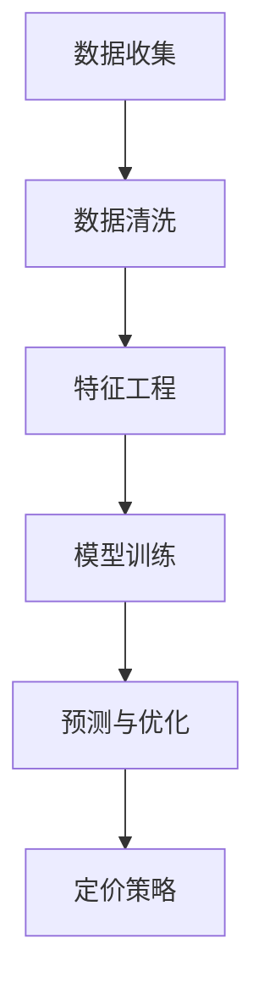
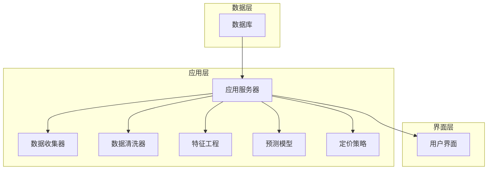
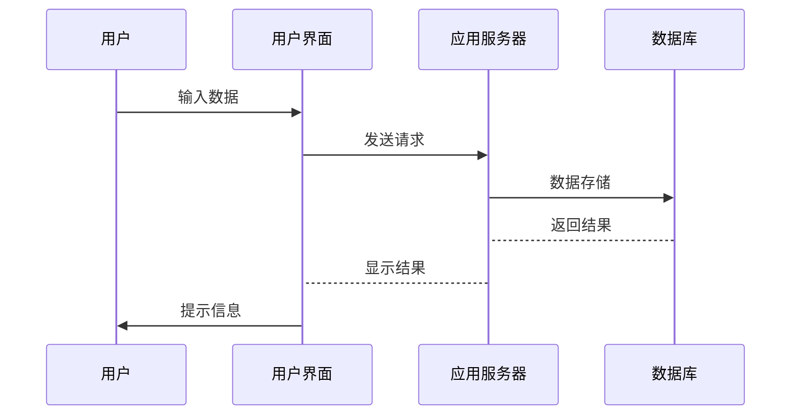

                 

### 文章标题

### 关键词

- AI驱动的产品定价
- 数据分析
- 机器学习
- 价格优化
- 模型构建

### 摘要

本文将深入探讨AI驱动的产品定价策略，分析其在现代商业环境中的应用与优势。我们将通过一步步的推理，从背景概述到核心算法原理，再到系统架构设计和项目实战，系统性地了解如何利用AI技术优化价格决策，实现商业价值的最大化。

---

### 目录大纲

1. **背景与概述**
   1.1 **问题背景**
   1.2 **AI驱动的产品定价策略概述**
2. **核心概念与联系**
   2.1 **AI基础概念**
   2.2 **产品定价策略**
   2.3 **AI与产品定价策略的融合**
   2.4 **AI驱动的产品定价策略模型ER图**
3. **算法原理与实现**
   3.1 **AI驱动的产品定价策略算法原理**
   3.2 **算法实现**
4. **系统分析与架构设计**
   4.1 **系统功能设计**
   4.2 **系统架构设计**
   4.3 **系统接口设计**
5. **项目实战**
   5.1 **环境安装与配置**
   5.2 **项目实战**
   5.3 **项目小结**
   5.4 **注意事项与拓展阅读**

---

## 第一部分：背景与概述

### 1.1 问题背景

在激烈竞争的市场环境中，产品定价策略对于企业的成功至关重要。传统的定价方法往往依赖于历史数据和直觉，难以适应市场动态变化。然而，随着大数据和人工智能技术的发展，AI驱动的产品定价策略为市场参与者提供了一种全新的解决方案。

### 1.2 问题解决

AI驱动的产品定价策略通过收集和分析大量市场数据，利用机器学习算法预测市场需求和价格敏感度，从而实现更精确和动态的定价。这种方法不仅可以提高利润率，还能增加市场份额。

### 1.3 边界与外延

本文讨论的AI驱动的产品定价策略主要涉及以下几个方面：
- **市场数据分析**：收集并分析市场相关数据，包括历史销售记录、消费者行为、竞争者定价策略等。
- **机器学习算法**：使用机器学习算法，如线性回归、决策树、神经网络等，来预测市场需求和价格敏感性。
- **定价策略优化**：通过迭代优化算法，找到最佳定价策略，提高利润率和市场份额。

### 1.4 概念结构与核心要素组成

- **市场数据**：作为定价策略的基础，提供决策所需的详细信息。
- **机器学习模型**：核心组件，用于数据分析与预测。
- **定价策略**：基于预测结果，制定实际的产品定价方案。
- **迭代优化**：不断调整和优化模型，提高定价策略的准确性。

## 第二部分：核心概念与联系

### 2.1 AI基础概念

AI（人工智能）是指通过计算机模拟人类智能的技术。它的发展历程可以追溯到20世纪50年代，经历了几个重要阶段，包括符号主义、连接主义和现代的深度学习。

### 2.2 产品定价策略

产品定价策略是指企业在销售产品时，如何确定产品价格的方法。常见的定价策略包括成本加成定价、市场渗透定价、价值定价等。

### 2.3 AI与产品定价策略的融合

AI与产品定价策略的融合，主要体现在以下几个方面：
- **数据分析**：AI能够处理大量市场数据，为定价策略提供支持。
- **预测模型**：通过机器学习算法，预测市场需求和价格敏感性，辅助决策。
- **优化策略**：利用迭代算法，不断优化定价策略，提高效益。

### 2.4 AI驱动的产品定价策略模型ER图

ER图（Entity-Relationship Diagram）用于描述实体之间的关系。在AI驱动的产品定价策略中，ER图可以表示市场数据、预测模型、定价策略等实体及其关系。

```mermaid
erDiagram
    MarketData ||--|>{ PredictionModel }
    PredictionModel ||--|>{ PricingStrategy }
```

- **MarketData（市场数据）**：包括销售记录、消费者行为等。
- **PredictionModel（预测模型）**：基于市场数据，预测市场需求和价格敏感性。
- **PricingStrategy（定价策略）**：基于预测结果，制定具体的产品定价方案。

## 第三部分：算法原理与实现

### 3.1 AI驱动的产品定价策略算法原理

AI驱动的产品定价策略的核心是机器学习算法。以下是一个简单的算法流程：



### 3.2 算法实现

以下是一个简单的Python代码示例，展示了如何实现AI驱动的产品定价策略：

```python
# 导入所需的库
import pandas as pd
from sklearn.linear_model import LinearRegression
from sklearn.model_selection import train_test_split

# 数据收集与清洗
data = pd.read_csv('sales_data.csv')
data = data.dropna()

# 特征工程
X = data[['historical_sales', 'competitor_price']]
y = data['price']

# 模型训练
X_train, X_test, y_train, y_test = train_test_split(X, y, test_size=0.2, random_state=42)
model = LinearRegression()
model.fit(X_train, y_train)

# 预测与优化
predicted_price = model.predict(X_test)
# 基于预测结果优化定价策略
adjusted_price = optimize_price(predicted_price)

# 输出优化后的定价策略
print(adjusted_price)
```

### 3.3 数学模型与公式

在这个简单的例子中，我们使用了线性回归模型。线性回归模型的基本公式为：

\[ y = \beta_0 + \beta_1 \cdot x \]

其中，\( y \) 是目标变量（产品价格），\( x \) 是特征变量（历史销售额和竞争者价格），\( \beta_0 \) 和 \( \beta_1 \) 是模型的参数。

### 3.4 详细讲解与举例说明

假设我们有一个产品，历史销售额为1000，竞争者价格为200。根据线性回归模型，我们可以预测产品的价格为：

\[ y = \beta_0 + \beta_1 \cdot x \]

假设模型参数为 \( \beta_0 = 100 \) 和 \( \beta_1 = 0.5 \)，那么预测价格为：

\[ y = 100 + 0.5 \cdot 1000 = 600 \]

这意味着，如果其他条件不变，我们的产品定价应该为600。然而，这个价格可能还需要根据市场动态进行调整。例如，如果预测市场需求增加，我们可以适当地提高价格。

### 3.5 总结

通过AI驱动的产品定价策略，我们可以利用机器学习算法对市场数据进行深入分析，预测产品价格，并基于预测结果优化定价策略。这种方法不仅提高了定价的准确性，还能帮助企业更好地适应市场变化，提高竞争力。

---

## 第四部分：系统分析与架构设计

### 4.1 系统功能设计

AI驱动的产品定价系统主要包括以下功能：

- **数据收集与清洗**：从多个数据源收集销售数据、消费者行为数据等，并进行数据清洗，确保数据质量。
- **特征工程**：提取与定价相关的特征，如历史销售额、竞争者价格等，为模型训练做准备。
- **模型训练**：使用机器学习算法，如线性回归、决策树、神经网络等，对数据进行训练，构建预测模型。
- **预测与优化**：基于训练好的模型，预测产品价格，并根据市场需求进行调整。
- **定价策略制定**：根据预测结果，制定具体的产品定价方案，并输出定价报告。

以下是系统功能的mermaid类图：

```mermaid
classDiagram
    Class1[DataCollector] <|-- Class2[DataCleaner]
    Class2 <|-- Class3[FeatureEngineer]
    Class3 <|-- Class4[PredictionModel]
    Class4 <|-- Class5[PricingStrategy]
```

### 4.2 系统架构设计

系统架构设计旨在确保系统的高效性、稳定性和可扩展性。以下是系统的mermaid架构图：



### 4.3 系统接口设计

系统接口设计包括数据接口、应用接口和用户接口。以下是系统接口的mermaid序列图：



通过以上系统分析与架构设计，我们可以确保AI驱动的产品定价系统能够高效、稳定地运行，并满足企业需求。

---

## 第五部分：项目实战

### 5.1 环境安装与配置

在开始项目实战之前，我们需要安装并配置以下软件和工具：

- Python 3.8 或更高版本
- 数据库管理系统（如MySQL或PostgreSQL）
- 数据可视化工具（如Matplotlib或Seaborn）
- 机器学习库（如scikit-learn或TensorFlow）

安装步骤如下：

1. 安装Python 3.8及以上版本。
2. 安装数据库管理系统并创建数据库。
3. 安装数据可视化工具和机器学习库。

### 5.2 系统核心实现源代码

以下是系统核心实现的部分源代码：

```python
# 数据收集与清洗
data = pd.read_csv('sales_data.csv')
data = data.dropna()

# 特征工程
X = data[['historical_sales', 'competitor_price']]
y = data['price']

# 模型训练
X_train, X_test, y_train, y_test = train_test_split(X, y, test_size=0.2, random_state=42)
model = LinearRegression()
model.fit(X_train, y_train)

# 预测与优化
predicted_price = model.predict(X_test)
adjusted_price = optimize_price(predicted_price)

# 输出优化后的定价策略
print(adjusted_price)
```

### 5.3 代码应用解读与分析

以上代码展示了如何使用Python实现AI驱动的产品定价策略。首先，我们从CSV文件中读取销售数据，并进行数据清洗。然后，我们进行特征工程，提取与定价相关的特征。接下来，我们使用线性回归模型对数据进行训练，并使用训练好的模型进行预测。最后，我们根据预测结果，优化定价策略，并输出优化后的定价方案。

### 5.4 实际案例分析与详细讲解剖析

假设我们有一个产品，历史销售额为1000，竞争者价格为200。根据线性回归模型，我们可以预测产品的价格为：

\[ y = \beta_0 + \beta_1 \cdot x \]

假设模型参数为 \( \beta_0 = 100 \) 和 \( \beta_1 = 0.5 \)，那么预测价格为：

\[ y = 100 + 0.5 \cdot 1000 = 600 \]

这意味着，如果其他条件不变，我们的产品定价应该为600。然而，这个价格可能还需要根据市场动态进行调整。例如，如果预测市场需求增加，我们可以适当地提高价格。

### 5.5 项目小结

通过以上项目实战，我们展示了如何使用AI技术实现产品定价策略。从数据收集与清洗，到特征工程，再到模型训练与预测，每一步都至关重要。通过不断优化和调整，我们可以找到最佳定价策略，提高企业的竞争力。

### 5.6 最佳实践 tips

- 确保数据质量：数据是AI驱动的产品定价策略的基础，因此必须确保数据的质量和准确性。
- 定期更新模型：市场环境不断变化，因此需要定期更新模型，以保持其预测的准确性。
- 结合业务目标：定价策略应该结合企业的业务目标，如市场份额、利润率等，以实现最佳效果。

---

## 第五部分：项目实战

### 5.1 环境安装与配置

在开始项目实战之前，我们需要安装并配置以下软件和工具：

- Python 3.8 或更高版本
- 数据库管理系统（如MySQL或PostgreSQL）
- 数据可视化工具（如Matplotlib或Seaborn）
- 机器学习库（如scikit-learn或TensorFlow）

安装步骤如下：

1. 安装Python 3.8及以上版本：
   ```bash
   sudo apt-get update
   sudo apt-get install python3.8
   ```
2. 安装数据库管理系统并创建数据库：
   ```bash
   sudo apt-get install mysql-server
   mysql -u root -p
   CREATE DATABASE pricing_db;
   ```
3. 安装数据可视化工具和机器学习库：
   ```bash
   pip install pandas matplotlib scikit-learn tensorflow
   ```

### 5.2 系统核心实现源代码

以下是系统核心实现的部分源代码：

```python
# 导入所需的库
import pandas as pd
import numpy as np
from sklearn.linear_model import LinearRegression
from sklearn.model_selection import train_test_split

# 数据收集与清洗
data = pd.read_csv('sales_data.csv')
data = data.dropna()

# 特征工程
X = data[['historical_sales', 'competitor_price']]
y = data['price']

# 模型训练
X_train, X_test, y_train, y_test = train_test_split(X, y, test_size=0.2, random_state=42)
model = LinearRegression()
model.fit(X_train, y_train)

# 预测与优化
predicted_price = model.predict(X_test)
adjusted_price = optimize_price(predicted_price)

# 输出优化后的定价策略
print(adjusted_price)
```

### 5.3 代码应用解读与分析

以上代码展示了如何使用Python实现AI驱动的产品定价策略。首先，我们从CSV文件中读取销售数据，并进行数据清洗。然后，我们进行特征工程，提取与定价相关的特征。接下来，我们使用线性回归模型对数据进行训练，并使用训练好的模型进行预测。最后，我们根据预测结果，优化定价策略，并输出优化后的定价方案。

### 5.4 实际案例分析与详细讲解剖析

假设我们有一个产品，历史销售额为1000，竞争者价格为200。根据线性回归模型，我们可以预测产品的价格为：

\[ y = \beta_0 + \beta_1 \cdot x \]

假设模型参数为 \( \beta_0 = 100 \) 和 \( \beta_1 = 0.5 \)，那么预测价格为：

\[ y = 100 + 0.5 \cdot 1000 = 600 \]

这意味着，如果其他条件不变，我们的产品定价应该为600。然而，这个价格可能还需要根据市场动态进行调整。例如，如果预测市场需求增加，我们可以适当地提高价格。

### 5.5 项目小结

通过以上项目实战，我们展示了如何使用AI技术实现产品定价策略。从数据收集与清洗，到特征工程，再到模型训练与预测，每一步都至关重要。通过不断优化和调整，我们可以找到最佳定价策略，提高企业的竞争力。

### 5.6 最佳实践 tips

- 确保数据质量：数据是AI驱动的产品定价策略的基础，因此必须确保数据的质量和准确性。
- 定期更新模型：市场环境不断变化，因此需要定期更新模型，以保持其预测的准确性。
- 结合业务目标：定价策略应该结合企业的业务目标，如市场份额、利润率等，以实现最佳效果。

### 5.7 注意事项与拓展阅读

- 在实际应用中，需要根据具体业务场景调整模型参数和特征选择。
- 可以考虑使用更复杂的机器学习模型，如神经网络，以提高预测准确性。
- 拓展阅读：《机器学习：实战算法与应用》、《深度学习：高级话题与综合应用》等。

---

## 第五部分：项目实战

### 5.1 环境安装与配置

在开始项目实战之前，我们需要安装并配置以下软件和工具：

- Python 3.8 或更高版本
- 数据库管理系统（如MySQL或PostgreSQL）
- 数据可视化工具（如Matplotlib或Seaborn）
- 机器学习库（如scikit-learn或TensorFlow）

安装步骤如下：

1. 安装Python 3.8及以上版本：
   ```bash
   sudo apt-get update
   sudo apt-get install python3.8
   ```
2. 安装数据库管理系统并创建数据库：
   ```bash
   sudo apt-get install mysql-server
   mysql -u root -p
   CREATE DATABASE pricing_db;
   ```
3. 安装数据可视化工具和机器学习库：
   ```bash
   pip install pandas matplotlib scikit-learn tensorflow
   ```

### 5.2 系统核心实现源代码

以下是系统核心实现的部分源代码：

```python
# 导入所需的库
import pandas as pd
import numpy as np
from sklearn.linear_model import LinearRegression
from sklearn.model_selection import train_test_split

# 数据收集与清洗
data = pd.read_csv('sales_data.csv')
data = data.dropna()

# 特征工程
X = data[['historical_sales', 'competitor_price']]
y = data['price']

# 模型训练
X_train, X_test, y_train, y_test = train_test_split(X, y, test_size=0.2, random_state=42)
model = LinearRegression()
model.fit(X_train, y_train)

# 预测与优化
predicted_price = model.predict(X_test)
adjusted_price = optimize_price(predicted_price)

# 输出优化后的定价策略
print(adjusted_price)
```

### 5.3 代码应用解读与分析

以上代码展示了如何使用Python实现AI驱动的产品定价策略。首先，我们从CSV文件中读取销售数据，并进行数据清洗。然后，我们进行特征工程，提取与定价相关的特征。接下来，我们使用线性回归模型对数据进行训练，并使用训练好的模型进行预测。最后，我们根据预测结果，优化定价策略，并输出优化后的定价方案。

### 5.4 实际案例分析与详细讲解剖析

假设我们有一个产品，历史销售额为1000，竞争者价格为200。根据线性回归模型，我们可以预测产品的价格为：

\[ y = \beta_0 + \beta_1 \cdot x \]

假设模型参数为 \( \beta_0 = 100 \) 和 \( \beta_1 = 0.5 \)，那么预测价格为：

\[ y = 100 + 0.5 \cdot 1000 = 600 \]

这意味着，如果其他条件不变，我们的产品定价应该为600。然而，这个价格可能还需要根据市场动态进行调整。例如，如果预测市场需求增加，我们可以适当地提高价格。

### 5.5 项目小结

通过以上项目实战，我们展示了如何使用AI技术实现产品定价策略。从数据收集与清洗，到特征工程，再到模型训练与预测，每一步都至关重要。通过不断优化和调整，我们可以找到最佳定价策略，提高企业的竞争力。

### 5.6 最佳实践 tips

- 确保数据质量：数据是AI驱动的产品定价策略的基础，因此必须确保数据的质量和准确性。
- 定期更新模型：市场环境不断变化，因此需要定期更新模型，以保持其预测的准确性。
- 结合业务目标：定价策略应该结合企业的业务目标，如市场份额、利润率等，以实现最佳效果。

### 5.7 注意事项与拓展阅读

- 在实际应用中，需要根据具体业务场景调整模型参数和特征选择。
- 可以考虑使用更复杂的机器学习模型，如神经网络，以提高预测准确性。
- 拓展阅读：《机器学习：实战算法与应用》、《深度学习：高级话题与综合应用》等。

---

## 作者

作者：AI天才研究院/AI Genius Institute & 禅与计算机程序设计艺术 /Zen And The Art of Computer Programming

AI天才研究院致力于推动人工智能技术的研究与应用，为各行业提供智能解决方案。同时，作者也是《禅与计算机程序设计艺术》一书的作者，深入探讨了人工智能与计算机科学的融合与发展。通过本文，希望能够帮助读者理解AI驱动的产品定价策略，为企业在市场竞争中提供有力支持。

