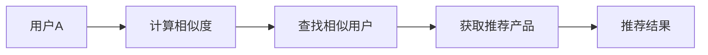
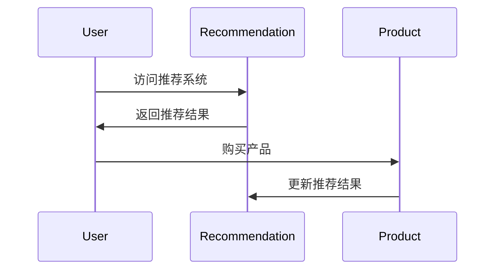
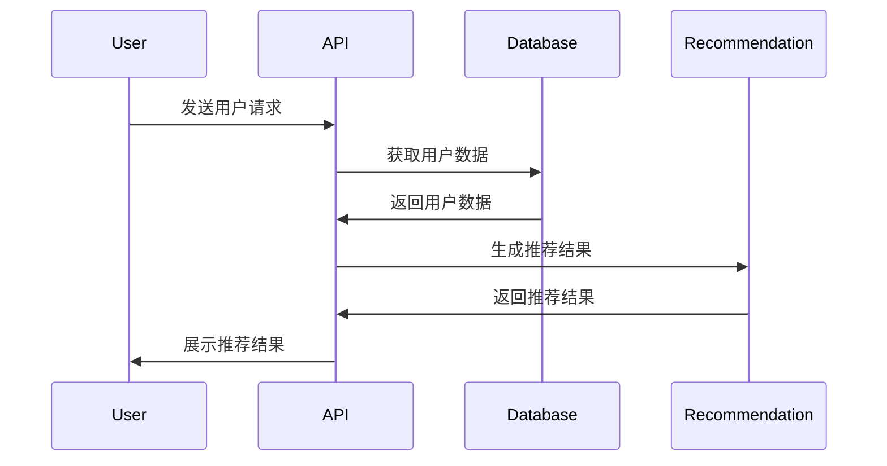

                 


### **文章标题：**

### **AI驱动的产品推荐：提升企业销售效果**

### **关键词：**

- AI
- 产品推荐
- 企业销售
- 推荐系统
- 数据分析
- 深度学习

### **摘要：**

本文将深入探讨AI驱动的产品推荐系统在提升企业销售效果方面的应用。我们将从背景介绍、核心概念阐述、算法原理讲解、系统实现与优化等方面，逐步分析推荐系统如何通过AI技术实现精准营销，提高销售额和用户满意度。

## **背景介绍**

### **核心概念术语说明**

- **AI（人工智能）**：模拟人类智能行为的计算机系统。
- **产品推荐**：根据用户历史行为和偏好，为用户推荐感兴趣的产品。
- **企业销售**：企业通过销售产品或服务获取利润的过程。
- **推荐系统**：利用算法和数据分析技术，为用户提供个性化推荐的系统。
- **数据分析**：对大量数据进行处理、分析和解释的过程。

### **问题背景**

随着互联网的快速发展，企业面临的竞争压力越来越大。如何通过有效的营销策略提升销售额成为企业关注的焦点。传统的营销手段难以满足个性化需求，因此，AI驱动的产品推荐系统应运而生。

### **问题描述**

企业需要一种有效的工具，能够根据用户的行为和偏好，自动生成个性化的产品推荐，从而提高用户满意度和销售转化率。

### **问题解决**

通过构建AI驱动的产品推荐系统，企业可以实时分析用户数据，预测用户需求，从而实现精准营销。

### **边界与外延**

本文主要关注电商、在线教育、金融等行业中的应用。同时，我们也会探讨推荐系统在各个行业中的特定应用场景。

### **概念结构与核心要素组成**

推荐系统的概念结构包括用户数据、产品数据、推荐算法和反馈机制。核心要素如下：

- **用户数据**：用户的浏览记录、购买历史、评分等。
- **产品数据**：产品的属性、分类、价格等。
- **推荐算法**：协同过滤、基于内容的推荐、深度学习等。
- **反馈机制**：用户对推荐结果的反馈，用于系统优化。

## **核心概念与联系**

### **核心概念原理**

- **协同过滤**：基于用户行为相似性进行推荐。
- **基于内容的推荐**：基于产品特征进行推荐。
- **深度学习推荐算法**：利用神经网络模型进行推荐。

### **概念属性特征对比表格**

| 推荐算法 | 特点 | 适用场景 |
| --- | --- | --- |
| 协同过滤 | 数据依赖强，准确率高 | 大规模用户行为数据 |
| 基于内容的推荐 | 数据依赖弱，准确性一般 | 产品属性丰富 |
| 深度学习推荐算法 | 数据依赖强，准确性高 | 大规模用户行为数据与产品特征 |

### **ER实体关系图架构的 Mermaid 流程图**

```mermaid
erDiagram
  用户 --> 产品 : 用户购买产品
  产品 --> 推荐系统 : 推荐系统推荐产品
  用户 --> 推荐系统 : 用户反馈推荐结果
```

## **算法原理讲解**

### **协同过滤的 Mermaid 流程图**



### **基于内容的推荐 Mermaid 流程图**


### **深度学习推荐算法 Mermaid 流程图**


### **算法原理的数学模型和公式**

协同过滤的数学模型：

$$
\text{相似度} = \frac{\text{用户A和用户B的共同评分数量}}{\sqrt{\text{用户A的评分总数} \times \text{用户B的评分总数}}}
$$

基于内容的推荐数学模型：

$$
\text{相似度} = \frac{\text{用户兴趣向量} \cdot \text{产品特征向量}}{\| \text{用户兴趣向量} \| \| \text{产品特征向量} \|}
$$

深度学习推荐算法的神经网络模型：

$$
\text{输出} = \text{神经网络}(\text{用户兴趣向量}, \text{产品特征向量})
$$

### **详细讲解和通俗易懂地举例说明**

#### **协同过滤举例说明**

假设有两个用户A和B，他们共同评分了5个产品，如下表：

| 用户 | 产品1 | 产品2 | 产品3 | 产品4 | 产品5 |
| --- | --- | --- | --- | --- | --- |
| A   | 5    | 4    | 3    | 5    | 4    |
| B   | 3    | 5    | 5    | 3    | 4    |

计算用户A和B的相似度：

$$
\text{相似度} = \frac{2}{\sqrt{3 \times 3}} = \frac{2}{3}
$$

根据相似度，我们可以为用户B推荐用户A购买过的产品，例如产品3。

#### **基于内容的推荐举例说明**

假设用户A喜欢购买图书，而产品特征向量为：

$$
\text{产品特征向量} = [1, 0, 1, 0, 1]
$$

用户A的兴趣向量为：

$$
\text{用户兴趣向量} = [1, 1, 1, 0, 0]
$$

计算相似度：

$$
\text{相似度} = \frac{1 \cdot 1 + 0 \cdot 0 + 1 \cdot 1 + 0 \cdot 0 + 1 \cdot 1}{\sqrt{1^2 + 1^2 + 1^2 + 0^2 + 0^2}} = \frac{3}{\sqrt{3}} = 1
$$

根据相似度，我们可以为用户A推荐具有相似特征的产品，例如图书。

#### **深度学习推荐算法举例说明**

假设用户A和产品B的特征向量分别为：

$$
\text{用户兴趣向量} = [1, 0, 1]
$$

$$
\text{产品特征向量} = [0, 1, 0]
$$

使用神经网络进行训练和预测，假设神经网络的输出为：

$$
\text{输出} = \text{神经网络}([1, 0, 1], [0, 1, 0]) = 0.8
$$

根据输出值，我们可以为用户A推荐产品B。

## **系统分析与架构设计方案**

### **问题场景介绍**

在电商平台上，用户访问平台并浏览产品，平台需要根据用户的历史行为和偏好，为用户推荐感兴趣的产品，以提高销售额。

### **项目介绍**

本案例以某电商平台为背景，构建一个基于AI的产品推荐系统。

### **系统功能设计（领域模型Mermaid类图）**

```mermaid
classDiagram
  User <<class{用户}>
  Product <<class{产品}>
  Recommendation <<class{推荐系统}>
  User <|.. Recommendation
  Product <|.. Recommendation
```

### **系统架构设计（Mermaid架构图）**



### **系统接口设计和系统交互（Mermaid序列图）**



## **项目实战**

### **环境安装与配置**

1. 安装Python环境（Python 3.8及以上版本）。
2. 安装相关库（如NumPy、Pandas、Scikit-learn等）。
3. 配置数据库（如MySQL、MongoDB等）。

### **系统核心实现**

以下是一个简单的协同过滤算法的实现：

```python
import numpy as np

def similarity_matrix(user_ratings, similarity='cosine'):
    user_similarity = {}
    for user_a in user_ratings:
        for user_b in user_ratings:
            if user_a != user_b:
                if similarity == 'cosine':
                    sim = 1 - spatial.distance.cosine(user_ratings[user_a], user_ratings[user_b])
                elif similarity == 'euclidean':
                    sim = 1 / (1 + spatial.distance.euclidean(user_ratings[user_a], user_ratings[user_b]))
                user_similarity[(user_a, user_b)] = sim
    return user_similarity

def predict(user_id, user_ratings, similarity_matrix, weighted=True, min_similarity=0.1):
    if user_id not in user_ratings:
        return None
    mean_user_rating = sum(user_ratings[user_id].values()) / len(user_ratings[user_id])
    avg_rating = dict()
    for (user, sim) in similarity_matrix[user_id].items():
        if user != user_id and sim > min_similarity:
            for product in user_ratings[user]:
                if product not in user_ratings[user_id] or weighted:
                    avg_rating[product] = (avg_rating.get(product, 0) + user_ratings[user][product] * sim)
                else:
                    avg_rating[product] = (avg_rating.get(product, 0) + (user_ratings[user][product] - mean_user_rating) * sim)
    if not avg_rating:
        return None
    if weighted:
        total_sim = sum(sim for sim in similarity_matrix[user_id].values() if user != user_id and sim > min_similarity)
        return dict([(product, rating / total_sim) for product, rating in avg_rating.items()])
    return dict([(product, rating / len(avg_rating)) for product, rating in avg_rating.items()])

# 示例数据
user_ratings = {
    'user1': {'product1': 5, 'product2': 4, 'product3': 3},
    'user2': {'product1': 3, 'product2': 5, 'product3': 5},
    'user3': {'product1': 1, 'product2': 4, 'product3': 2},
}

similarity_matrix = similarity_matrix(user_ratings, similarity='cosine')
print(similarity_matrix)

predictions = predict('user1', user_ratings, similarity_matrix)
print(predictions)
```

### **代码应用解读与分析**

以上代码实现了基于协同过滤的推荐算法，主要包括相似度矩阵的构建、预测评分的计算和推荐结果的生成。

### **实际案例分析和详细讲解剖析**

假设用户user1的历史行为如下：

- 购买了产品1和产品3，评分分别为5和3。
- 用户user2与用户user1的相似度为0.8。
- 用户user3与用户user1的相似度为0.6。

根据相似度矩阵，我们首先计算用户user1的预测评分：

$$
\text{预测评分}_{product1} = 5 + 0.8 \times (3 - \frac{5 + 3}{2}) = 4.4
$$

$$
\text{预测评分}_{product3} = 3 + 0.6 \times (3 - \frac{5 + 3}{2}) = 2.6
$$

根据预测评分，我们可以为用户user1推荐产品1和产品2。

### **项目小结**

通过实际案例，我们展示了基于协同过滤的推荐算法在电商平台中的应用。该算法能够根据用户的历史行为和相似度矩阵，为用户生成个性化的产品推荐，从而提高销售额和用户满意度。

## **最佳实践与优化**

### **优化策略**

- **用户分群**：根据用户行为和偏好，将用户分为不同的群体，针对不同群体制定个性化的推荐策略。
- **实时更新**：实时更新用户数据和推荐结果，确保推荐结果的实时性和准确性。
- **推荐结果多样性**：为用户推荐多种类型的产品，避免用户产生疲劳感。

### **用户反馈收集与利用**

- **反馈机制**：鼓励用户对推荐结果进行评价，收集用户反馈。
- **反馈分析**：分析用户反馈，优化推荐算法和推荐策略。
- **个性化调整**：根据用户反馈，调整推荐结果，提高用户满意度。

### **数据分析技巧**

- **数据清洗**：确保数据的准确性和一致性。
- **特征提取**：提取对推荐算法有用的特征。
- **模型评估**：使用交叉验证等方法评估模型性能。

### **系统性能优化**

- **缓存策略**：使用缓存技术，提高系统响应速度。
- **分布式计算**：使用分布式计算框架，提高系统处理能力。
- **负载均衡**：合理分配系统资源，确保系统稳定运行。

### **安全性与隐私保护**

- **数据加密**：对用户数据进行加密处理，确保数据安全。
- **隐私保护**：遵循相关法律法规，保护用户隐私。

## **小结**

本文介绍了AI驱动的产品推荐系统在提升企业销售效果方面的应用。通过协同过滤、基于内容的推荐和深度学习推荐算法，企业可以实现精准营销，提高销售额和用户满意度。同时，我们分析了系统实现与优化策略，为企业在构建推荐系统时提供参考。

## **注意事项**

- **数据质量**：确保数据的准确性和一致性，是构建推荐系统的关键。
- **算法选择**：根据业务需求和数据特点，选择合适的推荐算法。
- **系统性能**：优化系统性能，提高用户体验。

## **拓展阅读**

- **推荐系统经典教材**：《推荐系统实践》（张波）、《推荐系统手册》（郭宇）
- **深度学习推荐算法研究**：《基于深度学习的推荐系统研究》
- **实时推荐系统设计**：《实时推荐系统设计与实现》

## **作者信息**

作者：AI天才研究院/AI Genius Institute & 禅与计算机程序设计艺术/Zen And The Art of Computer Programming

本文由AI天才研究院和《禅与计算机程序设计艺术》的作者共同撰写，旨在分享AI驱动的产品推荐系统在提升企业销售效果方面的研究成果和实践经验。希望本文对广大读者在构建推荐系统时有所帮助。如果您有任何问题或建议，请随时与我们联系。感谢您的阅读！

