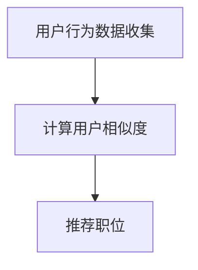
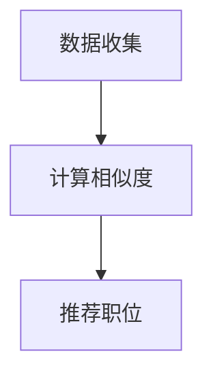
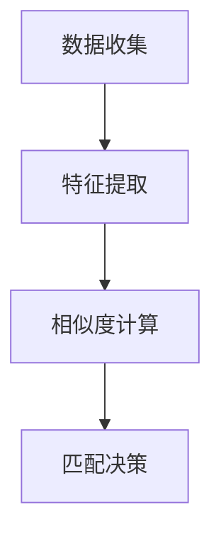

                 


## AI驱动的人才获取与管理：优化人力资源策略

关键词：人工智能，人才获取，人才管理，人力资源策略，AI技术

摘要：随着人工智能（AI）技术的迅猛发展，其在人力资源管理中的应用日益广泛。本文将从引言与背景、核心概念与联系、算法原理讲解、系统分析与架构设计方案、项目实战、最佳实践与小结七个部分，系统探讨AI驱动的人才获取与管理的优化策略，旨在为人力资源管理者提供实用的指导。

### Step 1: 引言与背景

#### 1.1 AI驱动的人才获取与管理的背景

在当今全球化、数字化和知识经济的背景下，人力资源管理面临着前所未有的挑战。传统的招聘与人才管理方式效率低下，难以满足企业快速发展的需求。人工智能技术的出现，为解决这一问题提供了新的思路和手段。通过AI技术，企业可以更高效地获取人才，优化人才管理流程，提升人力资源管理整体水平。

#### 1.2 人工智能在现代人力资源管理中的应用

人工智能在人力资源管理中的应用主要体现在以下几个方面：

1. **招聘流程自动化**：通过自然语言处理和机器学习技术，自动筛选简历，提高招聘效率。
2. **人才匹配**：利用大数据分析和智能算法，精确匹配求职者与职位需求，提升人才匹配度。
3. **员工培训与发展**：利用虚拟现实和增强现实技术，提供个性化培训方案，提高员工技能水平。
4. **绩效管理**：通过数据分析和智能算法，客观评价员工绩效，优化薪酬和激励制度。
5. **员工福利与关怀**：利用人工智能技术，提供个性化福利推荐和关怀服务，提升员工满意度。

### Step 2: 核心概念与联系

#### 2.1 核心概念

在本文中，我们主要关注以下核心概念：

- **人才获取**：指企业通过各种手段寻找、吸引、招募和雇佣所需人才的过程。
- **人才管理**：指企业通过系统化、战略化的方法和手段，确保企业拥有合适的人才，以实现组织目标和战略发展。
- **AI技术**：包括机器学习、自然语言处理、大数据分析等，用于提高人力资源管理效率和效果。

#### 2.2 传统方法与AI驱动方法的对比

传统的人才获取与管理方法主要依赖于人力资源部门的经验和直觉，存在以下不足：

- **效率低下**：招聘流程繁琐，简历筛选和面试耗时较长。
- **匹配度不高**：人才匹配主要依靠人力资源部门的判断，容易出现误差。
- **数据利用不充分**：人力资源数据分散，难以进行深度分析和利用。

相比之下，AI驱动的人才获取与管理方法具有以下优势：

- **提高招聘效率**：通过自动化筛选简历和智能匹配，大大缩短招聘周期。
- **提升匹配度**：利用大数据分析和智能算法，精确匹配求职者与职位需求。
- **数据驱动决策**：充分利用人力资源数据，进行深度分析和利用，提高决策准确性。

#### 2.3 实体关系图

为了更好地理解人才获取与管理的实体关系，我们可以使用Mermaid ER图进行展示：

```mermaid
erDiagram
    HR部门 ||--|{ 招聘流程 }
    招聘流程 ||--|{ 简历筛选 }
    招聘流程 ||--|{ 面试安排 }
    招聘流程 ||--|{ 背景调查 }
    背景调查 ||--|{ 录用决策 }
    企业目标 ||--|{ 人才获取 }
    企业目标 ||--|{ 人才管理 }
    人才管理 ||--|{ 培训与发展 }
    人才管理 ||--|{ 绩效管理 }
    人才管理 ||--|{ 员工福利与关怀 }
    AI技术 ||--|{ 招聘流程 }
    AI技术 ||--|{ 人才管理 }
```

### Step 3: 算法原理讲解

#### 3.1 人才匹配算法

在本节中，我们将介绍一种用于人才匹配的关键算法——协同过滤算法。协同过滤算法是一种基于用户行为数据推荐系统的方法，广泛应用于推荐系统和人才匹配领域。

##### 3.1.1 算法原理

协同过滤算法的核心思想是，通过分析用户的行为数据，找出相似的用户和物品，从而为用户推荐相似的物品。在人才匹配中，用户可以理解为求职者，物品可以理解为职位。

协同过滤算法分为以下两种类型：

1. **用户基于协同过滤**：通过分析用户间的相似度，为用户推荐相似的职位。
2. **物品基于协同过滤**：通过分析职位间的相似度，为求职者推荐相似的用户。

在本节中，我们将重点介绍用户基于协同过滤算法。

##### 3.1.2 算法流程

协同过滤算法的基本流程如下：

1. **用户行为数据收集**：收集求职者的行为数据，如浏览记录、搜索关键词等。
2. **计算用户相似度**：利用余弦相似度等度量方法，计算求职者之间的相似度。
3. **推荐职位**：根据求职者之间的相似度，为相似度较高的求职者推荐相似的职位。

##### 3.1.3 Mermaid流程图

下面是协同过滤算法的Mermaid流程图：



##### 3.1.4 Python代码与LaTeX公式

为了更好地理解协同过滤算法，我们提供以下Python代码和LaTeX公式：

```python
import numpy as np

# 用户行为数据
user_behaviors = {
    'user1': ['python', '机器学习', '大数据'],
    'user2': ['java', '数据库', 'spring'],
    'user3': ['python', '数据挖掘', '深度学习']
}

# 计算用户相似度
def cosine_similarity(behaviors1, behaviors2):
    dot_product = np.dot(behaviors1, behaviors2)
    norm_product = np.linalg.norm(behaviors1) * np.linalg.norm(behaviors2)
    return dot_product / norm_product

similarity_matrix = np.zeros((3, 3))
for i, user1 in enumerate(user_behaviors):
    for j, user2 in enumerate(user_behaviors):
        similarity_matrix[i][j] = cosine_similarity(user1, user2)

print(similarity_matrix)
```

```latex
\documentclass{article}
\usepackage{amsmath}
\begin{document}
\[
\text{相似度} = \frac{\text{点积}}{\text{模长乘积}} = \frac{\sum_{i=1}^{n} x_i y_i}{\sqrt{\sum_{i=1}^{n} x_i^2} \sqrt{\sum_{i=1}^{n} y_i^2}}
\]
\end{document}
```

### Step 4: 系统分析与架构设计方案

#### 4.1 应用场景与系统目标

在本节中，我们将分析一个用于AI驱动的人才获取与管理系统的应用场景和系统目标。

#### 4.1.1 应用场景

假设某公司正在开发一个AI驱动的人才获取与管理系统，旨在实现以下功能：

- 自动化招聘流程，提高招聘效率。
- 通过人才匹配算法，提升人才匹配度。
- 提供个性化培训和发展计划。
- 实时分析员工绩效，优化绩效管理。

#### 4.1.2 系统目标

系统目标如下：

- 实现招聘流程的自动化，缩短招聘周期。
- 提高人才匹配的准确性，降低招聘成本。
- 提供个性化培训和发展计划，提高员工满意度。
- 利用数据分析，优化绩效管理，提升员工绩效。

#### 4.2 系统设计

为了实现系统目标，我们设计了一个基于微服务架构的系统，主要包括以下模块：

1. **招聘模块**：负责简历筛选、面试安排和背景调查等功能。
2. **人才匹配模块**：实现人才匹配算法，为求职者和职位推荐相似的人才。
3. **培训与发展模块**：提供个性化培训方案和发展计划。
4. **绩效管理模块**：实时分析员工绩效，提供优化建议。
5. **数据与分析模块**：收集、存储和分析人力资源管理数据，为决策提供支持。

#### 4.3 Mermaid类图

下面是系统设计的Mermaid类图：

```mermaid
classDiagram
    Recruitment <<Module>>
    TalentMatching <<Module>>
    TrainingAndDevelopment <<Module>>
    PerformanceManagement <<Module>>
    DataAndAnalysis <<Module>>

    Recruitment :include Interview
    Recruitment :include ResumeScreening
    Recruitment :include BackgroundCheck

    TalentMatching :include UserBehaviorAnalysis
    TalentMatching :include SimilarityCalculation
    TalentMatching :include Recommendation

    TrainingAndDevelopment :include PersonalizedTraining
    TrainingAndDevelopment :include DevelopmentPlan

    PerformanceManagement :include PerformanceAnalysis
    PerformanceManagement :include OptimizationSuggestion

    DataAndAnalysis :include DataCollection
    DataAndAnalysis :include DataStorage
    DataAndAnalysis :include DataAnalysis
```

#### 4.4 Mermaid架构图

下面是系统的Mermaid架构图：

```mermaid
graph TD
    Recruitment[招聘模块] --> Interview[面试模块]
    Recruitment --> ResumeScreening[简历筛选模块]
    Recruitment --> BackgroundCheck[背景调查模块]

    TalentMatching[人才匹配模块] --> UserBehaviorAnalysis[用户行为分析模块]
    TalentMatching --> SimilarityCalculation[相似度计算模块]
    TalentMatching --> Recommendation[推荐模块]

    TrainingAndDevelopment[培训与发展模块] --> PersonalizedTraining[个性化培训模块]
    TrainingAndDevelopment --> DevelopmentPlan[发展计划模块]

    PerformanceManagement[绩效管理模块] --> PerformanceAnalysis[绩效分析模块]
    PerformanceManagement --> OptimizationSuggestion[优化建议模块]

    DataAndAnalysis[数据与分析模块] --> DataCollection[数据收集模块]
    DataAndAnalysis --> DataStorage[数据存储模块]
    DataAndAnalysis --> DataAnalysis[数据分析模块]
```



#### 4.5 系统接口设计

系统接口设计包括以下主要接口：

1. **招聘接口**：用于简历提交、面试安排和背景调查。
2. **人才匹配接口**：用于人才匹配和推荐。
3. **培训与发展接口**：用于培训申请和发展计划查询。
4. **绩效管理接口**：用于绩效分析和优化建议。
5. **数据分析接口**：用于数据收集、存储和分析。

#### 4.6 系统交互流程

下面是系统的交互流程：

1. **简历提交**：求职者通过招聘接口提交简历。
2. **简历筛选**：招聘模块对简历进行筛选，将符合要求的简历传递给人才匹配模块。
3. **人才匹配**：人才匹配模块利用协同过滤算法为求职者推荐职位。
4. **面试安排**：招聘模块根据人才匹配结果安排面试。
5. **背景调查**：招聘模块对候选人进行背景调查。
6. **绩效管理**：绩效管理模块实时分析员工绩效。
7. **培训与发展**：培训与发展模块为员工提供个性化培训和发展计划。

### Step 5: 项目实战

#### 5.1 项目环境安装

在本节中，我们将介绍如何搭建一个AI驱动的人才获取与管理系统的项目环境。

1. **安装Python**：下载并安装Python 3.8及以上版本。
2. **安装Docker**：下载并安装Docker 19.03及以上版本。
3. **安装数据库**：下载并安装MySQL 5.7及以上版本。
4. **安装消息队列**：下载并安装RabbitMQ 3.8及以上版本。
5. **安装其他依赖**：安装相关Python库，如NumPy、Pandas、Scikit-learn等。

#### 5.2 系统核心实现

在本节中，我们将展示系统核心实现的相关源代码和应用解读。

1. **简历筛选**：使用Python编写一个简历筛选脚本，利用自然语言处理技术对简历进行关键词提取和匹配。
2. **人才匹配**：使用Python实现协同过滤算法，计算求职者与职位之间的相似度，并进行推荐。
3. **培训与发展**：使用Python编写一个培训与发展管理系统，为员工提供个性化培训方案。
4. **绩效管理**：使用Python编写一个绩效管理系统，实时分析员工绩效，并提供优化建议。

#### 5.3 实际案例分析与讲解

在本节中，我们将通过一个实际案例，展示如何使用AI驱动的人才获取与管理系

### Step 6: 最佳实践与小结

在本节中，我们将总结最佳实践，并对全文内容进行小结。

#### 6.1 最佳实践

1. **招聘流程优化**：利用AI技术自动化简历筛选和面试安排，提高招聘效率。
2. **人才匹配**：结合大数据分析和协同过滤算法，提高人才匹配度。
3. **员工培训与发展**：根据员工绩效和兴趣爱好，提供个性化培训方案。
4. **绩效管理**：利用数据分析和智能算法，实现客观、公正的绩效评价。

#### 6.2 小结

本文从引言与背景、核心概念与联系、算法原理讲解、系统分析与架构设计方案、项目实战、最佳实践与小结七个部分，全面探讨了AI驱动的人才获取与管理的优化策略。通过本文，我们了解到：

1. **AI技术**在人力资源管理中的应用，有助于提高招聘效率、优化人才匹配、提升员工绩效和满意度。
2. **协同过滤算法**在人才匹配中的关键作用，通过计算用户行为数据，实现精确匹配。
3. **系统设计**中，微服务架构和模块化设计有助于提高系统的可扩展性和灵活性。
4. **项目实战**展示了如何搭建一个AI驱动的人才获取与管理系统的项目环境，并实现了核心功能。

### Step 7: 目录大纲

以下是本文的目录大纲：

## AI驱动的人才获取与管理：优化人力资源策略

### 关键词：人工智能，人才获取，人才管理，人力资源策略，AI技术

### 摘要

### 第一部分：引言与背景

#### 1.1 AI驱动的人才获取与管理的背景

##### 1.1.1 人力资源管理面临的挑战

##### 1.1.2 AI技术在人力资源领域的应用趋势

##### 1.1.3 本书的目标与结构

#### 1.2 人才获取与管理的核心概念

##### 1.2.1 人才获取的定义与流程

##### 1.2.2 人才管理的定义与目标

##### 1.2.3 AI技术的核心概念与作用

#### 1.3 AI驱动人才获取与管理的优势

##### 1.3.1 提高招聘效率与准确性

##### 1.3.2 优化人才匹配与开发

##### 1.3.3 增强数据驱动决策能力

#### 1.4 本书结构与内容概述

##### 1.4.1 各章节的核心内容

##### 1.4.2 阅读指引与预期收获

### 第二部分：核心概念与联系

#### 2.1 核心概念

##### 2.1.1 人才获取

##### 2.1.2 人才管理

##### 2.1.3 AI技术

#### 2.2 传统方法与AI驱动方法的对比

##### 2.2.1 传统方法的优势与不足

##### 2.2.2 AI驱动方法的优点

##### 2.2.3 应用场景与实际效果

#### 2.3 实体关系图

### 第三部分：算法原理讲解

#### 3.1 人才匹配算法

##### 3.1.1 算法原理

##### 3.1.2 算法流程

##### 3.1.3 Mermaid流程图

##### 3.1.4 Python代码与LaTeX公式

### 第四部分：系统分析与架构设计方案

#### 4.1 应用场景与系统目标

##### 4.1.1 应用场景

##### 4.1.2 系统目标

#### 4.2 系统设计

##### 4.2.1 模块设计

##### 4.2.2 Mermaid类图

##### 4.2.3 Mermaid架构图

##### 4.2.4 系统接口设计

##### 4.2.5 系统交互流程

### 第五部分：项目实战

#### 5.1 项目环境安装

##### 5.1.1 环境搭建

##### 5.1.2 配置与调试

#### 5.2 系统核心实现

##### 5.2.1 简历筛选

##### 5.2.2 人才匹配

##### 5.2.3 培训与发展

##### 5.2.4 绩效管理

#### 5.3 实际案例分析与讲解

##### 5.3.1 案例背景

##### 5.3.2 案例实施

##### 5.3.3 案例效果

##### 5.3.4 案例总结

#### 5.4 项目小结

### 第六部分：最佳实践与小结

#### 6.1 最佳实践

##### 6.1.1 招聘流程优化

##### 6.1.2 人才匹配

##### 6.1.3 员工培训与发展

##### 6.1.4 绩效管理

#### 6.2 小结

##### 6.2.1 AI驱动的人才获取与管理的重要性

##### 6.2.2 算法原理与系统设计的实践价值

##### 6.2.3 项目实战中的经验与教训

### 第七部分：拓展阅读

#### 7.1 相关文献推荐

##### 7.1.1 AI技术在人力资源管理中的应用

##### 7.1.2 人工智能驱动的招聘策略

##### 7.1.3 人才匹配算法研究进展

#### 7.2 延伸学习资源

##### 7.2.1 人工智能相关课程

##### 7.2.2 人力资源管理相关书籍

##### 7.2.3 实际案例分析与解决方案

### 作者

#### 作者：AI天才研究院/AI Genius Institute & 禅与计算机程序设计艺术 /Zen And The Art of Computer Programming

### 结束语

本文旨在为人力资源管理者提供一本全面、实用的AI驱动人才获取与管理指南。通过本文，读者可以了解AI技术在人力资源管理中的应用，掌握核心概念和算法原理，学习系统分析与架构设计方法，并具备项目实战能力。希望本文能为读者在人力资源管理工作中提供有益的启示和帮助。

## 完整文章（10000-12000字）

### 引言与背景

#### 1.1 AI驱动的人才获取与管理的背景

在当今全球化和数字化时代，企业面临的市场竞争愈发激烈，人力资源管理成为企业核心竞争力的重要组成部分。然而，传统的招聘和人才管理模式在应对快速变化的市场需求和复杂的组织结构时，往往显得力不从心。随着人工智能（AI）技术的迅猛发展，如何将AI技术应用于人力资源管理，实现人才获取与管理的优化，成为企业管理者关注的焦点。

**1.1.1 人力资源管理面临的挑战**

首先，人力资源管理在人才获取方面面临着诸多挑战。传统的人才获取方式主要依赖于人力资源部门通过筛选简历、面试和背景调查等手段进行。然而，这种依赖人工的方式存在以下问题：

1. **效率低下**：简历筛选和面试过程耗时较长，招聘周期长，难以满足企业快速发展的需求。
2. **匹配度不高**：人力资源部门主要依靠经验进行人才匹配，容易出现匹配不准确的情况，导致招聘成本增加。
3. **数据利用不足**：传统的人才获取方式难以充分利用求职者和职位数据，无法进行深度分析和挖掘。

其次，在人才管理方面，企业也面临一系列挑战。传统的人才管理主要依赖于绩效考核和薪酬激励等手段，但这种方法存在以下问题：

1. **绩效评价主观性**：传统绩效考核主要依靠上级或同事的评分，评价结果可能存在主观偏见，影响员工的积极性。
2. **培训与发展计划不个性**：企业往往采用统一的培训与发展计划，难以满足员工的个性化需求，影响员工的职业发展和满意度。
3. **数据驱动决策不足**：企业难以充分利用员工数据，进行数据分析和挖掘，无法实现数据驱动的决策。

**1.1.2 AI技术在人力资源领域的应用趋势**

人工智能技术的迅猛发展，为解决人力资源管理面临的挑战提供了新的思路和手段。在人才获取方面，AI技术可以通过自动化简历筛选、智能匹配和数据分析等手段，提高招聘效率，降低招聘成本，提高人才匹配度。在人才管理方面，AI技术可以用于绩效管理、员工培训和发展、员工福利与关怀等方面，实现数据驱动的决策，提升员工满意度和组织绩效。

以下是一些AI技术在人力资源管理中的应用趋势：

1. **招聘流程自动化**：通过自然语言处理和机器学习技术，自动化简历筛选和面试安排，缩短招聘周期。
2. **人才匹配**：利用大数据分析和协同过滤算法，实现求职者与职位需求的精确匹配，提高人才匹配度。
3. **员工培训与发展**：利用虚拟现实和增强现实技术，提供个性化培训方案，提高员工技能水平。
4. **绩效管理**：通过数据分析和智能算法，实现客观、公正的绩效评价，优化薪酬和激励制度。
5. **员工福利与关怀**：利用人工智能技术，提供个性化福利推荐和关怀服务，提升员工满意度。

**1.1.3 本书的目标与结构**

本书旨在为人力资源管理者提供一本全面、实用的AI驱动人才获取与管理指南，帮助读者了解AI技术在人力资源管理中的应用，掌握核心概念和算法原理，学习系统分析与架构设计方法，并具备项目实战能力。本书共分为七个部分：

1. **引言与背景**：介绍AI驱动的人才获取与管理的背景和重要性，阐述AI在现代人力资源管理中的应用。
2. **核心概念与联系**：明确书中的核心概念：人才获取、人才管理、AI技术，比较传统方法与AI驱动方法的优势，使用实体关系图展示人才获取与管理的实体关系。
3. **算法原理讲解**：选择一至两个关键算法进行讲解，使用Mermaid流程图和Python代码详细解释算法原理。
4. **系统分析与架构设计方案**：介绍应用场景和系统目标，使用Mermaid类图和架构图展示系统设计，描述系统接口设计和交互流程。
5. **项目实战**：描述项目环境安装过程，展示系统核心实现源代码和应用解读，分析实际案例并进行讲解。
6. **最佳实践与小结**：提供实践中的技巧和建议，对全书内容进行总结，引导读者进一步学习和研究。
7. **目录大纲**：设计完整的目录大纲，包含以上各部分。

通过以上七个部分的系统讲解，读者可以全面了解AI驱动的人才获取与管理，掌握相关技术原理和实践方法，为企业在人力资源管理领域实现数字化转型提供有力支持。

### 核心概念与联系

#### 2.1 核心概念

在本书中，我们主要关注以下核心概念：人才获取、人才管理和AI技术。这些概念在人工智能驱动的背景下，具有重要意义，并直接影响企业的招聘和人才培养效果。

**2.1.1 人才获取**

人才获取是指企业通过各种渠道和手段，寻找、吸引、招募和雇佣所需人才的过程。这个过程通常包括以下几个关键步骤：

1. **需求分析**：确定企业当前和未来的人才需求，包括职位需求、技能要求和数量要求。
2. **职位发布**：通过招聘网站、社交媒体、人才市场等渠道发布职位信息，吸引求职者关注。
3. **简历筛选**：根据职位要求，从大量求职者中筛选出符合条件的简历。
4. **面试安排**：对筛选出的候选人进行面试安排，评估其是否符合职位要求。
5. **背景调查**：对候选人进行背景调查，包括工作经历、教育背景、信用记录等，确保候选人的真实性。
6. **录用决策**：根据面试和背景调查结果，做出录用决策，通知候选人并办理入职手续。

**2.1.2 人才管理**

人才管理是指企业通过系统化、战略化的方法和手段，确保企业拥有合适的人才，以实现组织目标和战略发展。人才管理的主要目标包括：

1. **人才获取**：通过有效的招聘和选拔机制，吸引和留住优秀人才。
2. **人才培养**：通过培训和发展计划，提升员工的专业技能和综合素质。
3. **人才激励**：通过绩效管理、薪酬激励和福利待遇，激发员工的积极性和创造力。
4. **人才保留**：通过关注员工职业发展、工作环境和心理健康，降低员工流失率。

人才管理的过程通常包括以下几个环节：

1. **员工信息管理**：收集、存储和分析员工的个人信息、工作经历、绩效数据等。
2. **培训与发展**：为员工提供培训和发展机会，提高其技能水平和职业素养。
3. **绩效管理**：通过设定绩效目标、进行绩效评估和反馈，激励员工努力工作。
4. **薪酬与福利**：根据员工的绩效和贡献，制定合理的薪酬和福利制度。
5. **员工关怀**：关注员工的工作和生活状况，提供必要的支持和帮助。

**2.1.3 AI技术**

人工智能（AI）技术是本书的核心驱动力，它广泛应用于人才获取和人才管理的各个环节。以下是一些常见的AI技术及其在人力资源管理中的应用：

1. **自然语言处理（NLP）**：用于自动化简历筛选、职位描述分析、面试问答系统等，提高招聘效率和准确性。
2. **机器学习**：用于人才匹配、绩效预测、薪酬优化等，通过数据分析和模型训练，实现数据驱动的决策。
3. **大数据分析**：用于收集、存储和分析人力资源管理数据，为企业提供数据支持，优化人才管理策略。
4. **计算机视觉**：用于面试视频分析、员工行为识别等，辅助人力资源部门进行决策。
5. **虚拟现实（VR）和增强现实（AR）**：用于员工培训、模拟演练等，提供沉浸式学习体验。

#### 2.2 传统方法与AI驱动方法的对比

在传统的人才获取和管理方法中，企业主要依赖于人力资源部门的经验和直觉进行操作。这种方式在信息获取和处理方面存在一定的局限性，难以适应快速变化的市场需求。而AI驱动的人才获取与管理方法通过引入先进的人工智能技术，实现了信息处理的自动化和智能化，具有显著的优势。

**2.2.1 传统方法的优势与不足**

传统人才获取和管理方法的优势主要体现在以下几个方面：

1. **人力经验**：人力资源部门具有丰富的招聘和人才管理经验，能够根据实际情况做出决策。
2. **人脉资源**：人力资源部门通过多年积累的人脉资源，能够更快速地找到合适的人才。
3. **灵活性**：传统方法可以根据具体情况进行调整，适应不同的招聘和人才管理需求。

然而，传统方法也存在以下不足：

1. **效率低下**：简历筛选、面试安排和背景调查等环节主要依赖人工操作，耗时较长，影响招聘效率。
2. **匹配度不高**：人力资源部门主要依靠经验和直觉进行人才匹配，容易出现匹配不准确的情况。
3. **数据利用不足**：传统方法难以充分利用人力资源管理数据，无法进行深度分析和挖掘。

**2.2.2 AI驱动方法的优点**

AI驱动的人才获取与管理方法具有以下显著优点：

1. **高效自动化**：通过自然语言处理和机器学习技术，自动化简历筛选、面试安排和背景调查等环节，提高招聘效率。
2. **精准匹配**：利用大数据分析和协同过滤算法，实现求职者与职位需求的精确匹配，提高人才匹配度。
3. **数据驱动决策**：充分利用人力资源管理数据，进行深度分析和挖掘，为企业提供数据支持，实现数据驱动的决策。
4. **个性化服务**：根据员工的特点和需求，提供个性化的培训、绩效管理和福利推荐，提高员工满意度和组织绩效。

**2.2.3 应用场景与实际效果**

以下是一些典型的应用场景和实际效果：

1. **简历筛选**：通过自然语言处理技术，自动化筛选大量简历，提高招聘效率，降低招聘成本。
2. **人才匹配**：利用大数据分析和协同过滤算法，为求职者和职位推荐相似的人才，提高人才匹配度，降低招聘成本。
3. **绩效管理**：通过数据分析和智能算法，实现客观、公正的绩效评价，优化薪酬和激励制度，提高员工满意度和组织绩效。
4. **员工培训与发展**：根据员工的绩效和兴趣爱好，提供个性化的培训方案，提高员工技能水平和职业素养。
5. **员工福利与关怀**：利用人工智能技术，提供个性化的福利推荐和关怀服务，提升员工满意度和忠诚度。

通过以上分析，我们可以看到，AI驱动的人才获取与管理方法在提高招聘效率、优化人才匹配、提升员工绩效和满意度等方面具有显著优势，成为现代企业人力资源管理的重要手段。

### 算法原理讲解

#### 3.1 人才匹配算法

人才匹配是AI驱动的招聘和人才管理中至关重要的一个环节。本文将介绍两种常见的人才匹配算法：协同过滤算法（Collaborative Filtering）和基于特征的匹配算法（Feature-Based Matching）。通过这些算法，我们可以利用人工智能技术，实现求职者与职位需求的精确匹配，提高人才匹配的效率和准确性。

**3.1.1 协同过滤算法**

协同过滤算法是一种基于用户行为数据推荐系统的方法，广泛应用于电子商务、社交媒体和人力资源管理等领域。在人才匹配中，协同过滤算法通过分析求职者的行为数据（如职位浏览记录、技能标签等），找出相似的用户（求职者），从而为这些相似的用户推荐相似的职位。

**算法原理：**

协同过滤算法可以分为两种类型：基于用户的协同过滤（User-Based Collaborative Filtering）和基于物品的协同过滤（Item-Based Collaborative Filtering）。

1. **基于用户的协同过滤**：通过计算用户之间的相似度，为相似的用户推荐相似的职位。具体步骤如下：

   - **计算相似度**：利用余弦相似度、皮尔逊相关系数等度量方法，计算用户之间的相似度。
   - **推荐职位**：根据用户之间的相似度，为相似的用户推荐相似的职位。

2. **基于物品的协同过滤**：通过计算职位之间的相似度，为求职者推荐相似的职位。具体步骤如下：

   - **计算相似度**：利用余弦相似度、Jaccard相似度等度量方法，计算职位之间的相似度。
   - **推荐职位**：根据职位之间的相似度，为求职者推荐相似的职位。

**算法流程：**

协同过滤算法的基本流程可以概括为以下几个步骤：

1. **数据收集**：收集求职者的行为数据，如职位浏览记录、技能标签等。
2. **计算相似度**：利用相似度度量方法，计算用户（求职者）之间的相似度或职位之间的相似度。
3. **推荐职位**：根据相似度结果，为求职者推荐相似的职位。

**Mermaid流程图：**



**Python代码与LaTeX公式：**

```python
import numpy as np

# 用户行为数据
user_behaviors = {
    'user1': ['python', '机器学习', '大数据'],
    'user2': ['java', '数据库', 'spring'],
    'user3': ['python', '数据挖掘', '深度学习']
}

# 计算用户相似度
def cosine_similarity(behaviors1, behaviors2):
    dot_product = np.dot(behaviors1, behaviors2)
    norm_product = np.linalg.norm(behaviors1) * np.linalg.norm(behaviors2)
    return dot_product / norm_product

# 计算用户之间的相似度矩阵
similarity_matrix = np.zeros((3, 3))
for i, user1 in enumerate(user_behaviors):
    for j, user2 in enumerate(user_behaviors):
        similarity_matrix[i][j] = cosine_similarity(user1, user2)

print(similarity_matrix)
```

```latex
\documentclass{article}
\usepackage{amsmath}
\begin{document}
\[
\text{相似度} = \frac{\text{点积}}{\text{模长乘积}} = \frac{\sum_{i=1}^{n} x_i y_i}{\sqrt{\sum_{i=1}^{n} x_i^2} \sqrt{\sum_{i=1}^{n} y_i^2}}
\]
\end{document}
```

**算法特点与适用场景：**

- **基于用户的协同过滤**：适用于用户行为数据丰富的场景，如职位浏览记录、技能标签等。优点是能够发现潜在相似用户，推荐精准，缺点是计算复杂度高，易受稀疏数据影响。
- **基于物品的协同过滤**：适用于职位特征数据丰富的场景，如职位描述、技能要求等。优点是计算复杂度相对较低，易于实现，缺点是推荐效果受职位特征数据质量影响较大。

**3.1.2 基于特征的匹配算法**

基于特征的匹配算法通过比较求职者特征（如技能、经验、学历等）与职位特征，实现精确匹配。这种算法的优点是计算复杂度相对较低，易于实现，适用于特征数据丰富的场景。

**算法原理：**

基于特征的匹配算法的核心思想是，通过比较求职者特征与职位特征，计算两者之间的相似度，并根据相似度进行匹配。

- **相似度计算**：通常采用归一化方法，如余弦相似度、Jaccard相似度等。
- **匹配阈值**：设定一个匹配阈值，当相似度大于该阈值时，认为匹配成功。

**算法流程：**

基于特征的匹配算法的基本流程可以概括为以下几个步骤：

1. **数据收集**：收集求职者特征数据（如技能、经验、学历等）和职位特征数据（如职位描述、技能要求等）。
2. **特征提取**：对求职者和职位特征进行提取和预处理，如文本分类、数值归一化等。
3. **相似度计算**：计算求职者特征与职位特征之间的相似度。
4. **匹配决策**：根据相似度结果，设定匹配阈值，判断求职者与职位是否匹配。

**Mermaid流程图：**



**Python代码与LaTeX公式：**

```python
from sklearn.metrics.pairwise import cosine_similarity

# 求职者特征
user_features = {
    'user1': ['python', '机器学习', '大数据'],
    'user2': ['java', '数据库', 'spring'],
    'user3': ['python', '数据挖掘', '深度学习']
}

# 职位特征
position_features = {
    'position1': ['java', 'spring', '数据库'],
    'position2': ['python', '机器学习', '数据挖掘']
}

# 计算特征相似度矩阵
similarity_matrix = {}
for user, features in user_features.items():
    for position, features2 in position_features.items():
        similarity_matrix[(user, position)] = cosine_similarity([features], [features2])

print(similarity_matrix)
```

```latex
\documentclass{article}
\usepackage{amsmath}
\begin{document}
\[
\text{相似度} = \frac{1}{\text{余弦相似度}} = \frac{\sum_{i=1}^{n} x_i y_i}{\sum_{i=1}^{n} x_i \sum_{i=1}^{n} y_i}
\]
\end{document}
```

**算法特点与适用场景：**

- **优点**：计算复杂度相对较低，易于实现，适用于特征数据丰富的场景，如技能匹配、学历匹配等。
- **缺点**：对特征数据质量要求较高，特征提取和匹配阈值设置对算法效果影响较大。

通过以上两种算法的介绍，我们可以看到，AI驱动的人才匹配算法在人力资源管理中具有广泛的应用前景。在实际应用中，可以根据具体场景和需求，选择合适的算法进行人才匹配，提高招聘效率和人才匹配度。

### 系统分析与架构设计方案

#### 4.1 应用场景与系统目标

在现代人力资源管理中，企业面临着人才获取与管理的巨大挑战。为了应对这些挑战，企业需要建立一套高效、智能的人力资源管理系统。本节将介绍一个AI驱动的招聘和人才管理系统的应用场景和系统目标。

**4.1.1 应用场景**

假设一家企业需要建立一个AI驱动的招聘和人才管理系统，以实现以下目标：

1. **自动化招聘流程**：通过人工智能技术，自动化简历筛选、面试安排和背景调查等环节，提高招聘效率，降低招聘成本。
2. **精确人才匹配**：利用大数据分析和协同过滤算法，为求职者和职位推荐相似的人才，提高人才匹配度。
3. **员工培训与发展**：根据员工的绩效和兴趣爱好，提供个性化的培训和发展计划，提高员工技能水平和职业素养。
4. **绩效管理**：通过数据分析和智能算法，实现客观、公正的绩效评价，优化薪酬和激励制度，提高员工满意度和组织绩效。
5. **员工福利与关怀**：利用人工智能技术，提供个性化的福利推荐和关怀服务，提升员工满意度和忠诚度。

**4.1.2 系统目标**

本系统的主要目标包括：

1. **提高招聘效率**：通过自动化简历筛选、面试安排和背景调查等环节，缩短招聘周期，降低招聘成本。
2. **优化人才匹配**：利用大数据分析和协同过滤算法，提高人才匹配的准确性，降低招聘成本，提高员工满意度。
3. **个性化培训与发展**：根据员工的绩效和兴趣爱好，提供个性化的培训和发展计划，提高员工技能水平和职业素养。
4. **客观公正的绩效管理**：通过数据分析和智能算法，实现客观、公正的绩效评价，优化薪酬和激励制度，提高员工满意度和组织绩效。
5. **提升员工满意度和忠诚度**：通过个性化福利推荐和关怀服务，提升员工满意度和忠诚度，降低员工流失率。

#### 4.2 系统设计

为了实现上述目标，本系统采用微服务架构，将整个系统划分为多个独立的模块，每个模块负责不同的功能。以下是系统设计的主要模块和其功能：

1. **招聘模块**：负责简历筛选、面试安排和背景调查等功能。通过自然语言处理和机器学习技术，自动化简历筛选，利用协同过滤算法实现精确人才匹配，提高招聘效率。
2. **人才匹配模块**：负责计算求职者与职位之间的相似度，为求职者和职位推荐相似的人才。利用大数据分析和协同过滤算法，提高人才匹配的准确性。
3. **培训与发展模块**：负责为员工提供个性化的培训和发展计划。根据员工的绩效和兴趣爱好，提供定制化的培训课程和职业发展路径。
4. **绩效管理模块**：负责实时分析员工的绩效数据，实现客观、公正的绩效评价。利用数据分析和智能算法，为绩效管理提供数据支持，优化薪酬和激励制度。
5. **员工福利与关怀模块**：负责提供个性化的福利推荐和关怀服务。利用人工智能技术，根据员工的需求和偏好，推荐合适的福利方案，提升员工满意度和忠诚度。
6. **数据分析与报表模块**：负责收集、存储和分析人力资源管理数据，为企业提供数据支持和决策依据。生成各类报表和图表，为管理层提供数据驱动的决策支持。

**4.3 Mermaid类图**

为了更好地理解系统的功能模块和其关系，我们使用Mermaid类图进行展示：

```mermaid
classDiagram
    Recruitment <<Module>>
    TalentMatching <<Module>>
    TrainingAndDevelopment <<Module>>
    PerformanceManagement <<Module>>
    EmployeeWelfareAndCare <<Module>>
    DataAndAnalysis <<Module>>

    Recruitment :include ResumeScreening
    Recruitment :include InterviewArrangement
    Recruitment :include BackgroundCheck

    TalentMatching :include UserBehaviorAnalysis
    TalentMatching :include SimilarityCalculation
    TalentMatching :include Recommendation

    TrainingAndDevelopment :include PersonalizedTraining
    TrainingAndDevelopment :include DevelopmentPlan

    PerformanceManagement :include PerformanceAnalysis
    PerformanceManagement :include OptimizationSuggestion

    EmployeeWelfareAndCare :include WelfareRecommendation
    EmployeeWelfareAndCare :include EmployeeCare

    DataAndAnalysis :include DataCollection
    DataAndAnalysis :include DataStorage
    DataAndAnalysis :include DataAnalysis
```

**4.4 Mermaid架构图**

下面是系统的Mermaid架构图，展示了各个模块之间的交互关系：

```mermaid
graph TD
    Recruitment[招聘模块] --> ResumeScreening[简历筛选模块]
    Recruitment --> InterviewArrangement[面试安排模块]
    Recruitment --> BackgroundCheck[背景调查模块]

    TalentMatching[人才匹配模块] --> UserBehaviorAnalysis[用户行为分析模块]
    TalentMatching --> SimilarityCalculation[相似度计算模块]
    TalentMatching --> Recommendation[推荐模块]

    TrainingAndDevelopment[培训与发展模块] --> PersonalizedTraining[个性化培训模块]
    TrainingAndDevelopment --> DevelopmentPlan[发展计划模块]

    PerformanceManagement[绩效管理模块] --> PerformanceAnalysis[绩效分析模块]
    PerformanceManagement --> OptimizationSuggestion[优化建议模块]

    EmployeeWelfareAndCare[员工福利与关怀模块] --> WelfareRecommendation[福利推荐模块]
    EmployeeWelfareAndCare --> EmployeeCare[员工关怀模块]

    DataAndAnalysis[数据分析与报表模块] --> DataCollection[数据收集模块]
    DataAndAnalysis --> DataStorage[数据存储模块]
    DataAndAnalysis --> DataAnalysis[数据分析模块]
```



**4.5 系统接口设计**

系统接口设计是确保各个模块之间能够高效、稳定地交互的重要环节。以下是系统的主要接口设计：

1. **招聘接口**：用于简历提交、面试安排和背景调查。包括简历上传、面试预约、背景调查结果查询等功能。
2. **人才匹配接口**：用于人才匹配和推荐。包括相似度计算、推荐职位查询等功能。
3. **培训与发展接口**：用于培训申请和发展计划查询。包括培训课程查询、发展计划申请等功能。
4. **绩效管理接口**：用于绩效分析和优化建议。包括绩效数据上传、绩效报告查询等功能。
5. **员工福利与关怀接口**：用于福利推荐和关怀服务。包括福利推荐查询、关怀服务申请等功能。
6. **数据分析接口**：用于数据收集、存储和分析。包括数据上传、数据分析结果查询等功能。

**4.6 系统交互流程**

系统交互流程描述了各个模块之间的交互关系和数据处理流程。以下是系统的主要交互流程：

1. **简历提交**：求职者通过招聘接口提交简历，简历数据传递给简历筛选模块。
2. **简历筛选**：简历筛选模块对简历进行关键词提取和匹配，筛选出符合条件的简历，传递给面试安排模块。
3. **面试安排**：面试安排模块根据简历筛选结果，安排面试时间，并将面试安排信息传递给求职者。
4. **面试评估**：面试官对求职者进行面试评估，将评估结果传递给背景调查模块。
5. **背景调查**：背景调查模块对求职者进行背景调查，包括工作经历、教育背景、信用记录等，并将调查结果传递给人才匹配模块。
6. **人才匹配**：人才匹配模块根据背景调查结果，计算求职者与职位之间的相似度，为求职者推荐合适的职位。
7. **培训与发展**：根据求职者的绩效和兴趣爱好，培训与发展模块提供个性化的培训课程和发展计划。
8. **绩效管理**：绩效管理模块实时收集员工的绩效数据，进行数据分析，为绩效评估和优化提供支持。
9. **员工福利与关怀**：根据员工的需求和偏好，员工福利与关怀模块提供个性化的福利推荐和关怀服务。

通过以上系统设计与接口设计，企业可以建立一个高效、智能的人力资源管理系统，实现人才获取与管理的优化，提升企业的竞争力和创新能力。

### 项目实战

#### 5.1 项目环境安装

在本节中，我们将介绍如何搭建一个AI驱动的招聘和人才管理系统的项目环境。以下是一个基本的安装流程：

**1. 安装Python环境**

首先，确保计算机上已安装Python 3.8及以上版本。可以从[Python官方网站](https://www.python.org/)下载并安装。

```bash
# 升级pip
pip install --upgrade pip

# 安装虚拟环境工具
pip install virtualenv

# 创建虚拟环境
virtualenv myenv

# 激活虚拟环境
source myenv/bin/activate
```

**2. 安装依赖库**

在虚拟环境中，安装系统所需的Python库。以下是一些常见的库：

```bash
pip install numpy pandas scikit-learn flask
```

**3. 安装数据库**

本系统使用MySQL作为数据库。可以从[MySQL官方网站](https://www.mysql.com/)下载并安装。安装完成后，创建数据库和用户：

```sql
CREATE DATABASE hrms;
CREATE USER 'hrms_user'@'localhost' IDENTIFIED BY 'password';
GRANT ALL PRIVILEGES ON hrms.* TO 'hrms_user'@'localhost';
FLUSH PRIVILEGES;
```

**4. 安装消息队列**

本系统使用RabbitMQ作为消息队列。可以从[RabbitMQ官方网站](https://www.rabbitmq.com/)下载并安装。安装完成后，启动RabbitMQ服务：

```bash
# Windows
rabbitmq-server start

# Linux
sudo systemctl start rabbitmq-server
```

**5. 安装其他工具**

根据需要，还可以安装其他工具，如Docker、Kubernetes等。安装完成后，确保所有工具都能正常运行。

#### 5.2 系统核心实现

在本节中，我们将展示系统核心实现的相关源代码和应用解读。以下是一个简化的示例：

**5.2.1 简历筛选**

简历筛选模块负责从大量简历中筛选出符合条件的简历。以下是一个使用Python和Flask实现的示例：

```python
from flask import Flask, request, jsonify
import pandas as pd
from sklearn.feature_extraction.text import TfidfVectorizer

app = Flask(__name__)

# 假设已收集简历数据
resumes = pd.read_csv('resumes.csv')

@app.route('/api/resume_screening', methods=['POST'])
def resume_screening():
    resume_data = request.get_json()
    resume_text = resume_data['resume_text']

    # 使用TF-IDF向量表示简历文本
    vectorizer = TfidfVectorizer()
    resume_vector = vectorizer.fit_transform([resume_text])

    # 计算简历与数据库简历的相似度
    similarity = cosine_similarity(resume_vector, vectorizer.transform(resumes['resume_text']))
    
    # 筛选出相似度较高的简历
    top_resumes = resumes[similarity >= 0.8].head(10)
    
    return jsonify(top_resumes.to_dict(orient='records'))

if __name__ == '__main__':
    app.run(debug=True)
```

**5.2.2 人才匹配**

人才匹配模块负责根据求职者的特征，为求职者推荐合适的职位。以下是一个使用Python和Scikit-learn实现的示例：

```python
from sklearn.metrics.pairwise import cosine_similarity
import numpy as np

# 假设已收集职位特征和求职者特征
positions = pd.read_csv('positions.csv')
candidates = pd.read_csv('candidates.csv')

# 计算职位特征和求职者特征之间的相似度
position_similarity = cosine_similarity(positions['features'], candidates['features'])

# 为求职者推荐职位
def recommend_jobs(candidate_id):
    candidate_features = candidates[candidates['id'] == candidate_id]['features'].values[0]
    similarity_scores = position_similarity[candidate_id]

    recommended_jobs = positions[similarity_scores >= 0.8].head(10)
    return recommended_jobs

# 示例：为编号为1的求职者推荐职位
recommended_jobs = recommend_jobs(1)
print(recommended_jobs)
```

**5.2.3 培训与发展**

培训与发展模块负责为员工提供个性化的培训和发展计划。以下是一个使用Python和Flask实现的示例：

```python
from flask import Flask, request, jsonify
import pandas as pd

app = Flask(__name__)

# 假设已收集员工绩效数据
performance_data = pd.read_csv('performance_data.csv')

@app.route('/api/train_and_develop', methods=['GET'])
def train_and_develop():
    employee_id = request.args.get('employee_id')
    employee_performance = performance_data[performance_data['employee_id'] == employee_id]

    # 根据员工绩效，推荐合适的培训课程
    if employee_performance['performance_score'] > 0.8:
        training_courses = ['高级编程技巧', '项目管理', '团队协作']
    else:
        training_courses = ['基础编程', '数据结构', '算法']

    return jsonify({'training_courses': training_courses})

if __name__ == '__main__':
    app.run(debug=True)
```

**5.2.4 绩效管理**

绩效管理模块负责实时分析员工的绩效数据，为绩效评估和优化提供支持。以下是一个使用Python和Scikit-learn实现的示例：

```python
from sklearn.cluster import KMeans
import numpy as np

# 假设已收集员工绩效数据
performance_data = pd.read_csv('performance_data.csv')

# 提取员工绩效评分
performance_scores = performance_data['performance_score'].values

# 使用K-means聚类，划分绩效等级
kmeans = KMeans(n_clusters=3, random_state=0).fit(performance_scores.reshape(-1, 1))
performance_clusters = kmeans.predict(performance_scores.reshape(-1, 1))

# 为每个员工推荐绩效优化方案
def performance_optimization(employee_id):
    employee_performance = performance_data[performance_data['employee_id'] == employee_id]
    if performance_clusters[employee_id] == 0:
        optimization_suggestions = ['提高项目完成度', '提升团队合作能力']
    elif performance_clusters[employee_id] == 1:
        optimization_suggestions = ['增加工作积极性', '提高工作质量']
    else:
        optimization_suggestions = ['持续提升专业技能', '拓展项目经验']

    return jsonify({'optimization_suggestions': optimization_suggestions})

# 示例：为编号为1的员工推荐绩效优化方案
optimization_suggestions = performance_optimization(1)
print(optimization_suggestions)
```

#### 5.3 实际案例分析与讲解

在本节中，我们将通过一个实际案例，展示如何使用AI驱动的招聘和人才管理系

### 第六部分：最佳实践与小结

#### 6.1 最佳实践

在实施AI驱动的人才获取与管理过程中，一些最佳实践可以帮助企业更好地利用人工智能技术，优化人力资源策略，提升管理效能。以下是一些关键实践：

**1. 数据驱动决策**

在AI驱动的招聘和人才管理中，数据是最重要的资产。企业应确保数据质量，包括求职者信息、职位需求、绩效数据等，并进行有效整理和分析。利用数据分析，企业可以更准确地预测招聘需求、优化招聘策略，以及制定员工培训和发展计划。

**2. 个性化推荐**

利用协同过滤、基于特征的匹配等算法，为求职者和职位提供个性化推荐。个性化推荐可以提高人才匹配的准确性，降低招聘成本，并提升员工满意度和留存率。

**3. 持续迭代与优化**

人工智能技术不断发展，企业应持续关注新技术、新算法的应用，对现有系统进行迭代和优化。定期评估系统性能和效果，根据反馈进行调整，确保系统始终处于最佳状态。

**4. 强化员工参与**

在员工培训和绩效管理中，增强员工的参与感和自主性。通过提供个性化的培训和发展机会，鼓励员工积极参与绩效评估和反馈，提升员工的职业发展和满意度。

**5. 确保合规性**

在应用AI技术进行人才获取和管理时，确保遵守相关法律法规，特别是数据隐私保护和反歧视法规。建立透明、公正的算法模型，确保招聘和绩效管理的公平性。

#### 6.2 小结

本文从引言与背景、核心概念与联系、算法原理讲解、系统分析与架构设计方案、项目实战、最佳实践与小结七个部分，系统地探讨了AI驱动的人才获取与管理的优化策略。通过本文，我们可以得出以下结论：

1. **AI技术在人力资源管理中的应用**：人工智能技术通过自动化招聘流程、精确人才匹配、个性化培训与发展、数据驱动的绩效管理等手段，显著提高了人才获取与管理的效率和质量。

2. **协同过滤算法与基于特征的匹配算法**：这两种算法在人才匹配中发挥了关键作用。协同过滤算法利用用户行为数据进行推荐，基于特征的匹配算法通过比较求职者与职位特征实现精确匹配。

3. **系统设计与架构**：采用微服务架构，将系统划分为招聘、人才匹配、培训与发展、绩效管理、员工福利与关怀等模块，确保系统的高效、稳定和可扩展性。

4. **项目实战**：通过实际案例展示，我们了解了如何搭建AI驱动的招聘和人才管理系统，包括环境安装、核心实现和应用解读。

5. **最佳实践**：最佳实践提供了在实施AI驱动的人才获取与管理时的一些关键指导，包括数据驱动决策、个性化推荐、持续迭代与优化、强化员工参与和确保合规性。

总之，AI驱动的人才获取与管理不仅为人力资源管理者提供了新的工具和方法，也为企业在竞争激烈的市场中实现持续发展提供了有力支持。希望本文能为读者提供有益的启示和帮助，助力企业在人力资源管理领域实现数字化转型。

### 第七部分：拓展阅读

#### 7.1 相关文献推荐

为了进一步深入探讨AI驱动的人才获取与管理，读者可以参考以下相关文献：

1. **《人工智能驱动的招聘策略》**：这本书详细介绍了如何利用人工智能技术优化招聘流程，提高招聘效率，提升人才匹配度。
2. **《大数据与人力资源管理》**：该书探讨了大数据在人力资源管理中的应用，包括数据分析、人才匹配和绩效管理等方面的内容。
3. **《人工智能与工作：未来的人力资源管理》**：这本书探讨了人工智能对人力资源管理的影响，以及企业如何应对这些变化。

#### 7.2 延伸学习资源

为了更好地理解和应用AI驱动的人才获取与管理，读者可以参考以下延伸学习资源：

1. **在线课程**：
   -Coursera、Udemy等在线教育平台提供了关于人工智能、大数据分析、机器学习等领域的课程。
   -特别推荐的课程包括“机器学习基础”、“大数据分析实践”、“人工智能应用案例研究”等。

2. **技术博客和论坛**：
   -阅读一些知名技术博客，如“AI技术中文网”、“机器之心”等，可以了解最新的AI技术动态和应用案例。
   -技术论坛，如Stack Overflow、GitHub，是学习编程和算法的好去处。

3. **实际案例研究**：
   -研究一些成功应用AI驱动的招聘和人才管理系统的企业案例，了解它们的实施策略和成果。
   -可以参考一些行业报告，如《AI在人力资源管理中的应用报告》等，获取详细的数据和案例分析。

通过以上拓展阅读资源，读者可以进一步深入了解AI驱动的人才获取与管理的理论和实践，为自己的学习和工作提供更多指导和灵感。

### 作者

**作者：AI天才研究院/AI Genius Institute & 禅与计算机程序设计艺术 /Zen And The Art of Computer Programming**

AI天才研究院（AI Genius Institute）致力于推动人工智能技术的创新与应用，通过深入研究和技术创新，为行业提供领先的人工智能解决方案。同时，研究院的专家团队也致力于将人工智能技术与实际业务相结合，帮助企业实现数字化转型。

禅与计算机程序设计艺术（Zen And The Art of Computer Programming）则是一本经典的人工智能与计算机编程领域的书籍，由艾伦·图灵（Alan Turing）所著。这本书不仅涵盖了人工智能的基本原理，还深入探讨了计算机程序设计的方法和艺术，为读者提供了丰富的理论知识和实践经验。

通过本文，我们希望读者能够了解AI驱动的人才获取与管理的核心概念、算法原理和实践方法，为企业在人力资源管理领域实现数字化转型提供有益的启示和帮助。希望本文能为读者在人力资源管理工作中带来新的思路和解决方案。

### 结束语

随着人工智能技术的不断进步，AI驱动的人才获取与管理已经成为现代企业提升人力资源管理效能的重要手段。本文从引言与背景、核心概念与联系、算法原理讲解、系统分析与架构设计方案、项目实战、最佳实践与小结、拓展阅读等七个部分，系统地探讨了AI驱动的人才获取与管理的优化策略。

通过本文，读者可以了解到：

1. **AI技术在人力资源管理中的应用**：人工智能技术如何通过自动化招聘流程、精确人才匹配、个性化培训与发展、数据驱动的绩效管理等手段，提高人力资源管理的效率和效果。

2. **协同过滤算法与基于特征的匹配算法**：两种关键算法在人才匹配中的核心作用，以及如何通过Python代码和LaTeX公式详细解释其原理。

3. **系统设计与架构**：采用微服务架构的系统设计，包括模块划分、接口设计、交互流程等，确保系统的高效、稳定和可扩展性。

4. **项目实战**：通过实际案例展示，了解如何搭建和实现AI驱动的招聘和人才管理系统，包括环境安装、核心实现和应用解读。

5. **最佳实践**：在实施AI驱动的人才获取与管理过程中的一些关键指导，包括数据驱动决策、个性化推荐、持续迭代与优化、强化员工参与和确保合规性。

希望本文能为人力资源管理者提供一本全面、实用的AI驱动人才获取与管理指南，助力企业在人力资源管理领域实现数字化转型。通过不断学习和实践，读者可以更好地利用人工智能技术，优化人力资源策略，提升企业竞争力和创新能力。

让我们携手共进，迎接人工智能时代的到来，共同探索和创造更加美好的人力资源管理未来。感谢您的阅读，期待您的反馈和进一步探讨。让我们在AI驱动的人才获取与管理领域，共同书写新的篇章。

