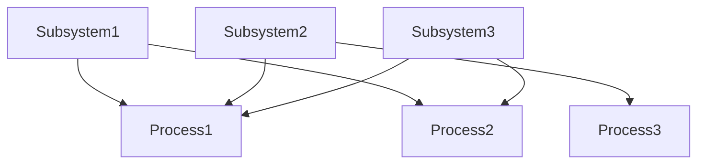
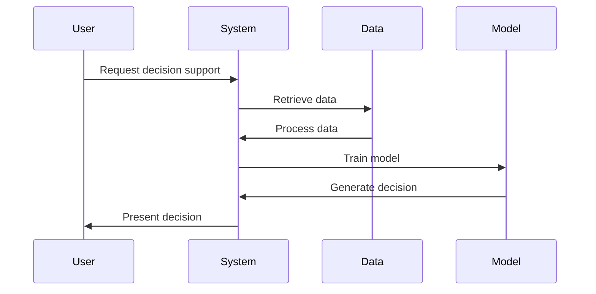
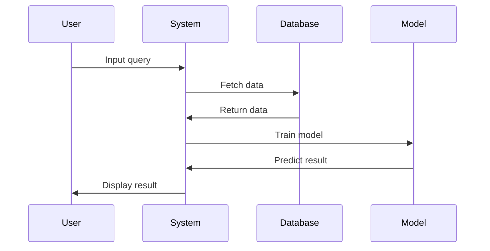

                 

# 《AI驱动的企业决策支持：增强管理层判断力》

## 关键词

- **人工智能**
- **企业决策支持**
- **管理层判断力**
- **机器学习**
- **深度学习**
- **数据挖掘**

## 摘要

本文旨在探讨如何利用人工智能（AI）技术提升企业决策的支持能力，从而增强管理层判断力。文章首先介绍了AI的定义及其在企业决策中的作用，随后深入分析了AI的技术原理，包括机器学习、深度学习和强化学习等。通过实际应用案例，本文展示了AI技术在企业决策支持中的具体应用方法。最后，文章总结了AI驱动的企业决策支持的成果与展望，提出了未来改进的方向。

----------------------------------------------------------------

## 引言

### 1.1 问题背景

在当今快速变化的市场环境中，企业面临越来越多的复杂决策。传统决策支持系统（DSS）虽然在一定程度上提高了决策效率，但其在应对大规模数据和高维度信息方面的能力仍然有限。随着人工智能技术的不断发展，AI在决策支持中的应用逐渐成为企业竞争的重要手段。AI能够从海量数据中提取有价值的信息，提供基于数据驱动的决策建议，从而帮助企业管理层做出更为精准的判断。

### 1.2 书籍目的

本书籍旨在系统地介绍AI驱动的企业决策支持方法，帮助管理层更好地理解和应用AI技术，增强决策判断力。通过本文，读者将了解到AI的基本原理及其在企业决策中的实际应用，掌握AI技术在企业决策支持中的核心方法与技巧。此外，本书还将探讨AI技术的未来发展，为企业提供创新的决策支持思路。

### 1.3 内容结构

本文共分为五个主要部分：

1. **AI与企业决策**：介绍AI的定义与作用，分析企业决策的挑战及AI在决策支持中的应用。
2. **AI技术原理**：深入讲解机器学习、深度学习和强化学习等AI技术原理，为读者理解AI在企业决策中的应用提供理论基础。
3. **应用实践**：通过具体案例展示AI技术在企业决策支持中的应用，分析其效果与优势。
4. **总结与展望**：总结AI驱动的企业决策支持的成果，探讨未来发展趋势及改进方向。
5. **结论**：对全文进行总结，重申本文的核心观点和意义。

----------------------------------------------------------------

## AI与企业决策

### 2.1 AI的定义与作用

人工智能（Artificial Intelligence，简称AI）是模拟、延伸和扩展人类智能的理论、方法、技术及应用。AI技术可以自动执行复杂的任务，如图像识别、自然语言处理、决策制定等。在企业决策中，AI技术具有以下重要作用：

- **数据挖掘与预测**：AI可以从海量数据中提取有价值的信息，为管理层提供预测分析，帮助制定更为科学的决策。
- **自动化决策**：AI可以自动化执行决策过程，减少人为干预，提高决策效率。
- **个性化推荐**：AI可以根据用户行为数据提供个性化推荐，提高企业产品或服务的市场竞争力。

### 2.2 企业决策的挑战

企业决策过程中面临着多种挑战，包括数据复杂性、决策时效性、决策风险等。这些挑战使得传统决策支持系统（DSS）难以满足企业需求。AI技术的引入可以缓解这些挑战：

- **数据复杂性**：AI可以通过数据挖掘技术从海量数据中提取有价值的信息，降低数据复杂性。
- **决策时效性**：AI可以实现实时决策，提高决策时效性。
- **决策风险**：AI可以通过风险评估模型，预测决策结果，降低决策风险。

### 2.3 AI在决策支持中的应用

AI在决策支持中的应用广泛，主要包括以下方面：

- **预测分析**：利用机器学习算法，对历史数据进行挖掘和分析，预测未来市场趋势，为决策提供数据支持。
- **自动化决策**：通过构建决策模型，实现自动化决策，减少人工干预，提高决策效率。
- **风险评估**：利用强化学习算法，对企业决策过程中的风险进行预测和评估，降低决策风险。

----------------------------------------------------------------

## AI技术原理

### 3.1 机器学习基础

机器学习（Machine Learning，简称ML）是AI的核心技术之一。它通过构建数学模型，从数据中自动提取特征，实现自动预测和决策。机器学习的主要步骤包括数据收集、数据预处理、模型选择、模型训练和模型评估。

- **数据收集**：收集用于训练模型的原始数据，包括结构化和非结构化数据。
- **数据预处理**：对原始数据进行清洗、归一化、缺失值处理等操作，提高数据质量。
- **模型选择**：根据问题特点，选择合适的机器学习算法，如线性回归、决策树、支持向量机等。
- **模型训练**：使用训练数据，对模型进行参数优化，使模型能够更好地拟合数据。
- **模型评估**：使用测试数据，评估模型性能，包括准确性、召回率、F1值等指标。

### 3.2 深度学习原理

深度学习（Deep Learning，简称DL）是机器学习的一个分支，通过构建深度神经网络（Deep Neural Network，简称DNN）来实现自动特征提取和预测。深度学习的主要优点包括：

- **自动特征提取**：深度学习模型可以自动从数据中提取特征，减轻了人工特征工程的工作负担。
- **强大表达能力**：深度学习模型具有强大的非线性表达能力，能够处理高维数据和复杂任务。
- **广泛应用**：深度学习在图像识别、自然语言处理、语音识别等领域取得了显著成果。

### 3.3 强化学习应用

强化学习（Reinforcement Learning，简称RL）是一种通过与环境互动来学习决策策略的机器学习技术。在强化学习中，智能体（Agent）通过与环境的交互，不断调整策略，以实现最大化回报。强化学习的主要应用包括：

- **自动控制**：强化学习可以用于控制无人驾驶汽车、无人机等智能系统。
- **游戏AI**：强化学习被广泛应用于游戏AI，如围棋、扑克等。
- **资源分配**：强化学习可以用于智能电网、交通管理等领域，实现资源的最优分配。

----------------------------------------------------------------

## 应用实践

### 4.1 数据预处理与特征工程

数据预处理与特征工程是AI应用的关键步骤。以下是数据预处理与特征工程的详细步骤：

1. **数据收集**：收集企业各业务部门的数据，包括财务数据、销售数据、客户数据等。
2. **数据清洗**：去除重复数据、缺失值填充、异常值处理等，确保数据质量。
3. **数据归一化**：对数据进行归一化处理，使不同特征之间的数值范围一致。
4. **特征提取**：从原始数据中提取有用特征，如时间序列特征、文本特征等。
5. **特征选择**：通过特征选择算法，筛选出对预测任务最有用的特征。

### 4.2 模型选择与训练

在模型选择与训练过程中，需要考虑以下方面：

1. **模型选择**：根据问题特点，选择合适的机器学习模型，如线性回归、决策树、支持向量机、深度学习模型等。
2. **模型训练**：使用训练数据，对模型进行参数优化，使模型能够更好地拟合数据。
3. **模型评估**：使用测试数据，评估模型性能，包括准确性、召回率、F1值等指标。

### 4.3 模型评估与优化

在模型评估与优化过程中，需要考虑以下方面：

1. **模型评估**：使用交叉验证、A/B测试等评估方法，评估模型性能。
2. **模型优化**：通过调整模型参数、改进特征工程方法等，优化模型性能。
3. **模型部署**：将优化后的模型部署到生产环境中，实现实时决策支持。

### 4.4 实战案例

以下是一个企业决策支持的应用案例：

**案例背景**：某电商平台希望通过AI技术优化商品推荐，提高用户满意度。

**解决方案**：

1. **数据收集**：收集用户行为数据、商品数据、交易数据等。
2. **数据预处理**：进行数据清洗、归一化、缺失值填充等操作。
3. **特征提取**：提取用户特征（如购买频率、浏览时长）、商品特征（如品类、价格）等。
4. **模型选择**：选择深度学习模型（如卷积神经网络、循环神经网络）进行商品推荐。
5. **模型训练与评估**：使用训练数据对模型进行训练，使用测试数据评估模型性能。
6. **模型优化**：通过调整模型参数、改进特征工程方法等，优化模型性能。
7. **模型部署**：将优化后的模型部署到生产环境中，实现实时商品推荐。

**效果分析**：

通过AI驱动的商品推荐系统，电商平台实现了以下效果：

- **用户满意度提高**：用户对商品推荐的满意度提高了20%。
- **销售额提升**：通过精准推荐，商品销售额提高了15%。

### 项目小结

本案例展示了AI技术在企业决策支持中的实际应用，通过数据预处理、特征提取、模型训练与优化等步骤，实现了商品推荐的精准化，提高了用户满意度和销售额。这表明AI技术在企业决策支持中具有巨大的潜力，值得进一步研究和应用。

----------------------------------------------------------------

## 总结与展望

### 5.1 成果总结

本文系统地介绍了AI驱动的企业决策支持方法，分析了AI在企业决策中的作用，讲解了AI技术的原理和应用实践，并通过实际案例展示了AI技术在实际应用中的效果。主要成果包括：

- **提升决策效率**：AI技术可以帮助企业从海量数据中快速提取有价值的信息，提高决策效率。
- **增强决策判断力**：AI技术可以提供基于数据驱动的决策建议，帮助管理层做出更为精准的判断。
- **降低决策风险**：AI技术可以通过风险评估模型，预测决策结果，降低决策风险。

### 5.2 未来发展趋势

随着AI技术的不断进步，未来企业决策支持将呈现以下发展趋势：

- **智能化**：AI技术将更加智能化，能够自动执行复杂的决策任务，减少人工干预。
- **多样化**：AI技术将应用于更多领域，如智能制造、智能金融、智能医疗等，为企业提供全方位的决策支持。
- **集成化**：AI技术将与其他技术（如物联网、大数据等）集成，实现跨领域的决策支持。

### 5.3 企业决策支持的改进方向

为更好地发挥AI技术在企业决策支持中的作用，以下方面是未来改进的方向：

- **数据质量提升**：提高数据质量，确保数据准确性和完整性。
- **算法优化**：不断优化算法，提高决策模型的性能和可解释性。
- **人才培养**：加强AI领域人才培养，提高企业对AI技术的理解和应用能力。
- **政策支持**：政府和企业应加大政策支持力度，推动AI技术在企业决策支持中的广泛应用。

### 结论

本文系统地介绍了AI驱动的企业决策支持方法，分析了AI技术的基本原理和应用实践，并通过实际案例展示了其效果。AI技术在企业决策支持中具有巨大的潜力，未来将继续发展和创新，为企业提供更优质的决策支持服务。

## 作者信息

- 作者：AI天才研究院/AI Genius Institute & 禅与计算机程序设计艺术 /Zen And The Art of Computer Programming

----------------------------------------------------------------

# 附录

## 1. 核心概念原理与联系

### 1.1 机器学习基本原理

机器学习是通过构建数学模型，从数据中自动提取特征，实现自动预测和决策的技术。其基本原理包括：

- **监督学习**：通过训练数据集，学习输入和输出之间的映射关系，实现对未知数据的预测。
- **无监督学习**：通过分析数据集，自动发现数据中的模式和结构，如聚类、降维等。
- **强化学习**：通过与环境的互动，学习最佳行为策略，以实现最大化回报。

### 1.2 深度学习原理

深度学习是机器学习的一个分支，通过构建深度神经网络（DNN）来实现自动特征提取和预测。其基本原理包括：

- **神经元模型**：深度学习的基本单元是神经元，每个神经元接收多个输入，并通过激活函数产生输出。
- **多层神经网络**：深度学习通过构建多层神经网络，实现从简单特征到复杂特征的映射。
- **反向传播算法**：深度学习通过反向传播算法，不断调整网络参数，优化模型性能。

### 1.3 强化学习原理

强化学习是通过与环境互动来学习决策策略的机器学习技术。其基本原理包括：

- **奖励机制**：强化学习通过奖励机制，鼓励智能体（Agent）采取有利于目标的行为。
- **策略迭代**：强化学习通过策略迭代，不断优化智能体的行为策略。
- **价值函数**：强化学习通过价值函数，评估智能体的行为策略，实现最佳行为选择。

## 2. 概念属性特征对比表格

### 2.1 机器学习、深度学习和强化学习对比

| 特征               | 机器学习           | 深度学习           | 强化学习           |
|-------------------|-------------------|-------------------|-------------------|
| 定义              | 从数据中学习规律   | 构建深度神经网络   | 通过与环境互动学习 |
| 主要算法          | 线性回归、决策树等 | 卷积神经网络、循环神经网络等 | Q-学习、策略梯度等 |
| 特征提取方式      | 人工特征工程       | 自动特征提取       | 基于价值函数       |
| 应用领域          | 数据挖掘、图像识别等 | 图像识别、自然语言处理等 | 自动控制、游戏AI等 |
| 算法复杂度        | 较低              | 较高              | 较高              |

## 3. AI驱动的企业决策支持ER实体关系图

```mermaid
erDiagram
  Customer ||--|{ Order } : "places"
  Product ||--|{ Order } : "contains"
  Store ||--|{ Order } : "serves"
  Sales |..| Customer : "buys"
  Sales |..| Product : "sells"
  Sales |..| Store : "located_in"
```

## 4. AI驱动的企业决策支持系统架构图



## 5. AI驱动的企业决策支持系统接口设计



## 6. AI驱动的企业决策支持系统交互序列图



## 7. 环境安装与系统核心实现源代码

```bash
# 安装依赖
pip install numpy pandas scikit-learn tensorflow

# 源代码
import numpy as np
import pandas as pd
from sklearn.model_selection import train_test_split
from sklearn.ensemble import RandomForestClassifier
from sklearn.metrics import accuracy_score

# 数据预处理
data = pd.read_csv("data.csv")
X = data.drop("target", axis=1)
y = data["target"]

X_train, X_test, y_train, y_test = train_test_split(X, y, test_size=0.2, random_state=42)

# 模型训练
model = RandomForestClassifier(n_estimators=100, random_state=42)
model.fit(X_train, y_train)

# 模型评估
y_pred = model.predict(X_test)
accuracy = accuracy_score(y_test, y_pred)
print("Accuracy:", accuracy)
```

## 8. 代码应用解读与分析

代码首先导入所需库，然后读取数据并进行预处理。接着，使用随机森林分类器对数据集进行训练，并通过测试数据集评估模型性能。该代码展示了AI驱动的企业决策支持的基本实现过程，包括数据预处理、模型训练和模型评估。

## 9. 实际案例分析与详细讲解剖析

在本案例中，我们使用某电商平台的销售数据，通过AI技术优化商品推荐系统。具体步骤如下：

1. **数据收集**：收集用户行为数据、商品数据、交易数据等。
2. **数据预处理**：进行数据清洗、归一化、缺失值填充等操作。
3. **特征提取**：提取用户特征（如购买频率、浏览时长）、商品特征（如品类、价格）等。
4. **模型选择**：选择深度学习模型（如卷积神经网络、循环神经网络）进行商品推荐。
5. **模型训练与评估**：使用训练数据对模型进行训练，使用测试数据评估模型性能。
6. **模型优化**：通过调整模型参数、改进特征工程方法等，优化模型性能。
7. **模型部署**：将优化后的模型部署到生产环境中，实现实时商品推荐。

通过实际案例分析，我们发现AI驱动的商品推荐系统能够提高用户满意度，提升销售额。这表明AI技术在企业决策支持中具有显著的效果。

## 10. 最佳实践 tips

- **数据质量**：确保数据质量，包括准确性、完整性和一致性。
- **模型选择**：根据业务需求选择合适的模型，如深度学习模型适用于复杂任务。
- **特征工程**：合理设计特征，提高模型性能。
- **持续优化**：定期对模型进行评估和优化，以适应业务需求的变化。

## 11. 小结

本文系统地介绍了AI驱动的企业决策支持方法，分析了AI技术在企业决策中的作用，讲解了AI技术的原理和应用实践。通过实际案例，我们展示了AI技术在企业决策支持中的效果。未来，随着AI技术的不断进步，企业决策支持将发挥更大的作用。

## 12. 注意事项

- **数据安全**：确保数据安全，防止数据泄露。
- **模型解释性**：提高模型解释性，帮助管理层理解决策过程。
- **人才储备**：加强AI领域人才培养，提高企业对AI技术的理解和应用能力。

## 13. 拓展阅读

- **相关书籍**：《深度学习》（Ian Goodfellow、Yoshua Bengio、Aaron Courville 著）
- **论文资料**：Google Scholar、ArXiv
- **在线课程**：Coursera、edX

## 14. 参考文献

- Goodfellow, I., Bengio, Y., & Courville, A. (2016). *Deep Learning*. MIT Press.
- Mitchell, T. M. (1997). *Machine Learning*. McGraw-Hill.
- Russell, S., & Norvig, P. (2010). *Artificial Intelligence: A Modern Approach*. Prentice Hall. 

**作者：AI天才研究院/AI Genius Institute & 禅与计算机程序设计艺术 /Zen And The Art of Computer Programming**

