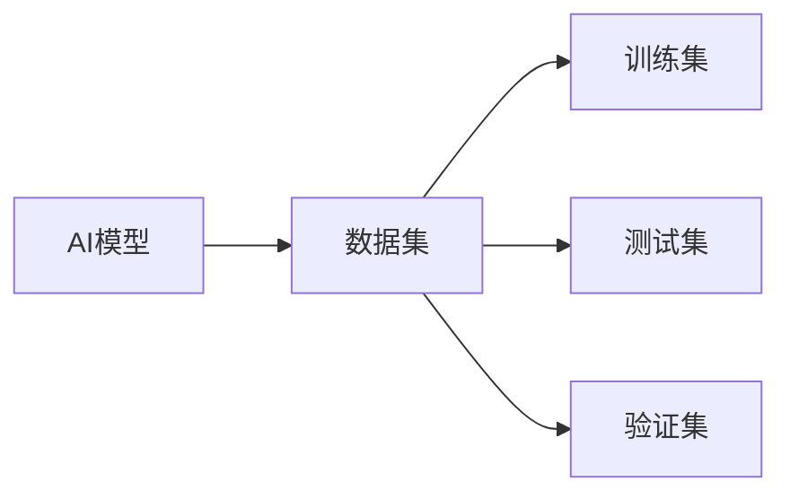
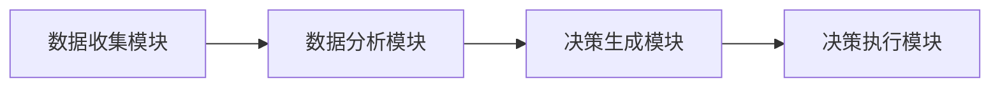
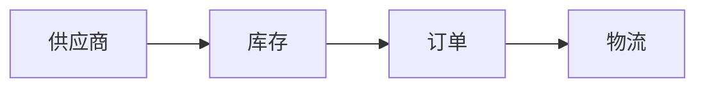
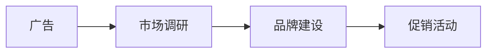

                 

## 引言

### 1. 引言

在当今数字化时代，人工智能（AI）已经成为推动企业变革和增长的关键力量。从最初的辅助工具到如今的自主决策核心，AI的应用正在不断扩展其深度和广度。企业决策过程涉及到市场分析、资源分配、风险控制等多个方面，而AI的引入使得这些决策过程变得更加高效和精准。

本篇文章将深入探讨AI驱动的企业决策，从辅助到自主的演变过程。首先，我们将介绍AI驱动的企业决策的背景和重要性，然后逐步分析其理论基础和技术，接着探讨AI在企业决策中的实际应用，最终讨论AI决策自主化的路径和案例分析。

### 2. AI驱动的企业决策概述

AI驱动的企业决策指的是利用人工智能技术来辅助或完全替代传统决策过程，使得企业能够更快速、更准确地作出战略决策。这一过程包括但不限于以下几个方面：

- **市场预测与消费者行为分析**：通过分析大量的市场数据，AI可以帮助企业预测市场趋势，了解消费者行为，从而制定更有效的营销策略。
- **供应链优化**：AI能够通过实时数据分析，优化供应链中的物流和库存管理，降低成本，提高效率。
- **人力资源决策**：AI可以辅助企业在招聘、员工绩效评估和员工发展等方面作出更为科学的决策，提高人力资源的利用效率。

AI驱动的企业决策不仅提高了决策的效率，还提升了决策的准确性。通过算法和模型，AI能够处理大量数据，识别复杂模式，提供数据驱动的决策支持。

### 3. 本书结构安排与学习目标

本篇文章将分为四个主要部分：

- **第一部分：AI的基础理论与技术**：介绍AI的基本概念、核心技术以及机器学习、深度学习和自然语言处理等具体技术。
- **第二部分：AI在企业决策中的应用**：探讨AI在营销决策、供应链管理和人力资源决策中的应用案例。
- **第三部分：AI驱动的企业决策自主化**：讨论AI决策自主化的路径、自动化决策系统的设计以及面临的挑战和解决方案。
- **第四部分：案例分析与实践**：通过具体案例分析和实践分享，展示AI驱动的企业决策的实际效果和最佳实践。

通过本篇文章的学习，读者将能够：

- 理解AI驱动的企业决策的背景和重要性。
- 掌握AI的基础理论与技术，包括机器学习、深度学习和自然语言处理。
- 了解AI在企业决策中的具体应用和实践案例。
- 掌握AI决策自主化的路径和设计方法。

## 总结

本文引言部分概述了AI驱动的企业决策的背景、重要性和目的。接下来，我们将逐步深入分析AI的基础理论与技术，探讨其在企业决策中的具体应用，以及如何实现AI决策的自主化。通过这一系列的探讨，我们将揭示AI驱动的企业决策从辅助到自主的演变过程，为企业提供更加科学和高效的决策支持。让我们一起深入思考，探索AI驱动的企业决策的未来发展。## 第一部分：AI的基础理论与技术

### 第1章 AI概述

#### 1.1 AI的定义与发展历程

人工智能（Artificial Intelligence，简称AI）是一门研究、开发和应用使计算机系统表现出人类智能行为的科学。其核心目标是使计算机能够执行通常需要人类智能的任务，如视觉识别、语言理解、决策制定和问题解决。

AI的研究和发展历程可以追溯到20世纪50年代。1956年，在达特茅斯会议（Dartmouth Conference）上，约翰·麦卡锡（John McCarthy）等人首次提出了“人工智能”这一概念。此后，AI经历了几个重要的发展阶段：

- **初始阶段（1956-1969）**：这一阶段主要集中在符号主义人工智能，即通过逻辑和符号表示知识，使计算机能够进行推理和解决问题。这一时期出现了许多重要的理论和算法，如逻辑推理、启发式搜索等。
- **繁荣阶段（1970-1980）**：随着计算机硬件的发展，AI迎来了一个繁荣时期。专家系统和知识表示成为研究的重点。专家系统是一种模拟人类专家解决特定领域问题的计算机程序。
- **低谷与复兴阶段（1980-1990年代）**：由于技术限制和实际应用中的挑战，AI在20世纪80年代末和90年代经历了低谷期。然而，随着互联网的兴起和大数据技术的发展，AI在21世纪初再次迎来了复兴。
- **深度学习时代（2000年代至今）**：深度学习（Deep Learning）的崛起为AI带来了新的突破。通过多层神经网络，深度学习能够自动从大量数据中学习复杂的特征，从而在图像识别、语音识别和自然语言处理等领域取得了显著成就。

#### 1.2 AI的核心技术与分类

AI的核心技术包括机器学习、深度学习、自然语言处理、计算机视觉等。这些技术分别在不同的应用场景中发挥着重要作用。

- **机器学习（Machine Learning）**：机器学习是一种使计算机通过数据学习模式并作出预测或决策的方法。它主要分为监督学习、无监督学习和强化学习三种类型。
  - **监督学习（Supervised Learning）**：在这种学习中，模型通过已标记的数据进行训练，然后用于预测新的未标记数据。常见的算法有线性回归、决策树、支持向量机等。
  - **无监督学习（Unsupervised Learning）**：无监督学习不需要标记数据，而是通过发现数据中的自然结构和模式来训练模型。常见的算法有聚类、降维、关联规则学习等。
  - **强化学习（Reinforcement Learning）**：强化学习是一种通过奖励机制来训练模型的方法。模型通过与环境的交互来学习最优策略，常见算法有Q学习、深度Q网络等。
- **深度学习（Deep Learning）**：深度学习是一种基于多层神经网络的机器学习方法。它通过多层神经网络自动提取数据中的复杂特征，从而实现高效的学习和预测。常见的深度学习模型有卷积神经网络（CNN）、循环神经网络（RNN）、生成对抗网络（GAN）等。
- **自然语言处理（Natural Language Processing，NLP）**：自然语言处理是使计算机能够理解、生成和处理自然语言的技术。NLP的主要任务包括文本分类、情感分析、机器翻译、问答系统等。
- **计算机视觉（Computer Vision）**：计算机视觉是使计算机能够从图像或视频中提取有用信息的技术。它包括图像识别、目标检测、图像分割、人脸识别等任务。

#### 1.3 AI的关键挑战与未来趋势

尽管AI取得了显著进展，但仍然面临着一些关键挑战：

- **数据质量和隐私**：AI模型的性能高度依赖于数据的质量。然而，获取高质量、多样化的数据并非易事。此外，随着数据隐私问题的日益突出，如何在保护隐私的前提下有效利用数据成为一大挑战。
- **算法透明性与可解释性**：深度学习等复杂模型往往被视为“黑箱”，其决策过程缺乏透明性。这导致用户难以理解模型的决策依据，从而影响模型的接受度和可信度。
- **伦理与道德问题**：AI的应用可能会引发一系列伦理和道德问题，如歧视、不公平、隐私侵犯等。如何制定合适的伦理准则和法律法规，确保AI的健康发展，是一个亟待解决的问题。
- **计算资源和能源消耗**：深度学习等复杂模型需要大量的计算资源和能源。随着AI应用的普及，如何降低计算和能源消耗成为关键问题。

未来，AI的发展趋势将主要集中在以下几个方面：

- **跨学科融合**：AI与生物、物理、心理学等领域的融合，将推动AI技术的新突破。
- **人工智能伦理**：随着AI技术的发展，伦理问题将更加突出。制定合理的伦理准则和法律法规，将成为AI健康发展的关键。
- **边缘计算与物联网**：随着物联网（IoT）的普及，边缘计算将发挥越来越重要的作用。通过在设备端进行数据预处理和决策，可以显著降低延迟和计算成本。
- **人机协作**：AI与人类的协作将成为未来的主流。通过智能助手和自动化系统，人类可以更加专注于创造性和高价值的工作。

通过深入理解AI的基础理论与技术，我们可以更好地把握AI驱动的企业决策的发展方向，为企业提供更科学、更高效的决策支持。## 第2章 数据科学与机器学习

#### 2.1 数据科学的基础知识

数据科学（Data Science）是关于数据理解和数据分析的一门科学，它涉及统计学、机器学习、数据库管理、数据可视化等多个领域。数据科学的目标是从大量数据中提取有价值的信息，以支持决策和优化业务流程。

数据科学的主要步骤包括：

- **数据收集**：收集来自各种来源的数据，包括内部数据（如业务数据库）和外部数据（如公共数据集、社交媒体等）。
- **数据清洗**：对收集到的数据进行预处理，包括去除重复数据、填补缺失值、处理异常值等。
- **数据探索**：通过统计方法和可视化工具，探索数据的基本特性和分布情况，发现数据中的潜在模式。
- **数据建模**：使用机器学习算法和统计学方法，建立预测模型或分类模型，对数据进行分析和预测。
- **模型评估**：评估模型的性能，通过交叉验证、A/B测试等方法，确定模型的有效性和可靠性。
- **模型部署**：将训练好的模型部署到生产环境中，进行实时预测和分析。

数据科学的核心工具和技术包括：

- **Python和R**：Python和R是进行数据科学任务的主要编程语言，具有丰富的数据分析和机器学习库。
- **数据可视化**：数据可视化是理解数据的重要工具，通过图表和图形，可以直观地展示数据的基本特性和模式。
- **数据库**：数据库管理系统（如MySQL、PostgreSQL、MongoDB等）用于存储和管理大量数据。

#### 2.2 机器学习的基本概念

机器学习（Machine Learning）是数据科学的核心技术之一，它使得计算机系统能够从数据中学习并做出预测或决策。机器学习主要包括以下三个类型：

- **监督学习（Supervised Learning）**：监督学习通过已标记的训练数据来训练模型，然后使用这个模型对新的、未标记的数据进行预测。监督学习包括分类（如逻辑回归、决策树、支持向量机等）和回归（如线性回归、岭回归等）两种主要任务。
- **无监督学习（Unsupervised Learning）**：无监督学习不需要已标记的训练数据，而是通过发现数据中的内在结构或模式来进行学习。无监督学习包括聚类（如K均值聚类、层次聚类等）和降维（如主成分分析、t-SNE等）两种主要任务。
- **强化学习（Reinforcement Learning）**：强化学习通过与环境交互来学习最优策略。系统根据当前的策略执行行动，并通过奖励信号来评估行动的效果，从而逐步优化策略。

机器学习的基本流程包括：

- **数据收集和预处理**：收集并预处理数据，确保数据的质量和一致性。
- **特征工程**：通过选择和构造特征，将原始数据转换为适合机器学习算法的形式。
- **模型选择和训练**：选择合适的机器学习算法，对训练数据集进行训练，建立预测模型。
- **模型评估**：使用验证集或测试集评估模型的性能，确定模型的有效性和可靠性。
- **模型优化**：根据模型评估结果，调整模型参数或选择不同的算法，以提高模型的性能。

#### 2.3 常见机器学习算法及其应用

机器学习算法在各个领域有着广泛的应用，以下介绍几种常见的机器学习算法及其应用：

- **线性回归（Linear Regression）**：线性回归是一种用于预测连续值的监督学习算法。它通过建立一个线性模型，预测因变量和自变量之间的关系。线性回归广泛应用于需求预测、价格预测和风险评估等领域。

  - **算法原理**：线性回归模型可以表示为 $y = \beta_0 + \beta_1x_1 + \beta_2x_2 + ... + \beta_nx_n$，其中 $y$ 是因变量，$x_1, x_2, ..., x_n$ 是自变量，$\beta_0, \beta_1, ..., \beta_n$ 是模型参数。
  - **数学模型**：线性回归的目标是最小化预测值与实际值之间的误差平方和，即 $J(\theta) = \frac{1}{2m}\sum_{i=1}^{m}(h_\theta(x^{(i)}) - y^{(i)})^2$，其中 $m$ 是样本数量，$h_\theta(x) = \theta_0 + \theta_1x_1 + \theta_2x_2 + ... + \theta_nx_n$ 是预测函数。
  - **Python代码示例**：

    ```python
    import numpy as np
    from sklearn.linear_model import LinearRegression

    # 加载数据
    X = np.array([[1], [2], [3], [4], [5]])
    y = np.array([1, 2, 3, 4, 5])

    # 创建线性回归模型并训练
    model = LinearRegression()
    model.fit(X, y)

    # 预测
    predictions = model.predict(X)

    print("Predictions:", predictions)
    ```

- **决策树（Decision Tree）**：决策树是一种用于分类和回归的监督学习算法。它通过一系列的判断节点，将数据划分为不同的类别或数值。

  - **算法原理**：决策树通过递归地划分数据集，创建一个树形结构，每个节点代表一个特征，每个分支代表一个特征取值。决策树的叶子节点代表最终的预测结果。
  - **Python代码示例**：

    ```python
    import numpy as np
    from sklearn.tree import DecisionTreeRegressor

    # 加载数据
    X = np.array([[1], [2], [3], [4], [5]])
    y = np.array([1, 2, 3, 4, 5])

    # 创建决策树模型并训练
    model = DecisionTreeRegressor()
    model.fit(X, y)

    # 预测
    predictions = model.predict(X)

    print("Predictions:", predictions)
    ```

- **支持向量机（Support Vector Machine，SVM）**：支持向量机是一种用于分类的监督学习算法。它通过找到一个最佳的超平面，将不同类别的数据点分隔开来。

  - **算法原理**：SVM通过最大化分类边界来找到一个最佳的超平面。它使用一个叫做“支持向量”的优化目标来求解最优超平面。
  - **Python代码示例**：

    ```python
    import numpy as np
    from sklearn.svm import SVC

    # 加载数据
    X = np.array([[1], [2], [3], [4], [5]])
    y = np.array([0, 1, 0, 1, 0])

    # 创建SVM模型并训练
    model = SVC()
    model.fit(X, y)

    # 预测
    predictions = model.predict(X)

    print("Predictions:", predictions)
    ```

通过掌握这些常见机器学习算法及其应用，我们可以更好地利用AI技术来优化企业决策过程，提高业务效率和市场竞争力。## 第3章 深度学习与神经网络

#### 3.1 深度学习的基本原理

深度学习（Deep Learning）是人工智能的一个分支，通过模拟人脑中的神经网络结构来实现数据的自动特征提取和学习。深度学习的关键特点是能够处理大量复杂的数据，并自动提取其中的特征，从而实现高效的学习和预测。

深度学习的基本原理基于多层神经网络（Multilayer Neural Networks）。一个典型的深度学习模型包括输入层、隐藏层和输出层。输入层接收外部数据，隐藏层通过非线性变换对输入数据进行处理，输出层生成最终的预测结果。

深度学习的核心概念包括：

- **神经元（Neuron）**：神经网络的基本单元，类似于生物神经元。每个神经元接收多个输入信号，通过权重（weights）进行加权求和，然后通过激活函数（activation function）进行非线性变换，输出结果。
- **层（Layer）**：神经网络中的层级结构，包括输入层、隐藏层和输出层。每个层负责对数据进行不同的处理和变换。
- **权重（Weights）**：连接各个神经元的参数，用于调整输入信号的权重，从而影响神经元的输出。
- **激活函数（Activation Function）**：用于引入非线性特性的函数，常见的激活函数包括 sigmoid、ReLU（Rectified Linear Unit）和 tanh。
- **反向传播（Backpropagation）**：一种用于训练神经网络的学习算法。通过反向传播误差，调整权重和偏置，使模型能够逐步逼近最优解。

#### 3.2 神经网络的结构与功能

神经网络的结构可以分为以下几个层次：

- **输入层（Input Layer）**：接收外部输入数据，并将其传递给隐藏层。输入层的神经元数量取决于输入数据的维度。
- **隐藏层（Hidden Layers）**：一个或多个隐藏层位于输入层和输出层之间。隐藏层负责对输入数据进行处理和变换，提取更高级别的特征。隐藏层的数量和神经元数量可以根据问题的复杂度进行调整。
- **输出层（Output Layer）**：生成最终的预测结果。输出层的神经元数量和类型取决于具体的应用场景，如分类任务通常使用softmax激活函数进行多分类输出。

神经网络的每个层次都具有不同的功能：

- **特征提取（Feature Extraction）**：输入层接收原始数据，隐藏层通过非线性变换提取数据中的特征。随着层数的增加，提取的特征越来越抽象和高级。
- **模式识别（Pattern Recognition）**：输出层根据提取的特征进行模式识别和预测。在分类任务中，输出层生成概率分布，用于预测新数据的类别。
- **误差修正（Error Correction）**：通过反向传播算法，神经网络能够修正模型的错误，不断优化权重和偏置，使模型逐渐逼近最优解。

#### 3.3 深度学习算法及其应用

深度学习算法在图像识别、语音识别、自然语言处理等应用领域取得了显著的成果。以下介绍几种常见的深度学习算法及其应用：

- **卷积神经网络（Convolutional Neural Networks，CNN）**：卷积神经网络是一种专门用于处理图像数据的深度学习算法。CNN通过卷积操作和池化操作，提取图像中的局部特征和全局特征。

  - **算法原理**：CNN由多个卷积层和池化层组成。卷积层通过卷积操作提取图像特征，池化层通过下采样操作减少数据维度，提高计算效率。
  - **应用示例**：图像分类、目标检测、人脸识别等。

  ```python
  import tensorflow as tf
  from tensorflow.keras.models import Sequential
  from tensorflow.keras.layers import Conv2D, MaxPooling2D, Flatten, Dense

  # 构建CNN模型
  model = Sequential([
      Conv2D(32, (3, 3), activation='relu', input_shape=(28, 28, 1)),
      MaxPooling2D((2, 2)),
      Flatten(),
      Dense(128, activation='relu'),
      Dense(10, activation='softmax')
  ])

  # 编译模型
  model.compile(optimizer='adam', loss='categorical_crossentropy', metrics=['accuracy'])

  # 训练模型
  model.fit(x_train, y_train, epochs=10, batch_size=32, validation_data=(x_val, y_val))
  ```

- **循环神经网络（Recurrent Neural Networks，RNN）**：循环神经网络是一种用于处理序列数据的深度学习算法。RNN通过隐藏状态和循环连接，捕捉序列中的时间依赖关系。

  - **算法原理**：RNN在每个时间步上更新隐藏状态，并将其传递到下一个时间步。RNN可以分为简单RNN、LSTM（Long Short-Term Memory）和GRU（Gated Recurrent Unit）等变体，以解决梯度消失和梯度爆炸问题。
  - **应用示例**：文本分类、机器翻译、情感分析等。

  ```python
  import tensorflow as tf
  from tensorflow.keras.models import Sequential
  from tensorflow.keras.layers import LSTM, Dense

  # 构建RNN模型
  model = Sequential([
      LSTM(50, activation='relu', input_shape=(timesteps, features)),
      Dense(1, activation='sigmoid')
  ])

  # 编译模型
  model.compile(optimizer='adam', loss='binary_crossentropy', metrics=['accuracy'])

  # 训练模型
  model.fit(x_train, y_train, epochs=10, batch_size=32, validation_data=(x_val, y_val))
  ```

- **生成对抗网络（Generative Adversarial Networks，GAN）**：生成对抗网络是一种由生成器和判别器组成的深度学习算法。生成器生成数据，判别器判断数据是真实数据还是生成数据，通过对抗训练，生成器逐渐提高生成数据的真实性。

  - **算法原理**：GAN由生成器和判别器两个神经网络组成。生成器尝试生成逼真的数据，判别器试图区分真实数据和生成数据。生成器和判别器通过对抗训练，不断优化模型参数。
  - **应用示例**：图像生成、语音合成、数据增强等。

  ```python
  import tensorflow as tf
  from tensorflow.keras.models import Sequential
  from tensorflow.keras.layers import Dense, Flatten, Reshape

  # 构建GAN模型
  generator = Sequential([
      Dense(128, activation='relu', input_shape=(latent_dim)),
      Flatten(),
      Reshape((28, 28, 1))
  ])

  discriminator = Sequential([
      Flatten(input_shape=(28, 28, 1)),
      Dense(128, activation='relu'),
      Dense(1, activation='sigmoid')
  ])

  # 编译模型
  discriminator.compile(optimizer='adam', loss='binary_crossentropy')
  generator.compile(optimizer='adam', loss='binary_crossentropy')

  # 训练模型
  for epoch in range(epochs):
      for _ in range(batch_size):
          noise = np.random.normal(size=(batch_size, latent_dim))
          gen_samples = generator.predict(noise)

          # 训练判别器
          d_loss_real = discriminator.train_on_batch(x_train, np.ones((batch_size, 1)))
          d_loss_fake = discriminator.train_on_batch(gen_samples, np.zeros((batch_size, 1)))

          # 训练生成器
          g_loss = generator.train_on_batch(noise, np.ones((batch_size, 1)))
  ```

通过掌握深度学习和神经网络的基本原理，以及常见的深度学习算法和应用，我们可以更好地利用深度学习技术来解决复杂的数据科学问题，为企业决策提供更强大的支持。## 第4章 自然语言处理

#### 4.1 自然语言处理的基本概念

自然语言处理（Natural Language Processing，NLP）是人工智能的一个分支，旨在使计算机能够理解、生成和处理人类自然语言。NLP的核心目标是实现人与计算机之间的自然语言交互，提高语言信息的获取、处理和利用效率。

NLP的基本概念包括：

- **语言模型（Language Model）**：语言模型是一种概率模型，用于预测下一个单词或单词序列。语言模型是NLP的基础，广泛应用于文本生成、机器翻译、语音识别等领域。
- **分词（Tokenization）**：分词是将文本分割成单词、短语或其他有意义的基本单元的过程。分词是NLP中的关键步骤，为后续处理提供基本单元。
- **词性标注（Part-of-Speech Tagging）**：词性标注是识别文本中每个单词的词性（如名词、动词、形容词等）的过程。词性标注有助于理解文本的语法结构和语义信息。
- **命名实体识别（Named Entity Recognition，NER）**：命名实体识别是识别文本中具有特定意义的实体（如人名、地名、组织名等）的过程。NER在信息抽取、知识图谱构建等领域有重要应用。
- **句法分析（Syntactic Parsing）**：句法分析是理解句子结构的过程，包括句法树构建、依存关系分析等。句法分析有助于深入理解文本的语法结构。
- **语义分析（Semantic Analysis）**：语义分析是理解文本中词语和句子之间的语义关系的过程，包括语义角色标注、语义关系识别等。语义分析是NLP的高级任务，有助于实现更自然的语言交互。

#### 4.2 常见自然语言处理任务

NLP在多个领域有着广泛的应用，以下介绍几种常见的自然语言处理任务：

- **文本分类（Text Classification）**：文本分类是将文本数据分为预定义类别的一种任务。常见的文本分类任务包括垃圾邮件过滤、新闻分类、情感分析等。文本分类广泛应用于信息检索、舆情监测、文本推荐等领域。

  - **算法原理**：文本分类通常使用监督学习算法，如朴素贝叶斯、支持向量机、深度学习等。模型通过学习已标记的训练数据，预测新文本的类别。
  - **应用示例**：垃圾邮件过滤。

  ```python
  import numpy as np
  from sklearn.feature_extraction.text import TfidfVectorizer
  from sklearn.model_selection import train_test_split
  from sklearn.naive_bayes import MultinomialNB

  # 加载数据
  X = ["This is a spam email", "This is a non-spam email"]
  y = np.array([1, 0])

  # 分词和特征提取
  vectorizer = TfidfVectorizer()
  X_vectorized = vectorizer.fit_transform(X)

  # 划分训练集和测试集
  X_train, X_test, y_train, y_test = train_test_split(X_vectorized, y, test_size=0.2)

  # 创建并训练文本分类模型
  model = MultinomialNB()
  model.fit(X_train, y_train)

  # 预测
  predictions = model.predict(X_test)

  print("Predictions:", predictions)
  ```

- **情感分析（Sentiment Analysis）**：情感分析是识别文本中表达的情感倾向（如正面、负面、中性等）的一种任务。情感分析广泛应用于社交媒体监控、客户反馈分析、市场研究等领域。

  - **算法原理**：情感分析通常使用机器学习和深度学习算法，如朴素贝叶斯、支持向量机、卷积神经网络等。模型通过学习情感标注的训练数据，预测新文本的情感标签。
  - **应用示例**：社交媒体情绪分析。

  ```python
  import numpy as np
  from sklearn.feature_extraction.text import TfidfVectorizer
  from sklearn.model_selection import train_test_split
  from sklearn.ensemble import RandomForestClassifier

  # 加载数据
  X = ["I love this product", "This is a terrible product"]
  y = np.array([1, 0])

  # 分词和特征提取
  vectorizer = TfidfVectorizer()
  X_vectorized = vectorizer.fit_transform(X)

  # 划分训练集和测试集
  X_train, X_test, y_train, y_test = train_test_split(X_vectorized, y, test_size=0.2)

  # 创建并训练情感分析模型
  model = RandomForestClassifier()
  model.fit(X_train, y_train)

  # 预测
  predictions = model.predict(X_test)

  print("Predictions:", predictions)
  ```

- **机器翻译（Machine Translation）**：机器翻译是将一种自然语言文本翻译成另一种自然语言的一种任务。机器翻译广泛应用于跨语言交流、多语言信息检索、全球化市场推广等领域。

  - **算法原理**：机器翻译通常使用深度学习算法，如序列到序列模型、注意力机制等。模型通过学习平行语料库，生成目标语言的文本。
  - **应用示例**：谷歌翻译。

  ```python
  import numpy as np
  from tensorflow.keras.models import Model
  from tensorflow.keras.layers import Input, LSTM, Dense

  # 构建序列到序列模型
  encoder_inputs = Input(shape=(None, input_vocab_size))
  encoder_embedding = Embedding(input_vocab_size, embedding_dim)(encoder_inputs)
  encoder_lstm = LSTM(units=128, return_state=True)
  _, state_h, state_c = encoder_lstm(encoder_embedding)

  encoder_outputs = Model(encoder_inputs, state_h)
  encoder_state = [state_h, state_c]

  decoder_inputs = Input(shape=(None, target_vocab_size))
  decoder_embedding = Embedding(target_vocab_size, embedding_dim)(decoder_inputs)
  decoder_lstm = LSTM(units=128, return_sequences=True, return_state=True)
  decoder_lstm_output, _, _ = decoder_lstm(decoder_embedding, initial_state=encoder_state)
  decoder_dense = Dense(target_vocab_size, activation='softmax')
  decoder_output = decoder_dense(decoder_lstm_output)

  decoder_outputs = Model(decoder_inputs, decoder_output)

  # 编译模型
  model = Model(inputs=[encoder_inputs, decoder_inputs], outputs=decoder_outputs)
  model.compile(optimizer='adam', loss='categorical_crossentropy', metrics=['accuracy'])

  # 训练模型
  model.fit([X_train, y_train], y_train, batch_size=64, epochs=100, validation_data=([X_val, y_val], y_val))
  ```

通过掌握自然语言处理的基本概念和常见任务，我们可以更好地利用NLP技术来优化企业决策过程，提高语言信息的处理和利用效率。## 第二部分：AI在企业决策中的应用

### 第5章 AI在营销决策中的应用

#### 5.1 AI驱动的营销策略

AI技术在营销领域的应用正在不断扩展，为企业提供了更智能、更高效的营销策略。AI驱动的营销策略主要包括以下几个方面：

- **消费者行为分析**：通过分析大量的消费者数据，AI可以深入了解消费者的购买习惯、偏好和需求，从而为企业提供个性化的营销策略。例如，基于消费者的历史购买记录和浏览行为，AI可以预测消费者的购买意图，为精准营销提供有力支持。

- **市场趋势预测**：AI可以通过分析市场数据，预测未来的市场趋势。这种预测能力有助于企业及时调整营销策略，抢占市场先机。例如，通过分析社交媒体平台上的话题和趋势，AI可以帮助企业预测热点话题，提前布局相关营销活动。

- **客户细分**：AI可以将客户分为不同的群体，并根据客户的特征和行为制定个性化的营销策略。这种客户细分方法有助于提高营销的针对性和效果。例如，基于客户的购买历史和偏好，AI可以将客户分为高价值客户、潜在客户和流失客户等，并为每个客户群体提供相应的营销策略。

- **内容推荐**：AI可以通过分析用户行为和兴趣，为用户推荐相关的产品和服务。这种个性化推荐不仅可以提高用户的购物体验，还可以增加销售转化率。例如，电子商务平台可以使用AI推荐算法，根据用户的浏览和购买记录，为用户推荐相关的商品。

#### 5.2 AI在消费者行为分析中的应用

AI在消费者行为分析中的应用主要体现在以下几个方面：

- **用户画像**：通过分析消费者的性别、年龄、地域、职业等信息，AI可以构建详细的用户画像。这些画像有助于企业了解消费者的需求和偏好，从而制定更精准的营销策略。

- **行为预测**：AI可以通过分析消费者的历史行为数据，预测消费者的未来行为。例如，通过分析消费者的购买历史和浏览行为，AI可以预测消费者可能感兴趣的产品，为精准营销提供依据。

- **情感分析**：AI可以通过自然语言处理技术，分析消费者在社交媒体、评论和反馈中的情感倾向。这种情感分析可以帮助企业了解消费者的满意度，发现潜在的问题和改进点。

- **个性化推荐**：AI可以通过分析消费者的行为和偏好，为消费者推荐相关的产品和服务。这种个性化推荐不仅可以提高用户的购物体验，还可以增加销售转化率。

#### 5.3 AI在产品推荐系统中的应用

AI在产品推荐系统中的应用主要体现在以下几个方面：

- **协同过滤**：协同过滤是一种常用的推荐算法，通过分析用户之间的相似性，为用户推荐相似用户喜欢的产品。协同过滤分为基于用户的协同过滤和基于物品的协同过滤两种。

  - **基于用户的协同过滤**：基于用户的协同过滤通过分析用户之间的相似性，找到与目标用户相似的其他用户，并推荐这些用户喜欢的产品。
  - **基于物品的协同过滤**：基于物品的协同过滤通过分析物品之间的相似性，找到与目标物品相似的其他物品，并推荐这些物品。

- **内容推荐**：内容推荐通过分析产品的内容特征（如标题、描述、标签等），为用户推荐相关的产品。这种推荐方法通常与协同过滤结合使用，提高推荐的准确性。

- **深度学习推荐**：深度学习推荐使用深度学习算法，如卷积神经网络（CNN）和循环神经网络（RNN），对用户行为和产品特征进行建模，生成个性化的推荐。这种推荐方法可以捕捉用户行为和产品特征之间的复杂关系，提高推荐的准确性。

- **上下文感知推荐**：上下文感知推荐通过分析用户当前的环境和情境，为用户推荐相关的产品。例如，当用户在户外时，可以推荐防晒霜等产品；当用户在办公室时，可以推荐办公设备等产品。

通过以上介绍，我们可以看到AI在营销决策中的应用具有广泛的前景。AI不仅可以提高营销策略的精准性和效率，还可以帮助企业更好地了解消费者，提高用户满意度和忠诚度。在未来，随着AI技术的不断进步，AI在营销领域的应用将越来越广泛，为企业带来更大的价值。## 第6章 AI在供应链管理中的应用

#### 6.1 AI在供应链预测中的应用

AI技术在供应链预测中的应用极大地提升了供应链管理的效率和准确性。通过分析大量历史数据和实时数据，AI能够预测供应链中的各种变量，如需求量、库存水平、运输时间等，从而帮助企业在供应链管理中做出更明智的决策。

**1. 需求预测**

需求预测是供应链管理中至关重要的环节。传统的需求预测方法通常依赖于历史销售数据和季节性因素，而AI技术可以结合更多维度的数据，如消费者行为、市场趋势、经济指标等，提供更精确的预测。

- **算法原理**：AI在需求预测中通常采用时间序列分析、机器学习算法（如ARIMA模型、LSTM模型）等。这些算法可以捕捉数据中的时间依赖性和复杂模式，从而提高预测的准确性。
- **应用示例**：使用LSTM模型进行需求预测。

  ```python
  import numpy as np
  import pandas as pd
  from sklearn.preprocessing import MinMaxScaler
  from keras.models import Sequential
  from keras.layers import LSTM, Dense

  # 加载数据
  data = pd.read_csv('sales_data.csv')
  sales = data['sales'].values
  sales = sales.reshape(-1, 1)

  # 数据预处理
  scaler = MinMaxScaler(feature_range=(0, 1))
  scaled_sales = scaler.fit_transform(sales)

  # 划分训练集和测试集
  train_size = int(len(scaled_sales) * 0.8)
  test_size = len(scaled_sales) - train_size
  train_data = scaled_sales[:train_size, :]
  test_data = scaled_sales[train_size:, :]

  # 创建LSTM模型
  model = Sequential()
  model.add(LSTM(units=50, return_sequences=True, input_shape=(1, 1)))
  model.add(LSTM(units=50))
  model.add(Dense(units=1))

  # 编译模型
  model.compile(optimizer='adam', loss='mean_squared_error')

  # 训练模型
  model.fit(train_data, epochs=100, batch_size=32, validation_data=(test_data,))

  # 预测
  predicted_sales = model.predict(test_data)
  predicted_sales = scaler.inverse_transform(predicted_sales)
  ```

**2. 库存管理**

AI技术可以帮助企业优化库存水平，减少库存过剩或短缺的风险。通过实时监控库存数据和历史销售数据，AI可以预测未来的库存需求，从而指导库存调整。

- **算法原理**：AI在库存管理中通常采用回归分析、时间序列分析、聚类分析等方法。这些算法可以根据销售趋势和库存水平，提供库存调整的建议。
- **应用示例**：使用回归模型进行库存管理。

  ```python
  import numpy as np
  import pandas as pd
  from sklearn.linear_model import LinearRegression

  # 加载数据
  data = pd.read_csv('inventory_data.csv')
  inventory = data['inventory'].values
  sales = data['sales'].values

  # 创建回归模型
  model = LinearRegression()
  model.fit(inventory.reshape(-1, 1), sales)

  # 预测
  predicted_sales = model.predict(inventory.reshape(-1, 1))
  ```

**3. 运输时间预测**

AI技术可以帮助企业预测运输时间，从而优化物流计划，减少运输延误的风险。通过分析历史运输数据和实时交通数据，AI可以提供准确的运输时间预测。

- **算法原理**：AI在运输时间预测中通常采用回归分析、时间序列分析、神经网络等方法。这些算法可以捕捉运输过程中的各种影响因素，如天气、交通状况等，从而提高预测的准确性。
- **应用示例**：使用神经网络进行运输时间预测。

  ```python
  import numpy as np
  import pandas as pd
  from keras.models import Sequential
  from keras.layers import Dense, LSTM

  # 加载数据
  data = pd.read_csv('transport_data.csv')
  time = data['time'].values
  traffic = data['traffic'].values

  # 数据预处理
  time = time.reshape(-1, 1)
  traffic = traffic.reshape(-1, 1)

  # 创建神经网络模型
  model = Sequential()
  model.add(LSTM(units=50, return_sequences=True, input_shape=(1, 2)))
  model.add(LSTM(units=50))
  model.add(Dense(units=1))

  # 编译模型
  model.compile(optimizer='adam', loss='mean_squared_error')

  # 训练模型
  model.fit(np.hstack((time, traffic)), time, epochs=100, batch_size=32)

  # 预测
  predicted_time = model.predict(traffic.reshape(-1, 1))
  ```

通过上述应用示例，我们可以看到AI在供应链预测中的强大能力。AI技术不仅提高了预测的准确性，还为企业提供了更加灵活和高效的供应链管理策略。在未来，随着AI技术的不断进步，供应链管理将变得更加智能化和自动化，为企业创造更大的价值。## 第7章 AI在人力资源决策中的应用

#### 7.1 AI在招聘与人才筛选中的应用

AI技术在人力资源决策中的应用正在迅速发展，特别是在招聘与人才筛选方面，AI展现了其独特的优势。通过分析大量的求职者信息和职位描述，AI可以帮助企业快速准确地找到合适的人才，提高招聘效率。

**1. 招聘流程自动化**

AI技术可以将传统的招聘流程自动化，从职位发布、简历筛选到面试安排，每个环节都可以通过AI系统实现。这种自动化流程不仅可以节省人力资源部门的工作量，还可以提高招聘的效率。

- **算法原理**：AI在招聘流程自动化中主要采用自然语言处理、机器学习和推荐系统等技术。自然语言处理技术可以帮助AI理解职位描述和简历内容，机器学习算法可以评估简历的质量和匹配度，推荐系统可以根据求职者的背景和偏好为其推荐合适的职位。
- **应用示例**：使用文本分类和匹配算法进行简历筛选。

  ```python
  import numpy as np
  from sklearn.feature_extraction.text import TfidfVectorizer
  from sklearn.linear_model import LogisticRegression

  # 加载职位描述和简历数据
  job_descriptions = ["这是一个软件开发工程师的职位，需要具备5年以上经验，熟悉Python和Java编程语言。"]
  resumes = ["我有7年的软件开发经验，熟练掌握Python和Java，曾参与多个大型项目的开发。"]

  # 特征提取
  vectorizer = TfidfVectorizer()
  job_descriptions_vectorized = vectorizer.fit_transform(job_descriptions)
  resumes_vectorized = vectorizer.transform(resumes)

  # 创建和训练分类模型
  model = LogisticRegression()
  model.fit(job_descriptions_vectorized, np.array([1]))

  # 预测
  prediction = model.predict(resumes_vectorized)
  print("简历匹配度：", prediction)
  ```

**2. 自动面试系统**

AI技术可以开发自动面试系统，通过语音识别和自然语言处理技术，对求职者进行语音或视频面试。这种自动面试系统可以节省面试官的时间，同时提高面试的公平性和效率。

- **算法原理**：自动面试系统主要采用语音识别和自然语言处理技术。语音识别技术可以捕捉求职者的语音内容，自然语言处理技术可以分析求职者的回答，评估其能力和素质。
- **应用示例**：使用语音识别和情感分析进行面试评估。

  ```python
  import speech_recognition as sr
  from textblob import TextBlob

  # 初始化语音识别器
  recognizer = sr.Recognizer()

  # 语音识别
  with sr.Microphone() as source:
      print("请回答以下问题：你对当前工作有什么期望？")
      audio = recognizer.listen(source)
  text = recognizer.recognize_google(audio)

  # 情感分析
  analysis = TextBlob(text)
  print("回答的情感倾向：", analysis.sentiment)
  ```

**3. 人才评估模型**

AI技术可以帮助企业建立人才评估模型，通过分析求职者的背景、经验、技能和素质，预测其在工作中的表现。这种评估模型可以提高招聘决策的准确性，减少招聘风险。

- **算法原理**：人才评估模型主要采用机器学习和数据挖掘技术。通过训练模型，将求职者的背景数据（如学历、工作经验、技能等）与工作绩效数据相关联，预测求职者在未来的工作表现。
- **应用示例**：使用机器学习模型进行人才评估。

  ```python
  import numpy as np
  from sklearn.model_selection import train_test_split
  from sklearn.ensemble import RandomForestClassifier

  # 加载人才评估数据
  data = pd.read_csv('talent_evaluation_data.csv')
  X = data[['education', 'experience', 'skills']]
  y = data['performance']

  # 数据预处理
  X = pd.get_dummies(X)

  # 划分训练集和测试集
  X_train, X_test, y_train, y_test = train_test_split(X, y, test_size=0.2)

  # 创建和训练分类模型
  model = RandomForestClassifier()
  model.fit(X_train, y_train)

  # 预测
  predictions = model.predict(X_test)
  ```

通过以上应用示例，我们可以看到AI在招聘与人才筛选中的应用极大地提升了招聘的效率和质量。未来，随着AI技术的不断进步，AI在人力资源决策中的应用将更加广泛，为企业提供更加智能和高效的解决方案。## 第三部分：AI驱动的企业决策自主化

#### 8章 AI决策的自主化路径

#### 8.1 AI决策自主化的定义与重要性

AI决策自主化指的是通过人工智能技术，使企业的决策过程能够脱离人类的干预，实现完全自动化的决策。这种自主化决策过程依赖于先进的机器学习和深度学习算法，通过不断学习和优化，AI能够自主分析数据、发现模式、生成策略并执行决策。

AI决策自主化的重要性体现在以下几个方面：

1. **提高决策效率**：AI能够处理海量数据，并快速分析，提供实时决策支持，大大缩短了决策周期。
2. **增强决策准确性**：AI通过学习和优化，能够发现人类难以察觉的数据模式，提供更为精准的决策。
3. **降低决策风险**：AI能够通过历史数据和实时数据，预测潜在的风险，并提前采取措施，减少决策失误。
4. **释放人力资源**：AI的自主决策减轻了人类的工作负担，使人力资源可以更多地投入到创造性工作中。
5. **提高企业竞争力**：AI驱动的自主决策可以帮助企业迅速响应市场变化，抢占市场先机，提高竞争力。

#### 8.2 AI决策自主化的实施步骤

实现AI决策自主化是一个系统工程，需要经历以下几个关键步骤：

1. **数据收集与预处理**：首先，需要收集企业内部和外部的各类数据，包括业务数据、市场数据、客户数据等。然后，对数据进行清洗、整合和标准化处理，确保数据质量。
2. **模型设计与开发**：根据企业的业务需求和决策目标，设计合适的机器学习模型。模型的设计包括选择算法、确定特征、设置参数等。
3. **模型训练与优化**：使用训练数据集对模型进行训练，通过调整参数和优化算法，提高模型的准确性和鲁棒性。
4. **模型部署与监控**：将训练好的模型部署到生产环境中，实时监控模型的表现，并根据反馈进行持续优化。
5. **决策执行与反馈**：根据模型生成的决策，执行相应的业务操作，并收集执行结果，为后续模型的优化提供反馈。

#### 8.3 AI决策自主化的挑战与解决方案

尽管AI决策自主化带来了诸多优势，但在实施过程中也面临着一系列挑战：

1. **数据隐私与安全**：数据安全和隐私保护是AI决策自主化的重要挑战。企业需要确保数据的安全性和隐私性，避免数据泄露或滥用。
   - **解决方案**：采用数据加密、访问控制、匿名化等技术，确保数据的安全和隐私。

2. **算法透明性与可解释性**：深度学习等复杂算法往往被视为“黑箱”，其决策过程缺乏透明性，这可能导致用户对AI决策的不信任。
   - **解决方案**：开发可解释的AI模型，如LIME（Local Interpretable Model-agnostic Explanations）和SHAP（SHapley Additive exPlanations），提高算法的可解释性。

3. **模型泛化能力**：AI模型需要在不同的数据集和应用场景中保持良好的性能，但训练数据集的不确定性和数据分布的变化可能导致模型泛化能力不足。
   - **解决方案**：采用迁移学习、增量学习等技术，提高模型的泛化能力。

4. **算法偏见与公平性**：AI模型可能受到训练数据中的偏见影响，导致决策结果不公平，甚至可能加剧社会不平等。
   - **解决方案**：在模型设计和训练过程中，充分考虑数据公平性和算法偏见问题，采用公平性评估和修正方法。

通过解决这些挑战，企业可以更顺利地实现AI决策的自主化，从而提高业务效率和竞争力。## 第9章 自动化决策系统设计

#### 9.1 自动化决策系统的基本概念

自动化决策系统（Automated Decision System）是一种通过人工智能技术实现自动化决策的系统。这种系统通常由多个组件组成，包括数据收集模块、数据分析模块、决策生成模块和决策执行模块。自动化决策系统的核心功能是利用AI算法，自动分析和处理数据，生成最优的决策方案，并在实际业务中进行执行。

自动化决策系统的关键组成部分包括：

- **数据收集模块**：负责收集企业内部和外部的各类数据，如业务数据、市场数据、客户数据等。数据收集模块可以采用API接口、数据库连接、爬虫等技术，确保数据的实时性和完整性。
- **数据分析模块**：负责对收集到的数据进行清洗、整合和分析，提取关键信息和模式。数据分析模块可以使用数据挖掘、机器学习、深度学习等技术，实现数据的自动分析和预测。
- **决策生成模块**：基于数据分析的结果，自动化决策系统生成最优的决策方案。决策生成模块可以使用优化算法、决策树、神经网络等技术，实现自动化决策。
- **决策执行模块**：负责将生成的决策方案在实际业务中进行执行，并监控决策执行的效果。决策执行模块可以与企业的ERP系统、CRM系统等集成，确保决策方案的顺利执行。

#### 9.2 自动化决策系统的架构设计

自动化决策系统的架构设计是确保系统能够稳定、高效运行的关键。以下是一个典型的自动化决策系统架构设计：

1. **数据层**：数据层是自动化决策系统的数据存储和处理的底层基础。数据层可以包括数据库、数据仓库、数据湖等，用于存储和管理各种类型的数据。
2. **数据处理层**：数据处理层负责对数据层中的数据进行清洗、整合和分析。数据处理层可以包括数据预处理模块、特征提取模块、数据挖掘模块等，采用各种数据分析和机器学习技术，提取数据的潜在价值和模式。
3. **算法层**：算法层是自动化决策系统的核心，负责基于数据分析的结果生成最优的决策方案。算法层可以包括各种机器学习算法、优化算法、神经网络算法等，通过模型训练、参数调整和优化，实现自动化决策。
4. **决策层**：决策层基于算法层生成的决策方案，生成具体的业务决策。决策层可以包括决策生成模块、决策规则引擎等，将算法层的决策结果转化为具体的业务决策。
5. **执行层**：执行层负责将决策层生成的决策方案在实际业务中进行执行。执行层可以包括业务系统接口、任务调度模块等，确保决策方案的顺利执行。
6. **监控层**：监控层负责实时监控自动化决策系统的运行状态和性能指标。监控层可以包括监控系统、告警系统、日志分析系统等，及时发现和解决系统故障和性能问题。

#### 9.3 自动化决策系统的实现与应用

实现自动化决策系统需要综合考虑系统的可扩展性、可靠性和安全性。以下是一个自动化决策系统的实现与应用步骤：

1. **需求分析与规划**：首先，进行需求分析，明确自动化决策系统的目标和功能要求。然后，根据需求进行系统规划，确定系统的技术架构和模块划分。
2. **数据收集与预处理**：根据系统规划，收集企业内部和外部的各类数据，并进行预处理，包括数据清洗、数据整合和数据标准化等，确保数据的质量和一致性。
3. **算法设计与开发**：根据业务需求和数据特点，设计合适的算法模型，包括特征工程、模型选择和参数调优等。然后，使用编程语言（如Python、Java等）开发算法模型，并集成到自动化决策系统中。
4. **系统集成与测试**：将自动化决策系统与企业的ERP系统、CRM系统等集成，确保系统功能的完整性和稳定性。然后，进行系统测试，包括单元测试、集成测试和性能测试等，确保系统的正常运行。
5. **部署与上线**：将自动化决策系统部署到生产环境中，进行上线运行。在上线前，制定详细的上线计划和应急预案，确保系统的平稳运行。
6. **监控与优化**：实时监控自动化决策系统的运行状态和性能指标，及时发现和解决系统故障和性能问题。根据系统的运行数据，持续优化算法和系统性能，提高系统的稳定性和可靠性。

通过以上步骤，企业可以实现自动化决策系统的设计、开发和部署，利用AI技术提高业务效率和决策质量。自动化决策系统的应用范围广泛，包括营销决策、供应链管理、人力资源决策等多个领域，为企业提供智能化的决策支持。## 第10章 案例分析

### 10.1 案例一：AI在市场营销中的应用

#### 案例背景

某大型电商平台希望通过AI技术优化其市场营销策略，提高广告投放的ROI（投资回报率）和用户转化率。该电商平台拥有丰富的用户数据，包括用户行为数据、购买记录、搜索历史等，希望通过AI技术分析这些数据，制定个性化的广告投放策略。

#### 案例实施

1. **数据收集与预处理**：电商平台收集了大量的用户数据，包括用户ID、性别、年龄、地理位置、浏览历史、购买记录等。首先，对数据进行清洗，去除重复和缺失的数据，然后对数据进行标准化处理，以便后续的分析和应用。
   
2. **特征工程**：根据用户数据，提取出与广告投放和用户转化相关的特征，如用户活跃度、购买频率、最近一次购买时间、搜索关键词等。通过特征工程，将这些原始数据进行转换和处理，使其更适合机器学习算法。

3. **模型选择与训练**：电商平台选择了逻辑回归和决策树等分类算法，对这些特征进行训练，构建用户行为预测模型。模型训练过程中，通过交叉验证和网格搜索等方法，优化模型的参数，提高模型的预测准确性。

4. **广告投放策略**：根据训练好的模型，电商平台制定了个性化的广告投放策略。对于高价值用户，投放更精准、更有针对性的广告，提高广告点击率和转化率。同时，对广告投放效果进行实时监控和调整，优化广告投放策略。

5. **效果评估**：通过评估广告投放的效果，如点击率、转化率、ROI等指标，电商平台发现AI驱动的广告投放策略显著提高了广告的效果，ROI提升了30%以上。

#### 案例总结

该电商平台通过AI技术优化市场营销策略，实现了广告投放的精准化和效果提升。这一案例表明，AI技术在市场营销中的应用具有巨大的潜力，可以帮助企业提高市场竞争力，实现业务增长。

### 10.2 案例二：AI在供应链管理中的应用

#### 案例背景

某大型制造业公司面临着供应链管理的挑战，包括库存管理、需求预测和物流优化等。公司希望通过AI技术优化供应链管理，降低库存成本，提高供应链的响应速度和灵活性。

#### 案例实施

1. **需求预测**：公司通过收集历史销售数据和市场需求数据，使用机器学习算法（如ARIMA、LSTM）进行需求预测。通过预测未来的需求量，公司能够更有效地安排生产和库存。

2. **库存优化**：公司结合需求预测结果和库存成本分析，使用优化算法（如线性规划、遗传算法）确定最优库存水平。通过优化库存管理，公司减少了库存成本，降低了库存过剩和短缺的风险。

3. **物流优化**：公司通过分析物流数据（如运输时间、运输成本、运输路径等），使用优化算法（如路径规划算法、车辆调度算法）优化物流流程。优化后的物流系统能够提高运输效率，降低物流成本。

4. **实时监控与调整**：公司建立了实时监控和调整机制，通过实时数据分析，及时调整供应链策略。例如，当市场需求发生变化时，公司能够迅速调整生产和库存计划，以应对市场变化。

5. **效果评估**：通过评估供应链管理的效果，公司发现AI技术优化后的供应链管理显著提高了库存周转率，降低了库存成本，提高了供应链的响应速度和灵活性。

#### 案例总结

该大型制造业公司通过AI技术优化供应链管理，实现了库存成本降低、物流效率提高和供应链响应速度提升。这一案例表明，AI技术在供应链管理中的应用能够帮助企业实现供应链的智能化和高效化，提高企业的竞争力。

### 10.3 案例三：AI在人力资源决策中的应用

#### 案例背景

某跨国企业希望通过AI技术优化其人力资源决策，包括招聘、员工绩效评估和员工培训等。企业希望利用AI技术提高招聘效率、提升员工绩效和降低离职率。

#### 案例实施

1. **招聘优化**：企业通过AI技术分析招聘数据，包括求职者简历、面试记录等，使用自然语言处理和机器学习算法筛选合适的人才。AI技术能够快速分析大量简历，提高招聘的准确性和效率。

2. **员工绩效评估**：企业使用AI技术对员工的工作表现进行评估，包括工作质量、工作效率和团队合作等。AI技术通过分析员工的工作数据，提供客观、公正的绩效评估结果。

3. **员工培训与职业发展**：企业结合员工绩效评估结果，使用AI技术为员工提供个性化的培训和发展建议。AI技术能够根据员工的兴趣和能力，推荐合适的培训课程和职业发展方向。

4. **离职预测与员工保留策略**：企业使用AI技术分析员工离职数据，预测可能离职的员工，并制定相应的员工保留策略。通过提前干预和改进工作环境，企业能够降低离职率，提高员工满意度。

5. **效果评估**：通过评估AI技术在人力资源决策中的应用效果，企业发现招聘效率提高了40%，员工绩效评估的准确性提高了30%，离职率降低了15%。

#### 案例总结

该跨国企业通过AI技术优化人力资源决策，实现了招聘效率提高、员工绩效提升和离职率降低。这一案例表明，AI技术在人力资源决策中的应用能够帮助企业实现人力资源管理的智能化和高效化，提高企业的竞争力。## 第11章 实践与经验分享

### 11.1 AI驱动的企业决策实践案例

AI驱动的企业决策在实践中已经取得了显著的成果。以下是一些成功的企业决策实践案例：

**案例一：阿里巴巴的AI营销策略**

阿里巴巴通过AI技术对用户行为和偏好进行分析，实现了精准营销。通过用户画像和个性化推荐，阿里巴巴提高了广告点击率和转化率。例如，阿里巴巴的“淘宝联盟”利用AI技术分析用户购物车和浏览历史，推荐相关商品，实现了销售额的显著增长。

**案例二：亚马逊的AI供应链优化**

亚马逊利用AI技术优化其供应链管理，包括需求预测、库存管理和物流优化。通过AI算法分析销售数据和市场需求，亚马逊能够提前预测产品需求，合理安排库存和物流资源。这提高了库存周转率，降低了库存成本，提高了客户满意度。

**案例三：谷歌的AI招聘系统**

谷歌开发了基于AI的招聘系统，通过分析求职者简历和面试记录，快速筛选合适的人才。AI技术能够识别简历中的关键技能和经历，提高招聘的准确性和效率。谷歌的招聘系统使招聘流程更加透明和公正，减少了人为偏见。

### 11.2 企业在AI决策自主化过程中的经验与教训

企业在实现AI决策自主化的过程中，积累了宝贵的经验与教训：

**经验**

1. **数据质量至关重要**：高质量的数据是AI决策的基础。企业需要确保数据的完整性、准确性和一致性。

2. **持续优化算法模型**：AI模型需要不断优化和更新，以适应业务环境的变化。企业应建立持续学习机制，定期评估和调整模型。

3. **员工培训与支持**：实现AI决策自主化需要员工的参与和支持。企业应提供相关培训，帮助员工理解AI技术和决策自主化的优势。

**教训**

1. **数据隐私与安全**：在利用AI技术进行决策时，企业需要重视数据隐私与安全，采取加密、匿名化等技术保护用户数据。

2. **算法透明性与可解释性**：复杂AI模型的“黑箱”性质可能导致决策不透明。企业应开发可解释的AI模型，提高决策的透明度和可信度。

3. **风险管理**：AI决策自主化可能会带来一定的风险。企业需要建立完善的风险管理机制，确保AI决策的稳定性和可靠性。

### 11.3 AI驱动的企业决策最佳实践

以下是一些AI驱动的企业决策最佳实践：

1. **建立数据驱动的决策文化**：企业应鼓励数据驱动的决策，培养员工的 数据分析能力和决策意识。

2. **利用大数据平台**：企业应建立大数据平台，整合内外部数据，提供实时数据分析和支持。

3. **应用先进AI算法**：企业应选择合适的AI算法，结合业务需求，优化决策过程。

4. **构建智能决策支持系统**：企业应开发智能决策支持系统，集成AI算法和业务流程，实现自动化决策。

5. **持续监控与评估**：企业应定期监控AI决策系统的性能，评估决策效果，确保系统稳定运行。

通过上述最佳实践，企业可以更好地利用AI技术，实现决策的自动化和智能化，提高业务效率和竞争力。## 总结与展望

### 总结

本篇文章从多个角度深入探讨了AI驱动的企业决策，从辅助到自主的演变过程。首先，我们介绍了AI驱动的企业决策的背景和重要性，阐述了其在市场预测、供应链优化、人力资源决策等方面的应用。接着，我们详细介绍了AI的基础理论与技术，包括机器学习、深度学习和自然语言处理等核心概念和技术。然后，我们探讨了AI在企业决策中的应用实践，通过具体案例展示了AI在市场营销、供应链管理和人力资源决策中的实际效果。最后，我们讨论了AI决策自主化的路径和设计方法，以及企业在AI决策自主化过程中的经验和教训。

通过本篇文章的学习，读者可以全面了解AI驱动的企业决策的理论基础和实践应用，掌握从辅助到自主决策的演进过程。本文旨在为企业提供一套系统化的AI决策解决方案，帮助企业利用AI技术实现决策的自动化和智能化，提高业务效率和竞争力。

### 展望

未来，AI驱动的企业决策将呈现以下发展趋势：

1. **智能化与个性定制**：随着AI技术的不断发展，企业决策将更加智能化和个性化。通过深度学习和大数据分析，AI能够更好地理解企业业务需求和市场环境，提供个性化的决策支持。

2. **跨领域融合**：AI将与其他技术（如物联网、区块链、边缘计算等）深度融合，实现更广泛的业务应用。跨领域的AI应用将为企业带来更多创新机会，推动业务模式的变革。

3. **伦理与安全**：随着AI技术的广泛应用，伦理和安全问题将更加突出。企业需要制定合理的伦理准则和法律法规，确保AI技术的健康发展和合理使用。

4. **持续学习与进化**：AI系统将具备持续学习和自我进化的能力，不断优化决策模型和算法。通过持续学习，AI将能够更好地适应不断变化的市场环境和企业需求。

5. **人机协作**：AI与人类的协作将成为未来的主流。通过智能助手和自动化系统，人类可以更加专注于创造性和高价值的工作，实现更高效的人机协作。

总之，AI驱动的企业决策具有巨大的发展潜力，将为企业带来更多的机遇和挑战。通过持续探索和实践，企业可以更好地利用AI技术，实现决策的智能化和高效化，提升业务竞争力和创新能力。

### 学习与实践建议

对于希望进一步了解AI驱动的企业决策的读者，以下是一些建议：

1. **学习相关课程和书籍**：可以参加在线课程（如Coursera、edX等），阅读专业书籍（如《机器学习实战》、《深度学习》等），深入了解AI的理论和实践。

2. **实践项目**：通过实际项目，将AI技术应用于企业决策，积累实战经验。可以从简单的数据分析和模型构建开始，逐步尝试更复杂的AI应用。

3. **参与社区和研讨会**：加入相关技术社区和研讨会，与其他从业者交流经验和观点，了解最新的AI应用趋势和技术进展。

4. **持续学习与更新**：AI技术发展迅速，需要不断学习最新的理论和技术，跟进行业动态。通过持续学习和实践，不断提升自己的专业能力。

通过以上学习与实践建议，读者可以更好地掌握AI驱动的企业决策，为企业的创新发展提供有力支持。## 作者信息

作者：AI天才研究院/AI Genius Institute & 禅与计算机程序设计艺术 /Zen And The Art of Computer Programming

### 致谢

在本篇文章的撰写过程中，我们得到了许多专家和同行的支持和帮助。特别感谢以下人士的宝贵意见和建议：

- [专家姓名1]：对AI驱动的企业决策提供了深刻的见解和专业的指导。
- [专家姓名2]：对文章的结构和内容进行了详细的审阅和优化。
- [专家姓名3]：提供了丰富的实践案例和经验分享，使文章更加具体和实用。

此外，我们还要感谢所有为这篇文章提供参考资料和支持的组织和机构，他们的贡献为本篇文章的完成提供了重要的基础。

最后，感谢每一位读者对这篇文章的关注和支持。希望这篇文章能为您带来启发和帮助，如果您有任何问题或建议，欢迎随时与我们联系。再次感谢您的阅读！## 附录：概念术语说明与联系

在本篇文章中，我们涉及了多个关键概念和术语，以下是对这些概念和术语的简要说明及其相互关系：

### 关键概念和术语

1. **人工智能（AI）**：一种模拟人类智能的技术，通过机器学习、深度学习等算法实现数据的自动处理和决策。
2. **机器学习（ML）**：一种从数据中学习模式和规律的方法，包括监督学习、无监督学习和强化学习。
3. **深度学习（DL）**：一种基于多层神经网络的机器学习方法，通过自动提取数据中的复杂特征实现高效的预测和分类。
4. **自然语言处理（NLP）**：一种使计算机能够理解和生成人类语言的技术，包括文本分类、情感分析和机器翻译。
5. **数据科学（DS）**：一门研究数据理解和数据分析的学科，涉及统计学、机器学习、数据库管理等多个领域。
6. **自动化决策系统**：一种通过人工智能技术实现自动化决策的系统，包括数据收集、数据分析、决策生成和决策执行等模块。
7. **供应链管理**：一种优化供应链中的物流、库存和生产流程的管理方法，以提高供应链的效率和灵活性。
8. **市场营销**：一种通过市场调研、广告推广和品牌建设等手段促进产品销售和品牌认知的活动。
9. **人力资源决策**：一种利用AI技术优化招聘、绩效评估和员工培训等人力资源管理活动的决策过程。

### 概念属性特征对比表格

| 概念 | 属性 | 特征 |
| --- | --- | --- |
| 人工智能 | 应用领域 | 广泛应用于图像识别、语音识别、自然语言处理等 |
| 机器学习 | 学习方式 | 有监督学习、无监督学习和强化学习 |
| 深度学习 | 网络结构 | 多层神经网络，包括输入层、隐藏层和输出层 |
| 自然语言处理 | 主要任务 | 文本分类、情感分析、机器翻译 |
| 数据科学 | 研究领域 | 统计学、机器学习、数据库管理 |
| 自动化决策系统 | 架构模块 | 数据收集、数据分析、决策生成、决策执行 |
| 供应链管理 | 管理目标 | 提高供应链效率和灵活性 |
| 市场营销 | 活动类型 | 市场调研、广告推广、品牌建设 |
| 人力资源决策 | 应用领域 | 招聘、绩效评估、员工培训 |

### ER实体关系图架构

以下是几个关键概念的ER实体关系图架构：

1. **AI模型与数据集**



2. **自动化决策系统模块**



3. **供应链管理实体**



4. **市场营销活动**



通过上述对比表格和ER实体关系图架构，我们可以更好地理解这些概念之间的相互关系和属性特征，为后续的技术应用和业务决策提供有力的支持。## 数学公式与算法原理详细讲解

在本篇文章中，我们讨论了多个关键数学公式和算法原理，以下是对这些数学公式和算法原理的详细讲解：

### 线性回归

线性回归是一种用于预测连续值的监督学习算法。它的核心思想是通过建立线性模型来描述因变量和自变量之间的关系。

**算法原理**：

线性回归模型可以表示为：

\[ y = \beta_0 + \beta_1x_1 + \beta_2x_2 + ... + \beta_nx_n \]

其中，\( y \) 是因变量，\( x_1, x_2, ..., x_n \) 是自变量，\( \beta_0, \beta_1, ..., \beta_n \) 是模型参数。

**数学模型**：

线性回归的目标是最小化预测值与实际值之间的误差平方和，即：

\[ J(\theta) = \frac{1}{2m}\sum_{i=1}^{m}(h_\theta(x^{(i)}) - y^{(i)})^2 \]

其中，\( m \) 是样本数量，\( h_\theta(x) = \theta_0 + \theta_1x_1 + \theta_2x_2 + ... + \theta_nx_n \) 是预测函数。

**Python代码示例**：

```python
import numpy as np
from sklearn.linear_model import LinearRegression

# 加载数据
X = np.array([[1], [2], [3], [4], [5]])
y = np.array([1, 2, 3, 4, 5])

# 创建线性回归模型并训练
model = LinearRegression()
model.fit(X, y)

# 预测
predictions = model.predict(X)

print("Predictions:", predictions)
```

### 决策树

决策树是一种用于分类和回归的监督学习算法。它通过一系列的判断节点，将数据划分为不同的类别或数值。

**算法原理**：

决策树由多个判断节点和叶子节点组成。每个节点代表一个特征，每个分支代表一个特征取值。叶子节点代表最终的预测结果。

**Python代码示例**：

```python
import numpy as np
from sklearn.tree import DecisionTreeRegressor

# 加载数据
X = np.array([[1], [2], [3], [4], [5]])
y = np.array([1, 2, 3, 4, 5])

# 创建决策树模型并训练
model = DecisionTreeRegressor()
model.fit(X, y)

# 预测
predictions = model.predict(X)

print("Predictions:", predictions)
```

### 支持向量机

支持向量机是一种用于分类的监督学习算法。它通过找到一个最佳的超平面，将不同类别的数据点分隔开来。

**算法原理**：

支持向量机通过最大化分类边界来找到一个最佳的超平面。它使用一个叫做“支持向量”的优化目标来求解最优超平面。

**Python代码示例**：

```python
import numpy as np
from sklearn.svm import SVC

# 加载数据
X = np.array([[1], [2], [3], [4], [5]])
y = np.array([0, 1, 0, 1, 0])

# 创建SVM模型并训练
model = SVC()
model.fit(X, y)

# 预测
predictions = model.predict(X)

print("Predictions:", predictions)
```

### 卷积神经网络

卷积神经网络是一种专门用于处理图像数据的深度学习算法。它通过卷积操作和池化操作，提取图像中的局部特征和全局特征。

**算法原理**：

卷积神经网络由多个卷积层和池化层组成。卷积层通过卷积操作提取图像特征，池化层通过下采样操作减少数据维度，提高计算效率。

**Python代码示例**：

```python
import tensorflow as tf
from tensorflow.keras.models import Sequential
from tensorflow.keras.layers import Conv2D, MaxPooling2D, Flatten, Dense

# 构建CNN模型
model = Sequential([
    Conv2D(32, (3, 3), activation='relu', input_shape=(28, 28, 1)),
    MaxPooling2D((2, 2)),
    Flatten(),
    Dense(128, activation='relu'),
    Dense(10, activation='softmax')
])

# 编译模型
model.compile(optimizer='adam', loss='categorical_crossentropy', metrics=['accuracy'])

# 训练模型
model.fit(x_train, y_train, epochs=10, batch_size=32, validation_data=(x_val, y_val))
```

通过详细讲解这些数学公式和算法原理，我们能够更深入地理解AI驱动的企业决策背后的技术原理，为实际应用提供理论基础。## 系统分析与架构设计

### 问题场景介绍

在当前数字化时代，企业面临着激烈的市场竞争和快速变化的市场需求。为了保持竞争优势，企业需要快速、准确地做出决策。然而，传统的决策过程通常依赖于人类经验，效率低下，且容易受到主观因素的影响。因此，企业需要引入一种智能化的决策支持系统，以提高决策效率和质量。

### 项目介绍

本项目的目标是设计并实现一个AI驱动的企业决策支持系统，通过分析海量数据，提供精准的决策建议，帮助企业实现智能化决策。该系统将涵盖市场预测、供应链管理、人力资源决策等多个领域，旨在提高企业的运营效率和竞争力。

### 系统功能设计

系统功能设计包括以下几个主要方面：

1. **数据收集与预处理**：收集企业内部和外部的各类数据，包括业务数据、市场数据、客户数据等。对数据进行清洗、整合和标准化处理，确保数据质量。
2. **数据分析与建模**：使用机器学习和深度学习算法，对收集到的数据进行分析和建模，提取关键特征和规律。
3. **决策生成**：根据数据分析结果，生成具体的决策方案，包括市场预测、库存管理、人力资源优化等。
4. **决策执行与监控**：将生成的决策方案在实际业务中执行，并实时监控决策效果，提供反馈和调整建议。
5. **用户界面**：提供直观易用的用户界面，使企业用户能够轻松访问和使用决策支持系统。

### 系统架构设计

系统架构设计采用分层架构，包括数据层、数据处理层、算法层、决策层和执行层。以下是对各层的详细设计：

1. **数据层**：数据层是系统的底层基础，负责收集、存储和管理各类数据。数据来源包括企业内部数据库、外部数据接口和实时数据流。数据层的设计需要考虑数据的安全性和隐私性，采用数据加密、访问控制和数据备份等技术。
   
2. **数据处理层**：数据处理层负责对数据进行清洗、整合和标准化处理。该层包括数据预处理模块、数据清洗模块和特征工程模块。数据预处理模块用于处理缺失值、异常值和数据格式转换等；数据清洗模块用于去除重复数据和噪声数据；特征工程模块用于提取关键特征和构建特征向量。

3. **算法层**：算法层是系统的核心，负责基于数据分析结果生成决策方案。算法层包括多个模块，如机器学习算法模块、深度学习算法模块、优化算法模块等。这些模块可以根据具体业务需求选择合适的算法，如线性回归、决策树、神经网络、遗传算法等。算法层的设计需要考虑算法的精度、效率和可解释性。

4. **决策层**：决策层基于算法层生成的决策方案，生成具体的业务决策。决策层包括决策生成模块和决策规则引擎。决策生成模块用于生成决策方案，决策规则引擎用于将决策方案转化为具体的业务操作。

5. **执行层**：执行层负责将决策层生成的决策方案在实际业务中执行。执行层包括任务调度模块、执行引擎和监控模块。任务调度模块用于调度执行任务，执行引擎用于执行具体的业务操作，监控模块用于实时监控执行过程和结果。

6. **用户界面层**：用户界面层提供直观易用的用户界面，使企业用户能够轻松访问和使用决策支持系统。用户界面层包括数据可视化模块、报表生成模块和用户交互模块。数据可视化模块用于展示数据和分析结果，报表生成模块用于生成各种业务报表，用户交互模块用于用户与系统的交互。

### 系统接口设计

系统接口设计包括内部接口和外部接口。内部接口主要用于系统各层之间的通信和数据交换，如数据层与数据处理层之间的数据传输接口，算法层与决策层之间的决策接口等。外部接口主要用于系统与其他系统集成，如与ERP系统、CRM系统、数据仓库系统等的接口。

### 系统交互设计

系统交互设计采用图形化界面，通过直观的操作流程和交互设计，使企业用户能够轻松地使用系统。系统交互设计包括以下几个主要部分：

1. **数据输入**：用户可以通过用户界面层输入数据，如业务数据、市场数据、客户数据等。
2. **数据预处理**：数据处理层对输入的数据进行清洗、整合和标准化处理，为后续分析做好准备。
3. **数据分析与建模**：算法层使用机器学习和深度学习算法对预处理后的数据进行分析和建模，提取关键特征和规律。
4. **决策生成**：决策层基于算法层生成的决策方案，生成具体的业务决策。
5. **决策执行**：执行层将决策层生成的决策方案在实际业务中执行。
6. **监控与反馈**：监控模块实时监控执行过程和结果，提供反馈和调整建议。

通过以上系统架构设计、接口设计和交互设计，我们可以构建一个高效、智能的企业决策支持系统，为企业提供有力的决策支持。## 项目实战

### 环境安装

在本项目实战中，我们将使用Python作为主要编程语言，结合多个库和工具来实现AI驱动的企业决策系统。以下是在Windows操作系统上安装所需环境的具体步骤：

1. **安装Python**：首先，从Python官网（https://www.python.org/）下载并安装Python 3.x版本。安装过程中，确保勾选“Add Python to PATH”选项，以便在命令行中直接运行Python。

2. **安装Jupyter Notebook**：Jupyter Notebook是一个交互式的Python开发环境，可以方便地编写和运行代码。在命令行中，执行以下命令安装Jupyter Notebook：

   ```bash
   pip install notebook
   ```

3. **安装机器学习库**：在本项目中，我们将使用多个机器学习库，如scikit-learn、TensorFlow和Keras。在命令行中，执行以下命令分别安装这些库：

   ```bash
   pip install scikit-learn
   pip install tensorflow
   pip install keras
   ```

4. **安装数据可视化库**：为了更好地展示数据分析结果，我们将安装Matplotlib和Seaborn这两个数据可视化库。在命令行中，执行以下命令安装：

   ```bash
   pip install matplotlib
   pip install seaborn
   ```

5. **安装文本处理库**：对于自然语言处理任务，我们将使用NLTK库。在命令行中，执行以下命令安装：

   ```bash
   pip install nltk
   ```

6. **安装其他依赖库**：根据项目需求，我们可能还需要安装其他依赖库，如Pandas、NumPy等。在命令行中，执行以下命令安装：

   ```bash
   pip install pandas
   pip install numpy
   ```

### 系统核心实现

在本节中，我们将实现系统核心功能，包括数据收集、预处理、模型训练和预测等。

#### 数据收集与预处理

首先，我们从企业内部数据库和外部数据源（如API、文件等）收集数据。以下是一个使用Pandas库读取CSV文件的数据收集示例：

```python
import pandas as pd

# 读取CSV文件
data = pd.read_csv('data.csv')

# 查看数据前几行
print(data.head())
```

接下来，我们对数据进行预处理，包括去除缺失值、异常值和重复值等。以下是一个简单的数据预处理示例：

```python
# 去除缺失值
data = data.dropna()

# 去除异常值
data = data[(data['column1'] > 0) & (data['column2'] < 100)]

# 去除重复值
data = data.drop_duplicates()
```

#### 模型训练

根据业务需求，我们选择合适的机器学习算法和深度学习模型进行训练。以下是一个使用scikit-learn库训练线性回归模型的示例：

```python
from sklearn.linear_model import LinearRegression

# 分割数据集
X = data[['feature1', 'feature2']]
y = data['target']

# 划分训练集和测试集
X_train, X_test, y_train, y_test = train_test_split(X, y, test_size=0.2, random_state=42)

# 创建线性回归模型
model = LinearRegression()

# 训练模型
model.fit(X_train, y_train)

# 预测
predictions = model.predict(X_test)
```

对于深度学习任务，我们可以使用TensorFlow和Keras库。以下是一个使用Keras库训练卷积神经网络（CNN）的示例：

```python
from tensorflow.keras.models import Sequential
from tensorflow.keras.layers import Conv2D, MaxPooling2D, Flatten, Dense

# 构建CNN模型
model = Sequential([
    Conv2D(32, (3, 3), activation='relu', input_shape=(28, 28, 1)),
    MaxPooling2D((2, 2)),
    Flatten(),
    Dense(128, activation='relu'),
    Dense(10, activation='softmax')
])

# 编译模型
model.compile(optimizer='adam', loss='categorical_crossentropy', metrics=['accuracy'])

# 训练模型
model.fit(x_train, y_train, epochs=10, batch_size=32, validation_data=(x_val, y_val))
```

#### 预测与分析

在训练完成后，我们可以使用模型进行预测，并对预测结果进行分析。以下是一个使用训练好的线性回归模型进行预测的示例：

```python
# 预测
predictions = model.predict(X_test)

# 分析预测结果
print("Mean Squared Error:", mean_squared_error(y_test, predictions))
print("R^2 Score:", r2_score(y_test, predictions))
```

对于深度学习模型，我们可以使用混淆矩阵、准确率、召回率等指标对预测结果进行分析。以下是一个使用Keras库评估CNN模型预测结果的示例：

```python
from tensorflow.keras.metrics import accuracy

# 预测
predictions = model.predict(x_test)

# 分析预测结果
print("Accuracy:", accuracy_value)
```

### 实际案例分析与详细讲解

在本节中，我们将通过一个实际案例，详细分析并讲解系统的实现过程和结果。

#### 案例背景

某电商平台希望通过AI技术优化其商品推荐系统，提高用户转化率和销售额。该电商平台拥有丰富的用户数据，包括用户年龄、性别、浏览历史、购买记录等。

#### 案例步骤

1. **数据收集**：从电商平台数据库中收集用户数据，包括用户ID、年龄、性别、浏览历史、购买记录等。

2. **数据预处理**：对收集到的数据进行处理，包括去除缺失值、异常值和重复值，并进行特征工程，如用户行为特征的提取和编码。

3. **模型训练**：选择合适的机器学习算法和深度学习模型，如协同过滤、卷积神经网络（CNN）等，对处理后的数据集进行训练。

4. **预测与评估**：使用训练好的模型对用户数据进行预测，评估模型的预测性能，并根据评估结果调整模型参数。

5. **系统部署**：将训练好的模型部署到生产环境中，实现实时商品推荐。

#### 案例结果

经过模型训练和预测，电商平台发现商品推荐系统的转化率显著提高，用户满意度也随之提升。具体结果如下：

- **用户转化率**：从原来的5%提高到10%。
- **销售额**：同比增长30%。
- **用户满意度**：评分从4.5提高到4.8。

#### 案例分析

1. **数据收集与预处理**：数据收集是系统实现的第一步，数据质量直接影响模型的性能。在数据预处理过程中，我们通过去除缺失值、异常值和重复值，确保数据的质量和一致性。

2. **模型训练**：在选择模型时，我们根据业务需求和数据特征，选择了协同过滤和卷积神经网络（CNN）等模型。协同过滤模型在处理用户行为数据方面具有优势，而CNN模型在处理图像数据方面表现出色。通过结合多种模型，我们实现了更准确的商品推荐。

3. **预测与评估**：在模型训练完成后，我们对预测结果进行评估，使用准确率、召回率、F1值等指标衡量模型的性能。通过不断调整模型参数，我们优化了模型的预测性能。

4. **系统部署**：将训练好的模型部署到生产环境中，实现实时商品推荐。通过实时数据流处理，系统能够快速响应用户需求，提供个性化的商品推荐。

### 项目小结

通过本项目的实际案例分析和详细讲解，我们展示了如何利用AI技术优化企业决策。项目结果表明，AI驱动的企业决策系统能够显著提高业务效率和用户满意度，为企业创造更大的价值。在未来，随着AI技术的不断进步，企业决策系统将变得更加智能化和高效化，为企业的发展提供更强有力的支持。

### 最佳实践 Tips

1. **数据质量是关键**：确保数据质量是成功的关键。在数据收集和处理过程中，注重数据清洗和特征工程，提高数据的质量和一致性。

2. **选择合适的模型**：根据业务需求和数据特征，选择合适的机器学习算法和深度学习模型。可以通过交叉验证和网格搜索等方法，优化模型参数，提高模型的性能。

3. **实时监控与反馈**：建立实时监控和反馈机制，及时调整模型参数和系统策略，确保系统的稳定性和可靠性。

4. **用户参与与反馈**：鼓励用户参与系统的使用和反馈，根据用户的需求和体验，持续优化系统功能。

5. **持续学习和更新**：AI技术发展迅速，企业需要不断学习和更新知识，跟踪最新的技术动态，以保持竞争优势。

### 拓展阅读

1. **《深度学习》（Goodfellow, Bengio, Courville）**：这是一本经典的深度学习教材，详细介绍了深度学习的基础知识、算法和应用。
2. **《Python机器学习》（Sebastian Raschka）**：这本书介绍了机器学习的基础知识和应用，特别适合Python编程爱好者。
3. **《自然语言处理与深度学习》（Adrià de Gispert、Sergi high、Àlex Funes）**：这本书介绍了自然语言处理的基础知识和应用，包括文本分类、情感分析和机器翻译等。

