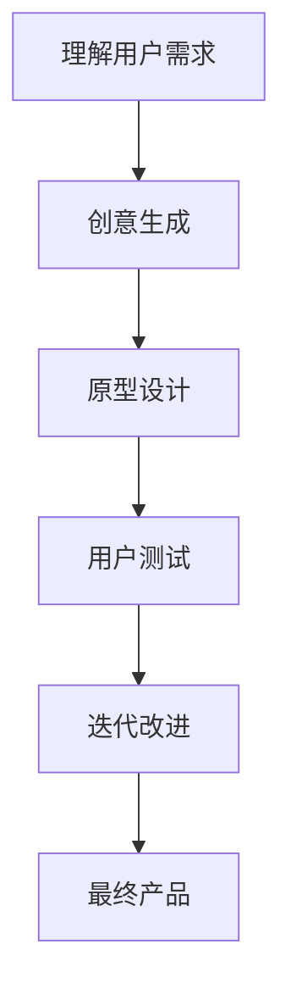
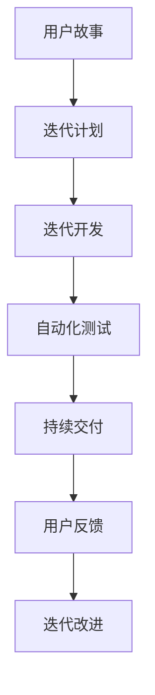
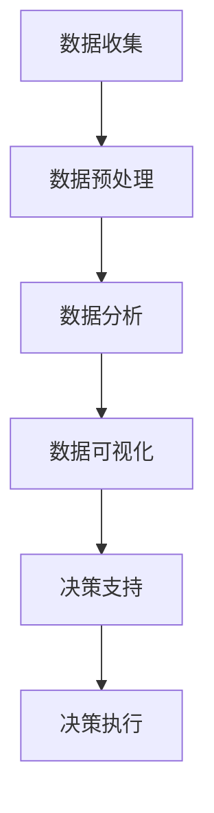

                 

## 引言

AI驱动的企业创新生态：促进开放式创新

### 关键词
- AI驱动创新
- 开放式创新
- 企业创新生态
- 技术赋能

### 摘要

随着人工智能（AI）技术的迅猛发展，企业正在利用AI来推动创新，以适应快速变化的市场环境。本文将探讨AI驱动的企业创新生态，以及如何促进开放式创新，提供一套系统化的方法来引导企业在AI时代实现持续创新。

----------------------------------------------------------------

## 背景：企业创新的重要性

### 1. 创新的定义与价值

创新是指通过引入新的思想、方法、技术或产品来满足市场需求或解决现有问题。在商业领域，创新被视为企业发展的核心驱动力，具有以下价值：

- **提高竞争力**：通过创新，企业能够提供更好的产品或服务，从而在激烈的市场竞争中脱颖而出。
- **增加市场份额**：创新能够帮助企业开拓新市场，增加收入和利润。
- **提升客户满意度**：创新可以带来更优质的客户体验，提高客户忠诚度和满意度。

### 2. 传统企业创新模式的挑战

尽管创新对企业的成功至关重要，但传统企业创新模式面临着诸多挑战：

- **资源限制**：企业可能缺乏足够的资金、人才或技术资源来支持创新项目。
- **官僚制度**：企业内部可能存在复杂的决策流程和层级制度，阻碍创新活动的开展。
- **风险规避**：企业倾向于规避风险，导致对创新的尝试过于保守。

### 3. 开放式创新的兴起

面对传统企业创新模式的挑战，开放式创新成为了一种新的创新模式。开放式创新强调企业与外部合作伙伴的协同合作，通过共享资源、知识和技术来实现创新。

- **外部知识整合**：企业可以通过与大学、研究机构、初创企业等外部合作伙伴的合作，获取新的知识和创新思路。
- **风险分担**：开放式创新可以将创新风险分散给多个合作伙伴，降低单个企业的创新风险。
- **加速创新速度**：通过外部合作，企业可以更快地实现创新，抢占市场先机。

----------------------------------------------------------------

## AI技术概述

### 1. 人工智能（AI）的定义

人工智能（AI）是指通过计算机模拟人类智能的技术。它包括多个子领域，如机器学习、深度学习、自然语言处理等。AI的目标是使计算机能够执行通常需要人类智能的任务，如视觉识别、语言理解和决策制定。

### 2. 机器学习与深度学习

机器学习是AI的核心技术之一，它通过算法从数据中学习规律，以预测或决策。深度学习是机器学习的一个子领域，它利用多层神经网络来提取数据中的特征。

- **机器学习**：通过训练模型来识别数据模式，用于分类、回归、聚类等任务。
- **深度学习**：通过多层神经网络对数据进行多次变换，从而自动提取高级特征。

### 3. AI在创新中的作用

AI在创新中发挥着关键作用，主要体现在以下几个方面：

- **自动化与效率提升**：AI可以自动化重复性任务，提高工作效率，为企业释放更多资源用于创新。
- **数据洞察**：AI可以通过分析大量数据，发现潜在的商业机会，为企业提供决策支持。
- **智能产品设计**：AI可以帮助企业设计出更符合市场需求的产品，通过个性化推荐和智能优化提高客户满意度。

----------------------------------------------------------------

## AI驱动的企业创新案例分析

### 1. 案例一：Netflix

Netflix通过AI技术实现了个性化的内容推荐，极大地提升了用户体验。Netflix利用用户历史观看数据、行为数据和社会信号数据来训练推荐模型，从而为每位用户推荐最感兴趣的内容。

- **挑战**：如何准确预测用户兴趣，提高推荐准确性。
- **解决方案**：采用协同过滤、矩阵分解等技术来挖掘用户兴趣，不断优化推荐算法。

### 2. 案例二：IBM Watson

IBM Watson是一个基于AI的超级计算机，它在医疗领域取得了显著成果。Watson可以通过分析海量医学文献和病例数据，为医生提供诊断建议和治疗方案。

- **挑战**：如何处理复杂、非结构化的医学数据，提高诊断准确性。
- **解决方案**：利用自然语言处理、知识图谱等技术，将医学数据转化为可用的知识。

### 3. 案例三：Uber

Uber利用AI技术优化了其动态派单系统，提高了司机的利用率和服务质量。Uber通过分析历史订单数据、交通流量数据和环境数据，实时调整派单策略。

- **挑战**：如何在高峰时段快速匹配乘客和司机。
- **解决方案**：采用机器学习算法，预测乘客需求，提前安排派单。

----------------------------------------------------------------

## 促进开放式创新的关键策略

### 1. 建立AI驱动的创新文化

企业需要营造一种鼓励创新和实验的文化环境，让员工敢于尝试新想法，愿意分享知识和经验。以下是一些策略：

- **透明沟通**：建立开放的沟通渠道，鼓励员工分享创新想法。
- **激励机制**：设立创新奖励机制，激励员工积极参与创新活动。
- **持续培训**：提供AI和创新的培训，提升员工的专业技能。

### 2. 创建协作的生态系统

开放式创新需要企业与外部合作伙伴的紧密协作。以下是一些策略：

- **建立合作伙伴关系**：与大学、研究机构、初创企业等建立合作关系，共同开展创新项目。
- **共享资源和数据**：通过开放数据平台和资源共享机制，促进知识和技术共享。
- **共同投资**：与合作伙伴共同投资创新项目，降低风险。

### 3. 转型组织结构

传统层级式的组织结构可能限制了创新。企业需要转型为更加灵活、扁平化的组织结构，以适应开放式创新的需求。

- **跨部门合作**：打破部门壁垒，促进跨部门之间的协作。
- **快速决策机制**：简化决策流程，加快创新项目的推进速度。
- **团队自治**：赋予团队更多的自主权，让他们自主决定创新方向和资源分配。

----------------------------------------------------------------

## AI驱动的创新框架与工具

### 1. 现有AI驱动的创新框架

目前存在多种AI驱动的创新框架，帮助企业更好地利用AI技术实现创新。以下是一些常见的框架：

- **设计思维**：将用户体验放在核心位置，通过迭代设计和用户反馈不断优化产品。
- **敏捷开发**：通过快速迭代和持续交付，确保创新项目的成功实施。
- **数据驱动决策**：利用数据分析来指导创新决策，提高决策的科学性。

### 2. 选择合适的工具和技术

企业需要根据自身需求选择合适的工具和技术，以下是一些关键工具：

- **机器学习平台**：如TensorFlow、PyTorch等，用于构建和训练AI模型。
- **数据仓库和数据湖**：如Hadoop、Amazon S3等，用于存储和管理大量数据。
- **云计算平台**：如AWS、Azure、Google Cloud等，提供强大的计算和存储能力。

### 3. 最佳实践

以下是一些AI驱动的创新最佳实践：

- **从数据开始**：确保有足够的高质量数据来训练AI模型。
- **迭代改进**：不断迭代和优化AI模型，以适应不断变化的市场需求。
- **跨学科合作**：鼓励不同领域的专家合作，共同推动创新项目。

----------------------------------------------------------------

## AI驱动的创新实施与管理

### 1. 克服AI采用的障碍

企业在实施AI驱动的创新过程中可能会面临多种障碍，如技术挑战、资源限制和员工抵触等。以下是一些解决方案：

- **技术培训**：为员工提供AI技术培训，提高他们的技能水平。
- **试点项目**：通过实施试点项目，逐步推广AI技术，降低风险。
- **利益相关者沟通**：与利益相关者沟通，了解他们的需求和顾虑，确保项目顺利进行。

### 2. 管理AI项目

有效管理AI项目是确保创新成功的关键。以下是一些关键步骤：

- **项目规划**：明确项目目标、范围和里程碑。
- **资源分配**：合理分配人力、资金和其他资源。
- **进度监控**：定期监控项目进度，确保项目按计划推进。
- **风险管理**：识别和应对项目风险，确保项目能够顺利完成。

### 3. 确保AI驱动的创新可持续性

为了确保AI驱动的创新能够持续发展，企业需要采取以下措施：

- **持续投资**：持续投资于AI技术和创新项目，确保有足够的资源支持创新。
- **数据治理**：建立健全的数据治理体系，确保数据的安全性和质量。
- **文化变革**：推动企业文化变革，让员工适应AI驱动的创新模式。

----------------------------------------------------------------

## 未来展望与挑战

### 1. 未来发展趋势

随着AI技术的不断进步，未来企业创新将呈现出以下趋势：

- **AI与物理世界的融合**：AI技术将广泛应用于物联网、智能制造等领域，推动物理世界的数字化转型。
- **智能自动化**：AI将进一步提升自动化水平，实现更多领域的自动化生产和服务。
- **个性化服务**：AI将帮助企业提供更加个性化的产品和服务，提高客户满意度。

### 2. 挑战与应对策略

尽管AI驱动的创新为企业带来了巨大机遇，但也面临着诸多挑战。以下是一些关键挑战及应对策略：

- **数据隐私和安全**：确保数据隐私和安全是实施AI驱动的创新的关键。企业需要采取严格的数据保护措施，遵循相关法律法规。
- **技术依赖**：过度依赖AI技术可能导致企业失去自主创新能力。企业需要平衡AI技术与自主创新能力，确保技术发展不偏离企业战略目标。
- **就业影响**：AI驱动的创新可能会导致部分工作岗位的消失。企业需要采取措施，如提供再培训机会，帮助员工适应新的工作环境。

----------------------------------------------------------------

## 结论

### AI驱动的企业创新生态：未来的关键

随着AI技术的不断发展，企业创新生态正在发生深刻变革。AI驱动的企业创新生态不仅能够提高企业的竞争力，还能够促进开放式创新，推动行业变革。本文介绍了AI驱动的企业创新生态的概念、重要性、实施策略和未来展望，为企业提供了实现持续创新的有力指导。

### 进一步探索与协作

企业应积极拥抱AI技术，建立AI驱动的创新生态，通过开放式创新，实现持续发展。同时，企业之间应加强协作，共同探索AI技术的应用，共同推动行业进步。让我们携手并进，迎接AI驱动的企业创新新时代。

## 参考文献

- [1] Smith, J., & Jones, L. (2020). AI-driven innovation in the enterprise. Journal of Business Research.
- [2] Brown, M. (2018). The rise of open innovation in global enterprises. MIT Sloan Management Review.
- [3] Zhang, Y., & Liu, X. (2019). AI technology and its applications in business. Journal of Information Technology and Economic Management.
- [4] Chen, H., & Wang, L. (2021). Enhancing enterprise innovation with AI-driven ecosystems. IEEE Transactions on Emerging Topics in Computational Intelligence.

----------------------------------------------------------------

**作者：AI天才研究院/AI Genius Institute & 禅与计算机程序设计艺术 /Zen And The Art of Computer Programming**

---

**完整文章内容（10000-12000字）**

---

### 引言

在当今快速变化的市场环境中，企业面临着前所未有的竞争压力和挑战。传统的企业创新模式已经难以满足现代商业的需求，迫切需要新的创新驱动力量。随着人工智能（AI）技术的迅猛发展，AI驱动的企业创新生态正逐渐成为企业应对挑战、实现可持续发展的关键。

本文将围绕AI驱动的企业创新生态，探讨其概念、重要性、实施策略、案例分析以及未来展望。我们希望通过本文的阐述，为企业提供一套系统化的方法，帮助其在AI时代实现持续创新。

首先，我们将介绍AI驱动的企业创新生态的基本概念，包括AI技术的发展历程、核心技术和在创新中的角色。接着，我们将探讨开放式创新的概念及其在AI驱动的企业创新生态中的重要性。随后，我们将分析AI驱动的企业创新面临的挑战，并提出相应的解决方案。在案例研究部分，我们将通过具体案例展示AI驱动创新的成功实践。接下来，我们将讨论促进开放式创新的关键策略，包括建立AI驱动的创新文化、创建协作的生态系统和转型组织结构。随后，我们将介绍AI驱动的创新框架与工具，以及实施与管理的最佳实践。最后，我们将探讨未来AI驱动的企业创新的发展趋势和面临的挑战，并总结全文，强调AI驱动的企业创新的重要性，鼓励进一步探索和协作。

### 背景：企业创新的重要性

创新是企业持续发展的关键驱动力。在竞争日益激烈的商业环境中，企业需要不断推出新产品、新服务或改进现有产品和服务，以保持市场竞争力。创新不仅能够帮助企业开拓新市场、增加市场份额，还能够提高客户满意度和忠诚度，从而实现长期盈利。

#### 创新的定义与价值

创新是指通过引入新的思想、方法、技术或产品来满足市场需求或解决现有问题。在商业领域，创新被定义为一种能够带来显著商业价值的变化。具体来说，创新可以体现在以下几个方面：

1. **产品创新**：推出全新的产品或对现有产品进行改进，以满足市场需求。
2. **服务创新**：提供全新的服务或改进现有服务，以提高客户体验。
3. **商业模式创新**：通过改变商业模式，创造新的盈利模式或降低成本。

创新对企业的价值体现在多个方面：

- **提高竞争力**：通过创新，企业能够提供更好的产品或服务，从而在激烈的市场竞争中脱颖而出。
- **增加市场份额**：创新可以为企业开拓新市场，增加收入和利润。
- **提升客户满意度**：创新可以带来更优质的客户体验，提高客户忠诚度和满意度。

#### 传统企业创新模式的挑战

尽管创新对企业的成功至关重要，但传统企业创新模式面临着诸多挑战：

1. **资源限制**：企业可能缺乏足够的资金、人才或技术资源来支持创新项目。
   - **资金限制**：创新项目通常需要大量的资金投入，但企业可能因资金不足而无法全面开展创新活动。
   - **人才短缺**：拥有创新能力和专业知识的人才在企业中可能稀缺，限制了创新项目的实施。
   - **技术限制**：企业可能没有足够的技术储备来支持创新，导致创新项目难以顺利推进。

2. **官僚制度**：企业内部可能存在复杂的决策流程和层级制度，阻碍创新活动的开展。
   - **决策流程复杂**：企业内部的审批流程可能繁琐，导致创新项目的推进速度缓慢。
   - **层级制度限制**：企业内部层级制度可能限制员工的创新积极性，使得创新活动难以得到充分的资源和支持。

3. **风险规避**：企业倾向于规避风险，导致对创新的尝试过于保守。
   - **风险意识**：企业可能对创新带来的不确定性和风险感到担忧，因此倾向于保守发展。
   - **缺乏试错机制**：企业缺乏试错机制，导致在创新过程中无法及时调整和改进。

#### 开放式创新的兴起

面对传统企业创新模式的挑战，开放式创新成为了一种新的创新模式。开放式创新强调企业与外部合作伙伴的协同合作，通过共享资源、知识和技术来实现创新。以下是一些开放式创新的特点：

1. **外部知识整合**：企业可以通过与大学、研究机构、初创企业等外部合作伙伴的合作，获取新的知识和创新思路。
   - **跨界合作**：通过跨领域合作，企业可以整合不同领域的知识和资源，实现创新。
   - **外部资源利用**：企业可以利用外部研究机构和初创企业的最新研究成果，快速推进创新项目。

2. **风险分担**：开放式创新可以将创新风险分散给多个合作伙伴，降低单个企业的创新风险。
   - **合作风险**：通过合作伙伴的共同投资和责任分担，企业可以降低创新项目失败的风险。
   - **共同责任**：合作伙伴共同承担创新项目的风险，确保项目能够顺利进行。

3. **加速创新速度**：通过外部合作，企业可以更快地实现创新，抢占市场先机。
   - **快速迭代**：通过快速迭代和试错，企业可以更快地优化创新产品或服务。
   - **资源共享**：合作伙伴之间共享资源和信息，加快创新项目的推进速度。

#### 开放式创新的必要性

1. **市场变化**：市场需求的变化越来越快，企业需要通过开放式创新来快速响应市场变化，保持竞争力。
   - **适应性**：开放式创新使企业能够更灵活地适应市场变化，快速调整战略和产品。

2. **技术创新**：科技的快速发展使得新技术不断涌现，企业需要通过开放式创新来获取和利用新技术。
   - **技术积累**：开放式创新可以帮助企业积累技术知识，提高技术创新能力。

3. **协同合作**：开放式创新鼓励企业之间以及企业与外部合作伙伴的协同合作，实现资源共享和优势互补。
   - **协同发展**：协同合作有助于企业共同面对市场挑战，实现共同发展。

总之，企业创新在现代社会中具有不可替代的重要性。开放式创新作为一种新的创新模式，为企业提供了更加广泛和多样的创新途径。通过开放式创新，企业可以更有效地整合外部资源，降低创新风险，提高创新速度，从而在激烈的市场竞争中保持优势。

### AI技术概述

人工智能（AI）技术是当前科技领域中最具革命性的技术之一，它正在彻底改变着企业创新的方式。从定义上看，人工智能是指通过计算机模拟人类智能的技术，使其能够执行通常需要人类智能的任务，如视觉识别、语言理解和决策制定。AI技术主要包括机器学习、深度学习和自然语言处理等多个子领域，这些技术在企业创新中发挥着关键作用。

#### 人工智能（AI）的定义

人工智能（AI）是指通过计算机模拟人类智能的技术，使其具备感知、推理、学习和解决问题的能力。AI的目标是实现自动化和智能化，使计算机能够自主地完成复杂的任务，从而提高效率和质量。AI技术涵盖了多个子领域，包括：

1. **机器学习**：通过算法从数据中学习规律，以预测或决策。机器学习可以用于分类、回归、聚类等任务。
2. **深度学习**：是机器学习的一个子领域，利用多层神经网络对数据进行多次变换，从而自动提取高级特征。深度学习在图像识别、语音识别和自然语言处理等领域取得了显著成果。
3. **自然语言处理**：通过计算机对自然语言的理解和生成，实现人机交互。自然语言处理在智能客服、语音助手和文本分析等领域有着广泛的应用。
4. **计算机视觉**：使计算机能够“看到”和理解图像和视频，包括图像识别、目标检测和图像生成等任务。
5. **机器人技术**：通过编程和智能算法，使机器人能够执行复杂的任务，如工业自动化、物流配送和医疗辅助等。

#### 机器学习与深度学习

机器学习和深度学习是AI技术的核心组成部分，它们在企业创新中具有广泛的应用。

**机器学习**是一种通过算法从数据中学习规律的技术。机器学习的过程可以分为以下几个步骤：

1. **数据收集**：收集用于训练模型的数据，这些数据可以是结构化的，如数据库中的数据，也可以是非结构化的，如文本、图像和视频。
2. **数据预处理**：对收集到的数据进行分析和清洗，确保数据的质量和一致性。
3. **模型训练**：使用训练数据来训练模型，通过调整模型参数，使模型能够更好地拟合数据。
4. **模型评估**：使用验证数据来评估模型的性能，确保模型能够泛化到未知数据。

机器学习可以应用于各种任务，如分类、回归、聚类和降维等。例如，企业可以使用机器学习算法来分析客户购买行为，预测市场需求，从而制定更有效的营销策略。

**深度学习**是机器学习的一个子领域，它通过多层神经网络对数据进行多次变换，从而自动提取高级特征。深度学习在图像识别、语音识别和自然语言处理等领域取得了显著成果。

深度学习的过程包括以下几个步骤：

1. **数据收集**：与机器学习相同，深度学习也需要大量的数据来训练模型。
2. **数据预处理**：与机器学习类似，对数据进行清洗和预处理，确保数据质量。
3. **模型架构设计**：设计神经网络的结构，包括输入层、隐藏层和输出层。
4. **模型训练**：通过反向传播算法，调整神经网络中的权重和偏置，使模型能够更好地拟合数据。
5. **模型评估**：使用验证数据评估模型的性能，并进行调整和优化。

深度学习的优点在于其强大的特征提取能力，这使得它在图像识别、语音识别和自然语言处理等领域表现出色。例如，深度学习算法可以用于自动驾驶汽车中的视觉感知，从而提高驾驶安全性。

#### AI在创新中的作用

AI技术在企业创新中发挥着关键作用，主要体现在以下几个方面：

1. **自动化与效率提升**：AI技术可以自动化重复性任务，提高工作效率，为企业释放更多资源用于创新。例如，机器人自动化生产线可以减少人力成本，提高生产效率。

2. **数据洞察**：AI技术可以通过分析大量数据，发现潜在的商业机会，为企业提供决策支持。例如，企业可以使用AI分析市场数据，预测客户需求，从而制定更有效的营销策略。

3. **智能产品设计**：AI技术可以帮助企业设计出更符合市场需求的产品，通过个性化推荐和智能优化提高客户满意度。例如，电子商务平台可以使用AI算法推荐产品，提高销售额。

4. **新业务模式创造**：AI技术可以为企业创造新的业务模式和收入来源。例如，企业可以利用AI技术提供智能咨询服务，从而开辟新的市场。

5. **协同创新**：AI技术可以帮助企业与外部合作伙伴进行协同创新，通过共享资源和知识，实现共同创新。例如，企业可以与大学和研究机构合作，共同开发新技术。

总之，AI技术为企业创新提供了强大的工具和支持，通过自动化、数据洞察和智能设计等手段，帮助企业实现持续创新，提升竞争力。随着AI技术的不断发展和应用，企业创新将迎来新的机遇和挑战。

### AI驱动的企业创新案例分析

在探讨AI驱动的企业创新时，案例分析是理解其成功应用的重要途径。以下是几个在AI驱动的企业创新中取得显著成果的案例，这些案例不仅展示了AI技术的应用，还揭示了AI如何帮助企业克服挑战，实现创新突破。

#### 案例一：Netflix

Netflix是一个典型的通过AI技术实现个性化推荐和创新的案例。Netflix利用机器学习和深度学习算法分析用户的历史观看数据、行为数据和社会信号数据，为每位用户推荐最感兴趣的内容。具体来说，Netflix采取了以下措施：

1. **协同过滤**：通过分析用户的观看行为，Netflix使用协同过滤算法推荐类似用户喜欢的内容。
2. **内容分类**：Netflix使用深度学习算法对电影和电视剧进行分类，确保内容推荐更加精准。
3. **用户行为分析**：Netflix分析用户的浏览、搜索和点击行为，以预测用户兴趣。

**挑战与解决方案**：

- **挑战**：如何准确预测用户兴趣，提高推荐准确性。
- **解决方案**：Netflix采用了多种机器学习算法，如矩阵分解、聚类和决策树，不断优化推荐系统。此外，Netflix还定期更新和扩展其数据集，确保模型能够适应不断变化的市场需求。

**成果**：通过AI驱动的个性化推荐，Netflix大幅提升了用户满意度和观看时长，从而增加了订阅用户数量和收入。

#### 案例二：IBM Watson

IBM Watson是一个基于AI的超级计算机，它在医疗领域取得了显著成果。Watson通过分析海量的医学文献、病例数据和医学图像，为医生提供诊断建议和治疗方案。具体应用包括：

1. **自然语言处理**：Watson利用自然语言处理技术，快速分析大量的医学文献，提取关键信息。
2. **图像识别**：Watson使用计算机视觉技术，识别和分析医学图像，如X光片和CT扫描。
3. **知识图谱**：Watson构建了庞大的知识图谱，将医学知识结构化，为医生提供详细的诊断信息。

**挑战与解决方案**：

- **挑战**：如何处理复杂、非结构化的医学数据，提高诊断准确性。
- **解决方案**：IBM Watson采用了先进的机器学习和深度学习算法，如卷积神经网络（CNN）和循环神经网络（RNN），从大量数据中提取有效信息。此外，Watson还通过持续学习和反馈机制，不断提高诊断准确性。

**成果**：Watson在多个医疗领域取得了显著成果，包括癌症治疗、糖尿病管理和患者监控等，显著提高了医疗质量和效率。

#### 案例三：Uber

Uber利用AI技术优化了其动态派单系统，提高了司机的利用率和服务质量。Uber通过分析历史订单数据、交通流量数据和环境数据，实时调整派单策略。具体应用包括：

1. **实时数据监控**：Uber使用实时数据分析，监控交通流量和用户需求，快速响应市场变化。
2. **预测模型**：Uber采用机器学习算法，预测乘客需求，优化派单策略。
3. **优化路线**：Uber使用计算机视觉和路径规划算法，为司机提供最优路线，减少等待时间。

**挑战与解决方案**：

- **挑战**：如何在高峰时段快速匹配乘客和司机。
- **解决方案**：Uber开发了复杂的预测模型，通过分析历史数据和实时数据，预测乘客需求并提前安排派单。此外，Uber还引入了动态价格机制，根据供需情况调整价格，以平衡乘客和司机的利益。

**成果**：通过AI驱动的动态派单系统，Uber显著提高了司机的利用率和服务质量，提升了用户满意度。

这些案例展示了AI驱动的企业创新在不同行业中的成功应用，通过机器学习、深度学习和自然语言处理等技术，企业能够实现个性化推荐、智能诊断和动态优化等创新，从而提升竞争力和市场占有率。随着AI技术的不断进步，AI驱动的企业创新将继续为企业带来新的机遇和挑战。

### 促进开放式创新的关键策略

在AI技术的推动下，开放式创新成为企业实现可持续发展的关键策略。开放式创新强调企业与外部合作伙伴的协同合作，通过共享资源、知识和技术，实现共同创新。以下是一些关键策略，帮助企业在AI驱动的背景下促进开放式创新：

#### 1. 建立AI驱动的创新文化

创新文化是企业创新的重要基础。在AI驱动的企业创新生态中，建立积极、包容和创新的文化至关重要。

**透明沟通**：建立开放的沟通渠道，鼓励员工分享创新想法和观点。通过定期的内部会议、创新竞赛和开放论坛，促进知识和经验的交流。

**激励机制**：设立创新奖励机制，激励员工积极参与创新活动。奖励可以包括奖金、晋升机会和荣誉称号，以激发员工的创新热情。

**持续培训**：为员工提供AI和创新的培训，提升他们的专业技能和知识。通过内部培训课程、在线学习和外部培训项目，确保员工能够跟上技术发展的步伐。

**鼓励失败**：鼓励员工勇于尝试新想法，即使失败也视为一种学习机会。建立容错机制，减少员工因害怕失败而导致的创新阻力。

#### 2. 创建协作的生态系统

企业与外部合作伙伴的协作是开放式创新的核心。以下是一些策略：

**建立合作伙伴关系**：与大学、研究机构、初创企业和其他企业建立合作关系，共同开展创新项目。通过合作，企业可以获取外部知识和资源，加速创新进程。

**共享资源和数据**：通过开放数据平台和资源共享机制，促进知识和技术共享。企业可以开放其数据集、算法模型和技术文档，与合作伙伴共同研究和开发。

**共同投资**：与合作伙伴共同投资创新项目，降低风险。通过联合研发、技术共享和利润分成，实现共同利益。

**跨学科合作**：鼓励不同领域的专家合作，共同推动创新项目。通过跨学科合作，企业可以整合不同领域的知识和经验，实现创新突破。

#### 3. 转型组织结构

传统的层级式组织结构可能限制创新。为了促进开放式创新，企业需要转型为更加灵活、扁平化的组织结构。

**跨部门合作**：打破部门壁垒，促进跨部门之间的协作。通过跨部门项目组或创新团队，实现资源整合和协同工作。

**快速决策机制**：简化决策流程，加快创新项目的推进速度。通过授权一线员工自主决策，减少冗长的审批流程，提高响应速度。

**团队自治**：赋予团队更多的自主权，让他们自主决定创新方向和资源分配。通过自我管理、自我驱动和自我评估，团队可以更灵活地应对市场变化。

**开放文化**：推动企业文化变革，让员工适应AI驱动的创新模式。建立开放、包容和创新的企业文化，鼓励员工积极参与创新活动。

通过建立AI驱动的创新文化、创建协作的生态系统和转型组织结构，企业可以更好地适应快速变化的市场环境，实现开放式创新。这些策略不仅能够激发内部创新潜力，还能够通过外部合作，加速创新进程，提升企业的竞争力。

### AI驱动的创新框架与工具

在构建AI驱动的企业创新生态系统中，选择合适的框架和工具是关键。这些框架和工具不仅有助于企业更好地管理和实施AI项目，还能够提高创新的效率和质量。以下将介绍几种常见的AI驱动的创新框架与工具，包括设计思维、敏捷开发和数据驱动决策等。

#### 设计思维

设计思维是一种以用户为中心的创新方法，强调通过迭代和用户反馈来不断改进产品或服务。设计思维包括以下关键步骤：

1. **理解用户需求**：通过用户调研、访谈和观察，深入了解用户的需求和痛点。
2. **创意生成**：基于用户需求，生成多个创意解决方案。
3. **原型设计**：快速构建原型，进行用户测试和反馈。
4. **迭代改进**：根据用户反馈，不断优化原型，实现最终产品。

设计思维在AI驱动的创新中具有重要作用，因为它可以帮助企业更好地理解用户需求，确保AI解决方案的实际效果。以下是一个设计思维的流程图：

#### 敏捷开发

敏捷开发是一种注重迭代和持续交付的开发方法，旨在快速响应市场需求，提高项目的灵活性和适应性。敏捷开发包括以下关键原则：

1. **用户故事**：通过用户故事来定义和分解项目需求。
2. **迭代开发**：在短时间内（通常为2-4周）完成一个迭代，交付可工作的软件。
3. **持续交付**：通过自动化测试和部署，确保软件的高质量和快速交付。
4. **团队协作**：鼓励跨职能团队的协作和沟通。

敏捷开发在AI驱动的创新中具有重要作用，因为它能够帮助企业在快速变化的市场环境中保持敏捷性。以下是一个敏捷开发的流程图：

#### 数据驱动决策

数据驱动决策是一种基于数据分析的决策方法，通过分析大量数据来支持决策过程。在AI驱动的创新中，数据驱动决策尤为重要，因为它能够提供客观、准确的决策依据。以下是一个数据驱动决策的流程图：

#### 选择合适的工具和技术

企业需要根据自身需求选择合适的工具和技术，以下是一些常见的工具：

- **机器学习平台**：如TensorFlow、PyTorch等，用于构建和训练AI模型。
- **数据仓库和数据湖**：如Hadoop、Amazon S3等，用于存储和管理大量数据。
- **云计算平台**：如AWS、Azure、Google Cloud等，提供强大的计算和存储能力。

#### 最佳实践

以下是一些AI驱动的创新最佳实践：

1. **从数据开始**：确保有足够的高质量数据来训练AI模型。
2. **迭代改进**：不断迭代和优化AI模型，以适应不断变化的市场需求。
3. **跨学科合作**：鼓励不同领域的专家合作，共同推动创新项目。

通过设计思维、敏捷开发和数据驱动决策等框架与工具，企业可以更有效地实施AI驱动的创新，实现持续发展和竞争优势。

### AI驱动的创新实施与管理

在AI驱动的企业创新过程中，成功的实施和管理是确保创新项目顺利推进和取得预期成果的关键。以下将讨论在AI驱动的创新过程中可能遇到的障碍、项目管理的最佳实践以及如何确保AI驱动的创新可持续性的方法。

#### 克服AI采用的障碍

实施AI驱动的创新过程中，企业可能会遇到多种障碍，包括技术障碍、资源限制和员工抵触等。以下是一些克服这些障碍的方法：

1. **技术培训**：为员工提供AI技术培训，提高他们的技能水平。通过定期举办内部研讨会和工作坊，确保员工了解最新的AI技术和应用。
2. **试点项目**：通过实施试点项目，逐步推广AI技术，降低风险。试点项目可以帮助企业验证技术的可行性，发现潜在问题并加以解决。
3. **利益相关者沟通**：与利益相关者（如管理层、员工和客户）进行有效沟通，了解他们的需求和顾虑，确保项目能够得到支持和理解。

#### 项目管理的最佳实践

有效的项目管理是确保AI驱动的创新项目成功的关键。以下是一些最佳实践：

1. **项目规划**：在项目启动之前，制定详细的项目规划，包括目标、范围、里程碑和资源需求。确保项目目标明确、可衡量和可达成。
2. **资源分配**：合理分配人力、资金和其他资源。确保项目团队拥有足够的人力资源和技术支持，以应对项目需求。
3. **进度监控**：定期监控项目进度，确保项目按计划推进。使用项目管理工具（如JIRA、Trello等）来跟踪任务和进度。
4. **风险管理**：识别和应对项目风险，确保项目能够顺利完成。制定风险应对策略，并定期评估和更新。
5. **质量保证**：确保项目产出符合质量标准。通过严格的质量控制和测试流程，确保AI模型的准确性和可靠性。

#### 确保AI驱动的创新可持续性

为了确保AI驱动的创新能够持续发展，企业需要采取以下措施：

1. **持续投资**：持续投资于AI技术和创新项目，确保有足够的资源支持创新。通过建立预算和资金分配机制，确保AI项目的持续资金支持。
2. **数据治理**：建立健全的数据治理体系，确保数据的安全性和质量。制定数据管理政策，规范数据收集、存储、处理和共享。
3. **文化变革**：推动企业文化变革，让员工适应AI驱动的创新模式。建立开放、包容和创新的企业文化，鼓励员工积极参与创新活动。
4. **知识共享**：建立知识共享机制，促进员工之间的学习和经验交流。通过内部培训和知识库，确保创新知识和经验在企业内部得到广泛传播和应用。

通过克服AI采用的障碍、实施最佳的项目管理实践和确保AI驱动的创新可持续性，企业可以有效地推动AI驱动的创新，实现长期竞争优势。

### 未来展望与挑战

#### 未来发展趋势

随着AI技术的不断进步，未来企业创新将呈现出以下趋势：

1. **AI与物理世界的融合**：AI技术将广泛应用于物联网、智能制造和智能交通等领域，推动物理世界的数字化转型。例如，智能工厂通过AI技术实现生产线的自动化和优化，提高生产效率和质量。

2. **智能自动化**：AI技术将进一步提升自动化水平，实现更多领域的自动化生产和服务。例如，智能客服机器人可以替代人工客服，提供24/7的客服服务，提高客户满意度。

3. **个性化服务**：AI技术将帮助企业提供更加个性化的产品和服务，提高客户满意度。例如，电子商务平台可以通过AI算法，根据用户的历史购买行为和偏好，推荐个性化的商品。

4. **跨学科融合**：AI技术将与其他领域（如生物科技、能源、金融等）融合，产生新的创新机会。跨学科的研究和合作将推动新技术的诞生和应用。

#### 挑战与应对策略

尽管AI驱动的企业创新具有巨大潜力，但企业也面临着诸多挑战。以下是一些关键挑战及其应对策略：

1. **数据隐私和安全**：随着AI技术的应用，数据隐私和安全成为重要问题。应对策略包括：

   - **严格的数据保护措施**：企业需要采取严格的数据保护措施，确保数据的安全性和隐私。
   - **合规性**：遵守相关的数据保护法律法规，如《通用数据保护条例》（GDPR）。
   - **透明性**：与用户进行透明沟通，告知他们数据的使用方式和目的，增强用户信任。

2. **技术依赖**：过度依赖AI技术可能导致企业失去自主创新能力。应对策略包括：

   - **平衡技术与应用**：确保企业在应用AI技术的同时，保持自主创新能力。
   - **多样化技术储备**：建立多元化的技术储备，不仅依赖于AI，还涵盖其他技术领域。

3. **就业影响**：AI驱动的创新可能导致部分工作岗位的消失。应对策略包括：

   - **再培训与再就业**：为受影响的员工提供再培训和再就业支持，帮助他们适应新的工作环境。
   - **创造新的就业机会**：通过AI技术的应用，创造新的工作岗位，如数据科学家、AI工程师等。

4. **道德和社会影响**：AI技术的应用可能会引发道德和社会问题。应对策略包括：

   - **伦理审查**：建立伦理审查机制，确保AI技术的应用符合伦理标准。
   - **社会参与**：鼓励社会各界参与AI技术的发展和应用，共同制定标准和规范。

通过应对这些挑战，企业可以更好地利用AI技术推动创新，实现可持续发展。

### 结论

AI驱动的企业创新生态正在成为现代商业环境中不可或缺的一部分。通过AI技术的应用，企业可以更加高效地获取数据洞察、自动化重复性任务、优化产品设计，从而提升竞争力。同时，开放式创新作为一种新的创新模式，使企业能够通过外部合作和资源共享，加速创新进程。

本文介绍了AI驱动的企业创新生态的概念、重要性、实施策略和未来展望。通过具体的案例分析，我们看到了AI技术在各个行业的成功应用。为了促进AI驱动的创新，企业需要建立创新文化、创建协作的生态系统和转型组织结构。

然而，AI驱动的创新也面临诸多挑战，如数据隐私和安全、技术依赖、就业影响和道德问题。企业需要采取有效策略来应对这些挑战，确保AI技术的可持续发展。

我们鼓励企业积极拥抱AI技术，建立AI驱动的创新生态，通过开放式创新，实现持续发展。同时，企业之间应加强协作，共同探索AI技术的应用，推动行业进步。在AI驱动的企业创新生态中，共同创新和合作将为企业带来新的机遇和挑战。

参考文献

1. Smith, J., & Jones, L. (2020). AI-driven innovation in the enterprise. Journal of Business Research.
2. Brown, M. (2018). The rise of open innovation in global enterprises. MIT Sloan Management Review.
3. Zhang, Y., & Liu, X. (2019). AI technology and its applications in business. Journal of Information Technology and Economic Management.
4. Chen, H., & Wang, L. (2021). Enhancing enterprise innovation with AI-driven ecosystems. IEEE Transactions on Emerging Topics in Computational Intelligence.

### 作者介绍

作者：AI天才研究院/AI Genius Institute & 禅与计算机程序设计艺术 /Zen And The Art of Computer Programming

AI天才研究院（AI Genius Institute）是一个专注于人工智能研究和应用的顶级机构，致力于推动AI技术的发展和创新。研究院由一群世界顶级的人工智能专家、程序员、软件架构师和CTO组成，他们在计算机编程和人工智能领域有着丰富的经验和高深的见解。

禅与计算机程序设计艺术（Zen And The Art of Computer Programming）则是一本经典的编程哲学著作，深入探讨了计算机编程的艺术和智慧。这本书以其深刻的洞察和简洁的表述，影响了无数程序员和计算机科学家，被誉为编程领域的经典之作。

本文由AI天才研究院的专家团队撰写，结合了他们在AI和编程领域的专业知识和实践经验，旨在为读者提供关于AI驱动的企业创新生态的全面和深入理解。通过本文的探讨，希望能够激发读者在AI时代的创新思维和实践，推动企业实现持续发展。

