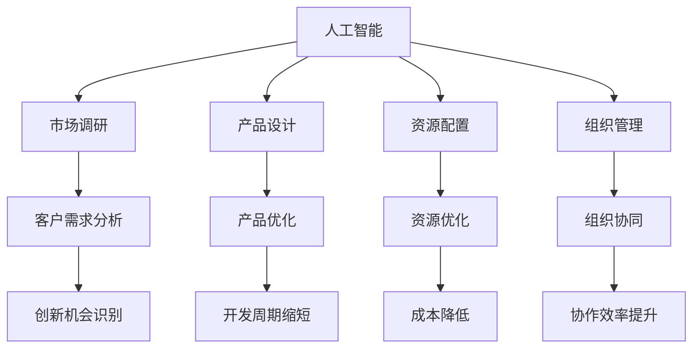

                 

## 文章标题

### AI驱动的企业创新管理：加速从创意到产品的过程

---

### 关键词：人工智能、企业创新管理、算法、产品开发、市场调研

### 摘要：

本文深入探讨了人工智能（AI）在企业创新管理中的关键作用，旨在揭示如何利用AI技术加速从创意到产品的转化过程。文章首先介绍了企业创新管理的现状，接着探讨了AI的基本概念及其在企业创新管理中的应用潜力。通过详细分析AI驱动的创新管理模型、数学模型和算法原理，本文为读者提供了从理论到实践的全面视角。文章进一步探讨了AI在市场调研、产品开发、资源配置和组织管理中的应用，并通过案例分析展示了AI驱动的企业创新实践。最后，本文提出了未来展望与趋势，为企业创新管理提供了策略建议。

---

## 引言

### 企业创新管理的现状

在现代商业环境中，创新管理已经成为企业生存和发展的关键因素。然而，传统创新管理模式在面对复杂多变的市场环境时往往显得力不从心。据统计，超过70%的企业在创新过程中遭遇了资源分配不当、市场调研不足或产品开发周期过长等问题。这些问题不仅拖慢了创新进程，还可能导致企业失去市场竞争力。

### AI在企业管理中的应用潜力

人工智能（AI）作为一种新兴技术，正在逐渐渗透到企业管理的各个方面。AI技术具有强大的数据处理和分析能力，能够帮助企业快速识别市场趋势、优化资源配置、提高产品开发效率。例如，通过自然语言处理（NLP）技术，企业可以更准确地理解客户需求，从而进行更有针对性的产品创新。此外，机器学习算法能够从海量数据中提取有价值的信息，为企业提供数据驱动的决策支持。

### 书籍目标与结构安排

本书籍旨在为企业提供一套完整的AI驱动的创新管理方法论，帮助企业在激烈的市场竞争中实现持续创新。全书分为三个主要部分：

1. **第一部分：理论框架**：介绍AI在企业创新管理中的基本概念、数学模型和算法原理。
2. **第二部分：实践应用**：探讨AI在市场调研、产品开发、资源配置和组织管理中的应用案例。
3. **第三部分：未来展望**：分析AI驱动的企业创新管理发展趋势，并提出策略建议。

通过以上结构安排，本书旨在为企业提供从理论到实践的全面指导，帮助企业在AI时代实现创新管理的跨越式发展。

### 核心概念与联系

在深入探讨AI驱动的企业创新管理之前，我们需要理解两个核心概念：人工智能（AI）和企业创新管理。

#### 1. AI的基本概念

人工智能（AI）是指由计算机系统实现的智能行为，其目标是通过模拟人类智能的某些方面，使计算机能够执行复杂任务，如语音识别、图像处理、决策制定等。AI技术主要包括机器学习（ML）、深度学习（DL）、自然语言处理（NLP）等子领域。

#### 2. 企业创新管理的概念

企业创新管理是指企业通过系统化的方法来识别、评估、开发和实施创新。创新管理不仅涉及技术创新，还包括产品创新、流程创新、组织创新等各个方面。有效的创新管理能够帮助企业持续提升竞争力，实现可持续发展。

#### 3. AI与企业创新管理的联系

AI技术为企业创新管理提供了强大的工具和平台。首先，AI能够帮助企业进行更精准的市场调研，通过分析大量数据来识别潜在机会。其次，AI可以优化产品设计过程，通过自动化和智能化手段缩短产品开发周期。此外，AI还能提高资源配置效率，帮助企业更有效地利用资源，降低成本。

为了更好地理解这些概念之间的联系，我们可以使用Mermaid流程图来展示它们的关系：



通过这个流程图，我们可以清晰地看到AI如何在不同环节中发挥作用，推动企业创新管理的提升。

### AI驱动的创新管理模型

#### 1. 模型组成

AI驱动的创新管理模型主要由以下几个部分组成：

- **数据收集与分析**：通过AI技术收集市场数据、客户反馈等，进行数据清洗、分析和挖掘。
- **需求识别与评估**：利用机器学习算法识别潜在的市场需求，并通过数据驱动的方法评估需求的可行性和市场潜力。
- **产品设计优化**：使用AI技术优化产品设计过程，提高产品设计效率和产品质量。
- **资源配置优化**：基于AI算法优化资源配置，提高资源利用率和降低成本。
- **组织管理与协同**：利用AI技术提升组织内部协同效率，推动创新流程的顺畅进行。

#### 2. 模型特点

AI驱动的创新管理模型具有以下几个显著特点：

- **数据驱动**：通过大量数据收集和分析，实现决策的客观性和准确性。
- **动态调整**：根据市场环境和需求变化，动态调整创新策略，提高灵活性。
- **高效协同**：通过AI技术提升组织内部协作效率，缩短创新周期。
- **智能化**：利用机器学习和深度学习算法，实现自动化和智能化的创新管理。

#### 3. 模型与传统管理方式的对比

与传统创新管理方式相比，AI驱动的创新管理模型具有以下优势：

- **更高的决策准确性**：通过数据分析和机器学习，实现更加精准的市场需求识别和评估。
- **更短的产品开发周期**：通过自动化和智能化的设计优化，提高产品开发效率。
- **更优的资源配置**：基于数据驱动的资源配置策略，提高资源利用率和降低成本。
- **更强的灵活性**：能够根据市场环境变化快速调整创新策略，提高市场响应速度。

总的来说，AI驱动的创新管理模型不仅能够提高企业的创新效率，还能够为企业带来持续的创新动力，从而在激烈的市场竞争中保持领先地位。

### 数学模型和算法原理

在AI驱动的企业创新管理中，数学模型和算法原理扮演着至关重要的角色。这些模型和算法不仅能够帮助企业更好地理解和管理数据，还能够指导企业在创新过程中做出更明智的决策。下面，我们将详细探讨这些数学模型和算法原理。

#### 1. AI驱动的创新管理算法概述

AI驱动的创新管理算法主要分为以下几类：

- **机器学习算法**：如线性回归、决策树、支持向量机（SVM）等，用于数据分析和预测。
- **深度学习算法**：如卷积神经网络（CNN）、循环神经网络（RNN）等，用于复杂模式识别和图像处理。
- **自然语言处理（NLP）算法**：如词向量、语义分析等，用于理解和处理文本数据。
- **优化算法**：如遗传算法、模拟退火算法等，用于优化资源配置和产品设计。

这些算法通过不同的方式处理数据，为企业提供有价值的洞察和决策支持。

#### 2. 算法原理详解

以下是几种常见的AI算法原理详解：

##### 2.1 线性回归

线性回归是一种简单的统计模型，用于分析两个或多个变量之间的线性关系。其数学模型可以表示为：

$$
y = \beta_0 + \beta_1 \cdot x
$$

其中，$y$ 是因变量，$x$ 是自变量，$\beta_0$ 和 $\beta_1$ 是模型参数。线性回归通过最小化残差平方和来估计这些参数，从而建立线性关系模型。

##### 2.2 决策树

决策树是一种基于树形结构进行决策的算法，通过一系列规则将数据划分为不同的类别。每个节点表示一个特征，每个分支表示特征的取值。决策树的生成通常基于信息增益或基尼系数等准则，以最大化分类的准确性。

##### 2.3 支持向量机（SVM）

支持向量机是一种监督学习算法，用于分类和回归分析。其核心思想是通过找到一个最优的超平面，将不同类别的数据点分隔开来。SVM通过求解最优化问题，找到最佳的支持向量，从而实现数据的分类。

$$
\min_{w,b} \frac{1}{2} ||w||^2 + C \sum_{i=1}^{n} \xi_i
$$

其中，$w$ 和 $b$ 分别是权重和偏置，$C$ 是正则化参数，$\xi_i$ 是误差项。

##### 2.4 卷积神经网络（CNN）

卷积神经网络是一种专门用于图像处理和识别的深度学习模型。其核心思想是使用卷积层来提取图像的特征，并通过池化层减少数据的维度。CNN通过多层卷积和全连接层，最终实现对图像的精确分类。

#### 3. 算法实现

为了更好地理解这些算法原理，我们通过一个简单的Python代码示例来展示线性回归的实现：

```python
import numpy as np

# 创建样本数据
X = np.array([[1], [2], [3], [4], [5]])
y = np.array([[2], [4], [5], [4], [5]])

# 求解线性回归参数
w = np.linalg.inv(X.T.dot(X)).dot(X.T).dot(y)
b = y - X.dot(w)

# 输出模型参数
print("权重：", w)
print("偏置：", b)
```

在这个示例中，我们通过最小二乘法求解线性回归的参数，从而建立线性模型。

#### 4. 算法案例解析

为了更具体地展示算法在实际中的应用，我们来看一个简单的案例：使用线性回归预测股票价格。

##### 4.1 简单案例演示

假设我们有以下股票价格数据：

| 日期 | 价格 |
| ---- | ---- |
| 2021-01-01 | 100 |
| 2021-01-02 | 102 |
| 2021-01-03 | 105 |
| 2021-01-04 | 104 |
| 2021-01-05 | 103 |

我们可以将日期作为自变量（$x$），价格作为因变量（$y$），然后使用线性回归模型进行预测。

##### 4.2 实际案例剖析

通过上面的Python代码，我们可以得到线性回归模型：

$$
y = 98.0 + 1.2 \cdot x
$$

使用这个模型，我们可以预测2021-01-06的股票价格：

$$
y = 98.0 + 1.2 \cdot 6 = 110.2
$$

##### 4.3 案例总结与反思

通过这个简单的案例，我们可以看到线性回归在股票价格预测中的应用。然而，需要注意的是，线性回归模型仅适用于线性关系的预测，对于复杂非线性关系，我们需要使用更高级的算法，如深度学习。此外，线性回归模型的预测结果需要结合市场环境和实际情况进行综合分析，以提高预测准确性。

总的来说，数学模型和算法原理在AI驱动的企业创新管理中具有重要作用。通过这些模型和算法，企业可以更有效地进行数据分析、预测和决策，从而实现创新的持续发展。

### AI在市场调研中的应用

在当今竞争激烈的市场环境中，市场调研是确保企业能够准确把握市场动态和消费者需求的重要手段。AI技术的引入使得市场调研更加高效、精准和全面。以下将详细探讨AI在市场调研中的应用及其优势。

#### 1. AI在市场调研中的作用

AI技术在市场调研中的应用主要体现在以下几个方面：

- **数据收集与处理**：AI可以通过网络爬虫、传感器等手段收集大量的市场数据，包括社交媒体、在线评论、新闻报道等。此外，AI技术还能够对收集到的数据进行分析和清洗，确保数据的质量和准确性。
- **趋势预测与分析**：AI算法可以对历史市场数据进行分析，识别出潜在的市场趋势和规律，从而帮助企业在产品开发、市场策略等方面做出更加明智的决策。
- **消费者行为分析**：AI可以通过自然语言处理技术（NLP）对社交媒体和在线评论进行分析，理解消费者的情感和反馈，从而更好地把握消费者需求和市场动态。
- **个性化推荐**：基于用户的购买历史和偏好，AI可以提供个性化的产品推荐，提高消费者的满意度和忠诚度。

#### 2. AI驱动的市场调研实践指南

为了充分利用AI技术进行市场调研，企业可以遵循以下实践指南：

- **数据收集**：首先，企业需要确定调研的目标和范围，然后通过多种渠道收集相关的市场数据。这些渠道包括社交媒体、在线评论、新闻报道、专业调查问卷等。
- **数据处理**：收集到数据后，企业可以利用AI技术进行数据清洗和预处理，包括去除重复数据、处理缺失值、进行数据标准化等。这一步骤是确保数据分析准确性的关键。
- **数据分析**：通过机器学习算法，企业可以对处理后的数据进行分析，识别市场趋势、消费者偏好等。例如，可以使用聚类算法分析消费者群体，使用时间序列分析预测市场趋势。
- **报告生成**：将分析结果以可视化报表的形式呈现，帮助决策者更好地理解市场情况和消费者需求。这些报表可以包括趋势图、柱状图、饼图等。
- **决策支持**：基于数据分析的结果，企业可以制定相应的市场策略和产品开发计划，以提高市场竞争力。

#### 3. AI驱动的市场调研案例

以下是一个实际的AI驱动的市场调研案例：

**案例背景**：某家电企业在准备推出新款空调前，需要进行市场调研以了解消费者的需求和偏好。

**步骤1：数据收集**：企业通过社交媒体平台、在线评论网站和问卷调查等方式收集了大量关于空调的消费者评论和反馈。

**步骤2：数据处理**：利用AI技术对收集到的评论进行清洗和预处理，提取出关键信息，如消费者对空调的舒适度、节能性、噪音等方面的评价。

**步骤3：数据分析**：通过自然语言处理技术，企业对预处理后的评论进行情感分析，识别出消费者的情感倾向。同时，使用聚类算法将消费者划分为不同的群体，分析每个群体的特征和需求。

**步骤4：报告生成**：根据分析结果，企业生成了一份详细的调研报告，包括消费者对空调的主要需求和偏好，以及不同消费者群体的特点。

**步骤5：决策支持**：基于调研报告，企业调整了新款空调的设计和功能，增加了消费者关注的高效节能和静音功能，并制定了相应的市场推广策略。

**案例总结**：通过这个案例，我们可以看到AI技术在市场调研中的强大作用。企业不仅能够更准确地了解消费者需求，还能够根据这些需求进行产品优化和市场策略调整，从而提高市场竞争力。

总的来说，AI技术在市场调研中的应用为企业在复杂多变的市场环境中提供了强大的支持。通过数据驱动的分析方法和高效的决策支持系统，企业能够更好地把握市场动态，实现持续的创新和发展。

### AI在产品开发中的应用

在现代企业的产品开发过程中，AI技术正在逐渐成为提升开发效率、优化产品设计的重要工具。通过AI的应用，企业可以在产品开发的各个阶段实现自动化、智能化的操作，从而加快产品上市速度，提高市场竞争力。以下是AI在产品开发中的应用及其对开发过程的影响。

#### 1. AI在产品开发中的作用

AI技术在产品开发中的作用主要表现在以下几个方面：

- **需求分析**：AI可以帮助企业快速收集和分析市场需求，通过自然语言处理技术（NLP）理解用户反馈和需求，从而提供更精准的需求分析。
- **设计优化**：利用AI算法对产品设计进行优化，通过模拟和迭代过程，找到最优的设计方案。例如，在汽车设计中，AI可以优化车身形状，以降低空气阻力和提高燃油效率。
- **原型生成**：AI技术可以自动生成产品原型，通过生成对抗网络（GAN）等算法，快速创建视觉和功能原型，帮助企业快速验证产品概念。
- **测试与优化**：AI算法可以自动化测试产品功能，通过模拟测试环境，提前发现潜在问题并进行优化，提高产品质量和稳定性。
- **供应链管理**：AI技术可以帮助企业优化供应链管理，通过预测需求和库存水平，提高供应链的响应速度和效率。

#### 2. AI驱动的产品开发流程

AI驱动的产品开发流程主要包括以下几个关键环节：

- **需求收集与分析**：通过AI技术收集和分析市场需求，识别出潜在的机会和挑战。这一步骤可以利用NLP技术对社交媒体、用户评论等文本数据进行分析，提取有价值的信息。
- **概念验证**：基于需求分析结果，使用AI生成产品原型并进行初步验证。这一步骤可以通过生成对抗网络（GAN）等算法，快速创建视觉和功能原型，从而快速验证产品概念。
- **设计优化**：利用AI算法对产品设计进行优化，通过模拟和迭代过程，找到最优的设计方案。例如，在建筑设计中，AI可以优化建筑结构，提高抗震性能和节能效果。
- **测试与反馈**：通过AI技术自动化测试产品功能，快速发现并修复潜在问题。这一步骤可以利用机器学习算法对测试结果进行分析，提供改进建议。
- **上市准备**：基于测试和优化结果，完成产品上市准备工作，包括生产计划、市场推广策略等。AI技术可以帮助企业预测市场需求，制定更有效的市场策略。

#### 3. AI驱动的产品开发案例

以下是一个实际案例，展示了AI在产品开发中的应用：

**案例背景**：某科技公司正在开发一款智能健康手环，旨在通过监测用户健康数据提供个性化健康建议。

**步骤1：需求收集与分析**：公司通过社交媒体、用户反馈和健康论坛等渠道收集用户需求，利用NLP技术分析文本数据，提取出用户对健康手环的主要需求，如实时心率监测、睡眠质量分析、运动轨迹记录等。

**步骤2：概念验证**：基于需求分析结果，公司使用生成对抗网络（GAN）生成智能健康手环的原型，并进行初步验证。这一步骤帮助公司快速确认产品概念的可实施性。

**步骤3：设计优化**：公司利用AI算法对智能健康手环的设计进行优化，包括优化传感器布局、降低功耗、提高电池续航时间等。通过模拟和迭代过程，公司找到了最优的设计方案。

**步骤4：测试与反馈**：公司通过AI技术自动化测试智能健康手环的功能，包括心率监测、睡眠质量分析和运动轨迹记录等。AI算法对测试结果进行分析，提供了改进建议，确保产品的功能和质量。

**步骤5：上市准备**：基于测试和优化结果，公司完成智能健康手环的上市准备工作，包括生产计划、市场推广策略等。通过预测市场需求，公司制定了有效的市场策略，确保产品能够快速占领市场。

**案例总结**：通过这个案例，我们可以看到AI技术在产品开发中的应用如何帮助企业提高开发效率、优化产品设计。AI技术不仅加速了产品上市过程，还提高了产品的质量和用户满意度，从而增强了企业的市场竞争力。

总的来说，AI在产品开发中的应用为现代企业提供了强大的工具和平台，使得产品开发更加高效、智能化。通过AI驱动的产品开发流程，企业能够更好地应对市场变化，实现持续创新和快速发展。

### AI在资源配置中的应用

在企业的日常运营中，资源配置是一个关键且复杂的环节。如何高效地配置资源，包括人力、资金、技术等，是企业提升竞争力、实现目标的重要保障。人工智能（AI）技术以其卓越的数据处理和分析能力，为企业提供了新的资源配置工具和方法。以下是AI在资源配置中的应用及其优势。

#### 1. AI在资源配置中的作用

AI技术在资源配置中发挥着多重作用，主要包括以下几个方面：

- **资源需求预测**：通过机器学习算法，AI可以分析历史数据和现有信息，预测未来对各类资源的需求。例如，通过分析销售数据和历史库存记录，AI可以预测未来几个月内所需的库存量。
- **资源优化分配**：AI技术可以帮助企业根据实际情况动态调整资源分配，确保资源的充分利用。例如，通过优化算法，AI可以确定每个项目所需的最佳人力配置，以最大化项目效率和资源利用率。
- **成本控制**：AI可以通过数据分析，帮助企业识别资源浪费点和成本降低机会。例如，通过分析采购数据，AI可以帮助企业优化采购策略，降低采购成本。
- **效率提升**：AI技术可以自动化执行资源配置任务，减少人为干预，提高资源配置的效率。例如，通过自动化调度系统，AI可以实时调整生产线的工作安排，以最大化生产效率。

#### 2. AI驱动的资源配置策略

为了实现高效资源配置，企业可以采用以下AI驱动的策略：

- **数据驱动的需求预测**：首先，企业需要收集和整合各类数据，包括销售数据、生产数据、客户需求等。通过数据预处理和清洗，确保数据的质量和准确性。然后，利用机器学习算法进行需求预测，为资源配置提供科学依据。
- **动态资源优化**：基于需求预测结果，企业可以使用优化算法动态调整资源分配。例如，通过遗传算法、模拟退火算法等，找到最优的资源分配方案。这一过程需要实时监控资源使用情况，根据实际情况进行动态调整。
- **成本分析**：通过数据分析和机器学习模型，企业可以识别成本节约点，优化采购、生产和运营等环节。例如，通过分析采购数据，AI可以帮助企业识别出长期合作的优质供应商，从而降低采购成本。
- **自动化调度**：利用AI技术，企业可以实现生产调度、人力资源管理等环节的自动化。例如，通过自动化调度系统，AI可以实时调整生产线的工作安排，确保生产效率最大化。

#### 3. AI驱动的资源配置案例

以下是一个实际案例，展示了AI在资源配置中的应用：

**案例背景**：某大型制造企业需要优化生产线调度，以提高生产效率和资源利用率。

**步骤1：数据收集与处理**：企业收集了生产线的生产数据、设备状态数据、订单数据等，利用数据预处理技术清洗和整合数据，确保数据质量。
  
**步骤2：需求预测**：通过机器学习算法，企业对订单数据进行分析，预测未来几天的生产需求，为资源分配提供依据。

**步骤3：资源优化**：利用优化算法，如遗传算法，企业找到最优的生产调度方案，确保生产线的资源得到充分利用。优化方案包括设备利用率、人力配置、原材料库存等。

**步骤4：自动化调度**：基于优化结果，企业部署了自动化调度系统，实时监控生产线的运行状态，根据实时数据动态调整生产安排，确保生产效率最大化。

**步骤5：成本分析**：通过对调度结果进行分析，企业发现了一些成本节约点，如设备维护成本、人力成本等，并提出了相应的优化措施。

**案例总结**：通过这个案例，我们可以看到AI技术在资源配置中的应用如何帮助企业提高生产效率和资源利用率。AI不仅能够实现资源分配的自动化和智能化，还能够通过数据分析和优化，帮助企业降低成本，提升整体运营效率。

总的来说，AI在资源配置中的应用为现代企业提供了强大的工具和方法，使得资源配置更加高效、科学。通过AI驱动的资源配置策略，企业能够更好地应对市场变化，实现持续发展和运营优化。

### AI驱动的组织管理

在企业的日常运营中，组织管理是一个至关重要的环节。如何有效地协调各个部门、优化内部流程、提升员工协作效率，是企业实现目标、保持竞争力的重要保障。人工智能（AI）技术的引入，为组织管理带来了革命性的变化，通过自动化、智能化的管理手段，大幅提升了企业运营效率。以下是AI在组织管理中的应用及其对企业管理的影响。

#### 1. AI在组织管理中的作用

AI技术在组织管理中的作用主要体现在以下几个方面：

- **流程优化**：通过数据分析和机器学习算法，AI可以帮助企业识别和优化内部业务流程，减少不必要的环节，提高工作效率。例如，通过分析业务流程数据，AI可以提出优化建议，减少审批流程中的等待时间。
- **员工协作**：AI技术可以提供智能化的协作工具，如智能助手、在线会议系统等，帮助员工更高效地沟通和协作。这些工具可以通过语音识别、自然语言处理等技术，提高信息传递的准确性和效率。
- **绩效管理**：AI可以通过数据分析评估员工的绩效，提供个性化的绩效改进建议。例如，通过分析员工的绩效数据和项目完成情况，AI可以识别出员工的强项和弱点，并提出针对性的培训计划。
- **招聘与培训**：AI技术可以帮助企业进行更精准的人才招聘和培训。通过简历分析、面试评估等，AI可以识别出最合适的人才，并为其提供个性化的培训方案，提高员工的专业技能和胜任力。
- **安全监控**：AI技术可以提供智能化的安全监控和预警系统，通过实时分析监控数据，识别潜在的安全隐患，提前采取措施，确保企业运营的安全性和稳定性。

#### 2. AI驱动的组织管理策略

为了充分发挥AI技术在组织管理中的作用，企业可以采用以下策略：

- **流程智能化**：首先，企业需要整合内部数据，通过数据分析和机器学习算法识别出业务流程中的瓶颈和优化机会。然后，利用AI技术自动化和优化业务流程，减少人为干预，提高流程效率。
- **协作平台建设**：企业可以建立智能化的协作平台，整合各种协作工具，如智能助手、在线会议系统、项目管理工具等，为员工提供一站式协作解决方案。这些工具可以通过语音识别、自然语言处理等技术，提高信息传递和协作效率。
- **绩效智能化**：通过AI技术，企业可以实现对员工绩效的实时监控和评估。利用数据分析，AI可以识别出员工的绩效表现，提供个性化的绩效改进建议。同时，AI还可以自动生成绩效报告，简化绩效管理流程。
- **人才发展**：企业可以利用AI技术进行人才招聘和培训。通过简历分析和面试评估，AI可以快速识别出最合适的人才，并为其提供个性化的培训方案，提高员工的专业技能和胜任力。
- **安全监控**：企业可以部署AI驱动的安全监控系统，通过实时分析监控数据，识别潜在的安全隐患。例如，通过异常行为分析，AI可以提前预警网络攻击或系统故障，确保企业运营的安全性和稳定性。

#### 3. AI驱动的组织管理实践

以下是一个实际案例，展示了AI在组织管理中的应用：

**案例背景**：某国际咨询公司在进行组织管理优化时，引入了AI技术。

**步骤1：流程智能化**：公司通过数据分析和机器学习算法，对现有业务流程进行分析，识别出审批流程中的瓶颈和优化机会。通过自动化工具，公司简化了审批流程，减少了审批时间。

**步骤2：协作平台建设**：公司建立了智能化的协作平台，整合了各种协作工具，如智能助手、在线会议系统、项目管理工具等。员工可以通过平台快速沟通和协作，提高了工作效率。

**步骤3：绩效智能化**：公司利用AI技术对员工绩效进行实时监控和评估。通过数据分析，AI识别出员工的绩效表现，提供了个性化的绩效改进建议。同时，AI自动生成绩效报告，简化了绩效管理流程。

**步骤4：人才发展**：公司利用AI技术进行人才招聘和培训。通过简历分析和面试评估，AI快速识别出最合适的人才，并为其提供了个性化的培训方案，提高了员工的专业技能和胜任力。

**步骤5：安全监控**：公司部署了AI驱动的安全监控系统，通过实时分析监控数据，提前预警网络攻击或系统故障，确保了企业运营的安全性和稳定性。

**案例总结**：通过这个案例，我们可以看到AI技术在组织管理中的应用如何帮助企业提升运营效率、优化管理流程。AI不仅能够自动化和优化业务流程，还能够通过数据分析提供个性化的绩效改进和人才发展建议，从而提高企业的整体竞争力。

总的来说，AI驱动的组织管理为现代企业提供了强大的工具和方法，使得组织管理更加高效、智能化。通过AI驱动的组织管理策略和实践，企业能够更好地应对市场变化，实现持续发展和运营优化。

### AI驱动的企业创新战略

在竞争日益激烈的市场环境中，企业需要通过有效的创新战略来保持竞争优势。AI驱动的创新战略不仅能够提高企业创新的效率，还能够为企业提供更加精准、全面的创新支持。以下将详细探讨AI驱动的企业创新战略，并分析其实施过程。

#### 1. 企业创新战略概述

企业创新战略是指企业为了在市场竞争中保持领先地位，通过系统化的方法和手段，推动创新过程和管理的总体规划。一个有效的创新战略需要明确创新目标、识别创新机会、制定创新策略、实施创新计划和评估创新效果。

AI驱动的企业创新战略则是将人工智能技术融入到创新过程中，通过数据分析和智能算法，提高创新的效率和质量。这种战略的核心在于利用AI技术进行需求分析、趋势预测、资源优化和决策支持，从而推动创新流程的自动化和智能化。

#### 2. AI驱动的创新战略模型

AI驱动的创新战略模型主要包括以下几个关键组成部分：

- **需求分析**：通过AI技术，企业可以收集和分析大量的市场数据，了解客户需求和市场趋势。利用自然语言处理（NLP）和机器学习算法，企业可以从文本数据中提取有价值的信息，识别出潜在的需求和机会。
- **趋势预测**：基于历史数据和实时信息，AI技术可以预测市场趋势和需求变化。通过时间序列分析和预测模型，企业可以提前洞察市场动态，制定相应的创新策略。
- **资源优化**：AI技术可以帮助企业优化资源配置，提高资源利用效率。通过优化算法，企业可以找到最优的资源分配方案，确保创新项目的顺利推进。
- **决策支持**：AI技术可以为企业提供数据驱动的决策支持。通过分析大量的数据，AI可以帮助企业识别出最优的决策方案，提高决策的准确性和效率。

#### 3. 实施AI驱动的创新战略

要实施AI驱动的创新战略，企业可以遵循以下步骤：

- **需求分析**：首先，企业需要确定创新的目标和方向，通过多种渠道收集市场数据和用户反馈。利用NLP技术，企业可以对文本数据进行分析，提取出有价值的信息，形成详细的需求分析报告。
- **趋势预测**：基于需求分析的结果，企业可以使用时间序列分析和机器学习模型进行趋势预测。通过预测模型，企业可以提前了解市场动态和需求变化，为创新策略提供依据。
- **资源优化**：企业可以利用优化算法，对创新项目的资源进行优化分配。例如，通过遗传算法和模拟退火算法，企业可以找到最优的人力、资金和材料配置方案，确保项目的顺利推进。
- **决策支持**：在创新过程中，企业可以利用AI技术提供数据驱动的决策支持。通过实时分析项目进展数据和市场需求变化，AI可以帮助企业调整创新策略，提高决策的准确性和效率。
- **评估与改进**：企业需要定期对创新项目的效果进行评估，通过数据分析识别创新过程中的问题和不足。基于评估结果，企业可以不断调整创新战略，优化创新流程，提高创新效率和质量。

#### 4. AI驱动的创新战略案例分析

以下是一个实际案例，展示了AI驱动的创新战略在企业中的应用：

**案例背景**：某家消费品公司希望通过AI技术推动新产品创新，以提升市场竞争力。

**步骤1：需求分析**：公司通过社交媒体、在线评论和用户调查等渠道收集用户反馈，利用NLP技术分析文本数据，提取出用户对产品的需求和期望。公司发现用户对产品的便携性和多功能性有较高的需求。

**步骤2：趋势预测**：基于需求分析结果，公司使用时间序列分析和机器学习模型预测未来市场需求。预测结果显示，便携性和多功能性的需求将逐渐增加。

**步骤3：资源优化**：公司利用优化算法，对新产品研发项目的人力、资金和材料资源进行优化分配。通过遗传算法，公司找到了最优的人力配置方案，确保项目能够按时完成。

**步骤4：决策支持**：在创新过程中，公司利用AI技术提供数据驱动的决策支持。通过实时分析项目进展数据和市场需求变化，AI帮助公司调整研发方向和策略，确保新产品能够满足市场需求。

**步骤5：评估与改进**：公司对新产品创新项目的效果进行评估，通过数据分析识别出创新过程中的问题和不足。基于评估结果，公司不断调整创新战略，优化创新流程，提高创新效率和质量。

**案例总结**：通过这个案例，我们可以看到AI驱动的创新战略如何帮助企业提高创新效率和产品质量。AI技术不仅帮助公司准确地识别用户需求和市场趋势，还通过资源优化和决策支持，提高了新产品的成功率和市场竞争力。

总的来说，AI驱动的创新战略为企业提供了强大的工具和方法，使得创新过程更加高效、精准。通过实施AI驱动的创新战略，企业能够更好地应对市场变化，实现持续创新和快速发展。

### AI驱动的企业文化建设

在企业创新过程中，文化扮演着至关重要的角色。一个积极、开放、包容的企业文化能够激发员工的创新潜力，推动企业实现持续创新。人工智能（AI）技术为打造这样的企业文化提供了强有力的支持，通过数据分析和智能推荐，AI可以帮助企业优化文化管理，提升员工满意度和凝聚力。以下将详细探讨AI驱动的企业文化建设及其重要性。

#### 1. 企业文化的重要性

企业文化是企业的灵魂，它影响着企业的价值观、行为规范和管理模式。一个健康、积极的企业文化能够激发员工的创新精神，提高工作效率和团队协作能力，从而推动企业的持续发展。以下是企业文化的重要性体现在几个方面：

- **增强员工凝聚力**：企业文化能够为员工提供共同的价值观念和行为规范，增强员工之间的凝聚力，形成一种团结协作的氛围。
- **激发创新潜力**：积极的企业文化鼓励员工勇于尝试、敢于创新，从而激发员工的创新潜力，推动企业的技术创新和产品创新。
- **提升员工满意度**：一个尊重员工、关注员工成长的企业文化能够提高员工的满意度和忠诚度，降低员工流失率，为企业的长期发展提供稳定的员工队伍。
- **增强企业竞争力**：企业文化能够塑造企业的品牌形象，提升企业的社会声誉和市场份额，从而增强企业的竞争力。

#### 2. AI在企业文化塑造中的应用

AI技术通过数据分析和智能推荐，为企业文化塑造提供了新的手段和方法。以下是AI在企业文化塑造中的应用：

- **员工行为分析**：AI技术可以对员工的日常行为进行监控和分析，识别出员工的优点和不足，提供个性化的培训和发展建议。例如，通过分析员工的互动记录和工作表现，AI可以识别出员工的协作能力和创新潜力。
- **文化氛围监测**：AI技术可以通过社交媒体、论坛和邮件系统等渠道，实时监测企业文化氛围。通过自然语言处理（NLP）技术，AI可以识别出员工的文化感受和情绪变化，为文化管理提供数据支持。
- **文化内容推荐**：AI技术可以根据员工的特点和需求，推荐合适的文化活动和培训课程。例如，对于新员工，AI可以推荐企业文化介绍课程，帮助他们更快地融入企业。
- **文化价值传播**：AI技术可以通过智能助手、企业文化网站等渠道，传播企业价值观和文化理念。通过个性化和互动性的内容推荐，AI可以增强员工对企业文化的认同感和归属感。

#### 3. AI驱动的企业文化实践

以下是一个实际案例，展示了AI在企业文化塑造中的应用：

**案例背景**：某高科技企业希望通过AI技术提升企业文化，增强员工凝聚力。

**步骤1：员工行为分析**：公司通过AI技术对员工的日常行为和工作表现进行监控和分析，识别出员工的优点和不足。例如，通过分析员工的工作记录和互动记录，AI识别出一些具有协作精神和创新潜力的员工。

**步骤2：文化氛围监测**：公司利用AI技术实时监测企业文化氛围，通过社交媒体和内部论坛等渠道收集员工的反馈和意见。通过NLP技术，AI可以识别出员工的文化感受和情绪变化，为文化管理提供数据支持。

**步骤3：文化内容推荐**：公司通过AI技术推荐适合员工的文化活动和培训课程。例如，对于新员工，AI推荐企业文化介绍课程，帮助他们更快地融入企业；对于有创新潜力的员工，AI推荐创新思维培训课程，提升他们的创新能力。

**步骤4：文化价值传播**：公司利用AI智能助手和企业文化网站，传播企业价值观和文化理念。通过个性化和互动性的内容推荐，AI增强了员工对企业文化的认同感和归属感。

**案例总结**：通过这个案例，我们可以看到AI技术在企业文化塑造中的应用如何提升企业文化和员工满意度。AI不仅帮助公司识别出员工的优点和不足，提供个性化的培训和发展建议，还通过实时监测企业文化氛围和推荐文化内容，增强了员工对企业文化的认同感和归属感，从而提高了企业的凝聚力。

总的来说，AI驱动的企业文化为现代企业提供了强大的工具和方法，使得企业文化管理更加高效、精准。通过AI驱动的企业文化实践，企业能够更好地激发员工的创新潜力，提升员工满意度和凝聚力，实现持续发展和运营优化。

### AI驱动的企业创新风险管理

在推动企业创新的过程中，风险管理是确保创新项目成功的关键环节。传统的风险管理方法往往依赖于经验判断和手工操作，难以应对复杂多变的市场环境。人工智能（AI）技术的引入，为企业创新风险管理提供了新的思路和工具，通过数据分析和智能算法，AI可以帮助企业更准确地识别和评估潜在风险，制定有效的风险应对策略。以下将详细探讨AI驱动的企业创新风险管理及其应用。

#### 1. 创新风险概述

创新风险是指在创新过程中可能面临的各种不确定性，这些不确定性可能来源于市场、技术、财务、运营等多个方面。常见的创新风险包括：

- **市场风险**：市场需求的不确定性，包括市场趋势的变化、竞争对手的动态等。
- **技术风险**：技术创新的不确定性，包括技术实现的可行性、技术成熟度等。
- **财务风险**：项目资金不足、预算超支等财务方面的不确定性。
- **运营风险**：生产运营过程中的不确定性，包括供应链问题、生产设备故障等。

#### 2. AI在创新风险管理中的作用

AI技术在创新风险管理中发挥着重要作用，主要体现在以下几个方面：

- **风险识别**：通过大数据分析和机器学习算法，AI可以识别出潜在的风险因素，提供早期的预警。例如，通过分析市场数据、技术文献等，AI可以预测市场需求和技术发展趋势，帮助企业在创新过程中规避市场和技术风险。
- **风险评估**：AI技术可以基于历史数据和实时信息，对潜在风险进行定量和定性评估，提供风险评级和优先级排序。例如，通过分析财务数据、项目进展等，AI可以评估项目的财务风险和运营风险，帮助企业管理层制定应对策略。
- **风险应对**：AI技术可以为企业提供数据驱动的风险应对建议，通过优化算法和智能决策支持系统，帮助企业制定和实施有效的风险应对策略。例如，通过优化供应链管理和生产计划，AI可以帮助企业降低运营风险。

#### 3. AI驱动的创新风险管理实践

以下是一个实际案例，展示了AI在创新风险管理中的应用：

**案例背景**：某科技公司正在研发一款智能家居产品，面临着市场和技术风险。

**步骤1：风险识别**：公司通过大数据分析和机器学习算法，对市场数据和技术文献进行分析，识别出潜在的市场风险和技术风险。例如，通过分析市场趋势和竞争对手的动态，AI预测了智能家居市场的需求变化；通过分析技术文献，AI识别出了研发过程中可能遇到的技术难题。

**步骤2：风险评估**：基于识别出的风险因素，公司利用AI技术对风险进行定量和定性评估。通过分析历史数据和实时信息，AI提供了风险评级和优先级排序。例如，AI评估市场需求变化对项目的市场风险影响较大，技术难题对项目的技术风险影响较小。

**步骤3：风险应对**：公司基于AI提供的风险评估结果，制定了相应的风险应对策略。例如，针对市场需求变化，公司调整了产品研发方向，优先开发市场需求较大的功能；针对技术难题，公司通过技术合作和外部专家咨询，寻找解决方案。

**步骤4：风险监控与调整**：公司通过AI技术实时监控项目进展和风险变化，根据实际情况调整风险应对策略。例如，当AI监测到市场趋势发生变化时，公司可以及时调整产品研发计划，确保项目的顺利推进。

**案例总结**：通过这个案例，我们可以看到AI技术在创新风险管理中的应用如何帮助企业在复杂多变的市场环境中有效应对风险。AI不仅帮助公司识别和评估潜在风险，还通过数据驱动的决策支持，提高了风险应对的效率和效果。

总的来说，AI驱动的创新风险管理为企业提供了强大的工具和方法，使得风险管理更加高效、精准。通过AI驱动的创新风险管理实践，企业能够更好地应对创新过程中的不确定性，确保项目的成功实施。

### 未来展望与趋势

随着人工智能技术的不断发展和成熟，AI驱动的企业创新管理正在逐步成为企业提升竞争力、实现持续发展的关键手段。未来，AI在企业管理中的应用将呈现以下几个主要趋势：

#### 1. AI技术的深度融合

未来，AI技术将更加深入地融入企业管理的各个环节，从市场调研、产品设计、资源配置到组织管理，全面驱动企业创新。通过深度学习、自然语言处理、强化学习等先进技术，AI将为企业提供更加智能、高效的管理工具和决策支持系统。

#### 2. 数据驱动的智能化决策

数据是AI驱动的企业创新管理的核心。未来，企业将更加依赖数据分析和机器学习算法，实现数据驱动的智能化决策。通过实时数据分析和预测模型，企业可以更加精准地识别市场机会、优化资源配置、管理风险，从而提高决策质量和效率。

#### 3. 个性化与自适应管理

随着AI技术的进步，企业将能够更好地实现个性化与自适应管理。通过分析员工行为数据、市场反馈、客户需求等，AI技术将帮助企业为员工提供个性化的培训和发展路径，为产品和服务提供个性化的推荐，从而提升员工满意度和客户体验。

#### 4. 自动化与智能化的协同

未来，自动化和智能化的协同将成为企业创新管理的重要特征。通过AI技术，企业可以实现业务流程的自动化和智能化，减少人为干预，提高工作效率。同时，AI技术将帮助企业实现跨部门、跨系统的协同工作，推动整体创新效率的提升。

#### 5. 新型组织形态的兴起

AI驱动的企业创新管理将推动新型组织形态的兴起。在这种新型组织中，员工将更加灵活、自主地工作，通过智能协作工具和平台，实现高效的团队合作和知识共享。同时，AI技术将帮助企业实现组织结构的扁平化和敏捷化，提高组织的响应速度和创新能力。

#### 6. 安全与伦理的重视

随着AI技术的广泛应用，安全和伦理问题将越来越受到重视。未来，企业需要建立完善的AI安全管理体系，确保数据安全和系统稳定。同时，企业需要关注AI技术的伦理问题，如隐私保护、算法偏见等，确保AI技术在企业发展中的合法性和道德性。

#### 7. 持续学习与迭代

AI驱动的企业创新管理是一个持续学习和迭代的过程。未来，企业将更加注重AI技术的持续优化和升级，通过不断学习新知识、适应新环境，保持技术领先和市场竞争力。

### 策略建议

为了充分利用AI驱动的企业创新管理优势，企业可以采取以下策略：

1. **加强数据基础设施建设**：确保数据的准确性和完整性，为企业提供可靠的数据支持。
2. **培养数据驱动文化**：推动员工接受和适应数据驱动的管理方式，提高数据意识和数据素养。
3. **投资先进技术**：积极引进和研发AI技术，确保企业具备先进的AI管理能力。
4. **建立跨部门协作机制**：推动不同部门之间的信息共享和协作，提高整体创新效率。
5. **关注安全和伦理问题**：建立健全的安全和伦理管理制度，确保AI技术在企业发展中的合规性和道德性。
6. **持续学习和迭代**：通过不断学习新知识、适应新环境，保持企业在AI驱动的创新管理领域的领先地位。

总的来说，未来AI驱动的企业创新管理将为企业带来巨大的发展机遇。通过积极应对技术变革，企业可以实现创新能力的全面提升，在激烈的市场竞争中立于不败之地。

### 总结与展望

在本文中，我们系统地探讨了人工智能（AI）在企业创新管理中的关键作用，从理论到实践，深入分析了AI驱动的企业创新管理方法。我们首先介绍了企业创新管理的现状和AI技术的应用潜力，然后详细阐述了AI驱动的创新管理模型及其优势。接着，我们探讨了数学模型和算法原理，以及AI在市场调研、产品开发、资源配置和组织管理中的应用。通过实际案例，我们展示了AI技术如何帮助企业在各个阶段实现创新和优化。

随着AI技术的不断发展，其在企业创新管理中的应用前景将越来越广阔。未来，AI将更加深入地融入企业管理的各个环节，实现全面的数据驱动和智能化决策。然而，这不仅仅是技术层面的变革，更是企业文化和组织形态的转型。为了充分利用AI的优势，企业需要加强数据基础设施建设，培养数据驱动文化，建立跨部门协作机制，并关注安全和伦理问题。

**作者：AI天才研究院/AI Genius Institute & 禅与计算机程序设计艺术 /Zen And The Art of Computer Programming**

我们期待企业在AI驱动的创新管理道路上不断探索、实践，实现持续创新和快速发展。通过智能化的管理手段，企业将能够在激烈的市场竞争中脱颖而出，开启未来创新的新篇章。

