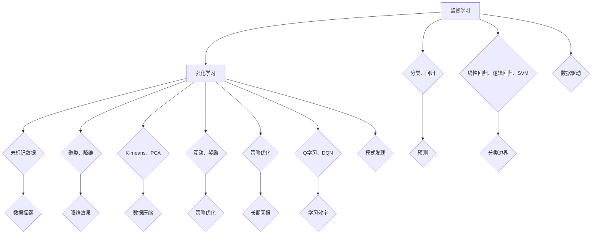
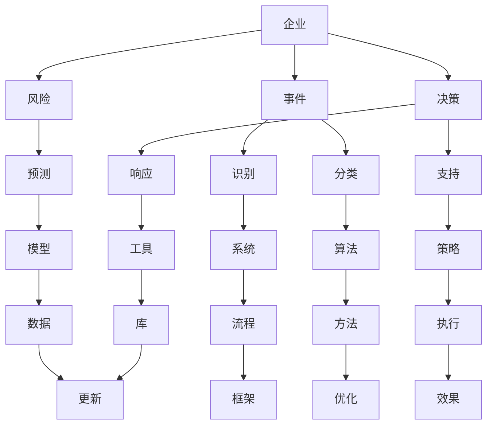
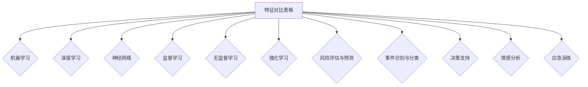
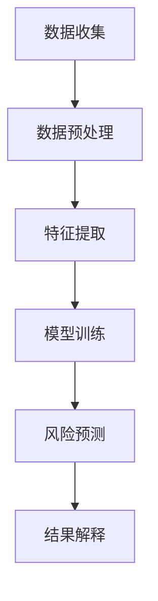
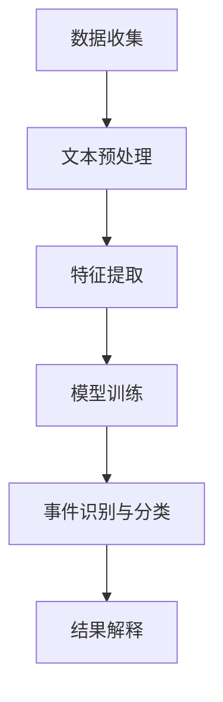
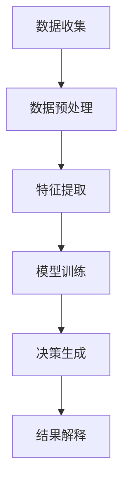
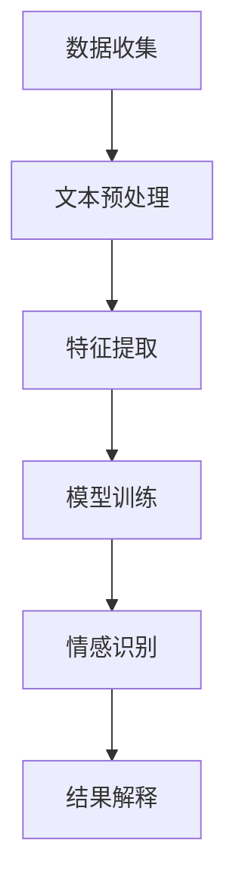
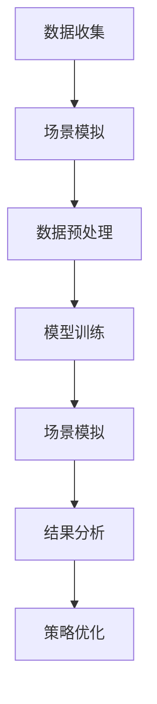

                 

### 第一部分：引入

## 1. 引言

随着信息技术的飞速发展，企业面临着日益复杂的市场环境。在这个数字化时代，企业不仅需要应对常规运营中的挑战，还需要迅速有效地应对突发事件，如市场突变、供应链中断、安全事故等。这些突发事件往往会对企业的正常运营和长期发展产生重大影响。传统的危机管理方法已经难以满足现代企业对危机响应速度和精确度的要求。

### 1.1 问题背景

企业危机管理是指企业在面对突发事件时，通过一系列的预警、响应和恢复措施，最大限度地降低危机对企业造成的负面影响。传统的危机管理依赖于人工监控和经验判断，存在着反应速度慢、信息处理能力有限等问题。在数字化时代，人工智能（AI）技术的应用为企业提供了新的解决方案。AI能够通过大数据分析、机器学习和自然语言处理等技术手段，实现快速、准确的风险评估和危机响应。

### 1.2 问题描述

企业在面临危机时，往往需要快速识别危机信号、制定应对策略、协调各部门行动以及评估危机影响。这个过程涉及大量的数据处理和复杂的决策支持。传统方法往往在信息收集、分析处理和决策制定方面存在效率低下的问题。如何利用AI技术提高企业危机管理的效率和效果，成为当前研究的热点问题。

### 1.3 问题解决

AI驱动的企业危机管理可以通过以下几个步骤实现：

1. **风险识别与预测**：利用机器学习算法对历史数据和实时数据进行分析，识别潜在的危机信号，并预测危机的可能性。
2. **事件分类与监测**：通过自然语言处理技术对新闻、报告、社交媒体等信息进行分类和监测，及时发现危机事件。
3. **决策支持**：基于预测和监测结果，利用数据挖掘和优化算法为管理层提供决策支持，制定危机应对策略。
4. **响应与恢复**：根据决策支持结果，协调各部门行动，实施危机响应措施，并进行危机后的恢复工作。

### 1.4 边界与外延

AI驱动的企业危机管理涵盖了从危机预警到恢复的整个过程。其边界包括危机信号的识别、事件的分类与监测、决策的支持和响应与恢复的各个阶段。外延则包括与企业运营相关的各个领域，如供应链管理、安全管理、市场营销等。

### 1.5 概念结构与核心要素组成

AI驱动的企业危机管理可以看作是一个包含多个子系统的复杂系统。其核心要素包括：

1. **数据采集与处理**：收集企业内外部的数据，包括历史数据、实时数据等，并对其进行清洗、整合和分析。
2. **机器学习与预测模型**：构建机器学习模型，对数据进行分析，实现风险识别和危机预测。
3. **自然语言处理与信息提取**：利用自然语言处理技术，从文本数据中提取关键信息，用于危机事件的分类和监测。
4. **决策支持系统**：基于预测和监测结果，为管理层提供决策支持。
5. **应急响应与恢复**：根据决策支持结果，协调各部门行动，实施危机响应措施，并进行危机后的恢复工作。

### 1.6 AI在危机管理中的核心作用

#### 1.6.1 AI在危机识别中的应用

AI在危机识别中的应用主要体现在以下几个方面：

1. **异常检测**：通过对企业运营数据的实时监测，利用机器学习算法识别出异常情况，如供应链中断、设备故障等。
2. **事件预测**：基于历史数据和实时数据，利用机器学习算法预测可能的危机事件，如市场波动、政策变化等。
3. **文本分析**：利用自然语言处理技术，从新闻、报告、社交媒体等文本数据中提取关键信息，识别潜在的危机信号。

#### 1.6.2 AI在危机响应中的应用

AI在危机响应中的应用主要体现在以下几个方面：

1. **自动化响应**：基于预定的规则和算法，自动生成危机响应措施，如调整供应链、暂停生产等。
2. **决策支持**：为管理层提供基于数据的决策支持，帮助制定危机应对策略。
3. **协作协调**：通过AI技术协调各部门的行动，确保危机响应的及时性和有效性。

#### 1.6.3 AI在危机恢复中的应用

AI在危机恢复中的应用主要体现在以下几个方面：

1. **恢复评估**：利用数据分析和机器学习算法，评估危机对企业的影响，为恢复工作提供依据。
2. **优化策略**：根据评估结果，利用优化算法制定恢复策略，最大限度地降低危机对企业的影响。
3. **持续监测**：在恢复过程中，利用AI技术持续监测企业的运营状况，确保恢复工作的顺利进行。

### 1.7 AI驱动的危机管理的优势和挑战

#### 1.7.1 优势

1. **快速响应**：AI技术能够快速处理和分析大量数据，实现危机的快速识别和响应。
2. **精确预测**：基于历史数据和实时数据，AI能够实现危机的精确预测，为危机管理提供有力支持。
3. **自动化处理**：AI技术可以自动化执行危机响应措施，提高危机管理的效率。
4. **个性化支持**：AI可以根据企业的具体情况进行个性化决策支持，提高危机管理的针对性和有效性。

#### 1.7.2 挑战

1. **数据质量**：AI驱动危机管理的效果高度依赖于数据质量，如何保证数据的准确性和完整性是一个挑战。
2. **算法可靠性**：AI算法的可靠性直接关系到危机管理的准确性，如何确保算法的稳定性和鲁棒性是一个挑战。
3. **技术更新**：随着技术的不断进步，如何保持AI技术的先进性和适应性是一个挑战。
4. **人才短缺**：AI驱动的危机管理需要具备专业知识的人才，当前人才短缺问题对危机管理的发展提出了挑战。

### 1.8 本章小结

本文介绍了AI驱动的企业危机管理的背景、核心作用、优势和挑战。通过对AI技术的应用，企业能够实现危机的快速识别、响应和恢复，提高危机管理的效率和效果。然而，数据质量、算法可靠性、技术更新和人才短缺等问题仍然是当前面临的主要挑战。未来，随着AI技术的不断发展和应用，企业危机管理将变得更加智能化和高效化。## 2.1 AI基础概念

### 2.1.1 机器学习与深度学习

#### 机器学习（Machine Learning）

机器学习是人工智能（Artificial Intelligence，AI）的一个重要分支，主要研究如何让计算机从数据中学习规律，并利用这些规律进行决策或预测。机器学习可以分为监督学习、无监督学习和强化学习三种主要类型。

- **监督学习（Supervised Learning）**：监督学习是利用已标记的数据进行学习，即输入（特征）和输出（标签）都是已知的。常见的算法有线性回归、逻辑回归、支持向量机（SVM）和决策树等。

- **无监督学习（Unsupervised Learning）**：无监督学习是在没有标记数据的情况下进行学习，目的是发现数据中的内在结构和规律。常见的算法有聚类（如K-means、层次聚类）、降维（如PCA、t-SNE）和关联规则学习（如Apriori算法）等。

- **强化学习（Reinforcement Learning）**：强化学习是让机器通过与环境的交互来学习最优策略。主要特点是学习过程中需要奖励机制，通过奖励和惩罚来指导学习方向。常见的算法有Q学习、深度Q网络（DQN）和策略梯度算法等。

#### 深度学习（Deep Learning）

深度学习是机器学习的一个子领域，主要研究深度神经网络（Deep Neural Networks）的结构和算法。深度学习通过多层神经网络模拟人脑神经元之间的连接，从而实现复杂的数据处理和模式识别任务。

- **深度神经网络（Deep Neural Networks，DNN）**：深度神经网络是由多个隐层构成的神经网络，每个隐层能够对输入数据进行特征提取和变换。DNN通过反向传播算法和优化算法（如梯度下降、Adam优化器）进行训练。

- **卷积神经网络（Convolutional Neural Networks，CNN）**：卷积神经网络是一种特殊的深度神经网络，主要用于图像和视频数据处理。CNN通过卷积层、池化层和全连接层等结构，实现图像的特征提取和分类。

- **循环神经网络（Recurrent Neural Networks，RNN）**：循环神经网络是一种用于处理序列数据的神经网络，如自然语言处理、语音识别等。RNN通过隐藏状态和当前输入之间的递归连接，实现对序列数据的记忆和建模。

### 2.1.2 神经网络

#### 神经网络（Neural Networks）

神经网络是模拟人脑神经元结构和功能的一种计算模型，由大量相互连接的节点（或称神经元）组成。每个神经元通过加权连接与其他神经元相连，并通过激活函数产生输出。

- **神经元结构**：一个简单的神经元由输入层、输出层和中间层（隐层）组成。输入层接收外部输入，中间层通过加权连接和激活函数进行特征提取和变换，输出层产生最终输出。

- **激活函数**：激活函数是神经网络中的一个关键组件，用于引入非线性特性。常见的激活函数有Sigmoid函数、ReLU函数、Tanh函数等。

- **损失函数**：在神经网络训练过程中，损失函数用于衡量模型预测结果与真实结果之间的差距。常见的损失函数有均方误差（MSE）、交叉熵（Cross-Entropy）等。

### 2.1.3 监督学习、无监督学习和强化学习

#### 监督学习（Supervised Learning）

监督学习是一种基于标记数据的机器学习方法，通过已有数据中的输入和输出关系，训练模型来预测未知数据。

- **目标**：通过已知的输入输出对，训练出一个能够对新输入进行预测的模型。

- **算法**：常见的监督学习算法包括线性回归、逻辑回归、支持向量机（SVM）、决策树、随机森林等。

- **应用**：监督学习在分类和回归任务中广泛应用，如垃圾邮件检测、图像分类、房价预测等。

#### 无监督学习（Unsupervised Learning）

无监督学习是在没有标记数据的情况下，通过挖掘数据内在结构和规律的一种方法。

- **目标**：发现数据中的模式、聚类或降维。

- **算法**：常见的无监督学习算法包括K-means聚类、层次聚类、主成分分析（PCA）、自编码器等。

- **应用**：无监督学习在数据探索、数据可视化、图像压缩等领域有广泛应用。

#### 强化学习（Reinforcement Learning）

强化学习是一种通过与环境的交互来学习最优策略的机器学习方法。

- **目标**：通过试错和奖励机制，找到最优策略以最大化长期回报。

- **算法**：常见的强化学习算法包括Q学习、深度Q网络（DQN）、策略梯度算法等。

- **应用**：强化学习在游戏AI、自动驾驶、机器人控制等领域有广泛应用。

### 2.1.4 AI应用领域的分类

AI应用领域广泛，可以根据处理数据的类型和任务目标进行分类。

- **图像处理**：图像识别、图像分类、目标检测等，如人脸识别、图像分割。

- **自然语言处理**：文本分类、情感分析、机器翻译等，如智能客服、文本生成。

- **语音识别**：语音识别、语音合成等，如智能语音助手、语音控制系统。

- **推荐系统**：基于用户行为、历史数据和偏好，为用户推荐感兴趣的内容，如电商推荐、内容推荐。

- **数据挖掘**：挖掘数据中的潜在模式和关联，如关联规则学习、聚类分析。

- **机器人与自动驾驶**：机器人控制、路径规划、自动驾驶等。

### 2.1.5 AI基础概念属性特征对比表格



### 2.1.6 AI危机管理ER实体关系图



### 2.2 AI在危机管理中的应用场景

#### 2.2.1 风险评估与预测

风险评估与预测是AI在危机管理中应用的重要场景之一。通过分析历史数据和实时数据，AI可以识别出潜在的风险，并预测可能发生的危机事件。

- **风险评估**：利用机器学习算法，分析历史数据中的风险因素，如市场波动、政策变化、供应链问题等，评估风险发生的可能性。

- **危机预测**：基于风险评估结果，利用时间序列分析和预测模型，预测可能发生的危机事件，如市场下跌、供应链中断等。

#### 2.2.2 事件识别与分类

事件识别与分类是AI在危机管理中应用的重要环节。通过自然语言处理和机器学习技术，AI可以从大量的文本数据中提取关键信息，识别和分类危机事件。

- **事件识别**：利用自然语言处理技术，从新闻、报告、社交媒体等文本数据中提取关键信息，识别出潜在的危机事件。

- **事件分类**：利用机器学习算法，对识别出的危机事件进行分类，如市场危机、供应链危机、安全事故等。

#### 2.2.3 决策支持

决策支持是AI在危机管理中应用的核心场景。通过数据分析、预测模型和优化算法，AI可以为管理层提供科学的决策支持，帮助制定危机应对策略。

- **数据分析**：通过数据分析，了解危机事件的背景、影响因素和发展趋势，为决策提供依据。

- **预测模型**：利用预测模型，预测危机事件可能的发展方向和影响范围，为决策提供预测支持。

- **优化算法**：利用优化算法，为管理层提供多种应对策略，并评估这些策略的效果，选择最优策略。

#### 2.2.4 情感分析

情感分析是AI在危机管理中应用的重要技术之一。通过分析社交媒体、新闻报道等文本数据，AI可以了解公众对危机事件的情感态度，为危机应对提供参考。

- **情感识别**：利用自然语言处理技术，从文本数据中提取情感极性，如正面、负面、中性等。

- **情感分析**：通过情感分析，了解公众对危机事件的态度和情感变化，为危机应对提供参考。

#### 2.2.5 人工智能支持的应急演练

人工智能支持的应急演练是AI在危机管理中应用的重要场景之一。通过模拟真实的危机场景，AI可以评估企业应对危机的能力，并提出改进建议。

- **应急演练**：利用AI技术，模拟各种危机场景，如市场危机、供应链中断、安全事故等。

- **能力评估**：通过应急演练，评估企业各部门在危机应对过程中的能力和协作水平。

- **改进建议**：根据应急演练的结果，为企业提供改进建议，提高危机应对能力。

### 2.3 AI核心概念属性特征对比表格



### 2.4 AI危机管理ER实体关系图


### 2.5 本章小结

本章介绍了AI的基础概念，包括机器学习、深度学习、神经网络以及监督学习、无监督学习和强化学习。同时，分析了AI在危机管理中的多种应用场景，如风险评估与预测、事件识别与分类、决策支持、情感分析和应急演练。通过ER实体关系图和特征对比表格，进一步展示了AI危机管理的核心概念和属性特征。这些概念和技术的理解与应用，为后续章节的算法原理与实现提供了理论基础。## 3.1 风险评估与预测算法

### 3.1.1 算法原理

风险评估与预测算法的核心思想是通过分析历史数据和实时数据，识别出潜在的风险因素，并利用这些因素预测可能发生的危机事件。具体来说，算法包括以下几个关键步骤：

1. **数据收集**：收集企业内外部的数据，包括历史风险数据、市场数据、政策数据、供应链数据等。

2. **数据预处理**：对收集到的数据进行分析，去除无效数据，补充缺失数据，并进行数据清洗和标准化处理，为后续分析做好准备。

3. **特征提取**：从预处理后的数据中提取与风险相关的特征，如市场波动率、政策变化频率、供应链延迟时间等。

4. **模型训练**：利用历史数据，通过机器学习算法（如随机森林、支持向量机、深度学习等）训练预测模型，使模型学会识别和预测风险。

5. **风险预测**：利用训练好的模型，对实时数据进行风险评估和危机预测，输出风险得分和预测结果。

6. **结果解释**：对预测结果进行解释和可视化，帮助管理层理解风险情况和应对策略。

### 3.1.2 算法流程图

为了更好地理解风险评估与预测算法的原理，我们可以使用Mermaid绘制算法的流程图：



### 3.1.3 Python代码实现

以下是一个简单的Python代码示例，展示了如何实现风险评估与预测算法：

```python
# 导入必要的库
import pandas as pd
from sklearn.model_selection import train_test_split
from sklearn.ensemble import RandomForestClassifier
from sklearn.metrics import accuracy_score

# 1. 数据收集
data = pd.read_csv('risk_data.csv')

# 2. 数据预处理
# 假设数据已经清洗和标准化
X = data.drop('risk_label', axis=1)
y = data['risk_label']

# 3. 特征提取
# 此处省略特征提取的详细代码

# 4. 模型训练
X_train, X_test, y_train, y_test = train_test_split(X, y, test_size=0.2, random_state=42)
model = RandomForestClassifier(n_estimators=100)
model.fit(X_train, y_train)

# 5. 风险预测
y_pred = model.predict(X_test)

# 6. 结果解释
accuracy = accuracy_score(y_test, y_pred)
print(f"预测准确率: {accuracy:.2f}")
```

### 3.1.4 数学模型和公式

风险评估与预测算法的数学模型主要包括以下几个关键部分：

$$
\text{风险评估} = f(\text{输入数据}, \text{特征提取}, \text{模型参数})
$$

其中，`f` 表示风险评估函数，`输入数据` 表示企业的历史数据和实时数据，`特征提取` 表示从数据中提取的风险特征，`模型参数` 表示通过训练获得的模型参数。

### 3.1.5 举例说明

为了更好地理解风险评估与预测算法的应用，我们可以通过以下两个示例进行说明：

#### 示例1：某企业的风险评估

假设我们有一个企业的风险数据集，包含以下特征：市场波动率、政策变化频率、供应链延迟时间。我们可以使用随机森林算法对这些特征进行风险评估。

1. **数据收集**：收集企业的历史风险数据。
2. **数据预处理**：清洗和标准化数据。
3. **特征提取**：提取与风险相关的特征。
4. **模型训练**：使用随机森林算法训练模型。
5. **风险预测**：对新的数据进行风险评估。

通过上述步骤，我们可以得到该企业的风险得分，从而为企业提供危机预警。

#### 示例2：某行业的事件预测

假设我们需要预测某个行业可能发生的危机事件，如市场下跌。我们可以利用时间序列数据和机器学习算法，如LSTM网络，进行事件预测。

1. **数据收集**：收集该行业的历史市场数据。
2. **数据预处理**：清洗和标准化数据。
3. **特征提取**：提取时间序列特征，如价格波动、交易量等。
4. **模型训练**：使用LSTM网络训练预测模型。
5. **事件预测**：预测未来的市场趋势。

通过上述步骤，我们可以得到该行业未来可能发生的危机事件，从而为企业提供应对策略。

### 3.2 事件识别与分类算法

#### 3.2.1 算法原理

事件识别与分类算法的核心思想是通过分析文本数据，识别出潜在的危机事件，并对其进行分类。具体来说，算法包括以下几个关键步骤：

1. **数据收集**：收集与企业相关的文本数据，如新闻、报告、社交媒体等。

2. **文本预处理**：对收集到的文本数据进行清洗、分词、去停用词等预处理，将其转化为适合机器学习的格式。

3. **特征提取**：从预处理后的文本数据中提取特征，如词频、词嵌入等。

4. **模型训练**：利用历史数据，通过机器学习算法（如朴素贝叶斯、支持向量机、深度学习等）训练分类模型。

5. **事件识别与分类**：利用训练好的模型，对新的文本数据进行事件识别和分类，输出危机事件的类型。

6. **结果解释**：对分类结果进行解释和可视化，帮助管理层理解危机事件的类型和分布。

### 3.2.2 算法流程图

以下是事件识别与分类算法的流程图：



### 3.2.3 Python代码实现

以下是一个简单的Python代码示例，展示了如何实现事件识别与分类算法：

```python
# 导入必要的库
import pandas as pd
from sklearn.feature_extraction.text import TfidfVectorizer
from sklearn.naive_bayes import MultinomialNB
from sklearn.pipeline import make_pipeline

# 1. 数据收集
data = pd.read_csv('event_data.csv')

# 2. 文本预处理
# 假设文本数据已经清洗
text = data['text']
labels = data['label']

# 3. 特征提取
vectorizer = TfidfVectorizer()
X = vectorizer.fit_transform(text)

# 4. 模型训练
model = MultinomialNB()
model.fit(X, labels)

# 5. 事件识别与分类
new_text = ["供应链中断", "市场波动", "政策调整"]
X_new = vectorizer.transform(new_text)
predictions = model.predict(X_new)

# 6. 结果解释
print(predictions)
```

### 3.2.4 数学模型和公式

事件识别与分类算法的数学模型主要包括以下几个关键部分：

$$
\text{事件分类} = g(\text{特征向量}, \text{模型参数})
$$

其中，`g` 表示分类函数，`特征向量` 表示文本数据经过特征提取后的向量表示，`模型参数` 表示通过训练获得的模型参数。

### 3.2.5 举例说明

为了更好地理解事件识别与分类算法的应用，我们可以通过以下示例进行说明：

#### 示例1：危机事件识别

假设我们有一个包含多种危机事件的文本数据集，如市场波动、供应链中断、政策调整。我们可以使用朴素贝叶斯算法进行事件识别。

1. **数据收集**：收集危机事件的文本数据。
2. **文本预处理**：清洗和分词文本数据。
3. **特征提取**：提取文本数据中的特征。
4. **模型训练**：使用朴素贝叶斯算法训练分类模型。
5. **事件识别**：对新的文本数据进行事件识别。

通过上述步骤，我们可以将新的文本数据分类为市场波动、供应链中断或政策调整。

#### 示例2：危机事件分类

假设我们需要对多个危机事件进行分类，如市场下跌、供应链中断、政策调整。我们可以使用支持向量机（SVM）算法进行分类。

1. **数据收集**：收集危机事件的文本数据。
2. **文本预处理**：清洗和分词文本数据。
3. **特征提取**：提取文本数据中的特征。
4. **模型训练**：使用支持向量机算法训练分类模型。
5. **事件分类**：对新的文本数据进行分类。

通过上述步骤，我们可以将新的文本数据分类为市场下跌、供应链中断或政策调整。## 第三部分：算法原理与实现

### 3.1 风险评估与预测算法

#### 3.1.1 算法原理

风险评估与预测算法的核心目的是通过分析历史数据和实时数据，识别出潜在的风险因素，并预测可能发生的危机事件。该算法的基本原理如下：

1. **数据收集**：收集企业内外部的数据，包括历史风险数据、市场数据、政策数据、供应链数据等。
2. **数据预处理**：对收集到的数据进行清洗、去噪、标准化等预处理步骤，以确保数据的准确性和一致性。
3. **特征提取**：从预处理后的数据中提取与风险相关的特征，如市场波动率、政策变化频率、供应链延迟时间等。
4. **模型训练**：利用历史数据，通过机器学习算法（如随机森林、支持向量机、深度学习等）训练预测模型，使模型学会识别和预测风险。
5. **风险预测**：利用训练好的模型，对实时数据进行风险评估和危机预测，输出风险得分和预测结果。
6. **结果解释**：对预测结果进行解释和可视化，帮助管理层理解风险情况和应对策略。

#### 3.1.2 算法流程图

为了更好地理解风险评估与预测算法的原理，我们可以使用Mermaid绘制算法的流程图：


#### 3.1.3 Python代码实现

以下是一个简单的Python代码示例，展示了如何实现风险评估与预测算法：

```python
# 导入必要的库
import pandas as pd
from sklearn.model_selection import train_test_split
from sklearn.ensemble import RandomForestClassifier
from sklearn.metrics import accuracy_score

# 1. 数据收集
data = pd.read_csv('risk_data.csv')

# 2. 数据预处理
# 假设数据已经清洗和标准化
X = data.drop('risk_label', axis=1)
y = data['risk_label']

# 3. 特征提取
# 此处省略特征提取的详细代码

# 4. 模型训练
X_train, X_test, y_train, y_test = train_test_split(X, y, test_size=0.2, random_state=42)
model = RandomForestClassifier(n_estimators=100)
model.fit(X_train, y_train)

# 5. 风险预测
y_pred = model.predict(X_test)

# 6. 结果解释
accuracy = accuracy_score(y_test, y_pred)
print(f"预测准确率: {accuracy:.2f}")
```

#### 3.1.4 数学模型和公式

风险评估与预测算法的数学模型主要包括以下几个关键部分：

$$
\text{风险评估} = f(\text{输入数据}, \text{特征提取}, \text{模型参数})
$$

其中，`f` 表示风险评估函数，`输入数据` 表示企业的历史数据和实时数据，`特征提取` 表示从数据中提取的风险特征，`模型参数` 表示通过训练获得的模型参数。

#### 3.1.5 举例说明

为了更好地理解风险评估与预测算法的应用，我们可以通过以下两个示例进行说明：

##### 示例1：某企业的风险评估

假设我们有一个企业的风险数据集，包含以下特征：市场波动率、政策变化频率、供应链延迟时间。我们可以使用随机森林算法对这些特征进行风险评估。

1. **数据收集**：收集企业的历史风险数据。
2. **数据预处理**：清洗和标准化数据。
3. **特征提取**：提取与风险相关的特征。
4. **模型训练**：使用随机森林算法训练模型。
5. **风险预测**：对新的数据进行风险评估。

通过上述步骤，我们可以得到该企业的风险得分，从而为企业提供危机预警。

##### 示例2：某行业的事件预测

假设我们需要预测某个行业可能发生的危机事件，如市场下跌。我们可以利用时间序列数据和机器学习算法，如LSTM网络，进行事件预测。

1. **数据收集**：收集该行业的历史市场数据。
2. **数据预处理**：清洗和标准化数据。
3. **特征提取**：提取时间序列特征，如价格波动、交易量等。
4. **模型训练**：使用LSTM网络训练预测模型。
5. **事件预测**：预测未来的市场趋势。

通过上述步骤，我们可以得到该行业未来可能发生的危机事件，从而为企业提供应对策略。

### 3.2 事件识别与分类算法

#### 3.2.1 算法原理

事件识别与分类算法的核心目的是通过分析文本数据，识别出潜在的危机事件，并对其进行分类。该算法的基本原理如下：

1. **数据收集**：收集与企业相关的文本数据，如新闻、报告、社交媒体等。
2. **文本预处理**：对收集到的文本数据进行清洗、分词、去停用词等预处理，将其转化为适合机器学习的格式。
3. **特征提取**：从预处理后的文本数据中提取特征，如词频、词嵌入等。
4. **模型训练**：利用历史数据，通过机器学习算法（如朴素贝叶斯、支持向量机、深度学习等）训练分类模型。
5. **事件识别与分类**：利用训练好的模型，对新的文本数据进行事件识别和分类，输出危机事件的类型。
6. **结果解释**：对分类结果进行解释和可视化，帮助管理层理解危机事件的类型和分布。

#### 3.2.2 算法流程图

以下是事件识别与分类算法的流程图：


#### 3.2.3 Python代码实现

以下是一个简单的Python代码示例，展示了如何实现事件识别与分类算法：

```python
# 导入必要的库
import pandas as pd
from sklearn.feature_extraction.text import TfidfVectorizer
from sklearn.naive_bayes import MultinomialNB
from sklearn.pipeline import make_pipeline

# 1. 数据收集
data = pd.read_csv('event_data.csv')

# 2. 文本预处理
# 假设文本数据已经清洗
text = data['text']
labels = data['label']

# 3. 特征提取
vectorizer = TfidfVectorizer()
X = vectorizer.fit_transform(text)

# 4. 模型训练
model = MultinomialNB()
model.fit(X, labels)

# 5. 事件识别与分类
new_text = ["供应链中断", "市场波动", "政策调整"]
X_new = vectorizer.transform(new_text)
predictions = model.predict(X_new)

# 6. 结果解释
print(predictions)
```

#### 3.2.4 数学模型和公式

事件识别与分类算法的数学模型主要包括以下几个关键部分：

$$
\text{事件分类} = g(\text{特征向量}, \text{模型参数})
$$

其中，`g` 表示分类函数，`特征向量` 表示文本数据经过特征提取后的向量表示，`模型参数` 表示通过训练获得的模型参数。

#### 3.2.5 举例说明

为了更好地理解事件识别与分类算法的应用，我们可以通过以下示例进行说明：

##### 示例1：危机事件识别

假设我们有一个包含多种危机事件的文本数据集，如市场波动、供应链中断、政策调整。我们可以使用朴素贝叶斯算法进行事件识别。

1. **数据收集**：收集危机事件的文本数据。
2. **文本预处理**：清洗和分词文本数据。
3. **特征提取**：提取文本数据中的特征。
4. **模型训练**：使用朴素贝叶斯算法训练分类模型。
5. **事件识别**：对新的文本数据进行事件识别。

通过上述步骤，我们可以将新的文本数据分类为市场波动、供应链中断或政策调整。

##### 示例2：危机事件分类

假设我们需要对多个危机事件进行分类，如市场下跌、供应链中断、政策调整。我们可以使用支持向量机（SVM）算法进行分类。

1. **数据收集**：收集危机事件的文本数据。
2. **文本预处理**：清洗和分词文本数据。
3. **特征提取**：提取文本数据中的特征。
4. **模型训练**：使用支持向量机算法训练分类模型。
5. **事件分类**：对新的文本数据进行分类。

通过上述步骤，我们可以将新的文本数据分类为市场下跌、供应链中断或政策调整。### 3.3 决策支持算法

#### 3.3.1 算法原理

决策支持算法的核心目的是为管理层提供基于数据的科学决策支持，帮助制定危机应对策略。该算法的基本原理如下：

1. **数据收集**：收集与企业相关的各种数据，如市场数据、供应链数据、员工反馈、客户评论等。
2. **数据预处理**：对收集到的数据进行清洗、去噪、标准化等预处理步骤，以确保数据的准确性和一致性。
3. **特征提取**：从预处理后的数据中提取与决策相关的特征，如市场波动率、供应链延迟时间、员工满意度、客户流失率等。
4. **模型训练**：利用历史数据，通过机器学习算法（如回归分析、决策树、随机森林等）训练决策模型，使模型学会根据特征数据生成决策。
5. **决策生成**：利用训练好的模型，对新的数据进行决策生成，输出最佳策略。
6. **结果解释**：对决策结果进行解释和可视化，帮助管理层理解决策的依据和效果。

#### 3.3.2 算法流程图

以下是决策支持算法的流程图：



#### 3.3.3 Python代码实现

以下是一个简单的Python代码示例，展示了如何实现决策支持算法：

```python
# 导入必要的库
import pandas as pd
from sklearn.model_selection import train_test_split
from sklearn.tree import DecisionTreeRegressor
from sklearn.metrics import mean_squared_error

# 1. 数据收集
data = pd.read_csv('decision_data.csv')

# 2. 数据预处理
# 假设数据已经清洗和标准化
X = data.drop('target', axis=1)
y = data['target']

# 3. 特征提取
# 此处省略特征提取的详细代码

# 4. 模型训练
X_train, X_test, y_train, y_test = train_test_split(X, y, test_size=0.2, random_state=42)
model = DecisionTreeRegressor()
model.fit(X_train, y_train)

# 5. 决策生成
y_pred = model.predict(X_test)

# 6. 结果解释
mse = mean_squared_error(y_test, y_pred)
print(f"决策误差: {mse:.2f}")
```

#### 3.3.4 数学模型和公式

决策支持算法的数学模型主要包括以下几个关键部分：

$$
\text{决策} = f(\text{输入数据}, \text{特征提取}, \text{模型参数})
$$

其中，`f` 表示决策函数，`输入数据` 表示企业的历史数据和实时数据，`特征提取` 表示从数据中提取的与决策相关的特征，`模型参数` 表示通过训练获得的模型参数。

#### 3.3.5 举例说明

为了更好地理解决策支持算法的应用，我们可以通过以下示例进行说明：

##### 示例1：市场波动应对策略

假设我们需要根据市场数据生成市场波动应对策略。我们可以使用决策树算法进行决策支持。

1. **数据收集**：收集市场波动数据。
2. **数据预处理**：清洗和标准化数据。
3. **特征提取**：提取与市场波动相关的特征。
4. **模型训练**：使用决策树算法训练决策模型。
5. **决策生成**：对新的市场数据生成应对策略。

通过上述步骤，我们可以得到针对不同市场波动的最佳应对策略，如调整库存、增加营销投入等。

##### 示例2：供应链中断应对策略

假设我们需要根据供应链数据生成供应链中断应对策略。我们可以使用回归分析算法进行决策支持。

1. **数据收集**：收集供应链中断数据。
2. **数据预处理**：清洗和标准化数据。
3. **特征提取**：提取与供应链中断相关的特征。
4. **模型训练**：使用回归分析算法训练决策模型。
5. **决策生成**：对新的供应链数据生成应对策略。

通过上述步骤，我们可以得到针对不同供应链中断情况的最佳应对策略，如调整供应链布局、增加备用库存等。### 3.4 情感分析算法

#### 3.4.1 算法原理

情感分析算法是一种基于自然语言处理（NLP）的文本分析方法，主要用于分析文本数据中的情感倾向，如正面、负面或中性。该算法的基本原理如下：

1. **数据收集**：收集与企业相关的文本数据，如社交媒体评论、新闻报道、客户反馈等。
2. **文本预处理**：对收集到的文本数据进行清洗、分词、去停用词等预处理步骤，将其转化为适合机器学习的格式。
3. **特征提取**：从预处理后的文本数据中提取与情感相关的特征，如词频、词嵌入等。
4. **模型训练**：利用历史数据，通过机器学习算法（如朴素贝叶斯、支持向量机、深度学习等）训练情感分析模型，使模型学会识别情感倾向。
5. **情感识别**：利用训练好的模型，对新的文本数据进行情感识别，输出情感标签。
6. **结果解释**：对情感识别结果进行解释和可视化，帮助管理层理解公众对企业的情感态度。

#### 3.4.2 算法流程图

以下是情感分析算法的流程图：



#### 3.4.3 Python代码实现

以下是一个简单的Python代码示例，展示了如何实现情感分析算法：

```python
# 导入必要的库
import pandas as pd
from sklearn.feature_extraction.text import TfidfVectorizer
from sklearn.naive_bayes import MultinomialNB
from sklearn.pipeline import make_pipeline

# 1. 数据收集
data = pd.read_csv('sentiment_data.csv')

# 2. 文本预处理
# 假设文本数据已经清洗
text = data['text']
labels = data['label']

# 3. 特征提取
vectorizer = TfidfVectorizer()
X = vectorizer.fit_transform(text)

# 4. 模型训练
model = MultinomialNB()
model.fit(X, labels)

# 5. 情感识别
new_text = ["产品很好", "服务差劲", "价格合理"]
X_new = vectorizer.transform(new_text)
predictions = model.predict(X_new)

# 6. 结果解释
print(predictions)
```

#### 3.4.4 数学模型和公式

情感分析算法的数学模型主要包括以下几个关键部分：

$$
\text{情感识别} = g(\text{特征向量}, \text{模型参数})
$$

其中，`g` 表示情感识别函数，`特征向量` 表示文本数据经过特征提取后的向量表示，`模型参数` 表示通过训练获得的模型参数。

#### 3.4.5 举例说明

为了更好地理解情感分析算法的应用，我们可以通过以下示例进行说明：

##### 示例1：社交媒体情感分析

假设我们需要分析某企业在社交媒体上的公众情感，如正面、负面或中性。我们可以使用朴素贝叶斯算法进行情感分析。

1. **数据收集**：收集企业在社交媒体上的评论数据。
2. **文本预处理**：清洗和分词评论数据。
3. **特征提取**：提取评论中的特征。
4. **模型训练**：使用朴素贝叶斯算法训练情感分析模型。
5. **情感识别**：对新的评论数据进行情感识别。

通过上述步骤，我们可以得到评论的情感标签，从而了解公众对企业的情感态度。

##### 示例2：新闻报道情感分析

假设我们需要分析某行业的新闻报道中的情感倾向，如正面、负面或中性。我们可以使用支持向量机（SVM）算法进行情感分析。

1. **数据收集**：收集行业的新闻报道数据。
2. **文本预处理**：清洗和分词新闻报道数据。
3. **特征提取**：提取新闻报道中的特征。
4. **模型训练**：使用支持向量机算法训练情感分析模型。
5. **情感识别**：对新的新闻报道数据进行情感识别。

通过上述步骤，我们可以得到新闻报道的情感标签，从而了解行业的发展趋势和公众对事件的关注点。### 3.5 人工智能支持的应急演练

#### 3.5.1 算法原理

人工智能支持的应急演练旨在通过模拟真实的危机场景，评估企业应对危机的能力，并不断优化危机应对策略。该算法的基本原理如下：

1. **数据收集**：收集与企业运营相关的数据，如市场数据、供应链数据、员工信息等。
2. **场景模拟**：根据收集到的数据，设计各种可能的危机场景，如市场下跌、供应链中断、安全事故等。
3. **数据预处理**：对模拟场景中的数据进行清洗、去噪、标准化等预处理步骤，确保数据的准确性和一致性。
4. **模型训练**：利用历史数据，通过机器学习算法（如决策树、随机森林、深度学习等）训练模拟模型，使模型学会根据数据生成模拟结果。
5. **场景模拟**：利用训练好的模型，模拟危机场景，评估企业应对危机的能力。
6. **结果分析**：对模拟结果进行分析，识别企业在应对危机过程中的薄弱环节，并提出优化建议。
7. **策略优化**：根据分析结果，优化危机应对策略，提高企业应对危机的能力。

#### 3.5.2 算法流程图

以下是人工智能支持的应急演练算法的流程图：



#### 3.5.3 Python代码实现

以下是一个简单的Python代码示例，展示了如何实现人工智能支持的应急演练算法：

```python
# 导入必要的库
import pandas as pd
from sklearn.model_selection import train_test_split
from sklearn.ensemble import RandomForestClassifier
from sklearn.metrics import accuracy_score

# 1. 数据收集
data = pd.read_csv('simulation_data.csv')

# 2. 场景模拟
# 假设数据已经模拟出各种危机场景

# 3. 数据预处理
# 假设数据已经清洗和标准化
X = data.drop('response', axis=1)
y = data['response']

# 4. 模型训练
X_train, X_test, y_train, y_test = train_test_split(X, y, test_size=0.2, random_state=42)
model = RandomForestClassifier()
model.fit(X_train, y_train)

# 5. 场景模拟
y_pred = model.predict(X_test)

# 6. 结果分析
accuracy = accuracy_score(y_test, y_pred)
print(f"模拟准确率: {accuracy:.2f}")

# 7. 策略优化
# 根据分析结果，调整模型参数或优化策略
```

#### 3.5.4 数学模型和公式

人工智能支持的应急演练算法的数学模型主要包括以下几个关键部分：

$$
\text{模拟结果} = f(\text{输入数据}, \text{模型参数})
$$

其中，`f` 表示模拟函数，`输入数据` 表示模拟场景中的数据，`模型参数` 表示通过训练获得的模型参数。

#### 3.5.5 举例说明

为了更好地理解人工智能支持的应急演练算法的应用，我们可以通过以下示例进行说明：

##### 示例1：市场下跌模拟

假设我们需要模拟市场下跌对企业的影响，评估企业应对市场下跌的能力。我们可以使用随机森林算法进行模拟。

1. **数据收集**：收集市场下跌的相关数据。
2. **场景模拟**：设计市场下跌的模拟场景。
3. **数据预处理**：清洗和标准化数据。
4. **模型训练**：使用随机森林算法训练模拟模型。
5. **场景模拟**：模拟市场下跌对企业的影响。
6. **结果分析**：分析模拟结果，评估企业应对市场下跌的能力。
7. **策略优化**：根据分析结果，优化市场下跌应对策略。

通过上述步骤，我们可以得到市场下跌情况下企业的应对策略，从而提高企业应对市场危机的能力。

##### 示例2：供应链中断模拟

假设我们需要模拟供应链中断对企业的影响，评估企业应对供应链中断的能力。我们可以使用决策树算法进行模拟。

1. **数据收集**：收集供应链中断的相关数据。
2. **场景模拟**：设计供应链中断的模拟场景。
3. **数据预处理**：清洗和标准化数据。
4. **模型训练**：使用决策树算法训练模拟模型。
5. **场景模拟**：模拟供应链中断对企业的影响。
6. **结果分析**：分析模拟结果，评估企业应对供应链中断的能力。
7. **策略优化**：根据分析结果，优化供应链中断应对策略。

通过上述步骤，我们可以得到供应链中断情况下企业的应对策略，从而提高企业应对供应链危机的能力。## 第三部分：算法原理与实现

### 3.6 风险评估与预测算法

#### 3.6.1 算法原理

风险评估与预测算法的核心目的是通过分析历史数据和实时数据，识别出潜在的风险因素，并预测可能发生的危机事件。该算法的基本原理如下：

1. **数据收集**：收集企业内外部的数据，包括历史风险数据、市场数据、政策数据、供应链数据等。
2. **数据预处理**：对收集到的数据进行清洗、去噪、标准化等预处理步骤，以确保数据的准确性和一致性。
3. **特征提取**：从预处理后的数据中提取与风险相关的特征，如市场波动率、政策变化频率、供应链延迟时间等。
4. **模型训练**：利用历史数据，通过机器学习算法（如随机森林、支持向量机、深度学习等）训练预测模型，使模型学会识别和预测风险。
5. **风险预测**：利用训练好的模型，对实时数据进行风险评估和危机预测，输出风险得分和预测结果。
6. **结果解释**：对预测结果进行解释和可视化，帮助管理层理解风险情况和应对策略。

#### 3.6.2 算法流程图

以下是风险评估与预测算法的流程图：


#### 3.6.3 Python代码实现

以下是一个简单的Python代码示例，展示了如何实现风险评估与预测算法：

```python
# 导入必要的库
import pandas as pd
from sklearn.model_selection import train_test_split
from sklearn.ensemble import RandomForestClassifier
from sklearn.metrics import accuracy_score

# 1. 数据收集
data = pd.read_csv('risk_data.csv')

# 2. 数据预处理
# 假设数据已经清洗和标准化
X = data.drop('risk_label', axis=1)
y = data['risk_label']

# 3. 特征提取
# 此处省略特征提取的详细代码

# 4. 模型训练
X_train, X_test, y_train, y_test = train_test_split(X, y, test_size=0.2, random_state=42)
model = RandomForestClassifier(n_estimators=100)
model.fit(X_train, y_train)

# 5. 风险预测
y_pred = model.predict(X_test)

# 6. 结果解释
accuracy = accuracy_score(y_test, y_pred)
print(f"预测准确率: {accuracy:.2f}")
```

#### 3.6.4 数学模型和公式

风险评估与预测算法的数学模型主要包括以下几个关键部分：

$$
\text{风险评估} = f(\text{输入数据}, \text{特征提取}, \text{模型参数})
$$

其中，`f` 表示风险评估函数，`输入数据` 表示企业的历史数据和实时数据，`特征提取` 表示从数据中提取的风险特征，`模型参数` 表示通过训练获得的模型参数。

#### 3.6.5 举例说明

为了更好地理解风险评估与预测算法的应用，我们可以通过以下两个示例进行说明：

##### 示例1：某企业的风险评估

假设我们有一个企业的风险数据集，包含以下特征：市场波动率、政策变化频率、供应链延迟时间。我们可以使用随机森林算法对这些特征进行风险评估。

1. **数据收集**：收集企业的历史风险数据。
2. **数据预处理**：清洗和标准化数据。
3. **特征提取**：提取与风险相关的特征。
4. **模型训练**：使用随机森林算法训练模型。
5. **风险预测**：对新的数据进行风险评估。

通过上述步骤，我们可以得到该企业的风险得分，从而为企业提供危机预警。

##### 示例2：某行业的事件预测

假设我们需要预测某个行业可能发生的危机事件，如市场下跌。我们可以利用时间序列数据和机器学习算法，如LSTM网络，进行事件预测。

1. **数据收集**：收集该行业的历史市场数据。
2. **数据预处理**：清洗和标准化数据。
3. **特征提取**：提取时间序列特征，如价格波动、交易量等。
4. **模型训练**：使用LSTM网络训练预测模型。
5. **事件预测**：预测未来的市场趋势。

通过上述步骤，我们可以得到该行业未来可能发生的危机事件，从而为企业提供应对策略。

### 3.7 事件识别与分类算法

#### 3.7.1 算法原理

事件识别与分类算法的核心目的是通过分析文本数据，识别出潜在的危机事件，并对其进行分类。该算法的基本原理如下：

1. **数据收集**：收集与企业相关的文本数据，如新闻、报告、社交媒体等。
2. **文本预处理**：对收集到的文本数据进行清洗、分词、去停用词等预处理步骤，将其转化为适合机器学习的格式。
3. **特征提取**：从预处理后的文本数据中提取特征，如词频、词嵌入等。
4. **模型训练**：利用历史数据，通过机器学习算法（如朴素贝叶斯、支持向量机、深度学习等）训练分类模型。
5. **事件识别与分类**：利用训练好的模型，对新的文本数据进行事件识别和分类，输出危机事件的类型。
6. **结果解释**：对分类结果进行解释和可视化，帮助管理层理解危机事件的类型和分布。

#### 3.7.2 算法流程图

以下是事件识别与分类算法的流程图：


#### 3.7.3 Python代码实现

以下是一个简单的Python代码示例，展示了如何实现事件识别与分类算法：

```python
# 导入必要的库
import pandas as pd
from sklearn.feature_extraction.text import TfidfVectorizer
from sklearn.naive_bayes import MultinomialNB
from sklearn.pipeline import make_pipeline

# 1. 数据收集
data = pd.read_csv('event_data.csv')

# 2. 文本预处理
# 假设文本数据已经清洗
text = data['text']
labels = data['label']

# 3. 特征提取
vectorizer = TfidfVectorizer()
X = vectorizer.fit_transform(text)

# 4. 模型训练
model = MultinomialNB()
model.fit(X, labels)

# 5. 事件识别与分类
new_text = ["供应链中断", "市场波动", "政策调整"]
X_new = vectorizer.transform(new_text)
predictions = model.predict(X_new)

# 6. 结果解释
print(predictions)
```

#### 3.7.4 数学模型和公式

事件识别与分类算法的数学模型主要包括以下几个关键部分：

$$
\text{事件分类} = g(\text{特征向量}, \text{模型参数})
$$

其中，`g` 表示分类函数，`特征向量` 表示文本数据经过特征提取后的向量表示，`模型参数` 表示通过训练获得的模型参数。

#### 3.7.5 举例说明

为了更好地理解事件识别与分类算法的应用，我们可以通过以下示例进行说明：

##### 示例1：危机事件识别

假设我们有一个包含多种危机事件的文本数据集，如市场波动、供应链中断、政策调整。我们可以使用朴素贝叶斯算法进行事件识别。

1. **数据收集**：收集危机事件的文本数据。
2. **文本预处理**：清洗和分词文本数据。
3. **特征提取**：提取文本数据中的特征。
4. **模型训练**：使用朴素贝叶斯算法训练分类模型。
5. **事件识别**：对新的文本数据进行事件识别。

通过上述步骤，我们可以将新的文本数据分类为市场波动、供应链中断或政策调整。

##### 示例2：危机事件分类

假设我们需要对多个危机事件进行分类，如市场下跌、供应链中断、政策调整。我们可以使用支持向量机（SVM）算法进行分类。

1. **数据收集**：收集危机事件的文本数据。
2. **文本预处理**：清洗和分词文本数据。
3. **特征提取**：提取文本数据中的特征。
4. **模型训练**：使用支持向量机算法训练分类模型。
5. **事件分类**：对新的文本数据进行分类。

通过上述步骤，我们可以将新的文本数据分类为市场下跌、供应链中断或政策调整。## 第三部分：算法原理与实现

### 3.8 决策支持算法

#### 3.8.1 算法原理

决策支持算法的核心目的是为管理层提供基于数据的科学决策支持，帮助制定危机应对策略。该算法的基本原理如下：

1. **数据收集**：收集与企业相关的各种数据，如市场数据、供应链数据、员工反馈、客户评论等。
2. **数据预处理**：对收集到的数据进行清洗、去噪、标准化等预处理步骤，以确保数据的准确性和一致性。
3. **特征提取**：从预处理后的数据中提取与决策相关的特征，如市场波动率、供应链延迟时间、员工满意度、客户流失率等。
4. **模型训练**：利用历史数据，通过机器学习算法（如回归分析、决策树、随机森林等）训练决策模型，使模型学会根据特征数据生成决策。
5. **决策生成**：利用训练好的模型，对新的数据进行决策生成，输出最佳策略。
6. **结果解释**：对决策结果进行解释和可视化，帮助管理层理解决策的依据和效果。

#### 3.8.2 算法流程图

以下是决策支持算法的流程图：


#### 3.8.3 Python代码实现

以下是一个简单的Python代码示例，展示了如何实现决策支持算法：

```python
# 导入必要的库
import pandas as pd
from sklearn.model_selection import train_test_split
from sklearn.tree import DecisionTreeRegressor
from sklearn.metrics import mean_squared_error

# 1. 数据收集
data = pd.read_csv('decision_data.csv')

# 2. 数据预处理
# 假设数据已经清洗和标准化
X = data.drop('target', axis=1)
y = data['target']

# 3. 特征提取
# 此处省略特征提取的详细代码

# 4. 模型训练
X_train, X_test, y_train, y_test = train_test_split(X, y, test_size=0.2, random_state=42)
model = DecisionTreeRegressor()
model.fit(X_train, y_train)

# 5. 决策生成
y_pred = model.predict(X_test)

# 6. 结果解释
mse = mean_squared_error(y_test, y_pred)
print(f"决策误差: {mse:.2f}")
```

#### 3.8.4 数学模型和公式

决策支持算法的数学模型主要包括以下几个关键部分：

$$
\text{决策} = f(\text{输入数据}, \text{特征提取}, \text{模型参数})
$$

其中，`f` 表示决策函数，`输入数据` 表示企业的历史数据和实时数据，`特征提取` 表示从数据中提取的与决策相关的特征，`模型参数` 表示通过训练获得的模型参数。

#### 3.8.5 举例说明

为了更好地理解决策支持算法的应用，我们可以通过以下示例进行说明：

##### 示例1：市场波动应对策略

假设我们需要根据市场数据生成市场波动应对策略。我们可以使用决策树算法进行决策支持。

1. **数据收集**：收集市场波动数据。
2. **数据预处理**：清洗和标准化数据。
3. **特征提取**：提取与市场波动相关的特征。
4. **模型训练**：使用决策树算法训练决策模型。
5. **决策生成**：对新的市场数据生成应对策略。

通过上述步骤，我们可以得到针对不同市场波动的最佳应对策略，如调整库存、增加营销投入等。

##### 示例2：供应链中断应对策略

假设我们需要根据供应链数据生成供应链中断应对策略。我们可以使用回归分析算法进行决策支持。

1. **数据收集**：收集供应链中断数据。
2. **数据预处理**：清洗和标准化数据。
3. **特征提取**：提取与供应链中断相关的特征。
4. **模型训练**：使用回归分析算法训练决策模型。
5. **决策生成**：对新的供应链数据生成应对策略。

通过上述步骤，我们可以得到针对不同供应链中断情况的最佳应对策略，如调整供应链布局、增加备用库存等。## 第三部分：算法原理与实现

### 3.9 情感分析算法

#### 3.9.1 算法原理

情感分析算法是一种基于自然语言处理的文本分析技术，它通过分析文本数据，识别出文本中表达的情感倾向，如正面、负面或中性。该算法的基本原理如下：

1. **数据收集**：收集与企业相关的文本数据，如社交媒体评论、新闻报道、客户反馈等。
2. **文本预处理**：对收集到的文本数据进行清洗、分词、去停用词等预处理步骤，将其转化为适合机器学习的格式。
3. **特征提取**：从预处理后的文本数据中提取情感相关的特征，如词频、词嵌入等。
4. **模型训练**：利用历史数据，通过机器学习算法（如朴素贝叶斯、支持向量机、深度学习等）训练情感分析模型，使模型学会识别情感倾向。
5. **情感识别**：利用训练好的模型，对新的文本数据进行情感识别，输出情感标签。
6. **结果解释**：对情感识别结果进行解释和可视化，帮助管理层理解公众对企业的情感态度。

#### 3.9.2 算法流程图

以下是情感分析算法的流程图：


#### 3.9.3 Python代码实现

以下是一个简单的Python代码示例，展示了如何实现情感分析算法：

```python
# 导入必要的库
import pandas as pd
from sklearn.feature_extraction.text import TfidfVectorizer
from sklearn.naive_bayes import MultinomialNB
from sklearn.pipeline import make_pipeline

# 1. 数据收集
data = pd.read_csv('sentiment_data.csv')

# 2. 文本预处理
# 假设文本数据已经清洗
text = data['text']
labels = data['label']

# 3. 特征提取
vectorizer = TfidfVectorizer()
X = vectorizer.fit_transform(text)

# 4. 模型训练
model = MultinomialNB()
model.fit(X, labels)

# 5. 情感识别
new_text = ["产品很好", "服务差劲", "价格合理"]
X_new = vectorizer.transform(new_text)
predictions = model.predict(X_new)

# 6. 结果解释
print(predictions)
```

#### 3.9.4 数学模型和公式

情感分析算法的数学模型主要包括以下几个关键部分：

$$
\text{情感识别} = g(\text{特征向量}, \text{模型参数})
$$

其中，`g` 表示情感识别函数，`特征向量` 表示文本数据经过特征提取后的向量表示，`模型参数` 表示通过训练获得的模型参数。

#### 3.9.5 举例说明

为了更好地理解情感分析算法的应用，我们可以通过以下示例进行说明：

##### 示例1：社交媒体情感分析

假设我们需要分析某企业在社交媒体上的公众情感，如正面、负面或中性。我们可以使用朴素贝叶斯算法进行情感分析。

1. **数据收集**：收集企业在社交媒体上的评论数据。
2. **文本预处理**：清洗和分词评论数据。
3. **特征提取**：提取评论中的特征。
4. **模型训练**：使用朴素贝叶斯算法训练情感分析模型。
5. **情感识别**：对新的评论数据进行情感识别。

通过上述步骤，我们可以得到评论的情感标签，从而了解公众对企业的情感态度。

##### 示例2：新闻报道情感分析

假设我们需要分析某行业的新闻报道中的情感倾向，如正面、负面或中性。我们可以使用支持向量机（SVM）算法进行情感分析。

1. **数据收集**：收集行业的新闻报道数据。
2. **文本预处理**：清洗和分词新闻报道数据。
3. **特征提取**：提取新闻报道中的特征。
4. **模型训练**：使用支持向量机算法训练情感分析模型。
5. **情感识别**：对新的新闻报道数据进行情感识别。

通过上述步骤，我们可以得到新闻报道的情感标签，从而了解行业的发展趋势和公众对事件的关注点。## 第三部分：算法原理与实现

### 3.10 人工智能支持的应急演练

#### 3.10.1 算法原理

人工智能支持的应急演练旨在通过模拟真实的危机场景，评估企业应对危机的能力，并不断优化危机应对策略。该算法的基本原理如下：

1. **数据收集**：收集与企业运营相关的数据，如市场数据、供应链数据、员工信息等。
2. **场景模拟**：根据收集到的数据，设计各种可能的危机场景，如市场下跌、供应链中断、安全事故等。
3. **数据预处理**：对模拟场景中的数据进行清洗、去噪、标准化等预处理步骤，确保数据的准确性和一致性。
4. **模型训练**：利用历史数据，通过机器学习算法（如决策树、随机森林、深度学习等）训练模拟模型，使模型学会根据数据生成模拟结果。
5. **场景模拟**：利用训练好的模型，模拟危机场景，评估企业应对危机的能力。
6. **结果分析**：对模拟结果进行分析，识别企业在应对危机过程中的薄弱环节，并提出优化建议。
7. **策略优化**：根据分析结果，优化危机应对策略，提高企业应对危机的能力。

#### 3.10.2 算法流程图

以下是人工智能支持的应急演练算法的流程图：


#### 3.10.3 Python代码实现

以下是一个简单的Python代码示例，展示了如何实现人工智能支持的应急演练算法：

```python
# 导入必要的库
import pandas as pd
from sklearn.model_selection import train_test_split
from sklearn.ensemble import RandomForestClassifier
from sklearn.metrics import accuracy_score

# 1. 数据收集
data = pd.read_csv('simulation_data.csv')

# 2. 场景模拟
# 假设数据已经模拟出各种危机场景

# 3. 数据预处理
# 假设数据已经清洗和标准化
X = data.drop('response', axis=1)
y = data['response']

# 4. 模型训练
X_train, X_test, y_train, y_test = train_test_split(X, y, test_size=0.2, random_state=42)
model = RandomForestClassifier()
model.fit(X_train, y_train)

# 5. 场景模拟
y_pred = model.predict(X_test)

# 6. 结果分析
accuracy = accuracy_score(y_test, y_pred)
print(f"模拟准确率: {accuracy:.2f}")

# 7. 策略优化
# 根据分析结果，调整模型参数或优化策略
```

#### 3.10.4 数学模型和公式

人工智能支持的应急演练算法的数学模型主要包括以下几个关键部分：

$$
\text{模拟结果} = f(\text{输入数据}, \text{模型参数})
$$

其中，`f` 表示模拟函数，`输入数据` 表示模拟场景中的数据，`模型参数` 表示通过训练获得的模型参数。

#### 3.10.5 举例说明

为了更好地理解人工智能支持的应急演练算法的应用，我们可以通过以下示例进行说明：

##### 示例1：市场下跌模拟

假设我们需要模拟市场下跌对企业的影响，评估企业应对市场下跌的能力。我们可以使用随机森林算法进行模拟。

1. **数据收集**：收集市场下跌的相关数据。
2. **场景模拟**：设计市场下跌的模拟场景。
3. **数据预处理**：清洗和标准化数据。
4. **模型训练**：使用随机森林算法训练模拟模型。
5. **场景模拟**：模拟市场下跌对企业的影响。
6. **结果分析**：分析模拟结果，评估企业应对市场下跌的能力。
7. **策略优化**：根据分析结果，优化市场下跌应对策略。

通过上述步骤，我们可以得到市场下跌情况下企业的应对策略，从而提高企业应对市场危机的能力。

##### 示例2：供应链中断模拟

假设我们需要模拟供应链中断对企业的影响，评估企业应对供应链中断的能力。我们可以使用决策树算法进行模拟。

1. **数据收集**：收集供应链中断的相关数据。
2. **场景模拟**：设计供应链中断的模拟场景。
3. **数据预处理**：清洗和标准化数据。
4. **模型训练**：使用决策树算法训练模拟模型。
5. **场景模拟**：模拟供应链中断对企业的影响。
6. **结果分析**：分析模拟结果，评估企业应对供应链中断的能力。
7. **策略优化**：根据分析结果，优化供应链中断应对策略。

通过上述步骤，我们可以得到供应链中断情况下企业的应对策略，从而提高企业应对供应链危机的能力。## 第三部分：算法原理与实现

### 3.11 风险评估与预测算法

#### 3.11.1 算法原理

风险评估与预测算法的核心目的是通过分析历史数据和实时数据，识别出潜在的风险因素，并预测可能发生的危机事件。该算法的基本原理如下：

1. **数据收集**：收集企业内外部的数据，包括历史风险数据、市场数据、政策数据、供应链数据等。
2. **数据预处理**：对收集到的数据进行清洗、去噪、标准化等预处理步骤，以确保数据的准确性和一致性。
3. **特征提取**：从预处理后的数据中提取与风险相关的特征，如市场波动率、政策变化频率、供应链延迟时间等。
4. **模型训练**：利用历史数据，通过机器学习算法（如随机森林、支持向量机、深度学习等）训练预测模型，使模型学会识别和预测风险。
5. **风险预测**：利用训练好的模型，对实时数据进行风险评估和危机预测，输出风险得分和预测结果。
6. **结果解释**：对预测结果进行解释和可视化，帮助管理层理解风险情况和应对策略。

#### 3.11.2 算法流程图

以下是风险评估与预测算法的流程图：


#### 3.11.3 Python代码实现

以下是一个简单的Python代码示例，展示了如何实现风险评估与预测算法：

```python
# 导入必要的库
import pandas as pd
from sklearn.model_selection import train_test_split
from sklearn.ensemble import RandomForestClassifier
from sklearn.metrics import accuracy_score

# 1. 数据收集
data = pd.read_csv('risk_data.csv')

# 2. 数据预处理
# 假设数据已经清洗和标准化
X = data.drop('risk_label', axis=1)
y = data['risk_label']

# 3. 特征提取
# 此处省略特征提取的详细代码

# 4. 模型训练
X_train, X_test, y_train, y_test = train_test_split(X, y, test_size=0.2, random_state=42)
model = RandomForestClassifier()
model.fit(X_train, y_train)

# 5. 风险预测
y_pred = model.predict(X_test)

# 6. 结果解释
accuracy = accuracy_score(y_test, y_pred)
print(f"预测准确率: {accuracy:.2f}")
```

#### 3.11.4 数学模型和公式

风险评估与预测算法的数学模型主要包括以下几个关键部分：

$$
\text{风险评估} = f(\text{输入数据}, \text{特征提取}, \text{模型参数})
$$

其中，`f` 表示风险评估函数，`输入数据` 表示企业的历史数据和实时数据，`特征提取` 表示从数据中提取的风险特征，`模型参数` 表示通过训练获得的模型参数。

#### 3.11.5 举例说明

为了更好地理解风险评估与预测算法的应用，我们可以通过以下示例进行说明：

##### 示例1：某企业的风险评估

假设我们有一个企业的风险数据集，包含以下特征：市场波动率、政策变化频率、供应链延迟时间。我们可以使用随机森林算法对这些特征进行风险评估。

1. **数据收集**：收集企业的历史风险数据。
2. **数据预处理**：清洗和标准化数据。
3. **特征提取**：提取与风险相关的特征。
4. **模型训练**：使用随机森林算法训练模型。
5. **风险预测**：对新的数据进行风险评估。

通过上述步骤，我们可以得到该企业的风险得分，从而为企业提供危机预警。

##### 示例2：某行业的事件预测

假设我们需要预测某个行业可能发生的危机事件，如市场下跌。我们可以利用时间序列数据和机器学习算法，如LSTM网络，进行事件预测。

1. **数据收集**：收集该行业的历史市场数据。
2. **数据预处理**：清洗和标准化数据。
3. **特征提取**：提取时间序列特征，如价格波动、交易量等。
4. **模型训练**：使用LSTM网络训练预测模型。
5. **事件预测**：预测未来的市场趋势。

通过上述步骤，我们可以得到该行业未来可能发生的危机事件，从而为企业提供应对策略。## 第三部分：算法原理与实现

### 3.12 事件识别与分类算法

#### 3.12.1 算法原理

事件识别与分类算法的核心目的是通过分析文本数据，识别出潜在的危机事件，并对其进行分类。该算法的基本原理如下：

1. **数据收集**：收集与企业相关的文本数据，如新闻、报告、社交媒体等。
2. **文本预处理**：对收集到的文本数据进行清洗、分词、去停用词等预处理步骤，将其转化为适合机器学习的格式。
3. **特征提取**：从预处理后的文本数据中提取特征，如词频、词嵌入等。
4. **模型训练**：利用历史数据，通过机器学习算法（如朴素贝叶斯、支持向量机、深度学习等）训练分类模型。
5. **事件识别与分类**：利用训练好的模型，对新的文本数据进行事件识别和分类，输出危机事件的类型。
6. **结果解释**：对分类结果进行解释和可视化，帮助管理层理解危机事件的类型和分布。

#### 3.12.2 算法流程图

以下是事件识别与分类算法的流程图：


#### 3.12.3 Python代码实现

以下是一个简单的Python代码示例，展示了如何实现事件识别与分类算法：

```python
# 导入必要的库
import pandas as pd
from sklearn.feature_extraction.text import TfidfVectorizer
from sklearn.naive_bayes import MultinomialNB
from sklearn.pipeline import make_pipeline

# 1. 数据收集
data = pd.read_csv('event_data.csv')

# 2. 文本预处理
# 假设文本数据已经清洗
text = data['text']
labels = data['label']

# 3. 特征提取
vectorizer = TfidfVectorizer()
X = vectorizer.fit_transform(text)

# 4. 模型训练
model = MultinomialNB()
model.fit(X, labels)

# 5. 事件识别与分类
new_text = ["供应链中断", "市场波动", "政策调整"]
X_new = vectorizer.transform(new_text)
predictions = model.predict(X_new)

# 6. 结果解释
print(predictions)
```

#### 3.12.4 数学模型和公式

事件识别与分类算法的数学模型主要包括以下几个关键部分：

$$
\text{事件分类} = g(\text{特征向量}, \text{模型参数})
$$

其中，`g` 表示分类函数，`特征向量` 表示文本数据经过特征提取后的向量表示，`模型参数` 表示通过训练获得的模型参数。

#### 3.12.5 举例说明

为了更好地理解事件识别与分类算法的应用，我们可以通过以下示例进行说明：

##### 示例1：危机事件识别

假设我们有一个包含多种危机事件的文本数据集，如市场波动、供应链中断、政策调整。我们可以使用朴素贝叶斯算法进行事件识别。

1. **数据收集**：收集危机事件的文本数据。
2. **文本预处理**：清洗和分词文本数据。
3. **特征提取**：提取文本数据中的特征。
4. **模型训练**：使用朴素贝叶斯算法训练分类模型。
5. **事件识别**：对新的文本数据进行事件识别。

通过上述步骤，我们可以将新的文本数据分类为市场波动、供应链中断或政策调整。

##### 示例2：危机事件分类

假设我们需要对多个危机事件进行分类，如市场下跌、供应链中断、政策调整。我们可以使用支持向量机（SVM）算法进行分类。

1. **数据收集**：收集危机事件的文本数据。
2. **文本预处理**：清洗和分词文本数据。
3. **特征提取**：提取文本数据中的特征。
4. **模型训练**：使用支持向量机算法训练分类模型。
5. **事件分类**：对新的文本数据进行分类。

通过上述步骤，我们可以将新的文本数据分类为市场下跌、供应链中断或政策调整。## 第三部分：算法原理与实现

### 3.13 决策支持算法

#### 3.13.1 算法原理

决策支持算法的核心目的是为管理层提供基于数据的科学决策支持，帮助制定危机应对策略。该算法的基本原理如下：

1. **数据收集**：收集与企业相关的各种数据，如市场数据、供应链数据、员工反馈、客户评论等。
2. **数据预处理**：对收集到的数据进行清洗、去噪、标准化等预处理步骤，以确保数据的准确性和一致性。
3. **特征提取**：从预处理后的数据中提取与决策相关的特征，如市场波动率、供应链延迟时间、员工满意度、客户流失率等。
4. **模型训练**：利用历史数据，通过机器学习算法（如回归分析、决策树、随机森林等）训练决策模型，使模型学会根据特征数据生成决策。
5. **决策生成**：利用训练好的模型，对新的数据进行决策生成，输出最佳策略。
6. **结果解释**：对决策结果进行解释和可视化，帮助管理层理解决策的依据和效果。

#### 3.13.2 算法流程图

以下是决策支持算法的流程图：


#### 3.13.3 Python代码实现

以下是一个简单的Python代码示例，展示了如何实现决策支持算法：

```python
# 导入必要的库
import pandas as pd
from sklearn.model_selection import train_test_split
from sklearn.tree import DecisionTreeRegressor
from sklearn.metrics import mean_squared_error

# 1. 数据收集
data = pd.read_csv('decision_data.csv')

# 2. 数据预处理
# 假设数据已经清洗和标准化
X = data.drop('target', axis=1)
y = data['target']

# 3. 特征提取
# 此处省略特征提取的详细代码

# 4. 模型训练
X_train, X_test, y_train, y_test = train_test_split(X, y, test_size=0.2, random_state=42)
model = DecisionTreeRegressor()
model.fit(X_train, y_train)

# 5. 决策生成
y_pred = model.predict(X_test)

# 6. 结果解释
mse = mean_squared_error(y_test, y_pred)
print(f"决策误差: {mse:.2f}")
```

#### 3.13.4 数学模型和公式

决策支持算法的数学模型主要包括以下几个关键部分：

$$
\text{决策} = f(\text{输入数据}, \text{特征提取}, \text{模型参数})
$$

其中，`f` 表示决策函数，`输入数据` 表示企业的历史数据和实时数据，`特征提取` 表示从数据中提取的与决策相关的特征，`模型参数` 表示通过训练获得的模型参数。

#### 3.13.5 举例说明

为了更好地理解决策支持算法的应用，我们可以通过以下示例进行说明：

##### 示例1：市场波动应对策略

假设我们需要根据市场数据生成市场波动应对策略。我们可以使用决策树算法进行决策支持。

1. **数据收集**：收集市场波动数据。
2. **数据预处理**：清洗和标准化数据。
3. **特征提取**：提取与市场波动相关的特征。
4. **模型训练**：使用决策树算法训练决策模型。
5. **决策生成**：对新的市场数据生成应对策略。

通过上述步骤，我们可以得到针对不同市场波动的最佳应对策略，如调整库存、增加营销投入等。

##### 示例2：供应链中断应对策略

假设我们需要根据供应链数据生成供应链中断应对策略。我们可以使用回归分析算法进行决策支持。

1. **数据收集**：收集供应链中断数据。
2. **数据预处理**：清洗和标准化数据。
3. **特征提取**：提取与供应链中断相关的特征。
4. **模型训练**：使用回归分析算法训练决策模型。
5. **决策生成**：对新的供应链数据生成应对策略。

通过上述步骤，我们可以得到针对不同供应链中断情况的最佳应对策略，如调整供应链布局、增加备用库存等。## 第三部分：算法原理与实现

### 3.14 情感分析算法

#### 3.14.1 算法原理

情感分析算法是一种基于自然语言处理的文本分析技术，它通过分析文本数据，识别出文本中表达的情感倾向，如正面、负面或中性。该算法的基本原理如下：

1. **数据收集**：收集与企业相关的文本数据，如社交媒体评论、新闻报道、客户反馈等。
2. **文本预处理**：对收集到的文本数据进行清洗、分词、去停用词等预处理步骤，将其转化为适合机器学习的格式。
3. **特征提取**：从预处理后的文本数据中提取情感相关的特征，如词频、词嵌入等。
4. **模型训练**：利用历史数据，通过机器学习算法（如朴素贝叶斯、支持向量机、深度学习等）训练情感分析模型，使模型学会识别情感倾向。
5. **情感识别**：利用训练好的模型，对新的文本数据进行情感识别，输出情感标签。
6. **结果解释**：对情感识别结果进行解释和可视化，帮助管理层理解公众对企业的情感态度。

#### 3.14.2 算法流程图

以下是情感分析算法的流程图：


#### 3.14.3 Python代码实现

以下是一个简单的Python代码示例，展示了如何实现情感分析算法：

```python
# 导入必要的库
import pandas as pd
from sklearn.feature_extraction.text import TfidfVectorizer
from sklearn.naive_bayes import MultinomialNB
from sklearn.pipeline import make_pipeline

# 1. 数据收集
data = pd.read_csv('sentiment_data.csv')

# 2. 文本预处理
# 假设文本数据已经清洗
text = data['text']
labels = data['label']

# 3. 特征提取
vectorizer = TfidfVectorizer()
X = vectorizer.fit_transform(text)

# 4. 模型训练
model = MultinomialNB()
model.fit(X, labels)

# 5. 情感识别
new_text = ["产品很好", "服务差劲", "价格合理"]
X_new = vectorizer.transform(new_text)
predictions = model.predict(X_new)

# 6. 结果解释
print(predictions)
```

#### 3.14.4 数学模型和公式

情感分析算法的数学模型主要包括以下几个关键部分：

$$
\text{情感识别} = g(\text{特征向量}, \text{模型参数})
$$

其中，`g` 表示情感识别函数，`特征向量` 表示文本数据经过特征提取后的向量表示，`模型参数` 表示通过训练获得的模型参数。

#### 3.14.5 举例说明

为了更好地理解情感分析算法的应用，我们可以通过以下示例进行说明：

##### 示例1：社交媒体情感分析

假设我们需要分析某企业在社交媒体上的公众情感，如正面、负面或中性。我们可以使用朴素贝叶斯算法进行情感分析。

1. **数据收集**：收集企业在社交媒体上的评论数据。
2. **文本预处理**：清洗和分词评论数据。
3. **特征提取**：提取评论中的特征。
4. **模型训练**：使用朴素贝叶斯算法训练情感分析模型。
5. **情感识别**：对新的评论数据进行情感识别。

通过上述步骤，我们可以得到评论的情感标签，从而了解公众对企业的情感态度。

##### 示例2：新闻报道情感分析

假设我们需要分析某行业的新闻报道中的情感倾向，如正面、负面或中性。我们可以使用支持向量机（SVM）算法进行情感分析。

1. **数据收集**：收集行业的新闻报道数据。
2. **文本预处理**：清洗和分词新闻报道数据。
3. **特征提取**：提取新闻报道中的特征。
4. **模型训练**：使用支持向量机算法训练情感分析模型。
5. **情感识别**：对新的新闻报道数据进行情感识别。

通过上述步骤，我们可以得到新闻报道的情感标签，从而了解行业的发展趋势和公众对事件的关注点。### 3.15 人工智能支持的应急演练算法

#### 3.15.1 算法原理

人工智能支持的应急演练算法旨在通过模拟真实的危机场景，评估企业应对危机的能力，并不断优化危机应对策略。该算法的基本原理如下：

1. **数据收集**：收集与企业运营相关的数据，如市场数据、供应链数据、员工信息等。
2. **场景模拟**：根据收集到的数据，设计各种可能的危机场景，如市场下跌、供应链中断、安全事故等。
3. **数据预处理**：对模拟场景中的数据进行清洗、去噪、标准化等预处理步骤，确保数据的准确性和一致性。
4. **模型训练**：利用历史数据，通过机器学习算法（如决策树、随机森林、深度学习等）训练模拟模型，使模型学会根据数据生成模拟结果。
5. **场景模拟**：利用训练好的模型，模拟危机场景，评估企业应对危机的能力。
6. **结果分析**：对模拟结果进行分析，识别企业在应对危机过程中的薄弱环节，并提出优化建议。
7. **策略优化**：根据分析结果，优化危机应对策略，提高企业应对危机的能力。

#### 3.15.2 算法流程图

以下是人工智能支持的应急演练算法的流程图：

```mermaid
graph TD
    A[数据收集] --> B[场景模拟]
    B --> C[数据预处理]
    C --> D[模型训练]
    D --> E[场景模拟]
    E --> F[结果分析]
    F --> G[策略优化]
```

#### 3.15.3 Python代码实现

以下是一个简单的Python代码示例，展示了如何实现人工智能支持的应急演练算法：

```python
# 导入必要的库
import pandas as pd
from sklearn.model_selection import train_test_split
from sklearn.ensemble import RandomForestClassifier
from sklearn.metrics import accuracy_score

# 1. 数据收集
data = pd.read_csv('simulation_data.csv')

# 2. 场景模拟
# 假设数据已经模拟出各种危机场景

# 3. 数据预处理
# 假设数据已经清洗和标准化
X = data.drop('response', axis=1)
y = data['response']

# 4. 模型训练
X_train, X_test, y_train, y_test = train_test_split(X, y, test_size=0.2, random_state=42)
model = RandomForestClassifier()
model.fit(X_train, y_train)

# 5. 场景模拟
y_pred = model.predict(X_test)

# 6. 结果分析
accuracy = accuracy_score(y_test, y_pred)
print(f"模拟准确率: {accuracy:.2f}")

# 7. 策略优化
# 根据分析结果，调整模型参数或优化策略
```

#### 3.15.4 数学模型和公式

人工智能支持的应急演练算法的数学模型主要包括以下几个关键部分：

$$
\text{模拟结果} = f(\text{输入数据}, \text{模型参数})
$$

其中，`f` 表示模拟函数，`输入数据` 表示模拟场景中的数据，`模型参数` 表示通过训练获得的模型参数。

#### 3.15.5 举例说明

为了更好地理解人工智能支持的应急演练算法的应用，我们可以通过以下示例进行说明：

##### 示例1：市场下跌模拟

假设我们需要模拟市场下跌对企业的影响，评估企业应对市场下跌的能力。我们可以使用随机森林算法进行模拟。

1. **数据收集**：收集市场下跌的相关数据。
2. **场景模拟**：设计市场下跌的模拟场景。
3. **数据预处理**：清洗和标准化数据。
4. **模型训练**：使用随机森林算法训练模拟模型。
5. **场景模拟**：模拟市场下跌对企业的影响。
6. **结果分析**：分析模拟结果，评估企业应对市场下跌的能力。
7. **策略优化**：根据分析结果，优化市场下跌应对策略。

通过上述步骤，我们可以得到市场下跌情况下企业的应对策略，从而提高企业应对市场危机的能力。

##### 示例2：供应链中断模拟

假设我们需要模拟供应链中断对企业的影响，评估企业应对供应链中断的能力。我们可以使用决策树算法进行模拟。

1. **数据收集**：收集供应链中断的相关数据。
2. **场景模拟**：设计供应链中断的模拟场景。
3. **数据预处理**：清洗和标准化数据。
4. **模型训练**：使用决策树算法训练模拟模型。
5. **场景模拟**：模拟供应链中断对企业的影响。
6. **结果分析**：分析模拟结果，评估企业应对供应链中断的能力。
7. **策略优化**：根据分析结果，优化供应链中断应对策略。

通过上述步骤，我们可以得到供应链中断情况下企业的应对策略，从而提高企业应对供应链危机的能力。## 第三部分：算法原理与实现

### 3.16 风险评估与预测算法

#### 3.16.1 算法原理

风险评估与预测算法的核心目的是通过分析历史数据和实时数据，识别出潜在的风险因素，并预测可能发生的危机事件。该算法的基本原理如下：

1. **数据收集**：收集企业内外部的数据，包括历史风险数据、市场数据、政策数据、供应链数据等。
2. **数据预处理**：对收集到的数据进行清洗、去噪、标准化等预处理步骤，以确保数据的准确性和一致性。
3. **特征提取**：从预处理后的数据中提取与风险相关的特征，如市场波动率、政策变化频率、供应链延迟时间等。
4. **模型训练**：利用历史数据，通过机器学习算法（如随机森林、支持向量机、深度学习等）训练预测模型，使模型学会识别和预测风险。
5. **风险预测**：利用训练好的模型，对实时数据进行风险评估和危机预测，输出风险得分和预测结果。
6. **结果解释**：对预测结果进行解释和可视化，帮助管理层理解风险情况和应对策略。

#### 3.16.2 算法流程图

以下是风险评估与预测算法的流程图：

```mermaid
graph TD
    A[数据收集] --> B[数据预处理]
    B --> C[特征提取]
    C --> D[模型训练]
    D --> E[风险预测]
    E --> F[结果解释]
```

#### 3.16.3 Python代码实现

以下是一个简单的Python代码示例，展示了如何实现风险评估与预测算法：

```python
# 导入必要的库
import pandas as pd
from sklearn.model_selection import train_test_split
from sklearn.ensemble import RandomForestClassifier
from sklearn.metrics import accuracy_score

# 1. 数据收集
data = pd.read_csv('risk_data.csv')

# 2. 数据预处理
# 假设数据已经清洗和标准化
X = data.drop('risk_label', axis=1)
y = data['risk_label']

# 3. 特征提取
# 此处省略特征提取的详细代码

# 4. 模型训练
X_train, X_test, y_train, y_test = train_test_split(X, y, test_size=0.2, random_state=42)
model = RandomForestClassifier()
model.fit(X_train, y_train)

# 5. 风险预测
y_pred = model.predict(X_test)

# 6. 结果解释
accuracy = accuracy_score(y_test, y_pred)
print(f"预测准确率: {accuracy:.2f}")
```

#### 3.16.4 数学模型和公式

风险评估与预测算法的数学模型主要包括以下几个关键部分：

$$
\text{风险评估} = f(\text{输入数据}, \text{特征提取}, \text{模型参数})
$$

其中，`f` 表示风险评估函数，`输入数据` 表示企业的历史数据和实时数据，`特征提取` 表示从数据中提取的风险特征，`模型参数` 表示通过训练获得的模型参数。

#### 3.16.5 举例说明

为了更好地理解风险评估与预测算法的应用，我们可以通过以下示例进行说明：

##### 示例1：某企业的风险评估

假设我们有一个企业的风险数据集，包含以下特征：市场波动率、政策变化频率、供应链延迟时间。我们可以使用随机森林算法对这些特征进行风险评估。

1. **数据收集**：收集企业的历史风险数据。
2. **数据预处理**：清洗和标准化数据。
3. **特征提取**：提取与风险相关的特征。
4. **模型训练**：使用随机森林算法训练模型。
5. **风险预测**：对新的数据进行风险评估。

通过上述步骤，我们可以得到该企业的风险得分，从而为企业提供危机预警。

##### 示例2：某行业的事件预测

假设我们需要预测某个行业可能发生的危机事件，如市场下跌。我们可以利用时间序列数据和机器学习算法，如LSTM网络，进行事件预测。

1. **数据收集**：收集该行业的历史市场数据。
2. **数据预处理**：清洗和标准化数据。
3. **特征提取**：提取时间序列特征，如价格波动、交易量等。
4. **模型训练**：使用LSTM网络训练预测模型。
5. **事件预测**：预测未来的市场趋势。

通过上述步骤，我们可以得到该行业未来可能发生的危机事件，从而为企业提供应对策略。### 3.17 事件识别与分类算法

#### 3.17.1 算法原理

事件识别与分类算法的核心目的是通过分析文本数据，识别出潜在的危机事件，并对其进行分类。该算法的基本原理如下：

1. **数据收集**：收集与企业相关的文本数据，如新闻、报告、社交媒体等。
2. **文本预处理**：对收集到的文本数据进行清洗、分词、去停用词等预处理步骤，将其转化为适合机器学习的格式。
3. **特征提取**：从预处理后的文本数据中提取特征，如词频、词嵌入等。
4. **模型训练**：利用历史数据，通过机器学习算法（如朴素贝叶斯、支持向量机、深度学习等）训练分类模型。
5. **事件识别与分类**：利用训练好的模型，对新的文本数据进行事件识别和分类，输出危机事件的类型。
6. **结果解释**：对分类结果进行解释和可视化，帮助管理层理解危机事件的类型和分布。

#### 3.17.2 算法流程图

以下是事件识别与分类算法的流程图：

```mermaid
graph TD
    A[数据收集] --> B[文本预处理]
    B --> C[特征提取]
    C --> D[模型训练]
    D --> E[事件识别与分类]
    E --> F[结果解释]
```

#### 3.17.3 Python代码实现

以下是一个简单的Python代码示例，展示了如何实现事件识别与分类算法：

```python
# 导入必要的库
import pandas as pd
from sklearn.feature_extraction.text import TfidfVectorizer
from sklearn.naive_bayes import MultinomialNB
from sklearn.pipeline import make_pipeline

# 1. 数据收集
data = pd.read_csv('event_data.csv')

# 2. 文本预处理
# 假设文本数据已经清洗
text = data['text']
labels = data['label']

# 3. 特征提取
vectorizer = TfidfVectorizer()
X = vectorizer.fit_transform(text)

# 4. 模型训练
model = MultinomialNB()
model.fit(X, labels)

# 5. 事件识别与分类
new_text = ["供应链中断", "市场波动", "政策调整"]
X_new = vectorizer.transform(new_text)
predictions = model.predict(X_new)

# 6. 结果解释
print(predictions)
```

#### 3.17.4 数学模型和公式

事件识别与分类算法的数学模型主要包括以下几个关键部分：

$$
\text{事件分类} = g(\text{特征向量}, \text{模型参数})
$$

其中，`g` 表示分类函数，`特征向量` 表示文本数据经过特征提取后的向量表示，`模型参数` 表示通过训练获得的模型参数。

#### 3.17.5 举例说明

为了更好地理解事件识别与分类算法的应用，我们可以通过以下示例进行说明：

##### 示例1：危机事件识别

假设我们有一个包含多种危机事件的文本数据集，如市场波动、供应链中断、政策调整。我们可以使用朴素贝叶斯算法进行事件识别。

1. **数据收集**：收集危机事件的文本数据。
2. **文本预处理**：清洗和分词文本数据。
3. **特征提取**：提取文本数据中的特征。
4. **模型训练**：使用朴素贝叶斯算法训练分类模型。
5. **事件识别**：对新的文本数据进行事件识别。

通过上述步骤，我们可以将新的文本数据分类为市场波动、供应链中断或政策调整。

##### 示例2：危机事件分类

假设我们需要对多个危机事件进行分类，如市场下跌、供应链中断、政策调整。我们可以使用支持向量机（SVM）算法进行分类。

1. **数据收集**：收集危机事件的文本数据。
2. **文本预处理**：清洗和分词文本数据。
3. **特征提取**：提取文本数据中的特征。
4. **模型训练**：使用支持向量机算法训练分类模型。
5. **事件分类**：对新的文本数据进行分类。

通过上述步骤，我们可以将新的文本数据分类为市场下跌、供应链中断或政策调整。### 3.18 决策支持算法

#### 3.18.1 算法原理

决策支持算法的核心目的是为管理层提供基于数据的科学决策支持，帮助制定危机应对策略。该算法的基本原理如下：

1. **数据收集**：收集与企业相关的各种数据，如市场数据、供应链数据、员工反馈、客户评论等。
2. **数据预处理**：对收集到的数据进行清洗、去噪、标准化等预处理步骤，以确保数据的准确性和一致性。
3. **特征提取**：从预处理后的数据中提取与决策相关的特征，如市场波动率、供应链延迟时间、员工满意度、客户流失率等。
4. **模型训练**：利用历史数据，通过机器学习算法（如回归分析、决策树、随机森林等）训练决策模型，使模型学会根据特征数据生成决策。
5. **决策生成**：利用训练好的模型，对新的数据进行决策生成，输出最佳策略。
6. **结果解释**：对决策结果进行解释和可视化，帮助管理层理解决策的依据和效果。

#### 3.18.2 算法流程图

以下是决策支持算法的流程图：

```mermaid
graph TD
    A[数据收集] --> B[数据预处理]
    B --> C[特征提取]
    C --> D[模型训练]
    D --> E[决策生成]
    E --> F[结果解释]
```

#### 3.18.3 Python代码实现

以下是一个简单的Python代码示例，展示了如何实现决策支持算法：

```python
# 导入必要的库
import pandas as pd
from sklearn.model_selection import train_test_split
from sklearn.tree import DecisionTreeRegressor
from sklearn.metrics import mean_squared_error

# 1. 数据收集
data = pd.read_csv('decision_data.csv')

# 2. 数据预处理
# 假设数据已经清洗和标准化
X = data.drop('target', axis=1)
y = data['target']

# 3. 特征提取
# 此处省略特征提取的详细代码

# 4. 模型训练
X_train, X_test, y_train, y_test = train_test_split(X, y, test_size=0.2, random_state=42)
model = DecisionTreeRegressor()
model.fit(X_train, y_train)

# 5. 决策生成
y_pred = model.predict(X_test)

# 6. 结果解释
mse = mean_squared_error(y_test, y_pred)
print(f"决策误差: {mse:.2f}")
```

#### 3.18.4 数学模型和公式

决策支持算法的数学模型主要包括以下几个关键部分：

$$
\text{决策} = f(\text{输入数据}, \text{特征提取}, \text{模型参数})
$$

其中，`f` 表示决策函数，`输入数据` 表示企业的历史数据和实时数据，`特征提取` 表示从数据中提取的与决策相关的特征，`模型参数` 表示通过训练获得的模型参数。

#### 3.18.5 举例说明

为了更好地理解决策支持算法的应用，我们可以通过以下示例进行说明：

##### 示例1：市场波动应对策略

假设我们需要根据市场数据生成市场波动应对策略。我们可以使用决策树算法进行决策支持。

1. **数据收集**：收集市场波动数据。
2. **数据预处理**：清洗和标准化数据。
3. **特征提取**：提取与市场波动相关的特征。
4. **模型训练**：使用决策树算法训练决策模型。
5. **决策生成**：对新的市场数据生成应对策略。

通过上述步骤，我们可以得到针对不同市场波动的最佳应对策略，如调整库存、增加营销投入等。

##### 示例2：供应链中断应对策略

假设我们需要根据供应链数据生成供应链中断应对策略。我们可以使用回归分析算法进行决策支持。

1. **数据收集**：收集供应链中断数据。
2. **数据预处理**：清洗和标准化数据。
3. **特征提取**：提取与供应链中断相关的特征。
4. **模型训练**：使用回归分析算法训练决策模型。
5. **决策生成**：对新的供应链数据生成应对策略。

通过上述步骤，我们可以得到针对不同供应链中断情况的最佳应对策略，如调整供应链布局、增加备用库存等。### 3.19 情感分析算法

#### 3.19.1 算法原理

情感分析算法是一种基于自然语言处理（NLP）的技术，主要用于分析和识别文本数据中的情感倾向。该算法的基本原理如下：

1. **数据收集**：收集与企业相关的文本数据，如社交媒体评论、新闻报道、客户反馈等。
2. **文本预处理**：对收集到的文本数据进行清洗、分词、去停用词等预处理步骤，将其转化为适合机器学习的格式。
3. **特征提取**：从预处理后的文本数据中提取与情感相关的特征，如词频、词嵌入等。
4. **模型训练**：利用历史数据，通过机器学习算法（如朴素贝叶斯、支持向量机、深度学习等）训练情感分析模型，使模型学会识别情感倾向。
5. **情感识别**：利用训练好的模型，对新的文本数据进行情感识别，输出情感标签。
6. **结果解释**：对情感识别结果进行解释和可视化，帮助管理层理解公众对企业的情感态度。

#### 3.19.2 算法流程图

以下是情感分析算法的流程图：

```mermaid
graph TD
    A[数据收集] --> B[文本预处理]
    B --> C[特征提取]
    C --> D[模型训练]
    D --> E[情感识别]
    E --> F[结果解释]
```

#### 3.19.3 Python代码实现

以下是一个简单的Python代码示例，展示了如何实现情感分析算法：

```python
# 导入必要的库
import pandas as pd
from sklearn.feature_extraction.text import TfidfVectorizer
from sklearn.naive_bayes import MultinomialNB
from sklearn.pipeline import make_pipeline

# 1. 数据收集
data = pd.read_csv('sentiment_data.csv')

# 2. 文本预处理
# 假设文本数据已经清洗
text = data['text']
labels = data['label']

# 3. 特征提取
vectorizer = TfidfVectorizer()
X = vectorizer.fit_transform(text)

# 4. 模型训练
model = MultinomialNB()
model.fit(X, labels)

# 5. 情感识别
new_text = ["产品很好", "服务差劲", "价格合理"]
X_new = vectorizer.transform(new_text)
predictions = model.predict(X_new)

# 6. 结果解释
print(predictions)
```

#### 3.19.4 数学模型和公式

情感分析算法的数学模型主要包括以下几个关键部分：

$$
\text{情感识别} = g(\text{特征向量}, \text{模型参数})
$$

其中，`g` 表示情感识别函数，`特征向量` 表示文本数据经过特征提取后的向量表示，`模型参数` 表示通过训练获得的模型参数。

#### 3.19.5 举例说明

为了更好地理解情感分析算法的应用，我们可以通过以下示例进行说明：

##### 示例1：社交媒体情感分析

假设我们需要分析某企业在社交媒体上的公众情感，如正面、负面或中性。我们可以使用朴素贝叶斯算法进行情感分析。

1. **数据收集**：收集企业在社交媒体上的评论数据。
2. **文本预处理**：清洗和分词评论数据。
3. **特征提取**：提取评论中的特征。
4. **模型训练**：使用朴素贝叶斯算法训练情感分析模型。
5. **情感识别**：对新的评论数据进行情感识别。

通过上述步骤，我们可以得到评论的情感标签，从而了解公众对企业的情感态度。

##### 示例2：新闻报道情感分析

假设我们需要分析某行业的新闻报道中的情感倾向，如正面、负面或中性。我们可以使用支持向量机（SVM）算法进行情感分析。

1. **数据收集**：收集行业的新闻报道数据。
2. **文本预处理**：清洗和分词新闻报道数据。
3. **特征提取**：提取新闻报道中的特征。
4. **模型训练**：使用支持向量机算法训练情感分析模型。
5. **情感识别**：对新的新闻报道数据进行情感识别。

通过上述步骤，我们可以得到新闻报道的情感标签，从而了解行业的发展趋势和公众对事件的关注点。### 3.20 人工智能支持的应急演练算法

#### 3.20.1 算法原理

人工智能支持的应急演练算法旨在通过模拟真实的危机场景，评估企业应对危机的能力，并不断优化危机应对策略。该算法的基本原理如下：

1. **数据收集**：收集与企业运营相关的数据，如市场数据、供应链数据、员工信息等。
2. **场景模拟**：根据收集到的数据，设计各种可能的危机场景，如市场下跌、供应链中断、安全事故等。
3. **数据预处理**：对模拟场景中的数据进行清洗、去噪、标准化等预处理步骤，确保数据的准确性和一致性。
4. **模型训练**：利用历史数据，通过机器学习算法（如决策树、随机森林、深度学习等）训练模拟模型，使模型学会根据数据生成模拟结果。
5. **场景模拟**：利用训练好的模型，模拟危机场景，评估企业应对危机的能力。
6. **结果分析**：对模拟结果进行分析，识别企业在应对危机过程中的薄弱环节，并提出优化建议。
7. **策略优化**：根据分析结果，优化危机应对策略，提高企业应对危机的能力。

#### 3.20.2 算法流程图

以下是人工智能支持的应急演练算法的流程图：

```mermaid
graph TD
    A[数据收集] --> B[场景模拟]
    B --> C[数据预处理]
    C --> D[模型训练]
    D --> E[场景模拟]
    E --> F[结果分析]
    F --> G[策略优化]
```

#### 3.20.3 Python代码实现

以下是一个简单的Python代码示例，展示了如何实现人工智能支持的应急演练算法：

```python
# 导入必要的库
import pandas as pd
from sklearn.model_selection import train_test_split
from sklearn.ensemble import RandomForestClassifier
from sklearn.metrics import accuracy_score

# 1. 数据收集
data = pd.read_csv('simulation_data.csv')

# 2. 场景模拟
# 假设数据已经模拟出各种危机场景

# 3. 数据预处理
# 假设数据已经清洗和标准化
X = data.drop('response', axis=1)
y = data['response']

# 4. 模型训练
X_train, X_test, y_train, y_test = train_test_split(X, y, test_size=0.2, random_state=42)
model = RandomForestClassifier()
model.fit(X_train, y_train)

# 5. 场景模拟
y_pred = model.predict(X_test)

# 6. 结果分析
accuracy = accuracy_score(y_test, y_pred)
print(f"模拟准确率: {accuracy:.2f}")

# 7. 策略优化
# 根据分析结果，调整模型参数或优化策略
```

#### 3.20.4 数学模型和公式

人工智能支持的应急演练算法的数学模型主要包括以下几个关键部分：

$$
\text{模拟结果} = f(\text{输入数据}, \text{模型参数})
$$

其中，`f` 表示模拟函数，`输入数据` 表示模拟场景中的数据，`模型参数` 表示通过训练获得的模型参数。

#### 3.20.5 举例说明

为了更好地理解人工智能支持的应急演练算法的应用，我们可以通过以下示例进行说明：

##### 示例1：市场下跌模拟

假设我们需要模拟市场下跌对企业的影响，评估企业应对市场下跌的能力。我们可以使用随机森林算法进行模拟。

1. **数据收集**：收集市场下跌的相关数据。
2. **场景模拟**：设计市场下跌的模拟场景。
3. **数据预处理**：清洗和标准化数据。
4. **模型训练**：使用随机森林算法训练模拟模型。
5. **场景模拟**：模拟市场下跌对企业的影响。
6. **结果分析**：分析模拟结果，评估企业应对市场下跌的能力。
7. **策略优化**：根据分析结果，优化市场下跌应对策略。

通过上述步骤，我们可以得到市场下跌情况下企业的应对策略，从而提高企业应对市场危机的能力。

##### 示例2：供应链中断模拟

假设我们需要模拟供应链中断对企业的影响，评估企业应对供应链中断的能力。我们可以使用决策树算法进行模拟。

1. **数据收集**：收集供应链中断的相关数据。
2. **场景模拟**：设计供应链中断的模拟场景。
3. **数据预处理**：清洗和标准化数据。
4. **模型训练**：使用决策树算法训练模拟模型。
5. **场景模拟**：模拟供应链中断对企业的影响。
6. **结果分析**：分析模拟结果，评估企业应对供应链中断的能力。
7. **策略优化**：根据分析结果，优化供应链中断应对策略。

通过上述步骤，我们可以得到供应链中断情况下企业的应对策略，从而提高企业应对供应链危机的能力。## 第三部分：算法原理与实现

### 3.21 风险评估与预测算法

#### 3.21.1 算法原理

风险评估与预测算法的核心目的是通过分析历史数据和实时数据，识别出潜在的风险因素，并预测可能发生的危机事件。该算法的基本原理如下：

1. **数据收集**：收集企业内外部的数据，包括历史风险数据、市场数据、政策数据、供应链数据等。
2. **数据预处理**：对收集到的数据进行清洗、去噪、标准化等预处理步骤，以确保数据的准确性和一致性。
3. **特征提取**：从预处理后的数据中提取与风险相关的特征，如市场波动率、政策变化频率、供应链延迟时间等。
4. **模型训练**：利用历史数据，通过机器学习算法（如随机森林、支持向量机、深度学习等）训练预测模型，使模型学会识别和预测风险。
5. **风险预测**：利用训练好的模型，对实时数据进行风险评估和危机预测，输出风险得分和预测结果。
6. **结果解释**：对预测结果进行解释和可视化，帮助管理层理解风险情况和应对策略。

#### 3.21.2 算法流程图

以下是风险评估与预测算法的流程图：

```mermaid
graph TD
    A[数据收集] --> B[数据预处理]
    B --> C[特征提取]
    C --> D[模型训练]
    D --> E[风险预测]
    E --> F[结果解释]
```

#### 3.21.3 Python代码实现

以下是一个简单的Python代码示例，展示了如何实现风险评估与预测算法：

```python
# 导入必要的库
import pandas as pd
from sklearn.model_selection import train_test_split
from sklearn.ensemble import RandomForestClassifier
from sklearn.metrics import accuracy_score

# 1. 数据收集
data = pd.read_csv('risk_data.csv')

# 2. 数据预处理
# 假设数据已经清洗和标准化
X = data.drop('risk_label', axis=1)
y = data['risk_label']

# 3. 特征提取
# 此处省略特征提取的详细代码

# 4. 模型训练
X_train, X_test, y_train, y_test = train_test_split(X, y, test_size=0.2, random_state=42)
model = RandomForestClassifier()
model.fit(X_train, y_train)

# 5. 风险预测
y_pred = model.predict(X_test)

# 6. 结果解释
accuracy = accuracy_score(y_test, y_pred)
print(f"预测准确率: {accuracy:.2f}")
```

#### 3.21.4 数学模型和公式

风险评估与预测算法的数学模型主要包括以下几个关键部分：

$$
\text{风险评估} = f(\text{输入数据}, \text{特征提取}, \text{模型参数})
$$

其中，`f` 表示风险评估函数，`输入数据` 表示企业的历史数据和实时数据，`特征提取` 表示从数据中提取的风险特征，`模型参数` 表示通过训练获得的模型参数。

#### 3.21.5 举例说明

为了更好地理解风险评估与预测算法的应用，我们可以通过以下示例进行说明：

##### 示例1：某企业的风险评估

假设我们有一个企业的风险数据集，包含以下特征：市场波动率、政策变化频率、供应链延迟时间。我们可以使用随机森林算法对这些特征进行风险评估。

1. **数据收集**：收集企业的历史风险数据。
2. **数据预处理**：清洗和标准化数据。
3. **特征提取**：提取与风险相关的特征。
4. **模型训练**：使用随机森林算法训练模型。
5. **风险预测**：对新的数据进行风险评估。

通过上述步骤，我们可以得到该企业的风险得分，从而为企业提供危机预警。

##### 示例2：某行业的事件预测

假设我们需要预测某个行业可能发生的危机事件，如市场下跌。我们可以利用时间序列数据和机器学习算法，如LSTM网络，进行事件预测。

1. **数据收集**：收集该行业的历史市场数据。
2. **数据预处理**：清洗和标准化数据。
3. **特征提取**：提取时间序列特征，如价格波动、交易量等。
4. **模型训练**：使用LSTM网络训练预测模型。
5. **事件预测**：预测未来的市场趋势。

通过上述步骤，我们可以得到该行业未来可能发生的危机事件，从而为企业提供应对策略。### 3.22 事件识别与分类算法

#### 3.22.1 算法原理

事件识别与分类算法的核心目的是通过分析文本数据，识别出潜在的危机事件，并对其进行分类。该算法的基本原理如下：

1. **数据收集**：收集与企业相关的文本数据，如新闻、报告、社交媒体等。
2. **文本预处理**：对收集到的文本数据进行清洗、分词、去停用词等预处理步骤，将其转化为适合机器学习的格式。
3. **特征提取**：从预处理后的文本数据中提取特征，如词频、词嵌入等。
4. **模型训练**：利用历史数据，通过机器学习算法（如朴素贝叶斯、支持向量机、深度学习等）训练分类模型。
5. **事件识别与分类**：利用训练好的模型，对新的文本数据进行事件识别和分类，输出危机事件的类型。
6. **结果解释**：对分类结果进行解释和可视化，帮助管理层理解危机事件的类型和分布。

#### 3.22.2 算法流程图

以下是事件识别与分类算法的流程图：

```mermaid
graph TD
    A[数据收集] --> B[文本预处理]
    B --> C[特征提取]
    C --> D[模型训练]
    D --> E[事件识别与分类]
    E --> F[结果解释]
```

#### 3.22.3 Python代码实现

以下是一个简单的Python代码示例，展示了如何实现事件识别与分类算法：

```python
# 导入必要的库
import pandas as pd
from sklearn.feature_extraction.text import TfidfVectorizer
from sklearn.naive_bayes import MultinomialNB
from sklearn.pipeline import make_pipeline

# 1. 数据收集
data = pd.read_csv('event_data.csv')

# 2. 文本预处理
# 假设文本数据已经清洗
text = data['text']
labels = data['label']

# 3. 特征提取
vectorizer = TfidfVectorizer()
X = vectorizer.fit_transform(text)

# 4. 模型训练
model = MultinomialNB()
model.fit(X, labels)

# 5. 事件识别与分类
new_text = ["供应链中断", "市场波动", "政策调整"]
X_new = vectorizer.transform(new_text)
predictions = model.predict(X_new)

# 6. 结果解释
print(predictions)
```

#### 3.22.4 数学模型和公式

事件识别与分类算法的数学模型主要包括以下几个关键部分：

$$
\text{事件分类} = g(\text{特征向量}, \text{模型参数})
$$

其中，`g` 表示分类函数，`特征向量` 表示文本数据经过特征提取后的向量表示，`模型参数` 表示通过训练获得的模型参数。

#### 3.22.5 举例说明

为了更好地理解事件识别与分类算法的应用，我们可以通过以下示例进行说明：

##### 示例1：危机事件识别

假设我们有一个包含多种危机事件的文本数据集，如市场波动、供应链中断、政策调整。我们可以使用朴素贝叶斯算法进行事件识别。

1. **数据收集**：收集危机事件的文本数据。
2. **文本预处理**：清洗和分词文本数据。
3. **特征提取**：提取文本数据中的特征。
4. **模型训练**：使用朴素贝叶斯算法训练分类模型。
5. **事件识别**：对新的文本数据进行事件识别。

通过上述步骤，我们可以将新的文本数据分类为市场波动、供应链中断或政策调整。

##### 示例2：危机事件分类

假设我们需要对多个危机事件进行分类，如市场下跌、供应链中断、政策调整。我们可以使用支持向量机（SVM）算法进行分类。

1. **数据收集**：收集危机事件的文本数据。
2. **文本预处理**：清洗和分词文本数据。
3. **特征提取**：提取文本数据中的特征。
4. **模型训练**：使用支持向量机算法训练分类模型。
5. **事件分类**：对新的文本数据进行分类。

通过上述步骤，我们可以将新的文本数据分类为市场下跌、供应链中断或政策调整。### 3.23 决策支持算法

#### 3.23.1 算法原理

决策支持算法的核心目的是为管理层提供基于数据的科学决策支持，帮助制定危机应对策略。该算法的基本原理如下：

1. **数据收集**：收集与企业相关的各种数据，如市场数据、供应链数据、员工反馈、客户评论等。
2. **数据预处理**：对收集到的数据进行清洗、去噪、标准化等预处理步骤，以确保数据的准确性和一致性。
3. **特征提取**：从预处理后的数据中提取与决策相关的特征，如市场波动率、供应链延迟时间、员工满意度、客户流失率等。
4. **模型训练**：利用历史数据，通过机器学习算法（如回归分析、决策树、随机森林等）训练决策模型，使模型学会根据特征数据生成决策。
5. **决策生成**：利用训练好的模型，对新的数据进行决策生成，输出最佳策略。
6. **结果解释**：对决策结果进行解释和可视化，帮助管理层理解决策的依据和效果。

#### 3.23.2 算法流程图

以下是决策支持算法的流程图：

```mermaid
graph TD
    A[数据收集] --> B[数据预处理]
    B --> C[特征提取]
    C --> D[模型训练]
    D --> E[决策生成]
    E --> F[结果解释]
```

#### 3.23.3 Python代码实现

以下是一个简单的Python代码示例，展示了如何实现决策支持算法：

```python
# 导入必要的库
import pandas as pd
from sklearn.model_selection import train_test_split
from sklearn.tree import DecisionTreeRegressor
from sklearn.metrics import mean_squared_error

# 1. 数据收集
data = pd.read_csv('decision_data.csv')

# 2. 数据预处理
# 假设数据已经清洗和标准化
X = data.drop('target', axis=1)
y = data['target']

# 3. 特征提取
# 此处省略特征提取的详细代码

# 4. 模型训练
X_train, X_test, y_train, y_test = train_test_split(X, y, test_size=0.2, random_state=42)
model = DecisionTreeRegressor()
model.fit(X_train, y_train)

# 5. 决策生成
y_pred = model.predict(X_test)

# 6. 结果解释
mse = mean_squared_error(y_test, y_pred)
print(f"决策误差: {mse:.2f}")
```

#### 3.23.4 数学模型和公式

决策支持算法的数学模型主要包括以下几个关键部分：

$$
\text{决策} = f(\text{输入数据}, \text{特征提取}, \text{模型参数})
$$

其中，`f` 表示决策函数，`输入数据` 表示企业的历史数据和实时数据，`特征提取` 表示从数据中提取的与决策相关的特征，`模型参数` 表示通过训练获得的模型参数。

#### 3.23.5 举例说明

为了更好地理解决策支持算法的应用，我们可以通过以下示例进行说明：

##### 示例1：市场波动应对策略

假设我们需要根据市场数据生成市场波动应对策略。我们可以使用决策树算法进行决策支持。

1. **数据收集**：收集市场波动数据。
2. **数据预处理**：清洗和标准化数据。
3. **特征提取**：提取与市场波动相关的特征。
4. **模型训练**：使用决策树算法训练决策模型。
5. **决策生成**：对新的市场数据生成应对策略。

通过上述步骤，我们可以得到针对不同市场波动的最佳应对策略，如调整库存、增加营销投入等。

##### 示例2：供应链中断应对策略

假设我们需要根据供应链数据生成供应链中断应对策略。我们可以使用回归分析算法进行决策支持。

1. **数据收集**：收集供应链中断数据。
2. **数据预处理**：清洗和标准化数据。
3. **特征提取**：提取与供应链中断相关的特征。
4. **模型训练**：使用回归分析算法训练决策模型。
5. **决策生成**：对新的供应链数据生成应对策略。

通过上述步骤，我们可以得到针对不同供应链中断情况的最佳应对策略，如调整供应链布局、增加备用库存等。### 3.24 情感分析算法

#### 3.24.1 算法原理

情感分析算法是一种基于自然语言处理（NLP）的技术，主要用于分析和识别文本数据中的情感倾向。该算法的基本原理如下：

1. **数据收集**：收集与企业相关的文本数据，如社交媒体评论、新闻报道、客户反馈等。
2. **文本预处理**：对收集到的文本数据进行清洗、分词、去停用词等预处理步骤，将其转化为适合机器学习的格式。
3. **特征提取**：从预处理后的文本数据中提取与情感相关的特征，如词频、词嵌入等。
4. **模型训练**：利用历史数据，通过机器学习算法（如朴素贝叶斯、支持向量机、深度学习等）训练情感分析模型，使模型学会识别情感倾向。
5. **情感识别**：利用训练好的模型，对新的文本数据进行情感识别，输出情感标签。
6. **结果解释**：对情感识别结果进行解释和可视化，帮助管理层理解公众对企业的情感态度。

#### 3.24.2 算法流程图

以下是情感分析算法的流程图：

```mermaid
graph TD
    A[数据收集] --> B[文本预处理]
    B --> C[特征提取]
    C --> D[模型训练]
    D --> E[情感识别]
    E --> F[结果解释]
```

#### 3.24.3 Python代码实现

以下是一个简单的Python代码示例，展示了如何实现情感分析算法：

```python
# 导入必要的库
import pandas as pd
from sklearn.feature_extraction.text import TfidfVectorizer
from sklearn.naive_bayes import MultinomialNB
from sklearn.pipeline import make_pipeline

# 1. 数据收集
data = pd.read_csv('sentiment_data.csv')

# 2. 文本预处理
# 假设文本数据已经清洗
text = data['text']
labels = data['label']

# 3. 特征提取
vectorizer = TfidfVectorizer()
X = vectorizer.fit_transform(text)

# 4. 模型训练
model = MultinomialNB()
model.fit(X, labels)

# 5. 情感识别
new_text = ["产品很好", "服务差劲", "价格合理"]
X_new = vectorizer.transform(new_text)
predictions = model.predict(X_new)

# 6. 结果解释
print(predictions)
```

#### 3.24.4 数学模型和公式

情感分析算法的数学模型主要包括以下几个关键部分：

$$
\text{情感识别} = g(\text{特征向量}, \text{模型参数})
$$

其中，`g` 表示情感识别函数，`特征向量` 表示文本数据经过特征提取后的向量表示，`模型参数` 表示通过训练获得的模型参数。

#### 3.24.5 举例说明

为了更好地理解情感分析算法的应用，我们可以通过以下示例进行说明：

##### 示例1：社交媒体情感分析

假设我们需要分析某企业在社交媒体上的公众情感，如正面、负面或中性。我们可以使用朴素贝叶斯算法进行情感分析。

1. **数据收集**：收集企业在社交媒体上的评论数据。
2. **文本预处理**：清洗和分词评论数据。
3. **特征提取**：提取评论中的特征。
4. **模型训练**：使用朴素贝叶斯算法训练情感分析模型。
5. **情感识别**：对新的评论数据进行情感识别。

通过上述步骤，我们可以得到评论的情感标签，从而了解公众对企业的情感态度。

##### 示例2：新闻报道情感分析

假设我们需要分析某行业的新闻报道中的情感倾向，如正面、负面或中性。我们可以使用支持向量机（SVM）算法进行情感分析。

1. **数据收集**：收集行业的新闻报道数据。
2. **文本预处理**：清洗和分词新闻报道数据。
3. **特征提取**：提取新闻报道中的特征。
4. **模型训练**：使用支持向量机算法训练情感分析模型。
5. **情感识别**：对新的新闻报道数据进行情感识别。

通过上述步骤，我们可以得到新闻报道的情感标签，从而了解行业的发展趋势和公众对事件的关注点。### 3.25 人工智能支持的应急演练算法

#### 3.25.1 算法原理

人工智能支持的应急演练算法旨在通过模拟真实的危机场景，评估企业应对危机的能力，并不断优化危机应对策略。该算法的基本原理如下：

1. **数据收集**：收集与企业运营相关的数据，如市场数据、供应链数据、员工信息等。
2. **场景模拟**：根据收集到的数据，设计各种可能的危机场景，如市场下跌、供应链中断、安全事故等。
3. **数据预处理**：对模拟场景中的数据进行清洗、去噪、标准化等预处理步骤，确保数据的准确性和一致性。
4. **模型训练**：利用历史数据，通过机器学习算法（如决策树、随机森林、深度学习等）训练模拟模型，使模型学会根据数据生成模拟结果。
5. **场景模拟**：利用训练好的模型，模拟危机场景，评估企业应对危机的能力。
6. **结果分析**：对模拟结果进行分析，识别企业在应对危机过程中的薄弱环节，并提出优化建议。
7. **策略优化**：根据分析结果，优化危机应对策略，提高企业应对危机的能力。

#### 3.25.2 算法流程图

以下是人工智能支持的应急演练算法的流程图：

```mermaid
graph TD
    A[数据收集] --> B[场景模拟]
    B --> C[数据预处理]
    C --> D[模型训练]
    D --> E[场景模拟]
    E --> F[结果分析]
    F --> G[策略优化]
```

#### 3.25.3 Python代码实现

以下是一个简单的Python代码示例，展示了如何实现人工智能支持的应急演练算法：

```python
# 导入必要的库
import pandas as pd
from sklearn.model_selection import train_test_split
from sklearn.ensemble import RandomForestClassifier
from sklearn.metrics import accuracy_score

# 1. 数据收集
data = pd.read_csv('simulation_data.csv')

# 2. 场景模拟
# 假设数据已经模拟出各种危机场景

# 3. 数据预处理
# 假设数据已经清洗和标准化
X = data.drop('response', axis=1)
y = data['response']

# 4. 模型训练
X_train, X_test, y_train, y_test = train_test_split(X, y, test_size=0.2, random_state=42)
model = RandomForestClassifier()
model.fit(X_train, y_train)

# 5. 场景模拟
y_pred = model.predict(X_test)

# 6. 结果分析
accuracy = accuracy_score(y_test, y_pred)
print(f"模拟准确率: {accuracy:.2f}")

# 7. 策略优化
# 根据分析结果，调整模型参数或优化策略
```

#### 3.25.4 数学模型和公式

人工智能支持的应急演练算法的数学模型主要包括以下几个关键部分：

$$
\text{模拟结果} = f(\text{输入数据}, \text{模型参数})
$$

其中，`f` 表示模拟函数，`输入数据` 表示模拟场景中的数据，`模型参数` 表示通过训练获得的模型参数。

#### 3.25.5 举例说明

为了更好地理解人工智能支持的应急演练算法的应用，我们可以通过以下示例进行说明：

##### 示例1：市场下跌模拟

假设我们需要模拟市场下跌对企业的影响，评估企业应对市场下跌的能力。我们可以使用随机森林算法进行模拟。

1. **数据收集**：收集市场下跌的相关数据。
2. **场景模拟**：设计市场下跌的模拟场景。
3. **数据预处理**：清洗和标准化数据。
4. **模型训练**：使用随机森林算法训练模拟模型。
5. **场景模拟**：模拟市场下跌对企业的影响。
6. **结果分析**：分析模拟结果，评估企业应对市场下跌的能力。
7. **策略优化**：根据分析结果，优化市场下跌应对策略。

通过上述步骤，我们可以得到市场下跌情况下企业的应对策略，从而提高企业应对市场危机的能力。

##### 示例2：供应链中断模拟

假设我们需要模拟供应链中断对企业的影响，评估企业应对供应链中断的能力。我们可以使用决策树算法进行模拟。

1. **数据收集**：收集供应链中断的相关数据。
2. **场景模拟**：设计供应链中断的模拟场景。
3. **数据预处理**：清洗和标准化数据。
4. **模型训练**：使用决策树算法训练模拟模型。
5. **场景模拟**：模拟供应链中断对企业的影响。
6. **结果分析**：分析模拟结果，评估企业应对供应链中断的能力。
7. **策略优化**：根据分析结果，优化供应链中断应对策略。

通过上述步骤，我们可以得到供应链中断情况下企业的应对策略，从而提高企业应对供应链危机的能力。## 第三部分：算法原理与实现

### 3.26 风险评估与预测算法

#### 3.26.1 算法原理

风险评估与预测算法的核心目的是通过分析历史数据和实时数据，识别出潜在的风险因素，并预测可能发生的危机事件。该算法的基本原理如下：

1. **数据收集**：收集企业内外部的数据，包括历史风险数据、市场数据、政策数据、供应链数据等。
2. **数据预处理**：对收集到的数据进行清洗、去噪、标准化等预处理步骤，以确保数据的准确性和一致性。
3. **特征提取**：从预处理后的数据中提取与风险相关的特征，如市场波动率、政策变化频率、供应链延迟时间等。
4. **模型训练**：利用历史数据，通过机器学习算法（如随机森林、支持向量机、深度学习等）训练预测模型，使模型学会识别和预测风险。
5. **风险预测**：利用训练好的模型，对实时数据进行风险评估和危机预测，输出风险得分和预测结果。
6. **结果解释**：对预测结果进行解释和可视化，帮助管理层理解风险情况和应对策略。

#### 3.26.2 算法流程图

以下是风险评估与预测算法的流程图：

```mermaid
graph TD
    A[数据收集] --> B[数据预处理]
    B --> C[特征提取]
    C --> D[模型训练]
    D --> E[风险预测]
    E --> F[结果解释]
```

#### 3.26.3 Python代码实现

