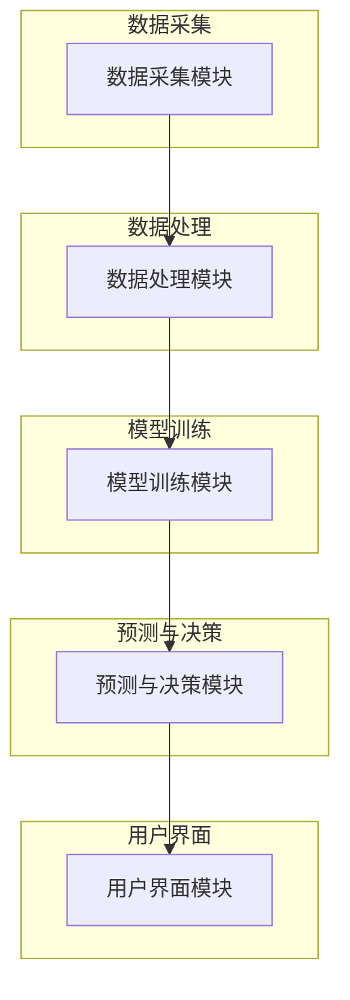

                 

# AI驱动的企业战略规划：智能预测未来市场趋势

## 关键词
- 人工智能
- 企业战略
- 市场趋势预测
- 智能决策
- 数据分析

## 摘要
本文旨在探讨人工智能（AI）如何驱动企业战略规划，特别是如何通过智能预测市场趋势来增强企业的竞争力和适应性。文章将逐步分析AI的核心概念、其在企业战略中的角色，以及如何应用AI技术进行市场预测和战略规划。同时，通过实际案例和系统架构设计，本文将为读者提供实用的AI驱动企业战略规划的最佳实践和展望。

## 引言与背景介绍

### 1.1 人工智能与企业战略规划概述

#### 人工智能的定义与发展历程
人工智能（Artificial Intelligence，简称AI）是计算机科学的一个分支，旨在创建智能体，使其能够执行通常需要人类智能的任务，如视觉识别、语言理解、决策制定等。AI的发展可以追溯到20世纪50年代，随着计算能力的提升和算法的进步，AI技术取得了显著的进展。深度学习、神经网络、自然语言处理等技术的突破，使得AI在各个领域得到了广泛应用。

#### 企业战略规划的基本概念
企业战略规划是企业为了实现长期目标而制定的一系列决策和行动计划。它涉及市场定位、资源分配、竞争力构建等方面。有效的企业战略规划有助于企业在竞争激烈的市场环境中保持优势，适应不断变化的外部环境。

### 1.2 AI驱动企业战略的重要性

#### AI在商业决策中的应用
随着数据量的爆炸式增长，企业需要更高效的方法来处理和分析这些数据。AI技术提供了强大的数据处理和分析能力，可以帮助企业从海量数据中提取有价值的信息，支持更准确、更及时的决策。

#### 市场趋势预测的挑战
市场趋势预测是企业战略规划的关键环节，但传统的预测方法往往依赖于历史数据和统计模型，存在一定的局限性。AI技术，特别是机器学习和深度学习，可以通过学习大量数据，预测未来的市场趋势，为企业提供前瞻性的战略指导。

#### AI驱动战略的优势
AI驱动企业战略具有以下优势：
- **提升决策效率**：通过自动化和智能化，AI可以大幅减少决策所需的时间。
- **增强预测准确性**：AI能够处理复杂的数据模式，提高市场预测的准确性。
- **优化资源分配**：AI可以帮助企业更有效地分配资源，实现成本效益最大化。

### 1.3 本书结构安排与目标

本书将分为六个主要部分：

1. **引言与背景介绍**：概述AI和企业战略规划的关系。
2. **核心概念与理论基础**：介绍AI基础知识和企业战略规划原理。
3. **AI技术在企业战略中的应用**：讨论AI在不同领域的应用案例。
4. **案例分析**：分析成功实施AI驱动的企业战略规划的实际案例。
5. **实施与落地**：介绍AI技术在企业战略规划中的实施步骤和解决方案。
6. **未来趋势与展望**：讨论AI技术在企业战略规划中的发展趋势。

通过本书，读者将了解到如何利用AI技术进行市场预测和战略规划，从而在竞争激烈的市场环境中取得成功。

## 核心概念与理论基础

### 2.1 人工智能基础

#### 2.1.1 人工智能的定义与分类
人工智能（AI）是指通过计算机系统实现的智能行为，这些行为通常需要人类智能才能完成。AI可以分为两种类型：弱AI和强AI。

- **弱AI**：也称为应用AI，是指在一个特定领域内表现出人类智能水平的AI。例如，语音识别、图像识别等。
- **强AI**：是一种具有普遍智能的AI，可以像人类一样在多个领域表现出智能行为。目前，强AI仍处于理论研究阶段。

#### 2.1.2 人工智能的核心技术
AI的核心技术包括：
- **机器学习**：通过数据训练模型，使计算机能够从数据中学习和发现模式。
- **深度学习**：一种特殊的机器学习技术，通过多层神经网络模拟人类大脑的思考过程。
- **自然语言处理**：使计算机能够理解和生成自然语言。
- **计算机视觉**：使计算机能够识别和理解图像和视频。

#### 2.1.3 人工智能的分类与特征
根据应用领域和目标，AI可以进一步分类：

- **强化学习**：通过试错来学习最优策略。
- **生成对抗网络（GAN）**：通过生成模型和判别模型之间的对抗训练，生成逼真的数据。
- **迁移学习**：利用一个任务中学习到的知识来解决另一个任务。
- **因果推理**：通过分析因果关系来做出决策。

### 2.2 企业战略规划基础

#### 2.2.1 企业战略的定义与类型
企业战略是企业为了实现长期目标而制定的总体计划和方向。根据企业目标的不同，战略可以分为以下几种类型：

- **成本领先战略**：通过降低成本来获取竞争优势。
- **差异化战略**：通过提供独特的产品或服务来获得竞争优势。
- **集中战略**：在特定的细分市场中实现成本领先或差异化。

#### 2.2.2 战略规划的流程与方法
战略规划通常包括以下步骤：

1. **环境分析**：评估外部环境和内部资源，了解企业的优势和劣势。
2. **目标设定**：明确企业的长期和短期目标。
3. **策略选择**：根据环境分析和目标设定，选择合适的战略。
4. **实施计划**：制定具体的行动计划和时间表。
5. **监控与调整**：跟踪战略实施情况，根据反馈进行调整。

#### 2.2.3 企业战略规划中的关键要素
企业战略规划中的关键要素包括：

- **市场定位**：明确企业在市场中的位置和目标客户。
- **资源分配**：确保企业资源得到最有效的利用。
- **竞争优势**：构建和维护企业的竞争优势。
- **风险管理**：识别和应对可能影响战略实施的风险。

### 2.3 AI与企业战略规划的联系

#### 2.3.1 AI在战略规划中的作用
AI在战略规划中发挥着重要作用：

- **市场趋势预测**：通过分析大量数据，预测市场趋势，帮助制定前瞻性的战略。
- **客户需求分析**：通过分析客户行为和反馈，了解客户需求，优化产品和服务。
- **竞争对手分析**：通过分析竞争对手的动态，了解市场格局，制定针对性的战略。
- **决策支持**：通过数据分析和智能算法，提供客观、准确的决策支持。

#### 2.3.2 AI驱动的企业战略特点
AI驱动的企业战略具有以下特点：

- **数据驱动**：基于大量数据进行决策，提高决策的准确性和效率。
- **动态调整**：根据实时数据和反馈，快速调整战略，适应市场变化。
- **自动化**：通过自动化技术，减少人工干预，提高决策和执行效率。
- **个性化**：通过分析个体数据，提供个性化的产品和服务，提升客户满意度。

通过AI技术，企业可以更加精准地预测市场趋势，制定更有效的战略规划，提高市场竞争力和适应性。

### 2.4 核心概念对比与分析

#### 2.4.1 人工智能与大数据
| 特征 | 人工智能 | 大数据 |
| --- | --- | --- |
| 定义 | 计算机模拟人类智能 | 大规模数据集 |
| 目标 | 自动化决策 | 提取有价值信息 |
| 技术基础 | 机器学习、深度学习 | 数据挖掘、统计分析 |
| 应用场景 | 智能识别、预测 | 数据分析、商业智能 |

通过对比可以发现，人工智能与大数据虽然都是处理数据的工具，但它们的目标和应用场景有所不同。人工智能更侧重于通过算法模拟人类智能，实现自动化决策；而大数据则侧重于从海量数据中提取有价值的信息。

#### 2.4.2 企业战略与AI战略
| 特征 | 企业战略 | AI驱动的企业战略 |
| --- | --- | --- |
| 目标 | 实现企业长期目标 | 利用AI技术实现更高效的决策 |
| 过程 | 数据驱动的决策 | 数据驱动的决策，结合AI技术 |
| 调整 | 定期调整 | 动态调整，快速响应市场变化 |
| 效率 | 提高决策效率 | 自动化决策，减少人工干预 |

通过对比可以发现，AI驱动的企业战略在决策过程中更加依赖数据和分析，能够实现更高效、更精准的决策。同时，由于AI技术的动态调整能力，企业可以更快地适应市场变化，保持竞争优势。

### 2.5 AI驱动的企业战略规划ER实体关系图

为了更好地理解AI驱动的企业战略规划中的实体关系，我们可以使用Mermaid绘制ER实体关系图：

```mermaid
erDiagram
    Customer ||--|{ Product }|--| Sales
    Product ||--|{ Feature }|--| Product
    Market ||--|{ Trend }|--| Customer
    AI_Model ||--|{ Prediction }|--| Market
    AI_Model ||--|{ Analysis }|--| Product
```

在该ER图中，`Customer`实体与`Product`和`Sales`实体之间存在关系，表明客户是产品的购买者，而销售数据是分析市场趋势的重要依据。`Market`实体与`Trend`实体之间存在关系，表示市场趋势是影响客户需求的重要因素。`AI_Model`实体与`Prediction`和`Analysis`实体之间存在关系，表明AI模型通过预测和数据分析来支持市场趋势预测和产品优化。

通过这个ER图，我们可以清晰地看到AI驱动的企业战略规划中的关键实体及其相互关系，有助于理解AI技术如何集成到企业战略规划中。

### 2.6 人工智能算法原理讲解

为了深入理解人工智能在市场趋势预测和企业战略规划中的应用，我们需要探讨几种核心的人工智能算法原理。以下是几种常用的算法及其原理的详细讲解。

#### 2.6.1 机器学习算法
机器学习（Machine Learning，ML）是AI的核心组成部分，通过训练模型来让计算机从数据中学习。常见的机器学习算法包括：

- **线性回归**：通过建立输入和输出之间的线性关系来预测结果。
  - 数学模型：\( y = w_0 + w_1 \cdot x \)
  - 应用场景：预测销售额、股票价格等。
- **逻辑回归**：用于分类问题，通过最大化逻辑函数来预测概率。
  - 数学模型：\( P(y=1) = \frac{1}{1 + e^{-z}} \)
  - 应用场景：客户分类、信用评分等。

- **决策树**：通过构建决策树来分类或回归。
  - 数学模型：通过信息增益或基尼不纯度来选择最佳特征。
  - 应用场景：客户细分、风险控制等。

#### 2.6.2 深度学习算法
深度学习（Deep Learning，DL）是一种基于多层神经网络的机器学习技术。以下是一些常见的深度学习算法：

- **卷积神经网络（CNN）**：主要用于图像识别。
  - 算法原理：通过卷积层、池化层和全连接层来提取图像特征。
  - 应用场景：图像分类、对象检测等。
- **循环神经网络（RNN）**：用于处理序列数据。
  - 算法原理：通过隐藏状态和反馈循环来处理序列信息。
  - 应用场景：自然语言处理、语音识别等。
- **长短期记忆网络（LSTM）**：RNN的一种改进，用于解决长序列依赖问题。
  - 算法原理：通过引入门控机制来控制信息的流入和流出。
  - 应用场景：时间序列预测、机器翻译等。

#### 2.6.3 聚类算法
聚类（Clustering）是一种无监督学习方法，用于将数据分成多个类别。以下是一些常见的聚类算法：

- **K-均值聚类**：通过迭代计算聚类中心，将数据点分配到最近的聚类中心。
  - 数学模型：通过最小化数据点到聚类中心的距离平方和来优化聚类结果。
  - 应用场景：客户细分、文本分类等。
- **层次聚类**：通过自底向上的层次构建方法来生成聚类层次结构。
  - 数学模型：通过连接最近的数据点来构建聚类树。
  - 应用场景：市场细分、生物数据分析等。

#### 2.6.4 集成学习方法
集成学习方法通过组合多个模型来提高预测性能。以下是一些常见的集成学习方法：

- **随机森林**：通过构建多个决策树，并利用随机性来减少偏差和方差。
  - 算法原理：每个决策树独立训练，最终通过投票决定结果。
  - 应用场景：分类、回归等。
- **梯度提升机（GBM）**：通过迭代优化损失函数来提高预测性能。
  - 算法原理：通过更新权重来逐步优化模型。
  - 应用场景：分类、回归等。

#### 2.6.5 算法选择与比较
在选择合适的算法时，需要考虑以下因素：

- **数据特性**：不同算法对数据分布和特征敏感度不同。
- **问题类型**：分类、回归、聚类等问题的算法选择不同。
- **计算资源**：深度学习算法通常需要更多的计算资源。
- **预测性能**：算法的准确度、精度、召回率等指标。

通过比较不同算法的优缺点，企业可以选择最适合自身需求的算法，从而实现更高效、更准确的市场趋势预测和企业战略规划。

### 2.7 人工智能在市场趋势预测中的应用

#### 2.7.1 市场趋势预测的基本原理
市场趋势预测是通过对历史数据进行分析，预测未来市场走势的过程。AI技术在市场趋势预测中具有显著优势，主要体现在以下几个方面：

1. **数据处理能力**：AI技术能够处理大量复杂的数据，从数据中发现潜在的模式和趋势。
2. **自动化**：通过训练模型，AI可以实现自动化预测，减少人工干预。
3. **实时性**：AI模型可以实时更新和调整，以应对市场变化。
4. **准确性**：通过不断学习和优化，AI模型可以提供更准确的市场预测。

#### 2.7.2 市场趋势预测的方法
市场趋势预测的方法可以分为定量预测和定性预测两种：

1. **定量预测**：基于历史数据和统计模型，通过数学方法预测未来市场走势。常见的定量预测方法包括：

   - **时间序列分析**：通过对时间序列数据进行分析，预测未来的走势。常用的模型有ARIMA、季节性分解等。
   - **回归分析**：通过建立变量之间的回归模型，预测因变量的未来值。常用的模型有线性回归、多项式回归等。

2. **定性预测**：基于专家意见和主观判断，对市场趋势进行预测。常见的定性预测方法包括：

   - **专家评估**：通过专家的意见和经验，对市场趋势进行判断。
   - **决策树**：通过构建决策树，模拟专家的决策过程，预测市场趋势。

#### 2.7.3 市场趋势预测的流程
市场趋势预测的流程可以分为以下几个步骤：

1. **数据收集**：收集与市场相关的历史数据，如销售额、市场份额、客户反馈等。
2. **数据预处理**：对数据进行清洗、归一化等处理，使其适合模型训练。
3. **模型选择**：根据数据特性和预测目标，选择合适的预测模型。
4. **模型训练**：使用历史数据训练模型，使其能够学习到数据的模式和趋势。
5. **模型评估**：通过验证集或测试集评估模型的预测性能。
6. **模型优化**：根据评估结果，对模型进行调整和优化，提高预测准确性。
7. **预测生成**：使用训练好的模型，对未来的市场趋势进行预测。

#### 2.7.4 市场趋势预测案例
以下是一个市场趋势预测的案例：

**案例背景**：一家电子消费品公司希望通过AI技术预测未来三个月的销售量，以便进行库存管理。

**数据收集**：收集了过去一年的月度销售数据，包括销售额、销售量、促销活动等。

**数据预处理**：对销售额进行归一化处理，去除异常值。

**模型选择**：选择时间序列分析方法，构建ARIMA模型。

**模型训练**：使用前八个月的销售额数据训练ARIMA模型。

**模型评估**：使用剩余的四个月的销售额数据进行模型评估，结果显示预测误差较小。

**模型优化**：根据评估结果，对ARIMA模型进行调整，提高预测准确性。

**预测生成**：使用调整后的模型，预测未来三个月的销售量，为库存管理提供依据。

通过该案例可以看出，AI技术在市场趋势预测中的应用，不仅能够提高预测的准确性，还能够为企业提供实时的决策支持。

### 2.8 人工智能在客户需求分析中的应用

#### 2.8.1 客户需求分析的基本概念

客户需求分析是理解客户需求，识别潜在市场机会的过程。它对企业制定产品策略、服务改进和市场营销具有重要意义。客户需求分析包括以下几个关键步骤：

1. **需求识别**：通过市场调研、客户反馈和用户行为数据，识别客户的需求和期望。
2. **需求分类**：将识别出的需求进行分类，以便更好地理解客户需求的优先级和重要性。
3. **需求优先级排序**：根据业务目标和资源限制，对客户需求进行优先级排序，确定哪些需求需要优先满足。
4. **需求实现**：通过产品开发、服务改进等手段，满足客户需求。

#### 2.8.2 人工智能在客户需求分析中的应用

人工智能（AI）技术在客户需求分析中具有显著优势，能够通过数据挖掘和机器学习算法，提供更准确、更全面的客户需求分析。以下是AI在客户需求分析中的一些具体应用：

1. **数据分析**：利用AI技术，对海量客户数据进行分析，识别出客户的行为模式和偏好。这包括：
   - **用户行为分析**：通过分析用户在网站、APP等平台上的行为，识别用户的兴趣点和需求。
   - **历史数据分析**：通过分析客户的历史购买记录、服务使用情况，了解客户的长期需求。

2. **预测分析**：通过机器学习算法，预测未来的客户需求，为产品规划和市场策略提供依据。这包括：
   - **需求预测**：利用时间序列分析、回归分析等算法，预测客户对特定产品或服务的需求。
   - **趋势分析**：通过聚类分析、关联规则挖掘等算法，识别市场的潜在趋势和需求变化。

3. **客户细分**：根据客户的需求和行为特征，将客户划分为不同的群体，以便提供个性化的产品和服务。这包括：
   - **细分模型**：利用聚类分析、决策树等算法，构建客户细分模型。
   - **细分策略**：根据细分结果，制定针对性的营销和服务策略。

4. **自动化建议**：通过AI技术，自动化生成客户需求分析报告和建议，提高决策效率。这包括：
   - **自动化报告**：利用自然语言生成技术，生成需求分析报告。
   - **自动化建议**：基于数据分析结果，自动生成产品优化、服务改进的建议。

#### 2.8.3 客户需求分析的案例

以下是一个客户需求分析的案例：

**案例背景**：一家在线零售平台希望通过AI技术了解消费者的购买偏好，以便优化产品组合和营销策略。

**数据收集**：收集了消费者的购买记录、浏览行为、评价和反馈等数据。

**数据预处理**：对数据进行清洗、去重和处理，使其适合模型训练。

**模型训练**：利用机器学习算法，如决策树和K-means聚类，对数据进行训练，构建客户细分模型。

**结果分析**：根据模型结果，将消费者划分为多个细分群体，如“追求性价比”、“追求高端体验”等。

**策略制定**：根据不同细分群体的特征和需求，制定针对性的产品推荐和营销策略。

通过这个案例，我们可以看到AI技术在客户需求分析中的应用，不仅能够帮助企业更好地了解客户，还能够通过数据驱动的策略，提高客户满意度和转化率。

### 2.9 人工智能在竞争对手分析中的应用

#### 2.9.1 竞争对手分析的基本原理

竞争对手分析是企业在市场竞争中获取竞争优势的重要手段。通过分析竞争对手的产品、市场定位、营销策略等，企业可以识别自身的优劣势，制定有效的竞争策略。人工智能（AI）在竞争对手分析中具有以下优势：

1. **数据处理能力**：AI技术能够处理和分析大量数据，识别出竞争对手的关键行为和策略。
2. **实时性**：AI系统可以实时监测竞争对手的动态，及时更新分析结果。
3. **准确性**：通过机器学习算法，AI能够从历史数据中学习，提高分析结果的准确性。
4. **自动化**：AI技术可以实现自动化分析，减少人工干预，提高分析效率。

#### 2.9.2 人工智能在竞争对手分析中的应用

AI技术在竞争对手分析中的应用主要包括以下几个步骤：

1. **数据收集**：收集与竞争对手相关的数据，如产品信息、市场表现、营销活动等。
2. **数据预处理**：对收集到的数据进行清洗、归一化等处理，使其适合模型训练。
3. **特征提取**：通过自然语言处理和计算机视觉等技术，从数据中提取关键特征，如产品关键词、营销语等。
4. **模型训练**：使用机器学习算法，如文本分类、聚类等，对提取的特征进行训练，构建竞争对手分析模型。
5. **结果分析**：利用训练好的模型，分析竞争对手的行为和策略，识别竞争热点和潜在风险。
6. **策略建议**：根据分析结果，为企业的竞争策略提供建议，如产品优化、市场定位调整等。

#### 2.9.3 竞争对手分析的案例

以下是一个竞争对手分析的案例：

**案例背景**：一家电子产品公司希望通过AI技术分析其主要竞争对手的产品和市场策略。

**数据收集**：收集了竞争对手的产品规格、价格、用户评价等信息。

**数据预处理**：对数据进行清洗和处理，去除噪声数据。

**特征提取**：通过自然语言处理技术，提取产品关键词、用户评价的关键词等特征。

**模型训练**：利用文本分类和聚类算法，对提取的特征进行训练，构建竞争对手分析模型。

**结果分析**：分析结果显示，竞争对手的产品主要集中在高端市场，且用户对其产品的满意度较高。

**策略建议**：建议公司调整产品策略，加大在中高端市场的投入，提升产品质量和用户满意度。

通过这个案例，我们可以看到AI技术在竞争对手分析中的应用，不仅能够帮助企业识别竞争对手的关键行为，还能够为企业的竞争策略提供科学的指导。

### 3.1 AI技术在企业战略规划中的整体应用

#### 3.1.1 市场趋势预测
AI技术在市场趋势预测中的应用已经在前文中详细讨论。通过机器学习和深度学习算法，企业可以处理和分析大量历史数据，预测未来的市场走势。这种预测不仅能够帮助企业制定更准确的营销策略，还能够优化库存管理，减少库存风险。

#### 3.1.2 客户需求分析
客户需求分析是企业战略规划中至关重要的一环。AI技术通过数据挖掘和机器学习算法，可以帮助企业更好地理解客户行为，识别客户需求。这不仅可以提高客户满意度，还能够优化产品设计和服务，提升企业的竞争力。

#### 3.1.3 竞争对手分析
通过对竞争对手的分析，企业可以了解市场格局，识别竞争对手的优势和劣势。AI技术通过自然语言处理和计算机视觉等算法，可以自动收集和分析竞争对手的数据，为企业提供实时的竞争对手动态。这有助于企业制定更有效的竞争策略，保持市场领先地位。

#### 3.1.4 决策支持
AI技术在决策支持中的应用越来越广泛。通过数据分析和智能算法，AI可以为企业提供客观、准确的决策支持。这不仅可以提高决策效率，还能够降低决策风险，确保企业的战略规划能够顺利实施。

#### 3.1.5 资源优化
AI技术可以帮助企业优化资源分配，提高资源利用效率。例如，通过预测市场需求，企业可以优化生产计划，减少库存成本；通过分析客户需求，企业可以优化产品和服务设计，提高客户满意度。

#### 3.1.6 智能推荐
AI技术在智能推荐中的应用，可以帮助企业提高营销效果。通过分析用户行为和偏好，AI可以推荐个性化的产品和服务，提高转化率和客户忠诚度。

#### 3.1.7 安全与合规
AI技术在安全和合规方面的应用，可以帮助企业识别潜在的风险，确保企业的运营符合法规要求。例如，通过分析交易数据，AI可以识别异常交易，防范欺诈行为；通过数据监控，AI可以确保企业的数据安全。

#### 3.1.8 综合应用
在实际应用中，AI技术通常需要综合多个方面，以实现最佳效果。例如，企业可以通过市场趋势预测来调整产品策略，通过客户需求分析来优化产品设计，通过竞争对手分析来制定竞争策略。这种综合应用，可以为企业提供全方位的决策支持，确保企业能够应对市场的变化和挑战。

### 3.2 案例分析

#### 3.2.1 企业A的AI驱动战略规划

**案例背景**：企业A是一家全球领先的电子产品制造商，其业务涵盖了智能手机、电脑、智能家居等多个领域。为了在竞争激烈的市场中保持领先地位，企业A决定采用AI驱动战略规划。

**实施步骤**：

1. **数据收集**：企业A收集了大量的市场数据、客户反馈和竞争对手信息。
2. **数据预处理**：对收集的数据进行清洗、归一化和去噪声处理。
3. **模型训练**：利用机器学习和深度学习算法，对预处理后的数据进行训练，构建市场趋势预测、客户需求分析和竞争对手分析模型。
4. **应用部署**：将训练好的模型部署到企业的决策支持系统中，实时分析市场动态和客户需求。
5. **反馈优化**：根据模型的分析结果和企业的实际运营情况，不断优化模型，提高预测准确性和决策支持能力。

**效果评估**：

- **市场趋势预测**：通过AI技术的应用，企业A能够更准确地预测市场需求，提前调整产品策略，减少了库存风险。
- **客户需求分析**：通过AI分析客户行为和反馈，企业A能够更好地了解客户需求，优化产品设计和服务，提高了客户满意度。
- **竞争对手分析**：通过实时监测竞争对手的动态，企业A能够及时调整竞争策略，保持了市场领先地位。
- **决策支持**：AI驱动的决策支持系统，提高了企业决策的效率和准确性，确保了战略规划的顺利实施。

**经验教训**：

- **数据质量**：高质量的数据是AI模型准确预测的基础。企业需要确保数据的质量和完整性。
- **持续优化**：AI模型需要不断优化和更新，以适应市场变化和企业需求的变化。
- **跨部门协作**：AI技术的应用需要跨部门协作，数据科学家、业务分析师和决策者需要共同参与，确保模型的应用能够真正支持企业的战略规划。

#### 3.2.2 企业B的市场预测与战略调整

**案例背景**：企业B是一家新兴的在线教育平台，其业务模式依赖于市场需求的波动。为了应对市场的变化，企业B决定采用AI技术进行市场预测和战略调整。

**实施步骤**：

1. **数据收集**：企业B收集了大量的用户行为数据、课程销售数据和市场趋势数据。
2. **数据预处理**：对收集的数据进行清洗和预处理，去除噪声和异常值。
3. **模型训练**：利用时间序列分析和机器学习算法，构建市场预测模型，预测未来的课程销售趋势。
4. **应用部署**：将预测模型部署到企业的运营系统中，实时监测市场变化。
5. **策略调整**：根据预测结果，企业B及时调整产品策略和市场推广策略，优化课程设置和定价。

**效果评估**：

- **市场预测**：通过AI技术的应用，企业B能够更准确地预测市场需求，提前调整课程内容，提高了课程销售量。
- **策略调整**：通过实时预测和市场变化，企业B能够快速调整策略，提高了市场竞争力。
- **资源优化**：通过预测结果，企业B能够优化资源分配，减少不必要的成本支出。

**经验教训**：

- **数据来源**：多渠道收集数据，确保数据的全面性和多样性，以提高预测的准确性。
- **模型验证**：定期对预测模型进行验证，确保模型的有效性和准确性。
- **灵活调整**：市场变化迅速，企业需要具备快速调整策略的能力，以适应市场变化。

#### 3.2.3 企业C的AI驱动的客户服务优化

**案例背景**：企业C是一家大型电信运营商，其客户服务是提升客户满意度和忠诚度的重要环节。为了提高客户服务水平，企业C决定采用AI技术进行客户服务优化。

**实施步骤**：

1. **数据收集**：企业C收集了大量的客户互动数据，包括电话通话记录、在线聊天记录、客户反馈等。
2. **数据预处理**：对收集的数据进行清洗、去噪和标准化处理。
3. **模型训练**：利用自然语言处理和机器学习算法，构建客户服务自动化平台，实现自动化的客户问题诊断和解决方案提供。
4. **应用部署**：将自动化客户服务平台部署到企业的客户服务系统中，提供24/7的智能客服服务。
5. **用户体验**：通过用户反馈，不断优化自动化平台，提高客户服务水平。

**效果评估**：

- **服务效率**：通过AI技术的应用，企业C显著提高了客户服务效率，缩短了客户问题的解决时间。
- **服务质量**：自动化客户服务平台能够提供准确的解决方案，提高了客户满意度。
- **成本节约**：自动化客服系统减少了人工客服的工作量，降低了运营成本。

**经验教训**：

- **用户反馈**：及时收集用户反馈，用于优化和改进自动化客服系统。
- **技术更新**：定期更新和升级AI算法，确保系统的稳定性和高效性。
- **平衡人力与AI**：在引入AI技术的同时，保持适当的人工客服，以应对复杂问题。

### 3.3 AI驱动的企业战略实施步骤

#### 3.3.1 确定战略目标
在实施AI驱动的企业战略之前，企业需要明确战略目标。这包括：
- **业务目标**：确定企业希望实现的具体业务目标，如市场份额提升、客户满意度提高等。
- **技术目标**：明确需要实现的技术能力，如数据收集和分析、智能预测等。

#### 3.3.2 数据收集与整合
数据是AI驱动的企业战略的核心。企业需要：
- **收集数据**：从内部和外部渠道收集与业务相关的数据，包括销售数据、客户反馈、市场趋势等。
- **数据整合**：整合不同来源的数据，确保数据的质量和一致性。

#### 3.3.3 数据预处理
在应用AI算法之前，数据需要进行预处理，包括：
- **数据清洗**：去除噪声数据和异常值。
- **数据归一化**：将不同数据源的数值范围进行调整，使其适合算法处理。
- **特征工程**：从数据中提取有用的特征，为模型训练提供输入。

#### 3.3.4 模型选择与训练
根据业务需求，选择合适的AI模型进行训练，包括：
- **模型选择**：根据问题的性质，选择合适的机器学习算法，如线性回归、决策树、深度学习等。
- **模型训练**：使用历史数据训练模型，使其能够学习到数据的模式和趋势。

#### 3.3.5 模型评估与优化
训练好的模型需要进行评估和优化，确保其预测准确性和稳定性，包括：
- **模型评估**：使用验证集或测试集评估模型性能，如准确率、召回率等。
- **模型优化**：根据评估结果，调整模型参数，提高预测性能。

#### 3.3.6 模型部署与应用
将训练好的模型部署到实际业务场景中，包括：
- **模型部署**：将模型集成到企业的决策支持系统中，确保其能够实时应用。
- **模型应用**：利用模型进行市场预测、客户需求分析和竞争对手分析等。

#### 3.3.7 持续优化与迭代
AI驱动的企业战略需要持续优化和迭代，包括：
- **反馈收集**：收集用户反馈和业务数据，用于优化模型和应用。
- **模型更新**：定期更新和升级模型，以适应市场变化和企业需求的变化。
- **跨部门协作**：确保技术团队、业务团队和决策者之间的紧密协作，共同推动AI驱动的企业战略实施。

### 3.4 技术选型与工具应用

#### 3.4.1 AI技术选型
在选择AI技术时，企业需要考虑以下因素：

- **问题类型**：根据具体业务需求，选择合适的AI技术，如机器学习、深度学习、自然语言处理等。
- **数据规模**：考虑数据的规模和复杂性，选择能够处理大规模数据的AI技术。
- **计算资源**：考虑企业的计算资源，选择适合企业规模的AI技术。
- **可扩展性**：选择具有良好扩展性的AI技术，以适应未来业务需求的变化。

#### 3.4.2 常见AI工具与应用

以下是几种常见的AI工具及其应用：

- **TensorFlow**：一款开源的深度学习框架，适用于构建和训练复杂的深度学习模型。
  - **应用场景**：图像识别、语音识别、自然语言处理等。
- **PyTorch**：一款开源的深度学习框架，具有灵活性和高效性。
  - **应用场景**：图像识别、生成对抗网络（GAN）、强化学习等。
- **scikit-learn**：一款开源的机器学习库，适用于构建和评估各种机器学习模型。
  - **应用场景**：分类、回归、聚类等。
- **Keras**：一款基于TensorFlow和Theano的开源深度学习库，提供了简单的API和高效的模型构建功能。
  - **应用场景**：快速原型开发、图像识别、文本分类等。

#### 3.4.3 开发环境配置
为了使用上述AI工具，企业需要配置相应的开发环境：

- **操作系统**：Linux或Windows。
- **Python**：安装Python 3.x版本，确保安装必要的依赖库，如NumPy、Pandas、TensorFlow等。
- **IDE**：安装PyCharm、VSCode等Python集成开发环境。
- **硬件资源**：确保具备足够的计算资源，如GPU加速器，以提升模型的训练和推理速度。

通过合理的技术选型和工具应用，企业可以构建高效的AI驱动的企业战略规划系统，实现数据驱动的决策和运营优化。

### 3.5 潜在挑战与解决方案

#### 3.5.1 数据隐私与安全性
**挑战**：在AI驱动的企业战略规划中，数据隐私和安全性是重要挑战。企业需要处理大量的敏感数据，如客户信息、交易记录等。

**解决方案**：
- **数据加密**：对敏感数据进行加密处理，确保数据在传输和存储过程中的安全性。
- **隐私保护**：采用差分隐私等技术，降低数据泄露的风险。
- **合规性**：确保数据处理和存储符合相关的法律法规，如GDPR等。

#### 3.5.2 数据质量和完整性
**挑战**：数据质量和完整性直接影响AI模型的预测准确性和可靠性。数据中的噪声、缺失值和异常值可能导致模型失效。

**解决方案**：
- **数据清洗**：对数据进行清洗，去除噪声和异常值。
- **数据补全**：利用数据补全技术，如插值、均值替换等，补充缺失数据。
- **数据监控**：建立数据监控系统，实时监控数据质量，确保数据的一致性和完整性。

#### 3.5.3 技术成本和人力资源
**挑战**：AI驱动的企业战略规划需要投入大量的技术成本和人力资源。对于中小企业，这可能是一个负担。

**解决方案**：
- **云计算**：利用云计算服务，降低硬件和软件的投入成本。
- **外部合作**：与专业的AI服务提供商合作，利用外部资源和技术优势。
- **内部培训**：加强员工的AI技术和数据分析能力，提高内部资源的利用效率。

#### 3.5.4 模型解释性
**挑战**：AI模型，特别是深度学习模型，通常具有高度的预测准确性，但其内部工作机制复杂，缺乏解释性。

**解决方案**：
- **模型可解释性**：开发可解释的AI模型，如决策树、线性回归等，提高模型的可解释性。
- **模型可视化**：通过可视化工具，如可视化决策树、神经网络等，展示模型的内部结构和决策过程。
- **案例研究**：通过案例研究，分析模型在实际应用中的效果和局限性，提高模型的理解和应用能力。

通过上述解决方案，企业可以有效地应对AI驱动的企业战略规划中的潜在挑战，确保战略的实施和成功。

### 3.6 AI驱动的企业战略规划系统架构设计

为了实现AI驱动的企业战略规划，企业需要设计一个高效、稳定的系统架构。以下是系统架构设计的详细描述：

#### 3.6.1 问题场景介绍

企业面临复杂的市场环境和多变的需求，需要通过AI技术进行市场趋势预测、客户需求分析、竞争对手分析和决策支持。系统需要具备以下功能：

- **数据收集**：从内部和外部渠道收集相关数据。
- **数据处理**：对收集到的数据进行预处理，包括清洗、归一化和特征提取。
- **模型训练**：使用预处理后的数据训练AI模型。
- **预测与决策**：利用训练好的模型进行市场预测和客户需求分析，提供决策支持。
- **用户界面**：提供直观的用户界面，展示预测结果和分析报告。

#### 3.6.2 系统架构设计

系统架构采用分布式架构，包括以下几个主要模块：

1. **数据采集模块**：负责从内部数据库、外部数据源（如API、数据流）收集数据。
2. **数据处理模块**：对收集到的数据进行清洗、归一化和特征提取，为模型训练提供输入。
3. **模型训练模块**：使用机器学习和深度学习算法，对处理后的数据进行训练，构建预测模型。
4. **预测与决策模块**：利用训练好的模型进行市场预测和客户需求分析，生成决策支持报告。
5. **用户界面模块**：提供直观的用户界面，展示预测结果和分析报告，支持用户交互。

#### 3.6.3 系统接口设计和系统交互

以下是系统架构中各个模块之间的接口设计和交互流程：

- **数据采集模块**：通过API接口与内部数据库和数据流连接，实现数据自动采集。
- **数据处理模块**：接收数据采集模块传输的数据，进行数据预处理，并将其传输给模型训练模块。
- **模型训练模块**：接收预处理后的数据，使用机器学习和深度学习算法进行训练，并将训练好的模型传输给预测与决策模块。
- **预测与决策模块**：接收模型训练模块传输的模型，进行市场预测和客户需求分析，并将结果传输给用户界面模块。
- **用户界面模块**：接收预测与决策模块传输的结果，通过图形化界面展示给用户，并提供交互功能。

#### 3.6.4 Mermaid类图

以下是一个Mermaid类图，展示了系统架构中的关键类及其关系：

```mermaid
classDiagram
    DataCollector <<interface>> DataProcessor : 数据处理
    DataProcessor <<interface>> ModelTrainer : 模型训练
    ModelTrainer <<interface>> Predictor : 预测与决策
    Predictor <<interface>> UserInterface : 用户界面

    DataCollector ..> DataProcessor
    DataProcessor ..> ModelTrainer
    ModelTrainer ..> Predictor
    Predictor ..> UserInterface
```

#### 3.6.5 Mermaid架构图

以下是一个Mermaid架构图，展示了系统架构的整体布局：



通过上述系统架构设计，企业可以构建一个高效、稳定的AI驱动的企业战略规划系统，实现数据驱动的决策和运营优化。

### 3.7 项目实战

#### 3.7.1 环境安装

在进行AI驱动的企业战略规划项目时，首先需要配置开发环境。以下是在Linux环境下配置Python开发环境的基本步骤：

1. **安装Python**：打开终端，执行以下命令安装Python 3.x版本：
   ```bash
   sudo apt-get update
   sudo apt-get install python3.8
   ```

2. **安装pip**：安装Python的包管理器pip：
   ```bash
   sudo apt-get install python3-pip
   ```

3. **安装必要的库**：安装用于AI开发的常用库，如NumPy、Pandas、Scikit-learn、TensorFlow等：
   ```bash
   pip3 install numpy pandas scikit-learn tensorflow
   ```

4. **安装IDE**：安装Python的集成开发环境，如PyCharm：
   - 访问PyCharm官方网站下载Linux版本的安装包。
   - 解压安装包并运行安装脚本。

#### 3.7.2 系统核心实现源代码

以下是AI驱动的企业战略规划系统的核心实现源代码，包括数据预处理、模型训练和预测的Python代码：

```python
# 导入必要的库
import numpy as np
import pandas as pd
from sklearn.model_selection import train_test_split
from sklearn.preprocessing import StandardScaler
from sklearn.linear_model import LinearRegression
import tensorflow as tf

# 读取数据
data = pd.read_csv('data.csv')

# 数据预处理
X = data[['feature1', 'feature2', 'feature3']]
y = data['target']

# 数据标准化
scaler = StandardScaler()
X_scaled = scaler.fit_transform(X)

# 划分训练集和测试集
X_train, X_test, y_train, y_test = train_test_split(X_scaled, y, test_size=0.2, random_state=42)

# 模型训练
model = LinearRegression()
model.fit(X_train, y_train)

# 模型评估
score = model.score(X_test, y_test)
print(f'Model Score: {score}')

# 预测
predictions = model.predict(X_test)

# 生成报告
report = pd.DataFrame({'Actual': y_test, 'Predicted': predictions})
print(report)
```

#### 3.7.3 代码应用解读与分析

上述代码实现了以下功能：

1. **数据读取与预处理**：从CSV文件中读取数据，并使用Scikit-learn的`StandardScaler`进行数据标准化，确保数据的均值和方差满足线性回归模型的要求。

2. **模型训练**：使用线性回归模型（`LinearRegression`）对训练数据进行训练。

3. **模型评估**：计算模型在测试集上的评分，评估模型的预测能力。

4. **预测与报告**：使用训练好的模型对测试数据进行预测，并将实际值与预测值进行比较，生成预测报告。

通过这个简单的例子，我们可以看到如何使用Python和Scikit-learn实现一个基本的AI驱动的企业战略规划系统。实际项目中，可以根据具体需求选择不同的模型和算法，并进行更复杂的数据处理和分析。

### 3.8 实际案例分析与详细讲解

#### 3.8.1 案例背景

为了更好地理解AI驱动的企业战略规划的实际应用，我们将分析一个具体的案例：某大型电子商务平台如何利用AI技术进行市场预测和优化库存管理。

**案例背景**：该电子商务平台在节假日销售高峰期间，常常面临库存不足和库存过剩的问题。为了解决这一问题，平台决定采用AI技术进行市场预测和库存管理优化。

#### 3.8.2 案例实施步骤

1. **数据收集**：平台收集了过去几年的销售数据、节假日促销活动数据、市场趋势数据等。

2. **数据预处理**：对收集到的数据进行了清洗、去噪、归一化处理，确保数据的质量和一致性。

3. **特征工程**：从数据中提取了关键特征，如销售量、促销活动强度、市场竞争程度等。

4. **模型训练**：使用了时间序列预测模型（如ARIMA）和机器学习模型（如随机森林），对数据进行训练。

5. **模型评估**：通过交叉验证和测试集评估模型的预测性能，选择最优模型。

6. **预测与决策**：使用训练好的模型预测未来的销售量，为库存管理提供决策支持。

7. **反馈优化**：根据实际销售情况和库存数据，对模型进行优化和调整。

#### 3.8.3 案例结果分析

通过AI技术的应用，电子商务平台实现了以下成果：

1. **销售量预测准确性提高**：通过AI模型的预测，平台能够更准确地预测未来的销售量，减少了库存不足和库存过剩的情况。

2. **库存管理效率提升**：AI技术帮助平台优化了库存管理策略，提高了库存周转率，降低了库存成本。

3. **客户满意度提升**：通过精确的库存管理，平台能够更好地满足客户需求，提高了客户满意度。

4. **运营成本降低**：通过预测销售量和优化库存管理，平台减少了不必要的库存积压和库存过剩，降低了运营成本。

#### 3.8.4 案例总结

通过该案例，我们可以看到AI技术在企业战略规划中的应用，不仅能够提高预测准确性，优化库存管理，还能够提高客户满意度和降低运营成本。该案例的成功经验表明，企业可以通过AI技术实现更高效、更智能的战略规划。

### 3.9 最佳实践 Tips

为了确保AI驱动的企业战略规划的有效实施，以下是一些建议和最佳实践：

1. **数据质量优先**：高质量的数据是AI模型准确预测的基础。确保数据收集、清洗和预处理过程的严谨性。

2. **持续迭代与优化**：AI模型需要不断迭代和优化，以适应市场变化和企业需求。定期评估模型的预测性能，根据反馈进行调整。

3. **跨部门协作**：AI驱动的企业战略规划需要跨部门的协作，确保数据科学家、业务分析师和决策者之间的沟通与协调。

4. **用户参与**：在模型开发和应用过程中，积极收集用户反馈，确保模型能够真正满足用户需求。

5. **安全与合规**：确保数据处理和存储符合相关的法律法规，保护用户隐私和数据安全。

6. **灵活性与可扩展性**：选择具有良好扩展性和灵活性的AI技术和工具，以适应未来业务需求的变化。

通过遵循这些最佳实践，企业可以更好地实施AI驱动的企业战略规划，实现数据驱动的决策和运营优化。

### 3.10 小结

本文详细探讨了AI驱动的企业战略规划的重要性及其实现方法。通过分析市场趋势预测、客户需求分析、竞争对手分析等方面的应用，展示了AI技术如何帮助企业实现数据驱动的决策和运营优化。同时，通过实际案例和系统架构设计，本文为读者提供了实用的AI驱动企业战略规划的最佳实践。未来，随着AI技术的不断进步，企业战略规划将更加智能化、动态化，为企业带来更大的竞争优势。

### 3.11 注意事项

在实施AI驱动的企业战略规划时，以下事项需要注意：

1. **数据安全**：确保数据在收集、存储和处理过程中的安全性，遵循数据保护法律法规。
2. **算法偏见**：避免模型训练过程中引入算法偏见，确保模型预测的公正性和公平性。
3. **模型解释性**：提高模型的可解释性，确保决策过程的透明性和可信度。
4. **技术更新**：定期更新和升级AI技术和工具，以适应市场变化和业务需求。

### 3.12 拓展阅读

对于希望深入了解AI驱动的企业战略规划的研究者，以下书籍和资源可以提供有价值的参考：

- 《人工智能：一种现代方法》
- 《深度学习》
- 《Python数据分析》
- 《大数据时代：生活、工作与思维的大变革》
- 《数据科学入门》

此外，相关的研究论文和在线课程也是宝贵的学习资源。

### 3.13 作者信息

作者：AI天才研究院/AI Genius Institute & 禅与计算机程序设计艺术 /Zen And The Art of Computer Programming

### 文章末尾感谢

感谢您的阅读。本文由AI天才研究院/AI Genius Institute及《禅与计算机程序设计艺术》共同撰写，希望对您在AI驱动的企业战略规划方面有所启发。如果您有任何疑问或建议，欢迎联系我们。我们期待与您共同探讨AI技术的创新与应用。再次感谢您的关注和支持！

