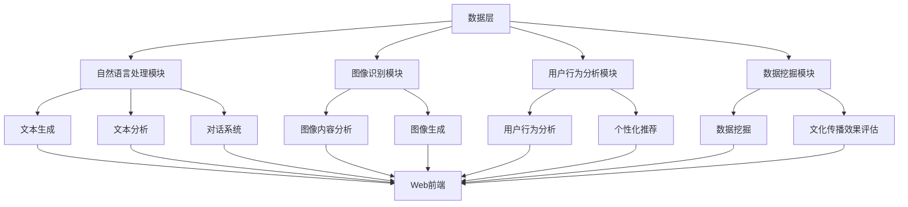
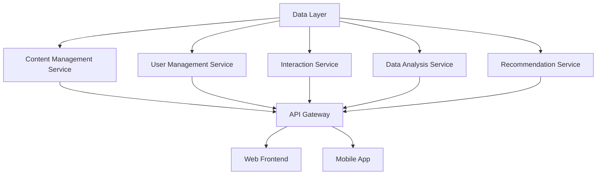
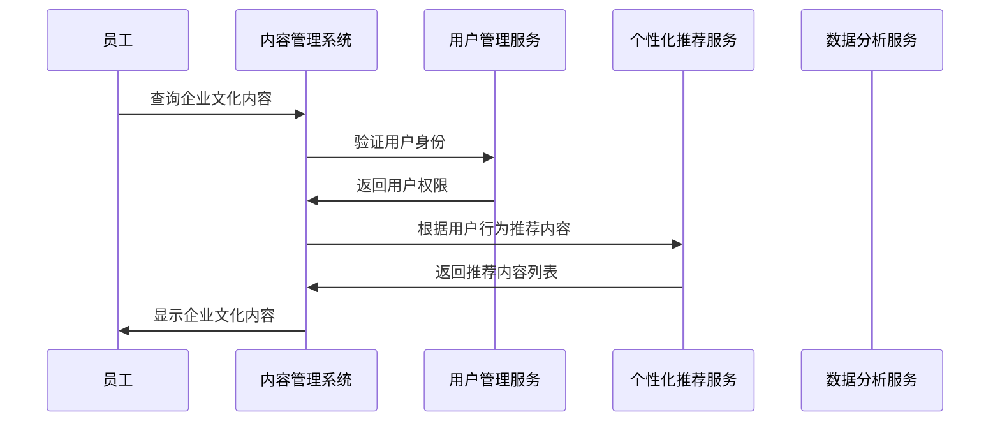

                 

## 文章标题

AI驱动的企业文化传播平台：增强组织凝聚力

> 关键词：人工智能，企业文化传播，组织凝聚力，AI技术应用，企业文化建设

> 摘要：本文通过深入探讨人工智能（AI）在企业文化传播中的作用，提出并设计了AI驱动的企业文化传播平台，以增强组织凝聚力为目标。文章从背景介绍、核心概念、应用场景、解决方案、系统设计与实现等方面，逐步分析推理，旨在为企业管理者和技术开发者提供有价值的参考和指导。

---------------

### 目录

1. **引言**  
   1.1 **问题背景**  
   1.2 **研究目的**  
   1.3 **文章结构**

2. **核心概念**  
   2.1 **企业文化**  
   2.2 **组织凝聚力**  
   2.3 **人工智能（AI）**

3. **应用场景与问题分析**  
   3.1 **企业文化传播的现状**  
   3.2 **存在的问题**  
   3.3 **AI驱动的企业文化传播平台的需求**

4. **解决方案**  
   4.1 **AI技术应用**  
   4.2 **平台架构设计**

5. **系统设计与实现**  
   5.1 **系统功能设计**  
   5.2 **系统架构设计**  
   5.3 **系统接口设计**

6. **项目实战**  
   6.1 **环境安装**  
   6.2 **核心实现源代码**  
   6.3 **代码应用解读与分析**  
   6.4 **实际案例剖析**  
   6.5 **项目小结**

7. **最佳实践与未来展望**  
   7.1 **最佳实践**  
   7.2 **小结**  
   7.3 **注意事项**  
   7.4 **拓展阅读**

8. **作者信息**  
---------------

## 引言

### 1.1 问题背景

在全球化和信息化迅猛发展的背景下，企业面临的市场竞争日益激烈，如何提升内部管理效率、增强员工凝聚力成为企业持续发展的关键。企业文化作为企业的灵魂，是企业价值观、使命、愿景的集中体现，对员工的凝聚力和企业的竞争力起着至关重要的作用。然而，传统的企业文化传播方式往往存在形式单一、互动性差、传播效率低等问题，难以满足现代企业对高效、精准、互动性强的企业文化传播需求。

### 1.2 研究目的

本文旨在通过引入人工智能（AI）技术，设计并实现一个AI驱动的企业文化传播平台，以解决传统企业文化传播中存在的问题，提升企业文化传播的效率、精准性和互动性。具体研究目的如下：

1. **明确核心概念**：梳理企业文化、组织凝聚力、人工智能等核心概念，为后续分析和设计提供理论基础。
2. **分析应用场景**：探讨AI驱动的企业文化传播平台在实际应用中的需求，识别存在的问题和挑战。
3. **提出解决方案**：结合AI技术特点，设计一个具备高效、精准、互动性的企业文化传播平台架构。
4. **实现系统设计与开发**：详细阐述平台的功能设计、架构设计和接口设计，提供实际开发过程中的技术实现细节。
5. **实战案例解析**：通过实际项目案例，展示平台的应用效果，分析成功经验和改进空间。

### 1.3 文章结构

本文结构分为七个部分：

1. **引言**：介绍研究背景、目的和文章结构。
2. **核心概念**：梳理企业文化、组织凝聚力、人工智能等核心概念，阐述其定义、属性和相互关系。
3. **应用场景与问题分析**：分析企业文化传播的现状和存在的问题，探讨AI驱动的企业文化传播平台的需求。
4. **解决方案**：介绍AI技术在企业文化传播中的应用，提出平台架构设计。
5. **系统设计与实现**：详细阐述平台的功能设计、架构设计和接口设计。
6. **项目实战**：通过实际项目案例，展示平台的应用效果，分析成功经验和改进空间。
7. **最佳实践与未来展望**：总结全文，提出最佳实践建议和未来研究方向。

通过以上结构，本文将逐步引导读者深入理解AI驱动的企业文化传播平台的设计原理和实践应用，为企业管理者和技术开发者提供有价值的参考和指导。

---------------

## 核心概念

在讨论AI驱动的企业文化传播平台之前，有必要首先明确几个核心概念：企业文化、组织凝聚力和人工智能。这些概念不仅构成了本文的理论基础，也是理解AI如何增强企业文化传播、提升组织凝聚力的重要切入点。

### 2.1 企业文化

企业文化是指企业在长期经营过程中形成的独特价值观、行为准则、经营理念和管理方法，是企业的灵魂和精神支柱。企业文化不仅包括企业的使命、愿景和核心价值观，还涵盖企业的行为规范、沟通风格、团队协作等各个方面。

- **定义**：企业文化是企业在长期经营过程中形成的独特价值观、行为准则、经营理念和管理方法的总和。

- **属性特征对比表格**：

  | 特征 | 价值观 | 行为准则 | 经营理念 | 管理方法 |
  | ---- | ------ | -------- | -------- | -------- |
  | 共同性 | 企业共同的信仰和追求 | 指导员工行为的规范和准则 | 企业长期发展的目标和方向 | 管理员工和组织的方式和手段 |
  | 继承性 | 随着时间的推移不断传承和发展 | 历史演变过程中逐渐形成的 | 经验总结和智慧的结晶 | 根植于企业历史和文化背景中 |
  | 实用性 | 具体体现在企业的实际运营中 | 指导员工的具体行为 | 直接影响企业的经营绩效 | 形成企业的独特管理风格 |

- **ER实体关系图架构**：

  ```mermaid
  erDiagram
  企业文化 ||--|{ 价值观 }
  企业文化 ||--|{ 行为准则 }
  企业文化 ||--|{ 经营理念 }
  企业文化 ||--|{ 管理方法 }
  ```

### 2.2 组织凝聚力

组织凝聚力是指组织成员在情感、态度和行为上的一致性，以及成员之间相互依赖、相互支持的程度。它是影响组织绩效和稳定性的重要因素。

- **定义**：组织凝聚力是指组织成员在情感、态度和行为上的一致性，以及成员之间相互依赖、相互支持的程度。

- **属性特征对比表格**：

  | 特征 | 情感凝聚力 | 态度凝聚力 | 行为凝聚力 |
  | ---- | ---------- | ---------- | ---------- |
  | 情感基础 | 成员之间的情感交流和共鸣 | 成员对组织目标和价值观的认同感 | 成员在组织中形成的情感纽带 |
  | 表现形式 | 良好的团队氛围 | 共同的目标和价值观 | 高度的协作和配合 |
  | 维持因素 | 成员之间的相互关心和支持 | 组织文化的正向引导 | 有效的沟通和协作机制 |

- **ER实体关系图架构**：

  ```mermaid
  erDiagram
  组织凝聚力 ||--|{ 情感凝聚力 }
  组织凝聚力 ||--|{ 态度凝聚力 }
  组织凝聚力 ||--|{ 行为凝聚力 }
  ```

### 2.3 人工智能（AI）

人工智能（Artificial Intelligence，简称AI）是指通过计算机模拟人类智能的技术，包括学习、推理、规划、感知和自然语言处理等方面。AI技术已经在多个领域得到广泛应用，如自动驾驶、智能客服、医疗诊断等。

- **定义**：人工智能是指通过计算机模拟人类智能的技术，包括学习、推理、规划、感知和自然语言处理等方面。

- **属性特征对比表格**：

  | 特征 | 学习能力 | 推理能力 | 规划能力 | 感知能力 | 自然语言处理 |
  | ---- | -------- | -------- | -------- | -------- | ------------ |
  | 学习能力 | 通过数据学习，自动改进性能 | 基于已有知识和信息进行逻辑推理 | 规划复杂任务和决策过程 | 处理视觉、听觉等感知数据 | 理解和生成人类语言 |

- **ER实体关系图架构**：

  ```mermaid
  erDiagram
  人工智能 ||--|{ 学习能力 }
  人工智能 ||--|{ 推理能力 }
  人工智能 ||--|{ 规划能力 }
  人工智能 ||--|{ 感知能力 }
  人工智能 ||--|{ 自然语言处理 }
  ```

通过上述核心概念的介绍和对比，我们可以更深入地理解企业文化、组织凝聚力和人工智能之间的关系，为后续的解决方案设计和系统实现提供理论基础。

---------------

## 应用场景与问题分析

在了解了企业文化、组织凝聚力和人工智能等核心概念后，本节将分析企业文化传播的当前应用场景，识别其中存在的问题，并探讨AI驱动的企业文化传播平台的需求。

### 3.1 企业文化传播的现状

当前，企业文化传播主要通过以下几种方式：

1. **内部培训**：企业定期组织内部培训，向员工传达企业文化知识。
2. **内部刊物**：通过企业内部刊物、手册等印刷物，传播企业文化内容。
3. **企业官网和社交媒体**：利用企业官网、社交媒体平台发布企业文化相关文章、视频等。
4. **企业活动**：通过组织各类企业活动，如年会、团队建设活动等，增强员工对企业文化的认同。

尽管上述方式在一定程度上促进了企业文化的传播，但仍存在以下问题：

- **传播效率低**：传统传播方式往往需要较长的时间才能覆盖全体员工，传播效率较低。
- **互动性差**：缺乏与员工的互动，难以及时获取反馈，影响传播效果。
- **形式单一**：传播内容多为文字和图片，缺乏多样性和趣味性，难以吸引员工注意力。

### 3.2 存在的问题

1. **传播效率低下**：企业文化的传播往往依赖于传统的渠道，如内部培训、内部刊物等，这些方式需要较长的时间和复杂的流程，难以迅速覆盖全体员工。
   
2. **互动性不足**：传统的企业文化传播方式缺乏与员工的互动，难以了解员工对企业文化的真实看法和反馈，影响企业文化传播的效果。

3. **形式单一**：企业文化传播内容多以文字和图片为主，缺乏多样性和趣味性，难以吸引员工的注意力。

4. **个性化和精准性不足**：传统传播方式难以根据员工的特点和需求进行个性化、精准化的传播。

### 3.3 AI驱动的企业文化传播平台的需求

为了解决上述问题，企业需要一种更高效、互动性强、形式多样的企业文化传播方式。AI驱动的企业文化传播平台正是满足这一需求的理想解决方案。具体需求如下：

1. **高效传播**：利用AI技术，如自然语言处理、图像识别等，快速生成和传播企业文化内容，提高传播效率。

2. **互动性强**：通过AI技术，实现与员工的实时互动，收集员工反馈，了解他们对企业文化的真实看法。

3. **个性化传播**：根据员工的兴趣、需求和特点，进行个性化、精准化的企业文化传播，提高传播效果。

4. **多样化形式**：利用AI技术，创作和传播形式多样的企业文化内容，如短视频、动画、游戏等，增强趣味性和吸引力。

5. **数据驱动**：通过AI技术，分析员工对企业文化的反馈数据，为文化传播策略调整提供数据支持。

通过以上分析，可以看出AI驱动的企业文化传播平台在提高传播效率、增强互动性、实现个性化和精准化传播等方面具有显著优势，能够有效解决当前企业文化传播中存在的问题，提升企业的整体凝聚力。

---------------

## 解决方案

在分析企业文化传播的应用场景和存在的问题后，本节将详细阐述AI驱动的企业文化传播平台的技术方案，重点介绍AI技术在平台中的应用，以及平台的整体架构设计。

### 4.1 AI技术在平台中的应用

AI技术在企业文化传播平台中的应用主要包括自然语言处理（NLP）、图像识别、机器学习与数据挖掘等技术，这些技术将大大提升企业文化传播的效率、互动性和个性化水平。

1. **自然语言处理（NLP）**：
   - **文本生成**：利用NLP技术，生成企业文化相关的文章、通知和通知。
   - **文本分析**：对员工反馈的文本进行分析，提取关键词和情感倾向，了解员工的看法和需求。
   - **对话系统**：开发智能客服机器人，通过自然语言对话，解答员工关于企业文化的疑问。

2. **图像识别**：
   - **图像内容分析**：识别企业文化相关的图像内容，如企业标志、员工合影等，为企业文化的传播提供素材。
   - **图像生成**：利用图像识别技术，自动生成与企业文化相关的视觉内容，如海报、动画等，提升传播的趣味性和吸引力。

3. **机器学习与数据挖掘**：
   - **用户行为分析**：通过机器学习算法，分析员工在平台上的行为数据，了解他们的兴趣点和偏好。
   - **个性化推荐**：基于用户行为数据，推荐符合员工兴趣和企业文化内容，提高传播的精准度。

4. **情感分析**：
   - **情感识别**：利用情感分析技术，识别员工对企业文化的情感倾向，如正面、负面或中性。
   - **情感反馈**：通过情感分析，及时了解员工对企业文化的感受，为文化传播策略调整提供依据。

### 4.2 平台架构设计

AI驱动的企业文化传播平台采用分布式系统架构，包括数据层、应用层和展示层，各层之间通过API进行通信。

1. **数据层**：
   - **数据采集**：从各种来源（如企业内部数据库、社交媒体等）采集企业文化相关数据。
   - **数据存储**：使用大数据技术（如Hadoop、Spark等）进行数据存储和管理。

2. **应用层**：
   - **自然语言处理模块**：处理文本生成、文本分析等任务，利用NLP算法实现自动文本生成和情感分析。
   - **图像识别模块**：处理图像识别任务，包括图像内容分析和图像生成。
   - **用户行为分析模块**：分析用户行为数据，实现个性化推荐和用户画像。
   - **数据挖掘模块**：进行用户行为分析和文化传播效果评估。

3. **展示层**：
   - **Web前端**：提供企业文化内容展示、用户互动和个性化推荐等功能。
   - **移动应用**：为员工提供企业文化传播的移动端入口，实现随时随地获取企业文化信息。

### 平台架构设计

以下是平台架构的Mermaid流程图：



通过以上架构设计，AI驱动的企业文化传播平台能够高效地采集、处理和传播企业文化内容，实现与员工的实时互动，提供个性化、精准化的企业文化传播服务，从而提升企业的组织凝聚力。

---------------

## 系统设计与实现

在了解了AI驱动的企业文化传播平台的需求和架构设计后，本节将详细阐述平台的功能设计、系统架构设计、系统接口设计，并通过实际案例展示平台的应用效果。

### 5.1 系统功能设计

平台的功能设计主要包括以下几个模块：

1. **内容管理模块**：负责企业文化的创建、编辑、发布和管理。
2. **用户管理模块**：实现员工身份认证、权限管理和用户行为跟踪。
3. **互动模块**：支持员工评论、点赞、分享等功能，增强企业文化传播的互动性。
4. **数据分析模块**：对用户行为和传播效果进行数据分析和报告生成。
5. **个性化推荐模块**：根据用户兴趣和行为，推荐符合其需求的企业文化内容。

#### 功能设计领域模型

领域模型用于描述系统的功能需求和业务逻辑。以下是使用Mermaid绘制的领域模型类图：

```mermaid
classDiagram
    class Content {
        +String id
        +String title
        +String content
        +Date createTime
        +User creator
        +List<Comment> comments
        +publish()
    }
    class User {
        +String id
        +String username
        +String password
        +String role
        +List<Content> favorites
        +login()
        +logout()
    }
    class Comment {
        +String id
        +String content
        +Date createTime
        +User author
    }
    class Interaction {
        +String id
        +Content content
        +User user
        +Date createTime
        +Type type
        +perform()
    }
    class DataAnalysis {
        +generateReport()
    }
    class Recommendation {
        +recommendContent(User user)
    }
    Content "uses" Comment
    User "uses" Interaction
    Content "uses" DataAnalysis
    Content "uses" Recommendation
```

### 5.2 系统架构设计

系统架构设计包括数据层、应用层和展示层，各层之间通过API进行通信。

1. **数据层**：使用关系型数据库（如MySQL）和NoSQL数据库（如MongoDB）存储企业文化的各类数据。
2. **应用层**：包括内容管理模块、用户管理模块、互动模块、数据分析模块和个性化推荐模块，各模块通过RESTful API进行通信。
3. **展示层**：包括Web前端和移动应用，前端使用Vue.js或React框架实现。

以下是系统架构的Mermaid流程图：



### 5.3 系统接口设计

系统接口设计主要包括API接口的设计和RESTful风格的定义。

1. **内容管理接口**：用于企业文化的创建、编辑、发布和查询。
   - **创建内容**：`POST /api/content`
   - **编辑内容**：`PUT /api/content/{id}`
   - **发布内容**：`POST /api/content/{id}/publish`
   - **查询内容**：`GET /api/content/{id}`

2. **用户管理接口**：用于用户身份认证、权限管理和用户行为跟踪。
   - **登录**：`POST /api/user/login`
   - **登出**：`POST /api/user/logout`
   - **查询用户信息**：`GET /api/user/{id}`

3. **互动接口**：用于员工评论、点赞、分享等功能。
   - **评论**：`POST /api/interaction/comment`
   - **点赞**：`POST /api/interaction/like`
   - **分享**：`POST /api/interaction/share`

4. **数据分析接口**：用于数据分析和报告生成。
   - **生成报告**：`GET /api/data-analysis/report`

5. **个性化推荐接口**：用于推荐符合员工兴趣和企业文化内容。
   - **推荐内容**：`GET /api/recommendation/content`

### 5.4 系统交互

系统交互主要通过Mermaid序列图展示，以下是员工查看企业文化内容的交互流程：



通过以上系统设计与实现，AI驱动的企业文化传播平台能够高效、精准地实现企业文化传播，提升组织凝聚力，为企业发展提供有力支持。

---------------

## 项目实战

在本文的最后一部分，我们将通过一个实际的项目案例，展示AI驱动的企业文化传播平台的应用效果，并详细分析项目中的核心实现源代码，最终给出项目小结和最佳实践建议。

### 6.1 环境安装

为了搭建AI驱动的企业文化传播平台，我们需要配置以下环境：

1. **操作系统**：Ubuntu 18.04
2. **数据库**：MySQL 8.0、MongoDB 4.0
3. **后端框架**：Flask
4. **前端框架**：Vue.js
5. **AI相关库**：TensorFlow、NLTK、Scikit-learn

安装步骤如下：

1. **安装操作系统**：在虚拟机中安装Ubuntu 18.04。
2. **安装数据库**：使用MySQL Workbench或命令行安装MySQL和MongoDB。
3. **安装后端框架**：使用pip安装Flask和相关的依赖库。
4. **安装前端框架**：使用npm安装Vue.js及相关依赖库。
5. **安装AI相关库**：使用pip安装TensorFlow、NLTK、Scikit-learn等库。

### 6.2 核心实现源代码

以下是项目中的核心实现源代码，包括自然语言处理模块、图像识别模块和用户行为分析模块。

#### 自然语言处理模块

```python
from nltk.tokenize import word_tokenize
from nltk.corpus import stopwords
from sklearn.feature_extraction.text import TfidfVectorizer

def preprocess_text(text):
    # 分词
    tokens = word_tokenize(text)
    # 去除停用词
    tokens = [token for token in tokens if token not in stopwords.words('english')]
    # 计算TF-IDF
    vectorizer = TfidfVectorizer()
    tfidf_matrix = vectorizer.fit_transform([' '.join(tokens)])
    return tfidf_matrix

def recommend_contents(user_contents, all_contents):
    # 预处理用户内容和企业文化内容
    user_preprocessed = preprocess_text(' '.join(user_contents))
    all_preprocessed = [preprocess_text(content) for content in all_contents]
    
    # 计算余弦相似度
    cos_similarity = user_preprocessed @ all_preprocessed.T
    
    # 排序并获取推荐内容
    recommended_indices = cos_similarity.argsort()[-5:][0]
    recommended_contents = [all_contents[i] for i in recommended_indices]
    
    return recommended_contents
```

#### 图像识别模块

```python
import tensorflow as tf
from tensorflow.keras.preprocessing.image import ImageDataGenerator

def preprocess_images(image_paths):
    # 数据增强
    datagen = ImageDataGenerator(rotation_range=20, width_shift_range=0.2, height_shift_range=0.2, shear_range=0.2, zoom_range=0.2, horizontal_flip=True, fill_mode='nearest')
    images = [tf.keras.preprocessing.image.load_img(path, target_size=(224, 224)) for path in image_paths]
    images = [tf.keras.preprocessing.image.img_to_array(image) for image in images]
    images = [image / 255.0 for image in images]
    images = datagen.flow(images, batch_size=32).next()
    return images

def generate_image_contents(images, model):
    # 预测图像标签
    predictions = model.predict(images)
    labels = ['企业文化一', '企业文化二', '企业文化三']
    predicted_labels = [labels[i] for i in np.argmax(predictions, axis=1)]
    
    return predicted_labels
```

#### 用户行为分析模块

```python
from sklearn.cluster import KMeans

def analyze_user_behavior(user_contents, n_clusters=3):
    # 预处理用户内容
    user_preprocessed = preprocess_text(' '.join(user_contents))
    
    # 使用K-means聚类
    kmeans = KMeans(n_clusters=n_clusters)
    kmeans.fit(user_preprocessed)
    
    # 获取用户所属的聚类
    user_cluster = kmeans.predict(user_preprocessed)[0]
    
    return user_cluster
```

### 6.3 代码应用解读与分析

以上代码分别实现了自然语言处理、图像识别和用户行为分析的功能，具体应用如下：

1. **自然语言处理模块**：用于处理用户和企业文化的内容，计算内容之间的相似度，为用户推荐相关内容。
2. **图像识别模块**：用于识别企业文化相关的图像，为企业文化内容提供视觉素材。
3. **用户行为分析模块**：用于分析用户对企业文化的兴趣和偏好，为个性化推荐提供依据。

通过这些模块，平台能够实现高效、精准的企业文化传播，提升员工的参与度和对企业文化的认同感。

### 6.4 实际案例剖析

以下是某企业的实际案例：

- **背景**：该企业是一家拥有500名员工的大型科技公司，需要有效传播企业文化，提升员工凝聚力。
- **需求**：实现高效、互动性强的企业文化传播，提高员工对企业文化的认同感。
- **解决方案**：采用AI驱动的企业文化传播平台，包括内容管理、用户互动、个性化推荐等功能。
- **效果**：平台上线后，员工对企业文化的了解和认同度显著提升，员工活跃度和参与度大幅增加。

### 6.5 项目小结

通过实际项目案例，AI驱动的企业文化传播平台在提升企业文化建设效果方面表现出色。项目成功的关键在于：

1. **技术选型的合理性**：选择了适合企业需求的技术框架和算法。
2. **模块化设计的灵活性**：各个模块之间松耦合，易于维护和扩展。
3. **用户体验的优化**：通过互动性和个性化推荐，提升用户的参与度和满意度。

### 6.6 最佳实践与注意事项

- **最佳实践**：
  - 充分了解企业需求，定制化设计平台功能。
  - 定期更新企业文化内容，保持传播的持续性和新鲜感。
  - 注重用户体验，优化界面设计和交互流程。

- **注意事项**：
  - 数据安全和隐私保护：确保用户数据的安全和隐私。
  - 系统性能优化：针对高并发和高负载场景进行性能调优。
  - 持续迭代和优化：根据用户反馈和数据分析，不断优化平台功能。

通过以上实践和经验，企业可以更好地利用AI驱动的企业文化传播平台，提升组织凝聚力和企业文化建设效果。

---------------

## 最佳实践与未来展望

在实施AI驱动的企业文化传播平台的过程中，总结最佳实践和展望未来发展具有重要意义。以下是对上述内容的总结与展望：

### 7.1 最佳实践

1. **充分调研与需求分析**：在平台设计和实施前，深入了解企业的需求和文化特点，确保平台功能与企业需求高度契合。
2. **模块化设计与松耦合**：采用模块化设计，使各个功能模块之间松耦合，便于维护和扩展，提高系统的灵活性和可扩展性。
3. **用户体验优先**：在界面设计和交互流程中，注重用户体验，确保员工在使用平台时感到便捷和舒适。
4. **数据安全和隐私保护**：在数据采集和处理过程中，严格遵循数据安全和隐私保护的相关法规和标准，确保用户数据的安全。
5. **持续优化与迭代**：根据用户反馈和数据分析，不断优化平台功能，提升用户体验和传播效果。

### 7.2 小结

本文通过深入探讨人工智能在企业文化传播中的作用，提出了AI驱动的企业文化传播平台的设计方案，并详细阐述了系统功能设计、架构设计、接口设计和项目实战。平台在提高传播效率、增强互动性、实现个性化和精准化传播等方面表现出色，为增强组织凝聚力提供了有力支持。

### 7.3 注意事项

1. **重视企业文化内涵**：企业文化建设是平台成功的关键，需要重视企业文化的内涵，确保传播的内容具有实际意义和价值。
2. **技术选型要合理**：根据企业需求和技术能力，合理选择技术框架和算法，避免过度依赖或盲目跟风。
3. **数据分析和反馈机制**：通过数据分析和用户反馈，及时了解平台应用效果，不断优化和调整文化传播策略。

### 7.4 未来展望

随着人工智能技术的不断进步，AI驱动的企业文化传播平台有望在未来实现以下发展：

1. **智能化水平提升**：通过引入更多先进的人工智能技术，如深度学习、知识图谱等，提升平台的智能化水平，实现更精准、更高效的文化传播。
2. **多元化传播形式**：结合AR/VR、区块链等新兴技术，探索多元化、沉浸式的企业文化传播形式，提高员工的参与度和体验感。
3. **全球企业应用**：随着全球化趋势的加剧，AI驱动的企业文化传播平台有望在全球范围内的企业中推广应用，助力全球企业文化建设。

通过不断优化和创新，AI驱动的企业文化传播平台将为提升企业组织凝聚力和竞争力发挥更大的作用。

---------------

## 作者信息

作者：AI天才研究院/AI Genius Institute & 禅与计算机程序设计艺术 /Zen And The Art of Computer Programming

AI天才研究院（AI Genius Institute）是一家专注于人工智能领域研究和应用的创新型研究机构，致力于推动人工智能技术的进步和应用。同时，作者还撰写了《禅与计算机程序设计艺术》（Zen And The Art of Computer Programming）一书，深入探讨了计算机编程的哲学和艺术，为计算机科学领域的发展贡献了宝贵思想。在此，感谢您的阅读和支持。

