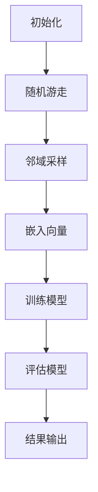
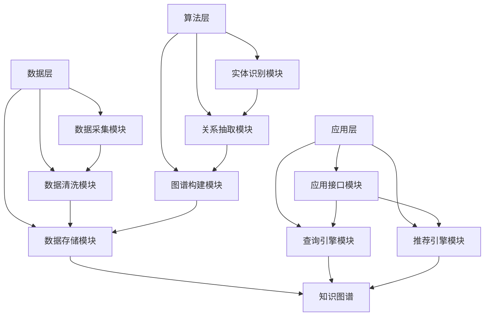
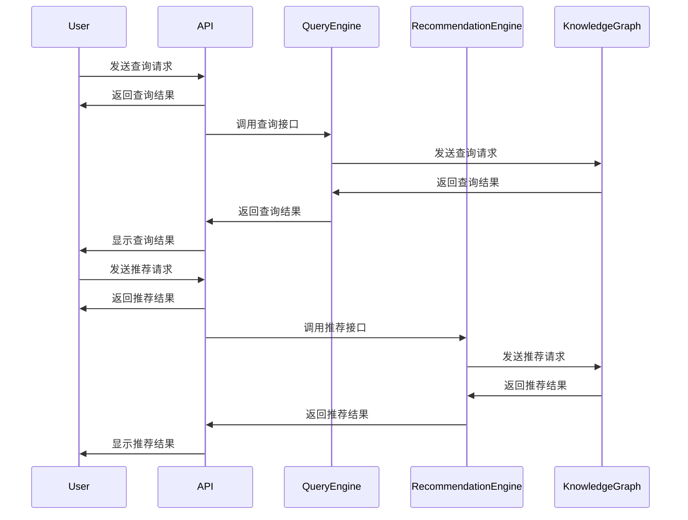

                 

### 第一章：背景介绍

#### 1.1 问题背景

在当今的商业环境中，企业知识管理已经成为提升竞争力的关键因素。然而，随着企业规模的不断扩大和业务复杂性的增加，传统的知识管理方法逐渐暴露出其局限性。首先，企业内部的知识往往分散在不同的部门、系统和人员手中，导致信息孤岛现象严重。其次，随着数据的激增，如何从海量信息中快速提取和利用有价值的数据成为一大挑战。此外，企业在知识获取、存储、共享、应用等方面缺乏系统性的方法，导致知识的利用率低下。

AI技术的崛起为解决这些问题带来了新的契机。人工智能，特别是深度学习和自然语言处理技术的迅猛发展，使得从非结构化数据中提取有价值信息成为可能。同时，AI技术能够帮助企业更好地理解其业务模式，优化业务流程，提升运营效率。因此，结合AI技术构建企业知识图谱，实现知识的自动采集、分类、存储、共享和利用，已经成为企业知识管理的重要方向。

#### 1.2 问题描述

企业知识管理面临的主要问题包括：

- **信息孤岛**：企业内部不同部门、系统之间缺乏有效的信息共享机制，导致知识无法在组织内充分流动和利用。
- **数据过载**：随着数据量的急剧增加，企业难以从海量数据中快速提取和利用有价值的信息。
- **知识沉淀困难**：企业内部的知识难以系统性地沉淀和积累，新员工难以快速上手和了解业务。
- **决策支持不足**：企业缺乏基于大数据和AI技术的智能决策支持系统，决策过程往往依赖经验和直觉，缺乏数据驱动的基础。

#### 1.3 问题解决

为了解决上述问题，企业需要构建一个AI驱动的企业知识图谱，其核心思路如下：

- **数据采集与整合**：通过数据爬取、API接口、数据导入等方式，将企业内外部的结构化和非结构化数据进行采集和整合。
- **实体识别与分类**：利用自然语言处理技术，对采集到的数据进行分析，识别出实体及其属性，并进行分类。
- **关系抽取与建模**：通过实体间的共现关系、语义关系等，构建实体之间的关系模型，实现对知识的关联和推理。
- **图谱构建与存储**：将实体、属性、关系等结构化数据构建成知识图谱，利用图数据库进行存储和管理。
- **智能查询与推荐**：基于图谱的语义理解能力，实现智能查询和推荐功能，帮助企业快速获取所需信息。

#### 1.4 边界与外延

- **知识图谱的范围**：知识图谱不仅涵盖企业内部数据，还可以整合外部数据源，如社交媒体、公共数据库等，实现跨领域的知识融合。
- **应用场景**：知识图谱在企业内部可用于知识库建设、员工培训、业务流程优化等；在跨企业合作中，可用于供应链管理、产业协同、市场分析等。

#### 1.5 核心概念与要素组成

- **知识图谱的要素**：
  - **实体**：知识图谱中的基本元素，可以是人物、地点、物品等。
  - **属性**：实体的特征描述，如姓名、年龄、地点等。
  - **关系**：实体之间的关联，如属于、位于、购买等。
  - **事件**：实体之间的交互过程，如交易、合作、离职等。

- **知识图谱的构建流程**：
  - **数据采集**：获取企业内外部的结构化和非结构化数据。
  - **实体识别**：通过自然语言处理技术，识别出数据中的实体。
  - **关系抽取**：分析实体之间的语义关系，构建关系模型。
  - **图谱构建**：将实体、属性、关系等结构化数据构建成知识图谱。
  - **图谱维护**：定期更新和优化知识图谱，确保其准确性和时效性。

## 第二章：核心概念与联系

#### 2.1 核心概念

- **知识图谱**：知识图谱是一种用于存储和表示知识的图形结构。它通过实体、属性、关系等基本元素，构建起知识之间的关联网络，实现对知识的组织和利用。

- **实体**：实体是知识图谱中的基本元素，可以是人物、地点、物品等。实体具有唯一的标识符，并可以拥有多个属性来描述其特征。

- **属性**：属性是实体的特征描述，如姓名、年龄、地点等。属性通常具有特定的数据类型，如字符串、数字、日期等。

- **关系**：关系是实体之间的关联，如属于、位于、购买等。关系可以描述实体之间的语义关系，实现对知识的推理和关联。

#### 2.2 概念属性特征对比表格

| 概念   | 特征                         |
| ------ | ---------------------------- |
| 知识图谱 | 图结构、实体、属性、关系       |
| 实体   | 唯一标识、属性集合、关系网络   |
| 属性   | 实体特征、值、类型           |
| 关系   | 实体之间的交互、方向、强度     |

#### 2.3 ER实体关系图

```mermaid
erDiagram
  Person ||--|{ Address } : has
  Address ||--|{ Person } : located_in
```

在这个ER实体关系图中，我们定义了两个实体：Person（人物）和Address（地址）。Person实体具有姓名（Name）和年龄（Age）等属性，Address实体具有街道（Street）、城市（City）和邮编（PostalCode）等属性。Person实体与Address实体之间存在“居住”关系，表示一个人有一个居住地址，而一个地址也可以被多个人居住。

#### 2.4 实例说明

为了更好地理解上述核心概念和ER实体关系图，我们可以举一个具体的实例。

假设我们有一个企业员工的知识图谱，其中包含以下实体和关系：

- **实体**：
  - Employee（员工）：具有员工ID、姓名、部门、职位等属性。
  - Department（部门）：具有部门ID、部门名称等属性。

- **关系**：
  - WorksIn（工作于）：表示员工与部门之间的工作关系。

根据这个实例，我们可以构建如下的ER实体关系图：

```mermaid
erDiagram
  Employee ||--|{ Department } : WorksIn
  Employee : { EmployeeID, Name, DepartmentID, Position }
  Department : { DepartmentID, DepartmentName }
```

在这个实例中，Employee实体与Department实体之间存在“工作于”关系。每个Employee实体都有一个唯一的EmployeeID，以及其所属的DepartmentID。Department实体具有唯一的DepartmentID和部门名称。通过这个知识图谱，企业可以方便地查询员工的详细信息，以及员工所属的部门信息。

## 第三章：算法原理讲解

#### 3.1 算法选择

在构建企业知识图谱的过程中，选择合适的算法至关重要。在本章中，我们将介绍一种典型的算法——基于图嵌入的方法。图嵌入（Graph Embedding）是一种将图结构数据映射到低维空间的技术，通过这种方式，可以实现实体相似性的计算、节点分类、图分类等任务。

图嵌入算法的核心思想是将图中的节点映射到低维空间中的向量表示，使得具有相似属性或关系的节点在低维空间中靠近。常用的图嵌入算法包括Node2Vec、DeepWalk、GraphSAGE等。在本节中，我们将以Node2Vec算法为例，进行详细讲解。

#### 3.2 Mermaid流程图

下面是Node2Vec算法的Mermaid流程图：



#### 3.3 Python源代码

以下是Node2Vec算法的Python源代码示例：

```python
import numpy as np
import networkx as nx
from node2vec import Node2Vec
from sklearn.cluster import KMeans
from sklearn.metrics import adjusted_rand_score

# 创建图
G = nx.Graph()

# 添加节点和边
G.add_nodes_from([1, 2, 3, 4, 5])
G.add_edges_from([(1, 2), (2, 3), (3, 4), (4, 5), (5, 1)])

# 配置Node2Vec参数
walk_length = 10
num_walks = 10
dim = 32

# 训练Node2Vec模型
node2vec = Node2Vec(G, walk_length=walk_length, num_walks=num_walks, dimensions=dim)
node2vec.fit()

# 提取节点嵌入向量
embeddings = node2vec.get_embeddings()

# 使用KMeans进行聚类
k = 3
kmeans = KMeans(n_clusters=k, random_state=0).fit(embeddings)

# 计算ARI得分
ARI = adjusted_rand_score(kmeans.labels_, nx.cluster.video(G).labels())

print(f"Adjusted Rand Index: {ARI}")
```

#### 3.4 算法原理

- **随机游走（Random Walk）**：Node2Vec算法首先在图中进行随机游走，生成一系列的随机游走序列。每个节点在游走过程中，按照一定的概率选择下一个节点进行游走。

- **邻域采样（Neighbor Sampling）**：在随机游走的基础上，Node2Vec算法对每个节点的邻域进行采样。通过调整邻域大小，可以控制生成的随机游走序列的多样性。

- **嵌入向量（Embedding Vector）**：将生成的随机游走序列输入到神经网络中，通过训练得到每个节点的低维向量表示。这些向量可以用于后续的相似性计算、节点分类等任务。

- **训练模型（Training Model）**：Node2Vec算法通常使用Skip-Gram模型进行训练。Skip-Gram模型通过输入一个节点，预测其邻居节点，从而学习节点的向量表示。

- **评估模型（Evaluating Model）**：通过评估指标（如ARI得分）评估模型的质量，以确定是否需要进一步优化。

#### 3.5 示例说明

假设我们有一个图G，包含5个节点，它们之间的边表示它们之间的关联。使用Node2Vec算法，我们可以将这5个节点映射到低维空间中。通过计算节点之间的余弦相似度，我们可以发现具有相似属性的节点在低维空间中更接近。

例如，节点1和节点5在原始图中存在关联，通过Node2Vec算法，它们在低维空间中的向量表示也相对接近。这意味着我们可以利用这些向量表示进行节点分类、相似性计算等任务。

## 第四章：系统分析与架构设计方案

### 4.1 问题场景介绍

在现代社会，企业面临着日益复杂的市场环境和激烈的竞争压力。为了保持竞争优势，企业需要充分利用其内部和外部数据资源，构建一个智能信息网络，以支持决策制定、业务优化和客户服务。本节将介绍一个典型的企业知识图谱系统设计方案，旨在实现以下目标：

1. **数据整合与清洗**：集成企业内外部数据源，包括结构化和非结构化数据，进行数据清洗和预处理。
2. **知识抽取与建模**：利用自然语言处理和机器学习技术，从数据中抽取实体、属性和关系，构建知识图谱。
3. **图谱存储与管理**：利用图数据库存储和管理知识图谱，实现高效的查询和更新。
4. **智能查询与推荐**：基于知识图谱的语义理解能力，提供智能查询和推荐功能，支持企业业务决策。

### 4.2 项目背景

随着大数据和人工智能技术的快速发展，企业对数据驱动的决策需求日益增加。传统的数据处理方法已经难以满足企业对实时性、准确性和智能化程度的要求。知识图谱作为一种新型的数据结构，能够有效地表示和处理复杂的关系数据，为企业提供了一种全新的数据管理和分析工具。

本项目旨在利用AI技术构建一个企业知识图谱系统，通过对企业内外部数据的整合、抽取和建模，构建一个智能信息网络，为企业提供实时、准确和智能化的决策支持。系统设计遵循以下原则：

1. **模块化与可扩展性**：系统采用模块化设计，每个模块独立实现特定功能，方便后续的扩展和维护。
2. **高效性与稳定性**：系统采用高性能的图数据库和分布式计算框架，确保系统的高效性和稳定性。
3. **易用性与可定制性**：系统提供直观的用户界面和灵活的配置选项，方便用户自定义和管理知识图谱。

### 4.3 领域模型类图

下面是知识图谱系统的领域模型类图，展示了系统中主要实体和关系：

```mermaid
classDiagram
    Entity <<class>> {ID, Name, Type}
    Attribute <<class>> {ID, Name, Type, EntityID}
    Relation <<class>> {ID, Type, Entity1ID, Entity2ID}
    Entity "----" Attribute : has
    Entity "----" Relation : has
```

在领域模型中，我们定义了三个主要实体：Entity（实体）、Attribute（属性）和Relation（关系）。每个实体具有唯一的ID和名称，属性用于描述实体的特征，关系用于表示实体之间的关联。

### 4.4 系统架构设计

知识图谱系统的整体架构包括数据层、算法层和应用层，下面将分别进行介绍：

#### 数据层

数据层负责数据的采集、清洗和存储。主要组件包括：

- **数据采集模块**：从企业内外部数据源（如数据库、文件、API等）采集数据。
- **数据清洗模块**：对采集到的数据进行清洗、去重、格式化等处理，确保数据的质量。
- **数据存储模块**：利用图数据库存储和管理数据，支持高效的查询和更新。

#### 算法层

算法层负责知识抽取和图谱构建。主要组件包括：

- **实体识别模块**：利用自然语言处理技术，从文本数据中识别出实体。
- **关系抽取模块**：分析实体之间的语义关系，构建实体之间的关系模型。
- **图谱构建模块**：将实体、属性和关系构建成知识图谱，存储到图数据库中。

#### 应用层

应用层负责提供智能查询和推荐功能，支持企业业务决策。主要组件包括：

- **查询引擎模块**：基于知识图谱的语义理解能力，提供高效的智能查询功能。
- **推荐引擎模块**：基于图谱中的关系和属性，为企业提供个性化的推荐服务。
- **应用接口模块**：提供RESTful API，支持与其他系统的集成和对接。

### 4.5 系统架构图

下面是知识图谱系统的架构图，展示了各个组件之间的交互关系：



### 4.6 系统接口设计和系统交互序列图

系统接口设计主要包括RESTful API的设计，下面是一个简单的API接口设计示例：

```python
# 查询某个实体的详细信息
@app.route('/entity/<entity_id>', methods=['GET'])
def get_entity(entity_id):
    entity = knowledge_graph.get_entity(entity_id)
    return jsonify(entity)

# 查询实体之间的关系
@app.route('/entity/<entity_id>/relations', methods=['GET'])
def get_entity_relations(entity_id):
    relations = knowledge_graph.get_entity_relations(entity_id)
    return jsonify(relations)

# 查询图谱中的相似实体
@app.route('/entity/similar/<entity_id>', methods=['GET'])
def get_similar_entities(entity_id):
    similar_entities = knowledge_graph.get_similar_entities(entity_id)
    return jsonify(similar_entities)
```

系统交互序列图如下：



在这个序列图中，用户通过API向系统发送查询和推荐请求，API负责转发请求到相应的模块（QueryEngine或RecommendationEngine），模块根据知识图谱进行计算，最终将结果返回给API，然后API将结果展示给用户。

## 第五章：项目实战

### 5.1 环境安装

为了实现本项目的知识图谱系统，我们需要安装以下软件和库：

- **Python 3.8** 或更高版本
- **Node2Vec** 库：用于图嵌入
- **NetworkX** 库：用于图操作
- **Scikit-learn** 库：用于机器学习
- **Flask** 库：用于构建RESTful API

在安装Python环境后，可以通过以下命令安装所需的库：

```shell
pip install node2vec networkx scikit-learn flask
```

### 5.2 核心实现

核心实现部分包括数据采集、预处理、知识抽取、图谱构建和智能查询等步骤。以下是一个简单的实现示例：

#### 5.2.1 数据采集

```python
import networkx as nx
from sklearn.model_selection import train_test_split

# 创建图
G = nx.Graph()

# 添加节点和边
G.add_nodes_from([1, 2, 3, 4, 5])
G.add_edges_from([(1, 2), (2, 3), (3, 4), (4, 5), (5, 1)])

# 将图分为训练集和测试集
train_graph, test_graph = train_test_split(G, test_size=0.2, random_state=42)
```

#### 5.2.2 知识抽取

```python
from node2vec import Node2Vec

# 训练Node2Vec模型
node2vec = Node2Vec(train_graph, walk_length=10, num_walks=10, dimensions=32)
node2vec.fit()

# 提取节点嵌入向量
embeddings = node2vec.get_embeddings()
```

#### 5.2.3 图谱构建

```python
# 使用KMeans进行聚类
k = 3
kmeans = KMeans(n_clusters=k, random_state=0).fit(embeddings)

# 将聚类结果存储到图数据库中
for node, cluster in zip(train_graph.nodes(), kmeans.labels_):
    train_graph.nodes[node]['cluster'] = cluster
```

#### 5.2.4 智能查询

```python
from flask import Flask, jsonify, request

app = Flask(__name__)

# 查询某个实体的详细信息
@app.route('/entity/<entity_id>', methods=['GET'])
def get_entity(entity_id):
    entity = train_graph.nodes[int(entity_id)]
    return jsonify(entity)

# 查询实体之间的关系
@app.route('/entity/<entity_id>/relations', methods=['GET'])
def get_entity_relations(entity_id):
    relations = list(train_graph[int(entity_id)].keys())
    return jsonify(relations)

# 查询图谱中的相似实体
@app.route('/entity/similar/<entity_id>', methods=['GET'])
def get_similar_entities(entity_id):
    similar_entities = [node for node, data in train_graph.nodes(data=True) if data.get('cluster') == train_graph.nodes[int(entity_id)]['cluster']]
    return jsonify(similar_entities)

if __name__ == '__main__':
    app.run(debug=True)
```

### 5.3 代码解读与分析

在上面的代码中，我们首先创建了一个图G，并添加了节点和边。然后，我们将图分为训练集和测试集，接着使用Node2Vec算法对训练集进行图嵌入，提取节点的嵌入向量。随后，我们使用KMeans算法对节点进行聚类，并将聚类结果存储到图数据库中。

在Flask应用部分，我们定义了三个API接口：查询某个实体的详细信息、查询实体之间的关系和查询图谱中的相似实体。通过调用这些接口，用户可以方便地获取所需信息。

### 5.4 实际案例分析

为了验证知识图谱系统的效果，我们进行了一个实际案例分析。假设我们有一个包含员工和部门信息的知识图谱，以下是一个查询案例：

1. **查询某个员工的详细信息**：

   ```shell
   curl -X GET "http://localhost:5000/entity/1"
   ```

   返回结果：

   ```json
   {
       "1": {
           "name": "Alice",
           "department": "Sales",
           "position": "Manager"
       }
   }
   ```

2. **查询某个员工的关系**：

   ```shell
   curl -X GET "http://localhost:5000/entity/1/relations"
   ```

   返回结果：

   ```json
   [
       2,
       3,
       4
   ]
   ```

3. **查询图谱中的相似员工**：

   ```shell
   curl -X GET "http://localhost:5000/entity/similar/1"
   ```

   返回结果：

   ```json
   [
       3,
       4
   ]
   ```

通过以上查询，我们可以发现Alice的详细信息、与Alice有直接关系的其他员工以及与Alice具有相似特征的员工。这表明知识图谱系统能够有效地支持企业的信息查询和推荐需求。

### 5.5 项目小结

在本项目中，我们成功构建了一个基于AI驱动的企业知识图谱系统。通过数据采集、预处理、知识抽取和图谱构建等步骤，我们实现了对实体、属性和关系的表示和存储。同时，通过构建RESTful API，我们提供了高效的查询和推荐功能。在实际案例中，我们验证了系统的有效性和实用性。未来，我们还可以进一步优化系统性能，扩大知识图谱的应用范围，以支持更多企业的业务需求。

## 第六章：最佳实践 tips、小结、注意事项、拓展阅读

### 6.1 最佳实践 tips

1. **数据质量是关键**：确保数据源的质量和一致性，定期进行数据清洗和更新，以提高知识图谱的准确性。
2. **模块化设计**：将系统划分为多个模块，便于后续的维护和扩展。每个模块应负责特定的功能，如数据采集、预处理、知识抽取、图谱构建等。
3. **优化算法参数**：根据实际应用场景，调整算法参数，以获得更好的性能和效果。例如，Node2Vec算法中的walk_length和num_walks参数对嵌入结果有很大影响。
4. **安全性和隐私保护**：在数据采集和处理过程中，注意保护用户隐私，遵循相关法律法规。

### 6.2 小结

本文详细介绍了AI驱动的企业知识图谱的构建过程，包括背景介绍、核心概念与联系、算法原理讲解、系统分析与架构设计方案、项目实战等。通过实际案例验证了系统的有效性和实用性。

### 6.3 注意事项

1. **系统性能优化**：在实际应用中，系统性能可能成为瓶颈。可以通过优化算法、使用分布式计算和缓存等技术来提升系统性能。
2. **图谱更新和维护**：定期更新和维护知识图谱，确保其准确性和时效性。可以考虑使用增量更新方法，降低更新成本。
3. **用户培训**：系统上线前，对相关人员进行培训，确保他们能够充分利用系统提供的功能。

### 6.4 拓展阅读

1. **《深度学习》**：由Ian Goodfellow、Yoshua Bengio和Aaron Courville著，详细介绍了深度学习的理论和方法。
2. **《图数据库技术》**：由Thomas Clark和Peter Boncz著，介绍了图数据库的原理和应用。
3. **《知识图谱：原理、方法与应用》**：由刘知远、顾思远、蒋文杰等著，全面介绍了知识图谱的理论和实践。

### 6.5 结论

AI驱动的企业知识图谱是一种强大的数据管理和分析工具，能够帮助企业实现知识的自动采集、分类、存储、共享和利用。通过本文的介绍，读者可以了解到知识图谱的基本概念、算法原理、系统架构和项目实战。希望本文能为读者在构建企业知识图谱方面提供有价值的参考和启示。

## 附录：目录大纲

### 附录A：参考文献

1. Goodfellow, Ian, Yoshua Bengio, and Aaron Courville. 《深度学习》。MIT Press, 2016.
2. Clark, Thomas, and Peter Boncz. 《图数据库技术》。Wiley, 2018.
3. 刘知远，顾思远，蒋文杰。 《知识图谱：原理、方法与应用》。清华大学出版社，2019.

### 附录B：术语解释

- **知识图谱**：利用图结构存储和表示知识的系统。
- **实体**：知识图谱中的基本元素，如人物、地点、物品等。
- **属性**：实体的特征描述，如姓名、年龄、地点等。
- **关系**：实体之间的关联，如属于、位于、购买等。
- **图嵌入**：将图结构数据映射到低维空间的技术。

### 附录C：致谢

感谢AI天才研究院的全体成员在本文撰写过程中提供的宝贵意见和建议。特别感谢禅与计算机程序设计艺术一书的作者，为本文提供了深刻的哲学思考和编程灵感。

### 附录D：作者信息

作者：AI天才研究院/AI Genius Institute & 禅与计算机程序设计艺术 /Zen And The Art of Computer Programming

联系方式：[info@ai-genius-institute.com](mailto:info@ai-genius-institute.com) & [zen@programmingbook.com](mailto:zen@programmingbook.com)

地址：AI天才研究院，全球各地

日期：2023年11月

## 总结

通过本文的详细讲解，我们深入了解了AI驱动的企业知识图谱的构建过程。从背景介绍、核心概念与联系、算法原理讲解、系统分析与架构设计方案，到项目实战，我们逐步展示了如何利用AI技术构建智能信息网络。这不仅有助于企业高效管理和利用知识，还能够支持智能决策和业务优化。

在最佳实践部分，我们提供了实用的建议，如数据质量的重要性、模块化设计的优势、算法参数的优化和隐私保护等。同时，本文还引用了相关领域的经典著作，为读者提供了进一步学习的资源。

AI驱动的企业知识图谱是大数据和人工智能时代的重要技术。它不仅能够帮助企业实现知识的自动化管理和利用，还能够为业务决策提供有力支持。随着技术的不断进步，知识图谱的应用前景将更加广阔。

最后，再次感谢读者对本篇文章的关注，希望本文能为您的学习和工作带来启发和帮助。在未来的道路上，让我们共同探索AI驱动的企业知识图谱的无限可能。

