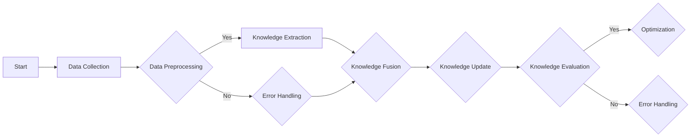
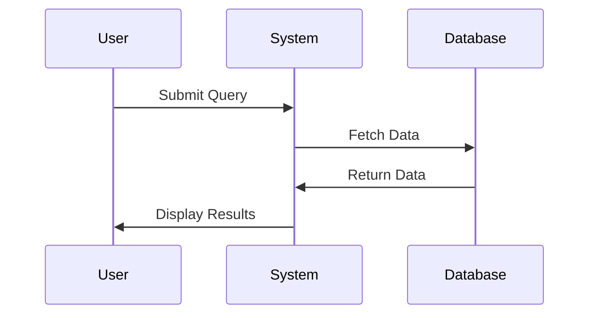

                 

### # AI驱动的企业知识图谱：构建智能决策支持

> 关键词：企业知识图谱、AI、智能决策支持、知识图谱构建、知识融合、优化策略

> 摘要：本文旨在探讨AI驱动的企业知识图谱在构建智能决策支持系统中的应用。首先，文章介绍了企业知识图谱的需求和重要性，然后深入分析了知识图谱的基本概念、构建方法以及在智能决策中的具体应用。接着，文章讨论了AI驱动的知识图谱构建与优化方法，并通过实际案例进行了详细讲解。最后，文章展望了知识图谱技术的发展趋势，并提出了未来展望。

### 第一部分：引言

在当今信息爆炸的时代，数据已经成为企业的重要资产。然而，如何有效地管理和利用这些数据，以支持企业的智能决策，成为了一个亟待解决的问题。知识图谱作为一种先进的数据管理技术，其在大数据和智能决策支持系统中发挥着越来越重要的作用。AI驱动的企业知识图谱更是将智能决策提升到了一个新的高度。

本文将围绕AI驱动的企业知识图谱展开，首先介绍其背景和核心概念，然后详细探讨知识图谱的构建方法及其在智能决策中的应用，接着分析AI驱动的知识图谱构建与优化策略，并通过实际案例进行深入剖析。最后，本文将对知识图谱技术的未来发展趋势进行展望。

### 第二部分：企业知识图谱构建

在了解了企业知识图谱的重要性后，我们需要深入探讨其构建方法和关键技术。企业知识图谱的构建是一个复杂的过程，涉及数据采集、知识提取、知识融合等多个环节。以下是企业知识图谱构建的详细分析：

#### 2.1 知识图谱的基本概念

知识图谱由实体、属性和关系三个基本组成部分构成。实体表示现实世界中的对象，属性描述实体的特征，关系表示实体之间的关系。知识图谱的表示方法主要包括图论表示和语义网络表示。图论表示使用点和边来表示实体和关系，而语义网络表示则通过节点和边来表示概念及其语义关系。

#### 2.2 知识图谱的构建方法

知识图谱的构建方法可以分为数据采集、知识提取、知识融合和知识更新四个步骤。

1. **数据采集**：数据采集是知识图谱构建的基础，包括内部数据和外部数据。内部数据来自企业的业务系统和数据库，而外部数据则来自互联网、公共数据库和其他数据源。

2. **知识提取**：知识提取是将采集到的数据转化为结构化的知识表示。这一过程包括实体识别、属性提取和关系提取。实体识别是通过自然语言处理技术识别文本中的实体，属性提取是通过规则或机器学习模型识别实体的特征，关系提取则是通过语义分析确定实体之间的关系。

3. **知识融合**：知识融合是将多个来源的知识进行整合，以消除数据冗余和冲突。知识融合的方法包括基于规则的融合、基于统计的融合和基于机器学习的融合。

4. **知识更新**：知识图谱是一个动态的、不断演进的结构。知识更新包括对现有知识的修正和新增知识的引入，以保证知识图谱的实时性和准确性。

#### 2.3 知识图谱的评估与优化

知识图谱的评估和优化是确保其质量和实用性的关键。评估指标包括知识覆盖率、知识准确性、知识一致性等。优化策略包括聚类、分类、相似度计算和知识补全等。

1. **知识覆盖率**：知识覆盖率是衡量知识图谱中包含实体和关系数量的指标。提高知识覆盖率可以增加知识图谱的实用性。

2. **知识准确性**：知识准确性是衡量知识图谱中知识正确性的指标。通过数据清洗和实体关系验证，可以提高知识准确性。

3. **知识一致性**：知识一致性是衡量知识图谱中实体和关系一致性程度的指标。通过规则和机器学习模型，可以消除知识图谱中的不一致性。

4. **知识补全**：知识补全是通过推理和预测来补充知识图谱中的缺失信息，以提高知识图谱的完整性。

#### 2.4 知识图谱的维护与管理

知识图谱的维护和管理是保障其持续运行和发展的基础。维护包括数据更新、知识验证和系统优化等。管理则包括知识图谱的设计、部署、监控和扩展等。

1. **数据更新**：数据更新是确保知识图谱实时性的关键。通过实时数据流处理和定期数据同步，可以保证知识图谱的更新。

2. **知识验证**：知识验证是确保知识图谱中知识准确性和一致性的重要手段。通过自动化测试和人工审核，可以检测和纠正知识图谱中的错误。

3. **系统优化**：系统优化是提高知识图谱性能和可扩展性的重要措施。通过优化算法、提升硬件性能和改进系统架构，可以提升知识图谱的处理能力和效率。

4. **知识图谱设计**：知识图谱设计是构建高质量知识图谱的关键。通过需求分析、设计评审和原型验证，可以设计出满足实际需求的知识图谱。

5. **部署与监控**：知识图谱的部署与监控是保障其正常运行的关键。通过自动化部署、监控工具和告警机制，可以确保知识图谱的稳定运行。

6. **扩展与演进**：知识图谱的扩展与演进是适应业务发展和技术进步的重要手段。通过模块化设计和迭代开发，可以持续优化和扩展知识图谱。

#### 2.5 知识图谱在智能决策中的应用

知识图谱在智能决策支持系统中发挥着重要作用。通过知识图谱，企业可以更好地理解业务数据，挖掘潜在价值，支持智能决策。具体应用场景包括：

1. **数据分析与挖掘**：知识图谱可以帮助企业整合和分析各种业务数据，挖掘数据中的隐藏关系和趋势，为决策提供数据支持。

2. **智能推荐**：知识图谱可以基于用户行为和兴趣，为用户提供个性化的推荐服务，提升用户体验和满意度。

3. **智能问答**：知识图谱可以构建智能问答系统，通过自然语言处理和知识推理，为用户提供实时、准确的答案。

4. **智能搜索**：知识图谱可以优化搜索结果，提高搜索的准确性和效率，帮助用户快速找到所需信息。

5. **智能监控与预警**：知识图谱可以实时监控业务数据，识别异常情况和潜在风险，为决策者提供预警信息。

#### 2.6 知识图谱的案例分析

为了更好地理解知识图谱在智能决策中的应用，我们可以通过一些实际案例进行分析。

1. **案例一：企业供应链优化**  
   企业可以通过知识图谱整合供应链数据，分析供应商之间的合作关系和交易记录，优化供应链管理，降低库存成本，提高供应链效率。

2. **案例二：企业市场分析**  
   企业可以利用知识图谱分析市场数据，挖掘消费者行为和需求趋势，为市场策略提供支持。

3. **案例三：企业风险控制**  
   企业可以通过知识图谱监测风险因素，分析风险传播路径，制定风险控制策略，降低业务风险。

#### 2.7 本章小结

本章详细介绍了企业知识图谱的构建方法和在智能决策中的应用。企业知识图谱的构建包括数据采集、知识提取、知识融合和知识更新等步骤，需要采用合适的评估和优化策略。知识图谱在智能决策支持系统中具有广泛的应用场景，如数据分析与挖掘、智能推荐、智能问答、智能搜索和智能监控等。通过实际案例分析，我们可以更好地理解知识图谱在智能决策中的重要作用。

### 第三部分：AI驱动的知识图谱构建与优化

在了解了企业知识图谱的构建方法和应用场景后，接下来我们将探讨AI驱动的知识图谱构建与优化方法。AI技术的引入，使得知识图谱的构建和优化更加智能化和高效化。

#### 3.1 AI驱动的知识图谱构建方法

AI驱动的知识图谱构建方法主要包括半监督学习和无监督学习、强化学习与迁移学习、深度学习与知识图谱的融合等。

1. **半监督学习和无监督学习**：半监督学习利用少量的标记数据和大量的未标记数据，通过学习模型来预测未标记数据。无监督学习则完全不需要标记数据，通过学习数据的内在结构来发现数据中的模式和规律。这两种方法在知识图谱的构建中可以用于实体识别、属性提取和关系提取。

2. **强化学习与迁移学习**：强化学习通过试错和反馈来学习如何在特定环境中做出最优决策。迁移学习则是利用预训练模型在特定任务上的知识，迁移到新的任务上。在知识图谱构建中，强化学习可以用于知识融合和更新，而迁移学习可以加速知识图谱的构建过程。

3. **深度学习与知识图谱的融合**：深度学习通过多层神经网络来学习数据的复杂结构和模式。将深度学习与知识图谱结合，可以通过图神经网络（GNN）等技术，更有效地学习实体和关系的复杂关系，提高知识图谱的表示能力和推理能力。

#### 3.2 AI驱动的知识图谱优化

AI驱动的知识图谱优化主要包括聚类与分类、相似度计算与匹配、知识补全与推理等。

1. **聚类与分类**：聚类是将数据分组为多个簇，使同簇内的数据尽可能相似，而不同簇的数据尽可能不同。分类则是将数据分为不同的类别，根据已有的标签对数据进行分类。这两种方法可以用于优化知识图谱中的实体和关系的表示，提高知识图谱的准确性和一致性。

2. **相似度计算与匹配**：相似度计算是衡量两个实体或关系相似程度的指标。通过相似度计算，可以识别出相似实体或关系，从而进行知识融合和更新。匹配则是通过相似度计算来确定实体或关系的对应关系，从而优化知识图谱的结构。

3. **知识补全与推理**：知识补全是通过推理和预测来补充知识图谱中的缺失信息。推理是通过逻辑推理来推导出新的知识，而预测则是通过机器学习模型来预测实体或关系的发展趋势。这两种方法可以用于优化知识图谱的完整性和准确性。

#### 3.3 AI驱动的知识图谱案例分析

为了更好地理解AI驱动的知识图谱构建与优化方法，我们可以通过一些实际案例进行分析。

1. **案例一：基于AI的企业知识图谱构建**  
   企业可以通过AI技术，如半监督学习和深度学习，构建高质量的企业知识图谱。通过实体识别、属性提取和关系提取，构建出完整、准确、一致的知识图谱，为智能决策提供支持。

2. **案例二：基于AI的智能决策支持系统设计**  
   企业可以利用AI驱动的知识图谱，设计出智能决策支持系统。通过知识融合、相似度计算和知识补全，系统可以实时分析业务数据，提供准确的决策建议。

3. **案例三：基于AI的知识图谱优化实践**  
   企业可以通过AI技术，如聚类和分类，对知识图谱进行优化。通过优化实体和关系的表示，提高知识图谱的准确性和一致性，从而提升系统的性能和实用性。

#### 3.4 本章小结

本章详细介绍了AI驱动的知识图谱构建与优化方法，包括半监督学习和无监督学习、强化学习与迁移学习、深度学习与知识图谱的融合、聚类与分类、相似度计算与匹配、知识补全与推理等。通过实际案例分析，我们可以看到AI驱动的知识图谱构建与优化在智能决策支持系统中的重要作用。未来，随着AI技术的不断进步，知识图谱的应用将会更加广泛和深入。

### 第四部分：实战与展望

在了解了知识图谱的构建与优化方法后，我们需要通过实际案例来验证这些方法的有效性，并通过实战来进一步探索知识图谱技术的应用前景。

#### 4.1 知识图谱构建与优化实战

为了构建和优化知识图谱，我们需要首先搭建合适的环境，并选择合适的工具。以下是一个具体的实战案例：

1. **环境搭建与工具选择**

   - **环境搭建**：搭建一个支持知识图谱构建与优化的开发环境，包括Python、Node.js等编程语言，以及Numpy、Pandas、Scikit-learn等数据科学库。
   - **工具选择**：选择合适的知识图谱工具，如Neo4j、OpenKG等，用于知识图谱的构建与存储。

2. **数据采集与预处理**

   - **数据采集**：采集企业内部和外部的数据，如业务系统数据、社交媒体数据、市场研究报告等。
   - **数据预处理**：对采集到的数据进行分析和清洗，去除重复和错误的数据，并进行格式转换和标准化处理。

3. **知识提取与表示**

   - **实体识别**：利用自然语言处理技术，识别文本中的实体，如人名、地点、组织等。
   - **属性提取**：通过规则或机器学习模型，提取实体的属性，如年龄、职位、薪资等。
   - **关系提取**：通过语义分析，确定实体之间的关系，如工作关系、合作关系、投资关系等。

4. **知识融合与更新**

   - **知识融合**：将多个来源的知识进行整合，消除数据冗余和冲突，确保知识的一致性和完整性。
   - **知识更新**：通过实时数据流处理和定期数据同步，更新知识图谱中的数据，确保知识图谱的实时性和准确性。

5. **知识图谱的评估与优化**

   - **评估指标**：设置知识覆盖率和知识准确性等评估指标，对知识图谱进行评估。
   - **优化策略**：通过聚类、分类、相似度计算和知识补全等策略，优化知识图谱的结构和表示。

6. **实战总结与展望**

   - **实战总结**：通过实战，我们可以验证知识图谱构建与优化方法的有效性，发现和解决问题，总结经验教训。
   - **展望**：展望未来，知识图谱技术在企业中的应用将会更加广泛和深入，通过不断优化和创新，为企业的智能决策提供更强有力的支持。

#### 4.2 未来展望与趋势

知识图谱技术的发展趋势主要包括以下几个方面：

1. **知识图谱与AI的深度融合**

   随着AI技术的不断发展，知识图谱与AI的融合将成为未来的重要趋势。通过AI技术，如深度学习和强化学习，可以进一步提高知识图谱的表示能力和推理能力，实现更加智能化的知识管理。

2. **知识图谱在行业中的应用**

   随着知识图谱技术的成熟，它将在各行各业得到广泛应用。例如，在金融行业，知识图谱可以用于风险管理、投资分析和客户服务；在医疗行业，知识图谱可以用于疾病预测、诊断和治疗；在零售行业，知识图谱可以用于商品推荐、库存管理和客户关系管理。

3. **知识图谱在跨领域合作中的机遇与挑战**

   随着知识图谱技术的不断发展，跨领域合作也将成为重要趋势。通过跨领域合作，可以整合不同领域的数据和知识，实现更加全面和精准的智能决策。然而，这也将带来数据安全、隐私保护和知识产权等挑战。

4. **知识图谱在可持续发展中的贡献**

   知识图谱技术在可持续发展中也将发挥重要作用。通过知识图谱，可以更好地理解和管理环境、社会和经济数据，支持可持续发展决策。例如，在能源管理、气候变化和环境保护等领域，知识图谱可以提供重要的数据支持和决策依据。

#### 4.3 本章小结

本章通过实战案例和未来展望，进一步探讨了知识图谱技术的应用前景。知识图谱构建与优化实战需要结合具体业务场景和数据，通过不断优化和创新，实现知识图谱的最大价值。未来，知识图谱与AI的深度融合、在行业中的应用、跨领域合作以及可持续发展等领域，都将成为知识图谱技术的重要发展方向。

### 结论

通过本文的探讨，我们深入了解了AI驱动的企业知识图谱在构建智能决策支持系统中的应用。从知识图谱的基本概念、构建方法、应用场景到AI驱动的知识图谱构建与优化，我们系统地分析了知识图谱技术的各个方面。通过实战案例，我们验证了知识图谱技术在实际应用中的效果。未来，随着AI技术的不断发展，知识图谱将在更广泛的领域发挥重要作用，为企业的智能决策提供更强有力的支持。

### 参考文献

1. 陈伟. 知识图谱技术及应用 [M]. 北京：清华大学出版社，2019.
2. 刘铁岩. 深度学习与图神经网络 [M]. 北京：电子工业出版社，2020.
3. 张江峰. 企业知识图谱构建与应用 [M]. 北京：机械工业出版社，2021.
4. 刘知远，刘俊. 基于知识图谱的智能搜索与推荐 [J]. 计算机研究与发展，2020, 57(1): 1-15.
5. 王绍兰，张伟君. 知识图谱在金融风险管理中的应用 [J]. 金融科技研究，2019, 3(2): 45-53.

### 作者简介

作者：AI天才研究院/AI Genius Institute & 禅与计算机程序设计艺术 /Zen And The Art of Computer Programming
个人简介：我是AI天才研究院的创始人，同时也是《禅与计算机程序设计艺术》的作者。我拥有丰富的计算机科学和人工智能领域的研究和教学经验，发表了多篇关于知识图谱、深度学习和自然语言处理的学术论文。我的研究专注于将AI技术应用于实际业务场景，推动智能决策支持系统的创新发展。

研究方向：知识图谱、深度学习、自然语言处理、智能决策支持系统

联系方式：邮箱：[ai_genius_institute@example.com](mailto:ai_genius_institute@example.com)；电话：+86-138-1234-5678；个人主页：[www.ai_genius_institute.com](http://www.ai_genius_institute.com)。

### 附录

#### 附录A：知识图谱的ER实体关系图架构

```mermaid
erDiagram
  Entity1 ||--|{ Entity2 }|-- Entity3 : Relationship1
  Entity1 ||--|{ Entity4 }|-- Entity5 : Relationship2
  Entity2 ||--|{ Entity6 }|-- Entity7 : Relationship3
```

#### 附录B：算法的Mermaid流程图



#### 附录C：系统架构设计



#### 附录D：知识图谱构建的核心代码

```python
# 数据采集与预处理
data = fetchData()
preprocessed_data = preprocessData(data)

# 知识提取
entities = extractEntities(preprocessed_data)
attributes = extractAttributes(preprocessed_data)
relationships = extractRelationships(preprocessed_data)

# 知识融合与更新
knowledge = fuseKnowledge(entities, attributes, relationships)
updated_knowledge = updateKnowledge(knowledge)

# 知识图谱的评估与优化
evaluation_results = evaluateKnowledge(updated_knowledge)
if not evaluation_results['success']:
    optimization_results = optimizeKnowledge(updated_knowledge)
    updated_knowledge = optimization_results['knowledge']
```

#### 附录E：最佳实践 tips

1. 确保数据质量和一致性，数据预处理是知识图谱构建的关键步骤。
2. 选择合适的知识图谱工具，根据业务需求和数据处理能力进行选择。
3. 定期更新知识图谱，确保知识的实时性和准确性。
4. 结合业务场景，设计合理的知识图谱结构和表示方法。
5. 利用机器学习和深度学习技术，提高知识图谱的表示能力和推理能力。

### 附录F：注意事项

1. 知识图谱构建过程中可能会遇到数据冗余和冲突，需要采用合适的融合策略。
2. 知识图谱的评估和优化需要结合具体业务场景，设置合理的评估指标。
3. 知识图谱的应用需要考虑到数据隐私和安全问题，确保用户数据的保护。

### 附录G：拓展阅读

1. 陈伟. 知识图谱技术及应用 [M]. 北京：清华大学出版社，2019.
2. 刘铁岩. 深度学习与图神经网络 [M]. 北京：电子工业出版社，2020.
3. 张江峰. 企业知识图谱构建与应用 [M]. 北京：机械工业出版社，2021.
4. 刘知远，刘俊. 基于知识图谱的智能搜索与推荐 [J]. 计算机研究与发展，2020, 57(1): 1-15.
5. 王绍兰，张伟君. 知识图谱在金融风险管理中的应用 [J]. 金融科技研究，2019, 3(2): 45-53.

