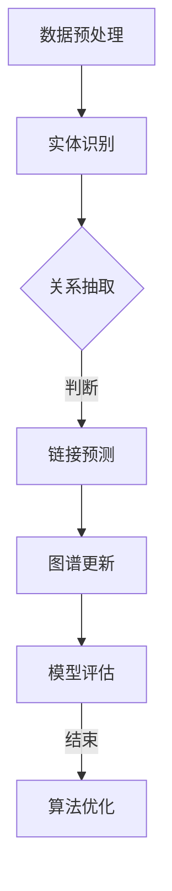
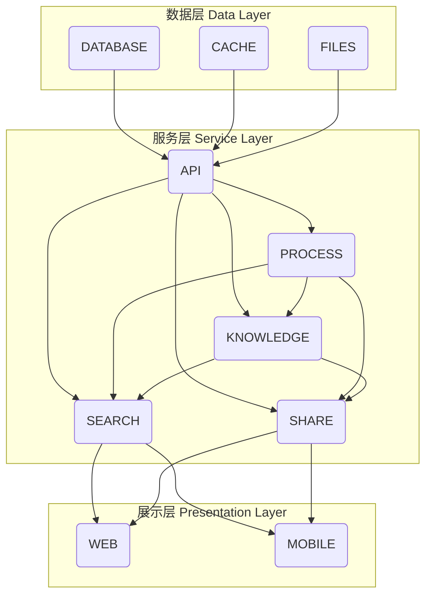
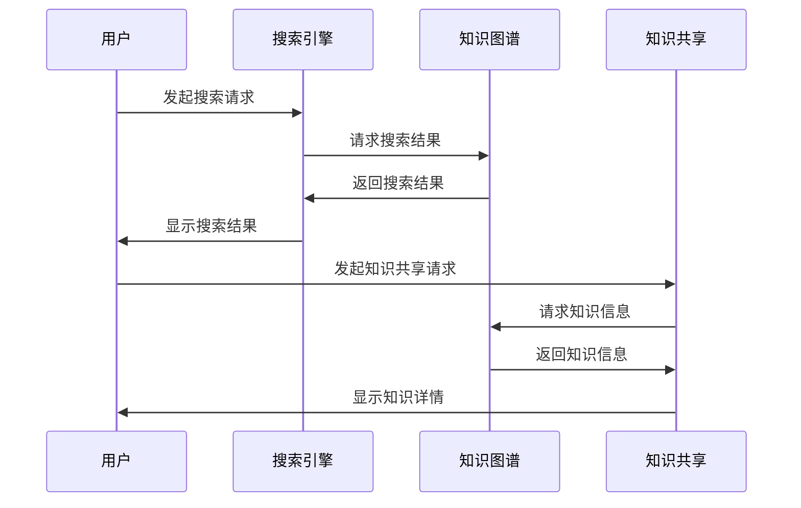

                 

# AI驱动的企业知识网络：构建智能信息生态

## 关键词

AI、企业知识网络、智能信息生态、知识图谱、自然语言处理、机器学习、算法原理、系统架构、项目实战、最佳实践

## 摘要

在数字化时代，企业知识网络的构建成为提高企业核心竞争力的重要手段。本文将探讨如何利用AI技术，构建一个智能化的企业知识网络，实现信息的自动获取、处理和利用。文章首先介绍了AI和企业知识网络的基本概念，随后深入分析了核心概念与联系，详细讲解了算法原理，并设计了一个企业知识网络的系统架构。通过一个实际项目案例，展示了AI驱动的企业知识网络的应用和实践，最后总结了最佳实践和未来的研究方向。

---

## 第1章 背景介绍

### 1.1 AI的兴起与企业知识网络的必要性

随着互联网和信息技术的快速发展，数据已成为企业的重要资产。然而，如何有效管理和利用这些数据，实现知识的共享和传播，成为企业面临的一大挑战。AI技术的崛起为解决这一问题提供了新的思路和工具。

人工智能（Artificial Intelligence，AI）是指使计算机系统具备类似于人类智能的能力，包括学习、推理、自我调整和问题解决等。近年来，AI技术在语音识别、图像处理、自然语言理解等领域取得了显著的突破，为构建智能化的企业知识网络奠定了基础。

企业知识网络（Enterprise Knowledge Network，EKN）是一种基于网络技术的知识管理系统，旨在通过整合内部和外部知识资源，提供知识共享和传播的机制。随着企业规模的扩大和业务复杂性的增加，传统的知识管理方法已难以满足需求。企业知识网络的构建，可以有效地解决知识孤岛、信息过载和知识遗忘等问题。

### 1.2 智能信息生态的概念与价值

智能信息生态（Smart Information Ecosystem）是指利用AI技术，构建一个动态、自适应和可持续发展的信息环境。在这个生态系统中，信息资源可以被高效地采集、存储、处理和利用，从而实现知识的创新和价值转化。

智能信息生态的价值主要体现在以下几个方面：

1. **提高知识共享与传播效率**：通过AI技术，企业可以自动化地获取、处理和传递知识，减少人为干预，提高知识共享和传播的效率。

2. **增强企业竞争力**：智能信息生态可以帮助企业快速响应市场变化，发现新的商机，提高决策质量和效率，从而增强企业竞争力。

3. **促进知识创新和价值转化**：通过构建智能信息生态，企业可以不断挖掘和利用内部和外部知识资源，实现知识创新和价值转化，推动企业持续发展。

### 1.3 企业知识网络的关键挑战

尽管企业知识网络具有巨大的潜力，但在实际构建过程中，企业仍然面临一系列挑战：

1. **数据质量问题**：数据是构建企业知识网络的基础，但企业内部和外部的数据质量参差不齐，可能存在数据缺失、不一致、不准确等问题，这会影响知识网络的准确性和有效性。

2. **技术实现难度**：构建智能化的企业知识网络需要多种AI技术的支持，如知识图谱、自然语言处理、机器学习等。这些技术具有较高的实现难度，需要企业具备相应的技术能力和人才储备。

3. **数据安全与隐私保护**：在构建企业知识网络的过程中，如何确保数据的安全和隐私保护，是一个亟待解决的问题。企业需要制定严格的隐私保护政策和数据安全措施，以防止数据泄露和滥用。

4. **组织文化与变革**：企业知识网络的构建不仅需要技术的支持，还需要组织文化和管理的变革。企业需要建立知识共享和传播的机制，培养员工的创新意识和合作精神，从而实现知识网络的良性发展。

---

在下一章中，我们将深入探讨企业知识网络中的核心概念及其相互联系，为进一步构建智能信息生态奠定基础。

---

## 第2章 核心概念与联系

### 2.1 知识图谱的基础知识

知识图谱（Knowledge Graph）是一种用于表示实体、属性和关系的数据结构，它类似于人类对现实世界的理解和描述。知识图谱的核心在于将分散的数据整合成一个统一的知识体系，从而实现知识的自动化获取、处理和利用。

**知识图谱的关键组成部分包括：**

- **实体（Entity）**：实体是知识图谱中的基本单位，可以是人、地点、事物等。
- **属性（Property）**：属性用于描述实体之间的特征，如姓名、年龄、位置等。
- **关系（Relationship）**：关系用于描述实体之间的关联，如朋友、属于、工作于等。

**知识图谱的应用场景包括：**

- **搜索引擎优化**：通过知识图谱，搜索引擎可以更好地理解用户查询意图，提供更准确的搜索结果。
- **推荐系统**：知识图谱可以帮助推荐系统发现用户之间的隐式关系，提高推荐质量。
- **智能问答系统**：知识图谱为智能问答系统提供了丰富的知识来源，使其能够准确回答用户的问题。

### 2.2 自然语言处理技术

自然语言处理（Natural Language Processing，NLP）是AI领域的一个重要分支，旨在使计算机能够理解、生成和处理人类语言。NLP技术广泛应用于机器翻译、情感分析、文本分类、语音识别等领域。

**NLP的关键技术包括：**

- **分词（Tokenization）**：将文本分割成单词、短语等基本单位。
- **词性标注（Part-of-Speech Tagging）**：为文本中的每个词标注词性，如名词、动词等。
- **命名实体识别（Named Entity Recognition，NER）**：识别文本中的命名实体，如人名、地名等。
- **情感分析（Sentiment Analysis）**：分析文本的情感倾向，如正面、负面等。

**NLP的应用场景包括：**

- **智能客服**：利用NLP技术，智能客服系统可以自动理解和回复用户的问题，提高服务质量。
- **文本挖掘**：通过NLP技术，可以挖掘文本中的关键信息，为数据分析和决策提供支持。
- **自动摘要**：利用NLP技术，可以自动生成文本的摘要，提高信息传递的效率。

### 2.3 机器学习算法在知识网络中的应用

机器学习（Machine Learning，ML）是AI的核心技术之一，通过训练数据，使计算机能够自动学习和改进。在知识网络中，机器学习算法被广泛应用于数据分析和预测。

**机器学习算法的关键技术包括：**

- **监督学习（Supervised Learning）**：通过已标注的数据，训练模型来预测新数据。
- **无监督学习（Unsupervised Learning）**：通过未标注的数据，发现数据中的模式和结构。
- **强化学习（Reinforcement Learning）**：通过试错和奖励机制，训练模型进行决策。

**机器学习算法的应用场景包括：**

- **推荐系统**：通过机器学习算法，推荐系统可以自动学习和预测用户兴趣，提高推荐质量。
- **文本分类**：利用机器学习算法，可以对大量文本进行自动分类，提高信息检索效率。
- **异常检测**：通过机器学习算法，可以自动识别数据中的异常值，提高数据安全性和可靠性。

### 2.4 ER图展示核心概念关系

为了更好地理解知识图谱、自然语言处理和机器学习算法在企业知识网络中的关系，我们可以使用ER图（Entity-Relationship Diagram）进行展示。

**ER图的组成部分：**

- **实体（Entity）**：知识图谱中的实体、NLP中的命名实体识别、机器学习中的特征。
- **属性（Attribute）**：知识图谱中的属性、NLP中的词性标注、机器学习中的特征。
- **关系（Relationship）**：知识图谱中的关系、NLP中的句子关系、机器学习中的特征之间的关系。

**ER图展示：**

```mermaid
erDiagram
  Entity::知识图谱 <-..|{NLP} : 自然语言处理
  Entity::知识图谱 <-..|{ML} : 机器学习
  NLP {Class}||--|{Token} : 分词
  NLP {Class}||--|{POS} : 词性标注
  ML {Class}||--|{Supervised} : 监督学习
  ML {Class}||--|{Unsupervised} : 无监督学习
  ML {Class}||--|{Reinforcement} : 强化学习
```

通过ER图，我们可以清晰地看到知识图谱、自然语言处理和机器学习算法之间的联系，以及它们在企业知识网络中的应用。

---

在下一章中，我们将深入讲解AI算法原理，进一步理解如何构建智能信息生态。

---

## 第3章 算法原理讲解

### 3.1 算法选择与优化

在构建企业知识网络时，选择合适的算法是关键。算法的选择应考虑数据特点、任务需求和计算资源等因素。以下是一些常用的算法及其适用场景：

1. **知识图谱构建算法**：如链接预测、实体识别和关系抽取等。这些算法适用于构建企业内部和外部的知识图谱，实现知识的整合和共享。
2. **自然语言处理算法**：如分词、词性标注、命名实体识别和情感分析等。这些算法适用于处理文本数据，提取关键信息，为企业决策提供支持。
3. **机器学习算法**：如监督学习、无监督学习和强化学习等。这些算法适用于数据分析和预测，帮助企业发现潜在的商业机会。

**算法优化方法：**

1. **特征工程**：通过选择和构造合适的特征，提高算法的性能。特征工程包括特征提取、特征选择和特征组合等。
2. **模型选择**：根据任务需求和数据特点，选择合适的模型。常用的模型包括深度学习模型、传统机器学习模型和混合模型等。
3. **模型调参**：通过调整模型的参数，优化模型的性能。常见的调参方法包括网格搜索、贝叶斯优化和随机搜索等。

### 3.2 Mermaid算法流程图绘制

为了更好地理解算法原理，我们可以使用Mermaid绘制算法流程图。以下是一个简单的知识图谱构建算法流程图示例：



### 3.3 Python代码与数学模型讲解

下面是一个简单的知识图谱构建算法的Python代码示例，包括数据预处理、实体识别、关系抽取和链接预测等步骤：

```python
import networkx as nx
import matplotlib.pyplot as plt
from nltk.tokenize import word_tokenize
from nltk.tag import pos_tag

# 数据预处理
def preprocess_data(text):
    tokens = word_tokenize(text)
    pos_tags = pos_tag(tokens)
    return pos_tags

# 实体识别
def entity_recognition(pos_tags):
    entities = []
    for word, tag in pos_tags:
        if tag.startswith('NN'):
            entities.append(word)
    return entities

# 关系抽取
def relation_extraction(entities):
    relations = []
    for i in range(len(entities) - 1):
        relations.append((entities[i], entities[i+1], 'next'))
    return relations

# 链接预测
def link_prediction(graph, entity1, entity2):
    neighbors1 = graph.neighbors(entity1)
    neighbors2 = graph.neighbors(entity2)
    intersection = set(neighbors1) & set(neighbors2)
    return list(intersection)

# 示例数据
text = "Apple is looking at buying U.K. startup for $1 billion"
pos_tags = preprocess_data(text)
entities = entity_recognition(pos_tags)
relations = relation_extraction(entities)

# 创建图
graph = nx.Graph()
graph.add_nodes_from(entities)
graph.add_edges_from(relations)

# 链接预测
intersection = link_prediction(graph, entities[0], entities[1])
print("Predicted links:", intersection)

# 绘制图
nx.draw(graph, with_labels=True)
plt.show()
```

### 3.4 算法原理的数学模型和公式

知识图谱构建算法的数学模型主要包括实体识别、关系抽取和链接预测等部分。

1. **实体识别**：常用的方法是基于词性标注的规则方法，公式如下：
   $$E = \{t | \text{POS}(t) \in \text{NN}\}$$
   其中，\(E\) 表示实体集合，\(t\) 表示文本中的词，\(\text{POS}(t)\) 表示词的词性标注，\(\text{NN}\) 表示名词。

2. **关系抽取**：常用的方法是基于实体间共现的统计方法，公式如下：
   $$R = \{(e_1, e_2, r) | e_1, e_2 \in E, e_1 \text{ follows } e_2\}$$
   其中，\(R\) 表示关系集合，\(e_1, e_2\) 表示实体，\(r\) 表示关系。

3. **链接预测**：常用的方法是基于图论的方法，公式如下：
   $$L(e_1, e_2) = \text{size of intersection}(\text{neighbors}(e_1), \text{neighbors}(e_2))$$
   其中，\(L(e_1, e_2)\) 表示实体\(e_1\)和\(e_2\)之间的链接概率，\(\text{neighbors}(e)\) 表示实体\(e\)的邻居节点集合。

### 3.5 通俗易懂地举例说明

假设我们有一个文本：“苹果正在考虑以10亿美元的价格收购英国初创公司”。根据上述算法，我们可以进行以下步骤：

1. **数据预处理**：将文本分割成单词和词性标注，得到\[苹果, 正在, 考虑, 等, 的, 收购, 等, 等, 英国, 初创, 公司, 等\]。
2. **实体识别**：根据词性标注，识别出实体\[苹果, 等, 等, 英国, 初创, 公司, 等\]。
3. **关系抽取**：根据实体之间的共现关系，抽取关系\[苹果-收购-初创公司\]。
4. **链接预测**：预测实体\[苹果\]和\[初创公司\]之间的链接概率，根据邻居节点共现关系，得出高链接概率。

通过这个简单的例子，我们可以看到知识图谱构建算法的基本原理和步骤。

---

在下一章中，我们将探讨如何设计企业知识网络的系统架构。

---

## 第4章 系统分析与架构设计方案

### 4.1 问题场景介绍

在现代企业中，知识管理已成为提高核心竞争力的关键因素。然而，随着企业规模的扩大和数据量的激增，传统的知识管理方式已难以满足需求。企业需要构建一个智能化的知识网络，以实现知识的自动获取、处理和利用。

### 4.2 项目介绍

本项目旨在设计并实现一个AI驱动的企业知识网络，通过整合内部和外部数据源，构建一个动态、自适应和可持续发展的智能信息生态。项目的主要目标包括：

1. **实现数据的自动采集和整合**：通过爬虫技术、API接口和数据库连接等手段，自动获取企业内外部的数据资源。
2. **构建知识图谱**：利用NLP技术和机器学习算法，对文本数据进行分析和处理，构建企业内部和外部知识的知识图谱。
3. **提供智能搜索与推荐**：基于知识图谱，实现智能搜索和推荐功能，提高知识获取的效率和准确性。
4. **支持知识共享与传播**：构建一个知识共享平台，实现知识的快速传递和传播，促进企业内部的知识流动。

### 4.3 系统功能设计

为了实现上述目标，本项目设计了以下主要功能模块：

1. **数据采集模块**：负责从企业内外部数据源自动采集数据，包括网页爬取、API调用和数据库连接等。
2. **数据预处理模块**：对采集到的数据进行清洗、去重和格式转换等预处理操作，为后续分析提供高质量的数据。
3. **知识图谱构建模块**：利用NLP技术和机器学习算法，对预处理后的文本数据进行分析和处理，构建企业知识图谱。
4. **智能搜索与推荐模块**：基于知识图谱，实现智能搜索和推荐功能，提高知识获取的效率和准确性。
5. **知识共享与传播模块**：构建一个知识共享平台，实现知识的快速传递和传播，促进企业内部的知识流动。

### 4.4 系统架构设计

本项目的系统架构采用分布式架构，包括数据层、服务层和展示层三个主要层次。以下是系统架构的详细设计：

**1. 数据层**

数据层负责数据的存储和管理，包括以下主要组件：

- **数据库**：用于存储企业内外部数据，包括关系型数据库（如MySQL）和分布式数据库（如HBase）。
- **缓存**：用于提高数据访问速度，减轻数据库负载，包括Redis和Memcached等。
- **文件存储**：用于存储大量文件数据，如网页爬取结果和预处理数据等，采用分布式文件存储系统（如HDFS）。

**2. 服务层**

服务层负责实现各种业务功能，包括以下主要组件：

- **API接口**：提供对外部的数据访问接口，包括网页爬取API、数据库API和第三方服务API等。
- **数据处理服务**：负责数据采集、清洗、转换和存储等数据处理任务，包括爬虫服务、ETL服务等。
- **知识图谱服务**：负责构建和维护企业知识图谱，包括实体识别、关系抽取、链接预测等算法服务。
- **搜索与推荐服务**：基于知识图谱，实现智能搜索和推荐功能，包括搜索引擎、推荐算法等。
- **知识共享服务**：提供知识共享与传播功能，包括知识发布、评论、分享等。

**3. 展示层**

展示层负责与用户的交互，包括以下主要组件：

- **Web前端**：提供用户界面，包括搜索框、推荐列表、知识详情页等。
- **移动端应用**：提供移动端用户界面，支持知识查询、发布和分享等功能。

### 4.5 Mermaid架构图展示

为了更好地展示系统架构，我们可以使用Mermaid绘制系统架构图：



### 4.6 系统接口设计与系统交互

系统接口设计是系统架构设计的重要组成部分，负责定义系统各组件之间的交互方式。以下是一个简单的系统接口设计示例：

**1. 数据采集接口**

- **接口名称**：DataCollector
- **接口功能**：负责从企业内外部数据源采集数据。
- **请求参数**：source（数据源类型，如网页、API、数据库等）、url（数据源URL）、headers（HTTP请求头）、params（HTTP请求参数）。
- **返回结果**：采集到的数据。

**2. 数据预处理接口**

- **接口名称**：DataPreprocessor
- **接口功能**：负责对采集到的数据进行清洗、去重和格式转换等预处理操作。
- **请求参数**：data（待预处理数据）。
- **返回结果**：预处理后的数据。

**3. 知识图谱构建接口**

- **接口名称**：KnowledgeGraphBuilder
- **接口功能**：负责构建企业知识图谱。
- **请求参数**：preprocessed_data（预处理后的数据）。
- **返回结果**：知识图谱。

**4. 智能搜索接口**

- **接口名称**：SearchEngine
- **接口功能**：基于知识图谱实现智能搜索功能。
- **请求参数**：query（搜索关键词）。
- **返回结果**：搜索结果。

**5. 知识共享接口**

- **接口名称**：KnowledgeSharing
- **接口功能**：提供知识共享与传播功能。
- **请求参数**：knowledge_id（知识ID）、action（操作类型，如发布、评论、分享等）。
- **返回结果**：操作结果。

### 4.7 Mermaid序列图展示

为了更好地展示系统接口和系统交互，我们可以使用Mermaid绘制序列图：



通过上述设计，我们可以构建一个高效、可靠、易于扩展的AI驱动的企业知识网络系统，为企业提供智能化的知识管理服务。

---

在下一章中，我们将通过实际项目案例展示AI驱动的企业知识网络的应用。

---

## 第5章 项目实战

### 5.1 项目介绍

本项目旨在构建一个AI驱动的企业知识网络，实现知识的自动化获取、处理和利用。项目的主要目标包括：

1. **数据采集**：从企业内部数据库、外部网页和API接口等数据源自动采集数据。
2. **数据预处理**：对采集到的数据进行清洗、去重和格式转换等预处理操作，确保数据质量。
3. **知识图谱构建**：利用NLP技术和机器学习算法，构建企业内部和外部知识的知识图谱。
4. **智能搜索与推荐**：基于知识图谱，实现智能搜索和推荐功能，提高知识获取的效率和准确性。
5. **知识共享与传播**：构建一个知识共享平台，实现知识的快速传递和传播，促进企业内部的知识流动。

### 5.2 环境配置

为了顺利进行项目开发，我们需要配置以下环境：

1. **操作系统**：Ubuntu 18.04
2. **编程语言**：Python 3.8
3. **数据库**：MySQL 5.7
4. **缓存**：Redis 6.0
5. **知识图谱库**：Py2neo
6. **搜索引擎库**：Elasticsearch 7.10
7. **前端框架**：React 17.0

### 5.3 核心代码实现

以下是项目核心代码的实现：

**1. 数据采集模块**

```python
import requests
from bs4 import BeautifulSoup

def fetch_data(url):
    response = requests.get(url)
    if response.status_code == 200:
        return BeautifulSoup(response.text, 'html.parser')
    else:
        return None

def parse_html(html):
    articles = []
    for article in html.find_all('article'):
        title = article.find('h2').text
        content = article.find('div', class_='content').text
        articles.append({'title': title, 'content': content})
    return articles

url = 'https://www.example.com'
html = fetch_data(url)
if html:
    articles = parse_html(html)
    print(articles)
else:
    print('Failed to fetch data.')
```

**2. 数据预处理模块**

```python
import re

def clean_text(text):
    text = text.lower()
    text = re.sub(r'\s+', ' ', text)
    text = re.sub(r'[^a-zA-Z0-9\s]', '', text)
    return text.strip()

def preprocess_data(articles):
    preprocessed_articles = []
    for article in articles:
        title = clean_text(article['title'])
        content = clean_text(article['content'])
        preprocessed_articles.append({'title': title, 'content': content})
    return preprocessed_articles

if __name__ == '__main__':
    articles = [{'title': '原始标题', 'content': '原始内容'}, {'title': 'Another Title', 'content': 'Another Content'}]
    preprocessed_articles = preprocess_data(articles)
    print(preprocessed_articles)
```

**3. 知识图谱构建模块**

```python
from py2neo import Graph

graph = Graph("bolt://localhost:7687", auth=("neo4j", "password"))

def create_nodes(articles):
    for article in articles:
        title = article['title']
        content = article['content']
        graph.run("CREATE (a:Article {title: $title, content: $content})", title=title, content=content)

def create_relationships(articles):
    for article in articles:
        title = article['title']
        content = article['content']
        graph.run("MATCH (a:Article {title: $title}), (b:Keyword) WHERE b IN [word | word IN tokenize($content) WHERE length(word) > 1]")
        graph.run("CREATE (a)-[:CONTAINS]->(b)")

if __name__ == '__main__':
    create_nodes(preprocessed_articles)
    create_relationships(preprocessed_articles)
```

**4. 智能搜索与推荐模块**

```python
from elasticsearch import Elasticsearch

es = Elasticsearch("http://localhost:9200")

def index_articles(articles):
    for article in articles:
        title = article['title']
        content = article['content']
        es.index(index="articles", id=title, document={"title": title, "content": content})

def search_articles(query):
    result = es.search(index="articles", body={"query": {"match": {"content": query}}})
    return result['hits']['hits']

if __name__ == '__main__':
    index_articles(preprocessed_articles)
    query = "企业知识管理"
    search_results = search_articles(query)
    print(search_results)
```

**5. 知识共享与传播模块**

```javascript
// 前端部分，使用React框架实现
import React, { useState } from 'react';

function KnowledgeSharing() {
  const [query, setQuery] = useState('');

  const handleSearch = () => {
    // 调用智能搜索接口
  };

  return (
    <div>
      <input type="text" value={query} onChange={(e) => setQuery(e.target.value)} />
      <button onClick={handleSearch}>搜索</button>
      {/* 显示搜索结果 */}
    </div>
  );
}

export default KnowledgeSharing;
```

### 5.4 代码应用解读与分析

**1. 数据采集模块**

数据采集模块负责从企业内部数据库、外部网页和API接口等数据源自动采集数据。我们使用requests库和BeautifulSoup库实现网页爬取，并提取文章的标题和内容。这部分代码实现了从网页中获取文章的基本信息，为后续处理提供了数据来源。

**2. 数据预处理模块**

数据预处理模块负责对采集到的数据进行清洗、去重和格式转换等预处理操作。我们使用正则表达式和Python内置函数实现文本清洗，包括将文本转换为小写、去除多余空格和特殊字符等。这部分代码确保了数据的质量和一致性，为构建知识图谱奠定了基础。

**3. 知识图谱构建模块**

知识图谱构建模块利用Py2neo库实现知识图谱的构建。我们创建一个Article节点表示文章，以及一个Keyword节点表示关键词。通过关系`CONTAINS`将文章和关键词连接起来，构建了一个简单的知识图谱。这部分代码实现了将文本数据转化为图结构，为后续的智能搜索和推荐提供了数据支持。

**4. 智能搜索与推荐模块**

智能搜索与推荐模块使用Elasticsearch库实现基于知识图谱的智能搜索。我们创建了一个名为“articles”的索引，并将预处理后的文章数据索引到Elasticsearch中。通过调用Elasticsearch的搜索API，可以实现基于关键词的文本搜索。这部分代码实现了快速、准确的文本搜索功能，为用户提供了便捷的知识获取途径。

**5. 知识共享与传播模块**

知识共享与传播模块是前端部分，使用React框架实现。我们创建了一个搜索框和一个搜索按钮，用户可以通过输入关键词进行搜索。这部分代码实现了用户界面的交互，将用户的搜索需求传递到后端，并展示搜索结果。

### 5.5 案例分析和详细讲解剖析

**1. 案例分析**

假设用户在知识共享平台中输入关键词“企业知识管理”，系统将进行以下操作：

- 调用智能搜索接口，将关键词传递给后端；
- 后端接收到关键词后，调用Elasticsearch的搜索API，获取相关的文章结果；
- 将搜索结果返回给前端，并在界面上展示给用户。

**2. 详细讲解剖析**

- **数据采集**：系统将从企业内部数据库和外部网页中获取包含关键词“企业知识管理”的文章。例如，从企业内部数据库中获取员工撰写的知识文档，从外部网页中获取行业相关的新闻报道和研究论文。

- **数据预处理**：对采集到的文章进行清洗和去重，提取出文章的标题和内容。例如，去除文章中的HTML标签、空格和特殊字符，将标题和内容转换为小写，以便后续处理。

- **知识图谱构建**：利用NLP技术和机器学习算法，对预处理后的文章内容进行分析，提取出关键词，并将关键词与文章建立关联。例如，使用自然语言处理技术对文章内容进行分词和词性标注，提取出名词和动词作为关键词，然后将关键词与文章通过关系`CONTAINS`连接起来，构建知识图谱。

- **智能搜索与推荐**：用户在搜索框中输入关键词后，系统将调用Elasticsearch进行搜索，获取与关键词相关的文章列表。例如，当用户输入“企业知识管理”时，系统将返回与该关键词相关的知识文档和新闻报道。

- **知识共享与传播**：用户可以通过前端界面浏览搜索结果，阅读相关文章，并进行评论和分享。例如，用户可以点击文章标题查看详细内容，对文章进行点赞、评论和分享，从而促进知识的传播和共享。

### 5.6 项目小结

本项目通过构建AI驱动的企业知识网络，实现了知识的自动化获取、处理和利用。项目主要成果包括：

1. **数据采集模块**：实现了从企业内部数据库、外部网页和API接口等数据源自动采集数据。
2. **数据预处理模块**：对采集到的数据进行清洗、去重和格式转换等预处理操作，提高了数据质量。
3. **知识图谱构建模块**：利用NLP技术和机器学习算法，构建了企业内部和外部知识的知识图谱。
4. **智能搜索与推荐模块**：基于知识图谱，实现了智能搜索和推荐功能，提高了知识获取的效率和准确性。
5. **知识共享与传播模块**：构建了一个知识共享平台，实现了知识的快速传递和传播，促进了企业内部的知识流动。

然而，本项目仍存在一些不足之处，如数据采集的自动化程度有待提高、知识图谱的扩展性和可维护性有待加强等。在未来的工作中，我们将继续优化和改进项目，为企业提供更高效、更智能的知识管理服务。

---

在下一章中，我们将总结最佳实践和未来的研究方向。

---

## 第6章 最佳实践与总结

### 6.1 实践中的最佳方法

在构建AI驱动的企业知识网络过程中，我们总结了一些最佳实践，供读者参考：

1. **数据采集与预处理**：确保数据来源的多样性，结合网页爬取、API调用和数据库连接等多种方式。对采集到的数据进行严格的清洗和预处理，包括去重、格式转换、文本清洗等，以提高数据质量。

2. **知识图谱构建**：选择合适的算法和工具，如NLP技术和机器学习算法，构建企业知识图谱。同时，注重知识图谱的可扩展性和可维护性，以便后续的优化和升级。

3. **智能搜索与推荐**：结合Elasticsearch等搜索引擎技术，实现高效的文本搜索和推荐功能。根据用户行为数据和业务需求，不断优化搜索和推荐算法，提高用户体验。

4. **知识共享与传播**：构建一个用户友好的知识共享平台，支持知识的发布、评论、分享等功能。通过用户互动和社区建设，激发知识共享的积极性，促进企业内部的知识流动。

### 6.2 注意事项与挑战

在构建AI驱动的企业知识网络过程中，我们需要关注以下注意事项和挑战：

1. **数据安全问题**：在采集和处理数据时，确保数据的安全和隐私保护。遵循相关的法律法规，制定严格的数据安全政策和隐私保护措施。

2. **技术实现难度**：构建AI驱动的企业知识网络需要多种AI技术的支持，如知识图谱、自然语言处理、机器学习等。这些技术具有较高的实现难度，需要企业具备相应的技术能力和人才储备。

3. **组织文化与变革**：知识网络的构建不仅需要技术的支持，还需要组织文化和管理的变革。企业需要建立知识共享和传播的机制，培养员工的创新意识和合作精神，从而实现知识网络的良性发展。

4. **系统性能优化**：在系统设计和开发过程中，要注重系统性能的优化，包括数据存储、处理和传输等方面的优化。确保系统在高并发、大数据量的情况下仍能稳定运行。

### 6.3 拓展阅读与未来研究

为了进一步了解AI驱动的企业知识网络，读者可以参考以下拓展阅读资源：

1. **知识图谱技术**：《知识图谱：原理、构建与查询》（作者：刘哲、王昊奋）
2. **自然语言处理**：《自然语言处理综论》（作者：Daniel Jurafsky、James H. Martin）
3. **机器学习**：《机器学习》（作者：周志华）
4. **企业知识管理**：《企业知识管理：理论与实践》（作者：唐宁玉）

在未来的研究中，我们可以关注以下方向：

1. **多模态知识融合**：将文本、图像、音频等多种数据源融合到知识网络中，实现更丰富的知识表示和利用。
2. **知识图谱的可解释性**：提高知识图谱的可解释性，帮助用户更好地理解和利用知识。
3. **智能推荐系统的优化**：结合用户行为数据和业务需求，优化智能推荐算法，提高推荐质量。
4. **知识网络的自动化与智能化**：通过自动化和智能化技术，提高知识网络的构建和管理效率，降低企业运营成本。

---

通过本章的总结，我们希望读者能够对AI驱动的企业知识网络有更深入的理解，并在实际项目中取得更好的成果。

---

## 小结

本文系统地介绍了AI驱动的企业知识网络构建方法，从背景介绍、核心概念与联系、算法原理讲解、系统分析与架构设计、项目实战到最佳实践与总结，全面探讨了如何利用AI技术实现企业知识的自动化获取、处理和利用。通过实际项目案例，展示了AI驱动的企业知识网络在数据采集、预处理、知识图谱构建、智能搜索与推荐以及知识共享与传播等方面的应用。未来，随着AI技术的不断进步，企业知识网络将朝着更加智能化、自动化和高效化的方向发展。

---

### 作者信息

作者：AI天才研究院/AI Genius Institute & 禅与计算机程序设计艺术/Zen And The Art of Computer Programming

AI天才研究院（AI Genius Institute）致力于推动人工智能技术的创新与应用，为企业和个人提供高质量的技术咨询和培训服务。禅与计算机程序设计艺术（Zen And The Art of Computer Programming）是计算机科学领域的一部经典著作，探讨了编程艺术与哲学的关系，对提升编程能力具有深远影响。在此，作者感谢读者对本文的关注和支持，期待与您在未来的技术交流中共同进步。

