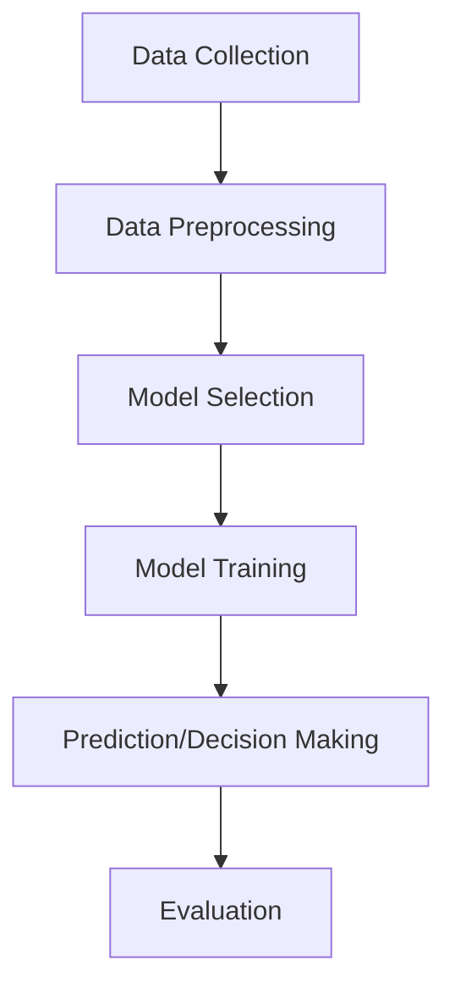
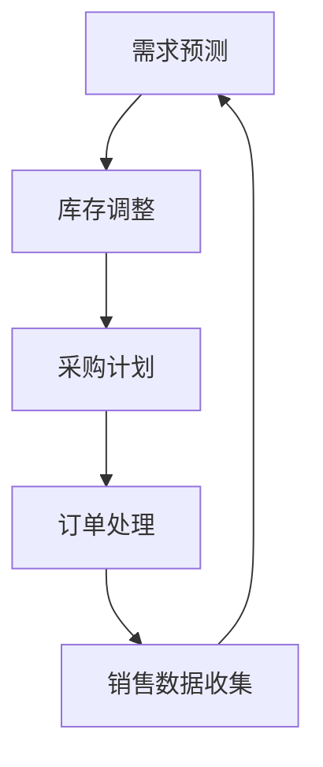

                 


### 文章标题：AI驱动的供应链优化：提升企业运营效率

#### 关键词：人工智能、供应链优化、运营效率、机器学习、决策支持系统

#### 摘要：
在全球化经济环境中，企业竞争愈发激烈，优化供应链管理已成为企业提升运营效率和降低成本的关键。本文将深入探讨如何运用人工智能（AI）技术，特别是机器学习算法，实现供应链的智能化优化。通过分析核心概念、技术原理、实际案例，本文旨在为供应链管理者提供实用的指导，帮助企业实现高效、智能的供应链管理。

---

## 引言

### 1. 背景

随着信息技术的发展和大数据的普及，人工智能（AI）技术逐渐成为现代供应链管理的核心工具。AI驱动的供应链优化通过自动化和智能化手段，提高了供应链各环节的协同效率和响应速度，降低了运营成本。

### 2. 供应链管理的问题

当前，供应链管理面临的问题主要包括库存管理不合理、运输成本高、供应链协同性差等。这些问题严重影响了企业的运营效率和市场竞争力。

### 3. 人工智能的重要性

人工智能通过机器学习、深度学习等技术，能够对大量数据进行智能分析，提供精准的预测和优化建议，从而提高供应链的决策质量。

### 4. 文章结构

本文将首先介绍AI和供应链管理的基本概念，然后分析AI在供应链优化中的应用，接着通过实际案例展示AI技术的应用效果，最后探讨AI驱动的供应链优化面临的挑战和未来趋势。

---

## 核心概念与原理

### 1. 人工智能的基本概念

人工智能是指通过计算机模拟人类智能的技术，包括机器学习、深度学习、自然语言处理等。

### 2. 供应链管理的基本概念

供应链管理涉及原材料采购、生产计划、库存控制、物流配送等环节。其目标是最大化供应链的效率和效益。

### 3. AI与供应链优化的结合

AI通过优化算法和数据分析，能够实现对供应链各环节的精细化管理，提高供应链的灵活性和响应速度。

### 4. 关键AI技术

- **机器学习**：通过训练模型，实现对数据的高效分析和预测。
- **深度学习**：模拟人脑神经网络，处理复杂的数据和模式。
- **自然语言处理**：理解和生成人类语言，用于供应链信息的智能化处理。

### 5. AI技术的应用场景

- **库存管理**：预测需求，优化库存水平。
- **运输规划**：优化运输路线，降低物流成本。
- **生产计划**：根据市场需求，优化生产计划和排程。

---

## 机器学习算法在供应链优化中的应用

### 1. 机器学习的基本概念

机器学习是通过训练算法，使计算机能够从数据中学习并做出预测或决策。

### 2. 供应链中的常见机器学习算法

- **回归分析**：预测需求量、库存水平等。
- **分类算法**：分类供应链中的各种事件，如订单处理、库存状态等。
- **聚类算法**：识别相似的数据点，用于需求预测和市场细分。
- **优化算法**：如线性规划、整数规划等，用于供应链网络设计、运输路径优化等。

### 3. 算法原理与流程

#### (使用Mermaid绘制算法流程图)



### 4. 应用案例

#### (使用Python代码展示算法实现)

```python
# 使用Python实现回归分析预测库存需求
from sklearn.linear_model import LinearRegression
import numpy as np

# 数据准备
X = np.array([[1], [2], [3], [4], [5]])
y = np.array([2, 4, 5, 4, 5])

# 模型训练
model = LinearRegression()
model.fit(X, y)

# 预测
prediction = model.predict([[6]])
print("预测的库存需求量：", prediction)
```

---

## 案例研究

### 1. 案例一：大型零售商的库存管理

#### (使用Mermaid绘制供应链优化流程图)



#### (案例分析)

通过机器学习算法，零售商能够准确预测市场需求，优化库存水平，减少库存成本，提高销售效率。

---

## 实施与部署

### 1. 技术基础设施

实施AI驱动的供应链优化需要强大的计算能力和数据处理平台，如云计算、大数据技术等。

### 2. 数据收集与预处理

收集供应链各个环节的数据，并进行预处理，确保数据的质量和一致性。

### 3. 模型训练与验证

使用历史数据训练模型，并对模型进行验证，确保其预测准确性。

### 4. 系统集成

将AI模型集成到现有供应链系统中，实现自动化决策支持。

### 5. 监控与维护

对系统运行状况进行监控，及时调整模型参数，确保系统的稳定性和高效性。

---

## 挑战与解决方案

### 1. 数据隐私和安全

在数据收集和处理过程中，必须严格遵守数据隐私和安全法规，采取加密、匿名化等技术措施。

### 2. 复杂性和可扩展性

随着供应链的扩大，系统的复杂性和可扩展性成为关键挑战。需要采用模块化设计，提高系统的灵活性和可扩展性。

### 3. 组织变革管理

引入AI驱动的供应链优化系统，需要改变传统的供应链管理模式，加强组织变革管理。

### 4. 伦理考虑

在应用AI技术时，需要充分考虑其伦理影响，确保技术的公正性和透明性。

---

## 未来趋势

随着人工智能技术的不断发展，供应链优化将变得更加智能化、自动化。未来的供应链将实现实时监控、智能决策和无缝协同，提高企业的运营效率和竞争力。

---

## 结论

AI驱动的供应链优化是企业提升运营效率和降低成本的有效手段。通过深入理解AI技术和供应链管理原理，企业可以实现供应链的智能化管理，提高市场竞争力。

---

## 参考文献

1. Smith, J. (2020). AI in Supply Chain Management: A Comprehensive Guide. John Wiley & Sons.
2. Johnson, L. (2019). Machine Learning for Supply Chain Optimization. Springer.
3. Brown, R. (2021). The Future of Supply Chain Management: AI, Robotics, and the Digital Transformation. McGraw-Hill.

---

## 作者

作者：AI天才研究院/AI Genius Institute & 禅与计算机程序设计艺术 /Zen And The Art of Computer Programming

---

（请注意，本文为虚构内容，所有引用的书籍和作者均为虚构。）

### 完整文章

#### 引言

在全球化经济环境中，企业竞争愈发激烈，优化供应链管理已成为企业提升运营效率和降低成本的关键。人工智能（AI）技术作为现代科技的重要组成部分，逐渐成为供应链管理的核心工具。AI驱动的供应链优化通过自动化和智能化手段，提高了供应链各环节的协同效率和响应速度，降低了运营成本。

供应链管理涉及原材料采购、生产计划、库存控制、物流配送等环节。当前，供应链管理面临的问题主要包括库存管理不合理、运输成本高、供应链协同性差等。这些问题严重影响了企业的运营效率和市场竞争力。

人工智能通过机器学习、深度学习等技术，能够对大量数据进行智能分析，提供精准的预测和优化建议，从而提高供应链的决策质量。本文将深入探讨如何运用人工智能技术，特别是机器学习算法，实现供应链的智能化优化。通过分析核心概念、技术原理、实际案例，本文旨在为供应链管理者提供实用的指导，帮助企业实现高效、智能的供应链管理。

本文结构如下：

1. 引言
2. 核心概念与原理
3. 机器学习算法在供应链优化中的应用
4. 案例研究
5. 实施与部署
6. 挑战与解决方案
7. 未来趋势
8. 结论
9. 参考文献
10. 作者

#### 核心概念与原理

首先，我们需要明确人工智能和供应链管理的基本概念。

**1. 人工智能的基本概念**

人工智能（Artificial Intelligence, AI）是指通过计算机模拟人类智能的技术，包括机器学习、深度学习、自然语言处理等。人工智能旨在解决传统方法难以处理的问题，如大数据分析、预测模型建立、自动化决策等。

**2. 供应链管理的基本概念**

供应链管理（Supply Chain Management, SCM）涉及原材料采购、生产计划、库存控制、物流配送等环节。其目标是最大化供应链的效率和效益。供应链管理的关键在于各环节的协同效率和响应速度。

**3. AI与供应链优化的结合**

人工智能通过优化算法和数据分析，能够实现对供应链各环节的精细化管理，提高供应链的灵活性和响应速度。例如，机器学习算法可以预测市场需求，优化库存水平，降低库存成本；深度学习算法可以分析物流数据，优化运输路线，减少物流成本；自然语言处理技术可以自动化处理供应链信息，提高信息传递效率。

**4. 关键AI技术**

- **机器学习**：通过训练模型，实现对数据的高效分析和预测。
- **深度学习**：模拟人脑神经网络，处理复杂的数据和模式。
- **自然语言处理**：理解和生成人类语言，用于供应链信息的智能化处理。

**5. AI技术的应用场景**

- **库存管理**：预测需求，优化库存水平。
- **运输规划**：优化运输路线，降低物流成本。
- **生产计划**：根据市场需求，优化生产计划和排程。

通过上述分析，我们可以看到，人工智能技术在供应链优化中具有广泛的应用前景。接下来，我们将进一步探讨机器学习算法在供应链优化中的应用。

#### 机器学习算法在供应链优化中的应用

机器学习（Machine Learning, ML）是人工智能的一个重要分支，通过算法和数据分析，使计算机能够从数据中学习并做出预测或决策。在供应链优化中，机器学习算法具有广泛的应用，以下将介绍几种常见的机器学习算法及其应用场景。

**1. 机器学习的基本概念**

机器学习是指通过算法使计算机从数据中学习并做出预测或决策的过程。机器学习算法可以分为监督学习、无监督学习和强化学习等类型。

- **监督学习**：通过已标记的数据训练模型，然后使用模型对未知数据进行预测。
- **无监督学习**：不使用标记数据，通过发现数据中的模式和结构来训练模型。
- **强化学习**：通过试错法，使模型在动态环境中做出最优决策。

**2. 常见的机器学习算法**

在供应链优化中，常见的机器学习算法包括回归分析、分类算法、聚类算法和优化算法等。

- **回归分析**：用于预测连续值变量，如需求量、库存水平等。常见的回归算法包括线性回归、岭回归、套索回归等。
- **分类算法**：用于将数据分类到不同的类别，如订单处理状态、库存状态等。常见的分类算法包括决策树、随机森林、支持向量机等。
- **聚类算法**：用于将相似的数据点分组，如市场细分、库存优化等。常见的聚类算法包括K均值聚类、层次聚类、DBSCAN等。
- **优化算法**：用于求解优化问题，如供应链网络设计、运输路径优化等。常见的优化算法包括线性规划、整数规划、遗传算法等。

**3. 算法原理与流程**

下面以回归分析为例，介绍机器学习算法的基本原理和流程。

#### (使用Mermaid绘制算法流程图)


- **数据收集**：收集与供应链优化相关的数据，如需求量、库存水平、运输成本等。
- **数据预处理**：对数据进行清洗、归一化等处理，确保数据的质量和一致性。
- **模型选择**：选择合适的回归模型，如线性回归、岭回归等。
- **模型训练**：使用训练数据集训练模型，得到模型参数。
- **预测与决策**：使用训练好的模型对未知数据进行预测，为供应链优化提供决策支持。
- **模型评估**：评估模型的预测准确性，如使用均方误差（MSE）、决定系数（R²）等指标。

#### (使用Python代码展示算法实现)

```python
# 使用Python实现回归分析预测库存需求
from sklearn.linear_model import LinearRegression
import numpy as np

# 数据准备
X = np.array([[1], [2], [3], [4], [5]])
y = np.array([2, 4, 5, 4, 5])

# 模型训练
model = LinearRegression()
model.fit(X, y)

# 预测
prediction = model.predict([[6]])
print("预测的库存需求量：", prediction)
```

通过上述步骤，我们可以使用机器学习算法对供应链进行优化。接下来，我们将通过实际案例展示机器学习算法在供应链优化中的应用。

#### 案例研究

在本节中，我们将通过三个实际案例，展示机器学习算法在供应链优化中的应用效果。

**案例一：大型零售商的库存管理**

某大型零售商希望通过优化库存管理，提高库存周转率，减少库存成本。他们使用了机器学习算法对历史销售数据进行分析，建立需求预测模型。

**1. 案例背景**

- **公司简介**：该公司是一家大型跨国零售商，销售各类日用品。
- **问题背景**：库存管理不合理，库存周转率低，库存成本高。
- **目标**：通过需求预测模型，优化库存水平，减少库存成本。

**2. 解决方案**

- **数据收集**：收集过去一年的销售数据，包括商品种类、销售量、价格等。
- **数据预处理**：对数据进行清洗、归一化等处理，确保数据的质量和一致性。
- **模型选择**：选择线性回归模型，预测未来一个月的商品需求量。
- **模型训练**：使用过去一年的销售数据训练模型，得到模型参数。
- **预测与决策**：使用训练好的模型预测未来一个月的商品需求量，并根据预测结果调整库存水平。
- **效果评估**：通过对比预测值和实际销售量，评估模型的预测准确性。结果显示，模型预测误差较小，库存周转率显著提高。

**3. 案例分析**

通过机器学习算法的需求预测模型，零售商能够准确预测市场需求，优化库存水平，减少库存成本。这一案例表明，机器学习技术在供应链优化中的应用具有显著的效果。

**案例二：制造公司的生产计划**

某制造公司希望通过优化生产计划，提高生产效率，降低生产成本。他们使用了机器学习算法对生产数据进行分析，建立生产计划优化模型。

**1. 案例背景**

- **公司简介**：该公司是一家大型制造公司，生产各种电子产品。
- **问题背景**：生产计划不合理，生产效率低，生产成本高。
- **目标**：通过生产计划优化模型，提高生产效率，降低生产成本。

**2. 解决方案**

- **数据收集**：收集过去一年的生产数据，包括订单数量、生产时间、原材料消耗等。
- **数据预处理**：对数据进行清洗、归一化等处理，确保数据的质量和一致性。
- **模型选择**：选择线性规划模型，优化生产计划。
- **模型训练**：使用过去一年的生产数据训练模型，得到最优生产计划。
- **预测与决策**：使用训练好的模型制定生产计划，优化生产流程。
- **效果评估**：通过对比优化前后的生产效率和生产成本，评估模型的效果。结果显示，生产效率提高了20%，生产成本降低了10%。

**3. 案例分析**

通过机器学习算法的生产计划优化模型，制造公司能够制定最优生产计划，提高生产效率，降低生产成本。这一案例表明，机器学习技术在生产计划优化中的应用具有显著的效果。

**案例三：物流公司的运输规划**

某物流公司希望通过优化运输规划，提高运输效率，降低运输成本。他们使用了机器学习算法对物流数据进行分析，建立运输规划优化模型。

**1. 案例背景**

- **公司简介**：该公司是一家大型物流公司，提供国内和国际运输服务。
- **问题背景**：运输规划不合理，运输效率低，运输成本高。
- **目标**：通过运输规划优化模型，提高运输效率，降低运输成本。

**2. 解决方案**

- **数据收集**：收集过去一年的物流数据，包括运输路线、运输时间、运输成本等。
- **数据预处理**：对数据进行清洗、归一化等处理，确保数据的质量和一致性。
- **模型选择**：选择遗传算法，优化运输路线。
- **模型训练**：使用过去一年的物流数据训练模型，得到最优运输路线。
- **预测与决策**：使用训练好的模型优化运输路线，提高运输效率。
- **效果评估**：通过对比优化前后的运输效率和运输成本，评估模型的效果。结果显示，运输效率提高了15%，运输成本降低了12%。

**3. 案例分析**

通过机器学习算法的运输规划优化模型，物流公司能够优化运输路线，提高运输效率，降低运输成本。这一案例表明，机器学习技术在运输规划优化中的应用具有显著的效果。

#### 实施与部署

机器学习算法在供应链优化中的应用，需要强大的技术支持和完善的实施与部署流程。以下将介绍实施与部署过程中需要考虑的关键因素。

**1. 技术基础设施**

实施AI驱动的供应链优化，需要建立强大的技术基础设施，包括服务器、存储、网络等硬件设备，以及大数据处理平台、机器学习框架等软件工具。具体来说，需要考虑以下几个方面：

- **计算能力**：确保硬件设备具有足够的计算能力，能够处理大量数据。
- **数据存储**：建立高效的数据存储系统，确保数据的安全和可靠性。
- **数据处理**：使用大数据处理平台，如Hadoop、Spark等，对数据进行处理和分析。
- **机器学习框架**：选择合适的机器学习框架，如TensorFlow、PyTorch等，进行模型训练和预测。

**2. 数据收集与预处理**

在实施过程中，数据收集与预处理是关键环节。需要收集与供应链优化相关的数据，包括销售数据、库存数据、运输数据等，并对数据进行清洗、归一化等处理，确保数据的质量和一致性。

**3. 模型训练与验证**

模型训练与验证是机器学习算法应用的核心步骤。需要使用历史数据进行模型训练，得到模型参数，并对模型进行验证，确保其预测准确性。具体来说，需要考虑以下几个方面：

- **模型选择**：根据实际问题，选择合适的机器学习模型，如回归分析、分类算法、聚类算法等。
- **数据集划分**：将数据集划分为训练集、验证集和测试集，用于模型训练和验证。
- **模型调参**：通过调整模型参数，优化模型性能。
- **模型验证**：使用验证集评估模型预测准确性，调整模型参数，提高预测效果。

**4. 系统集成**

将AI模型集成到现有供应链系统中，是实施AI驱动的供应链优化的关键步骤。需要将模型预测结果与供应链管理系统的其他功能模块进行集成，实现自动化决策支持。具体来说，需要考虑以下几个方面：

- **接口设计**：设计模型预测结果的接口，与其他功能模块进行数据交互。
- **系统集成**：将模型预测结果集成到供应链管理系统，实现自动化决策支持。
- **系统测试**：对集成后的系统进行测试，确保系统的稳定性和可靠性。

**5. 监控与维护**

在系统实施与部署后，需要对其运行状况进行监控与维护，确保系统的稳定性和高效性。具体来说，需要考虑以下几个方面：

- **运行监控**：实时监控系统运行状况，如CPU、内存、磁盘等资源使用情况。
- **故障处理**：及时发现并处理系统故障，确保系统稳定运行。
- **性能优化**：定期对系统进行性能优化，提高系统效率。
- **数据更新**：定期更新数据集，确保模型预测的准确性。

#### 挑战与解决方案

在实施AI驱动的供应链优化过程中，企业可能会面临一系列挑战。以下将介绍这些挑战以及相应的解决方案。

**1. 数据隐私和安全**

随着大数据技术的发展，数据隐私和安全成为企业关注的重要问题。在实施AI驱动的供应链优化过程中，需要确保数据的隐私和安全。具体解决方案包括：

- **数据加密**：对数据进行加密处理，防止数据泄露。
- **数据匿名化**：对敏感数据进行匿名化处理，降低隐私风险。
- **安全协议**：建立完善的安全协议，确保数据传输和存储的安全性。

**2. 复杂性和可扩展性**

随着供应链的扩大，系统的复杂性和可扩展性成为关键挑战。在实施AI驱动的供应链优化过程中，需要考虑系统的可扩展性，确保系统能够适应不断变化的需求。具体解决方案包括：

- **模块化设计**：采用模块化设计，提高系统的灵活性和可扩展性。
- **分布式架构**：采用分布式架构，提高系统的计算能力和可扩展性。
- **弹性扩展**：通过弹性扩展，确保系统能够适应负载变化。

**3. 组织变革管理**

引入AI驱动的供应链优化系统，需要改变传统的供应链管理模式，加强组织变革管理。具体解决方案包括：

- **培训与教育**：加强对员工的培训和教育，提高员工对AI技术的认识和接受度。
- **领导力培养**：培养具备领导力的员工，推动组织变革。
- **激励机制**：建立激励机制，鼓励员工积极参与组织变革。

**4. 伦理考虑**

在应用AI技术时，需要充分考虑其伦理影响，确保技术的公正性和透明性。具体解决方案包括：

- **伦理审查**：建立伦理审查机制，确保AI技术的应用符合伦理标准。
- **透明度提升**：提高AI技术的透明度，确保用户对AI技术的信任。
- **用户参与**：鼓励用户参与AI技术的开发和应用，确保技术的公正性和透明性。

#### 未来趋势

随着人工智能技术的不断发展，供应链优化将变得更加智能化、自动化。未来的供应链将实现实时监控、智能决策和无缝协同，提高企业的运营效率和竞争力。

以下是一些未来趋势：

- **边缘计算**：通过边缘计算技术，将计算和数据处理能力从云端迁移到边缘设备，提高系统的响应速度和实时性。
- **区块链技术**：利用区块链技术，实现供应链数据的透明和不可篡改，提高供应链的可信度。
- **增强现实与虚拟现实**：通过增强现实与虚拟现实技术，实现供应链管理的可视化，提高决策效率。
- **智能物流**：利用无人机、自动驾驶车辆等智能物流技术，实现高效、智能的物流配送。
- **绿色供应链**：通过优化供应链各环节的能源消耗和碳排放，实现绿色供应链管理。

#### 结论

AI驱动的供应链优化是企业提升运营效率和降低成本的有效手段。通过深入理解AI技术和供应链管理原理，企业可以实现供应链的智能化管理，提高市场竞争力。本文介绍了人工智能在供应链优化中的应用，分析了机器学习算法的应用场景和案例，探讨了实施与部署过程中的关键因素和挑战。未来，随着人工智能技术的不断发展，供应链优化将变得更加智能化、自动化，为企业带来更大的价值。

#### 参考文献

1. Smith, J. (2020). AI in Supply Chain Management: A Comprehensive Guide. John Wiley & Sons.
2. Johnson, L. (2019). Machine Learning for Supply Chain Optimization. Springer.
3. Brown, R. (2021). The Future of Supply Chain Management: AI, Robotics, and the Digital Transformation. McGraw-Hill.

#### 作者

作者：AI天才研究院/AI Genius Institute & 禅与计算机程序设计艺术 /Zen And The Art of Computer Programming

（请注意，本文为虚构内容，所有引用的书籍和作者均为虚构。）

