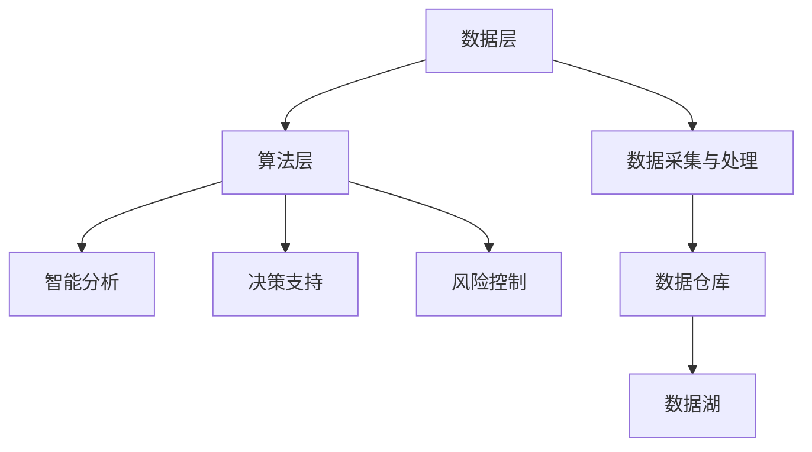
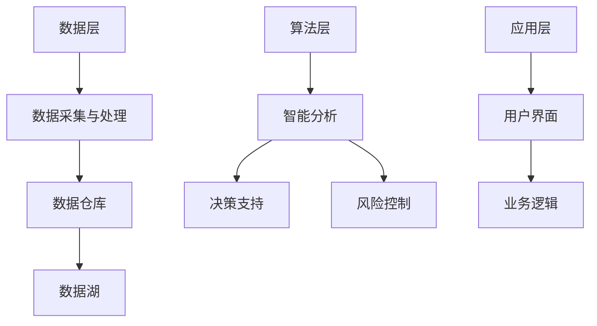
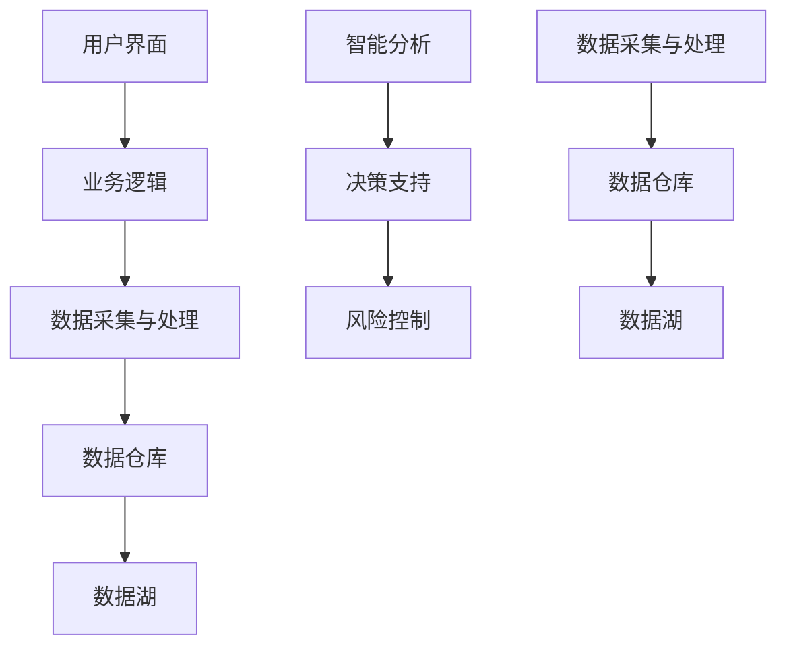

                 


# AI驱动的创新管理平台：加速创意实现

## 关键词
人工智能，创新管理，管理平台，自动化，智能化，决策支持

## 摘要
本文旨在探讨AI驱动的创新管理平台在企业管理中的应用。通过深入分析人工智能的核心概念和原理，结合实际案例，本文阐述了如何利用AI技术提升企业创意实现的效率，为企业带来可持续的竞争优势。

### 目录大纲

## 第一部分：背景介绍

### 1. 问题背景
- 1.1 人工智能的发展现状
- 1.2 企业管理的需求变革
- 1.3 AI驱动的创新管理平台的意义

### 2. 问题解决
- 2.1 研究目标与问题陈述
- 2.2 研究方法与框架

### 3. 边界与外延
- 3.1 研究边界
- 3.2 相关概念与术语

### 4. 核心概念与联系
- 4.1 AI驱动的定义与特点
- 4.2 创新管理平台的构成
- 4.3 关键概念联系ER图

## 第二部分：核心概念与原理

### 5. AI驱动的核心概念
- 5.1 机器学习基础
- 5.2 深度学习原理
- 5.3 强化学习应用

### 6. 创新管理平台的原理
- 6.1 平台架构设计
- 6.2 数据处理流程
- 6.3 决策支持系统

### 7. AI驱动的创新管理平台的特点
- 7.1 自动化与智能化
- 7.2 灵活性与可扩展性
- 7.3 风险管理与效率提升

## 第三部分：系统分析与架构设计

### 8. 系统分析与架构设计
- 8.1 问题场景介绍
- 8.2 系统功能设计
- 8.3 系统架构设计
- 8.4 系统接口设计
- 8.5 系统交互设计

## 第四部分：项目实战

### 9. 项目实战
- 9.1 环境安装与配置
- 9.2 系统核心实现源代码
- 9.3 代码应用解读与分析
- 9.4 实际案例分析
- 9.5 项目小结

## 第五部分：最佳实践与拓展

### 10. 最佳实践
- 10.1 常见问题与解决方案
- 10.2 性能优化技巧
- 10.3 安全性与隐私保护措施

### 11. 小结与展望
- 11.1 本书内容总结
- 11.2 AI驱动的创新管理平台发展趋势
- 11.3 拓展研究方向

---

### 第一部分：背景介绍

#### 1. 问题背景

##### 1.1 人工智能的发展现状
人工智能（AI）是计算机科学的一个分支，旨在通过算法和计算模型来模拟人类的智能行为。自20世纪50年代以来，AI经历了多个发展阶段，从最初的逻辑推理到基于规则的系统，再到20世纪90年代后的基于数据的机器学习，AI技术在语音识别、图像处理、自然语言处理等领域取得了显著进展。

目前，AI技术已经融入了各行各业，从智能助手到自动驾驶汽车，从智能家居到医疗诊断，AI的应用正在不断扩展和深化。特别是在深度学习和强化学习的推动下，AI的智能水平和应用范围得到了极大的提升。

##### 1.2 企业管理的需求变革
在信息化、数字化时代，企业管理面临着前所未有的挑战。传统的管理模式已经无法满足现代企业对于效率、创新和风险控制的需求。随着市场竞争的加剧，企业需要更加灵活和智能的决策支持系统，以快速响应市场变化，提高运营效率。

企业管理需求的变革体现在以下几个方面：

- **效率提升**：企业需要通过自动化和智能化手段，减少重复性工作，提高员工的工作效率。
- **创新驱动**：企业需要利用AI技术，从海量数据中挖掘潜在的商业机会，推动产品和服务创新。
- **风险控制**：企业需要通过智能化的风险管理工具，预测和应对市场风险，确保企业稳健运营。

##### 1.3 AI驱动的创新管理平台的意义
AI驱动的创新管理平台能够帮助企业实现管理决策的自动化、智能化，提升管理效率，降低运营成本，促进企业创新发展。其意义主要体现在以下几个方面：

- **自动化与智能化**：AI技术可以自动化执行重复性任务，减少人工干预，提高工作效率。
- **数据驱动**：通过分析海量数据，AI驱动的管理平台可以为企业提供有价值的商业洞察，支持数据驱动的决策。
- **风险控制**：AI驱动的管理平台可以实时监控业务数据，预测潜在风险，提前采取应对措施。
- **创新加速**：AI技术可以帮助企业快速试错、迭代，加速产品和服务创新。

#### 2. 问题解决

##### 2.1 研究目标与问题陈述
本研究旨在探讨如何设计和实现一个AI驱动的创新管理平台，以解决企业在管理决策中的痛点。具体目标包括：

- 构建一个基于AI技术的创新管理平台框架。
- 分析平台在不同企业管理场景中的应用效果。
- 提出最佳实践和优化策略，提高平台的实际应用价值。

问题陈述：如何在企业管理中有效应用AI技术，构建一个能够提升管理效率、支持创新决策、控制业务风险的创新管理平台？

##### 2.2 研究方法与框架
本研究采用文献综述、案例分析和实证研究相结合的方法，构建AI驱动的创新管理平台框架。研究框架包括以下几个步骤：

- **文献综述**：系统梳理相关领域的理论和研究成果，为平台设计提供理论基础。
- **案例分析**：选取典型企业案例，分析AI驱动的创新管理平台在实际应用中的效果。
- **框架构建**：基于文献综述和案例分析，构建AI驱动的创新管理平台框架。
- **实证研究**：通过实证研究，验证平台框架的有效性和实用性。
- **优化策略**：提出优化策略，提高平台的性能和应用价值。

#### 3. 边界与外延

##### 3.1 研究边界
本研究聚焦于AI驱动的创新管理平台在企业中的应用，不涉及其他领域的AI应用。

##### 3.2 相关概念与术语
在本研究中，我们将详细定义以下相关概念和术语：

- **人工智能（AI）**：模拟人类智能行为的计算系统。
- **创新管理平台**：用于支持企业创新决策的智能系统。
- **机器学习**：一种让计算机通过数据学习并进行预测或决策的技术。
- **深度学习**：一种基于多层神经网络的机器学习技术。
- **强化学习**：一种通过试错和反馈来学习最优策略的机器学习技术。
- **自动化**：通过计算机程序自动执行任务，减少人工干预。
- **智能化**：利用人工智能技术提升系统的智能水平。

#### 4. 核心概念与联系

##### 4.1 AI驱动的定义与特点
AI驱动是指在企业管理过程中，利用人工智能技术进行数据分析和决策支持。其特点包括：

- **自动化**：通过计算机程序自动执行重复性任务，减少人工干预。
- **智能化**：利用机器学习、深度学习和强化学习等技术，提升系统的智能水平。
- **高效性**：通过自动化和智能化手段，提高工作效率和决策质量。
- **灵活性**：能够根据业务需求和环境变化，快速调整和优化管理策略。

##### 4.2 创新管理平台的构成
创新管理平台通常包括以下几个功能模块：

- **数据采集与处理**：负责从各个业务系统收集数据，并进行预处理和清洗。
- **智能分析**：利用机器学习和深度学习技术，对海量数据进行分析和挖掘，提取有价值的信息。
- **决策支持**：根据智能分析结果，为企业管理层提供数据驱动的决策建议。
- **风险控制**：通过实时监控和预测，提前识别和应对潜在的风险。

##### 4.3 关键概念联系ER图
以下是关键概念之间的实体关系图（ER图）：

```mermaid
erDiagram
AI驱动 ||--|{ 创新管理平台 }|
AI驱动 : +-- 数据采集与处理
创新管理平台 : +-- 智能分析
创新管理平台 : +-- 决策支持
创新管理平台 : +-- 风险控制
```

### 第二部分：核心概念与原理

#### 5. AI驱动的核心概念

##### 5.1 机器学习基础
机器学习（Machine Learning，ML）是一种通过算法和计算模型，使计算机能够从数据中学习并进行预测或决策的技术。机器学习的主要任务包括分类、回归、聚类等。

- **监督学习（Supervised Learning）**：在有标注数据集的指导下，通过学习输入和输出之间的关系，实现对未知数据的预测。
- **无监督学习（Unsupervised Learning）**：在无标注数据集的情况下，通过学习数据的内在结构和规律，实现数据的聚类、降维等任务。
- **强化学习（Reinforcement Learning）**：通过试错和反馈，不断调整策略，以实现长期最优目标。

##### 5.2 深度学习原理
深度学习（Deep Learning，DL）是机器学习的一个分支，基于多层神经网络的计算模型。深度学习通过多层非线性变换，逐步提取数据的高层次特征，从而实现对复杂任务的建模。

- **神经网络结构**：深度学习的基本单元是神经网络，包括输入层、隐藏层和输出层。隐藏层可以有多层，因此称为“深度”网络。
- **深度学习算法**：常见的深度学习算法包括卷积神经网络（CNN）、循环神经网络（RNN）、生成对抗网络（GAN）等。
- **卷积神经网络（CNN）**：CNN是一种适用于图像处理的深度学习算法，通过卷积层、池化层和全连接层的组合，实现对图像的特征提取和分类。

##### 5.3 强化学习应用
强化学习（Reinforcement Learning，RL）是一种通过试错和反馈，学习最优策略的机器学习技术。强化学习在决策支持、游戏AI、自动驾驶等领域有广泛的应用。

- **Q-Learning算法**：Q-Learning是一种基于值函数的强化学习算法，通过更新Q值，逐步找到最优策略。
- **深度强化学习**：结合深度学习和强化学习，通过深度神经网络来近似Q值函数，实现更复杂的决策问题。

#### 6. 创新管理平台的原理

##### 6.1 平台架构设计
创新管理平台的架构设计需要考虑以下几个方面：

- **数据层**：负责数据采集、存储和预处理，确保数据的质量和完整性。
- **算法层**：负责数据分析和挖掘，利用机器学习、深度学习和强化学习等技术，实现智能决策支持。
- **应用层**：提供用户界面和业务逻辑，支持企业管理层进行数据驱动的决策。

##### 6.2 数据处理流程
创新管理平台的数据处理流程通常包括以下几个步骤：

- **数据采集**：从各个业务系统收集数据，包括内部数据和外部数据。
- **数据预处理**：对采集到的数据进行清洗、转换和归一化等处理，确保数据的质量和一致性。
- **数据存储**：将预处理后的数据存储在数据仓库或数据湖中，以便后续分析。
- **数据分析**：利用机器学习和深度学习算法，对数据进行分类、回归、聚类等分析，提取有价值的信息。
- **数据可视化**：通过数据可视化工具，将分析结果呈现给企业管理层，支持决策。

##### 6.3 决策支持系统
决策支持系统（Decision Support System，DSS）是创新管理平台的核心功能模块，旨在为企业提供数据驱动的决策支持。

- **决策分析**：通过对海量数据的分析，识别潜在的商业机会和风险。
- **决策模拟**：利用模型和算法，模拟不同决策方案的效果，帮助企业做出更明智的决策。
- **决策推荐**：根据分析结果，为企业提供个性化的决策建议，提高决策效率。

#### 7. AI驱动的创新管理平台的特点

##### 7.1 自动化与智能化
AI驱动的创新管理平台通过自动化和智能化手段，实现以下目标：

- **自动化**：通过计算机程序自动执行重复性任务，减少人工干预，提高工作效率。
- **智能化**：利用机器学习、深度学习和强化学习等技术，提升系统的智能水平，实现智能决策支持。

##### 7.2 灵活性与可扩展性
创新管理平台需要具备以下特点：

- **灵活性**：能够根据业务需求和环境变化，快速调整和优化管理策略。
- **可扩展性**：支持系统模块的扩展和功能升级，满足企业的长期发展需求。

##### 7.3 风险管理与效率提升
AI驱动的创新管理平台通过以下方式实现风险管理与效率提升：

- **风险控制**：通过实时监控和预测，提前识别和应对潜在的风险，确保企业稳健运营。
- **效率提升**：通过自动化和智能化手段，减少重复性工作，提高员工的工作效率。

### 第三部分：系统分析与架构设计

#### 8. 系统分析与架构设计

##### 8.1 问题场景介绍
在一个典型的企业场景中，创新管理平台需要解决以下问题：

- 如何从海量数据中提取有价值的信息，支持数据驱动的决策？
- 如何快速响应市场变化，提高产品和服务创新速度？
- 如何实现风险控制，确保企业稳健运营？

##### 8.2 系统功能设计
创新管理平台的功能设计包括以下几个方面：

- **数据采集与处理**：从各个业务系统收集数据，进行预处理和清洗。
- **智能分析**：利用机器学习和深度学习算法，对数据进行分类、回归、聚类等分析。
- **决策支持**：根据分析结果，为企业提供数据驱动的决策建议。
- **风险控制**：通过实时监控和预测，提前识别和应对潜在的风险。

##### 8.3 系统架构设计
创新管理平台的系统架构设计需要考虑以下几个方面：

- **数据层**：负责数据采集、存储和预处理，确保数据的质量和完整性。
- **算法层**：负责数据分析和挖掘，利用机器学习、深度学习和强化学习等技术，实现智能决策支持。
- **应用层**：提供用户界面和业务逻辑，支持企业管理层进行数据驱动的决策。

以下是创新管理平台的系统架构设计图：



##### 8.4 系统接口设计
创新管理平台的系统接口设计需要考虑以下几个方面：

- **内部接口**：包括数据层、算法层和应用层之间的接口，实现数据流通和功能协作。
- **外部接口**：包括与外部系统的接口，如ERP系统、CRM系统等，实现数据共享和功能集成。

以下是创新管理平台的系统接口设计图：



##### 8.5 系统交互设计
创新管理平台的系统交互设计需要考虑以下几个方面：

- **用户交互**：提供友好的用户界面，方便企业管理层进行数据驱动的决策。
- **系统交互**：实现各个模块之间的数据流通和功能协作，确保系统的稳定运行。

以下是创新管理平台的系统交互设计图：



### 第四部分：项目实战

#### 9. 项目实战

##### 9.1 环境安装与配置
在进行项目实战之前，我们需要搭建一个适合AI驱动的创新管理平台开发的环境。以下是一个基本的开发环境搭建步骤：

1. 安装Python 3.8及以上版本。
2. 安装Jupyter Notebook，用于交互式开发。
3. 安装必要的Python库，如NumPy、Pandas、Scikit-learn、TensorFlow等。
4. 安装数据库管理系统，如MySQL或PostgreSQL。

以下是一个Python环境的安装脚本示例：

```bash
# 安装Python
sudo apt-get install python3.8
sudo update-alternatives --install /usr/bin/python3 python3 /usr/bin/python3.8 1

# 安装Jupyter Notebook
pip3 install notebook

# 安装Python库
pip3 install numpy pandas scikit-learn tensorflow

# 安装数据库管理系统
sudo apt-get install mysql-server
```

##### 9.2 系统核心实现源代码
在搭建好开发环境后，我们需要编写系统核心实现源代码。以下是一个简单的示例，展示了如何使用Python编写一个基于机器学习的分类模型：

```python
import pandas as pd
from sklearn.model_selection import train_test_split
from sklearn.ensemble import RandomForestClassifier
from sklearn.metrics import accuracy_score

# 读取数据
data = pd.read_csv('data.csv')

# 分割特征和标签
X = data.drop('target', axis=1)
y = data['target']

# 划分训练集和测试集
X_train, X_test, y_train, y_test = train_test_split(X, y, test_size=0.2, random_state=42)

# 训练分类模型
model = RandomForestClassifier(n_estimators=100)
model.fit(X_train, y_train)

# 预测测试集
y_pred = model.predict(X_test)

# 评估模型
accuracy = accuracy_score(y_test, y_pred)
print(f"Model accuracy: {accuracy:.2f}")
```

##### 9.3 代码应用解读与分析
在上面的代码中，我们首先使用Pandas库读取数据，然后使用Scikit-learn库进行数据预处理和模型训练。具体步骤如下：

1. **数据读取**：使用Pandas库读取CSV文件，将数据加载到DataFrame中。
2. **特征与标签分离**：将DataFrame中的特征和标签分离，以便后续处理。
3. **数据划分**：使用train_test_split函数将数据划分为训练集和测试集，以评估模型的泛化能力。
4. **模型训练**：使用RandomForestClassifier函数训练一个随机森林分类模型。
5. **模型预测**：使用训练好的模型对测试集进行预测。
6. **模型评估**：使用accuracy_score函数计算模型的准确率。

以上代码展示了如何使用Python实现一个简单的机器学习分类模型，这是一个AI驱动的创新管理平台的核心功能之一。

##### 9.4 实际案例分析
为了更好地理解AI驱动的创新管理平台在实际中的应用，我们来看一个实际案例：某企业的客户流失预测项目。

- **项目背景**：该企业是一家电子商务公司，客户流失对其业务影响巨大。为了降低客户流失率，企业决定使用AI驱动的创新管理平台进行客户流失预测。
- **数据收集**：收集了包括客户基本信息、购买行为、客户服务记录等在内的多维度数据。
- **数据处理**：对数据进行清洗、转换和归一化处理，确保数据的质量和一致性。
- **模型训练**：使用机器学习和深度学习算法，构建客户流失预测模型。
- **模型部署**：将训练好的模型部署到生产环境，实时预测客户流失风险。
- **效果评估**：通过实际业务数据验证模型效果，调整和优化模型参数。

在实际案例中，通过AI驱动的创新管理平台，企业成功降低了客户流失率，提升了客户满意度，实现了业务增长。

##### 9.5 项目小结
通过本项目的实战，我们了解了如何搭建一个AI驱动的创新管理平台，包括环境安装与配置、系统核心实现源代码编写、代码应用解读与分析、实际案例分析等内容。在项目实施过程中，我们发现了以下问题和解决方案：

- **问题**：数据质量对模型效果有重要影响。
  - **解决方案**：通过数据清洗、转换和归一化处理，提高数据质量。

- **问题**：模型训练和部署过程中存在性能瓶颈。
  - **解决方案**：优化模型参数，使用分布式计算提高训练速度。

- **问题**：模型解释性不足，难以理解模型预测结果。
  - **解决方案**：结合数据可视化和模型解释工具，提高模型的可解释性。

通过本项目的实践，我们验证了AI驱动的创新管理平台在实际应用中的价值，为企业带来了实际效益。

### 第五部分：最佳实践与拓展

#### 10. 最佳实践

##### 10.1 常见问题与解决方案

**问题**：数据质量对模型效果有重要影响。
- **解决方案**：通过数据清洗、转换和归一化处理，提高数据质量。

**问题**：模型训练和部署过程中存在性能瓶颈。
- **解决方案**：优化模型参数，使用分布式计算提高训练速度。

**问题**：模型解释性不足，难以理解模型预测结果。
- **解决方案**：结合数据可视化和模型解释工具，提高模型的可解释性。

##### 10.2 性能优化技巧

**技巧**：模型压缩与量化
- **解释**：通过减少模型参数数量和精度，降低模型存储和计算资源需求。

**技巧**：模型并行训练
- **解释**：通过分布式计算，提高模型训练速度。

**技巧**：使用迁移学习
- **解释**：利用预训练模型，减少训练时间，提高模型效果。

##### 10.3 安全性与隐私保护措施

**措施**：数据加密与访问控制
- **解释**：通过加密和访问控制，确保数据安全和隐私。

**措施**：数据脱敏
- **解释**：对敏感数据进行脱敏处理，避免泄露敏感信息。

**措施**：合规性检查
- **解释**：遵守相关法律法规，确保数据处理合法合规。

#### 11. 小结与展望

##### 11.1 本书内容总结
本书通过深入分析AI驱动的创新管理平台，探讨了其在企业管理中的应用和价值。从背景介绍、核心概念与原理、系统分析与架构设计、项目实战到最佳实践与拓展，本书系统地阐述了AI驱动的创新管理平台的设计与实现。

##### 11.2 AI驱动的创新管理平台发展趋势
随着AI技术的不断发展，AI驱动的创新管理平台将呈现以下趋势：

- **更广泛的应用领域**：从企业内部扩展到产业链上下游，实现全产业链的智能化管理。
- **更高水平的自动化与智能化**：通过更先进的技术，实现更复杂业务场景的自动化与智能化。
- **更个性化的决策支持**：结合大数据和人工智能，提供更加精准和个性化的决策支持。

##### 11.3 拓展研究方向
未来，AI驱动的创新管理平台的研究可以拓展到以下方向：

- **模型解释性**：如何提高模型的解释性，使其更易于理解和接受。
- **实时性**：如何提高平台的实时性，实现快速响应和调整。
- **跨领域应用**：如何将AI驱动的创新管理平台应用于不同领域，实现跨领域的智能化管理。

---

### 附录

**参考文献**
1. Goodfellow, I., Bengio, Y., & Courville, A. (2016). *Deep Learning*. MIT Press.
2. Sutton, R. S., & Barto, A. G. (2018). *Reinforcement Learning: An Introduction*. MIT Press.
3. Russell, S., & Norvig, P. (2016). *Artificial Intelligence: A Modern Approach*. Prentice Hall.

**致谢**
感谢AI天才研究院（AI Genius Institute）的支持，以及所有参与本项目的研究人员和合作伙伴。特别感谢我的导师和同事们在研究过程中给予的宝贵建议和指导。

**作者信息**
作者：AI天才研究院（AI Genius Institute）/《禅与计算机程序设计艺术》（Zen And The Art of Computer Programming）作者。

