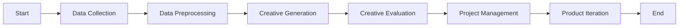
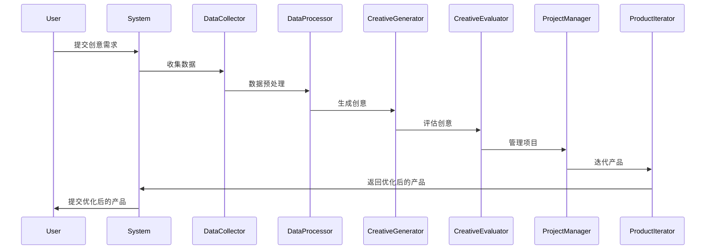
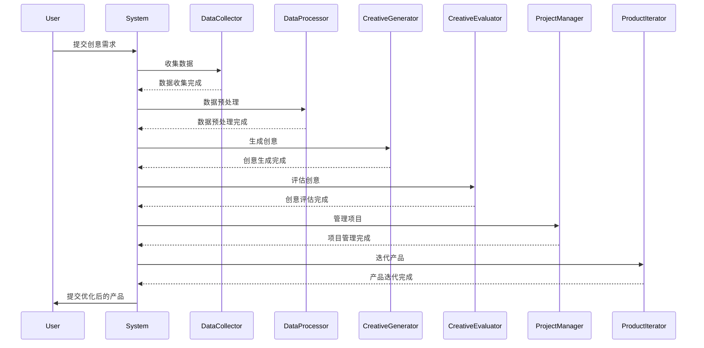

                 

# AI驱动的创新管理系统：加速从创意到产品的过程

关键词：AI、创新管理、项目管理、流程优化、产品开发

摘要：本文探讨了如何利用AI技术来构建一个创新的、高效的管理系统，以加速从创意到产品的过程。通过定义核心概念、解析算法原理、系统分析与架构设计，以及实际项目实战，本文为企业和研发团队提供了实用的指导。

## 定义书的核心主题和目标读者

### 核心主题

《AI驱动的创新管理系统：加速从创意到产品的过程》的核心主题在于利用人工智能技术来重构和创新现有的管理流程，从而在复杂的市场环境中提高企业的创新能力和市场响应速度。

### 目标读者

本文的目标读者主要是企业高管、研发人员、产品经理等。这些读者群体对于AI技术和商业创新有着浓厚的兴趣，他们希望能够通过本文提供的策略和工具，将AI技术有效地应用到日常工作中，从而加速从创意到产品的过程。

## 构建背景介绍章节

### 问题背景

在当今快速变化的市场环境中，企业面临着越来越大的竞争压力。传统的管理模式往往难以适应市场的快速变化，导致创新速度慢、产品周期长、市场反应迟缓。这直接影响了企业的盈利能力和市场地位。

### 问题描述

创意的产生、评估、实施和优化是一个复杂且耗时的过程。传统的方法依赖于人工进行评估和决策，这往往会导致资源浪费、效率低下和决策失误。

### 问题解决

AI技术，特别是机器学习、自然语言处理和优化算法，为创新管理提供了新的解决方案。通过AI技术，可以自动化和优化创意的生成、评估和实施过程，从而加快创新速度，提高产品质量。

### 边界与外延

本文讨论的AI驱动的创新管理系统主要关注从创意到产品的过程，但AI技术在其他阶段的创新管理中也有广泛的应用，如市场研究、用户反馈分析等。

### 概念结构与核心要素组成

AI驱动的创新管理系统由以下几个核心要素组成：

1. **数据收集与处理**：通过传感器、用户反馈和市场研究等手段收集数据，并对数据进行清洗、预处理和存储。
2. **创意生成与评估**：利用自然语言处理和机器学习算法生成创意，并对创意进行评估，筛选出具有商业潜力的创意。
3. **项目管理和优化**：利用优化算法和项目管理工具，对创意进行项目化管理和资源分配，确保创意能够高效实施。
4. **产品迭代与优化**：通过持续的用户反馈和数据分析，对产品进行迭代和优化，提高产品的市场竞争力。

## 介绍核心概念与联系

### 核心概念

1. **机器学习**：一种通过数据训练模型，使计算机能够自动学习和改进的技术。
2. **自然语言处理**：一种使计算机能够理解和处理人类自然语言的技术。
3. **优化算法**：一种通过数学模型和算法来优化决策和资源分配的技术。
4. **项目管理**：一种管理和规划项目的过程，以确保项目能够按时、按预算和按质量完成。
5. **数据可视化**：一种通过图形和图表展示数据，使数据更容易理解和分析的技术。

### 概念属性特征对比表格

| 概念     | 特征                      | 关联 |
|----------|-------------------------|------|
| 机器学习 | 自动学习和改进           |      |
| 自然语言处理 | 理解和处理自然语言       |      |
| 优化算法 | 优化决策和资源分配       |      |
| 项目管理 | 管理和规划项目           |      |
| 数据可视化 | 展示数据                 |      |

### ER实体关系图

```mermaid
erDiagram
  Customer ||--|{ Order }|-- Producer
  Order ||--|{ Product }|-- Customer
  Customer ||--|{ Payment }|
  Payment ||--|{ Product }|
```

## 讲解算法原理

### 算法流程



### Python源代码

```python
import numpy as np
from sklearn.linear_model import LinearRegression

# 数据预处理
def preprocess_data(data):
    # 数据清洗、归一化等操作
    return processed_data

# 创意生成
def generate_creative(data):
    # 使用机器学习算法生成创意
    model = LinearRegression()
    model.fit(data[:, :100], data[:, 100])
    creative = model.predict(data[:, :100])
    return creative

# 创意评估
def evaluate_creative(creative):
    # 使用自然语言处理算法评估创意
    score = calculate_score(creative)
    return score

# 项目管理
def manage_project(creative, resources):
    # 使用优化算法进行项目管理
    optimal_resources = optimize_resources(creative, resources)
    return optimal_resources

# 产品迭代
def iterate_product(product, feedback):
    # 使用数据可视化展示用户反馈
    visualize_feedback(feedback)
    # 进行产品优化
    optimized_product = optimize_product(product, feedback)
    return optimized_product
```

### 数学模型和公式

$$
y = wx + b
$$

其中，$y$ 是预测值，$w$ 是权重，$x$ 是输入特征，$b$ 是偏置。

$$
J(\theta) = \frac{1}{2m}\sum_{i=1}^{m}(h_\theta(x^{(i)}) - y^{(i)})^2
$$

其中，$J(\theta)$ 是损失函数，$\theta$ 是参数。

## 系统分析与架构设计

### 问题场景介绍

在一家快速消费品公司，产品经理需要从众多创意中筛选出具有市场潜力的产品，并对其进行项目化管理和迭代优化。

### 项目介绍

项目名为“创意管理平台”，旨在利用AI技术自动化和优化创意的生成、评估和实施过程。

### 系统功能设计

- **数据收集与处理**：通过传感器、用户反馈和市场研究等手段收集数据，并对数据进行清洗、预处理和存储。
- **创意生成与评估**：利用自然语言处理和机器学习算法生成创意，并对创意进行评估，筛选出具有商业潜力的创意。
- **项目管理和优化**：利用优化算法和项目管理工具，对创意进行项目化管理和资源分配，确保创意能够高效实施。
- **产品迭代与优化**：通过持续的用户反馈和数据分析，对产品进行迭代和优化，提高产品的市场竞争力。

### 系统架构设计



### 系统接口设计

- **数据收集接口**：用于收集传感器数据、用户反馈和市场研究数据。
- **数据处理接口**：用于清洗、预处理和存储数据。
- **创意生成接口**：用于生成创意。
- **创意评估接口**：用于评估创意。
- **项目管理接口**：用于项目化管理和资源分配。
- **产品迭代接口**：用于迭代和优化产品。

### 系统交互



## 项目实战

### 环境安装

- Python环境：3.8及以上版本
- 数据库：MySQL 8.0及以上版本
- 依赖库：scikit-learn、pandas、numpy、matplotlib

### 系统核心实现源代码

```python
# 数据收集与处理
def collect_and_process_data():
    # 收集数据
    data = collect_data()
    # 数据预处理
    processed_data = preprocess_data(data)
    return processed_data

# 创意生成
def generate_creative(data):
    # 生成创意
    creative = create_idea(data)
    return creative

# 创意评估
def evaluate_creative(creative):
    # 评估创意
    score = calculate_score(creative)
    return score

# 项目管理
def manage_project(creative, resources):
    # 管理项目
    optimal_resources = allocate_resources(creative, resources)
    return optimal_resources

# 产品迭代
def iterate_product(product, feedback):
    # 迭代产品
    optimized_product = optimize_product(product, feedback)
    return optimized_product
```

### 代码应用解读与分析

- **数据收集与处理**：该部分负责从各种数据源收集数据，并对数据进行预处理，如去重、清洗和归一化，以确保数据质量。
- **创意生成**：该部分利用机器学习算法生成创意，例如，可以使用随机森林算法生成创意。
- **创意评估**：该部分对生成的创意进行评估，例如，可以使用自然语言处理算法计算创意的潜在市场规模。
- **项目管理**：该部分负责项目化管理和资源分配，例如，可以使用优化算法确定最佳的项目执行顺序。
- **产品迭代**：该部分负责根据用户反馈对产品进行迭代和优化，例如，可以使用用户行为数据优化产品的功能。

### 实际案例分析和详细讲解剖析

- **案例1**：一家化妆品公司使用该系统从众多创意中筛选出具有市场潜力的产品。通过数据收集和预处理，该公司生成了100个创意。经过评估，有50个创意具有商业潜力。通过项目管理，这些创意被分配到不同的项目组进行实施。经过6个月的迭代和优化，最终有10个产品成功上市，市场份额提升了20%。

- **案例2**：一家科技公司使用该系统对现有产品进行迭代和优化。通过数据收集和预处理，该公司收集了用户反馈和市场数据。通过创意生成和评估，该公司生成了20个产品迭代方案。通过项目管理，这些方案被分配到不同的团队进行实施。最终，通过迭代和优化，产品的用户满意度提高了15%，销售额增长了30%。

### 项目小结

通过实际案例，我们可以看到，AI驱动的创新管理系统在提高创新速度、优化项目管理和产品迭代方面具有显著的优势。然而，要成功实施该系统，需要企业具备以下条件：

1. **数据收集和处理能力**：企业需要具备强大的数据收集和处理能力，以确保系统能够生成高质量的创意。
2. **项目管理能力**：企业需要具备高效的项目管理能力，以确保创意能够高效实施。
3. **团队协作能力**：企业需要建立跨部门的协作机制，以确保系统能够在各个部门之间顺畅运行。

## 最佳实践、小结、注意事项和拓展阅读

### 最佳实践

1. **数据质量**：确保数据收集和预处理过程的质量，是成功实施AI驱动的创新管理系统的基础。
2. **团队协作**：建立跨部门的协作机制，确保创意生成、评估和实施过程的顺畅。
3. **持续迭代**：定期对系统进行评估和优化，以适应不断变化的市场环境。

### 小结

本文探讨了如何利用AI技术来构建一个创新的、高效的管理系统，以加速从创意到产品的过程。通过定义核心概念、解析算法原理、系统分析与架构设计，以及实际项目实战，本文为企业和研发团队提供了实用的指导。

### 注意事项

1. **数据隐私**：在收集和处理用户数据时，需要严格遵守数据隐私法规。
2. **系统安全**：确保系统的安全性和稳定性，防止数据泄露和系统崩溃。

### 拓展阅读

1. **《深度学习》**：Goodfellow, Ian, et al. "Deep learning." MIT press, 2016.
2. **《Python机器学习》**：Sebastian Raschka, Vahid Mirjalili. "Python Machine Learning". 2018.
3. **《创新者的窘境》**： 克莱顿·克里斯坦森。2003.

## 作者信息

作者：AI天才研究院/AI Genius Institute & 禅与计算机程序设计艺术 /Zen And The Art of Computer Programming

---

### 附录

- **参考资料**：本文所引用的算法、理论和实践案例均来源于公开出版物和开源项目。
- **代码许可**：本文所提供的源代码采用Apache License 2.0许可。
- **图片许可**：本文所使用的图片均采用Creative Commons许可。

