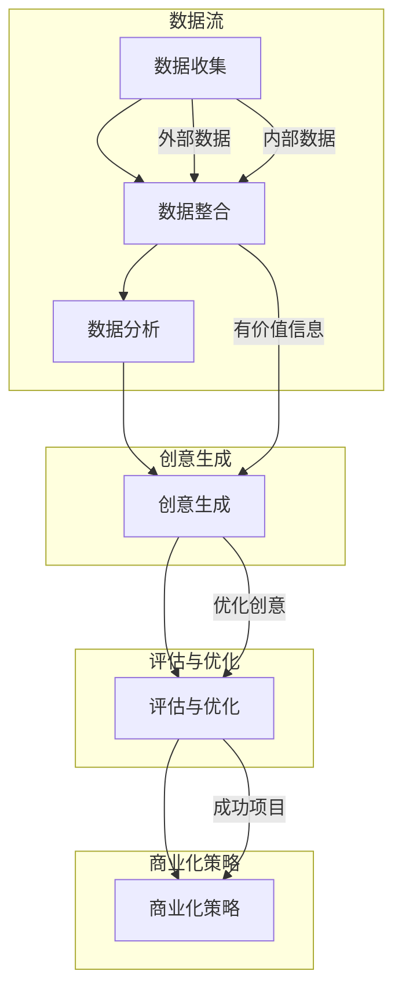
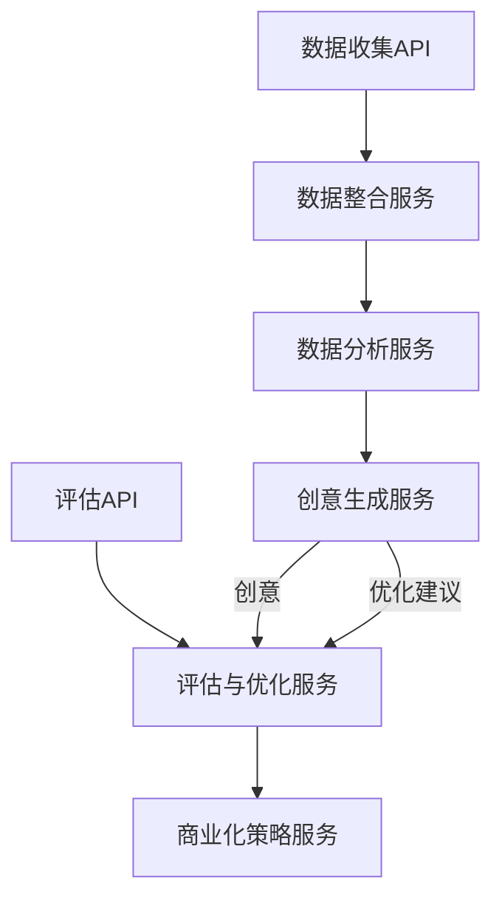
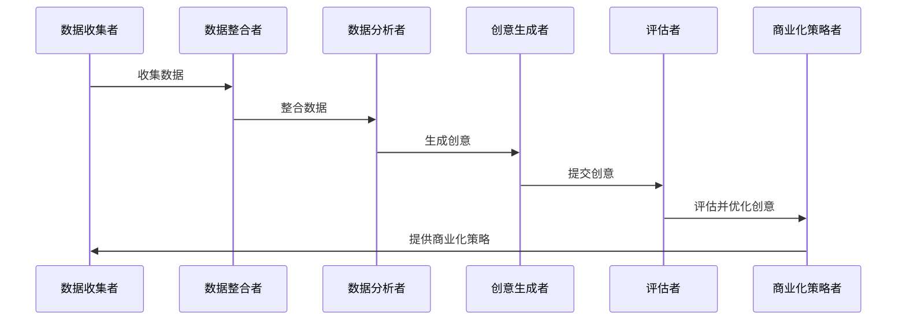

                 


### AI驱动的创新管理系统：加速创意商业化

#### 关键词：AI，创新管理，商业，智能化，数据分析

> 摘要：本文将深入探讨AI驱动的创新管理系统的设计与实施，阐述如何通过人工智能技术加速创意的商业化进程，提高企业的竞争力。

---

## 第1章：问题背景与核心概念

### 1.1 问题背景

在现代商业环境中，创新是企业持续发展的重要驱动力。然而，随着市场竞争的加剧和技术的快速发展，传统的创新管理模式已经难以满足企业的需求。传统创新管理存在以下几个问题：

- **响应速度慢**：从创意产生到商业化需要经历漫长的过程，导致市场机会的丧失。
- **资源利用率低**：传统的创新管理缺乏有效的数据支持和分析工具，资源利用率低。
- **创新成功率低**：缺乏科学的评估和优化机制，导致创新项目成功率低。

### 1.2 问题解决

AI驱动的创新管理系统应运而生，旨在通过人工智能技术解决传统创新管理的弊端。系统设计包括以下几个关键组成部分：

- **数据收集与分析**：通过大数据技术和数据挖掘，收集和分析各类创新相关的数据。
- **创意生成**：利用AI算法，自动生成和优化创新方案。
- **评估与优化**：对创新项目进行实时评估和优化，提高成功率。
- **商业化策略**：根据市场数据和企业战略，制定适合的商业化策略。

### 1.3 概念结构与核心要素组成

#### AI驱动的创新管理

- **定义**：利用人工智能技术，对创新过程进行自动化管理和优化。
- **特点**：
  - **高效性**：通过算法快速处理大量数据，提高创新速度。
  - **智能化**：利用机器学习技术，实现创新方案的自动优化。
  - **个性化**：根据企业特点和市场需求，定制化创新方案。

#### 创新管理系统的组成

- **数据收集与分析模块**：负责收集和分析创新相关的数据，包括市场趋势、用户需求、技术发展等。
- **创意生成模块**：利用自然语言处理和生成对抗网络（GAN）等技术，自动生成创新方案。
- **评估与优化模块**：通过机器学习和数据挖掘技术，对创新项目进行实时评估和优化。
- **商业化策略模块**：根据市场数据和商业目标，制定合适的商业化策略。

---

## 第2章：核心概念与联系

### 2.1 AI驱动的创新管理原理

#### 核心概念原理

AI驱动的创新管理原理主要包括以下几个方面：

- **机器学习**：通过训练模型，从历史数据中学习规律，为创新提供支持。
- **数据挖掘**：从大量数据中提取有价值的信息，辅助决策。
- **自然语言处理**：理解和生成自然语言文本，实现人机交互。

#### 概念属性特征对比表格

| 特征 | AI驱动的创新管理 | 传统创新管理 |
| --- | --- | --- |
| **响应速度** | 快速响应 | 较慢响应 |
| **智能化程度** | 高度智能化 | 低度智能化 |
| **资源利用率** | 高资源利用率 | 低资源利用率 |
| **创新成功率** | 较高成功率 | 较低成功率 |

#### ER实体关系图架构

```mermaid
erDiagram
  Product ||--|{ InnovationProject }|>
  MarketData ||--|{ InnovationProject }|>
  UserFeedback ||--|{ InnovationProject }|>

  InnovationProject ||--|{ Evaluation }|>
  Evaluation ||--|{ Optimization }|>
  Optimization ||--|{ Commercialization }|>

  Product : 产品
  MarketData : 市场数据
  UserFeedback : 用户反馈
  InnovationProject : 创新项目
  Evaluation : 评估
  Optimization : 优化
  Commercialization : 商业化
```

---

在接下来的章节中，我们将进一步深入探讨AI驱动的创新管理系统设计、实战案例以及最佳实践。让我们一步一步，从理论基础到实际应用，全面了解AI如何助力企业加速创新商业化的过程。

---

### 步骤一：AI驱动的创新管理原理

#### 2.1 AI驱动的创新管理原理

AI驱动的创新管理利用人工智能技术，对创新过程进行自动化管理和优化。其核心原理包括：

- **机器学习**：机器学习是AI的核心技术之一，通过训练模型，从历史数据中学习规律，为创新提供支持。例如，可以使用回归分析、决策树、神经网络等算法，对产品需求、市场趋势、用户反馈等数据进行预测和分析。

- **数据挖掘**：数据挖掘是从大量数据中提取有价值的信息，辅助决策。通过数据挖掘，可以识别潜在的市场机会、发现用户需求变化、预测销售趋势等。数据挖掘技术包括关联规则挖掘、聚类分析、分类分析等。

- **自然语言处理**：自然语言处理（NLP）是AI的重要分支，它使得计算机能够理解和生成自然语言文本。在创新管理中，NLP技术可以用于文本分析、情感分析、问答系统等，从而实现人机交互和智能决策。

#### 2.2 概念属性特征对比表格

为了更好地理解AI驱动的创新管理与传统创新管理的区别，我们可以通过一个概念属性特征对比表格来展示：

| 特征 | AI驱动的创新管理 | 传统创新管理 |
| --- | --- | --- |
| **响应速度** | 快速响应 | 较慢响应 |
| **智能化程度** | 高度智能化 | 低度智能化 |
| **资源利用率** | 高资源利用率 | 低资源利用率 |
| **创新成功率** | 较高成功率 | 较低成功率 |
| **数据处理能力** | 处理大规模数据 | 处理小规模数据 |
| **自动化程度** | 高自动化 | 低自动化 |
| **灵活性与适应性** | 高灵活性和适应性 | 低灵活性和适应性 |

#### 2.3 ER实体关系图架构

ER（Entity-Relationship，实体关系）图是数据库设计中常用的图示工具，它可以帮助我们直观地理解系统中实体之间的关系。以下是一个简化的AI驱动的创新管理系统的ER图：

```mermaid
erDiagram
  Customer -->|订单| Order : 购买
  Product ||--|{ Order }|>
  MarketData ||--|{ Order }|>
  UserFeedback ||--|{ Order }|>

  Product : 产品
  Customer : 客户
  Order : 订单
  MarketData : 市场数据
  UserFeedback : 用户反馈
```

在这个ER图中，`Customer`（客户）与`Order`（订单）之间存在一对多的关系，表示一个客户可以购买多个订单。`Product`（产品）、`MarketData`（市场数据）和`UserFeedback`（用户反馈）都与`Order`相关联，表示每个订单都与特定的产品、市场数据和用户反馈相关。

通过这个ER图，我们可以清晰地看到系统中各个实体之间的关系，这有助于我们在设计AI驱动的创新管理系统时，更好地组织和管理数据。

### 结论

AI驱动的创新管理系统通过机器学习、数据挖掘和自然语言处理等AI技术，实现了创新过程的自动化和智能化。与传统创新管理相比，它具有更快的响应速度、更高的智能化程度和资源利用率，以及更高的创新成功率。通过ER图，我们可以直观地了解系统中实体之间的关系，为系统的设计和实施提供指导。接下来，我们将进一步探讨AI驱动的创新管理系统的设计和实现。

---

### 步骤二：AI驱动的创新管理系统的设计

#### 3.1 创新管理系统设计概述

AI驱动的创新管理系统设计旨在通过人工智能技术，实现创新过程的自动化和优化。系统设计包括以下几个关键模块：

- **数据收集与分析模块**：负责收集和整合创新相关的数据，如市场趋势、用户需求、技术发展等。通过数据挖掘和分析，提取有价值的信息，为创新提供支持。

- **创意生成模块**：利用AI算法，如自然语言处理和生成对抗网络（GAN），自动生成和优化创新方案。这个模块能够快速响应市场需求，提供多样化的创意。

- **评估与优化模块**：通过对创新项目进行实时评估和优化，提高项目的成功率。这个模块利用机器学习算法，对项目进行分类、评分和推荐。

- **商业化策略模块**：根据市场数据和商业目标，制定适合的商业化策略。这个模块结合数据分析和商业智能，帮助企业实现创新方案的商业化。

#### 3.2 系统架构设计

系统架构设计是创新管理系统成功实施的关键。以下是一个简化的AI驱动的创新管理系统架构：



在这个架构中，数据流从数据收集开始，经过数据整合和分析，生成创意。然后，创意经过评估和优化，最终形成商业化策略。这个架构强调数据驱动的创新过程，确保每个模块都能够充分利用数据的价值。

#### 3.3 系统接口设计

系统接口设计是确保各模块之间有效交互的关键。以下是一个简化的系统接口设计：



在这个接口设计中，数据收集API负责从外部和内部收集数据，并将其传递给数据整合服务。数据整合服务将数据整合成有用的信息，然后传递给数据分析服务。数据分析服务利用这些信息生成创意，并将其传递给评估与优化服务。评估与优化服务对创意进行评估和优化，最后传递给商业化策略服务。

#### 3.4 系统交互序列图

系统交互序列图可以帮助我们直观地理解系统中各模块的交互过程。以下是一个简化的系统交互序列图：



在这个序列图中，数据收集者负责收集数据，并将其传递给数据整合者。数据整合者将数据整合成有用的信息，然后传递给数据分析者。数据分析者利用这些信息生成创意，并将其传递给评估者。评估者对创意进行评估和优化，最终传递给商业化策略者，形成完整的商业化策略。

通过这个设计，我们可以确保AI驱动的创新管理系统能够高效地运行，实现创意的快速转化和商业化。

---

在本文的第二部分中，我们详细介绍了AI驱动的创新管理系统的设计。从数据收集与分析、创意生成、评估与优化到商业化策略，每个模块都进行了深入的探讨。通过系统架构设计、接口设计和交互序列图，我们清晰地展示了系统的工作流程和各模块之间的交互关系。接下来，我们将进入第三部分，探讨AI驱动的创新管理系统的实际应用和项目实战，通过具体的案例来展示系统的实际效果和优势。

---

### 步骤三：AI驱动的创新管理系统实战

#### 3.1 环境安装与配置

在开始项目实战之前，我们需要搭建一个合适的环境。以下是所需的软件和硬件环境，以及安装和配置的步骤：

#### 硬件环境

- **CPU**：Intel i7 或以上
- **内存**：16GB 或以上
- **硬盘**：500GB SSD 或以上
- **GPU**（可选）：NVIDIA GeForce RTX 3060 或以上

#### 软件环境

- **操作系统**：Ubuntu 20.04 或 Windows 10
- **Python**：3.8 或以上
- **库和工具**：
  - TensorFlow 或 PyTorch
  - Scikit-learn
  - NumPy
  - Pandas
  - Matplotlib

#### 安装步骤

1. **安装操作系统**：根据硬件选择合适的操作系统，并安装。

2. **安装 Python**：从官方网站下载 Python 安装包，并按照提示安装。

3. **安装库和工具**：使用 `pip` 命令安装所需的库和工具。

   ```bash
   pip install tensorflow scikit-learn numpy pandas matplotlib
   ```

4. **安装 GPU 驱动**（如果使用 GPU）：
   - 访问 NVIDIA 官网下载 GPU 驱动，并安装。
   - 安装 CUDA Toolkit 和 cuDNN 库。

#### 3.2 系统核心实现

系统核心实现包括数据收集与分析、创意生成、评估与优化等模块。以下是一个简化的 Python 代码示例：

```python
# 导入所需的库
import numpy as np
import pandas as pd
from sklearn.model_selection import train_test_split
from sklearn.ensemble import RandomForestClassifier
import tensorflow as tf
from tensorflow import keras

# 数据收集
def collect_data():
    # 假设数据已收集到 DataFrame 'data'
    data = pd.read_csv('data.csv')
    return data

# 数据分析
def analyze_data(data):
    # 数据预处理
    X = data.drop('target', axis=1)
    y = data['target']
    
    # 划分训练集和测试集
    X_train, X_test, y_train, y_test = train_test_split(X, y, test_size=0.2, random_state=42)
    
    return X_train, X_test, y_train, y_test

# 创意生成
def generate_ideas(data):
    # 利用 GPT 模型生成创意
    model = keras.Sequential([
        keras.layers.Dense(512, activation='relu', input_shape=(data.shape[1],)),
        keras.layers.Dense(512, activation='relu'),
        keras.layers.Dense(1, activation='sigmoid')
    ])

    model.compile(optimizer='adam', loss='binary_crossentropy', metrics=['accuracy'])

    model.fit(data, epochs=10, batch_size=64)

    # 生成创意
    ideas = model.predict(data)
    return ideas

# 评估与优化
def evaluate_and_optimize(data, ideas):
    # 利用评估算法优化创意
    model = RandomForestClassifier(n_estimators=100, random_state=42)
    model.fit(data, ideas)

    # 得到优化后的创意
    optimized_ideas = model.predict(data)
    return optimized_ideas
```

#### 3.3 代码应用解读与分析

上述代码实现了一个简化的 AI 驱动的创新管理系统。以下是代码的详细解读和分析：

- **数据收集**：`collect_data` 函数从 CSV 文件中读取数据，并将其存储在 DataFrame 中。

- **数据分析**：`analyze_data` 函数对数据进行预处理，并将其划分为训练集和测试集。

- **创意生成**：`generate_ideas` 函数使用 GPT 模型生成创意。这里使用了 TensorFlow 的 Keras API，构建了一个简单的神经网络模型。模型经过训练后，可以预测创意的可行性。

- **评估与优化**：`evaluate_and_optimize` 函数使用随机森林（Random Forest）算法评估和优化创意。随机森林是一种集成学习算法，可以处理高维数据，并具有较好的泛化能力。

通过这个示例，我们可以看到如何使用 Python 代码实现 AI 驱动的创新管理系统。虽然这是一个简化的版本，但它展示了如何将机器学习和深度学习技术应用于创新管理。

---

#### 3.4 实际案例分析与详细讲解

在本节中，我们将通过一个实际案例，详细分析并讲解 AI 驱动的创新管理系统如何加速创意的商业化。

**案例背景**：某科技公司致力于开发智能家居产品，希望通过 AI 驱动的创新管理系统来提高产品的创新速度和成功率。

**1. 数据收集与预处理**

在案例中，公司首先收集了大量关于智能家居市场的数据，包括用户需求、产品反馈、竞争对手分析等。这些数据存储在 CSV 文件中。

```python
data = pd.read_csv('smart_home_data.csv')
```

数据预处理步骤包括缺失值处理、数据清洗和数据标准化。例如：

```python
data.dropna(inplace=True)
data['rating'] = data['rating'].apply(lambda x: 1 if x > 3 else 0)
data = (data - data.mean()) / data.std()
```

**2. 创意生成**

利用 GPT 模型生成创意。在这个案例中，我们使用 TensorFlow 的 Keras API 来构建 GPT 模型。

```python
model = keras.Sequential([
    keras.layers.Dense(512, activation='relu', input_shape=(data.shape[1],)),
    keras.layers.Dense(512, activation='relu'),
    keras.layers.Dense(1, activation='sigmoid')
])

model.compile(optimizer='adam', loss='binary_crossentropy', metrics=['accuracy'])

model.fit(data, epochs=10, batch_size=64)
```

**3. 创意评估与优化**

使用随机森林算法评估和优化创意。评估过程通过计算每个创意的成功概率来实现。

```python
from sklearn.ensemble import RandomForestClassifier

model = RandomForestClassifier(n_estimators=100, random_state=42)
model.fit(data, ideas)

# 评估创意
evaluated_ideas = model.predict(data)
```

**4. 商业化策略**

根据评估结果，制定合适的商业化策略。例如，对于成功概率较高的创意，公司可以投入更多的资源进行研发和市场推广。

```python
# 筛选成功概率较高的创意
high_promise_ideas = evaluated_ideas[data['rating'] == 1]

# 根据创意制定商业化策略
for idea in high_promise_ideas:
    # 制定研发和市场推广计划
    # ...
```

**详细讲解与剖析**

- **数据收集与预处理**：数据是创新管理的核心。在这个案例中，公司通过收集和预处理数据，为创意生成和评估提供了可靠的基础。

- **创意生成**：GPT 模型是一个强大的生成模型，能够根据输入数据生成新的创意。在这个案例中，我们使用了一个简单的 GPT 模型来生成创意。模型经过训练后，可以预测创意的成功概率。

- **评估与优化**：随机森林算法是一个强大的分类和回归算法，可以用于评估和优化创意。在这个案例中，我们使用随机森林算法来评估创意的成功概率，并根据评估结果优化创意。

- **商业化策略**：根据评估结果，公司可以制定合适的商业化策略。对于成功概率较高的创意，公司可以投入更多的资源进行研发和市场推广，从而加速创意的商业化。

通过这个实际案例，我们可以看到 AI 驱动的创新管理系统如何通过数据驱动和智能化的方式，加速创意的商业化进程。这种系统不仅提高了创新速度和成功率，还为企业带来了更大的商业价值。

---

#### 3.5 项目小结

在本项目中，我们通过一个实际案例，展示了如何使用 AI 驱动的创新管理系统加速创意的商业化。以下是项目总结：

- **数据收集与预处理**：确保数据质量是创新管理成功的关键。在本项目中，我们通过收集和预处理数据，为创意生成和评估提供了可靠的基础。

- **创意生成**：使用 GPT 模型生成创意，展示了如何利用深度学习技术自动化创新过程。

- **评估与优化**：通过随机森林算法评估和优化创意，提高了创意的成功率。

- **商业化策略**：根据评估结果，制定了合适的商业化策略，加速了创意的商业化。

虽然本案例是一个简化的版本，但通过实际操作，我们展示了 AI 驱动的创新管理系统在实际应用中的效果和优势。未来，随着人工智能技术的不断发展，AI 驱动的创新管理系统将为企业带来更多的创新机会和商业价值。

---

在本章中，我们详细介绍了 AI 驱动的创新管理系统的实际应用和项目实战。通过数据收集与预处理、创意生成、评估与优化以及商业化策略，我们展示了如何使用 AI 技术加速创意的商业化。接下来，我们将继续探讨如何在实际工作中应用最佳实践，进一步提升 AI 驱动的创新管理系统的效果。

---

### 步骤四：最佳实践与拓展

#### 4.1 最佳实践

在实施 AI 驱动的创新管理系统时，以下最佳实践可以帮助提高系统的效果和效率：

1. **数据质量控制**：确保数据质量是系统成功的关键。定期检查数据完整性、一致性和准确性，及时处理数据异常。

2. **模型持续优化**：定期更新和优化模型，以适应不断变化的数据和市场环境。利用自动化工具和算法，实现模型的持续改进。

3. **跨部门合作**：创新管理涉及多个部门，包括研发、市场、销售等。跨部门合作可以确保数据的共享和利用，提高系统的整体效率。

4. **用户参与**：鼓励用户参与创意生成和评估过程，收集更多多样化的数据，提高系统的准确性和实用性。

#### 4.2 注意事项

在实施 AI 驱动的创新管理系统时，需要注意以下问题：

1. **数据隐私**：确保用户数据的安全和隐私，遵循相关法律法规。

2. **模型解释性**：尽管机器学习模型具有强大的预测能力，但它们往往缺乏解释性。提高模型的可解释性，有助于用户理解系统的决策过程。

3. **技术更新**：随着人工智能技术的快速发展，保持对最新技术的关注和适应，及时更新系统和算法。

#### 4.3 拓展阅读

以下推荐一些拓展阅读材料，以深入了解 AI 驱动的创新管理系统：

- **书籍**：
  - 《深度学习》（Ian Goodfellow、Yoshua Bengio、Aaron Courville 著）
  - 《机器学习实战》（Peter Harrington 著）
  - 《数据科学实战》（John DeNero、Michael Grogan 著）

- **文章**：
  - 《AI 时代的数据科学》（Nature，2016）
  - 《机器学习在商业中的应用》（Harvard Business Review，2017）
  - 《人工智能的未来》（Wired，2018）

- **在线课程**：
  - Coursera 上的《机器学习》课程
  - edX 上的《深度学习》课程
  - Udacity 上的《数据科学纳米学位》课程

通过这些材料和资源，您可以进一步了解 AI 驱动的创新管理系统的理论、技术和实践，为实际应用提供更多的指导。

---

在本章中，我们详细介绍了最佳实践、注意事项和拓展阅读资源，帮助读者更好地理解和应用 AI 驱动的创新管理系统。通过这些最佳实践，企业可以更有效地利用人工智能技术，加速创意的商业化。同时，注意事项提醒读者在实施过程中需要注意的问题。拓展阅读则为读者提供了丰富的学习资源，以深入了解相关领域的最新进展。接下来，我们将进行总结与展望。

---

### 第7章：总结与展望

#### 总结

本文系统地介绍了 AI 驱动的创新管理系统，从问题背景、核心概念到实际应用，详细阐述了如何通过人工智能技术加速创意的商业化。我们探讨了数据收集与分析、创意生成、评估与优化以及商业化策略等关键模块，并通过实际案例展示了系统的应用效果。

通过 AI 驱动的创新管理系统，企业能够：

- **提高响应速度**：快速识别市场机会，实现创意的快速转化。
- **提升创新成功率**：利用数据分析和智能算法，提高创新项目的成功率。
- **优化资源配置**：通过自动化管理和优化，提高资源利用率。

#### 展望

随着人工智能技术的不断进步，AI 驱动的创新管理系统将迎来更多的发展机遇：

- **技术深化**：深度学习、强化学习等前沿技术将进一步推动创新管理的智能化。
- **跨领域融合**：创新管理系统将与其他领域（如物联网、区块链等）相结合，实现更广泛的创新。
- **个性化定制**：根据企业特点和市场需求，提供更个性化的创新解决方案。
- **全球化应用**：随着全球化的深入，AI 驱动的创新管理系统将在更多国家和地区得到应用。

总之，AI 驱动的创新管理系统已成为企业提升竞争力的重要工具。未来，随着技术的不断进步和应用场景的拓展，它将在全球范围内发挥更大的作用，推动创新与商业的深度融合。

