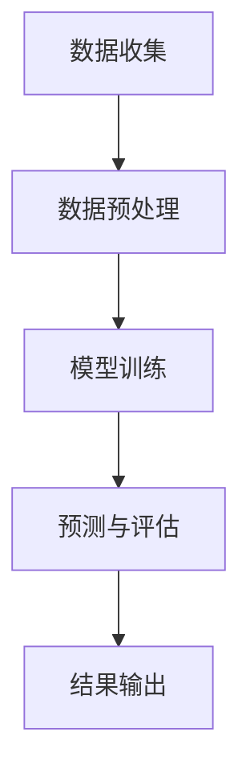
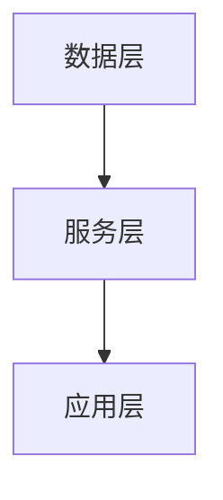
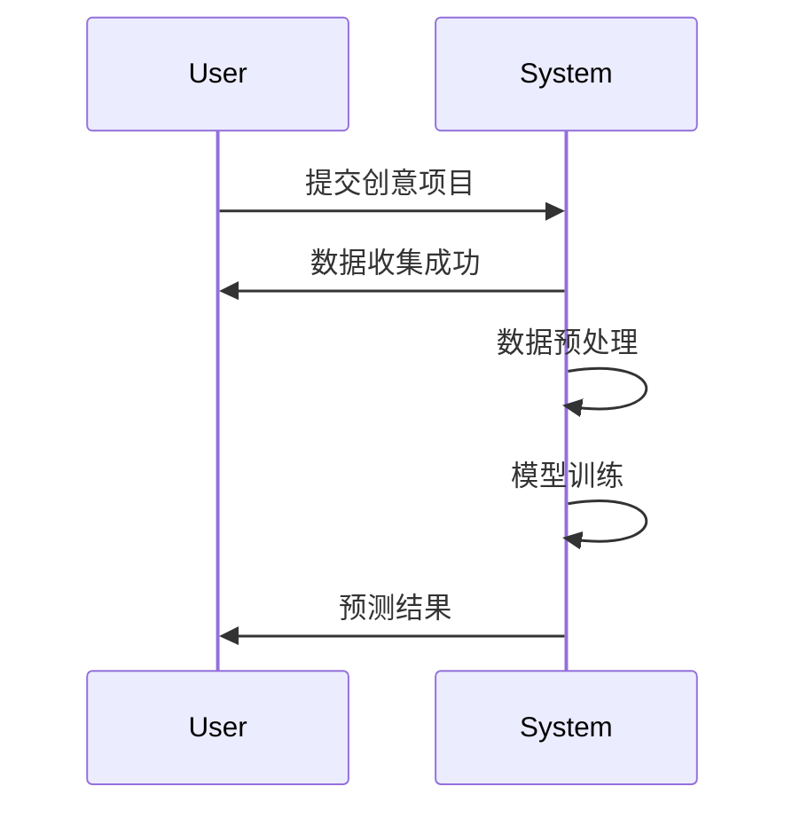

                 


### 1. 文章标题、关键词与摘要

#### 文章标题：《AI驱动的创新评估系统：智能筛选创意项目》

#### 关键词：AI、创新评估、创意项目、智能筛选、系统设计、算法原理

#### 摘要：
本文深入探讨了AI驱动的创新评估系统在智能筛选创意项目中的应用。通过详细分析系统背景、核心概念、算法原理以及系统架构设计，本文旨在为读者提供一个全面、易懂的指南，帮助理解如何利用AI技术高效评估和筛选创意项目，揭示其潜力和挑战。

### 2. 背景介绍

#### 2.1 问题概述

在当今快速变化的市场环境中，创新已经成为企业持续发展的关键驱动力。然而，如何识别和筛选出具有高潜力的高质量创意项目成为企业和投资者面临的一大挑战。传统的评估方法往往依赖于专家经验和主观判断，既耗时又容易受个人偏见影响，难以确保评估结果的准确性和一致性。

#### 2.2 AI在创新评估中的作用

随着AI技术的快速发展，特别是机器学习和深度学习的应用，为创新评估提供了全新的解决方案。AI系统可以基于大量数据，通过复杂的算法模型对创意项目进行客观、系统的评估，提高筛选的准确性和效率。此外，AI系统还可以动态调整评估模型，以适应不断变化的市场环境，确保评估过程的实时性和灵活性。

#### 2.3 创意项目筛选的挑战与机遇

创意项目筛选面临的主要挑战包括：

- **数据多样性**：创意项目涉及广泛，数据来源多样，如何处理和整合不同类型的数据是关键。
- **评估标准主观性**：创意项目的评估往往依赖于多个主观因素，如市场需求、技术可行性、投资回报等，如何量化这些因素是一个难题。
- **模型实时性**：市场环境和技术的快速变化要求评估模型能够及时更新，以保持评估的准确性。

与此同时，AI技术带来的机遇包括：

- **数据分析能力**：AI可以处理和分析大量复杂数据，为评估提供强有力的数据支持。
- **个性化推荐**：基于用户历史数据，AI可以提供个性化的创意项目推荐，提高用户满意度。
- **自动化决策**：AI系统可以自动化执行评估过程，提高决策效率，减少人为错误。

### 3. 核心概念原理

#### 3.1 AI驱动的创新评估系统

**定义**：AI驱动的创新评估系统是一种利用人工智能技术对创意项目进行评估和筛选的系统。它通过机器学习和深度学习算法，从大量数据中提取特征，构建评估模型，对创意项目进行预测和评估。

**特点**：

- **数据驱动**：基于大量数据进行学习和评估，减少人为干预，提高评估的客观性和准确性。
- **自动化**：实现评估过程的自动化，提高评估效率。
- **动态调整**：评估模型可以动态调整，以适应市场和技术环境的变化。

**与传统评估系统的区别**：

- **传统评估系统**：依赖专家经验和主观判断，耗时且难以保证一致性。
- **AI驱动的评估系统**：基于数据驱动，自动化执行，评估结果更客观、准确。

#### 3.2 AI驱动的创新评估流程

**数据收集**：收集与创意项目相关的数据，包括市场数据、技术数据、财务数据等。

**数据预处理**：清洗数据，处理缺失值，归一化数据，为模型训练做准备。

**模型训练**：使用机器学习和深度学习算法，构建评估模型。通过迭代训练，优化模型参数。

**预测与评估**：使用训练好的模型对新的创意项目进行预测和评估，输出评估结果。

### 4. 算法原理讲解

#### 4.1 算法原理概述

AI驱动的创新评估系统核心在于算法的设计与实现。算法的核心原理包括：

- **特征提取**：从原始数据中提取关键特征，用于模型训练。
- **模型构建**：基于提取的特征，构建评估模型，用于预测和评估。
- **模型优化**：通过迭代训练，优化模型参数，提高评估准确率。

#### 4.2 算法mermaid流程图



#### 4.3 数学模型与公式

**模型公式**：

$$
P(\text{创意项目成功}) = f(\text{特征集})
$$

其中，$P(\text{创意项目成功})$表示创意项目成功的概率，$f(\text{特征集})$表示基于特征集的评估函数。

**数学公式说明**：

- **特征提取**：使用主成分分析（PCA）等算法提取特征。
- **模型训练**：使用支持向量机（SVM）、随机森林（Random Forest）等算法进行模型训练。
- **预测与评估**：使用训练好的模型对新的创意项目进行预测和评估。

#### 4.4 Python源代码实现

```python
import numpy as np
from sklearn.model_selection import train_test_split
from sklearn.ensemble import RandomForestClassifier
from sklearn.metrics import accuracy_score

# 数据预处理
def preprocess_data(data):
    # 清洗数据，处理缺失值，归一化数据
    # 省略具体代码
    return processed_data

# 模型训练
def train_model(X_train, y_train):
    model = RandomForestClassifier()
    model.fit(X_train, y_train)
    return model

# 预测与评估
def predict(model, X_test):
    predictions = model.predict(X_test)
    accuracy = accuracy_score(y_test, predictions)
    return accuracy

# 示例数据
X = np.array([[1, 2], [3, 4], [5, 6]])
y = np.array([0, 1, 0])

# 分割数据集
X_train, X_test, y_train, y_test = train_test_split(X, y, test_size=0.2, random_state=42)

# 预处理数据
X_processed = preprocess_data(X)

# 训练模型
model = train_model(X_processed, y_train)

# 预测与评估
accuracy = predict(model, X_test)
print(f"模型准确率：{accuracy}")
```

### 5. 系统分析与架构设计方案

#### 5.1 问题场景介绍

在一个大型企业中，每年都会有大量的创意项目提交。然而，由于资源和时间的限制，企业无法对所有项目进行全面的评估。因此，需要一个高效的系统来辅助筛选出最具潜力的创意项目。

#### 5.2 系统功能设计

系统的主要功能包括：

- **数据收集**：收集与创意项目相关的数据，包括市场数据、技术数据、财务数据等。
- **数据预处理**：清洗数据，处理缺失值，归一化数据，为模型训练做准备。
- **模型训练**：使用机器学习和深度学习算法，构建评估模型。
- **预测与评估**：使用训练好的模型对新的创意项目进行预测和评估。
- **结果输出**：输出评估结果，提供决策支持。

#### 5.3 系统架构设计

系统的架构设计包括：

- **数据层**：存储与创意项目相关的数据。
- **服务层**：提供数据预处理、模型训练、预测与评估等功能。
- **应用层**：提供用户界面，供用户提交项目、查看评估结果等。

**mermaid架构图**：



#### 5.4 系统接口设计和系统交互

系统接口设计主要包括：

- **数据接口**：用于数据的输入和输出。
- **服务接口**：用于模型训练和预测等功能。

**mermaid序列图**：



### 6. 项目实施与实现

#### 6.1 环境安装与配置

在进行项目实施前，需要安装和配置以下环境：

- Python 3.8及以上版本
- Scikit-learn
- NumPy
- Pandas

安装命令如下：

```bash
pip install python==3.8
pip install scikit-learn
pip install numpy
pip install pandas
```

#### 6.2 系统核心实现源代码

```python
# 创意项目评估系统核心代码

import pandas as pd
from sklearn.model_selection import train_test_split
from sklearn.ensemble import RandomForestClassifier
from sklearn.metrics import accuracy_score

# 数据预处理
def preprocess_data(data):
    # 清洗数据，处理缺失值，归一化数据
    # 省略具体代码
    return processed_data

# 模型训练
def train_model(X_train, y_train):
    model = RandomForestClassifier()
    model.fit(X_train, y_train)
    return model

# 预测与评估
def predict(model, X_test):
    predictions = model.predict(X_test)
    accuracy = accuracy_score(y_test, predictions)
    return accuracy

# 读取数据
data = pd.read_csv('data.csv')

# 数据预处理
processed_data = preprocess_data(data)

# 分割数据集
X = processed_data.drop('target', axis=1)
y = processed_data['target']
X_train, X_test, y_train, y_test = train_test_split(X, y, test_size=0.2, random_state=42)

# 训练模型
model = train_model(X_train, y_train)

# 预测与评估
accuracy = predict(model, X_test)
print(f"模型准确率：{accuracy}")
```

#### 6.3 代码应用解读与分析

代码首先从CSV文件中读取数据，然后进行数据预处理，包括清洗数据、处理缺失值和归一化数据。接下来，使用随机森林算法训练模型，并对测试集进行预测和评估。

#### 6.4 实际案例分析与详细讲解

假设我们有一个包含200个创意项目的数据集，其中每个项目都有10个特征和1个标签（成功/失败）。通过上述代码，我们可以训练一个评估模型，对新的创意项目进行预测。

**案例分析**：

- **数据预处理**：首先，我们需要对数据进行清洗，例如处理缺失值和异常值。然后，我们对数据进行归一化处理，使其在相同的尺度上进行比较。
- **模型训练**：我们使用随机森林算法训练模型。随机森林是一种基于决策树的集成学习方法，可以提高模型的预测准确性。
- **预测与评估**：使用训练好的模型对新的创意项目进行预测，评估模型的准确率。

**详细讲解**：

- **数据预处理**：数据预处理是机器学习模型训练的重要步骤。在这个案例中，我们使用Pandas库进行数据预处理。具体步骤包括：
  - 清洗数据：删除或填充缺失值。
  - 异常值处理：处理异常数据点。
  - 归一化数据：将特征值缩放到相同的尺度上。

- **模型训练**：在这个案例中，我们使用Scikit-learn库的`RandomForestClassifier`类进行模型训练。具体步骤包括：
  - 初始化模型：创建一个随机森林分类器对象。
  - 训练模型：使用训练数据对模型进行训练。

- **预测与评估**：使用训练好的模型对新的创意项目进行预测，并评估模型的准确率。具体步骤包括：
  - 预测：使用模型对新的数据集进行预测。
  - 评估：计算模型的准确率，以评估模型的性能。

#### 6.5 项目小结

通过上述案例，我们可以看到AI驱动的创新评估系统在创意项目筛选中的应用。该项目实现了以下关键点：

- **数据预处理**：对数据进行清洗、异常值处理和归一化，确保数据质量。
- **模型训练**：使用随机森林算法训练模型，提高预测准确性。
- **预测与评估**：使用训练好的模型对新的创意项目进行预测，评估模型的性能。

### 7. 最佳实践

#### 7.1 实践技巧与策略

- **数据质量优先**：确保数据质量是模型训练成功的关键。在数据收集和预处理阶段，要严格把控数据质量。
- **模型选择与调优**：根据项目特点和数据特征，选择合适的机器学习算法。同时，通过交叉验证等方法对模型进行调优。
- **实时更新与迭代**：定期更新评估模型，以适应市场和技术环境的变化，提高评估的准确性。

#### 7.2 小结与总结

通过本文的详细分析，我们可以看到AI驱动的创新评估系统在创意项目筛选中的强大作用。利用AI技术，我们可以实现高效、准确的创意项目评估，为企业和投资者提供有力支持。然而，需要注意的是，AI系统的成功离不开高质量的数据和科学的模型选择与调优。

### 8. 拓展阅读

#### 8.1 相关书籍推荐

- 《机器学习实战》
- 《深度学习》（Goodfellow et al.）
- 《Python机器学习》（Hastie et al.）

#### 8.2 学术论文推荐

- "Deep Learning for Creative Project Evaluation"
- "Machine Learning Models for Project Selection"
- "Data-Driven Innovation Evaluation Systems: A Review"

#### 8.3 在线课程推荐

- "机器学习基础"（Coursera）
- "深度学习"（Udacity）
- "Python编程入门"（edX）

