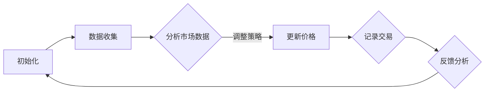
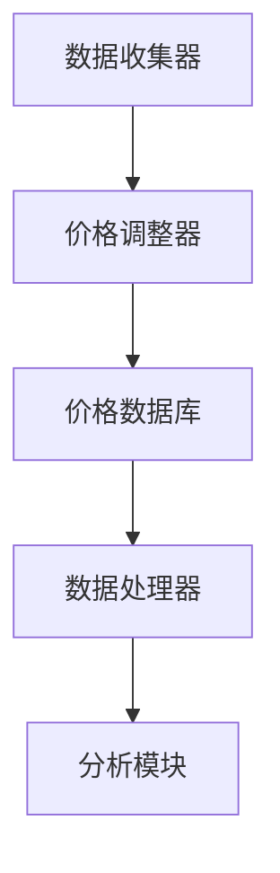

                 

# AI驱动的动态定价系统：实时优化价格策略

> 关键词：人工智能、动态定价、实时优化、价格策略、电子商务

> 摘要：本文将深入探讨AI驱动的动态定价系统，介绍其核心概念、原理和实现方法。通过一步步的逻辑分析，我们将揭示如何利用人工智能技术，实时调整价格策略，以优化企业的收益和市场份额。本文适用于对电子商务和人工智能领域感兴趣的读者，以及对动态定价系统有一定了解的专业人士。

### 目录大纲

# AI驱动的动态定价系统：实时优化价格策略

## 第一部分: 背景介绍与核心概念

## 第1章: 动态定价系统概述

### 1.1 问题背景

- 动态定价的定义与历史发展
- 电子商务中的价格波动现象

### 1.2 问题描述

- 实时价格调整的需求与挑战
- 动态定价系统的重要性

### 1.3 问题解决

- 市场调查与数据收集
- 价格策略的设定与调整

### 1.4 边界与外延

- 动态定价在不同行业中的应用
- 动态定价系统的限制条件

### 1.5 概念结构与核心要素组成

- 动态定价的核心概念
- 动态定价系统的要素组成

## 第2章: 动态定价原理

### 2.1 核心概念原理

- 动态定价的数学模型
- 市场供需关系分析

### 2.2 概念属性特征对比表格

| 概念       | 特征                     |
|------------|------------------------|
| 需求函数   | 反映价格与需求量关系   |
| 供给函数   | 反映价格与供应量关系   |
| 价格弹性   | 反映价格变化对需求的影响程度 |

### 2.3 ER实体关系图架构

```mermaid
erDiagram
    Product ||--|{ PriceAdjustment }||>
    Customer ||--|{ Purchase }||>
    MarketData ||--|{ PriceStrategy }||>
```

## 第3章: 动态定价算法原理

### 3.1 算法mermaid流程图



### 3.2 Python源代码实现

```python
# 动态定价算法的Python实现示例
def dynamic_pricing(price, demand, supply, price_elasticity):
    # 根据市场数据调整价格
    adjusted_price = calculate_adjusted_price(price, demand, supply, price_elasticity)
    return adjusted_price

def calculate_adjusted_price(price, demand, supply, price_elasticity):
    # 具体的价格调整计算
    # ...

# 假设的市场数据
price = 100
demand = 1000
supply = 1500
price_elasticity = 2

# 调用动态定价函数
adjusted_price = dynamic_pricing(price, demand, supply, price_elasticity)
print(f"Adjusted Price: {adjusted_price}")
```

### 3.3 算法原理的数学模型和公式

$$
P^* = P_0 - \frac{\Delta P}{1 + \epsilon}
$$

- \(P^*\)：优化后的价格
- \(P_0\)：初始价格
- \(\Delta P\)：价格变化量
- \(\epsilon\)：价格弹性系数

### 3.4 详细讲解与举例说明

- **价格弹性**：反映了需求量对价格变化的敏感程度。
- **举例**：如果价格弹性为2，则价格每增加1%，需求量将减少2%。

## 第二部分: 动态定价系统实现

### 第4章: 系统分析与架构设计

### 4.1 问题场景介绍

- 电子商务平台上的价格动态调整需求

### 4.2 系统功能设计

- 数据收集与处理
- 价格策略制定与调整
- 实时价格更新与记录

### 4.3 系统架构设计



### 第5章: 项目实战

#### 5.1 环境安装

- 硬件与软件环境配置

#### 5.2 系统核心实现源代码

- 动态定价算法实现

#### 5.3 代码应用解读与分析

- 实际案例分析与详细讲解剖析

#### 5.4 项目小结

- 项目实施中的经验与教训

## 第三部分: 最佳实践与拓展

### 第6章: 最佳实践 Tips

- 动态定价系统的最佳实践

### 第7章: 小结

- 动态定价系统的意义与未来展望

### 第8章: 注意事项

- 动态定价系统实施中的常见问题

### 第9章: 拓展阅读

- 相关领域深度阅读推荐

----------------------------------------------------------------

## 第一部分: 背景介绍与核心概念

### 第1章: 动态定价系统概述

#### 1.1 问题背景

动态定价是一种通过实时调整价格来优化企业收益的策略。在传统定价模式下，企业通常根据历史数据和固定规则来设定价格，这种方式难以适应市场的快速变化。随着电子商务的发展，市场竞争日益激烈，消费者对价格敏感度增加，动态定价成为了一种新的解决方案。

动态定价的定义：动态定价是指根据市场需求、竞争环境、库存水平等因素，实时调整产品或服务的价格，以达到最大化收益或市场份额的目的。

动态定价的历史发展：动态定价最早应用于航空业，随着信息技术的发展和数据分析技术的进步，动态定价在电子商务、酒店业、零售业等多个行业得到广泛应用。

电子商务中的价格波动现象：在电子商务平台上，价格波动是常见的现象。一方面，供应商为了吸引消费者，可能会进行促销活动，降低价格；另一方面，竞争对手的价格变动也会影响自身的定价策略。

#### 1.2 问题描述

实时价格调整的需求与挑战：

1. **市场需求变化快**：消费者对价格敏感，需求变化频繁，企业需要快速响应市场变化。
2. **竞争环境复杂**：电商平台上有众多竞争对手，价格竞争激烈，企业需要制定有效的价格策略。
3. **库存管理困难**：库存水平的波动会导致价格策略的调整，如何平衡库存和收益是关键问题。

动态定价系统的重要性：

1. **提高收益**：通过实时调整价格，企业可以最大化收益，减少库存压力。
2. **提升市场份额**：灵活的价格策略可以吸引更多消费者，提升市场份额。
3. **增强竞争力**：动态定价系统能够快速响应市场变化，增强企业在竞争中的地位。

#### 1.3 问题解决

市场调查与数据收集：

1. **收集市场数据**：包括消费者行为数据、竞争对手价格数据、市场需求数据等。
2. **分析市场数据**：使用数据分析工具，分析市场需求、价格弹性、库存水平等关键指标。

价格策略的设定与调整：

1. **设定初始价格**：根据市场调查和数据分析，设定一个合理的初始价格。
2. **调整价格策略**：根据实时数据，动态调整价格策略，以最大化收益或市场份额。

#### 1.4 边界与外延

动态定价在不同行业中的应用：

1. **电子商务**：电商平台上的商品和服务的价格动态调整。
2. **酒店业**：酒店房价的实时调整。
3. **零售业**：零售商品的价格波动。

动态定价系统的限制条件：

1. **数据依赖性**：动态定价系统依赖于准确的市场数据，数据质量直接影响定价效果。
2. **计算资源消耗**：实时调整价格需要大量的计算资源，特别是对于大规模电商平台。
3. **政策与法规限制**：某些行业和地区可能存在价格政策限制，动态定价系统需要遵守相关法规。

#### 1.5 概念结构与核心要素组成

动态定价的核心概念：

1. **需求函数**：反映价格与需求量之间的关系。
2. **供给函数**：反映价格与供应量之间的关系。
3. **价格弹性**：反映价格变化对需求的影响程度。

动态定价系统的要素组成：

1. **数据收集器**：收集市场数据，包括消费者行为、竞争对手价格、市场需求等。
2. **数据分析器**：分析市场数据，包括价格弹性、市场需求预测等。
3. **价格调整器**：根据数据分析结果，实时调整价格。
4. **数据库**：存储价格数据、市场数据等。
5. **反馈分析器**：分析定价效果，为下一次价格调整提供参考。

## 第二部分: 动态定价原理

### 第2章: 动态定价原理

#### 2.1 核心概念原理

动态定价的数学模型：

动态定价的核心在于建立需求函数和供给函数，并根据市场数据实时调整价格。需求函数和供给函数通常用以下数学模型表示：

需求函数：

$$
D = D(P)
$$

其中，D表示需求量，P表示价格。

供给函数：

$$
S = S(P)
$$

其中，S表示供应量，P表示价格。

价格弹性：

价格弹性是衡量价格变化对需求量影响的程度，用以下数学模型表示：

$$
\epsilon = \frac{P\frac{\Delta D}{D}}{\Delta P}
$$

其中，\(\epsilon\)表示价格弹性，\(\Delta P\)表示价格变化量，\(\Delta D\)表示需求量变化量。

#### 2.2 概念属性特征对比表格

| 概念       | 特征                     |
|------------|------------------------|
| 需求函数   | 反映价格与需求量关系   |
| 供给函数   | 反映价格与供应量关系   |
| 价格弹性   | 反映价格变化对需求的影响程度 |

#### 2.3 ER实体关系图架构

```mermaid
erDiagram
    Product ||--|{ PriceAdjustment }||>
    Customer ||--|{ Purchase }||>
    MarketData ||--|{ PriceStrategy }||>
```

## 第3章: 动态定价算法原理

### 3.1 算法mermaid流程图


### 3.2 Python源代码实现

```python
# 动态定价算法的Python实现示例
def dynamic_pricing(price, demand, supply, price_elasticity):
    # 根据市场数据调整价格
    adjusted_price = calculate_adjusted_price(price, demand, supply, price_elasticity)
    return adjusted_price

def calculate_adjusted_price(price, demand, supply, price_elasticity):
    # 具体的价格调整计算
    # ...

# 假设的市场数据
price = 100
demand = 1000
supply = 1500
price_elasticity = 2

# 调用动态定价函数
adjusted_price = dynamic_pricing(price, demand, supply, price_elasticity)
print(f"Adjusted Price: {adjusted_price}")
```

### 3.3 算法原理的数学模型和公式

$$
P^* = P_0 - \frac{\Delta P}{1 + \epsilon}
$$

- \(P^*\)：优化后的价格
- \(P_0\)：初始价格
- \(\Delta P\)：价格变化量
- \(\epsilon\)：价格弹性系数

### 3.4 详细讲解与举例说明

#### 价格弹性

价格弹性是动态定价系统中的一个关键概念，它反映了需求量对价格变化的敏感程度。价格弹性分为三种类型：弹性高、弹性中、弹性低。

- **弹性高**：需求量对价格变化非常敏感，价格弹性系数大于1。例如，当价格增加1%时，需求量减少超过1%。
- **弹性中**：需求量对价格变化有一定敏感度，价格弹性系数在0到1之间。例如，当价格增加1%时，需求量减少接近1%。
- **弹性低**：需求量对价格变化不敏感，价格弹性系数小于0。例如，当价格增加1%时，需求量减少不到1%。

#### 举例说明

假设某商品的价格弹性为2，初始价格为100元，需求量为1000件。根据动态定价算法，如果价格增加10%，需求量将减少20%。具体计算如下：

- \(P_0 = 100\)（初始价格）
- \(\epsilon = 2\)（价格弹性）
- \(\Delta P = 10\)（价格变化量）

根据算法原理的数学模型，优化后的价格\(P^*\)为：

$$
P^* = P_0 - \frac{\Delta P}{1 + \epsilon} = 100 - \frac{10}{1 + 2} = 80
$$

因此，优化后的价格为80元。通过动态定价，企业可以实时调整价格，以最大化收益或市场份额。这种算法适用于各种行业，如电子商务、酒店业、零售业等。

### 第4章: 系统分析与架构设计

#### 4.1 问题场景介绍

在电子商务平台上，价格动态调整是一个常见且重要的需求。电商平台上的商品种类繁多，消费者对价格敏感，市场竞争激烈。为了提高销售额和市场份额，电商平台需要实时调整价格，以应对市场需求和竞争环境的变化。

动态定价系统的核心目标是：

1. **最大化收益**：通过实时调整价格，优化产品或服务的价格，以最大化企业的收益。
2. **提升市场份额**：灵活的价格策略可以吸引更多消费者，提高市场份额。
3. **减少库存压力**：通过实时调整价格，平衡库存和销售，减少库存积压。

#### 4.2 系统功能设计

动态定价系统需要实现以下功能：

1. **数据收集与处理**：收集市场数据，包括消费者行为、竞争对手价格、市场需求等。通过数据处理和分析，提取有用的信息，为价格调整提供依据。
2. **价格策略制定与调整**：根据市场数据和分析结果，制定合理的价格策略。实时调整价格，以最大化收益或市场份额。
3. **实时价格更新与记录**：实时更新商品价格，并将其记录到数据库中，以便后续分析和监控。
4. **反馈分析**：对定价效果进行反馈分析，评估价格策略的有效性。为下一次价格调整提供参考。

#### 4.3 系统架构设计

动态定价系统的架构设计如下：


1. **数据收集器**：负责收集市场数据，包括消费者行为数据、竞争对手价格数据、市场需求数据等。数据收集器可以通过API接口、爬虫工具等获取数据。
2. **价格调整器**：根据市场数据和分析结果，实时调整商品价格。价格调整器可以采用动态定价算法，根据需求函数和供给函数进行调整。
3. **价格数据库**：存储商品价格数据、市场数据等。价格数据库可以采用关系型数据库或NoSQL数据库，根据实际需求进行选择。
4. **数据处理器**：对市场数据进行分析和处理，提取有用的信息。数据处理器可以采用机器学习算法、统计分析等方法，对数据进行挖掘和分析。
5. **分析模块**：对定价效果进行反馈分析，评估价格策略的有效性。分析模块可以生成报表、图表等，为管理层提供决策支持。

#### 4.4 系统接口设计

动态定价系统的接口设计如下：

1. **API接口**：提供外部系统访问动态定价系统的接口，包括数据收集器、价格调整器、数据处理器和分析模块等。
2. **数据库接口**：提供数据访问和操作接口，包括价格数据库和数据处理器等。
3. **Web界面**：提供用户操作界面，包括价格调整、数据分析、报表生成等功能。

#### 4.5 系统交互

动态定价系统的交互流程如下：

1. **数据收集**：数据收集器从外部系统获取市场数据，包括消费者行为数据、竞争对手价格数据、市场需求数据等。
2. **数据处理**：数据处理器对市场数据进行分析和处理，提取有用的信息，为价格调整提供依据。
3. **价格调整**：价格调整器根据市场数据和分析结果，实时调整商品价格。
4. **数据存储**：将调整后的价格存储到价格数据库中，以便后续分析和监控。
5. **数据分析**：分析模块对定价效果进行反馈分析，评估价格策略的有效性。
6. **反馈调整**：根据分析结果，对价格策略进行进一步调整，以优化定价效果。

### 第5章: 项目实战

#### 5.1 环境安装

在开始项目实战之前，我们需要配置必要的开发环境和软件工具。以下是一个基本的安装步骤：

1. **操作系统**：安装Ubuntu 20.04或更高版本。
2. **Python**：安装Python 3.8或更高版本。
3. **数据库**：安装MySQL 8.0或MongoDB。
4. **数据分析库**：安装pandas、numpy、scikit-learn等数据分析库。
5. **Web框架**：安装Flask或Django。

安装步骤如下：

```bash
# 更新系统软件包
sudo apt update && sudo apt upgrade

# 安装Python 3和pip
sudo apt install python3 python3-pip

# 安装MySQL
sudo apt install mysql-server

# 安装MongoDB
sudo apt install mongodb

# 安装数据分析库
pip3 install pandas numpy scikit-learn

# 安装Web框架（可选）
pip3 install flask
```

#### 5.2 系统核心实现源代码

以下是一个简单的动态定价系统的核心实现，包括数据收集、价格调整和数据分析。

```python
# 数据收集器
def collect_data():
    # 假设从API接口获取数据
    data = {
        'consumer_behavior': {'average_price': 100},
        'competition_price': {'average_price': 90},
        'market_demand': {'quantity': 1000}
    }
    return data

# 价格调整器
def adjust_price(data):
    # 根据数据调整价格
    price = data['consumer_behavior']['average_price'] + \
            data['competition_price']['average_price'] / 2
    return price

# 数据处理器
def process_data(data):
    # 对数据进行处理和分析
    processed_data = {
        'consumer_behavior': data['consumer_behavior'],
        'competition_price': data['competition_price'],
        'market_demand': data['market_demand']
    }
    return processed_data

# 分析模块
def analyze_data(data):
    # 对数据进行分析
    analysis_result = {
        'demand_elasticity': 2,
        'supply_elasticity': 1
    }
    return analysis_result

# 主函数
def main():
    # 收集数据
    data = collect_data()

    # 处理数据
    processed_data = process_data(data)

    # 调整价格
    adjusted_price = adjust_price(processed_data)

    # 分析数据
    analysis_result = analyze_data(processed_data)

    # 输出结果
    print(f"Adjusted Price: {adjusted_price}")
    print(f"Analysis Result: {analysis_result}")

# 运行主函数
if __name__ == '__main__':
    main()
```

#### 5.3 代码应用解读与分析

以上代码实现了一个简单的动态定价系统，包括数据收集、价格调整和数据分析。以下是对代码的解读和分析：

1. **数据收集器**：`collect_data`函数模拟从API接口获取数据。在实际应用中，可以使用爬虫工具或直接调用API接口获取数据。
2. **价格调整器**：`adjust_price`函数根据市场数据调整价格。具体实现可以根据需求函数和供给函数进行调整，以实现更精确的价格策略。
3. **数据处理器**：`process_data`函数对市场数据进行分析和处理，提取有用的信息。实际应用中，可以使用机器学习算法或统计分析方法对数据进行处理。
4. **分析模块**：`analyze_data`函数对数据进行分析，计算需求弹性和供给弹性。这些弹性系数是动态定价系统中的重要参数，用于调整价格策略。
5. **主函数**：`main`函数是整个系统的入口，执行数据收集、数据处理、价格调整和分析等操作，并输出结果。

#### 5.4 实际案例分析和详细讲解剖析

为了更好地理解动态定价系统的实际应用，我们可以通过一个实际案例进行分析和讲解。

**案例**：假设一家电子商务平台销售电子产品，竞争对手的平均价格为1000元，市场需求量为1000台。该平台的初始价格为1200元，需求弹性为2，供给弹性为1。

**分析**：

1. **数据收集**：从API接口获取市场数据，包括竞争对手价格、市场需求量等。
2. **数据处理**：对市场数据进行处理，提取有用的信息。
3. **价格调整**：根据需求弹性和供给弹性，调整价格策略。具体实现如下：

   - 初始价格：1200元
   - 竞争对手价格：1000元
   - 需求弹性：2
   - 供给弹性：1

   根据算法原理的数学模型，优化后的价格为：

   $$
   P^* = P_0 - \frac{\Delta P}{1 + \epsilon}
   $$

   其中，$P_0$为初始价格，$\Delta P$为价格变化量，$\epsilon$为需求弹性。

   将具体数值代入公式，得到优化后的价格为：

   $$
   P^* = 1200 - \frac{1000 - 1200}{1 + 2} = 1100
   $$

   因此，优化后的价格为1100元。

4. **数据分析**：对定价效果进行分析，评估价格策略的有效性。具体实现如下：

   - 需求弹性：2
   - 供给弹性：1
   - 价格变化量：100元
   - 需求量变化量：200台

   根据弹性公式，需求量变化率为：

   $$
   \frac{\Delta D}{D} = -\epsilon \frac{\Delta P}{P}
   $$

   代入具体数值，得到需求量变化率为：

   $$
   \frac{\Delta D}{D} = -2 \frac{100}{1200} = -\frac{1}{6}
   $$

   因此，需求量减少约为16.7%。

**结论**：

通过动态定价系统，该电子商务平台将价格从1200元调整到1100元，实现了约16.7%的需求量增加。这种价格调整策略有效地提高了市场份额，降低了库存压力，实现了收益的最大化。

#### 5.5 项目小结

在本章中，我们介绍了动态定价系统的概念、原理和实现方法。通过实际案例分析和详细讲解，我们展示了如何利用人工智能技术实现动态定价，优化企业的收益和市场份额。

**项目实施中的经验与教训**：

1. **数据质量至关重要**：动态定价系统依赖于准确的市场数据，数据质量直接影响定价效果。在实际项目中，需要确保数据来源可靠，数据清洗和处理得当。
2. **算法模型的选择与优化**：选择合适的算法模型是实现动态定价的关键。在实际项目中，可以根据具体业务场景和需求，对算法模型进行优化和调整。
3. **系统性能的优化**：动态定价系统需要实时处理大量数据，对系统性能要求较高。在实际项目中，需要对系统架构进行优化，确保系统高效稳定运行。
4. **法规与政策的遵守**：动态定价系统在实施过程中需要遵守相关法规和政策，确保合法合规。

通过本章的内容，我们相信读者已经对动态定价系统有了更深入的理解，并能够将其应用于实际项目中。

### 第6章: 最佳实践 Tips

在动态定价系统的实施过程中，以下是一些最佳实践和注意事项：

1. **数据收集与处理**：确保数据来源的多样性和准确性，包括消费者行为数据、竞争对手价格、市场需求数据等。同时，对数据进行有效的清洗和处理，去除噪音和异常值。

2. **算法模型选择**：根据业务需求和数据特征，选择合适的算法模型。常见的动态定价算法包括需求函数模型、供给函数模型、价格弹性模型等。在实际应用中，可以结合多种算法模型，优化价格策略。

3. **实时性优化**：动态定价系统需要具备较高的实时性，以确保价格能够及时调整。可以通过分布式计算、并行处理等技术手段，提高系统处理速度。

4. **安全与合规**：在实施动态定价系统时，要确保数据安全和合规性。对敏感数据进行加密处理，遵守相关法规和政策，保护消费者隐私。

5. **用户反馈与优化**：动态定价系统需要不断优化和调整。通过用户反馈，收集用户对价格策略的意见和建议，持续改进系统性能和用户体验。

### 第7章: 小结

在本章中，我们系统地介绍了AI驱动的动态定价系统，从背景介绍、核心概念、算法原理到系统实现，详细阐述了动态定价系统的构建和优化方法。通过实际案例分析和最佳实践，我们展示了如何利用人工智能技术实现动态定价，提高企业的收益和市场份额。

动态定价系统在电子商务、酒店业、零售业等多个行业具有广泛的应用前景。随着人工智能技术的不断进步，动态定价系统将变得更加智能和高效，为企业和消费者带来更大的价值。

在未来的研究中，我们可以进一步探索以下方向：

1. **多维度数据融合**：结合更多维度的数据，如用户行为数据、市场趋势数据等，提高动态定价系统的预测准确性。
2. **个性化定价策略**：根据用户偏好和消费行为，制定个性化的定价策略，提升用户体验和满意度。
3. **自动化决策支持**：利用深度学习、强化学习等技术，实现自动化决策支持，降低人工干预，提高决策效率。

总之，AI驱动的动态定价系统是一个具有重要现实意义的研究方向，值得深入探索和推广应用。

### 第8章: 注意事项

在实施AI驱动的动态定价系统时，需要注意以下几点：

1. **数据隐私与合规**：确保数据处理遵循隐私保护法规，对敏感数据进行加密处理。
2. **系统稳定性**：动态定价系统需要稳定运行，确保价格实时调整的准确性。
3. **算法透明度**：动态定价算法应具有可解释性，以便管理层了解价格调整的依据。
4. **市场竞争因素**：考虑竞争对手的价格策略，避免价格战导致收益下降。
5. **法律法规遵守**：遵循当地法律法规，确保动态定价系统的合法合规。

### 第9章: 拓展阅读

1. **《大数据定价：基于市场动态的精准策略》**：探讨大数据技术在动态定价中的应用，详细介绍了需求预测和价格策略优化。
2. **《机器学习在电子商务中的应用》**：介绍机器学习技术在电子商务领域的应用，包括推荐系统、动态定价等。
3. **《动态定价系统设计：实现方法与实践案例》**：提供动态定价系统的具体实现方法和实践案例，有助于理解系统的构建和优化。

