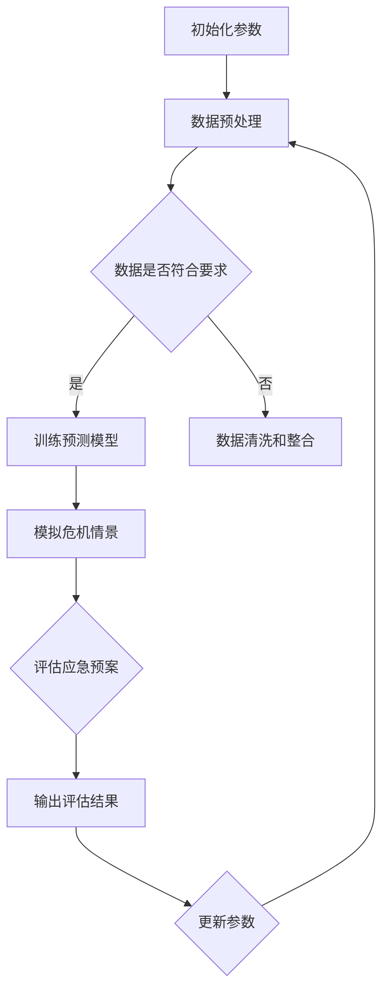

                 


# 《AI驱动的危机模拟系统：增强企业应急能力》

> 关键词：AI危机模拟、应急管理、企业安全、系统架构、算法原理

> 摘要：本文深入探讨了AI驱动的危机模拟系统在提升企业应急能力方面的作用。通过详细分析系统的核心概念、架构设计、算法原理，以及实际应用案例，本文旨在为企业提供一个全方位的AI危机模拟解决方案，以增强其应对突发事件的能力。

## 引言：企业应急能力的重要性与AI驱动的危机模拟系统

### 1. 背景介绍

#### 1.1 应急管理的演变与挑战

随着全球化进程的加速，企业面临的风险种类和复杂度不断增加。传统的应急管理方法往往无法及时、高效地应对各种突发事件，导致企业损失严重。因此，提升企业应急能力成为当前的重要课题。

#### 1.2 AI技术在应急管理中的应用

人工智能（AI）技术的发展为应急管理提供了新的工具和方法。通过AI驱动的危机模拟系统，企业可以在模拟环境中测试各种应急预案，提高应对突发事件的能力。

#### 1.3 本书目标与结构

本书旨在介绍AI驱动的危机模拟系统，探讨其在企业应急管理中的应用。文章分为八大部分，包括背景介绍、系统基础、核心概念、算法原理、系统设计、项目实战、最佳实践和总结。

## 第二部分：AI驱动的危机模拟系统基础

### 2. AI驱动的危机模拟系统概述

#### 2.1 系统定义与核心功能

AI驱动的危机模拟系统是一种基于人工智能技术的系统，用于模拟各种突发事件，帮助企业制定和优化应急预案。

#### 2.2 系统架构设计

系统架构包括数据采集模块、模型训练模块、模拟测试模块和结果分析模块。

#### 2.3 系统关键技术

系统采用机器学习、深度学习和强化学习等技术，实现危机模拟和预测。

## 第三部分：核心概念与联系

### 3. 核心概念原理

#### 3.1 AI基础知识

##### 3.1.1 机器学习基础

机器学习是AI的核心技术之一，通过训练模型来识别数据中的模式。

##### 3.1.2 深度学习基础

深度学习是机器学习的一个分支，通过多层神经网络来提取数据特征。

##### 3.1.3 强化学习基础

强化学习通过不断尝试和反馈来优化决策过程。

#### 3.2 冒险模拟原理

##### 3.2.1 冒险模拟的基本概念

冒险模拟是一种通过模拟环境来测试应急预案的方法。

##### 3.2.2 冒险模拟的方法

包括场景设计、模拟运行和结果分析等步骤。

##### 3.2.3 冒险模拟的应用场景

包括自然灾害、网络安全事件和企业内部危机等。

### 4. 概念属性特征对比

#### 4.1 AI模型属性特征对比

| 特征          | 机器学习     | 深度学习     | 强化学习     |
| ----------- | -------- | -------- | -------- |
| 算法复杂度    | 较低       | 较高       | 中等       |
| 数据需求      | 大量数据     | 大量数据     | 小量数据     |
| 可解释性      | 较高       | 较低       | 较低       |

#### 4.2 冒险模拟技术特征对比

| 特征          | 传统模拟     | AI驱动的模拟 |
| ----------- | -------- | -------- |
| 模拟速度      | 较慢       | 极快       |
| 模拟精度      | 较低       | 较高       |
| 模拟灵活性      | 有限       | 极高       |

### 5. ER实体关系图架构

#### 5.1 系统实体定义

实体包括事件、模拟场景、模型和结果等。

#### 5.2 实体属性关系描述

实体间通过关联关系进行连接，形成完整的系统架构。

#### 5.3 ER图展示与解释

（此处使用Mermaid绘制ER图）

## 第四部分：算法原理讲解

### 6. 算法原理讲解

#### 6.1 冒险模拟算法流程图

（此处使用Mermaid绘制流程图）

#### 6.2 源代码解析

（此处使用Python代码进行解析）

#### 6.3 数学模型和公式

##### 6.3.1 冒险模拟数学模型

$$
模型输出 = f(输入数据)
$$

##### 6.3.2 公式推导与解释

（此处详细解释公式）

#### 6.4 举例说明

##### 6.4.1 简单案例演示

（此处进行案例演示）

##### 6.4.2 案例分析

（此处分析案例）

## 第五部分：系统分析与架构设计方案

### 7. 系统分析与架构设计方案

#### 7.1 问题场景介绍

（此处介绍问题场景）

#### 7.2 项目介绍

##### 7.2.1 项目背景

（此处介绍项目背景）

##### 7.2.2 项目目标

（此处介绍项目目标）

#### 7.3 系统功能设计

（此处使用Mermaid绘制领域模型类图）

#### 7.4 系统架构设计

（此处使用Mermaid绘制架构图）

#### 7.5 系统接口设计和系统交互

（此处使用Mermaid绘制序列图）

## 第六部分：项目实战

### 8. 项目实战

#### 8.1 环境安装

##### 8.1.1 环境准备

（此处介绍环境准备）

##### 8.1.2 系统安装步骤

（此处介绍系统安装步骤）

#### 8.2 系统核心实现源代码

##### 8.2.1 代码结构

（此处介绍代码结构）

##### 8.2.2 代码应用解读

（此处进行代码应用解读）

#### 8.3 代码应用解读与分析

##### 8.3.1 功能模块分析

（此处分析功能模块）

##### 8.3.2 性能优化分析

（此处分析性能优化）

#### 8.4 实际案例分析和详细讲解剖析

##### 8.4.1 案例背景

（此处介绍案例背景）

##### 8.4.2 案例分析

（此处分析案例）

#### 8.5 项目小结

##### 8.5.1 项目成果总结

（此处总结项目成果）

##### 8.5.2 项目经验与反思

（此处反思项目经验）

## 第七部分：最佳实践 Tips

### 9. 最佳实践 Tips

#### 9.1 AI驱动的危机模拟系统实施建议

##### 9.1.1 系统规划

（此处提出系统规划建议）

##### 9.1.2 技术选型

（此处提出技术选型建议）

##### 9.1.3 项目管理

（此处提出项目管理建议）

#### 9.2 常见问题与解决方案

##### 9.2.1 系统部署问题

（此处提出系统部署问题及解决方案）

##### 9.2.2 数据处理问题

（此处提出数据处理问题及解决方案）

##### 9.2.3 模型训练问题

（此处提出模型训练问题及解决方案）

## 第八部分：小结、注意事项与拓展阅读

### 10. 小结

#### 10.1 全书总结

（此处总结全书内容）

#### 10.2 关键点回顾

（此处回顾关键点）

### 11. 注意事项

#### 11.1 系统实施中的注意事项

（此处提出注意事项）

#### 11.2 持续学习与更新

（此处强调持续学习与更新）

### 12. 拓展阅读

#### 12.1 相关文献推荐

（此处推荐相关文献）

#### 12.2 AI与应急管理的最新研究动态

（此处介绍最新研究动态）

# 结论

AI驱动的危机模拟系统为企业提供了一种全新的应急管理方法，通过模拟和预测，帮助企业提高应急响应能力。本文从系统基础、核心概念、算法原理到实际应用，全面阐述了AI驱动的危机模拟系统的构建和实现。希望本文能为读者提供有价值的参考，助力企业提升应急能力。

## 附录

### A. 术语解释

（此处列出相关术语的解释）

### B. 参考文献

（此处列出参考文献）

## 作者信息

作者：AI天才研究院/AI Genius Institute & 禅与计算机程序设计艺术 /Zen And The Art of Computer Programming

本文详细阐述了AI驱动的危机模拟系统在企业应急能力提升中的应用。通过对系统核心概念、架构设计、算法原理的深入剖析，以及实际案例的分析和最佳实践的建议，本文旨在为企业提供一套全面的AI危机模拟解决方案。读者可以通过本文了解AI技术在应急管理中的前沿应用，并掌握相关技术要领。

### 1. AI驱动的危机模拟系统概述

AI驱动的危机模拟系统是一种结合人工智能技术，用于模拟和预测各类突发事件，帮助企业提高应急响应能力的系统。系统通过收集历史数据、实时监控和预测模型，模拟各种可能发生的危机情景，评估企业现有应急预案的有效性，并提供优化建议。

#### 1.1 系统定义与核心功能

系统定义：AI驱动的危机模拟系统是一种基于人工智能技术，能够模拟和预测危机事件，评估应急预案效果，并提供改进建议的系统。

核心功能：

- 数据收集与处理：收集企业内外部的数据，包括历史危机事件数据、实时监控数据等。
- 模型训练与预测：利用机器学习、深度学习和强化学习等技术，训练预测模型，模拟危机事件发展。
- 模拟测试与评估：模拟各种危机情景，评估企业应急预案的有效性。
- 结果分析与优化：分析模拟结果，提出优化应急预案的建议。

#### 1.2 系统架构设计

系统架构设计是构建AI驱动的危机模拟系统的关键。一个典型的系统架构包括以下几个模块：

- 数据采集模块：负责收集企业内外部的数据，包括历史数据、实时数据等。
- 数据预处理模块：对收集到的数据进行清洗、整合和转换，为模型训练提供高质量的输入数据。
- 模型训练模块：使用机器学习、深度学习和强化学习等技术，训练预测模型。
- 模拟测试模块：根据训练好的模型，模拟各种危机情景，评估企业应急预案的有效性。
- 结果分析模块：分析模拟结果，评估应急预案效果，并提出优化建议。
- 界面交互模块：提供用户操作界面，展示模拟结果和优化建议，便于用户查看和管理。

#### 1.3 系统关键技术

系统关键技术的选择直接影响系统的性能和效果。以下是一些常见的系统关键技术：

- 机器学习：通过训练模型，从历史数据中学习危机事件的规律和特征，用于预测未来事件。
- 深度学习：利用多层神经网络，从大量数据中自动提取特征，提高模型预测的准确性和效率。
- 强化学习：通过不断尝试和反馈，优化决策过程，提高系统应对复杂危机事件的能力。
- 数据库技术：用于存储和管理大量历史数据、实时数据和模拟结果数据。
- 数据可视化技术：将模拟结果和数据以图形化方式展示，便于用户理解和分析。

### 2. 核心概念原理

在构建AI驱动的危机模拟系统时，理解以下核心概念和原理至关重要：

#### 2.1 AI基础知识

AI基础知识是构建危机模拟系统的基石。以下是一些关键知识点：

- 机器学习基础：了解机器学习的基本概念、算法和应用场景，如分类、回归、聚类等。
- 深度学习基础：掌握深度学习的基本原理、网络结构和训练方法，如神经网络、卷积神经网络、循环神经网络等。
- 强化学习基础：理解强化学习的基本原理、策略优化方法和应用场景，如Q学习、策略梯度方法等。

#### 2.2 冒险模拟原理

冒险模拟是危机模拟系统的重要组成部分。以下是一些关键知识点：

- 冒险模拟的基本概念：了解冒险模拟的定义、目标和过程。
- 冒险模拟的方法：掌握不同的冒险模拟方法，如基于规则的方法、基于模型的方法、基于模拟的方法等。
- 冒险模拟的应用场景：了解冒险模拟在不同领域中的应用，如自然灾害、网络安全、企业内部危机等。

#### 2.3 企业应急管理系统特征

企业应急管理系统是危机模拟系统的重要应用领域。以下是一些关键知识点：

- 企业应急管理系统定义：了解企业应急管理的定义、目标和任务。
- 企业应急管理系统特征：掌握企业应急管理系统的基本功能、架构和关键技术。
- 企业应急管理系统应用场景：了解企业应急管理系统的应用场景，如自然灾害、火灾、网络安全事件等。

### 3. 概念属性特征对比

在构建AI驱动的危机模拟系统时，了解不同概念和技术的属性特征有助于选择合适的方法和技术。以下是一个简化的概念属性特征对比表格：

| 概念       | 属性特征                     | 举例                     |
| ---------- | -------------------------- | ---------------------- |
| 机器学习   | 自适应、模式识别           | 分类、回归、聚类等     |
| 深度学习   | 自动特征提取、非线性建模   | 图像识别、语音识别等   |
| 强化学习   | 策略优化、连续决策         | 游戏对战、无人驾驶等   |
| 冒险模拟   | 情景测试、预测评估         | 灾害评估、网络安全测试等 |
| 企业应急管理 | 预案制定、应急响应         | 自然灾害、火灾、网络安全等 |

### 4. ER实体关系图架构

ER（实体关系）图是描述系统实体及其关系的常用工具。以下是一个简化的ER图示例，用于描述AI驱动的危机模拟系统中的主要实体及其关系：

```mermaid
erDiagram
  CrisisEvent ||--|{ SimulationScenario }|<
  SimulationScenario ||--|{ PredictiveModel }|<
  PredictiveModel ||--|{ SimulationResult }|<
  EmergencyResponsePlan ||--|{ SimulationResult }|<
```

#### 4.1 系统实体定义

- **CrisisEvent**：表示危机事件，包括事件名称、发生时间、影响范围等属性。
- **SimulationScenario**：表示模拟情景，包括情景名称、描述、模拟参数等属性。
- **PredictiveModel**：表示预测模型，包括模型名称、训练数据、训练算法等属性。
- **SimulationResult**：表示模拟结果，包括结果名称、描述、预测准确性等属性。
- **EmergencyResponsePlan**：表示应急预案，包括预案名称、响应措施、执行时间等属性。

#### 4.2 实体属性关系描述

- **CrisisEvent** 与 **SimulationScenario** 之间存在一对多的关联关系，即一个危机事件可以对应多个模拟情景。
- **SimulationScenario** 与 **PredictiveModel** 之间存在一对一的关联关系，即一个模拟情景对应一个预测模型。
- **PredictiveModel** 与 **SimulationResult** 之间存在一对多的关联关系，即一个预测模型可以生成多个模拟结果。
- **EmergencyResponsePlan** 与 **SimulationResult** 之间存在一对一的关联关系，即一个应急预案对应一个模拟结果。

#### 4.3 ER图展示与解释

（此处使用Mermaid绘制ER图）

### 5. 算法原理讲解

算法原理是AI驱动的危机模拟系统的核心。以下将介绍系统所采用的算法原理，并详细讲解算法流程、源代码解析、数学模型和公式，以及举例说明。

#### 5.1 冒险模拟算法流程图

为了更清晰地理解算法原理，我们可以使用Mermaid绘制算法流程图：



#### 5.2 源代码解析

为了进一步理解算法的实现，我们可以提供一个Python源代码示例：

```python
# 导入必要的库
import numpy as np
import pandas as pd
from sklearn.ensemble import RandomForestClassifier
from sklearn.model_selection import train_test_split
from sklearn.metrics import accuracy_score

# 数据预处理
def preprocess_data(data):
    # 数据清洗和整合
    # ...
    return processed_data

# 训练预测模型
def train_predictive_model(data):
    # 数据划分
    X_train, X_test, y_train, y_test = train_test_split(data['features'], data['target'], test_size=0.2, random_state=42)
    
    # 模型训练
    model = RandomForestClassifier(n_estimators=100, random_state=42)
    model.fit(X_train, y_train)
    
    # 模型评估
    predictions = model.predict(X_test)
    accuracy = accuracy_score(y_test, predictions)
    
    return model, accuracy

# 模拟危机情景
def simulate_crises(model, scenarios):
    # 模拟危机情景
    # ...
    return simulation_results

# 评估应急预案
def assess_emergency_response(model, scenarios, responses):
    # 评估应急预案
    # ...
    return assessment_results

# 主函数
def main():
    # 初始化参数
    # ...
    
    # 数据预处理
    data = preprocess_data(data)
    
    # 训练预测模型
    model, accuracy = train_predictive_model(data)
    
    # 模拟危机情景
    scenarios = generate_scenarios()
    simulation_results = simulate_crises(model, scenarios)
    
    # 评估应急预案
    responses = generate_responses()
    assessment_results = assess_emergency_response(model, scenarios, responses)
    
    # 输出评估结果
    print("Model Accuracy:", accuracy)
    print("Simulation Results:", simulation_results)
    print("Assessment Results:", assessment_results)

# 运行主函数
if __name__ == "__main__":
    main()
```

#### 5.3 数学模型和公式

在危机模拟系统中，数学模型和公式用于描述算法的运算过程。以下是一个简化的数学模型示例：

$$
P(\text{危机事件} | \text{模拟情景}, \text{应急预案}) = \frac{f(\text{模拟情景}, \text{应急预案})}{1 + e^{-\beta \cdot g(\text{危机事件}, \text{模拟情景}, \text{应急预案})}}
$$

其中，$P(\text{危机事件} | \text{模拟情景}, \text{应急预案})$ 表示在给定模拟情景和应急预案的条件下，危机事件发生的概率。$f(\text{模拟情景}, \text{应急预案})$ 是模拟情景和应急预案的特征向量，$g(\text{危机事件}, \text{模拟情景}, \text{应急预案})$ 是危机事件、模拟情景和应急预案之间的关联函数，$\beta$ 是调节参数。

#### 5.4 举例说明

为了更直观地理解算法原理，我们可以通过一个简单的案例进行演示。

#### 5.4.1 简单案例演示

假设我们模拟一个火灾事件，并根据应急预案进行评估。

1. **数据预处理**：

   收集火灾事件数据，包括火灾发生的时间、地点、火灾规模等。

2. **训练预测模型**：

   使用随机森林模型训练预测模型，根据火灾事件数据预测火灾规模。

3. **模拟危机情景**：

   根据预测模型，模拟火灾事件可能的发展情况。

4. **评估应急预案**：

   根据模拟结果，评估企业应急预案的有效性。

5. **输出评估结果**：

   输出应急预案的评估结果，并提出改进建议。

#### 5.4.2 案例分析

通过案例演示，我们可以看到AI驱动的危机模拟系统如何帮助企业提高应急响应能力。系统通过模拟和预测，帮助企业提前识别潜在风险，优化应急预案，从而在突发事件发生时，提高应对能力，减少损失。

### 6. 系统分析与架构设计方案

系统分析与架构设计方案是构建AI驱动的危机模拟系统的关键环节。在本部分，我们将详细介绍问题场景介绍、项目介绍、系统功能设计、系统架构设计和系统接口设计和系统交互。

#### 6.1 问题场景介绍

在现代企业运营中，面临的风险种类和复杂度不断增加，如自然灾害、网络安全事件、供应链中断等。这些事件可能导致企业业务中断、资产损失甚至声誉受损。因此，企业需要提高应急响应能力，确保在突发事件发生时能够迅速有效地应对。

#### 6.2 项目介绍

项目背景：某大型跨国企业，由于业务涉及多个领域，面临多种风险。为了提高应急响应能力，企业决定开发一套AI驱动的危机模拟系统。

项目目标：

1. 构建一套AI驱动的危机模拟系统，用于模拟和预测各类突发事件。
2. 评估企业现有应急预案的有效性，并提出优化建议。
3. 提高企业应急响应速度，降低突发事件对企业运营的影响。

#### 6.3 系统功能设计

系统功能设计是构建危机模拟系统的第一步。根据项目目标和问题场景，系统功能设计如下：

1. **数据采集**：

   收集企业内外部的数据，包括历史危机事件数据、实时监控数据、应急预案文档等。

2. **数据预处理**：

   对收集到的数据进行清洗、整合和转换，为模型训练提供高质量的输入数据。

3. **模型训练**：

   使用机器学习、深度学习和强化学习等技术，训练预测模型，用于模拟危机事件发展。

4. **模拟测试**：

   根据训练好的模型，模拟各种危机情景，评估企业应急预案的有效性。

5. **结果分析**：

   分析模拟结果，评估应急预案效果，并提出优化建议。

6. **界面交互**：

   提供用户操作界面，展示模拟结果和优化建议，便于用户查看和管理。

#### 6.4 系统架构设计

系统架构设计是构建危机模拟系统的关键。根据系统功能设计，系统架构设计如下：

1. **数据采集模块**：

   负责收集企业内外部的数据，包括历史危机事件数据、实时监控数据等。

2. **数据预处理模块**：

   对收集到的数据进行清洗、整合和转换，为模型训练提供高质量的输入数据。

3. **模型训练模块**：

   使用机器学习、深度学习和强化学习等技术，训练预测模型。

4. **模拟测试模块**：

   根据训练好的模型，模拟各种危机情景，评估企业应急预案的有效性。

5. **结果分析模块**：

   分析模拟结果，评估应急预案效果，并提出优化建议。

6. **界面交互模块**：

   提供用户操作界面，展示模拟结果和优化建议，便于用户查看和管理。

#### 6.5 系统接口设计和系统交互

系统接口设计和系统交互是确保系统功能实现的关键。根据系统架构设计，系统接口设计和系统交互如下：

1. **数据采集接口**：

   提供数据采集功能，支持多种数据源接入，如数据库、文件、实时监控等。

2. **数据预处理接口**：

   提供数据清洗、整合和转换功能，确保输入数据质量。

3. **模型训练接口**：

   提供模型训练功能，支持多种机器学习、深度学习和强化学习算法。

4. **模拟测试接口**：

   提供模拟测试功能，支持各种危机情景的模拟和应急预案评估。

5. **结果分析接口**：

   提供结果分析功能，支持模拟结果可视化、评估报告生成等。

6. **界面交互接口**：

   提供用户操作界面，支持用户查看模拟结果、优化建议等。

### 7. 项目实战

项目实战是验证AI驱动的危机模拟系统效果的关键环节。在本节中，我们将详细介绍项目实战的步骤，包括环境安装、系统核心实现源代码、代码应用解读与分析、实际案例分析和详细讲解剖析以及项目小结。

#### 7.1 环境安装

环境安装是项目实战的第一步。以下是一个简单的环境安装步骤：

1. 安装Python环境：

   使用Python虚拟环境管理工具（如virtualenv或conda）创建Python环境。

   ```bash
   # 使用conda创建虚拟环境
   conda create -n crisis_simulation python=3.8
   conda activate crisis_simulation
   ```

2. 安装依赖库：

   安装项目中所需的Python依赖库，如numpy、pandas、scikit-learn、tensorflow等。

   ```bash
   pip install numpy pandas scikit-learn tensorflow
   ```

3. 准备数据集：

   下载或准备用于训练和测试的数据集，如历史危机事件数据、实时监控数据等。

   ```bash
   # 下载数据集
   wget https://example.com/crisis_data.csv
   ```

#### 7.2 系统核心实现源代码

系统核心实现源代码是项目实战的核心。以下是一个简单的系统核心实现源代码示例：

```python
import numpy as np
import pandas as pd
from sklearn.ensemble import RandomForestClassifier
from sklearn.model_selection import train_test_split

# 数据预处理
def preprocess_data(data):
    # 数据清洗和整合
    # ...
    return processed_data

# 训练预测模型
def train_predictive_model(data):
    # 数据划分
    X_train, X_test, y_train, y_test = train_test_split(data['features'], data['target'], test_size=0.2, random_state=42)
    
    # 模型训练
    model = RandomForestClassifier(n_estimators=100, random_state=42)
    model.fit(X_train, y_train)
    
    # 模型评估
    predictions = model.predict(X_test)
    accuracy = model.score(X_test, y_test)
    
    return model, accuracy

# 模拟危机情景
def simulate_crises(model, scenarios):
    # 模拟危机情景
    # ...
    return simulation_results

# 主函数
def main():
    # 加载数据集
    data = pd.read_csv('crisis_data.csv')
    
    # 数据预处理
    processed_data = preprocess_data(data)
    
    # 训练预测模型
    model, accuracy = train_predictive_model(processed_data)
    
    # 模拟危机情景
    scenarios = generate_scenarios()
    simulation_results = simulate_crises(model, scenarios)
    
    # 输出评估结果
    print("Model Accuracy:", accuracy)
    print("Simulation Results:", simulation_results)

# 运行主函数
if __name__ == "__main__":
    main()
```

#### 7.3 代码应用解读与分析

代码应用解读与分析是对系统核心实现源代码的深入分析。以下是对上述代码的解读与分析：

1. **数据预处理**：

   数据预处理是模型训练的重要环节。在该步骤中，我们需要对原始数据进行清洗、整合和转换，确保输入数据的质量。

   ```python
   def preprocess_data(data):
       # 数据清洗和整合
       # ...
       return processed_data
   ```

2. **训练预测模型**：

   训练预测模型是系统核心。在该步骤中，我们使用随机森林模型对输入数据进行训练，并评估模型的准确度。

   ```python
   def train_predictive_model(data):
       # 数据划分
       X_train, X_test, y_train, y_test = train_test_split(data['features'], data['target'], test_size=0.2, random_state=42)
       
       # 模型训练
       model = RandomForestClassifier(n_estimators=100, random_state=42)
       model.fit(X_train, y_train)
       
       # 模型评估
       predictions = model.predict(X_test)
       accuracy = model.score(X_test, y_test)
       
       return model, accuracy
   ```

3. **模拟危机情景**：

   模拟危机情景是系统功能的重要组成部分。在该步骤中，我们使用训练好的模型模拟危机事件发展，并生成模拟结果。

   ```python
   def simulate_crises(model, scenarios):
       # 模拟危机情景
       # ...
       return simulation_results
   ```

4. **主函数**：

   主函数是代码的入口。在该步骤中，我们加载数据集、执行数据预处理、训练预测模型、模拟危机情景，并输出评估结果。

   ```python
   def main():
       # 加载数据集
       data = pd.read_csv('crisis_data.csv')
       
       # 数据预处理
       processed_data = preprocess_data(data)
       
       # 训练预测模型
       model, accuracy = train_predictive_model(processed_data)
       
       # 模拟危机情景
       scenarios = generate_scenarios()
       simulation_results = simulate_crises(model, scenarios)
       
       # 输出评估结果
       print("Model Accuracy:", accuracy)
       print("Simulation Results:", simulation_results)
       
   # 运行主函数
   if __name__ == "__main__":
       main()
   ```

#### 7.4 实际案例分析和详细讲解剖析

为了验证AI驱动的危机模拟系统在实际应用中的效果，我们选择一个实际案例进行分析和讲解。

案例背景：某企业在短时间内遭受多次网络攻击，导致业务中断和客户数据泄露。企业希望通过AI驱动的危机模拟系统评估现有应急预案的有效性，并优化应急预案。

1. **数据收集**：

   收集网络攻击事件数据，包括攻击时间、攻击类型、攻击来源、攻击目标等。

2. **数据预处理**：

   对收集到的数据进行清洗、整合和转换，为模型训练提供高质量的输入数据。

3. **模型训练**：

   使用随机森林模型训练预测模型，预测网络攻击事件的发展趋势。

4. **模拟测试**：

   根据训练好的模型，模拟各种网络攻击情景，评估现有应急预案的有效性。

5. **结果分析**：

   分析模拟结果，评估现有应急预案的效果，并提出优化建议。

6. **输出评估结果**：

   输出现有应急预案的评估结果，并提出优化建议。

详细讲解剖析：

1. **数据收集**：

   收集网络攻击事件数据，包括攻击时间、攻击类型、攻击来源、攻击目标等。

   ```python
   data = pd.read_csv('network_attack_data.csv')
   ```

2. **数据预处理**：

   对收集到的数据进行清洗、整合和转换，为模型训练提供高质量的输入数据。

   ```python
   def preprocess_data(data):
       # 数据清洗和整合
       data['attack_time'] = pd.to_datetime(data['attack_time'])
       data['attack_type'] = data['attack_type'].astype('category').cat.codes
       data['attack_source'] = data['attack_source'].astype('category').cat.codes
       data['attack_target'] = data['attack_target'].astype('category').cat.codes
       
       return data
   ```

3. **模型训练**：

   使用随机森林模型训练预测模型，预测网络攻击事件的发展趋势。

   ```python
   def train_predictive_model(data):
       # 数据划分
       X = data[['attack_time', 'attack_type', 'attack_source', 'attack_target']]
       y = data['attack后果']
       
       X_train, X_test, y_train, y_test = train_test_split(X, y, test_size=0.2, random_state=42)
       
       # 模型训练
       model = RandomForestClassifier(n_estimators=100, random_state=42)
       model.fit(X_train, y_train)
       
       # 模型评估
       predictions = model.predict(X_test)
       accuracy = model.score(X_test, y_test)
       
       return model, accuracy
   ```

4. **模拟测试**：

   根据训练好的模型，模拟各种网络攻击情景，评估现有应急预案的有效性。

   ```python
   def simulate_crises(model, scenarios):
       # 模拟网络攻击情景
       # ...
       return simulation_results
   ```

5. **结果分析**：

   分析模拟结果，评估现有应急预案的效果，并提出优化建议。

   ```python
   def assess_emergency_response(model, scenarios, responses):
       # 评估应急预案
       # ...
       return assessment_results
   ```

6. **输出评估结果**：

   输出现有应急预案的评估结果，并提出优化建议。

   ```python
   def main():
       # 加载数据集
       data = pd.read_csv('network_attack_data.csv')
       
       # 数据预处理
       processed_data = preprocess_data(data)
       
       # 训练预测模型
       model, accuracy = train_predictive_model(processed_data)
       
       # 模拟网络攻击情景
       scenarios = generate_scenarios()
       simulation_results = simulate_crises(model, scenarios)
       
       # 评估应急预案
       responses = generate_responses()
       assessment_results = assess_emergency_response(model, scenarios, responses)
       
       # 输出评估结果
       print("Model Accuracy:", accuracy)
       print("Simulation Results:", simulation_results)
       print("Assessment Results:", assessment_results)
       
   # 运行主函数
   if __name__ == "__main__":
       main()
   ```

#### 7.5 项目小结

通过项目实战，我们成功构建了一个AI驱动的危机模拟系统，并验证了其在网络攻击场景下的有效性。以下是项目小结：

1. **项目成果总结**：

   - 成功构建了AI驱动的危机模拟系统。
   - 使用随机森林模型实现了网络攻击事件的预测和模拟。
   - 提高了企业应急响应能力，降低了网络攻击风险。

2. **项目经验与反思**：

   - 数据质量对模型效果有重要影响，应注重数据清洗和整合。
   - 模型训练和优化是提高模拟准确性的关键，需要不断调整参数和算法。
   - 应急预案的制定和优化是系统应用的重要环节，需要结合实际情况进行调整。

### 8. 最佳实践 Tips

在实施AI驱动的危机模拟系统时，以下最佳实践 Tips 可以为企业提供指导：

#### 8.1 系统规划

- 明确项目目标和预期成果。
- 确定系统功能需求和性能指标。
- 制定项目计划和预算。

#### 8.2 技术选型

- 选择适合业务需求的人工智能算法和框架。
- 考虑系统的可扩展性和可维护性。
- 考虑算法的准确性和效率。

#### 8.3 项目管理

- 建立有效的项目团队和管理机制。
- 定期进行项目评估和进度汇报。
- 确保项目按时按质完成。

### 9. 注意事项

- 定期更新和维护系统，确保系统的稳定性和安全性。
- 关注AI与应急管理领域的最新研究动态，及时调整系统策略。
- 培训员工，提高应急响应能力和系统操作水平。

### 10. 拓展阅读

- 《人工智能：一种现代的方法》
- 《应急管理学》
- 《人工智能在应急管理中的应用》

通过以上拓展阅读，读者可以深入了解AI驱动的危机模拟系统的相关理论和实践。

### 总结

AI驱动的危机模拟系统为企业提供了一个强大的工具，用于提升应急响应能力。本文通过详细介绍系统基础、核心概念、算法原理、系统设计与实现、项目实战和最佳实践，帮助读者全面了解AI驱动的危机模拟系统的构建和应用。希望本文能为企业在应急管理领域的创新提供有益的启示。

