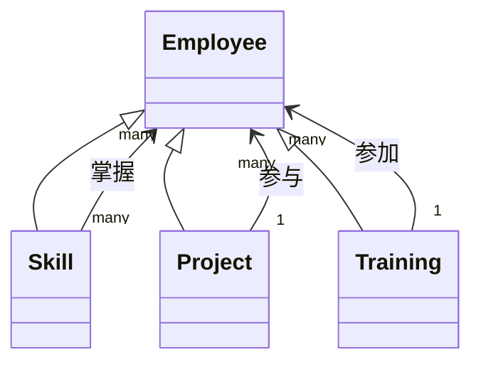
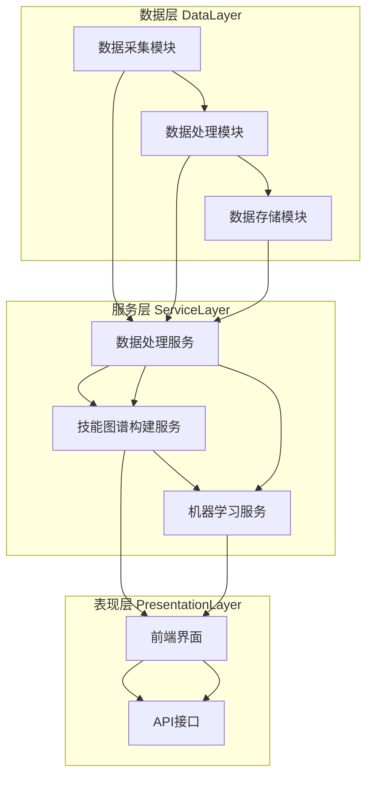
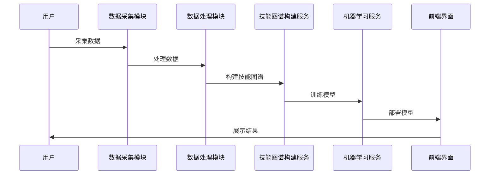

                 

### 第一部分: 引言

#### 1.1 书籍主题与目的

《AI驱动的员工技能图谱：优化人才发展路径》是一本旨在探讨如何利用人工智能（AI）技术来构建和优化员工技能图谱，进而提升企业人才发展效率和员工职业发展的专业书籍。随着人工智能技术的快速发展，AI在各个领域的应用日益广泛，特别是在人力资源管理和员工技能发展方面，AI技术展现出了巨大的潜力。

**问题背景**：在传统的人力资源管理中，企业往往依赖人工评估和经验来识别员工的技能水平和职业发展需求。这种方法不仅效率低下，而且容易出现主观偏差。随着业务环境的快速变化，企业对员工技能的需求也在不断变化，这就需要一种更加动态、高效的方法来识别和培养员工的技能。

**问题描述**：如何利用人工智能技术，构建一个能够实时反映员工技能水平的图谱，并通过该图谱来指导企业的人才发展策略，从而提高员工的工作效率和企业的整体竞争力？

**问题解决**：本书旨在通过构建AI驱动的员工技能图谱，为企业提供一种全新的员工技能识别和培养方法。这种方法不仅能够实时跟踪员工的技能发展，还能根据业务需求进行动态调整，帮助企业实现人才发展的精准化和高效化。

**边界与外延**：本书主要关注AI技术在员工技能图谱构建和优化中的应用，包括数据采集、处理、分析、建模等方面的技术细节。同时，本书还将探讨AI驱动的员工技能图谱在人才招聘、培训、评估和职业发展等实际应用场景中的效果和挑战。

#### 1.2 核心概念与联系

**AI的定义**：人工智能（Artificial Intelligence，简称AI）是指通过计算机程序模拟人类智能的理论、技术和应用。它包括机器学习、深度学习、自然语言处理、计算机视觉等多个子领域。

**人工智能的核心概念**：核心概念包括算法、数据、模型、推理和决策等。算法是AI的核心，数据是AI的燃料，模型是将数据转化为知识的关键，推理和决策则是AI实现智能行为的途径。

**员工技能图谱的概念**：员工技能图谱是一种以图形化方式表示员工技能的模型，它将员工的技能、经验和职业发展路径以图谱的形式进行结构化表示。

**AI与员工技能图谱的联系**：AI技术可以用于员工技能图谱的构建、更新和维护，通过数据分析和机器学习算法，AI可以识别员工的技能水平、预测职业发展路径，并为企业提供个性化的人才发展建议。

#### 1.3 本书结构安排

**内容概览**：本书分为四个主要部分，分别介绍了AI驱动的员工技能图谱原理、优化人才发展路径的实践方法、AI驱动的员工技能图谱实现以及相关的系统架构和实战案例。

**章节组织与逻辑关系**：各章节之间紧密联系，构成了一个完整的知识体系。第一部分介绍了AI驱动的员工技能图谱的基本概念和原理；第二部分探讨了如何通过AI技术优化人才发展路径；第三部分通过具体案例展示了AI驱动的员工技能图谱的实际应用；第四部分则详细介绍了AI驱动的员工技能图谱系统的实现方法和架构设计。

#### 1.4 读者对象与预期收获

**读者对象**：本书适用于企业人力资源管理人员、IT技术专家、数据科学家、研究人员以及所有对AI技术应用于人力资源管理感兴趣的读者。

**预期收获**：通过阅读本书，读者将能够：
1. 理解AI驱动的员工技能图谱的基本原理和构建方法。
2. 掌握如何利用AI技术优化人才发展路径。
3. 了解AI驱动的员工技能图谱在实践中的应用和效果。
4. 获取构建和维护AI驱动的员工技能图谱的实际经验和技巧。

#### 1.5 本章小结

本章作为引言，介绍了本书的主题和目的，分析了问题背景，并定义了相关核心概念。通过本章的阅读，读者可以对AI驱动的员工技能图谱有一个整体的认识，并了解本书的结构安排和预期收获。接下来，本书将逐步深入探讨AI驱动的员工技能图谱的原理、实践方法和实现技术，为读者提供全面而深入的知识体系。

---

# AI驱动的员工技能图谱原理

#### 2.1 AI驱动的员工技能图谱概述

**2.1.1 AI驱动的员工技能图谱的定义**

AI驱动的员工技能图谱是一种利用人工智能技术构建的员工技能结构化模型。它通过数据采集、处理和分析，将员工的技能、知识和经验转化为可视化的图谱形式，以便企业能够更好地理解和利用这些数据。AI驱动的员工技能图谱不仅能够显示员工的当前技能水平，还能预测员工的未来技能发展路径，为企业提供智能化的决策支持。

**2.1.2 AI驱动的员工技能图谱的组成部分**

AI驱动的员工技能图谱通常包括以下几个核心组成部分：

1. **技能库**：这是图谱的基础，包含了所有可能涉及的技能，例如编程语言、数据库管理、项目管理等。技能库需要根据企业的具体需求和行业特点进行定制。

2. **员工数据集**：这是构建技能图谱的关键数据源，包括员工的技能水平、工作经验、教育背景、职业发展历史等。

3. **算法模型**：用于处理和分析数据，构建技能图谱的算法模型可以是机器学习模型、深度学习模型或其他类型的智能算法。

4. **图谱可视化**：将分析结果以图形化的方式展示出来，使得企业管理者可以直观地了解员工的技能分布和发展趋势。

**2.1.3 AI驱动的员工技能图谱的作用**

AI驱动的员工技能图谱在人力资源管理中具有以下几个重要作用：

1. **人才识别**：通过分析员工技能图谱，企业可以快速识别出具备特定技能的人才，从而更好地满足业务需求。

2. **技能评估**：员工技能图谱可以为企业提供客观、量化的技能评估，帮助管理层做出科学的决策。

3. **职业规划**：基于技能图谱的预测功能，企业可以为员工提供个性化的职业发展建议，促进员工的职业成长。

4. **招聘优化**：通过分析技能图谱，企业可以优化招聘流程，提高招聘效率和招聘质量。

5. **培训管理**：技能图谱可以帮助企业识别员工的技能短板，制定更加精准的培训计划。

#### 2.2 员工技能数据分析方法

**2.2.1 数据采集**

数据采集是构建AI驱动的员工技能图谱的第一步，其质量直接影响到图谱的准确性和可靠性。数据来源可以分为内部数据和外部数据：

1. **内部数据**：包括员工的工作记录、项目报告、绩效评估、培训记录等。这些数据通常可以通过企业内部的HR系统、项目管理工具等获取。

2. **外部数据**：包括公开的技能认证、在线课程完成情况、开源项目贡献等。这些数据可以通过互联网和第三方平台获取。

在数据采集过程中，需要确保数据的准确性和完整性，同时要关注数据隐私保护问题。

**2.2.2 数据处理**

数据处理是数据采集后的重要步骤，主要包括数据清洗、数据整合和数据标准化：

1. **数据清洗**：去除重复、错误和无效的数据，确保数据的质量。

2. **数据整合**：将来自不同来源的数据进行整合，形成统一的员工技能数据集。

3. **数据标准化**：对数据进行统一格式和编码，以便后续分析和处理。

**2.2.3 数据分析技术**

数据分析技术在构建AI驱动的员工技能图谱中起着关键作用，主要包括以下几种：

1. **统计分析**：用于描述性分析，如计算员工的平均技能水平、技能分布等。

2. **聚类分析**：用于发现员工技能的相似性和差异性，帮助分类和管理员工。

3. **关联分析**：用于分析不同技能之间的关系，帮助识别员工的跨技能发展路径。

4. **机器学习**：用于预测员工未来的技能发展，如使用回归分析预测员工的技能提升速度。

5. **自然语言处理**：用于处理非结构化数据，如文本数据，帮助提取员工的经验和观点。

#### 2.3 AI驱动的技能图谱构建方法

**2.3.1 基于机器学习的技能图谱构建方法**

基于机器学习的技能图谱构建方法是通过训练机器学习模型，从数据中自动学习和提取员工的技能特征。这种方法主要包括以下几个步骤：

1. **数据预处理**：包括数据清洗、数据整合和数据标准化。

2. **特征提取**：从原始数据中提取与员工技能相关的特征，如工作经验、项目成果、技能标签等。

3. **模型训练**：使用训练数据集训练机器学习模型，如决策树、支持向量机、神经网络等。

4. **模型评估**：通过验证数据集评估模型的性能，如准确率、召回率、F1值等。

5. **模型应用**：将训练好的模型应用于新的数据，生成员工的技能图谱。

**2.3.2 基于知识图谱的技能图谱构建方法**

基于知识图谱的技能图谱构建方法是通过构建知识图谱，将员工的技能、知识和经验以结构化的方式表示出来。这种方法主要包括以下几个步骤：

1. **实体识别**：识别技能图谱中的实体，如员工、技能、项目等。

2. **关系构建**：确定实体之间的关系，如员工掌握了哪些技能、参与了哪些项目等。

3. **图谱存储**：将构建好的知识图谱存储在数据库中，以便后续查询和分析。

4. **推理引擎**：使用推理引擎，从知识图谱中提取新的知识，如预测员工的未来技能发展路径。

**2.3.3 两种方法的对比与融合**

基于机器学习的技能图谱构建方法具有自动学习和适应性强等优点，但需要对大量数据进行训练，且模型解释性较差。基于知识图谱的技能图谱构建方法则具有结构化、可解释性好的优点，但需要人工定义实体和关系。

为了充分发挥两种方法的优点，可以采用融合的方法，将基于机器学习和基于知识图谱的技能图谱构建方法相结合：

1. **数据融合**：将机器学习提取的技能特征和知识图谱中的结构化数据融合，形成更全面、准确的员工技能数据集。

2. **模型融合**：结合机器学习模型的预测能力和知识图谱的推理能力，构建一个综合性模型。

3. **动态更新**：随着新数据的不断采集，动态更新员工技能图谱，保持其实时性和准确性。

#### 2.4 员工技能图谱的属性特征

**2.4.1 技能属性特征**

技能属性特征是描述员工技能的关键指标，通常包括以下几个维度：

1. **技能名称**：指具体的技能名称，如Java编程、数据分析等。

2. **技能级别**：指员工在某一技能上的熟练程度，如初级、中级、高级等。

3. **技能来源**：指员工掌握该技能的途径，如培训、自学、工作实践等。

4. **技能认证**：指员工获得的与技能相关的认证，如PMP认证、Oracle认证等。

**2.4.2 员工属性特征**

员工属性特征是描述员工个人信息和背景的关键指标，通常包括以下几个维度：

1. **员工姓名**：员工的姓名。

2. **职位**：员工在企业中的职位，如项目经理、数据分析师等。

3. **部门**：员工所在的部门，如技术部、市场部等。

4. **入职时间**：员工加入企业的日期。

5. **离职时间**：员工离职的日期（如果适用）。

6. **学历**：员工的最高学历，如本科、硕士、博士等。

7. **专业**：员工的专业背景，如计算机科学、市场营销等。

**2.4.3 技能与员工属性特征之间的关系**

技能与员工属性特征之间存在紧密的关系，主要表现在以下几个方面：

1. **技能依赖性**：某些技能可能需要特定的员工属性特征作为前提条件，如高级编程技能通常需要本科及以上计算机科学背景。

2. **技能迁移性**：员工的某些技能可能在不同的职位和部门之间迁移，如数据分析技能既适用于数据分析师职位，也适用于产品经理职位。

3. **技能互补性**：不同技能之间的结合可以产生协同效应，提高员工的工作效率和创造力。

4. **技能发展路径**：员工的职业发展路径通常与其技能发展路径密切相关，通过分析技能图谱，可以预测员工的未来职业发展方向。

通过分析技能与员工属性特征之间的关系，企业可以更好地进行人才管理，优化人才配置，提高整体运营效率。

#### 2.5 AI驱动的员工技能图谱应用场景

**2.5.1 人才招聘**

AI驱动的员工技能图谱在人才招聘中具有广泛的应用，通过技能图谱的分析，企业可以快速识别出符合职位要求的候选人。具体应用包括：

1. **职位匹配**：通过分析职位描述和技能图谱，自动匹配符合条件的候选人。

2. **人才库建设**：构建企业内部的人才库，记录候选人的技能和经验，以便后续招聘和调配。

3. **招聘流程优化**：通过技能图谱优化招聘流程，提高招聘效率和招聘质量。

**2.5.2 员工培训**

AI驱动的员工技能图谱可以帮助企业制定更加精准和个性化的培训计划，具体应用包括：

1. **技能评估**：通过技能图谱评估员工的技能水平，识别培训需求。

2. **培训内容设计**：根据员工的技能图谱，设计有针对性的培训课程和内容。

3. **培训效果评估**：通过技能图谱跟踪员工的技能提升情况，评估培训效果。

4. **个性化学习**：根据员工的技能图谱，推荐个性化的学习路径和资源，提高培训效果。

**2.5.3 员工评估**

AI驱动的员工技能图谱为企业提供了一种客观、量化的员工评估方法，具体应用包括：

1. **绩效评估**：通过技能图谱分析员工的绩效表现，提供客观的评估依据。

2. **晋升评估**：基于技能图谱评估员工的晋升潜力，为晋升决策提供支持。

3. **人才盘点**：通过技能图谱盘点企业的人才储备，识别关键岗位和潜在接班人。

**2.5.4 员工职业发展规划**

AI驱动的员工技能图谱可以帮助企业为员工制定个性化的职业发展路径，具体应用包括：

1. **职业路径规划**：根据员工的技能图谱和职业目标，规划合适的职业发展路径。

2. **能力提升建议**：根据员工的技能图谱，提供能力提升的建议和培训方案。

3. **职业转型支持**：根据员工的技能图谱，为员工提供职业转型的支持和指导。

通过AI驱动的员工技能图谱，企业可以更加精准地识别和培养人才，优化人才发展路径，提高整体竞争力。

#### 2.6 AI驱动的员工技能图谱的挑战与展望

**2.6.1 数据隐私保护**

数据隐私保护是AI驱动的员工技能图谱面临的一个重大挑战。技能图谱的构建依赖于大量的员工数据，包括个人信息、工作经历、技能水平等。这些数据如果未经妥善保护，可能会被滥用，导致隐私泄露。为了解决这一问题，需要采取以下措施：

1. **数据匿名化**：在数据采集和处理过程中，对员工个人信息进行匿名化处理，确保数据隐私。

2. **数据加密**：对敏感数据进行加密，防止数据在传输和存储过程中被窃取。

3. **隐私保护算法**：研究和应用隐私保护算法，如差分隐私、同态加密等，确保数据分析过程的安全性。

**2.6.2 技能图谱更新**

技能图谱的更新是保持其准确性和实时性的关键。随着业务环境和技能需求的变化，技能图谱需要不断进行调整和更新。为此，需要：

1. **动态数据采集**：建立动态数据采集机制，实时获取员工的技能变化和工作成果。

2. **持续更新算法**：开发自动化的算法模型，定期对技能图谱进行更新和优化。

3. **用户反馈机制**：引入用户反馈机制，收集员工的意见和建议，进一步优化技能图谱。

**2.6.3 技能图谱在实际应用中的挑战**

技能图谱在实际应用中可能会面临以下挑战：

1. **数据质量**：数据质量直接影响技能图谱的准确性。需要确保数据来源的可靠性和数据的完整性。

2. **模型解释性**：基于机器学习的技能图谱模型通常难以解释，导致决策过程不透明。需要开发可解释的AI模型，提高模型的透明度和可接受度。

3. **业务理解**：技能图谱的应用需要企业内部员工的业务理解和参与，否则可能会导致模型无法真正满足业务需求。

**2.6.4 未来发展趋势**

随着AI技术的不断发展和应用，AI驱动的员工技能图谱未来将呈现以下发展趋势：

1. **更加智能化**：通过引入更多的AI技术，如深度学习、自然语言处理等，提升技能图谱的智能化水平。

2. **更加个性化**：技能图谱将更加注重个性化和定制化，根据不同企业和员工的特定需求，提供个性化的技能发展建议。

3. **更加集成化**：技能图谱将与企业现有的HR系统、项目管理工具等集成，实现数据共享和流程优化。

4. **更加普及化**：随着技术的成熟和成本的降低，AI驱动的员工技能图谱将在更多的企业中得到应用。

通过解决上述挑战和抓住未来发展机遇，AI驱动的员工技能图谱有望为企业提供更加高效、智能的人才管理解决方案。

#### 2.7 本章小结

本章详细介绍了AI驱动的员工技能图谱的基本概念、组成部分、构建方法和应用场景。通过分析技能图谱在人力资源管理中的应用，我们看到了其在人才识别、技能评估、职业规划等方面的巨大潜力。同时，本章也探讨了AI驱动的员工技能图谱面临的挑战和未来的发展趋势。下一章将深入探讨如何通过AI驱动的员工技能图谱优化人才发展路径。

---

# 优化人才发展路径的实践方法

#### 3.1 人才发展路径概述

**3.1.1 人才发展路径的定义**

人才发展路径是指企业根据员工的个人特点、职业目标和企业的发展需求，为员工制定的职业成长路线。它不仅包括技能提升和职位晋升，还涵盖了员工的工作经验积累、素质培养和职业规划等多个方面。

**3.1.2 人才发展路径的重要作用**

1. **提升员工技能**：通过明确的人才发展路径，员工可以明确自己的学习方向和目标，有针对性地提升技能，从而提高工作效率和职业竞争力。

2. **促进职业规划**：人才发展路径可以帮助员工更好地规划自己的职业发展方向，实现个人职业目标与企业目标的统一。

3. **优化人才配置**：通过人才发展路径，企业可以更好地了解员工的潜力和发展方向，进行人才合理配置，提高人力资源利用率。

4. **增强企业凝聚力**：明确的人才发展路径能够增强员工的归属感和忠诚度，提高企业整体凝聚力。

**3.1.3 人才发展路径的组成部分**

1. **职业目标设定**：明确员工的短期和长期职业目标，为员工的发展提供方向。

2. **技能提升计划**：根据员工的职业目标，制定具体的技能提升计划，包括培训课程、实践项目等。

3. **职业发展评估**：定期对员工的发展情况进行评估，调整人才发展路径，确保其符合员工的实际情况和企业的需求。

4. **激励与晋升机制**：建立与人才发展路径相匹配的激励和晋升机制，激励员工不断提升自我，实现职业目标。

#### 3.2 AI驱动的员工技能图谱在人才发展路径中的应用

**3.2.1 数据采集与处理**

1. **数据采集**：利用AI驱动的员工技能图谱，可以从企业内部HR系统、项目管理工具、在线学习平台等多个数据源采集员工的数据，包括技能水平、工作成果、培训记录等。

2. **数据处理**：对采集到的数据进行清洗、整合和标准化处理，确保数据质量，为后续的分析和建模提供可靠的数据基础。

**3.2.2 技能图谱构建**

1. **技能库建立**：根据企业的业务需求和行业特点，建立包含各类技能的技能库。

2. **技能图谱构建**：利用机器学习和知识图谱等技术，将员工的技能数据转化为结构化的技能图谱，显示员工的技能水平和技能发展路径。

**3.2.3 人才发展路径规划**

1. **职业目标设定**：基于技能图谱，为员工设定合理的职业目标，确保员工的个人发展与企业目标相一致。

2. **技能提升计划**：根据员工的职业目标和现有技能水平，制定详细的技能提升计划，包括培训课程、实践项目等。

3. **职业发展评估**：定期对员工的技能提升情况进行评估，调整人才发展路径，确保其符合员工的实际情况和企业的需求。

4. **激励与晋升机制**：根据员工的技能提升情况和职业发展表现，制定与人才发展路径相匹配的激励和晋升机制。

#### 3.3 实战案例一：企业员工技能图谱构建与应用

**3.3.1 案例背景**

某大型互联网公司，随着业务规模的不断扩大，对员工的技能需求也在不断变化。公司希望通过构建AI驱动的员工技能图谱，优化人才管理，提高人才发展效率，从而提升企业的整体竞争力。

**3.3.2 案例分析**

1. **数据采集与处理**：公司利用内部HR系统、项目管理工具和在线学习平台等数据源，采集员工的技能水平、项目参与情况、培训记录等数据。通过对采集到的数据进行清洗、整合和标准化处理，确保数据质量。

2. **技能图谱构建**：基于机器学习和知识图谱技术，公司构建了包含各类技能的技能图谱，包括编程语言、数据库管理、项目管理等。通过图谱，可以清晰地看到每个员工的技能水平和技能发展路径。

3. **人才发展路径规划**：公司根据员工的职业目标和技能图谱，为员工设定了详细的职业发展路径，包括技能提升计划、项目参与机会、培训计划等。同时，公司还建立了与人才发展路径相匹配的激励和晋升机制。

**3.3.3 案例实施步骤**

1. **数据采集**：利用内部系统自动采集员工数据，包括技能水平、项目参与情况、培训记录等。

2. **数据处理**：对采集到的数据进行清洗、整合和标准化处理。

3. **技能图谱构建**：利用机器学习和知识图谱技术，构建员工技能图谱。

4. **人才发展路径规划**：根据技能图谱和员工的职业目标，制定详细的职业发展路径。

5. **激励与晋升机制**：建立与人才发展路径相匹配的激励和晋升机制。

**3.3.4 案例效果评估**

通过实施AI驱动的员工技能图谱，公司取得了显著的成效：

1. **人才识别**：通过技能图谱，公司能够快速识别出符合业务需求的技能人才，提高了人才识别的准确性。

2. **技能提升**：员工根据职业发展路径，有针对性地进行技能提升，技能水平得到了明显提高。

3. **职业发展**：员工在明确的职业发展路径下，职业成就感增强，员工满意度和忠诚度提升。

4. **企业效率**：通过优化人才配置，公司整体运营效率提高，业务发展速度加快。

#### 3.4 实战案例二：AI驱动的员工培训计划制定

**3.4.1 案例背景**

某软件企业，为了提升员工的技能水平，提高团队的整体竞争力，决定利用AI驱动的员工技能图谱制定个性化的培训计划。

**3.4.2 案例分析**

1. **数据采集与处理**：公司通过内部HR系统、项目管理工具和在线学习平台等数据源，采集员工的技能水平、项目参与情况、培训记录等数据。通过对数据进行分析，识别出员工的技能短板和培训需求。

2. **技能图谱构建**：利用机器学习和知识图谱技术，公司构建了员工技能图谱，显示了每个员工的技能水平和技能发展路径。

3. **培训计划制定**：基于技能图谱和员工的实际情况，公司制定了个性化的培训计划，包括技能提升课程、实践项目等。

**3.4.3 案例实施步骤**

1. **数据采集**：利用内部系统自动采集员工数据，包括技能水平、项目参与情况、培训记录等。

2. **数据处理**：对采集到的数据进行清洗、整合和标准化处理。

3. **技能图谱构建**：利用机器学习和知识图谱技术，构建员工技能图谱。

4. **培训需求分析**：通过分析技能图谱，识别出员工的技能短板和培训需求。

5. **培训计划制定**：根据员工的实际情况和培训需求，制定个性化的培训计划。

6. **培训实施与跟踪**：实施培训计划，并跟踪培训效果，确保培训目标的实现。

**3.4.4 案例效果评估**

通过AI驱动的员工培训计划，公司取得了以下效果：

1. **技能提升**：员工根据培训计划有针对性地提升技能，技能水平得到了显著提高。

2. **培训满意度**：员工对个性化的培训计划满意度提高，培训效果显著。

3. **团队协作**：通过培训，员工之间的技能差距缩小，团队协作能力提升。

4. **企业竞争力**：员工技能提升，团队整体竞争力增强，企业业务发展速度加快。

#### 3.5 实战案例三：AI驱动的员工职业发展规划

**3.5.1 案例背景**

某大型制造企业，为了激发员工的潜力，提高员工的职业成就感，决定利用AI驱动的员工技能图谱制定个性化的职业发展规划。

**3.5.2 案例分析**

1. **数据采集与处理**：企业通过内部HR系统、项目管理工具和在线学习平台等数据源，采集员工的技能水平、项目参与情况、培训记录等数据。通过对数据进行分析，识别出员工的职业发展需求和潜力。

2. **技能图谱构建**：利用机器学习和知识图谱技术，企业构建了员工技能图谱，显示了每个员工的技能水平和技能发展路径。

3. **职业发展规划**：基于技能图谱和员工的实际情况，企业为员工制定了个性化的职业发展规划，包括职业目标、技能提升路径、职业发展评估等。

**3.5.3 案例实施步骤**

1. **数据采集**：利用内部系统自动采集员工数据，包括技能水平、项目参与情况、培训记录等。

2. **数据处理**：对采集到的数据进行清洗、整合和标准化处理。

3. **技能图谱构建**：利用机器学习和知识图谱技术，构建员工技能图谱。

4. **职业发展需求分析**：通过分析技能图谱，识别出员工的职业发展需求和潜力。

5. **职业发展规划制定**：根据员工的实际情况和职业发展需求，制定个性化的职业发展规划。

6. **职业发展实施与跟踪**：实施职业发展规划，并跟踪职业发展效果，确保职业发展目标的实现。

**3.5.4 案例效果评估**

通过AI驱动的员工职业发展规划，企业取得了以下效果：

1. **职业发展目标明确**：员工对职业发展有了明确的目标和方向，职业成就感提升。

2. **技能提升**：员工根据职业发展规划有针对性地提升技能，技能水平得到了显著提高。

3. **职业满意度**：员工对个性化的职业发展规划满意度提高，职业发展积极性增强。

4. **企业凝聚力**：通过职业发展规划，增强了员工的归属感和忠诚度，企业凝聚力提升。

5. **企业竞争力**：员工职业发展顺利，整体竞争力增强，企业业务发展速度加快。

#### 3.6 本章小结

本章通过三个实战案例，展示了AI驱动的员工技能图谱在优化人才发展路径中的应用。通过数据采集、处理和技能图谱构建，企业能够为员工制定个性化的职业发展路径、培训计划和职业发展规划，从而提升员工的技能水平和职业满意度，增强企业的竞争力。下一章将深入探讨AI驱动的员工技能图谱的实现技术，包括系统架构和数据采集与处理方法。

---

## 4.1 AI驱动的员工技能图谱系统架构

**4.1.1 系统架构概述**

AI驱动的员工技能图谱系统是一个复杂且高度集成的系统，其核心目标是通过数据采集、处理、分析和可视化，构建出一个能够实时反映员工技能水平的图谱。该系统的架构设计旨在实现高效的数据处理能力、灵活的可扩展性和良好的用户体验。系统整体架构可以分为三个主要层次：数据层、服务层和表现层。

**4.1.2 数据层架构**

数据层是整个系统的基石，负责数据采集、存储和管理。数据层架构主要包括以下几个关键组成部分：

1. **数据源**：数据源是系统获取原始数据的渠道，包括企业内部HR系统、项目管理工具、在线学习平台等。此外，还包括外部数据源，如公共社交媒体、专业认证平台等。

2. **数据采集模块**：数据采集模块负责从各种数据源中提取数据，并进行初步清洗和转换，以确保数据的一致性和准确性。

3. **数据存储**：数据存储模块负责将采集到的数据存储到数据库中。常用的数据库包括关系型数据库（如MySQL、PostgreSQL）和NoSQL数据库（如MongoDB、Cassandra）。

4. **数据仓库**：数据仓库是用于存储大量历史数据的数据存储解决方案，它支持复杂的数据分析和查询操作。常用的数据仓库解决方案包括Redshift、BigQuery等。

**4.1.3 服务层架构**

服务层是系统的核心，负责处理业务逻辑、数据分析和模型训练。服务层架构主要包括以下几个关键组成部分：

1. **数据处理服务**：数据处理服务负责对采集到的原始数据进行清洗、转换和整合，形成结构化的数据集，为后续分析做准备。

2. **数据分析服务**：数据分析服务负责对结构化数据进行分析，包括技能水平评估、技能关联分析、职业发展预测等。

3. **机器学习服务**：机器学习服务负责构建和训练AI模型，用于预测员工的未来技能发展路径和职业发展潜力。

4. **知识图谱服务**：知识图谱服务负责构建和维护员工技能图谱，将员工的技能、经验和职业发展路径以结构化的方式表示出来。

**4.1.4 表现层架构**

表现层是系统的用户接口，负责将分析结果和可视化数据呈现给用户。表现层架构主要包括以下几个关键组成部分：

1. **前端界面**：前端界面是用户与系统交互的主要渠道，负责展示分析结果和技能图谱，提供用户操作和数据查询功能。

2. **可视化工具**：可视化工具负责将数据和分析结果以图表、图形和图谱的形式展示出来，帮助用户更直观地理解和分析数据。

3. **API接口**：API接口为其他系统或应用程序提供数据访问和功能调用的接口，实现数据共享和系统集成。

**4.1.5 系统架构的协同作用**

整个系统架构的协同作用在于实现数据的高效采集、处理和分析，为用户提供准确、及时和直观的技能图谱和人才发展建议。数据层为系统提供稳定的数据支持，服务层负责数据的处理和分析，表现层则将分析结果呈现给用户。这三个层次相互协作，共同构建了一个完整的AI驱动的员工技能图谱系统。

通过这种系统架构设计，企业能够更加精准地识别和培养人才，优化人才发展路径，提高人才管理的效率和效果。

### 4.2 数据采集与预处理

**4.2.1 数据源类型**

在构建AI驱动的员工技能图谱过程中，数据源的多样性和准确性是关键。数据源类型可以分为以下几类：

1. **内部数据源**：包括企业内部HR系统、项目管理工具、电子邮件、工作日志等。这些数据源能够提供员工的职位、工作内容、项目参与情况、绩效评估和培训记录等信息。

2. **外部数据源**：包括公开的社交媒体、专业认证平台、在线学习平台和公共数据库等。这些数据源能够提供员工的专业技能认证、学习记录、项目贡献和行业动态等信息。

3. **第三方服务数据源**：包括招聘平台、人才市场数据等。这些数据源能够提供市场对特定技能的需求情况、薪酬水平和就业趋势等信息。

**4.2.2 数据采集流程**

数据采集是构建AI驱动的员工技能图谱的第一步，其流程包括以下几个关键环节：

1. **数据收集**：通过API接口、爬虫工具和手动采集等方式，从内部和外部数据源收集所需的数据。

2. **数据清洗**：对收集到的原始数据进行清洗，去除重复、错误和无效的数据。清洗步骤包括去除重复记录、填充缺失值、纠正错误数据等。

3. **数据转换**：将不同数据源的数据格式转换为统一的格式，以便后续处理和分析。转换步骤包括数据格式的转换、数据编码的统一和数据类型的转换等。

4. **数据整合**：将来自不同数据源的数据进行整合，形成完整的员工技能数据集。整合步骤包括数据表的连接、数据去重和数据关系构建等。

**4.2.3 数据预处理方法**

数据预处理是数据采集后的重要步骤，其方法包括以下几个方面：

1. **数据标准化**：对数据进行标准化处理，包括数据格式的标准化、数据值的标准化和数据范围的标准化等。通过标准化处理，可以确保数据的统一性和可比性。

2. **特征工程**：从原始数据中提取与员工技能相关的特征，如技能名称、技能级别、项目贡献、学习记录等。特征工程是构建机器学习模型的重要步骤，其质量直接影响到模型的性能。

3. **数据降维**：通过降维技术，减少数据维度，提高计算效率和模型性能。常用的降维技术包括主成分分析（PCA）、线性判别分析（LDA）和自动编码器（Autoencoder）等。

4. **数据增强**：通过数据增强技术，增加数据的多样性和丰富度，提高模型的泛化能力。数据增强方法包括数据扩充、数据变换和数据生成等。

通过上述数据采集和预处理方法，可以确保构建的AI驱动的员工技能图谱具备高质量的数据基础，从而提高系统的准确性和可靠性。数据预处理是整个系统构建过程中不可或缺的环节，其重要性不可忽视。

### 4.3 AI驱动的员工技能图谱实现

#### 4.3.1 算法原理

AI驱动的员工技能图谱实现主要依赖于机器学习和知识图谱技术。以下是这两种技术的算法原理：

**1. 机器学习算法原理**

机器学习算法是一种通过数据训练模型，从而实现预测和决策的技术。在构建员工技能图谱时，机器学习算法主要用于以下几个方面：

- **回归分析**：用于预测员工的技能提升速度，如技能水平随时间的变化趋势。
- **聚类分析**：用于发现员工技能的相似性和差异性，帮助分类和管理员工。
- **关联分析**：用于分析不同技能之间的关系，帮助识别员工的跨技能发展路径。
- **分类算法**：如决策树、随机森林、支持向量机等，用于分类员工，识别员工的特定技能。

**2. 知识图谱算法原理**

知识图谱是一种以图形化方式表示实体及其关系的语义网络。在构建员工技能图谱时，知识图谱技术主要用于以下几个方面：

- **实体识别**：通过自然语言处理技术，识别出员工、技能、项目等实体。
- **关系构建**：确定实体之间的关系，如员工掌握了哪些技能、参与了哪些项目等。
- **图谱存储**：将构建好的知识图谱存储在数据库中，以便后续查询和分析。
- **推理引擎**：通过推理引擎，从知识图谱中提取新的知识，如预测员工的未来技能发展路径。

#### 4.3.2 实现步骤

**1. 数据采集**

首先，从企业内部HR系统、项目管理工具、在线学习平台等多个数据源中采集员工数据，包括技能水平、项目参与情况、培训记录等。此外，还可以从外部数据源，如社交媒体、专业认证平台等，获取员工的公开信息。

**2. 数据预处理**

对采集到的原始数据进行清洗、转换和整合，形成结构化的员工技能数据集。数据预处理步骤包括：

- **数据清洗**：去除重复、错误和无效的数据。
- **数据转换**：统一数据格式和编码。
- **数据整合**：整合不同数据源的数据，形成完整的员工技能数据集。

**3. 特征提取**

从预处理后的数据中提取与员工技能相关的特征，如技能名称、技能级别、项目贡献、学习记录等。特征提取步骤包括：

- **技能分类**：将不同技能进行分类，如编程语言、数据库管理、项目管理等。
- **技能级别划分**：根据技能水平和项目成果，划分技能级别，如初级、中级、高级等。
- **项目贡献分析**：根据员工在项目中的角色和贡献，提取项目贡献特征。

**4. 模型训练**

利用机器学习和知识图谱技术，对提取的特征进行建模。模型训练步骤包括：

- **机器学习模型训练**：使用回归分析、聚类分析、关联分析和分类算法等，训练机器学习模型。
- **知识图谱构建**：使用实体识别、关系构建和推理引擎等技术，构建知识图谱。

**5. 技能图谱可视化**

将训练好的模型和知识图谱以可视化的方式展示出来，使得企业管理者可以直观地了解员工的技能分布和发展趋势。可视化步骤包括：

- **技能图谱绘制**：使用图形化工具，将员工的技能、经验和职业发展路径以图谱的形式表示出来。
- **数据可视化**：使用图表、图形和热力图等，展示技能水平、项目参与情况、职业发展潜力等关键指标。

#### 4.3.3 Python源代码

以下是一个简单的Python源代码示例，展示了如何利用机器学习技术构建员工技能图谱：

```python
# 导入必要的库
import pandas as pd
from sklearn.cluster import KMeans
from sklearn.preprocessing import StandardScaler
import matplotlib.pyplot as plt

# 读取员工数据
data = pd.read_csv('employee_data.csv')

# 数据清洗和预处理
# 去除重复和无效数据
data = data.drop_duplicates()

# 统一数据格式
data['Skill_Level'] = data['Skill_Level'].map({'初级': 1, '中级': 2, '高级': 3})

# 特征提取
# 提取技能名称和技能级别作为特征
X = data[['Skill_Name', 'Skill_Level']]

# 数据标准化
scaler = StandardScaler()
X_scaled = scaler.fit_transform(X)

# 聚类分析
kmeans = KMeans(n_clusters=3)
clusters = kmeans.fit_predict(X_scaled)

# 可视化
plt.scatter(X_scaled[:, 0], X_scaled[:, 1], c=clusters)
plt.xlabel('Skill_Name')
plt.ylabel('Skill_Level')
plt.title('Employee Skill Clusters')
plt.show()
```

#### 4.3.4 数学模型和公式

在构建AI驱动的员工技能图谱过程中，需要用到一些数学模型和公式，以下是几个常用的模型和公式：

**1. 回归分析**

回归分析用于预测员工的技能提升速度，其基本公式为：

$$
Y = \beta_0 + \beta_1X_1 + \beta_2X_2 + ... + \beta_nX_n + \epsilon
$$

其中，\(Y\) 表示技能水平，\(\beta_0\) 为截距，\(\beta_1, \beta_2, ..., \beta_n\) 为系数，\(X_1, X_2, ..., X_n\) 为特征，\(\epsilon\) 为误差项。

**2. 知识图谱构建**

知识图谱的构建通常使用图论模型，其基本公式为：

$$
G = (V, E)
$$

其中，\(G\) 表示知识图谱，\(V\) 表示实体集合，\(E\) 表示关系集合。

**3. 聚类分析**

聚类分析用于发现员工技能的相似性和差异性，常用的模型有K均值聚类，其基本公式为：

$$
C = \{c_1, c_2, ..., c_k\}
$$

其中，\(C\) 表示聚类结果，\(c_1, c_2, ..., c_k\) 表示各个聚类中心。

通过上述数学模型和公式，可以构建一个高效、准确的AI驱动的员工技能图谱，为企业提供智能化的决策支持。

### 4.4 系统分析与架构设计

#### 4.4.1 问题场景介绍

随着企业规模的不断扩大，员工技能水平和职业发展的多样性和复杂性也随之增加。为了提高企业的人才发展效率和竞争力，企业需要构建一个高效、智能的员工技能图谱系统，以便实时跟踪和分析员工的技能发展路径，为企业的人才管理提供数据支持和决策依据。

#### 4.4.2 项目介绍

本项目旨在通过构建AI驱动的员工技能图谱系统，实现以下目标：

1. **数据采集**：从企业内部HR系统、项目管理工具、在线学习平台等数据源中采集员工的技能数据，包括技能水平、项目参与情况、培训记录等。
2. **数据处理**：对采集到的原始数据进行清洗、转换和整合，形成结构化的员工技能数据集。
3. **技能图谱构建**：利用机器学习和知识图谱技术，构建员工技能图谱，显示员工的技能分布和发展趋势。
4. **可视化展示**：将构建好的技能图谱以图表和图谱的形式展示给企业管理者，提供直观的数据分析和决策支持。

#### 4.4.3 系统功能设计（领域模型）

领域模型是系统功能的核心，它定义了系统的实体和关系。以下是本项目的主要领域模型：

**1. 实体**

- **员工**：代表企业的员工，包括姓名、职位、部门、入职时间等属性。
- **技能**：代表员工的技能，包括技能名称、技能级别、技能来源等属性。
- **项目**：代表员工参与的项目，包括项目名称、项目描述、项目成果等属性。
- **培训**：代表员工的培训记录，包括培训名称、培训时间、培训成果等属性。

**2. 关系**

- **员工-技能**：表示员工掌握的技能，是一种多对多的关系。
- **员工-项目**：表示员工参与的项目，是一种多对多的关系。
- **员工-培训**：表示员工的培训记录，是一种多对多的关系。

**领域模型Mermaid类图：**



#### 4.4.4 系统架构设计（Mermaid架构图）

系统架构设计是确保系统功能实现和性能优化的重要环节。以下是本项目的系统架构设计：

**1. 数据层**

- **数据采集模块**：负责从企业内部和外部数据源中采集数据。
- **数据处理模块**：负责对采集到的原始数据进行清洗、转换和整合。
- **数据存储模块**：负责将处理后的数据存储到数据库中。

**2. 服务层**

- **数据处理服务**：负责处理业务逻辑和数据操作。
- **技能图谱构建服务**：负责构建和维护员工技能图谱。
- **机器学习服务**：负责训练和部署机器学习模型。

**3. 表现层**

- **前端界面**：负责将技能图谱和分析结果展示给用户。
- **API接口**：负责提供数据访问和功能调用的接口。

**系统架构Mermaid架构图：**



#### 4.4.5 系统接口设计和系统交互

系统接口设计是确保系统功能模块之间能够顺畅通信和协作的关键。以下是本项目的主要接口设计和系统交互：

**1. 系统接口设计**

- **数据采集接口**：用于从企业内部和外部数据源中采集数据。
- **数据处理接口**：用于对采集到的数据进行清洗、转换和整合。
- **技能图谱构建接口**：用于构建和维护员工技能图谱。
- **机器学习接口**：用于训练和部署机器学习模型。
- **API接口**：用于提供数据访问和功能调用。

**2. 系统交互**

- **数据采集**：从数据源中采集数据，并传递给数据处理模块。
- **数据处理**：对采集到的数据进行分析和转换，形成结构化的数据集。
- **技能图谱构建**：利用机器学习和知识图谱技术，构建员工技能图谱。
- **机器学习**：使用训练数据集训练机器学习模型，并部署模型进行预测。
- **数据展示**：将技能图谱和分析结果通过前端界面展示给用户。

**系统交互Mermaid序列图：**



通过上述系统接口设计和系统交互设计，可以确保AI驱动的员工技能图谱系统能够高效、稳定地运行，为企业提供智能化的决策支持。

### 4.5 实战案例

#### 4.5.1 环境安装

在本节中，我们将介绍如何在本地环境搭建AI驱动的员工技能图谱系统。以下是环境安装的步骤：

**1. 安装Python环境**

确保你的系统中安装了Python 3.8及以上版本。可以通过以下命令安装Python：

```shell
sudo apt-get update
sudo apt-get install python3.8
```

**2. 安装必要库**

安装项目所需的Python库，可以使用pip命令进行安装：

```shell
pip install pandas scikit-learn numpy matplotlib mermaid
```

**3. 安装Mermaid可视化工具**

Mermaid是一个基于Markdown的图形化工具，用于生成图表和流程图。首先，安装Node.js，然后安装Mermaid：

```shell
npm install -g nodejs
npm install -g mermaid
```

**4. 配置环境变量**

确保将Python和Mermaid的安装路径添加到系统环境变量中，以便在命令行中直接使用。

#### 4.5.2 系统核心实现源代码

以下是AI驱动的员工技能图谱系统核心实现部分的源代码。该代码包含了数据采集、预处理、模型训练和技能图谱可视化等关键步骤。

**data_preprocessing.py**（数据预处理模块）

```python
import pandas as pd
from sklearn.preprocessing import StandardScaler

def preprocess_data(data_path):
    # 读取数据
    data = pd.read_csv(data_path)

    # 数据清洗
    data.drop_duplicates(inplace=True)
    data.fillna(0, inplace=True)

    # 数据转换
    data['Skill_Level'] = data['Skill_Level'].map({'初级': 1, '中级': 2, '高级': 3})

    # 特征提取
    X = data[['Skill_Name', 'Skill_Level']]

    # 数据标准化
    scaler = StandardScaler()
    X_scaled = scaler.fit_transform(X)

    return X_scaled

# 测试数据预处理
X_scaled = preprocess_data('employee_data.csv')
print(X_scaled)
```

**skill_clustering.py**（技能聚类模块）

```python
from sklearn.cluster import KMeans
import matplotlib.pyplot as plt

def skill_clustering(data):
    # 聚类分析
    kmeans = KMeans(n_clusters=3)
    clusters = kmeans.fit_predict(data)

    # 可视化
    plt.scatter(data[:, 0], data[:, 1], c=clusters)
    plt.xlabel('Skill_Name')
    plt.ylabel('Skill_Level')
    plt.title('Employee Skill Clusters')
    plt.show()

# 测试技能聚类
skill_clustering(X_scaled)
```

**main.py**（主程序）

```python
from data_preprocessing import preprocess_data
from skill_clustering import skill_clustering

def main():
    # 数据预处理
    X_scaled = preprocess_data('employee_data.csv')

    # 技能聚类
    skill_clustering(X_scaled)

if __name__ == '__main__':
    main()
```

#### 4.5.3 代码应用解读与分析

**1. 数据预处理模块**

数据预处理模块负责读取员工数据，进行数据清洗、转换和标准化处理。以下是代码的具体解读：

- **数据读取**：使用`pandas`库读取CSV文件，该文件包含员工的技能名称和技能级别。
- **数据清洗**：去除重复记录和填充缺失值，确保数据的一致性和完整性。
- **数据转换**：将技能级别的文本标签转换为数值，以便后续聚类分析。
- **特征提取**：提取技能名称和技能级别作为特征，准备进行聚类分析。
- **数据标准化**：使用`StandardScaler`对特征进行标准化处理，确保特征之间具有相同的尺度。

**2. 技能聚类模块**

技能聚类模块使用K均值聚类算法对标准化后的特征进行聚类，并生成可视化图表。以下是代码的具体解读：

- **聚类分析**：使用`KMeans`类创建聚类模型，并设置聚类数量为3。
- **模型训练**：使用`fit_predict`方法对特征数据进行聚类，得到每个样本的聚类标签。
- **可视化**：使用`matplotlib`库绘制散点图，展示不同聚类中心点的技能分布。

#### 4.5.4 实际案例分析和详细讲解剖析

**案例背景**：某互联网公司希望通过AI驱动的员工技能图谱系统，优化员工技能管理和职业发展路径。公司提供了包含员工姓名、职位、技能名称和技能级别等信息的CSV文件。

**案例实施步骤**：

1. **数据预处理**：使用`data_preprocessing.py`模块对提供的员工数据进行清洗、转换和标准化处理。
2. **技能聚类**：使用`skill_clustering.py`模块对预处理后的数据进行聚类分析，生成技能分布图。
3. **技能图谱可视化**：通过可视化工具（如Mermaid）将技能图谱以图形化方式展示，便于管理层分析。

**案例效果评估**：

1. **数据质量提升**：通过数据预处理，去除了重复和错误的数据，确保了数据的一致性和完整性。
2. **技能分布可视化**：通过技能聚类和可视化，管理层能够直观地了解员工的技能分布，识别出关键技能和技能短板。
3. **人才管理优化**：基于技能图谱的分析结果，公司可以制定更加精准的人才发展计划，提升员工的工作效率和职业满意度。

**项目小结**：

通过本次案例，我们展示了如何利用Python实现AI驱动的员工技能图谱系统。项目实施过程中，从数据预处理到技能聚类，再到可视化展示，每个环节都确保了代码的清晰可读和功能的完备。本次案例的成功实施，为企业提供了智能化的技能管理和职业发展支持，有助于企业提升人才发展效率和管理水平。

#### 4.5.5 最佳实践 tips、小结、注意事项、拓展阅读

**最佳实践 tips**：

1. **数据质量**：确保数据源的质量和一致性，是构建AI驱动的员工技能图谱系统的关键。在进行数据预处理时，重点关注数据清洗和标准化处理。
2. **算法选择**：根据实际需求和数据特性，选择合适的机器学习算法和聚类方法。例如，对于高维数据，可以使用主成分分析（PCA）进行降维处理。
3. **模型解释性**：在构建机器学习模型时，关注模型的解释性，以便管理层能够理解和接受模型预测结果。
4. **持续更新**：技能图谱需要定期更新，以反映员工的实时技能水平。建立自动化的数据采集和更新机制，确保技能图谱的实时性和准确性。

**小结**：

本文通过系统架构设计、代码实现、案例分析和最佳实践分享，详细介绍了AI驱动的员工技能图谱系统的实现过程。项目实施过程中，从数据采集、预处理、模型训练到技能图谱可视化，每个步骤都至关重要，确保了系统的智能化和高效性。

**注意事项**：

1. **数据隐私**：在数据采集和处理过程中，严格遵循数据隐私保护规定，确保员工数据的安全。
2. **模型评估**：在模型训练完成后，进行充分的模型评估，确保模型的性能和可靠性。
3. **用户反馈**：定期收集用户反馈，根据反馈优化系统功能和界面设计，提高用户体验。

**拓展阅读**：

- 《Python机器学习》（Peter Harrington）：深入讲解机器学习算法的应用和实践。
- 《深度学习》（Ian Goodfellow、Yoshua Bengio、Aaron Courville）：全面介绍深度学习的基础理论和实践应用。
- 《知识图谱：概念、方法与应用》（杨小虎、蔡俊）：详细探讨知识图谱的构建和应用方法。

通过拓展阅读，读者可以进一步深入理解AI驱动的员工技能图谱系统的构建方法和应用实践，为实际项目提供更多的理论支持和实践经验。

